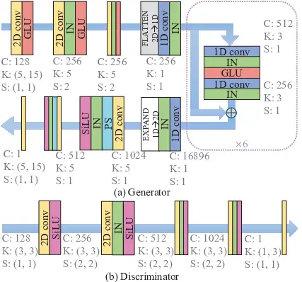
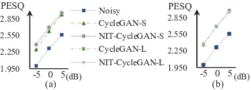
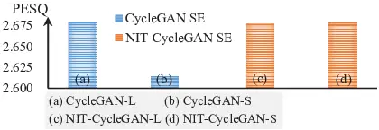

# Speech Enhancement Based on CycleGAN with Noise-informed Training

###### Abstract

Cycle-consistent generative adversarial networks (CycleGAN) were
successfully applied to speech enhancement (SE) tasks with unpaired
noisy–clean training data. The CycleGAN SE system adopted two generators
and two discriminators trained with losses from noisy–to–clean and
clean–to–noisy conversions. CycleGAN showed promising results for
numerous SE tasks. Herein, we investigate a potential limitation of the
clean–to–noisy conversion part and propose a novel noise-informed
training (NIT) approach to improve the performance of the original
CycleGAN SE system. The main idea of the NIT approach is to incorporate
target domain information for clean–to–noisy conversion to facilitate a
better training procedure. The experimental results confirmed that the
proposed NIT approach improved the generalization capability of the
original CycleGAN SE system with a notable margin.

Wen-Yuan Ting¹, Syu-Siang Wang², Hsin-Li Chang³, Borching Su¹ and Yu
Tsao⁴

¹Graduate Institute of Communication Engineering, National Taiwan
University, Taipei, Taiwan  
²Department of Electrical Engineering, Yuan Ze University, Taoyuan,
Taiwan  
³Department of Electrical Engineering, National Central University,
Taoyuan, Taiwan  
⁴Research Center for Information Technology Innovation, Academia Sinica,
Taipei, Taiwan

Index Terms: speech enhancement, weakly supervised learning, CycleGAN,
neural network, noise identity

## 1 Introduction

Owing to recent advances in machine-learning techniques, speech-related
applications have been widely deployed in our daily lives. However, in
real-world scenarios, speech signals are disturbed by environmental
noise, resulting in poor voice quality and low intelligibility, which
limits the performance of downstream tasks. To address this issue,
numerous speech enhancement (SE) techniques have been deployed as
preprocessors to convert noisy speech signals to clean ones \[1, 2\].

Based on the availability of paired noisy-clean speech signals during
training, SE approaches are divided into two categories requiring
different types of data: (1) paired noisy–clean training data and (2)
unpaired noisy–clean training data \[3, 4, 5, 6\]. Approaches in the
first category are referred to as “supervised SE methods.” These methods
learn a mapping function that characterizes the noisy–clean
transformation. At runtime, the mapping function is used to perform
denoising. Recently, deep neural networks \[7, 8\], which have shown the
strong capability for modeling nonlinear transformations, have been used
to form the mapping function for SE and achieve state-of-the-art
enhancement performance. Well-known examples include deep denoising
autoencoders \[9\], convolutional neural networks \[10\], long-short
term memory \[11\], and transformers \[12\]. Identifying a suitable
objective for training the mapping function is another crucial factor
for the overall performance. An objective function is used to compute
the parameters in the mapping function. Popular signal-based distances
include L1 \[13\] and L2 norms \[13\] and SI-SDR \[13\]. Recently,
metric-based objective functions have been widely investigated; e.g.,
the objective functions that aim to enhance speech quality \[14\],
speech intelligibility \[15\], and automatic speech recognition \[16\]
performance have been derived. Although supervised SE methods have shown
promising performance, noisy–clean paired training data may not always
be available in real-world scenarios.

SE methods trained without the need for paired noisy–clean training data
can be divided into two groups. The first group does not require any
clean speech data, and this group of approaches is referred to as
“unsupervised SE methods.” These methods are often based on assumptions
regarding the characteristics of speech and noise signals. Traditional
SE methods such as spectral subtraction \[17\], Wiener filtering \[18\],
and the minimum mean-square error of the spectral amplitude \[19\]
belong to this unsupervised SE group. Recently, deep learning models
have been used for unsupervised SE methods \[20, 21, 22, 23, 24\].
Generally, these approaches perform well in stationary noisy
environments; however, when encountering non-stationary noises, they may
produce subnormal results. The second group of approaches uses both
noisy and clean speech data to prepare a better mapping function from
the two domains, whereas the noisy and clean speech data are not paired.
A well-known group of SE methods that uses unpaired noisy–clean speech
data is the cycle-consistent SE method \[25, 26, 27, 28\].
Cycle-consistent learning was first proposed for unpaired image-to-image
translations \[29\] and has been successfully applied to voice
conversion \[30\]. When applied to unpaired SE methods, cycle-consistent
learning adopts two generators and two discriminators, which can be
viewed as a filter (converting noisy speech to clean speech) and a
corresponding inverse filter (converting clean speech to noisy speech),
and the two discriminators aim to distinguish real samples (real noisy
speech and real clean speech) from fake ones forged by the generators.
Only the filter (converting noisy speech to clean speech) is employed
during testing to perform denoising. Let us take a closer look at the
training stage of cycle-consistent SE methods; the filter is trained to
convert noisy speech into clean speech, and the inverse filter is
trained to convert clean speech into noisy speech. It is suitable for
training the filter because multiple noisy speeches can be used as
input. However, it may be suboptimal for estimating the inverse filter
because no target noise is specified to generate, which consequently
limits the achievable enhancement performance.

Herein, we eliminated this limitation using a series of experiments with
a novel noise-informed training (NIT) approach along with a
cycle-consistent generative adversarial network (CycleGAN), termed
NIT-CycleGAN. The main feature of NIT-CycleGAN is that the target domain
was specified when training the inverse filter. Specifically, a label of
the target domain was appended to the acoustic features of the filter
(and inverse filter) to specify the target domain of the output. The
target domain label indicated whether the target was clean or of a
particular noise type and was represented by a one-hot vector. Compared
with the original CycleGAN, the proposed NIT-CycleGAN used additional
information on the target domain during training. During testing, we
aimed to use a filter to convert noisy speech into clean speech. Thus,
we simply set the target domain label as “clean.” The experimental
results confirmed the effectiveness of the NIT approach. Moreover, it
verified the decent generalization capability of NIT-CycleGAN in unseen
noisy environments.

## 2 Related work

Given a set of noisy acoustic features, $`\mathbf{y}`$, the CycleGAN SE
system adopted a filter to convert $`\mathbf{y}`$ into clean-like
features, which were converted into the original $`\mathbf{y}`$ using an
inverse filter. The filter and inverse filter of CycleGAN are trained
using three losses, namely, adversarial, cycle-consistency, and
identity-mapping losses. For a CycleGAN, generators
$`G^{\mathbf{Y\rightarrow S}}`$ and $`G^{\mathbf{S\rightarrow Y}}`$
performed filter and inverse filter processing, respectively.
Specifically, the generator $`G^{\mathbf{Y\rightarrow S}}`$ was applied
to convert $`\mathbf{y}`$ into clean-like speech $`{\mathbf{s}}`$;
conversely, the generator $`G^{\mathbf{S\rightarrow Y}}`$ performed a
reverse process that converted $`\mathbf{s}`$ into $`{\mathbf{y}}`$. Two
discriminators, $`D^{\mathbf{Y}}`$ and $`D^{\mathbf{S}}`$, were used to
identify whether the generated features were distinguishable from the
real ones.

### 2.1 Cycle-consistency loss

The cycle-consistency loss function $`\mathcal{L}_{\mathrm{cyc}}`$ is
expressed in Eq. (1).

```math
\displaystyle\mathcal{L}_{\mathrm{cyc}} \displaystyle\{G^{\mathbf{S\rightarrow Y}},G^{\mathbf{Y\rightarrow S}},\mathbf{s},\mathbf{y}\}=\mathbb{E}_{\mathbf{s}\sim P_{\mathbf{S}}}\{\|G^{\mathbf{Y\rightarrow S}}(G^{\mathbf{S\rightarrow Y}}(\mathbf{s}))-\mathbf{s}\|_{1}\} \tag{1}
```

```math
\displaystyle+\mathbb{E}_{\mathbf{y}\sim P_{\mathbf{Y}}}\{\|G^{\mathbf{S\rightarrow Y}}(G^{\mathbf{Y\rightarrow S}}(\mathbf{y}))-\mathbf{y}\|_{1}\},
```

where $`\mathbb{E}_{*}\{\cdot\}`$ denotes the expectation operation, and
$`P_{\mathbf{S}}`$ and $`P_{\mathbf{Y}}`$ represents the clean and noisy
domain distributions, respectively. Both generators were trained to
minimize $`\mathcal{L}_{\mathrm{cyc}}`$ in Eq. (1). For CycleGAN SE, one
goal of the cycle-consistency loss function was to regularize
$`G^{\mathbf{S\rightarrow Y}}`$ and $`G^{\mathbf{Y\rightarrow S}}`$ to
preserve acoustic content.

### 2.2 Adversarial loss

To ensure that the generated speech
$`G^{\mathbf{Y\rightarrow S}}(\mathbf{y})`$ and
$`G^{\mathbf{S\rightarrow Y}}(\mathbf{s})`$ were indistinguishable from
clean and noisy data, respectively, two adversarial losses were derived.

#### 2.2.1 First adversarial loss function

Regarding $`G^{\mathbf{Y\rightarrow S}}`$, the first adversarial loss
function is expressed as Eq. (2).

```math
\displaystyle\mathcal{L}_{\mathrm{adv}}^{1} \displaystyle\{D^{\mathbf{S}},G^{\mathbf{Y\rightarrow S}},\mathbf{s},\mathbf{y}\}=\mathbb{E}_{\mathbf{s}\sim P_{\mathbf{S}}}\{log[D^{\mathbf{S}}(\mathbf{s})]\} \tag{2}
```

```math
\displaystyle+\mathbb{E}_{\mathbf{y}\sim P_{\mathbf{Y}}}\{log[1-D^{\mathbf{S}}(G^{\mathbf{Y\rightarrow S}}(\mathbf{y}))]\}.
```

The minimax criterion was applied to $`\mathcal{L}_{\mathrm{adv}}^{1}`$
to iteratively optimize $`G^{\mathbf{Y\rightarrow S}}`$ and
$`D^{\mathbf{S}}`$.

Similarly, the discriminator $`D^{\mathbf{Y}}`$ and generator
$`G^{\mathbf{S\rightarrow Y}}`$ were updated by
$`\mathcal{L}_{\mathrm{adv}}^{1}\{D^{\mathbf{Y}},G^{\mathbf{S\rightarrow Y}},\mathbf{s},\mathbf{y}\}`$.

#### 2.2.2 Second adversarial loss function

Eq. (3) shows the second adversarial loss function.

```math
\displaystyle\mathcal{L}_{\mathrm{adv}}^{2} \displaystyle\{D^{\mathbf{S}},G^{\mathbf{Y\rightarrow S}},G^{\mathbf{S\rightarrow Y}},\mathbf{s}\}=\mathbb{E}_{\mathbf{s}\sim P_{\mathbf{S}}}\{log[D^{\mathbf{S}}(\mathbf{s})]\} \tag{3}
```

```math
\displaystyle+\mathbb{E}_{\mathbf{s}\sim P_{\mathbf{S}}}\{log[1-D^{\mathbf{S}}(G^{\mathbf{Y\rightarrow S}}(G^{\mathbf{S\rightarrow Y}}(\mathbf{s})))]\}.
```

Based on
$`\mathcal{L}_{\mathrm{adv}}^{2}\{D^{\mathbf{S}},G^{\mathbf{Y\rightarrow S}},G^{\mathbf{S\rightarrow Y}},\mathbf{s}\}`$,
we updated $`D^{\mathbf{S}}`$. Similarly,
$`\mathcal{L}_{\mathrm{adv}}^{2}\{D^{\mathbf{Y}},G^{\mathbf{Y\rightarrow S}},G^{\mathbf{S\rightarrow Y}},\mathbf{y}\}`$
was used to update $`D^{\mathbf{Y}}`$. Notably, this loss was used in
\[30\] to improve VC performance.

### 2.3 Identity-mapping loss

Further, to improve the CycleGAN SE system, the identity–mapping loss
function in Eq. (4) was adopted to ensure that the output of a generator
was nearly identical to the input.

```math
\displaystyle\mathcal{L}_{\mathrm{idm}} \displaystyle\{G^{\mathbf{Y\rightarrow S}},G^{\mathbf{S\rightarrow Y}},\mathbf{s},\mathbf{y}\}=\mathbb{E}_{\mathbf{s}\sim P_{\mathbf{S}}}\{\|G^{\mathbf{Y\rightarrow S}}(\mathbf{s})-\mathbf{s}\|_{1}\} \tag{4}
```

```math
\displaystyle+\mathbb{E}_{\mathbf{y}\sim P_{\mathbf{Y}}}\{\|G^{\mathbf{S\rightarrow Y}}(\mathbf{y})-\mathbf{y}\|_{1}\}.
```

## 3 Proposed Method

The proposed NIT-CycleGAN SE system shared the same model architecture
as the original CycleGAN system. Specifically, the NIT-CycleGAN SE
system consisted of a noisy–clean generator,
$`G^{\mathbf{Y\rightarrow S}}`$, a clean–noisy generator,
$`G^{\mathbf{S\rightarrow Y}}`$, and two discriminators,
$`D^{\mathbf{S}}`$ and $`D^{\mathbf{Y}}`$. The main idea of NIT-CycleGAN
is to incorporate the target domain information during training. To this
end, we adopted an auxiliary one-hot vector that indicated the target
domain of the generated speech. For the noisy–clean generator, the
one-hot vector indicated the output target to be “clean.” For the
clean–noisy generator, the one-hot vector indicated the output target to
be “a specific noise type.” Auxiliary vectors were used to provide
target information to govern the generators to convert the source input
into the specified target domain and serve as additional features for
discriminators to identify differences between the original and
generated samples. We concatenated the one-hot vector with each acoustic
feature to form an extended feature in a frame-wise manner. In the
following, we introduce the training and testing stages of NIT-CycleGAN.

### 3.1 Training stage

Like CycleGAN, the NIT-CycleGAN SE system was trained with
(NIT)-cycle-consistency, adversarial, and identity-mapping losses.

#### 3.1.1 Noise-informed-training cycle-consistency loss

Assume that there were $`N`$ different noise types in the training data
and that the noise type for each training utterance was known, we
formulated the auxiliary one-hot vector, $`tn`$, as an
$`(N+1)`$-dimensional vector (one clean with $`N`$ noise types). In this
one-hot vector, a single non-zero element corresponded to the target
domain (a particular noise type). The one-hot vector $`tn`$ was appended
with the acoustic feature $`\mathbf{s}`$, i.e.,
$`\mathbf{s}_{tn}=[tn;\mathbf{s}]`$. Then, this clean input vector
$`\mathbf{s}_{tn}`$ was processed using generator
$`G^{\mathbf{S\rightarrow Y}}`$ to create
$`\mathbf{y}^{\prime}_{tn^{\prime}}=[tn^{\prime};\mathbf{y}^{\prime}]`$.
Notably, the $`tn`$ vector in the input was used to guide the generator
to convert signal $`\mathbf{s}`$ into the designated noise domain. Next,
we replaced $`tn^{\prime}`$ from $`\mathbf{y}^{\prime}_{tn^{\prime}}`$
with a one-hot vector $`tc`$, where the non-zero element indicated that
the target domain was a clean condition. Then, this result denoted as
$`\mathbf{y}^{\prime}_{tc}`$ was passed through
$`G^{\mathbf{Y\rightarrow S}}`$ to generate an enhanced output
$`\mathbf{s}^{\prime}_{tc^{\prime}}`$ with the appended vector
$`tc^{\prime}`$, where $`\mathbf{s}^{\prime}_{tc^{\prime}}`$ was
expected to approximate the ground truth $`\mathbf{s}_{tc}`$. A similar
procedure was conducted by passing a noisy vector $`\mathbf{y}_{tc}`$ to
$`G^{\mathbf{Y\rightarrow S}}`$ and subsequently to
$`G^{\mathbf{S\rightarrow Y}}`$ to obtain
$`\mathbf{y}^{\prime}_{tn^{\prime}}`$. Thus, the NIT-cycle-consistency
loss function can be written as:

```math
\displaystyle\mathcal{L}_{\mathrm{nit-cyc}} \displaystyle\{G^{\mathbf{Y\rightarrow S}},G^{\mathbf{S\rightarrow Y}},\mathbf{s}_{tc},\mathbf{s}_{tn},\mathbf{y}_{tc},\mathbf{y}_{tn}\}= \tag{5}
```

```math
\displaystyle\mathbb{E}_{\mathbf{s}\sim P_{\mathbf{S}}}\{\|G^{\mathbf{Y\rightarrow S}}(G^{\mathbf{S\rightarrow Y}}(\mathbf{s}_{tn}))-\mathbf{s}_{tc}\|_{1}\}+
```

```math
\displaystyle\mathbb{E}_{\mathbf{y}\sim P_{\mathbf{Y}}}\{\|G^{\mathbf{S\rightarrow Y}}(G^{\mathbf{Y\rightarrow S}}(\mathbf{y}_{tc}))-\mathbf{y}_{tn}\|_{1}\}.
```

#### 3.1.2 Noise-informed-training adversarial loss

The objective of the two generators was to generate acoustic features to
deceive the corresponding discriminators. By contrast, the objective of
a discriminator was to learn the detailed differences between real and
generated samples to avoid being fooled by their generators.
NIT-CycleGAN incorporated additional information about the target domain
into the training process. Similar to the original CycleGAN SE system,
two NIT-adversarial losses were used in NIT-CycleGAN.

The NIT-adversarial loss with respect to $`D^{\mathbf{S}}`$ and
$`G^{\mathbf{Y\rightarrow S}}`$ is expressed by Eq. (6) in terms of Eq.
(2).

```math
\displaystyle\mathcal{L}_{\mathrm{nit-adv}}^{1} \displaystyle\{D^{\mathbf{S}},G^{\mathbf{Y\rightarrow S}},\mathbf{s}_{tc},\mathbf{y}_{tc}\}=\mathbb{E}_{\mathbf{s}\sim P_{\mathbf{S}}}\{log[D^{\mathbf{S}}(\mathbf{s}_{tc})]\} \tag{6}
```

```math
\displaystyle+\mathbb{E}_{\mathbf{y}\sim P_{\mathbf{Y}}}\{log[1-D^{\mathbf{S}}(G^{\mathbf{Y\rightarrow S}}(\mathbf{y}_{tc}))]\}.
```

The two models, $`D^{\mathbf{S}}`$ and $`G^{\mathbf{S\rightarrow Y}}`$,
were optimized based on $`\mathcal{L}_{\mathrm{nit-adv}}^{1}`$, in which
$`D^{\mathbf{S}}`$ attempted to maximize
$`\mathcal{L}_{\mathrm{nit-adv}}^{1}`$, whereas
$`G^{\mathbf{Y\rightarrow S}}`$ did the opposite. Notably,
$`D^{\mathbf{S}}`$ identified the difference between the clean vector
$`{\mathbf{s}}_{tc}`$ and enhanced vector
$`\mathbf{s}^{\prime}_{tc^{\prime}}`$ obtained by passing
$`\mathbf{y}_{tc}`$ through the generator
$`G^{\mathbf{Y\rightarrow S}}`$. The predicted vector $`tc^{\prime}`$ in
$`\mathbf{s}^{\prime}_{tc^{\prime}}`$ served as an auxiliary feature for
$`D^{\mathbf{S}}`$. Similarly, the discriminator $`D^{\mathbf{Y}}`$ and
generator $`G^{\mathbf{S\rightarrow Y}}`$ were optimized using the loss
function
$`\mathcal{L}_{\mathrm{nit-adv}}^{1}\{D^{\mathbf{Y}},G^{\mathbf{S\rightarrow Y}},\mathbf{s}_{tn},\mathbf{y}_{tn}\}`$.

Next, Eq. (7) describes the second NIT-adversarial loss with respect to
$`\mathbf{s}_{tc}`$ and $`\mathbf{s}_{tn}`$.

```math
\displaystyle\mathcal{L}_{\mathrm{nit-adv}}^{2} \displaystyle\{D^{\mathbf{S}},G^{\mathbf{Y\rightarrow S}},G^{\mathbf{S\rightarrow Y}},\mathbf{s}_{tn},\mathbf{s}_{tc}\}=\mathbb{E}_{\mathbf{s}\sim P_{\mathbf{S}}}\{log[D^{\mathbf{S}}(\mathbf{s}_{tc})]\} \tag{7}
```

```math
\displaystyle+\mathbb{E}_{\mathbf{s}\sim P_{\mathbf{S}}}\{log[1-D^{\mathbf{S}}(G^{\mathbf{Y\rightarrow S}}(G^{\mathbf{S\rightarrow Y}}(\mathbf{s}_{tn})))]\}.
```

Here, the second NIT-adversarial loss in Eq. (7) was used to optimize
the discriminator $`D^{\mathbf{S}}`$. Similarly, $`D^{\mathbf{Y}}`$ was
estimated using
$`\mathcal{L}_{\mathrm{nit-adv}}^{2}\{D^{\mathbf{Y}},G^{\mathbf{S\rightarrow Y}},G^{\mathbf{Y\rightarrow S}},\mathbf{y}_{tc},\mathbf{y}_{tn}\}`$
applied to the minimax criterion.

#### 3.1.3 Noise-informed-training identity-mapping loss

The NIT-identity-mapping loss function is expressed as:

```math
\displaystyle\mathcal{L}_{\mathrm{nit-idm}} \displaystyle\{G^{\mathbf{Y\rightarrow S}},G^{\mathbf{S\rightarrow Y}},\mathbf{s}_{tc},\mathbf{y}_{tn}\}=\mathbb{E}_{\mathbf{s}\sim P_{\mathbf{S}}}\{\|G^{\mathbf{Y\rightarrow S}}(\mathbf{s}_{tc})-\mathbf{s}_{tc}\|_{1}\} \tag{8}
```

```math
\displaystyle+\mathbb{E}_{\mathbf{y}\sim P_{\mathbf{Y}}}\{\|G^{\mathbf{S\rightarrow Y}}(\mathbf{y}_{tn})-\mathbf{y}_{tn}\|_{1}\}.
```

From the NIT-identity-mapping loss function, the predicted auxiliary
vector at the generator output was expected to be identical to that of
the model input.



Figure 1: Model architectures of (a) generator and (b) discriminator in
both CycleGAN and NIT-CycleGAN SE systems. The notations “C,” “K,” and
“S” represent the output channels, kernel size, and stride of a
convolution layer, respectively.

### 3.2 Testing stage

In the testing stage, since the objective was to generate clean-like
enhanced speech, we assigned the one-hot vector to be “clean” as the
target domain, namely specifying $`tc`$ as an auxiliary input. This
one-hot vector was appended to each frame of the noisy acoustic features
to form extended features. Then, the extended features were passed to
the generator, producing enhanced features ($`\mathbf{s}^{\prime}`$ and
$`tc^{\prime}`$). The enhanced features were combined with the phase of
the noisy speech input and converted into time-domain enhanced speech
signals.

## 4 Experiment and Analysis

### 4.1 Experimental setup

We assessed the proposed NIT-CycleGAN SE system on the Taiwan Mandarin
Hearing in Noise Test dataset \[31\]. The dataset contains 2,560 clean
speech utterances spoken by four male and four female speakers and was
recorded at a 16-kHz sampling rate. Among these utterances, we selected
those spoken by three male and three female speakers to prepare the
training sets. Two training sets were prepared. For the first training
set, termed “Cat-L,” 1,194 clean utterances were contaminated by five
noises (i.e., dwashing, npark, straffic, pcafeter, and tbus);
accordingly, $`N=5`$, as Sec. 3.1 describes, at signal-to-noise ratios
(SNRs) of $`-5`$, $`0`$, and $`5`$ dB. Thus, we prepared 17,910
noisy-clean training pairs. For the second training set, we split 1,194
clean utterances into two parts, and the contents of the utterances in
these two parts are different. Based on the first 597 clean utterances,
we used the same five noise types to generate 8,955
($`597\times 5\times 3`$) noisy utterances at $`-5`$, $`0`$, and $`5`$
dB SNRs. The remaining 597 clean recordings along with the 8,955 noisy
utterances were combined to form the second training set, termed
“Cat-S.” Notably, the data size of “Cat-L” is larger than that of
“Cat-S,” and the contents of clean and noisy utterances are different
for “Cat-S.” We assessed the performance of CycleGAN and NIT-CycleGAN SE
systems using both “Cat-L” and “Cat-S” training sets. The testing set
was prepared using 240 clean utterances spoken by the other male and
female speakers. Each utterance in the testing corpus was deteriorated
by the five noise types used in the training data (matched conditions)
and seven unseen noise types (tmetro, tcar, spsquare, pstation, presto,
ooffice, and nfield) at SNRs of -5, 0, and 5 dB (mismatched conditions).
Consequently, 8,640 noisy utterances were used for the evaluation. Here,
all the noise sources used were collected from DEMAND \[32\].

The frame size and hop length were set at 32 ms and 16 ms, respectively,
to apply the short-time Fourier transform to convert speech waveforms
into 257-dimensional spectral features. Fig. 1 shows the detailed model
architectures for the generators and discriminators, where GLU, SiLU,
IN, and PS represent the gated linear units, sigmoid linear units,
instance normalization, and pixel shuffling processes, respectively. All
networks were trained for 600 epochs using the adaptive moment
estimation (Adam) optimizer with beta values of 0.5 and 0.999. The
learning rates were 0.0002 and 0.0001 for the generators and
discriminators, respectively.

Four objective metrics were used to assess the proposed system: (1)
perceptual evaluation of speech quality (PESQ) \[33\], (2) mean opinion
score (MOS) prediction of speech signal distortion (CSIG) \[34\], (3)
MOS prediction of the intrusiveness of background noise (CBAK) \[34\],
and (4) MOS prediction of the overall effect (COVL) \[34\]. The score
range of PESQ is $`[-0.5,4.5]`$, whereas those of CSIG, CBAK, and COVL
are $`[1,5]`$. Higher scores for PESQ, CSIG, CBAK, and COVL indicate
better sound quality, lower signal distortion, residual noise, and
overall rating, respectively.

### 4.2 The Cat-L training set

In this subsection, both CycleGAN and NIT-CycleGAN models were trained
on the “Cat-L” training set and assessed on the same testing set. Table
1 presents the average CBAK, COVL, CSIG, and PESQ scores for noisy
speech (denoted as “Noisy”), enhanced utterances using CycleGAN (denoted
as “CycleGAN–L”), and NIT-CycleGAN (denoted as “NIT-CycleGAN–L”). From
the table, CycleGAN–L and NIT-CycleGAN–L demonstrate improved scores
over Noisy, whereas NIT-CycleGAN–L outperformed CycleGAN–L in terms of
CBAK, COVL, and CSIG evaluation metrics. The results suggest that by
applying the NIT approach, CycleGAN could improve its performance in
matched testing conditions.

Next, we list the average CBAK, COVL, CSIG, and PESQ scores of Noisy,
CycleGAN–L, and NIT-CycleGAN–L assessed under mismatched testing
conditions in Table 2. From the table, we observe that all evaluation
scores of the CycleGAN–L and NIT-CycleGAN–L approaches outperformed
those from Noisy, confirming the effectiveness of the CycleGAN-based
architecture of SE on the unseen noisy types. Also, NIT-CycleGAN–L
yielded higher scores than CycleGAN–L in terms of the CBAK, COVL, and
CSIG evaluation metrics, again confirming the effectiveness of the NIT
approach for CycleGAN with unpaired noisy–clean training data.

|                | CSIG  | CBAK  | COVL  | PESQ  |
| -------------- | ----- | ----- | ----- | ----- |
| Noisy          | 2.986 | 1.916 | 2.268 | 2.353 |
| CycleGAN–L     | 3.312 | 2.456 | 2.633 | 2.721 |
| NIT-CycleGAN–L | 3.371 | 2.469 | 2.667 | 2.718 |

Table 1: Evaluation scores for Noisy, CycleGAN–L, and NIT-CycleGAN–L
under matched conditions.

|                | CSIG  | CBAK  | COVL  | PESQ  |
| -------------- | ----- | ----- | ----- | ----- |
| Noisy          | 2.854 | 1.810 | 2.071 | 2.249 |
| CycleGAN–L     | 3.249 | 2.374 | 2.553 | 2.650 |
| NIT-CycleGAN–L | 3.308 | 2.389 | 2.588 | 2.648 |

Table 2: Evaluation scores for Noisy, CycleGAN–L, and NIT-CycleGAN–L on
mismatched conditions.

|                | CSIG  | CBAK  | COVL  | PESQ  |
| -------------- | ----- | ----- | ----- | ----- |
| Noisy          | 2.909 | 1.854 | 2.153 | 2.293 |
| CycleGAN–S     | 3.089 | 2.260 | 2.418 | 2.614 |
| NIT-CycleGAN–S | 3.335 | 2.400 | 2.602 | 2.679 |

Table 3: Evaluation scores for Noisy, CycleGAN–S, and NIT-CycleGAN–S
under all testing conditions.

### 4.3 The Cat-S training set

Next, we investigate the performance of CycleGAN and NIT-CycleGAN SE
systems, trained on “Cat-S” and assessed on matched and mismatched
testing sets. Table 3 lists the average CBAK, COVL, and CSIG scores for
Noisy, enhanced speech by CycleGAN (“CycleGAN–S”) and by NIT-CycleGAN
(“NIT-CycleGAN–S”) for the 12 noise conditions. The table shows that
NIT-CycleGAN–S outperformed CycleGAN–S in all evaluation metrics,
confirming the advantage of the NIT approach for CycleGAN on the SE
task.

### 4.4 Discussion

#### 4.4.1 Noise level

In Fig. 2, we compared (a) CycleGAN–S with NIT-CycleGAN–S and (b)
CycleGAN–L with NIT-CycleGAN–L on different SNR levels. We report the
performances of these SE systems in terms of the PESQ metric. Fig. 2 (a)
and (b) show the noisy results as the baseline. From both figures, all
CycleGAN-based SE systems generated utterances with higher quality than
Noisy under each SNR condition. Additionally, along the x-axis (dB), the
results of NIT-CycleGAN–S are consistently higher than those of
CycleGAN–S in Fig. 2 (a), and comparable PESQ values between
NIT-CycleGAN–L and CycleGAN–L are observed in Fig. 2 (b). When comparing
the results of “Cat-S” and “Cat-L” training sets, we note the advantage
brought by the NIT approach was clearer when a smaller training set was
available.



Figure 2: PESQ values of (a) Noisy, CycleGAN–S and NIT-CycleGAN–S along
with (b) Noisy, CycleGAN–L and NIT-CycleGAN–L at $`-5`$, $`0`$, and
$`5`$ dB SNRs.



Figure 3: Mean PESQ values for (a) CycleGAN–L, (b) CycleGAN–S, (c)
NIT-CycleGAN–L, and (d) NIT-CycleGAN–S on all noisy conditions. The blue
and red bars represent the quality scores obtained individually from the
CycleGAN- and NIT-CycleGAN-based SE systems, respectively.

#### 4.4.2 Generalization capability

We then report the generalization capability of the proposed
NIT-CycleGAN. Fig. 3 shows (a) CycleGAN–L, (b) CycleGAN–S, (c)
NIT-CycleGAN–L, and (d) NIT-CycleGAN–S, wherein the x-axis represents
the applied SE systems and the y-axis being the PESQ values. For each SE
system, the quality scores were calculated by averaging the values for
all the noise conditions. In Fig. 3, the quality difference between
CycleGAN–L and CycleGAN–S is larger than that between NIT-CycleGAN–L and
NIT-CycleGAN–S. The difference between NIT-CycleGAN–L and NIT-CycleGAN–S
is marginal. The results suggest that the NIT approach could increase
the generalization capability of CycleGAN, which enabled it to achieve
good performance even with a small amount of training data.

## 5 Conclusion

This study discussed a potential limitation of the CycleGAN-based SE
system and proposed a novel NIT-CycleGAN. The experimental results
showed that by incorporating the information of the target domain during
training, NIT-CycleGAN could yield improved performance over CycleGAN
for larger and smaller training sets under both matched and mismatched
testing conditions. Additionally, we promoted CycleGAN SE by
concatenating target-domain indicators with noisy input without changing
the model architectures. The results verified the advantage of the
increased generalization capability using the NIT approach. In the
future, we will explore the incorporation of various target attributes,
such as SNR and speakers, to further improve the CycleGAN SE. Meanwhile,
we will explore the use of other model architectures for NIT-CycleGAN.

## References

- \[1\] F.-A. Chao, J.-w. Hung, and B. Chen, “Cross-domain
  single-channel speech enhancement model with bi-projection fusion
  module for noise-robust ASR,” in _Proc. ICME_, 2021, pp. 1–6.
- \[2\] W. Hartmann, A. Narayanan, E. Fosler-Lussier, and D. Wang, “A
  direct masking approach to robust ASR,” _IEEE/ACM Transactions on
  Audio, Speech, and Language Processing_, vol. 21, no. 10, pp.
  1993–2005, 2013.
- \[3\] N. Mohammadiha, P. Smaragdis, and A. Leijon, “Supervised and
  unsupervised speech enhancement using nonnegative matrix
  factorization,” _IEEE/ACM Transactions on Audio, Speech, and Language
  Processing_, vol. 21, no. 10, pp. 2140–2151, 2013.
- \[4\] G. Kim, H. Lee, B.-K. Kim, S.-H. Oh, and S.-Y. Lee, “Unpaired
  speech enhancement by acoustic and adversarial supervision for speech
  recognition,” _IEEE Signal Processing Letters_, vol. 26, no. 1, pp.
  159–163, 2018.
- \[5\] J. Neri, R. Badeau, and P. Depalle, “Unsupervised blind source
  separation with variational auto-encoders,” in _Proc. EUSIPCO_, 2021,
  pp. 311–315.
- \[6\] S. Venkataramani, E. Tzinis, and P. Smaragdis, “A style transfer
  approach to source separation,” in _Proc. WASPAA_, 2019, pp. 170–174.
- \[7\] Y. Zhao, Z.-Q. Wang, and D. Wang, “Two-stage deep learning for
  noisy-reverberant speech enhancement,” _IEEE/ACM transactions on
  audio, speech, and language processing_, vol. 27, no. 1, pp.
  53–62, 2018.
- \[8\] Y. Xu, J. Du, L.-R. Dai, and C.-H. Lee, “Dynamic noise aware
  training for speech enhancement based on deep neural networks,” in
  _Proc. INTERSPEECH_, 2014, pp. 2670–2674.
- \[9\] X. Lu, Y. Tsao, S. Matsuda, and C. Hori, “Speech enhancement
  based on deep denoising autoencoder,” in _Proc. INTERSPEECH_, 2013,
  pp. 436–440.
- \[10\] A. Pandey and D. Wang, “TCNN: Temporal convolutional neural
  network for real-time speech enhancement in the time domain,” in
  _Proc. ICASSP_, 2019, pp. 6875–6879.
- \[11\] L. Sun, J. Du, L.-R. Dai, and C.-H. Lee, “Multiple-target deep
  learning for lstm-rnn based speech enhancement,” in _Proc. HSCMA_,
  2017, pp. 136–140.
- \[12\] J. Kim, M. El-Khamy, and J. Lee, “T-GSA: Transformer with
  gaussian-weighted self-attention for speech enhancement,” in _Proc.
  ICASSP_, 2020, pp. 6649–6653.
- \[13\] A. Pandey and D. Wang, “A new framework for cnn-based speech
  enhancement in the time domain,” _IEEE/ACM Transactions on Audio,
  Speech, and Language Processing_, vol. 27, no. 7, pp. 1179–1188, 2019.
- \[14\] S.-W. Fu, C. Yu, T.-A. Hsieh, P. Plantinga, M. Ravanelli,
  X. lu, and Y. Tsao, “Metricgan+: An improved version of metricgan for
  speech enhancement,” in _Proc. INTERSPEECH_, 2021, pp. 201–205.
- \[15\] M. Kolbæk, Z.-H. Tan, and J. Jensen, “Monaural speech
  enhancement using deep neural networks by maximizing a short-time
  objective intelligibility measure,” in _Proc. ICASSP_, 2018, pp.
  5059–5063.
- \[16\] Y.-J. Lu, C.-F. Liao, X. Lu, J. weih Hung, and Y. Tsao,
  “Incorporating Broad Phonetic Information for Speech Enhancement,” in
  _Proc. INTERSPEECH_, 2020, pp. 2417–2421.
- \[17\] S. Boll, “Suppression of acoustic noise in speech using
  spectral subtraction,” _IEEE Transactions on Acoustics, Speech and
  Signal Processing_, vol. 27, no. 2, pp. 113–120, 1979.
- \[18\] J. S. Lim and A. V. Oppenheim, “Enhancement and bandwidth
  compression of noisy speech,” _Proceedings of the IEEE_, vol. 67,
  no. 12, pp. 1586–1604, 1979.
- \[19\] Y. Ephraim and D. Malah, “Speech enhancement using a minimum
  mean-square error log-spectral amplitude estimator,” _IEEE
  Transactions on Acoustics, Speech and Signal Processing_, vol. 33,
  no. 2, pp. 443–445, 1985.
- \[20\] X. Bie, S. Leglaive, X. Alameda-Pineda, and L. Girin,
  “Unsupervised speech enhancement using dynamical variational
  auto-encoders,” _arXiv preprint arXiv:2106.12271_, 2021.
- \[21\] Y.-C. Wang, S. Venkataramani, and P. Smaragdis,
  “Self-supervised learning for speech enhancement,” _arXiv preprint
  arXiv:2006.10388_, 2020.
- \[22\] A. Sivaraman and M. Kim, “Self-supervised learning from
  contrastive mixtures for personalized speech enhancement,” _arXiv
  preprint arXiv:2011.03426_, 2020.
- \[23\] S.-W. Fu, C. Yu, K.-H. Hung, M. Ravanelli, and Y. Tsao,
  “MetricGAN-U: Unsupervised speech enhancement/dereverberation based
  only on noisy/reverberated speech,” in _Proc. ICASSP_, 2022, pp.
  7412–7416.
- \[24\] R. E. Zezario, T. Hussain, X. Lu, H.-M. Wang, and Y. Tsao,
  “Self-supervised denoising autoencoder with linear regression decoder
  for speech enhancement,” in _Proc. ICASSP_, 2020, pp. 6669–6673.
- \[25\] Y. Xiang and C. Bao, “A parallel-data-free speech enhancement
  method using multi-objective learning cycle-consistent generative
  adversarial network,” _IEEE/ACM Transactions on Audio, Speech, and
  Language Processing_, vol. 28, pp. 1826–1838, 2020.
- \[26\] Z. Meng, J. Li, Y. Gong _et al._, “Cycle-consistent speech
  enhancement,” _arXiv preprint arXiv:1809.02253_, 2018.
- \[27\] G. Yu, Y. Wang, H. Wang, Q. Zhang, and C. Zheng, “A two-stage
  complex network using cycle-consistent generative adversarial networks
  for speech enhancement,” _Speech Communication_, vol. 134, pp.
  42–54, 2021.
- \[28\] G. Yu, Y. Wang, C. Zheng, H. Wang, and Q. Zhang,
  “Cyclegan-based non-parallel speech enhancement with an adaptive
  attention-in-attention mechanism,” _arXiv preprint
  arXiv:2107.13143_, 2021.
- \[29\] J.-Y. Zhu, T. Park, P. Isola, and A. A. Efros, “Unpaired
  image-to-image translation using cycle-consistent adversarial
  networks,” in _Proc. ICCV_, 2017, pp. 2223–2232.
- \[30\] T. Kaneko, H. Kameoka, K. Tanaka, and N. Hojo, “Cyclegan-vc2:
  Improved cyclegan-based non-parallel voice conversion,” in _Proc.
  ICASSP_, 2019, pp. 6820–6824.
- \[31\] M.-W. Huang, “Development of Taiwan Mandarin hearing in noise
  test,” _Master thesis, Department of speech language pathology and
  audiology, National Taipei University of Nursing and Health
  science_, 2005.
- \[32\] J. Thiemann, N. Ito, and E. Vincent, “Demand: a collection of
  multi-channel recordings of acoustic noise in diverse environments,”
  in _Proc. Meetings Acoust_, 2013, pp. 1–6.
- \[33\] A. W. Rix, J. G. Beerends, M. P. Hollier, and A. P. Hekstra,
  “Perceptual evaluation of speech quality (PESQ)-a new method for
  speech quality assessment of telephone networks and codecs,” in _Proc.
  ICASSP_, 2001, pp. 749–752.
- \[34\] Y. Hu and P. C. Loizou, “Evaluation of objective quality
  measures for speech enhancement,” _IEEE Transactions on audio, speech,
  and language processing_, vol. 16, no. 1, pp. 229–238, 2007.
