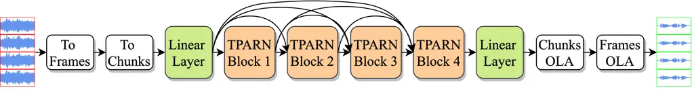
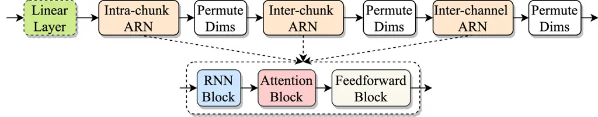
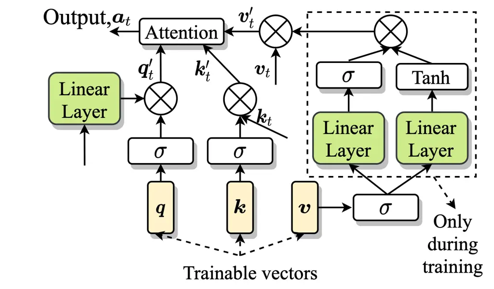

# TPARN: Triple-path attentive recurrent network for time-domain multichannel speech enhancement

Ashutosh Pandey    Buye Xu    Anurag Kumar    Jacob Donley    Paul
Calamia    DeLiang Wang ^(†)^(†)thanks: ^(\*)Work done during internship
at Facebook Reality Labs Research.

###### Abstract

In this work, we propose a new model called triple-path attentive
recurrent network (TPARN) for multichannel speech enhancement in the
time domain. TPARN extends a single-channel dual-path network to a
multichannel network by adding a third path along the spatial dimension.
First, TPARN processes speech signals from all channels independently
using a dual-path attentive recurrent network (ARN), which is a
recurrent neural network (RNN) augmented with self-attention. Next, an
ARN is introduced along the spatial dimension for spatial context
aggregation. TPARN is designed as a multiple-input and multiple-output
architecture to enhance all input channels simultaneously. Experimental
results demonstrate the superiority of TPARN over existing
state-of-the-art approaches.

###### Index Terms: 

multichannel, time-domain, MIMO, self-attention, triple-path, fixed
array

^(†)^(†)address: $`{}^{\textup{1}}`$Facebook Reality Labs Research,
USA  
$`{}^{\textup{2}}`$Department of Computer Science and Engineering, The
Ohio State University, USA

## 1 Introduction

Speech enhancement is concerned with improving the intelligibility and
quality of a speech signal degraded by noise and reverberation. The most
basic approach to speech enhancement is monaural processing, where
recordings from a single microphone are utilized \[1\]. Single-channel
methods can obtain good enhancement, but are limited in capability to
utilize only time-frequency (T-F) information. Multichannel speech
enhancement aims at utilizing both T-F and spatial information by using
recordings from multiple microphones \[2, 3\].

Supervised speech enhancement using deep neural networks (DNNs)
represents the mainstream methodology for speech enhancement \[4\]. For
multichannel processing, a popular approach is to incorporate DNNs with
traditional spatial filters, such as an MVDR beamformer \[5, 6\]. A DNN
is first used to estimate second-order statistics of speech and noise
which are then used for computing beamformer weights. Another approach
is to train a DNN with spatial features, such as inter-channel time,
phase or level difference \[7, 8\]. A more recent trend is to use
end-to-end supervised learning, where spatial information becomes an
implicit part of supervised learning \[9, 10\]. Wang et al. \[10\]
proposed a dense convolutional recurrent network (DCRN) for
multi-microphone complex spectral mapping, where real and imaginary
components of the clean spectrum are directly predicted from the
multichannel noisy spectrum. In \[9\], authors used inspiration from
complex beamforming to propose a novel channel-attention mechanism
inside a dense UNet.

Moreover, time-domain speech enhancement using DNNs has also gained
considerable attention in recent years \[11, 12, 13, 14\]. Time domain
networks directly map noisy speech samples to clean speech samples, and
as a result, feature extraction becomes an implicit part of the learning
process. Even though highly effective in removing additive interference,
time-domain approaches have not yet been established for removing room
reverberation, a convolutive interference \[15\]. Time-domain networks
have also been explored for end-to-end multichannel speech enhancement
\[16, 17, 18\], however reported performances are far from satisfactory.

In this work, we propose a novel approach for end-to-end time-domain
multichannel speech enhancement. We refer to it as _TPARN: Triple-path
Attentive Recurrent Network_. The key idea in the TPARN design is to
extend a dual-path network \[14\] with a third path along the spatial
dimension. The audio input signals from all channels are first divided
into short chunks which are then processed by the TPARN system in three
stages. These three stages for processing include: _intra-chunk
processing_ for local temporal modeling, _inter-chunk processing_ for
global temporal modeling, and _inter-channel processing_ for spatial
modeling.

Intra-chunk and inter-chunk processing are performed independently for
all the channels using a dual-path attentive recurrent networks (ARN)
\[19\], which are RNNs augmented with self-attention \[20, 21\]. A
combination of RNN and self-attention has been proven to be effective
for speech processing tasks \[19, 22, 21, 23\]. The inter-channel
processing introduced by us can be modeled using different methods and
we explore RNN, self-attention network, and ARN along the spatial
dimension. We find ARN to be slightly superior compared to the other
two. Besides, with an explicit capability to capture spatial information
through neural network based inter-channel processing, our TPARN
framework has additional desirable characteristics. For example, TPARN
is designed as a multiple-input and multiple-output (MIMO) architecture
to enhance all input channels simultaneously. These multi-channel
outputs can be further processed by a downstream system if needed. We
train and evaluate TPARN on two different datasets with varying degrees
of reverberation and noise. We show that TPARN obtains better results
than state-of-the-art approaches on both datasets. We also find
performance improvements to be more significant on a difficult dataset.

## 2 Model Description

### 2.1 Problem Definition

A multichannel noisy signal
$`\bm{X}=\{\bm{x}_{1},\dots,\bm{x}_{P}\}\in\mathbb{R}^{P\times N}`$,
where $`P`$ is the number of microphones and $`N`$ is the number of
samples, is modeled as

```math
\begin{split}x_{p}(n)&=y_{p}(n)+z_{p}(n)\\
&=d_{p}(n)+r_{p}(n)+z_{p}(n)\\
&=d_{p}(n)+u_{p}(n)\end{split} \tag{1}
```

where $`p=1,2\dots P`$ and $`n=0,1,\dots N-1`$. $`\bm{x}_{p}`$
represents noisy signal at microphone $`p`$. $`\bm{y}`$ is the received
speech including direct-path speech $`\bm{d}`$ and reverberated speech
$`\bm{r}`$. $`\bm{z}`$ is the noise and $`\bm{u}`$ is the overall
interference including noise and reverberation. The goal of multichannel
speech enhancement is to get a close estimate $`\bm{\hat{d}}_{r}`$ of
the direct-path clean speech at a reference microphone $`r`$ from
$`\bm{X}`$.



Figure 1: The proposed TPARN architecture for multichannel speech
enhancement.

### 2.2 Triple-path Attentive Recurrent Network

The overall schema of the proposed TPARN architecture is shown in Fig.

1. It consists of an input linear layer, four TPARN blocks, and an
   output linear layer.

An input signal $`\bm{X}\in\mathbb{R}^{P\times N}`$ is first converted
into frames,
$`\mathcal{T}=[\bm{X}_{1},\ldots,\bm{X}_{T}]\in\mathbb{R}^{P\times T\times L}`$,
using a frame size of $`L`$ samples and frame shift of $`K`$. $`T`$ is
the total number of frames. The frames in T are arranged into chunks
with a chunk size of $`R`$ and chunk shift of $`S`$, leading the input
being represented as
$`\mathcal{C}=[\bm{\text{C}}_{1},\ldots\bm{\text{C}}_{C}]\in\mathbb{R}^{P\times C\times R\times L}`$,
where $`C`$ is the number of chunks. Next, the frames of size $`L`$ in
$`\mathcal{C}`$ are projected to $`D`$ dimensions using the input linear
layer, which are then processed by a stack of 4 TPARN blocks. The
architecture of a TPARN block is shown in Fig. 2. The TPARN blocks are
densely connected. The input to TPARN blocks are 4d tensors of shape
$`P\times C\times R\times k\cdot D`$, which are obtained by
concatenating the output from the linear layer encoder and the outputs
from preceding TPARN blocks. $`k\in\{1,2,3,4\}`$ denotes block id.

For $`k>1`$, a linear layer is used at the input to project features of
size $`k\cdot D`$ to $`D`$. Within a TPARN block, the inputs are
processed using a stack of three ARNs: intra-chunk ARN, inter-chunk ARN
and inter-channel ARN. The intra-chunk ARN operates independently over
all chunks by rearranging its input to shape
$`P\cdot C\times R\times D`$, and using an ARN that treats the first,
second and third dimensions as batch, sequence and feature dimensions
respectively. Similarly, the inter-chunk ARN combines all chunks
together by rearranging its input to shape $`P\cdot R\times C\times D`$.
The inter-channel ARN operates along the channel dimension (spatial
dimension) by rearranging its input to shape
$`R\cdot C\times P\times D`$. The sequence length and the batch size for
an utterance for different ARNs are given in Table 1.



Figure 2: TPARN block.


Figure 3: (a) RNN block, (b) Attention block, (c) Feedforward block.

Fig. 2 also depicts the architecture of an ARN which comprises of a
stack of three blocks, RNN block, attention block, and feedforward
block. The architecture of the RNN block, the attention block and the
feedforward block is shown in Fig. 3. The input to RNN block is
normalized using two independent layer normalization layers. We use
separate normalization to make sure that the network has a capability to
scale a given signal differently at different locations inside the
network.

The input to the attention block is layer-normalized using two
independent layer-normalization layers. The first layer-normalized input
is used as query, $`\bm{Q}`$, and the second layer-normalized input is
used as key $`\bm{K}`$ and value $`\bm{V}`$ for a following attention
module. The attention mechanism of the attention module, shown in Fig.
4, is borrowed from \[20\] where its effectiveness with RNN for natural
language processing tasks has been demonstrated. Its effectiveness for
speech enhancement has also been established in \[19, 21\].

Batch Size Seq. Length Feature Size Intra-chunk ARN $`P\cdot C`$ $`R`$
$`D`$ Inter-chunk ARN $`P\cdot R`$ $`C`$ $`D`$ Inter-channel ARN
$`R\cdot C`$ $`P`$ $`D`$

Table 1: Input size to different ARNs for an utterance with $`C`$
chunks.

The attention module comprises three trainable vectors  
$`\{\bm{Q}^{\prime},\bm{K}^{\prime},\bm{V}^{\prime}\}\in\mathbb{R}^{1\times D}`$
, and its inputs are
$`\{\bm{Q},\bm{K},\bm{V}\}\in\mathbb{R}^{B\times U\times D}`$, where
$`B`$ is the batch size and $`U`$ is the sequence length (see Table 1).
$`\bm{Q},\bm{K}`$, and $`\bm{V}`$ are refined using a gating mechanism
given in the following equation.

```math
\begin{split}\bm{K}_{r}&=\bm{K}\odot\text{Sigm}(\bm{K}^{\prime})\\
\bm{Q}_{r}&=\text{Lin}(\bm{Q})\odot\text{Sigm}(\bm{Q}^{\prime})\\
\bm{V}_{r}&=\bm{V}\odot[\text{Sigm}(\text{Lin}(\bm{V}^{\prime}))\odot\text{Tanh}(\text{Lin}(\bm{V}^{\prime}))]\end{split} \tag{2}
```

where Sigm() is the sigmoidal nonlinearity, Lin() is a linear layer, and
$`\odot`$ denotes elementwise multiplication.
$`\bm{Q}^{\prime},\bm{K}^{\prime}`$, and $`\bm{V}^{\prime}`$ are
broadcast to match the shape of $`\bm{Q},\bm{K}`$, and $`\bm{V}`$. Note
that
$`\text{Sigm}(\text{Lin}(\bm{V}^{\prime}))\odot\text{Tanh}(\text{Lin}(\bm{V}^{\prime}))`$
is a deterministic vector, and hence this operation is used only during
training to better optimize $`\bm{V}^{\prime}`$, and its final value is
stored as a vector to use during evaluation.

The final output of the attention block is computed as

```math
\bm{A}=\text{Softmax}(\frac{\bm{Q}_{r}\bm{K}_{r}^{T}}{\sqrt{D}})\bm{V}_{r} \tag{3}
```

The input to the feedforward block in ARN is layer-normalized
independently using two different layer normalization layers. The first
layer-normalized input is projected to size $`4D`$ using a linear layer
followed by Gaussian error linear unit (GELU) nonlinearity and a dropout
with dropout rate $`D_{r}`$. Finally, it is projected back to size $`D`$
and added to the second layer-normalized input. Note that we use dense
connection in the RNN block and residual connections in the attention
and the feedforward block.

The output of the final TPARN block is projected to size $`L`$ using the
output linear layer. Next, chunks are combined together using chunk
overlap-and-add (OLA) and then frames are combined together using frame
OLA to get an enhanced multichannel waveform. Note that TPARN is a MIMO
architecture that enhances all input channels simultaneously.

### 2.3 Loss Function

We use a recently proposed phase constrained magnitude (PCM) loss \[24\]
for training. The PCM loss was proposed to overcome an existing artifact
issue with magnitude-based losses for time-domain networks. First, we
compute an estimate of overall interference as

```math
\bm{\hat{U}}=\bm{X}-\bm{\hat{D}} \tag{4}
```

Then, a magnitude-based loss is used between reference and estimated
speech and noise.

```math
L_{PCM}(\bm{D},\bm{\widehat{D}})=\frac{1}{2}\cdot L_{SM}(\bm{D},\bm{\widehat{D}})+\frac{1}{2}\cdot L_{SM}(\bm{U},\bm{\widehat{U}}) \tag{5}
```

$`L_{SM}`$ is defined as

```math
\displaystyle L_{SM}(\bm{D},\bm{\widehat{D}})=\frac{1}{P\cdot T\cdot F}\sum_{p=0}^{P}\sum_{t=1}^{T}\sum_{f=1}^{F} \displaystyle|(|\mathcal{D}_{p}^{r}(t,f)|+|\mathcal{D}_{p}^{i}(t,f)|) \tag{6}
```

```math
\displaystyle- \displaystyle(|\widehat{\mathcal{D}}_{p}^{r}(t,f)|+|\widehat{\mathcal{D}}_{p}^{i}(t,f)|)|
```

where $`\bm{\mathcal{D}}_{p}`$ is STFT of $`\bm{d}_{p}`$ and
$`\bm{\mathcal{D}}_{p}^{r}`$ and $`\bm{\mathcal{D}}_{p}^{i}`$
respectively represent the real and the imaginary component of
$`\bm{D}_{p}`$. $`T`$ is the number of frames and $`F`$ is the number of
frequency bins.



Figure 4: Self-attention mechanism.

## 3 Experiments

### 3.1 Datasets

We use two datasets for experiments. The first dataset is created using
speech from WSJCAM0 corpus \[25\] and noises from the REVERB challenge
\[26\]. This dataset uses a 4 microphones circular array with a radius
of 10 cm, T60 in the range \[0.2, 1.2\] seconds, and direct
speech-to-noise-ratio (SNR) in the range \[5, 20\] dB. More details
about this dataset can be found in \[10\].

We also create a more challenging dataset using speech and noises from
the DNS challenge 2020 corpus¹¹ 1
[https://github.com/microsoft/DNS-Challenge/blob/master/LICENSE](https://github.com/microsoft/DNS-Challenge/blob/master/LICENSE) \[27\].
We select all speakers with one chapter in the dataset and randomly
select 90% of speakers for training, 5% for validation, and 5% for
evaluation. After this, for each utterance a random chunk of a randomly
sampled length with an activity threshold (from script in \[27\])
greater than 0.6 is extracted. The length of utterances are sampled from
\[3, 6\] seconds for training and \[3, 10\] seconds for test and
validation. This results in a total of 53 k utterances for training, 2.6
k for validation, and 3.3 k for test. Next, all the noises from the DNS
corpus are randomly divided into training, validation and test noises in
a proportion similar to the number of speech utterances.

The algorithm to generate spatialized multichannel data from DNS speech
and noises is given in Algorithm 1. All the points inside a room are
sampled at least 0.5 m away from walls, and the distance between array
center and different sound sources is kept between 0.75 m and 2 m. We
use Pyroomacoustics \[28\] with hybrid approach where the image method
with order 6 is used to model early reflections and ray-tracing is used
to model the late reverberation. A similar approach to data generation
was used in \[29\].

SI-SDR STOI PESQ unproc. -3.8 70.9 1.63 MSE 10.1 95.7 3.07 PCM 10.4 96.9
3.42

Table 2: Comparison of Loss Functions for TPARN.

for _split_ in {train, test, validation } do

   for speech utterances in _split_ do

- •
  Draw room length and width from \[5,10\] m, and height from \[3, 4\]
  m;
- •
  Draw 1 array location and 1 speech source location;
- •
  Get 4 uniformly placed mic locations on a circle of radius 10 cm
  centered at array location;
- •
  Draw $`N_{ns}`$, number of noise sources, from \[5, 10\]
- •
  Draw $`N_{ns}`$ noise locations in room
- •
  Generate RIRs corresponding to speech source location and $`N_{ns}`$
  noise locations for mic locations in circular array
- •
  Draw $`N_{ns}`$ noise utterances from noises in _split_
- •
  Propagate speech and noise signals to mics by convolving with
  corresponding RIRs
- •
  Draw a value $`snr`$ from \[-10, 10\] dB, and add speech and noises at
  each mic using a scale so that the overall direct speech SNR is
  $`snr`$;

   end for

end for

Algorithm 1 DNS dataset spatialization process.

### 3.2 Experimental settings

All the utterances are resampled to 16 kHz. We use $`P=4`$, $`L=16`$,
$`K=8`$, $`R=126`$, $`S=63`$, and $`D=128`$ . For RNN, we use
bidirectional long short-term memory networks (BLSTMs) with hidden size
$`D`$ in each direction. Dropout rate $`D_{r}`$ in feedforward blocks is
set to $`5`$%. We use phase constrained magnitude (PCM) loss in Eq. (6)
for training TPARN. All the models are trained for 100 epochs on 4
second long utterances randomly extracted from training samples during
training. A batch size of $`8`$ is used. Automatic mixed precision
training is utilized for efficient training \[30\]. Learning rate is
initialized with $`0.0004`$ and is dynamically scaled to half if the
best validation score does not improve in five consecutive epochs.

We compare TPARN with two recently proposed complex spectrum based
end-to-end models; DCRN \[10\] and channel-attention dense UNet
(CA-DUNet)\[9\] . We also compare it with two time-domain end-to-end
models; residual speech denoising fully convolutional network (rSDFCN)
\[17\], and filter-and-sum network with transform average and
concatenate module (Fasnet TAC) \[18\].

All the models are compared using three enhancement objective metrics:
short-time objective intelligibility (STOI) \[31\], perceptual
evaluation of speech quality (PESQ) \[32\], and scale-invariant
signal-to-distortion ratio (SI-SDR). STOI scores are reported in
percentage.

### 3.3 Experimental results

We begin by comparing time-domain mean squared error (MSE) loss with
spectral magnitude based PCM loss in Eq. (5). Results on WSJCAM0 dataset
using TPARN are reported in Table 2. We see that even though MSE loss
obtains good SI-SDR and STOI scores, it is considerably worse in terms
of PESQ. This also suggests that PCM loss obtains bigger improvements
for joint denoising and dereverberation compared to denoising in \[13\].
We use PCM loss for the rest of the experiments with TPARN.

Next, we explore the behavior of spatial (inter-channel) ARNs at
different locations inside a TPARN bloc: _Pre_ - before intra-chunk and
inter-chunk ARN, _Mid_ - between intra-chunk and inter-chunk ARN, and
_Post_ - after inter-chunk and intra-chunk ARN. We also experiment with
three different configurations for spatial processing: _Attention_ -
removing the RNN block from ARN, _RNN_ - removing the attention block
from ARN, and _ARN_. The results for different models are summarized in
Table 3. We see that for the WSJCAM0 dataset, different configurations
of spatial ARN in TPARN block obtain similar results. However, for the
challenging DNS dataset, _RNN_ is considerably worse in comparison of
_Attention_ and _ARN_. Moreover, best scores are obtained at _Pre_
location for _Attention_ and at _Post_ location for _ARN_. These results
indicate that RNNs are good for spatial modeling but may not suffice in
extreme conditions, as in the DNS dataset.

Additionally, we perform an ablation experiment (not reported here) on
the number of spatial ARNs inside TAPRN by removing spatial ARNs from
TPARN blocks at different locations. We find that a TPARN with 3 spatial
ARNs in the first, second and the fourth TPARN block obtains
consistently better results for both datasets and for different learning
strategies, such as multiple-input and single-output (MISO) and MIMO.

Finally, we compare best TPARN results with baseline models in Table 4.
We report single-input and single-output (SISO), MISO, and MIMO results
for DCRN and TPARN, and MISO results for the rest of the models, as in
their original studies. TPARN MIMO is converted to MISO by averaging the
output of the final TPARN block. We notice a very interesting
observation that TPARN-SISO is worse than DCRN-SISO, but TPARN-MIMO and
TPARN-MISO are better than DCRN-MISO and DCRN-MIMO. This suggests that
TPARN exploits spatial information to a larger extent than in DCRN.
Further, DCRN-MIMO is worse than DCRN-MISO, but TPARN-MIMO is slightly
better than TPARN-MISO. This indicates that TPARN is capable of MIMO
learning without any performance degradation, which provides additional
advantage of enhancing all channels simultaneously with spatial cue
preservation. Moreover, performance improvements over the baseline
models are even better for the difficult DNS dataset. For example, TPARN
is better by $`3.8`$ dB in SI-SDR, $`1.9`$% in STOI and $`0.12`$ in PESQ
compared to the second best DCRN-MISO. An exception in baseline models
is CA-DUNet that obtains impressive SI-SDR but drastically worse PESQ
for WSJCAM0.

Test Dataset WSJCAM0 DNS Test Metric SI-SDR STOI PESQ SI-SDR STOI PESQ
Unproc. Loc. $`\downarrow`$ -3.8 70.9 1.38 -7.6 63.8 1.38 _Attention_
_Pre_ 10.3 96.8 3.40 7.6 91.1 2.66 _Mid_ 10.1 96.8 3.39 7.0 90.2 2.56
_Post_ 10.2 96.8 3.40 6.9 90.2 2.56 _RNN_ _Pre_ 10.3 96.8 3.40 6.9 90.0
2.55 _Mid_ 10.3 96.9 3.44 7.1 90.4 2.59 _Post_ 10.3 96.9 3.41 7.2 90.3
2.57 _ARN_ _Pre_ 10.4 96.8 3.40 7.4 90.5 2.59 _Mid_ 10.4 96.9 3.41 7.1
90.4 2.59 _Post_ 10.4 96.9 3.42 7.8 91.1 2.65

Table 3: Comparisons between different spatial processing modules at
different locations in TPARN blocks.

Test Dataset WSJCAM0 DNS Test Metric SI-SDR STOI PESQ SI-SDR STOI PESQ
Approach $`\downarrow`$ Unprocessed -3.8 70.9 1.38 -7.6 63.8 1.38 WM
rSDFCN-MISO \[17\] 4.2 83.8 2.00 -2.2 68.5 1.49 CRM CA-DUNet-MISO \[9\]
10.7 96.0 2.88 3.5 83.3 1.99 WM Fasnet TAC-MISO \[18\] 8.2 94.7 2.93 4.7
86.5 2.26 CSM DCRN-SISO \[10\] 6.6 93.6 2.90 3.9 89.8 2.60 CSM DCRN-MISO
\[10\] 9.4 96.5 3.31 4.6 90.1 2.57 CSM DCRN-MIMO \[10\] 8 .0 95.9 3.27
3.6 89.4 2.57 WM TPARN-SISO 5.1 93.6 2.92 3.0 84.1 2.14 WM TPARN-MISO
10.2 96.8 3.40 8.2 91.6 2.72 WM TPARN-MIMO 10.4 96.9 3.43 8.4 91.9 2.75

Table 4: Comparisons with baseline models. WM: waveform mapping
(time-domain), CRM: complex ratio masking. CSM: complex spectral
mapping.

## 4 Conclusions

We have proposed a novel triple-path attentive recurrent network for
multichannel speech enhancement in the time-domain. TPARN is designed as
a simple extension of a single-channel dual-path network to multichannel
network by adding a third-path along the spatial dimension. TPARN is a
multiple-input and multiple-output (MIMO) architecture that can
simultaneously enhance signals at all microphones. We have shown that
TPARN obtains significantly better results than other state-of-the-art
models in very noisy and reverberant conditions. Future research
includes exploring TPARN for ad-hoc array processing and moving sources.

author1hash=LPCfamily=Loizou, familyi=L., given=Philipos C.,
giveni=P.C.,

author3hash=BJfamily=Benesty, familyi=B., given=Jacob, giveni=J.,
hash=CJfamily=Chen, familyi=C., given=Jingdong, giveni=J.,
hash=HYfamily=Huang, familyi=H., given=Yiteng, giveni=Y.,

author4hash=GSfamily=Gannot, familyi=G., given=Sharon, giveni=S.,
hash=VEfamily=Vincent, familyi=V., given=Emmanuel, giveni=E.,
hash=MGSfamily=Markovich-Golan, familyi=M-G., given=Shmulik, giveni=S.,
hash=OAfamily=Ozerov, familyi=O., given=Alexey, giveni=A.,

author2hash=WDLfamily=Wang, familyi=W., given=De Liang, giveni=D.L.,
hash=CJfamily=Chen, familyi=C., given=Jitong, giveni=J.,

author5hash=EHfamily=Erdogan, familyi=E., given=Hakan, giveni=H.,
hash=HJRfamily=Hershey, familyi=H., given=John R, giveni=J.R.,
hash=WSfamily=Watanabe, familyi=W., given=Shinji, giveni=S.,
hash=MMIfamily=Mandel, familyi=M., given=Michael I, giveni=M.I.,
hash=LRJfamily=Le Roux, familyi=L.R., given=Jonathan, giveni=J.,

author3hash=HJfamily=Heymann, familyi=H., given=Jahn, giveni=J.,
hash=DLfamily=Drude, familyi=D., given=Lukas, giveni=L.,
hash=HURfamily=Haeb-Umbach, familyi=H-U., given=Reinhold, giveni=R.,

author2hash=WZQfamily=Wang, familyi=W., given=Zhong-Qiu, giveni=Z-Q.,
hash=WDfamily=Wang, familyi=W., given=DeLiang, giveni=D.,

author3hash=WZQfamily=Wang, familyi=W., given=Zhong-Qiu, giveni=Z-Q.,
hash=LRJfamily=Le Roux, familyi=L.R., given=Jonathan, giveni=J.,
hash=HJRfamily=Hershey, familyi=H., given=John R, giveni=J.R.,

author5hash=TBfamily=Tolooshams, familyi=T., given=Bahareh, giveni=B.,
hash=GRfamily=Giri, familyi=G., given=Ritwik, giveni=R.,
hash=SAHfamily=Song, familyi=S., given=Andrew H, giveni=A.H.,
hash=IUfamily=Isik, familyi=I., given=Umut, giveni=U.,
hash=KAfamily=Krishnaswamy, familyi=K., given=Arvindh, giveni=A.,

author2hash=WZQfamily=Wang, familyi=W., given=Zhong-Qiu, giveni=Z-Q.,
hash=WDfamily=Wang, familyi=W., given=DeLiang, giveni=D.,

author2hash=PAfamily=Pandey, familyi=P., given=Ashutosh, giveni=A.,
hash=WDLfamily=Wang, familyi=W., given=De Liang, giveni=D.L.,

author2hash=LYfamily=Luo, familyi=L., given=Yi, giveni=Y.,
hash=MNfamily=Mesgarani, familyi=M., given=Nima, giveni=N.,

author2hash=PAfamily=Pandey, familyi=P., given=Ashutosh, giveni=A.,
hash=WDfamily=Wang, familyi=W., given=DeLiang, giveni=D.,

author3hash=LYfamily=Luo, familyi=L., given=Yi, giveni=Y.,
hash=CZfamily=Chen, familyi=C., given=Zhuo, giveni=Z.,
hash=YTfamily=Yoshioka, familyi=Y., given=Takuya, giveni=T.,

author2hash=LYfamily=Luo, familyi=L., given=Yi, giveni=Y.,
hash=MNfamily=Mesgarani, familyi=M., given=Nima, giveni=N.,

author3hash=TNfamily=Tawara, familyi=T., given=Naohiro, giveni=N.,
hash=KTfamily=Kobayashi, familyi=K., given=Tetsunori, giveni=T.,
hash=OTfamily=Ogawa, familyi=O., given=Tetsuji, giveni=T.,

author6hash=LCLfamily=Liu, familyi=L., given=Chang-Le, giveni=C-L.,
hash=FSWfamily=Fu, familyi=F., given=Sze-Wei, giveni=S-W.,
hash=LYJfamily=Li, familyi=L., given=You-Jin, giveni=Y-J.,
hash=HJWfamily=Huang, familyi=H., given=Jen-Wei, giveni=J-W.,
hash=WHMfamily=Wang, familyi=W., given=Hsin-Min, giveni=H-M.,
hash=TYfamily=Tsao, familyi=T., given=Yu, giveni=Y.,

author4hash=LYfamily=Luo, familyi=L., given=Yi, giveni=Y.,
hash=CZfamily=Chen, familyi=C., given=Zhuo, giveni=Z.,
hash=MNfamily=Mesgarani, familyi=M., given=Nima, giveni=N.,
hash=YTfamily=Yoshioka, familyi=Y., given=Takuya, giveni=T.,

author2hash=PAfamily=Pandey, familyi=P., given=Ashutosh, giveni=A.,
hash=WDfamily=Wang, familyi=W., given=DeLiang, giveni=D.,

author1hash=MSfamily=Merity, familyi=M., given=Stephen, giveni=S.,

author2hash=PAfamily=Pandey, familyi=P., given=Ashutosh, giveni=A.,
hash=WDfamily=Wang, familyi=W., given=DeLiang, giveni=D.,

author5hash=TKfamily=Tan, familyi=T., given=Ke, giveni=K.,
hash=XBfamily=Xu, familyi=X., given=Buye, giveni=B.,
hash=KAfamily=Kumar, familyi=K., given=Anurag, giveni=A.,
hash=NEfamily=Nachmani, familyi=N., given=Eliya, giveni=E.,
hash=AYfamily=Adi, familyi=A., given=Yossi, giveni=Y.,

author3hash=CJfamily=Chen, familyi=C., given=Jingjing, giveni=J.,
hash=MQfamily=Mao, familyi=M., given=Qirong, giveni=Q.,
hash=LDfamily=Liu, familyi=L., given=Dong, giveni=D.,

author2hash=PAfamily=Pandey, familyi=P., given=Ashutosh, giveni=A.,
hash=WDLfamily=Wang, familyi=W., given=De Liang, giveni=D.L.,

author5hash=RTfamily=Robinson, familyi=R., given=Tony, giveni=T.,
hash=FJfamily=Fransen, familyi=F., given=Jeroen, giveni=J.,
hash=PDfamily=Pye, familyi=P., given=David, giveni=D.,
hash=FJfamily=Foote, familyi=F., given=Jonathan, giveni=J.,
hash=RSfamily=Renals, familyi=R., given=Steve, giveni=S.,

author10hash=KKfamily=Kinoshita, familyi=K., given=Keisuke, giveni=K.,
hash=DMfamily=Delcroix, familyi=D., given=Marc, giveni=M.,
hash=GSfamily=Gannot, familyi=G., given=Sharon, giveni=S.,
hash=HEAfamily=Habets, familyi=H., given=Emanuël AP, giveni=E.A.,
hash=HURfamily=Haeb-Umbach, familyi=H-U., given=Reinhold, giveni=R.,
hash=KWfamily=Kellermann, familyi=K., given=Walter, giveni=W.,
hash=LVfamily=Leutnant, familyi=L., given=Volker, giveni=V.,
hash=MRfamily=Maas, familyi=M., given=Roland, giveni=R.,
hash=NTfamily=Nakatani, familyi=N., given=Tomohiro, giveni=T.,
hash=RBfamily=Raj, familyi=R., given=Bhiksha, giveni=B.,

author10hash=RCKfamily=Reddy, familyi=R., given=Chandan KA, giveni=C.K.,
hash=GVfamily=Gopal, familyi=G., given=Vishak, giveni=V.,
hash=CRfamily=Cutler, familyi=C., given=Ross, giveni=R.,
hash=BEfamily=Beyrami, familyi=B., given=Ebrahim, giveni=E.,
hash=CRfamily=Cheng, familyi=C., given=Roger, giveni=R.,
hash=DHfamily=Dubey, familyi=D., given=Harishchandra, giveni=H.,
hash=MSfamily=Matusevych, familyi=M., given=Sergiy, giveni=S.,
hash=ARfamily=Aichner, familyi=A., given=Robert, giveni=R.,
hash=AAfamily=Aazami, familyi=A., given=Ashkan, giveni=A.,
hash=BSfamily=Braun, familyi=B., given=Sebastian, giveni=S.,

author3hash=SRfamily=Scheibler, familyi=S., given=Robin, giveni=R.,
hash=BEfamily=Bezzam, familyi=B., given=Eric, giveni=E.,
hash=DIfamily=Dokmanić, familyi=D., given=Ivan, giveni=I.,

author5hash=KOfamily=Kabeli, familyi=K., given=Ori, giveni=O.,
hash=AYfamily=Adi, familyi=A., given=Yossi, giveni=Y.,
hash=TZfamily=Tang, familyi=T., given=Zhenyu, giveni=Z.,
hash=XBfamily=Xu, familyi=X., given=Buye, giveni=B.,
hash=KAfamily=Kumar, familyi=K., given=Anurag, giveni=A.,

author10hash=MPfamily=Micikevicius, familyi=M., given=Paulius,
giveni=P., hash=NSfamily=Narang, familyi=N., given=Sharan, giveni=S.,
hash=AJfamily=Alben, familyi=A., given=Jonah, giveni=J.,
hash=DGfamily=Diamos, familyi=D., given=Gregory, giveni=G.,
hash=EEfamily=Elsen, familyi=E., given=Erich, giveni=E.,
hash=GDfamily=Garcia, familyi=G., given=David, giveni=D.,
hash=GBfamily=Ginsburg, familyi=G., given=Boris, giveni=B.,
hash=HMfamily=Houston, familyi=H., given=Michael, giveni=M.,
hash=KOfamily=Kuchaiev, familyi=K., given=Oleksii, giveni=O.,
hash=VGfamily=Venkatesh, familyi=V., given=Ganesh, giveni=G.,

author4hash=TCHfamily=Taal, familyi=T., given=Cees H, giveni=C.H.,
hash=HRCfamily=Hendriks, familyi=H., given=Richard C, giveni=R.C.,
hash=HRfamily=Heusdens, familyi=H., given=Richard, giveni=R.,
hash=JJfamily=Jensen, familyi=J., given=Jesper, giveni=J.,

author4hash=RAWfamily=Rix, familyi=R., given=Antony W, giveni=A.W.,
hash=BJGfamily=Beerends, familyi=B., given=John G, giveni=J.G.,
hash=HMPfamily=Hollier, familyi=H., given=Michael P, giveni=M.P.,
hash=HAPfamily=Hekstra, familyi=H., given=Andries P, giveni=A.P.,

## References

- \[1\] “Speech Enhancement: Theory and Practice” CRC Press, 2013
- \[2\] “Microphone array signal processing” Springer Science & Business
  Media, 2008
- \[3\] “A consolidated perspective on multimicrophone speech
  enhancement and source separation” In _IEEE/ACM Transactions on Audio,
  Speech, and Language Processing_, 2017, pp. 692–730
- \[4\] “Supervised Speech Separation Based on Deep Learning: An
  Overview” In _IEEE/ACM Transactions on Audio, Speech, and Language
  Processing_, 2018, pp. 1702–1726
- \[5\] “Improved MVDR beamforming using single-channel mask prediction
  networks” In _INTERSPEECH_, 2016, pp. 1981–1985
- \[6\] “Neural network based spectral mask estimation for acoustic
  beamforming” In _IEEE Int. Conf. on Acoust., Speech and Signal
  Process. (ICASSP)_, 2016, pp. 196–200
- \[7\] “Combining spectral and spatial features for deep learning based
  blind speaker separation” In _IEEE/ACM Transactions on Audio, Speech,
  and Language Processing_, 2018, pp. 457–468
- \[8\] “Multi-channel deep clustering: Discriminative spectral and
  spatial embeddings for speaker-independent speech separation” In _IEEE
  Int. Conf. on Acoust., Speech and Signal Process. (ICASSP)_, 2018, pp.
  1–5
- \[9\] “Channel-attention dense U-Net for multichannel speech
  enhancement” In _IEEE Int. Conf. on Acoust., Speech and Signal
  Process. (ICASSP)_, 2020, pp. 836–840
- \[10\] “Multi-microphone complex spectral mapping for speech
  dereverberation” In _IEEE Int. Conf. on Acoust., Speech and Signal
  Process. (ICASSP)_, 2020, pp. 486–490
- \[11\] “A New Framework for Supervised Speech Enhancement in the Time
  Domain” In _INTERSPEECH_, 2018, pp. 1136–1140 DOI:
  [10.21437/Interspeech.2018-1223](https://dx.doi.org/10.21437/Interspeech.2018-1223)
- \[12\] “Conv-TasNet: Surpassing Ideal Time-Frequency Magnitude Masking
  for Speech Separation” In _IEEE/ACM Transactions on Audio, Speech, and
  Language Processing_, 2019, pp. 1256–1266
- \[13\] “Dense CNN with self-attention for time-domain speech
  enhancement” In _IEEE/ACM Transactions on Audio, Speech, and Language
  Processing_, 2021, pp. 1270–1279
- \[14\] “Dual-path RNN: Efficient Long Sequence Modeling for
  Time-Domain Single-Channel Speech Separation” In _IEEE Int. Conf. on
  Acoust., Speech and Signal Process. (ICASSP)_, 2020, pp. 46–50
- \[15\] “Real-time single-channel dereverberation and separation with
  time-domain audio separation network” In _INTERSPEECH_, 2018, pp.
  342–346
- \[16\] “Multi-Channel Speech Enhancement Using Time-Domain
  Convolutional Denoising Autoencoder” In _INTERSPEECH_, 2019, pp. 86–90
- \[17\] “Multichannel speech enhancement by raw waveform-mapping using
  fully convolutional networks” In _IEEE/ACM Transactions on Audio,
  Speech, and Language Processing_, 2020, pp. 1888–1900
- \[18\] “End-to-end microphone permutation and number invariant
  multi-channel speech separation” In _IEEE Int. Conf. on Acoust.,
  Speech and Signal Process. (ICASSP)_, 2020, pp. 6394–6398
- \[19\] “Dual-path Self-Attention RNN for Real-Time Speech Enhancement”
  In _arXiv preprint arXiv:2010.12713_, 2020
- \[20\] “Single headed attention RNN: Stop thinking with your head” In
  _arXiv:1911.11423_, 2019
- \[21\] “Self-attending RNN for Speech Enhancement to Improve
  Cross-corpus Generalization” In _arXiv:2105.12831_, 2021
- \[22\] “SAGRNN: Self-Attentive Gated RNN for Binaural Speaker
  Separation with Interaural Cue Preservation” In _arXiv:2009.01381_,
  2020
- \[23\] “Dual-path transformer network: Direct context-aware modeling
  for end-to-end monaural speech separation” In _arXiv preprint
  arXiv:2007.13975_, 2020
- \[24\] “Densely Connected Neural Network with Dilated Convolutions for
  Real-Time Speech Enhancement in the Time Domain” In _IEEE Int. Conf.
  on Acoust., Speech and Signal Process. (ICASSP)_, 2020, pp. 6629–6633
- \[25\] “WSJCAMO: a British English speech corpus for large vocabulary
  continuous speech recognition” In _1995 International Conference on
  Acoustics, Speech, and Signal Processing_ 1, 1995, pp. 81–84 IEEE
- \[26\] “A summary of the REVERB challenge: State-of-the-art and
  remaining challenges in reverberant speech processing research” In
  _EURASIP Journal on Advances in Signal Processing_, 2016, pp. 1–19
- \[27\] “The INTERSPEECH 2020 deep noise suppression challenge:
  Datasets, subjective testing framework, and challenge results” In
  _arXiv:2005.13981_, 2020
- \[28\] “Pyroomacoustics: A python package for audio room simulation
  and array processing algorithms” In _IEEE Int. Conf. on Acoust.,
  Speech and Signal Process. (ICASSP)_, 2018, pp. 351–355 IEEE
- \[29\] “Online Self-Attentive Gated RNNs for Real-Time Speaker
  Separation” In _arXiv:2106.13493_, 2021
- \[30\] “Mixed precision training” In _arXiv preprint
  arXiv:1710.03740_, 2017
- \[31\] “A short-time objective intelligibility measure for
  time-frequency weighted noisy speech” In _IEEE Int. Conf. on Acoust.,
  Speech and Signal Process. (ICASSP)_, 2010, pp. 4214–4217
- \[32\] “Perceptual evaluation of speech quality (PESQ) - a new method
  for speech quality assessment of telephone networks and codecs” In
  _IEEE Int. Conf. on Acoust., Speech and Signal Process. (ICASSP)_,
  2001, pp. 749–752
