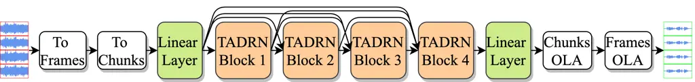
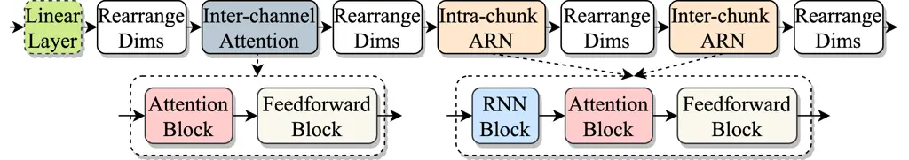
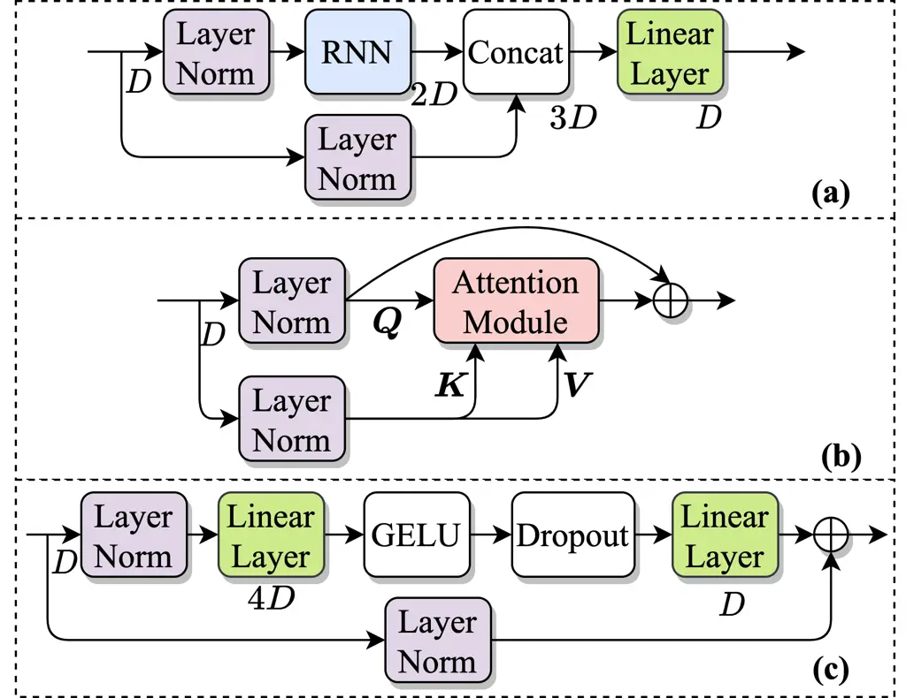
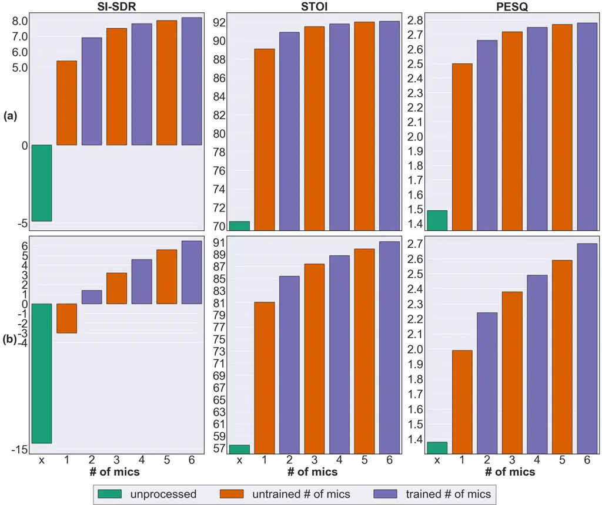
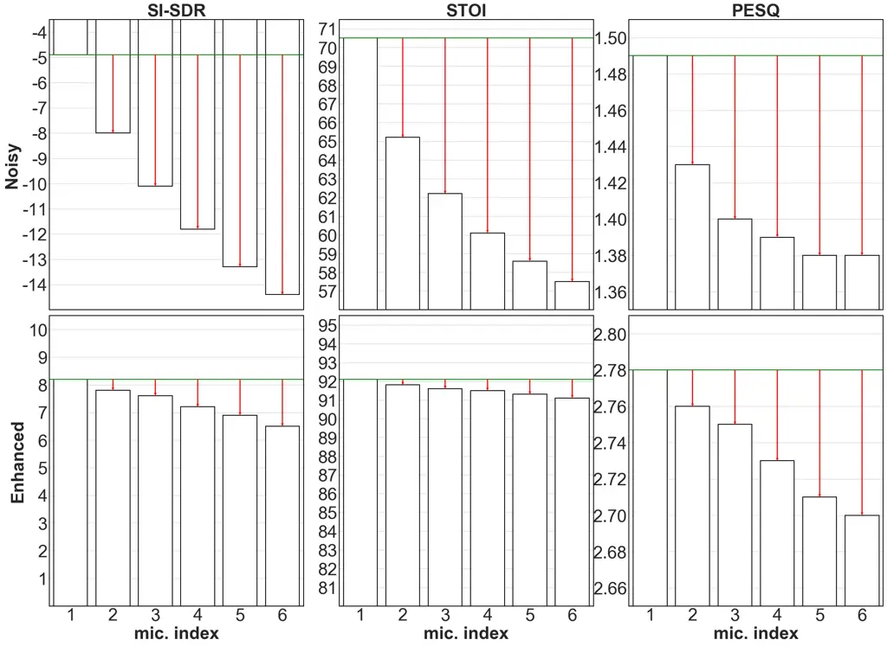

# Time-domain Ad-hoc Array Speech Enhancement Using a Triple-path Network

Ashutosh Pandey    Buye Xu    Anurag Kumar    Jacob Donley    Paul
Calamia    DeLiang Wang ^(†)^(†)thanks: \*Work done during internship at
Reality Labs Research at Meta.

###### Abstract

Deep neural networks (DNNs) are very effective for multichannel speech
enhancement with fixed array geometries. However, it is not trivial to
use DNNs for ad-hoc arrays with unknown order and placement of
microphones. We propose a novel triple-path network for ad-hoc array
processing in the time domain. The key idea in the network design is to
divide the overall processing into spatial processing and temporal
processing and use self-attention for spatial processing. Using
self-attention for spatial processing makes the network invariant to the
order and the number of microphones. The temporal processing is done
independently for all channels using a recently proposed dual-path
attentive recurrent network. The proposed network is a multiple-input
multiple-output architecture that can simultaneously enhance signals at
all microphones. Experimental results demonstrate the excellent
performance of the proposed approach. Further, we present analysis to
demonstrate the effectiveness of the proposed network in utilizing
multichannel information even from microphones at far locations.

^(†)^(†)address: $`{}^{\textup{1}}`$Reality Labs Research at Meta,
Redmond, WA USA  
$`{}^{\textup{2}}`$Department of Computer Science and Engineering, The
Ohio State University, USA

Index Terms: multi-channel, time-domain, MIMO, self-attention, ad-hoc
array

## 1 Introduction

Multi-channel speech enhancement is concerned with improving the
intelligibility and quality of noisy speech by utilizing signals from
microphone arrays. Traditional approaches use linear spatial filters in
a filter-and-sum process designed to preserve signals of the target
source _(e.g._, constrained to be undistorted) and attenuate signals
from interference (e.g. minimize noise variance), the latter of which
are often separated from the target source in the spatial domain \[1\].
Some of these approaches leverage spatial correlations of speech and
noise to determine filter coefficients, and hence, are convenient to use
with unknown array geometries \[2\].

Supervised speech enhancement using deep neural networks has achieved
remarkable success and popularity in the last few years \[3\]. On the
multi-channel front, DNNs have been extensively studied with fixed array
geometries \[4, 5, 6, 7, 8, 9, 10, 11, 12\]. However, neural-network
based speech enhancement with ad-hoc arrays, where microphone geometries
and distributions might not be known, has not received much attention
and remains little explored. Ad-hoc array processing offers considerable
flexibility compared to microphone arrays with fixed geometries and can
play a crucial role in enabling audio and speech applications in the
real world. For example, it is amenable to larger apertures in the
context of wearables as they are not restricted to the size of small
wearable devices. Moreover, methods developed for ad-hoc array
processing can be easier to use, adapt, and transfer in different
situations, as by design these methods are expected to work in
situations where microphone numbers and distributions might not be
known.

However, ad-hoc array processing using deep neural networks remains a
challenging problem. First, it requires a network to be able to process
a multi-channel signal with an unknown number of microphones at random
locations and in any order. In other words, the network should be
invariant to the number, geometry and the order of microphones. Second,
different microphones can be asynchronous. A systematic approach to
solve the first problem is designing networks with processing blocks
that are number and permutation invariant, such as global pooling and
self-attention \[13\]. The second problem can be solved by using
correlation-based approaches  \[14, 15, 16\].

Some recent works have investigated DNNs for ad-hoc array
processing \[17, 18, 11, 19, 20, 21\]. Luo et al. \[17\] proposed a
novel transform-average-concatenate module to deal with unknown number
and order, and graph neural networks were investigated for distributed
arrays by Tzirakis et al. \[11\]. Wang et al. \[22\] proposed a
spatio-temporal network where a recurrent network was used for temporal
modeling and self-attention was used for spatial modeling. The output
corresponding to the reference microphone was obtained by using a global
pooling layer in the end. Deep ad-hoc beamforming proposed in \[21\]
utilizes a two-stage approach: first select the top $`k`$ microphones
and then use the selected $`k`$ signals for $`k`$-microphone speech
enhancement in the second stage. Furnon _et al._  \[19\] proposed a
DNN-based two-stage approach to distributed multi-channel Weiner
filtering \[23\], where a single node DNN is used for node-specific
enhancement followed by a multi-node DNN for global enhancement.

In this paper, we propose a triple-path network, TADRN: Triple-Attentive
Dual-Recurrent Network, for ad-hoc array processing in the time domain.
The key idea in the TADRN design is to divide the overall processing
into spatial processing and temporal processing and use self-attention
for spatial processing. Using self-attention for spatial processing
makes the network invariant to the order and the number of microphones.
The spatial processing is followed by a dual-path attentive recurrent
network (ARN), a recurrent network augmented with self-attention \[24,
25\], for temporal processing. The temporal modeling is performed
independently for all channels, by first dividing a signal into smaller
chunks and then using separate ARNs to process intra-chunks and
inter-chunks data. The intra-chunk processing enables local learning
whereas inter-chunk processing helps capture global dependencies. Thus,
the TADRN becomes a triple-path attention framework: operating on
channels (inter-channel), within chunks of audio (intra-chunk) and
across the chunks (inter-chunks). Moreover, the intra-chunk and
inter-chunks learning are aided by recurrent architectures.

The TADRN design is similar to a recently proposed triple-path attentive
recurrent network (TPARN) for fixed array processing  \[12\]. However,
there are two key differences. First, TADRN uses self-attention across
channels whereas TPARN uses ARN. While theoretically, TPARN and TADRN
are both capable of handling an unknown number of microphones, the use
of self-attention across channels makes TADRN order-invariant, and
hence, more suitable for ad-hoc array processing. Second, the processing
order of underlying blocks, intra-chunk, inter-chunk, and inter-channel
blocks, is different in TADRN, determined based on empirical
observations.

TADRN is a multiple-input and multiple-output (MIMO) architecture that
can simultaneously enhance signals from all microphones. Our empirical
evaluations shows that the proposed TADRN approach can outperform prior
methods for speech enhancement using ad-hoc arrays. Moreover, we analyze
its behavior and attempt to provide important insights into the method.
More specifically, we show that TADRN can improve enhancement by
leveraging additional randomly placed microphones, even at locations far
from the source. Additionally, large improvements in objective scores
are observed when poorly placed microphones (far from source) in the
scene are complemented with more effective microphone positions, such as
those closer to a target source.



Figure 1: The proposed TADRN architecture for ad-hoc array multichannel
speech enhancement.

## 2 Problem Definition

A multi-channel noisy signal
$`\bm{X}=[\bm{x}_{1},\dots,\bm{x}_{P}]\in\mathbb{R}^{P\times N}`$ with
$`N`$ samples and $`P`$ microphones is modeled as

```math
\begin{split}x_{p}(n)&=y_{p}(n)+z_{p}(n)\\
&=h_{p}(n)\ast s(n)+z_{p}(n)\\
&=g_{p}(n)\ast s(n)+[(h_{p}-g_{p})(n)\ast s(n)+z_{p}(n)]\\
&=d_{p}(n)+u_{p}(n)\end{split} \tag{1}
```

where $`p=1,2\dots P`$ and $`n=0,1,\dots N-1`$. $`\bm{y}_{p}`$ and
$`\bm{z}_{p}`$ respectively represent the reverberant speech and noise
received at $`p^{th}`$ microphone, and $`\bm{s}`$ is the target speech
at the sound source. $`\bm{h}_{p}`$ is the room-impulse-response (RIR)
from the target source to the $`p^{th}`$ microphone, and $`\bm{g}_{p}`$
is the direct-path impulse response accounting for the free-field
propagation of the sound. $`\bm{d_{p}}`$ is the direct-path signal from
the speech source, and $`\bm{u}_{p}`$ denotes the overall interference
in this paper, which includes the background noise and the reverberation
of the target speech. The goal is to get a close estimate,
$`\bm{\hat{d}}_{r}`$, of the direct-path signal in the predefined
reference channel $`r`$, $`\bm{d}_{r}`$.

For a fixed array case, the number of microphones ($`P`$) and the array
geometry (_e.g._, a circular array with a fixed radius), is known
beforehand and remains unchanged. However, for an ad-hoc array, the
microphones can be randomly distributed in the environment. Neither the
number nor the relative locations of the microphones can be assumed to
be known _a priori_.



Figure 2: Architecture of TADRN Block.

## 3 Triple-attentive Dual-recurrent Network

The full block diagram of TADRN is shown in Fig. 1. First, the
multi-channel input signal $`\bm{X}`$ is converted into sequential
frames using a frame size of $`L`$ samples and a frame shift of $`K`$
samples, leading to 3D tensor representation of the signal,
$`\bm{\text{T}}=[\bm{X}_{1},\dots,\bm{X}_{T}]\in\mathbb{R}^{P\times T\times L}`$,
where $`T`$ is the number of frames. The consecutive frames are further
grouped into chunks with a chunk size of $`R`$ and chunk shift of $`S`$
forming a 4D tensor
$`\mathcal{T}=[\bm{\text{T}}_{1},\dots,\bm{\text{T}}_{C}]\in\mathbb{R}^{P\times C\times R\times L}`$,
where $`C`$ is the number of chunks.

The audio frames are first encoded to D-dimensional representations
using a linear layer, leading to
$`\bm{\text{E}}\in\mathbb{R}^{P\times C\times R\times D}`$ as outputs
from the linear layer. E is then processed using a stack of four TADRN
blocks. Let $`\bm{\text{B}}_{i}^{inp}`$ and $`\bm{\text{B}}_{i}^{out}`$
denote the input and output of the $`i^{th}`$ block, respectively.
$`\bm{\text{B}}_{1}^{inp}=\bm{\text{E}}`$,
$`\bm{\text{B}}_{i}^{out}\in\mathbb{R}^{P\times C\times R\times D}`$,
and
$`\bm{\text{B}}_{i}^{inp}=[\bm{\text{E}},\bm{\text{B}}_{1}^{out},\dots,\bm{\text{B}}_{i-1}^{out}]\in\mathbb{R}^{P\times C\times R\times i\cdot D}`$
for $`i>1`$.

The complete architecture of the TADRN block is shown in Fig. 2. It
consists of an optional linear layer followed by inter-channel
attention, intra-chunk ARN, and inter-chunk ARN. The linear layer is
used for $`i>1`$ to project a feature of size $`i\cdot D`$ to size
$`D`$. The inter-channel attention comprises an attention block and a
feedforward block, and the intera-chunk and inter-chunk ARNs comprise an
RNN block, an attention block, and a feedforward block.

The inputs to the inter-channel attention are first rearranged to
tensors of shape $`C\cdot R\times P\times D`$. These are then processed
by treating the first, second, and third dimension respectively as the
batch, sequence, and feature dimension. As a result, attention is
applied across channels for spatial modeling. Similarly, the inputs to
the intra-chunk ARN are reshaped to $`P\cdot C\times R\times D`$ to
treat frames within a chunk as a sequence for the local temporal
modeling, and the inputs to the inter-chunk ARN are reshaped to shape
$`P\cdot R\times C\times D`$ to treat different chunks as a sequence for
learning global temporal characteristics. Finally, the output from the
inter-chunk ARN is rearranged to the original shape of
$`P\times C\times R\times D`$.



Figure 3: (a) RNN block, (b) Attention block, (c) Feedforward block.

The structure of the RNN block, the attention block, and the feedforward
block in ARN is shown in Fig. 3. The inputs to all blocks are first
split into two streams using two separate layer normalizations. The
first stream in the attention block is used as query ($`\bm{Q}`$) and
the second stream is used as key ($`\bm{K}`$) and value ($`\bm{V}`$) for
the attention module. The outputs of the attention module are added to
$`\bm{Q}`$ to form a residual connection. Additional details of the
attention module can be be found in \[12\].

The first stream in the RNN block is processed using a RNN with a hidden
size of $`2D`$. It is then concatenated with the second stream, and then
projected to a size of $`D`$ using a linear layer. The first stream of
the feedforward block is projected to a size of $`4D`$ using a linear
layer with the GELU nonlinearity and dropout, projected again to the
size of $`D`$ using another linear layer, and then added to the second
stream to form a residual connection.

## 4 Experiments

### 4.1 Datasets

We create an ad-hoc array dataset using speech and noises from the DNS
challenge 2020 corpus¹¹ 1
https://github.com/microsoft/DNS-Challenge/blob/master/LICENSE \[26\].
We select speakers with one chapter and randomly split 90% of speakers
for training, 5% for validation, and 5% for evaluation. After this, for
each utterance a random chunk of a randomly sampled length with an
activity threshold (from script in \[26\]) greater than 0.6 is
extracted. The length of utterances are sampled from \[3, 6\] seconds
for training and \[3, 10\] seconds for test and validation. This results
in a total of 53k utterances for training, 2.6k for validation, and 3.3k
for test. Next, all the noises from the DNS corpus are randomly divided
into training, validation and test noises in a proportion similar to
that used for speech utterances.

The algorithm to generate spatialized multichannel ad-hoc array data
from DNS speech and noises is given in Algorithm 1. We sample a room
size and then sample $`6`$ locations inside the room for microphones,
one location for the speech source and $`5-10`$ locations for noises.
All the locations are sampled at least 0.5 m away from walls. We
simulate the room-impulse-responses (RIRs) from each source location to
all the microphone locations, and then convolve them with the speech and
noise signals. Finally, the convolved speech and noises are added
together using a random SNR value to create ad-hoc array multichannel
noisy data. The SNR is calculated using total speech and noise energy at
all microphones. In this case, the use of random locations for
microphones is creating an ad-hoc array scenario. We use
Pyroomacoustics \[27\] which uses a hybrid approach where the image
method with order 6 is used to model early reflections and ray-tracing
is used to model the late reverberation.

for _split_ in {train, test, validation } do

   for speech utterances in _split_ do

- •
  Draw room length and width from \[5,10\] m, and height from \[3, 4\]
  m;
- •
  Draw 6 microphone locations inside the room
- •
  Draw 1 speech source location inside the room;
- •
  Draw $`N_{ns}`$, number of noise sources, from \[5, 10\]
- •
  Draw $`N_{ns}`$ noise locations inside the room
- •
  Sample T60 uniformly from \[0.2, 1.3\] seconds
- •
  Generate RIRs corresponding to speech source location and $`N_{ns}`$
  noise locations for all microphone locations
- •
  Draw $`N_{ns}`$ noise utterances from noises in _split_
- •
  Propagate speech and noise signals to all mics by convolving with
  corresponding RIRs
- •
  Draw a value $`snr`$ from \[-10, 10\] dB, and add speech and noises at
  each mic using a scale so that the averaged SNR across all the
  microphone locations is $`snr`$;

   end for

end for

Algorithm 1 Ad-hoc array dataset spatialization process.

### 4.2 Experimental settings

All the utterances are resampled to 16 kHz. We break the utterances into
frames using $`L=16`$ and $`K=8`$. We use $`R=126`$ and $`S=63`$ to
group frames into chunks. TADRN uses $`4`$ blocks with $`D=128`$ inside
ARN. For the RNN in the ARN, we use bidirectional long short-term memory
networks (BLSTMs) with the hidden size of $`D`$ in each direction. The
dropout rate in the feedforward blocks of ARN is set to $`5\%`$. A phase
constrained magnitude (PCM) loss over all channels is used for training
 \[12, 28\]. All the models are trained for $`100`$ epochs on
$`4`$-second long utterances with a batch size of $`8`$. For utterances
longer than $`4`$ seconds, we dynamically extract a random chunk of 4
seconds during training.

The automatic mixed precision training is utilized for efficient
training \[29\]. The learning rate is initialized with 0.0004 and is
dynamically scaled to half if the best validation score does not improve
in five consecutive epochs. The model with the best validation score is
used for evaluation.

All of the models are trained on microphone arrays with $`2`$, $`4`$ ,
or $`6`$ channels, and evaluated on arrays with $`1-6`$ channels, where
$`1`$, $`3`$, and $`5`$ are untrained numbers of microphones. During
training, we first randomly sample $`p`$, the number of microphones from
$`\{2,4,6\}`$, and then create a batch of training examples with $`p`$
microphones. This is done to avoid redundant computations.

We compare TADRN with a recently proposed fiter-and-sum network with
transform average and concatenate module (FasNet-TAC) for ad-hoc array
processing \[17\]. We also compare TADRN with three fixed-array baseline
models: dense convolutional recurrent network (DCRN) \[8\], FasNet-TAC
 \[17\], and channel-attention Dense UNet (CA-DUNet) \[9\].

The models are compared using three enhancement objective metrics:
short-time objective intelligibility (STOI) \[30\], perceptual
evaluation of speech quality (PESQ) \[31\], and scale-invariant
signal-to-distortion ratio (SI-SDR) for signals from the first
microphone channel. Note that the numbering of the microphone channels
are randomly assigned. STOI is reported in percentage.

Mix. 1ch 2ch 3ch 4ch 5ch 6ch SI-SDR FASNET-TAC \[17\] -12.2 -6.1 -3.0
-1.5 -0.4 0.4 1.0 TADRN -0.8 3.0 4.5 5.4 6.0 6.4 STOI FASNET-TAC \[17\]
60.8 78.0 81.0 82.4 83.3 84.0 84.5 TADRN 83.3 87.3 88.9 89.9 90.5 90.9
PESQ FASNET-TAC \[17\] 1.40 1.81 1.94 2.02 2.07 2.11 2.14 TADRN 2.12
2.38 2.51 2.58 2.64 2.68

Table 1: TADRN comparison with an ad-hoc array baseline model.



Figure 4: TADRN performance with different number of microphones. a)
Microphones sorted by increasing distance from the source, b)
Microphones sorted by decreasing distance from the source.



Figure 5: An illustration of the gap reduction in the objective scores
at different microphones after MIMO processing of TADRN.

### 4.3 Experimental results

#### 4.3.1 Comparison with Prior Works

First, we compare TADRN with the baseline FasNet-TAC. Results with
different numbers of microphones are given in Table 1. We observe that
the performance of both the models improves gradually as the number of
microphones are increased. However, TADRN results are consistently and
significantly better than FasNet-TAC for all the cases. For instance,
for the 6-channel case, TADRN outperforms FasNet-TAC by $`5.4`$ dB in
SI-SDR, $`6.4\%`$ in STOI, and $`0.54`$ in PESQ. Moreover,
single-channel TADRN is able to outperform 3-channel FasNet-TAC.

#### 4.3.2 Analysis of Impact of Microphone Locations

Results in Table 1 indicate that TADRN can improve performance by adding
more microphones at random locations inside a room. Because the
microphones in an ad-hoc array can be well separated in space, the SNR
at each microphone location could be significantly different. For
example, SNR at locations closer to the speech source is generally
higher than locations further away because of the decay of the sound
energy. In order to understand how the local SNR of each microphone
affects the array performance, we conduct two experiments. First, we
sort microphones in the increasing order of distance from the source to
simulate decreasing order of SNR (on average), and evaluate the signal
improvement in the channel of the microphone closest to the source. This
is visualized in Fig. 4 (a). We observe that TADRN gradually improves
performance when more microphones are added at further distance,
although the performance tends to saturate after four to five
microphones. Second, in Fig. 4 (b), we analyze TADRN’s behavior for a
reverse case where arrays are sorted in the order of decreasing distance
from the source. For this case, TADRN improves performance significantly
and consistently with increasing number of microphones, as newly added
microphones are closer to the source.

These results suggest that while TADRN naturally relies more on high SNR
microphone channels, it can also leverage all other lower SNR channels
to further improve the performance.

#### 4.3.3 Analysis of MIMO

TADRN is a MIMO architecture that can enhance signals from all
microphones simultaneously. We analyze performance improvements for all
microphones in an array sorted in the order of increasing distance from
the source. This is visualized in Fig. 5, and an interesting behavior
can be observed in the plot. The objective scores for unprocessed
signals differ a lot at different microphones in an array. However, for
enhanced signals, the difference between objective scores becomes very
small. For instance, for the unprocessed case, the difference between
the $`1^{st}`$ and the $`6^{th}`$ microphone is close to $`9`$ dB for
SI-SDR and $`13\%`$ for STOI. For the enhanced case, however, the
difference is less than $`2`$ dB for SI-SDR and close to $`1\%`$ for
STOI. We also note that the difference in PESQ is decreased by a
relatively smaller amount. We think that this may be because there is
only a small difference in PESQ for the unprocessed case. This analysis
illustrates that in the proposed MIMO learning framework, poorly placed
microphones at far locations from the source are benefitting the most by
utilizing better signals from microphones at closer locations.

#### 4.3.4 Application to Fixed-Geometry Arrays

Finally, we evaluate a TADRN trained on ad-hoc arrays for a 4-channel
circular array dataset from the DNS corpus \[12\]. Also, we compare with
existing models trained specifically for a 4-channel circular array.
Objective scores are given in Table 2. We can see that even though TADRN
is far from TPARN, it is able to outperform two fixed-array baselines,
CA-DUNet and FasNet-TAC. It is better than DCRN in SI-SDR but worse in
STOI and PESQ.

Test Metric SI-SDR STOI PESQ Type Unprocessed -7.6 63.8 1.38 fixed
CA-DUNet \[9\] 2.7 82.1 1.93 fixed DCRN \[8\] 4.6 90.1 2.57 fixed
FasNet-TAC \[17\] 4.7 86.5 2.26 fixed TPARN \[12\] 8.4 91.9 2.75 ad-hoc
TADRN 5.6 88.1 2.41

Table 2: TADRN Performance on fixed-array dataset

## 5 Conclusions

We have proposed a triple-attentive dual-recurrent network for ad-hoc
array multichannel speech enhancement in the time-domain. TADRN is
designed by extending a single-channel dual-path model to a multichannel
model by adding a third-path along the spatial dimension. A simple but
effective attention along the channels is proposed to make TADRN
suitable for ad-hoc array processing, _i.e._, the number of microphones
and order invariant processing. Experimental results have established
that TADRN is highly effective in utilizing multichannel information
even from the microphones at far locations.

## References

- \[1\] S. Gannot, E. Vincent, S. Markovich-Golan, and A. Ozerov, “A
  consolidated perspective on multimicrophone speech enhancement and
  source separation,” _IEEE/ACM Transactions on Audio, Speech, and
  Language Processing_, pp. 692–730, 2017.
- \[2\] S. Markovich-Golan, A. Bertrand, M. Moonen, and S. Gannot,
  “Optimal distributed minimum-variance beamforming approaches for
  speech enhancement in wireless acoustic sensor networks,” _Signal
  Processing_, vol. 107, pp. 4–20, 2015.
- \[3\] D. L. Wang and J. Chen, “Supervised speech separation based on
  deep learning: An overview,” _IEEE/ACM Transactions on Audio, Speech,
  and Language Processing_, pp. 1702–1726, 2018.
- \[4\] H. Erdogan, J. R. Hershey, S. Watanabe, M. I. Mandel, and
  J. Le Roux, “Improved MVDR beamforming using single-channel mask
  prediction networks,” in _INTERSPEECH_, 2016, pp. 1981–1985.
- \[5\] J. Heymann, L. Drude, and R. Haeb-Umbach, “Neural network based
  spectral mask estimation for acoustic beamforming,” in _ICASSP_, 2016,
  pp. 196–200.
- \[6\] Z.-Q. Wang and D. Wang, “Combining spectral and spatial features
  for deep learning based blind speaker separation,” _IEEE/ACM
  Transactions on Audio, Speech, and Language Processing_, pp.
  457–468, 2018.
- \[7\] Z.-Q. Wang, J. Le Roux, and J. R. Hershey, “Multi-channel deep
  clustering: Discriminative spectral and spatial embeddings for
  speaker-independent speech separation,” in _ICASSP_, 2018, pp. 1–5.
- \[8\] Z.-Q. Wang and D. Wang, “Multi-microphone complex spectral
  mapping for speech dereverberation,” in _ICASSP_, 2020, pp. 486–490.
- \[9\] B. Tolooshams, R. Giri, A. H. Song, U. Isik, and
  A. Krishnaswamy, “Channel-attention dense U-Net for multichannel
  speech enhancement,” in _ICASSP_, 2020, pp. 836–840.
- \[10\] R. Gu, J. Wu, S.-X. Zhang, L. Chen, Y. Xu, M. Yu, D. Su,
  Y. Zou, and D. Yu, “End-to-end multi-channel speech separation,”
  _arXiv:1905.06286_, 2019.
- \[11\] P. Tzirakis, A. Kumar, and J. Donley, “Multi-channel speech
  enhancement using graph neural networks,” in _ICASSP_, 2021, pp.
  3415–3419.
- \[12\] A. Pandey, B. Xu, A. Kumar, J. Donley, P. Calamia, and D. L.
  Wang, “TPARN: Triple-path attentive recurrent network for time-domain
  multichannel speech enhancement,” in _ICASSP_, 2022, pp. 6497–6501.
- \[13\] M. Zaheer, S. Kottur, S. Ravanbakhsh, B. Poczos,
  R. Salakhutdinov, and A. Smola, “Deep sets,” _arXiv:1703.06114_, 2017.
- \[14\] Z. Liu, “Sound source separation with distributed microphone
  arrays in the presence of clocks synchronization errors,” in
  _International Workshop for Acoustic Echo and Noise Control_, 2008.
- \[15\] S. Araki, N. Ono, K. Kinoshita, and M. Delcroix, “Meeting
  recognition with asynchronous distributed microphone array using
  block-wise refinement of mask-based MVDR beamformer,” in _ICASSP_,
  2018, pp. 5694–5698.
- \[16\] T. Yoshioka, Z. Chen, D. Dimitriadis, W. Hinthorn, X. Huang,
  A. Stolcke, and M. Zeng, “Meeting transcription using virtual
  microphone arrays,” _arXiv:1905.02545_, 2019.
- \[17\] Y. Luo, Z. Chen, N. Mesgarani, and T. Yoshioka, “End-to-end
  microphone permutation and number invariant multi-channel speech
  separation,” in _ICASSP_, 2020, pp. 6394–6398.
- \[18\] D. Wang, Z. Chen, and T. Yoshioka, “Neural speech separation
  using spatially distributed microphones,” _arXiv:2004.13670_, 2020.
- \[19\] N. Furnon, R. Serizel, S. Essid, and I. Illina, “DNN-based mask
  estimation for distributed speech enhancement in spatially
  unconstrained microphone arrays,” _IEEE/ACM Transactions on Audio,
  Speech, and Language Processing_, vol. 29, pp. 2310–2323, 2021.
- \[20\] ——, “Attention-based distributed speech enhancement for
  unconstrained microphone arrays with varying number of nodes,” in
  _European Signal Processing Conference_, 2021, pp. 1095–1099.
- \[21\] X.-L. Zhang, “Deep ad-hoc beamforming,” _Computer Speech &
  Language_, vol. 68, p. 101201, 2021.
- \[22\] D. Wang, T. Yoshioka, Z. Chen, X. Wang, T. Zhou, and Z. Meng,
  “Continuous speech separation with ad hoc microphone arrays,” _arXiv
  preprint arXiv:2103.02378_, 2021.
- \[23\] A. Bertrand and M. Moonen, “Distributed adaptive node-specific
  signal estimation in fully connected sensor networks—Part i:
  Sequential node updating,” _IEEE Transactions on Signal Processing_,
  vol. 58, no. 10, pp. 5277–5291, 2010.
- \[24\] A. Pandey and D. Wang, “Dual-path self-attention RNN for
  real-time speech enhancement,” _arXiv:2010.12713_, 2020.
- \[25\] ——, “Self-attending RNN for speech enhancement to improve
  cross-corpus generalization,” _IEEE/ACM Transactions on Audio, Speech,
  and Language Processing_, vol. 30, pp. 1374–1385, 2022.
- \[26\] C. K. Reddy, V. Gopal, R. Cutler, E. Beyrami, R. Cheng,
  H. Dubey, S. Matusevych, R. Aichner, A. Aazami, S. Braun _et al._,
  “The INTERSPEECH 2020 deep noise suppression challenge: Datasets,
  subjective testing framework, and challenge results,”
  _arXiv:2005.13981_, 2020.
- \[27\] R. Scheibler, E. Bezzam, and I. Dokmanić, “Pyroomacoustics: A
  python package for audio room simulation and array processing
  algorithms,” in _ICASSP_, 2018, pp. 351–355.
- \[28\] A. Pandey and D. Wang, “Dense CNN with self-attention for
  time-domain speech enhancement,” _IEEE/ACM Transactions on Audio,
  Speech, and Language Processing_, pp. 1270–1279, 2021.
- \[29\] P. Micikevicius, S. Narang, J. Alben, G. Diamos, E. Elsen,
  D. Garcia, B. Ginsburg, M. Houston, O. Kuchaiev, G. Venkatesh, and
  H. Wu, “Mixed precision training,” in _ICLR_, 2018. \[Online\].
  Available: https://openreview.net/forum?id=r1gs9JgRZ
- \[30\] C. H. Taal, R. C. Hendriks, R. Heusdens, and J. Jensen, “An
  algorithm for intelligibility prediction of time–frequency weighted
  noisy speech,” _IEEE Transactions on Audio, Speech, and Language
  Processing_, pp. 2125–2136, 2011.
- \[31\] A. W. Rix, J. G. Beerends, M. P. Hollier, and A. P. Hekstra,
  “Perceptual evaluation of speech quality (PESQ) - a new method for
  speech quality assessment of telephone networks and codecs,” in
  _ICASSP_, 2001, pp. 749–752.
