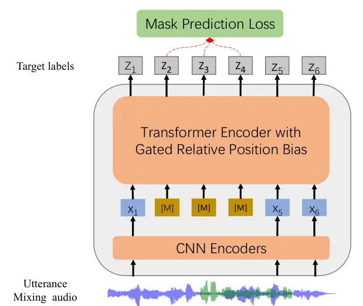
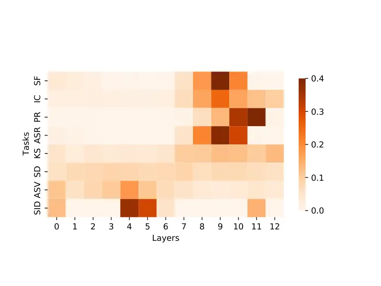
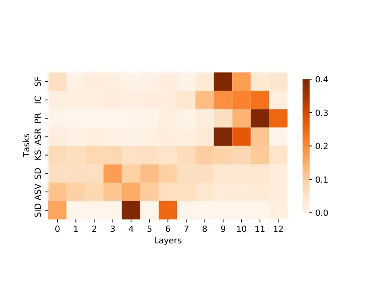
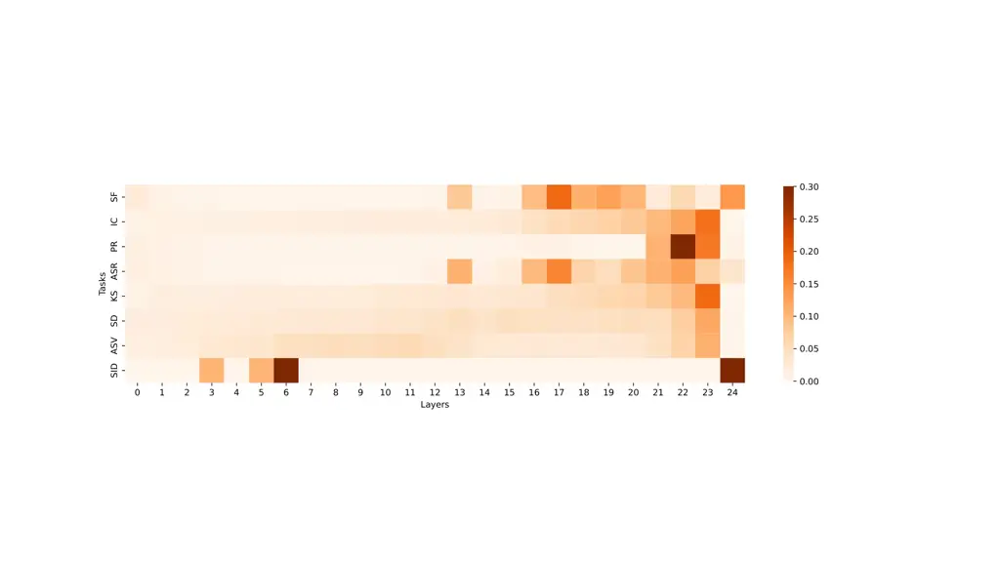
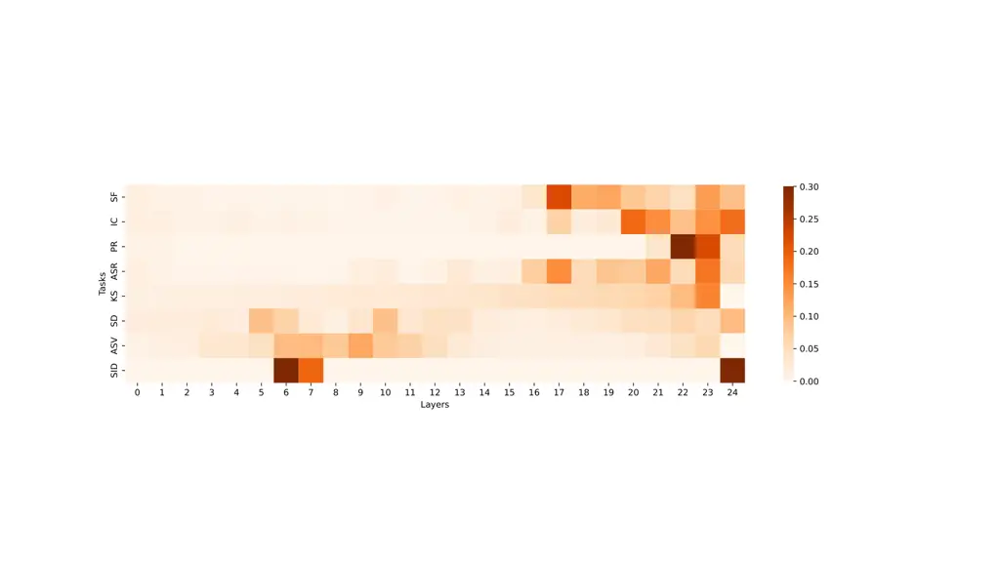
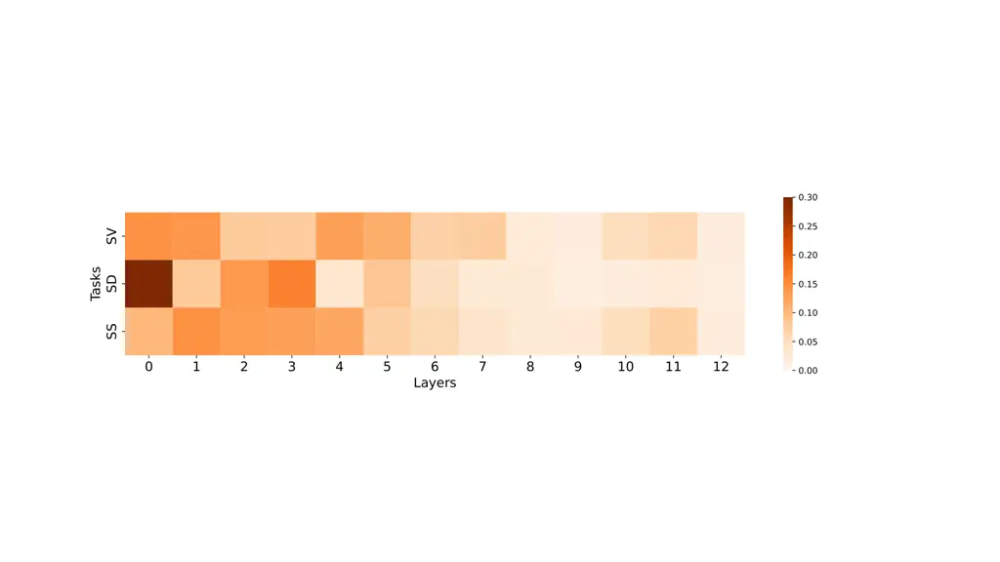
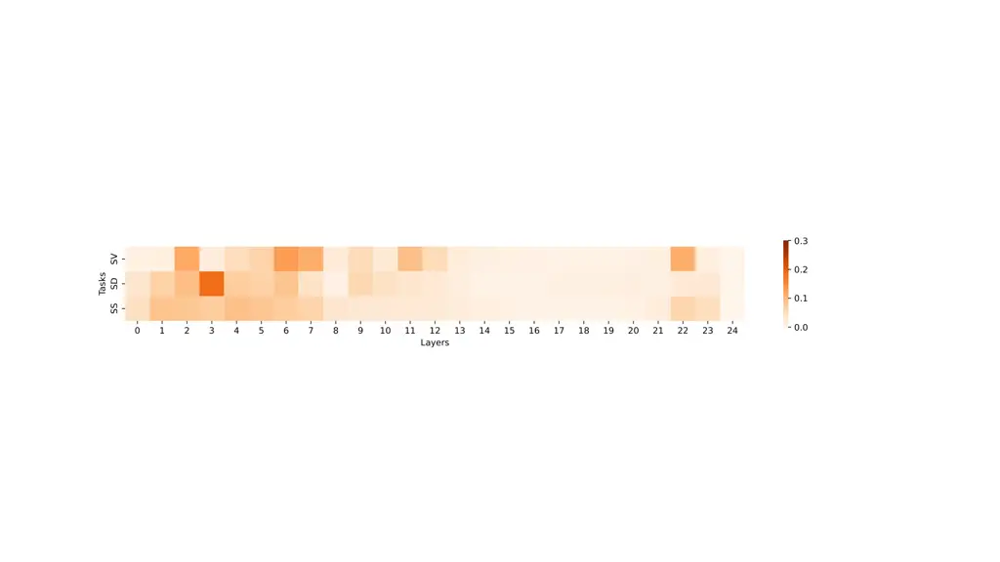

# WavLM: Large-Scale Self-Supervised Pre-Training for Full Stack Speech ProcessingThanks: \* Equal contribution. The work was done at Microsoft during the internship of the first three authors.Thanks: Correspondence to Yu Wu: yuwu1@microsoft.com

Sanyuan Chen\*    Chengyi Wang\*    Zhengyang Chen\*    Yu Wu\*   
Shujie Liu    Zhuo Chen Affiliation: Jinyu Li, Naoyuki Kanda, Takuya
Yoshioka, Xiong Xiao, Jian Wu, Long Zhou, Shuo Ren, Affiliation: Yanmin
Qian, Yao Qian, Jian Wu, Michael Zeng, Xiangzhan Yu, Furu Wei

###### Abstract

Self-supervised learning (SSL) achieves great success in speech
recognition, while limited exploration has been attempted for other
speech processing tasks. As speech signal contains multi-faceted
information including speaker identity, paralinguistics, spoken content,
etc., learning universal representations for all speech tasks is
challenging. To tackle the problem, we propose a new pre-trained model,
WavLM, to solve full-stack downstream speech tasks. WavLM jointly learns
masked speech prediction and denoising in pre-training. By this means,
WavLM does not only keep the speech content modeling capability by the
masked speech prediction, but also improves the potential to non-ASR
tasks by the speech denoising. In addition, WavLM employs gated relative
position bias for the Transformer structure to better capture the
sequence ordering of input speech. We also scale up the training dataset
from 60k hours to 94k hours. WavLM Large achieves state-of-the-art
performance on the SUPERB benchmark, and brings significant improvements
for various speech processing tasks on their representative benchmarks.
The code and pre-trained models are available at https://aka.ms/wavlm.

###### Index Terms: 

Self-Supervised Learning, Speech Pre-Training

## I Introduction

Over the past few years, self-supervised learning (SSL) has achieved
great success in the fields of natural language processing (NLP) \[1, 2,
3\]. It leverages large amounts of text data to learn universal text
representations, which can benefit almost all NLP downstream tasks by
fine-tuning. Recently, SSL has also shown prominent results for speech
processing, especially on phoneme classification \[4\] and automatic
speech recognition (ASR) \[5, 6, 7\]. However, in other speech tasks, it
is still the standard practice to train models from scratch with
task-specific datasets.

Building a general pre-trained model for full stack speech processing
tasks is essential to the further development of speech processing,
because many tasks are short of supervised data, especially for non-ASR
tasks. A model pre-trained on large-scale unlabeled data is able to
boost the performance of these tasks, reduce data labeling efforts, and
lower entry barriers for individual tasks. Furthermore, it is infeasible
to build different pre-trained models for different downstream tasks, as
the pre-training stage requires huge computational resources. In the
past, it has been infeasible to build such a general model, as different
tasks focus on different aspects of speech signals. For instance,
speaker verification requires the network to learn the speaker
characteristic regardless of the spoken content, while speech
recognition demands the network to discard speaker characteristics and
focus only on the content information. Meanwhile, unlike verification
and recognition tasks, speaker diarization and speech separation involve
multiple speakers, which creates additional obstacles to learning
general speech representations. Recent advances fueled by large-scale
pre-trained models have changed the situation. \[8\] proves the
potential of pre-trained models on full-stack speech tasks by using the
weighted sum of embeddings from different layers.¹¹ 1 The paper does not
explicitly mention it, but their presentation highlights the
contribution of weighted sum hidden states. Details can be found from
28:00 to 31:00 of https://www.youtube.com/watch?v=Fw2ujGzmfNA They find
different layers containing information useful for different tasks. For
instance, the hidden states of the top layers are useful for ASR, while
the bottom layers are more effective for speaker verification.

While exciting as a proof of concept, there are still some drawbacks in
existing pre-trained models: 1) Current pre-trained models are
unsatisfactory for multi-speaker tasks, such as speaker diarization and
speech separation. Our experiments show that speech separation models
trained on top of HuBERT \[6\], a top-performing speech pre-trained
model, achieve only marginal improvement compared with the models
trained from scratch. This is mainly because the pre-training methods do
not sufficiently enforce speaker discrimination, and the training data
contain only single-speaker audios. 2) Speech pre-training crucially
relies on high quality and large quantities of unlabeled audios. The
existing system utilizes Libri-Light \[9\] as the main source, but the
massive audiobook data mismatches the data in a real scenario and using
it exclusively hurts the model performance when the acoustic
characteristics of the downstream tasks are different from those of the
audiobook \[10, 11, 12, 13\]. \[14\] trains wav2vec 2.0 \[5\] on larger
and more diverse datasets, but there are still over 90$`\%`$ audio data
derived from audiobook. To eliminate the audiobook data bias, we try to
gather data from different sources as much as possible in our
experiments.

In this paper, we present WavLM, which learns universal speech
representations from massive unlabeled speech data and adapts
effectively across various speech processing tasks. We propose a masked
speech denoising and prediction framework for WavLM, where some inputs
are simulated noisy/overlapped speech with masks and the target is to
predict the pseudo-label of the original speech on the masked region
like HuBERT. The framework combines the masked speech prediction and
denoising in pre-training. Therefore, the WavLM model learns not only
the ASR information by the masked speech prediction, but also the
knowledge of non-ASR tasks by the speech denoising modeling. For
instance, the process of pseudo-label prediction on overlapped speech
implicitly improves the model capability on diariazation and separation
tasks. The speaker identity information and speech enhancement
capability are modeled by the pseudo-label prediction on simulated noisy
speech.

In addition, we optimize the model structure and training data of HuBERT
and wav2vec 2.0. We add gated relative position bias (grep) \[15\] to
the Transformer structure as the backbone, which improves model
performance for ASR and keeps almost the same parameter number and
training speed. Compared with the convolutional relative position
embedding used in wav2vec 2.0 and HuBERT, the gates allow the relative
position bias to be adjusted adaptively by conditioning on the current
speech content. To further improve the model robustness and alleviate
the data mismatch, we scale up unlabeled pre-training data to 94k hours
of public audios. The dataset consists of 60k hours of Libri-Light, 10k
hours of GigaSpeech \[16\], and 24k hours of VoxPopuli \[17\]. The new
dataset consists of training instances from different scenarios, such as
podcasts, YouTube, and European Parliament (EP) event recordings.

We evaluate our models on nineteen subtasks, fifteen of which are from
SUPERB, and the other four are classic speech tasks on their
representative testsets.

- •
  WavLM achieves state-of-the-art (SOTA) performance on SUPERB \[8,
  18\]. WavLM Large outperforms HuBERT Large on 14 subtasks, and
  achieves an absolute 2.4 point improvement in the overall evaluation.
  Even WavLM Base+, a 3 times smaller model, is better than HuBERT Large
  owing to our three modifications.
- •
  Speaker verification is a task to verify the speaker’s identity from
  the voice characteristics. We select this task to evaluate the model’s
  capability of extracting speaker-related features. WavLM Large exceeds
  the well-known SOTA system, ECAPA-TDNN \[19\], by a large margin and
  achieves 0.383%, 0.480% and 0.986% EER (Equal Error Rate) on the three
  official trial lists of VoxCeleb1 \[20\].
- •
  Speech separation is a classic multi-speaker task, which is the key to
  solving the cocktail party problem. The task can evaluate the model’s
  capability of extracting multiple speech signals from a mixture of
  sounds. WavLM achieves SOTA performance on the speech separation
  LibriCSS benchmark \[21\], and significantly outperforms the previous
  Conformer model \[22\] by a 27.7$`\%`$ relative word error rate (WER)
  reduction.
- •
  Speaker diarization is a task to recognize “who spoke when” from an
  input audio stream \[23\]. WavLM achieves SOTA performance on the
  CALLHOME speaker diarization benchmark. Compared to the EEND-EDA
  clustering method \[24\], our model achieves a 12.6$`\%`$ diarization
  error rate reduction.
- •
  Speech recognition requires the model to learn content information,
  which is the main focus of the previous SSL work. We evaluate our
  model in the LibriSpeech 960h setting. WavLM shows comparable
  performance to the wav2vec 2.0 and HuBERT, which achieves 1.8% and
  3.2% WER on the test-clean and test-other sets, respectively.

The contribution of the paper can be summarized as follows: 1) WavLM
sheds light on a general pre-trained model for full stack speech
processing tasks, in contrast to the previous SSL works focusing on a
group of similar tasks. 2) We propose simple but effective modifications
to the existing pre-trained models, which show general and consistent
improvements across downstream tasks. 3) We scale-up self-supervised
speech pre-training with more unlabeled data and longer training steps. 4) We achieve SOTA results on the SUPERB benchmark, and significantly
boost the performance for various speech processing tasks on their
representative benchmarks, including speech separation, speaker
verification, and speaker diarization. The models and code are released
²² 2 https://aka.ms/wavlm to facilitate future research.

## II Related Work

SSL methods can be categorized into generative learning, discriminative
learning, and multitask learning, based on the training objective. The
research line of generative learning can be traced back to the
auto-encoding model, which reconstructs the whole speech from latent
variables, either continuous \[25, 26, 27\] or discrete \[28\]. Recent
works propose to predict future frames from the history with an
autoregressive model \[29, 30, 31, 32\], or recover the masked frames
from the corrupted speech with a non-autoregressive model \[33, 34, 35,
36, 37, 38\]. Apart from generative learning, discriminative learning
has also gathered interests recently. The well-known examples include
CPC \[4\], wav2vec \[39\], vq-wav2vec \[40\], wav2vec 2.0 \[5\],
DiscreteBERT \[41\], HuBERT \[6\] and w2v-BERT \[42\]. CPC and the
wav2vec series models use the contrastive InfoNCE loss to discriminate
the positive samples from negative samples. Motivated by the masked
language model loss in NLP, DiscreteBERT and HuBERT predict discrete
targets of masked regions. w2v-BERT further combines the contrastive
loss and the masked prediction loss in an end-to-end fashion. Multi-task
learning is adopted in PASE \[43\] and PASE+ \[44\]. They employ lots of
pre-training objectives such as waveform generation, prosody regression,
and contrastive objectives. UniSpeech \[7\] and JUST \[45\] combine SSL
and supervised learning for ASR, and show impressive results on
multi-lingual test sets.

Unlike SSL in computer vision (CV) and NLP fields, where one pre-trained
model is adapted to various downstream tasks, most speech SSL methods
focus on phoneme classification and ASR. Recently, \[8\] proposed the
SUPERB benchmark to evaluate SSL models across different tasks.
According to the results, HuBERT enjoys the best generalization ability
in the overall evaluation. To better learn speaker characteristics,
\[46\] proposed UniSpeech-SAT, which extends the HuBERT framework with
speaker-aware pre-training. It significantly outperforms other
pre-trained models on the speaker-related tasks with a slight
degradation on the ASR.

Compared with existing works, our model is the first to explore SSL for
full stack tasks instead of focusing on ASR or other specific tasks. It
should be noted that a concurrent work BigSSL \[47\] also mentions large
SSL model could handle various speech tasks. The difference is that our
work demonstrates that the full stack tasks can be handled by the
careful pre-training and fine-tuning strategy design, even without
scaling up the model size to 8 billion parameters.

## III Background: HuBERT

HuBERT is an SSL method that benefits from an offline clustering step to
provide target labels for a BERT-like prediction loss \[1\]. The
backbone is a Transformer encoder \[48\] with $`L`$ blocks. During
pre-training, the Transformer consumes masked acoustic features
$`\mathbf{u}`$ and outputs hidden states $`\mathbf{h}^{L}`$. The network
is optimized to predict the discrete target sequence $`\mathbf{z}`$,
where each $`z_{t}\in[C]`$ is a $`C`$-class categorical variable. The
distribution over codewords is parameterized with

```math
p(c|\mathbf{h}_{t}^{L})=\frac{{\rm exp}({\rm sim}(\mathbf{h}_{t}^{L}\mathbf{W}^{P},\mathbf{e}_{c})/\tau)}{\sum_{c^{\prime}=1}^{C}{\rm exp}({\rm sim}(\mathbf{h}_{t}^{L}\mathbf{W}^{P},\mathbf{e}_{c^{\prime}})/\tau)} \tag{1}
```

where $`\mathbf{W}^{P}`$ is a projection matrix, $`\mathbf{h}_{t}^{L}`$
is the output hidden state for step $`t`$, $`\mathbf{e}_{c}`$ is the
embedding for codeword $`c`$, sim($`a,b`$) computes the cosine
similarity and $`\tau=0.1`$ scales the logit. HuBERT proposes a masked
speech prediction task, where the prediction loss is only applied over
the masked regions, forcing the model to learn a combined acoustic and
language model over the continuous inputs.

HuBERT adopts an iterative re-clustering and re-training process: For
the first iteration, the targets are assigned by clustering the MFCC
features of the training data; For the second iteration, a new
generation of training targets are created by clustering the latent
representations generated by the first iteration trained model.



Fig. 1: Model Architecture.

## IV WavLM

We propose a masked speech denoising and prediction framework, where
some inputs are simulated noisy/overlapped with masks and the target is
to predict pseudo-labels of the original speech on the masked region.
Unlike existing masked speech modeling (HuBERT), which just focuses on
the ASR task, the masked speech denoising allows us to extend
pre-trained speech models to non-ASR tasks, since it implicitly models
information we need in the speaker identification, separation, and
diarization tasks. We further optimize the Transformer backbone and
extend pre-training data to 94k public English data.

### IV-A Model Structure

Our model architecture uses the Transformer model as the backbone. As
shown in Figure 1, it contains a convolutional feature encoder and a
Transformer encoder. The convolutional encoder is composed of seven
blocks of temporal convolution followed by layer normalization and a
GELU activation layer. The temporal convolutions have 512 channels with
strides (5,2,2,2,2,2,2) and kernel widths (10,3,3,3,3,2,2), resulting in
each output representing about 25ms of audio strode by 20ms. The
convolutional output representation $`\mathbf{x}`$ is masked as the
Transformer input. The Transformer is equipped with a convolution-based
relative position embedding layer with 128 kernel size and 16 groups at
the bottom.

To improve the model, we employ gated relative position bias \[15\]
which is encoded based on the offset between the “key” and “query” in
the Transformer self-attention mechanism. Let
$`\{\mathbf{h}_{i}\}_{i=1}^{T}`$ denote the input hidden states for the
self-attention module, each $`\mathbf{h}_{i}`$ is linearly projected to
a triple of query, key and value
$`(\mathbf{q}_{i},\mathbf{k}_{i},\mathbf{v_{i}})`$ as:

```math
\mathbf{q}_{i},\mathbf{k}_{i},\mathbf{v}_{i}=\mathbf{h}_{i}\mathbf{W}^{Q},\mathbf{h}_{i}\mathbf{W}^{K},\mathbf{h}_{i}\mathbf{W}^{V} \tag{2}
```

The self-attention outputs $`\{\tilde{\mathbf{h}}_{i}\}_{i=1}^{T}`$ are
computed via:

```math
\displaystyle a_{ij} \displaystyle\propto\exp\{\frac{\mathbf{q}_{i}\cdot\mathbf{k}_{j}}{\sqrt{d_{k}}}+r_{i-j}\} \tag{3}
```

```math
\displaystyle\tilde{\mathbf{h}}_{i} \displaystyle=\sum_{j=1}^{T}{a_{ij}\mathbf{v}_{j}} \tag{4}
```

where $`r_{i-j}`$ is the gated relative position bias added to the
attention logits. It is computed by:

```math
\displaystyle g_{i}^{\text{(update)}},g_{i}^{\text{(reset)}} \displaystyle=\sigma(\mathbf{q}_{i}\cdot\mathbf{u}),\sigma(\mathbf{q}_{i}\cdot\mathbf{w})
```

```math
\displaystyle\tilde{r}_{i-j} \displaystyle=wg_{i}^{\text{(reset)}}d_{i-j}
```

```math
\displaystyle r_{i-j}=d_{i-j}+g_{i}^{\text{(update)}} \displaystyle d_{i-j}+(1-g_{i}^{\text{(update)}})\tilde{r}_{i-j}
```

where $`d_{i-j}`$ is a learnable scalar relative position bias, the
vectors $`\mathbf{u},\mathbf{w}\in\mathbb{R}^{d_{k}}`$ are learnable
parameters, $`\sigma`$ is a sigmoid function, and $`w`$ is a learnable
value.

In our work, $`d_{i-j}`$ is a bucket relative position embedding \[3\]
and the embedding parameters are shared across all layers. We use
$`n=320`$ embeddings and each corresponds to a range of possible
$`(i-j)`$ offsets. The range increased logarithmically up to a maximum
offset of $`m=800`$, beyond which we assign all relative offsets to the
same embedding, i.e.,

```math
d_{|i-j|}=\begin{cases}|i-j|,&|i-j|<\frac{n}{4}\\
\lfloor\frac{n}{4}(\frac{\log(|i-j|)-\log(\frac{n}{4})}{\log(m)-\log(\frac{n}{4})}+1)\rfloor,&\frac{n}{4}\leq|i-j|<m\\
\frac{n}{2}-1,&|i-j|\geq m\\
\end{cases} \tag{5}
```

```math
d_{i-j}=d_{|i-j|}+\frac{n}{2}\cdot\mathds{1}_{\{i-j>0\}} \tag{6}
```

Compared with the convolutional relative position embedding in wav2vec
2.0 and HuBERT, the gates take the content into consideration, and
adaptively adjust the relative position bias by conditioning on the
current speech content. Intuitively, the same distance offset between
two frames tends to play different roles if one frame is the silence
while the other belongs to a speech segment.

1:  given a batch of speech utterances
$`\mathbf{U}=\{\mathbf{u}^{i}\}_{i=1}^{B}`$ with batch size $`B`$ and
length $`L`$, mixing probability $`p`$, a set of DNS noises
$`\mathbf{N}=\{\mathbf{n}^{i}\}_{i=1}^{M}`$ with size $`M`$, mixing
noise probability $`p_{n}`$

2:  Choose $`S`$ utterances $`\mathbf{U}^{S}\subset\mathbf{U}`$ by
Bernoulli sampling with probability $`p`$

3:  for each primary utterance
$`\mathbf{u}^{\text{pri}}\in\mathbf{U}^{S}`$ do

4:    Sample a random value $`v`$ from the continuous uniform
distribution $`\mathcal{U}(0,1)`$

5:    if $`v>p_{n}`$ then

6:    Sample a secondary utterance $`\mathbf{u}^{\text{sec}}`$ from
discrete uniform distribution with probability
$`P(\mathbf{u}^{\text{sec}}=\mathbf{x})=\frac{1}{B},\mathbf{x}\in\mathbf{U}`$

7:    Sample the mixing energy ratio $`r`$ from the continuous uniform
distribution $`\mathcal{U}(-5,5)`$

8:    else

9:    Sample a noise $`\mathbf{u}^{\text{sec}}`$ from discrete uniform
distribution with probability
$`P(\mathbf{u}^{\text{sec}}=\mathbf{x})=\frac{1}{M},\mathbf{x}\in\mathbf{N}`$

10:    Sample the mixing energy ratio $`r`$ from the continuous uniform
distribution $`\mathcal{U}(-5,20)`$

11:    end if

12:    Sample the mix length $`l`$ from discrete uniform distribution
with probability $`P(l=x)=\frac{2}{L},x\in\{1,\cdots,\frac{L}{2}\}`$

13:    Sample a start position $`s^{\text{pri}}`$ of
$`\mathbf{u}^{\text{pri}}`$ from discrete uniform distribution with
probability $`P(s^{\text{pri}}=x)=\frac{1}{L-l},x\in\{1,\cdots,L-l\}`$

14:    Sample a start position $`s^{\text{sec}}`$ of
$`\mathbf{u}^{\text{sec}}`$ from discrete uniform distribution with
probability $`P(s^{\text{sec}}=x)=\frac{1}{L-l},x\in\{1,\cdots,L-l\}`$

15:    Calculate the energy of the primary utterance
$`E^{\text{pri}}\leftarrow\frac{\sum\mathbf{u}^{\text{pri}}\cdot\mathbf{u}^{\text{pri}}}{L}`$

16:    Calculate the energy of the secondary utterance
$`E^{\text{sec}}\leftarrow\frac{\sum\mathbf{u}^{\text{sec}}\cdot\mathbf{u}^{\text{sec}}}{L}`$

17:    Calculate the mixing scale
$`scl\leftarrow\sqrt{\frac{E^{\text{pri}}}{10^{\frac{r}{10}}E^{\text{sec}}}}`$

18:
   $`\mathbf{u}^{\text{pri}}[s^{\text{pri}}:s^{\text{pri}}+l]\leftarrow\mathbf{u}^{\text{pri}}[s^{\text{pri}}:s^{\text{pri}}+l]+scl\cdot\mathbf{u}^{\text{sec}}[s^{\text{sec}}:s^{\text{sec}}+l]`$

19:  end for

20:  return $`\mathbf{U}`$

Algorithm 1 Noisy/Overlapped Speech Simulation

### IV-B Masked Speech Denoising and Prediction

We propose a masked speech denoising and prediction framework to improve
model robustness for complex acoustic environments and the preservation
of speaker identity. Specifically, we manually simulated
noisy/overlapped speech as inputs, and predict the pseudo-labels of
original speech on the masked region.

We simulate the noisy speech with multiple speakers and various
background noise for self-supervised pre-training. We randomly select
some utterances from each training batch and mix them with a randomly
selected noise audio or secondary utterance at a random region. The
noise audio and secondary utterance are randomly selected from the same
batch, randomly cropped, and scaled by a random source energy ratio. We
ensure that the overlap region is less than 50% and take the speaker
from the first utterance as the main speaker. With the masked speech
denoising and prediction task, the model is trained to identify the main
speaker from the noisy/overlapped speech and predict the content
information corresponding to the main speaker with the mask prediction
loss.

#### IV-B1 Noisy/Overlapped Speech Simulation

The details of our noisy/overlapped speech simulation method are shown
in Algorithm 1. Given a batch of speech utterances
$`\mathbf{U}=\{\mathbf{u}^{i}\}_{i=1}^{B}`$ with batch size $`B`$ and
length $`L`$ and a set of DNS (Deep Noise Suppression) noises \[49\]
$`\mathbf{N}=\{\mathbf{n}^{i}\}_{i=1}^{M}`$ with size $`M`$ (line 1), we
first randomly choose $`S`$ utterances to mix
$`\mathbf{U}^{S}=\{\mathbf{u}^{i}\}_{i=1}^{S}`$ from the batch by
Bernoulli sampling with probability $`p`$ (line 2). Then, for each
utterance $`\mathbf{u}^{\text{pri}}\in\mathbf{U}^{S}`$ (line 3), we
sample a random value $`v`$ the continuous uniform distribution
$`\mathcal{U}(0,1)`$ to decide whether to mix noise or a secondary
utterance (line 4). If the random value $`v`$ is greater than the mixing
noise probability $`p_{n}`$ (line 5), we sample a secondary utterance
$`\mathbf{u}^{\text{sec}}`$ from a discrete uniform distribution over
the batch $`\mathbf{U}`$ (line 6), and randomly sample the mixing energy
ratio $`r`$ from the uniform distribution $`\mathcal{U}(-5,5)`$ (line
7). Otherwise, we sample a noise $`\mathbf{u}^{\text{sec}}`$ from a
discrete uniform distribution over the set of DNS noises $`\mathbf{N}`$
(line 9), and randomly sample the mixing energy ratio $`r`$ from the
uniform distribution $`\mathcal{U}(-5,20)`$ (line 10). The sample range
of the mixing energy ratio follows the typical training utterance
simulation process of speech separation task \[50\]. Then, we randomly
select the mixing regions for both the utterances from the uniform
distributions (line 12-14). The mixing length $`l`$ is uniformly sampled
from $`\{1,\cdots,\frac{L}{2}\}`$ (line 12), and the start positions
$`s^{\text{pri}}`$ and $`s^{\text{sec}}`$ for utterance
$`\mathbf{u}^{\text{pri}}`$ and $`\mathbf{u}^{\text{sec}}`$ are both
uniformly sampled from $`\{1,\cdots,L-l\}`$ (line 13 and 14). Note that
as the mixing portion in each utterance is constrained to be less than
50%, the primary utterance would always be longer than the secondary
utterance, avoiding the problem of the indistinguishable main speaker in
the mixed speech signals. Next, given the mixing regions of the primary
utterance $`\mathbf{u}^{\text{pri}}[s^{\text{pri}}:s^{\text{pri}}+l]`$
and the secondary utterance
$`\mathbf{u}^{\text{sec}}[s^{\text{sec}}:s^{\text{sec}}+l]`$, we
calculate the corresponding mixing scale of the secondary utterance
$`scl`$ with the energy of the primary utterance $`E^{\text{pri}}`$, the
secondary utterance $`E^{\text{sec}}`$ (line 15-17). Finally, we mix the
selected region of the primary utterance
$`\mathbf{u}^{\text{pri}}[s^{\text{pri}}:s^{\text{pri}}+l]`$ with the
secondary utterance
$`\mathbf{u}^{\text{sec}}[s^{\text{sec}}:s^{\text{sec}}+l]`$ scaled by
the mixing scale $`scl`$ (line 18).

#### IV-B2 Mask Prediction Loss

Following HuBERT, we use the mask prediction loss to optimize our
network. Suppose that we have an utterance $`\mathbf{u}`$ and its
simulated version $`\mathbf{u^{\prime}}`$, we always generate
pseudo-labels $`\mathbf{z}`$ by feeding $`\mathbf{u}`$ to the last
iteration network. We follow HuBERT using the k-means clustering center
on MFCC or latent representations as the pseudo-labels. The details will
be introduced in Section V-A. Then, we obtain the hidden state
$`\mathbf{h}_{t}^{L}`$ by feeding $`\mathbf{u^{\prime}}`$ to the current
network, and optimize the objective function:

```math
\mathcal{L}=-\sum_{l\in K}\sum_{t\in M}{\rm log}p(z_{t}|\mathbf{h}_{t}^{L}) \tag{7}
```

where $`M`$ denotes the set of masked indices in time domain and
$`\mathbf{h}_{t}^{L}`$ is the $`L`$-layer Transformer output for step
$`t`$. Compared to previous methods, the framework is more beneficial to
various non-ASR tasks, since it implicitly models the non-ASR
information in pre-training.

### IV-C Pre-Training Data

We leverage large-scale unsupervised data from diverse domains to
improve the robustness of our model. Previous works use LibriSpeech
\[51\] or LibriLight \[9\] datasets for pre-training, which limits the
generalization capability of the pre-trained model since the input data
are all extracted from the audiobook. The background acoustics of the
speech obtained from the audiobook is different from what is observed in
other conditions , since the real captured sounds are usually
accompanied by various types of noise.

Motivated by this, we extend the training data with two datasets: (1)
10k hours of the GigaSpeech data \[16\]. It is collected from
audiobooks, podcasts and YouTube, covering both read and spontaneous
speaking styles, and a variety of topics, such as arts, science, sports,
etc. It should be noted that the total data size of GigaSpeech is 40k,
but 30k of them are not well processed. For example, there is a large
segment of silence at the beginning or at the end of some utterances in
the 30k data. More seriously, some utterances just contain background
noise without any speech. Thus, we just use the subset of 10k hours of
GigaSpeech data, which is well processed and validated with a
segmentation pipeline proposed in \[16\]. (2) VoxPopuli data \[17\]). It
is a large-scale multi-lingual unlabeled audio dataset consisting of
over 400k hours of audio in 23 languages, which is collected from
2009-2020 European Parliament (EP) event recordings including plenary
sessions, committee meetings, and other events. Since our focus is
English-only audio, we use 24k hours of English data in VoxPopuli for
pre-training. In total, we collect 94k hours of data, including
LibriLight, VoxPopuli, and GigaSpeech. We believe the enriched dataset
can improve the model robustness as it contains diverse audio
backgrounds, more speakers, and different contents. We call the dataset
Mix 94k hr to make the description simple.

### IV-D Stabilization of Training

Currently, it is a common practice to use 16-bit float precision (fp16)
or mixed precision to pre-train large models for faster computation and
less GPU memory consumption. Unfortunately, the training is unstable for
large models due to the overflow issue (characterized by NaN losses)
\[52\]. A major reason is the attention score
$`\frac{\mathbf{q}_{i}\cdot\mathbf{k}_{j}}{\sqrt{d}}`$ is larger than
the upper bound value of the fp16, resulting in the overflow issue in
training.

We apply a simple trick to alleviate the overflow issue \[52\]. Given
that softmax is invariant under translation by the same value in each
coordinate i.e.
$`\text{softmax}(\mathbf{x}+\alpha)_{k}=\text{softmax}(\mathbf{x})_{k}`$,
where $`\alpha`$ denotes a constant number, the equation (3) can be
implemented as

```math
\begin{split}\alpha_{i,j}&\propto\exp\{\frac{\mathbf{q}_{i}\cdot\mathbf{k}_{j}}{\sqrt{d}}+r_{i-j}\}\\
&=\exp\{(\frac{\mathbf{q}_{i}}{c\sqrt{d}}\cdot\mathbf{k}_{j}-\max_{j^{\prime}\leq T}(\frac{\mathbf{q}_{i}}{c\sqrt{d}}\cdot\mathbf{k}_{j^{\prime}}))\times c+r_{i-j}\}.\end{split} \tag{8}
```

where $`c`$ is a scale hyperparameter and set to 32 in our work. In this
way, the overflow issue could be solved, since
$`\max_{j^{\prime}\leq T}(\frac{\mathbf{q}_{i}}{c\sqrt{d}}\cdot\mathbf{k}_{j^{\prime}})`$
could guarantee the max value is smaller than $`2^{16}`$.

## V Experiment

### V-A Pre-Training Setup

The WavLM Base and WavLM Base+ have 12 Transformer encoder layers,
768-dimensional hidden states, and 8 attention heads, resulting in
94.70M parameters. The WavLM Large has 24 Transformer encoder layers,
1024-dimensional hidden states, and 12 attention heads, resulting in
316.62M parameters. The relative position embeddings are shared across
all layers, which avoids significantly increasing the number of
parameters. We pre-train the WavLM Base model for 400k steps on
LibriSpeech 960 hours audio \[51\] using the label generated by
clustering the 6-th transformer layer output of the 1st-iteration HuBERT
Base model. The WavLM Base+ and WavLM Large models are pre-trained for
1M and 700k steps on 94k large-scale diverse data using the labels
generated by clustering the 9th transformer layer output of the released
2nd-iteration HuBERT Base model ³³ 3
https://github.com/pytorch/fairseq/tree/main/examples/hubert. Even if
the 1st iteration WavLM is better than HuBERT, we find using the 1st
iteration pseudo-label of HuBERT results in a slightly better 2nd
iteration WavLM (0.2 WER reduction on LibriSpeech dev-other). The masked
speech denoising modeling is considered in 20$`\%`$ utterances, where
the mixing noise probability $`p_{n}`$ is set to 0 for WavLM Base model,
and 10$`\%`$ for WavLM Base+ and Large model. For other training
configurations, the same hyperparameters are used following \[6\], which
are shown in Appendix A.

|                               |          |            |                  |                    |                    |                    |                    |                    |                  |                   |                   |                  |                 |                    |                  |                   |                   |                      |                    |                    |                  |                    |
| ----------------------------- | -------- | ---------- | ---------------- | ------------------ | ------------------ | ------------------ | ------------------ | ------------------ | ---------------- | ----------------- | ----------------- | ---------------- | --------------- | ------------------ | ---------------- | ----------------- | ----------------- | -------------------- | ------------------ | ------------------ | ---------------- | ------------------ |
| Method                        | \#Params | Corpus     | Speaker          |                    |                    | Content            |                    |                    |                  |                   | Semantics         |                  |                 |                    | ParaL            | Generation        |                   |                      |                    |                    |                  | Overall            |
|                               |          |            | SID              | ASV                | SD                 | PR                 | ASR                | OOD-ASR            | KS               | QbE               | ST                | IC               | SF              |                    | ER               | SE                |                   | SS                   | VC                 |                    |                  |                    |
|                               |          |            | Acc $`\uparrow`$ | EER $`\downarrow`$ | DER $`\downarrow`$ | PER $`\downarrow`$ | WER $`\downarrow`$ | WER $`\downarrow`$ | Acc $`\uparrow`$ | MTWV $`\uparrow`$ | BLEU $`\uparrow`$ | Acc $`\uparrow`$ | F1 $`\uparrow`$ | CER $`\downarrow`$ | Acc $`\uparrow`$ | PESQ $`\uparrow`$ | STOI $`\uparrow`$ | SI-SDRi $`\uparrow`$ | MCD $`\downarrow`$ | WER $`\downarrow`$ | ASV $`\uparrow`$ | Score $`\uparrow`$ |
| FBANK                         | 0        | \-         | 8.5E-4           | 9.56               | 10.05              | 82.01              | 23.18              | 63.58              | 8.63             | 0.0058            | 2.32              | 9.10             | 69.64           | 52.94              | 35.39            | 2.55              | 93.6              | 9.23                 | 8.47               | 38.3               | 77.25            | 43.2               |
| PASE+ \[44\]                  | 7.83M    | LS 50 hr   | 37.99            | 11.61              | 8.68               | 58.87              | 25.11              | 61.56              | 82.54            | 0.0072            | 3.16              | 29.82            | 62.14           | 60.17              | 57.86            | 2.56              | 93.9              | 9.87                 | 8.66               | 30.6               | 63.20            | 51.5               |
| APC \[30\]                    | 4.11M    | LS 360 hr  | 60.42            | 8.56               | 10.53              | 41.98              | 21.28              | 63.12              | 91.01            | 0.0310            | 5.95              | 74.69            | 70.46           | 50.89              | 59.33            | 2.56              | 93.4              | 8.92                 | 8.05               | 27.2               | 87.25            | 59.2               |
| VQ-APC \[29\]                 | 4.63M    | LS 360 hr  | 60.15            | 8.72               | 10.45              | 41.08              | 21.20              | 63.56              | 91.11            | 0.0251            | 4.23              | 74.48            | 68.53           | 52.91              | 59.66            | 2.56              | 93.4              | 8.44                 | 7.84               | 22.4               | 94.25            | 59.5               |
| NPC \[33\]                    | 19.38M   | LS 360 hr  | 55.92            | 9.40               | 9.34               | 43.81              | 20.20              | 61.66              | 88.96            | 0.0246            | 4.32              | 69.44            | 72.79           | 48.44              | 59.08            | 2.52              | 93.1              | 8.04                 | 7.86               | 30.4               | 94.75            | 59.0               |
| Mockingjay \[35\]             | 85.12M   | LS 360 hr  | 32.29            | 11.66              | 10.54              | 70.19              | 22.82              | 65.27              | 83.67            | 6.6E-04           | 4.45              | 34.33            | 61.59           | 58.89              | 50.28            | 2.53              | 93.4              | 9.29                 | 8.29               | 35.1               | 79.75            | 51.0               |
| TERA \[34\]                   | 21.33M   | LS 960 hr  | 57.57            | 15.89              | 9.96               | 49.17              | 18.17              | 58.49              | 89.48            | 0.0013            | 5.66              | 58.42            | 67.50           | 54.17              | 56.27            | 2.54              | 93.6              | 10.19                | 8.21               | 25.1               | 83.75            | 57.2               |
| DeCoAR 2.0 \[37\]             | 89.84M   | LS 960 hr  | 74.42            | 7.16               | 6.59               | 14.93              | 13.02              | 53.62              | 94.48            | 0.0406            | 9.94              | 90.80            | 83.28           | 34.73              | 62.47            | 2.47              | 93.2              | 8.54                 | 7.83               | 17.1               | 90.75            | 66.3               |
| modified CPC \[53\]           | 1.84M    | LL 60k hr  | 39.63            | 12.86              | 10.38              | 42.54              | 20.18              | 62.54              | 91.88            | 0.0326            | 4.82              | 64.09            | 71.19           | 49.91              | 60.96            | 2.57              | 93.7              | 10.40                | 8.41               | 26.2               | 71.00            | 56.9               |
| wav2vec \[39\]                | 32.54M   | LS 960 hr  | 56.56            | 7.99               | 9.9                | 31.58              | 15.86              | 55.86              | 95.59            | 0.0485            | 6.61              | 84.92            | 76.37           | 43.71              | 59.79            | 2.53              | 93.8              | 9.30                 | 7.45               | 10.1               | 98.25            | 63.5               |
| vq-wav2vec \[40\]             | 34.15M   | LS 960 hr  | 38.80            | 10.38              | 9.93               | 33.48              | 17.71              | 60.66              | 93.38            | 0.0410            | 5.66              | 85.68            | 77.68           | 41.54              | 58.24            | 2.48              | 93.6              | 8.16                 | 7.08               | 13.4               | 100.00           | 61.8               |
| wav2vec 2.0 Base \[5\]        | 95.04M   | LS 960 hr  | 75.18            | 6.02               | 6.08               | 5.74               | 6.43               | 46.95              | 96.23            | 0.0233            | 14.81             | 92.35            | 88.30           | 24.77              | 63.43            | 2.55              | 93.9              | 9.77                 | 7.50               | 10.5               | 98.00            | 69.6               |
| HuBERT Base \[6\]             | 94.68M   | LS 960 hr  | 81.42            | 5.11               | 5.88               | 5.41               | 6.42               | 46.69              | 96.30            | 0.0736            | 15.53             | 98.34            | 88.53           | 25.20              | 64.92            | 2.58              | 93.9              | 9.36                 | 7.47               | 8.0                | 98.50            | 70.9               |
| WavLM Base                    | 94.70M   | LS 960 hr  | 84.51            | 4.69               | 4.55               | 4.84               | 6.21               | 42.81              | 96.79            | 0.0870            | 20.74             | 98.63            | 89.38           | 22.86              | 65.94            | 2.58              | 94.0              | 10.37                | 7.42               | 8                  | 98.00            | 72.0               |
| \- w/o denoising task         | 94.70M   | LS 960 hr  | 84.39            | 4.91               | 6.03               | 4.85               | 6.08               | 43.61              | 96.79            | 0.0799            | 21.03             | 98.42            | 88.69           | 23.43              | 65.55            | 2.56              | 93.9              | 9.91                 | 7.43               | 7.5                | 97.75            | 71.7               |
| \- w/o structure modification | 94.68M   | LS 960 hr  | 84.74            | 4.61               | 4.72               | 5.22               | 6.80               | 42.88              | 96.79            | 0.0956            | 20.03             | 98.31            | 88.56           | 24.00              | 65.60            | 2.58              | 94.0              | 10.29                | 7.45               | 8.4                | 99.00            | 71.9               |
| WavLM Base+                   | 94.70M   | Mix 94k hr | 89.42            | 4.07               | 3.50               | 3.92               | 5.59               | 38.32              | 97.37            | 0.0988            | 24.25             | 99.00            | 90.58           | 21.20              | 68.65            | 2.63              | 94.3              | 10.85                | 7.40               | 8.1                | 99.00            | 73.4               |
| wav2vec 2.0 Large \[5\]       | 317.38M  | LL 60k hr  | 86.14            | 5.65               | 5.62               | 4.75               | 3.75               | 44.69              | 96.66            | 0.0489            | 12.48             | 95.28            | 87.11           | 27.31              | 65.64            | 2.52              | 94.0              | 10.02                | 7.63               | 15.8               | 97.25            | 70.4               |
| HuBERT Large \[6\]            | 316.61M  | LL 60k hr  | 90.33            | 5.98               | 5.75               | 3.53               | 3.62               | 44.08              | 95.29            | 0.0353            | 20.01             | 98.76            | 89.81           | 21.76              | 67.62            | 2.64              | 94.2              | 10.45                | 7.22               | 9.0                | 99.25            | 72.2               |
| WavLM Large                   | 316.62M  | Mix 94k hr | 95.49            | 3.77               | 3.24               | 3.06               | 3.44               | 32.27              | 97.86            | 0.0886            | 26.57             | 99.31            | 92.21           | 18.36              | 70.62            | 2.70              | 94.5              | 11.19                | 7.30               | 9.0                | 99.00            | 74.6               |

TABLE I: Universal speech representation evaluation on SUPERB benchmark.
ParaL denote Paralinguistics aspect of speech.

### V-B Universal Representation Evaluation

#### V-B1 Setup

We first evaluate our models on SUPERB, which is designed to provide a
standard and comprehensive testbed for pre-trained models on various
speech tasks. It covers fifteen tasks, including Speaker Identification
(SID), Automatic Speaker Verification (ASV), Speaker Diarization (SD),
Phoneme Recognition (PR), Automatic Speech Recognition (ASR),
Out-Of-Domain Automatic Speech Recognition (OOD-ASR), Keyword Spotting
(KS), Query by Example Spoken Term Detection (QbE), Speech Translation
(ST), Intent Classification (IC), Slot Filling (SF), Emotion Recognition
(ER), Speech Enhancement (SE), Speech Separation (SS) and Voice
Conversion (VC). These tasks can be grouped into five aspects of speech:
content, speaker, semantics, paralinguistics, and generation.

We follow the settings created by SUPERB. 1) We use the same downstream
models as the SUPERB implementations for each downstream task. 2)
Pre-trained models are frozen to limit the space of the fine-tuning
hyperparameter search. 3) The downstream models consume the weighted sum
results of the hidden states extracted from each layer of the
pre-trained model. The detailed hyperparameters for fine-tuning our
WavLM models on SUPERB downstream tasks are shown in
Appendix Hyperparamters for fine-tuning. The overall score is computed
by ourselves: we multiply the QbE score with 100, replace each error
rate score with (1 - error rate), and average the scores of all tasks.

#### V-B2 Evaluation result

Table I shows the evaluation results. We compare our WavLM with several
SSL models which are evaluated by \[8, 18\]. In general, WavLM is very
powerful in universal representation learning. Our WavLM Base+ model has
outperformed HuBERT large and wav2vec 2.0 large in the overall score.

WavLM Base: From Table I, we can observe that WavLM Base performs better
than wav2vec 2.0 Base and HuBERT Base on all downstream tasks. It is a
fair comparison as the three models use the same amount of pre-training
data and the number of parameters. The results indicate the
effectiveness of our structure and the masked speech denoising modeling
in universal speech representation learning. We find the most impressive
result is speaker diarization, where the WavLM Base outperforms HuBERT
Base by 22.6% relatively. Our explanation is that the additional
overlapped speech forces the model to deal with multi-speaker signals
during pre-training. To verify this assumption, we conduct an ablation
study to remove simulated noisy/overlapped speech in pre-training. The
performance of the “w/o denoising task” drops significantly for the
speaker diarization task. We also evaluate the contribution of the
structure change. We can see that, in the “w/o structure modification”
setting, performance degradation can be witnessed especially for PR and
ASR tasks. It indicates that the gated relative position bias
contributes to the performance improvement of the content-related tasks.
Meanwhile, we can observe that WavLM performs very well on semantic,
paralinguistics, and generation tasks as well, demonstrating our model
is general for the full stack speech processing tasks.

WavLM Base+: WavLM Base+ shows the contribution from larger and more
diverse pre-training data. It consistently improves WavLM Base and even
outperforms the wav2vec 2.0 Large and HuBERT Large in the overall score.
This indicates that the 960h data are insufficient to fulfill the
capacity of the Base model. The combined dataset especially boosts the
performance of the testsets which are not extracted from the audiobook,
such as ASV, OOD-ASR, IC, SF, and ER.

WavLM Large: Most tasks benefit from the larger model size, especially
for the ASR. We obtain 38$`\%`$ word error rate reduction on the ASR by
model scaling-up. Furthermore, there is 6.07$`\%`$ absolute improvement
on the SID task, indicating the large model size also impacts the
speaker-related tasks. Compared to the HuBERT Large model, WavLM Large
is consistently better across 14 downstream tasks, demonstrating the
modifications are effective for the large-scale models.



(a) HuBERT Base



(b) WavLM Base+



(c) HuBERT Large



(d) WavLM Large

Fig. 2: Weight analysis on the SUPERB Benchmark. Layer 0 corresponds to
the input of the first Transformer layer. The y-axis represents
different tasks, while the x-axis represents different layers.

#### V-B3 Analysis

Following the SUPERB policies, we weighted-sum the hidden states of
different layers and feed it to the task-specific layers. Figure 2 shows
the weights of different layers of HuBERT and WavLM models on the
different downstream tasks of the SUPERB benchmark. The larger weight
indicates the greater contribution of the corresponding layer. We
normalize the weights from different layers based on the hidden state
values of their corresponding layers, which eliminates the weight bias
to layers with smaller hidden state values.

As for the Base models, the contribution patterns of different layers
are similar between WavLM and HuBERT, as shown in Figure 2a and 2b. We
can observe that the bottom layers contribute more to speaker-related
tasks, such as speaker identification, automatic speaker verification,
and speaker diarization. On the other hand, for automatic speech
recognition, phoneme recognition, intent classification, and slot
filling tasks, the top layers are more important. It indicates the Base
models learn speaker information with the bottom layers while the
content and semantic information are encoded in the top layers. The
model behavior is similar to Large models. In Figures 2c and 2d, we can
see that the top layers contribute most to content and semantic tasks,
while the middle layers have a great impact on speaker tasks. The
phenomenon indicates how to leverage hidden states of middle layers is
the key to the success of speaker-related tasks.

Since SUPERB requires the pre-trained model frozen in fine-tuning, it
cannot show the power of pre-trained models. To explore the limit of our
models, we further select typical speech tasks to evaluate our
pre-trained model performance. Four tasks are used to evaluate our model
from different perspectives, and the training data amount is not on the
same scale for the four tasks. The details of the tasks can be found in
Appendix Settings of downstream tasks.

### V-C Speaker Verification

#### V-C1 problem formulation

The training dataset for speaker verification contains audio and speaker
id pairs as $`\mathcal{D}=\{\mathbf{x_{i}},\mathbf{y_{i}}\}`$. Given
audio clip $`\mathbf{x}`$ and a reference $`\mathbf{x}^{\prime}`$, the
goal of speaker verification is to determine whether
$`\mathbf{x}^{\prime}`$ is from the same speaker as $`\mathbf{x}`$.

#### V-C2 Datasets

VoxCeleb1 \[20\] and VoxCeleb2 \[54\] datasets are used in our
experiments for speaker verification. For data pre-processing, we apply
online data augmentation using the MUSAN \[55\] noise, DNS noise \[49\]
and the RIR ⁴⁴ 4 https://www.openslr.org/28/ reverberation with
probability 0.6. Voice activity detection (VAD) processing is not
adopted. We use all three official trial lists Vox1-O, Vox1-E, and
Vox1-H to evaluate the system.

#### V-C3 Setup

We choose the ECAPA-TDNN (small) \[19\] architecture as the downstream
model and compare different input speech representations, including
handcrafted features and the pre-training features. The model contains a
frame encoder to extract speaker information from the input sequence, a
statistic pooling layer to transform input to a fixed-dimensional
representation, and a fully connected layer to extract speaker
embedding. For the handcrafted feature, we compare the reported results
in \[19\] with our re-implemented results, where we extract the
40-dimensional Fbank feature with 25ms window size and 10ms frameshift.
For pre-trained representations, we compare WavLM with HuBERT model.
Following SUPERB evaluation, we weighted-sum the representations from
different transformer layers with learnable weights as the input to the
downstream speaker verification task.

In the training stage, all the recordings are chunked into 3s segments
to construct the training batches. We use the additive angular margin
(AAM) loss \[56\] for model optimization and set the margin to 0.2. We
also add an Inter-TopK penalty \[57\] on the 5 easily misclassified
centers with a penalty margin of 0.1. We train the ECAPA-TDNN system
with Fbank feature for 165 epochs. For systems using pre-trained
representations, we first fix the pre-trained model to train ECAPA-TDNN
for 20 epochs and then finetune both the pre-trained and ECAPA-TDNN
models for another 5 epochs. When we add the large margin fine-tuning
strategy \[58\], we train the systems for an extra 2 epochs, during
which we sample 6s training segments and set the AAM margin to 0.4.

In the evaluation stage, the whole utterance is fed into the system to
extract speaker embedding. We use cosine similarity to score the
evaluation trial list. We also use the adaptive s-norm \[59, 60\] to
normalize the trial scores. The imposter cohort is estimated from the
VoxCeleb2 dev set by speaker-wise averaging all the extracted speaker
embeddings. We set the imposter cohort size to 600 in our experiment. To
further push the performance, we also introduce the quality-aware score
calibration \[58\] for our best systems, where we randomly generate 30k
trials based on the VoxCeleb2 test set to train the calibration model.

|                   |         |        |        |
| ----------------- | ------- | ------ | ------ |
| Feature           | EER (%) |        |        |
|                   | Vox1-O  | Vox1-E | Vox1-H |
| ECAPA-TDNN \[19\] | 1.010   | 1.240  | 2.320  |
| ECAPA-TDNN (Ours) | 1.080   | 1.200  | 2.127  |
| HuBERT Base       | 0.989   | 1.068  | 2.216  |
| HuBERT Large      | 0.808   | 0.822  | 1.678  |
| WavLM Base+       | 0.84    | 0.928  | 1.758  |
| WavLM Large       | 0.617   | 0.662  | 1.318  |
| HuBERT Large^(∗)  | 0.585   | 0.654  | 1.342  |
| WavLM Large^(∗)   | 0.383   | 0.480  | 0.986  |

TABLE II: Speaker verification results on VoxCeleb1. For the lines with
^(∗) notation, we add the large margin fine-tuning and quality-aware
score calibration \[58\] to push the limit of the performance.

Method \# of speakers in a session 2 3 4 5 6 all x-vector clustering
\[61\] 15.45 18.01 22.68 31.40 34.27 19.43 SC-EEND \[62\] ^(‡) 9.57
14.00 21.14 31.07 37.06 15.75 VBx \[63\] ^(†) ^(‡) 9.44 13.89 16.05
13.87 24.73 13.28 EEND-EDA \[64\] 8.50 13.24 21.46 33.16 40.29 15.29
EEND-EDA clustering \[24\] 7.11 11.88 14.37 25.95 21.95 11.84
EEND-vector clustering \[65\] 7.96 11.93 16.38 21.21 23.10 12.49
EEND-vector clustering (Ours) 7.54 12.42 18.41 26.79 27.40 13.31 HuBERT
Base & EEND-vector clustering 7.93 12.07 15.21 19.59 23.32 12.63 HuBERT
Large & EEND-vector clustering 7.39 11.97 15.76 19.82 22.10 12.40 WavLM
Base+ & EEND-vector clustering 6.99 11.12 15.20 21.61 21.70 11.78 WavLM
Large & EEND-vector clustering 6.46 10.69 11.84 12.89 20.70 10.35 • ^(†)
Oracle speech segments were used. • ^(‡) Results for these systems are
provided in \[65\].

TABLE III: Diarization error rate (DER %) results on CALLHOME with
estimated number of speakers.

#### V-C4 Results

Table II shows the results for the speaker verification task. From the
results, we find that all the systems with pre-trained representations
exceed the Fbank baseline system on the Vox1-O and Vox1-E trials. The
system with HuBERT Base representations is slightly worse than the Fbank
feature on the Vox1-H trial. Interestingly, the representations
extracted from our proposed pre-trained models, WavLM Base+ and Large,
both outperform the SOTA ECAPA-TDNN system. Compared with the Fbank
feature, the representations from WavLM Large achieve over 35% relative
EER improvement on all three trials for the VoxCeleb1 evaluation set. To
further push the limit of the speaker verification system, we introduce
the large margin fine-tuning and quality-aware score calibration
strategies \[58\] into our best systems and the corresponding results
are listed at the bottom of Table II. With these two strategies, our
best system exceeds the winner system \[57\] (Vox1-O: 0.461, Vox1-E:
0.634, Vox1-H: 0.993) in VoxSRC challenge 2021⁵⁵ 5
https://www.robots.ox.ac.uk/~vgg/data/voxceleb/interspeech2021.html on
all the three trials.

### V-D Speaker Diarization

#### V-D1 problem formulation

Speaker diarization is the task to answer “Who spoke when?”. Given a
speech recording $`\mathbf{x}=(x_{1},...,x_{T})`$, we should assign one
or more labels to each $`x_{t}`$ according to the speaker identity. When
we assign more than one label to $`x_{t}`$, it indicates more than one
person is speaking at time $`t`$, i.e. speaker overlap. Normally, we
cannot know the number of speakers of a whole recording in advance.
Thus, the built diarization system should have the ability to predict
the speaker number for the whole recording and the speaker labels for
each frame at the same time.

#### V-D2 Datasets

The dataset used in our experiments is split into two parts. The first
part is the large-scale simulation training data. The second part is the
real data, which is used for evaluation and adaptation. Following the
data simulation setup in \[65\], all the speech data from Switchboard-2
(Phase I & II & III), Switchboard Cellular (Part 1 & 2), the NIST
Speaker Recognition Evaluation (2004 & 2005 & 2006 & 2008), the noises
from \[55\] and the simulated room impulse responses used in \[66\] are
leveraged for multi-talker speech simulation. Based on the simulation
pipeline introduced in \[67\], we generate almost 7000 hours simulation
data by setting $`N_{spk}=3`$ and $`\beta=10`$. We use the telephone
conversation dataset CALLHOME \[68\] for evaluation and adaptation.
CALLHOME dataset has 500 sessions of multilingual telephonic speech
where each session contains 2 to 6 speakers. Following the data usage in
\[65\], we split the CALLHOME dataset into two parts. The first part is
used for adaptation and the second part is used for evaluation.

#### V-D3 Implementation Details

We leverage the system in \[65\] as our downstream speaker diarization
model. In the system, a long-form recording is first segmented into
short blocks, where each short block is assumed to contain at most
$`S_{Local}`$ speakers. As with \[65\], we set $`S_{Local}=3`$ in our
experiment. Then, the Mel-filterbank-based features extracted from each
short block are fed into a Transformer encoder to get the diarization
results and $`S_{Local}`$ speaker embeddings. With the predicted
diarization results and estimated speaker embeddings, the whole system
is trained by a diarization loss and a speaker loss. During the
inference, the diarization results and speaker embeddings are first
predicted for each block. A clustering method is then applied to
associate the embeddings from the same speaker but in different blocks.

Following the implementation in \[65\], we set the block length to 15s,
30s, 30s for the training, adaptation, and evaluation stage
respectively. The constrained AHC (Agglomerative Hierarchical
Clustering) method is used for embedding clustering during the
evaluation stage. When leveraging the pre-trained representations, as
with the implementation in section V-C3, we just replace the handcrafted
Fbank feature with the pre-trained representation $`\mathbf{H}`$. Unlike
\[65\], when we feed the diarization system with the pre-trained
representations, we do not concatenate the context features for each
frame and do not apply the 10 times down-sampling. We find that updating
the parameters of the pre-trained model does not improve performance on
the CALLHOME dataset. Thus, we freeze the pre-trained model in the
fine-tuning stage. One possible explanation is that the test data are
real recordings while the training data are simulated recordings, and
the model is over-fitted if the pre-trained model is not frozen.

#### V-D4 Results

The speaker diarization results on CALLHOME dataset are shown in Table
III. In our experiment, we try to reproduce the system in \[65\] but get
slightly worse results. When we replace the handcrafted feature with
pre-trained representations, all the systems exceed the performance of
our implemented EEND-vector clustering. Compared with the HuBERT, the
representations extracted from our proposed WavLM are more useful in
speaker diarization. Our proposed WavLM Base+ even outperforms the
HuBERT large model. This is because the WavLM models have seen the
multi-talker and speaker-overlapped speeches during the training
process, and the corresponding training strategy is designed to help
WavLM better process this kind of input. Finally, we also list the
CALLHOME results from some recently published works. Compared with these
results, it is worth noting that our best system has surpassed all the
systems evaluated on the CALLHOME dataset and achieved a new SOTA
performance.

| System                             | Overlap ratio in % |     |     |      |      |      |      |
| ---------------------------------- | ------------------ | --- | --- | ---- | ---- | ---- | ---- |
|                                    | 0S                 | 0L  | 10  | 20   | 30   | 40   | avg  |
| Conformer \[22\]                   | 5.4                | 5.0 | 7.5 | 10.7 | 13.8 | 17.1 | 10.6 |
| Conformer (rerun)                  | 4.5                | 4.4 | 6.2 | 8.5  | 11.0 | 12.6 | 8.3  |
| HuBERT Base                        | 4.7                | 4.6 | 6.1 | 7.9  | 10.6 | 12.3 | 8.1  |
| WavLM Base+                        | 4.5                | 4.4 | 5.6 | 7.5  | 9.4  | 10.9 | 7.4  |
| \- unfreeze pre-trained parameters | 4.5                | 4.3 | 5.9 | 8.3  | 11.1 | 12.5 | 8.2  |
| WavLM Large                        | 4.2                | 4.1 | 4.8 | 5.8  | 7.4  | 8.5  | 6.0  |

TABLE IV: Separation results on LibriCSS dataset. We freeze the
pre-trained parameters by default for the separation task. The results
denote %WER score evaluated with E2E Transformer based ASR model \[69\].
0S and 0L are utterances with short/long inter-utterance silence. The
avg is the weighted averaged WER of different overlapped testsets.

### V-E Speech Separation

#### V-E1 problem formulation

The goal of speech separation is to estimate individual speaker signals
from their mixture, where the source signals may be overlapped with each
other entirely or partially. Given $`S`$ source signals
$`\{\mathbf{x}_{s}=(x_{1},...,x_{T})\}_{s=1}^{S}`$, the mixed signal is
formulated as $`\mathbf{y}=\sum_{s=1}^{S}\mathbf{x}_{s}`$.
$`\mathbf{X}_{s}`$ and $`\mathbf{Y}`$ denote the Short-Time Fourier
Transform (STFT) of the source signal and mixed signal, respectively.
Following \[70\] and \[71\], instead of directly predicting the source
STFTs, we firstly estimate a group of masks
$`\{\mathbf{M}_{s}\}_{s=1}^{S}`$ with a deep learning model, and then
obtain each source STFT with
$`\mathbf{X}_{s}=\mathbf{M}_{s}\odot\mathbf{Y}`$, where $`\odot`$ is an
elementwise product.

#### V-E2 Datasets

Our training dataset for the separation task consists of 219 hours of
artificially reverberated and mixed utterances that are sampled randomly
from WSJ1 \[72\]. Four different mixture types described in \[73\] are
included in the training set. To generate each training mixture, we
randomly pick one or two speakers from WSJ1 and convolve each with a
room impulse response (RIR) simulated with the image method \[74\]. The
reverberated signals are then rescaled and mixed with a source energy
ratio between -5 and 5 dB. In addition, we add simulated isotropic noise
\[75\] with a 0–10 dB signal to noise ratio. The average overlap ratio
of the training set is around 50%.

LibriCSS is used for evaluation \[21\]. The dataset has 10 hours of
seven-channel recordings of mixed and concatenated LibriSpeech test
utterances. The recordings were made by playing back the mixed audio in
a meeting room. We apply the single-channel utterance-wise evaluation
schemes of LibriCSS, where the long-form recordings are segmented into
individual utterances by using ground-truth time marks to evaluate the
pure separation performance.

#### V-E3 Implementation details

For the separation task, we use the previous SOTA work \[22\] as our
baseline model, which uses the Conformer-based model for separation, and
consists of 16 Conformer encoder layers with 4 attention heads, 256
attention dimensions, and 1024 FFN dimensions. A linear projection layer
and sigmoid activation function are attached to the final encoder for
the mask prediction. Given the STFT of mixed signal $`\mathbf{Y}`$ as
the input, the separation model estimates masks
$`\{\mathbf{M}_{s}\}_{s=1}^{S}`$, then each source signal can be
obtained as
$`\{\mathbf{X}_{s}=\mathbf{M}_{s}\odot\mathbf{Y}\}_{s=1}^{S}`$ for each
speaker.

To fine-tune our pre-trained models on the separation, we use WavLM
models as feature extractors and the Conformer-base architecture as the
task-specific downstream model. We begin by extracting the pre-trained
representation $`\mathbf{H}`$ as introduced in section V-C3. Secondly,
we concatenate the pre-trained representation and STFT representation in
the feature dimension. Since the window size and hop length of STFT are
typically set to 400 and 160, respectively, the STFT representation
$`\mathbf{Y}=\{\mathbf{Y}_{t}\}_{t=1}^{T^{\prime}}`$ has the half stride
size compared to the pre-trained representation
$`\mathbf{H}=\{\mathbf{H}_{t}\}_{t=1}^{T^{\prime}/2}`$. To match the
size of the time dimension, we duplicate the pre-trained representation
with
$`\hat{\mathbf{H}}=\{\hat{\mathbf{H}}_{t}=\mathbf{H}_{\lceil\frac{t}{2}\rceil}\}_{t=1}^{T^{\prime}}`$,
then we can concatenate the two representations
$`[\mathbf{Y}_{t},\hat{\mathbf{H}}_{t}]`$ in the feature dimension for
each time step. Finally, we feed the concatenated representations to the
downstream model for the mask estimation.

The separation models are trained with the AdamW optimizer \[76\], where
the weight decay is set to 1e-2. We set the learning rate to 1e-4 and
use a warm-up learning schedule with a linear decay, in which the number
of the warm-up steps is 10,000 and the total number of the training step
is 260,000.

We follow the previous work \[22, 77, 78, 50\] to evaluate our model
with an end-to-end Transformer based ASR models \[69\], which achieves
2.08% and 4.95% word error rates (WERs) for LibriSpeech test-clean and
test-other, respectively.

#### V-E4 Results

Table IV shows the single-channel utterance-wise separation results on
LibriCSS dataset. Our WavLM Base+ and Large models with the frozen
pre-trained parameters achieve SOTA results on all the overlap ratio
settings, outperforming the baseline results by a large margin.

We rerun the previous SOTA work \[22\] with a modified Conformer-base
architecture \[79\] and a modified training loss \[50\], which achieve
much better baseline results. With the pre-trained representation
provided by the HuBERT Base model, the performance is comparable with
the baseline results for all the overlap ratios. It is because the
HuBERT model is rarely optimized with speaker-overlapped speech and
lacks multi-speaker modeling during pre-training.

In contrast, our WavLM Base+ with a similar model size can successfully
reduce the WER scores, especially for the large overlap ratio audios. We
find fine-tuning the parameters of the pre-trained model yields better
training accuracy but worse evaluation results than freezing the
pre-trained parameters for the separation task. An explanation is that
the separation model with pre-trained parameters adaptation would be
over-fitted with the artificially mixed training data, and it is
evaluated with a real meeting recording dataset. With the pre-trained
representation provided by our WavLM Large model, the performance on all
the overlap ratio settings can be further improved. It can achieve 32.5%
relative WER score reduction for the 40% overlap ratio cases and 27.7%
relative WER score reduction on average.

#### V-E5 Weight Analysis

For the speaker verification (Section V-C), speech diarization
(Section V-D) and speech separation (Section V-E) tasks, we weighted-sum
the representations from different layers of the pre-trained models as
the input to the task-specific downstream models. Figure 3 shows the
weights of different layers of WavLM Base+ and WavLM Large models on
these tasks. As with the weight analysis on the SUPERB benchmark in
Section V-B3, we can observe that the contribution mostly comes from the
bottom layers for all these tasks. It indicates that the shallow layers
of WavLM models learn the speaker-related information during the SSL
procedure. It is essential to leverage hidden states of intermediate
layers for speaker-related tasks to make full use of the pre-trained
knowledge of WavLM models.



(a) WavLM Base+



(b) WavLM Large

Fig. 3: Weight analysis on the Speaker Verification (SV), Speech
Diarization (SD) and Speech Separation (SS) tasks. Layer 0 corresponds
to the input of the first Transformer layer. The y-axis represents
different tasks, while the x-axis represents different layers.

|                   |               |             |            |            |
| ----------------- | ------------- | ----------- | ---------- | ---------- |
| Model             | Unlabled Data | LM          | test-clean | test-other |
| 1-hour labeled    |               |             |            |            |
| wav2vec 2.0 Base  | LS-960        | None        | 24.5       | 29.7       |
| WavLM Base        | LS-960        | None        | 24.5       | 29.2       |
| WavLM Base+       | MIX-94k       | None        | 22.8       | 26.7       |
| DeCoAR 2.0        | LS-960        | 4-gram      | 13.8       | 29.1       |
| DiscreteBERT      | LS-960        | 4-gram      | 9.0        | 17.6       |
| wav2vec 2.0 Base  | LS-960        | 4-gram      | 5.5        | 11.3       |
| HuBERT Base       | LS-960        | 4-gram      | 6.1        | 11.3       |
| WavLM Base        | LS-960        | 4-gram      | 5.7        | 10.8       |
| WavLM Base+       | MIX-94k       | 4-gram      | 5.4        | 9.8        |
| wav2vec 2.0 Large | LL-60k        | 4-gram      | 3.8        | 7.1        |
| WavLM Large       | MIX-94k       | 4-gram      | 3.8        | 6.6        |
| wav2vec2.0 Large  | LL-60k        | Transformer | 2.9        | 5.8        |
| HuBERT Large      | LL-60k        | Transformer | 2.9        | 5.4        |
| WavLM Large       | MIX-94k       | Transformer | 2.9        | 5.1        |
| 10-hour labeled   |               |             |            |            |
| wav2vec 2.0       | LS-960        | None        | 11.1       | 17.6       |
| WavLM Base        | LS-960        | None        | 9.8        | 16.0       |
| WavLM Base+       | MIX-94k       | None        | 9.0        | 14.7       |
| DeCoAR 2.0        | LS-960        | 4-gram      | 5.4        | 13.3       |
| DiscreteBERT      | LS-960        | 4-gram      | 5.9        | 14.1       |
| wav2vec 2.0       | LS-960        | 4-gram      | 4.3        | 9.5        |
| HuBERT Base       | LS-960        | 4-gram      | 4.3        | 9.4        |
| WavLM Base        | LS-960        | 4-gram      | 4.3        | 9.2        |
| WavLM Base+       | MIX-94k       | 4-gram      | 4.2        | 8.8        |
| wav2vec 2.0 Large | LL-60k        | 4-gram      | 3.0        | 5.8        |
| WavLM Large       | MIX-94k       | 4-gram      | 2.9        | 5.5        |
| wav2vec 2.0 Large | LL-60k        | Transformer | 2.6        | 4.9        |
| HuBERT Large      | LL-60k        | Transformer | 2.4        | 4.6        |
| WavLM Large       | MIX-94k       | Transformer | 2.4        | 4.6        |
| 100-hour labeled  |               |             |            |            |
| wav2vec 2.0 Base  | LS-960        | None        | 6.1        | 13.3       |
| WavLM Base        | LS-960        | None        | 5.7        | 12.0       |
| WavLM Base+       | MIX-94k       | None        | 4.6        | 10.1       |
| DeCoAR 2.0        | LS-960        | 4-gram      | 5.0        | 12.1       |
| DiscreteBERT      | LS-960        | 4-gram      | 4.5        | 12.1       |
| wav2vec 2.0 Base  | LS-960        | 4-gram      | 3.4        | 8.0        |
| HuBERT Base       | LS-960        | 4-gram      | 3.4        | 8.1        |
| WavLM Base        | LS-960        | 4-gram      | 3.4        | 7.7        |
| WavLM Base+       | MIX-94k       | 4-gram      | 2.9        | 6.8        |
| wav2vec 2.0 Large | LL-60k        | 4-gram      | 2.3        | 4.6        |
| WavLM Large       | MIX-94k       | 4-gram      | 2.3        | 4.6        |
| wav2vec 2.0 Large | LL-60k        | Transformer | 2.0        | 4.0        |
| HuBERT Large      | LL-60k        | Transformer | 2.1        | 3.9        |
| WavLM Large       | MIX-94k       | Transformer | 2.1        | 4.0        |

TABLE V: WER on LibriSpeech test sets when trained on the Libri-Light
low-resource labeled data setups of 1 hour, 10 hours and the clean 100h
subset of LibriSpeech.

|                             |               |             |            |            |
| --------------------------- | ------------- | ----------- | ---------- | ---------- |
| Model                       | Unlabled Data | LM          | test-clean | test-other |
| Supervised                  |               |             |            |            |
| CTC Transf \[80\]           | \-            | CLM+Transf. | 2.5        | 5.5        |
| S2S Transf. \[80\]          | \-            | CLM+Transf. | 2.3        | 5.2        |
| Transf. Transducer \[81\]   | \-            | Transf.     | 2.0        | 4.6        |
| ContextNet \[82\]           | \-            | LSTM        | 1.9        | 4.1        |
| Conformer Transducer \[83\] | \-            | LSTM        | 1.9        | 3.9        |
| Pre-training                |               |             |            |            |
| wav2vec 2.0 Large           | LL-60k        | Transformer | 1.8        | 3.3        |
| HuBERT Large                | LL-60k        | Transformer | 1.9        | 3.3        |
| WavLM Large                 | MIX-94k       | Transformer | 1.8        | 3.2        |

TABLE VI: WER on LibriSpeech when using all 960 hours of labeled data.

### V-F Speech Recognition

#### V-F1 Problem Formulation

Given the input speech signal $`\mathbf{x}=(x_{1},...,x_{T})`$, the goal
of speech recognition is to generate the corresponding transcription
$`\mathbf{y}=(y_{1},...,y_{L})`$, where $`T`$ and $`L`$ are the lengths
of the speech and transcription, respectively.

#### V-F2 Datasets

We use LibriSpeech for our ASR experiments. For the fine-tuning, we
consider four different partitions: 960 hours of transcribed LibriSpeech
\[51\], the train-clean-100 subset (100 hours labeled data), as well as
the Libri-Light \[9\] limited resource training subsets originally
extracted from LibriSpeech, including train-10h (10 hours labeled data)
and train-1h (1 hour labeled data). We follow the evaluation protocol of
Libri-Light for these splits and evaluate on the standard LibriSpeech
test-clean/other sets.

#### V-F3 Implementation Details

The pre-trained models are fine-tuned for speech recognition by adding a
randomly initialized linear projection layer on top of the Transformer
encoder. Models are optimized based on a CTC loss \[84\] where we have
29 tokens for character targets plus a word boundary token. We apply a
modified version of SpecAugment \[85\] by masking time-steps and
channels: we randomly select the starting positions with a predetermined
probability and replace a span of ten subsequent time-steps with a mask
embedding; different spans may overlap and we use the same masked time
step embedding as the one used for pre-training. We also mask channels
by choosing a number of channels as starting indices and then expanding
to the subsequent 64 channels. Spans may overlap and the selected spans
are set to zeros.

During fine-tuning, the convolutional encoder is always fixed and we
freeze the Transformer encoder for the first 10k steps. We optimize with
Adam and a tri-stage rate schedule where the learning rate is warmed up
for the first 10% of the updates, held constant for the next 40%, and
then linearly decayed for the remainder. The Base and Base+ models are
fine-tuned on 8 GPUs with a batch size equivalent to 200 seconds of
audio for each GPU. The Large model is fine-tuned on 24 GPUs with a
batch size equivalent to 80 seconds of audio for each GPU. We also use
LayerDrop \[86, 87\] at a rate of 0.05 for Base/Base+ and 0.1 for LARGE.
The summary of the fine-tuning hyperparameter settings used for
different labeled data setups can be found in Appendix Hyperparamters
for fine-tuning.

For evaluation, we use wav2letter++ \[88\] beam search decoder with
language model (LM) fused decoding as :

```math
{\rm log}p_{CTC}(\mathbf{y}|\mathbf{x})+w_{1}{\rm log}p_{LM}(\mathbf{y})+w_{2}|\mathbf{y}| \tag{9}
```

where $`w_{1}`$ is the language model weight and $`w_{2}`$ is the word
insertion weight. We consider a 4-gram model and a Transformer model,
which are identical to \[5\]. The evaluation hyperparameters are also
based on \[5\].

#### V-F4 Results

Table V presents the results for the low-resource setup, where the
pre-trained models are fine-tuned on the 1 hour, 10 hours or 100 hours
of labeled data. We compare our method with several competitive
self-supervised approaches in the literature, including DeCoAR 2.0
\[37\], DiscreteBERT \[41\], wav2vec 2.0 \[5\] and HuBERT \[6\]. Without
LM fusion, the WavLM Base model outperforms wav2vec 2.0 by a large
margin for all fine-tuning splits, indicating the superiority of our
model architecture. Its performance matches or outperforms wav2vec 2.0
and HuBERT with LM. WavLM Base+ improves WavLM Base, especially on the
test-other set, indicating increasing the out-of-domain unlabeled data
also works for ASR. For the Large model, the observation is consistent
that our method achieves comparable or better performance than the
baselines. Table VI reports results on the full 960 hours of LibriSpeech
data. Overall, the pre-training methods can outperform all supervised
models and our model is on par with the two best pre-training results in
this setting.

## VI Conclusion

We present WavLM, a large-scale pre-trained model with 94k hour audio as
inputs, to solve full stack speech processing tasks. WavLM extends the
HuBERT framework to masked speech prediction and denoising modeling,
enabling the pre-trained models to perform well on both ASR and non-ASR
tasks. WavLM updates state-of-the-art results on the SUPERB, as well as
the representative testsets of speaker verification, speech separation,
and speaker diarization. In contrast to previous SSL models, WavLM is
not only effective for the ASR task but also has the potential to become
the next-generation backbone network for speaker-related tasks.

In the future, we would like to scale up the model size to increase the
model capability, as previous work has shown the benefits of more
parameters \[47\]. Meanwhile, the model compression technique is also
worth trying due to the time constraint and limited test time resources
in real scenarios. It is also a promising direction to jointly learn
text and speech representation in a self-supervised pre-training
framework \[89\], as the huge amount of text data might increase the
capability of speech content modeling.

## Appendix A Hyperparamters for pre-training

Table VII shows the hyperparameters used for pre-training our WavLM
Base, Base+, and Large model, which are adapted from the previous work
\[6\].

| Model       | pre-train data | update steps | learning rate | warmup steps | batch size |
| ----------- | -------------- | ------------ | ------------- | ------------ | ---------- |
| WavLM Base  | 960h           | 400k         | 5e-4          | 32k          | 350s       |
| WavLM Base+ | 94kh           | 1.2M         | 5e-4          | 96k          | 350s       |
| WavLM Large | 94kh           | 700k         | 1.5e-3        | 32k          | 720s       |

TABLE VII: Hyperparamters for pre-training WavLM models . The unit in
batch size computing is second. We use 32 V100 GPUs for base model
training, and 64 V100 GPUs for large model.

## Settings of downstream tasks

For the universal representation evaluation, we use the same settings
for all the SUPERB tasks in accordance with the SUPERB policies \[8\].

As for the four additional downstream tasks, including speaker
verification, speaker diarization, speech separation, and speech
recognition, the implementations are shown in Table VIII, following the
previous works \[19, 65, 22, 6\].

| Task                 | dataset     | training data duration | downstream model |
| -------------------- | ----------- | ---------------------- | ---------------- |
| Speaker Verification | VoxCeleb    | 2300h                  | ECAPA-TDNN       |
| Speaker Diarization  | CALLHOME    | 8.7h                   | Transformer      |
| Speech Separation    | LibriCSS    | 219h                   | Conformer        |
| Speech Recognition   | LibriSpeech | 1h/10h/100h/960h       | Linear           |

TABLE VIII: Different settings of the downstream tasks. In the speaker
diarization task, it should be noted that the CALLHOME dataset is used
for domain adaptation.

## Hyperparamters for fine-tuning

As for the universal representation evaluation, Table IX shows the
hyperparameters of the learning rate and batch size for fine-tuning our
WavLM models in the SUPERB downstream tasks. For the QbE task, which is
evaluated by dynamic time warping without fine-tuning, we find that the
best results for all the three WavLM models are always from the
representations of the last layer. All the other hyperparameters of each
downstream task are exactly the same as the official implementation of
SUPERB⁶⁶ 6 https://github.com/s3prl/s3prl.

As for the speech recognition task fine-tuning, Table X summarizes the
hyperparameters used for different labeled data setups.

|                                            |               |            |               |            |               |            |
| ------------------------------------------ | ------------- | ---------- | ------------- | ---------- | ------------- | ---------- |
| Task                                       | WavLM Base    |            | WavLM Base+   |            | WavLM Large   |            |
|                                            | learning rate | batch size | learning rate | batch size | learning rate | batch size |
| Speaker Identification                     | 2e-1          | 512        | 1e-1          | 512        | 5e-2          | 512        |
| Automatic Speaker Verification             | 5e-5          | 512        | 5e-5          | 512        | 5e-5          | 512        |
| Speaker Diarization                        | 2e-3          | 256        | 5e-4          | 256        | 5e-3          | 256        |
| Phoneme Recognition                        | 5e-4          | 128        | 5e-4          | 128        | 2e-4          | 128        |
| Automatic Speech Recognition               | 5e-4          | 128        | 5e-4          | 128        | 1e-4          | 128        |
| Out-of-domain Automatic Speech Recognition | 1e-4          | 16         | 1e-4          | 16         | 1e-4          | 16         |
| Keyword Spotting                           | 1e-5          | 512        | 1e-5          | 512        | 1e-5          | 512        |
| Speech Translation                         | 1e-3          | 80k        | 1e-3          | 80k        | 1e-3          | 160k       |
| Intent Classification                      | 5e-5          | 128        | 2e-5          | 128        | 5e-4          | 128        |
| Slot Filling                               | 2e-4          | 128        | 2e-4          | 128        | 1e-4          | 128        |
| Emotion Recognition                        | 1e-4          | 32         | 1e-4          | 32         | 1e-5          | 32         |
| Speech Enhancement                         | 5e-4          | 64         | 5e-4          | 64         | 5e-4          | 64         |
| Speech Separation                          | 5e-4          | 64         | 1e-3          | 64         | 5e-4          | 64         |
| Voice Conversion                           | 1e-4          | 6          | 1e-4          | 6          | 1e-4          | 6          |

TABLE IX: Hyperparamenters of fine-tuning WavLM models in SUPERB
downstream tasks. The batch size of Speech Translation task denotes the
number of tokens in each training batch.

| Setup                 | updates | learning rate | timestep mask prob. | channel mask prob. |
| --------------------- | ------- | ------------- | ------------------- | ------------------ |
| 1 hour (Base/Base+)   | 13k     | 5e-5          | 0.065               | 0.004              |
| 10 hour (Base/Base+)  | 25k     | 2e-5          | 0.075               | 0.008              |
| 100 hour (Base/Base+) | 80k     | 3e-5          | 0.065               | 0.008              |
| 1 hour (Large)        | 13k     | 3e-4          | 0.075               | 0.004              |
| 10 hour (Large)       | 20k     | 1e-4          | 0.075               | 0.004              |
| 100 hour (Large)      | 80k     | 3e-5          | 0.005               | 0.008              |
| 960 hour (Large)      | 320k    | 3e-5          | 0.005               | 0.004              |

TABLE X: Hyperparamenters of fine-tuning WavLM models in speech
recognition task.

## References

- \[1\] J. Devlin, M.-W. Chang, K. Lee, and K. Toutanova, “Bert:
  Pre-training of deep bidirectional transformers for language
  understanding,” in _North American Chapter of the Association for
  Computational Linguistics (NAACL)_, 2019, pp. 4171–4186.
- \[2\] Z. Yang, Z. Dai, Y. Yang, J. Carbonell, R. R. Salakhutdinov, and
  Q. V. Le, “Xlnet: Generalized autoregressive pretraining for language
  understanding,” in _Advances in Neural Information Processing Systems
  (NeurIPS)_, H. Wallach, H. Larochelle, A. Beygelzimer, F. d'Alché-Buc,
  E. Fox, and R. Garnett, Eds., vol. 32. Curran Associates, Inc., 2019.
- \[3\] C. Raffel, N. Shazeer, A. Roberts, K. Lee, S. Narang, M. Matena,
  Y. Zhou, W. Li, and P. J. Liu, “Exploring the limits of transfer
  learning with a unified text-to-text transformer,” _Journal of Machine
  Learning Research (JMLR)_, vol. 21, no. 140, pp. 1–67, 2020.
- \[4\] A. van den Oord, Y. Li, and O. Vinyals, “Representation learning
  with contrastive predictive coding,” _CoRR_, vol.
  abs/1807.03748, 2018.
- \[5\] A. Baevski, Y. Zhou, A. Mohamed, and M. Auli, “wav2vec 2.0: A
  framework for self-supervised learning of speech representations,” in
  _Advances in Neural Information Processing Systems (NeurIPS)_, 2020.
- \[6\] W.-N. Hsu, B. Bolte, Y.-H. H. Tsai, K. Lakhotia,
  R. Salakhutdinov, and A. Mohamed, “Hubert: Self-supervised speech
  representation learning by masked prediction of hidden units,” _arXiv
  preprint arXiv:2106.07447_, 2021.
- \[7\] C. Wang, Y. Wu, Y. Qian, K. Kumatani, S. Liu, F. Wei, M. Zeng,
  and X. Huang, “Unispeech: Unified speech representation learning with
  labeled and unlabeled data,” in _International Conference on Machine
  Learning(ICML)_, ser. Proceedings of Machine Learning Research,
  M. Meila and T. Zhang, Eds., vol. 139. PMLR, 2021, pp. 10 937–10 947.
  \[Online\]. Available: http://proceedings.mlr.press/v139/wang21y.html
- \[8\] S. Yang, P. Chi, Y. Chuang, C. J. Lai, K. Lakhotia, Y. Y. Lin,
  A. T. Liu, J. Shi, X. Chang, G. Lin, T. Huang, W. Tseng, K. Lee,
  D. Liu, Z. Huang, S. Dong, S. Li, S. Watanabe, A. Mohamed, and H. Lee,
  “SUPERB: Speech Processing Universal PERformance Benchmark,” in
  _Interspeech_, 2021, pp. 1194–1198.
- \[9\] J. Kahn, M. Rivière, W. Zheng, E. Kharitonov, Q. Xu, P.-E.
  Mazaré, J. Karadayi, V. Liptchinsky, R. Collobert, C. Fuegen _et al._,
  “Libri-light: A benchmark for asr with limited or no supervision,” in
  _International Conference on Acoustics, Speech and Signal Processing
  (ICASSP)_. IEEE, 2020, pp. 7669–7673.
- \[10\] W. Chan, D. Park, C. Lee, Y. Zhang, Q. Le, and M. Norouzi,
  “Speechstew: Simply mix all available speech recognition data to train
  one large neural network,” _arXiv preprint arXiv:2104.02133_, 2021.
- \[11\] T. Likhomanenko, Q. Xu, V. Pratap, P. Tomasello, J. Kahn,
  G. Avidov, R. Collobert, and G. Synnaeve, “Rethinking evaluation in
  asr: Are our models robust enough?” _arXiv preprint
  arXiv:2010.11745_, 2020.
- \[12\] A. Narayanan, A. Misra, K. C. Sim, G. Pundak, A. Tripathi,
  M. Elfeky, P. Haghani, T. Strohman, and M. Bacchiani, “Toward
  domain-invariant speech recognition via large scale training,” in
  _2018 IEEE Spoken Language Technology Workshop (SLT)_. IEEE, 2018, pp.
  441–447.
- \[13\] A. Narayanan, R. Prabhavalkar, C.-C. Chiu, D. Rybach, T. N.
  Sainath, and T. Strohman, “Recognizing long-form speech using
  streaming end-to-end models,” in _2019 IEEE Automatic Speech
  Recognition and Understanding Workshop (ASRU)_. IEEE, 2019, pp.
  920–927.
- \[14\] W.-N. Hsu, A. Sriram, A. Baevski, T. Likhomanenko, Q. Xu,
  V. Pratap, J. Kahn, A. Lee, R. Collobert, G. Synnaeve _et al._,
  “Robust wav2vec 2.0: Analyzing domain shift in self-supervised
  pre-training,” _arXiv preprint arXiv:2104.01027_, 2021.
- \[15\] Z. Chi, S. Huang, L. Dong, S. Ma, S. Singhal, P. Bajaj,
  X. Song, and F. Wei, “XLM-E: cross-lingual language model pre-training
  via ELECTRA,” _CoRR_, vol. abs/2106.16138, 2021. \[Online\].
  Available: https://arxiv.org/abs/2106.16138
- \[16\] G. Chen, S. Chai, G. Wang, J. Du, W. Zhang, C. Weng, D. Su,
  D. Povey, J. Trmal, J. Zhang, M. Jin, S. Khudanpur, S. Watanabe,
  S. Zhao, W. Zou, X. Li, X. Yao, Y. Wang, Y. Wang, Z. You, and Z. Yan,
  “Gigaspeech: An evolving, multi-domain asr corpus with 10,000 hours of
  transcribed audio,” in _Interspeech_, 2021.
- \[17\] C. Wang, M. Rivière, A. Lee, A. Wu, C. Talnikar, D. Haziza,
  M. Williamson, J. Pino, and E. Dupoux, “Voxpopuli: A large-scale
  multilingual speech corpus for representation learning,
  semi-supervised learning and interpretation,” _arXiv preprint
  arXiv:2101.00390_, 2021.
- \[18\] H.-S. Tsai, H.-J. Chang, W.-C. Huang, Z. Huang, K. Lakhotia,
  S.-w. Yang, S. Dong, A. T. Liu, C.-I. J. Lai, J. Shi _et al._,
  “Superb-sg: Enhanced speech processing universal performance benchmark
  for semantic and generative capabilities,” _arXiv preprint
  arXiv:2203.06849_, 2022.
- \[19\] B. Desplanques, J. Thienpondt, and K. Demuynck, “Ecapa-tdnn:
  Emphasized channel attention, propagation and aggregation in tdnn
  based speaker verification,” _arXiv preprint arXiv:2005.07143_, 2020.
- \[20\] A. Nagrani, J. S. Chung, and A. Zisserman, “Voxceleb: a
  large-scale speaker identification dataset,” _arXiv preprint
  arXiv:1706.08612_, 2017.
- \[21\] Z. Chen, T. Yoshioka, L. Lu, T. Zhou, Z. Meng, Y. Luo, J. Wu,
  X. Xiao, and J. Li, “Continuous speech separation: Dataset and
  analysis,” in _International Conference on Acoustics, Speech and
  Signal Processing (ICASSP)_. IEEE, 2020, pp. 7284–7288.
- \[22\] S. Chen, Y. Wu, Z. Chen, J. Wu, J. Li, T. Yoshioka, C. Wang,
  S. Liu, and M. Zhou, “Continuous speech separation with conformer,” in
  _International Conference on Acoustics, Speech and Signal Processing
  (ICASSP)_. IEEE, 2021, pp. 5749–5753.
- \[23\] T. J. Park, N. Kanda, D. Dimitriadis, K. J. Han, S. Watanabe,
  and S. Narayanan, “A review of speaker diarization: Recent advances
  with deep learning,” _arXiv preprint arXiv:2101.09624_, 2021.
- \[24\] S. Horiguchi, S. Watanabe, P. Garcia, Y. Xue, Y. Takashima, and
  Y. Kawaguchi, “Towards neural diarization for unlimited numbers of
  speakers using global and local attractors,” _arXiv preprint
  arXiv:2107.01545_, 2021.
- \[25\] Y.-C. Chen, S.-F. Huang, H.-y. Lee, Y.-H. Wang, and C.-H. Shen,
  “Audio word2vec: Sequence-to-sequence autoencoding for unsupervised
  learning of audio segmentation and representation,” _IEEE/ACM
  Transactions on Audio, Speech, and Language Processing (TASLP)_,
  vol. 27, no. 9, pp. 1481–1493, 2019.
- \[26\] W.-N. Hsu, Y. Zhang, and J. Glass, “Learning latent
  representations for speech generation and transformation,” in
  _Interspeech_, 2017, pp. 1273–1277.
- \[27\] ——, “Unsupervised learning of disentangled and interpretable
  representations from sequential data,” in _Advances in Neural
  Information Processing Systems (NeurIPS)_, 2017.
- \[28\] J. Chorowski, R. J. Weiss, S. Bengio, and A. van den Oord,
  “Unsupervised speech representation learning using wavenet
  autoencoders,” _IEEE/ACM Transactions on Audio, Speech, and Language
  Processing (TASLP)_, vol. 27, no. 12, pp. 2041–2053, 2019.
- \[29\] Y.-A. Chung, H. Tang, and J. Glass, “Vector-quantized
  autoregressive predictive coding,” in _Interspeech_, 2020, pp.
  3760–3764.
- \[30\] Y.-A. Chung, W.-N. Hsu, H. Tang, and J. Glass, “An Unsupervised
  Autoregressive Model for Speech Representation Learning,” in
  _Interspeech_, 2019, pp. 146–150.
- \[31\] Y. Chung and J. Glass, “Generative pre-training for speech with
  autoregressive predictive coding,” in _International Conference on
  Acoustics, Speech and Signal Processing (ICASSP)_. IEEE, 2020, pp.
  3497–3501.
- \[32\] Y.-A. Chung and J. Glass, “Improved speech representations with
  multi-target autoregressive predictive coding,” in _Association for
  Computational Linguistics (ACL)_. Online: Association for
  Computational Linguistics, Jul. 2020, pp. 2353–2358.
- \[33\] A. H. Liu, Y.-A. Chung, and J. Glass, “Non-autoregressive
  predictive coding for learning speech representations from local
  dependencies,” _arXiv preprint arXiv:2011.00406_, 2020.
- \[34\] A. T. Liu, S.-W. Li, and H.-y. Lee, “Tera: Self-supervised
  learning of transformer encoder representation for speech,” _arXiv
  preprint arXiv:2007.06028_, 2020.
- \[35\] A. T. Liu, S.-w. Yang, P.-H. Chi, P.-c. Hsu, and H.-y. Lee,
  “Mockingjay: Unsupervised speech representation learning with deep
  bidirectional transformer encoders,” in _International Conference on
  Acoustics, Speech and Signal Processing (ICASSP)_. IEEE, 2020.
- \[36\] S. Ling, Y. Liu, J. Salazar, and K. Kirchhoff, “Deep
  contextualized acoustic representations for semi-supervised speech
  recognition,” in _International Conference on Acoustics, Speech and
  Signal Processing (ICASSP)_. IEEE, 2020, pp. 6429–6433.
- \[37\] S. Ling and Y. Liu, “DeCoAR 2.0: Deep contextualized acoustic
  representations with vector quantization,” _arXiv preprint
  arXiv:2012.06659_, 2020.
- \[38\] Y. Gong, C.-I. J. Lai, Y.-A. Chung, and J. Glass, “Ssast:
  Self-supervised audio spectrogram transformer,” _arXiv preprint
  arXiv:2110.09784_, 2021.
- \[39\] S. Schneider, A. Baevski, R. Collobert, and M. Auli, “wav2vec:
  Unsupervised pre-training for speech recognition.” in
  _Interspeech_, 2019.
- \[40\] A. Baevski, S. Schneider, and M. Auli, “vq-wav2vec:
  Self-supervised learning of discrete speech representations,” in
  _International Conference on Learning Representations (ICLR)_, 2020.
- \[41\] A. Baevski and A. Mohamed, “Effectiveness of self-supervised
  pre-training for asr,” in _International Conference on Acoustics,
  Speech and Signal Processing (ICASSP)_. IEEE, 2020, pp. 7694–7698.
- \[42\] Y.-A. Chung, Y. Zhang, W. Han, C.-C. Chiu, J. Qin, R. Pang, and
  Y. Wu, “W2v-bert: Combining contrastive learning and masked language
  modeling for self-supervised speech pre-training,” _arXiv preprint
  arXiv:2108.06209_, 2021.
- \[43\] S. Pascual, M. Ravanelli, J. Serrà, A. Bonafonte, and
  Y. Bengio, “Learning problem-agnostic speech representations from
  multiple self-supervised tasks,” in _Interspeech_, 2019, pp. 161–165.
- \[44\] M. Ravanelli, J. Zhong, S. Pascual, P. Swietojanski,
  J. Monteiro, J. Trmal, and Y. Bengio, “Multi-task self-supervised
  learning for robust speech recognition,” in _International Conference
  on Acoustics, Speech and Signal Processing (ICASSP)_. IEEE, 2020, pp.
  6989–6993.
- \[45\] J. Bai, B. Li, Y. Zhang, A. Bapna, N. Siddhartha, K. C. Sim,
  and T. N. Sainath, “Joint unsupervised and supervised training for
  multilingual asr,” in _ICASSP 2022-2022 IEEE International Conference
  on Acoustics, Speech and Signal Processing (ICASSP)_. IEEE, 2022, pp.
  6402–6406.
- \[46\] S. Chen, Y. Wu, C. Wang, Z. Chen, Z. Chen, S. Liu, J. Wu,
  Y. Qian, F. Wei, J. Li _et al._, “Unispeech-sat: Universal speech
  representation learning with speaker aware pre-training,” _arXiv
  preprint arXiv:2110.05752_, 2021.
- \[47\] Y. Zhang, D. S. Park, W. Han, J. Qin, A. Gulati, J. Shor,
  A. Jansen, Y. Xu, Y. Huang, S. Wang _et al._, “Bigssl: Exploring the
  frontier of large-scale semi-supervised learning for automatic speech
  recognition,” _arXiv preprint arXiv:2109.13226_, 2021.
- \[48\] A. Vaswani, N. Shazeer, N. Parmar, J. Uszkoreit, L. Jones,
  A. N. Gomez, Ł. Kaiser, and I. Polosukhin, “Attention is all you
  need,” in _Advances in Neural Information Processing Systems
  (NeurIPS)_, 2017, pp. 5998–6008.
- \[49\] C. K. Reddy, H. Dubey, K. Koishida, A. Nair, V. Gopal,
  R. Cutler, S. Braun, H. Gamper, R. Aichner, and S. Srinivasan,
  “Interspeech 2021 deep noise suppression challenge,” _arXiv preprint
  arXiv:2101.01902_, 2021.
- \[50\] J. Wu, Z. Chen, S. Chen, Y. Wu, T. Yoshioka, N. Kanda, S. Liu,
  and J. Li, “Investigation of Practical Aspects of Single Channel
  Speech Separation for ASR,” in _Interspeech_, 2021, pp. 3066–3070.
- \[51\] V. Panayotov, G. Chen, D. Povey, and S. Khudanpur,
  “Librispeech: An ASR corpus based on public domain audio books,” in
  _International Conference on Acoustics, Speech and Signal Processing
  (ICASSP)_. IEEE, 2015, pp. 5206–5210.
- \[52\] M. Ding, Z. Yang, W. Hong, W. Zheng, C. Zhou, D. Yin, J. Lin,
  X. Zou, Z. Shao, H. Yang _et al._, “Cogview: Mastering text-to-image
  generation via transformers,” _arXiv preprint arXiv:2105.13290_, 2021.
- \[53\] M. Rivière, A. Joulin, P.-E. Mazaré, and E. Dupoux,
  “Unsupervised pretraining transfers well across languages,” in
  _International Conference on Acoustics, Speech and Signal Processing
  (ICASSP)_. IEEE, 2020, pp. 7414–7418.
- \[54\] J. S. Chung, A. Nagrani, and A. Zisserman, “Voxceleb2: Deep
  speaker recognition,” _arXiv preprint arXiv:1806.05622_, 2018.
- \[55\] D. Snyder, G. Chen, and D. Povey, “Musan: A music, speech, and
  noise corpus,” _arXiv preprint arXiv:1510.08484_, 2015.
- \[56\] J. Deng, J. Guo, N. Xue, and S. Zafeiriou, “Arcface: Additive
  angular margin loss for deep face recognition,” in _Conference on
  Computer Vision and Pattern Recognition (CVPR)_, 2019, pp. 4690–4699.
- \[57\] M. Zhao, Y. Ma, M. Liu, and M. Xu, “The speakin system for
  voxceleb speaker recognition challange 2021,” _arXiv preprint
  arXiv:2109.01989_, 2021.
- \[58\] J. Thienpondt, B. Desplanques, and K. Demuynck, “The idlab
  voxsrc-20 submission: Large margin fine-tuning and quality-aware score
  calibration in dnn based speaker verification,” in _International
  Conference on Acoustics, Speech and Signal Processing (ICASSP)_. IEEE,
  2021, pp. 5814–5818.
- \[59\] Z. N. Karam, W. M. Campbell, and N. Dehak, “Towards reduced
  false-alarms using cohorts,” in _International Conference on
  Acoustics, Speech and Signal Processing (ICASSP)_. IEEE, 2011, pp.
  4512–4515.
- \[60\] S. Cumani, P. D. Batzu, D. Colibro, C. Vair, P. Laface, and
  V. Vasilakakis, “Comparison of speaker recognition approaches for real
  applications.” in _Interspeech_, 2011, pp. 2365–2368.
- \[61\] S. Horiguchi, Y. Fujita, S. Watanabe, Y. Xue, and K. Nagamatsu,
  “End-to-end speaker diarization for an unknown number of speakers with
  encoder-decoder based attractors,” _arXiv preprint
  arXiv:2005.09921_, 2020.
- \[62\] Y. Fujita, S. Watanabe, S. Horiguchi, Y. Xue, J. Shi, and
  K. Nagamatsu, “Neural speaker diarization with speaker-wise chain
  rule,” _arXiv preprint arXiv:2006.01796_, 2020.
- \[63\] F. Landini, J. Profant, M. Diez, and L. Burget, “Bayesian hmm
  clustering of x-vector sequences (vbx) in speaker diarization: theory,
  implementation and analysis on standard tasks,” _Computer Speech &
  Language_, vol. 71, p. 101254, 2022.
- \[64\] S. Horiguchi, Y. Fujita, S. Watanabe, Y. Xue, and P. Garcia,
  “Encoder-decoder based attractor calculation for end-to-end neural
  diarization,” _arXiv preprint arXiv:2106.10654_, 2021.
- \[65\] K. Kinoshita, M. Delcroix, and N. Tawara, “Advances in
  integration of end-to-end neural and clustering-based diarization for
  real conversational speech,” _arXiv preprint arXiv:2105.09040_, 2021.
- \[66\] T. Ko, V. Peddinti, D. Povey, M. L. Seltzer, and S. Khudanpur,
  “A study on data augmentation of reverberant speech for robust speech
  recognition,” in _International Conference on Acoustics, Speech and
  Signal Processing (ICASSP)_. IEEE, 2017, pp. 5220–5224.
- \[67\] Y. Fujita, N. Kanda, S. Horiguchi, K. Nagamatsu, and
  S. Watanabe, “End-to-end neural speaker diarization with
  permutation-free objectives,” in _Interspeech_, 2019, pp. 4300–4304.
- \[68\] M. Przybocki and A. Martin, “2000 nist speaker recognition
  evaluation (ldc2001s97),” in _Philadelphia, New Jersey: Linguistic
  Data Consortium_, 2001.
- \[69\] C. Wang, Y. Wu, Y. Du, J. Li, S. Liu, L. Lu, S. Ren, G. Ye,
  S. Zhao, and M. Zhou, “Semantic mask for transformer based end-to-end
  speech recognition,” _Interspeech_, 2020.
- \[70\] Y. Wang, A. Narayanan, and D. Wang, “On training targets for
  supervised speech separation,” _IEEE/ACM Transactions on Audio,
  Speech, and Language Processing (TASLP)_, vol. 22, no. 12, pp.
  1849–1858, 2014.
- \[71\] H. Erdogan, J. R. Hershey, S. Watanabe, and J. Le Roux, “Deep
  recurrent networks for separation and recognition of single-channel
  speech in nonstationary background audio,” in _New Era for Robust
  Speech Recognition_. Springer, 2017, pp. 165–186.
- \[72\] L. D. C. Philadelphia, “CSR-II (WSJ1) Complete,” 1994,
  http://catalog.ldc.upenn.edu/LDC94S13A.
- \[73\] T. Yoshioka, H. Erdogan, Z. Chen, and F. Alleva,
  “Multi-microphone neural speech separation for far-field multi-talker
  speech recognition,” in _International Conference on Acoustics, Speech
  and Signal Processing (ICASSP)_. IEEE, 2018, pp. 5739–5743.
- \[74\] J. Allen and D. Berkley, “Image method for efficiently
  simulating small-room acoustics,” _The Journal of the Acoustical
  Society of America (JASA)_, vol. 65, pp. 943–950, 1979.
- \[75\] E. A. Habets and S. Gannot, “Generating sensor signals in
  isotropic noise fields,” _The Journal of the Acoustical Society of
  America (JASA)_, vol. 122, no. 6, pp. 3464–3470, 2007.
- \[76\] I. Loshchilov and F. Hutter, “Decoupled weight decay
  regularization,” in _International Conference on Learning
  Representations (ICLR)_, 2018.
- \[77\] S. Chen, Y. Wu, Z. Chen, T. Yoshioka, S. Liu, J. Li, and X. Yu,
  “Don’t shoot butterfly with rifles: Multi-channel continuous speech
  separation with early exit transformer,” in _International Conference
  on Acoustics, Speech and Signal Processing (ICASSP)_. IEEE, 2021, pp.
  6139–6143.
- \[78\] S. Chen, Y. Wu, Z. Chen, J. Wu, T. Yoshioka, S. Liu, J. Li, and
  X. Yu, “Ultra Fast Speech Separation Model with Teacher Student
  Learning,” in _Interspeech_, 2021, pp. 3026–3030.
- \[79\] G. Ye, V. Mazalov, J. Li, and Y. Gong, “Have best of both
  worlds: two-pass hybrid and e2e cascading framework for speech
  recognition,” _arXiv preprint arXiv:2110.04891_, 2021.
- \[80\] G. Synnaeve, Q. Xu, J. Kahn, T. Likhomanenko, E. Grave,
  V. Pratap, A. Sriram, V. Liptchinsky, and R. Collobert, “End-to-end
  asr: from supervised to semi-supervised learning with modern
  architectures,” _arXiv preprint arXiv:1911.08460_, 2019.
- \[81\] Q. Zhang, H. Lu, H. Sak, A. Tripathi, E. McDermott, S. Koo, and
  S. Kumar, “Transformer transducer: A streamable speech recognition
  model with transformer encoders and rnn-t loss,” in _International
  Conference on Acoustics, Speech and Signal Processing (ICASSP)_. IEEE,
  2020, pp. 7829–7833.
- \[82\] W. Han, Z. Zhang, Y. Zhang, J. Yu, C.-C. Chiu, J. Qin,
  A. Gulati, R. Pang, and Y. Wu, “Contextnet: Improving convolutional
  neural networks for automatic speech recognition with global context,”
  _Interspeech_, pp. 3610–3614, 2020.
- \[83\] A. Gulati, J. Qin, C.-C. Chiu, N. Parmar, Y. Zhang, J. Yu,
  W. Han, S. Wang, Z. Zhang, Y. Wu _et al._, “Conformer:
  Convolution-augmented transformer for speech recognition,”
  _Interspeech_, pp. 5036–5040, 2020.
- \[84\] A. Graves, S. Fernández, F. Gomez, and J. Schmidhuber,
  “Connectionist temporal classification: labelling unsegmented sequence
  data with recurrent neural networks,” in _International Conference on
  Machine Learning (ICML)_, 2006, pp. 369–376.
- \[85\] D. S. Park, W. Chan, Y. Zhang, C.-C. Chiu, B. Zoph, E. D.
  Cubuk, and Q. V. Le, “Specaugment: A simple data augmentation method
  for automatic speech recognition,” in _Interspeech_, 2019, pp.
  2613–2617.
- \[86\] A. Fan, E. Grave, and A. Joulin, “Reducing transformer depth on
  demand with structured dropout,” _arXiv preprint
  arXiv:1909.11556_, 2019.
- \[87\] G. Huang, Y. Sun, Z. Liu, D. Sedra, and K. Q. Weinberger, “Deep
  networks with stochastic depth,” in _European Conference on Computer
  Vision (ECCV)_. Springer, 2016, pp. 646–661.
- \[88\] V. Pratap _et al._, “Wav2letter++: A fast open-source speech
  recognition system,” in _International Conference on Acoustics, Speech
  and Signal Processing (ICASSP)_. IEEE, 2019, pp. 6460–6464.
- \[89\] J. Ao, R. Wang, L. Zhou, S. Liu, S. Ren, Y. Wu, T. Ko, Q. Li,
  Y. Zhang, Z. Wei _et al._, “Speecht5: Unified-modal encoder-decoder
  pre-training for spoken language processing,” _arXiv preprint
  arXiv:2110.07205_, 2021.
