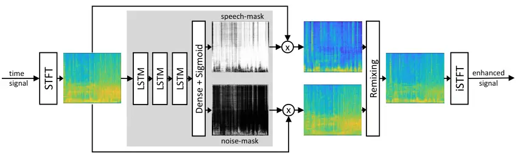

# Reduction of Subjective Listening Effort for TV Broadcast Signals with Recurrent Neural Networks

Nils L. Westhausen    Rainer Huber    Hannah Baumgartner    Ragini Sinha
   Jan Rennies    Bernd T. Meyer ^(†)^(†)thanks: This work was supported
by the German Federal Ministry of Education and Research
(Bundesministerium für Bildung und Forschung BMBF, project SITA, FKZ:
01/S17017B) and by the Deutsche Forschungsgemeinschaft (DFG, German
Research Foundation) under Germany’s Excellence Strategy – EXC 2177/1 -
Project ID 390895286.^(†)^(†)thanks: Nils L. Westhausen and B. T. Meyer
are with the Communication Acoustics group and the Cluster of Excellence
”Hearing4all”, Carl von Ossietzky University Oldenburg, Oldenburg,
Germany (e-mail: {nils.westhausen,
bernd.meyer}@uni-oldenburg.de).^(†)^(†)thanks: Rainer˜Huber,
Hannah˜Baumgartner, Ragini˜Sinha and Jan˜Rennies are with Fraunhofer
IDMT and the Cluster of Excellence ”Hearing4all”, Oldenburg, Germany.

###### Abstract

Listening to the audio of TV broadcast signals can be challenging for
hearing-impaired as well as normal-hearing listeners, especially when
background sounds are prominent or too loud compared to the speech
signal. This can result in a reduced satisfaction and increased
listening effort of the listeners. Since the broadcast sound is usually
premixed, we perform a subjective evaluation for quantifying the
potential of speech enhancement systems based on audio source separation
and recurrent neural networks (RNN). Recently, RNNs have shown promising
results in the context of sound source separation and real-time signal
processing. In this paper, we separate the speech from the background
signals and remix the separated sounds at a higher signal-to-noise
ratio. This differs from classic speech enhancement, where usually only
the extracted speech signal is exploited. The subjective evaluation with
20 normal-hearing subjects on real TV-broadcast material shows that our
proposed enhancement system is able to reduce the listening effort by
around 2 points on a 13-point listening effort rating scale and
increases the perceived sound quality compared to the original mixture.

###### Index Terms: 

Speech enhancement, listening effort, deep learning, real-time source
separation, LSTM, broadcast signals

## I Introduction

The effort of listening to TV broadcast dialogues depends on many
factors: recording, editing, mixing and dependencies in the transmission
chain. But it also depends on individual hearing characteristics,
specific TV devices and the acoustic conditions in the viewer’s living
room. Despite various recommendations, the presentation quality is often
perceived as suboptimal. The reactions of the audience reflect a wide
range of individual hearing impressions and preferences. It is therefore
extremely challenging for sound engineers, editors, and broadcast
engineers to adequately consider the specific requirements of all users
(in terms of achieving a low listening effort or a high perceived speech
quality) for production and especially for mixing. From the perspective
of the audience, it is therefore desirable to be able to adjust mixing
parameters for matching individual preferences and to optionally remix
the audio stream with the aim of improving intelligibility and reducing
listening effort.

One solution to this problem is a separate broadcast of speech and
background signals (e.g., by means of object-based audio codecs \[1\]),
which is an emerging technology that is currently not widely used and
not applicable for media that have been recorded using a single audio
stream. An alternative solution for conventional, mixed signals is the
use of blind source separation algorithms, which could be applied before
the separated signal parts can be remixed again at a higher
signal-to-noise ratio (SNR), which is the approach explored in this
paper.

One approach for such a separation is non-negative matrix factorization
(NMF), which estimates a speech basis matrix and a noise (or background)
matrix to decompose the signal. NMF was successfully extended to include
convolutive speech bases \[2\], spareness criteria \[3\], and properties
of Markov models \[4\]. The Flexible Audio Source Separation Toolbox
(FASST) \[5, 6\] is an open-source implementation of NMF combined with
generalized expectation-maximization (GEM). In general, NMF approaches
can utilize additional information (such as the output of a
speech/non-speech classifier) to create a better estimation of the
speech and noise components; hence, its performance can depend on the
quality of this additional information.

Recently, source separation based on deep learning has gained a lot of
attention \[7, 8, 9\], with a strong focus on speech separation \[10,
11, 12, 13, 14, 15\]. The concepts of speaker separation can also be
used as universal audio sound source separation for separating speech
from non-speech signals \[16\]. These concepts are often based on neural
networks and follow a similar scheme: first, the time signal is
transformed to a feature representation, which is often calculated with
a Short-Time Fourier Transformation (STFT) \[12, 13, 14, 17\]. Other
approaches use a learned feature representation \[15, 18, 19, 20\]. The
network predicts a mask that is applied to this feature representation
for estimating source representations. In the final step, the estimated
representations are transformed back to the time domain. Several recent
studies employed recurrent neural networks (RNN) with multiple
consecutive layers of uni- or bidirectional recurrent units \[21, 14,
15\] such as Long Short Term Memory Networks (LSTM) \[22\] or Gated
Recurrent Units \[23\]. RNNs were shown to produce good performance for
modeling temporal dependencies in audio and speech signals. Other
approaches such as Conv-TasNet \[18\] or FurcaNext \[19\] use temporal
convolutional neural networks (TCN).

When looking at real-time applications such as processing of broadcast
signals, unidirectional RNNs are often a good choice \[15, 24, 25\],
because they are capable of causal block-wise processing of an audio
stream. For calculating the current output, only the states of the
previous time step are required to access past information.
Convolutional architectures such as Conv-TasNet are also able to process
data in a causal way, but require a number of intermediate buffers in a
real-time setup to access the past context for each frame, which results
in a higher memory footprint and a more complex implementation.

In many applications, speech enhancement aims to completely remove the
ambient part, but for broadcast signals such as news, TV shows or movies
this is not desirable, since the atmospheric sounds convey a lot of
information and emotion and, as such, represent an important component
of audio design and engineering. To reach the goal of providing easier
speech perception while preserving the desired sound atmosphere as much
as possible, separated source signals can be remixed at a higher SNR
relative to the original mix. In the context of broadcast data, the aim
of remixing hence differs from approaches used in related work where the
mixture was added to the enhanced signal based on a criterion utilizing
the kurtosis ratio to reduce musical noise and so enhance the perceptual
quality \[26, 27\].

The goal of this paper is to evaluate methods for reducing the listening
effort and increasing perceived speech quality of TV broadcast signals
through source separation and subsequent remixing. To this end,
listening experiments with 20 normal-hearing listeners are conducted,
using separated/remixed signals as well as the original broadcast
signals. Separation is performed with an NMF-based approach as reference
(using the FASST toolbox mentioned above). FASST was chosen because, at
the time when the study was set up, this publicly available toolbox was
well maintained, established and widely used \[28, 29, 30, 31\]. The
second separation system in the comparison is an unidirectional RNN
using consecutive LSTM layers with an STFT feature transform, similar to
the causal network architecture utilized in \[14\], which meets the
requirement of processing audio _streams_ (in contrast to offline
processing of prerecorded audio). Apart from online processing, a
further requirement for applicability to broadcast stimuli was that
full-bandwidth stimuli (44.1 kHz or 48 kHz) in stereo format could be
processed. However, for practical reasons (i.e., a lack of a
sufficiently large amount of training data at the native sampling rate
of broadcast material with multiple channels), the RNN separation system
utilized for this study works at 16 kHz sampling rate single channel. To
make the RNN approach applicable to full-band stereo stimuli, a simple
high-frequency extension was applied and each channel was processed
separately (see below for details).

In the evaluation of our proposed method, we focus on the perceived
listening effort and speech quality rather than on speech
intelligibility (typically measured as the percentage of correctly
recognized words), since the speech intelligibility of (unprocessed) TV
broadcast audio is very often at or near 100%, so that signal
improvements would hardly be measurable. Listening effort (subjectively
rated on an effort rating scale, see below) and the perceived speech
quality, on the other hand, can still differentiate between conditions
where the intelligibility is already saturating (e.g., \[32\]).

The remainder of this paper is structured as follows: First
(section II), the enhancement system under test including the separation
model and its training are introduced, followed by the the description
of the baseline system, the remixing and the high-frequency extension
processes. In section III, the experimental procedure is described
followed by the results (section IV) reported in terms of
speech-quality, overall quality and the listening effort of the remixed
signal. The paper is concluded with a discussion (section V) of the
results including future steps and a conclusion (section VI).

## II Source Separation and Remixing

### II-A Source Separation Based on Time-Frequency Masking

The mixture of different sources is a linear combination of their
corresponding time signals. The mixture $`y[n]`$ can be described as

```math
y[n]=\sum^{S}_{s=1}x_{s}[n] \tag{1}
```

where $`x_{s}[n]`$ are the single-channel signals of source 1 to S. This
mixture can be rewritten with the help of the STFT in the time-frequency
domain as

```math
Y(t,f)=\sum^{N-1}_{n=0}y[n+tL]w[n]e^{\frac{-i2\pi nf}{N}}, \tag{2}
```

where $`t`$ is the frame index and $`f`$ is the frequency index.
$`w[n]`$ is the analysis window of length N, and L is the frame shift.
Assuming a sampling frequency $`f_{s}`$ in Hz, the frequency index
corresponds to a frequency of $`\frac{f}{N}\cdot f_{s}`$. In this study,
we estimate the source STFT of $`x_{s}[n]`$ with the approach of
time-frequency masking:

```math
\hat{X}_{s}(t,f)=M_{s}(t,f)\cdot Y(t,f). \tag{3}
```

$`\hat{X}_{s}(t,f)`$ denotes the time-frequency representation of the
estimated source signal $`\hat{x}_{s}(n)`$. $`M_{s}(t,f)`$ is a
multiplicative time-frequency mask to extract the source signal. For
reconstruction, the mask is multiplied with the magnitude of the
mixture, and the phase of the mixture is used. Consequently, Eq. (3) can
be changed to

```math
\hat{X}_{s}(t,f)=M_{s}(t,f)\cdot|Y(t,f)|\cdot e^{j\phi_{y}}, \tag{4}
```

where $`\phi_{y}`$ is the phase of $`Y(t,f)`$. The time-frequency
representation of the signal must be transformed back into the time
domain. The first step is an inverse Discrete Fourier Transformation
(iDFT)

```math
\hat{x}_{s,t}[n]=\frac{1}{N}\sum^{N-1}_{f=0}\hat{X}_{s}(t,f)\cdot e^{\frac{j2\pi nf}{N}}, \tag{5}
```

where $`\hat{x}_{s,t}`$ are the time-domain frames which can be
processed with an overlap-add procedure

```math
\hat{x}_{s}[n]=\sum^{T-1}_{t=0}v[n-tL]\hat{x}_{s,t}[n-tL]. \tag{6}
```

This results in the estimated time signal $`\hat{x}_{s}`$. $`v[n]`$
corresponds to the synthesis window.



Fig. 1: Schematic of the proposed enhancement system. First, the
time-signal is processed by an STFT to transform the input signal to the
time-frequency domain. The magnitude is fed to the separation network,
which predicts a time-frequency mask for speech and noise components.
The masks are multiplied with the magnitude of the input mixture to
create estimations of the speech and noise signal. These signals are
remixed with a reduced level of the noise component and in the last step
transformed back to the time domain.

### II-B Network Architecture and Training Procedure

The network architecture used in this paper is inspired by the model
architecture used in \[14\]. The separation network has three LSTM
layers with 600 units each, followed by a fully connected layer of size
514 and a subsequent sigmoid activation for predicting two bound
time-frequency masks, one for speech and one for noise. The proposed
network has around 8M parameters. LSTMs were chosen to ensure causality
and enable a frame-wise audio stream processing. This behavior is
important to use the approach in real-time applications. Only the
states, which holds past information, must be passed from the previous
time step to the current, which is efficient in the regard of memory
footprint.

A frame size of 32 ms with a 16 ms shift is used, which results in a
delay of 32 ms. All frames are multiplied with a hann window, which
results in a total system delay of 48 ms. Compared to real-time
hearing-aid processing this delay seems big, but the advantage in a
broadcast context is, that the video-stream can be delayed accordingly.
The model is trained at 16 kHz sampling frequency. This sampling rate
was chosen because no sufficient corpus at a higher sampling rate was
found. Practical advantages of using 16 kHz single-channel data are
reduced memory consumption and increased throughput during training.
Furthermore, a model trained on 16 kHz sampling rate can be easily
applied to signals at higher sampling rates using the high-frequency
extension introduced in subsection II-E. The magnitude of the STFT of
size of 512 is used as input feature which results in an input size of
257 individual FFT-bins. Because the model suggested here is
single-channel and the intended application typically comprises stereo
signals, each channel of a stereo signal is processed separately for
inference. This approach was again chosen, because of the lack of
sufficient natural stereo data for training. The complete proposed
system is shown in Fig. 1.

As cost function for training the scale invariant SNR (SI-SNR)
introduced in \[15\], in the time domain was used. It is defined as
follows

```math
\begin{cases}s_{target}:=\frac{\langle\hat{s},s\rangle}{\|s\|^{2}}\\
e_{noise}:=\hat{s}-s_{target},\\
\textrm{SI-SNR}:=10\log_{10}\frac{\|s_{target}\|^{2}}{\|e_{noise}\|^{2}},\end{cases} \tag{7}
```

where $`s`$ and $`\hat{s}`$ denote the true and estimated source time
signal, respectively. $`\|s\|^{2}`$ denotes the signal power
$`\langle s,s\rangle`$. The SI-SNR is combined with utterance level
permutation invariant training, introduced in \[14\], to solve the
permutation problem. Using a cost function in the time domain has some
advantages: for one, the phase is considered in the optimization process
since the cost is calculated after the signal reconstruction. The second
advantage is that there is no need to define a target mask as in \[14\].
Another important reason for choosing the SI-SNR is that it optimizes
for separation quality. Cost functions and approaches optimizing for
speech quality like \[33, 34, 35\] can not be applied to noise-signals
without alterations, since important spectral characteristic of speech
signals are often different from noise signals. Additionally
quality-aware cost function can create a slight colorization of the
speech signal, which can come from a preference of the loss function for
certain frequency bands.

In the current study, the Adam optimizer \[36\] is used. The initial
learning rate is 2e-4. The learning rate is halved when the loss on the
validation set does not decrease for three consecutive epochs. Early
stopping is applied when the loss does not decrease for 10 epochs. To
regularize the network, 25% of dropout was introduced between the LSTM
layers. The model was trained with a batch size of 16. Each sample in
the batch was 2 seconds long.

### II-C Training Data

The Music Speech and Noise (Musan) corpus \[37\] was chosen as training
data. This corpus contains a total of 60 h of speech, 42 h of music and
6 h of noise at 16 kHz sampling frequency. The speech data is split in
20 h of read speech from Librivox and 40 h of US government hearings,
committees and debates. All of the speech material is public domain. The
music data is divided in different styles ranging from western art music
to popular genres. All music is licensed under some form of creative
commons license. The types of the noise files range from technical
noises to ambient sounds. To prepare the data for training the network,
all music containing vocals were removed from the corpus. This was done
to avoid distortion of the speech targets with vocals. All files were
cut to chunks of 4 seconds. The corpus was split into a training set
(80% of the data) and a during-training validation set (20% of the total
data).

The 4 second long training samples were mixed online during training in
the range of -5 to 5 dB SNR and cut into 2 second samples for mini-batch
processing. The order of the files was shuffled after each epoch. This
approach introduced a higher variance and prevented overfitting on the
training data. This particular training set was chosen since it combines
several advantages: First, it is publicly available and so results can
easily be reproduced. Second, it contains not just read speech, but also
additional conversational speech, which is typical for broadcast
signals. Third, it contains music in good quality. Music is also often
used as background for broadcast signals and represents a challenging
condition for extracting speech signals. Alternative corpora such as the
WHAM corpus \[38\] contain noise recorded in public places, which can
contain music, but often not as prominent and clean as used in broadcast
context.

### II-D Baseline Configuration

As baseline, a setup based on the Flexible Audio Source Separation
Toolbox (FASST) was chosen \[39, 40, 41\]. FASST is able to process both
channels of a stereo signal at the same time at the native sampling rate
(48 kHz). It is based on the assumption that the auditory scene is
composed of a number of sources, which can be factorized according to an
excitation-filter model using NMF. FASST first extracts characteristic
patterns of the noise from speech pauses of the mixture. The estimates
are based on an iterative Generalized Expectation Maximization (GEM)
process. To estimate speech pauses without the requirement of oracle
knowledge, we extended the algorithm from the FASST toolbox by a voice
activity detection (VAD) component based on one LSTM layer with 64 units
and one neuron with sigmoid activation. The VAD predicts 1 if speech is
present and 0 otherwise, and was trained on the same data set as the
separation model; the speech and non-speech labels were obtained using
the clean data in combination with a threshold-based algorithm based on
\[42\]. In the next step, characteristic patterns of the speech are
extracted with the help of the characteristic patterns of the noise.
Before applying FASST to the stimuli of the present study, the number of
sources, the number of NMF components, and the number of iterations in
the GEM process were systematically varied and assessed using the speech
quality metric proposed in \[43\] and a set of 52 different broadcast
signals with dialog mixed in different backgrounds (average duration
about 10 s). The speech was assumed to be placed in the center between
both stereo channels, which is often the case for broadcast signals.
Similar to other quality metrics, the metric of \[43\] is double-ended
and compares representations of the clean, undistorted signals with
processed signals after applying a model mimicking the peripheral stages
of the auditory system. This assessment suggested that optimal source
separation performance could be expected using 1 source for the target
speech, 3 sources for the background, 6 NMF components each for speech
and background, and 30 iterations. The settings were the fixed to
produce the baseline processing used in this study.

### II-E High-Frequency Extension and Remixing

Our LSTM net implementation operates at a sampling rate of 16 kHz,
whereas the FASST toolbox can operate at the full bandwidth of broadcast
signals (i.e., at a sampling rate of 48 kHz). To reduce the impact of
the missing high-frequency band above 8 kHz of the LSTM output on the
evaluation outcome, the high-frequency content was re-introduced by
copying the corresponding band from the original signal mix to the remix
of the LSTM-output signals. Before copying the high-frequency band from
the original spectrum, the original signal was attenuated by 7 dB to
roughly account for the attenuation of the background sound due to the
remix process at a 10 dB higher SNR (see below). The amount of 7 dB was
determined empirically by inspecting the spectra and listening to the
processed signals with the extended spectra. For the study data, this
was performed in a offline fashion based on the complete signal.
However, the processing can also be performed on an 48 kHz audio stream
which is described in the following: When applying an STFT to the same
audio signal at 16 kHz with $`nfft_{16}`$ frequency bins and at 48k Hz
with $`nfft_{48}`$ bins while keeping the frame length in ms constant,
the frequency spacing of the FFT bins is identical (31.25 Hz). Hence,
the first $`n`$ bins of the 48 kHz signal, where $`n`$ has the value
$`nfft_{16}/2+1`$, contain the same information as the FFT bins of the
16 kHz signal, only differing by a constant factor which depends on the
FFT length. With this assumption, the first $`n`$ bins of the 48 kHz
STFT $`Y_{48k}(t,[1,...,n])`$ can be passed to the model, from which it
predicts two masks. These masks are as well applied to the first $`n`$
bins of the 48 kHz STFT predicting a speech $`\hat{X}_{speech}`$ and a
noise $`\hat{X}_{noise}`$ spectrum which can be remixed on a frame
basis:

```math
\displaystyle\hat{X}_{speech} \displaystyle=M_{speech}\cdot Y_{48k}(t,[1,...,n]) \tag{8}
```

```math
\displaystyle\hat{X}_{noise} \displaystyle=M_{noise}\cdot Y_{48k}(t,[1,...,n]) \tag{9}
```

```math
\displaystyle\hat{X}_{remix} \displaystyle=\hat{X}_{speech}+\alpha\,\hat{X}_{noise} \tag{10}
```

where $`M_{speech}`$ and $`M_{noise}`$ are the speech and the noise
time-frequency mask, respectively. For a general speech enhancement
model $`M_{noise}`$ can be also defined as $`1-M_{speech}`$, but in the
current approach a dedicated noise mask is predicted. $`\alpha`$
corresponds to the attenuation factor of the noise. $`\hat{X}_{remix}`$
is the remixed time-frequency representation. So the complete 48 kHz
output spectrum can be reconstructed by concatenating
$`\hat{X}_{remix}`$ with the high-frequency part
$`Y_{48k}(t,[n+1,...])`$

```math
\hat{X}_{48k}(t,f)=\mathrm{concat}\{\hat{X}_{remix},\lambda\,Y_{48k}(t,[n+1,...])\} \tag{11}
```

where $`\lambda`$ is the attenuation factor of the high-frequency
region.

## III Experimental Procedure

### III-A Stimuli

The described source separation methods were applied to 16 audio
excerpts (average length about 10 s) taken from German TV broadcast
material. This number audio files was chosen to keep the measurement
time for the MUSHRA-like setup \[44\] (multiple-stimulus test with
hidden reference and anchor) with multiple comparisons in a reasonable
range. The length of 10 s was chosen according to \[44\], which states
that the length of the signal should be approximately 10 s for a MUSHRA
measurement to avoid fatiguing of listeners and maintaining robustness
and stability of listener responses. The material consisted of speech
with background sounds from four different classes: sports, speech
(i.e., voice over voice), music, and environmental sounds (e.g. traffic
noise). Four audio signals per background sound class were used. For the
excerpts employed here, speech and background were available separately
and, thus, their ratio could be varied as desired. Accordingly, mixing
ratios between speech and background sounds were varied to cover a range
of expected listening effort from moderate to high, i.e.,  to cover the
conditions for which complaints can be reasonably expected in practice.
The 16 audio items were processed by the two source separation methods
(LSTM, FASST). Each source separation method produced two audio streams:
the estimated separated speech and the estimated separated background
sound. The latter was attenuated by 10 dB before remixing with the
speech stream. This remix constituted the test signal. The original,
unprocessed mix was taken as another test signal (representing a
reference without separation artefacts but also without enhanced SNR).
Since a multiple-stimulus test with hidden reference and anchor was used
as test procedure (see III.2), a reference and an anchor stimulus were
additionally required. The reference signal was built by mixing the
original, perfectly separated audio streams at a 10 dB higher SNR than
the original mix. The anchor signal was generated by lowpass (LP)
filtering the original signal with a cutoff frequency of 3.5 kHz
according to \[44\]. This standard anchor condition aims to produce the
lowest perceived quality of all conditions and thereby to span the range
of the rating scale usage.

### III-B Subjective Evaluation

Twenty naïve subjects (ten female / ten male), all native German
speakers with normal hearing, participated in the listening test. Their
ages ranged from 22 to 42 years (median 26 years). Subjects were mostly
students recruited from the University of Oldenburg and paid on an
hourly basis. They gave informed consent, and all procedures were
approved by the ethics committee of the University of Oldenburg
(Protocol Drs.EK/2019/073).

A MUSHRA-like test was carried out to rate different perceptual
attributes, i.e., the perceived speech quality, overall quality and
listening effort of the test stimuli. For the speech quality and overall
quality rating, the standard rating scale described in \[44\] was used.
It ranges from 0 to 100 and has additional verbal rating categories
“schlecht” (“bad”), “mäßig” (“poor”), “ordentlich” (“fair”), “gut”
(“good”) and “ausgezeichnet” (“excellent”). For the listening effort
rating, the scale proposed by Schulte et al. \[45\] was used. It
comprises 13 steps with 7 verbal categories: “extrem anstrengend”
(“extreme effort“), “sehr anstrengend” (“very high effort”), “deutlich
anstrengend” (“considerable effort”), “mittelgradig anstrengend”
(“moderate effort”), “wenig anstrengend” (“little effort”), “sehr wenig
anstrengend” (“very low effort”), “mühelos” (“no effort”). Subjects
could choose one of the verbal categories or make an intermediate
selection between categories.

The subjects were seated in a sound-attenuating booth. They heard the
acoustic stimuli over headphones and rated the stimuli using a software
with graphical user interface showing the rating scale on a touch
screen. They could also use the mouse to enter their ratings.

The stimuli were played back from a Windows PC with external sound card
(RME Fireface UC), connected to a headphone amplifier (Tucker Davis TD7)
and presented to the subjects via headphones (Sennheiser HD 650).

Fig. 2: Boxplots of subjective ratings pooled over subjects of speech
quality (left panels, higher is better), overall quality (mid panels,
higher is better), and listening effort (right panels, lower is better).
The top row shows data pooled across all background categories, while
bottom panels show data separately for each category of ambient sounds.

## IV Results

### IV-A Evaluation of the High-frequency Extension

The perceived effect of the high-frequency extension of the remixed
16kHz-signals was evaluated in a separate experiment. Here, speech
quality, overall quality and listening effort of remixed signals with
and without high-frequency extensions were subjectively compared and
rated following the same method as used in the main listening
experiment. Median ratings and interquartile ranges (IQRs) are reported
in Table I. The ratings show that the frequency extension had a clear
positive effect on all three rated dimensions. Hence, all LSTM ratings
reported in the following refer to the frequency-extended LSTM stimuli.

|            | SQ     |     | OQ     |     | LE     |     |
| ---------- | ------ | --- | ------ | --- | ------ | --- |
|            | median | IQR | median | IQR | median | IQR |
| without HF | 36     | 25  | 37     | 32  | 7      | 4   |
| with HF    | 50     | 28  | 50     | 27  | 6      | 4   |

TABLE I: Subjective ratings without and with High-Frequency extension
(HF) (SQ = speech quality, OQ = overall quality, LE = listening effort,
IQR = interquartile range).

### IV-B Speech Quality

The results of the main listening experiments are shown as boxplots in
Fig. 2 for the rating categories speech quality, overall quality and
listening effort, respectively. Top panels show data pooled across all
background categories, while bottom panels show data separately for each
category.

The left panels show the speech quality ratings for the five processing
conditions. The whole range of the rating scale was used by the subjects
as indicated by the whiskers of the boxplots. The median rating of the
lowpass anchor stimulus is 13, whereas the median rating of the (hidden)
reference stimulus is 100, indicating that these stimuli fulfilled their
purpose as low- and high-quality comparison stimuli and that subjects
correctly identified the hidden reference and rated it with 100 as
instructed in the MUSHRA paradigm. Concerning the three remaining
processing conditions, the original (i.e. unprocessed) signal got the
highest ratings, which was expected, since the speech was not distorted
by any processing. In theory, it should have gotten the maximum ratings
score, since the speech in the original mix was as undistorted as the
speech in the reference mix and the subjects were instructed just to
concentrate on the speech while ignoring the background sounds. However,
the higher levels of the background sounds of the original signals
compared to the reference condition seemed to make it hard for the
subjects to distinguish between additional background sound and speech
distortions. The signals processed by the FASST and LSTM source
separation algorithms contained some processing artefacts, i.e., the
speech was somewhat distorted. Consequently, the median speech quality
ratings obtained for these conditions were significantly lower than the
median rating score of the original signals, with LSTM rated better than
the FASST algorithm. However, both algorithms and the original condition
got median ratings corresponding to the quality category interval
“good”. Here and in the following, statistical significance was tested
by Wilcoxon rank sum tests at an alpha level of 0.05 and Bonferroni
corrections for multiple comparisons. The p-values from the comparisons
as well as the corresponding results for overall quality and listening
effort (as described in the next subsections) are presented in Table II.

\(A\) speech quality  
LSTM FASST Original 0.6487 0.0371 LSTM - 0.1482

\(B\) overall quality  
LSTM FASST Original 0.0001\* 0.8820 LSTM - 0.0001\*

\(C\) listening effort  
LSTM FASST Original $`<0.0001`$\* 0.1218 LSTM - 0.0033\*

TABLE II: p-values of pair-wise rank sum tests for equal medians. Values
below the corrected significance level (p = 0.05/3) are marked with an
asterisk.

With regard to different classes of background sounds, the same rankings
of speech quality ratings as for all signals pooled were obtained for
the different background sound classes, except for the music category.
Here, no significant differences between the median ratings of the
original and the FASST and LSTM conditions were observed (see Fig. 2).

### IV-C Overall Quality

When rating the overall quality of the test signals, the subjects were
instructed to listen to both the speech and the background noise and to
assess not only the quality/naturalness of these two components, but
also to take the ratio of the speech and background loudness into
account. The higher this ratio, i.e., the softer the background noise,
the higher rating score had to be given. The top mid panel of Fig. 2
shows the obtained rating results pooled across all 16 signals.

As in the results of speech quality rating, the whole rating scale was
used by the subjects. A different quality ranking was obtained for the
processing conditions original, FASST and LSTM compared to the speech
quality rating experiment: LSTM got the highest ratings, followed by the
original and FASST. All differences between the processing conditions
were statistically significant (Table II).

The overall quality rankings were different when considering the
different categories of background sounds (bottom mid panels of Fig. 2):
LSTM was superior to FASST and original for all types of background
sounds except for speech, where the original condition got the highest
ratings (not significantly higher than LSTM, though). For environmental
background sounds, FASST and original were rated equally and for music,
FASST got even (insignificantly) higher ratings than the original
condition. Moreover, FASST’s ratings were not significantly lower than
LSTM’s ratings in this category (Table II).

### IV-D Listening Effort

The results obtained from the listening effort rating experiment (right
panels of Fig. 2) showed a clear ranking with respect to the processing
conditions. The reference condition did not get the lowest possible
listening effort ratings (i.e., a rating of 1) and showed much more
variance compared to ratings of speech quality and overall quality. This
was because, in this experiment, the reference condition was not given
explicitly for orientation, but only hidden. The reason for not priming
the subjects that the reference signal was to be labeled with “no
effort” was that listening effort is essentially a subjective assessment
without a clearly defined “best” signal. In other words, even when the
reference signals contained background sounds at a rather low level,
following the speech clearly might still have required some effort and
it was up to the subjects to assess their own perceived effort in this
task. Still, reference and anchor (lowpass) condition spanned the range
of the rating scale quite well.

Apart from the reference condition, the LSTM processing obtained the
lowest listening effort ratings, and these ratings were significantly
lower (by two scale units when considering median ratings for the whole
set of stimuli) than the FASST and the original conditions, which got
about the same ratings (Table II).

The effect of the type of background sound on the rankings of the
processing conditions can be seen in the bottom right panels of Fig. 2.
Similar to the rankings of the overall quality ratings, we observed
different rankings for sports and speech backgrounds on the one hand,
and for music and environmental sounds on the other hand. The FASST
processing condition got the second highest listening effort ratings,
i.e., higher than the original condition, for the former two background
sounds, and the middle rank (i.e. lower than the original condition) for
the latter two background sounds. The LSTM processing condition got the
second lowest median ratings (i.e. lower than the original condition)
for all background sounds but speech, where it got the same median
rating as the original condition.

## V Discussion

The focus of this study was to systematically evaluate source separation
technologies combined with remixing with respect to their potential to
reduce the problems of high listening effort in broadcasting
applications. To this end, we conducted formal listening tests and,
specifically, we employed categorical listening effort rating. This
method had previously been used in different contexts, e.g., to evaluate
the benefit of hearing aid algorithms \[46\], noise reduction \[47\],
and near-end listening enhancement \[48\] as well as to quantify the
detrimental effects of being distracted by a competing talker \[49\]. To
our knowledge, this evaluation method has not been used in the context
of source separation for broadcast applications before. The present data
indicate that the method is suitable for the intended purpose. In
particular, significant differences between the evaluated source
separation approaches as well as between different types of background
signals could be identified. This suggests that listening effort rating
is a useful tool for evaluating source separation technologies, which
are often assessed by only considering the separated signals rather than
the remixed signals. However, evaluating the remixed signals may only be
useful for applications in which it is not desirable to fully suppress
the non-speech components.

In all aspects, the proposed LSTM approach outperforms the FASST
baseline. This result is not surprising, because the FASST method as
used in this paper can only employ information of the current sample for
separation. The quality of separation strongly depends on a good
estimation of the ambient signal from the speech pauses. The LSTM
network on the other hand was specifically trained on the task with
multiple hours of speech and background material and various
combinations. In this light, FASST works surprisingly well in some
conditions. It should also be mentioned that FASST is not real-time
capable, i.e., it is not applicable for online-processing of TV
broadcasting signals like the LSTM.

When looking at the subjective evaluation of speech quality, it could be
observed that speech quality ratings of the samples processed by the
LSTM were lower for the conditions sports, speech and environment
compared to the original mix. Presumably, the separation with TF-masking
introduced audible artifacts, which notably reduced the subjective
speech quality. However, these effects seemed to be outweighed by the
benefit of remixing the signals at a better SNR, i.e., the signals from
the LSTM approach showed a clear benefit in terms of overall quality
(and also listening effort) compared to the original mix. This means
that even despite the separation artifacts the SNR improvement of the
remix was more prominent for the overall quality improvement and for the
reduction of listening effort. A further quality improvement could
possibly be reached by a more advanced network architecture. The idea in
this paper was to show the proof of concept with an easy and
straightforward architecture that is capable of real-time processing.
For the speech condition, FASST as well as the LSTM approach were not
able to improve the mixture. The main reason for this result when using
the LSTM is probably that the network was trained to separate speech
from non-speech components. In a voice-over-voice condition, another
voice is the background, but the LSTM network does not classify the
competing background voice (which might also be prominent) as ambient
sound. Because of the poor separation performance in such conditions, a
remix with 10 dB improvement does not show any improvement in terms of
overall quality and listening effort. Similarly, the FASST approach
attempts to estimate the background signal from the speech pauses, but
for voice-over-voice conditions, there is no valid information in the
speech pauses. Consequently, FASST is not able to create a valid noise
model for separation. To solve this problem in the future for the LSTM
approach, an additional speaker separation network could be integrated
with same architecture and training setup. This should, however, require
additional training data in which this condition is covered, and should
be investigated in the future.

Extensions of the present study could also be made with respect to
evaluation methods. While the employed categorical scaling could be
integrated well into the other, MUSHRA-like assessment methods in this
study, it requires an explicit action of the listeners and, in a way,
interrupts their active listening. This is not an issue if short stimuli
are assessed after playback, but it may not be the best method when
evaluating listening effort over longer listening periods such as an
entire movie. Such a long-term, passive monitoring of listening effort
and the potential benefit of source separation for broadcast signals
could possibly be made using neurophysiological markers of cognitive
load, e.g., electroencephalography (EEG) \[50\], pupil dilatation
\[51\], functional near-field infrared spectroscopy (fNIRS) \[52\], or
other physiological indices \[53, 54\].

For the evaluation of speech processing algorithms, objective measures
such as Perceptual Evaluation of Speech Quality (PESQ) \[55\] and
short-time objective intelligibility measure (STOI) \[56\] could also be
used. However, our main focus was on a remixing scheme, and objective
measures are built for evaluating speech enhancement algorithms which
try to reduce or remove noise and require a clean speech signal as
reference. Therefore, subjective testing remains the gold standard in
this context, which is the reason we focused on subjective measurements
in this study.

Since the architecture used for the separation module of the system is
very generic, more powerful architectures could be investigated such as
the Deep Complex Convolution Recurrent Network \[57\] which combines
complex time-frequency masking and a convolutional encoder and decoder
with a recurrent bottleneck in a powerful way. Trade-offs with respect
to model size and performance of such a recurrent U-Net were already
analyzed in \[58\]. Further, another flavor of RNN cells such as the
equilibriated recurrent cell \[59\] could be considered, which reduces
the number of parameters efficiently but matches the performance of
conventional LSTM cells. Finally, a possible working direction is the
reduction of computational complexity through pruning and quantization
as suggested in \[25\].

## VI Conclusion

In this paper, we performed a subjective evaluation of TV broadcast
signals with 20 normal-hearing listeners and explored the effect of two
source separation algorithms on the perceived overall and speech
quality, and the listening effort. While the NMF algorithm chosen for
this study did not lower the listening effort, an LSTM network with a
straight-forward architecture maintained the perceived speech quality,
improved the overall quality, and reduced the listening effort of TV
broadcast material by remixing the separated sources with an improved
SNR. The approach in this paper is able to reduce the listening effort
by 2 points on the 13 point listening effort scale and works for common
background sound conditions as music, sport and environment. For
voice-over-voice conditions, the method does not improve the listening
effort, but this condition was not a target in the training process. In
the future, the approach could be improved by more advanced network
architectures and more training data. Another possible improvement would
be to train the network directly on the native sampling rate to
eliminate the need for a manual high-frequency extension as employed
here, which would require training data with a relatively high
bandwidth. A further extension could be to adapt the SNR improvement of
the remix to the current audio sample rather than to use a fixed SNR
improvement. This could be achieved by combining the present approach
with non-intrusive (real-time) estimations of speech intelligibility or
listening effort (e.g.\[48\]).

## References

- \[1\] R. Bleidt, A. Borsum, H. Fuchs, and S. M. Weiss, “Object-based
  audio: Opportunities for improved listening experience and increased
  listener involvement,” _SMPTE Motion Imaging Journal_, vol. 124,
  no. 5, pp. 1–13, 2015.
- \[2\] P. Smaragdis, “Convolutive speech bases and their application to
  supervised speech separation,” _IEEE Transactions on Audio, Speech,
  and Language Processing_, vol. 15, no. 1, pp. 1–12, 2006.
- \[3\] T. Virtanen, “Monaural sound source separation by nonnegative
  matrix factorization with temporal continuity and sparseness
  criteria,” _IEEE transactions on audio, speech, and language
  processing_, vol. 15, no. 3, pp. 1066–1074, 2007.
- \[4\] G. J. Mysore, P. Smaragdis, and B. Raj, “Non-negative hidden
  markov modeling of audio with application to source separation,” in
  _International Conference on Latent Variable Analysis and Signal
  Separation_. Springer, 2010, pp. 140–148.
- \[5\] A. Ozerov, E. Vincent, and F. Bimbot, “A general flexible
  framework for the handling of prior information in audio source
  separation,” _IEEE Transactions on audio, speech, and language
  processing_, vol. 20, no. 4, pp. 1118–1133, 2011.
- \[6\] Y. Salaün, E. Vincent, N. Bertin, N. Souviraa-Labastie,
  X. Jaureguiberry, D. T. Tran, and F. Bimbot, “The flexible audio
  source separation toolbox version 2.0,” 2014.
- \[7\] P.-S. Huang, M. Kim, M. Hasegawa-Johnson, and P. Smaragdis,
  “Singing-voice separation from monaural recordings using deep
  recurrent neural networks.” in _ISMIR_, 2014, pp. 477–482.
- \[8\] P. Huang, M. Kim, M. Hasegawa-Johnson, and P. Smaragdis, “Joint
  optimization of masks and deep recurrent neural networks for monaural
  source separation,” _IEEE/ACM Transactions on Audio, Speech, and
  Language Processing_, vol. 23, pp. 2136–2147, 2015.
- \[9\] A. A. Nugraha, A. Liutkus, and E. Vincent, “Multichannel audio
  source separation with deep neural networks,” _IEEE/ACM Transactions
  on Audio, Speech, and Language Processing_, vol. 24, no. 9, pp.
  1652–1664, 2016.
- \[10\] Y. Tu, J. Du, Y. Xu, L. Dai, and C.-H. Lee, “Speech separation
  based on improved deep neural networks with dual outputs of speech
  features for both target and interfering speakers,” in _The 9th
  International Symposium on Chinese Spoken Language Processing_. IEEE,
  2014, pp. 250–254.
- \[11\] P.-S. Huang, M. Kim, M. Hasegawa-Johnson, and P. Smaragdis,
  “Deep learning for monaural speech separation,” in _2014 IEEE
  International Conference on Acoustics, Speech and Signal Processing
  (ICASSP)_. IEEE, 2014, pp. 1562–1566.
- \[12\] J. R. Hershey, Z. Chen, J. Le Roux, and S. Watanabe, “Deep
  clustering: Discriminative embeddings for segmentation and
  separation,” in _2016 IEEE International Conference on Acoustics,
  Speech and Signal Processing (ICASSP)_. IEEE, 2016, pp. 31–35.
- \[13\] D. Yu, M. Kolbæk, Z.-H. Tan, and J. Jensen, “Permutation
  invariant training of deep models for speaker-independent multi-talker
  speech separation,” in _2017 IEEE International Conference on
  Acoustics, Speech and Signal Processing (ICASSP)_. IEEE, 2017, pp.
  241–245.
- \[14\] M. Kolbæk, D. Yu, Z.-H. Tan, and J. Jensen, “Multitalker speech
  separation with utterance-level permutation invariant training of deep
  recurrent neural networks,” _IEEE/ACM Transactions on Audio, Speech,
  and Language Processing_, vol. 25, no. 10, pp. 1901–1913, 2017.
- \[15\] Y. Luo and N. Mesgarani, “Tasnet: time-domain audio separation
  network for real-time, single-channel speech separation,” in _2018
  IEEE International Conference on Acoustics, Speech and Signal
  Processing (ICASSP)_. IEEE, 2018, pp. 696–700.
- \[16\] I. Kavalerov, S. Wisdom, H. Erdogan, B. Patton, K. Wilson,
  J. Le Roux, and J. R. Hershey, “Universal sound separation,” in _2019
  IEEE Workshop on Applications of Signal Processing to Audio and
  Acoustics (WASPAA)_. IEEE, 2019, pp. 175–179.
- \[17\] Z.-Q. Wang, J. L. Roux, D. Wang, and J. R. Hershey, “End-to-end
  speech separation with unfolded iterative phase reconstruction,”
  _arXiv preprint arXiv:1804.10204_, 2018.
- \[18\] Y. Luo and N. Mesgarani, “Conv-tasnet: Surpassing ideal
  time–frequency magnitude masking for speech separation,” _IEEE/ACM
  transactions on audio, speech, and language processing_, vol. 27,
  no. 8, pp. 1256–1266, 2019.
- \[19\] L. Zhang, Z. Shi, J. Han, A. Shi, and D. Ma, “Furcanext:
  End-to-end monaural speech separation with dynamic gated dilated
  temporal convolutional networks,” in _International Conference on
  Multimedia Modeling_. Springer, 2020, pp. 653–665.
- \[20\] Y. Luo, Z. Chen, and T. Yoshioka, “Dual-path rnn: efficient
  long sequence modeling for time-domain single-channel speech
  separation,” in _ICASSP 2020-2020 IEEE International Conference on
  Acoustics, Speech and Signal Processing (ICASSP)_. IEEE, 2020, pp.
  46–50.
- \[21\] Y. Isik, J. Le Roux, Z. Chen, S. Watanabe, and J. Hershey,
  “Single-channel multi-speaker separation using deep clustering,” in
  _Interspeech 2016, San Francisco_, 09 2016, pp. 545–549.
- \[22\] S. Hochreiter and J. Schmidhuber, “Long short-term memory,”
  _Neural computation_, vol. 9, no. 8, pp. 1735–1780, 1997.
- \[23\] J. Chung, C. Gulcehre, K. Cho, and Y. Bengio, “Empirical
  evaluation of gated recurrent neural networks on sequence modeling,”
  in _NIPS 2014 Workshop on Deep Learning, December 2014_, 2014.
- \[24\] S. Braun and I. Tashev, “Data augmentation and loss
  normalization for deep noise suppression,” in _International
  Conference on Speech and Computer_. Springer, 2020, pp. 79–86.
- \[25\] I. Fedorov, M. Stamenovic, C. Jensen, L.-C. Yang, A. Mandell,
  Y. Gan, M. Mattina, and P. N. Whatmough, “TinyLSTMs: Efficient Neural
  Speech Enhancement for Hearing Aids,” in _Proc. Interspeech 2020_,
  2020, pp. 4054–4058. \[Online\]. Available:
  [http://dx.doi.org/10.21437/Interspeech.2020-1864](http://dx.doi.org/10.21437/Interspeech.2020-1864)
- \[26\] Y. Uemura, Y. Takahashi, H. Saruwatari, K. Shikano, and
  K. Kondo, “Automatic optimization scheme of spectral subtraction based
  on musical noise assessment via higher-order statistics,” in _Proc.
  IWAENC 2008_. IEEE, 2008.
- \[27\] R. Miyazaki, H. Saruwatari, T. Inoue, Y. Takahashi, K. Shikano,
  and K. Kondo, “Musical-noise-free speech enhancement based on
  optimized iterative spectral subtraction,” _IEEE Transactions on
  Audio, Speech, and Language Processing_, vol. 20, no. 7, pp.
  2080–2094, 2012.
- \[28\] M. Hafsati, N. Epain, R. Gribonval, and N. Bertin, “Sound
  source separation in the higher order ambisonics domain,” in _DAFx
  2019 - 22nd International Conference on Digital Audio Effects_,
  Birmingham, United Kingdom, Sep. 2019, pp. 1–7. \[Online\]. Available:
  [https://hal.inria.fr/hal-02161949](https://hal.inria.fr/hal-02161949)
- \[29\] A. J. R. Simpson, G. Roma, E. M. Grais, R. D. Mason,
  C. Hummersone, A. Liutkus, and M. D. Plumbley, “Evaluation of audio
  source separation models using hypothesis-driven non-parametric
  statistical methods,” in _2016 24th European Signal Processing
  Conference (EUSIPCO)_, 2016, pp. 1763–1767.
- \[30\] A. A. Nugraha, A. Liutkus, and E. Vincent, “Multichannel audio
  source separation with deep neural networks,” _IEEE/ACM Transactions
  on Audio, Speech, and Language Processing_, vol. 24, no. 9, pp.
  1652–1664, 2016.
- \[31\] R. Miller, W. Bulla, and E. Tarr, “Detection of the effect of
  window duration in an audio source separation paradigm,” in _Audio
  Engineering Society Convention 147_, Oct 2019. \[Online\]. Available:
  [http://www.aes.org/e-lib/browse.cfm?elib=20625](http://www.aes.org/e-lib/browse.cfm?elib=20625)
- \[32\] K. Klink, M. Schulte, and M. Meis, “Measuring listening effort
  in the field of audiology – a literature review of methods, part 1,”
  _Z. Audiol._, vol. 51, no. 2, pp. 60–68, 2012.
- \[33\] S.-W. Fu, C.-F. Liao, Y. Tsao, and S.-D. Lin, “MetricGAN:
  Generative adversarial networks based black-box metric scores
  optimization for speech enhancement,” in _Proceedings of the 36th
  International Conference on Machine Learning_, ser. Proceedings of
  Machine Learning Research, K. Chaudhuri and R. Salakhutdinov, Eds.,
  vol. 97. PMLR, 09–15 Jun 2019, pp. 2031–2041. \[Online\]. Available:
  [http://proceedings.mlr.press/v97/fu19b.html](http://proceedings.mlr.press/v97/fu19b.html)
- \[34\] S.-W. Fu, C.-F. Liao, and Y. Tsao, “Learning with learned loss
  function: Speech enhancement with quality-net to improve perceptual
  evaluation of speech quality,” _IEEE Signal Processing Letters_,
  vol. 27, pp. 26–30, 2020.
- \[35\] M. Kawanaka, Y. Koizumi, R. Miyazaki, and K. Yatabe, “Stable
  training of dnn for speech enhancement based on perceptually-motivated
  black-box cost function,” in _ICASSP 2020 - 2020 IEEE International
  Conference on Acoustics, Speech and Signal Processing (ICASSP)_, 2020,
  pp. 7524–7528.
- \[36\] D. Kingma and J. Ba, “Adam: A method for stochastic
  optimization,” _International Conference on Learning Representations_,
  12 2014.
- \[37\] D. Snyder, G. Chen, and D. Povey, “MUSAN: A Music, Speech, and
  Noise Corpus,” 2015, arXiv:1510.08484v1.
- \[38\] G. Wichern, J. Antognini, M. Flynn, L. R. Zhu, E. McQuinn,
  D. Crow, E. Manilow, and J. Le Roux, “Wham!: Extending speech
  separation to noisy environments,” in _Proc. Interspeech_, Sep. 2019.
- \[39\] E. Vincent, S. Araki, F. Theis, G. Nolte, P. Bofill, H. Sawada,
  A. Ozerov, V. Gowreesunker, D. Lutter, and N. Q. Duong, “The signal
  separation evaluation campaign (2007–2010): Achievements and remaining
  challenges,” _Signal Processing_, vol. 92, no. 8, pp. 1928–1936, 2012.
- \[40\] F. Weninger, H. Erdogan, S. Watanabe, E. Vincent, J. Le Roux,
  J. R. Hershey, and B. Schuller, “Speech enhancement with lstm
  recurrent neural networks and its application to noise-robust asr,” in
  _International Conference on Latent Variable Analysis and Signal
  Separation_. Springer, 2015, pp. 91–99.
- \[41\] A. Liutkus, F.-R. Stöter, Z. Rafii, D. Kitamura, B. Rivet,
  N. Ito, N. Ono, and J. Fontecave, “The 2016 signal separation
  evaluation campaign,” in _International Conference on Latent Variable
  Analysis and Signal Separation_. Springer, 2017, pp. 323–332.
- \[42\] S. V. Gerven and F. Xie, “A comparative study of speech
  detection methods,” in _Fifth European Conference on Speech
  Communication and Technology_, 1997.
- \[43\] M. Hansen and B. Kollmeier, “Objective modeling of speech
  quality with a psychoacoustically validated auditory model,” _Journal
  of the Audio Engineering Society_, vol. 48, no. 5, pp. 395–408, 2000.
- \[44\] “ITU-R BS.1534-3: Method for the subjective assessment of
  intermediate quality level of audio systems.” 2015.
- \[45\] M. Schulte, M. Meis, and K. Wagener, “Listening effort and
  speech intelligibility,” in _8th EFAS Congress / 10th Congress of the
  German Society of Audiology_, 2007.
- \[46\] M. Krueger, M. Schulte, M. A. Zokoll, K. C. Wagener, M. Meis,
  T. Brand, and I. Holube, “Relation between listening effort and speech
  intelligibility in noise,” _American Journal of Audiology_, vol. 26,
  no. 3S, pp. 378–392, 2017.
- \[47\] H. Luts, K. Eneman, J. Wouters, M. Schulte, M. Vormann,
  M. Buechler, N. Dillier, R. Houben, W. A. Dreschler, M. Froehlich
  _et al._, “Multicenter evaluation of signal enhancement algorithms for
  hearing aids,” _The Journal of the Acoustical Society of America_,
  vol. 127, no. 3, pp. 1491–1505, 2010.
- \[48\] R. Huber, A. Pusch, N. Moritz, J. Rennies, H. Schepker, and
  B. T. Meyer, “Objective assessment of a speech enhancement scheme with
  an automatic speech recognition-based system,” in _Speech
  Communication; 13th ITG-Symposium_, 2018, pp. 1–5.
- \[49\] J. Rennies, V. Best, E. Roverud, and J. Gerald Kidd, “Energetic
  and informational components of speech-on-speech masking in binaural
  speech intelligibility and perceived listening effort,” _Trends in
  Hearing_, vol. 23, p. 2331216519854597, 2019, pMID: 31172880.
  \[Online\]. Available:
  [https://doi.org/10.1177/2331216519854597](https://doi.org/10.1177/2331216519854597)
- \[50\] A. H. Winneke, M. Schulte, M. Vormann, and M. Latzel, “Effect
  of directional microphone technology in hearing aids on neural
  correlates of listening and memory effort: An electroencephalographic
  study,” _Trends in Hearing_, vol. 24, p. 2331216520948410, 2020,
  pMID: 32833586. \[Online\]. Available:
  [https://doi.org/10.1177/2331216520948410](https://doi.org/10.1177/2331216520948410)
- \[51\] M. B. Winn, D. Wendt, T. Koelewijn, and S. E. Kuchinsky, “Best
  practices and advice for using pupillometry to measure listening
  effort: An introduction for those who want to get started,” _Trends in
  Hearing_, vol. 22, p. 2331216518800869, 2018, pMID: 30261825.
  \[Online\]. Available:
  [https://doi.org/10.1177/2331216518800869](https://doi.org/10.1177/2331216518800869)
- \[52\] G. Andéol, C. Suied, S. Scannella, and F. Dehais, “The spatial
  release of cognitive load in cocktail party is determined by the
  relative levels of the talkers,” _Journal of the Association for
  Research in Otolaryngology_, vol. 18, no. 3, pp. 457–464, jan 2017.
- \[53\] C. B. Hicks and A. M. Tharpe, “Listening effort and fatigue in
  school-age children with and without hearing loss,” _Journal of
  Speech, Language, and Hearing Research_, vol. 45, no. 3, pp. 573–584,
  jun 2002.
- \[54\] C. L. Mackersie and H. Cones, “Subjective and
  psychophysiological indexes of listening effort in a competing-talker
  task,” _Journal of the American Academy of Audiology_, vol. 22,
  no. 02, pp. 113–122, feb 2011.
- \[55\] “ITU-T P.862: Perceptual evaluation of speech quality (PESQ):
  An objective method for end-to-end speech quality assessment of
  narrow-band telephone networks and speech codecs.” 2001.
- \[56\] C. H. Taal, R. C. Hendriks, R. Heusdens, and J. Jensen, “A
  short-time objective intelligibility measure for time-frequency
  weighted noisy speech,” in _2010 IEEE international conference on
  acoustics, speech and signal processing_. IEEE, 2010, pp. 4214–4217.
- \[57\] Y. Hu, Y. Liu, S. Lv, M. Xing, S. Zhang, Y. Fu, J. Wu,
  B. Zhang, and L. Xie, “DCCRN: Deep Complex Convolution Recurrent
  Network for Phase-Aware Speech Enhancement,” in _Proc. Interspeech
  2020_, 2020, pp. 2472–2476. \[Online\]. Available:
  [http://dx.doi.org/10.21437/Interspeech.2020-2537](http://dx.doi.org/10.21437/Interspeech.2020-2537)
- \[58\] S. Braun, H. Gamper, C. K. Reddy, and I. Tashev, “Towards
  efficient models for real-time deep noise suppression,” in _ICASSP
  2021 - 2021 IEEE International Conference on Acoustics, Speech and
  Signal Processing (ICASSP)_, 2021, pp. 656–660.
- \[59\] D. Takeuchi, K. Yatabe, Y. Koizumi, Y. Oikawa, and N. Harada,
  “Real-time speech enhancement using equilibriated rnn,” in _ICASSP
  2020 - 2020 IEEE International Conference on Acoustics, Speech and
  Signal Processing (ICASSP)_, 2020, pp. 851–855.
