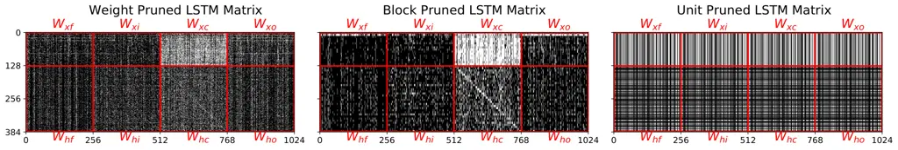
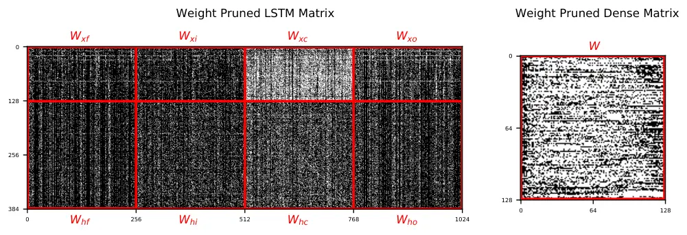
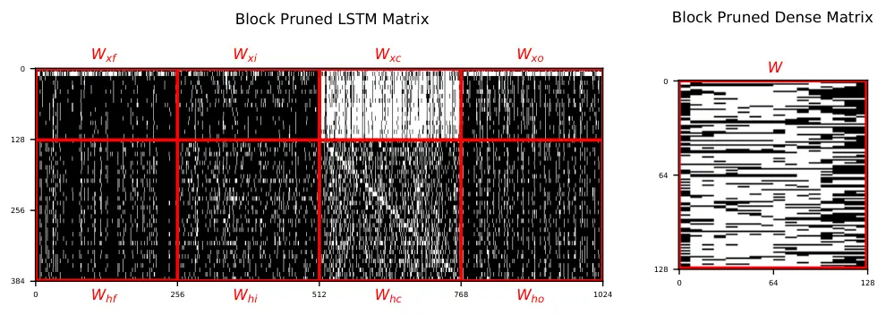
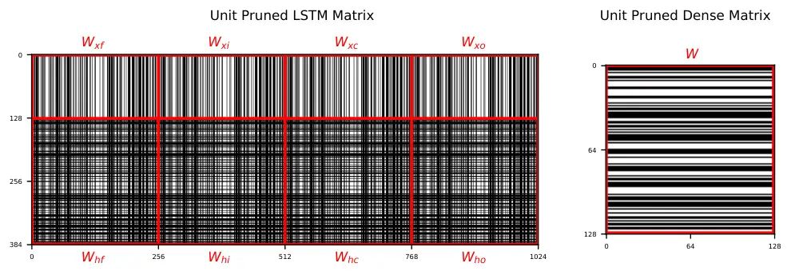

# Weight, Block or Unit? Exploring Sparsity Tradeoffs for Speech Enhancement on Tiny Neural Accelerators

Marko Stamenovic Affiliation: Bose Corp. Affiliation: Boston, MA
Email: [marko_stamenovic@bose.com](mailto:)    Nils L. Westhausen
Affiliation: University of Oldenburg and Bose Corp.
Affiliation: Oldenburg, Germany Email: [nils.westhausen@uol.de](mailto:)
   Li-Chia Yang Affiliation: Bose Corp. Affiliation: Boston, MA    Carl
Jensen Affiliation: Bose Corp. Affiliation: Boston, MA    Alexander
Pawlicki Affiliation: Bose Corp. Affiliation: Boston, MA

###### Abstract

We explore network sparsification strategies with the aim of compressing
neural speech enhancement (SE) down to an optimal configuration for a
new generation of low power microcontroller based neural accelerators
(microNPU’s). We examine three unique sparsity structures: weight
pruning, block pruning and unit pruning; and discuss their benefits and
drawbacks when applied to SE. We focus on the interplay between
computational throughput, memory footprint and model quality. Our method
supports all three structures above and jointly learns integer quantized
weights along with sparsity. Additionally, we demonstrate offline
magnitude based pruning of integer quantized models as a performance
baseline. Although efficient speech enhancement is an active area of
research, our work is the first to apply block pruning to SE and the
first to address SE model compression in the context of microNPU’s.
Using weight pruning, we show that we are able to compress an already
compact model’s memory footprint by a factor of 42$`\times`$ from 3.7MB
to 87kB while only losing 0.1 dB SDR in performance. We also show a
computational speedup of 6.7 $`\times`$ with a corresponding SDR drop of
only 0.59 dB SDR using block pruning.

## 1 Introduction

Recent years have seen a step function increase in performance of deep
learning based SE and source separation in the research community \[1\].
Consequently, SE has recently gained wide adoption in industry and has
quickly become a key piece of the modern telecommunications stack with
applications from voice communication \[2, 3, 4\] to audio compression
\[5, 6, 7\] to studio production \[8, 9\]. In a short time, these
applications have redefined what users have come to expect from their
audio devices. However, the models that power modern SE applications can
often be large and processor-intensive. Computation is generally
performed on powerful mobile, desktop or cloud hardware with access to
robust processing and abundant power.

While there has been continued interest in real-time augmented hearing
applications on battery powered wearable devices, from hearing aids to
consumer products\[10, 11, 12\], most of these experiences are currently
powered by non AI-based signal processing. SE has long shown promise for
hearing aid (HA) applications in particular \[13\], but its successful
implementation has been elusive due to the constraints imposed by the HA
hardware and use-case.

Historically, the SE literature has prioritized objective and perceptual
audio quality \[14, 15, 16, 17, 18, 19\] over model efficiency or
realizability. Recently, however, there has been a flurry of research
with the goal of high quality SE which can also be deployed in realtime
use-cases and run on streaming audio. In \[20\], Fedorov et. al. design
a SE framework to satisfy hearing aid hardware constraints, restricting
their attention to unit pruning. Choi et. al. target similar hardware in
\[21\] where they describe a parameter efficient network which
nevertheless consumes approximately 2.27 billion operations per second
(GOPS/s), far beyond the computational limits of modern MCU’s and
microNPU’s. Tan and Wang perform weight and unit pruning across various
SE architectures along with Huffman Coding based quantization \[22\]
using an iterative offline approach. Other studies focus on latency and
computational complexity of full precision SE networks \[23, 24\].

Concurrently, a new generation of micro-controller-based neural
processing units (microNPU’s) have been surfacing \[25, 26, 27\],
promising low-power embedded execution of AI workloads such as efficient
SE. There are some similarities and trends we identify across the
emerging landscape of edge neural network accelerators including 1) a
fixed point multiply-accumulate (MAC) unit which is able to parallelize
small amounts of vector-vector operations over a single CPU cycle and 2)
the ability to support sparse tensor data types and operations to
further reduce memory footprint, increase efficiency and potentially
speed execution.

We enumerate four specific constraints which must be met in order for a
neural SE algorithm to be deployable on a microcontroller-based hearable
device based on Fedorov et. al. \[20\]:

1.  1.  The model must be causal in order to enable inference on streaming
        audio. Total audio latency must be kept at a minimum, ideally below
        30ms.
2.  2.  Model inputs, weights and activations must be quantized to
        symmetrical fixed point precision such that they can run on embedded
        hardware processors which often do not support floating point
        execution
3.  3.  Computational latency, or the time it takes to compute one inference
        of the model, must be less than or equal to the time until the next
        inference is required. For frame-based signal processing this also
        known as the frame or hop rate.
4.  4.  Total memory footprint, the sum of the model weights and working
        memory (model activations), must fit within the device’s SRAM.

Our goal is to study the effects of compression on SE in the context of
real-time edge deployment on microNPU’s. We present various
methodologies to compress and quantize SE networks in order to meet the
constraints defined above with a focus on trade-offs in computational
throughput, memory footprint and model quality. Firstly, we demonstrate
an offline (post-training) method for pruning SE models in both
unstructured and structured regimes. Next, we extend the online pruning
method from \[20\] to support both unstructured weight and structural
block pruning.Although block pruning has been studied elsewhere in the
literature \[28, 29\], it is the first time to our knowledge that this
type of structural sparsity has been applied to speech enhancement. We
further propose a simple and efficient method for symmetrically
quantizing networks for SE which we refer to as Quantization EQ. We use
this method alongside all of our sparsification strategies. Finally, we
compare the online method for inducing sparsity to the offline method
and provide benchmarks for the three types of sparsity that we explore,
namely unit block and weight, on the popular CHiME2 \[30\] dataset.

## 2 Background

### 2.1 Speech Enhancement

Given a noisy time-domain monaural audio mixture $`y=x+v`$ where $`x`$
is the clean speech signal and $`v`$ is unwanted noise, the goal of SE
is to extract the denoised speech signal $`\hat{x}`$. We formulate
neural SE as

```math
\displaystyle Y \displaystyle=\mathcal{F}(y), \displaystyle Z \displaystyle=(G|Y|)^{0.3}, \tag{1}
```

```math
\displaystyle M \displaystyle=f_{\theta}(Z), \displaystyle\hat{x} \displaystyle=\mathcal{I}(G^{T}M\odot Y)
```

where $`\mathcal{F}`$ and $`\mathcal{I}`$ denote forward and inverse
short time Fourier transforms (STFT), respectively. The output of
$`\mathcal{F}`$ is a complex STFT $`Y\in\mathbb{C}^{B_{f}\times B_{t}}`$
where $`B_{f}`$ is number of frequency bins and $`B_{t}`$ is number of
STFT frames. $`Y`$ is then preprocessed by taking the magnitude and
passing through a mel-filterbank $`G\in\mathbb{R}^{B_{g}\times B_{f}}`$
where $`B_{g}`$ is the mel dimension, before being power law compressed
with an exponent of 0.3. The preprocessing step is done to map to a
logarithmic frequency scale, compress dynamic range, and remove phase,
respecively. Our SE network $`f`$, parametrized by learnable parameters
$`\theta`$, predicts a time-frequency mask in the mel space
$`M\in\mathbb{R}^{B_{g}\times B_{t}}`$. We invert $`M`$ to the frequency
domain using the transpose $`G^{T}`$ and apply the mask to $`Y`$ using
pointwise multiplication $`\odot`$ before resynthesizing with
$`\mathcal{I}`$, resulting in the denoised time-domain speech signal
$`\hat{x}`$.

The SE network parameters, $`f_{\theta}(\cdot)`$, are learned by
minimizing a phase-sensitive spectral approximation loss \[31\]:

```math
{L}(\theta)=0.1\left\|\lvert X\rvert^{0.3}-\lvert\hat{X}\rvert^{0.3}\right\|_{2}+0.9\left\|X^{0.3}-\hat{X}^{0.3}\right\|_{2}, \tag{2}
```

where $`X`$ are the clean target frames and
$`\hat{X}=\mathcal{F}(\hat{x})`$ are the output frames calculated from
the output time series $`\hat{x}`$. The extra STFT transform is done to
ensure consistency in the output frames \[32\]. The frames are also
power-law compressed with an exponent of $`0.3`$ to reduce the dominance
of large values.

Figure 1: Plot of sparsity vs. computational speedup based on data
aggregated from \[33, 28\] for the three sparsity structures we
consider.

Figure 2: SDR vs. Sparsity percentage, each point represents a model
checkpoint presented in Table 1.

### 2.2 Baseline Model Architecture

Our goal is to study the effects of compression on SE in the context of
real-time edge deployment on microNPU’s. We begin with a unidirectional
recurrent architecture due to its causality and ability to effectively
model time while retaining a frame-in, frame-out inference regime. This
is in contrast to other architectures such as for example temporal
convolutions \[34, 35\] or transformers \[36\] which can yield
impressive performance on time-series data but require an explicit,
often large, receptive field which must be cached in memory to yield
acceptable latency. We note that caching large amounts of dense audio
can quickly overwhelm working memory constraints on embedded hardware.

Our network consists of two LSTM\[37\] layers with hidden states of
dimensionality 256 and have update rules
$`i^{t}=\sigma(W_{xi}x^{t}+h^{t-1}W_{hi}+b_{i}),f^{t}=\sigma(W_{xf}x^{t}+h^{t-1}W_{hf}+b_{f}),o^{t}=\sigma(W_{xo}x^{t}+h^{t-1}W_{ho}+b_{o}),u^{t}=\tanh(W_{xc}x^{t}+h^{t-1}W_{hc}+b_{u}),c^{t}=f^{t}\odot c^{t-1}+i^{t}\odot u^{t},h^{t}=o^{t}\odot\tanh\left(c^{t}\right)`$.
The LSTMs are followed by two dense layers of dimensionality 128; our
first dense layer uses a $`tanh`$ nonlinearity to bound the dynamic
range of our activations for quantization while the second one uses a
$`sigmoid`$ in order to bound our mel mask prediction. We configure the
network to operate on a frame size of 512 samples and hop size of 256
samples, with a 128 bin mel projection. During training, we perform data
augmentation by re-framing the speech and noise into 0.8s segments. and
continuously shuffling and mixing the speech with noise at an SNR
generated by a uniform distribution determined by the SNR limits of the
dataset (e.g. $`U(-6,9)`$ dB for CHiME2). Note that we calculate SNR
using Loudness units full scale (LUFS) \[38\] in order to give a more
perceptually meaningful SNR and avoid over-saturating mixtures where
noise is dominated by small amounts of impulsive noise. Finally, we
apply an additional amplitude scaling of $`U(-5,5)`$ dB on top of the
noisy mixture.

## 3 Model Compression

Network connection pruning is a well-studied approach to compress neural
models \[39, 40, 41\]. Our contribution centers on the exploration of
various compression schemes applied to SE under the constraints of
battery-powered microNPU’s.

### 3.1 Quantization EQ

We adopt a standard training-aware quantization approach based on Benoit
et al. \[42\]. The model inputs, weights, and activations are all
quantized to 8 bits, while the final layer is quantized to 16 bits for
improved output quality.

We design our model to use a \[-1, 1\] quantization dynamic range
throughout the layers. This approach eliminates the need to learn
dynamic ranges for each quantization node, but introduces the risk of
information loss from overflow. To compensate, we propose a simple
mechanism called Quantization EQ (QEQ) where a learnable gain vector,
$`g`$, and bias, $`b`$, are applied to the input features from (1),
changing them to $`\hat{Z}=g\odot(G|Y|)^{0.3}+b`$. This simple
modification to the inputs is sufficient to maintain high performance
from the fixed dynamic range used throughout the rest of the model.

### 3.2 Sparse Structures

We begin by grouping weights in $`\theta`$ into a set $`\Gamma`$, where
$`w_{g}\in\Gamma`$ denotes the set of weights in a particular group. The
organization of the groups defines the kind of structures we can learn
and how they might interact with particular computer hardware. General
sparse linear algebra operations offer speedups only for highly sparse
matrices in most compute hardware, while other pruning structures might
better reflect the underlying computer architecture and produce a more
worthwhile trade-off between sparsity and performance.

This tendency can be seen in Fig. 2, where sparsity is plotted vs.
computational speedup for three types of pruning structures: weight,
block and unit. Unit pruning achieves nearly linear speedup while block
pruning shows slightly sublinear performance. Weight pruning shows
negative speedup below approximately 85% sparsity. These structures will
be discussed in more detail below but the data demonstrates the
significant differences in performance at a given level of sparsity for
different types of pruning. The data in the figure is an aggregation
from studies examining relative speedups of unit and weight pruning on
CPUs \[33\] and block pruning on GPUs \[28\]. We adopt this as a guide
for evaluating speedup of computational throughput in microNPUs across
the rest of the paper. Visualization of the effects of each grouping
structure are demonstrated in Fig. 6.

#### 3.2.1 Weight Pruning

Weight pruning operates on individual weights $`w_{g}`$ in matrices and
not groups. As such it is considered a form of unstructured or random
pruning, since the sparsity is dispersed randomly throughout the weight
matrices. We apply weight pruning uniformly to both dense and LSTM
layers.



Figure 3: Visualizations of sparsity in a  60% sparse LSTM weight matrix
in weight, block, and unit pruning. In weight and block pruning, we note
that the $`W_{C}`$ matrices retain less sparsity than the gate matrices,
indicating a higher importance to overall model performance. Black
pixels indicate weights that are pruned and white pixels indicate
weights that remain.

#### 3.2.2 Unit Pruning

In unit pruning, a form of structural pruning, we aim to consider groups
$`\Gamma`$ corresponding to entire rows of a weight matrix, or neurons.
Numerous works have found that unit pruning leads to favorable
computational throughput compared to unstructured pruning \[33, 43,
44\]. Additionally, unit pruning does not require any specialized
hardware instruction-set for sparse data-types or operations, since unit
pruning is equivalent to simply decreasing the size of the weight
matrix, making it especially attractive for resource constrained
microcontrollers.

For dense layers we simply adopt a row-wise grouping of the weights with
exception of the output layer, which we do not prune to preserve the
output shape. For LSTM layers, however, we group weights based on the
index of the LSTM output, $`h^{t}`$, to which they are connected,
similar to \[33\]. This grouping is necessary to avoid intra-LSTM shape
inconsistencies that could arise from pruning different LSTM weight
matrices at different rates.

#### 3.2.3 Block Pruning

Block pruning is another form of structural pruning in which weights are
grouped into blocks $`\Gamma\in\mathbb{R}^{B_{w}\times B_{h}}`$ where
$`B_{w}`$ corresponds to the width of the block and $`B_{h}`$ the
height. We note that unit pruning can be considered a special case of
block pruning where $`{B_{w}=B_{r}}`$ and $`{B_{h}=1}`$. In block
pruning, both dense and LSTM layers are pruned in the same way, since we
are not structurally affecting the shape of LSTM sub-matrices, in
contrast to unit pruning.

Previous work \[28, 29\] has found that block sparsity can lead to large
throughput gains on parallel processors. Additionally, since blocks are
often more compact than rows (in our experiments, we consider
$`B_{w}=8\times B_{h}=1`$) they allow for more fine-grained pruning of
the weight matrices, potentially resulting in higher model quality at
equal sparsity levels to unit pruning.

Our motivation for investigating block pruning arises from the desire to
capitalize on the parallelism of the new class of edge AI accelerators
introduced in Section 1. We do so by inducing network sparsity in such a
way as to skip entire computational cycles, a form of hardware-aware
model design. Concretely, an edge accelerator such as the Tensilica HiFi
1 can process 4 16-bit or 8 8-bit MAC’s in parallel \[25\], thus by
pruning in blocks of $`B_{w}=4\times B_{h}=1`$ at 16-bit or
$`B_{w}=8\times B_{h}=1`$ at 8-bit, we could skip entire cycles of
processing.

### 3.3 Sparsification Strategies

For online pruning, we adopt the approach described in \[20\], learning
a pruning threshold directly from the data by adding a term to the loss
function (Eq. 2) which encourages sparsification of the network along
with the primary task.

As a baseline for offline pruning we use weight magnitude as an
importance criteria where structures (weights, units or blocks) with an
L1 norm below a certain threshold are set to zero. The threshold is
chosen as a percentile of the distribution of values for each layer of
the model. In order to meet the target sparsity for the whole model, we
need to find an optimal sparsity per layer that meets the overall target
sparsity while achieving the highest performance. This is done by
calculating all possible combinations that meet the targeted sparsity
with an iterative search going in 10% steps for all layers while
limiting the maximum sparsity allowed per layer to 20% above the overall
target - for the 80% and 90% sparsity targets, a maximum of 95% per
layer is chosen. For weight and block pruning, all layers are
considered, while, for unit pruning, the last layer is excluded to
maintain the output dimensionality.

All combinations that meet the target sparsity constraint are evaluated
on the test set and the optimal sparsity is chosen based on a heuristic
combining STOI \[45\], PESQ \[46\] and SI-SDR \[47\]:

```math
Q=0.1\cdot STOI+0.2\cdot PESQ+0.6\cdot SI{\text{-}}SDR. \tag{3}
```

This is chosen to prioritize separation quality as measured by SI-SDR
but also lend some weight to quality (PESQ) and intelligibility (STOI)
metrics too.

|                                    |              |            |      |      |            |           |                |
| ---------------------------------- | ------------ | ---------- | ---- | ---- | ---------- | --------- | -------------- |
|                                    | BSS SDR (dB) | SISDR (dB) | PESQ | STOI | Params (M) | Size (MB) | Speedup        |
| Baseline (FP32) \[20\]             | 13.70        | \-         | \-   | \-   | 0.97       | 3.70      | 1$`\times`$    |
| Baseline QEQ (FP32)                | 14.08        | 13.31      | 2.85 | 0.92 | 0.97       | 3.70      | 1$`\times`$    |
| Baseline QEQ (INT8)                | 14.04        | 13.21      | 2.81 | 0.92 | 0.97       | 1.04      | 1$`\times`$    |
| Online Weight Pruned 1 (INT8)      | 14.08        | 13.22      | 2.78 | 0.92 | 0.50       | 0.48      | 0.6$`\times`$  |
| Online Block Pruned 1 (INT8)       | 13.77        | 12.80      | 2.79 | 0.92 | 0.58       | 0.55      | 1.7$`\times`$  |
| Online Unit Pruned 1 (INT8) \[20\] | 13.58        | \-         | \-   | \-   | 0.61       | 0.58      | 2.2$`\times`$  |
| Online Weight Pruned 2 (INT8)      | 13.97        | 13.15      | 2.74 | 0.92 | 0.29       | 0.27      | 0.6$`\times`$  |
| Online Block Pruned 2 (INT8)       | 13.42        | 12.57      | 2.68 | 0.91 | 0.25       | 0.24      | 2.7$`\times`$  |
| Online Unit Pruned 2 (INT8) \[20\] | 13.18        | \-         | \-   | \-   | 0.33       | 0.31      | 3.3$`\times`$  |
| Online Weight Pruned 3 (INT8)      | 13.59        | 12.67      | 2.69 | 0.91 | 0.09       | 0.09      | 1.84$`\times`$ |
| Online Block Pruned 3 (INT8)       | 13.11        | 12.33      | 2.62 | 0.91 | 0.09       | 0.09      | 6.7$`\times`$  |

Table 1: Online pruning performance comparison on CHiME2 test set. We
select the best performing weight and block pruning models that fall
under the capacity constraints of the 2 pruned models proposed in
TinyLSTMs\[20\].

## 4 Experimental Results

Our experiments explore the weight, block, and unit pruning methods
using the online and offline sparsification strategies, all using
integer quantized models. For online pruning, we train each model from
scratch with both quantization and pruning objectives in effect.

For objective evaluations, we focus on signal-to-distortion ratio
(SDR)\[48\] to compare model quality across different sparsity
percentages, as shown in Fig. 2. We also include SI-SDR\[47\],
STOI\[45\], and PESQ\[46\] as additional data points in Table 1.

### 4.1 Quantization EQ

The effect of QEQ on the baseline architecture was tested by training
the model in both floating point (FP32) and quantized (INT8)
arrangements. The floating point model achieved an SDR of 14.08dB SDR,
which is a 0.38dB improvement with QEQ compared to previous work using
learnable quantization ranges \[20\]. In addition, the INT8 model shows
very little performance difference across all objective measures
compared to the FP32 model.

### 4.2 Pruning

The interplay between sparsity structure, level and strategy is
illustrated in Fig. 2. We show that our online pruning strategy is able
to retain much higher model quality as sparsity increases compared to
our offline baseline. The trade-off becomes more significant as the
grouping of the weights increases, hence, weight pruning retains the
most performance as model size decreases, followed by block pruning, and
lastly unit pruning.

To add additional context to the discussion of sparse structures in
online pruning, we include three proposed models from TinyLSTMs \[20\]
as online unit pruning benchmarks and a baseline.

Offline pruning may be convenient due to its ease and simplicity and can
be used to trim up to 25% from the model’s memory footprint post
training without much performance loss (0.5 dB SDR) but is strictly
inferior to online pruning.

Comparing models with similar performance in Table 1, we note that our
Online Weight Pruned 3 at 13.59 SDR is similar to Online Unit Pruned 1
at 13.58 dB SDR but with 6.4 $`\times`$ smaller model size. We also
highlight that our Online Block Pruned 1 actually exceeds the
performance of Baseline while retaining a 6.2 $`\times`$ smaller
footprint and a speedup of 1.7 $`\times`$ illustrating the versatility
of block pruning.

## 5 Conclusions

Using our methods, we compress an already compact model’s memory
footprint by a factor of 42$`\times`$ from 3.7MB to 87kB while losing
negligible performance. We also show a computational speedup of 6.7
$`\times`$ with a corresponding SDR drop of only 0.59 dB SDR using block
pruning. Overall we conclude each pruning method has its own benefits
and drawbacks: weight pruning is best for minimizing memory footprint
with minimal performance drop, but has a small or negative computational
impact. Block pruning strikes a balance between weight and unit pruning,
with moderate performance drops at higher pruning ratios but the
potential for meaningful throughput increase. And unit pruning provides
both throughput increases and memory footprint savings but at a large
quality penalty.

## Acknowledgments and Disclosure of Funding

This work was partially supported by the Deutsche Forschungsgemeinschaft
(DFG, German Research Foundation) under Germany’s Excellence Strategy –
EXC 2177/1 - Project ID 390895286.

## References

- \[1\] Fabian-Robert Stöter and Stefan Uhlich. Current trends in audio
  source separation. In _AES Virtual Symposium on Applications of
  Machine Learning in Audio_, Sept 2020.
- \[2\] Robert Aichner. Reduce background noise in microsoft teams
  meetings with ai-based noise suppression, Dec 2020. URL
  [https://techcommunity.microsoft.com/t5/microsoft-teams-blog/reduce-background-noise-in-microsoft-teams-meetings-with-ai/ba-p/1992318](https://techcommunity.microsoft.com/t5/microsoft-teams-blog/reduce-background-noise-in-microsoft-teams-meetings-with-ai/ba-p/1992318).
- \[3\] Emily Protalinski. Google meet noise cancellation is rolling out
  now — here’s how it works, Jun 2020. URL
  [https://venturebeat.com/2020/06/08/google-meet-noise-cancellation-ai-cloud-denoiser-g-suite/](https://venturebeat.com/2020/06/08/google-meet-noise-cancellation-ai-cloud-denoiser-g-suite/).
- \[4\] Bret Kinsella. Agora launches marketplace with extensions from
  bose and voicemod, pledges 100 million to fund new ecosystem, 2021.
  URL
  [https://voicebot.ai/2021/09/06/agora-launches-marketplace-with-extensions-from-bose-and-voicemod-pledges-100-million-to-fund-new-ecosystem/](https://voicebot.ai/2021/09/06/agora-launches-marketplace-with-extensions-from-bose-and-voicemod-pledges-100-million-to-fund-new-ecosystem/).
- \[5\] W. Kleijn, Andrew Storus, Michael Chinen, Tom Denton, Felicia
  S. C. Lim, Alejandro Luebs, J. Skoglund, and Hengchin Yeh. Generative
  speech coding with predictive variance regularization. In _ICASSP -
  IEEE International Conference on Acoustics, Speech and Signal
  Processing_, pages 6478–6482, 2021.
- \[6\] Janusz Klejsa, Per Hedelin, Cong Zhou, Roy Fejgin, and Lars
  Villemoes. High-quality speech coding with sample rnn. In _ICASSP -
  IEEE International Conference on Acoustics, Speech and Signal
  Processing_, pages 7155–7159, 2019. doi: 10.1109/ICASSP.2019.8682435.
- \[7\] Neil Zeghidour, Alejandro Luebs, Ahmed Omran, Jan Skoglund, and
  Marco Tagliasacchi. Soundstream: An end-to-end neural audio codec.
  arXiv:2107.03312, 2021.
- \[8\] Tristan Greene. Izotope’s new rx8 repair tool cleans up your
  noisy audio with ai, Sep 2020. URL
  [https://thenextweb.com/news/izotopes-new-rx8-repair-tool-cleans-up-your-noisy-audio-with-ai](https://thenextweb.com/news/izotopes-new-rx8-repair-tool-cleans-up-your-noisy-audio-with-ai).
- \[9\] Russ Hughes. Software takes aim at izotope rx - descript studio
  sound tested, Jul 2021. URL
  [https://www.pro-tools-expert.com/production-expert-1/impressive-software-takes-aim-at-izotope-rx-studio-sound-tested](https://www.pro-tools-expert.com/production-expert-1/impressive-software-takes-aim-at-izotope-rx-studio-sound-tested).
- \[10\] Bose hearphones make it easy to talk in noisy places, Dec 2016.
  URL
  [https://www.engadget.com/2016-12-10-bose-hearphones.html](https://www.engadget.com/2016-12-10-bose-hearphones.html).
  Accessed: 2021-09-22.
- \[11\] Dean Takahashi. Nuheara’s iqbuds2 max earbuds use ai to
  personalize a wearer’s ‘soundscape’, Jan 2020. URL
  [https://venturebeat.com/2020/01/05/nuhearas-iqbuds2-max-hearing-buds-use-ai-to-personalize-a-wearers-soundscape/](https://venturebeat.com/2020/01/05/nuhearas-iqbuds2-max-hearing-buds-use-ai-to-personalize-a-wearers-soundscape/).
  Accesssed: 2021-09-22.
- \[12\] Sam Rutherford. Apple’s innovative conversation boost feature
  for the airpods pro is now available in beta, Sept 2021. URL
  [https://gizmodo.com/apples-innovative-conversation-boost-feature-for-the-ai-1847427776](https://gizmodo.com/apples-innovative-conversation-boost-feature-for-the-ai-1847427776).
  Accessed: 2021-09-22.
- \[13\] Eric Healy, Sarah Yoho, Yuxuan Wang, and DeLiang Wang. An
  algorithm to improve speech recognition in noise for hearing-impaired
  listeners. _The Journal of the Acoustical Society of America_,
  134:3029–3038, 2013. doi: 10.1121/1.4820893.
- \[14\] Zhong-Qiu Wang, Jonathan Le Roux, and John R. Hershey.
  Alternative objective functions for deep clustering. In _2018 IEEE
  International Conference on Acoustics, Speech and Signal Processing
  (ICASSP)_, pages 686–690, 2018. doi: 10.1109/ICASSP.2018.8462507.
- \[15\] Y. Isik, Jonathan Le Roux, Zhuo Chen, Shinji Watanabe, and
  J. Hershey. Single-channel multi-speaker separation using deep
  clustering. In _INTERSPEECH_, 2016.
- \[16\] Liwen Zhang, Ziqiang Shi, Jiqing Han, Anyan Shi, and Ding Ma.
  Furcanext: End-to-end monaural speech separation with dynamic gated
  dilated temporal convolutional networks. In Yong Man Ro, Wen-Huang
  Cheng, Junmo Kim, Wei-Ta Chu, Peng Cui, Jung-Woo Choi, Min-Chun Hu,
  and Wesley De Neve, editors, _MultiMedia Modeling_, pages 653–665,
  Cham, 2020. Springer International Publishing. ISBN 978-3-030-37731-1.
- \[17\] Morten Kolbaek, Dong Yu, Zheng-Hua Tan, Jesper Jensen, Morten
  Kolbaek, Dong Yu, Zheng-Hua Tan, and Jesper Jensen. Multitalker speech
  separation with utterance-level permutation invariant training of deep
  recurrent neural networks. _IEEE/ACM Trans. Audio, Speech and Lang.
  Proc._, 25(10):1901–1913, October 2017. ISSN 2329-9290. doi:
  10.1109/TASLP.2017.2726762.
- \[18\] Yi Luo and N. Mesgarani. Tasnet: Time-domain audio separation
  network for real-time, single-channel speech separation. _2018 IEEE
  International Conference on Acoustics, Speech and Signal Processing
  (ICASSP)_, pages 696–700, 2018.
- \[19\] Neil Zeghidour and David Grangier. Wavesplit: End-to-end speech
  separation by speaker clustering. _IEEE/ACM Transactions on Audio,
  Speech, and Language Processing_, 29:2840–2849, 2021. doi:
  10.1109/TASLP.2021.3099291.
- \[20\] Igor Fedorov, M. Stamenovic, Carl Jensen, Li-Chia Yang, Ari
  Mandell, Yiming Gan, Matthew Mattina, and P. Whatmough. Tinylstms:
  Efficient neural speech enhancement for hearing aids. In
  _INTERSPEECH - Conference of the International Speech Communication
  Association_, 2020.
- \[21\] Hyeong-Seok Choi, Sungjin Park, Jie Hwan Lee, Hoon Heo, Dongsuk
  Jeon, and Kyogu Lee. Real-time denoising and dereverberation wtih tiny
  recurrent u-net. _ICASSP - IEEE International Conference on Acoustics,
  Speech and Signal Processing_, pages 5789–5793, 2021.
- \[22\] Ke Tan and Deliang Wang. Towards model compression for deep
  learning based speech enhancement. _IEEE/ACM Transactions on Audio,
  Speech, and Language Processing_, 29:1785–1794, 2021.
- \[23\] Nils L. Westhausen and Bernd T. Meyer. Dual-Signal
  Transformation LSTM Network for Real-Time Noise Suppression. In _Proc.
  Interspeech 2020_, pages 2477–2481, 2020. doi:
  10.21437/Interspeech.2020-2631.
- \[24\] Efthymios Tzinis, Zhepei Wang, and Paris Smaragdis. Sudo rm-rf:
  Efficient networks for universal audio source separation. In _2020
  IEEE 30th International Workshop on Machine Learning for Signal
  Processing (MLSP)_, pages 1–6. IEEE, 2020.
- \[25\] Tensilica hifi dsp family datasheet, 2021. URL
  [https://www.cadence.com/content/dam/cadence-www/global/en_US/documents/ip/tensilica-processor-ip/hifi-dsps-ds.pdf](https://www.cadence.com/content/dam/cadence-www/global/en_US/documents/ip/tensilica-processor-ip/hifi-dsps-ds.pdf).
- \[26\] Allan Skillman and Tomas Edsö. A technical overview of
  cortex-m55 and ethos-u55: Arm’s most capable processors for endpoint
  ai. In _2020 IEEE Hot Chips 32 Symposium (HCS)_, pages 1–20, 2020.
  doi: 10.1109/HCS49909.2020.9220415.
- \[27\] Bryon Moyer. Making sense of new edge-inference architectures,
  Mar 2021. URL
  [https://semiengineering.com/making-sense-of-new-edge-inference-architectures/](https://semiengineering.com/making-sense-of-new-edge-inference-architectures/).
- \[28\] Scott Gray, Alec Radford, and Diederik P. Kingma. Gpu kernels
  for block-sparse weights. 2017.
- \[29\] Sharan Narang, Eric Undersander, and G. Diamos. Block-sparse
  recurrent neural networks. _ArXiv_, abs/1711.02782, 2017a.
- \[30\] Emmanuel Vincent, Jon Barker, Shinji Watanabe, Jonathan
  Le Roux, Francesco Nesta, and Marco Matassoni. The second
  ‘chime’speech separation and recognition challenge: Datasets, tasks
  and baselines. In _2013 IEEE International Conference on Acoustics,
  Speech and Signal Processing_, pages 126–130. IEEE, 2013.
- \[31\] Hakan Erdogan, John R Hershey, Shinji Watanabe, and Jonathan
  Le Roux. Phase-sensitive and recognition-boosted speech separation
  using deep recurrent neural networks. In _2015 IEEE International
  Conference on Acoustics, Speech and Signal Processing (ICASSP)_, pages
  708–712. IEEE, 2015.
- \[32\] Scott Wisdom, John R. Hershey, Kevin W. Wilson, Jeremy Thorpe,
  Michael Chinen, Brian Patton, and Rif A. Saurous. Differentiable
  consistency constraints for improved deep speech enhancement. _CoRR_,
  abs/1811.08521, 2018. URL
  [http://arxiv.org/abs/1811.08521](http://arxiv.org/abs/1811.08521).
- \[33\] Wei Wen, Chunpeng Wu, Yandan Wang, Yiran Chen, and Hai Li.
  Learning structured sparsity in deep neural networks. In _Proceedings
  of the 30th International Conference on Neural Information Processing
  Systems_, NIPS’16, page 2082–2090, Red Hook, NY, USA, 2016. Curran
  Associates Inc. ISBN 9781510838819.
- \[34\] Colin Lea, René Vidal, Austin Reiter, and Gregory D. Hager.
  Temporal convolutional networks: A unified approach to action
  segmentation. _CoRR_, abs/1608.08242, 2016. URL
  [http://arxiv.org/abs/1608.08242](http://arxiv.org/abs/1608.08242).
- \[35\] Aäron van den Oord, Sander Dieleman, Heiga Zen, Karen Simonyan,
  Oriol Vinyals, Alex Graves, Nal Kalchbrenner, Andrew W. Senior, and
  Koray Kavukcuoglu. Wavenet: A generative model for raw audio. _CoRR_,
  abs/1609.03499, 2016. URL
  [http://arxiv.org/abs/1609.03499](http://arxiv.org/abs/1609.03499).
- \[36\] Ashish Vaswani, Noam Shazeer, Niki Parmar, Jakob Uszkoreit,
  Llion Jones, Aidan N. Gomez, Lukasz Kaiser, and Illia Polosukhin.
  Attention is all you need. _CoRR_, abs/1706.03762, 2017. URL
  [http://arxiv.org/abs/1706.03762](http://arxiv.org/abs/1706.03762).
- \[37\] Sepp Hochreiter and Jürgen Schmidhuber. Long short-term memory.
  _Neural Comput._, 9(8):1735–1780, November 1997. ISSN 0899-7667. doi:
  10.1162/neco.1997.9.8.1735.
- \[38\] E.M. Grimm, R. Van Everdingen, and M. J. L. C. Schöpping.
  Toward a recommendation for a european standard of peak and lkfs
  loudness levels. _SMPTE Motion Imaging Journal_, 119(3):28–34, 2010.
  doi: 10.5594/J11396.
- \[39\] Yann Le Cun, John S. Denker, and Sara A. Solla. Optimal brain
  damage. In _Advances in Neural Information Processing Systems_, pages
  598–605. Morgan Kaufmann, 1990.
- \[40\] Michael C. Mozer and Paul Smolensky. Skeletonization: A
  technique for trimming the fat from a network via relevance
  assessment. In _Proceedings of the 1st International Conference on
  Neural Information Processing Systems_, NIPS’88, page 107–115,
  Cambridge, MA, USA, 1988. MIT Press.
- \[41\] Song Han, Huizi Mao, and W. Dally. Deep compression:
  Compressing deep neural network with pruning, trained quantization and
  huffman coding. _arXiv: Computer Vision and Pattern
  Recognition_, 2016.
- \[42\] Benoit Jacob, S. Kligys, Bo Chen, Menglong Zhu, Matthew Tang,
  Andrew G. Howard, Hartwig Adam, and Dmitry Kalenichenko. Quantization
  and training of neural networks for efficient integer-arithmetic-only
  inference. _2018 IEEE/CVF Conference on Computer Vision and Pattern
  Recognition_, pages 2704–2713, 2018.
- \[43\] Sharan Narang, G. Diamos, Shubho Sengupta, and Erich Elsen.
  Exploring sparsity in recurrent neural networks. _ArXiv_,
  abs/1704.05119, 2017b. 95% pruned rnn shows 1.16x - 2.8x speedup, 95%
  pruned gru shows 3.5 to 6.8x speedup.
- \[44\] Sharan Narang and Greg Diamos. An update to deepbench with a
  focus on deep learning inference, June 2017. URL
  [https://svail.github.io/DeepBench-update/](https://svail.github.io/DeepBench-update/).
  4x speedup for a 90% pruned kernel on nvidia 1080ti.
- \[45\] Cees H Taal, Richard C Hendriks, Richard Heusdens, and Jesper
  Jensen. A short-time objective intelligibility measure for
  time-frequency weighted noisy speech. In _2010 IEEE international
  conference on acoustics, speech and signal processing_, pages
  4214–4217. IEEE, 2010.
- \[46\] Itu-t p. 862: Perceptual evaluation of speech quality (pesq):
  An objective method for end-to-end speech quality assessment of
  narrow-band telephone networks and speech codecs., 2001.
- \[47\] Jonathan Le Roux, Scott Wisdom, Hakan Erdogan, and John R
  Hershey. Sdr–half-baked or well done? In _ICASSP 2019-2019 IEEE
  International Conference on Acoustics, Speech and Signal Processing
  (ICASSP)_, pages 626–630. IEEE, 2019.
- \[48\] Emmanuel Vincent, Rémi Gribonval, and Cédric Févotte.
  Performance measurement in blind audio source separation. _IEEE
  transactions on audio, speech, and language processing_,
  14(4):1462–1469, 2006.

## 6 Appendix







Figure 4: Visualizations of weight sparsity in a ˜60% sparse LSTM (left)
matrix and a ˜40% sparse dense (right) matrix where black pixels
indicate weights that are pruned and white pixels indicate weights that
remain. We note that the $`W_{C}`$ matrices retain more active nodes
than the gate matrices, and the appearance of a distinct diagonal
structure in $`W_{hc}`$.

Figure 5: Visualizations of $`1\times 8`$ block sparsity in a ˜60%
sparse LSTM (left) matrix and a ˜40% sparse dense (right) matrix where
black pixels indicate weights that are pruned and white pixels indicate
weights that remain. We note that the $`W_{C}`$ matrices retain more
active nodes than the gate matrices, and the appearance of a distinct
diagonal structure in $`W_{hc}`$, even though in this case the diagonal
structure contains a coarse approximation of the identity matrix.

Figure 6: Visualizations of unit sparsity in a ˜60% sparse LSTM (left)
matrix and a ˜50% sparse dense (right) matrix where black pixels
indicate weights that are pruned and white pixels indicate weights that
remain. We note the uniformity in pruning across LSTM weight matrices
$`W_{f},W_{i},W_{C},W_{o}`$ due to the higher level grouping described
in Section 3.1.2. We also note the horizontal banding across all
$`W_{h}`$ matrices, induced by pruned units feeding back into the
recurrent part of the cell.
