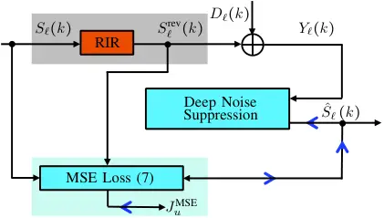
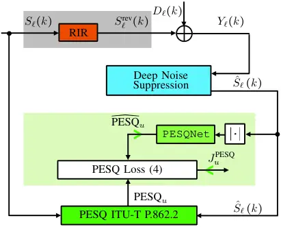
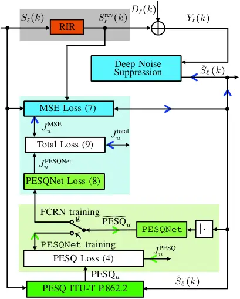

# Deep Noise Suppression Maximizing Non-Differentiable PESQ Mediated by a Non-Intrusive PESQNet

Ziyi Xu    Maximilian Strake    Tim Fingscheidt ^(†)^(†)thanks: Z. Xu,
M. Strake, and T. Fingscheidt are with Institute for Communications
Technology, Technische Universität Braunschweig, 38106 Braunschweig,
Germany (e-mails:\${ ziyi.xu, m.strake, t.fingscheidt }\$@tu-bs.de)

###### Abstract

Speech enhancement employing deep neural networks (DNNs) for denoising
are called deep noise suppression (DNS). During training, DNS methods
are typically trained with mean squared error (MSE) type loss functions,
which do not guarantee good perceptual quality. Perceptual evaluation of
speech quality (PESQ) is a widely used metric for evaluating speech
quality. However, the original PESQ algorithm is non-differentiable, and
therefore cannot directly be used as optimization criterion for
gradient-based learning. In this work, we propose an end-to-end
non-intrusive PESQNet DNN to estimate the PESQ scores of the enhanced
speech signal. Thus, by providing a reference-free perceptual loss, it
serves as a mediator towards the DNS training, allowing to maximize the
PESQ score of the enhanced speech signal. We illustrate the potential of
our proposed PESQNet-mediated training on the basis of an already strong
baseline DNS. As further novelty, we propose to train the DNS and the
PESQNet alternatingly to keep the PESQNet up-to-date and perform well
specifically for the DNS under training. Our proposed method is compared
to the same DNS trained with MSE-based loss for joint denoising and
dereverberation, and the Interspeech 2021 DNS Challenge baseline.
Detailed analysis shows that the PESQNet mediation can further increase
the DNS performance by about 0.1 PESQ points on synthetic test data and
by 0.03 DNSMOS points on real test data, compared to training with the
MSE-based loss. Our proposed method also outperforms the Challenge
baseline by 0.2 PESQ points on synthetic test data and 0.1 DNSMOS points
on real test data.

###### Index Terms: 

Deep noise suppression, convolutional recurrent neural network, PESQ,
non-intrusive PESQ estimation.

## I Introduction

Speech enhancement aims at improving the intelligibility and perceived
quality of a speech signal degraded by interferences, which can include
both additive noise and reverberation. This task becomes particularly
challenging when only a single-channel microphone mixture signal is
available. However, single-channel speech enhancement is important in
real-world applications, including telephony, hearing aids, and robust
speech recognition, and thus has attracted a lot of research attention.
The classical solution for this task is to estimate a time-frequency
(T-F) domain mask, or, more specifically, a spectral weighting rule \[1,
2, 3, 4, 5, 6, 7, 8, 9\], which however, requires the estimation of the
noise power, the a priori signal-to-noise ratio (SNR), and sometimes
also the a posteriori SNR.

The rise of data-driven approaches (e.g., deep learning) has facilitated
the (direct) estimation of T-F-domain masks, or even the desired clean
speech spectrum without any intermediate steps, which provides
state-of-the-art performance, even in the presence of non-stationary
noise \[10, 11, 12, 13, 14, 15, 16, 17, 18, 19, 20, 21, 22, 23, 24\].
Fingscheidt and Erkelens pioneered the data-driven approach for ideal
mask-based speech enhancement in \[10, 11, 12\], which reduces the
speech distortion while retaining a high noise attenuation. In recent
years, deep neural networks (DNNs) have shown great success in speech
enhancement. These methods have pushed the performance limits even
further, due to the powerful modeling capability of the DNNs, and are
subsumed under the term deep noise suppression (DNS). Wang et al. \[13,
19\] illustrate the benefits obtained by estimating an ideal ratio mask
for supervised speech enhancement with DNNs. Williamson et al. \[16\]
propose the DNN-based estimation of a complex ratio mask from the
single-channel mixture, to enhance both the amplitude spectrogram and
also the phase of the noisy speech signal. Compared to feed-forward
DNNs, convolutional neural networks (CNNs) are structurally well-suited
to preserve the harmonic structures of the speech spectrum in denoising
tasks, and have been successfully applied in \[17, 18, 20, 21, 22\].
Furthermore, the speech denoising task benefits significantly from
networks which can model long-term temporal dependencies, as shown in
recent studies integrating long short-term memory (LSTM) into CNNs \[18,
20, 21, 22\]. A fully connected LSTM is integrated into the bottleneck
of a convolutional encoder-decoder (CED) structure in \[20\]. However,
the fully-connected LSTM usually contains a large amount of trainable
parameters, which may weaken the generalization capability of the
trained network. To mitigate this problem, Strake et al. \[22\] proposed
to insert a convolutional LSTM (ConvLSTM) layer into the bottleneck of
the CED structure instead of the fully-connected LSTM layer, which
inherits the weight-sharing property of the CNN, thereby significantly
decreasing the amount of trainable parameters. This network topology is
dubbed as fully convolutional recurrent neural network (FCRN), and was
successfully employed in the Interspeech 2020 Deep Noise Suppression
(DNS) Challenge \[23\] for joint dereverberation and denoising, securing
2^(nd) rank in the non-realtime track with a realtime model.

Besides looking for powerful DNS architectures, adopting a better loss
function to train the DNS models is another important research direction
to further improve the performance. During the training process, most of
the DNS architectures are trained with some mean squared error (MSE)
loss, which is minimized during the training process. However,
optimization of the MSE loss during training does not guarantee good
human perceptual quality of the enhanced speech signal (unless the MSE
is zero), which leads to limited performance \[25, 26, 27, 28, 29, 30,
31\]. This effect is even more evident in low SNR conditions, where it
can lead to a highly distorted speech component and very unnatural
sounding residual noise. A perceptually-weighted loss function
considering human psychoacoustics, such as the absolute hearing
threshold and the masking effect, has recently been proposed in \[25,
30\]. Zhao et al. \[30\] employed the perceptual weighting filters from
code-excited linear predictive (CELP) speech coding to weight the MSE
between the network output and the corresponding target to emphasize
perceptually important T-F regions.

Perceptual evaluation of speech quality (ITU-T P.862.2 PESQ) \[32\] and
short-time objective intelligibility (STOI) \[33\] are two widely-used
metrics for evaluating speech quality and intelligibility, respectively.
Among these two metrics, PESQ has been designed to predict absolute
category rating (ACR) listener scores in speech quality assessment.
Thus, another approach would be to adapt perceptually related metrics,
e.g., PESQ and STOI, as loss functions, which could be used to optimize
for speech quality and speech intelligibility, respectively. However,
both the original STOI and PESQ are non-differentiable functions, which
cannot directly be used as an optimization criterion for gradient-based
deep learning. Kolbcek et al. proposed a differentiable STOI loss
formulation adapted from its original, and employed it in training a
network for an utterance-based speech enhancement \[26\]. However, their
experimental results reveal that the network trained with the proposed
STOI loss does not significantly improve on the STOI score compared to
the one trained with the conventional MSE loss. Compared to STOI, the
original PESQ formulation is significantly more complex. Zhang et al.
proposed a directional sampling method to approximate gradient descent
employing the original PESQ formulation \[27\]. Martín-Doñas et al.
proposed an approximated PESQ formulation, which is differentiable, and
combined it with the MSE as the final optimization criterion \[28\].
This proposed PESQ loss gains in speech perceptual quality compared to
the conventional MSE loss, however, does not outperform the simple
perceptual weighting filter loss proposed by Zhao et al. \[30\]. Thus,
obtaining a better differentiable approximation of the original PESQ
formulation is still a research challenge.

To mitigate this problem, Fu et al. \[31\] trained an end-to-end deep
learning model to approximate the PESQ function (so-called Quality-Net)
without having to know any computational details of the original PESQ
formulation. Afterwards, the trained Quality-Net is fixed and
concatenated to the output of the DNS model to estimate the PESQ scores
of the enhanced speech. Thus, it serves as a differentiable PESQ loss
for the training of the DNS model, aiming at maximizing the PESQ of the
output enhanced speech signal. It is important to note that as the
original PESQ \[32\], \[27, 28\], and \[31\] require a clean reference
signal for the loss calculation (intrusive quality model) and therefore
do not allow to use real data in training. Furthermore, as reported by
the authors of \[31\], the gradient from their fixed Quality-Net can
guide the DNS model in increasing the PESQ scores only in the first few
training iterations (minibatches). The reason could be that the fixed
Quality-Net has not seen the enhanced speech signal generated by the
updated DNS model. Therefore, the gradient obtained from the fixed
Quality-Net is problematic after training for several minibatches,
leading to the phenomenon that the Quality-Net is fooled by the updated
DNS model (estimated PESQ scores increase while true PESQ scores
decrease).

Fig. 1: Proposed DNS model training mediated by the PESQNet.

In this work, as shown in Fig. 1, we propose an end-to-end non-intrusive
PESQNet modeling the PESQ function, and subsequently employ it as
mediator towards the training of a DNS model. Compared to the
Quality-Net used in \[31\], our proposed PESQNet can estimate the PESQ
score of the enhanced signals without knowing the corresponding clean
speech (just like human raters in ACR listening tests). Thus, it can
serve to provide a reference-free perceptual loss. This offers the
potential to train a DNS model employing real recorded data, where only
the noisy speech mixture is available, a specific problem that has been
first addressed in \[24\], however, still with insignificant
improvements. Inspired from the alternating training schemes used in
adversarial trainings \[34, 35, 36\], one important novelty of this work
is solving the problems addressed in \[31\] by training the DNS model
and the PESQNet in a successful alternating protocol on epoch level.
Thus, the PESQNet can always adapt to the current updated DNS model and
can serve as mediator between the DNS model training and the PESQ
metrics by providing gradients, which effectively maximizes the original
ITUT-T P.862.2 PESQ score of the enhanced speech signal. For the DNS
model training, a fixed PESQNet is employed to estimate the PESQ scores
of the enhanced speech signal from the DNS model. Subsequently, a loss
calculated on the estimated PESQ scores, called PESQNet loss, is used to
control the DNS model training. Afterwards, the DNS model is fixed, and
the so-called PESQ loss is calculated to reflect the difference between
the estimated PESQ score from PESQNet and its ground truth measured by
the original PESQ function \[32\]. Thus, the PESQNet training keeps up
with the DNS model in any learning step.

We adopted the high-ranked FCRN proposed by Strake et al. \[23\] as our
DNS model. The proposed PESQNet model is adapted from a speech emotion
recognition (SER) model proposed in \[37\], which can provide
state-of-the-art emotion recognition performance. An SER task is
structurally similar to speech quality prediction, as it also assigns
one label to an entire input speech utterance. Furthermore, the adapted
SER model has been shown to be robust w.r.t. noise as well as channel
and language variation, which is supposed to be important for our
non-intrusive PESQNet. Our proposed PESQNet is used as mediator towards
a fine-tuning on a pre-trained DNS model to further increase the
perceptual quality. In the pre-training stage of our work, we consider
both denoising and dereverberation by employing a joint MSE-based loss
function proposed in \[23\], which has shown success in the Interspeech
2020 DNS Challenge \[38\]. Note that our proposed learning strategy
could potentially provide benefit to any given DNS model and to any
given pre-training loss function.

The rest of the article is structured as follows: In Section II we
introduce the signal model and our mathematical notations. We describe
our employed FCRN and PESQNet in Section III. Then the details of
mediating the FCRN training with the proposed PESQNet are explained.
Next, we present the experimental setup including the database, training
protocols, baselines, and employed quality metrics in Section IV. The
results and discussion are given in Section V and our work is concluded
in Section VI.

## II Signal model and Notations

We assume the microphone mixture $`y(n)`$ to be composed of the clean
speech signal $`s(n)`$ reverberated by the room impulse response (RIR)
$`h(n)`$, and disturbed by an additive noise $`d(n)`$ as

```math
y(n)=s(n)*h(n)+d(n)=s^{\text{rev}}(n)+d(n), \tag{1}
```

with $`s^{\text{rev}}(n)`$ and $`n`$ being the reverberated clean speech
component and the discrete-time sample index, respectively, and $`*`$
denoting the convolution operation. Since we perform a spectrum
enhancement, we transfer all the signals to the discrete Fourier
transform (DFT) domain:

```math
Y_{\ell}(k)=S^{\text{rev}}_{\ell}(k)+D_{\ell}(k), \tag{2}
```

with frame index $`\ell`$ and frequency bin index
$`k\!\in\!\mathcal{K}\!=\!\left\{0,1,\ldots,K\!-\!1\right\}`$, and $`K`$
being the DFT size. This procedure is also often known as short-time
Fourier transform (STFT), and successive STFT frames overlap in time. In
this work, we adopt the FCRN proposed by Strake et al. \[22\] as our DNS
model, in which a magnitude-bounded complex mask
$`M_{\ell}\left(k\right)\in\mathbb{C}`$ is estimated, with
$`\left|M_{\ell}\left(k\right)\right|\in\left[0,1\right]`$ to enhance
the noisy speech spectrum (see Fig. 2):

```math
\hat{S}_{\ell}\left(k\right)=M_{\ell}(k)\cdot Y_{\ell}(k). \tag{3}
```

Finally, the enhanced speech spectrum $`\hat{S}_{\ell}\left(k\right)`$
is subject to an inverse DFT (IDFT), followed by overlap add (OLA) to
reconstruct the time-domain enhanced speech signal $`\hat{s}(n)`$.

## III Models and Novel Training Loss/ Protocol

### III-A DNS Model

The DNS model employed in this work is shown in Fig. 2, with the FCRN
adopted from \[22\]. The input of the DNS is the noisy speech spectrum
$`Y_{\ell}(k)`$. The Norm box represents a zero-mean and unit-variance
normalization based on the statistics collected on the training dataset.
The dimensions of the input and the output feature maps for each layer
in the FCRN are depicted as number of features $`\times`$ number of time
frames $`\times`$ number of feature maps, with $`K_{\rm in}`$
representing the number of input and output frequency bins, while
$`C_{\rm in}`$ and $`C_{\rm out}`$ denote the number of input and output
channels, respectively.

The convolutional layers are represented by the Conv$`(N\times 1,f)`$
operations, with $`f\!=\!F`$ or $`f\!=\!2F`$ being the number of filter
kernels in each layer, and $`(N\times 1)`$ representing the kernel size,
emphasizing that the convolutions are only performed along the feature
axis. The maxpooling and upsampling layers have a kernel size of
$`(2\times 1)`$. The stride of the maxpooling layers is set to $`2`$.
The employed FCRN contains a convolutional encoder-decoder (CED)
structure. A fully convolutional LSTM layer denoted as
ConvLSTM$`(N\times 1,F)`$ is integrated in the bottleneck of the CED
structure as shown in Fig. 2. Furthermore, all possible forward residual
skip connections are added wherever layers have matched dimensions.

Fig. 2: Employed DNS model as used in Figs. 1, 4, 5, and 6.

Fig. 3: Employed PESQNet as used in Figs. 1, 5, and 6.

### III-B PESQNet

In this work, we propose an end-to-end non-intrusive PESQNet, modeling
ITU-T P862.2 PESQ. It estimates the PESQ score of an enhanced speech
utterance in the DFT domain, and is subsequently employed to control the
training of a DNS model. The employed PESQNet shall deliver a single
value (label) for an entire utterance, just as speech emotion
recognition (SER) does. Furthermore, models used for SER are always
non-intrusive, which is suitable for our reference-free PESQ estimation.
Accordingly, for our PESQNet, we built upon the SER model topology
proposed in \[37\], which shows state-of-the-art performance in emotion
recognition. It is depicted in Fig. 3.

The dimensions of the input and the output feature maps for each layer
are depicted as number of features $`\times`$ number of time frames
$`\times`$ number of feature maps (if applicable). The input of the
proposed PESQNet is the amplitude spectrogram
$`\left|S_{\ell}(k)\right|`$ (or: $`\left|\hat{S}_{\ell}(k)\right|`$),
$`\ell\!\in\!\mathcal{L}\!=\!\left\{1,2,\ldots,L\right\}`$, of an entire
utterance with $`L`$ frames, which is then grouped to several feature
matrices (blocks indexed with
$`b\in\mathcal{B}=\left\{1,2\ldots,B\right\}`$). Each feature matrix
(block) has the same dimensions of $`K_{\rm in}\!\times\!W\!\times\!1`$,
with $`K_{\rm in}`$ and $`W`$ being the numbers of input frequency bins
and time frames per block, respectively. The blocks are processed in
parallel by identical subnetworks with the following structure. A CNN
encoder is employed to extract quality-related features from the input
feature matrices. The convolutional layers are represented by the
Conv$`(h\times w,f)`$ operations, again with $`f`$ representing the
number of filter kernels in each layer, and $`(h\times w)`$ representing
the kernel size. Then, the extracted features are processed by
multi-width convolutional kernels with kernel widths $`w_{1}`$,
$`w_{2}`$, $`w_{3}`$, and $`w_{4}`$. The max-pooling-over-time layer and
the subsequent concatenation deliver a feature map with a fixed
dimension to the bidirectional LSTM (BLSTM) layer, which is used to
model temporal dependencies. Afterwards, four statistics (average,
standard deviation, minimum, and maximum) over blocks $`b`$ are applied
to the BLSTM outputs before they are processed by the fully-connected
(FC) layers denoted as FC$`(N)`$, with $`N`$ being the number of output
nodes. The output layer has a single node with a gate function
$`\sigma(x)=3.6\cdot\text{sigmoid}(x)+1.04`$ to limit the range of the
estimated PESQ score between $`1.04`$ and $`4.64`$, as it is determined
by ITU-T P.862.2 \[32\].

The estimated PESQ score $`\widehat{\text{PESQ}}_{u}`$ of the utterance
indexed with $`u`$ obtained from the PESQNet should be as close as
possible to its ground truth $`\text{PESQ}_{u}`$ measured by ITU-T
P.862.2 \[32\]. Thus, the loss function for PESQNet training is defined
as (“PESQ loss”):

```math
J^{\text{PESQ}}_{u}\!=\left(\widehat{\text{PESQ}}_{u}-\text{PESQ}_{u}\right)^{2}. \tag{4}
```

### III-C Novel PESQNet Loss Mediating Towards DNS Training

Our proposed PESQNet is utilized to control a fine-tuning on a
pre-trained DNS model to further increase the perceptual quality.

#### III-C1 DNS Pre-Training

First, however, in the pre-training stage of our work, we consider a
joint denoising and dereverberation by employing an MSE-based loss
function as proposed in \[23\], which has shown good success in the
Interspeech 2020 DNS Challenge \[38\]. This joint loss function consists
of two MSE-type loss terms. The first loss term is an utterance-wise
loss aiming at joint dereverberation and denoising by utilizing the
clean speech spectrum $`S_{\ell}(k)`$ as target, and is defined as



Fig. 4: DNS pre-training setup. The blue arrows indicate the gradient
flow back-propagated for the DNS model pre-training.



Fig. 5: PESQNet pre-training setup. The deep noise suppression is fixed,
and the green arrows indicate the gradient flow back-propagated for the
PESQNet model pre-training.

```math
J^{\text{joint}}_{u}\!=\!\frac{1}{L_{u}\!\cdot\!K}\!\sum_{\ell\in\mathcal{L}_{u}}\sum_{k\in\mathcal{K}}\!\bigl|\hat{S}_{\ell}(k)\!-\!S_{\ell}(k)\bigr|^{2}, \tag{5}
```

with $`\mathcal{L}_{u}`$ being the set of frame indices of the utterance
indexed with $`u`$, and $`L_{u}\!=\!\bigl|\!\mathcal{L}_{u}\!\bigr|`$
being its number of frames. The second utterance-wise loss term only
focuses on denoising by employing the reverberated clean speech spectrum
$`S^{\text{rev}}_{\ell}(k)`$ as target, following

```math
J^{\text{noise}}_{u}\!=\!\frac{1}{L_{u}\!\cdot\!K}\!\sum_{\ell\in\mathcal{L}_{u}}\sum_{k\in\mathcal{K}}\!\bigl|\hat{S}_{\ell}(k)\!-\!S^{\text{rev}}_{\ell}(k)\bigr|^{2}\!. \tag{6}
```

Afterwards, the two loss terms (5) and (6) are combined in the joint
loss function as:

```math
J^{\text{MSE}}_{u}\!=\beta\cdot J^{\text{joint}}_{u}+(1-\beta)\cdot J^{\text{noise}}_{u}, \tag{7}
```

with $`\beta\in\left[0,1\right]`$ being the weighting factor to control
a weaker or a stronger dereverberation, where $`\beta=0`$ lets (7)
become the conventional MSE loss for pure denoising. The pre-training
setup for DNS employing (7) is illustrated in Fig. 4, where the upper
gray box illustrates the microphone signal model, including the room
impulse response (RIR), while the lower part contains the computation of
loss (7). The blue arrows indicate the gradient flow from the MSE loss
(7) back-propagated to the DNS for pre-training. The details of the
employed DNS model are illustrated in Fig. 2.



Fig. 6: PESQNet and DNS training setup. After the pre-trainings, the DNS
and the PESQNet are trained alternately, controlled by the switch in
upper and lower position, respectively. The total loss
$`J^{\text{total}}_{u}`$ (9) in the center controls the DNS training
mediated by a fixed PESQNet. The lower part shows the PESQNet training
adapting it to the current fixed DNS, employing $`J^{\text{PESQ}}_{u}`$
(4). The blue and green arrows indicate the gradient flow
back-propagated for DNS and PESQNet training, respectively.

#### III-C2 PESQNet Pre-Training

Afterwards, the DNS is fixed and the PESQNet is trained to adapt to the
current pre-trained DNS employing (4). This is illustrated in the
PESQNet pre-training setup in Fig. 5, where the green arrows indicate
the gradient flow back-propagated for the PESQNet pre-training. The
details of the employed PESQNet are illustrated in Fig. 3.

#### III-C3 Fine-Tuning

In the fine-tuning stage as it is shown in Fig. 6, the pre-trained
PESQNet is applied to the output of the pre-trained DNS, estimating the
PESQ scores of the enhanced speech. Thus, it serves as a differentiable
PESQ loss for the training of the DNS, aiming at maximizing the PESQ of
the output enhanced speech signal. Accordingly, we can define a “PESQNet
loss”

```math
J^{\text{PESQNet}}_{u}\!=\left(\widehat{\text{PESQ}}_{u}-\text{PESQ}_{\text{max}}\right)^{2} \tag{8}
```

for utterance $`u`$, with $`\text{PESQ}_{\text{max}}\!=\!4.64`$, which
is minimized during DNS training. Furthermore, we explicitly consider
joint dereverberation and denoising also in the fine-tuning by combining
the joint MSE-based loss (7) with the novel reference-free PESQNet loss
(8). Thus, the total loss function employed during fine-tuning of the
DNS is defined as

```math
J^{\text{total}}_{u}=\alpha\cdot J^{\text{MSE}}_{u}\!+\!(1\!-\!\alpha)\!\cdot\!J^{\text{PESQNet}}_{u}, \tag{9}
```

with $`\alpha\in\left[0,1\right]`$ being the weighting factor. By
choosing $`\alpha`$ close to $`0`$, the novel reference-free
psychoacoustic loss $`J^{\text{PESQNet}}_{u}`$ will dominate the DNS
fine-tuning, and is supposed to deliver a better perceptual speech
quality.

One major contribution of this work is to solve the issues addressed in
\[31\], where the fixed PESQNet was reported to be fooled by the updated
DNS (estimated PESQ scores increase while true PESQ scores decrease)
after training for several minibatches. In \[31\], this was mainly
caused by the fixed Quality-Net not having seen the enhanced speech
signal generated by the updated DNS. Accordingly, we propose to train
the DNS and the PESQNet alternatingly on an epoch level to keep the
PESQNet up-to-date, and most importantly: it specifically adapts to the
DNS in its current learning step. In this novel alternating training
protocol, the DNS and the employed PESQNet are trained with the loss (9)
and (4), respectively, as illustrated in Fig. 6.

In Fig. 6, the alternating training for the DNS and the PESQNet is
controlled by the switch in upper and lower position, respectively. The
middle part containing the total loss $`J^{\text{total}}_{u}`$ (9)
computation denotes the DNS training controlled by a fixed PESQNet. The
lower part shows the PESQNet training adapting it to the current fixed
DNS, employing $`J^{\text{PESQ}}_{u}`$ (4). The blue and green arrows
indicate the gradient flow back-propagated for DNS and PESQNet training,
respectively. The detailed structures of the DNS as well as the employed
PESQNet are illustrated in Figs. 2 and 3, respectively.

## IV Experimental Setup and Databases

### IV-A Dababase and Preprocessing

We perform a two-step training, which includes pre-training and
fine-tuning steps. During pre-training, the dataset
$`\mathcal{D}_{\text{WSJ0}}`$ comprises a $`105`$-hours training set
$`\mathcal{D}^{\text{train}}_{\text{WSJ0}}`$ and an $`18`$-hours
validation set $`\mathcal{D}^{\text{val}}_{\text{WSJ0}}`$, which are
synthesized with the clean speech from WSJ0 speech corpus \[39\] and
noise from DEMAND \[40\] and QUT \[41\] comprising 35 different noise
files shared in training and validation. We normalized the clean speech
active speech level to $`-26\,\text{dBov}`$ and simulated five SNR
conditions ranging from $`0`$ to $`20`$ dB with a step size of $`5`$ dB,
according to ITU-T P.56 \[42\]. Please note that no reverberation
effects are considered in preparation of the pre-training dataset.
Furthermore, a small test set
$`\mathcal{D}^{\text{test}}_{\text{WSJ0}}`$ is prepared by mixing the
clean speech from eight unseen speakers with four unseen types of noise
taken from DEMAND \[40\] and QUT \[41\], including SNRs ranging from
$`0`$ to $`10`$ dB with a $`5`$ dB step size. The
$`\mathcal{D}^{\text{test}}_{\text{WSJ0}}`$ dataset is only used to
evaluate the PESQNet performance after pre-training.

The fine-tuning dataset contains files randomly chosen from the official
Interspeech 2021 DNS Challenge (dubbed DNS3) training material \[43\].
This $`\mathcal{D}_{\text{DNS3}}`$ dataset contains $`100`$ hours of
training material $`\mathcal{D}^{\text{train}}_{\text{DNS3}}`$ and
$`10`$ hours of validation material
$`\mathcal{D}^{\text{val}}_{\text{DNS3}}`$, where SNRs are sampled
uniformly between $`0`$ and $`40`$ dB. The RMS level of the mixture is
set to a value uniformly sampled between $`-38`$ and $`-18`$ dBov. The
organizers also provided both recorded and synthetic RIRs in the dataset
\[44\]. However, we do not use their provided RIRs, since the time shift
caused by the provided RIRs is unknown, so that the training input and
the corresponding target are not time-aligned, which is problematic for
training a complex mask-based DNS. Thus, we reverberated $`50\%`$ of the
files in $`\mathcal{D}_{\text{DNS3}}`$ by convolving the clean speech
component with our simulated RIRs. The employed RIRs are simulated using
the mirror method \[45\] with the room size uniformly sampled from
(length, width, height) $`\in`$ (\[$`3,10`$\] m, \[$`3,10`$\] m,
\[$`2.5,3.5`$\] m) and an absorption coefficient uniformly sampled
between $`0.1`$ and $`0.3`$ for all room surfaces. The microphone is
assumed in the center of the simulated room and the source is randomly
placed at a source-to-microphone distance uniformly sampled between
$`0.1`$ m and $`1`$ m. Accordingly, the estimated RT60s lie between
$`0.28`$ and $`1.66`$ s.

We use the preliminary synthetic test set from the first Interspeech
2020 DNS Challenge (DNS1) \[38\] for development (dubbed
$`\mathcal{D}^{\text{dev}}_{\text{DNS1}}`$), which contains $`150`$
noisy speech mixtures with and without reverberation. Please note that
we use this dataset $`\mathcal{D}^{\text{dev}}_{\text{DNS1}}`$ for
instrumental performance measurement, whereas the preliminary synthetic
test set from the DNS3 challenge \[43\] contains target signals of
singing and emotions (e.g., crying, yelling, and laughing). Accordingly,
it would be inadequate to evaluate the speech enhancement performance
employing instrumental metrics such as PESQ \[32\] and STOI \[33\],
which are designed for speech signals only.

For the final evaluation, we prepare both synthetic and real test
datasets. The synthetic test set contains all speech files of the
official preliminary test set of the ICASSP 2020 DNS Challenge (dubbed
DNS2) \[44\]. This synthetic test dataset denoted as
$`\mathcal{D}^{\mathrm{test}}_{\mathrm{DNS2}}`$ is used for instrumental
performance measurements. To further evaluate our proposed methods in
real implementations, we use the preliminary test set from DNS3 \[43\]
denoted as $`\mathcal{D}^{\mathrm{test}}_{\mathrm{DNS3}}`$ as our real
test set, which contains noisy speech recorded in reality.

In this work, signals have a sampling rate of $`16\,\text{kHz}`$ and we
apply a periodic Hann window with frame length of $`384`$ with a
$`50\%`$ overlap, followed by an FFT with $`K=512`$. The number of input
and output frequency bins in Figs. 2 and 3 is set to $`K_{\rm in}=260`$.
The last 3 frequency bins are redundant and only used for compatibility
with the two maxpooling and upsampling operations in the employed DNS
model shown in Fig. 2, and are dropped for subsequent processing. Since
we perform a complex mask-based speech enhancement, the number of input
and output channels in Fig. 2 represented by $`C_{\rm in}`$ and
$`C_{\rm out}`$ are set to $`2`$, reflecting the real and the imaginary
parts.

### IV-B Training Protocols

#### IV-B1 DNS Pre-Training

Firstly, we pre-train the DNS model using
$`\mathcal{D}^{\text{train}}_{\text{WSJ0}}`$ with the loss (7). The DNS
pre-training setup is illustrated in Fig. 4, where the blue arrows
indicate the gradient flow back-propagated for the DNS model
pre-training. Since no reverberation effects are considered in the
pre-training stage, $`S_{\ell}(k)=S^{\text{rev}}_{\ell}(k)`$ holds in
Fig. 4. Accordingly, we set $`\beta=0`$ in (7). For our employed FCRN
shown in Fig. 2, the number of filter kernels is set to $`F=88`$ and the
kernel size is chosen as $`N=24`$. In both pre-training and fine-tuning
for our DNS, we employ a truncated backpropagation-through-time (BPTT)
training with a sequence length (unrolling depth of BPTT) equal to the
number of time frames belonging to the current input utterance.
Furthermore, a batch size of 3 utterances is employed. For the DNS
pre-training, we employ the Adam optimizer with the initial learning
rate of $`10^{-4}`$. The learning rate is halved once the validation
loss measured on $`\mathcal{D}^{\text{val}}_{\text{WSJ0}}`$ does not
improve for a consecutive five epochs. We stop the training after the
learning rate is decreased below $`10^{-5}`$, and the DNS model which
provides the lowest validation loss is saved.

#### IV-B2 PESQNet Pre-Training

Secondly, the PESQNet is pre-trained on the same dataset with the
enhanced speech spectrum $`\hat{S}_{\ell}(k)`$ generated by the
pre-trained and fixed FCRN as illustrated in Fig. 5. The training
targets are the corresponding ground truth PESQ scores of the enhanced
speech signals measured with the original ITU-T P.862.2 PESQ function
\[32\], as illustrated in the lower part in Fig. 5. As in DNS
pre-training, we have $`S_{\ell}(k)=S^{\text{rev}}_{\ell}(k)`$ in
Fig. 5. For our employed PESQNet shown in Fig. 2, the widths of the
convolutional kernels are set to $`w_{i}=2^{i-1}`$,
$`i\in\left\{1,2,3,4\right\}`$. The number of time frames for the input
feature matrices shown in Fig. 3 is set to $`W=16`$. In both
pre-training and fine-tuning of our PESQNet, we employ the same
truncated BPTT training scheme as used for DNS training. The Adam
optimizer is employed with an initial learning rate of
$`2\!\cdot\!10^{-4}`$. The learning rate is halved once the validation
loss does not improve for five consecutive epochs. We stop the training
when the learning rate is smaller than $`10^{-5}`$ and the model with
the lowest validation loss is saved.

#### IV-B3 Novel FCRN and PESQNet Alternating Fine-Tuning

We propose a novel two-stage fine-tuning protocol on the dataset
$`\mathcal{D}_{\text{DNS3}}`$ from DNS3. In the first stage, which is
basically a domain adaptation, we fine-tune the pre-trained FCRN with
the loss (7) on the $`\mathcal{D}^{\text{train}}_{\text{DNS3}}`$ dataset
and subsequently, still in the first stage, we fine-tune the PESQNet on
the same dataset with the enhanced speech spectrum generated by the
fixed fine-tuned FCRN, again with loss (4). During fine-tuning, $`50\%`$
of the files in $`\mathcal{D}_{\text{DNS3}}`$ contain reverberation,
therefore, we set $`\beta=0.9`$ in (7) for joint denoising and
dereverberation as proposed by \[23\]. The initial learning rates for
the training of the DNS and the PESQNet are set to $`2\!\cdot\!10^{-5}`$
and $`5\!\cdot\!10^{-5}`$, respectively. Both of the two trainings are
stopped when the respective learning rate is smaller than $`10^{-6}`$.
Other settings are exactly the same as employed in its corresponding
pre-training.

In the second-stage (final) fine-tuning, we alternatingly fine-tune the
DNS with the fixed PESQNet serving as mediator towards ITU-T P.862.2,
and fine-tune the PESQNet with a fixed DNS.

A cycle of our novel alternating training protocol is defined as
follows: We first train the FCRN with a fixed PESQNet using the total
loss (9) on one epoch of training data from
$`\mathcal{D}^{\text{train}}_{\text{DNS3}}`$. This is illustrated in
Fig. 6 with the switch in the upper position. Then, we fix the FCRN, and
train the PESQNet also on one epoch of training data from the same
dataset using the PESQ loss (4), with the enhanced speech obtained from
the current fixed FCRN. This is shown in Fig. 6 with the switch changed
to the lower position. This training protocol is dubbed as
$`\langle 1\!-\!1\rangle`$, where “1” denotes training with one epoch of
data from $`\mathcal{D}^{\text{train}}_{\text{DNS3}}`$. In this
second-stage fine-tuning, the DNS and the PESQNet are trained with in
total $`25`$ epochs of data, with epoch index
$`\tau\in\left\{1,2,\ldots,25\right\}`$. Here, the DNS is trained with a
fixed PESQNet on epochs with odd index number, e.g.,
$`\tau\in\left\{1,3,5,\ldots,25\right\}`$, while the PESQNet is trained
adapting to the fixed updated DNS on epochs with even index number. We
fix the learning rates for the training of the DNS and the PESQNet to
$`10^{-6}`$ and $`2\!\cdot\!10^{-6}`$, respectively. The DNS model with
the lowest validation loss as well as its corresponding PESQNet are
saved.

To explore the influence of the hyperparameter $`\alpha`$ in (9) on the
DNS second-stage fine-tuning, we employ
$`\alpha\in\left\{0,0.5,1\right\}`$. Please note that for the
hyperparameter setting $`\alpha=1`$, the DNS training is not controlled
by our proposed PESQNet. In this case, the loss functions used in the
first-stage and the second-stage fine-tuning are exactly the same. Thus,
this training serves as a “placebo” setup intended to prove that the
perceptual quality improvements for $`\alpha\!<\!1`$ are not just caused
by the extra second-stage fine-tuning with much lower learning rate.

Our proposed alternating training protocol resembles the alternating
training schemes used in adversarial trainings, which are known to have
issues in training stability \[46, 47\]. Such instable training can
usually be observed by a fluctuating or increasing loss measured even on
the training dataset $`\mathcal{D}^{\text{train}}_{\text{DNS3}}`$. To
further stabilize the second-stage fine-tuning, we employ a simple
accumulating of gradients during the DNS fine-tuning, where the
gradients obtained from every minibatch of training data within one
epoch are accumulated and averaged for the final weight update at the
end of the epoch. Please note that this gradient accumulation is only
applied to the DNS second-stage fine-tuning, not for the PESQNet
second-stage fine-tuning. Compared to the DNS pre-training and the
first-stage fine-tuning, the weights of the DNS model employing gradient
accumulation are only updated once per epoch.

### IV-C Baselines

#### IV-C1 DNS Trained with MSE-Based Loss

As one of the baselines, we employ the MSE-based loss (7) proposed in
\[23\] to train our DNS. Strake et al. \[23\] trained the same DNS model
shown in Fig. 2 with this MSE-based denoising and dereverberation loss
in the DNS1 Challenge \[38\] and achieved a second rank in the
non-realtime track, although their model (as ours) in their work are
actually realtime-capable.

Indeed, this strong baseline DNS is exactly the one obtained from our
first-stage fine-tuning, since up to this stage even datasets match
exactly. Accordingly, by comparing to this baseline, we intend to
exploit how much perceptual speech quality could be gained by employing
the additional second-stage fine-tuning mediated by our proposed
PESQNet. This baseline is denoted as “FCRN \[23\]” in the following
discussions.

#### IV-C2 Microsoft DNS3 Challenge Baseline

As another reference, we take the baseline provided by Microsoft \[48\]
in the DNS3 Challenge \[43\]. Braun et al. proposed a level-invariant
normalized loss function to train a recurrent neural network (RNN) for a
complex mask-based speech enhancement. The proposed loss function is
supposed to avoid signals with high active levels dominating the
training process. Furthermore, data augmentation techniques are employed
by considering different SNR levels, speech active levels, and also
filtering effects caused by acoustics or recording devices.

Please note that we directly employ the realtime-capable, fully-trained
DNS3 baseline as provided by the challenge organizers \[43\] without any
re-training since we anyway evaluate on DNS Challenge data. Thus, a fair
comparison can be made between our work and the DNS3 baseline \[48\],
based on the DNS3 challenge rules specified in \[43\]. Furthermore, we
call it “DNS3 Baseline \[43\]” in this work.

#### IV-C3 Baseline from Our Previous Work

In our previous work \[24\], we had proposed to use this end-to-end
non-intrusive PESQNet to advantageously employ real recordings in DNS
training. This is achieved by a “weakly” supervised training with both
synthetic and real data on minibatch level. In \[24\], the novelty was
to focus on employing real training data in training a speech
enhancement DNN without using GAN-type losses. However, the training of
\[24\] without employing gradient accumulation was sensitive w.r.t.
instabilities, thus, very limited performance improvement was achieved
for real test data, and even no PESQ improvement was achieved for
synthetic test data. Solving the instability problem reported in \[31\]
and sometimes occurring in \[24\], is a core contribution of this work,
along with a much more extensive analysis and experimental evaluation.
Therefore, we adopt our previous work as another baseline to show the
benefits obtained from the novel $`\langle 1\!-\!1\rangle`$ epoch-wise
training protocol employing gradient accumulation. Our previous work is
represented as “FCRN/PESQNet \[24\]” in the following result tables.

### IV-D Quality Metrics

To evaluate the performance of the DNS model, we employ measurements
with instrumental metrics such as PESQ \[32\], STOI \[33\], segmental
SNR improvement $`\Delta\text{SNR}_{\text{seg}}`$ \[49\], and
speech-to-reverberation modulation energy ratio (SRMR) \[50\]. PESQ and
STOI are measured on the enhanced speech signal reflecting the
perceptual speech quality and intelligibility, respectively. For the
noisy mixtures without reverberation, we measure the
$`\Delta\text{SNR}_{\text{seg}}`$ according to \[49\] to explicitly
evaluate the denosing effects. SRMR is measured only on the noisy
mixtures under reverberated conditions to evaluate the dereverberation
effects. Furthermore, we also measured DNSMOS \[51\] on the enhanced
speech, which is obtained from a non-intrusive network specifically
trained to predict human subjective rating scores for DNS tasks
according to ITU-T P.808 \[52\]. All of the abovementioned metrics
should be as high as possible.

The performance of the PESQNet is reported by the mean absolute error
(MAE) and the linear correlation coefficient (LCC) as used in \[53\].
Both of the metrics are calculated based on the estimated PESQ score
from the PESQNet and its corresponding ground truth measured according
to ITU-T P.862.2 PESQ \[32\]. An accurately estimated PESQ score is
reflected by a low MAE and a high LCC.

## V Experimental Results and Discussion

### V-A PESQNet Performance

Since the proposed PESQNet will serve to mediate towards the
2^(nd)-stage fine-tuning of the DNS, an accurately estimated
$`\widehat{\text{PESQ}}_{u}`$ employed in the total loss (9) is crucial
in guiding the DNS to further increase the perceptual quality.
Therefore, we have to put focus on the performance of the PESQNet after
the pre-training and after the 1^(st)-stage fine-tuning.

Fig. 7: Scatter plot for the predicted PESQ scores
$`\widehat{\text{PESQ}}_{u}`$ by PESQNet, measured on
$`\mathcal{D}^{\text{test}}_{\text{WSJ0}}`$, after pre-training of first
the FCRN and then the PESQNet on
$`\mathcal{D}^{\text{train}}_{\text{WSJ0}}`$. The enhanced speech signal
$`\hat{s}(n)`$ used for predicting $`\text{PESQ}_{u}`$ is obtained from
the corresponding pre-trained FCRN.

|     |                  |            |                  |            |
| --- | ---------------- | ---------- | ---------------- | ---------- |
|     | MAE($`\hat{s}`$) | MAE($`y`$) | LCC($`\hat{s}`$) | LCC($`y`$) |
|     | 0.21             | 0.16       | 0.95             | 0.97       |

TABLE I: Performance of the PESQNet measured on
$`\mathcal{D}^{\text{test}}_{\text{WSJ0}}`$, after pre-training on
$`\mathcal{D}^{\text{train}}_{\text{WSJ0}}`$. Performance is measured
using the mean absolute error (MAE) and the linear correlation
coefficient (LCC), between the ground truth PESQ and predicted PESQ
scores. The enhanced speech signal $`\hat{s}(n)`$ used for predicting
$`\text{PESQ}_{u}`$ is obtained from the corresponding pre-trained FCRN.

Fig. 8: Scatter plot for the predicted PESQ scores
$`\widehat{\text{PESQ}}_{u}`$ by PESQNet, measured on
$`\mathcal{D}^{\mathrm{dev}}_{\mathrm{DNS1}}`$, after first-stage
fine-tuning of first the FCRN and then the PESQNet on
$`\mathcal{D}^{\text{train}}_{\text{DNS3}}`$ \[43\]. The enhanced speech
signal $`\hat{s}(n)`$ used for predicting $`\text{PESQ}_{u}`$ is
obtained from the corresponding first-stage fine-tuned FCRN. The
performance is reported on both reverberation conditions.

|                  |                  |            |                  |            |
| ---------------- | ---------------- | ---------- | ---------------- | ---------- |
|                  | MAE($`\hat{s}`$) | MAE($`y`$) | LCC($`\hat{s}`$) | LCC($`y`$) |
| Reverberation    | 0.32             | 0.12       | 0.85             | 0.87       |
| No reverberation | 0.31             | 0.23       | 0.82             | 0.88       |

TABLE II: Performance of the PESQNet measured on
$`\mathcal{D}^{\mathrm{dev}}_{\mathrm{DNS1}}`$, after first-stage
fine-tuning on the DNS3 training set
$`\mathcal{D}^{\text{train}}_{\text{DNS3}}`$ \[43\]. Performance is
measured using the mean absolute error (MAE) and the linear correlation
coefficient (LCC), between the ground truth PESQ and predicted PESQ
scores. The enhanced speech signal $`\hat{s}(n)`$ used for predicting
PESQ($`\hat{s}`$) is obtained from the corresponding first-stage
fine-tuned FCRN. The performance is reported on both reverberation
conditions.

#### V-A1 PESQNet Pre-Training Performance

After the PESQNet’s pre-training illustrated in Fig. 5 with
$`\mathcal{D}^{\text{train}}_{\text{WSJ0}}`$, we measure its performance
on $`\mathcal{D}^{\text{test}}_{\text{WSJ0}}`$. Please note that we do
not consider reverberations in the pre-training and the following
performance evaluation.

In Fig. 7, we present the scatter plot with the predicted PESQ score
$`\widehat{\text{PESQ}}_{u}`$ obtained from the pre-trained PESQNet and
its ground truth $`\text{PESQ}_{u}`$ measured by ITU-T P.862.2 PESQ
\[32\]. Noisy speech utterances and their enhanced version from the
corresponding pre-trained DNS are represented by red and blue markers,
respectively. We can see that the PESQ scores of the enhanced speech
utterances are slightly more challenging to predict than the noisy ones,
which is reflected by more blue markers distributed away from the
diagonal line. The measured MAE and LCC in Table I confirm our
observation, where we achieve $`0.16`$ MAE and $`0.97`$ LCC for the
noisy speech, which is slightly better than the values measured on
enhanced speech. However, we can generally see that the pre-trained
PESQNet is quite reliable, especially from the high LCC (around
$`0.96`$) and the low MAE (around 0.19) averaged over both noisy and
enhanced speech, shown in Table I.

#### V-A2 PESQNet 1^(st)-Stage Fine-Tuning Performance

After the 1^(st)-stage fine-tuning of PESQNet with
$`\mathcal{D}^{\text{train}}_{\text{DNS3}}`$, we evaluate its
performance on $`\mathcal{D}^{\mathrm{dev}}_{\mathrm{DNS1}}`$. Please
note that we consider the conditions with and without reverberation in
the fine-tuning and the subsequent performance evaluation.

In Fig. 8, we present the scatter plot with the same metrics used in
Fig. 7 for the noisy and the enhanced speech utterances, however, under
both reverberation conditions. We can see that the distribution of the
markers is more dispersive and farther away from the diagonal when
compared to the ones in Fig. 7. This is supposedly caused by the
increased diversities in the training and the test datasets, w.r.t.
noise types, languages, reverberations, SNRs, and speech active levels,
leading to a more challenging task. In Table II, the MAE values measured
on the enhanced speech are around $`0.1`$ points higher than that in
Table I. Furthermore, we can see that an overall performance degradation
on both noisy and enhanced speech reflected by around $`0.1`$ points
lower LCC values compared to the ones in Table I. However, in general,
the fine-tuned PESQNet is still reliable by offering an LCC above
$`0.85`$, averaged over the noisy and the enhanced speech under both
reverberation conditions. Furthermore, the performance of the PESQNet is
very balanced over both reverberation conditions reflected by the
similar LCC values, which is important for mediating towards the
2^(nd)-stage fine-tuning of the DNS.

### V-B DNS 2^(nd)-Stage Alternating Fine-Tuning Results

|     |                                                                |                |        |      |                                         |             |        |      |      |
| --- | -------------------------------------------------------------- | -------------- | ------ | ---- | --------------------------------------- | ----------- | ------ | ---- | ---- |
|     | Methods                                                        | Without reverb |        |      |                                         | With reverb |        |      |      |
|     |                                                                | PESQ           | DNSMOS | STOI | $`\Delta\text{SNR}_{\text{seg}}`$\[dB\] | PESQ        | DNSMOS | STOI | SRMR |
| REF | Noisy                                                          | 2.21           | 3.15   | 0.91 | \-                                      | 1.57        | 2.73   | 0.56 | \-   |
|     | DNS3 Baseline \[48\]                                           | 3.15           | 3.64   | 0.94 | 6.30                                    | 1.68        | 3.18   | 0.62 | 6.33 |
|     | FCRN \[23\]                                                    | 3.37           | 3.82   | 0.96 | 8.35                                    | 1.95        | 3.08   | 0.63 | 7.25 |
|     | FCRN/PESQNet \[24\]                                            | 3.35           | 3.88   | 0.95 | 8.40                                    | 1.92        | 3.11   | 0.61 | 7.41 |
| NEW | FCRN/PESQNet^(∗), $`\langle 1\!-\!1\rangle`$, $`\alpha\!=\!0`$ | 3.45           | 3.87   | 0.96 | 8.48                                    | 1.95        | 3.13   | 0.62 | 7.38 |
|     | FCRN/PESQNet, $`\langle 1\!-\!1\rangle`$, $`\alpha\!=\!0.5`$   | 3.43           | 3.86   | 0.96 | 8.42                                    | 1.95        | 3.12   | 0.62 | 7.40 |
|     | FCRN/PESQNet, $`\langle 1\!-\!1\rangle`$, $`\alpha\!=\!1`$     | 3.36           | 3.82   | 0.96 | 8.34                                    | 1.94        | 3.09   | 0.63 | 7.25 |

TABLE III: Instrumental quality results on the development set
$`\mathcal{D}^{\mathrm{dev}}_{\mathrm{DNS1}}`$, employing synthetic
data. Evaluation is performed separately on the conditions without and
with reverberation and is used for the optimization of hyperparameter
$`\alpha`$ in (9). DNSMOS is adopted from \[51\]. Best results are in
bold font, and the second best are underlined. Proposed method with
$`*`$.

#### V-B1 Hyperparameter Optimization and Analysis

To explore the influence of the hyperparameter $`\alpha`$ in (9), we
employ $`\alpha\in\left\{0,0.5,1\right\}`$ in the DNS 2^(nd)-stage
fine-tuning. Afterwards, we evaluate the performance of our trained DNS
models and the baseline methods on the synthetic dataset
$`\mathcal{D}^{\mathrm{dev}}_{\mathrm{DNS1}}`$. The performance is
reported separately on the conditions with and without reverberation as
shown in Table III. The best results are marked in bold font and the
second best are underlined.

It can be seen that among all the baseline methods, the DNS model
trained with the MSE-based loss (7) proposed in \[23\], which is denoted
as “FCRN \[23\]”, shows the best performance under both reverberation
conditions by offering three 1^(st)-ranked metrics. Under both
reverberation conditions, it also offers slightly better PESQ scores
compared to the baseline from our previous work \[24\], where real
recordings are employed in DNS training. Our previous work denoted as
“FCRN/PESQNet, \[24\]” achieves two 1^(st)-ranked metrics and one 2^(nd)
rank and significantly outperforms the DNS3 baseline \[48\] in speech
quality measured by PESQ. The DNS3 baseline \[48\] shows limited overall
performance compared to the other baseline methods, which are reflected
by around 0.2 and 0.24 points lower PESQ scores under the conditions
without and with reverberation. This is supposedly caused by the weakest
noise attenuation and dereverberation reflected by the lowest
$`\Delta\text{SNR}_{\text{seg}}`$ and SRMR scores.

Fig. 9: DNS and PESQNet training loss performance measured on a subset
of $`\mathcal{D}^{\text{train}}_{\text{DNS3}}`$ during 2^(nd)-stage
alternating fine-tuning. The performance $`J^{\text{total}}(\tau)`$ (9)
of the DNS is shown by the blue curve with $`\alpha=0`$. The performance
of the PESQNet is measured by the green curve MAE$`(\tau)`$.

For our proposed 2^(nd)-stage fine-tuning employing $`\alpha=0`$ in (9),
our trained DNS offers the best performance among all the evaluated
methods with four 1^(st)-ranked and three 2^(nd)-ranked metrics. In
particular, this setting can offer the best speech perceptual quality
reflected by the highest PESQ scores under both reverberation
conditions. Interestingly, during the 2^(nd)-stage fine-tuning with our
proposed $`\langle 1\!-\!1\rangle`$ training protocol, only employing
the perceptually-related loss $`J_{u}^{\text{PESQNet}}`$ (8) provided by
our proposed PESQNet (with $`\alpha=0`$ in (9)) is enough to guide the
DNS in increasing the PESQ scores. Further increasing $`\alpha`$ towards
$`1`$ decreases the influence of the perceptually-related loss in (9),
resulting in a gradual performance decrease of the speech quality
measured by both PESQ and DNSMOS. Please note that for the
hyperparameter setting $`\alpha=1`$, the loss functions used in the
1^(st)-stage and the 2^(nd)-stage fine-tuning are exactly the same.
Thus, a very similar performance is expected compared to the MSE-based
reference method “FCRN \[23\]”, which is confirmed in Table III. This
setting with $`\alpha=1`$ serves as a “placebo” setup intended to prove
that the perceptual quality improvements for $`\alpha\!<\!1`$ are not
just caused by the extra second-stage fine-tuning with much lower
learning rate. Finally, we select the hyperparameter setting
$`\alpha=0`$ for our proposed DNS training protocol but still report the
other settings in the following.

Fig. 10: Averaged true ITU-T P.862.2 PESQ scores measured on a subset of
$`\mathcal{D}^{\text{train}}_{\text{DNS3}}`$ during 2^(nd)-stage
alternating fine-tuning. In the employed total loss (9), $`\alpha`$ is
set to $`0`$.

To illustrate the progress of the 2^(nd)-stage fine-tuning for our DNS
and the PESQNet, we plot the training performance measured on a subset
of the $`\mathcal{D}^{\text{train}}_{\text{DNS3}}`$ in Fig. 9 with the
horizontal axis representing the epoch index $`\tau`$. The performance
of the DNS is measured by the total loss
$`J^{\text{total}}=J^{\text{PESQNet}}`$ (9), (8), due to $`\alpha=0`$,
represented by the blue curve. The corresponding performance of the
PESQNet is measured by the MAE between the predicted and the ground
truth PESQ scores, shown by the green curve. The initial performance of
the DNS and the corresponding PESQNet before the 2^(nd)-stage
alternating fine-tuning is represented by the markers at $`\tau=0`$. The
DNS is trained with a fixed PESQNet on epochs with odd index number,
e.g., $`\tau\in\left\{1,3,\ldots,25\right\}`$, while the PESQNet is
trained adapting to the fixed updated DNS on epochs with even index
number. Please note that an inaccurately estimated PESQ score, which is
close to $`\text{PESQ}_{\text{max}}`$, can lead to a low loss value of
$`J^{\text{total}}`$ (9). Meanwhile, a more precisely estimated PESQ
score obtained from the updated PESQNet may result in an increased
$`J^{\text{total}}`$. This explains the large performance variation at
$`\tau=2`$, where the PESQNet is trained with a significant improvement
and subsequently leads to the increase of $`J^{\text{total}}`$, which
then again decrease over the epochs. Most important, however, we can see
that the performance of our DNS and the PESQNet improves alternatingly
during the 2^(nd)-stage fine-tuning.

Furthermore, in Fig. 10, we plot the averaged true PESQ scores measured
on the same dataset used in Fig. 9 during the 2^(nd)-stage fine-tuning.
Compared to the initial PESQ performance of the DNS (marker at
$`\tau=0`$), each epoch of the DNS training mediated by the proposed
PESQNet can achieve a better PESQ score. The PESQ improvement obtained
from each learning step of DNS training is small, which is supposedly
due to the small learning rate¹¹ 1 We found that increasing the learning
rate for the DNS and PESQNet alternating training will not lead to a
more significant PESQ improvement but may result in a destabilized
training with a strongly fluctuating training loss. Thus, with a high
learning rate, we only achieve a marginal performance improvement on the
enhanced speech quality. used in the 2^(nd)-stage fine-tuning, however,
it accumulates over the epochs. Please note that the DNS before the
2^(nd)-stage fine-tuning is exactly the baseline (FCRN \[23\]) trained
with the MSE-based loss, which offers the best performance among all the
baselines, especially on PESQ scores. Accordingly, employing a small
learning rate for the 2^(nd)-stage fine-tuning can supposedly further
increase the PESQ score without harming the performance on other
metrics. Furthermore, we can infer from Fig. 10 that further PESQ
improvement could be achieved with more training epochs for the
2^(nd)-stage fine-tuning. This also proves that the perceptually related
loss (8) provided by our PESQNet can be advantageously employed for
improving the perceptual quality of the DNS, and potentially of any DNS
network topology.

|     |                                                                |      |        |      |
| --- | -------------------------------------------------------------- | ---- | ------ | ---- |
|     | Method                                                         | PESQ | DNSMOS | STOI |
| REF | Noisy                                                          | 2.37 | 3.08   | 0.88 |
|     | DNS3 Baseline \[48\]                                           | 3.14 | 3.52   | 0.91 |
|     | FCRN \[23\]                                                    | 3.25 | 3.60   | 0.93 |
|     | FCRN/PESQNet \[24\]                                            | 3.24 | 3.67   | 0.92 |
| NEW | FCRN/PESQNet^(∗), $`\langle 1\!-\!1\rangle`$, $`\alpha\!=\!0`$ | 3.34 | 3.65   | 0.93 |
|     | FCRN/PESQNet, $`\langle 1\!-\!1\rangle`$, $`\alpha\!=\!0.5`$   | 3.32 | 3.63   | 0.93 |
|     | FCRN/PESQNet, $`\langle 1\!-\!1\rangle`$, $`\alpha\!=\!1`$     | 3.26 | 3.60   | 0.93 |

TABLE IV: Instrumental quality results on the test set
$`\mathcal{D}^{\mathrm{test}}_{\mathrm{DNS2}}`$, employing synthetic
data. DNSMOS is adopted from \[51\]. Best results are in bold font, and
the second best are underlined. Proposed method with $`*`$.

Fig. 11: DNS and PESQNet loss measured on
$`\mathcal{D}^{\text{test}}_{\text{DNS2}}`$ during 2^(nd)-stage
alternating fine-tuning. The performance $`J^{\text{total}}(\tau)`$ (9)
of the DNS is shown by the blue curve with $`\alpha=0`$. The performance
of the PESQNet is measured by the green curve MAE$`(\tau)`$.

Fig. 12: Averaged true ITU-T P.862.2 PESQ scores measured on
$`\mathcal{D}^{\text{test}}_{\text{DNS2}}`$ during 2^(nd)-stage
alternating fine-tuning. In the employed total loss (9), $`\alpha`$ is
set to $`0`$.

#### V-B2 Performance Evaluation on Synthetic Test Data

We evaluate our 2^(nd)-stage fine-tuned DNS on both synthetic and real
test data. First, we look at the instrumental quality results measured
on synthetic test data $`\mathcal{D}^{\mathrm{test}}_{\mathrm{DNS2}}`$,
with results shown in Table IV. The DNS fine-tuned with our novel
$`\langle 1\!-\!1\rangle`$ training protocol with $`\alpha\!=\!0`$
offers the best or the second-best results in all three implemented
metrics. Especially, our proposed method can offer the highest PESQ
score among all the evaluated methods. Compared to the baseline DNS
trained with the MSE-based loss (7) denoted as “FCRN \[23\]”, which has
a PESQ score of $`3.25`$, we further increase PESQ by about $`0.1`$
points with the additional 2^(nd)-stage fine-tuning employing the
proposed PESQNet. Furthermore, our 2^(nd)-stage fine-tuned DNS
outperforms the DNS3 baseline \[48\] by $`0.2`$ PESQ points. Our
proposed method also delivers the 2^(nd)-ranked DNSMOS, which is only
slightly lower than our previous work \[24\] and is $`0.13`$ and
$`0.05`$ points higher than the DNS3 baseline and the “FCRN \[23\]”,
respectively.

As observed in \[24\], the baseline from our previous work (FCRN/PESQNet
\[24\]) cannot offer PESQ improvement on synthetic test data compared to
the DNS trained with the MSE-based loss (7) \[23\] due to the instable
training problem. Now we solved this issue with the novel
$`\langle 1\!-\!1\rangle`$ training protocol with gradient accumulation
and significantly improve the PESQ performance compared to our previous
work \[24\] and the same DNS trained with only the MSE-based loss
\[23\].

As before, in Figs. 11 and 12, we plot the performance of our DNS and
the PESQNet as well as the averaged true PESQ scores measured on
$`\mathcal{D}^{\mathrm{test}}_{\mathrm{DNS2}}`$ during the 2^(nd)-stage
fine-tuning for $`\alpha\!=\!0`$. In Fig. 11, the performance of our DNS
and the proposed PESQNet alternatingly improves during the fine-tuning,
which is reflected by the decreasing $`J^{\text{total}}(\tau)`$ (9)
(blue curve) and MAE$`(\tau)`$ (green curve), respectively. At the end
of the 2^(nd)-stage fine-tuning (markers at $`\tau=25`$), both the DNS
and the PESQNet perform better compared to their initial performance at
$`\tau=0`$. This is also reflected in Fig. 12 by the averaged true PESQ
scores, where each epoch of DNS fine-tuning (on epochs with odd index
number) can deliver a better PESQ score. From both Figs. 11 and 12, we
can see that the progress of the 2^(nd)-stage fine-tuning is very stable
and smooth, which is due to the contribution of our newly proposed
alternating training protocol with gradient accumulation. Furthermore,
from the curves in Figs. 11 and 12, it can be inferred that the
performance of our DNS and the PESQNet could be improved until epoch
$`25`$, and potentially one could achieve an even higher PESQ score
employing a longer 2^(nd)-stage fine-tuning with more epochs.

#### V-B3 Performance Evaluation on Real Test Data

We measure the perceptual quality employing DNSMOS \[51\] on real test
data $`\mathcal{D}^{\mathrm{test}}_{\mathrm{DNS3}}`$ for our
2^(nd)-stage fine-tuned DNS in Table V. On real data, the other
intrusive metrics from Tables III and IV are not applicable. Our
proposed method with $`\alpha\!=\!0`$ offers the best perceptual quality
reflected by the highest DNSMOS score compared to all the baselines.
Interestingly, compared to the baseline from our previous work \[24\],
which focuses on improving the performance on real recordings by using
real data during training employing PESQNet, our proposed framework
trained with only synthetic data can still gain $`0.02`$ DNSMOS points.
This is supposedly due to the contribution from the stabilized
2^(nd)-stage fine-tuning, as shown in Figs. 9 and 10, employing our
novel $`\langle 1\!-\!1\rangle`$ training protocol with gradient
accumulation. Thus, from all the experimental evidence, we successfully
solved the unstable training problem addressed in \[31\] and \[24\] by
using our novel alternating training protocol with gradient
accumulation. Furthermore, from the stabilized performance improvement
on synthetic test data shown in Figs. 11 and 12, we can also infer that
the perceptual quality improvement on real test data could be more
significant employing an extended 2^(nd)-stage fine-tuning with more
epochs.

|     |                                                                |        |
| --- | -------------------------------------------------------------- | ------ |
|     | Methods                                                        | DNSMOS |
| REF | Noisy                                                          | 2.90   |
|     | DNS3 Baseline \[48\]                                           | 3.24   |
|     | FCRN \[23\]                                                    | 3.30   |
|     | FCRN/PESQNet \[24\]                                            | 3.31   |
| NEW | FCRN/PESQNet^(∗), $`\langle 1\!-\!1\rangle`$, $`\alpha\!=\!0`$ | 3.33   |
|     | FCRN/PESQNet, $`\langle 1\!-\!1\rangle`$, $`\alpha\!=\!0.5`$   | 3.32   |
|     | FCRN/PESQNet, $`\langle 1\!-\!1\rangle`$, $`\alpha\!=\!1`$     | 3.29   |

TABLE V: Perceptual quality measure DNSMOS \[51\] on the test set
$`\mathcal{D}^{\mathrm{test}}_{\mathrm{DNS3}}`$, employing real
recordings. Best results are in bold font, and the second best are
underlined. Proposed method with $`*`$

As expected, our fine-tuned DNS mediated by the PESQNet
($`\alpha\!=\!0`$) outperforms the same DNS trained with the MSE-based
loss (7) \[23\] by $`0.03`$ DNSMOS points. This is supposedly due to the
contribution of the perceptually related loss component in the total
loss (9), which is offered by our non-intrusive PESQNet. The perceptual
quality improvement is more significant compared to the DNS3 baseline
with an increase of about $`0.1`$ DNSMOS points on real data. Still, one
could ask “why do you only gain $`0.03`$ DNSMOS points w.r.t. the FCRN
\[23\]?” The answer is: A PESQNet loss has only limited predictive power
to increase a DNSMOS metric. If the DNSMOS DNN predictor would have been
available to us, it could have been used in place of the PESQNet, and a
more significant DNSMOS improvement on real data would have been
achieved. With our proposed training framework, however, we claim to
have shown a way how to effectively make use of real data in DNS
training.

## VI Conclusions

This work illustrated the benefits obtained from training a deep noise
suppression (DNS) neural network mediated by an end-to-end non-intrusive
PESQNet. The employed non-intrusive PESQNet can estimate the perceptual
evaluation of speech quality (PESQ) scores of the enhanced speech signal
and serves to provide a reference-free perceptual loss mediating the DNS
training to maximize the PESQ score of the enhanced speech signal. We
illustrate the potential of our proposed method by training a complex
mask-based fully convolutional recurrent neural network (FCRN) for the
DNS task. As an important novelty, we propose to train the FCRN and the
PESQNet alternatingly with a novel training protocol employing gradient
accumulation to keep the PESQNet up-to-date. Our proposed method is
compared to several baselines, among them the same FCRN trained with an
MSE-based loss for joint denoising and dereverberation, as well as the
Interspeech 2021 DNS Challenge baseline. Detailed analyses suggest that
the FCRN trained mediated by our proposed PESQNet employing the novel
alternating training protocol can further increase the PESQ performance
by about 0.1 PESQ points on synthetic test data and by 0.03 DNSMOS
points on real test data, both compared to training with the MSE-based
loss. We excel the Interspeech 2021 DNS Challenge baseline by 0.2 PESQ
points on synthetic test data and about 0.1 DNSMOS points on real test
data.

## References

- \[1\] Y. Ephraim and D. Malah, “Speech Enhancement Using a Minimum
  Mean-Square Error Short-Time Spectral Amplitude Estimator,” _IEEE
  T-ASSP_, vol. 32, no. 6, pp. 1109–1121, Dec. 1984.
- \[2\] ——, “Speech Enhancement Using a Minimum Mean-Square Error
  Log-Spectral Amplitude Estimator,” _IEEE T-ASSP_, vol. 33, no. 2, pp.
  443–445, Apr. 1985.
- \[3\] P. Scalart and J. V. Filho, “Speech Enhancement Based on A
  Priori Signal to Noise Estimation,” in _Proc. of ICASSP_, Atlanta, GA,
  USA, May 1996, pp. 629–632.
- \[4\] T. Lotter and P. Vary, “Speech Enhancement by MAP Spectral
  Amplitude Estimation Using a Super-Gaussian Speech Model,” _EURASIP
  Journal on Applied Signal Processing_, vol. 2005, no. 7, pp.
  1110–1126, May 2005.
- \[5\] I. Cohen, “Speech Enhancement Using Super-Gaussian Speech Models
  and Noncausal A Priori SNR Estimation,” _Speech Commun._, vol. 47,
  no. 3, pp. 336–350, Nov. 2005.
- \[6\] T. Gerkmann, C. Breithaupt, and R. Martin, “Improved A
  Posteriori Speech Presence Probability Estimation Based on a
  Likelihood Ratio with Fixed Priors,” _IEEE T-ASLP_, vol. 16, no. 5,
  pp. 910–919, Jul. 2008.
- \[7\] B. Fodor and T. Fingscheidt, “Speech Enhancement Using a Joint
  Map Estimator with Gaussian Mixture Model for (Non)-Stationary Noise,”
  in _Proc. of ICASSP_, Prague, Czech Republic, May 2011, pp. 4768–4771.
- \[8\] ——, “MMSE Speech Enhancement Under Speech Presence Uncertainty
  Assuming (Generalized) Gamma Speech Priors Throughout,” in _Proc. of
  ICASSP_, Kyoto, Japan, Mar. 2012, pp. 4033–4036.
- \[9\] S. Elshamy, N. Madhu, W. Tirry, and T. Fingscheidt,
  “Instantaneous A Priori SNR Estimation by Cepstral Excitation
  Manipulation,” _IEEE/ACM T-ASLP_, vol. 25, no. 8, pp. 1592–1605,
  Aug. 2017.
- \[10\] T. Fingscheidt and S. Suhadi, “Data-Driven Speech Enhancement,”
  in _Proc. of ITG Conf. on Speech Communication_, Kiel, Germany, Apr.
  2006, pp. 1–4.
- \[11\] J. Erkelens, J. Jensen, and R. Heusdens, “A General
  Optimization Procedure for Spectral Speech Enhancement Methods,” in
  _Proc. of EUSIPCO_, Florence, Italy, Sep. 2006, pp. 1–5.
- \[12\] T. Fingscheidt, S. Suhadi, and S. Stan, “Environment-Optimized
  Speech Enhancement,” _IEEE T-ASLP_, vol. 16, no. 4, pp. 825–834,
  May 2008.
- \[13\] Y. Wang, A. Narayanan, and D. L. Wang, “On Training Targets for
  Supervised Speech Separation,” _IEEE/ACM T-ASLP_, vol. 22, no. 12, pp.
  1849–1858, Dec. 2014.
- \[14\] F. Weninger, J. R. Hershey, J. Le Roux, and B. Schuller,
  “Discriminatively Trained Recurrent Neural Networks for Single-Channel
  Speech Separation,” in _Proc. of 2nd IEEE GlobalSIP_, Atlanta, GA,
  USA, May 2014, pp. 577–581.
- \[15\] Y. Wang and D. L. Wang, “A Deep Neural Network for Time-Domain
  Signal Reconstruction,” in _Proc. of ICASSP_, Brisbane, QLD,
  Australia, Aug. 2015, pp. 4390–4394.
- \[16\] D. S. Williamson, Y. Wang, and D. L. Wang, “Complex Ratio
  Masking for Monaural Speech Separation,” _IEEE/ACM T-ASLP_, vol. 24,
  no. 3, pp. 483–492, Mar. 2016.
- \[17\] S. Park and J. Lee, “A Fully Convolutional Neural Network for
  Speech Enhancement,” in _Proc. of INTERSPEECH_, Stockholm, Sweden,
  Aug. 2017, pp. 1993–1997.
- \[18\] H. Zhao, S. Zarar, I. Tashev, and C. Lee,
  “Convolutional-Recurrent Neural Networks for Speech Enhancement,” in
  _Proc. of ICASSP_, Calgary, AB, Canada, Apr. 2018, pp. 2401–2405.
- \[19\] D. L. Wang and J. T. Chen, “Supervised Speech Separation Based
  on Deep Learning: An Overview,” _IEEE/ACM T-ASLP_, vol. 26, no. 10,
  pp. 1702–1726, Oct. 2018.
- \[20\] K. Tan and D. L. Wang, “Complex Spectral Mapping with a
  Convolutional Recurrent Network for Monaural Speech Enhancement,” in
  _Proc. of ICASSP_, Brighton, UK, May 2019, pp. 6865–6869.
- \[21\] M. Strake, B. Defraene, K. Fluyt, W. Tirry, and T. Fingscheidt,
  “Separated Noise Suppression and Speech Restoration: LSTM-Based Speech
  Enhancement in Two Stages,” in _Proc. of WASPAA_, New Paltz, NY, USA,
  Oct. 2019, pp. 239–243.
- \[22\] ——, “Fully Convolutional Recurrent Networks for Speech
  Enhancement,” in _Proc. of ICASSP_, Barcelona, Spain, May 2020, pp.
  6674–6678.
- \[23\] ——, “INTERSPEECH 2020 Deep Noise Supression Challenge: A Fully
  Convolutional Recurrent Network (FCRN) for Joint Dereverberation and
  Denoising,” in _Proc. of INTERSPEECH_, Shanghai, China, Sept. 2020,
  pp. 2467–2471.
- \[24\] Z. Xu, M. Strake, and T. Fingscheidt, “Deep Noise Suppression
  With Non-Intrusive PESQNet Supervision Enabling the Use of Real
  Training Data,” in _Proc. of INTERSPEECH_, Brno, Czech Republic, Aug.
  2021, pp. 2806–2810.
- \[25\] Q. J. Liu, W. Wang, P. J. B. Jackson, and Y. Tang, “A
  Perceptually-Weighted Deep Neural Network for Monaural Speech
  Enhancement in Various Background Noise Conditions,” in _Proc. of
  EUSIPCO_, Kos, Greece, Aug. 2017, pp. 1270–1274.
- \[26\] M. Kolbcek, Z. H. Tan, and J. Jensen, “Monaural Speech
  Enhancement Using Deep Neural Networks by Maximizing a Short-Time
  Objective Intelligibility Measure,” in _Proc. of ICASSP_, Calgary, AB,
  Canada, Apr. 2018, pp. 5059–5063.
- \[27\] H. Zhang, X. L. Zhang, and G. L. Gao, “Training Supervised
  Speech Separation System to Improve STOI and PESQ Directly,” in _Proc.
  of ICASSP_, Calgary, AB, Canada, Apr. 2018, pp. 5374–5378.
- \[28\] J. M. Martín Doñas, A. M. Gomez, J. A. Gonzalez, and A. M.
  Peinado, “A Deep Learning Loss Function Based on the Perceptual
  Evaluation of the Speech Quality,” _IEEE SPL_, vol. 25, no. 11, pp.
  1680–1684, Nov. 2018.
- \[29\] S. W. Fu, T. W. Wang, Y. Tsao, X. Lu, and H. Kawai, “End-to-End
  Waveform Utterance Enhancement for Direct Evaluation Metrics
  Optimization by Fully Convolutional Neural Networks,” _IEEE/ACM
  T-ASLP_, vol. 26, no. 9, pp. 1570–1584, Sep. 2018.
- \[30\] Z. Zhao, S. Elshamy, and T. Fingscheidt, “A Perceptual
  Weighting Filter Loss for DNN Training in Speech Enhancement,” in
  _Proc. of WASPAA_, New Paltz, NY, USA, Oct. 2019, pp. 229–233.
- \[31\] S. W. Fu, C. F. Liao, and Y. Tsao, “Learning with Learned Loss
  Function: Speech Enhancement with Quality-Net to Improve Perceptual
  Evaluation of Speech Quality,” _IEEE SPL_, vol. 27, no. 11, pp. 26–30,
  Nov. 2019.
- \[32\] ITU, _Rec. P.862.2: Corrigendum 1, Wideband Extension to
  Recommendation P.862 for the Assessment of Wideband Telephone Networks
  and Speech Codecs_, International Telecommunication Standardization
  Sector (ITU-T), Oct. 2017.
- \[33\] C. H. Taal, R. C. Hendriks, R. Heusdens, and J. Jensen, “A
  Short-Time Objective Intelligibility Measure for Time-Frequency
  Weighted Noisy Speech,” in _Proc. of ICASSP_, Dallas, TX, USA, Jun.
  2010, pp. 4214–4217.
- \[34\] S. Pascual, A. Bonafonte, and J. Serra, “SEGAN: Speech
  Enhancement Generative Adversarial Network,” _arXiv preprint
  arXiv:1703.09452_, Jun. 2017.
- \[35\] A. Pandey and D. L. Wang, “On Adversarial Training and Loss
  Functions for Speech Enhancement,” in _Proc. of ICASSP_, Calgary, AB,
  Canada, Apr. 2018, pp. 5414–5418.
- \[36\] Z. Meng, J. Li, Y. Gong, and B. H. Juang, “Cycle-Consistent
  Speech Enhancement,” _arXiv preprint arXiv:1809.02253_, Sep. 2018.
- \[37\] P. Meyer, Z. Xu, and T. Fingscheidt, “Improving Convolutional
  Recurrent Neural Networks for Speech Emotion Recognition,” in _Proc.
  of SLT_, Shenzhen, China, Jan. 2021, pp. 356–372.
- \[38\] C. K. A. Reddy, H. Dubey, V. Gopal, R. Cheng, R. Cutler,
  S. Matusevych, R. Aichner, A. Aazami, S. Braun, P. Rana,
  S. Srinivasan, and J. Gehrke, “The Interspeech 2020 Deep Noise
  Suppression Challenge: Datasets, Subjective Speech Quality and Testing
  Framework,” _arXiv preprint arXiv:2001.08662_, Apr. 2020.
- \[39\] J. Garofolo, D. Graff, D. Paul, and D. Pallett, “CSR-I (WSJ0)
  Complete,” _Linguistic Data Consortium, Philadelphia_, 2007.
- \[40\] J. Thiemann, N. Ito, and E. Vincent, “The Diverse Environments
  Multi-Channel Acoustic Noise Database: A Database of Multichannel
  Environmental Noise Recordings,” _J. Acoustic. Soc. Am._, vol. 133,
  no. 5, pp. 3591–3591, 2013.
- \[41\] D. B. David, S. Sridharan, R. J. Vogt, and M. W. Mason, “The
  QUT-NOISE-TIMIT Corpus for the Evaluation of Voice Activity Detection
  Algorithms,” in _Proc. of INTERSPEECH_, Makuhari, Japan, Sept. 2010,
  pp. 3110–3113.
- \[42\] ITU, _Rec. P.56: Objective Measurement of Active Speech Level_,
  International Telecommunication Standardization Sector (ITU-T),
  Dec. 2011.
- \[43\] C. K. A. Reddy, H. Dubey, K. Koishida, A. Nair, V. Gopal,
  R. Cutler, S. Braun, H. Gamper, R. Aichner, and S. Srinivasan,
  “INTERSPEECH 2021 Deep Noise Suppression Challenge,” in _Proc. of
  INTERSPEECH_, Brno, Czech Republic, Aug. 2021, pp. 2796–2800.
- \[44\] C. K. A. Reddy, H. Dubey, V. Gopal, R. Cutler, S. Braun,
  H. Gamper, R. Aichner, and S. Srinivasan, “ICASSP 2021 Deep Noise
  Suppression Challenge,” in _Proc. of ICASSP_, Toronto, ON, Canada,
  Jun. 2021, pp. 6623–6627.
- \[45\] R. Scheibler, E. Bezzam, and I. Dokmanić, “Pyroomacoustics: A
  Python Package for Audio Room Simulation and Array Processing
  Algorithms,” in _Proc. of ICASSP_, Calgary, AB, Canada, Apr. 2018, pp.
  351–355.
- \[46\] A. Shrivastava, T. Pfister, O. Tuzel, J. Susskind, W. Wang, and
  R. Webb, “Learning from Simulated and Unsupervised Images Through
  Adversarial Training,” in _Proc. of CVPR_, Honolulu, Hawaii, USA, Jul.
  2017, pp. 2107–2116.
- \[47\] T. Miyato, T. Kataoka, M. Koyama, and Y. Yoshida, “Spectral
  Normalization for Generative Adversarial Networks,” _arXiv preprint
  arXiv:1802.05957_, Feb. 2018.
- \[48\] S. Braun and I. Tashev, “Data Augmentation and Loss
  Normalization for Deep Noise Suppression,” _arXiv preprint
  arXiv:2008.06412_, Sep. 2020.
- \[49\] P. C. Loizou, _Speech Enhancement: Theory and Practice_. CRC
  press, 2013.
- \[50\] T. H. Falk, C. Zheng, and W. Y. Chan, “A Non-Intrusive Quality
  and Intelligibility Measure of Reverberant and Dereverberated Speech,”
  _IEEE T-ASLP_, vol. 18, no. 7, pp. 1766–1774, Aug. 2010.
- \[51\] C. K. A. Reddy, V. Gopal, and R. Cutler, “DNSMOS: A
  Non-Intrusive Perceptual Objective Speech Quality Metric to Evaluate
  Noise Suppressors,” in _Proc. of ICASSP_, Toronto, ON, Canada, Jun.
  2021, pp. 6493–6497.
- \[52\] ITU-T, _Rec. P.808: Subjevtive Evaluation of Speech Quality
  With a Crowdsoucing Approach_, Feb. 2018.
- \[53\] S. W. Fu, Y. Tsao, H. T. Hwang, and H. M. Wang, “Quality-Net:
  An End-to-End Non-Intrusive Speech Quality Assessment Model Based on
  BLSTM,” _arXiv preprint arXiv:1808.05344_, Aug. 2018.
