# SEOFP-NET: Compression and Acceleration of Deep Neural Networks for Speech Enhancement Using Sign-Exponent-Only Floating-Points

Yu-Chen Lin    Cheng Yu    Yi-Te Hsu    Szu-Wei Fu    Yu Tsao    Tei-Wei
Kuo ^(†)^(†)thanks: Y.-C Lin is with the Department of Computer Science
and Information Engineering, National Taiwan University, Taipei 10617,
Taiwan, and also with the Research Center for Information Technology
Innovation, Academia Sinica, Taipei 11529, Taiwan (e-mail:
f04922077@csie.ntu.edu.tw).^(†)^(†)thanks: Y.-T Hsu is with the
Department of Computer Science, Johns Hopkins University, Baltimore,
Maryland, 21287 USA (e-mail: b01901112@ntu.edu.tw).^(†)^(†)thanks: S.-W.
Fu, C. Yu, and Y. Tsao are with the Research Center for Information
Technology Innovation, Academia Sinica, Taipei 11529, Taiwan (e-mail:
jasonfu@citi.sinica.edu.tw).^(†)^(†)thanks: T.-W Kuo is with the
Department of Computer Science and Information Engineering, National
Taiwan University, Taipei 10617, Taiwan, and also with the College of
Engineering, City University of Hong Kong, Hong Kong (e-mail:
ktw@csie.ntu.edu.tw).^(†)^(†)thanks: Manuscript received xxx xxx, xxx;
revised xxx xxx, xxx.

###### Abstract

Numerous compression and acceleration strategies have achieved
outstanding results on classification tasks in various fields, such as
computer vision and speech signal processing. Nevertheless, the same
strategies have yielded ungratified performance on regression tasks
because the nature between these and classification tasks differs. In
this paper, a novel sign-exponent-only floating-point network
(SEOFP-NET) technique is proposed to compress the model size and
accelerate the inference time for speech enhancement, a regression task
of speech signal processing. The proposed method compressed the sizes of
deep neural network (DNN)-based speech enhancement models by quantizing
the fraction bits of single-precision floating-point parameters during
training. Before inference implementation, all parameters in the trained
SEOFP-NET model are slightly adjusted to accelerate the inference time
by replacing the floating-point multiplier with an integer-adder. For
generalization, the SEOFP-NET technique is introduced to different
speech enhancement tasks in speech signal processing with different
model architectures under various corpora. The experimental results
indicate that the size of SEOFP-NET models can be significantly
compressed by up to 81.249% without noticeably downgrading their speech
enhancement performance, and the inference time can be accelerated to
1.212$`\times`$ compared with the baseline models. The results also
verify that the proposed SEOFP-NET can cooperate with other efficiency
strategies to achieve a synergy effect for model compression. In
addition, the just noticeable difference (JND) was applied to the user
study experiment to statistically analyze the effect of speech
enhancement on listening. The results indicate that the listeners cannot
facilely differentiate between the enhanced speech signals processed by
the baseline model and the proposed SEOFP-NET. To the best knowledge of
the authors, this study is one of the first research works to
substantially compress the size of DNN-based algorithms and reduce the
inference time of speech enhancement simultaneously while maintaining
satisfactory enhancement performance. The promising results suggest that
the application of DNN-based speech enhancement algorithms with the
proposed SEOFP-NET technique is more suitable to light-weight embedded
devices.

###### Index Terms: 

speech enhancement, speech dereverberation, deep neural network model
compression, inference acceleration, floating-point integer arithmetic
circuit.

## I Introduction

In recent years, many applications in different fields have widely used
deep neural network (DNN)-based approaches. These networks can perform
well because their deep structures enable DNN-based algorithms to
efficiently derive characteristic features while executing various
classification and regression tasks. Many studies have verified that
DNN-based algorithms outperform traditional techniques in different
computer vision and speech signal processing domains, such as image
detection \[1, 2\], object detection \[3, 4, 5\], speech
recognition \[6, 7, 8, 9, 10, 11, 12\], speaker recognition \[13, 14,
15\], and speech enhancement \[16, 17, 18, 19, 20, 21, 22, 23, 24, 25,
26, 27\]. However, owing to their deep structure features, most
DNN-based algorithms require large memory spaces and incur high
computing costs. As a result, many hardware companies have developed
high-level computing units, such as graphics processing units \[28, 29,
30\], to satisfy the requirements of memory and computation. In addition
to personal computers and mainframes, researchers have aimed to employ
DNN-based algorithms to applications in embedded devices used around
people. In this Internet-of-Things era, the number of small embedded
devices has exponentially increased. Such devices cannot be equipped
with large storage and high-level computing units. That is, the
applications in embedded devices can only use DNN-based algorithms by
accessing DNN models on remote servers through network connections.
However, the latency or disconnection of wireless communication
influences the requirements of real-time predictions. Accordingly,
researchers have attempted to locally install DNN-based algorithms in
embedded devices.

To implement DNN-based algorithms in embedded devices, the algorithms
must be compressed, and computational costs must be reduced. To resolve
this problem, many researchers have successfully developed various
compression methods \[31, 32, 33, 34, 35, 36\]. The BinaryConnect
algorithm \[31\], which uses 1-bit wide weights in the DNN model, yields
satisfactory performance in image classification tasks on various image
datasets (e.g., MNIST \[37\], CIFAR-10 \[38\], and SVHN \[39\]). Gong et
al. \[32\] compressed deep convolutional neural networks (CNNs) using
vector quantization. The primeval weights in the models are replaced by
the centroid values through the proposed clustering method. This method
only results in a 1% loss of classification accuracy for
state-of-the-art CNNs. The incremental network quantization (INQ) \[33\]
converts pre-trained full-precision CNN models into a low-precision
version. The weights in the CNN models are all constrained to be either
powers of two or zero. Several experiments on image classification tasks
over different well-known CNN architectures (e.g., AlexNet \[40\],
VGGNet \[41\], and GoogleNet \[42\]) have been conducted. The
experimental results show that the proposed INQ method achieves slightly
better performances in the top-1 and top-5 errors using 5-bit
quantization. Most of these compression methodologies have been clearly
observed as implementable in classification-based DNN models, such as
image recognition \[32, 33, 34\] and speech recognition \[43, 44, 45,
46, 47, 48, 49\], which classify the input data into a set of output
categories. In contrast, for regression tasks, the output has continuous
values. In brief, the output form of regression tasks considerably
differs from that of classification tasks. Among the existing
techniques, Ko et al. \[49\] proposed a precision scaling method for
neural networks to achieve efficient audio processing. They conducted
several experiments on both speech recognition (classification task) and
speech enhancement (regression task). The experimental results showed
that the proposed technique exhibited unsatisfactory performance on
speech enhancement but acceptable performance on speech recognition. Sun
et al. \[50\] developed an optimization method for DNN-based speech
enhancement models by utilizing a weight-sharing technique for model
compression. Their experimental results showed that although the size of
the DNN model was compressed, the speech enhancement performance was
clearly degraded. Hence, even though the foregoing techniques can
efficiently reduce the DNN model size, they also degrade the model
performance on speech signal processing regression tasks, such as speech
enhancement. That is, regression tasks compared with classification
tasks are more sensitive to value changes in the parameters of DNN-based
models.

In the present work, a novel sign-exponent-only floating-point network
(SEOFP-NET) is proposed. It is a neural network whose parameters are
represented by a sign-exponent-only floating-point for model compression
and inference acceleration of speech enhancement tasks. Hence, it is an
extremely useful application for speech signal processing. The proposed
SEOFP-NET compresses DNN-based speech enhancement models by quantizing
the fraction bits of the original single-precision floating-point
representation. After training, all parameters in the trained SEOFP-NET
model are slightly adjusted to accelerate the inference time by
replacing the floating-point multiplier logic circuit with an
integer-adder logic circuit. For generalization, several experiments
were conducted on two important regression tasks in speech enhancement
(i.e., speech denoising and speech dereverberation) with two different
model architectures (bidirectional long short-term memory (BLSTM) \[51,
52\] and a fully convolutional network (FCN) \[53\])) under two common
corpora (TIMIT \[54\] and TMHINT \[55\]). To evaluate the enhancement
performance, standardized objective evaluation metrics, including the
perceptual evaluation of speech quality (PESQ) \[56\] and short-time
objective intelligibility measure (STOI) \[57\], were employed. The
experimental results illustrate that the size of the SEOFP-NET model can
be substantially compressed by up to 81.249% without considerably
downgrading the enhancement performance. Moreover, the inference time
can be accelerated to 1.212$`\times`$ compared with that of baseline
models. The result also verifies that our SEOFP quantization can
cooperate with other efficiency strategies to achieve a synergy effect.
In addition, for the user study experiment, the just noticeable
difference (JND) \[58, 59, 60\] was employed to statistically analyze
the effect of speech enhancement on listening. The experimental results
indicate that the listeners cannot effortlessly differentiate between
the speech signals enhanced by the baseline model and SEOFP-NETs. To the
best knowledge of the authors, this study is one of the first works that
considerably compresses the size of DNN-based algorithms and reduces the
inference time of speech enhancement tasks simultaneously while
maintaining satisfactory enhancement performance. These promising
results suggest that the application of DNN-based speech enhancement
algorithms to various lightweight embedded devices using the proposed
SEOFP-NET technique is advantageous.

The remainder of this paper is organized as follows. In Section II, the
background knowledge on speech enhancement and floating-point-based
parameters of DNN-based algorithms is first presented; the research
motivation is explained thereafter. Section III elaborates on the size
compression of DNN-based models and the acceleration of the inference
time of trained models using the proposed SEOFP-NET methodology.
Section IV describes the conduct of experiments in the study with
various datasets and different speech enhancement tasks to illustrate
the generalization of the proposed SEOFP-NET algorithm. The
disentanglement measurements with various metrics and the relevance of
the SEOFP-NET algorithm to speech enhancement are also presented in this
section. Finally, Section V concludes the paper with discussions and
description of future work.

## II Background and Motivation

In Sections II-A and II-B, two important speech enhancement tasks in
regression of speech signal processing, i.e., speech denoising and
dereverberation, are introduced, respectively. In Section II-C, the
background knowledge on the single-precision floating-point
representation, which is commonly used in DNN-based models, is
discussed. Next, in Section II-D, the electronic circuits of
multiplication operation are introduced based on the aforementioned
representation. Finally, in Section II-E, a preliminary experiment is
presented, and the motivation of this work is explained.

### II-A Speech Denoising

The purpose of speech denoising is to generate an improved speech signal
and remove noise from an original speech composed of clean speech and
environmental noise. Traditionally, people use time–frequency magnitude
spectrograms to clean noisy speech signals; this is denoted as
spectrogram mapping-based speech denoising \[61, 62, 63, 51, 64, 65, 66,
52\]. This implies that the raw noisy speech waveform is converted to
the magnitude spectrogram of noisy speech before denoising is
implemented. The conversion not only generates the magnitude spectrogram
but also the phase of noisy speech. After denoising, the processed
magnitude spectrogram is converted back to waveform. Most spectrogram
mapping-based algorithms facilely use the phase of the noisy speech to
rebuild the waveform of the denoised speech. Recently, a number of
researchers have proposed the use of waveform mapping-based
techniques \[67, 68, 69, 70, 71, 72, 73, 74\] to denoise speech in the
waveform domain without waveform-spectrogram conversion. Accordingly,
the proposed SEOFP-NET is applied to both spectrogram and waveform
mapping-based speech denoising algorithms to illustrate the
generalization of the proposed technique.

In recent years, DNN models have been widely used in speech denoising
tasks. Generally, a DNN-based speech denoising model comprises two
phases: offline training and online inference. In the offline training
phase, numerous noisy speech signals consisting of various clean speech
signals and types of noise exist in the training corpus. These noisy
speech signals in the training corpus are alternately supplied to the
DNN-based speech denoising model, which then generates enhanced speech
based on the original noisy speech. To determine the difference between
the two utterances, various criteria, such as the mean square error
(MSE) \[61, 62, 63, 51\], L1 norm \[69\], and STOI \[68\], are selected
as measurement standards. After measurements, all parameters in the
DNN-based model are updated according to the evaluated difference. By
contrast, in the online inference phase, noisy speech containing
mismatching clean utterances and noise is supplied to the trained
denoising model. Ultimately, the denoising system generates an enhanced
speech based derived from noisy speech. Although the two phases are
similar among different DNN-based denoising systems, various models,
such as deep denoising autoencoders (DDAEs) \[61, 64\], CNNs \[63, 66\],
FCNs \[67, 68, 69, 70\], and BLSTMs \[51, 52\], may be applied. In this
work, to illustrate the generalization of the proposed technique, the
SEOFP-NET is primarily applied to two model architectures, BLSTM and
FCN.

### II-B Speech Dereverberation

Speech reverberation is defined as the combination of speech signal and
its multiple reflections from objects or surfaces within a given space.
Speech reverberation has been confirmed to cause severely degraded
speech quality and intelligibility defects. Hence, reverberation can
considerably affect certain speech-related applications, such as
automatic speech recognition \[75, 76, 9, 10, 11, 12\] and speaker
identification \[13, 14, 15\]. Reverberation also considerably affects
all listeners, normal and impaired. For decades, researchers have
proposed numerous approaches to address the reverberant issue.
Conventional dereverberation techniques include the minimum mean square
error \[77\], least square, beamforming \[78\], and matched
filtering \[79\].

With the rapid developments in the deep learning methods over the past
decade, the application of non-linear approaches for dereverberation
tasks has been proposed. DNNs or deep fully connected networks with
direct mapping methods have been proposed to improve speech-related
system performance through the learning capabilities of deep structured
networks. Some researchers have proposed that DDAEs \[80, 81\] can be
used to recover anechoic speech signals from their reverberated
counterpart. Deep recurrent neural networks and long short-term memory
networks are also known to be effective for dereverberation tasks
because of their capability to analyze time sequences.

### II-C Single-Precision Floating-Point Representation in DNN Models

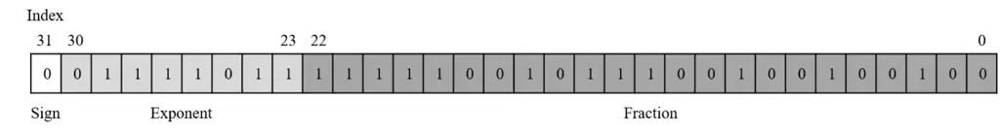

Fig. 1: An example of the IEEE-754 single-precision floating-point
representation. The binary format are divided into three parts:
$`sign`$, $`exponent`$, and $`fraction`$. The decimal value of this
binary example is 0.123400 corrected to six decimal places.

The DNN models for either speech denoising or dereverberation contain a
considerable number of parameters. Most of these systems use the
IEEE-754 single-precision floating point \[82\] to represent the
parameters; Figure 1 shows the binary representation of this floating
point. The binary format has three parts: $`sign`$, $`exponent`$, and
$`fraction`$ (also known as significand or mantissa). The $`sign`$ part
has only one bit, i.e., $`bit[31]`$, which is regarded as the most
important bit in the entire 32-bit binary representation; it indicates
the sign of the floating-point value (0 for positive and 1 for
negative). The $`exponent`$ part has eight bits, i.e., $`bit[30-23]`$,
denoting an unsigned integer, which is the number of times the power of
two is raised. The fraction part has 23 bits, i.e., $`bit[22-0]`$,
representing a real number. Similar to scientific notation, the decimal
value of a single-precision floating point is indirectly calculated
using Equation 1.

```math
(value)_{10}=(-1)^{sign}\times(fraction)_{10}\times 2^{(exponent)_{10}-bias}. \tag{1}
```

Owing to the unsigned integer feature, a $`bias`$ is necessary for
shifting the value range of the exponent. In the single-precision
floating-point format, the $`bias`$ for an 8-bit unsigned exponent is
127 ($`2^{7}-1`$), shifting the value range of the exponent from
\[0,255\] to \[-127,128\]. In addition, the decimal value of the
fraction part can be calculated using the following equation.

```math
(fraction)_{10}=1+\sum_{i=0}^{22}bit[i]\times 2^{i-23} \tag{2}
```

For instance, consider the binary representation in Figure 1 in which
the $`sign`$ is $`0`$, the 8-bit $`exponent`$ is $`01111011`$, and the
23-bit $`fraction`$ is $`11111001011100100100100`$. It can be calculated
using the following equation.

```math
value=(-1)^{0}*(1.9744...)*2^{123-127}\approx 0.123400 \tag{3}
```

The equation yields the decimal value 0.123400, which is correct to six
decimal places¹¹ 1 For understanding the conversion from binary to
decimal value in detail, please consult
https://www.exploringbinary.com/floating-point-converter..

### II-D Arithmetic Electronic Circuits

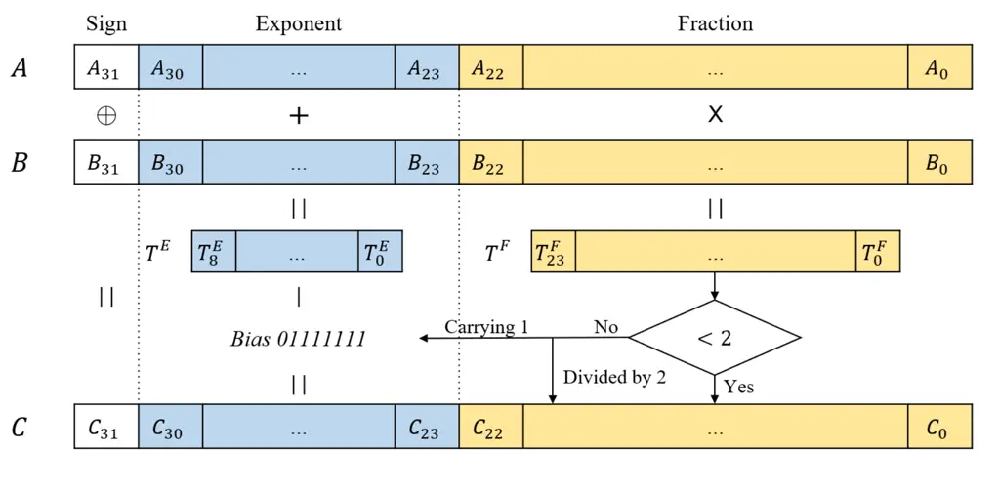

Fig. 2: Multiplication of two floating-point values $`A`$ and $`B`$. The
sign bit $`C_{31}`$ is the result of XOR operation of $`A_{31}`$ and
$`B_{31}`$. The exponent bits $`C_{30-23}`$ are the addition result of
$`A_{30-23}`$ and $`B_{32-23}`$ with consideration of carrying condition
from fraction part. The fraction bits $`C_{22-0}`$ are the
multiplication result of unsigned $`A_{22-0}`$ and $`B_{22-0}`$.

Figure 2 illustrates a single-precision floating-point multiplier
circuit that operates the multiplication of two single-precision
floating-point values: $`A\times B=C`$. For the $`sign`$ part, two
operands, $`A[31]`$ and $`B[31]`$, execute an exclusive OR operation to
obtain the output sign, $`C[31]`$, of the result value, $`C`$. For the
$`exponent`$ part, two unsigned integers, $`A[30-23]`$ and $`B[30-23]`$,
first execute an addition operation to obtain a temporary 9-bit output
value, $`T^{E}[8-0]`$ The main reason for the 9-bit width is to cope
with $`overflow`$. The value range of the addition of two 8-bit unsigned
operands whose value range is \[0, 255\] becomes \[0, 510\];
consequently, the temporary value, $`T^{E}[8-0]`$ requires at least 9
bits to receive the output. The $`bias`$ of the single-precision
floating-point mentioned in Section II-C, i.e., 127, is then subtracted
from the temporary output value, $`T^{E}[8-0]`$. Considering
$`32.0\times 8.0=256.0`$ as example, the exponent of $`256.0`$ is
$`10000111`$ which is calculated by the following:

```math
10000111=10000100+10000010-01111111 \tag{4}
```

where $`10000100`$, $`10000010`$ and $`01111111`$ are the binary
exponents, $`32.0`$ and $`8.0`$, and the single-precision floating-point
$`bias`$, respectively. For the fraction part, two 23-bit values,
$`A[22-0]`$ and $`B[22-0]`$, first execute a multiplication operation to
obtain a temporary 24-bit output value, $`T^{F}[23-0]`$. Similar to the
$`exponent`$ part, the reason for the 24-bit width is to cope with
$`overflow`$. According to Equation 2, the original value range of the
fraction part is \[1, 2); however, after multiplication, the value range
becomes \[1, 4). As a result, the temporary value, $`T^{F}[23-0]`$,
requires 24 bits to receive the output. An if-else decision process
determines whether or not $`T^{F}[23-0]`$ is less than 2. If it is not
less than 2, then $`T^{F}[23-0]`$ is divided by 2. The quotient is then
carried to the result exponent, $`C[30-23]`$, and the remainder is
considered as the result of the 23-bit fraction, $`C[22-0]`$.

### II-E Preliminary Experiment and Motivation

Among the three parts of the single-precision floating-point format, the
$`sign`$ and $`exponent`$ segments are clearly designed for the value
range of the floating-point, and the $`fraction`$ segment is designed
for the value precision. In the past, precision has been a critical
problem for many applications. Most bits in the single-precision
floating-point representation are used for the fraction part (i.e., 23
bits in a 32-bit binary value). Recently, the single-precision
floating-point format has been used in emerging DNN-based algorithms, as
mentioned in Section II-C. However, the necessity of this format to
DNN-based speech enhancement algorithms has to be ascertained.
Accordingly, a preliminary experiment is conducted on a BLSTM-based
denoising system; the experimental results are summarized in Table I.
All parameters of the BLSTM model are directly masked by several 0s at
the end. Two bit lengths for the mask are used: 6 and 12. The row of the
0-bit mask represents the original denoising model with unmasked
parameters. Based on the list in the table, the downgrade of the PESQ
metric scores compared with those of the original model was not
distinctly observed. In addition, these scores increased from a 6-bit
mask to a 12-bit mask. These results motivated the authors to quantize
the fraction part of all single-precision floating-point parameters of
DNN-based speech enhancement systems.

|            |                    |                 |        |     |
| ---------- | ------------------ | --------------- | ------ | --- |
| Mask       | Binary             | Decimal         | PESQ   |     |
| Bit-length |                    |                 |        |     |
| 0          | 0011…1100100100100 | 0.123400002718… | 2.1435 |     |
| 6          | 0011…1100100000000 | 0.123399734497… | 2.1352 |     |
| 12         | 0011…1000000000000 | 0.123382568359… | 2.1413 |     |

TABLE I: A preliminary experiment on DNN-based speech denoising under
three kinds of bit-width in the fraction of the model parameters. The
mask bit-length represents the number of bits that are masked by 0s in
the end of the fraction.

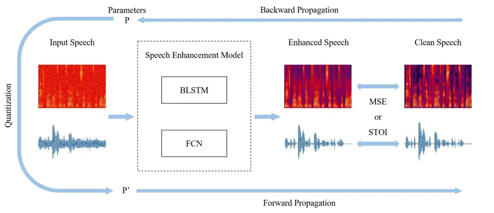

Fig. 3: An overview of the DNN-based speech enhancement systems and the
training procedure with the proposed SEOFP-NET technique. For
generalization, we tried both magnitude spectrogram and raw-waveform as
the input data. We also used BLSTM and FCN to illustrate that our
SEOFP-NET can be used in different kinds of the model architectures. For
evaluating the loss between the enhanced speech signals and the clean
speech signals, we used either MSE or STOI as the objective function
after the forward propagation.

Moreover, for executing arithmetic operations, the electronic circuits
can be classified into two types: integer and floating point. In other
words, many circuits, such as adders, subtractors, multipliers, and
dividers are designed for integer arithmetic, whereas some circuits are
designed for floating-point arithmetic. According to Section II-D and
Figure 2, the floating-point multiplier is composed of several
sub-circuits of integer arithmetic. However, many other floating-point
circuits also have the same feature, indicating that the circuits for
integers are more efficient than the circuits for the floating-point in
executing arithmetic operations. In addition, among the arithmetic
circuits for integers, complicated circuits are designed based on simple
yet efficient circuits. Consider the multiplier and divider as examples.
The integer multiplication is completed by several additions, whereas
the integer division is completed by several subtractions. This feature
motivated the authors to use simpler and more efficient arithmetic
circuits (e.g., integer adder or subtractor) to execute complicated
arithmetic operations (e.g., floating-point multiplication or division)
for the online inference phase of DNN-based speech enhancement systems.
Using this method, the inference time of DNN models can be accelerated
while performing speech enhancement.

However, several design challenges are raised by this scheme. First, the
quantized limitation of the fraction part of the single-precision
floating-point format has to be determined, allowing the quantized DNN
models to achieve enhancement performance similar to that of the
original single-precision model. Next, before replacing the complicated
and inefficient arithmetic circuits with simpler and more efficient
alternatives, the three parts of the floating-point parameter have to be
adjusted for the arithmetic results to be the same as those of the
original arithmetic operations.

## III SEOFP-NET

This section presents the proposed SEOFP-NET technique for DNN-based
speech enhancement algorithms. Section III-A introduces the overall
training procedure and model architecture of SEOFP-NET. Section III-B
elaborates on the philosophies and algorithm of fraction quantization;
it also presents the quantized limitation of the fraction part of the
single-precision floating-point format to avoid the severe degradation
of speech denoising or dereverberation performance. Section III-C
expounds on the adjustment of the single-precision floating-point
parameters of the models to replace the complicated and inefficient
floating-point multiplier with a simpler and more efficient integer
adder. Finally, the quantization of the exponent part after training to
further compress the model size is discussed in Section III-D.

### III-A System Overview of SEOFP-NET Quantization

To quantize the fraction part of single-precision floating-point
parameters, several bits at the end of the fraction part may be
instinctively masked. Similar to the method employed in the preliminary
experiment (Table I, SectionII-E), this may be performed after training
a DNN-based speech enhancement model, such as the post-training
quantization in Tensorflow Lite \[83\]. However, casually modifying the
parameters of a well-trained DNN model will affect either the accuracy
of a classification task or the performance of a regression task. The
main reason is that this parameter modification does not take the
performance change into consideration. In other words, this intuitive
quantization method may considerably degrade the speech enhancement
performance. quantize model parameters while minimizing the influence of
task performance, quantization should be implemented during training.
Accordingly, all parameters of the DNN-based speech enhancement model
are forced to use a fixed number of bits in the training phase.

Figure 3 shows an overview of the DNN-based speech enhancement systems
and training procedure with the proposed SEOFP-NET technique. After
backward propagation in ($`k`$)-th iteration, all single-precision
floating-point parameters $`P`$ are quantized to $`P^{\prime}`$ by our
proposed SEOFP strategy. The quantized parameters $`P^{\prime}`$ are
then used as the new model parameters for forward propagation in the
succeeding ($`k+1`$)-th iteration. During training, the DNN-based speech
denoising or dereverberation models learn minimum loss based on
quantized parameters. In addition, we attempted to use both magnitude
spectrogram and raw waveform as input data for the speech enhancement
system structure. To illustrate the generalization of different types of
model architectures, BLSTM and FCN are used as speech enhancement
models. The MSE or STOI was also used as the objective function for
evaluating the loss between enhanced and ground-truth clean speech
signals.

### III-B Fraction Quantization Algorithm

In Figure 1, 71.875% of the single-precision floating-point memory space
(i.e., 23 bits in a 32-bit width representation) is observed to be
allocated to the $`fraction`$ part. However, such a high-precision
23-bit long fraction part is unnecessary for the parameters of DNN
models. Hence, in the training phase, the DNN-based speech denoising or
dereverberation systems are first quantized in the fraction part of all
single-precision floating-point parameters. The quantization algorithm
is placed between backward propagation and forward propagation of two
adjacent iterations, as mentioned in Section III-A. Besides, the
algorithm is applied to all parameters (including weights and biases) in
the DNN-models.

1: A model $`\Lambda`$ with $`l`$ layers, $`\{L_{i}|i=1,2,\ldots,l\}`$.
A positive integer $`x`$ for the width of the valid bits in a
single-precision floating-point value.

2: A quantized model $`\Lambda^{\prime}`$ with all floating-point
parameters in bit-width $`x`$.

3:
$`kernel\leftarrow[1_{31}1_{30}\ldots 1_{31-x+1}0_{31-x}0_{31-x-1}\ldots 0_{0}]`$

4: for each layer $`L_{i}`$ in the model $`\Lambda`$ do

5:   for each floating-point parameter $`P`$ in $`L_{i}`$ do

6:    Convert $`P`$ into a 32-bit binary variable $`B[31:0]`$

7:    if $`32>x>9`$ then

8:      $`B[32-x]=B[32-x]`$ $`||`$ $`B[31-x]`$

9:    else if $`x=9`$ then

10:      $`B[30:23]=B[30:23]+B[22]`$    

11:    $`B[31:0]=B[31:0]`$ & $`kernel[31:0]`$

12:    Convert $`B`$ back to $`P^{\prime}`$   

13: return $`\Lambda^{\prime}`$

Algorithm 1 Fraction Quantization

Algorithm 1 presents the proposed fraction quantization method. For the
input, the algorithm is assigned two input attributes: 1) a DNN model
$`\Lambda`$ with $`l`$ layers and 2) a positive integer, $`x`$, to
indicate the remaining number of bits after the fraction quantization.
Please note that $`\Lambda`$ is the model after the backward propagation
in any iteration, $`k`$. For the output, a model $`\Lambda^{\prime}`$,
which is quantized with all floating-point parameters in bit width
$`x`$, is used for the forward propagation in the next iteration,
$`k+1`$. Before the fraction quantization algorithm is applied, a global
binary variable, $`kernel`$ with a 32-bit width is defined. The head
$`x`$ bits of the kernel are 1s, and the latter $`32-x`$ bits are 0s.
For each layer, $`L_{i}`$, of the model, parameter $`P`$ is fetched;
$`P`$ is first converted from single-precision floating-point data point
into a 32-bit binary variable, $`B`$. If $`x`$ is greater than 9 and
less than 32, an OR operation is executed with two operands: $`B[32-x]`$
and $`B[31-x]`$; the result then updates the value of bit $`B[32-x]`$.
An OR operation is used to avoid overflow from the $`fraction`$ segment
to the exponent segment. Here, $`B[22:32-x]`$ possibly contains all 1s
and results in the domino effect of carrying 1. By contrast, if $`x`$ is
equal to 9 (i.e., only the $`sign`$ and $`exponent`$ parts are left in
the single-precision floating-point value), the exponent value
$`B[30:23]`$ is then added to the value of $`B[22]`$. The use of
rounding arithmetic prevents overflow from the $`exponent`$ segment to
the $`sign`$ segment. A floating-point value with an $`exponent`$
consisting of all 1s (11111111) is an infinite value, $`\infty`$, that
does not appear in DNN-based speech enhancement models. It is impossible
that carrying 1 into the exponent part leads to an overflow to the
$`sign`$ bit; hence, the exponent value, $`B[30:23]`$, can be directly
rounded. The maximum value of $`x`$ is 32, which means that quantizing
the single-precision floating-point parameters is unnecessary. Finally,
the binary variable, $`B`$, is masked by the binary $`kernel`$ and then
converted back to the floating-point parameter, $`P^{\prime}`$.

In short, after the backward propagation in one iteration, $`k`$, a
rounding-like arithmetic is applied to quantize the fraction segment of
the single-precision floating-point parameters in the DNN-based speech
enhancement model $`\Lambda`$. Then, model $`\Lambda^{\prime}`$ with all
floating-point parameters in bit width $`x`$ is employed for the forward
propagation in the next iteration, $`k+1`$. In addition, after applying
the fraction quantization strategy to the proposed DNN-based speech
enhancement system, the quantized model, whose parameters are only all
composed of the sign and exponent parts (i.e., $`x=9`$), is found
capable of achieving the denoising or dereverberation performance of the
original single-precision model. That is, quantizing all 23 bits in the
fraction part of the single-precision floating-point format is the
limitation of the fraction quantization strategy.

### III-C Replacement of Floating-point Multiplier with Integer Adder in Online Inference

After the offline training of a DNN-based speech enhancement system,
accelerating the online inference may be attempted. Because of the
simpler electronic circuit design, more efficient integer adders may be
employed to function as floating-point multipliers for executing
floating-point multiplication operations. However, a floating-point
value and an integer value considerably differ in their binary formats.
Accordingly, a suitable strategy to solve this problem must be developed
for the enhanced utterance to remain unchanged after forward
propagation. More specifically, all floating-point parameters in the
trained speech denoising or dereverberation model must be adjusted to
guarantee that the binary result from the integer addition has the same
value as that from the floating-point multiplication. The following
equation illustrates the target of replacement with adjustment on two
floating-point operands, $`A`$ and $`B`$:

```math
(A^{\prime})_{2}+(B^{\prime})_{2}=(A)_{2}\times(B)_{2} \tag{5}
```

where $`+`$ is an integer addition operation, and $`\times`$ is a
floating-point multiplication operation; $`A^{\prime}`$ and
$`B^{\prime}`$ are two integer addition operands adjusted according to
$`A`$ and $`B`$, respectively. In addition, because there are three
parts (i.e., $`sign`$, $`exponent`$, and $`fraction`$) in the binary
format of a floating-point parameter, these three segments are adjusted
individually, as follows:

#### III-C1 Sign

Overflow handling is inherent in integer adder circuits; hence, the
mechanism is employed to assume the XOR operation of sign in the
floating-point multiplication. As mentioned in Section II-C, the sign
value is either 0 or 1, representing a positive or negative
floating-point value, respectively. There are only four sign cases in
the XOR operation: $`\{0,0\}`$, $`\{0,1\}`$, $`\{1,0\}`$, and
$`\{0,0\}`$; and the XOR results are $`0`$, $`1`$, $`1`$, and $`0`$
respectively. The results of the three cases ($`\{0,0\}`$, $`\{0,1\}`$,
and $`\{1,0\}`$) are observed to be the same as those operated by the
integer addition. Hence, two sign operands in these cases can be
directly added without any label or modification. For the $`\{1,1\}`$
case, the addition result is $`10`$, and the overflow that occurs is
labeled by the integer adder. The integer adder handles this overflow
situation by abandoning $`1`$ and allowing $`0`$ to remain. Therefore,
in addition to replacing the XOR operation with addition, the overflow
label is removed. In this way, the sign resulting from integer addition
is identical to the result that is yielded by floating-point
multiplications in all four cases.

#### III-C2 Fraction

To ensure that the fraction part resulting from the integer addition of
$`A^{\prime}`$ and $`B^{\prime}`$ is the same as that yielded by the
floating-point multiplication of $`A`$ and $`B`$, the 32 bits in the
fraction part of either $`A^{\prime}`$ and $`B^{\prime}`$ should all be
0s. In the online inference, because $`A`$ is represented as an input
value of one layer, it is not adjusted; this means that $`A^{\prime}`$
has the same value as $`A`$. Therefore, only the fraction value of B is
adjusted. The result presented at the end of the previous section
indicates that a quantized speech enhancement model may be obtained. The
performance of this model is similar to that of the original
single-precision model with parameters composed only of the $`sign`$ and
$`exponent`$ parts after the offline training. An example of the offline
training process of the floating-point parameter, $`B`$, is shown in
Figure 4. With all $`B^{\prime}`$ parameters without the fraction
values, the fraction resulting from integer addition is identical to the
result obtained by floating-point multiplication.

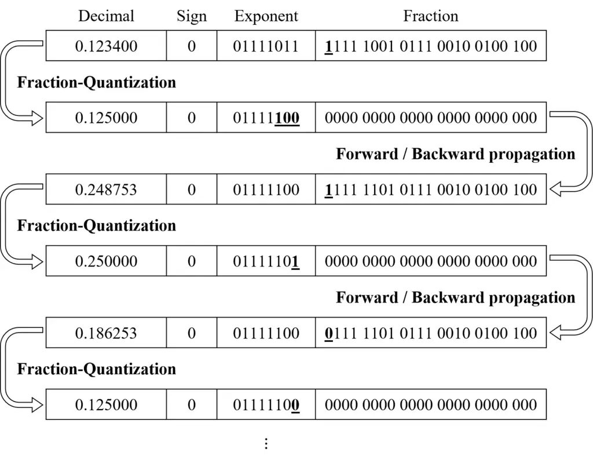

Fig. 4: An example of the off-line training process for a floating-point
parameter $`B`$. The decimal value of $`B`$ was 0.123400 in the first
iteration. After the rounding-like fraction-quantization, the exponent
value of $`B`$ was carried by 1 and the fraction value became 0. The
model then used the updated parameter with value 0.125000 for the next
iteration. The algorithm keeps quantizing the model until the end of the
training.

#### III-C3 Exponent

There are two problems in adjusting the exponent part: the overflow from
the exponent segment to the sign segment and the subtraction using the
bias, i.e., 127, for the subtractor, as mentioned in II-D. For the
overflow problem, the concept is to avoid the most significant bit (MSB)
of the exponent (i.e., the leftmost bit) for both $`A`$ and $`B`$ to be
1, allowing the maximum binary value of the exponent segment to become
$`01111111`$. Consequently, the maximum addition result of the two
operands of the exponent is $`10000000`$, and the sign bit is never
affected by the exponent addition. With this constraint, the bit length
of the addition result remains at 8. To achieve this goal, all input
values and model parameters are normalized in the decimal value range
$`[-1,1]`$. This normalization restricts the binary values of the
exponent in the range $`[00000000,01111111]`$ for the MSB of the
exponent to remain 0. Please note that $`00000000`$ and $`01111111`$ are
the exponent values of $`\pm 0`$ and $`\pm 1`$, respectively. With this
method, the overflow from the exponent segment to the sign segment never
occurs.

For the second problem, directly increasing the subtraction after the
integer-adder replacement increases the number of instructions. More
specifically, a floating-point multiplication instruction substituted by
integer addition and integer subtraction decelerates the online
inference. Accordingly, the subtraction of the bias (127) is divided
into two parts: 64 and 63. The reason for the separation is that both
$`2^{-64}`$ and $`2^{-63}`$ are decimal values that are extremely
smaller than the absolute values of the input and model parameters. The
subtractions of $`64`$ and $`63`$ are then distributed to the each of
the input values and model parameters.

Figure 5 illustrates the adjustment of a DNN layer in a trained
DNN-based speech enhancement system. The input and output floating-point
values of the layer are denoted as $`X`$ and $`Y`$, respectively. In
addition, all model parameters are represented by $`Ps`$, and $`\sigma`$
indicates the standard deviation of normalization. After the offline
training, all $`Ps`$ are divided by $`2^{63}`$, i.e., the exponent
values further subtract 63 ($`00111111`$); in contrast, $`\sigma`$ is
multiplied by $`2^{64}`$. Because $`\sigma`$ is the denominator, the
multiplication of $`2^{64}`$ to the denominator is equal to the division
of the entire value by $`2^{64}`$. Therefore, the exponent values
further subtract 64 ($`01000000`$) during the normalization. The input,
$`X`$, is then processed by the adjusted DNN layer with the new
$`P^{\prime}`$ and new $`\sigma^{\prime}`$; and the output, $`Y`$, is
passed to the next adjusted DNN layer. With this technique, 127 is
further subtracted from the exponent values.

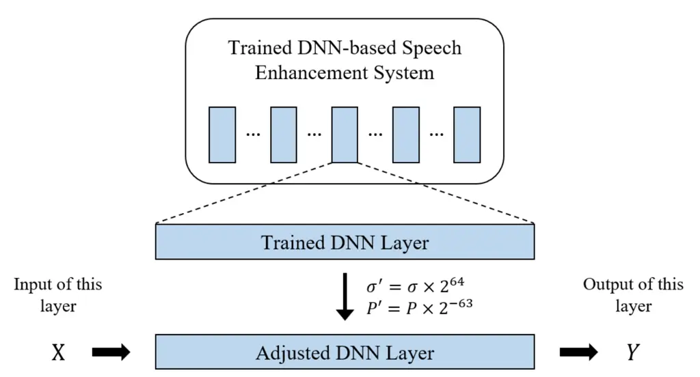

Fig. 5: Adjustment of a DNN layer in a trained DNN-based speech
enhancement system. The model’s parameters and the standard deviation of
normalization are denoted as $`P`$ and $`\sigma`$ respectively. After
the off-line training, the $`\sigma`$ is multiplied by $`2^{64}`$ and
the parameters $`P`$ are divided by $`2^{63}`$. In the on-line
inference, the input $`X`$ is processed by the adjusted DNN layer with
new $`P^{\prime}`$ and new $`\sigma^{\prime}`$. The output $`Y`$ is then
passed to the next adjusted DNN layer.

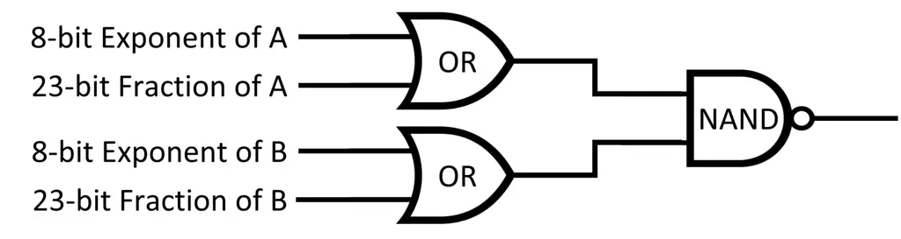

Fig. 6: An efficient computing logic circuit commonly used for
determining whether either of the operands is zero in various computing
units. The circuit composes of two OR gates followed by an NAND gate.
All 31 bits in the exponent and fraction parts of $`A`$ and $`B`$ first
execute the OR operations. The results of OR gates then execute a NAND
operation. Finally, the result of the NAND gate is 1 indicates the
multiplication result is zero since either of the operands is zero.

A special case exists in the floating-point multiplication, i.e., the
zero-operand multiplication. If either of the operands is zero, the
result of the floating-point multiplication is zero. For the
single-precision floating-point representation, there are two signed
zeros, $`+0`$ and $`-0`$, whose 31 bits of the exponent and fraction
parts are all 0s. Figure 6 shows an efficient computing logic circuit,
which is composed of two OR operators followed by an NAND operator; it
is commonly used for determining whether either of the operands is zero
in various computing units. If one of the OR results is 0 (which means
that either $`A`$ or $`B`$ is zero), then the result of the NAND gate is
1, indicating that the multiplication result is 0. Otherwise, if both OR
results are 1s, then the result of the NAND gate is 0, indicating that
the multiplication result is not 0. Accordingly, this efficient logic is
applied to the circuit in the zero-operand multiplication case. Figure 7
illustrates an example of the conversion of the two floating-point
multiplication operands for replacing the floating-point multiplier with
an integer adder.

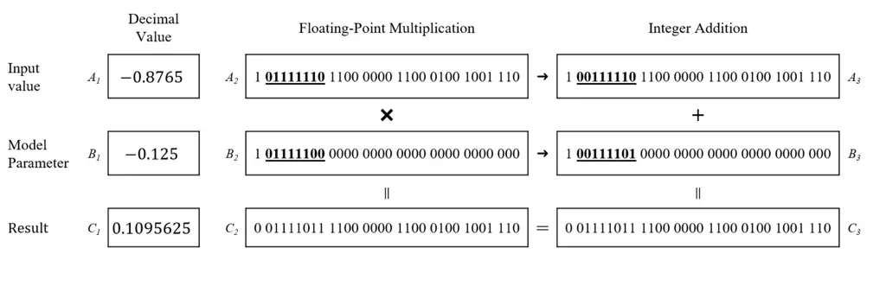

Fig. 7: An example of the conversion of two floating-point
multiplication operands for replacing the floating-point multiplier with
a integer adder. The decimal value of two floating-points: _input value_
and _model parameter_ are $`-0.8765`$ ($`A_{1}`$) and $`-0.125`$
($`B_{1}`$); the decimal multiplication result is $`0.1095625`$
($`C_{1}`$). The binary values of two operands are $`A_{2}`$ and
$`B_{2}`$. After the adjustment, the binary values transforms to
$`A_{3}`$ and $`B_{3}`$. The multiplication result of $`A_{2}`$ and
$`B_{2}`$ by a floating-point multiplier is $`C_{2}`$ which equals to
$`C_{3}`$ the addition result of $`A_{3}`$ and $`B_{3}`$ by an integer
adder.

### III-D Exponent-Quantization Algorithm

The maximum number of quantized bits for a single-precision
floating-point parameter can easily be verified as 23 based on the
fraction quantization algorithm presented in Section III-B. After the
offline training, 9 bits are left in the $`sign`$ and $`exponent`$
parts. Figure 8 shows the value distribution of all absolute parameters
in the BLSTM and FCN models in log₂. Please note that the 8-bit exponent
with the bias (i.e., 127) determines an exponent value range in
\[-127,128\], where -127 and 128 are used for 0 and $`\infty`$. Thus,
the value range in the x-axis in Figure 8 is from -126 to 127. All 9
bits in the $`sign`$ and $`exponent`$ parts are known to be designed for
a wide value range, i.e., from $`\pm 2^{-127}`$ to $`\pm 2^{128}`$.
However, the normalization process commonly applied to DNN-based models
constrains all model parameters within a narrow value range, as shown in
Figure 8. The main reason for applying normalization is to reduce the
differences among the parameters. Based on observation, the parameters
are further quantized on these 9 bits. The exponent part should further
be quantized because of the 1 bit in the sign part. Accordingly, an
exponent quantization algorithm based on the value distribution is
proposed.

Fig. 8: Value distribution of all parameters in log₂ for BLSTM and FCN.
The x-axis is the log₂ values and the y-axis is the number of
parameters. The reason for the range \[-126, 127\] of the x-axis is that
-127 and 128 are used for $`0`$ and $`\infty`$ respectively in the 8-bit
exponent ranging in \[-127, 128\].

1: A trained model $`\Lambda`$

2: The bit-width $`width`$. An exponent value $`min`$ in log₂. A
quantized model $`\Lambda^{\prime}`$

3: Find the $`MAX`$ and $`min`$ which are the maximum and minimum
decimal exponent values in $`\Lambda`$ (except for 0).

4: $`width`$ = $`Ceil`$(log$`{}_{2}((MAX-min+1)+1)`$)

5: for each parameter $`P`$ in $`\Lambda`$ do

6:   $`E`$ is the exponent value of $`P`$ in decimal.

7:   if $`E\neq 0`$ then

8:    $`E^{\prime}=E-min+1`$   

9:   $`P^{\prime}`$ with the exponent value $`E^{\prime}`$ substitutes
for $`P`$ in $`\Lambda^{\prime}`$

10: return $`width`$, $`min`$, and $`\Lambda^{\prime}`$

Algorithm 2 Exponent-quantization

Algorithm 2 illustrates the proposed exponent quantization. For the
input, a trained speech enhancement model, $`\Lambda`$, is afforded to
the algorithm. For the output, three output attributes are
considered: 1) $`width`$ indicating the number of bits necessary for the
exponent to represent all parameters; 2) $`min`$ denoting the minimum
exponent value in the model; and 3) a quantized model,
$`\Lambda^{\prime}`$, for exponent quantization. First, the $`MAX`$ and
$`min`$, which are the maximum and minimum exponent values in log₂ in
$`\Lambda`$ (except for zero values) are determined, respectively.
Thereafter, the least bit width is calculated through the ceiling
function of log$`{}_{2}((MAX-min+1)+1)`$ The reason for determining the
latter is that the $`00000000`$ binary value is used to represent the
zero value, as explained in the previous paragraph. Next, for each
parameter in model $`\lambda`$, the exponent value, $`E`$, is fetched
from parameter $`P`$. If $`E`$ is not equal to zero, then the new
exponent value, $`E^{\prime}`$, is calculated by $`E-min+1`$, i.e., the
new exponent value, $`E^{\prime}`$, is the offset between E and min. The
addition of 1 to the end is necessary because $`min`$ is represented
by 1. Finally, with the new exponent value, $`E^{\prime}`$, $`P`$ is
substituted for $`P`$ in model $`\Lambda^{\prime}`$. For instance, if
the parameter value range is \[$`\pm 0`$, $`\pm 2^{-11}`$, …,
$`\pm 2^{2}`$\], the $`MAX`$ and $`min`$ are $`2`$ and $`-11`$
respectively. In this case, only 5 bits (that is 1+$`\lceil`$
log$`{}_{2}(2-(-11)+1+1)\rceil`$) are required for all parameters. The
first 1 bit is for the sign part. The new exponent values, i.e.,
$`E^{\prime}s`$ of $`\pm 0`$, $`\pm 2^{-11}`$ and $`\pm 2^{1}`$ are 0,
1, and 13 respectively. Please note that the performance is not affected
because the bit length of the exponent part has been reduced without
changing the values.

## IV Experiments and results

This section presents the experimental setup and results of SEOFP-NET on
the speech denoising and dereverberation tasks. Section IV-A first
describes the experimental setup including the training/testing
datasets, model architectures, and performance metrics. Sections IV-B
to IV-H describe the conduct of several experiments to compare the
SEOFP-NET technique with other strategies. Section IV-B presents the
comparison of the proposed rounding-like fraction quantization with a
direct removing strategy to show that quantizing the fraction bits
without any constraint results in the evident degradation of the speech
denoising performance. Sections IV-C and IV-D explain the application of
the SEOFP-NET technique to the denoising and dereverberation tasks,
respectively, and the performance evaluation of enhanced speech signals.
The STOI is also integrated into the objective function to improve the
performance of the STOI metric, as discussed in Section IV-E.
Section IV-F elaborates on the comparison between the model with the
proposed integer adder replacement and the original model in the online
inference time. Section IV-G presents the comparison of all the model
sizes in the original single-precision floating-point models, models
with fraction quantization, and models with fraction-exponent
quantization. In addition, a simple cooperation of our quantization and
an existing parameter pruning strategy is presented thereafter. Finally,
the JND metric, which is applied to evaluate the results of the user
study, is presented in Section IV-H.

### IV-A Experimental Setup

To clearly demonstrate the capability of the proposed SEOFP-NET,
extensive experiments were conducted on different model architectures
and datasets. The SEOFP-NET is also applied to the denoising and
dereverberation tasks, demonstrating that the proposed technique can
achieve satisfactory performance on different speech enhancement tasks
of regression in speech signal processing. To comprehensively understand
the differences in performance among the different speech denoising or
dereverberation systems, several metrics are employed to evaluate the
quality of the enhanced speech signals. The datasets, model
architectures, and evaluation metrics are detailed as follows:

#### IV-A1 Datasets

In the experiments, the TIMIT corpus \[54\] is used as the dataset for
the denoising task, whereas the TMHINT corpus \[55\] is employed as the
dataset for the dereverberation task. To evaluate the results
objectively, a mismatch of noises, SNR, and room impulse responses
(RIRs) between the training and testing sets is intentionally designed.
For the training set of the denoising task, all 4620 utterances from the
training set of the TIMIT corpus were used. These utterances were
corrupted with 100 different types of noise that are both stationary and
non-stationary at eight different signal-to-noise (SNR) levels (from -10
to 25 dB at steps of 5 dB) to generate
$`4620\times 100(types)\times 8(SNRs)=3,696,000`$ noisy training
utterances. For the testing set of denoising tasks, 100 utterances from
the testing set of the TIMIT corpus were used; these were different from
the 4620 utterances employed in the training set. These utterances were
corrupted by five different noise types (engine, street, two talkers,
baby cry, and white) at four different SNR levels (from -6 to 12 dB at
steps of 5 dB) to generate $`100\times 5(types)\times 4(SNRs)=2000`$
noisy testing utterances (i.e., 2.2 hours of noisy testing data).

For the dereverberation task, three room conditions were simulated to
generate different acoustic characteristics: room 1, room 2, and room 3
with dimensions $`4\times 4\times 4`$ m, $`6\times 6\times 4`$ m, and
$`10\times 10\times 8`$ m, respectively. For the dereverberation task
training set, 360 utterances of the TMHINT corpus were employed. These
utterances were convolved with three different RIRs and three
considerations of $`T_{60}`$, i.e., 0.3, 0.6, and 0.9 (s) to generate
$`360\times 3(T_{60}s)\times 3(RIRs)=3240`$ reverberant training
utterances (i.e., 3.2 hours of reverberation training data). For the
testing set of dereverberation tasks, 120 utterances from the TMHINT
corpus are used; these are different from the 360 utterances used in the
training set. These utterances were convolved with a single RIR along
with three considerations of $`T_{60}`$, i.e., 0.4, 0.7, and 1.0 (s) to
generate $`120\times 3(T_{60}s)\times 1(RIRs)=360`$ reverberation
testing utterances (i.e., 0.4 hours of reverberation testing data).

#### IV-A2 Model Architectures

For generalization, two different model architectures are used, BLSTM
and FCN, as shown in Figure 3. For the BLSTM-based speech enhancement
systems, the spectrograms of the speech signals were employed as the
system input. The speech signals were first parameterized into a
sequence of 256-dimensional log-power spectrum features. Then, mapping
was performed frame-by-frame using the BLSTM model. This model has two
BLSTM layers followed by two fully connected layers. Each BLSTM layer
has 257 nodes, and the first fully connected layer has 300 nodes; the
second layer is a fully connected output layer. The BLSTM architecture
is similar to that employed in \[51\]. In contrast, for the FCN-based
speech enhancement systems, raw-waveform speech signals were directly
utilized as the system input/output without further waveform–spectrum
conversion. The FCN model has 10 convolutional layers. Each of the first
nine layers has 30 size 55 filters; the last layer has only one size 55
filter. The FCN architecture is similar to that used in \[68\].

#### IV-A3 Evaluation Metrics

To evaluate the performance of speech denoising and dereverberation, two
standardized objective evaluation metrics are used: PESQ \[56\] and
STOI \[57\]. For PESQ, whose score range is from -0.5 to 4.5, a higher
value represents better speech signal quality. For STOI, whose score
range is from 0 to 1, a higher score represents better speech signal
intelligibility. In addition, the JND \[58, 59, 60\] is applied to
evaluate the response times of participants in determining the
similarity between two enhanced speech signals processed by the original
single-precision floating-point model and the proposed SEOFP model.

### IV-B Proposed Rounding-like Strategy versus Direct Removal technique for Fraction Quantization

|         | Noisy  |        | BLSTM    |         |           |         | FCN      |         |           |         |
| ------- | ------ | ------ | -------- | ------- | --------- | ------- | -------- | ------- | --------- | ------- |
|         |        |        | Baseline |         | SEOFP-NET |         | Baseline |         | SEOFP-NET |         |
| SNR(dB) | PESQ   | STOI   | PESQ     | STOI    | PESQ      | STOI    | PESQ     | STOI    | PESQ      | STOI    |
| -6      | 1.2232 | 0.5094 | 1.4986   | 0.5676  | 1.4881    | 0.5685  | 1.3814   | 0.5483  | 1.4443    | 0.5384  |
|         | \-     | \-     | +0.2754  | +0.0582 | +0.2649   | +0.0591 | +0.1582  | +0.0389 | +0.211    | +0.0290 |
|         | \-     | \-     | \-       | \-      | -0.70%    | +0.16%  | \-       | \-      | +4.55%    | -1.81%  |
| 0       | 1.6218 | 0.6592 | 1.9831   | 0.7280  | 1.9620    | 0.7246  | 1.8427   | 0.7189  | 1.8774    | 0.7001  |
|         | \-     | \-     | +0.3613  | +0.0688 | +0.3402   | +0.0654 | +0.209   | +0.0597 | +0.2556   | +0.0409 |
|         | \-     | \-     | \-       | \-      | -1.06%    | -0.47%  | \-       | \-      | +1.88%    | -2.62%  |
| 6       | 2.0161 | 0.7996 | 2.3932   | 0.8315  | 2.3612    | 0.8314  | 2.3036   | 0.8403  | 2.2813    | 0.8144  |
|         | \-     | \-     | +0.3771  | +0.0319 | +0.3451   | +0.0318 | +0.2875  | +0.0407 | +0.2652   | +0.0148 |
|         | \-     | \-     | \-       | \-      | -1.34%    | -0.01%  | \-       | \-      | -0.97%    | -3.08%  |
| 12      | 2.4394 | 0.9005 | 2.6991   | 0.8846  | 2.6383    | 0.8842  | 2.7291   | 0.9112  | 2.7003    | 0.8783  |
|         | \-     | \-     | +0.2597  | -0.0159 | +0.1989   | -0.0163 | +0.2897  | +0.0107 | +0.2609   | -0.0222 |
|         | \-     | \-     | \-       | \-      | -2.25%    | -0.05%  | \-       | \-      | -1.06%    | -3.61%  |
| Average | 1.8251 | 0.7172 | 2.1435   | 0.7529  | 2.1124    | 0.7522  | 2.0642   | 0.7547  | 2.0758    | 0.7328  |
|         | \-     | \-     | +0.3184  | +0.0357 | +0.2873   | +0.0350 | +0.2391  | +0.0375 | +0.2507   | +0.0156 |
|         | \-     | \-     | \-       | \-      | -1.45%    | -0.09%  | \-       | \-      | +0.56%    | -2.90%  |

TABLE II: Detailed PESQ and STOI scores for BLSTM and FCN using the
original single-precision floating-point models and the proposed
SEOFP-NETs under specific SNR conditions. Each score is an average score
of three noise types (engine, street, and two talkers). The score
reductions are represented in the percentage from Baseline’s scores to
SEOFP-NET’s scores.

|       | BLSTM        |          | FCN          |          |
| ----- | ------------ | -------- | ------------ | -------- |
| Bit-  | Fraction     | Directly | Fraction     | Directly |
| width | Quantization | Removing | Quantization | Removing |
| 32    | 2.1435       | 2.1435   | 2.0642       | 2.0642   |
| 26    | 2.1364       | 2.1352   | 2.0743       | 2.0636   |
| 20    | 2.1252       | 2.1413   | 2.0811       | 2.0743   |
| 14    | 2.1354       | 2.1364   | 2.0931       | 2.0857   |
| 10    | 2.1541       | 2.1455   | 2.0544       | 2.0345   |
| 9     | 2.1124       | 2.0975   | 2.0758       | 1.8595   |

TABLE III: PESQ scores of enhanced speech signals from BLSTM and FCN
using the proposed fraction-quantization algorithm and directly removing
within 6 different bit-widths on de-noise task.

An intuitive method to quantize the fraction bits is to maintain the
required number of x bits and directly remove the last $`32-x`$ bits in
the fraction segment. However, the removal of some bits without
considering their effect may result in performance degradation.
Accordingly, a rounding-like fraction quantization algorithm is proposed
in Section III-B. The performance of this proposed quantization
algorithm is compared with that of the direct removal method in the
denoising task. Table III summarizes the PESQ scores of the models with
six different bit widths (i.e., 32, 26, 20, 14, 10, and 9). Please note
that the 32-bit models are the original single-precision floating-point
models, and the 9-bit models indicate that all parameters in those
models do not have fraction bits. Each PESQ score listed in Table III is
the average score in the three noise types and four SNR levels.

The PESQ scores listed in the table are only slightly downgraded when
the proposed rounding-like fraction quantization is applied. For
example, although the bit width decreased from 32 to 9, the PESQ scores
degraded by only 1.451% (from 2.1435 to 2.1124) and -0.562% (from 2.0642
to 2.0758) for BLSTM and FCN, respectively. The negative value, -0.576%,
indicates that the performance of the 9-bit quantized FCN model is
better than that of the original single-precision floating-point FCN
model. However, the PESQ scores are apparently downgraded if several
bits are directly removed from the fraction part. For example, although
the bit width decreased from 32 to 9, the PESQ scores degraded by only
2.146% (from 2.1435 to 2.0975) and 9.916% (from 2.0642 to 1.8595) for
BLSTM and FCN, respectively. The results illustrate the considerable
potential of the proposed fraction quantization, which utilizes a
rounding-like strategy to quantize the fraction bits for reducing the
approximation error.

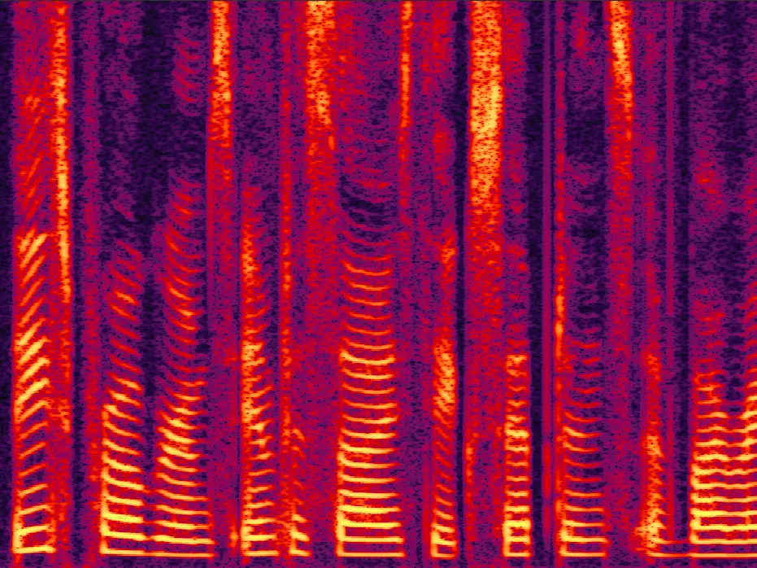

(a) clean spectogram

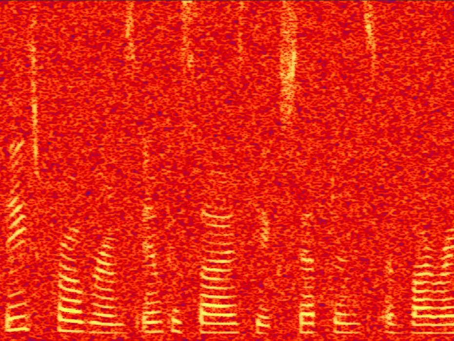

(b) noisy spectogram

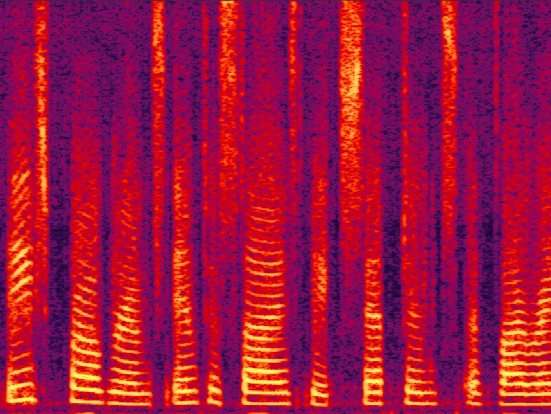

(c) Baseline spectogram

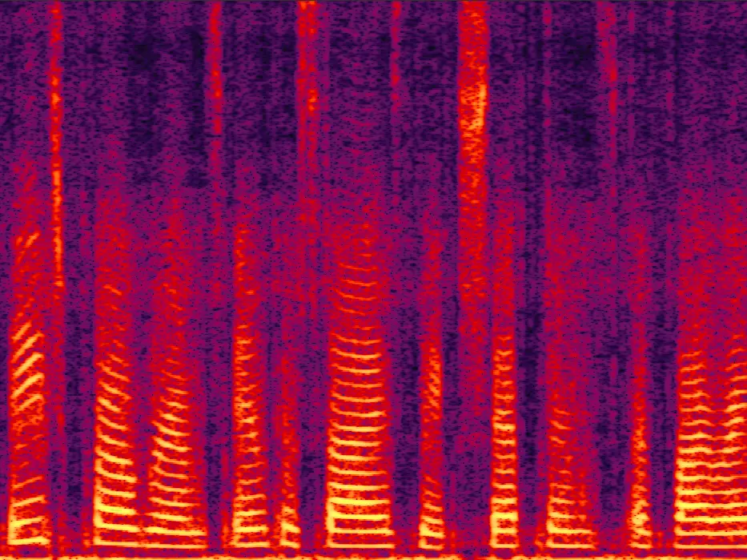

(d) SEOFP-NET spectogram

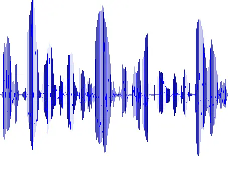

(e) clean raw-waveform

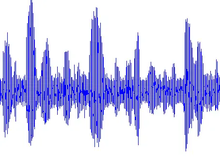

(f) noisy raw-waveform

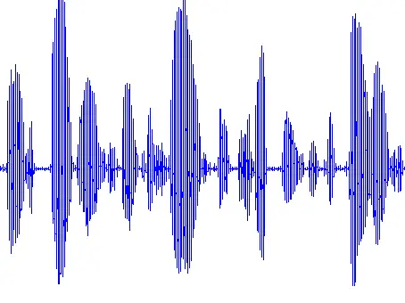

(g) Baseline raw-waveform

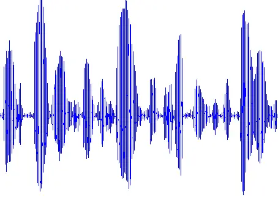

(h) SEOFP-NET raw-waveform

Fig. 9: Spectrograms and waveforms of an example utterance in the
de-noise task: (a) and (e) clean speech signals; (b) and (f) noisy
speech signals (engine noise); (c) and (g) enhanced speech signals by
the original single-precision floating-point FCN; (d) and (h) enhanced
speech signals by the proposed SEOFP-NET.

### IV-C Denoising using Fraction Quantization

The results listed in Table III not only show the feasibility of
fraction quantization but also suggest that similar denoising
performance can still be maintained with only 9 bits (i.e., the sign and
exponent bits) left in all model parameters. Table II lists the detailed
PESQ and STOI scores for the BLSTM and FCN using the original
single-precision floating-point models and the proposed SEOFP-NET models
under four specific SNR conditions. Each value is an average score in
five noise types (engine, street, two talkers, baby cry, and white). The
SEOFP models are quantized by fraction quantization within a 9-bit
width. The score reductions are represented as a percentages from the
baseline scores to the SEOFP-NET scores. In addition, the PESQ and STOI
scores for the unprocessed noisy testing utterances are also listed in
the table.

The list in Table II indicates that in applying the SEOFP-NET strategy
to the BLSTM-based denoising models, the reduction in the PESQ score is
only 1.45% (from 2.1435 to 2.1124), whereas that for the STOI score is
only 0.09% (from 0.7529 to 0.7522). Similarly, for the FCN-based
denoising models, the reduction in the STOI score is only 2.90% (from
0.7547 to 0.7328); however, the PESQ score improves by 0.56% (from
2.0642 to 2.0758). A possible reason for this improvement is that the
single-precision floating-point parameters may be extremely precise in
that the trained parameters overfit the training utterances.

Another observation from Table II is that the FCN-based denoising model
has suffered more reductions in the STOI scores after the fraction
quantization. A possible reason for this phenomenon is that the number
of parameters in the FCN is considerably smaller than the number of
parameters in the BLSTM; consequently, each parameter performs a more
important denoising function. The same slight error resulting from the
fraction quantization of a parameter differently affects the BLSTM and
FCN denoising models. Nevertheless, the compression rates are
approximately 3.56$`\times`$ in both models, indicating that the sizes
of DNN-based models could be substantially compressed with slight
reductions in the denoising performance. Figure 9 illustrates the
spectrograms and waveforms of a sample utterance in the denoising task.
Figure 9(a) to (d), shows the spectrograms of clean speech, noisy
(engine noise), enhanced speech processed by the original
single-precision floating-point FCN, and enhanced speech processed by
the proposed SEOFP-NET, respectively; and Figure 9(e) to (g), shows the
speech signals in the waveform format.

### IV-D Dereverberation with Fraction Quantization

|            | Reverberant |        | Baseline |         | SEOFP-NET |         |
| ---------- | ----------- | ------ | -------- | ------- | --------- | ------- |
| $`T_{60}`$ | PESQ        | STOI   | PESQ     | STOI    | PESQ      | STOI    |
| 0.4        | 2.1887      | 0.6168 | 2.3217   | 0.7925  | 2.3153    | 0.7550  |
|            | \-          | \-     | +0.133   | +0.1757 | +0.1266   | +0.1382 |
|            | \-          | \-     | \-       | \-      | -0.28%    | -4.73%  |
| 0.7        | 1.8279      | 0.4728 | 1.9086   | 0.7019  | 1.9336    | 0.6495  |
|            | \-          | \-     | +0.0807  | +0.291  | +0.1057   | +0.1767 |
|            | \-          | \-     | \-       | \-      | +1.31%    | -7.47%  |
| 1          | 1.6531      | 0.4010 | 1.6681   | 0.5908  | 1.7494    | 0.5543  |
|            | \-          | \-     | +0.015   | +0.1898 | +0.0963   | +0.1533 |
|            | \-          | \-     | \-       | \-      | +4.87%    | -6.18%  |
| Ave.       | 1.8899      | 0.4969 | 1.9661   | 0.6951  | 1.9994    | 0.6529  |
|            | \-          | \-     | +0.0762  | +0.1982 | +0.1095   | +0.1561 |
|            | \-          | \-     | \-       | \-      | +1.78%    | -7.99%  |

TABLE IV: Detailed PESQ and STOI scores for de-reverberation on the
original single-precision floating-point FCN model and SEOFP-NET under
three specific reverberation conditions $`T_{60}`$.

To illustrate the capability of speech enhancement tasks of regression
in speech signal processing, the proposed SEOFP-NET is applied to a
speech dereverberation task. Table IV summarizes the details of the PESQ
and STOI scores in the dereverberation by the original single-precision
floating-point FCN model and SEOFP-NET under the three specific
reverberation conditions of $`T_{60}`$. The score reductions are
represented as a percentage from the baseline scores to the SEOFP-NET
scores. The PESQ and STOI scores in the unprocessed reverberant testing
utterances are listed in the table. The list indicates that in applying
the SEOFP-NET strategy to the FCN-based dereverberation model, the STOI
score was only reduced by 7.99% (from 0.6517 to 0.5996). In contrast,
the PESQ score improved by approximately 1.78% (from 1.8728 to 1.9061).
These results confirm that the proposed SEOFP-NET may also be applied to
different types of speech enhancement tasks of regression in speech
signal processing to compress the model sizes of speech dereverberation
systems with only marginal degradations in performance. Another
observation is that the PESQ scores improved under most reverberation
conditions, i.e., $`T_{60}`$, whereas the STOI scores were reduced under
all reverberation conditions in the considered scenarios. The main
reason is that the objective function used in this dereverberation model
is the MSE, which has a higher positive correlation with PESQ than with
STOI. The rounding-like approximation, which maintains the quality of
the MSE loss value while quantizing the model in the offline training,
results in lower performance degradation in PESQ than in STOI.

### IV-E Integration of STOI Metric into Objective Function

|         | Noisy  |        | Baseline-S |         | SEOFP-NET-S |         |
| ------- | ------ | ------ | ---------- | ------- | ----------- | ------- |
| SNR(dB) | PESQ   | STOI   | PESQ       | STOI    | PESQ        | STOI    |
| -6      | 1.2232 | 0.5094 | 1.3891     | 0.5946  | 1.3803      | 0.5853  |
|         | \-     | \-     | +0.1659    | +0.0852 | +0.1571     | +0.0759 |
|         | \-     | \-     | \-         | \-      | -0.63%      | -1.56%  |
| 0       | 1.6218 | 0.6592 | 1.8280     | 0.7537  | 1.7511      | 0.7272  |
|         | \-     | \-     | +0.2062    | +0.0945 | +0.1293     | +0.0680 |
|         | \-     | \-     | \-         | \-      | -4.21%      | -3.52%  |
| 6       | 2.0161 | 0.7996 | 2.2649     | 0.8675  | 2.1132      | 0.8414  |
|         | \-     | \-     | +0.2488    | +0.0679 | +0.0971     | +0.0418 |
|         | \-     | \-     | \-         | \-      | -6.70%      | -3.01%  |
| 12      | 2.4394 | 0.9005 | 2.6937     | 0.9288  | 2.4893      | 0.9122  |
|         | \-     | \-     | +0.2543    | +0.0283 | +0.0499     | +0.0117 |
|         | \-     | \-     | \-         | \-      | -7.59%      | -1.79%  |
| Ave.    | 1.8251 | 0.7172 | 2.0439     | 0.7862  | 1.9335      | 0.7665  |
|         | \-     | \-     | +0.2188    | +0.0690 | +0.1084     | +0.0494 |
|         | \-     | \-     | \-         | \-      | -5.40%      | -2.50%  |

TABLE V: Detailed PESQ and STOI scores for de-noise systems using STOI
as the objective function on the original single-precision
floating-point FCN model and the proposed SEOFP-NET.

The lists in Table II and IV indicate that the improvement of enhanced
speech in the STOI metric compared with that in PESQ is unclear.
Moreover, the reductions (yielded by the original single-precision
floating point FCN model and proposed SEOFP-NET) in STOI exceed the
reductions in PESQ. The main reason is similar to the explanation
provided regarding the previous experiment. The MSE objective function
used for training the speech denoising and dereverberation models has a
high positive correlation with PESQ; however, the loss function is not
sufficient for the STOI metric. Thus, in this experiment, the STOI
metric is integrated into the objective function of denoising models. A
framework similar to that used in \[68\] was employed.

Table V summarizes the PESQ and STOI scores in the denoising systems
using STOI as the objective function in the original single-precision
floating-point FCN model and the proposed SEOFP-NET. Compared with the
FCN scores listed in Table II, the denoising systems with STOI as the
objective function are observed as achieving higher improvements in the
STOI scores. Consider the improvement under the -6 dB SNR condition as
an example (i.e., second row, -6 dB of FCN in Tables II and V). The
Baseline-S and SEOFP-NET-S models improved by 0.0852 and 0.0759 in the
STOI metric, respectively, whereas the baseline and SEOFP-NET models
only improved by 0.0389 and 0.0290, respectively. In addition, the score
reductions (from the baseline model to the SEOFP model) in STOI are
smaller than the score reductions in PESQ. For example, in quantizing
the parameters, the reduction in the PESQ score was 5.40% (from 2.0439
to 1.9335); however, the reduction in the STOI score was only 2.50%
(from 0.7862 to 0.7665). These experimental results not only confirm
that the STOI optimization is considerably related to achieving speech
intelligibility improvement but also suggest that applying the proposed
SEOFP-NET with STOI as the objective function decreases the score
reduction in the STOI metric.

### IV-F Acceleration by Replacing Floating-Point Multipliers with Integer Adders for Floating-Point Multiplications

To evaluate the improvement in the inference time, the procedures of the
BLSTM and FCN models are simulated using C language on a personal
computer with an Intel(R) Core(TM) i7-6700 3.40-GHz CPU. The $`clock`$
function in the $`time.h`$ library was also used to evaluate the
inference time for speech denoising. In addition, another 12-layer FCN
model was created for comparison. Similar to the previous FCN models,
the model has 12 convolutional layers with zero padding for the size to
be the same as the input. Each of the first 11 layers consists of 30
size 55 filters, and the last layer has only one size 55 filter.

|       |          |        |         |           |                 |
| ----- | -------- | ------ | ------- | --------- | --------------- |
| Model |          | Metric | Average | Inference | Speed Up        |
|       |          |        |         | Time (ms) | Ratio           |
| BLSTM | Baseline | PESQ   | 2.1435  | 78.711    | -               |
|       |          | STOI   | 0.7529  |           |                 |
|       | SEOFP    | PESQ   | 2.1124  | 66.020    | 1.192$`\times`$ |
|       | NET      | STOI   | 0.7522  |           |                 |
| FCN₁₀ | Baseline | PESQ   | 2.0642  | 110.691   | -               |
|       |          | STOI   | 0.7547  |           |                 |
|       | SEOFP    | PESQ   | 2.0758  | 91.308    | 1.212$`\times`$ |
|       | NET      | STOI   | 0.7328  |           |                 |
| FCN₁₂ | Baseline | PESQ   | 2.0583  | 134.035   | -               |
|       |          | STOI   | 0.7543  |           |                 |
|       | SEOFP    | PESQ   | 2.1074  | 110.709   | 1.211$`\times`$ |
|       | NET      | STOI   | 0.7326  |           |                 |

TABLE VI: Average inference times and speed up ratios for BLSTM, FCN-10,
FCN-12 using the baseline models and the proposed SEOFP-NETs. The
inference time (per second of testing utterance) are in units of
milliseconds.

Table VI summarizes the average online inference times and speedup
ratios for BLSTM, FCN₁₀, and FCN₁₂ using the baseline models and the
proposed SEOFP-NETs. The inference times for noisy testing data with an
average of 1.3 hours (i.e., 1200 testing utterances) are given in units
of millisecond. The list in the table indicates that the inference times
are significantly reduced by SEOFP-NET. The acceleration rates of
inference time are 1.192$`\times`$ (from 78.711 to 66.020),
1.212$`\times`$ (from 110.691 to 91.308), and 1.211$`\times`$ (from
134.035 to 110.709) for the BLSTM, FCN₁₀, and FCN₁₂, respectively. That
is, the inference time of DNN-based speech denoising systems can simply
be accelerated by the proposed SEOFP-NET strategy without expensive and
complicated hardware accelerators.

The list in Table VI further indicates that although FCN₁₂ SEOFP-NET has
two more convolutional layers than the FCN₁₀ baseline model, their
inference times are virtually the same. More specifically, the average
inference time of FCN₁₂ SEOFP-NET is approximately 110.691 ms (per
second of the testing utterance); this approximates the 110.709-ms
average inference time of the FCN₁₀ baseline model. However, for the
performance metrics, FCN₁₂ SEOFP-NET outperforms the FCN₁₀ baseline
model in PESQ and has a STOI score similar to that of the latter. The
result suggests that instead of training the DNN-based speech denoising
system with fewer layers, training the SEOFP-NET with more layers can
improve performance without increasing the online inference time.

|                                                                       |           |                   |         |                   |
| --------------------------------------------------------------------- | --------- | ----------------- | ------- | ----------------- |
|                                                                       | BLSTM     | Compression Ratio | FCN     | Compression Ratio |
| Number of parameters                                                  | 2,877,929 | \-                | 450,301 | \-                |
| Size of the baseline models with single-precision floating-point (KB) | 11,242    | \-                | 1,759   | \-                |
| Size of the SEOFP-NETs with Fraction-Quantization (KB)                | 3,162     | -71.873%          | 495     | -71.859%          |
| Size of the SEOFP-NETs with Fraction-Exponent-Quantization (KB)       | 2,108     | -81.249%          | 385     | -78.113%          |
| Number of parameters of SEOFP FCN model with parameter pruning        | -         | -                 | 337,725 | -83.570%          |
| Size of SEOFP FCN model with parameter pruning (KB)                   |           |                   | 289     |                   |

TABLE VII: Number of parameters and the model sizes of the BLSTM and FCN
using the baseline single-precision models, SEOFP-NETs with only
fraction-quantization, and SEOFP-NETs with both fraction- and
exponent-quantization algorithms. The model sizes are in units of
kilobytes (KB). The compression ratios are also listed in the table.

### IV-G Further Model Compression by Exponent Quantization Algorithm and Existing Parameter Pruning Strategy

Table VII lists the number of parameters and model sizes of the BLSTM
and FCN using the original single-precision models, SEOFP-NETs with only
the fraction quantization, SEOFP-NETs with both fraction and exponent
quantization algorithms, and the combination of SEOFP and parameter
pruning. The sizes of all models are in kilobytes (kB). The compression
ratios, which represent the size reduction percentages from the baseline
models to the SEOFP-NETs, are also listed in the table and calculated by
the following equation:

```math
Compression\ ratio=\frac{S_{SEOFP}-S_{B}}{S_{B}}\times 100\% \tag{6}
```

where $`S_{SEOFP}`$ and $`S_{B}`$ represent the sizes of baseline models
and SEOFP-NETs, respectively.

From the table, the sizes of models with the proposed fraction
quantization algorithm compared with those of the baseline models are
evidently compressed. The sizes of the SEOFP-NETs with fraction
quantization compared with those of the baseline BLSTM and FCN models
were reduced to 71.873% (from 11,242 to 3,162) and 71.859% (from 1,759
to 495), respectively. These compression ratios may be attributed to the
redundant fraction bits in the single-precision floating-point
parameters. To further compress the model sizes, the proposed exponent
quantization algorithm was applied to the trained BLSTM-based and
FCN-based speech denoising systems, as mentioned in Section III-D.
First, the maximum $`MAX`$ and minimum $`min`$ exponent values in log₂
of each model were determined. After the exponent quantization, the
value set {$`MAX`$, $`min`$, $`width`$} of each model were obtained,
i.e., {0, -23, 5} for the BLSTM-based denoising model, respectively, and
{10, -26, 6} for the FCN-based denoising model, respectively. The
quantized models were also generated by the exponent quantization
algorithm. As indicated in the table, the sizes of the SEOFP-NETs with
the fraction and exponent quantization algorithms compared with those of
the SEOFP-NETs with only the fraction quantization were further
compressed.

Compared with the sizes of the baseline models, those of the SEOFP-NETs
were reduced by approximately 80.249% (from 11,242 to 2,108) and 78.113%
(from 1,759 to 385) for the BLSTM and FCN, respectively. In other words,
the model sizes of SEOFP-NETs are only one-fifth of the sizes of the
baseline models. Further, the compression ratios may be attributed to
the narrow value distribution of all parameter exponents. In addition,
to verify that the proposed SEOFP strategy can cooperate with other
efficiency strategies to achieve a synergy effect, we combine our
quantization strategy with an existing parameter pruning strategy
proposed by \[84, 85\]. From the table, the number of parameters in the
FCN model reduced from 445,301 to 337,725. The model remaining model
size is only 16.43% (from 1,759 to 289 KB). The result is encouraging
for combination of different efficiency methodologies finding the
compression limitation of speech enhancement without performance
degradation.

### IV-H Just Noticeable Difference

Finally, the JND is employed as the metric for the user study. The JND
is the minimum amount of change that can produce a noticeable variation
in sensory experience (e.g., sight, hearing, and tactile sense) \[58,
59, 60\]. In the human hearing system, the JND is used to measure the
difference among similar speech signals (acoustics or sounds).
Accordingly, the JND is an appropriate metric for evaluating the
difference between the enhanced speech signals yielded by the baseline
model and that of the proposed SEOFP-NET. The environment of this JND
user study experiment is shown in Figure 10. In this experiment, six
denoising SEOFP-NETs with six different bit widths (i.e., 32, 26, 20,
14, 10, and 9) for the parameters presented in Section IV-B are
employed. For the A/B test for 20 participants, 100 pairs of speech
signals were prepared; each participant was requested to listen to the
same 100 pairs of speech signals. For each pair, one speech was the
utterance enhanced by the baseline model, and the other was enhanced by
one of the six SEOFP-NETs. Note that if the latter speech is enhanced by
the SEOFP-NET with a 32-bit width, these two speech signals will be the
same because the SEOFP-NET with a 32-bit width is exactly the same as
the baseline model. Moreover, both speech signals are under the same SNR
condition. After listening to these pairs of speech signals, each
participant had to determine whether the speech signals were the same or
different by giving the answers $`SAME`$ or $`DIFF`$, respectively. The
response time for the determining the similarity or difference between
the two enhanced speech signals was recorded.

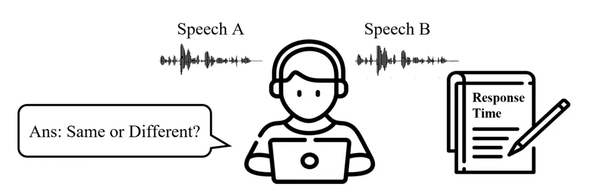

Fig. 10: The environment of the JND user study experiment. For each pair
of utterances in the 100-pair A/B Test, the participant listened to two
enhanced speech signals and then answer in SAME or DIFF. The response
time was recorded to determine the availability of the response.

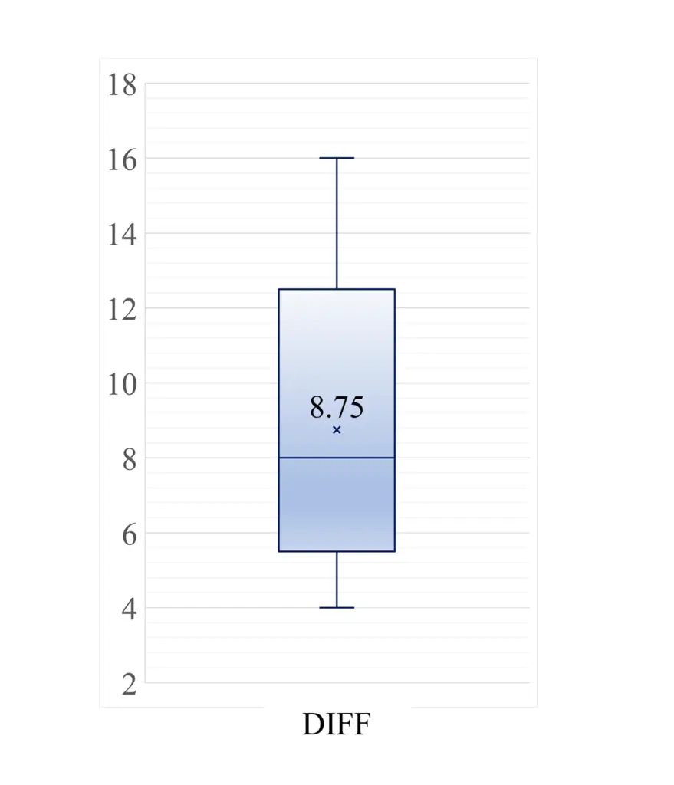

(a) amount of DIFF responses

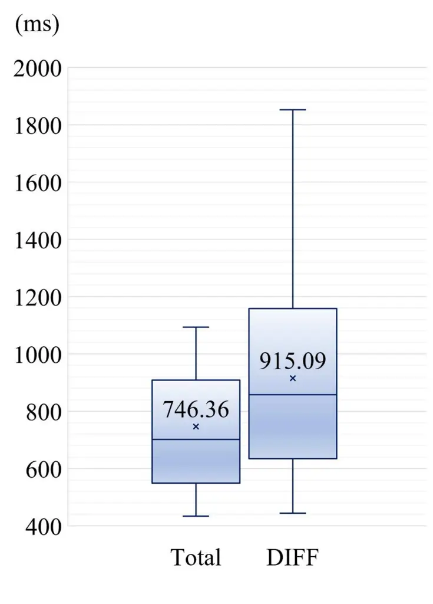

(b) response times

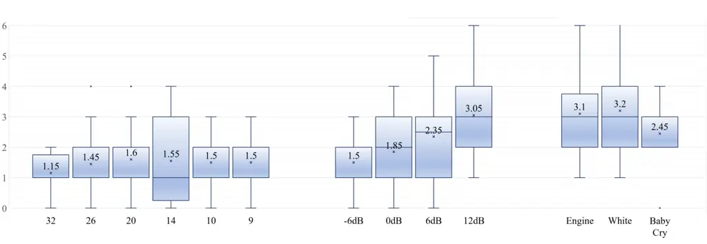

(c) amounts of DIFF responses under different conditions

Fig. 11: Statistic box plots of the response times and the amounts of
DIFF responses of the 20 participants in the 100-pair enhanced
utterances A/B Test. (a) the amount of DIFF responses; (b) the average
response times of total 100 pairs and the pairs of DIFF responses are in
units of milliseconds; (c) the amount of DIFF responses under the
SEOFP-NETs with 6 different bit-widths, 4 different SNR levels, and 3
different noise types.

Figure 11 illustrates the statistical boxplots of the average response
times and the amount of time for the 20 participants to reach a DIFF
response to the A/B test on the 100 pairs of enhanced utterances; these
response times are in milliseconds, as shown in Figure 11(b). From
Figure 11(a) and 11(b), the average time of the 100 responses is 746.36
ms. This short response time indicates that the JND statistic may be
applied. In addition, the average quantity of DIFF responses is only
8.75 out of the 100 pairs of enhanced utterances, and the average time
of DIFF responses is 915.09 ms. These results have two important
implications. First, although reductions in the scores of the
standardized objective evaluation metrics (i.e., PESQ and STOI) are
observed, as summarized in Tables II, in most pairs of utterances, the
two enhanced speech signals sound similar to the listeners. Second, the
longer average time of DIFF responses than the average response time of
the 100 pairs indicated that the listeners were unable to effortlessly
differentiate between the enhanced speech signals from the baseline
model and the proposed SEOFP-NETs although they ultimately made the DIFF
decision.

To further probe into the scenarios of DIFF responses, the number of
DIFF responses under different conditions are categorized into three
groups, as shown in Figure  11(c). The first group consisted of
SEOFP-NETs with six different bit widths; the second group had four
different SNR levels (-6, 0, 6, and 12); and the last group had three
different noise types (engine, white, and baby cry). From the figure,
the 8.75 DIFF responses are observed to be evenly distributed among the
six different bit widths of the SEOFP-NETs even though the interquartile
ranges are slightly different among these models. However, note that the
32-bit model has an average of 1.15 DIFF responses although the A/B
enhanced speech signals are actually the same. These erroneous
evaluations indicate that the participants were extremely unsure in
making the DIFF decisions.

For the different SNR levels, 12 dB is observed to receive the most
quantity of DIFF responses, whereas -6 dB had the least quantity among
the 100 pairs of enhanced speech signals. A possible reason for this
result is that the distortions of the baseline model and SEOFP-NETs are
different. The original noisy speech signals with high SNRs inherently
have high quality and intelligibility. However, the distortion of
enhanced noisy speech signals with high SNRs is more evident than the
distortion of enhanced noisy speech signals with low SNRs. Moreover, the
various models may cause different distortions while enhancing the noisy
speech signals; consequently, the differentiation made by the
participants between the two speech signals is based on different
distortions. For the different noise types, the average quantity of DIFF
responses to the $`engine`$ noise is 3.1; this approximates 3.2, which
is the average quantity of DIFF responses to the $`white`$ noise. In
contrast, the _Baby Cry_ noise received the least quantity of DIFF
responses among the 100 pairs of enhanced speech signals. These results
indicate that a pair of enhanced speech signals with stationary noise
can be more facilely differentiated by listeners than a pair with
non-stationary noise.

## V Conclusions

In this paper, a novel SEOFP-NET strategy is proposed to compress the
model size and accelerate the inference time for speech enhancement
tasks of regression in speech signal processing. In the offline training
phase, the proposed SEOFP-NET compressed the sizes of the DNN models by
quantizing the fraction bits of single-precision floating-point
parameters. Before the online inference is implemented, all parameters
in the trained SEOFP-NET model are slightly adjusted to accelerate the
inference time by replacing the floating-point multiplier logic circuit
with an integer-adder logic circuit. For generalization, the proposed
SEOFP-NET technique is applied to the two important speech enhancement
tasks of regression in speech signal processing, i.e., speech denoising
and speech dereverberation, with two different model architectures
(BLSTM and FCN) under two common corpora (TIMIT and TMHINT). The
experimental results show that the SEOFP-NET models compared with the
baseline models can be significantly compressed between 71.859% and
81.249% in terms of size and accelerated between 1.192$`\times`$ and
1.212$`\times`$ with respect to the inference time, respectively.
Moreover, the speech denoising and dereverberation performance achieved
by the SEOFP-NET models is similar to that of the baseline models in
PESQ and STOI, which are the standardized objective evaluation metrics.
The results also indicate that the proposed SEOFP-NET can cooperate with
other efficiency strategies to achieve a synergy effect. In addition,
the JND in the user study experiment is employed to statistically
analyze the effect on listening. The results indicate that the listeners
cannot facilely differentiate between the enhanced speech signals from
the baseline model and the proposed SEOFP-NETs. To the best knowledge of
the authors, this study is one of the first research works to
substantially reduce the size of DNN-based algorithms and inference
time, simultaneously, for speech enhancement tasks of regression in
speech signal processing while maintaining satisfactory performance. The
promising results suggest that the DNN-based speech enhancement
algorithms with the proposed SEOFP-NET technique can be suitably applied
to lightweight embedded devices.

## References

- \[1\] K. Simonyan and A. Zisserman, “Very deep convolutional networks
  for large-scale image recognition,” in Proc. ICLR, 2015.
- \[2\] K. He, X. Zhang, S. Ren, and J. Sun, “Deep residual learning for
  image recognition,” in Proc. CVPR, pp. 770–778, 2016.
- \[3\] P. Luo, Y. Tian, X. Wang, and X. Tang, “Switchable deep network
  for pedestrian detection,” in Proc. CVPR, pp. 899–906, 2014.
- \[4\] X. Zeng, W. Ouyang, and X. Wang, “Multi-stage contextual deep
  learning for pedestrian detection,” in Proc. ICCV, pp. 121–128, 2013.
- \[5\] P. Sermanet, K. Kavukcuoglu, S. Chintala, and Y. LeCun,
  “Pedestrian detection with unsupervised multi-stage feature learning,”
  in Proc. CVPR, pp. 3626–3633, 2013.
- \[6\] A. Graves, A. Mohamed, and G. Hinton, “Speech recognition with
  deep recurrent neural networks,” in Proc. ICASSP, pp. 6645–6649, 2013.
- \[7\] G. Hinton, L. Deng, D. Yu, G. Dahl, A. Mohamed, N. Jaitly,
  A. Senior, V. Vanhoucke, P. Nguyen, T. Sainath, et al., “Deep neural
  networks for acoustic modeling in speech recognition: The shared views
  of four research groups,” IEEE Signal processing magazine, vol. 29,
  no. 6, pp. 82–97, 2012.
- \[8\] L. Deng, J. Li, J.-T. Huang, K. Yao, D. Yu, F. Seide,
  M. Seltzer, G. Zweig, X. He, J. Williams, et al., “Recent advances in
  deep learning for speech research at microsoft,” in Proc. ICASSP,
  pp. 8604–8608, 2013.
- \[9\] J. Li, L. Deng, R. Haeb-Umbach, and Y. Gong, “Robust automatic
  speech recognition: A bridge to practical applications,” Elsevier,
  Orlando, FL, USA: Academic, 2015.
- \[10\] Z.-Q. Wang and D. Wang, “A joint training framework for robust
  automatic speech recognition,” IEEE/ACM Transactions on Audio, Speech,
  and Language Processing, vol. 24, 2016.
- \[11\] C. Donahue, B. Li, and R. Prabhavalkar, “Exploring speech
  enhancement with generative adversarial networks for robust speech
  recognition,” in 2018 IEEE International Conference on Acoustics,
  Speech and Signal Processing (ICASSP), pp. 5024–5028, 2018.
- \[12\] T. Ochiai, S. Watanabe, T. Hori, and J. R. Hershey,
  “Multichannel end-to-end speech recognition,” in Proceedings of the
  34th International Conference on Machine Learning,
  pp. 2632–2641, 2017.
- \[13\] D. Michelsanti and Z.-H. Tan, “Conditional generative
  adversarial networks for speech enhancement and noise-robust speaker
  verification,” in Proc. Interspeech, pp. 2008–2012, 2017.
- \[14\] S. Shon, H. Tang, and J. Glass, “VoiceID Loss: Speech
  Enhancement for Speaker Verification,” in Proc. Interspeech,
  pp. 2888–2892, 2019.
- \[15\] Y. Lan, Z. Hu, Y. C. Soh, and G.-B. Huang, “An extreme learning
  machine approach for speaker recognition,” Neural Computing and
  Applications, vol. 22, no. 3-4, pp. 417–425, 2013.
- \[16\] P. C. Loizou, Speech Enhancement: Theory and Practice. USA: CRC
  Press, Inc., 2nd ed., 2013.
- \[17\] S. Boll, “Suppression of acoustic noise in speech using
  spectral subtraction,” IEEE Transactions on Acoustics, Speech, and
  Signal Processing, vol. 27, no. 2, pp. 113–120, 1979.
- \[18\] P. Scalart and J. V. Filho, “Speech enhancement based on a
  priori signal to noise estimation,” in 1996 IEEE International
  Conference on Acoustics, Speech, and Signal Processing Conference
  Proceedings, vol. 2, pp. 629–632 vol. 2, 1996.
- \[19\] Y. Ephraim and D. Malah, “Speech enhancement using a
  minimum-mean square error short-time spectral amplitude estimator,”
  IEEE Transactions on Acoustics, Speech, and Signal Processing,
  vol. 32, no. 6, pp. 1109–1121, 1984.
- \[20\] Y. Hu and P. C. Loizou, “A subspace approach for enhancing
  speech corrupted by colored noise,” in 2002 IEEE International
  Conference on Acoustics, Speech, and Signal Processing,
  pp. I–573–I–576, 2002.
- \[21\] A. Rezayee and S. Gazor, “An adaptive klt approach for speech
  enhancement,” IEEE Transactions on Speech and Audio Processing,
  vol. 9, no. 2, pp. 87–95, 2001.
- \[22\] P. Huang, S. D. Chen, P. Smaragdis, and M. Hasegawa-Johnson,
  “Singing-voice separation from monaural recordings using robust
  principal component analysis,” in Proc. of IEEE ICASSP,
  pp. 57–60, 2012.
- \[23\] N. Zheng and X.-L. Zhang, “Phase-aware speech enhancement based
  on deep neural networks,” IEEE/ACM Transactions on Audio, Speech, and
  Language Processing, vol. 27, no. 1, pp. 63–76, 2019.
- \[24\] D. Liu, P. Smaragdis, and M. Kim, “Experiments on deep learning
  for speech denoising,” in Proc. of Interspeech, pp. 2685–2689, 2014.
- \[25\] J. Qi, H. Hu, Y. Wang, C.-H. H. Yang, S. M. Siniscalchi, and
  C.-H. Lee, “Exploring Deep Hybrid Tensor-to-Vector Network
  Architectures for Regression Based Speech Enhancement,” in Proc. of
  Interspeech, pp. 76–80, 2020.
- \[26\] J. Qi, H. Hu, Y. Wang, C.-H. H. Yang, S. M. Siniscalchi, and
  C.-H. Lee, “Tensor-to-vector regression for multi-channel speech
  enhancement based on tensor-train network,” in Proc. of IEEE ICASSP,
  pp. 7504–7508, 2020.
- \[27\] D. Wang and J. Chen, “Supervised speech separation based on
  deep learning: An overview,” IEEE/ACM Transactions on Audio, Speech,
  and Language Processing, vol. 26, no. 10, pp. 1702–1726, 2018.
- \[28\] K.-S. Oh and K. Jung, “Gpu implementation of neural networks,”
  Pattern Recognition, vol. 37, no. 6, pp. 1311–1314, 2004.
- \[29\] D. Strigl, K. Kofler, and S. Podlipnig, “Performance and
  scalability of gpu-based convolutional neural networks,” in 2010 18th
  Euromicro Conference on Parallel, Distributed and Network-based
  Processing, pp. 317–324, 2010.
- \[30\] H. Jang, A. Park, and K. Jung, “Neural network implementation
  using cuda and openmp,” in 2008 Digital Image Computing: Techniques
  and Applications, pp. 155–161, 2008.
- \[31\] M. Courbariaux, Y. Bengio, and J.-P. David, “Binaryconnect:
  Training deep neural networks with binary weights during
  propagations,” in Proc. NIPS, pp. 3105–3113, 2015.
- \[32\] Y. Gong, L. Liu, M. Yang, and L. Bourdev, “Compressing deep
  convolutional networks using vector quantization,” in
  arXiv:1412.6115, 2014.
- \[33\] A. Zhou, A. Yao, Y. Guo, L. Xu, and Y. Chen, “Incremental
  network quantization: Towards lossless cnns with low-precision
  weights,” in Proc. of International Conference on Learning
  Representations (ICLR), 2017.
- \[34\] P. H. Hung, C. H. Lee, S. W. Yang, V. S. Somayazulu, Y. K.
  Chen, and S. Y. Chien, “Bridge deep learning to the physical world: An
  efficient method to quantize network,” in Proc. SiPS, pp. 1–6, 2015.
- \[35\] K. Tan and D. Wang, “Towards model compression for deep
  learning based speech enhancement,” IEEE/ACM Transactions on Audio,
  Speech, and Language Processing, vol. 29, pp. 1785–1794, 2021.
- \[36\] X. Sun, Z.-F. Gao, Z.-Y. Lu, J. Li, and Y. Yan, “A model
  compression method with matrix product operators for speech
  enhancement,” IEEE/ACM Transactions on Audio, Speech, and Language
  Processing, vol. 28, pp. 1–1, 01 2020.
- \[37\] Y. Lecun, L. Bottou, Y. Bengio, and P. Haffner, “Gradient-based
  learning applied to document recognition,” Proceedings of the IEEE,
  vol. 86, no. 11, pp. 2278–2324, 1998.
- \[38\] A. Krizhevsky, V. Nair, and G. Hinton, “Cifar-10 (canadian
  institute for advanced research). (2009),” 2009.
- \[39\] Y. Netzer, T. Wang, A. Coates, A. Bissacco, B. Wu, and A. Ng,
  “Reading digits in natural images with unsupervised feature learning,”
  NIPS Workshop on Deep Learning and Unsupervised Feature
  Learning, 2011.
- \[40\] A. Krizhevsky, I. Sutskever, and G. E. Hinton, “Imagenet
  classification with deep convolutional neural networks,” in
  Proceedings of the 25th International Conference on Neural Information
  Processing Systems - Volume 1, p. 1097–1105, 2012.
- \[41\] K. Simonyan and A. Zisserman, “Very deep convolutional networks
  for large-scale image recognition,” CoRR abs/1409.1556, 09 2014.
- \[42\] C. Szegedy, Wei Liu, Yangqing Jia, P. Sermanet, S. Reed,
  D. Anguelov, D. Erhan, V. Vanhoucke, and A. Rabinovich, “Going deeper
  with convolutions,” in 2015 IEEE Conference on Computer Vision and
  Pattern Recognition (CVPR), pp. 1–9, 2015.
- \[43\] K. Hwang and W. Sung, “Fixed-point feedforward deep neural
  network design using weights +1, 0, and -1,” in Proc. SiPS,
  pp. 1–6, 2014.
- \[44\] F. Seide, H. Fu, J. Droppo, G. Li, and D. Yu, “1-bit stochastic
  gradient descent and its application to data-parallel distributed
  training of speech dnns,” in Proc. Interspeech, pp. 1058–1062, 2014.
- \[45\] R. Prabhavalkar, O. Alsharif, A. Bruguier, and L. McGraw, “On
  the compression of recurrent neural networks with an application to
  lvcsr acoustic modeling for embedded speech recognition,” in Proc.
  ICASSP, pp. 5970–5974, 2016.
- \[46\] S. Han, J. Kang, H. Mao, Y. Hu, X. Li, Y. Li, D. Xie, H. Luo,
  S. Yao, Y. Wang, H. Yang, and W. J. Dally, “Ese: Efficient speech
  recognition engine with sparse lstm on fpga,” in Proc. FPGA,
  pp. 75–84, 2017.
- \[47\] Y. Lin, S. Han, H. Mao, Y. Wang, and W. Dally, “Deep gradient
  compression: Reducing the communication bandwidth for distributed
  training,” in Proc. ICLR, 2018.
- \[48\] Y. Wang, J. Li, and Y. Gong, “Small-footprint high-performance
  deep neural network-based speech recognition using split-vq,” in Proc.
  ICASSP, pp. 4984–4988, 2015.
- \[49\] J. H. Ko, J. Fromm, M. Philipose, I. Tashev, and S. Zarar,
  “Precision scaling of neural networks for efficient audio processing,”
  in arXiv:1712.01340, 2017.
- \[50\] H. Sun and S. Li, “An optimization method for speech
  enhancement based on deep neural network,” in IOP Conference Series:
  Earth and Environmental Science, p. 012139, IOP Publishing, 2017.
- \[51\] H. Erdogan, J. R. Hershey, S. Watanabe, and J. L. Roux,
  “Phase-sensitive and recognition-boosted speech separation using deep
  recurrent neural networks,” in Proc. ICASSP, pp. 708–712, 2015.
- \[52\] Z. Chen, S. Watanabe, H. Erdogan, and J. R. Hershey, “Speech
  enhancement and recognition using multi-task learning of long
  short-term memory recurrent neural networks,” in Proc. Interspeech,
  pp. 1–5, 2015.
- \[53\] J. Long, E. Shelhamer, and T. Darrell, “Fully convolutional
  networks for semantic segmentation,” in 2015 IEEE Conference on
  Computer Vision and Pattern Recognition (CVPR), pp. 3431–3440, 2015.
- \[54\] J. S. Garofolo, L. Lamel, W. M. Fisher, J. G. Fiscus, and D. S.
  Pallett, “Darpa timit acoustic-phonetic continous speech corpus
  cd-rom. nist speech disc 1-1.1,” NASA STI/Recon technical report n,
  vol. 93, 1993.
- \[55\] M. Huang, “Development of taiwan mandarin hearing in noise
  test,” Department of speech language pathology and audiology, National
  Taipei University of Nursing and Health science, 2005.
- \[56\] I.-T. Recommendation, “Perceptual evaluation of speech quality
  (pesq): An objective method for end-to-end speech quality assessment
  of narrow-band telephone networks and speech codecs,” Rec. ITU-T P.
  862, Jan 2001.
- \[57\] C. H. Taal, R. C. Hendriks, R. Heusdens, and J. Jensen, “An
  algorithm for intelligibility prediction of time–frequency weighted
  noisy speech,” IEEE Transactions on Audio, Speech, and Language
  Processing, vol. 19, pp. 2125–2136, Sept 2011.
- \[58\] D. McShefferty, W. M. Whitmer, and M. A. Akeroyd, “The
  just-noticeable difference in speech-to-noise ratio,” Trends in
  Hearing, vol. 19, 2015.
- \[59\] D. Mcshefferty, W. Whitmer, and M. Akeroyd, “The
  just-meaningful difference in speech-to-noise ratio,” Trends in
  Hearing, vol. 20, 02 2016.
- \[60\] P. Manocha, A. Finkelstein, R. Zhang, N. J. Bryan, G. J.
  Mysore, and Z. Jin, “A Differentiable Perceptual Audio Metric Learned
  from Just Noticeable Differences,” in Proc. Interspeech 2020,
  pp. 2852–2856, 2020.
- \[61\] X. Lu, Y. Tsao, S. Matsuda, and C. Hori, “Speech enhancement
  based on deep denoising autoencoder,” in Proc. Interspeech,
  pp. 436–440, 2013.
- \[62\] Y. Xu, J. Du, L. R. Dai, and C. H. Lee, “A regression approach
  to speech enhancement based on deep neural networks,” IEEE/ACM
  Transactions on Audio, Speech, and Language Processing, vol. 23,
  pp. 7–19, Jan 2015.
- \[63\] S.-W. Fu, Y. Tsao, and X. Lu, “SNR-aware convolutional neural
  network modeling for speech enhancement,” in Proc. Interspeech,
  pp. 3768–3772, 2016.
- \[64\] B. Xia and C. Bao, “Wiener filtering based speech enhancement
  with weighted denoising auto-encoder and noise classification,” Speech
  Communication, vol. 60, pp. 13–29, 2014.
- \[65\] M. Kolbk, Z.-H. Tan, J. Jensen, M. Kolbk, Z.-H. Tan, and
  J. Jensen, “Speech intelligibility potential of general and
  specialized deep neural network based speech enhancement systems,”
  IEEE/ACM Transactions on Audio, Speech, and Language Processing,
  vol. 25, pp. 153–167, Nov 2017.
- \[66\] S.-W. Fu, T.-Y. Hu, Y. Tsao, and X. Lu, “Complex spectrogram
  enhancement by convolutional neural network with multi-metrics
  learning,” in MLSP, pp. 1–6, 2017.
- \[67\] S.-W. Fu, Y. Tsao, X. Lu, and H. Kawai, “Raw waveform-based
  speech enhancement by fully convolutional networks,” in Proc. of
  APSIPA ASC, pp. 006–012, 2017.
- \[68\] S.-W. Fu, T.-W. Wang, Y. Tsao, X. Lu, and H. Kawai, “End-to-end
  waveform utterance enhancement for direct evaluation metrics
  optimization by fully convolutional neural networks,” IEEE/ACM
  Transactions on Audio, Speech, and Language Processing, vol. 26,
  pp. 1570–1584, Sept 2018.
- \[69\] S. Pascual, A. Bonafonte, and J. Serrà, “Segan: Speech
  enhancement generative adversarial network,” in Proc. Interspeech,
  pp. 3642–3646, 2017.
- \[70\] A. van den Oord, S. Dieleman, H. Zen, K. Simonyan, O. Vinyals,
  A. Graves, N. Kalchbrenner, A. Senior, and K. Kavukcuoglu, “Wavenet: A
  generative model for raw audio,” in arXiv:1609.03499, 2016.
- \[71\] K. Wang, B. He, and W.-P. Zhu, “Caunet: Context-aware u-net for
  speech enhancement in time domain,” in Proc. of IEEE ISCAS,
  pp. 1–5, 2021.
- \[72\] J. Lin, S. Niu, A. J. van Wijngaarden, J. L. McClendon, M. C.
  Smith, and K.-C. Wang, “Improved speech enhancement using a
  time-domain gan with mask learning,” in Proc. of Interspeech,
  pp. 3286–3290, 2020.
- \[73\] F. Xiao, J. Guan, Q. Kong, and W. Wang, “Time-domain speech
  enhancement with generative adversarial learning,” in
  arXiv:2103.16149, 2021.
- \[74\] A. Pandey and D. Wang, “Dense cnn with self-attention for
  time-domain speech enhancement,” in arXiv:2009.01941, 2020.
- \[75\] A. Graves, A. Mohamed, and G. Hinton, “Speech recognition with
  deep recurrent neural networks,” in Proc. of IEEE ICASSP,
  pp. 6645–6649, 2013.
- \[76\] L. Deng, J. Li, J.-T. Huang, K. Yao, D. Yu, F. Seide,
  M. Seltzer, G. Zweig, X. He, J. Williams, et al., “Recent advances in
  deep learning for speech research at microsoft,” in Proc. of IEEE
  ICASSP, pp. 8604–8608, 2013.
- \[77\] M. Miyoshi and Y. Kaneda, “Inverse filtering of room
  acoustics,” IEEE Transactions on Acoustics, Speech, and Signal
  Processing, vol. 36, no. 2, pp. 145–152, 1988.
- \[78\] J. L. Flanagan, J. D. Johnston, R. Zahn, and G. W. Elko,
  “Computer‐steered microphone arrays for sound transduction in large
  rooms,” The Journal of the Acoustical Society of America, vol. 78,
  no. 5, pp. 1508–1518, 1985.
- \[79\] J. Flanagan, A. Surendran, and E. Jan, “Spatially selective
  sound capture for speech and audio processing,” Speech Communication,
  vol. 13, no. 1, pp. 207–222, 1993.
- \[80\] X. Feng, Y. Zhang, and J. Glass, “Speech feature denoising and
  dereverberation via deep autoencoders for noisy reverberant speech
  recognition,” in 2014 IEEE International Conference on Acoustics,
  Speech and Signal Processing (ICASSP), pp. 1759–1763, 2014.
- \[81\] T. Ishii, H. Komiyama, T. Shinozaki, Y. Horiuchi, and
  S. Kuroiwa, “Reverberant speech recognition based on denoising
  autoencoder,” Proceedings of INTERSPEECH, pp. 3512–3516, 01 2013.
- \[82\] I. of Electrical and E. Engineers, “Ieee standard for binary
  floating-point arithmetic,” ANSI/IEEE Std 754-1985, 1985.
- \[83\] M. Abadi, A. Agarwal, P. Barham, E. Brevdo, Z. Chen, C. Citro,
  G. S. Corrado, A. Davis, J. Dean, M. Devin, S. Ghemawat,
  I. Goodfellow, A. Harp, G. Irving, M. Isard, Y. Jia, R. Jozefowicz,
  L. Kaiser, M. Kudlur, J. Levenberg, D. Mané, R. Monga, S. Moore,
  D. Murray, C. Olah, M. Schuster, J. Shlens, B. Steiner, I. Sutskever,
  K. Talwar, P. Tucker, V. Vanhoucke, V. Vasudevan, F. Viégas,
  O. Vinyals, P. Warden, M. Wattenberg, M. Wicke, Y. Yu, and X. Zheng,
  “TensorFlow: Large-scale machine learning on heterogeneous
  systems,” 2015. Software available from tensorflow.org.
- \[84\] C.-T. Liu, Y.-H. Wu, Y.-S. Lin, and S.-Y. Chien,
  “Computation-performance optimization of convolutional neural networks
  with redundant kernel removal,” in 2018 IEEE International Symposium
  on Circuits and Systems (ISCAS), pp. 1–5, 2018.
- \[85\] J.-Y. Wu, C. Yu, S.-W. Fu, C.-T. Liu, S.-Y. Chien, and Y. Tsao,
  “Increasing compactness of deep learning based speech enhancement
  models with parameter pruning and quantization techniques,” IEEE
  Signal Processing Letters, vol. 26, no. 12, pp. 1887–1891, 2019.
