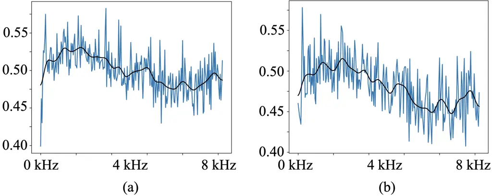
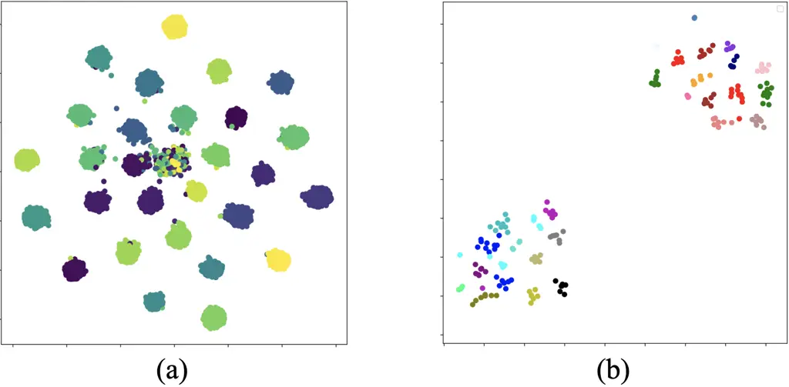

# OSSEM: one-shot speaker adaptive speech enhancement using meta learning

Cheng Yu    Szu-Wei Fu    Tsun-An Hsieh    Yu Tsao    Mirco Ravanelli

###### Abstract

Although deep learning (DL) has achieved notable progress in speech
enhancement (SE), further research is still required for a DL-based SE
system to adapt effectively and efficiently to particular speakers. In
this study, we propose a novel meta-learning-based speaker-adaptive SE
approach (called OSSEM) that aims to achieve SE model adaptation in a
one-shot manner. OSSEM consists of a modified transformer SE network and
a speaker-specific masking (SSM) network. In practice, the SSM network
takes an enrolled speaker embedding extracted using ECAPA-TDNN to adjust
the input noisy feature through masking. To evaluate OSSEM, we designed
a modified Voice Bank-DEMAND dataset, in which one utterance from the
testing set was used for model adaptation, and the remaining utterances
were used for testing the performance. Moreover, we set restrictions
allowing the enhancement process to be conducted in real time, and thus
designed OSSEM to be a causal SE system. Experimental results first show
that OSSEM can effectively adapt a pretrained SE model to a particular
speaker with only one utterance, thus yielding improved SE results.
Meanwhile, OSSEM exhibits a competitive performance compared to
state-of-the-art causal SE systems.

###### Index Terms: 

Speech Enhancement, Speaker Embedding, Meta-learning, Deep Learning

^(†)^(†)address: ¹Research Center for Information Technology Innovation,
Academia Sinica, Taiwan  
²Mila-Quebec AI Institute, Montreal, Canada

## 1 Introduction

The goal of speech enhancement (SE) is to improve the quality and
intelligibility of distorted speech. In various speech-related
applications, such as automatic speech recognition \[1\], speaker
recognition \[2, 3\], and assistive hearing devices \[4\], SE serves as
an indispensable front-end unit. Traditional SE methods \[5, 6\] are
derived based on statistical models and assumed properties of speech and
noise signals. Under scenarios in which the assumptions are
unsatisfactory, the traditional SE approaches may yield a suboptimal
performance.

Deep learning (DL) models have recently been widely applied for SE tasks
\[7, 8, 9, 10\]. Although several studies have shown that DL-based SE
systems can outperform traditional methods, their limited generalization
ability is still an issue. One simple solution to improve the
generalization of the model involves collecting as much training data as
possible. However, it is almost impossible to cover all types of
conditions (e.g., different SNRs, noise types, and speakers). Another
solution is to adapt the SE model before/during the inference using
auxiliary information. For example, in \[11, 12, 13\], the authors first
prepared multiple SE models, and then trained them under different
conditions. In the testing stage, a most-match model was selected based
on certain criteria.

Another class utilizes additional noise or speaker information to guide
the SE adaptation to certain types of noise \[14, 15, 16, 17\] or
speaker \[18\] conditions. In this study, we go one step further to
simultaneously adapt both the model inputs and model weights through
embedding vector and meta-learning, respectively. Specifically, we
propose a novel one-shot speaker-adaptive SE approach using
meta-learning (OSSEM), in which the SE model can be effectively and
efficiently adapted to a particular speaker with only one adaptation
sample. OSSEM consists of two networks: a modified transformer SE
network that aims to achieve an SE and a speaker-specific masking (SSM)
network that generates speaker-specific masks for adapting the SE model.
For the SSM network, we adopted ECAPA-TDNN \[19\] through the
SpeechBrain toolkit \[20\] to extract speaker embeddings as the input
features. The two networks were trained in a meta-learning manner, which
has been shown to be effective for one/few-shot learning on several
tasks \[21, 22\]. In contrast to previous studies that adapt the overall
SE model \[23\], OSSEM can reach a fast adaptation because only the
parameters in the SSM network are adjusted instead of the entire OSSEM
system. In addition, we propose several training techniques for OSSEM to
further improve its stability and performance.

To evaluate the proposed OSSEM system, we slightly modified the Voice
Bank-DEMAND \[24\] dataset. One utterance from each speaker was selected
from the testing set for model adaptation, and the remaining utterances
from the same speaker were used for testing the performance. Experiment
results confirmed the fast model adaptation of OSSEM and showed that it
can yield a competitive performance comparable to that of state-of-art
casual SE systems. The remainder of this paper is organized as follows.
Section 2 reviews related studies and previous meta-learning. Section 3
then elaborates on the proposed OSSEM approach. Section 4 reports the
experiment setup and results. Finally, Section 5 provides some
concluding remarks regarding the findings and contributions of this
study.

Figure 1: Flow chart of the OSSEM system, (a) the training stage
(offline), and (b) the one-shot learning and testing stages (online).

## 2 Meta-learning SE system

The aim of OSSEM is to effectively adapt a pretrained SE model to a
particular speaker in a one-shot learning manner. To this end, as the
main criterion for training OSSEM, we adopt the meta-learning algorithm,
which has been popularly used to build one/few-shot machine learning
systems \[25\]. To apply meta-learning to SE systems, the training set
data needs to be reorganized into task-specific classes, such as noise
conditions \[23\] or speaker identities (considered in this study). Each
class is further divided into support and query set. The former is used
for adaptation by one (or few) shot learning, whereas the latter is used
for model training. To the best of our knowledge, the proposed OSSEM is
the first one-shot speaker-adaptation SE using meta-learning. To clarify
the implementation details, we elaborate on the training, one-shot
learning, and testing stages as follows.

### 2.1 Training stage (offline)

Fig. 1 (a) demonstrates the training stage (offline) of OSSEM. For
clarity, we denote the DL model by $`g_{\theta_{n}}`$, with weights
$`\theta_{n}`$ of the $`n`$-th iteration. We elaborate three steps in
this stage as follows: In Step 1, the weights $`\theta_{n}`$ are copied
as $`\theta^{{}^{\prime}}_{n}`$. In Step 2, the weights
$`\theta^{{}^{\prime}}_{n}`$ are adapted using gradients from the
training on the support set $`s_{n}`$, where
$`\hat{X}^{s_{n}}_{t,f}=g_{\theta^{{}^{\prime}}_{n}}(X^{s_{n}}_{t,f})`$
denotes the prediction using the input feature $`X^{s_{n}}_{t,f}`$, and
$`Y^{s_{n}}_{t,f}`$ denotes the clean features. Finally, in Step 3, the
adapted weights $`\theta^{{}^{\prime\prime}}_{n}`$ are then trained
using the corresponding query set $`q_{n}`$, where
$`\hat{X}^{q_{n}}_{t,f}=g_{\theta^{{}^{\prime\prime}}_{n}}(X^{q_{n}}_{t,f})`$
denotes the prediction using the input feature $`X^{q_{n}}_{t,f}`$, and
$`Y^{q_{n}}_{t,f}`$ denotes the clean features. The gradients computed
from this step are used to update the original weights $`\theta_{n}`$ to
yield $`\theta_{n+1}`$. The two gradients in Step 2 and Step 3 are
computed using the losses as follows:

```math
\displaystyle L_{1}(\hat{X}^{s_{n}}_{t,f},Y^{s_{n}}_{t,f})=\frac{1}{N(s_{n})}\sum^{N(s_{n})}_{n=1}\|\hat{X}^{s_{n}}_{t,f}-Y^{s_{n}}_{t,f}\|_{1} \tag{1}
```

```math
\displaystyle L_{1}(\hat{X}^{q_{n}}_{t,f},Y^{q_{n}}_{t,f})=\frac{1}{N(q_{n})}\sum^{N(q_{n})}_{n=1}\|\hat{X}^{q_{n}}_{t,f}-Y^{q_{n}}_{t,f}\|_{1} \tag{2}
```

where $`N(s_{n})`$ and $`N(q_{n})`$ denote the numbers of data in the
support and query sets, respectively. The value $`N(s_{n})`$ is usually
extremely small (e.g., in this paper, $`N(s_{n})`$ = 1 for one-shot
learning and $`N(q_{n})`$ = 20 for Step 3). The inner and outer loops
represent supervised training cycles on the support set $`s_{n}`$ and
query set $`q_{n}`$, respectively.

### 2.2 One-shot learning and testing stage (online)

We demonstrate the testing stage (online) flowchart of the OSSEM in Fig.
1 (b). We elaborate on two steps in this stage as follows: In Step 1,
the weights $`\theta_{meta}`$ are copied as
$`\theta^{{}^{\prime}}_{meta}`$. This copy step allows users to maintain
well-trained weights $`\theta_{meta}`$, whereas adaptation is only
applied on the copied weights. In Step 2, the weights
$`\theta^{{}^{\prime}}_{meta}`$ are adapted using gradients from the
training on the enrollment set $`e_{n}`$, where
$`\hat{X}^{e_{n}}_{t,f}=g_{\theta^{{}^{\prime}}_{meta}}(X^{e_{n}}_{t,f})`$
and $`Y^{e_{n}}_{t,f}`$ denotes the clean features. Finally, the adapted
weights $`\theta^{spk}_{meta}`$ are ready for SE to enhance the noisy
features $`X_{t,f}`$ to $`\hat{X}_{t,f}`$. The gradients in Step 2 are
computed using the loss as follows:

```math
\displaystyle L_{1}(\hat{X}^{e_{n}}_{t,f},Y^{e_{n}}_{t,f})=\frac{1}{N(e_{n})}\sum^{N(e_{n})}_{n=1}\|\hat{X}^{e_{n}}_{t,f}-Y^{e_{n}}_{t,f}\|_{1} \tag{3}
```

where $`N(e_{n})`$ denotes the number of data in the enrollment set,
which is usually an extremely small number. For example, for a one-shot
adaptation, $`N(e_{n})`$ = 1. In the proposed OSSEM system, the
gradients from Eq. (3) achieve an efficient adaptation because
$`\nabla_{\theta^{{}^{\prime}}_{meta}}L_{1}(\hat{X}^{e_{n}}_{t,f},Y^{e_{n}}_{t,f})`$
only adapts to the SSM network of OSSEM.

Figure 2: Model architecture of the OSSEM system that consists of a
modified Transformer (encoder, multi-head attention, and decoder) SE
network and an SSM network.

## 3 Proposed OSSEM system

### 3.1 Model architecture

#### 3.1.1 Modified Transformer-based SE network

The Transformer model \[26\] has recently been used in SE systems and
has shown a promising performance \[27, 28\]. In the proposed OSSEM
system, we adopted the modified transformer model proposed in \[28\];
the model consists of a convolutional encoder (for replacing the
original positional encoder), several multi-head attention blocks, and a
fully connected layer. The convolutional encoder includes four 1-D
convolutional layers, and each attention block consists of eight heads,
with 64 dimensions per head.

#### 3.1.2 The SSM Network

As shown in Fig. 2, SSM takes the speaker embedding (from ECAPA) as
input and generates speaker-specific masks. The SSM network consists of
a three-layered dense network with the leaky-Relu activation functions
for the first two layers and the sigmoid function for the last layer.
The generated mask is then multiplied with the noisy spectrogram to
yield speaker-adaptive features, which are the inputs to the
Transformer-based SE network.

### 3.2 Training techniques

In our preliminary experiments, directly applying meta-learning to SE
tasks did not achieve good results, probably because a model trained
using MAML becomes easily unstable \[29\].). To optimally exert the
capability of the proposed OSSEM system, we propose several training
techniques and describe them as follows:

1.  1.  Speaker-Inner-Loop:  
        MAML was previously reported to suffer from a trade-off \[29\]
        between burdensome inner loops and better performance. To solve this
        problem, Raghu et al. proposed an almost-no-inner-loop (ANIL) \[30\]
        that only updates task-specific parameters in the inner loop.
        However, it may be difficult to determine the task-specificity of
        the parameters in a model without a predefined task-specific
        network. In this study, the OSSEM system consists of two
        task-specific building blocks. The modified transformer SE network
        is responsible for general-purpose SE, whereas the SSM network
        adapts the input features based on a specific speaker. We propose a
        speaker-inner-loop method to apply adaptation only on the SSM
        network in the inner loop. As shown in Fig. 1 (a), the gradients
        $`\nabla_{\theta^{{}^{\prime}}_{n}}L_{1}(\hat{X}^{s_{n}}_{t,f},Y^{s_{n}}_{t,f})`$
        (computed using support set data $`s_{n}`$ of a specific speaker)
        are only used to adapt the parameters of the SSM network and keep
        the parameters in the SE network unchanged. The speaker-inner-loop
        is beneficial for two reasons: First, the updates are completely
        focused on the adaptation of the task-specific SSM network
        parameters. Second, the adaptation efficiency can be further
        improved by focusing only on the compact SSM network instead of the
        entire OSSEM system.
2.  2.  Learning Rate Scaling Rule:  
        As shown in Fig. 1 (a), the training stage of OSSEM has an
        inner-loop and an outer-loop. Each loop has a specific learning rate
        (i.e., inner-loop learning rate (ILR) and outer-loop learning rate
        (OLR)). For OLR, we fixed its value. For ILR, we adopted a modified
        learning rate scaling rule \[31\] to stabilize the training
        procedure. Note that when ILR is $`0`$ (removing Step 2 in Fig. 1
        (a)), the training stage of OSSEM becomes a normal supervised
        training. For each outer loop, the training data in the query set
        are from the same speaker, which may make model training difficult.
        Thus, as in \[15\], the weights of a normally supervised trained
        model are applied as the weight initialization for OSSEM. To
        smoothly transform from supervised training to meta-learning, we set
        ILR to $`0`$ in the first five epochs. From the sixth epoch, ILR was
        linearly scaled up (warmup) and then fixed during the last 20 epochs
        to stabilize the training.
3.  3.  Feature Re-scaling Inner-Loop:  
        Feature re-scaling has been confirmed to be effective \[32\] at
        stabilizing the gradients when training DL-based tasks. Because
        OSSEM relies on the effectiveness of speaker adaptation, it is
        crucial to stabilize the training of the inner loop. Specifically,
        speaker adaptation functions through an SSM network, which is highly
        dependent on the training of the inner loop. To further stabilize
        the training of the inner loop, we designed a feature re-scaling
        ratio $`\alpha`$ that is computed between clean and noisy features
        (the average energy power ratio between features):

    ```math
    \displaystyle\alpha=\frac{\|Y^{s}_{t,f}\|_{2}^{2}}{\|X^{s}_{t,f}\|_{2}^{2}} \tag{4}
    ```

    ```math
    \displaystyle Loss=L_{1}({\rm OSSEM}(\hat{X^{s}}\cdot\alpha),Y^{s}) \tag{5}
    ```

    where $`X^{s}_{t,f}`$ and $`Y^{s}_{t,f}`$ denote the noisy speech
    and the corresponding clean speech in the support set $`s`$. The
    ratio $`\alpha`$ is multiplied by the model output for only the loss
    computation. By adopting the feature re-scaling technique, the
    inner-loop gradients can be stabilized, and thus the SSM network can
    be tuned more accurately, finally enabling OSSEM to attain a better
    speaker adaptation performance.

## 4 Experimental Results

In this section, we investigate the effectiveness of OSSEM using the
Voice Bank-DEMAND dataset. We evaluated the proposed OSSEM system using
five standard metrics, PESQ, STOI, CSIG, CBAK, and COVL, which are
commonly reported when using this dataset. We prepared 192-dimensional
speaker embedding of one enrollment speech from each speaker using the
ECAPA-TDNN. For fair comparisons, we trained all of our proposed systems
using a total of 100 epochs (including pretrained epochs), with 1000
iterations in each epoch. In addition, we adopted the same set of
hyperparameters of training. Note that we removed the enrolled speech
from the two speakers in the testing set for a fair evaluation. OSSEM is
a causal SE system that can perform enhancement in real time.

### 4.1 Speaker masks in the SE process

As shown in Fig. 2, OSSEM uses the SSM network to directly modify the
noisy input. To justify this early signal modification, we implemented
four systems with the same SE and SSM networks, whereas the masks
generated by the SSM network were applied in different places during the
SE process: before the encoder, before the multi-head attention, before
the decoder, and after the decoder. These systems are labeled Pre, Mid1,
Mid2, and Last, respectively, and their PESQ scores on the test set are
reported in Table 1. An addition system, called Non, represents a system
having only an SE network and serves as a baseline for comparison. From
Table 1, Pre performs better than the other systems, confirming that
early signal modification is a suitable choice for building an adaptive
SE system.

|      | Pre  | Mid1 | Mid2 | Last | Non  |
| ---- | ---- | ---- | ---- | ---- | ---- |
| PESQ | 2.80 | 2.78 | 2.76 | 2.64 | 2.69 |

Table 1: Results of different places that the speaker masks (generated
by the SSM network) are applied in the SE process.

| System                      | PESQ  | STOI |
| --------------------------- | ----- | ---- |
| Transformer\_(Spk)          | 2.809 | 0.93 |
| OSSEM with technique 1      | 2.818 | 0.93 |
| OSSEM with techniques 1&2   | 2.847 | 0.93 |
| OSSEM with techniques 1&2&3 | 2.896 | 0.93 |

Table 2: Results of OSSEM using different training techniques.

### 4.2 Ablation study

Next, we investigate the effectiveness of the proposed training
techniques introduced in Section 3.2. Training techniques 1, 2, and 3
denote the speaker inner-loop, learning rate scaling, and feature
re-scaling inner-loop, respectively. The transformer \_(Spk) in Table 2
denotes the SE network, which is first trained in a supervised manner
and using Fig. 1 (b) for online adaptation. From Table 2, we can observe
that each technique is helpful in improving the PESQ score. Among all of
the proposed techniques, the feature re-scaling inner-loop (technique 3)
is the most important.

|                    |      |      |      |      |      |        |
| ------------------ | ---- | ---- | ---- | ---- | ---- | ------ |
| SE approach        | PESQ | CSIG | CBAK | COVL | STOI | causal |
| Noisy\[33\]        | 1.97 | 3.35 | 2.44 | 2.63 | 0.92 | –      |
| Wiener \[33\]      | 2.22 | 3.23 | 2.68 | 2.67 | –    | yes    |
| Conv-TasNet \[34\] | 2.53 | 3.95 | 3.08 | 3.23 | –    | yes\*  |
| Transformer \[28\] | 2.69 | 4.07 | 3.03 | 3.38 | 0.93 | yes    |
| STFT-TCN \[34\]    | 2.73 | 4.11 | 3.25 | 3.42 | –    | yes\*  |
| CRN-MSE \[35\]     | 2.74 | 3.86 | 3.14 | 3.30 | 0.93 | yes    |
| TFSNN \[36\]       | 2.79 | 4.17 | 3.27 | 3.49 | -    | yes    |
| Transformer\_(Spk) | 2.81 | 3.95 | 3.19 | 3.36 | 0.93 | yes    |
| OSSEM              | 2.90 | 4.11 | 3.15 | 3.50 | 0.93 | yes    |

yes\* denotes the use of look-ahead mechanism, where Conv-TasNet uses
1ms look-ahead, and STFT-TCN uses 4ms look-ahead.

Table 3: Evaluation results of OSSEM and other causal SE systems on the
VoiceBank-DEMAND dataset.

### 4.3 Comparison of OSSEM with other causal SE systems

Table 3 lists the results of OSSEM and several related SE systems,
including the modified Transformer SE network \[28\], Transformer\_(Spk)
(as discussed in Section 4.2), and some well-known causal SE systems.
Note that our testing set is a slightly modified version of the original
testing set of Voice Bank-DEMAND. In our preliminary experiments, we
have confirmed that the results of Noisy, Wiener, and Transformer tested
on the modified testing sets are almost identical to those tested on the
original Voice Bank-DEMAND. Therefore, we directly copied the results of
Noisy, Wiener, and other SE systems from existing studies listed in
Table 3 for comparison.

From Table 3, we first note that OSSEM outperforms both Transformer and
Transformer\_(Spk), confirming the effectiveness of one-shot adaptation
through meta-learning. Next, it was observed that OSSEM outperforms
other systems in most of the five metric scores, confirming the
effectiveness of OSSEM as compared to other systems. We also noticed
that, among the five metrics, OSSEM yields a slightly lower yet
comparable performance to DEMUCS \[37\]. We argue that the model size of
DEMUCS is almost twice that of the OSSEM system (OSSEM: 38MB; DEMUCS:
73MB \[38\]). Thus, OSSEM achieves a better applicability to real-world
systems, particularly when storage is limited. We also note that DEMUCS
uses a 3-ms look-ahead mechanism, whereas our OSSEM system is completely
causal. To further investigate the capabilities of OSSEM, we implemented
a non-causal version of OSSEM. The results of the non-causal OSSEM do
not notably outperform the causal version, probably owning to the fact
that speaker embedding can mitigate the information gap between causal
and non-causal systems.

### 4.4 Analysis of the SSM network

In this section, we further investigate the function of the SSM network
in OSSEM. Figs. 3 (a) and (b) show the mask plots (output of the SSM
network) of female and male test speakers, where the x- and y- axes of
the plots indicate the frequency and amplitude, respectively. The blue
and black lines indicate the detailed mask values for every frequency
bin and the smoothed mask value over the frequency (showing the trend of
the mask). From Fig. 3, we first note that the frequency range of the
first peak in Fig. 3 (a) is higher than that of Fig. 3 (b), confirming
that the mask indeed captures the gender information. Next, we observed
that Figs. 3 (a) and (b) present extremely different patterns, showing
that for each speaker, a specified mask is generated and assigned, to
modify the noisy input.



Figure 3: The masks generated by the SSM network of speech samples from
(a) a female speaker, and (b) a male speaker.

Fig. 4 (a) shows the results of a t-SNE analysis \[39\] on the embedding
vectors extracted using ECAPA. The speech utterances were taken from the
training set of Voice Bank-DEMAND, which comprises utterances from 28
speakers. From Fig. 4 (a), we can note that the utterances from each
speaker are grouped together, and there are a total of 28 groups.
Moreover, we can observe a clear distance between each pair of groups.
The results confirm that the speaker representations extracted by ECAPA
are informative and discriminative. Fig. 4 (b) shows the results of a
t-SNE analysis that was performed on the masks generated by the SSM
network with the same utterances used in Fig. 4 (a). Note that the masks
are also similarly informative and discriminative but are divided into
two groups of two genders. The transition from Fig. 4 (a) to Fig. 4 (b)
suggests that the SSM network further emphasized the characteristics of
gender when converting the embedding into masks. The results conform to
a previous study \[40\] showing that the gender identity of the speaker
plays a major factor in SE performance.



Figure 4: The t-SNE analysis of (a) ECAPA-TDNN speaker embedding of all
speakers, and (b) the speaker masks of all speakers.

## 5 Conclusion

In this study, we proposed an OSSEM system that can adapt a pretrained
SE model to a new speaker in a one-shot manner. Experiment results
confirm the effectiveness of speaker-specific masking and metal learning
for fast SE model adaptation. The results also show that OSSEM
outperforms several well-known causal SE systems in terms of the
standard evaluation metrics. In summary, the contributions of this study
are threefold: (1) The proposed OSSEM is the first one-shot speaker
adaptive SE system based on meta-learning, (2) a novel SSM network that
directly modifies the noisy input is proposed and was proven to be
effective, and (3) several techniques to improve the stability of
meta-learning have been adopted and modified to conform to the SE task.
In the future, we will explore the application of the proposed approach
to other speech generation tasks, such as speech separation and target
speaker extraction.

## References

- \[1\] C. Donahue, B. Li, and R. Prabhavalkar, “Exploring speech
  enhancement with generative adversarial networks for robust speech
  recognition,” in Proc. ICASSP, 2018.
- \[2\] D. Michelsanti and Z.-H. Tan, “Conditional generative
  adversarial networks for speech enhancement and noise-robust speaker
  verification,” in Proc. INTERSPEECH, 2017.
- \[3\] S. Shon, H. Tang, and J. Glass, “Voiceid loss: Speech
  enhancement for speaker verification,” in Proc. INTERSPEECH, 2019.
- \[4\] H. Puder, “Hearing aids: an overview of the state-of-the-art,
  challenges, and future trends of an interesting audio signal
  processing application,” in Proc. ISPA, 2009.
- \[5\] Y. Ephraim and D. Malah, “Speech enhancement using a
  minimum-mean square error short-time spectral amplitude estimator,”
  IEEE Transactions on Acoustics, Speech, and Signal Processing, vol.
  32, no. 6, pp. 1109–1121, 1984.
- \[6\] P. Scalart and J. Vieira Filho, “Speech enhancement based on a
  priori signal to noise estimation,” in Proc. ICASSP, 1996.
- \[7\] X. Lu, Y. Tsao, S. Matsuda, and C. Hori, “Speech enhancement
  based on deep denoising autoencoder,” in Proc. INTERSPEECH, 2013.
- \[8\] S.-W. Fu, Y. Tsao, and X. Lu, “Snr-aware convolutional neural
  network modeling for speech enhancement,” in Proc. INTERSPEECH, 2016.
- \[9\] Y. Xu, J. Du, L.-R. Dai, and C.-H. Lee, “An experimental study
  on speech enhancement based on deep neural networks,” IEEE Signal
  Processing Letters, vol. 21, no. 1, pp. 65–68, 2014.
- \[10\] L. Sun, J. Du, L.-R. Dai, and C.-H. Lee, “Multiple-target deep
  learning for lstm-rnn based speech enhancement,” in Proc. HSCMA, 2017.
- \[11\] C. Yu, R. E. Zezario, S.-S. Wang, J. Sherman, Y.-M Wang, and
  Y. Tsao, “Speech enhancement based on denoising autoencoder with
  multi-branched encoders,” IEEE/ACM Transactions on Audio, Speech, and
  Language Processing, vol. 28, pp. 2756–2769, 2020.
- \[12\] S. Kim and M. Kim, “Test-time adaptation toward personalized
  speech enhancement: Zero-shot learning with knowledge distillation,”
  in Proc. INTERSPEECH, 2021.
- \[13\] R. E. Zezario, C.-S. Fuh, H.-M. Wang, and Y. Tsao, “Speech
  enhancement with zero-shot model selection,” in Proc. EUSIPCO, 2021.
- \[14\] Y. Xu, J. Du, L.-R. Dai, and C.-H. Lee, “Dynamic noise aware
  training for speech enhancement based on deep neural networks,” in
  Proc. INTERSPEECH, 2014.
- \[15\] C.-F. Liao, Y. Tsao, H.-Y. Lee, and H.-M. Wang, “Noise adaptive
  speech enhancement using domain adversarial training,” Proc.
  INTERSPEECH, 2019.
- \[16\] H. Li and J. Yamagishi, “Noise tokens: Learning neural noise
  templates for environment-aware speech enhancement,” Proc.
  INTERSPEECH, 2020.
- \[17\] J. Lee, Y. Jung, M. Jung, and H. Kim, “Dynamic noise embedding:
  Noise aware training and adaptation for speech enhancement,” in Proc.
  APSIPA ASC, 2020.
- \[18\] F.-K. Chunag, S.-S. Wang, J. w. Hung, Y. Tsao, and S.-H. Fang,
  “Speaker-aware deep denoising autoencoder with embedded speaker
  identity for speech enhancement.,” in Proc. INTERSPEECH, 2019.
- \[19\] B. Desplanques, J. Thienpondt, and K. Demuynck, “Ecapa-tdnn:
  Emphasized channel attention, propagation and aggregation in tdnn
  based speaker verification,” in PRoc. INTERSPEECH, 2020.
- \[20\] M. Ravanelli, T. Parcollet, P. Plantinga, A. Rouhe, S. Cornell,
  L. Lugosch, C. Subakan, N. Dawalatabad, A. Heba, J. Zhong, J.-C. Chou,
  S.-L. Yeh, S.-W. Fu, C.-F. Liao, E. Rastorgueva, F. Grondin, W. Aris,
  H. Na, Y. Gao, R. D. Mori, and Y. Bengio, “Speechbrain: A
  general-purpose speech toolkit,” 2021.
- \[21\] J.-Y. Hsu, Y.-J. Chen, and H. y. Lee, “Meta learning for
  end-to-end low-resource speech recognition,” in Proc. ICASSP, 2020.
- \[22\] B. Shi, M. Sun, K. V. Puvvada, C.-C. Kao, S. Matsoukas, and
  C. Wang, “Few-shot acoustic event detection via meta learning,” in
  Proc. ICASSP, 2020.
- \[23\] W. Zhou, M. Lu, and R. Ji, “Meta-se: A meta-learning framework
  for few-shot speech enhancement,” IEEE Access, vol. 9, pp.
  46068–46078, 2021.
- \[24\] C. Valentini-Botinhao, “Noisy speech database for training
  speech enhancement algorithms and tts models,” 2020.
- \[25\] C. Finn, P. Abbeel, and S. Levine, “Model-agnostic
  meta-learning for fast adaptation of deep networks,” in Proc.
  ICML, 2017.
- \[26\] A. Vaswani, N. Shazeer, N. Parmar, J. Uszkoreit, L. Jones,
  A. N. Gomez, L. Kaiser, and I. Polosukhin, “Attention is all you
  need,” in Proc. NeurIPS, 2017.
- \[27\] J. Kim, M. El-khamy, and J. Lee, “Transformer with guassian
  weighted self-attention for speech enhancement,” Nov. 12 2020, US
  Patent App. 16/591,117.
- \[28\] S.-W. Fu, C.-F. Liao, T.-A. Hsieh, K.-H. Hung, S.-S. Wang,
  C. Yu, H.-C. Kuo, R. E. Zezario, Y.-J. Li, S.-Y. Chuang, et al.,
  “Boosting objective scores of a speech enhancement model by metricgan
  post-processing,” in Proc. APSIPA, 2020.
- \[29\] A. Antoniou, H. Edwards, and A. Storkey, “How to train your
  maml,” in Proc. ICLR, 2018.
- \[30\] A. Raghu, M. Raghu, S. Bengio, and O. Vinyals, “Rapid learning
  or feature reuse? towards understanding the effectiveness of maml,” in
  Proc. ICLR, 2020.
- \[31\] P. Goyal, P. Dollár, R. Girshick, P. Noordhuis, L. Wesolowski,
  A. Kyrola, A. Tulloch, Y. Jia, and K. He, “Accurate, large minibatch
  sgd: Training imagenet in 1 hour,” arXiv preprint
  arXiv:1706.02677, 2017.
- \[32\] Joel Grus, Data science from scratch: first principles with
  python, O’Reilly Media, 2019.
- \[33\] S. S. Pascual, A. Bonafonte, and J. Serrà, “Segan: Speech
  enhancement generative adversarial network,” in Proc.
  Interspeech, 2017.
- \[34\] Y. Koyama, T. Vuong, S. Uhlich, and B. Raj, “Exploring the best
  loss function for dnn-based low-latency speech enhancement with
  temporal convolutional networks,” arXiv preprint
  arXiv:2005.11611, 2020.
- \[35\] K. Tan and D. Wang, “A convolutional recurrent neural network
  for real-time speech enhancement.,” in Proc. INTERSPEECH, 2018.
- \[36\] W. Yuan, “A time–frequency smoothing neural network for speech
  enhancement,” Speech Communication, vol. 124, pp. 75–84, 2020.
- \[37\] A. Défossez, G. Synnaeve, and Y. Adi, “Real time speech
  enhancement in the waveform domain,” in Proc. INTERSPEECH, 2020.
- \[38\] L. Lee, Y. Ji, M. Lee, M.-S. Choi, and N. Coporation,
  “Demucs-mobile: On-device lightweight speech enhancement,” Proc.
  INTERSPEECH, 2021.
- \[39\] A. Gisbrecht, B. Mokbel, and B. Hammer, “Linear basis-function
  t-sne for fast nonlinear dimensionality reduction,” in Proc.
  IJCNN, 2012.
- \[40\] M. Kolbæk, Z.-H. Tan, and J. Jensen, “Speech intelligibility
  potential of general and specialized deep neural network based speech
  enhancement systems,” IEEE/ACM Transactions on Audio, Speech, and
  Language Processing, vol. 25, no. 1, pp. 153–167, 2016.
