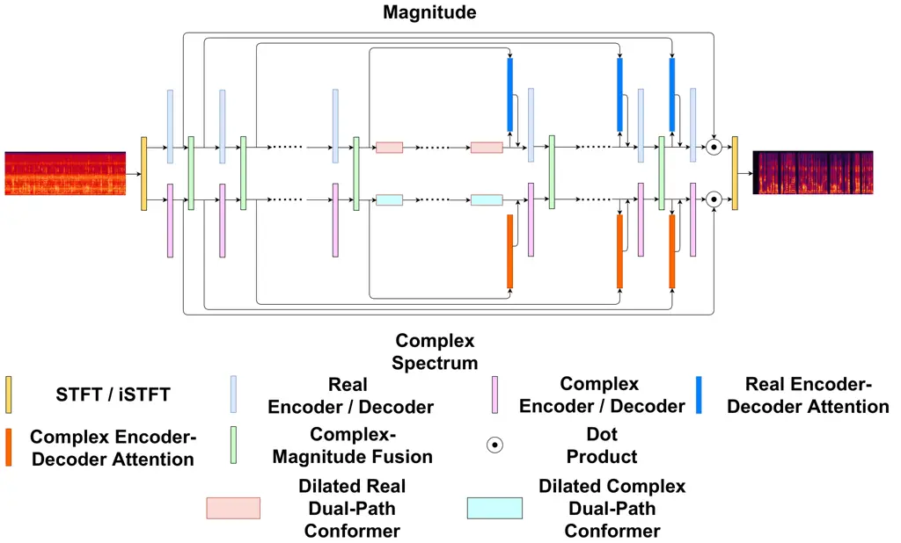

# Uformer: A Unet based dilated complex & real dual-path conformer network for simultaneous speech enhancement and dereverberation

Yihui Fu    Yun Liu    Jingdong Li    Dawei Luo    Shubo Lv    Yukai Jv
   Lei Xie ^(†)^(†)thanks: \* Corresponding author.

###### Abstract

Complex spectrum and magnitude are considered as two major features of
speech enhancement and dereverberation. Traditional approaches always
treat these two features separately, ignoring their underlying
relationship. In this paper, we propose Uformer, a Unet based dilated
complex & real dual-path conformer network in both complex and magnitude
domain for simultaneous speech enhancement and dereverberation. We
exploit time attention (TA) and dilated convolution (DC) to leverage
local and global contextual information and frequency attention (FA) to
model dimensional information. These three sub-modules contained in the
proposed dilated complex & real dual-path conformer module effectively
improve the speech enhancement and dereverberation performance.
Furthermore, hybrid encoder and decoder are adopted to simultaneously
model the complex spectrum and magnitude and promote the information
interaction between two domains. Encoder decoder attention is also
applied to enhance the interaction between encoder and decoder. Our
experimental results outperform all SOTA time and complex domain models
objectively and subjectively. Specifically, Uformer reaches 3.6032
DNSMOS on the blind test set of Interspeech 2021 DNS Challenge, which
outperforms all top-performed models. We also carry out ablation
experiments to tease apart all proposed sub-modules that are most
important.

###### Index Terms: 

speech enhancement and dereverberation, Uformer, dilated complex
dual-path conformer, hybrid encoder and decoder, encoder decoder
attention

^(†)^(†)address: Audio, Speech and Language Processing Group
(ASLP@NPU),  
Northwestern Polytechnical University, Xi’an, China  
AI Interaction Division, Sogou Inc., Beijing, China

## 1 Introduction

Owing to the success of deep learning, deep neural network (DNN) based
speech enhancement and dereverberation have progressed dramatically. For
a long time, DNN-based speech enhancement algorithms attempt to only
enhance the noisy magnitude using ideal ratio mask (IRM) and keep the
noisy phase when reconstructing speech waveform \[1\]. This operation
can be attributed to the unclear structure of phase, which is considered
difficult to estimate \[2\]. Then, literature has emerged that offers
contradictory findings about the importance of phase from perception
aspect \[3\]. Subsequently, complex ratio mask (CRM) was proposed by
Williamson *et al.* \[4\], reconstructing speech perfectly by enhancing
both real and imaginary components of the noisy speech simultaneously.
Later, Tan _et al._ proposed a convolution recurrent network (CRN) with
one encoder and two decoders for complex spectral mapping (CSM) to
estimate the real and imaginary components of mixture speech
simultaneously \[5\]. It is worth considering that CRM and CSM possess
the full information (magnitude and phase) of speech signal so that they
can achieve the best oracle speech enhancement performance in theory.
Then, the study in \[6\] updated the CRN network by introducing complex
convolution and LSTM, resulting in the deep complex convolution
recurrent network (DCCRN), which ranked first in MOS evaluation in the
Interspeech 2020 DNS challenge real-time-track. The study in \[7\]
further optimized DCCRN by proposing DCCRN+, which enables the model
with subband processing ability by learnable neural network filters. It
formulated the decoder as a multi-task learning framework with an
auxiliary task of a priori SNR estimation. Besides speech enhancement,
dereverberation is also a challenging task since it is hard to pinpoint
the direct path signal and differentiate it from its copies, especially
when reverberation is strong and non-stationary noise is also present.
Some previous works have already been done on simultaneous multi-channel
enhancement and dereverberation \[8, 9, 10\]. However, it is still a
relatively hard task for the single-channel scenario due to the lack of
spatial information. In this scenario, the feature they can only use is
single-channel magnitude or complex spectrum. Although some researches
exploit magnitude and complex spectrum as two input features, no
parameter interaction between them are conducted.

Updated from transformer \[11\], conformer \[12\] is an outstanding
convolution-augmented model for speech recognition with strong
contextual modeling ability. The original conformer model presents two
important modules: self-attention module and convolution module to model
the global and local information, respectively. These modules have also
proven their effectiveness, especially for temporal modeling ability
from speech separation task \[13\]. Other transformer-based models,
e.g., DPT-FSNET \[14\] and TSTNN \[15\], adopted dual-path transformer,
also showed stronger interpretability and temporal-dimensional modeling
ability than single-path method. TeCANet \[16\] applied transformer to
the frames within a context window thus estimating correlations between
frames. To further achieve stronger contextual modeling ability, the
combination of conformer and dual-path method is an instinctive idea.

Inspired by the considerations mentioned above, we propose _Uformer_, a
Unet based dilated complex & real dual-path conformer network for
simultaneous speech enhancement and dereverberation. In magnitude
branch, we seek to construct the filtering system which only applies to
the magnitude domain. Specifically in the magnitude branch, we seek to
construct a filtering system which only applies to the magnitude domain.
In this branch, most of the noise is expected to be effectively
suppressed. By contrast, the complex domain branch is established as a
decorating system to compensate for the possible loss of spectral
details and phase mismatch. Two branches work collaboratively to
facilitate the overall spectrum recovery. The overall architecture of
Uformer is shown in Figure 1. Our contribution in this work is
three-fold:

- •
  We apply _dilated complex & real dual-path conformer_ on the
  bottle-neck feature between encoder and decoder. Within the proposed
  module, _Time attention (TA)_ with a context window is applied to
  model the local time dependency while _dilated convolution (DC)_ is
  used to model global time dependency. _Frequency attention (FA)_ is
  used to model subband information.
- •
  We apply a _hybrid encoder and decoder_ to model complex spectrum and
  magnitude simultaneously. The rationale is that there exists close
  relation between magnitude and phase in complex spectrum. Superb
  magnitude estimation can profit better recovery for phase and vice
  versa.
- •
  We utilize _encoder decoder attention_ to estimate attention mask,
  instead of skip connection, to reveal the relevance between the
  corresponding hybrid encoder and decoder layers.

Our experimental results outperform all SOTA time domain and complex
domain speech front-end models on both objective and subjective
performance. Specifically, Uformer reaches 3.6032 DNSMOS on the blind
test set of Interspeech 2021 DNS challenge, which surpass
SDD-Net \[17\], the top-performed model in the challenge. We also carry
out ablation study to tease apart all proposed sub-modules that are most
important.



Figure 1: The overall architecture of Uformer.

Figure 2: The architecture of dilated complex dual-path conformer.

## 2 Proposed method

### 2.1 Problem Formulation

In the time domain, let $`\mathbf{s}(t)`$, $`\mathbf{h}(t)`$,
$`\mathbf{n}(t)`$ denote the anechoic speech, room impulsive reponse
(RIR) and noise, respectively. The observed signal of microphone
$`\mathbf{o}(t)`$ can be denoted as:

```math
\mathbf{o}(t)=\mathbf{s}(t)*\mathbf{h}(t)+\mathbf{n}(t)=\mathbf{s_{e}}(t)+\mathbf{s_{l}}(t)+\mathbf{n}(t),\vskip-5.69046pt \tag{1}
```

where $`*`$ denotes convolution operation, $`\mathbf{s_{e}}(t)`$ refers
to direct sound plus early reflections, and $`\mathbf{s_{l}}(t)`$
denotes late reverberation. The corresponding frequency domain signal
model is shown as:

```math
\mathbf{O}(t,f)=\mathbf{S_{e}}(t,f)+\mathbf{S_{l}}(t,f)+\mathbf{N}(t,f),\vskip-5.69046pt \tag{2}
```

where $`\mathbf{O}(t,f)`$, $`\mathbf{S_{e}}(t,f)`$,
$`\mathbf{S_{l}}(t,f)`$ and $`\mathbf{N}(t,f)`$ are the corresponding
variable with frame index $`t`$ and frequency index $`f`$ in frequency
domain. Our target is to estimate the $`\mathbf{s_{e}}`$ and
$`\mathbf{S_{e}}`$ in this work.

### 2.2 Complex Self Attention

In the original self attention, the input $`\mathbf{X}`$ is mapped with
different learnable linear transformation $`\mathbf{W}`$ to get queries
($`\mathbf{Q}`$), keys ($`\mathbf{K}`$) and values ($`\mathbf{V}`$)
respectively:

```math
\mathbf{Q}=\mathbf{X}\mathbf{W}_{Q},\mathbf{K}=\mathbf{X}\mathbf{W}_{K},\mathbf{V}=\mathbf{X}\mathbf{W}_{V}.\vskip-7.11317pt \tag{3}
```

Then, the dot product results of queries with keys are computed,
followed by division of a constant value $`k`$, representing the
projection dimension of $`\mathbf{W}`$. After applying the softmax
function to generate the weights, the weighted result is obtained by:

```math
\text{Attention}(\mathbf{Q},\mathbf{K},\mathbf{V})=\text{softmax}(\frac{\mathbf{Q}^{\mathsf{T}}\mathbf{K}}{\sqrt{k}})\mathbf{V}.\vskip-7.11317pt \tag{4}
```

Inspired by \[18\], given the complex input $`\mathbf{X}`$, the complex
valued $`\mathbf{Q}`$ is calculated by:

```math
\displaystyle\mathbf{Q}^{\Re} \displaystyle=\mathbf{X}^{\Re}\mathbf{W}_{Q}^{\Re}-\mathbf{X}^{\Im}\mathbf{W}_{Q}^{\Im}, \tag{5}
```

```math
\displaystyle\mathbf{Q}^{\Im} \displaystyle=\mathbf{X}^{\Re}\mathbf{W}_{Q}^{\Im}+\mathbf{X}^{\Im}\mathbf{W}_{Q}^{\Re},\vskip-5.69046pt
```

where $`\Re`$ and $`\Im`$ indicate the real and imaginary parts,
respectively. $`\mathbf{K}`$ and $`\mathbf{V}`$ are calculated in the
same way. Thus, the complex self attention is calculated by:

```math
\displaystyle\text{ComplexAttention}(\mathbf{Q},\mathbf{K},\mathbf{V})= \tag{6}
```

```math
\displaystyle( \displaystyle\text{Attention}(\mathbf{Q}^{\Re},\mathbf{K}^{\Re},\mathbf{V}^{\Re})-\text{Attention}(\mathbf{Q}^{\Re},\mathbf{K}^{\Im},\mathbf{V}^{\Im})-
```

```math
\displaystyle\text{Attention}(\mathbf{Q}^{\Im},\mathbf{K}^{\Re},\mathbf{V}^{\Im})-\text{Attention}(\mathbf{Q}^{\Im},\mathbf{K}^{\Im},\mathbf{V}^{\Re}))+
```

```math
\displaystyle i( \displaystyle\text{Attention}(\mathbf{Q}^{\Re},\mathbf{K}^{\Re},\mathbf{V}^{\Im})+\text{Attention}(\mathbf{Q}^{\Re},\mathbf{K}^{\Im},\mathbf{V}^{\Re})+
```

```math
\displaystyle\text{Attention}(\mathbf{Q}^{\Im},\mathbf{K}^{\Re},\mathbf{V}^{\Re})-\text{Attention}(\mathbf{Q}^{\Im},\mathbf{K}^{\Im},\mathbf{V}^{\Im})).
```

### 2.3 Dilated Complex Dual-path Conformer

The overall architecture of dilated complex dual-path conformer is shown
Figure 2 (a). The module consists of time attention (TA), frequency
attention (FA), dilated convolution (DC) and two feed forward (FF)
layers. As for dilated real dual-path conformer, all modules have the
same real-valued architectures with dilated complex dual-path conformer.

As shown in Figure 2 (b), FF consists of two linear layers with a swish
activation in between. Inspired by \[12\], we employ half-step residual
weights in our FF.

In the indoor acoustic scenario, sudden noises like clicking, coughing,
etc., are common noise types without very long contextual dependency. On
the other hand, the received signal is a collection of many delayed and
attenuated copies of the original speech signal, resulting in strong
feature correlations in a restricted range of time steps of the input
sequence. To better model the local temporal relevance information
mentioned above, inspired by \[16\], we use TA, which utilizes the
frames within a context window, instead of the whole sentence, to
calculate the local temporal features. For the input feature of TA:
$`\mathbf{X}_{TA}(t,f)\in\mathbb{C}^{C}`$ in Figure 2 (c), a $`c`$-frame
expansion $`\overline{\mathbf{X}_{TA}}(t,f)\in\mathbb{C}^{c\times C}`$
is generated as contextual feature, where $`C`$ denotes channel numbers
of bottle-neck feature. The
$`\mathbf{Q}_{TA}(t,f)\in\mathbb{C}^{d_{TA}\times c}`$,
$`\mathbf{K}_{TA}(t,f)\in\mathbb{C}^{d_{TA}\times 1}`$ and
$`\mathbf{V}_{TA}(t,f)\in\mathbb{C}^{c\times d_{TA}}`$ are obtained from
$`\overline{\mathbf{X}_{TA}}`$, $`\mathbf{X}_{TA}`$ and
$`\overline{\mathbf{X}_{TA}}`$ respectively by Eq. (3). The weight
distribution on the context frames is computed based on the similarities
between $`\mathbf{Q}_{TA}(t,f)`$ and $`\mathbf{K}_{TA}(t,f)`$ by the
scaled dot product:

```math
\mathbf{A}_{TA}(t,f)=\text{softmax}(\frac{\mathbf{Q}_{TA}^{\mathsf{T}}\mathbf{K}_{TA}}{\sqrt{d_{TA}}}).\vskip-5.69046pt \tag{7}
```

Multiplying the weight $`\mathbf{A}_{TA}(t,f)\in\mathbb{C}^{c\times 1}`$
with $`\mathbf{V}(i)`$, we can get the weighted feature with local
temporal relevance information:

```math
\mathbf{Y}_{TA}(t,f)=\mathbf{A}_{TA}(t,f)\odot\mathbf{V}_{TA}(t,f),\vskip-5.69046pt \tag{8}
```

where $`\odot`$ denotes the dot product. A fully connected layer is
followed to project $`\mathbf{Y}_{TA}`$ to the same dimension with
$`\mathbf{X}_{TA}`$.

The lower frequency bands tend to contain high energies while the higher
frequency bands tend to contain low energies. Therefore, we also pay
different attention to different frequency subbands. In our proposed
frequency attention (FA), for the input feature
$`\mathbf{X}_{FA}(t)\in\mathbb{C}^{F\times C}`$ in Figure 2 (c),
projected features $`\mathbf{Q}_{FA}(t)\in\mathbb{C}^{d_{FA}\times F}`$,
$`\mathbf{K}_{FA}(t)\in\mathbb{C}^{d_{FA}\times F}`$ and
$`\mathbf{V}_{FA}(t)\in\mathbb{C}^{F\times d_{FA}}`$ are obtained by
Eq. (3). After generating the weight distribution on different subbands
$`\mathbf{A}(t)_{FA}\in\mathbb{C}^{F\times F}`$, the FA result
$`\mathbf{Y}(t)_{FA}\in\mathbb{C}^{F\times d_{FA}}`$ is calculated by
Eq. (4). A fully connected layer is followed to project
$`\mathbf{Y}_{TA}`$ to the same dimension with $`\mathbf{X}_{FA}`$. The
detailed architecture of TA and FA are shown in Figure 2 (c).

TasNet \[19\] has shown superior performance in speech separation, which
uses stacked temporal convolution network (TCN) to better capture long
range sequence dependencies. Original TCN first projects the input to a
higher channel space with Conv1d. Then a dilated depthwise convolution
(D-Conv) is applied to get a larger receptive field. The output Conv1d
projects the number of channel the same as the input. Residual
connection is applied to enforce the network to focus on the missing
detail and mitigate gradient disappearance. Our improvements on TCN in
dilated dual-path conformer are shown in Figure 2 (d). Gated D-Conv2d is
applied with opposite dilation in two D-Conv2ds. The dilation of lower
D-Conv2d is $`1,2,...,2^{N-1}`$ while the dilation of upper gated
D-Conv2d is $`2^{N-1},2^{N-2},...,1`$, where $`N`$ denotes the cascaded
layer number of dilated dual-path conformer.

### 2.4 Hybrid Encoder and Decoder

In our proposed hybrid encoder and decoder, both encoder and decoder
model the complex spectrum and magnitude at the same time. Let
$`\mathbf{C}_{i}`$ and $`\mathbf{M}_{i}`$ denotes the complex spectrum
and magnitude output of encoder/decoder layer $`i`$ respectively. To
promote the information exchange between complex spectrum and magnitude,
the complex-magnitude fusion results $`\mathbf{\hat{C}}_{i}`$ and
$`\mathbf{\hat{M}}_{i}`$ are calculated by:

```math
\displaystyle\mathbf{\hat{C}}_{i}^{\Re} \displaystyle=\mathbf{C}_{i}^{\Re}+\sigma(\mathbf{M}_{i}), \tag{9}
```

```math
\displaystyle\mathbf{\hat{C}}_{i}^{\Im} \displaystyle=\mathbf{C}_{i}^{\Im}+\sigma(\mathbf{M}_{i}),
```

```math
\displaystyle\vskip-5.69046pt\mathbf{\hat{M}}_{i} \displaystyle=\mathbf{M}_{i}+\sigma(\sqrt{\mathbf{C}_{i}^{\Re^{2}}+\mathbf{C}_{i}^{\Im^{2}}}).
```

### 2.5 Encoder Decoder Attention

Let $`\mathbf{E}_{i}`$ denotes the output of hybrid encoder layer $`i`$
while $`\mathbf{D}_{i}`$ denotes the output of dilated conformer layer
or hybrid decoder layer $`i`$. Two Conv2ds are first applied to
$`\mathbf{E}_{i}`$ and $`\mathbf{D}_{i}`$ to map them to high
dimensional features $`\mathbf{G}_{i}`$ by:

```math
\mathbf{G}_{i}=\sigma(\mathbf{W}^{E}_{i}\ast\mathbf{E}_{i}+\mathbf{W}^{D}_{i}\ast\mathbf{D}_{i}),\vskip-5.69046pt \tag{10}
```

where $`\mathbf{W}^{E}_{i}`$ and $`\mathbf{W}^{D}_{i}`$ denote the
convolution kernel first two Conv2ds of layer $`i`$, respectively. After
applying a third Conv2d to $`\mathbf{G}_{i}`$, the final output is
calculated by multiplying the sigmoid attention mask with
$`\mathbf{D}_{i}`$:

```math
\mathbf{\hat{D}}_{i}=\sigma(\mathbf{W}^{A}_{i}\ast\mathbf{G}_{i})\odot\mathbf{D}_{i},\vskip-5.69046pt \tag{11}
```

where $`\mathbf{W}^{A}_{i}`$ denotes the convolution kernel the third
Conv2d of layer $`i`$. Finally, we concatenate $`\mathbf{D}_{i}`$ and
$`\mathbf{\hat{D}}_{i}`$ along channel axis as the input of the next
decoder layer.

### 2.6 Loss Function

After generating the estimated CRM $`\mathbf{H}_{C}`$ and IRM
$`\mathbf{H}_{R}`$ from the last decoder layer, we multiply the noisy
complex spectrum and magnitude with them respectively to get enhanced
and dereverbed complex spectrum and magnitude:

```math
\mathbf{M}^{\text{mag}}_{C}=\tanh(\sqrt{\mathbf{H}^{\Re 2}_{C}+\mathbf{H}^{\Im 2}_{C}}),\vskip-14.22636pt \tag{12}
```

```math
\mathbf{M}^{\text{pha}}_{C}=\text{arctan2}(\mathbf{H}^{\Im}_{{C}},\mathbf{H}^{\Re}_{{C}}), \tag{13}
```

```math
\mathbf{M}^{\text{mag}}_{R}=\sigma(\mathbf{H}_{R}), \tag{14}
```

```math
\mathbf{Y}^{\text{mag}}_{C}=\mathbf{X}^{\text{mag}}\odot\mathbf{M}^{\text{mag}}_{C}, \tag{15}
```

```math
\mathbf{Y}^{\text{pha}}_{C}=\mathbf{X}^{\text{pha}}+\mathbf{M}^{\text{pha}}_{C}, \tag{16}
```

```math
\mathbf{Y}^{\text{mag}}_{R}=\mathbf{X}^{\text{mag}}\odot\mathbf{M}^{\text{mag}}_{{R}}, \tag{17}
```

```math
\overline{\mathbf{Y}^{\text{mag}}_{C}}=(\mathbf{Y}^{\text{mag}}_{C}+\mathbf{Y}^{\text{mag}}_{R})/2, \tag{18}
```

```math
\mathbf{Y}^{\Re}=\overline{\mathbf{Y}^{\text{mag}}_{C}}\odot\cos(\mathbf{Y}^{\text{pha}}_{C}), \tag{19}
```

```math
\mathbf{Y}^{\Im}=\overline{\mathbf{Y}^{\text{mag}}_{C}}\odot\sin(\mathbf{Y}^{\text{pha}}_{C}), \tag{20}
```

```math
\mathbf{y}=\text{iSTFT}(\mathbf{Y}^{\Re},\mathbf{Y}^{\Im}).\vskip-5.69046pt \tag{21}
```

We use hybrid time and frequency domain loss as the target:

```math
\mathcal{L}=\alpha\mathcal{L}_{\textbf{SI-SNR}}+\beta\mathcal{L}_{\textbf{L1}}^{\textbf{T}}+\gamma\mathcal{L}_{\textbf{L2}}^{\textbf{C}}+\zeta\mathcal{L}_{\textbf{L2}}^{\textbf{M}},\vskip-5.69046pt \tag{22}
```

where $`\mathcal{L}_{\textbf{SI-SNR}}`$,
$`\mathcal{L}_{\textbf{L1}}^{\textbf{T}}`$,
$`\mathcal{L}_{\textbf{L2}}^{\textbf{C}}`$ and
$`\mathcal{L}_{\textbf{L2}}^{\textbf{M}}`$ denote SI-SNR \[20\] loss in
time domain, L1 loss in time domain, complex spectrum L2 loss and
magnitude L2 loss, respectively. $`\alpha`$, $`\beta`$, $`\gamma`$ and
$`\zeta`$ denote the weight of four losses. Four losses are calculated
by:

```math
\displaystyle\mathcal{L}_{\textbf{SI-SNR}} \displaystyle=-20\log_{10}\frac{\|\xi\cdot\mathbf{\hat{y}}\|}{\|\mathbf{y}-\xi\cdot\mathbf{\hat{y}}\|}, \tag{23}
```

```math
\displaystyle\xi \displaystyle=\mathbf{y}^{\text{T}}\mathbf{\hat{y}}/\mathbf{\hat{y}}^{\text{T}}\mathbf{\hat{y}},
```

```math
\mathcal{L}_{\textbf{L1}}^{\textbf{T}}=\sum_{t}\left|(\mathbf{y}(t)-\mathbf{\hat{y}}(t))\right|, \tag{24}
```

```math
\displaystyle\mathcal{L}_{\textbf{L2}}^{\textbf{C}}=(\sum_{t,f} \displaystyle\left|(\mathbf{Y}^{\Re}(t,f)-\mathbf{\hat{Y}}^{\Re}(t,f))\right|^{2}+ \tag{25}
```

```math
\displaystyle\left|(\mathbf{Y}^{\Im}(t,f)-\mathbf{\hat{Y}}^{\Im}(t,f))\right|^{2})/F,
```

```math
\mathcal{L}_{\textbf{L2}}^{\textbf{M}}=(\sum_{t,f}\left|(\mathbf{Y}^{\text{mag}}_{R}(t,f)-\mathbf{\hat{Y}}^{\text{mag}}_{R}(t,f))\right|^{2})/F,\vskip-2.84544pt \tag{26}
```

where y and $`\hat{\textbf{y}}`$ as the estimated and ground truth time
domain signal, while Y and $`\hat{\textbf{Y}}`$ denote their
corresponding frequency domain spectrum. We conduct a fusion operation
in Eq. (18) between estimated complex spectrum and magnitude since we
find out that calculating the complex loss only using the estimated
complex output without fusion may cause serious distortion, thus leading
to extremely bad objective and subjective results.

## 3 Experiments and Results

### 3.1 Datasets

In our experiments, the source speech data comes from LibriTTS \[21\],
AISHELL-3 \[22\], speech data of DNS challenge \[23\], and the vocal
part of MUSDB \[24\] while the source noise data comes from
MUSAN \[25\], noise data of DNS challenge, the music part of MUSDB,
MS-SNSD \[26\] and collected pure music data including classical and pop
music. The training set contains 982 h source speech data and 230 h
source noise data, while the development set contains 73 h source speech
data and source 30 h noise data, respectively. Image method \[27\] is
used to simulate RIR with RT60 ranges from 0.2 s to 1.2 s. Early
reflection within 50 ms is used as the dereverberation training target.
The training data are generated on-the-fly with 16k Hz sampling rate and
segmented into 4 s chunks in one batch with SNR ranges from -5 to 15 dB.
For model evaluation, three SNR ranges are selected to generate
simulated dataset, namely \[-5, 0\], \[0, 5\] and \[5, 10\] dB,
respectively. We simulate 500 noisy and reverberate pieces in each set.
The source data among training, development and simulated evaluation set
have no overlap. The blind test set of Interspeech 2021 DNS Challenge ,
which contains 600 noisy and reverberate pieces, is also selected as
another evaluation dataset.

[TABLE]

Table 1: Results on different models in terms of PESQ, eSTOI, DNSMOS and
MOS, where PESQ and eSTOI are calculated on simulated test set while
DNSMOS and MOS are calculated on Interspeech2021 DNS challenge blind
test set. Note that SDD-Net and DCCRN+ here are the results submitted to
the challenge.

### 3.2 Training Setups

For the input time domain signal, a 512-point short time Fourier
transform (STFT) with a window size of 25 ms and a window shift of 10 ms
is applied to each frame, resulting in 257 frequency bins. The channel
numbers of encoder layers are \[8, 16, 32, 64, 128, 128\] and are
inversed for decoder layers. The kernel size and stride for time and
frequency axis are (2, 5) and (1, 2). The frame expansion in TA is 9
frames. For non-causal models, we combine the current frame with 4
historical and 4 future frames together as frame expansion. For causal
models, we combine the current frame with 8 historical frames as frame
expansion. For dilated conformer, the hidden dimension of two linear
layers in FF are 64 and 128, respectively. The projection dimension and
head number of both TA and FA are 16 and 1, respectively. For DC module,
inspired by \[30\], the output channel of the first Conv2d, D-Conv2d and
the second Conv2d are 32, 32 and 128, respectively, to compress the
feature dimension. The kernel size for time and frequency axis is (2,
1). The dilated conformer module is cascaded for 8 layers and the
dilation expansion rate is 2. For causal models, dilated conformer only
uses historical frames. For encoder-decoder attention, the kernel size
of three Conv2ds is (2, 3). The dropout rate for all dropout layers in
Uformer is 0.1. Both real and complex modules have the same
configuration. Most recently, the effectiveness of power compressed
spectrum has been demonstrated in the dereverberation task. We conduct
the compression to magnitude before sending it into the network, and the
compression variable is 0.5, which is the reported optimal parameter in
 \[31\]. All models are trained with Adam optimizer for 15 epochs, thus
all models are trained with 14730 h different noisy and reverberate
speech data totally. The initial learning rate is 0.001 and will get
halved if there is no loss decrease on the development set. Gradient
clipping is applied with a maximum l2 norm of 5. $`\alpha`$, $`\beta`$,
$`\gamma`$, $`\zeta`$ in hybrid loss are 5, 1/30, 1 and 1, respectively
to make four losses are on the relatively same order of magnitude.

### 3.3 Experiments

We conduct ablation experiments to prove the effectiveness of each
proposed sub-modules, including a) Uformer without FA, b) Uformer
without DC, c) Uformer without encoder decoder attention, d) substitute
dilated complex & real dual-path conformer with complex & real LSTM, e)
Uformer without all real-valued sub-modules (means we only model complex
spectrum) and f) Uformer without all complex-valued sub-modules (means
we only model magnitude). We also compare Uformer with DCCRN,
PHASEN \[28\], GCRN, SDD-Net \[17\], TasNet and DPRNN \[29\]. DCCRN,
PHASEN and GCRN are in complex domain, which aim to model magnitude and
phase simultaneously. TasNet and DPRNN are advanced time domain speech
front-end models. SDD-Net and DCCRN+ won the first and third prize of
Interspeech 2021 DNS Challenge. The results of SDD-Net and DCCRN+ are
the final results submitted to the challenge. All complex domain models
are optimized with hybrid time and frequency domain loss while time
domain models are optimized with SI-SNR loss. All the models are
implemented with the best configurations mentioned in the corresponding
literature.

### 3.4 Results and Analysis

Four evaluation metrics are used, namely perceptual evaluation of speech
quality (PESQ), extended short-time objective intelligibility (eSTOI),
DNSMOS \[32\] and MOS. PESQ, and eSTOI are used to evaluate the
objective performance of speech quality and intelligibility for
simulated test set. DNSMOS is a non-intrusive perceptual objective
metric, which is used to simulates the human subjective evaluation on
DNS blind test set. We also organize 12 listeners to conduct a MOS test
on 20 randomly selected clips from DNS blind test set to assess UFormer,
DCCRN, DCCRN+ and SDD-Net.

The experimental results are shown in Table 1. The four DNSMOS results
of SDD-Net indicate the results of four training stages \[17\], namely
denoising, dereverberation, spectral refinement and post-processing,
respectively. Uformer gives the best performance in both objective and
subjective evaluation, while the result of the causal version doesn’t
degrade generally. Compared with the time domain models, better
performance is achieved for complex domain approaches, which indicates
that it is more suitable to perform simultaneous enhancement and
dereverberation in the T-F domain than the waveform level. Uformer
reaches 3.6032 on DNSMOS, which is superior to all complex domain neural
network based models and has relatively equal ability with the SDD-Net
with post processing. However, compared with Uformer conducted in the
form of end-to-end speech enhancement and dereverberation, the training
procedure of SDD-Net is divided into four separate stages mentioned
above, resulting in a relatively complicated training process. The idea
of using dilated convolution layer shows great ability of modeling long
range sequence dependencies, which lead to 0.08 and 0.04 average
improvements on PESQ and DNSMOS, respectively. In addition, FA,
encoder-decoder attention also contribute to a great extend. Finally,
the PESQ and DNSMOS degrade 0.02 and 0.04 when only modeling complex
spectrum and degrade 0.03 and 0.08 when only modeling magnitude. These
two results confirm the importance of the information interaction of
complex spectrum and magnitude. Uformer model also achieves the best MOS
results (3.3545) among all SOTA complex domain models

## 4 Conclusion

In this paper, we propose Uformer ¹¹ 1 Opensource code is available at
https://github.com/felixfuyihui/Uformer for simultaneous speech
enhancement and dereverberation in both magnitude and complex domains.
We leverage local and global contextual information as well as frequency
information to improve the speech enhancement and dereverberation
ability by dilated complex & real dual-path conformer module. Hybrid
encoder and decoder is adopted to model the complex spectrum and
magnitude simultaneously. Encoder decoder attention is applied to better
model the information interaction between encoder and decoder. Our
experimental results indicate that the proposed UFormer reaches 3.6032
DNSMOS on the blind test set of Interspeech 2021 DNS Challenge, which
surpasses the challenge best model – SDD-Net.

## References

- \[1\] Yuxuan Wang, Arun Narayanan, and DeLiang Wang, “On training
  targets for supervised speech separation,” IEEE/ACM Transactions on
  Audio, Speech, and Language Processing, vol. 22, no. 12, pp.
  1849–1858, 2014.
- \[2\] D Wang and J. S Lim, “The unimportance of phase in speech
  enhancement,” Acoustics Speech Signal Processing IEEE Transactions on,
  vol. 30, no. 4, pp. 679–681, 1982.
- \[3\] Kuldip Paliwal, Kamil Wójcicki, and Benjamin Shannon, “The
  importance of phase in speech enhancement,” Speech Communication, vol.
  53, no. 4, pp. 465–494, 2011.
- \[4\] Donald S Williamson and DeLiang Wang, “Time-frequency masking in
  the complex domain for speech dereverberation and denoising,” IEEE/ACM
  Transactions on Audio, Speech, and Language Processing, vol. 25, no.
  7, pp. 1492–1501, 2017.
- \[5\] Ke Tan and DeLiang Wang, “Learning complex spectral mapping with
  gated convolutional recurrent networks for monaural speech
  enhancement,” IEEE/ACM Transactions on Audio, Speech, and Language
  Processing, vol. 28, pp. 380–390, 2019.
- \[6\] Yanxin Hu, Yun Liu, Shubo Lv, Mengtao Xing, Shimin Zhang, Yihui
  Fu, Jian Wu, Bihong Zhang, and Lei Xie, “DCCRN: Deep complex
  convolution recurrent network for phase-aware speech enhancement,”
  Interspeech, pp. 2472–2476, 2020.
- \[7\] Shubo Lv, Yanxin Hu, Shimin Zhang, and Lei Xie, “DCCRN+:
  Channel-wise subband dccrn with snr estimation for speech
  enhancement,” arXiv preprint arXiv:2106.08672, 2021.
- \[8\] Hideaki Kagami, Hirokazu Kameoka, and Masahiro Yukawa, “Joint
  separation and dereverberation of reverberant mixtures with determined
  multichannel non-negative matrix factorization,” in IEEE International
  Conference on Acoustics, Speech and Signal Processing (ICASSP). IEEE,
  2018, pp. 31–35.
- \[9\] Henri Gode, Marvin Tammen, and Simon Doclo, “Joint multi-channel
  dereverberation and noise reduction using a unified convolutional
  beamformer with sparse priors,” arXiv preprint arXiv:2106.01902, 2021.
- \[10\] Lukas Pfeifenberger and Franz Pernkopf, “Blind speech
  separation and dereverberation using neural beamforming,” arXiv
  preprint arXiv:2103.13443, 2021.
- \[11\] Ashish Vaswani, Noam Shazeer, Niki Parmar, Jakob Uszkoreit,
  Llion Jones, Aidan N Gomez, Lukasz Kaiser, and Illia Polosukhin,
  “Attention is all you need,” Advances in neural information processing
  systems, vol. 30, 2017.
- \[12\] Anmol Gulati, James Qin, Chung-Cheng Chiu, Niki Parmar,
  Yu Zhang, Jiahui Yu, Wei Han, Shibo Wang, Zhengdong Zhang, Yonghui Wu,
  and Ruoming Pang, “Conformer: Convolution-augmented transformer for
  speech recognition,” arXiv preprint arXiv:2005.08100, 2020.
- \[13\] Sanyuan Chen, Yu Wu, Zhuo Chen, Jian Wu, Jinyu Li, Takuya
  Yoshioka, Chengyi Wang, Shujie Liu, and Ming Zhou, “Continuous speech
  separation with conformer,” in IEEE International Conference on
  Acoustics, Speech and Signal Processing (ICASSP). IEEE, 2021, pp.
  5749–5753.
- \[14\] Feng Dang, Hangting Chen, and Pengyuan Zhang, “Dpt-fsnet:
  Dual-path transformer based full-band and sub-band fusion network for
  speech enhancement,” arXiv preprint arXiv:2104.13002, 2021.
- \[15\] Kai Wang, Bengbeng He, and Wei-Ping Zhu, “Tstnn: Two-stage
  transformer based neural network for speech enhancement in the time
  domain,” in IEEE International Conference on Acoustics, Speech and
  Signal Processing (ICASSP). IEEE, 2021, pp. 7098–7102.
- \[16\] Helin Wang, Bo Wu, Lianwu Chen, Meng Yu, Jianwei Yu, Yong Xu,
  Shi-Xiong Zhang, Chao Weng, Dan Su, and Dong Yu, “TeCANet:
  Temporal-contextual attention network for environment-aware speech
  dereverberation,” arXiv preprint arXiv:2103.16849, 2021.
- \[17\] Andong Li, Wenzhe Liu, Xiaoxue Luo, Guochen Yu, Chengshi Zheng,
  and Xiaodong Li, “A simultaneous denoising and dereverberation
  framework with target decoupling,” arXiv preprint
  arXiv:2106.12743, 2021.
- \[18\] Muqiao Yang, Martin Q Ma, Dongyu Li, Yao-Hung Hubert Tsai, and
  Ruslan Salakhutdinov, “Complex transformer: A framework for modeling
  complex-valued sequence,” in IEEE International Conference on
  Acoustics, Speech and Signal Processing (ICASSP). IEEE, 2020, pp.
  4232–4236.
- \[19\] Yi Luo and Nima Mesgarani, “Conv-tasnet: Surpassing ideal
  time–frequency magnitude masking for speech separation,” IEEE/ACM
  Transactions on Audio, Speech, and Language Processing, vol. 27, no.
  8, pp. 1256–1266, 2019.
- \[20\] Jonathan Le Roux, Scott Wisdom, Hakan Erdogan, and John R
  Hershey, “SDR–half-baked or well done?,” in IEEE International
  Conference on Acoustics, Speech and Signal Processing (ICASSP). IEEE,
  2019, pp. 626–630.
- \[21\] Heiga Zen, Viet Dang, Rob Clark, Yu Zhang, Ron J Weiss, Ye Jia,
  Zhifeng Chen, and Yonghui Wu, “LibriTTS: A corpus derived from
  LibriSpeech for text-to-speech,” arXiv preprint
  arXiv:1904.02882, 2019.
- \[22\] Yao Shi, Hui Bu, Xin Xu, Shaoji Zhang, and Ming Li, “Aishell-3:
  A multi-speaker mandarin tts corpus and the baselines,” arXiv preprint
  arXiv:2010.11567, 2020.
- \[23\] Chandan KA Reddy, Harishchandra Dubey, Kazuhito Koishida, Arun
  Nair, Vishak Gopal, Ross Cutler, Sebastian Braun, Hannes Gamper,
  Robert Aichner, and Sriram Srinivasan, “Interspeech 2021 deep noise
  suppression challenge,” arXiv preprint arXiv:2101.01902, 2021.
- \[24\] Fabian-Robert Stöter, Antoine Liutkus, and Nobutaka Ito, “The
  2018 signal separation evaluation campaign,” in International
  Conference on Latent Variable Analysis and Signal Separation.
  Springer, 2018, pp. 293–305.
- \[25\] David Snyder, Guoguo Chen, and Daniel Povey, “MUSAN: A music,
  speech, and noise corpus,” arXiv preprint arXiv:1510.08484, 2015.
- \[26\] Chandan KA Reddy, Ebrahim Beyrami, Jamie Pool, Ross Cutler,
  Sriram Srinivasan, and Johannes Gehrke, “A scalable noisy speech
  dataset and online subjective test framework,” arXiv preprint
  arXiv:1909.08050, 2019.
- \[27\] Jont B Allen and David A Berkley, “Image method for efficiently
  simulating small-room acoustics,” The Journal of the Acoustical
  Society of America, vol. 65, no. 4, pp. 943–950, 1979.
- \[28\] Dacheng Yin, Chong Luo, Zhiwei Xiong, and Wenjun Zeng, “PHASEN:
  A phase-and-harmonics-aware speech enhancement network,” in Conference
  on Artificial Intelligence. AAAI, 2020, vol. 34, pp. 9458–9465.
- \[29\] Yi Luo, Zhuo Chen, and Takuya Yoshioka, “Dual-Path RNN:
  efficient long sequence modeling for time-domain single-channel speech
  separation,” in IEEE International Conference on Acoustics, Speech and
  Signal Processing (ICASSP). IEEE, 2020, pp. 46–50.
- \[30\] Andong Li, Chengshi Zheng, Lu Zhang, and Xiaodong Li, “Glance
  and gaze: A collaborative learning framework for single-channel speech
  enhancement,” arXiv preprint arXiv:2106.11789, 2021.
- \[31\] Andong Li, Chengshi Zheng, Renhua Peng, and Xiaodong Li, “On
  the importance of power compression and phase estimation in monaural
  speech dereverberation,” JASA Express Letters, vol. 1, no. 1, pp.
  014802, 2021.
- \[32\] Chandan KA Reddy, Vishak Gopal, and Ross Cutler, “DNSMOS: A
  non-intrusive perceptual objective speech quality metric to evaluate
  noise suppressors,” in IEEE International Conference on Acoustics,
  Speech and Signal Processing (ICASSP). IEEE, 2021, pp. 6493–6497.
