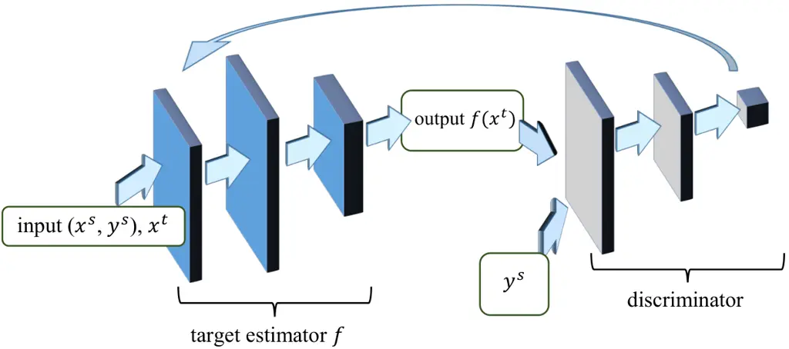
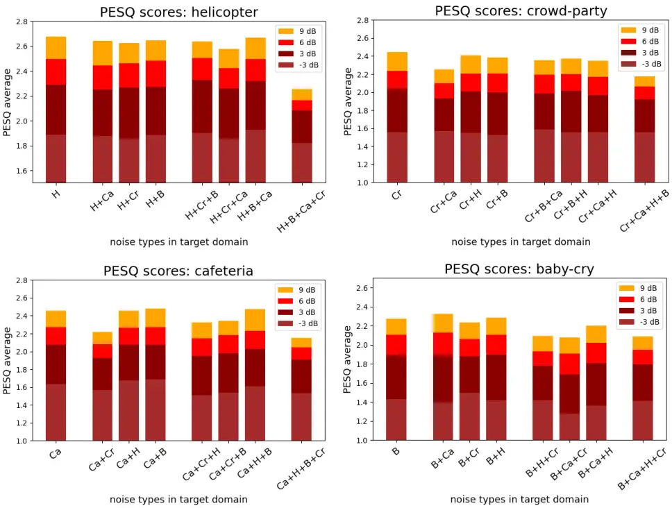
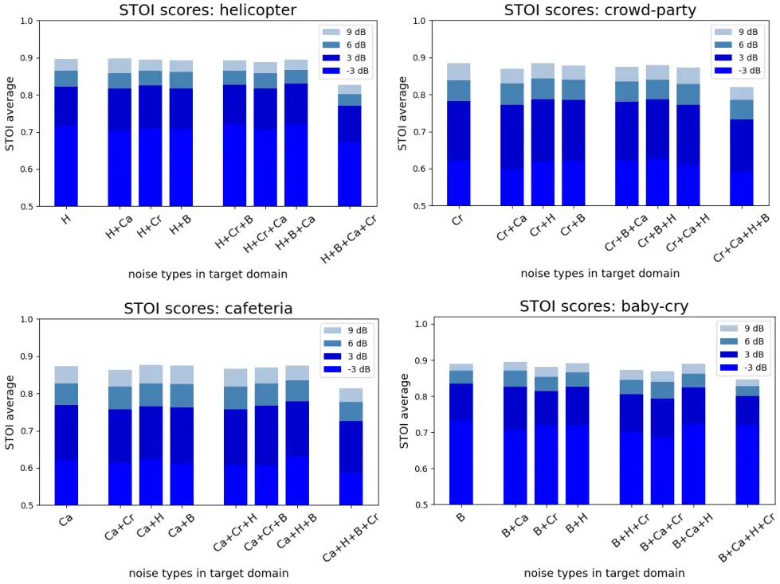

# Unsupervised Noise Adaptive Speech Enhancement by Discriminator-Constrained Optimal Transport

Hsin-Yi Lin Affiliation: The Cooperative Institute for Research in
Environmental Sciences (CIRES) Affiliation: University of Colorado,
Boulder, CO, 80309, USA Affiliation: NOAA Physical Sciences Laboratory,
Boulder, CO, 80305, USA Email: [hylin@colorado.edu](mailto:)   
Huan-Hsin Tseng Affiliation: Research Center for Information Technology
Innovation Affiliation: Academia Sinica, Taiwan
Email: [htseng@citi.sinica.edu.tw](mailto:)    Xugang Lu
Affiliation: National Institute of Information and Communications
Technology (NICT), Japan Email: [xugang.lu@nict.go.jp](mailto:)   
Yu Tsao Affiliation: Research Center for Information Technology
Innovation Affiliation: Academia Sinica, Taiwan
Email: [yu.tsao@citi.sinica.edu.tw](mailto:)

###### Abstract

This paper presents a novel discriminator-constrained optimal transport
network (DOTN) that performs unsupervised domain adaptation for speech
enhancement (SE), which is an essential regression task in speech
processing. The DOTN aims to estimate clean references of noisy speech
in a target domain, by exploiting the knowledge available from the
source domain. The domain shift between training and testing data has
been reported to be an obstacle to learning problems in diverse fields.
Although rich literature exists on unsupervised domain adaptation for
classification, the methods proposed, especially in regressions, remain
scarce and often depend on additional information regarding the input
data. The proposed DOTN approach tactically fuses the optimal transport
(OT) theory from mathematical analysis with generative adversarial
frameworks, to help evaluate continuous labels in the target domain. The
experimental results on two SE tasks demonstrate that by extending the
classical OT formulation, our proposed DOTN outperforms previous
adversarial domain adaptation frameworks in a purely unsupervised
manner.

## 1 Introduction

The goal of speech enhancement (SE) is to convert low-quality speech
signals to ones with improved quality and intelligibility. SE serves as
an important regression task in the speech-processing field and has been
widely used for a pre-processor in speech-related applications, such as
speech coding \[1\], automatic speech recognition (ASR) \[2\], speaker
recognition \[3\], and assistive hearing devices \[4, 5\]. Recent
advances in machine learning have made significant progress to the SE
technology. Generally, learning-based SE approaches estimate a
transformation to characterize the mapping function from noisy to clean
speech signals in the training phase \[6\]. The estimated transformation
converts noisy speech signals to generate clean-like signals in the
testing phase. Various neural network models have been used to
characterize noisy-to-clean transformations. Well-known examples of such
models include fully connected neural network \[7\], deep denoising
autoencoder \[8\], convolutional neural network \[9\], long-short-term
memory \[10\], and Transformer \[11\]. To effectively handle diverse
noisy conditions, we usually prepare a considerable amount of training
data that cover various noise types to train SE models. However in
real-application scenarios, the noise types in the testing data may not
always be involved in the training set. Consequently, the noisy-to-clean
transformation learned from the training data cannot be suitably applied
to handle the testing noise, resulting in limited enhancement
performance. This training-testing mismatch is generally called a domain
mismatch issue for SE. An effective solution is required to perform
domain adaptation to adjust the SE models with formulating a precise
noisy-to-clean transformation that matches the testing conditions. Most
existing domain adaptation methods rely on at least one of the following
adaptation mechanisms: aligning domain-invariant features \[12, 13, 14\]
and adversarial training, where a discriminator is introduced during
training as a domain classifier \[15, 16, 17\].

This study aims to solve the unsupervised domain adaptation problem for
SE by introducing optimal transport (OT). In particular, we consider the
circumstance where SE is tested on a target domain with completely
unlabeled data, and only labeled data from the source domain is
available for reference. Generally speaking, OT theory compares two
(probability) distributions and considers all possible transportation
plans in between to find one with a minimal displacement cost. The
concept of OT can be applied to minimize domain mismatch and
consequently achieve unsupervised domain adaptation. Even with the
mathematical characteristics offered by OT, obstacles to excellent SE
performance persist due to the complex structure possessed by human
speech. To further overcome the obstacles, another concept from
Generative Adversarial Network (GAN) is integrated to assist attaining
sophisticated SE domain adaptation. Although an existing domain
transition technique “domain adversarial training” and our proposal
share similarity in names, the fundamental constructions are
substantially different. A key element in our method lies in a
discriminator utilized to examine speech output characteristics, instead
of a domain classifier. More precisely, the discriminator in our method
was employed to govern the output speech quality by learning the
probability distribution of the source labels. This novel approach was
designed especially for the unsupervised SE domain adaptation to exhibit
excellent performance, which was verified on the VoiceBank and TIMIT
datasets.

#### Contributions

We proposed a novel method designed specifically for unsupervised domain
adaptation in a regression setting. This area of study still has very
limited results; moreover, the existing methods often require additional
classification of source domains or may not yet be supported by strong
regression applications. Conversely, our approach does not require any
additional input information other than the source samples, source
labels, and target samples. Our approach was applied to two standardized
SE tasks, namely VoiceBank-DEMAND and TIMIT, and achieved superior
adaptation performance in terms of both Perceptual Evaluation of Speech
Quality (PESQ) and Short-Time Objective Intelligibility (STOI) scores.
Furthermore, owing to the simple input requirements, we can easily
investigate the effect of target sample complexity on our method by
increasing the number of noise types allowed in the target domain, which
has not been reported by previous literature to the best of our
knowledge.

## 2 Related work

#### Adversarial domain adaptation:

The main objective of Domain Adversarial Training (DAT) is to train a
deep model (from the source domain) capable of adapting to other similar
domains by leveraging a considerable amount of unlabeled data from the
target domain \[15, 18\]. A conventional DAT system consists of three
parts, deep feature extractor, label predictor, and domain classifier.
By using a gradient reversal layer, the extracted deep features are
discriminative for the main learning task and invariant with shifts
between the source and target domains. The DAT approach has been applied
and confirmed to effectively compensate for the mismatch of source
(training time) and target (testing time) conditions in numerous tasks,
such as speech signal processing \[19, 20\], image processing \[15,
21\], and wearable sensor signal processing \[22\]. A later development
in Multisource Domain Adversarial Networks (MDAN) \[23\] extended the
original DAT to lift the constraint of single domain transition,
utilizing multiple domain classifiers to extract discriminative deep
features for the main learning task while being invariant to multiple
domain shifts \[3, 24\].

#### Optimal transport for domain adaptation:

Hitherto, OT  \[25, 26\] has been utilized to domain adaptation \[27,
28\] with related analytical results \[29\]. Furthermore, the concepts
of OT have proved itself even more useful under a joint distribution
framework \[30, 31\]. More recently, to improve the sensitivity of OT to
outliers, Robust OT was proposed \[32\]. Moreover, a method for
combining the notion of adversarial domain adaptation with OT and margin
separation has been proposed \[33\]. However, almost all experiments
performed in these studies were classification problems, unlike the SE
task that is the focus of our study.

#### Domain adaptation in speech enhancement:

Existing domain adaptation in SE approaches can be divided into two
categories: supervised and unsupervised. For supervised domain
adaptation, paired noisy and clean speech signals for the testing
conditions are available to adjust the parameters in the SE models.
In \[34, 35\], transfer-learning-based approaches have been proposed to
adapt SE models to alleviate corpus mismatches. To combat the
catastrophic forgetting issue, Lee et al., proposed a SERIL algorithm
that combines curvature-based regularization and path optimization
augmenting strategies when preforming domain adaptation on SE
models \[36\]. Conversely, for unsupervised domain adaptation, only
noisy speech signals are provided, and the corresponding clean
counterparts are not accessible. Generally, unsupervised domain
adaptation has good applicability to real-world scenarios. In \[37\],
unsupervised domain adaptation for SE was performed by minimizing the
Kullback-Leibler divergence between posterior probabilities produced by
teacher and student senone classifiers without paired noisy-clean
adaptation data. In \[19, 38\], the DAT approach was used to adapt SE
models to new noisy conditions.

Despite yielding promising performance, the existing unsupervised domain
adaptation approaches require additional information, such as word
labels, language models, and noise-type labels. In this paper, we
propose a new approach: discriminator-constrained OT network (DOTN) to
perform unsupervised domain adaptation on SE. In contrast to related
works, DOTN does not require additional label information when adapting
the original SE models to match new noisy conditions. Our experiments
show that DOTN can effectively adapt the SE models to new testing
conditions, and that it achieves better adaptation performance than
previous adversarial domain adaptation methods, which require additional
noise type information.

## 3 Method

### 3.1 Problem setting and notation

Consider a source domain with paired data
$`(\mathbf{X}^{s},\mathbf{Y}^{s})=\left\{(\mathbf{x}^{s}_{i},\mathbf{y}^{s}_{i})\right\}_{i=1}^{N_{s}}`$,
where $`\mathbf{x}^{s}_{i}\in\mathbb{R}^{n}`$,
$`\mathbf{y}^{s}_{i}\in\mathbb{R}^{m}`$ stand for the input and the
corresponding label of sample $`i`$. The unsupervised domain adaptation
assumes that another target domain exists containing only data
unlabeled,
$`\mathbf{X}^{t}=\left\{\mathbf{x}^{t}_{i}\in\mathbb{R}^{n}\right\}_{i=1}^{N_{s}}`$
. The goal is to seek a ground truth estimator (or statistical
hypothesis) $`f:\mathbb{R}^{n}\to\mathbb{R}^{m}`$ for the target labels
$`\mathbf{Y}^{t}=\left\{\mathbf{y}^{t}_{i}\right\}_{i=1}^{N_{t}}`$
(exist but not known), based on the knowledge provided by the source
domain.

The probability distribution of a dataset $`\mathcal{D}`$ is denoted by
$`\mathbb{P}_{\mathcal{D}}`$, where $`\mathcal{D}`$ is either
$`\mathbf{X}^{s}`$, $`\mathbf{Y}^{s}`$, $`\mathbf{X}^{t}`$ or
$`\mathbf{Y}^{t}`$ in our discussion. Our problem is to find a function
$`f`$ such that $`f`$ induces a probability distribution
$`\mathbb{P}_{f(\mathbf{X}^{t})}`$ in $`\mathbf{Y}^{t}`$ with
$`\mathbb{P}_{f(\mathbf{X}^{t})}\rightarrow\mathbb{P}_{\mathbf{Y}^{t}}`$
under certain measure. We propose using the concept of OT to solve this
problem.

### 3.2 Proposed model: Discriminator-Constrained Optimal Transport Network (DOTN)

Given a pair of distributions $`\mathbb{P}_{\mathcal{D}_{1}}`$ and
$`\mathbb{P}_{\mathcal{D}_{2}}`$ and a displacement cost matrix
$`C\geq 0`$, OT solves for the transportation plan
$`\gamma\in\prod(\mathbb{P}_{\mathcal{D}_{1}},\mathbb{P}_{\mathcal{D}_{2}})`$
that minimizes the total cost (in a discrete setting)

```math
\min_{\gamma\in\prod(\mathbb{P}_{\mathcal{D}_{1}},\mathbb{P}_{\mathcal{D}_{2}})}\langle C,\gamma\rangle_{F}, \tag{1}
```

where
$`\prod(\mathbb{P}_{\mathcal{D}_{1}},\mathbb{P}_{\mathcal{D}_{2}})`$
denotes the space of joint distributions with marginal
$`\mathbb{P}_{\mathcal{D}_{1}}`$ and $`\mathbb{P}_{\mathcal{D}_{1}}`$.
$`\langle\cdot,\,\cdot\rangle_{F}`$ is the Frobenius product, and the
entry $`C_{ij}`$ of $`C`$ represents the displacement cost of the
$`i^{th}`$ and $`j^{th}`$ samples. It can be proven that the minimum of
this problem is a distance and called the Wasserstein distance when the
corresponding cost is a norm \[25, 26\].

Our proposed method consists of two parts: OT alignment and Wasserstein
Generative Adversarial Network (WGAN) training \[39, 40\]. Both steps
are based on OT; however, they are considered with two different pairs
of distributions and employ different algorithms.

#### Adaptation by Joint Distribution Optimal Transport

Our adaptation mechanism relies on the alignment between the joint
distributions of source and target domains (for the target domain, the
label is estimated label). In particular, we approximate $`f`$ by
minimizing the OT loss between the joint distributions
$`\mathbb{P}_{\mathbf{X}^{s}}\times\mathbb{P}_{\mathbf{Y}^{s}}`$ and
$`\mathbb{P}_{\mathbf{X}^{t}}\times\mathbb{P}_{f(\mathbf{X}^{t})}`$,
with a chosen cost matrix,

```math
C_{ij}=\alpha\,\|\mathbf{x}^{s}_{i}-\mathbf{x}^{t}_{j}\|^{2}+\beta\,\|\mathbf{y}^{s}_{i}-f(\mathbf{x}^{t}_{j})\|^{2},\quad\qquad(\alpha,\beta>0) \tag{2}
```

By aligning the joint distributions of the source and target domains,
noise adaptation is naturally achieved as OT seeks the source sample
that is the most “similar” for each target sample.

Although the OT provides accurate estimates for each sample, the effect
of each estimation error could accumulate in the training process and
mislead $`f`$ to a convenient local minimum without preserving the
speech data structure. To avoid this situation, we employ Wasserstein
Generative Adversarial Network (WGAN) training to complement and enhance
our adaptation system.

#### Discriminative training on outputs and source labels

Distinct from the adaptation where we consider the joint distributions
of the inputs and labels, we focus on WGAN training for the source label
distribution $`\mathbb{P}_{\mathbf{Y}^{s}}`$ and output distribution
$`\mathbb{P}_{f(\mathbf{X}^{t})}`$. In the terminology of generative
adversarial training, we consider $`f`$ a generator and introduce a
convolutional neural network-based discriminator, $`h`$, as the
’critic’. In general, we use the discriminator to decide whether the
outputs of $`f`$ are ’similar’ to the source labels. Formally, the WGAN
algorithm solves

```math
\min_{f}\max_{h\in\mathcal{L}}\Big\{\mathbb{E}_{y\sim\mathbb{P}_{\mathbf{Y}^{s}}}(h(y))-\mathbb{E}_{x\sim\mathbb{P}_{\mathbf{X}^{t}}}(h(f(x)))\Big\} \tag{3}
```

by Kantorovich-Rubinstein duality \[25\], where $`\mathcal{L}`$ is the
set of 1-Lipschitz functions. In this case, under an optimal
discriminator minimizing the value function with respect to the
generator parameters minimizes the Wasserstein distance between the
distributions $`\mathbb{P}_{\mathbf{Y}^{s}}`$ and
$`\mathbb{P}_{f(\mathbf{X}^{t})}`$.

This discriminative training complements our alignment and provides
additional constraints from the explicit relation between the source
labels and estimations of target labels. These constraints support the
joint distribution alignment and provides further guidance in the
gradient descent training process. The performance of the experiments is
considerably improved when our discriminative training supports the
joint distribution alignment.

### 3.3 Loss functions and the proposed algorithm

Our domain alignment can be achieved by solving the following
optimization problem:

```math
\min_{\gamma,f}\mathcal{L}_{1}+\mathcal{L}_{2}=\min_{\gamma,f}\frac{1}{N^{s}}\sum_{i}\|\mathbf{y}_{i}^{s}-f(\mathbf{x}_{i}^{s})\|^{2}+\sum_{i,j}\gamma_{ij}\Big(\alpha\,\|\mathbf{x}^{s}_{i}-\mathbf{x}^{t}_{j}\|^{2}+\beta\,\|\mathbf{y}^{s}_{i}-f(\mathbf{x}^{t}_{j})\|^{2}\Big), \tag{4}
```

where $`\alpha,\beta>0`$ are the parameters chosen for balance. Notably,
the first term emphasizes the knowledge from the source domain is not to
be forgotten during training, which has been revealed in several works
 \[31, 41, 42\]. Without this emphasis, the source domain knowledge
cannot be well-maintained, and thus the overall performance may degrade.
Such phenomenon was also observed in the SE experiments. The second term
is intended for domain alignment. To show some intuitions, consider the
ideal case where Eq. (4) is completely minimized to zero, which leads to

```math
\|\mathbf{x}^{s}_{i}-\mathbf{x}^{t}_{j}\|^{2}\equiv 0\,\,\mbox{and}\,\,\|\mathbf{y}^{s}_{i}-f(\mathbf{x}^{t}_{j})\|^{2}\equiv 0\quad\Rightarrow\quad\mathbf{x}^{s}_{i}=\mathbf{x}^{t}_{j}\,\,\mbox{and}\,\,\mathbf{y}^{s}_{i}=f(\mathbf{x}^{t}_{j}) \tag{5}
```

for all $`i,j`$. This indicates that for each given target domain sample
$`\mathbf{x}^{t}_{j}`$, an identical sample $`\mathbf{x}^{s}_{i}`$ from
the source domain is found, and the unknown target label is then
constructed by the corresponding source label. Even though practically
the ideal case of zero loss is unlikely to happen, the OT loss aims to
search for the most “similar” correspondence, which entails the
intuition of domain alignment for Eq. (4). From this point of view, it
is noted that although the term
$`\|\mathbf{x}^{s}_{i}-\mathbf{x}^{t}_{j}\|`$ in $`C_{ij}`$ (in Eq. (2))
is not directly related to the network backpropagations of $`f`$ and
$`h`$, it may not be ignored as the discard of this term will result in
a wrong transportation plan $`\gamma_{ij}`$ and eventually lead to an
undesired alignment.

For discriminative training, the discriminator $`h`$ is trained by the
discriminator loss function
$`\mathcal{L}_{h}=\frac{1}{m}\sum_{i=1}^{m}h(\mathbf{y}_{i}^{s})-h(f(\mathbf{x}^{t}_{i})),`$
and $`f`$ follows the generator loss function
$`\mathcal{L}_{f}=-\frac{1}{m}\sum_{i=1}^{m}h(f(\mathbf{x}^{t}_{i}))`$
where $`m`$ is the batch size. As there are multiple sets of parameters
$`\gamma`$, $`h`$ and $`f`$ in our framework, one set of parameters is
updated each time, while the other sets of parameters are fixed.



Figure 1: DOTN network structure.

1: $`\mathbf{x}^{s}`$, source domain inputs. $`\mathbf{y}^{s}`$, source
domain labels. $`\mathbf{x}^{t}`$, target domain inputs. $`c`$, the
clipping parameter. $`m`$, the batch size. $`n_{f},n_{h},n_{s}`$: number
of iterations of OT per generator training, discriminator training, and
source domain training, respectively. $`n`$, number of iterations.

2: $`\theta_{f}`$, initial parameters of estimator $`f`$.
$`\theta_{h}`$, initial parameters of discriminator $`h`$.

3: for each batch of source samples $`(\mathbf{x}^{s},\mathbf{y}^{s})`$
and target samples $`(\mathbf{y}^{t})`$ do

4:   fix $`\theta_{f}`$, solve for $`\gamma`$ in Eq. (4) by OT.

5:   fix $`\gamma`$,
$`\theta_{f}\leftarrow`$Adam$`(\nabla_{\theta_{f}}\mathcal{L}_{2},\theta_{f},\theta_{h})`$.

6:   if $`n`$ mod $`n_{s}==0`$ then

7:
   $`\theta_{f}\leftarrow`$Adam$`(\nabla_{\theta_{f}}\mathcal{L}_{1},\theta_{f},\theta_{h})`$.

8:   end if

9:   if $`n`$ mod $`n_{f}==0`$ then

10:
   $`\theta_{f}\leftarrow`$Adam$`(\nabla_{\theta_{f}}\mathcal{L}_{f},\theta_{f},\theta_{h})`$.

11:   end if

12:   if $`n`$ mod $`n_{h}==0`$ then

13:
   $`\theta_{h}\leftarrow`$Adam$`(\nabla_{\theta_{h}}\mathcal{L}_{h},\theta_{f},\theta_{h})`$.

14:    $`\theta_{h}\leftarrow`$clip$`(\theta_{h},-c,c).`$

15:   end if

16: end for

Algorithm 1 DOTN, proposed algorithm

## 4 Experiments

We evaluated our method in SE on two datasets: Voice Bank corpus \[43\]
and TIMIT \[44\]. Although there is abundant literature on unsupervised
domain adaptation, very limited methods have been successfully applied
to SE or regression problems. Closely relevant methods often require
additional input structures or domain label. Unlike previous methods,
our approach does not rely on additional data information. Nevertheless,
we compared our results with two most relevant adversarial domain
adaptation methods: DAT \[19\] and MDAN \[23\]. The original MDAN was
designed for classification problems and cannot be directly applied on
SE. Preserving the fundamental ideas, we modified the MDAN structure for
regressions, so that SE experiments can be performed for comparison. The
implementations are summarized in the supplementary material and codes
are available on Github¹¹ 1
[https://github.com/hsinyilin19/Discriminator-Constrained-Optimal-Transport-Network](https://github.com/hsinyilin19/Discriminator-Constrained-Optimal-Transport-Network)
.

### 4.1 Comparisons to DAT and MDAN

As both DAT²² 2 DAT consists of three components, a deep feature
extractor $`\mathcal{E}:\mathcal{X}\to\mathcal{Z}`$, a (task) label
predictor $`F_{Y}:\mathcal{Z}\to\mathcal{Y}`$, and a domain classifier
$`F_{D}:\mathcal{Z}\to\mathcal{K}`$, to form two functional pairs:
$`F_{D}\circ\mathcal{E}`$ and $`F_{Y}\circ\mathcal{E}`$. Here
$`\mathcal{X}`$, $`\mathcal{Y}`$ are the input space and (task) label
space respectively. $`\mathcal{Z}`$ denotes the invariant (latent)
feature space; $`\mathcal{K}=\{0:\mbox{source},1:\mbox{target}\}`$ as
the domain label classes. The pair
$`F_{D}\circ\mathcal{E}:\mathcal{X}\to\mathcal{K}`$ formed by $`F_{D}`$,
$`\mathcal{E}`$ works against each other, by a Gradient Reversal Layer,
to derive domain invariant features in $`\mathcal{Z}`$. Another pair
$`F_{Y}\circ\mathcal{E}:\mathcal{X}\to\mathcal{Y}`$ demands that the
invariant features in $`\mathcal{Z}`$ encode sufficient information for
(main task) label classifications at the same time. Via adversarial
training, the two pairs eventually reach a balance completing the main
learning task as well as eliminating the domain mismatch. and MDAN³³ 3
MDAN inherits the DAT architecture with an extension to $`K`$ source
domains and $`K`$ domain classifiers
$`F_{D_{i}}:\mathcal{Z}\to\{0,1\}`$, $`i=1,\ldots K`$ with similar
adversarial training applied. utilize a domain classifier to derive
domain invariant features, domain labels become essential in their
adaptation mechanism. Thus, both these methods are considered weakly
supervised. Specifically, they request inputs of the form
$`\left\{\mathbf{x}_{i}^{s},\mathbf{y}^{s}_{i},c_{i}\right\}_{i}`$ and
$`\left\{\mathbf{x}_{j}^{t},c_{j}\right\}_{j}`$ with
$`c_{i},c_{j}\in\mathcal{K}`$, where $`\mathcal{K}`$ is an index set
specifying the origin of data domains. For DAT, $`\mathcal{K}=\{0,1\}`$
to indicate whether a sample belongs to the source or target domain,
while for MDAN $`\mathcal{K}=\{0,1,\ldots,K\}`$ to indicate that there
are $`K`$ distinct source domains and one target domain. The requirement
on domain labels poses restrictions in certain circumstances, such as a
new target sample may not always fall into any existing categories, or
the data origin is simply unknown. In contrast, the proposed method DOTN
is not bounded by specifications of data origin and simply receives
inputs of the form
$`\left\{\mathbf{x}_{i}^{s},\mathbf{y}^{s}_{i},\mathbf{x}_{j}^{t}\right\}_{i,j}`$.
With less input requirement, DOTN is more flexible to be applied in
various scenarios, more approachable to real-world applications.

### 4.2 Voice Bank with DEMAND noise database

#### Dataset

In the first set of experiments, the pre-selected subset of Voice Bank
provided by \[45\] was used to test the proposed DOTN. For source domain
data, 14 male speakers and 14 female speakers were randomly selected out
of totally 84 speakers (42 male and 42 female), and each speaker
pronounced around 400 sentences. As a result, the clean data in source
domain contained 5,724 male utterances and 5,848 female utterances,
amounting to 11,572 utterances in total. We then mixed the 11,572 clean
utterances with noise from DEMAND \[46\], in transportation category:
“Bus”, “Car”, “Metro” at 7 Signal-to-noise ratio (SNR) levels (-9, -6,
-3, 0, 3, 6, and 9 dB). Accordingly, for this set of source domain data,
both noisy speech signals and the corresponding clean references are
prepared.

A target domain data contained $`5,768`$ noisy utterances mixed by 824
clean ones from two random speakers (1 male, 1 female) (followed the
design in  \[47\]) with one of the three noise types from DEMAND, in
STREET category: “Traffic”, “Cafe”, or “Public square” and 7 SNR ratios
(-9, -6, -3, 0, 3, 6, and 9 dB). No clean labels were given under target
domain. That is, for the target domain data, only noisy speech signals
are provided and the corresponding clean references are not accessible.

All source samples (both noisy utterances and the corresponding clean
references, prepared from the three transportation noise types) and the
target samples (only noisy utterances without the corresponding clean
references, prepared from the one street noise type) were included in
our training set. We conducted the experiments under single-target
noise-type circumstances and compared the results with DAT and MDAN.
More specifically, we ran this setting for all three cases, where the
target domain contained either cafe, public square, or traffic noise.

#### Results

Table 1 and Table 2 list the PESQ and STOI scores, respectively, of DAT,
MDAN and DOTN under three noise types at 7 SNR levels. “Avg” denotes the
averaged scores over 7 SNR levels. From the PESQ scores reported in
Table 1, we note that the proposed DOTN outperforms both DAT and MDAN
consistently over different noise types and SNR levels, except for the
Cafe noise type at -9 dB SNR. This might be owning to a potential
limitation of DOTN, which will be detailed in the next section. Next,
from Table 2, we note that STOI scores show very similar trends to that
of PESQ scores, as listed in Table 1.

| noise type    | Traffic    |             |       | Cafe  |       |       | Public square |       |       |
| ------------- | ---------- | ----------- | ----- | ----- | ----- | ----- | ------------- | ----- | ----- |
| SNR(dB)/model | DAT \[19\] | MDAN \[23\] | DOTN  | DAT   | MDAN  | DOTN  | DAT           | MDAN  | DOTN  |
| -9            | 1.307      | 1.670       | 1.863 | 1.058 | 1.539 | 1.497 | 1.436         | 1.929 | 2.037 |
| -6            | 1.446      | 1.920       | 2.182 | 1.184 | 1.735 | 1.853 | 1.655         | 2.119 | 2.258 |
| -3            | 1.718      | 2.153       | 2.395 | 1.362 | 1.949 | 2.089 | 1.939         | 2.318 | 2.439 |
| 0             | 2.081      | 2.366       | 2.591 | 1.599 | 2.153 | 2.332 | 2.268         | 2.512 | 2.601 |
| 3             | 2.381      | 2.535       | 2.740 | 1.865 | 2.345 | 2.490 | 2.575         | 2.670 | 2.761 |
| 6             | 2.712      | 2.708       | 2.888 | 2.189 | 2.534 | 2.661 | 2.867         | 2.824 | 2.889 |
| 9             | 3.016      | 2.854       | 3.015 | 2.493 | 2.695 | 2.783 | 3.120         | 2.966 | 3.057 |
| Avg           | 2.094      | 2.315       | 2.525 | 1.679 | 2.136 | 2.244 | 2.266         | 2.477 | 2.577 |

Table 1: PESQ scores for VoiceBank-DEMAND

| noise type    | Traffic    |             |       | Cafe  |       |       | Public square |       |       |
| ------------- | ---------- | ----------- | ----- | ----- | ----- | ----- | ------------- | ----- | ----- |
| SNR(dB)/model | DAT \[19\] | MDAN \[23\] | DOTN  | DAT   | MDAN  | DOTN  | DAT           | MDAN  | DOTN  |
| -9            | 0.584      | 0.708       | 0.721 | 0.557 | 0.643 | 0.633 | 0.667         | 0.747 | 0.765 |
| -6            | 0.659      | 0.761       | 0.790 | 0.616 | 0.702 | 0.723 | 0.725         | 0.792 | 0.815 |
| -3            | 0.728      | 0.810       | 0.833 | 0.687 | 0.760 | 0.779 | 0.771         | 0.830 | 0.850 |
| 0             | 0.785      | 0.849       | 0.871 | 0.741 | 0.805 | 0.831 | 0.815         | 0.859 | 0.877 |
| 3             | 0.824      | 0.874       | 0.894 | 0.785 | 0.842 | 0.861 | 0.845         | 0.881 | 0.900 |
| 6             | 0.860      | 0.896       | 0.914 | 0.825 | 0.871 | 0.887 | 0.872         | 0.898 | 0.915 |
| 9             | 0.885      | 0.910       | 0.927 | 0.854 | 0.893 | 0.905 | 0.893         | 0.914 | 0.931 |
| Avg           | 0.761      | 0.830       | 0.850 | 0.724 | 0.788 | 0.803 | 0.798         | 0.846 | 0.865 |

Table 2: STOI scores for VoiceBank-DEMAND

### 4.3 TIMIT

#### Dataset

For the second part of experiments, TIMIT was used to prepare the source
and target samples. The clean speech of the source domain
$`\{\mathbf{y}^{s}_{i}\}_{i=1}^{N_{s}}`$ for training consists of
utterances, contributed by 48 male speakers and 24 female speakers from
8 dialect regions. Each speaker had 8 sentences, including 5 SX
(phonetically compact sentences) and 3 SI (phonetically diverse
sentences), according to the official suggestion of TIMIT. The number of
the speakers selected was to maintain the balance of the original data.

The above clean utterances were used to mix with 5 stationary noise
types (Car, Engine, Pink, Wind, and Cabin) at 9 SNR levels (-12, -9, -6,
-3, 0, 3, 6, 9, and 12 dB), amounting to 25,920 noisy utterances, to be
the noisy speech of the source domain
$`\{\mathbf{x}^{s}_{i}\}_{i=1}^{N_{s}}`$ with $`N_{s}=25,920`$.

For the target domain, a total of 24 speakers suggested by TIMIT core
test set was all used to have 192 clean utterances for the target domain
$`\mathbf{y}^{t}_{i}`$, which were subsequently mingled with one of the
four non-stationary noise types: “Helicopter”, “Cafeteria”, “Baby-cry”,
or “Crowd-party” under 7 SNRs (-9, -6, -3, 0, 3, 6, and 9 dB) as target
inputs $`\{\mathbf{x}^{t}_{i}\}_{i=1}^{N_{t}}`$ with $`N_{t}=1,344`$.
The choice of noise types for the source and target domain was to let
the learning algorithms adapt from distinguished environments in the
real-world.

#### Results

Table 3 lists the PESQ and STOI scores of the DAT, MDAN, and DOTN under
four noise types at seven SNR levels. From the table, we first note that
DOTN consistently outperforms DAT and MDAN in terms of both “Avg” PESQ
and STOI scores among the four noise types. With a more careful
investigation, the DOTN achieves higher PESQ and STOI scores over DAT
and MDAN for all SNR conditions in the Helicopter noise. For the
Crowd-party and Cafeteria noises, DOTN outperforms DAT and MDAN in most
higher SNR conditions for both PESQ and STOI scores. However, for the
Baby-cry noise, DOTN outperforms DAT and MDAN in STOI but underperforms
MDAN in PESQ. Note that Cafeteria, Crowd-party, and Baby-cry noise types
involved clear human speech components, which may cause confusions when
DOTN tries to retrieve the target speech (clean reference). Thus, DOTN
yields sub-optimal performance when dealing with these noise types,
especially under very low SNR conditions, where background speech
components might overwhelm the target speech. Nevertheless, the overall
average PESQ and STOI scores of DOTN (P=1.838; Q=0.7238) are still
higher than that of DAT (P=1.5728; Q=0.6298) and MDAN (P=1.8001;
Q=0.7038), where P and Q denote the PESQ and STOI scores, respectively,
over the 4 noise types and 9 SNR levels. Please also note that DAT and
MDAN require additional domain label information \[19\] while DOTN
performs domain adaptation in a purely unsupervised manner.

To show the advantages and flexibility of DOTN, we further explored and
applied DOTN to the circumstances when multiple noise types are included
in the target domain. Fig 2 and Fig 3, respectively, present the PESQ
and STOI results over four SNR levels on multiple target noise types;
here H, Ca, Cr, and B denote Helicopter, Cafeteria, Crowd-party, and
Baby-cry noise types, respectively. In Fig 2, when the testing noise is
“Helicopter”, the PESQ scores of using two noise types (H+Ca, H+Cr, H+B)
and three noise types (H+Cr+B, H+Cr+Ca, H+B+Ca) are comparable. Further,
the PESQ scores of these six systems are also comparable to that of
using one noise type (H). The results confirmed that the DOTN has minor
effects on catastrophic forgetting, which is a common issue in domain
adaptation approaches \[48, 49\]. In the case of 4 noise types (the
system sequentially learned Helicopter, Baby-cry, Cafeteria, and
Crowd-party noise types and was tested on the Helicopter noise), the
achieved performance drops moderately. We observe very similar trends
for the other three noise types (baby-cry, cafeteria, and crowd-party)
in Fig 2.

From Fig 3, similar trends as those from Fig 2 are observed: (1) The
seven results using 1, 2, and 3 noise types are comparable, thereby
confirming that the DOTN has minor effects on catastrophic forgetting.
(2) When there are 4 noise types for sequential learning, the achievable
STOI scores start to decrease.

| noise type | Helicopter |       |             |       |       |       | Crowd-party |       |       |       |       |       |
| ---------- | ---------- | ----- | ----------- | ----- | ----- | ----- | ----------- | ----- | ----- | ----- | ----- | ----- |
| model      | DAT \[19\] |       | MDAN \[23\] |       | DOTN  |       | DAT         |       | MDAN  |       | DOTN  |       |
| SNR(dB)    | PESQ       | STOI  | PESQ        | STOI  | PESQ  | STOI  | PESQ        | STOI  | PESQ  | STOI  | PESQ  | STOI  |
| -9         | 1.031      | 0.392 | 1.252       | 0.517 | 1.455 | 0.577 | 1.483       | 0.544 | 1.150 | 0.440 | 1.056 | 0.451 |
| -6         | 1.015      | 0.431 | 1.443       | 0.594 | 1.669 | 0.649 | 1.484       | 0.560 | 1.356 | 0.516 | 1.302 | 0.538 |
| -3         | 1.094      | 0.497 | 1.664       | 0.670 | 1.890 | 0.716 | 1.528       | 0.592 | 1.560 | 0.600 | 1.559 | 0.621 |
| 0          | 1.268      | 0.566 | 1.902       | 0.742 | 2.104 | 0.775 | 1.596       | 0.636 | 1.776 | 0.684 | 1.816 | 0.709 |
| 3          | 1.518      | 0.637 | 2.134       | 0.801 | 2.289 | 0.822 | 1.736       | 0.690 | 1.986 | 0.762 | 2.042 | 0.782 |
| 6          | 1.779      | 0.701 | 2.363       | 0.849 | 2.497 | 0.865 | 1.953       | 0.750 | 2.179 | 0.823 | 2.236 | 0.838 |
| 9          | 2.094      | 0.759 | 2.563       | 0.884 | 2.677 | 0.895 | 2.200       | 0.801 | 2.355 | 0.865 | 2.447 | 0.885 |
| Avg        | 1.400      | 0.569 | 1.903       | 0.722 | 2.083 | 0.757 | 1.711       | 0.653 | 1.766 | 0.670 | 1.780 | 0.690 |
| noise type | Cafeteria  |       |             |       |       |       | Baby-cry    |       |       |       |       |       |
| model      | DAT        |       | MDAN        |       | DOTN  |       | DAT         |       | MDAN  |       | DOTN  |       |
| SNR(dB)    | PESQ       | STOI  | PESQ        | STOI  | PESQ  | STOI  | PESQ        | STOI  | PESQ  | STOI  | PESQ  | STOI  |
| -9         | 1.196      | 0.440 | 1.248       | 0.471 | 1.185 | 0.436 | 1.109       | 0.580 | 1.116 | 0.561 | 0.984 | 0.597 |
| -6         | 1.206      | 0.471 | 1.395       | 0.535 | 1.419 | 0.528 | 1.313       | 0.630 | 1.313 | 0.636 | 1.180 | 0.668 |
| -3         | 1.244      | 0.519 | 1.608       | 0.614 | 1.631 | 0.620 | 1.495       | 0.665 | 1.500 | 0.699 | 1.431 | 0.732 |
| 0          | 1.408      | 0.579 | 1.827       | 0.692 | 1.859 | 0.699 | 1.621       | 0.707 | 1.734 | 0.768 | 1.665 | 0.789 |
| 3          | 1.631      | 0.651 | 2.031       | 0.764 | 2.075 | 0.769 | 1.801       | 0.746 | 1.909 | 0.809 | 1.889 | 0.835 |
| 6          | 1.915      | 0.719 | 2.244       | 0.822 | 2.271 | 0.826 | 1.973       | 0.782 | 2.112 | 0.849 | 2.105 | 0.871 |
| 9          | 2.216      | 0.782 | 2.422       | 0.864 | 2.458 | 0.873 | 2.133       | 0.814 | 2.274 | 0.880 | 2.277 | 0.890 |
| Avg        | 1.545      | 0.594 | 1.825       | 0.680 | 1.843 | 0.679 | 1.635       | 0.703 | 1.708 | 0.743 | 1.647 | 0.769 |

Table 3: TIMIT results



Figure 2: Comparisons in PESQ average for cases with multiple noise
types in target domain, where H, Ca, Cr, and B denote Helicopter,
Cafeteria, Crowd-party, and Baby-cry noise types.



Figure 3: Comparisons in STOI average for cases with multiple noise
types in target domain.

## 5 Conclusion

In this study, we proposed a novel DOTN method, which was designed
specifically for unsupervised domain adaptation in regression setting.
Our approach skillfully fuses OT and generative adversarial frameworks
to achieve unsupervised learning in target domain based on the
information provided from the source domain, requiring no additional
structure or inputs, such as multi-source domain and noise type labels.
Our experiments show that the proposed method is capable of superior
adaptation performance in SE by outperforming other adversarial domain
adaptation methods on both PESQ and STOI scores for the VoiceBank-DEMAND
and TIMIT datasets. Further, we show that when moderately increasing the
complexity of the target samples (by increasing the number of noise
types in the target domain), only a small degree of degradation was
observed. This suggests that our method is robust to sample complexity
in the target domain.

## References

- \[1\] Junfeng Li, Lin Yang, Jianping Zhang, Yonghong Yan, Yi Hu,
  Masato Akagi, and Philipos C Loizou. Comparative intelligibility
  investigation of single-channel noise-reduction algorithms for
  chinese, japanese, and english. _The Journal of the Acoustical Society
  of America_, 129(5):3291–3301, 2011.
- \[2\] Jinyu Li, Li Deng, Reinhold Haeb-Umbach, and Yifan Gong. Robust
  automatic speech recognition: a bridge to practical applications. 2015.
- \[3\] Daniel Michelsanti and Zheng-Hua Tan. Conditional generative
  adversarial networks for speech enhancement and noise-robust speaker
  verification. _arXiv preprint arXiv:1709.01703_, 2017.
- \[4\] DeLiang Wang. Deep learning reinvents the hearing aid. _IEEE
  spectrum_, 54(3):32–37, 2017.
- \[5\] Ying-Hui Lai, Fei Chen, Syu-Siang Wang, Xugang Lu, Yu Tsao, and
  Chin-Hui Lee. A deep denoising autoencoder approach to improving the
  intelligibility of vocoded speech in cochlear implant simulation.
  _IEEE Transactions on Biomedical Engineering_, 64(7):1568–1578, 2016.
- \[6\] DeLiang Wang and Jitong Chen. Supervised speech separation based
  on deep learning: An overview. _IEEE/ACM Transactions on Audio,
  Speech, and Language Processing_, 26(10):1702–1726, 2018.
- \[7\] Yong Xu, Jun Du, Li-Rong Dai, and Chin-Hui Lee. A regression
  approach to speech enhancement based on deep neural networks.
  _IEEE/ACM Transactions on Audio, Speech, and Language Processing_,
  23(1):7–19, 2014a.
- \[8\] Xugang Lu, Yu Tsao, Shigeki Matsuda, and Chiori Hori. Speech
  enhancement based on deep denoising autoencoder. In _Interspeech_,
  volume 2013, pages 436–440, 2013.
- \[9\] Szu-Wei Fu, Yu Tsao, and Xugang Lu. Snr-aware convolutional
  neural network modeling for speech enhancement. In _Interspeech_,
  pages 3768–3772, 2016.
- \[10\] Zhuo Chen, Shinji Watanabe, Hakan Erdogan, and John R Hershey.
  Speech enhancement and recognition using multi-task learning of long
  short-term memory recurrent neural networks. In _Sixteenth Annual
  Conference of the International Speech Communication
  Association_, 2015.
- \[11\] Yuma Koizumi, Kohei Yaiabe, Marc Delcroix, Yoshiki Maxuxama,
  and Daiki Takeuchi. Speech enhancement using self-adaptation and
  multi-head self-attention. In _ICASSP 2020-2020 IEEE International
  Conference on Acoustics, Speech and Signal Processing (ICASSP)_, pages
  181–185. IEEE, 2020.
- \[12\] Eric Tzeng, Judy Hoffman, Ning Zhang, Kate Saenko, and Trevor
  Darrell. Deep domain confusion: Maximizing for domain invariance.
  _arXiv preprint arXiv:1412.3474_, 2014.
- \[13\] Baochen Sun and Kate Saenko. Deep coral: Correlation alignment
  for deep domain adaptation. In _European conference on computer
  vision_, pages 443–450. Springer, 2016.
- \[14\] Pietro Morerio, Jacopo Cavazza, and Vittorio Murino.
  Minimal-entropy correlation alignment for unsupervised deep domain
  adaptation. _arXiv preprint arXiv:1711.10288_, 2017.
- \[15\] Yaroslav Ganin and Victor Lempitsky. Unsupervised domain
  adaptation by backpropagation. In _International conference on machine
  learning_, pages 1180–1189. PMLR, 2015.
- \[16\] Yaroslav Ganin, Evgeniya Ustinova, Hana Ajakan, Pascal Germain,
  Hugo Larochelle, François Laviolette, Mario Marchand, and Victor
  Lempitsky. Domain-adversarial training of neural networks. _The
  journal of machine learning research_, 17(1):2096–2030, 2016.
- \[17\] Eric Tzeng, Judy Hoffman, Kate Saenko, and Trevor Darrell.
  Adversarial discriminative domain adaptation. In _Proceedings of the
  IEEE conference on computer vision and pattern recognition_, pages
  7167–7176, 2017.
- \[18\] Yaroslav Ganin, Evgeniya Ustinova, Hana Ajakan, Pascal Germain,
  Hugo Larochelle, Francois Laviolette, Mario Marchand, and Victor
  Lempitsky. _Domain-Adversarial Training of Neural Networks_. 09 2017.
- \[19\] Chien-Feng Liao, Yu Tsao, Hung-Yi Lee, and Hsin-Min Wang. Noise
  adaptive speech enhancement using domain adversarial training. _arXiv
  preprint arXiv:1807.07501_, 2018.
- \[20\] Dmitriy Serdyuk, Kartik Audhkhasi, Philémon Brakel, Bhuvana
  Ramabhadran, Samuel Thomas, and Yoshua Bengio. Invariant
  representations for noisy speech recognition. _arXiv preprint
  arXiv:1612.01928_, 2016.
- \[21\] Zhenjie Tang, Bin Pan, Enhai Liu, Xia Xu, Tianyang Shi, and
  Zhenwei Shi. Srda-net: Super-resolution domain adaptation networks for
  semantic segmentation. _arXiv e-prints_, pages arXiv–2005, 2020.
- \[22\] Kai-Chun Liu, Michael Chan, Chia-Yeh Hsieh, Hsiang-Yun Huang,
  Chia-Tai Chan, and Yu Tsao. Domain-adaptive fall detection using deep
  adversarial training. _arXiv preprint arXiv:2012.10911_, 2020.
- \[23\] Han Zhao, Shanghang Zhang, Guanhang Wu, José MF Moura, Joao P
  Costeira, and Geoffrey J Gordon. Adversarial multiple source domain
  adaptation. _Advances in neural information processing systems_,
  31:8559–8570, 2018.
- \[24\] Guillaume Richard, Antoine de Mathelin, Georges Hébrail,
  Mathilde Mougeot, and Nicolas Vayatis. Unsupervised multi-source
  domain adaptation for regression. 2020.
- \[25\] Cédric Villani. _Optimal transport: old and new_, volume 338.
  Springer Science & Business Media, 2008.
- \[26\] Gabriel Peyré, Marco Cuturi, et al. Computational optimal
  transport: With applications to data science. _Foundations and Trends®
  in Machine Learning_, 11(5-6):355–607, 2019.
- \[27\] Nicolas Courty, Rémi Flamary, and Devis Tuia. Domain adaptation
  with regularized optimal transport. In _Joint European Conference on
  Machine Learning and Knowledge Discovery in Databases_, pages 274–289.
  Springer, 2014.
- \[28\] Nicolas Courty, Rémi Flamary, Devis Tuia, and Alain
  Rakotomamonjy. Optimal transport for domain adaptation. _IEEE
  transactions on pattern analysis and machine intelligence_,
  39(9):1853–1865, 2016.
- \[29\] Ievgen Redko, Amaury Habrard, and Marc Sebban. Theoretical
  analysis of domain adaptation with optimal transport. In _Joint
  European Conference on Machine Learning and Knowledge Discovery in
  Databases_, pages 737–753. Springer, 2017.
- \[30\] Nicolas Courty, Rémi Flamary, Amaury Habrard, and Alain
  Rakotomamonjy. Joint distribution optimal transportation for domain
  adaptation. _arXiv preprint arXiv:1705.08848_, 2017.
- \[31\] Bharath Bhushan Damodaran, Benjamin Kellenberger, Rémi Flamary,
  Devis Tuia, and Nicolas Courty. Deepjdot: Deep joint distribution
  optimal transport for unsupervised domain adaptation. In _Proceedings
  of the European Conference on Computer Vision (ECCV)_, pages
  447–463, 2018.
- \[32\] Yogesh Balaji, Rama Chellappa, and Soheil Feizi. Robust optimal
  transport with applications in generative modeling and domain
  adaptation. _arXiv preprint arXiv:2010.05862_, 2020.
- \[33\] Sofien Dhouib, Ievgen Redko, and Carole Lartizien. Margin-aware
  adversarial domain adaptation with optimal transport. In
  _International Conference on Machine Learning_, pages 2514–2524.
  PMLR, 2020.
- \[34\] Yong Xu, Jun Du, Li-Rong Dai, and Chin-Hui Lee. Cross-language
  transfer learning for deep neural network based speech enhancement. In
  _The 9th International Symposium on Chinese Spoken Language
  Processing_, pages 336–340. IEEE, 2014b.
- \[35\] Dong Wang and Thomas Fang Zheng. Transfer learning for speech
  and language processing. In _2015 Asia-Pacific Signal and Information
  Processing Association Annual Summit and Conference (APSIPA)_, pages
  1225–1237. IEEE, 2015.
- \[36\] Chi-Chang Lee, Yu-Chen Lin, Hsuan-Tien Lin, Hsin-Min Wang, and
  Yu Tsao. Seril: Noise adaptive speech enhancement using
  regularization-based incremental learning. _arXiv preprint
  arXiv:2005.11760_, 2020.
- \[37\] Sicheng Wang, Wei Li, Sabato Marco Siniscalchi, and Chin-Hui
  Lee. A cross-task transfer learning approach to adapting deep speech
  enhancement models to unseen background noise using paired senone
  classifiers. In _ICASSP 2020-2020 IEEE International Conference on
  Acoustics, Speech and Signal Processing (ICASSP)_, pages 6219–6223.
  IEEE, 2020.
- \[38\] Nana Hou, Chenglin Xu, Eng Siong Chng, and Haizhou Li. Domain
  adversarial training for speech enhancement. In _2019 Asia-Pacific
  Signal and Information Processing Association Annual Summit and
  Conference (APSIPA ASC)_, pages 667–672. IEEE, 2019.
- \[39\] Martin Arjovsky, Soumith Chintala, and Léon Bottou. Wasserstein
  Generative Adversarial Networks. In _International conference on
  machine learning_, pages 214–223. PMLR, 2017.
- \[40\] Ishaan Gulrajani, Faruk Ahmed, Martin Arjovsky, Vincent
  Dumoulin, and Aaron Courville. Improved training of Wasserstein GANs.
  _arXiv preprint arXiv:1704.00028_, 2017.
- \[41\] Zhizhong Li and Derek Hoiem. Learning without forgetting. _IEEE
  transactions on pattern analysis and machine intelligence_,
  40(12):2935–2947, 2017.
- \[42\] Konstantin Shmelkov, Cordelia Schmid, and Karteek Alahari.
  Incremental learning of object detectors without catastrophic
  forgetting. In _Proceedings of the IEEE International Conference on
  Computer Vision_, pages 3400–3409, 2017.
- \[43\] Christophe Veaux, Junichi Yamagishi, and Simon King. The Voice
  Bank Corpus: Design, collection and data analysis of a large regional
  accent speech database. In _2013 international conference oriental
  COCOSDA held jointly with 2013 conference on Asian spoken language
  research and evaluation (O-COCOSDA/CASLRE)_, pages 1–4. IEEE, 2013.
- \[44\] John S Garofolo, Lori F Lamel, William M Fisher, Jonathan G
  Fiscus, and David S Pallett. Getting started with the DARPA TIMIT
  CD-ROM: An acoustic phonetic continuous speech database. _National
  Institute of Standards and Technology (NIST), Gaithersburgh, MD_,
  107:16, 1988.
- \[45\] Cassia Valentini-Botinhao, Xin Wang, Shinji Takaki, and Junichi
  Yamagishi. Investigating RNN-based speech enhancement methods for
  noise-robust text-to-speech. In _SSW_, pages 146–152, 2016.
- \[46\] Joachim Thiemann, Nobutaka Ito, and Emmanuel Vincent. DEMAND: a
  collection of multi-channel recordings of acoustic noise in diverse
  environments, June 2013. URL
  [https://doi.org/10.5281/zenodo.1227121](https://doi.org/10.5281/zenodo.1227121).
  Supported by Inria under the Associate Team Program VERSAMUS.
- \[47\] Santiago Pascual, Antonio Bonafonte, and Joan Serra. Segan:
  Speech enhancement generative adversarial network. _arXiv preprint
  arXiv:1703.09452_, 2017.
- \[48\] Min Chee Choy, Dipti Srinivasan, and Ruey Long Cheu. Neural
  networks for continuous online learning and control. _IEEE
  Transactions on Neural Networks_, 17(6):1511–1531, 2006.
- \[49\] Ian J Goodfellow, Mehdi Mirza, Da Xiao, Aaron Courville, and
  Yoshua Bengio. An empirical investigation of catastrophic forgetting
  in gradient-based neural networks. _arXiv preprint
  arXiv:1312.6211_, 2013.

See pages - of
[supplementary_material.pdf](https://supplementary_material.pdf)
