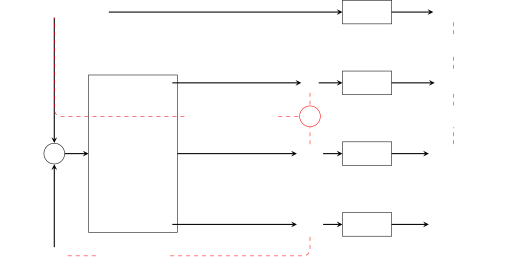
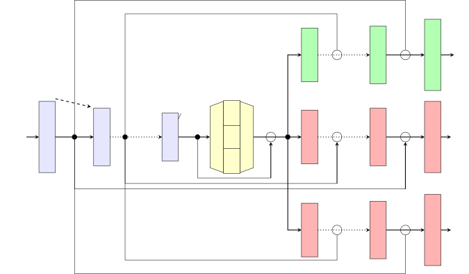
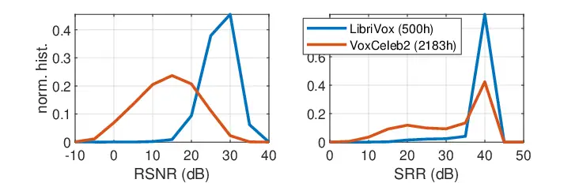

# Unsupervised Speech Enhancement with speech recognition embedding and disentanglement losses

Viet Anh Trinh    Sebastian Braun

###### Abstract

Speech enhancement has recently achieved great success with various deep
learning methods. However, most conventional speech enhancement systems
are trained with supervised methods that impose two significant
challenges. First, a majority of training datasets for speech
enhancement systems are synthetic. When mixing clean speech and noisy
corpora to create the synthetic datasets, domain mismatches occur
between synthetic and real-world recordings of noisy speech or audio.
Second, there is a trade-off between increasing speech enhancement
performance and degrading speech recognition (ASR) performance. Thus, we
propose an unsupervised loss function to tackle those two problems. Our
function is developed by extending the MixIT loss function with speech
recognition embedding and disentanglement loss. Our results show that
the proposed function effectively improves the speech enhancement
performance compared to a baseline trained in a supervised way on the
noisy VoxCeleb dataset. While fully unsupervised training is unable to
exceed the corresponding baseline, with joint super- and unsupervised
training, the system is able to achieve similar speech quality and
better ASR performance than the best supervised baseline.

###### Index Terms: 

Speech enhancement, unsupervised learning

^(†)^(†)address: ¹ The Graduate Center, CUNY, NY, USA  
² Microsoft Research, Redmond, WA, USA  
vtrinh@gradcenter.cuny.edu, sebastian.braun@microsoft.com

## 1 Introduction

Speech enhancement aims to remove noise and reverberation while
maintaining speech and audio quality. Although current speech
enhancement systems have achieved significant performance with different
deep learning architectures, e.g., \[1, 2, 3, 4, 5, 6\], there are some
challenges arising in this domain. In this study, we focus on two main
problems. First, most speech enhancement training datasets are synthetic
and created by mixing clean speech and noisy corpora. However, there are
domain mismatches between synthetic and real-world recordings of noisy
speech or audio. Also, collecting studio-quality training datasets is
expensive. Second, speech enhancement systems can remove noise, but they
can distort speech signals as well, which in consequence can degrade the
performance of subsequent ASR systems. Therefore, this paper examines
some previous works and proposes a new loss function to mitigate these
two problems.

There are several unsupervised speech enhancement methods proposed to
mitigate the domain mismatch, e.g., \[7, 8, 9, 10\]. However, in speech
enhancement, supervised training has not yet been outperformed by
unsupervised approaches. MixIT \[7\] is a special loss function designed
for unsupervised speech enhancement. This loss function is a combination
of a permutation loss, a reconstruction loss and a speech enhancement
loss. The algorithm allows training the speech enhancement system with
noisy speech instead of clean speech. MixIT shows its effectiveness in
source separation problem but it does not work well for speech
enhancement. \[8\] aims to improve MixIT by a noise augmentation method,
where the training speech sample is made more noisy by adding additional
artificial noise. They argued that in the MixIT paper, the distribution
of recording noise inside the speech was different from the additional
noise that led to the ineffectiveness of MixIT in the speech enhancement
task. The authors expected to improve the learning of MixIT by adding a
pre-noise from the same distribution as the training noise.

In this study, we develop a weighted loss function as a solution to the
two problems mentioned above. Our function combines speech enhancement,
disentanglement and speech recognition (ASR) embedding losses. Taken
together, we make three considerable contributions. First, we propose a
new loss function that enables using abundant real-world noisy corpora
to improve speech enhancement performance. Second, we address the
trade-off between speech enhancement and ASR by integrating an ASR
embedding loss and a disentanglement term to help separating the outputs
of MixIt. Third, we introduce a joint way of leveraging clean and noisy
speech combining supervised and unsupervised losses.


Figure 1: Supervised network architecture

## 2 Method

In this section, we describe the conventional supervised speech
enhancement approach used in the baseline and our proposed unsupervised
and semi-supervised methods.

### 2.1 Supervised speech enhancement

#### 2.1.1 Formulation



Figure 2: Proposed unsupervised training scheme. The network receives a
mixture of a noisy recording $`X`$ and an additional noise $`N`$. The
three outputs of the network are clean speech $`S`$ and two noises
$`N_{1}`$ and $`N_{2}`$, respectively. Embeddings of these three signals
are extracted using Wav2vec 2.0 (W2V). Red arrows illustrate loss
function components

As most speech enhancement systems are supervised, we deployed
supervised networks as baselines to have a fair comparison for our
proposed unsupervised method. The supervised architecture is depicted in
Figure 1. Let $`Y`$ be the the short-time Fourier transform (STFT) of
the input signal, where $`k,n`$ are the frequency and time indices. The
input features to the network are complex compressed spectra given by
$`|Y|^{c}\frac{Y}{|Y|}`$ with $`c\!=\!0.3`$. The compressed spectra are
fed as real and imaginary in two input channels of the network encoder.
The output of the network is a complex filter (mask) $`G(k,n)`$ , and
the output signal spectrum $`\hat{S}(k,n)`$ is obtained by complex
multiplication of the predicted filter $`G(k,n)`$ with the input
spectrum $`Y(k,n)`$. The network is trained by minimizing the supervised
signal loss between the target speech $`S(k,n)`$ and the predicted clean
speech $`\hat{S}(k,n)`$. We use the complex compressed spectral loss
\[11\]

```math
\displaystyle\mathcal{L}_{SE}(S,\hat{S})= \displaystyle(1-\lambda)\sum_{k,n}\left||S|^{c}-|\hat{S}|^{c}\right|^{2}
```

```math
\displaystyle+\lambda\sum_{k,n}\left||S|^{c}\frac{S}{|S|}-|\hat{S}|^{c}\frac{\hat{S}}{|\hat{S}|}\right|^{2}, \tag{1}
```

where $`\lambda`$ is a weighting between the complex loss and
magnitude-based loss \[11\].

#### 2.1.2 Supervised architecture

We use the Convolutional Recurrent U-net for Speech Enhancement (CRUSE)
\[12\] architecture. The enhancement system of CRUSE is illustrated in
Fig. 1 and the detailed network architecture is shown in Fig. 3. The two
additional decoder branches in red required for unsupervised MixIT
training are explained in the following section. CRUSE has a symmetric
encoder-decoder and a gated recurrent unit (GRU) \[13\] as bottleneck.
The encoder has $`L`$ convolutional layers, where the channel number
doubles, and the feature size is reduced by half each layer by striding.
The decoder has $`L`$ deconvolutional layers, mirroring the encoder
layers by upsampling and decreasing channels. There are skip connections
between corresponding layers of encoder and decoder with inserted
$`1\times 1`$ convolutions. The bottleneck has $`J`$ parallel GRU
layers.

### 2.2 Unsupervised speech enhancement

#### 2.2.1 MixIT loss

In supervised speech enhancement, the model is trained to make the
predicted speech close to the target clean speech. However, in
unsupervised speech enhancement, the clean speech is not available. The
MixIT loss \[7\] does not need access to the clean speech target, and is
given by

```math
\displaystyle\mathcal{L}_{MixIT-SE}=\min \displaystyle\bigl[\mathcal{L}_{SE}(\hat{S}+N_{1},X)+\mathcal{L}_{SE}(N_{2},N),
```

```math
\displaystyle\mathcal{L}_{SE}(\hat{S}+N_{2},X)+\mathcal{L}_{SE}(N_{1},N)\bigr], \tag{2}
```

where $`X(k,n)`$ and $`N(k,n)`$ are the complex spectra of the 2 inputs:
noisy recording and the additional noise. To train using MixIT, the
network has to produce three output signal, here the spectra
$`\hat{S},N_{1},N_{2}`$ are the complex spectrogram of the 3 outputs:
predicted speech, first noise and second noise, respectively. The
permutation allows the internal noise inside the real-world noisy
recording $`X`$ and the additional noise either to go to $`N_{1}`$ or
$`N_{2}`$, while the desired speech is expected to always end up in
output $`\hat{S}`$.

#### 2.2.2 Proposed ASR embedding and disentanglement related loss for unsupervised speech enhancement

The original MixIT loss was shown to work well in unsupervised speech
separation but it did not have a good performance in speech enhancement
task \[7\]. Therefore, we propose two additional constraint terms to the
MixIT loss.

In the first constraint, to prevent degradation of the ASR performance,
we use a pre-trained ASR system to extract the embeddings $`X_{emb}`$
and $`\hat{S}_{emb}`$ from the noisy speech recording and the enhanced
output, and force them to be similar by

```math
\displaystyle\mathcal{L}_{emb}=\mathcal{L}_{MSE}(\hat{S}_{emb},X_{emb}). \tag{3}
```

In the second constraint, we use a disentanglement constraint between
speech and noise so that leakage between speech and noise outputs of the
decoder is minimized. The ASR embedding of the predicted speech
$`\hat{S}_{emb}`$ is forced to be different from the ASR embeddings of
noise 1 $`N_{1-emb}`$ and noise 2 $`N_{2-emb}`$ by enforcing
orthogonality of the embeddings, i. e. 

```math
\displaystyle\mathcal{L}_{dis}=<\hat{S}_{emb},N_{1-emb}>+<\hat{S}_{emb},N_{2-emb}>, \tag{4}
```

where $`<>`$ specifies the dot product operation.

Our proposed loss function is the weighted sum of the original MixIT
loss and our embedding and disentanglement loss

```math
\displaystyle\mathcal{L}=\mathcal{L}_{MixIT-SE}+\alpha_{\text{e}}\mathcal{L}_{emb}+\alpha_{\text{d}}\mathcal{L}_{dis} \tag{5}
```

where $`\alpha_{\text{e}}`$, $`\alpha_{\text{d}}`$ are weights for
embedding and disentanglement losses, respectively.



Figure 3: System encoder, bottleneck and decoder . There are $`L`$
convolutional encoder and $`L`$ deconvolutional decoders layers. The
encoder and decoder layers are symmetric to each others. The bottleneck
includes $`J`$ GRU layers, flatten and reshape operations

#### 2.2.3 Unsupervised architecture

The network architecture for unsupervised MixIT training is identical to
the supervised case, except that we add two additional decoder branches
for $`N_{1}`$ and $`N_{2}`$ as shown in Fig. 3. The two additional
decoders for the noise outputs are required for training only, adding no
additional inference complexity. We added a pre-trained wav2vec2 model
\[14\] to extract ASR embeddings. The input features are extracted from
the mixture $`Y`$, where to the noisy speech $`X`$ the noise $`N`$ is
added as shown in Fig. 2. The network then predicts three filters to be
applied to the input to obtain the spectra $`\hat{S},N_{1},N_{2}`$.

### 2.3 Semi-supervised speech enhancement

An overall benefit could be achieved by joining supervised and
unsupervised training methods into a semi-supervised approach. This
means, we train on both clean and noisy speech datasets, using the
supervised and unsupervised losses in parallel. To train the
semi-supervised network, we feed a batch of utterances from clean
dataset to calculate the supervised loss, and feed a batch of utterances
from noisy dataset to calculate the unsupervised loss. The
semi-supervised training loss is the sum of supervised loss from (1) and
unsupervised loss from (5), and is given by

```math
\displaystyle\mathcal{L}_{semi}=\mathcal{L}_{supervised}+\mathcal{L}_{unsupervised}. \tag{6}
```

The network weights are updated on the joint semi-supervised loss.

## 3 Experimental Setup

### 3.1 Dataset



Figure 4: Distributions of RSNR and SRR in the LibriVox and VoxCeleb
datasets

We used the LibriVox ¹¹ 1 https://librivox.org/ with 500 hours as a
clean training dataset for the supervised baseline models. We used the
VoxCeleb2 \[15\] dataset as noisy speech training data for unsupervised
training. The distributions of reverberant signal-to-noise ratio (RSNR)
and signal-to-reverberation ratio (SRR) of the utterances in these two
datasets are measured using a blind predictor based on \[16\] and
visualized in Figure 4. We can see that VoxCeleb2 has a lot of low SNR
content and also reverberant speech, compared to LibriVox. The noise
added to the speech in training stage is drawn from the of DNS challenge
noise data²² 2
https://github.com/microsoft/DNS-Challenge/tree/icassp2021-final (180
hours). The development set contains 300 synthetic noisy utterances by
mixing clean speechs from DAPS ³³ 3 https://ccrma.stanford.edu/
gautham/Site/daps.html corpus with noises and impulse responses from the
QUT ⁴⁴ 4 https://research.qut.edu.au/saivt/databases/qut-noise database
. The speech enhancement test set are 600 utterances both verbal and
non-verbal audio recordings from the 3rd DNS challenge \[3\] test set.

For supervised training, non-reverberant recordings from LibriVox were
augmented with impulse responses (IRs) from the DNS challenge (115k
IRs), and from QUT in the training set and development set respectively.
We created either fully reverberant or non-reverberant speech training
targets as described in \[12\] to create different supervised baselines.

The speech recognition test set is the DNS challenge test set. We
employed the public Azure speech software development kit transcription
service to get the ASR performance. The WER is computed on three test
sets: i) the 600 clips from the 3rd DNS challenge \[3\], ii) 200 clips
of high SNR speech to check degradations when noise suppression is not
necessary, and iii) an internal test set 18 h actual meeting recordings.

### 3.2 Evaluation

Our goal is to improve speech enhancement without degrading ASR
performance. Thus, we evaluate our system with both speech enhancement
and ASR metrics. Speech enhancement systems can be evaluated on
objective or subjective human ratings. As the human rating is expensive
and slow, neural networks are used to predict the human mean opinion
score (MOS) \[17, 18\]. The ITU P.835 standard rates the MOS of 3
components, signal distortion (SIG), background noise suppression (BAK)
and overall quality (OVL) with scores ranging from 1 to 5, the higher
the better. We use a neural network based on \[17\] to predict the
non-intrusive scores _nSIG_, _nBAK_, _nOVL_, where ”n” stands for
non-intrusive. The speech recognition performance is evaluated using the
standard word error rate (WER) metric.

[TABLE]

Table 1: Speech enhancement and speech recognition scores on the DNS
challenge test set

### 3.3 Training parameters

The encoder has 4 layers with 16-32-64-128 channels. Each decoder has 4
layers with 128-64-32-16 channels. The pretrained Wav2vec 2.0 is Wav2Vec
2.0 large (LV-60) \[14\] with self-training. The training utterances
have the length of 10 seconds.

The network was trained with an AdamW optimizer with a learning rate of
$`1\cdot 10^{-3}`$ for the supervised loss, $`5\cdot 10^{-4}`$ for the
unsupervised loss, and weight decay $`2\cdot 10^{-5}`$. The learning
rate is reduced by half if there is no improvement in the development
set performance after 200 epochs. The epoch size is 5120. The loss
weights are $`\lambda=0.3`$, $`\alpha_{\text{e}}=0.004`$,
$`\alpha_{\text{d}}=0.0005`$.

We measured the performance of all the models on the development set
every $`E`$ epochs and choose the best model based on a weighted metric
following \[12\]. The metric is a weighted combination of cepstral
distance (CD), perceptual evaluation of speech quality (PESQ) \[19\] and
scale-invariant signal-to- distortion ratio:

```math
\displaystyle M=PESQ+0.2siSDR-CD \tag{7}
```

### 3.4 Experiments

To have fair comparisons and to gauge upper and lower bounds, we first
set up three supervised baseline experiments. In Exp. 1 (lower bound),
the speech signal $`S`$ is drawn from the noisy speech dataset
(VoxCeleb2) and noise $`N`$ is taken randomly from the training noise
dataset. This experiment acts as lower bound because we expect the
unsupervised loss could improve the trivial supervised training on noisy
speech. In Exp. 2 (upper bound), the speech signal $`S`$ is from the
clean speech dataset LibriVox and is augmented with impulse responses
(RIRs). The target speech is created by using windowed RIRs to obtain
non-reverberant speech, i. e, the network also learns dereverberation.
Exp. 3 is identical to Exp. 2, except that the speech training targets
are kept fully reverberant. Exp. 3 acts as a fair baseline, as the MixIT
loss has no incentive to learn dereverberation.

In Exp. 4, we implemented the original MixIT training \[7\] in a fully
unsupervised fashion from noisy speech using the loss (2). Exp. 7 uses
the proposed loss (5), adding both embedding and disentanglement losses
to the MixIT loss. In addition, we conducted an ablation study to
investigate the contribution of disentanglement or ASR embedding losses.
We removed the disentanglement or ASR embedding losses in Exp. 5, 6 by
setting either $`\alpha_{\text{d}}`$ or $`\alpha_{\text{e}}`$ in (5) to
zero.

We also did two semi-supervised experiments (Exp. 8, 9), combining
supervised and unsupervised loss by training on (6). In Exp. 8, we train
on MixIT with ASR embedding loss ($`\alpha_{\text{d}}=0`$), while
Exp. 9, is the full semi-supervised combination of MixIT, ASR embedding
and disentanglement loss.

## 4 Results

The experiment results are shown in Table 1. The nSIG, nBAK, nOVL
metrics are computed on the 3rd DNS challenge test set, while the WER is
shown the 3 test sets DNS challenge (_low SNR_), the high SNR test set
(_high SNR_), and the meeting recordings (_meeting_). The first line
presents the metrics of the noisy speech utterances in the test sets
without applying any speech enhancement methods. The noisy speech has
the lowest nBAK score (3.05) compared to the enhanced signals in other
experiments because it contains a lot of noise. It also has the lowest
nOVL score (3.11). However, it has the lowest WERs because applying
speech enhancement systems to remove the noise led to signal distortion.
We measure the WER on an ASR which is not jointly trained with a speech
enhancement system.

The results of supervised experiments are described from row 2 to 4.
Exp. 2 has the highest speech enhancement overall (nOVL) score at 3.52,
because it is trained on clean, non-reverberant speech targets, i. e.
reducing both noise and reverberation. As we can see, a model trained
with strong supervision on a large dataset is still hard to be
outperformed. The nOVL score decreases to 3.39 when the training speech
target has reverberation in Exp. 3, i. e. where the network is trained
to remove noise only, but no reverberation. In Exp. 1, the nOVL drops to
3.31 when using noisy speech as target.

The unsupervised training experiments results are reported in Exp. 4 to 7. In Exp. 4, the original MixIT loss shows a significantly worse
enhancement performance with its nOVL (3.16) being slightly above the
noisy speech without enhancement (row 1) nOVL (3.11) and nBAK of only
3.28. MixIT also has WER for the meeting and high SNR datasets close to
the noisy speech row 1 (17.16% vs 16.52% and 5.74% vs 5.69%). MixIT has
higher low SNR WER than the noisy speech in row 1 (31.61% vs 27.95%).

The proposed unsupervised loss (5) in Exp. 7 has a similar nOVL and a
better WER compared to the supervised training loss on Exp. 1. It has
better speech recognition performance on low SNR, high SNR test cases
with a lower error rate at 33.58%, 6.44% compared to 35.51%, 6.81% of
Exp. 1, respectively.

The ablation study (Exp. 5, 6) illustrates how the performance changed
when we dropped the disentanglement or the ASR embedding. As we can see,
when the disentanglement or ASR embedding was dropped, the speech
enhancement performance degrades (nOVL drops from 3.29 to 3.25 and 3.27
respectively). Thus, the disentanglement and ASR embedding loss terms
show to be helpful constraints on the system.

However, the fully unsupervised training could not exceed the baseline
(Exp. 3), a strong supervised training with reverberation. An
interesting question is if the semi-supervised training can exceed the
upper supervised bound (Exp. 2). Exp. 8 has an nOVL comparable to the
supervised training which uses clean speech as target (Exp. 2), and
better WERs. More specifically, Exp. 8 has a WER at 30.94 %, 6.11 % ,
18.77 % compared to 32.59 %, 6.15%, 19.21% of Exp. 2 on the low SNR,
high SNR and meeting datasets, respectively. While the semi-supervised
training could not outperform the supervised upper bound in terms of
MOS, likely due to the that fact the unsupervised training samples will
not push for dereverberation, it exceeds the reverberant baseline
(Exp. 3) and shows less WER degradation than the supervised upper bound.

## 5 Conclusion

In this work, we improved the MixIT loss, which is an unsupervised
training scheme for speech enhancement using only noisy speech. While
the original MixIT loss was shown to underperform in terms of noise
suppression, we proposed two additional terms, an ASR embedding loss and
a disentanglement loss to improve ASR performance and enforce the speech
from noise separation. With the additions, our improved unsupervised
system could outperform a supervised baseline trained on noisy speech,
but not a supervised baseline trained on clean reverberant speech. We
therefore proposed a semi-supervised training scheme, jointly training
with a supervised loss on clean speech, and with MixIT on noisy speech.
This method could outperform the supervised baseline trained on clean
reverberant speech. However it could not outperform the strongest upper
bound supervised baseline trained on clean non-reverberant speech in
terms of MOS, but in terms of ASR performance.

In future work, the approach can be extended by adding different
embedding related loss to the proposed loss function. Another
interesting topic is maintaining important speech cues for ASR \[20, 21,
22\] when doing speech enhancement to minimize the speech enhancement
vs. speech recognition trade-off.

## References

- \[1\] Felix Weninger, Hakan Erdogan, Shinji Watanabe, Emmanuel
  Vincent, Jonathan Le Roux, John R Hershey, and Björn Schuller, “Speech
  enhancement with lstm recurrent neural networks and its application to
  noise-robust asr,” in International conference on latent variable
  analysis and signal separation. Springer, 2015, pp. 91–99.
- \[2\] Yi Luo and Nima Mesgarani, “Conv-tasnet: Surpassing ideal
  time–frequency magnitude masking for speech separation,” IEEE/ACM
  transactions on audio, speech, and language processing, vol. 27, no.
  8, pp. 1256–1266, 2019.
- \[3\] Chandan K.A. Reddy, Harishchandra Dubey, Kazuhito Koishida, Arun
  Nair, Vishak Gopal, Ross Cutler, Sebastian Braun, Hannes Gamper,
  Robert Aichner, and Sriram Srinivasan, “INTERSPEECH 2021 Deep Noise
  Suppression Challenge,” in Proc. Interspeech 2021, 2021, pp.
  2796–2800.
- \[4\] Andong Li, Wenzhe Liu, Xiaoxue Luo, Chengshi Zheng, and Xiaodong
  Li, “Icassp 2021 deep noise suppression challenge: Decoupling
  magnitude and phase optimization with a two-stage deep network,” in
  ICASSP 2021-2021 IEEE International Conference on Acoustics, Speech
  and Signal Processing (ICASSP). IEEE, 2021, pp. 6628–6632.
- \[5\] DeLiang Wang and Jitong Chen, “Supervised speech separation
  based on deep learning: An overview,” IEEE/ACM Transactions on Audio,
  Speech, and Language Processing, vol. 26, no. 10, pp. 1702–1726, 2018.
- \[6\] Ke Tan and DeLiang Wang, “Learning complex spectral mapping with
  gated convolutional recurrent networks for monaural speech
  enhancement,” IEEE/ACM Transactions on Audio, Speech, and Language
  Processing, vol. 28, pp. 380–390, 2019.
- \[7\] Scott Wisdom, Efthymios Tzinis, Hakan Erdogan, Ron Weiss, Kevin
  Wilson, and John Hershey, “Unsupervised sound separation using mixture
  invariant training,” in Advances in Neural Information Processing
  Systems, H. Larochelle, M. Ranzato, R. Hadsell, M. F. Balcan, and
  H. Lin, Eds. 2020, vol. 33, pp. 3846–3857, Curran Associates, Inc.
- \[8\] Koichi Saito, Stefan Uhlich, Giorgio Fabbro, and Yuki Mitsufuji,
  “Training speech enhancement systems with noisy speech datasets,”
  arXiv preprint arXiv:2105.12315, 2021.
- \[9\] Yu-Che Wang, Shrikant Venkataramani, and Paris Smaragdis,
  “Self-supervised learning for speech enhancement,” arXiv preprint
  arXiv:2006.10388, 2020.
- \[10\] Takuya Fujimura, Yuma Koizumi, Kohei Yatabe, and Ryoichi
  Miyazaki, “Noisy-target training: A training strategy for dnn-based
  speech enhancement without clean speech,” arXiv preprint
  arXiv:2101.08625, 2021.
- \[11\] Sebastian Braun and Ivan Tashev, “A consolidated view of loss
  functions for supervised deep learning-based speech enhancement,” in
  2021 44th International Conference on Telecommunications and Signal
  Processing (TSP). IEEE, 2021, pp. 72–76.
- \[12\] Sebastian Braun, Hannes Gamper, Chandan KA Reddy, and Ivan
  Tashev, “Towards efficient models for real-time deep noise
  suppression,” in ICASSP 2021-2021 IEEE International Conference on
  Acoustics, Speech and Signal Processing (ICASSP). IEEE, 2021, pp.
  656–660.
- \[13\] Kyunghyun Cho, Bart van Merriënboer, Dzmitry Bahdanau, and
  Yoshua Bengio, “On the properties of neural machine translation:
  Encoder–decoder approaches,” in Proceedings of SSST-8, Eighth Workshop
  on Syntax, Semantics and Structure in Statistical Translation, 2014,
  pp. 103–111.
- \[14\] Alexei Baevski, Yuhao Zhou, Abdelrahman Mohamed, and Michael
  Auli, “wav2vec 2.0: A framework for self-supervised learning of speech
  representations,” Advances in Neural Information Processing Systems,
  vol. 33, 2020.
- \[15\] Joon Son Chung, Arsha Nagrani, and Andrew Zisserman,
  “Voxceleb2: Deep speaker recognition,” Proc. Interspeech 2018, pp.
  1086–1090, 2018.
- \[16\] Sebastian Braun and Ivan Tashev, “On training targets for
  noise-robust voice activity detection,” in European Signal Processing
  Conference (EUSIPCO), August 2021.
- \[17\] Chandan KA Reddy, Vishak Gopal, and Ross Cutler, “Dnsmos: A
  non-intrusive perceptual objective speech quality metric to evaluate
  noise suppressors,” in ICASSP 2021-2021 IEEE International Conference
  on Acoustics, Speech and Signal Processing (ICASSP). IEEE, 2021, pp.
  6493–6497.
- \[18\] Hannes Gamper, Chandan KA Reddy, Ross Cutler, Ivan J Tashev,
  and Johannes Gehrke, “Intrusive and non-intrusive perceptual speech
  quality assessment using a convolutional neural network,” in 2019 IEEE
  Workshop on Applications of Signal Processing to Audio and Acoustics
  (WASPAA). IEEE, 2019, pp. 85–89.
- \[19\] Antony W Rix, John G Beerends, Michael P Hollier, and Andries P
  Hekstra, “Perceptual evaluation of speech quality (pesq)-a new method
  for speech quality assessment of telephone networks and codecs,” in
  2001 IEEE international conference on acoustics, speech, and signal
  processing. Proceedings (Cat. No. 01CH37221). IEEE, 2001, vol. 2, pp.
  749–752.
- \[20\] Viet Anh Trinh, Hassan Salami Kavaki, and Michael I Mandel,
  “Importantaug: a data augmentation agent for speech,” ICASSP 2022 IEEE
  International Conference on Acoustics, Speech and Signal Processing
  (ICASSP), 2022.
- \[21\] Viet Anh Trinh, Brian McFee, and Michael I Mandel, “Bubble
  Cooperative Networks for Identifying Important Speech Cues,” in Proc.
  Interspeech 2018, 2018, pp. 1616–1620.
- \[22\] Viet Anh Trinh and Michael I. Mandel, “Large scale evaluation
  of importance maps in automatic speech recognition,” in Interspeech
  2020, 21st Annual Conference of the International Speech Communication
  Association. 2020, pp. 1166–1170, ISCA.
