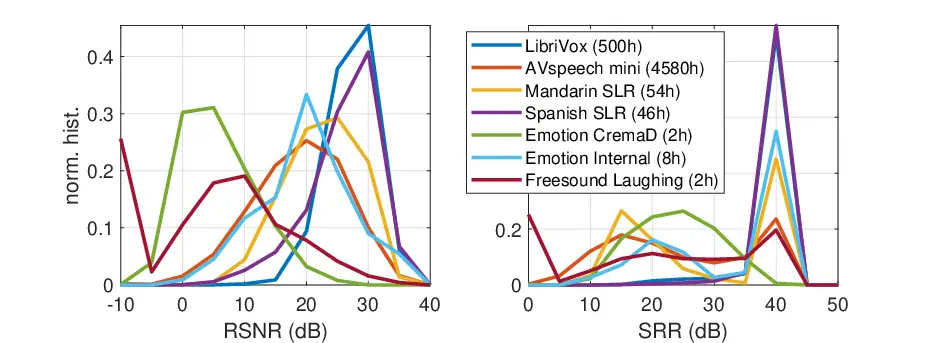
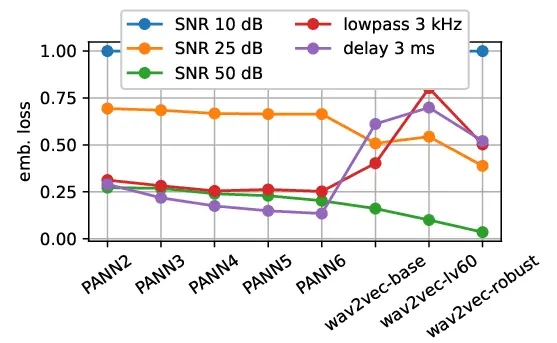
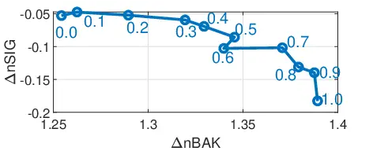

# Effect of noise suppression losses on speech distortion and ASR performance

Sebastian Braun    Hannes Gamper

###### Abstract

Deep learning based speech enhancement has made rapid development
towards improving quality, while models are becoming more compact and
usable for real-time on-the-edge inference. However, the speech quality
scales directly with the model size, and small models are often still
unable to achieve sufficient quality. Furthermore, the introduced speech
distortion and artifacts greatly harm speech quality and
intelligibility, and often significantly degrade automatic speech
recognition (ASR) rates. In this work, we shed light on the success of
the spectral complex compressed mean squared error (MSE) loss, and how
its magnitude and phase-aware terms are related to the speech distortion
vs. noise reduction trade off. We further investigate integrating
pre-trained reference-less predictors for mean opinion score (MOS) and
word error rate (WER), and pre-trained embeddings on ASR and sound event
detection. Our analyses reveal that none of the pre-trained networks
added significant performance over the strong spectral loss.

###### Index Terms: 

speech enhancement, noise reduction, speech distortion reduction, speech
quality

^(†)^(†)address: Microsoft Research, Redmond, WA, USA  
{sebastian.braun, hannes.gamper}@microsoft.com

## 1 Introduction

Speech enhancement techniques are present in almost any device with
voice communication or voice command capabilities. The goal is to
extract the speaker’s voice only, reducing disturbing background noise
to improve listening comfort, and aid intelligibility for human or
machine listeners. In the past few years, neural network-based speech
enhancement techniques showed tremendous improvements in terms of noise
reduction capability \[1, 2\]. Data-driven methods can learn the
tempo-spectral properties of any type of speech and noise, in contrast
to traditional statistical model-based approaches that often mismatch
certain types of signals. While one big current challenge in this field
is still to find smaller and more efficient network architectures that
are computationally light for real-time processing while delivering good
results, another major challenge addressed here is obtaining good,
natural sounding speech quality without processing artifacts.

In the third DNS (DNS) challenge \[2\], the separate evaluation of
speech distortion (SIG), background noise reduction (BAK), and overall
quality (OVL) according to ITU P.835 revealed that while current
state-of-the-art methods achieve outstanding noise reduction, only one
submission did not degrade SIG on average while still showing high BAK.
Degradations in SIG potentially also harm the performance of following
ASR (ASR) systems, or human intelligibility as well.

In \[3\] a speech enhancement model was trained on a signal-based loss
and a ASR loss with alternating updates. This method requires either
transcriptions for all training data, or using a transcribed subset for
the ASR loss. The authors also proposed to update the ASR model during
training, which creates an in practice often undesired dependency
between speech enhancement and the jointly trained ASR engine.

In this work, we explore several loss functions for a real-time deep
noise suppressor with the goal to improve SIG without harming ASR rates.
The contribution of this paper is threefold. First, we show that by
decoupling the loss from the speech enhancement inference engine using
end-to-end training, choosing a higher resolution in a spectral
signal-based loss can improve SIG. Second, we propose ways to integrate
MOS and WER estimates from pre-trained networks in the loss as
weighting. Third, we evaluate additional supervised loss terms computed
using pre-trained networks, similar to the deep feature loss \[4\]. In
\[5\], six different networks pre-trained on different tasks have been
used to extract embeddings from output and target signals, to form an
additional loss, where a benefit was reported only for the sound event
detection model published in \[6\]. We show different results when
trained on a larger dataset and evaluated on real data using decisive
metrics on speech quality and ASR performance, while we find that none
of the pre-trained networks improved ASR rates or speech quality
significantly.

## 2 System and training objective

A captured microphone signal can generally be described by

```math
y(t)=m\left\{s(t)+r(t)+v(t)\right\}, \tag{1}
```

where $`s(t)`$ is the non-reverberant desired speech signal, $`r(t)`$
undesired late reverberation, $`v(t)`$ additive noise or interfering
sounds, and $`m\{\}`$ can model linear and non-linear acoustical,
electrical, or digital effects that the signals encounter.

### 2.1 End-to-end optimization

We use an end-to-end enhancement system using a complex enhancement
filter in the STFT (STFT) domain

```math
\widehat{s}(t)=\mathcal{F}_{\text{P}}\left\{G(k,n)\;\mathcal{F}_{\text{P}}\left\{y(t)\right\}\right\}^{-1} \tag{2}
```

where $`\mathcal{F}_{\text{P}}\left\{a(t)\right\}=A(k,n)`$ denotes the
linear STFT operator yielding a complex signal representation at
frequency $`k`$ and time index $`n`$, and $`G(k,n)`$ is a complex
enhancement filter. The end-to-end optimization objective is to train a
neural network predicting $`G(k,n)`$, while optimizing a loss on the
time-domain output signal $`\widehat{s}(t)`$ as shown in Fig. 1.

Figure 1: End-to-end trained system on various losses.

### 2.2 Features and network architecture

We use complex compressed features by feeding the real and imaginary
part of the complex FFT spectrum as channels into the first
convolutional layer. Magnitude compression is applied to the complex
spectra by

```math
Y^{c}(k,n)=|Y(k,n)|^{c}\,\frac{Y(k,n)}{\max(|Y(k,n)|,\eta)}, \tag{3}
```

where the small positive constant $`\eta`$ avoids division by zero.

We use the CRUSE (CRUSE) model proposed in \[7\] with 4 convolutional
encoder/decoder layers with time-frequency kernels (2,3) and stride
(1,2) with pReLU activations, a group of 4 parallel GRUs in the
bottleneck and add skip connections with $`1\times 1`$ convolutions. The
network output are two channels for the real and imaginary part of the
complex filter $`G(k,n)`$. To ensure stability, we use _tanh_ output
activation functions restraining the filter values to $`[-1,1]`$ as in
\[8\].

## 3 Data generation and augmentation

We use an online data generation and augmentation technique, using the
power of randomness to generate virtually infinitely large training
data. Speech and noise portions are randomly selected from raw audio
files with random start times to form 10 s clips. If a section is too
short, one or more files are concatenated to obtain the 10 s length. 80%
of speech and noise are augmented with random biquad filters \[9\] and
20% are pitch shifted within $`[-2,8]`$ semi-tones. If the speech is
non-reverberant, a random RIR (RIR) is applied. The non-reverberant
speech training target is obtained by windowing the RIR with a cosine
decay of length 50 ms, starting 20 ms (one frame) after the direct path.
Speech and noise are mixed with a SNR (SNR) drawn from a normal
distribution with mean and standard deviation $`\mathcal{N}(5,10)`$ dB.
The signal levels are varied with a normal distribution
$`\mathcal{N}(-26,10)`$ dB.

We use 246 h noise data, consisting of the DNS challenge noise data
(180 h), internal recordings (65 h), and stationary noise (1 h), as well
as 115 k RIR published as part of the DNS challenges \[10\]. Speech data
is taken mainly from the 500 h high quality-rated Librivox data from
\[10\], in addition to high SNR data from AVspeech \[11\] and the
Mandarin and Spanish, singing, and emotional CremaD corpora published
within \[10\], an internal collection of 8 h emotional speech and 2 h
laughing sourced from Freesound.



Figure 2: SNR and SRR distributions of speech datasets

Figure 2 shows the distributions of RSNR (RSNR) and SRR (SRR) as
predicted by a slightly modified neural network following \[12\]. The
singing data is not shown in Fig. 2 as it is studio quality and our RSNR
estimator is not trained on singing. While the Librivox data has both
high RSNR and SRR, this is not the case for the other datasets, which
have broader distributions and lower peaks. Therefore, we select only
speech data from the AVspeech, Spanish, Mandarin, emotion, and laughing
subsets with $`segSNR>30`$ dB and $`SRR>35`$ dB for training.

## 4 Loss functions

In this section, we describe training loss functions that are used to
optimize the enhanced signal $`\widehat{s}(t)`$. We always use a
standard signal-based spectral loss described in Sec. 4.1, which is
extended or modified in several ways as described in the following
subsections.

### 4.1 Magnitude-regularized compressed spectral loss

As a standard spectral distance-based loss function
$`\mathcal{L}_{SD}`$, we use the complex compressed loss \[11, 13\],
which outperformed other spectral distance-based losses in \[14\], given
by

```math
\mathcal{L}_{SD}=\frac{1}{\sigma_{s}^{c}}\left(\lambda\sum_{\kappa,\eta}\left|S^{c}\!-\!\widehat{S}^{c}\right|^{2}+(1\!-\!\lambda)\sum_{\kappa,\eta}\left||S|^{c}\!-\!|\widehat{S}|^{c}\right|^{2}\right), \tag{4}
```

where here the spectra
$`S(\kappa,\eta)=\mathcal{F}_{\text{L}}\left\{s(t)\right\}`$ and
$`\widehat{S}(\kappa,\eta)=\mathcal{F}_{\text{L}}\left\{\widehat{s}(t)\right\}`$
are computed with a STFT operation with independent settings from
$`\mathcal{F}_{\text{P}}\left\{\cdot\right\}`$ in (2),
$`A^{c}=|A|^{c}\frac{A}{|A|}`$ is a magnitude compression operation, and
the frequency and time indices $`\kappa,\eta`$ are omitted for brevity.
The loss for each sequence is normalized by the active speech energy
$`\sigma_{s}`$ \[15\], which is computed from $`s(t)`$ using a VAD
(VAD). The complex and magnitude loss terms are linearly weighted by
$`\lambda`$, and the compression factor is $`c=0.3`$. The processing
STFT $`\mathcal{F}_{\text{P}}`$ and loss frequency transform
$`\mathcal{F}_{\text{L}}`$ can differ in e. g. window and hop-size
parameters, or be even different types of frequency transforms as shown
in Fig. 1. In the following subsections, we propose several extensions
to the spectral distance loss $`\mathcal{L}_{SD}`$ to potentially
improve quality and generalization.

Optional frequency weighting Frequency weightings for simple spectral
distances are often used in perceptually motivated evaluation metrics
and have been tried to integrate as optimization targets for speech
enhancement \[16\]. While we already showed that the AMR-wideband based
frequency weighting did not yield improvements for the experiments in
\[14\], here we explore another attempt applying a simple ERB (ERB)
weighting \[17\] to the spectra in (4) using 20 bands.

### 4.2 Additional cepstral distance term

The CD (CD) \[18\] is one of the few intrusive objective metrics that is
also sensitive to speech distortion artifacts caused by speech
enhancement algorithms, in contrast to most other metrics, which are
majorly sensitive to noise reduction. This motivated adding a CD term
$`\mathcal{L}_{CD}`$ to (4) by

```math
\mathcal{L}_{CD}=\beta\mathcal{L}_{SD}(s,\widehat{s})+(1-\beta)\mathcal{L}_{CD}(s,\widehat{s}) \tag{5}
```

where we chose $`\beta=0.001`$, but did not find a different weight that
helped improving the results.

### 4.3 Non-intrusive speech quality and ASR weighted loss

Secondly, we explore the use of non-intrusive estimators for MOS (MOS)
\[19\] and WER (WER) \[20\]. The MOS predictor has been re-trained with
subjective ratings of various speech enhancement algorithms, including
the MOS ratings included in the three DNS challenges. Note that both are
blind (non-intrusive) estimators, meaning they give predictions without
requiring any reference, which makes them also interesting for
unsupervised training, to be explored in future work. To avoid
dependence of a hyper-parameter when extending the loss function by
additive terms (e.g., $`\lambda`$ in (4)), we use the predictions to
weight the spectral distance loss for each sequence $`b`$ in a training
batch by

```math
\mathcal{L}_{MOS,WER}=\sum_{b}\frac{nWER(\widehat{s}_{b})}{nMOS(\widehat{s}_{b})}\,\mathcal{L}_{SD}(s_{b},\widehat{s}_{b}), \tag{6}
```

where $`s_{b}(t)`$ is the $`b`$-th sequence, $`nWER()`$ and $`nMOS()`$
are the WER and MOS predictors. We also explore MOS and WER only
weighted losses by setting the corresponding other prediction to one.

### 4.4 Multi-task embedding losses

As a third extension, similiar to \[5\], we add a distance loss using
pre-trained embeddings on different audio tasks, such as ASR or SED
(SED), by

```math
\mathcal{L}_{\text{emb}}=\sum_{b}\mathcal{L}_{SD}(s_{b},\widehat{s}_{b})+\gamma\frac{\|\mathbf{u}(s_{b})-\mathbf{u}(\widehat{s}_{b})\|_{p}}{\|\mathbf{u}(s_{b})\|_{p}} \tag{7}
```

where $`\mathbf{u}(s_{b})`$ and $`\mathbf{u}(\widehat{s}_{b})`$ are the
embedding vectors from the target speech and output signals,
respectively, and we use the normalized $`p`$-norm as distance metric.
This differs from \[5\], where a L₁ spectral loss was used for
$`\mathcal{L}_{SD}`$. We verified a small benefit from the normalization
term and chose $`p`$ according to the embedding distributions in
preliminary experiments.

In this work, we use two different embedding extractors
$`\mathbf{u}()`$: a) the _PANN_ SED model \[6\] that was the only
embedding that showed a benefit in \[5\], and b) an ASR embedding using
_wav2vec 2.0_ models \[21\]. For _PANN_, we use the pre-trained 14-layer
CNN model using the first 2-6 double CNN layers with $`p\!=\!1`$ and
$`\gamma\!=\!0.05`$. For _wav2vec 2.0_, we explore three versions of
pre-trained models with $`p\!=\!2`$ and $`\gamma\!=\!0.1`$ to extract
embeddings, which could help to improve ASR performance of the speech
enhancement networks: i) the small _wav2vec-base_ model trained on
LibriSpeech, ii) the large _wav2vec-lv60_ model trained on LibriSpeech,
and iii) the large _wav2vec-robust_ model trained on Libri-Light,
CommonVoice, Switchboard, Fisher, i. e. , more realistic and noisy data.
We use the full wav2vec models taking the logits as output. The
pre-trained embeddings extractor networks are frozen while training the
speech enhancement network.



Figure 3: Sensitivity of embedding losses to various degradations.
Losses are normalized per embedding type (column).

Understanding the embeddings To provide insights into how to choose
useful embedding extractors and reasons why some embeddings work better
than others, we conduct a preliminary experiment. We show the embedding
loss terms for a selection of signal degradations, corrupting a speech
signal with the same noise with three different SNR, a 3 kHz lowpass
degradation, and the impact of a delay, i. e.  a linear phase shift. The
degradations are applied on 20 speech signals with different noise
signals and results are averaged. Fig. 3 shows the PANN embedding loss
using a different number of CNN layers, and the three wav2vec models
mentioned above. The embedding loss is normalized to the maximum per
embedding (i.e., per column) for better visibility, as we are interested
in the differences created by certain degradations.

We observe that the PANN models are rather non-sensitive to lowpass
degradations, attributing it a similar penalty as a -50 dB background
noise. The wav2vec embeddings are much more sensitive to the lowpass
distortion, and rate moderate background noise with -25 dB comparably
less harmful than the PANN embeddings. This might be closer to a human
importance or intelligibility rating, where moderate background noise
might be perceived less disturbing than speech signal distortions, and
seems therefore more useful in guiding the networks towards preserving
more speech components rather than suppressing more (probably hardly
audible) background noise. We consequently choose the 4-layer PANN and
_wav2vec-robust_ embeddings for our later experiments.

## 5 Evaluation

### 5.1 Test sets and metrics

We show results on the public third DNS challenge test set consisting of
600 actual device recordings under noisy conditions \[2\]. The impact on
subsequent ASR systems is measured using three subsets: The transcribed
DNS challenge dataset (challenging noisy conditions), a collection of
internal real meetings (18h, realistic medium noisy condition), and 200
high quality high SNR recordings.

Speech quality is measured using a non-intrusive P.835 DNN-based
estimator similar to DNSMOS \[22\] trained on the available data from
the three DNS challenges and internally collected data. We term the
non-intrusive predictions for _signal distortion_, _background noise_
and _overall quality_ from P.835 DNSMOS _nSIG, nBAK, nOVL_. The P.835
DNSMOS model predicts SIG with $`>0.9`$ correlation and BAK, OVL with
$`>0.95`$ correlation per model. The impact on production-grade ASR
systems is measured using the public Microsoft Azure Speech SDK service
\[23\] for transcription.

### 5.2 Experimenal settings

The CRUSE processing parameters are implemented using a STFT with
square-root Hann windows of 20 ms length, 50% overlap, and a FFT size of 320. To achieve results in line with prior work, we use a network size
that is on the larger side for most CPU-bound real-world applications,
although it still runs in real-time on standard CPUs and is several
times less complex than most research speech enhancement architectures:
The network has 4 encoder conv layers with channels $`[32,64,128,256]`$,
which are mirrored in the decoder, a GRU bottleneck split in 4 parallel
subgroups, and conv skip connections \[7\]. The resulting network has
8.4 M trainable parameters, 12.8 M MACs/frame and the ONNX runtime has a
processing time of 45 ms per second of audio on a standard laptop CPU.
For reference, the first two ranks in the 3rd DNS challenge \[2\] stated
to consume about 60 M MACs and 93 M FLOPs per frame. The network is
trained using the AdamW optimizer with initial learning rate 0.001,
which is halved after plateauing on the validation metric for 200
epochs. Training is stopped after validation metric plateau of 400
epochs. One epoch is defined as 5000 training sequences of 10 s. We use
the synthetic validation set and heuristic validation metric proposed in
\[7\], a weighted sum of PESQ, siSDR and CD.

### 5.3 Results



Figure 4: Controlling the speech distortion - noise reduction tradeoff
for (4) using the complex loss weight $`\lambda`$, where $`\lambda=1`$
gives the complex loss term only, and $`\lambda=0`$ gives the magnitude
only loss.

In the first experiment, we study the not well understood linear
weighting between complex compressed and magnitude compressed loss (4).
Fig. 4 shows the nSIG vs. nBAK tradeoff when changing the contribution
of the complex loss term with the weight $`\lambda`$ in (4). The
magnitude term acts as a regularizer for distortion, while higher weight
on the complex term yields stronger noise suppression, at the price of
speech distortion. An optimal weighting is therefore found as a trade
off. We use $`\lambda=0.3`$ in the following experiments, which we found
to be a good balance between SIG and BAK.

Table 1 shows the results in terms of nSIG, nBAK, nOVL and WER for all
losses under test, where _DNS_, _HQ_, and _meet_ refer to the three test
sets described in Sec. 5.1.

| loss                                   | nSIG | nBAK | nOVL | WER (%) |     |      |
| -------------------------------------- | ---- | ---- | ---- | ------- | --- | ---- |
|        dataset                         | DNS  |      |      | DNS     | HQ  | meet |
| noisy                                  | 3.87 | 3.05 | 3.11 | 27.9    | 5.7 | 16.5 |
| $`\mathcal{L}_{SD}^{20}`$ (20 ms, 50%) | 3.77 | 4.23 | 3.50 | 31.0    | 5.9 | 18.7 |
| $`\mathcal{L}_{SD}^{32}`$ (32 ms, 50%) | 3.79 | 4.26 | 3.53 | 30.6    | 5.9 | 18.6 |
| $`\mathcal{L}_{SD}^{64}`$ (64 ms, 75%) | 3.79 | 4.28 | 3.54 | 30.1    | 5.9 | 18.4 |
| $`\mathcal{L}_{SD}^{64}`$ ERB          | 3.73 | 4.22 | 3.46 | 31.9    | 6.0 | 18.6 |
| $`\mathcal{L}_{SD}^{64}`$ + CD         | 3.79 | 4.26 | 3.53 | 30.4    | 5.8 | 18.1 |
| $`\mathcal{L}_{SD}^{64}`$-MOS          | 3.78 | 4.27 | 3.53 | 30.2    | 6.0 | 18.0 |
| $`\mathcal{L}_{SD}^{64}`$-WER          | 3.79 | 4.27 | 3.53 | 30.5    | 5.8 | 18.2 |
| $`\mathcal{L}_{SD}^{64}`$-MOS-WER      | 3.79 | 4.26 | 3.53 | 30.1    | 5.8 | 18.4 |
| $`\mathcal{L}_{SD}^{64}`$ + PANN₄      | 3.79 | 4.27 | 3.54 | 30.4    | 5.8 | 18.5 |
| $`\mathcal{L}_{SD}^{64}`$ + wav2vec    | 3.79 | 4.26 | 3.53 | 30.3    | 5.9 | 18.6 |

Table 1: Impact of modifying and extending the spectral loss on
perceived quality and ASR.

The first three rows show the influence of the STFT resolution
$`\mathcal{F}_{\text{L}}\left\{\cdot\right\}`$ used to compute the
end-to-end complex compressed loss (4), where we used Hann windows of
$`\{20,32,64\}`$ ms with $`\{50\%,50\%,75\%\}`$ overlap. The superscript
of $`\mathcal{L}_{SD}`$ indicates the STFT window length. We can observe
that the larger windows lead to improvements of all metrics. This is an
interesting finding, also highlighting the fact that speech enhancement
approaches implemented on window sizes or look-ahead are not comparable.
With the decoupled end-to-end training, we can improve performance with
larger STFT resolutions of the loss, while keeping the smaller STFT
resolution for processing, to keep the processing delay low. Similar to
many other frequency weightings, the ERB-weighted spectral distance did
not work well, showing a significant degradation compared to the linear
frequency resolution.

Contrary to expectations, the additive CD term did not help to improve
SIG further, but slightly reduced BAK. It did however improve the WER
for the high quality and meeting test data. Disappointingly, the
non-intrusive MOS weighting did not improve any MOS metrics over the
plain best spectral distance loss, and shows no clear trend for WER. A
reason could be that overall MOS is still emphasizing BAK more, whereas
we would need a loss that improves SIG to achieve a better overall
result. The non-intrusive WER weighting shows a minor WER improvement
for the high-quality and meeting data, with small degradation of DNS
testset compared to $`\mathcal{L}_{SD}^{64}`$ only. As the ASR models to
train the non-intrusive WER predictor were trained on mostly clean
speech, this could be a reason for the WER model not helping the noisy
cases. The MOS+WER weighting ranks in between MOS and WER only weighted
losses.

Tab. 1 shows results for the PANN-augmented loss using the 4-layer PANN
only, which also does not show an improvement. Using more _PANN_ layers
or a higher PANN weight $`\gamma>0.05`$ resulted in worse performance,
and could not exceed the standalone $`\mathcal{L}_{SD}`$ loss. Possible
reasons have already been indicated in Fig. 3. The _wav2vec_ ASR
embedding loss term shows also no significant improvement in terms of
WER or MOS. Note that the P.835 DNSMOS absolute values, especially
$`nOVL`$ are somewhat compressed. The CRUSE model with
$`\mathcal{L}_{SD}^{20}`$ achieved $`\Delta SIG=-0.17`$,
$`\Delta BAK=1.98`$, $`\Delta OVL=0.85`$ in the subjective P.835 tests
\[24\].

## 6 Conclusions

In this work, we provided insight into the advantage of magnitude
regularization in the complex compressed spectral loss to trade off
speech distortion and noise reduction. We further showed that an
increased spectral resolution of this loss can lead to significantly
better results. Besides the increased resolution loss, modifications
that also aimed at improving signal quality and distortion, e. g. 
integrating pre-trained networks could not provide a measurable
improvement. Also, loss extensions that introduced knowledge from
pre-trained ASR systems showed no improvements in generalization for
human or machine listeners. The small improvements in signal distortion
and WER indicate that there is more research required to improve these
metrics significantly.

## References

- \[1\] D. Wang and J. Chen, “Supervised speech separation based on deep
  learning: An overview,” IEEE/ACM Trans. Audio, Speech, Lang. Process.,
  vol. 26, no. 10, pp. 1702–1726, Oct 2018.
- \[2\] C. K. A. Reddy, H. Dubey, K. Koishida, A. Nair, V. Gopal,
  R. Cutler, S. Braun, R. Gamper, H. Aichner, and S. Srinivasan,
  “INTERSPEECH 2021 deep noise suppression challenge:,” in Proc.
  Interspeech, 2021.
- \[3\] S. E. Eskimez, X. Wang, M. Tang, H. Yang, Z. Zhu, Z. Chen,
  H. Wang, and T. Yoshioka, “Human listening and live captioning:
  Multi-task training for speech enhancement,” in Proc. Interspeech
  Conf., 2021.
- \[4\] F. G. Germain, Q. Chen, and V. Koltun, “Speech denoising with
  deep feature losses,” online, arXiv:1806.10522, 2018.
- \[5\] S. Kataria, J. Villalba, and N. Dehak, “Perceptual loss based
  speech denoising with an ensemble of audio pattern recognition and
  self-supervised models,” in Proc. IEEE Intl. Conf. on Acoustics,
  Speech and Signal Processing (ICASSP), 2021, pp. 7118–7122.
- \[6\] Q. Kong, Y. Cao, T. Iqbal, Y. Wang, W. Wang, and M. D. Plumbley,
  “PANNs: Large-scale pretrained audio neural networks for audio pattern
  recognition,” vol. 28, pp. 2880–2894.
- \[7\] S. Braun, H. Gamper, C. K. A. Reddy, and I. Tashev, “Towards
  efficient models for real-time deep noise suppression,” in Proc. IEEE
  Intl. Conf. on Acoustics, Speech and Signal Processing (ICASSP), 2021.
- \[8\] H.-S. Choi, J. Kim, J. Hur, A. Kim, J.-W. Ha, and K. Lee.,
  “Phase-aware speech enhancement with deep complex U-Net,” in Intl.
  Conf. on Learning Representations (ICLR), 2019.
- \[9\] J. Valin, “A hybrid DSP/deep learning approach to real-time
  full-band speech enhancement,” in 20th Intl. Workshop on Multimedia
  Signal Processing (MMSP), Aug 2018, pp. 1–5.
- \[10\] C. K. A. Reddy, H. Dubey, V. Gopal, R. Cutler, S. Braun,
  H. Gamper, R. Aichner, and S. Srinivasan, “ICASSP 2021 deep noise
  suppression challenge,” in Proc. IEEE Intl. Conf. on Acoustics, Speech
  and Signal Processing (ICASSP), 2021.
- \[11\] A. Ephrat, I. Mosseri, O. Lang, T. Dekel, K. Wilson,
  A. Hassidim, W. T. Freeman, and M. Rubinstein, “Looking to listen at
  the cocktail party: A speaker-independent audio-visual model for
  speech separation,” ACM Trans. Graph., vol. 37, no. 4, July 2018.
- \[12\] S. Braun and I. Tashev, “On training targets for noise-robust
  voice activity detection,” in Proc. European Signal Processing Conf.
  (EUSIPCO), 2021.
- \[13\] J. Lee, J. Skoglund, T. Shabestary, and H. Kang,
  “Phase-sensitive joint learning algorithms for deep learning-based
  speech enhancement,” IEEE Signal Processing Letters, vol. 25, no. 8,
  pp. 1276–1280, 2018.
- \[14\] S. Braun and I. Tashev, “A consolidated view of loss functions
  for supervised deep learning-based speech enhancement,” in Intl. Conf.
  on Telecomm. and Sig. Proc. (TSP), 2021.
- \[15\] S. Braun and I. Tashev, “Data augmentation and loss
  normalization for deep noise suppression,” in Proc. Speech and
  Computers, 2020.
- \[16\] Z. Zhao, S. Elshamy, and T. Fingscheidt, “A perceptual
  weighting filter loss for DNN training in speech enhancement,” in
  Proc. IEEE Workshop on Applications of Signal Processing to Audio and
  Acoustics (WASPAA), Oct 2019, pp. 229–233.
- \[17\] B. C. J. Moore and B. R. Glasberg, “Suggested formulae for
  calculating auditory-filter bandwidths and excitation patterns,” J.
  Acoust. Soc. Am., vol. 74, pp. 750–753, 1983.
- \[18\] N. Kitawaki, H. Nagabuchi, and K. Itoh, “Objective quality
  evaluation for low bit-rate speech coding systems,” IEEE J. Sel. Areas
  Commun., vol. 6, no. 2, pp. 262–273, 1988.
- \[19\] Hannes Gamper, Chandan K A Reddy, Ross Cutler, Ivan J. Tashev,
  and Johannes Gehrke, “Intrusive and non-intrusive perceptual speech
  quality assessment using a convolutional neural network,” in 2019 IEEE
  Workshop on Applications of Signal Processing to Audio and Acoustics
  (WASPAA), 2019, pp. 85–89.
- \[20\] H. Gamper, D. Emmanilidou, S. Braun, and I. Tashev, “Predicting
  word error rate for reverberant speech,” in Proc. IEEE Intl. Conf. on
  Acoustics, Speech and Signal Processing (ICASSP), 2020.
- \[21\] A. Baevski, H. Zhou, A. Mohammed, and M. Auli, “wav2vec 2.0: a
  framework for self-supervised learning of speech representations,” in
  Proc. Conf. Neural Information Processing Systems (NeurIPS), 2020.
- \[22\] C. Reddy, V. Gopal, and R. Cutler, “DNSMOS: A non-intrusive
  perceptual objective speech quality metric to evaluate noise
  suppressors,” in Proc. IEEE Intl. Conf. on Acoustics, Speech and
  Signal Processing (ICASSP), October 2021.
- \[23\] Microsoft,
  “https://github.com/azure-samples/cognitive-services-speech-sdk,” 2021.
- \[24\] 3rd Deep Noise Suppression Challenge Organizers, “Challenge
  results,”
  www.microsoft.com/en-us/research/academic-program/deep-noise-suppression-challenge-interspeech-2021/#!results,
  Aug. 2021.
