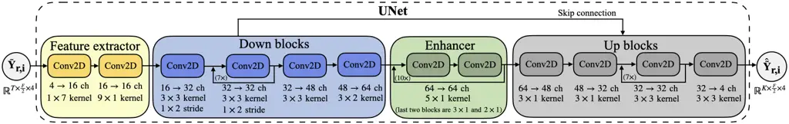
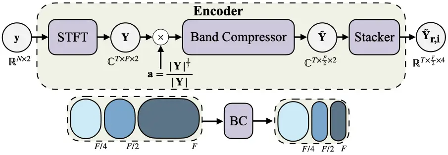
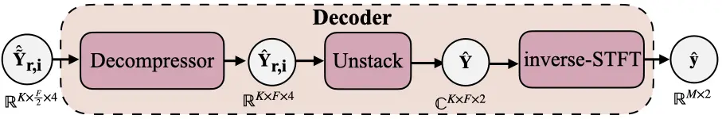
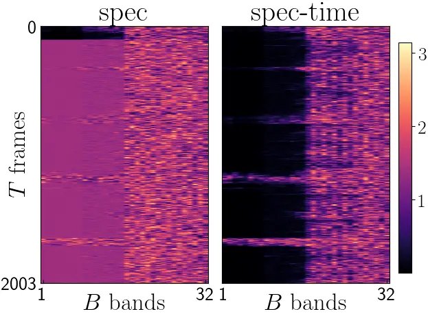
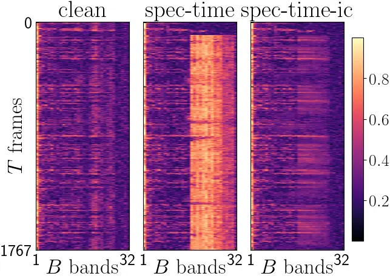
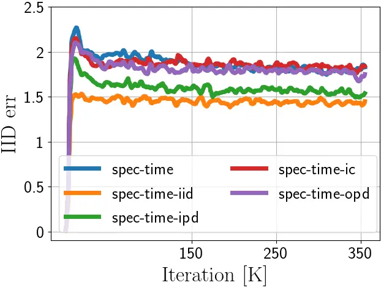
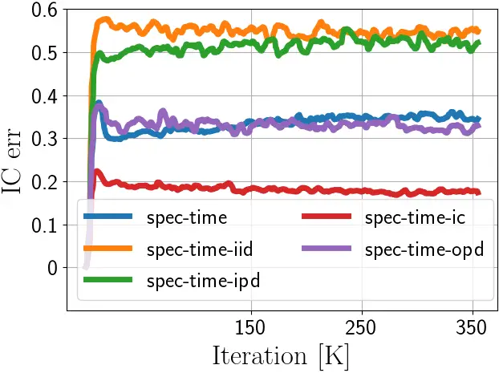

# A Training Framework for Stereo-Aware Speech Enhancement using Deep Neural Networks

Bahareh Tolooshams^(⋆)    Kazuhito Koishida^(†) ^(†)^(†)thanks: Work
done while B. Tolooshams was a Research Intern at Microsoft.

###### Abstract

Deep learning-based speech enhancement has shown unprecedented
performance in recent years. The most popular mono speech enhancement
frameworks are end-to-end networks mapping the noisy mixture into an
estimate of the clean speech. With growing computational power and
availability of multichannel microphone recordings, prior work has aimed
to incorporate spatial statistics along with spectral information to
boost up performance. Despite an improvement in enhancement performance
of mono output, the spatial image preservation and subjective
evaluations have not gained much attention in the literature. This paper
proposes a novel stereo-aware framework for speech enhancement, i.e., a
training loss for deep learning-based speech enhancement to preserve the
spatial image while enhancing the stereo mixture. The proposed framework
is model independent, hence it can be applied to any deep learning based
architecture. We provide an extensive objective and subjective
evaluation of the trained models through a listening test. We show that
by regularizing for an image preservation loss, the overall performance
is improved, and the stereo aspect of the speech is better preserved.

###### Index Terms: 

Stereo speech enhancement, perceptual enhancement, stereo image
preservation, deep neural networks, U-Net.

^(†)^(†)address: ^(⋆)School of Engineering and Applied Sciences, Harvard
University, Cambridge, MA  
^(†) Microsoft Corporation, One Microsoft Way, Redmond, WA  
[$`\mathrm{btolooshams@seas.harvard.edu}`$](mailto:btolooshams@seas.harvard.edu),
[$`\mathrm{kazukoi@microsoft.com}`$](mailto:kazukoi@microsoft.com)

## 1 Introduction

We consider the problem of stereo speech enhancement that is estimating
a stereo clean speech from stereo noisy records. There exists a rich
literature in signal processing for mono speech enhancement. To name a
few, Ephraim and Malah enhance the speech through estimating its
log-spectral amplitude \[1\]. Lim and Oppenheim discuss various
enhancement methods such as Wiener filtering and all-pole speech
modeling \[2\]. Over the past decade, deep learning has gained a lot of
attention for speech enhancement \[3\]; this is partly due to the
growing number of available training datasets (i.e., clean speech and
its noisy counterpart), and partly due to the outperformance of learning
based approaches compared to classical methods \[4, 5, 6\].

Learning based mono speech enhancement is mainly of two forms: a)
predicting the clean speech through a deep neural network such as
U-Net \[7\], or b) estimating a real \[8, 9\] or complex \[10, 11\]
time-frequency (TF) mask such that when applied to the mixture it
predicts the target speech. In the case of multichannel speech
enhancement \[9, 11, 12\], prior work focuses on extracting spatial
features either explicitly at the input or implicitly through the
network. Wang and Wang combine spectral features estimated through
monaural speech enhancement with directional features to improve
performance. Tolooshams et al. capture the spatial info with a
beamforming-inspired architecture to perform complex ratio masking.

Despite the usage of spatial information within the network for speech
enhancement, the preservation of spatial image such as sound image
locations and sensations of depth is barely studied. Prior work on
stereo enhancement mainly provides overall objective evaluations through
metrics such as PESQ \[14\] and STOI \[15\] rather than focusing on
perceptual enhancement through subjective tests. Moreover, in cases of
reported subjective evaluations, mainly overall performance is studied
rather than sound image \[16, 17, 18\]. We note that spatial cue
preservation are studied previously for source separation \[19\].

To fill the gap, this paper proposes a framework to preserve the stereo
image and provide subjective evaluation along with objective metrics to
assess the method. The approach is model-independent and fully focuses
on training through a stereo-aware loss function helping to preserve
spatial information. Specifically, the method regularizes to preserve
interchannel intensity difference (IID), interchannel phase difference
(IPD), interchannel coherence (IC), and overall phase difference (OPD).
This is inspired by traditional methods \[20, 21, 22\], specifically
parametric coding of stereo \[22\], originally developed for efficient
stereo coding to reduce bit-rate.

Section 2 formulates the problem, introduces the stereo-aware training,
and demonstrates the network architecture. The dataset, training details
and evaluation metrics are explained in Section 3. We show in Section 4
that the stereo-aware training not only results in an overall
improvement of the enhanced speech, but also refines the stereo image.
This is supported by both objective and subjective evaluation. Finally,
Section 5 concludes.

## 2 Methods

### 2.1 Problem formulation

Consider the discrete-time noisy speech
$`{\bf y}=[{\bf y}_{1},{\bf y}_{2}]\in\mathbb{R}^{N\times 2}`$ observed
at a stereo microphone. In the stereo speech enhancement problem, we aim
to estimate the clean reverberated stereo speech
$`{\bf s}\in\mathbb{R}^{N\times 2}`$ given the mixture following the
model

```math
{\bf y}[k]={\bf s}[k]+{\bf n}[k] \tag{1}
```

for $`k=1,\ldots,N`$. The received speech $`{\bf s}`$ at the microphone
is the result of convolving the speaker speech with stereo room impulse
responses (RIRs). Similarly, the noise is reverberated through the room
and recorded at the microphone as $`{\bf n}`$. In the time-frequency
domain, the Short-Time Fourier Transform (STFT) of the mixture and
speech are denoted as
$`{\bf Y}=[{\bf Y}_{1},{\bf Y}_{2}]\in\mathbb{C}^{T\times F\times 2}`$
and
$`{\bf S}=[{\bf S}_{1},{\bf S}_{2}]\in\mathbb{C}^{T\times F\times 2}`$
with $`T`$ time frames and $`F`$ frequency bins.

### 2.2 Stereo-aware training

Given the model-independence of the proposed framework, we focus mainly
on the training loss enabling stereo image preservation and discuss the
choice of neural architecture in Section 2.3. Given a set of training
data, a network is trained to minimize a combination of _speech
reconstruction_ and _stereo image preservation_ loss, i.e.,

```math
\mathcal{L}({\bf s},\hat{\bf s})=\mathcal{L}_{\text{speech-rec}}({\bf s},\hat{\bf s})+\mathcal{L}_{\text{image-pres}}({\bf s},\hat{\bf s}) \tag{2}
```

where $`\hat{\bf s}`$ is an estimate of clean speech $`{\bf s}`$ given
the mixture $`{\bf y}`$. We design the _speech reconstruction_ loss to
suppress the noise and improve signal-to-noise ratio (SNR), and the
_image preservation_ loss to conserve features related to the position
of the speaker and microphone.

Speech reconstruction: Given $`{\bf s}`$ and $`\hat{\bf s}`$, the loss
consists of log-spectral distortion (LSD) \[23\] and time loss (TL):

```math
\mathcal{L}_{\text{speech-rec}}({\bf s},\hat{\bf s})=\text{LSD}({\bf s},\hat{\bf s})+\alpha_{\text{TL}}\ \text{TL}({\bf s},\hat{\bf s}) \tag{3}
```

with

```math
\text{LSD}({\bf s},\hat{\bf s})=\frac{1}{2T}\sum_{c=1}^{2}\sum_{t=1}^{T}\sqrt{\frac{1}{F}\sum_{f=1}^{F}\left(g({\bf S}_{c}[t,f])-g(\hat{\bf S}_{c}[t,f])\right)^{2}} \tag{4}
```

and

```math
\text{TL}({\bf s},\hat{\bf s})=\frac{1}{2}\sum_{c=1}^{2}\sqrt{\frac{1}{T}\sum_{t=1}^{T}\left({\bf s}_{c}[t]-\hat{\bf s}_{c}[t]\right)^{2}} \tag{5}
```

where $`g({\bf x})`$ is the generalized logarithmic function with
$`\gamma=\nicefrac{{1}}{{3}}`$ \[24\]. LSD helps to minimize the
spectral error, and TL compensates for phase enhancement in the time
domain.

Image preservation: We study the stereo image of the signal based on
four spatial properties. We follow a similar approach to \[22\] and
quantify the interchannel intensity-phase-coherence differences and
overall phase. Although we study the parameters for image preservation,
the original idea behind it is to reduce the bit-rate of the audio for a
more efficient transmission or storage. For example, instead of
transmitting the stereo signal, one may encode it with a mono downmix
and stereo parameters. Then, the parameters are used by the decoder to
reinstate spatial cues to reconstruct stereo \[22\].

Given STFT
$`{\bf S}_{c}=[{\bf S}_{c}[1],{\bf S}_{c}[2],\ldots,{\bf S}_{c}[F]]`$
for $`c=1,2`$, the frequency bins are grouped into $`B`$ non-overlapping
subbands such that there are total of $`32`$ bins in each band. We leave
non-uniform bands with equivalent rectangular bandwidth (ERB) \[25\] for
future works. For $`F=1024`$, there would be $`B=32`$ bands. For each
band $`b\in[1,2,\ldots,B]`$, we extract IID, IPD, IC, and OPD as
follows:

```math
\text{IID}_{b}({\bf S})=10\log_{10}{\frac{\sum_{f=f_{b}}^{f_{b+1}-1}{\bf S}_{1}[f]{\bf S}_{1}^{*}[f]}{\sum_{f=f_{b}}^{f_{b+1}-1}{\bf S}_{2}[f]{\bf S}_{2}^{*}[f]}} \tag{6}
```

```math
\text{IPD}_{b}({\bf S})=\angle{\left(\sum_{f=f_{b}}^{f_{b+1}-1}{\bf S}_{1}[f]{\bf S}_{2}^{*}[f]\right)} \tag{7}
```

```math
\text{IC}_{b}({\bf S})=\frac{|\sum_{f=f_{b}}^{f_{b+1}-1}{\bf S}_{1}[f]{\bf S}_{2}^{*}[f]|}{\sqrt{(\sum_{f=f_{b}}^{f_{b+1}-1}{\bf S}_{1}[f]{\bf S}_{1}^{*}[f])(\sum_{f=f_{b}}^{f_{b+1}-1}{\bf S}_{2}[f]{\bf S}_{2}^{*}[f])}} \tag{8}
```

```math
\text{OPD}_{b}({\bf S},\hat{\bf S})=\angle{\left(\sum_{f=f_{b}}^{f_{b+1}-1}{\bf S}[f]\hat{\bf S}^{*}[f]\right)} \tag{9}
```

where we denote the frequencies in band $`b`$ by $`[f_{b},f_{b+1})`$ and
$`*`$ denotes complex conjugation. While IID and interchannel time
differences cues are known to be useful for evaluation of sound source
localization \[26, 27, 28\], they have not been used during network
training. We capture the time difference through IPD highlighting the
delay between the channels. IC quantifies the correlation between the
left and right channels given an aligned phase. Finally, OPD encodes the
phase difference between the source and its estimate. Given the spatial
parameters, image preservation error is defined as:

```math
\mathcal{L}_{\text{image-pres}}({\bf s},\hat{\bf s})=\sum_{\text{M}\in\{\text{IID},\text{IPD},\text{IC},\text{OPD}\}}\alpha_{\text{M}}\mathcal{L}_{\text{M}}({\bf S},\hat{\bf S}) \tag{10}
```

where

```math
\mathcal{L}_{\text{M}\in\{\text{IID},\text{IPD},\text{ID}\}}({\bf S},\hat{\bf S})=\frac{1}{T}\sum_{t=1}^{T}\sqrt{\frac{1}{B}\sum_{b=1}^{B}\left(\text{M}_{b}({\bf S})-\text{M}_{b}(\hat{\bf S})\right)^{2}} \tag{11}
```

and

```math
\mathcal{L}_{\text{OPD}}({\bf S},\hat{\bf S})=\frac{1}{2T}\sum_{c=1}^{2}\sum_{t=1}^{T}\sqrt{\frac{1}{B}\sum_{b=1}^{B}\left(\text{OPD}_{b}({\bf S}_{c},\hat{\bf S}_{c})\right)^{2}} \tag{12}
```



(a)



(b)



(c)

Figure 1: Network architecture. (a) U-Net denoiser. (b) Encoder. (c)
Decoder.

### 2.3 Network architecture

The network (Figure 1) consists of three main blocks, i.e., encoder,
denoiser, and decoder. Given the noisy input $`{\bf y}`$, the encoder
computes its STFT $`{\bf Y}`$ and scales it by $`{\bf a}`$. Then, the
signal is passed through a band compressor (BC) and is outputted as a
stack of the real and imaginary components $`\tilde{{\bf Y}}_{r,i}`$. BC
compresses the mixture by a factor of $`2`$ along the frequency domain.
Precisely, it passes the low frequency bins in
$`[0,\nicefrac{{F}}{{4}}]`$, and compresses the bins in
$`[\nicefrac{{F}}{{4}},\nicefrac{{F}}{{2}}]`$ and high frequencies in
$`[\nicefrac{{F}}{{2}},F]`$ by a factor of $`2`$ and $`4`$,
respectively. This compression is achieved by averaging the neighbouring
frequencies.

The denoiser has a U-Net structure \[7\] consisting of a feature
extractor ($`2`$ blocks), down-blocks ($`11`$ blocks), enhancer ($`10`$
blocks), and up-blocks ($`10`$ blocks). The architecture has
skip-connections between down and up-blocks. The building blocks contain
convolution layers, causal along the time axis. All blocks have leaky
ReLU activations with $`\alpha=0.2`$ (except the first extractor block)
and batch normalization (except last up-block). The up-blocks contain
pixel shufflers to reshape the feature map into desired number of
channels.

The decoder decompresses the signal to reverse the BC operation, and
applies an inverse STFT to construct the signal in time domain. The main
results are based on this U-Net architecture. To emphasize the
model-independence of the stereo-aware framework, we additionally train
a similar architecture, which we call U-NetCM, with a decoder estimating
a complex TF mask for enhancement \[10, 11\].

## 3 Experiments

### 3.1 Dataset

Both training and testing data are sampled at $`48`$ kHz. We use the
Deep Noise Suppression (DNS) challenge dataset \[29\] to generate
training stereo data. We picked mono clean and noise tracks at random,
and applied RIRs to create stereo (usage of RIRs instead of head-related
transfer function is to focus on stereo image on the recording device).
Then, clean and noise are mixed with an SNR sampled from
$`\mathcal{N}(5,100)`$ with a range of $`[-10,30]`$ dB. The signals are
leveled up/down using a scale following $`\mathcal{N}(-26,100)`$. We
generate approximately $`1.086`$ M stereo signals. During training, a
random segment of $`1.94`$ s is selected, i.e., $`N=93{,}120`$ samples.

We use two test sets. For each, we create $`560`$ mono utterances, and
construct a stereo test set using test RIRs. The sets are divided into
five groups each with SNR of $`0`$, $`5`$, $`10`$, $`15`$, and $`20`$
dB. The speech and mixture are scaled by a constant following
$`\mathcal{N}(-2,4)`$.

Room impulse responses (RIR): RIRs are simulated using an image method
similar to \[30\]. The room size ranges from $`3\times 3\times 8`$ to
$`8\times 8\times 8`$ $`\text{m}^{3}`$. The microphones are $`20`$ cm
apart and are placed in the room uniformly at random such that their
height ranges from $`1`$ to $`1.5`$ m, and they are within the second
and third quarter in the middle. The speaker and noise are randomly
located in the room with a height ranged from $`1.2`$ to $`1.9`$ m. The
speaker and noise have distances of $`[0.5,2]`$ m and $`[1.5,2]`$ m from
the microphone, respectively. Finally, we make sure that the angle
between the speech and noise is at least $`20^{\circ}`$, and sound
velocity is $`340`$ m/s. The generated RIRs are $`0.9`$ s long and
categorize into two groups of with and without reverberation.

We create around $`4{,}640`$ training rooms and generate $`10`$
utterances for each. For the training set, there are $`12{,}000`$ no
reverberation RIRs, and $`34{,}400`$ reverberated RIRs with $`60`$ dB
attenuation time sampled from $`\text{Unif}[0.2,0.8]`$ s. For each test
set, $`560`$ rooms (i.e., one for each test example) are created. The
sets follow similar characteristics as in the training set, except that
Test set II uses a room height of $`3`$ m (i.e., a typical meeting
room). The test set RIRs are divided into four categories of no, short,
medium, and long reverberation which has $`60`$ dB attenuation in
$`0,0.27,0.53,0.8`$ s, respectively.

### 3.2 Training

The network is trained using ADAM optimizer with $`\beta_{1}=0.5`$,
$`\beta_{2}=0.9`$, and an initial learning rate of $`10^{-4}`$. The
learning rate is scheduled with piecewise constant decay to $`10^{-5}`$
after $`300{,}000`$ iterations. Training is performed on four GPUs using
a batch size of $`64`$ for $`350{,}000`$ iterations. For TL,
$`\alpha_{\text{TL}}`$ is set to $`50`$. Additionally,
$`\alpha_{\text{IID}}=0.05`$, $`\alpha_{\text{IPD}}=0.05`$,
$`\alpha_{\text{IC}}=0.4`$, and $`\alpha_{\text{OPD}}=0.05`$ whenever
the particular error is present. The above weights are chosen such that
all loss components are on the same order. STFT and inverse-STFT blocks
use Hanning windows of length $`2048`$ (i.e., $`F=1024`$) with hop size
of $`480`$. Then, $`T=192`$ time frames are cropped.

### 3.3 Evaluation

Signal-to-distortion ratio (SDR) and perceptual objective listening
quality assessment (POLQA) \[31\] along with stereo preservation errors
are used as objective metrics. Given the enhanced speech, SDR and POLQA
metrics (higher the better) are computed independently for each channel,
and the average is reported. Additionally, we quantify the errors for
IID, IPD, IC and OPD (lower the better).

We perform a listening test following MUSHRA standards \[32\] through a
vendor specialized in designing cloud-based tests. Approximately
$`2{,}750`$ listeners, wearing headphones, participated in the
experiments; each evaluates a subset of the test set given OVRL or IMG
task. Given a reference (i.e., clean speech), listeners are ask to
evaluate and grade several tracks including a hidden reference and an
anchor, i.e., the noisy mixture \[18, 33, 17\]. We evaluate two
attributes (OVRL and IMG). For OVRL, the assessors are asked to evaluate
the overall quality of the audio clips. For IMG, they rate the
stereophonic image quality of the clips (i.e., how close the clips are
to the reference in terms of sound image locations, sensations of depth,
and reality of the speaker). We categorize the MUSHRA grading scheme
from $`1`$ to $`5`$ as ($`1`$) Bad, ($`2`$) Poor, ($`3`$) Fair, ($`4`$)
Good, and ($`5`$) Excellent.

|         |                            |            |       |      |      |      |      |            |      |             |       |      |      |      |      |
| ------- | -------------------------- | ---------- | ----- | ---- | ---- | ---- | ---- | ---------- | ---- | ----------- | ----- | ---- | ---- | ---- | ---- |
| Network | Method                     | Test set I |       |      |      |      |      |            |      | Test set II |       |      |      |      |      |
|         |                            | Objective  |       |      |      |      |      | Subjective |      | Objective   |       |      |      |      |      |
|         |                            | SDR        | POLQA | IID  | IPD  | IC   | OPD  | OVRL       | IMG  | SDR         | POLQA | IID  | IPD  | IC   | OPD  |
|         | noisy                      | 11.61      | 2.51  | 1.56 | 1.92 | 0.20 | 0.78 | 0          | 0    | 11.13       | 2.50  | 1.60 | 1.96 | 0.18 | 0.79 |
| U-Net   | downmix - spec             | 6.46       | 2.98  | 2.68 | 2.79 | 0.30 | 1.61 | x          | x    | 6.16        | 2.95  | 2.70 | 2.83 | 0.31 | 1.62 |
|         | LRindp - spec              | 6.82       | 3.26  | 2.36 | 1.99 | 0.28 | 1.62 | x          | x    | 6.67        | 3.19  | 2.48 | 2.02 | 0.27 | 1.63 |
|         | downmix - spec - time      | 10.10      | 2.95  | 2.39 | 2.78 | 0.29 | 1.40 | 0.34       | 0.30 | 9.65        | 2.92  | 2.42 | 2.82 | 0.29 | 1.40 |
|         | LRindp - spec - time       | 12.89      | 3.31  | 2.42 | 1.92 | 0.27 | 1.27 | 0.42       | 0.35 | 12.27       | 3.24  | 2.55 | 1.95 | 0.26 | 1.27 |
|         | stereo - spec - time       | 12.56      | 3.01  | 1.85 | 1.91 | 0.26 | 1.25 | 0.38       | 0.37 | 11.97       | 2.96  | 1.90 | 1.93 | 0.28 | 1.23 |
|         | stereo - spec - time - IID | 14.17      | 3.33  | 1.55 | 1.76 | 0.35 | 1.42 | 0.45       | 0.41 | 13.64       | 3.26  | 1.59 | 1.79 | 0.39 | 1.43 |
|         | stereo - spec - time - IPD | 13.88      | 3.36  | 1.67 | 1.71 | 0.32 | 1.27 | 0.63       | 0.46 | 13.24       | 3.30  | 1.71 | 1.73 | 0.36 | 1.28 |
|         | stereo - spec - time - IC  | 12.09      | 3.04  | 1.80 | 2.08 | 0.21 | 1.43 | 0.31       | 0.37 | 11.47       | 2.98  | 1.85 | 2.12 | 0.20 | 1.40 |
|         | stereo - spec - time - OPD | 14.05      | 3.33  | 1.86 | 2.10 | 0.23 | 0.99 | 0.42       | 0.49 | 13.35       | 3.28  | 1.90 | 2.15 | 0.22 | 1.00 |
|         | stereo - spec - time - all | 13.78      | 3.32  | 1.64 | 1.81 | 0.21 | 1.10 | 0.45       | 0.43 | 13.16       | 3.25  | 1.69 | 1.85 | 0.19 | 1.11 |
| U-NetCM | stereo - spec              | 6.28       | 3.34  | 2.24 | 2.14 | 0.25 | 2.48 | x          | x    | 6.10        | 3.27  | 2.29 | 2.18 | 0.23 | 2.46 |
|         | stereo - spec - time - all | 15.02      | 3.28  | 1.96 | 1.93 | 0.24 | 1.05 | x          | x    | 14.30       | 3.22  | 2.01 | 1.97 | 0.23 | 1.06 |

Table 1: Evaluation results on stereo test sets.

## 4 Results

We train the stereo network using various combinations of the loss. We
denote the presence of LSD and TL in the training loss by spec and time,
respectively. For example, spec-time-OPD denotes the case where loss
includes LSD, TL, and OPD errors. Given the rich deep learning
literature on enhancing mono signals, we consider two baselines. A mono
network that is trained using downmix (i.e.,
$`\nicefrac{{(L+R)}}{{2}})`$, where for prediction, the phase difference
between the mixture stereo and enhanced downmix is added to reinstate
stereo. We call this method downmix. The other baseline, LRindp, is a
mono network trained using left and right channels independently. We
first compare the baselines to one another, then highlight the effect of
the time loss on the performance, and finally focus on the stereo-aware
training. Table 1 demonstrates the evaluations on the test sets where
the comparisons we highlight bellow holds for both test sets.

Downmix vs. LRindp: LRindp-spec shows better performance in terms of SDR
and POLQA against downmix-spec and also results in a better image
preservation (lower IID, IPD, and IC errors). In spite of the better
performance, LRindp has approximately doubled inference time compared to
downmix. Drawbacks of downmix may come from the addition of noisy phase
at channel-upsampling time.

Presence of time loss: Comparing spec with spec-time, time loss results
in a drastic improvement in SDR with a trade-off being an occasional
decrease in POLQA. TL also helps to preserve OPD. Figure 2(a) highlights
the overall phase preservation using the time loss; compared to
LRindp-spec, LRindp-spec-time has lower OPD in magnitude, particularly
at low-frequency bands.



(a) $`|\text{OPD}|`$ for $`LRindp`$ ($`\text{c}=1)`$.



(b) IC preservation.



(c) IID training dynamics.



(d) IC training dynamics.

Figure 2: Visualization of stereo-parameters and errors.

Mono to stereo: Moving from mono to stereo, we observe that the stereo
image of LRindp-spec-time gets worse, but that of the stereo-spec-time
is improved. Stereo method preserves IID much better than the mono case.
However, LRindp-spec-time (with doubled inference time) has better
performance in terms of SDR and POLQA compared to stereo-spec-time. This
motivates us to regularize for image preservation loss which cannot be
done in a mono network. We show how this helps the stereo network to
outperform LRindp.

Image dynamics during training: We first study the effect of each stereo
parameter independently. Figure 2(c) shows how the IID loss for the
training batch changes as a function of training iterations;
specifically, it shows that IPD regularization alone helps to achieve a
lower IID error and the lowest IID is achieved when the IID loss is
presented. Moreover, Figure 2(d) demonstrates that regularizing for IID
or IPD preservation results in a worse IC than no image regularization
(i.e., stereo-spec-time). The figure highlights that OPD does not have
much effect on IC, and IC can further be improved by regularizing for
IC. Finally, we observe (not shown) that including IC loss during
training results in a worse IPD compared to no regularization training.

Image preservation loss: Given stereo-spec-time, the addition of IID,
IPD, IC, or OPD results in a POLQA improvement. Furthermore,
regularizing for IID, IPD, or OPD, improves SDR. We observed that
regularizing for the preservation of a stereo metric alone (e.g.,
stereo-spec-time-IC) results in the best preservation of that metric
(e.g., IC) in the test sets among all other methods. Figure 2(b)
visualizes IC of the clean speech, predicted signal through
stereo-spec-time and stereo-spec-time-IC from Test set I. The figure
highlights that stereo-spec-time-IC has preserved IC better than
stereo-spec-time. Results show that IID helps the best to improve SDR,
and IPD results in the highest POLQA improvement. Overall, compared to
the unregularized case, stereo-spec-time-all preserves all aspects of
the stereo image. Finally, we note the subjective results may contain
uncertainties in evaluation of the stereo image as it is challenging to
fully ignore the speech distortion while scoring the stereo image.

Subjective evaluation: We conduct four tests on Test set I. In each
test, five tracks (i.e., three methods and hidden noisy and reference)
are compared. To combine the results, we report the mean of relative
score with respect to hidden noisy in each test (higher the better). The
“Subjective” column of Table 1 demonstrates the result of this listening
test where the average relative difference of hidden reference and noisy
is $`1.19`$ and $`1.15`$ for OVRL and IMG, respectively. The table
demonstrates that stereo-spec-time-IPD achieves the highest OVRL score
which also has highest POLQA among all. Moreover, all stereo-aware
training methods results in higher IMG ($`0.49`$ at highest) score
compared to downmix ($`0.3`$) and LRindp ($`0.35`$). We emphasize that
the inference complexity of our stereo networks is approximately half of
LRindp. Among the stereo-aware regularization methods, the listeners
have given highest IMG scores of $`0.49`$ and $`0.46`$ when OPD and IPD,
respectively, are preserved the best (i.e., stereo-spec-time-OPD/IPD).
These results highlight the benefits of the proposed training approach
in subjectively improving the image.

Model independence: We lastly apply a stereo-aware training framework on
a different architecture, U-NetCM (last row of  Table 1). We observe
that including all the stereo errors along with time results in lower
stereo image errors and an improvement in SDR.

## 5 Conclusion

This paper studied the perceptual enhancement of stereo speech. The
paper proposed a stereo-aware training loss to preserve the image while
aiming to estimate the clean speech from noisy mixture. The trained
architecture was a variant of a causal U-Net and the image preservation
loss consist of errors related to interchannel intensity and phase
differences, interchannel coherence, and overall phase. We showed that
accounting for preservation of the stereo image improves the enhancement
both objectively with the SDR and POLQA metrics and subjectively through
a MUSHRA listening test.

## References

- \[1\] Y. Ephraim and D. Malah, “Speech enhancement using a minimum
  mean-square error log-spectral amplitude estimator,” _IEEE Trans.
  Acoust., Speech, Signal Process._, vol. 33, no. 2, pp. 443–5, 1985.
- \[2\] J. Lim and A. Oppenheim, “Enhancement and bandwidth compression
  of noisy speech,” _Proc. the IEEE_, vol. 67, no. 12, pp.
  1586–1604, 1979.
- \[3\] D. Wang and J. Chen, “Supervised speech separation based on deep
  learning: An overview,” _IEEE/ACM Trans. Audio, Speech, Lang.
  Process._, vol. 26, no. 10, pp. 1702–26, 2018.
- \[4\] A. E. Bulut and K. Koishida, “Low-latency single channel speech
  enhancement using u-net convolutional neural networks,” in _Proc. IEEE
  Int. Conf. Acoust., Speech, Signal Process._, 2020, pp. 6214–18.
- \[5\] M. H. Soni, N. Shah, and H. A. Patil, “Time-frequency
  masking-based speech enhancement using generative adversarial
  network,” in _Proc. IEEE Int. Conf. Acoust., Speech, Signal Process._,
  2018, pp. 5039–43.
- \[6\] F. Weninger, H. Erdogan, S. Watanabe, E. Vincent, J. Le Roux,
  J. R. Hershey, and B. Schuller, “Speech enhancement with lstm
  recurrent neural networks and its application to noise-robust asr,” in
  _Proc. Int. Conf. Latent Variable Anal. Signal Separation_. Springer,
  2015, pp. 91–99.
- \[7\] O. Ronneberger, P. Fischer, and T. Brox, “U-net: Convolutional
  networks for biomedical image segmentation,” in _Proc. Int. Conf. Med.
  Image Comput. and Comput.-Assisted Intervention_. Springer, 2015, pp.
  234–41.
- \[8\] S. Chakrabarty, D. Wang, and E. A. Habets, “Time-frequency
  masking based online speech enhancement with multi-channel data using
  convolutional neural networks,” in _Proc. Int. Workshop Acoust. Signal
  Enhancement_, 2018, pp. 476–80.
- \[9\] X. Li and R. Horaud, “Multichannel speech enhancement based on
  time-frequency masking using subband long short-term memory,” in
  _Proc. IEEE Workshop Appl. Signal Process. to Audio and Acoust._,
  2019, pp. 298–302.
- \[10\] D. S. Williamson, Y. Wang, and D. Wang, “Complex ratio masking
  for monaural speech separation,” _IEEE/ACM Trans. Audio, Speech, Lang.
  Process._, vol. 24, no. 3, pp. 483–92, 2015.
- \[11\] B. Tolooshams, R. Giri, A. H. Song, U. Isik, and
  A. Krishnaswamy, “Channel-attention dense u-net for multichannel
  speech enhancement,” in _Proc. IEEE Int. Conf. Acoust., Speech, Signal
  Process._, 2020, pp. 836–40.
- \[12\] R. Gu, J. Wu, S.-X. Zhang, L. Chen, Y. Xu, M. Yu, D. Su,
  Y. Zou, and D. Yu, “End-to-end multi-channel speech separation,”
  _arXiv:1905.06286_, 2019.
- \[13\] Z.-Q. Wang and D. Wang, “All-neural multi-channel speech
  enhancement.” in _Interspeech_, 2018, pp. 3234–38.
- \[14\] A. Rix, J. Beerends, M. Hollier, and A. Hekstra, “Perceptual
  evaluation of speech quality (pesq)-a new method for speech quality
  assessment of telephone networks and codecs,” in _Proc. IEEE Int.
  Conf. Acoust., Speech, Signal Process._, vol. 2, 2001, pp. 749–52.
- \[15\] C. H. Taal, R. C. Hendriks, R. Heusdens, and J. Jensen, “An
  algorithm for intelligibility prediction of time–frequency weighted
  noisy speech,” _IEEE Trans. Audio, Speech, Lang. Process._, vol. 19,
  no. 7, pp. 2125–36, 2011.
- \[16\] A. S. Subramanian, X. Wang, M. K. Baskar, S. Watanabe,
  T. Taniguchi, D. Tran, and Y. Fujita, “Speech enhancement using
  end-to-end speech recognition objectives,” in _IEEE Workshop Appl.
  Signal Process. to Audio Acoust._, 2019, pp. 234–238.
- \[17\] D. T. Braithwaite and W. B. Kleijn, “Speech enhancement with
  variance constrained autoencoders.” in _Interspeech_, 2019, pp.
  1831–35.
- \[18\] A. Polyak, L. Wolf, Y. Adi, O. Kabeli, and Y. Taigman, “High
  fidelity speech regeneration with application to speech enhancement,”
  in _Proc. IEEE Int. Conf. Acoust., Speech, Signal Process._, 2021, pp.
  7143–47.
- \[19\] C. Han, Y. Luo, and N. Mesgarani, “Real-time binaural speech
  separation with preserved spatial cues,” in _Proc. IEEE Int. Conf.
  Acoust., Speech, Signal Process._, 2020, pp. 6404–6408.
- \[20\] C. Faller and F. Baumgarte, “Binaural cue coding-part ii:
  Schemes and applications,” _IEEE Trans. Speech and Audio Process._,
  vol. 11, no. 6, pp. 520–31, 2003.
- \[21\] J. Herre, “From joint stereo to spatial audio coding-recent
  progress and standardization,” in _Proc. Int. Conf. Digital Audio
  Effects_, 2004.
- \[22\] J. Breebaart, S. van de Par, A. Kohlrausch, and E. Schuijers,
  “Parametric coding of stereo audio,” _EURASIP J. on Adv. Signal
  Process._, vol. 2005, no. 9, pp. 1–18, 2005.
- \[23\] Y.-J. Wu and K. Tokuda, “Minimum generation error training with
  direct log spectral distortion on lsps for hmm-based speech
  synthesis,” in _Annu. Conf. Int. Speech Commun. Assoc._, 2008.
- \[24\] T. Kobayashi and S. Imai, “Spectral analysis using generalised
  cepstrum,” _IEEE Trans. Acoust., Speech, Signal Process._, vol. 32,
  no. 6, pp. 1235–1238, 1984.
- \[25\] B. R. Glasberg and B. C. Moore, “Derivation of auditory filter
  shapes from notched-noise data,” _Hearing Res._, vol. 47, no. 1-2, pp.
  103–38, 1990.
- \[26\] L. Rayleigh, “On our perception of sound direction,” _The
  London, Edinburgh, Dublin Philosophical Mag. J. Sci._, vol. 13,
  no. 74, pp. 214–32, 1907.
- \[27\] B. M. Sayers, “Acoustic-image lateralization judgments with
  binaural tones,” _The J. Acoustical Soc. Am._, vol. 36, no. 5, pp.
  923–26, 1964.
- \[28\] T. Van den Bogaert, J. Wouters, S. Doclo, and M. Moonen,
  “Binaural cue preservation for hearing aids using an interaural
  transfer function multichannel wiener filter,” in _Proc. IEEE Int.
  Conf. Acoust., Speech, Signal Process._, vol. 4, 2007, pp.
  IV–565–IV–568.
- \[29\] C. K. Reddy, H. Dubey, K. Koishida, A. Nair, V. Gopal,
  R. Cutler, S. Braun, H. Gamper, R. Aichner, and S. Srinivasan,
  “Interspeech 2021 deep noise suppression challenge,” in
  _Interspeech_, 2021.
- \[30\] W. Rao, Y. Fu, Y. Hu, X. Xu, Y. Jv, J. Han, Z. Jiang, L. Xie,
  Y. Wang, S. Watanabe _et al._, “Interspeech 2021 conferencingspeech
  challenge: Towards far-field multi-channel speech enhancement for
  video conferencing,” _arXiv:2104.00960_, 2021.
- \[31\] J. G. Beerends, C. Schmidmer, J. Berger, M. Obermann,
  R. Ullmann, J. Pomy, and M. Keyhl, “Perceptual objective listening
  quality assessment (polqa), the third generation itu-t standard for
  end-to-end speech quality measurement part i—temporal alignment,” _J.
  Audio Eng. Soc._, vol. 61, no. 6, pp. 366–84, 2013.
- \[32\] B. Series, “Method for the subjective assessment of
  intermediate quality level of audio systems,” _Int. Telecommun. Union
  Radiocommun. Assembly_, 2014.
- \[33\] F. Deng and C.-C. Bao, “Speech enhancement based on bayesian
  decision and spectral amplitude estimation,” _EURASIP J. Audio,
  Speech, Music Process._, vol. 2015, no. 1, pp. 1–18, 2015.
