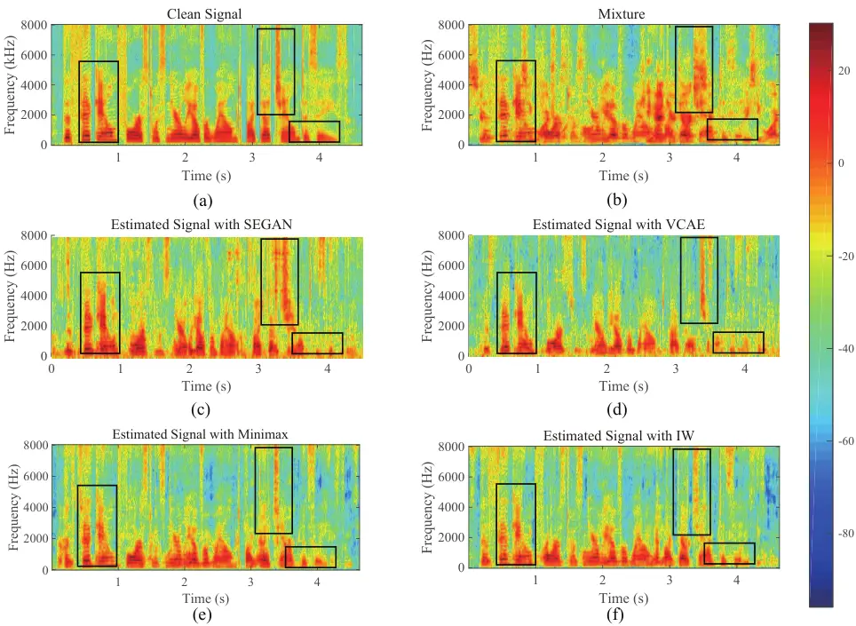

# Domain Adaptation and Autoencoder Based Unsupervised Speech EnhancementThanks: Y. Li and S. M. Naqvi are with the Intelligent Sensing and Communications Group, School of Engineering, Newcastle University, Newcastle upon Tyne NE1 7RU, U.K. (e-mails: y.li140, mohsen.naqvi@newcastle.ac.uk) Y. Sun is working with the Big Data Institute, University of Oxford, Oxford OX3 7LF, U.K. (e-mail: Yang.sun@bdi.ox.ac.uk) K. Horoshenkov holds the position of a Personal Chair at the University of Sheffield. (e-mail: k.horoshenkov@sheffield.ac.uk)

Yi Li    Yang Sun Affiliation: Kirill Horoshenkov,  and Syed
Mohsen Naqvi, 

###### Abstract

As a category of transfer learning, domain adaptation plays an important
role in generalizing the model trained in one task and applying it to
other similar tasks or settings. In speech enhancement, a well-trained
acoustic model can be exploited to obtain the speech signal in the
context of other languages, speakers, and environments. Recent domain
adaptation research was developed more effectively with various neural
networks and high-level abstract features. However, the related studies
are more likely to transfer the well-trained model from a rich and more
diverse domain to a limited and similar domain. Therefore, in this
study, the domain adaptation method is proposed in unsupervised speech
enhancement for the opposite circumstance that transferring to a larger
and richer domain. On the one hand, the importance-weighting (IW)
approach is exploited with a variance constrained autoencoder to reduce
the shift of shared weights between the source and target domains. On
the other hand, in order to train the classifier with the worst-case
weights and minimize the risk, the minimax method is proposed. Both the
proposed IW and minimax methods are evaluated from the VOICE BANK and
IEEE datasets to the TIMIT dataset. The experiment results show that the
proposed methods outperform the state-of-the-art approaches.

###### Index Terms: 

domain adaptation, speech enhancement, variance constrained autoencoder,
importance-weighting, minimax

Impact Statement-Speech enhancement plays an essential role in
real-world applications such as teleconferencing. However, unsupervised
learning is challenging to realize but vital in unknown speech
environments. This paper facilitates the domain adaptation research in
unsupervised speech enhancement. In particular, we propose the
importance-weighting and minimax methods to further improve speech
enhancement performance. This work will help developers to save
computational cost when applying to different testing groups. The
proposed methods are also beneficial for researchers in other transfer
learning tasks such as transferring a model trained for one language to
another.

## I INTRODUCTION

In recent years, machine learning research has been developed and
exploited in speech enhancement. In order to solve the tasks in
real-world applications such as hearing aids, machine translation, and
robotics, various techniques, including deep learning, reinforcement
learning (RL), and transfer learning, have been extensively utilized for
the past decade \[1\]. As the main concept of deep learning, it refers
to the hidden layers and neural units of various network models that
have been applied in supervised and unsupervised problems. It has
significantly improved speech enhancement performance because of the
regression model \[2, 3, 4\]. The main target for RL algorithms is to
decide a direction or action in different environments for maximizing
the sum of a cumulative reward \[5\]. Due to the unique principle, the
RL has been exploited in computer game design and dialogue management
\[6\].

As one of the categories, transfer learning has been extensively
utilized in speech enhancement to reduce computational complexity
\[7\]\[8\]. In recent studies, because all human languages share some
common semantic structures, transfer learning has been proposed to adopt
a well-trained neural network model for crossing various settings,
including languages, speakers, genders, and environments \[9\]. In the
multi-domain problems, the main concept of transfer learning is to build
the domains crossing correspondence by the shared classes, and the model
trained in one domain is transferred and reused in different domains. Xu
et al. exploited deep neural networks (DNNs) obtained with high-resource
materials for one language to cross over to another target language
using a small amount of adaptation data \[10\]. Furthermore, some unseen
speaker and noise problems were studied and the performance was improved
by speech enhancement generative adversarial networks (SEGANs) \[11\].

| Noise             | psquare |      |      | living |      |      | station |      |      | Average |
| ----------------- | ------- | ---- | ---- | ------ | ---- | ---- | ------- | ---- | ---- | ------- |
| SNR level (dB)    | -5      | 0    | 5    | -5     | 0    | 5    | -5      | 0    | 5    |         |
| Unprocessed       | 58.5    | 61.3 | 66.6 | 57.3   | 59.2 | 63.8 | 56.8    | 59.7 | 60.0 | 60.1    |
| VOICE BANK \[12\] | 76.1    | 78.5 | 82.8 | 71.5   | 73.6 | 79.9 | 71.8    | 73.0 | 76.8 | 76.0    |
| IEEE \[13\]       | 73.8    | 77.1 | 82.5 | 70.6   | 72.9 | 77.5 | 69.3    | 71.6 | 75.4 | 74.5    |
| TIMIT \[14\]      | 73.4    | 76.9 | 82.1 | 70.5   | 72.6 | 77.0 | 69.4    | 71.3 | 74.9 | 74.2    |
| WSJ0 \[15\]       | 72.1    | 75.3 | 80.9 | 69.4   | 71.2 | 75.8 | 68.8    | 70.9 | 75.0 | 73.2    |

TABLE I: SPEECH ENHANCEMENT PERFORMANCE COMPARISON IN TERMS OF STOI (IN
$`\%`$) WITH VCAE BUT DIFFERENT SNR LEVELS AND NOISES. THE VOICE BANK
DATASET IS USED IN THE TRAINING STAGE AND DIFFERENT DATASETS ARE FOR THE
TESTING STAGE. BOLD INDICATES THE BEST RESULTS.

Domain adaptation plays an important role as a research aspect of
transfer learning in modern applications such as automatic speech
recognition (ASR), machine translation, and text classification \[12,
13, 14, 15\]. For example, Park et al. realized the robustness in ASR
systems with generative adversarial networks (GANs) and disentangled
representation learning \[16\]. In recent years, domain adaptation has
become a highly studied task in speech enhancement due to the importance
that the well-trained model is suitable for various scenarios. In \[9\],
transfer component analysis (TCA) was proposed to solve the
semi-supervised domain adaptation problems with maximum mean discrepancy
(MMD). As a robust approach to the domain adaptation problems, domain
adversarial training (DAT) extracts the domain invariant features and
trains the discriminator to determine the input source based on the
extracted features \[17\]. Therefore, the information of the domains is
not fully exploited in the downstream task and the above techniques have
limitations. Besides, joint distribution adaptation (JDA) jointly
utilizes both the marginal distribution and conditional distribution,
and integrate JDA with Principal Component Analysis (PCA) to build new
feature representation \[18\]. The difference of both distributions
between source and target domains is minimized by reducing MMD. However,
the strict conditions of use and complex training process limit the JDA
methods. Moreover, JDA methods require more labeled drift samples to
participate in the model construction. Transfer learning becomes more
challenging as domains may change by the joint distributions of input
features and output labels, which is a common scenario in practical
applications \[19\].

In order to improve the performance, neural networks such as recurrent
neural networks (RNNs) and GANs have been introduced in domain
adaptation problems \[20\]\[21\]. For example, Zhang et al. exploited
importance weighted adversarial networks within the partial domain
adaptation approach and reduced the shift between the target data and
the source data \[22\]. The cross-domain method has a substantially
better performance in a specific scenario, where it is required to
transfer from a larger and more diverse source domain to a smaller and
more similar target domain with less number of classes. However, in
real-world scenarios, a well-trained model is generally required for a
more challenging case such as transferring the model from less and
dependent source speakers to more and independent speakers \[17\].
Therefore, in this paper, the minimax method is proposed and introduced
to solve the domain adaptation problem from a limited and more similar
source domain to a rich and more diverse target domain. Moreover, in
\[22\], the focus was on object recognition problems and the adversarial
network was selected due to the advantages in classifying the objects.
However, it is challenging for the state-of-the-art GAN approaches to
realize the Nash equilibrium as compared to variance constrained
autoencoders (VAEs) or Pixel RNNs \[23\]. Recent studies have shown that
the autoencoder is advantageous at learning smooth latent state
representations of the input data to reduce computational complexity,
which has been exploited in speech enhancement \[24\]\[25\]. Therefore,
the importance-weighting (IW) method is exploited in the proposed
techniques by using a variance constrained autoencoder (VCAE) to improve
the speech enhancement performance.

The contributions of this paper are:

1\) The importance of domain adaptation in unsupervised speech
enhancement is confirmed and the IW method is proposed to utilize two
classifiers with the variance constrained autoencoder to estimate the
importance weights of the source samples. Besides, the improved
performance is verified by the IEEE dataset \[13\].

2\) To strengthen the generalization performance of the domain
adaptation method, the minimax method is proposed to transfer the model
from a limited source domain to a rich target domain and the performance
is confirmed with the VOICE BANK dataset \[12\].

The organization of this paper is as follows: in Section II, two
proposed methods, including the structure of the IW-VCAE approach, are
shown in details. Section III presents the experimental settings,
results, and discussions. Finally, the conclusions and future work are
provided in Section IV.

## II PROPOSED METHOD

In this section, the proposed methods and their comparisons to domain
adaptation speech enhancement in different scenarios are presented.

Fig. 1: The structure of the proposed importance weighting - variance
constraint autoencoder (IW-VCAE). The features of the source and target
domain mixtures, $`\mathit{X_{S}}`$ and $`\mathit{X_{T}}`$ respectively,
are the inputs to the first classifier. The second classifier uses the
weights and distributions of samples to estimate the loss function and
the weighted features. Finally, the enhanced signals are obtained from
the VCAE.

### II-A Problem Statements and Domain Adaptation

In the speech enhancement, the input and output spaces are denoted as
$`\mathit{X}`$ and $`\mathit{Y}`$, respectively. We present the source
domain as ($`\mathit{X_{S}}`$, $`\mathit{Y_{S}}`$, $`\mathit{p_{S}}`$)
and refer to it with $`\emph{S}`$. Similarly, the target domain is
denoted as ($`\mathit{X_{T}}`$, $`\mathit{Y_{T}}`$, $`\mathit{p_{T}}`$)
and referred to by $`\emph{T}`$. The domain-specific functions are
presented with the subscripts $`\emph{S}`$ and $`\emph{T}`$. For
example, $`p_{S}(\mathbf{x},\mathbf{y})`$ and
$`\mathit{p_{T}(\mathbf{x},\mathbf{y})}`$ are the source and target
joint distributions, respectively. Moreover,
$`\mathit{p_{S}(\mathbf{x})}`$ is for the source data marginal
distribution and $`\mathit{p_{T}(\mathbf{x}|\mathbf{y})}`$ as the target
class-conditional distribution.

Unsupervised domain adaptation (UDA) is a task to train a regression
model on labeled data from a source domain to improve performance on a
target domain, with access to only unlabeled data in the target domain
\[16\]. In domain adaptation problems, according to the distribution
comparisons between the source and the target domains, they are
generally divided into two categories. The first is transferring from a
rich and diverse domain to a limited and similar domain. In this case,
the neural networks are trained by more weighted samples and classes.
The second is transferring from a limited and similar domain to a rich
and diverse domain and is much more challenging compared to the first
category in speech enhancement. In order to perform the importance of
the domain adaptation, TABLE I shows the speech enhancement performance
comparison using the same dataset in the training stage but different
datasets in the testing stage \[26\].

From TABLE I, it can be observed that the speech enhancement performance
is reduced in all scenarios compared to the same dataset, VOICE BANK,
utilized in both the training and testing stages. The first reason for
the generalization problem is the difference in the tones caused by the
various microphones in datasets recording \[24\]. Furthermore, the
environmental factors, including the distance of the speakers to the
microphone, the location of the speakers, and the background
interferences, play an important role in speech quality. Although the
selected speakers of the dataset are independent, they are more likely
selected from the same territorial area where the acoustic features such
as the accent are highly similar. Therefore, the proposed methods
address the domain adaptation problem by identifying the source samples
that are potentially from the outlier weights and reducing the shift of
shared weights between the source and target domains. The proposed
IW-VCAE method is described in Section II. B.

### II-B Importance-Weighting VCAE

In neural network training, the weighting samples from the source domain
to the target domain are exclusively exploited in the covariate shift
due to the importance of generating better regression models. As in
\[27\], the authors focused the source distribution to correct the
probability of the target distribution, an importance-weighted
classifier is required to learn and weight the source and the target
samples. Therefore, a generalization error bound is added and the
difference between the true target error of the classifier,
$`e_{T}(\mathbf{x})`$, and the empirical weighted source error,
$`\hat{e}_{S}(\mathbf{x})`$, at sample size, $`n`$, can be presented as
\[7\]:

```math
\frac{e_{T}(\mathbf{x})-\hat{e}_{S}(\mathbf{x})}{2}\leq\!\sqrt[5/4]{\mathrm{D}_{2}(\mathit{p_{T}}||\mathit{p_{S}})}\sqrt[3/8]{\frac{h}{n}\mathrm{log}(\frac{ne}{h})\!+\!\frac{1}{n}\mathrm{log}(\frac{4}{\delta})} \tag{1}
```

where the probability is at least 1-$`\delta`$, for 0
$`<\delta\leqslant`$ 1. Moreover,
$`\mathrm{D}_{2}(\mathit{p_{T}}||\mathit{p_{S}})`$ represents the
second-order R$`\acute{\mathrm{e}}`$nyi divergence which is related to
R$`\acute{\mathrm{e}}`$nyi entropy as a measurement of information that
satisfies almost the same axioms as Kullback-Leibler divergence (KLD)
\[28\]. The second-order refers to two distributions as
$`\mathit{p_{T}}`$ and $`\mathit{p_{S}}`$. The pseudo-dimension of the
finite hypothesis space is represented as $`h`$, which is exploited to
show the complexity of the hypothesis space \[29\]. $`e`$ is the Euler’s
number. Furthermore, the weights are required to be nonzero, and
$`\mathrm{D}_{2}(\mathit{p_{T}}||\mathit{p_{S}})`$, $`n`$ and $`h`$ are
finite. In order to generalize domain adaptation performance,
$`\mathrm{D}_{2}(\mathit{p_{T}}||\mathit{p_{S}})`$ is trained to maximum
for the significantly different source and target domains, in which case
the generalization difference range is varied.

In order to estimate the weights, the KLD between the true target
distribution and the IW source distribution can be simplified as:

```math
\displaystyle D_{KL}(\omega,p_{S},p_{T}) \displaystyle=\!\int_{X}p_{T}(\mathbf{x})\mathrm{log}(\frac{p_{T}(\mathbf{x})}{p_{S}(\mathbf{x})\omega(\mathbf{x})})\mathrm{d}\mathbf{x} \tag{2}
```

```math
\displaystyle=\!\int_{X}p_{T}(\mathbf{x})\mathrm{log}(\frac{p_{T}(\mathbf{x})}{p_{S}(\mathbf{x})})\mathrm{d}\mathbf{x}\!-\!\int_{X}\!p_{T}(\mathbf{x})\mathrm{log}(\omega(\mathbf{x}))\mathrm{d}\mathbf{x}
```

where $`\omega(\mathbf{x})`$ represents the weight of the sample and
$`\mathbf{x}`$ is the sample. In the right-hand side of the equation,
the first term is independent of the weights. Therefore, the second term
$`\int_{X}\!\mathit{p_{T}}(\mathbf{x})\mathrm{log}\omega(\mathbf{x})\mathrm{d}\mathbf{x}`$
is utilized in the optimization function. Moreover, as the expected
value of the logarithmic weights with the responding target domain
distribution, the second term is estimated with the unlabeled target
samples as:

```math
\mathbb{E}_{T}(\mathrm{log}(\omega(\mathbf{x})))\approx\frac{1}{m}\sum_{j}^{m}\mathrm{log}(\omega(z_{j})) \tag{3}
```

where $`m`$ represents the sample size of the target domain and the
$`z_{j}`$ denotes the $`j`$th observation drawn from the target domain.
Fig. 1. presents the overview of the proposed IW-VCAE method.

As shown in Fig. 1, in the training stage, the feature extraction for
the source domain $`X_{S}`$ and the generated target domain $`X_{T}`$
are input to the first domain classifier to obtain the importance
weights of the source samples.

```math
C(\mathit{X})=\mathit{p}(y=1|\mathit{X})=\sigma(\mathit{X}) \tag{4}
```

where $`C`$ is the classifier and $`\sigma(\cdot)`$ is the logistic
sigmoid function. $`\mathit{X}`$ is the sample in the features space
after feature extraction. In the backward propagation training, the
first domain classifier is converged to the optimal value based on the
input and provides the sampling likelihood with the source distribution.
Hence, the weights for source samples from outlier classes will be
smaller than the shared class samples. In order to obtain the source
sample importance weights, the samples are assumed to have relatively
small weights as compared with the samples from the shared weights.
Therefore, the weights can be defined and normalized as:

```math
\omega(\mathbf{x})=\frac{1-C(\mathit{X})}{\mathbb{E}_{\mathbf{x}\sim\mathit{p}_{S}(\mathbf{x})}(1-C(\mathit{X}))} \tag{5}
```

such that
$`\mathbb{E}_{\mathrm{x}\sim\mathit{p}_{S}(\mathrm{x})}\omega(\mathrm{x})=1`$.
It can be seen that if $`\omega(\mathbf{x})`$ is relatively small,
$`C(\mathit{X})`$ is large and
$`\frac{\mathit{p}_{S}(\mathrm{x})}{\mathit{p}_{T}(\mathrm{x})}`$ is
small because $`\omega(\mathbf{x})`$ also represents density ratio
between source and target features. Hence, the weights for source
samples from outlier classes will be smaller than the shared class
samples. However, in order to reduce the Jensen-Shannon divergence
between the source and target densities, the second domain classifier is
introduced based on the output of the $`C`$, namely $`C_{2}`$ \[30\].

In order to reduce the domain shift, the importance weights are added to
the source samples for the second domain classifier $`C_{2}`$ and the
loss function can be presented as:

```math
\displaystyle\mathit{l_{\omega}}\left(C_{2},X_{S},X_{T}\right)=\mathbb{E}_{\mathbf{x}\sim p_{S}(\mathbf{x})}\omega(\mathbf{x})\log\left(C_{2}\left(X_{S}\right)\right) \tag{6}
```

```math
\displaystyle+\mathbb{E}_{\mathbf{x}\sim p_{T}(\mathbf{x})}(1-\log\left(C_{2}\left(X_{T}\right)\right))
```

where $`\omega(\mathbf{x})`$ is a function of the first domain
classifier and independent of $`C_{2}`$. Because $`\omega(\mathbf{x})`$
is normalized, $`\omega(\mathbf{x})\mathit{p}_{S}(\mathbf{x})`$ can be
regarded as a probability density function:

```math
\mathbb{E}_{\mathbf{x}\sim\mathit{p}_{S}(\mathbf{x})}\omega(\mathbf{x})=\int\omega(\mathbf{x})\mathit{p}_{S}(\mathbf{x})\mathrm{d}\mathbf{x}=1 \tag{7}
```

To obtain the optimal value of $`C_{2}`$, the loss function can be
reformulated as:

```math
\displaystyle\mathit{l_{\omega}}(X_{T}) \displaystyle=\int_{x}\omega(\mathbf{x})\mathit{p}_{S}(\mathbf{x})\mathrm{log}(\frac{\omega(\mathbf{x})\mathit{p}_{S}(\mathbf{x})}{\omega(\mathbf{x})\mathit{p}_{S}(\mathbf{x})+\mathit{p}_{T}(\mathbf{x})}) \tag{8}
```

```math
\displaystyle+\mathit{p}_{T}(\mathbf{x})\mathrm{log}(\frac{\mathit{p}_{T}(\mathbf{x})}{\omega(\mathbf{x})\mathit{p}_{S}(\mathbf{x})+\mathit{p}_{T}(\mathbf{x})})
```

Besides, the loss function can be simplified as:

```math
\mathit{l_{\omega}}(X_{T})=2\mathit{JS}[\omega(\mathbf{x})\mathit{p}_{S}(\mathbf{x})||\mathit{p}_{T}(\mathbf{x})] \tag{9}
```

where $`\mathit{JS}`$ is the Jensen-Shannon divergence between the
weighted source and target densities based on the feature extractor and
is optimized as
$`\omega(\mathrm{x})\mathit{p}_{S}(\mathrm{x})=\mathit{p}_{T}(\mathrm{x})`$.
Furthermore, after $`\mathit{JS}`$ is reduced by the weighted samples
domain adaptation, the VCAE is utilized to improve the speech
enhancement performance. The pseudo code of the proposed IW-VCAE method
is summarized as Algorithm 1.

input : Extracted features $`\mathit{X_{S}}`$ and $`\mathit{X_{T}}`$

output : Desired signal

1 Initialize the feature extractors for _$`epoch\leftarrow 1,2,...,`$
$`30`$_ do

    2 while
_$`\mathbb{E}_{\mathrm{x}\sim\mathit{p}_{S}(\mathrm{x})}\omega(\mathrm{x})=1`$_
do

       3 Train $`C(\mathit{X})`$ by as Eq. (4) in Section II. B;

    4 end while

    5 while _$`\omega(\mathrm{x})`$ is normalized_ do

       6 Train $`C_{2}`$ by minimizing the loss function as Eq. (9) in
Section II. B;

    7 end while

    8 Constrain $`X_{T}`$ by minimizing the entropy;

    9 Sample $`\mathbf{x}_{i}`$ with $`\mathbf{\omega}_{i}`$ from the
classifier;

    10 Sample $`\mathbf{z}_{i}`$ from the classifier and prior p(z);

    11 Compute the gradients of hyperparameters $`\theta`$ and
$`\lambda`$ if _$`\mathbf{x}_{i}`$ or $`\mathbf{z}_{i}`$ is overfitting_
then

       12 Compute and normalize the latent vector;

    13 else

       14 Train the VCAE by optimizing Eq. (10) in Section II. B;

    15 end if

16 end for

Algorithm 1 IW-VCAE pseudo code.

In the training stage, given by the underlying features $`Z`$, the
likelihood of the domain samples is maximized as \[26\]:

```math
\displaystyle\underset{\phi,\theta}{\mathrm{max}} \displaystyle\mathbb{E}_{X_{S}\sim\mathit{p}(\mathbf{x})}\mathbb{E}_{Z\sim\mathit{p}_{\phi}(\mathbf{z}|\mathbf{x})}\left\{\mathrm{log}[\mathit{p}_{\theta}(X_{S}|Z)]\right\} \tag{10}
```

```math
\displaystyle- \displaystyle\lambda\left|\mathbb{E}_{Z\sim\mathit{p}_{\phi}(\mathbf{z})}[\left\|Z-\mathbb{E}_{Z\sim\mathit{p}_{\phi}(\mathbf{z})}[Z]\right\|_{2}^{2}]-v\right|
```

where $`\mathit{p}_{\phi}(\cdot)`$ and $`\mathit{p}_{\theta}(\cdot)`$
represent the encoder and decoder distributions with the parameters,
$`\phi`$ and $`\theta`$, in the network, respectively \[26\]. Moreover,
$`\lambda`$ is a hyperparameter, $`\mathbf{z}`$ is the latent feature,
and $`v`$ is the desired summed variance of the distribution. After the
likelihood is optimized in the network, less desired signals are
obtained at the terminals of the input block window than in the middle
as the same mixture and the desired speech block sizes. Therefore,
additional weighted samples are input to the encoder and provide
information about the signal performance at the window boundaries. The
extracted features of 1000 importance weighted noisy samples are
utilized as the input to enhance the desired signal. Additionally, a
weight regularization preprocessing block is added between the encoder
and the decoder to address the overfitting problem caused in the
training stage \[31\]. The VCAE is penalized based on the size of the
network weights in the training stage.

### II-C Minimax

Under the specific settings, the IW method can significantly improve
speech enhancement performance. However, in some further challenging
scenarios in which the assumptions including limited source samples, the
domain adaptation is possible to be detrimental to the performance.
Furthermore, well-trained models can encounter different sorts of
settings in real-world scenarios. Therefore, minimax is proposed to
train the classifier with the worst-case weights.

A risk-minimization model is generalized if the decisions made by the
information on one specific problem are available for the other similar
problems. Initially, in order to guarantee the improvement, the
worst-case setting is assumed, which is formalized as the minimax
optimization method. The main concept of the proposed method is that the
risk is minimized using the classifier parameters and the strengthening
variables are maximized. Because the IW classifier is sensitive to
poorly trained weights, the risk is minimized using the worst-case
weights:

```math
\underset{h\epsilon\emph{H}}{min}\ \underset{\omega\epsilon\emph{H}}{max}\ \frac{1}{n}\sum_{i=1}^{n}\emph{l}(h(\mathbf{x}_{i}),z_{j})\omega_{i} \tag{11}
```

where $`h(\mathbf{x}_{i})`$ represents the decision made by the
classifier and $`\emph{H}`$ is the finite hypothesis space. The pseudo
code of the proposed minimax method is summarized as Algorithm 2.

input : Extracted features $`\mathit{X_{S}}`$ and $`\mathit{X_{T}}`$
with worst-case $`\omega`$

output : Desired signal

1 for _$`epoch\leftarrow 1,2,...,`$ $`30`$_ do

    2 if _$`\omega_{i}\leqslant 0`$ or $`\omega_{i}>1`$_ then

       3 Add a vector norm penalty to the Robust Bias-Aware classifier;

    4 else

       5 Train Robust Bias-Aware classifier by optimizing Eq. (11) in
Section II. C;

    6 end if

    7 Sample $`\mathbf{x}_{i}`$ with $`\mathbf{\omega}_{i}`$ from the
classifier;

    8 Sample $`\mathbf{z}_{i}`$ from the classifier and prior p(z);

    9 Compute the gradients of hyperparameters $`\theta`$ and
$`\lambda`$ if _$`\mathbf{x}_{i}`$ or $`\mathbf{z}_{i}`$ is overfitting_
then

       10 Compute and normalize the latent vector;

    11 else

       12 Train the VCAE by optimizing Eq. (10) in Section II. B;

    13 end if

14 end for

Algorithm 2 Minimax pseudo code.

The estimated weights are constrained as:

```math
0<\omega_{i}\leqslant 1 \tag{12}
```

```math
\left|\frac{1}{n}\sum_{i}^{n}\omega_{i}-1\right|\leq\epsilon \tag{13}
```

where $`\left|\cdot\right|`$ is the absolute value operator and
$`\epsilon`$ is a small value variable to ensure that the estimated
weights are constrained to 1 and the constraints match the
non-parametric weight estimators. Different from the proposed IW method
utilizing two classifiers, the minimax approach uses only one as Robust
Bias-Aware classifier. The conditional label distribution is provided
and is robust to the worst-case logarithmic loss for the target domain
distribution while matching feature expectation constraints from the
source domain distribution \[32\].

From Algorithm 1 and Eq. (5), in the training stage,
$`\mathbb{E}_{\mathrm{x}\sim\mathit{p}_{S}(\mathrm{x})}\omega(\mathrm{x})`$
is converged to 1. Thus, the density ratio between the source and target
features is normalized and the shift of shared weights between the
source and target domains is reduced. However, the proposed minimax
method uses the worst-case weights for the initialization at the input
of the classifier and the weights are constrained to reduce the
overfitting problem during the training. Moreover, the minimax method
requires only one classifier and reduces computational complexity. Thus,
the minimax method is better suitable for the real-world scenarios where
transferring from a small dataset containing limited sorts of samples to
a large dataset with rich samples.

## III EXPERIMENTAL RESULTS

| Noise                | psquare |      |      | living |      |      | station |      |      | Average |
| -------------------- | ------- | ---- | ---- | ------ | ---- | ---- | ------- | ---- | ---- | ------- |
| SNR level (dB)       | -5      | 0    | 5    | -5     | 0    | 5    | -5      | 0    | 5    |         |
| Unprocessed          | 58.5    | 61.3 | 66.6 | 57.3   | 59.2 | 63.8 | 56.8    | 59.7 | 60.0 | 60.1    |
| SEGAN \[33\]         | 70.0    | 73.6 | 78.9 | 68.7   | 70.1 | 73.5 | 65.3    | 66.8 | 69.9 | 70.7    |
| VCAE \[26\]          | 73.4    | 76.9 | 82.1 | 70.5   | 72.6 | 77.0 | 69.4    | 71.3 | 74.9 | 74.2    |
| DANN \[34\]          | 73.8    | 78.1 | 83.0 | 71.2   | 74.0 | 79.1 | 70.7    | 71.9 | 75.3 | 75.2    |
| IWAE \[21\]          | 74.1    | 78.2 | 83.0 | 71.6   | 74.2 | 79.2 | 70.5    | 72.1 | 75.2 | 75.3    |
| ADDA \[35\]          | 74.2    | 78.4 | 83.2 | 71.5   | 74.2 | 79.6 | 70.9    | 72.3 | 75.5 | 75.5    |
| Importance-weighting | 74.9    | 79.7 | 84.8 | 72.1   | 74.9 | 80.6 | 71.5    | 73.2 | 77.1 | 76.5    |
| Minimax              | 75.3    | 79.9 | 84.9 | 73.0   | 75.7 | 81.6 | 73.2    | 74.6 | 78.1 | 77.4    |

TABLE II: SPEECH ENHANCEMENT PERFORMANCE COMPARISON IN TERMS OF STOI (IN
$`\%`$) WITH DIFFERENT TRAINING METHODS, SNR LEVELS AND NOISES. THE
VOICE BANK DATASET IS USED IN THE TRAINING STAGE AND TIMIT DATASET IS
FOR THE TESTING STAGE. BOLD INDICATES THE BEST RESULTS. Italic SHOWS THE
PROPOSED METHODS. EACH RESULT IS AVERAGE OF 900 EXPERIMENTS.

| Noise                | psquare |      |      | living |      |      | station |      |      | Average |
| -------------------- | ------- | ---- | ---- | ------ | ---- | ---- | ------- | ---- | ---- | ------- |
| SNR level (dB)       | -5      | 0    | 5    | -5     | 0    | 5    | -5      | 0    | 5    |         |
| Unprocessed          | 1.59    | 1.70 | 1.81 | 1.50   | 1.57 | 1.67 | 1.49    | 1.55 | 1.66 | 1.61    |
| SEGAN \[33\]         | 1.79    | 1.92 | 2.08 | 1.72   | 1.80 | 1.94 | 1.71    | 1.74 | 1.90 | 1.86    |
| VCAE \[26\]          | 1.84    | 2.00 | 2.27 | 1.77   | 1.84 | 1.99 | 1.75    | 1.79 | 1.95 | 1.91    |
| DANN \[34\]          | 1.91    | 2.11 | 2.39 | 1.79   | 1.93 | 2.09 | 1.77    | 1.88 | 2.05 | 1.99    |
| IWAE \[21\]          | 1.95    | 2.11 | 2.36 | 1.80   | 1.93 | 2.05 | 1.81    | 1.90 | 2.02 | 1.99    |
| ADDA \[35\]          | 1.94    | 2.13 | 2.40 | 1.81   | 1.95 | 2.10 | 1.79    | 1.91 | 2.07 | 2.01    |
| Importance-weighting | 2.00    | 2.18 | 2.46 | 1.85   | 2.02 | 2.23 | 1.83    | 2.00 | 2.18 | 2.09    |
| Minimax              | 2.04    | 2.21 | 2.50 | 1.89   | 2.09 | 2.31 | 1.88    | 2.07 | 2.28 | 2.15    |

TABLE III: SPEECH ENHANCEMENT PERFORMANCE COMPARISON IN TERMS OF PESQ
WITH DIFFERENT TRAINING METHODS, SNR LEVELS AND NOISES. THE VOICE BANK
DATASET IS USED IN THE TRAINING STAGE AND TIMIT DATASET IS FOR THE
TESTING STAGE. BOLD INDICATES THE BEST RESULTS. Italic SHOWS THE
PROPOSED METHODS. EACH RESULT IS AVERAGE OF 900 EXPERIMENTS.

| Noise                | psquare |       |       | living |       |       | station |       |       | Average |
| -------------------- | ------- | ----- | ----- | ------ | ----- | ----- | ------- | ----- | ----- | ------- |
| SNR level (dB)       | -5      | 0     | 5     | -5     | 0     | 5     | -5      | 0     | 5     |         |
| Unprocessed          | 3.37    | 3.98  | 4.81  | 3.26   | 3.69  | 4.28  | 3.04    | 3.41  | 3.93  | 3.75    |
| SEGAN \[33\]         | 8.90    | 9.66  | 10.23 | 8.65   | 9.05  | 9.89  | 8.31    | 8.92  | 9.35  | 9.22    |
| VCAE \[26\]          | 9.64    | 10.52 | 11.83 | 9.28   | 10.11 | 10.80 | 8.86    | 9.55  | 10.38 | 10.10   |
| DANN \[34\]          | 10.97   | 12.11 | 13.08 | 10.42  | 11.06 | 12.04 | 9.99    | 11.17 | 11.73 | 11.39   |
| IWAE \[21\]          | 11.17   | 12.20 | 13.01 | 10.66  | 11.25 | 11.99 | 10.14   | 11.28 | 11.63 | 11.48   |
| ADDA \[35\]          | 11.34   | 12.27 | 13.21 | 10.79  | 11.40 | 12.15 | 10.27   | 11.33 | 11.86 | 11.62   |
| Importance-weighting | 12.06   | 13.84 | 15.60 | 11.77  | 12.34 | 13.24 | 11.59   | 12.05 | 12.97 | 12.84   |
| Minimax              | 12.44   | 14.27 | 16.12 | 12.01  | 13.09 | 14.33 | 11.74   | 12.38 | 14.09 | 13.40   |

TABLE IV: SPEECH ENHANCEMENT PERFORMANCE COMPARISON IN TERMS OF fwSNRseg
(dB) WITH DIFFERENT TRAINING METHODS, SNR LEVELS AND NOISES. THE VOICE
BANK DATASET IS USED IN THE TRAINING STAGE AND TIMIT DATASET IS FOR THE
TESTING STAGE. BOLD INDICATES THE BEST RESULTS. Italic SHOWS THE
PROPOSED METHODS. EACH RESULT IS AVERAGE OF 900 EXPERIMENTS.

In this section, the proposed methods are evaluated by various datasets
and compared to the state-of-the-art methods via intelligibility
metrics.

### III-A Datasets and Network Parameters

In order to evaluate the speech enhancement and domain adaptation
performance, in the training stage, 120 clean utterances of 20 speakers
from the VOICE BANK dataset \[12\] and 600 clean utterances of 60
speakers from the IEEE dataset \[13\] are randomly selected in two
subsections of the experiments, respectively. The VOICE BANK dataset
already constitutes the largest corpora of British English and the IEEE
dataset contains speech data of American English speakers. However, in
the testing stage, 900 clean utterances of 90 speakers from the TIMIT
dataset \[14\] are utilized to evaluate the performance, which are
common for the two subsections. Besides, 60 clean utterances of eight
major dialects of American English are randomly selected from the TIMIT
dataset to generate the validation dataset. Three non-speech noise
interferences are mixed with clean speech utterances, and the noises are
$`psquare`$, $`living`$, and $`station`$. In the testing stage, the
noise interferences are seen at the training stage. Therefore, the
trained neural network is able to distinguish noises from the target
speech signals. The noise interferences are selected from the Demand
database \[36\] for our evaluations. Each noise scene has a unique
example and four minutes long, and it is divided into two clips with an
equal length. One is used to match the lengths of the speech signals to
generate training data and another is used to generate validation and
testing data \[37\]. Hence, in total, there are 1080 mixtures
(120$`\times`$3$`\times`$3) and 5400 mixtures
(600$`\times`$3$`\times`$3) for the VOICE BANK and the IEEE in the
training data, respectively. Furthermore, there are 540 mixtures
(60$`\times`$3$`\times`$3) in the validation data, 8100 mixtures
(900$`\times`$3$`\times`$3) in the testing data based on three SNR
levels (-5 dB, 0 dB, and 5 dB).

In this study, amplitude modulation spectrogram (AMS) \[38\], relative
spectral transform perceptual linear prediction (RASTA-PLP) \[39\], and
delta-spectral cepstral coefficients (DSCC) \[40\] are exploited as the
features. AMS is extensively used in speech processing due to
outstanding performance. RASTA-PLP is a linear prediction feature and
suitable for processing the temporal dynamics of speech. Although
proposed for speech recognition, DSCC performs temporal differencing in
the spectra and is applied in speech enhancement.

Besides, both the baselines and proposed methods are trained by using
the RMSprop algorithm with a learning rate of 0.001 \[1\]. The number of
epochs is 30, and the batch size is 512. As for the proposed methods,
the input and output block sizes are 62.5 and 37.5 milliseconds that
allow 1000 noisy samples exploited as input for the central 600 samples.
Additionally, seven 1D-convolutional layers with 64, 64, 128, 128, 256,
256, and 512 filters and 31 kernels are composed in the encoder. The
Leaky-ReLU ($`\alpha`$ = 0.1) activation is utilized in the first six
layers while the last layer uses a linear activation. The strides of the
middle five layers are set to two, however, the first and last layers
have strides of one. In the final convolutional layer, the output is
obtained by a dense linear-layer with 660 neurons. In the decoder, seven
1D-convolutional layers with 512, 256, 256, 128, 128, 64, and 64 filters
are applied with 31 kernels in each layer. We define $`\lambda`$ = 0.01,
$`\phi`$ = $`1\times 10^{-6}`$, and $`v`$ = 330.

### III-B Comparisons and Performance Measurements

In \[26\], the original VCAE method has been confirmed to outperform the
SE-WaveNet \[41\]. Therefore, the proposed methods are compared to the
SEGAN \[33\] and the original VCAE \[26\] approaches because these are
recent state-of-the-art methods in speech enhancement. Additionally, the
phase information is not utilized in the proposed methods to keep the
computational complexity because of the trade-off between the
computational cost and the enhancement performance \[1\].

| Noise                | psquare |      |      | living |      |      | station |      |      | Average |
| -------------------- | ------- | ---- | ---- | ------ | ---- | ---- | ------- | ---- | ---- | ------- |
| SNR level (dB)       | -5      | 0    | 5    | -5     | 0    | 5    | -5      | 0    | 5    |         |
| Unprocessed          | 58.5    | 61.3 | 66.6 | 57.3   | 59.2 | 63.8 | 56.8    | 59.7 | 60.0 | 60.1    |
| SEGAN \[33\]         | 72.0    | 75.4 | 80.7 | 69.9   | 72.2 | 76.8 | 68.1    | 68.4 | 73.7 | 73.0    |
| VCAE \[26\]          | 73.8    | 77.4 | 82.6 | 71.2   | 73.0 | 77.9 | 70.3    | 72.0 | 75.8 | 75.0    |
| IWAE \[21\]          | 74.6    | 78.1 | 82.5 | 72.1   | 74.2 | 77.7 | 71.4    | 72.2 | 75.6 | 75.4    |
| ADDA \[35\]          | 74.8    | 78.7 | 83.4 | 72.1   | 74.6 | 79.6 | 71.7    | 72.7 | 76.1 | 75.9    |
| Minimax              | 75.4    | 80.0 | 85.1 | 73.3   | 76.1 | 82.1 | 73.2    | 74.7 | 78.3 | 77.5    |
| Importance-weighting | 75.6    | 80.3 | 85.6 | 73.4   | 76.2 | 82.4 | 73.4    | 74.9 | 78.7 | 77.9    |

TABLE V: SPEECH ENHANCEMENT PERFORMANCE COMPARISON IN TERMS OF STOI (IN
$`\%`$) WITH DIFFERENT TRAINING METHODS, SNR LEVELS AND NOISES. THE IEEE
DATASET IS USED IN THE TRAINING STAGE AND TIMIT DATASET IS FOR THE
TESTING STAGE. BOLD INDICATES THE BEST RESULTS. Italic SHOWS THE
PROPOSED METHODS. EACH RESULT IS AVERAGE OF 900 EXPERIMENTS.

| Noise                | psquare |      |      | living |      |      | station |      |      | Average |
| -------------------- | ------- | ---- | ---- | ------ | ---- | ---- | ------- | ---- | ---- | ------- |
| SNR level (dB)       | -5      | 0    | 5    | -5     | 0    | 5    | -5      | 0    | 5    |         |
| Unprocessed          | 1.59    | 1.70 | 1.81 | 1.50   | 1.57 | 1.67 | 1.49    | 1.55 | 1.66 | 1.61    |
| SEGAN \[33\]         | 1.85    | 2.06 | 2.32 | 1.74   | 1.85 | 2.11 | 1.76    | 1.80 | 2.00 | 1.94    |
| VCAE \[26\]          | 1.89    | 2.11 | 2.40 | 1.79   | 1.88 | 2.14 | 1.79    | 1.85 | 2.04 | 2.00    |
| DANN \[34\]          | 1.96    | 2.19 | 2.58 | 1.86   | 2.00 | 2.28 | 1.85    | 1.96 | 2.11 | 2.09    |
| IWAE \[21\]          | 2.00    | 2.19 | 2.55 | 1.91   | 2.02 | 2.25 | 1.87    | 1.97 | 2.08 | 2.09    |
| ADDA \[35\]          | 2.01    | 2.23 | 2.60 | 1.90   | 2.05 | 2.29 | 1.88    | 2.00 | 2.12 | 2.12    |
| Minimax              | 2.09    | 2.28 | 2.63 | 1.92   | 2.13 | 2.40 | 1.89    | 2.10 | 2.36 | 2.20    |
| Importance-weighting | 2.11    | 2.30 | 2.67 | 1.93   | 2.14 | 2.42 | 1.89    | 2.11 | 2.38 | 2.22    |

TABLE VI: SPEECH ENHANCEMENT PERFORMANCE COMPARISON IN TERMS OF PESQ
WITH DIFFERENT TRAINING METHODS, SNR LEVELS AND NOISES. THE IEEE DATASET
IS USED IN THE TRAINING STAGE AND TIMIT DATASET IS FOR THE TESTING
STAGE. BOLD INDICATES THE BEST RESULTS. Italic SHOWS THE PROPOSED
METHODS. EACH RESULT IS AVERAGE OF 900 EXPERIMENTS.

| Noise                | psquare |       |       | living |       |       | station |       |       | Average |
| -------------------- | ------- | ----- | ----- | ------ | ----- | ----- | ------- | ----- | ----- | ------- |
| SNR level (dB)       | -5      | 0     | 5     | -5     | 0     | 5     | -5      | 0     | 5     |         |
| Unprocessed          | 3.37    | 3.98  | 4.81  | 3.26   | 3.69  | 4.28  | 3.04    | 3.41  | 3.93  | 3.75    |
| SEGAN \[33\]         | 9.69    | 10.03 | 10.47 | 9.00   | 9.35  | 10.08 | 8.86    | 9.40  | 9.77  | 9.64    |
| VCAE \[26\]          | 10.00   | 10.89 | 11.33 | 9.70   | 10.42 | 10.97 | 9.55    | 9.98  | 10.12 | 10.33   |
| DANN \[34\]          | 10.88   | 12.04 | 15.23 | 10.77  | 12.02 | 13.90 | 10.78   | 11.39 | 13.51 | 11.05   |
| IWAE \[21\]          | 11.25   | 12.31 | 15.16 | 11.06  | 12.17 | 13.76 | 10.99   | 11.48 | 13.50 | 12.40   |
| ADDA \[35\]          | 11.46   | 12.57 | 15.40 | 11.11  | 12.25 | 14.03 | 11.09   | 11.52 | 13.61 | 12.56   |
| Minimax              | 12.50   | 14.36 | 16.20 | 12.10  | 13.21 | 14.48 | 11.89   | 12.49 | 14.34 | 13.51   |
| Importance-weighting | 14.37   | 16.19 | 18.17 | 14.26  | 15.14 | 16.69 | 13.95   | 14.41 | 16.44 | 15.52   |

TABLE VII: SPEECH ENHANCEMENT PERFORMANCE COMPARISON IN TERMS OF
fwSNRseg (dB) WITH DIFFERENT TRAINING METHODS, SNR LEVELS AND NOISES.
THE IEEE DATASET IS USED IN THE TRAINING STAGE AND TIMIT DATASET IS FOR
THE TESTING STAGE. BOLD INDICATES THE BEST RESULTS. Italic SHOWS THE
PROPOSED METHODS. EACH RESULT IS AVERAGE OF 900 EXPERIMENTS.

In the SEGAN setup, the generative network, G, consisted of 22
1D-strided convolutional layers of 31 filters and 2 strides as well as
the discriminative network, D \[33\]. The resulting dimensions in each
layer, being samples$`\times`$feature maps, are 16384$`\times`$1,
8192$`\times`$16, 4096$`\times`$32, 2048$`\times`$32, 1024$`\times`$64,
512$`\times`$64, 256$`\times`$128, 128$`\times`$128, 64$`\times`$256,
32$`\times`$256, 16$`\times`$512, and 8$`\times`$1024. As for the
original VCAE method, five 1D-convolutional layers with 32, 32, 64, 128,
and 128 filters and 31 kernels are composed in the encoder \[26\]. The
Leaky-ReLU ($`\alpha`$ = 0.1) activation is utilized in the first four
layers while the last layer uses a linear activation. The strides of the
middle three layers are set to two, however, the first and last layers
only have one stride each. The output from the final convolutional layer
is processed by a dense linear-layer with 330 output neurons \[26\]. In
the decoder, following a dense linear-layer with 75 $`\times`$ 128
output neurons, five 1D-convolutional layers with 64, 32, 16, 16, and
one filters and 31 kernels are applied.

There are three intelligibility metrics, the short-time objective
intelligibility (STOI), perceptual evaluation of speech quality (PESQ),
and frequency-weighted segmental signal-to-noise ratio (fwSNRseg). The
values of the STOI indicate the human speech intelligibility scores and
are bounded in the range of \[0, 1\] \[42\]. The PESQ refers to human
speech quality scores and is bounded in the range of \[-0.5, 4.5\]. The
fwSNRseg is calculated by computing the segmental signal-to-noise ratios
(SNRs) in each spectral band and summing the weighed SNRs from all bands
\[43\]. Higher values of these measurements imply that the desired
speech signal is better extracted. Furthermore, in order to provide the
level of improvement, the p-value of the t-test is calculated and the
null hypothesis, $`H_{0}`$, is introduced to determine the level of
statistical significance \[44\]. A p-value less than 0.05 (typically
$`\leq`$ 0.05) is statistically significant and indicates strong
evidence against the null hypothesis.

### III-C Results and Discussions

As aforementioned, the experiments are divided into two subsections that
one is to evaluate the model trained by the VOICE BANK dataset and the
other is by the IEEE dataset. Both are tested by the TIMIT dataset. The
p-value of the t-test and the spectra of different stages are presented
in TABLE VIII and Fig. 2, respectively.

|               | STOI     |           | PESQ     |           | fwSNRseg |           |
| ------------- | -------- | --------- | -------- | --------- | -------- | --------- |
|               | p-value  | $`H_{0}`$ | p-value  | $`H_{0}`$ | p-value  | $`H_{0}`$ |
| SEGAN-IW      | 1.01E-07 | (+)       | 4.00E-06 | (+)       | 5.23E-08 | (+)       |
| VCAE-IW       | 2.91E-07 | (+)       | 3.62E-06 | (+)       | 1.97E-08 | (+)       |
| SEGAN-Minimax | 1.62E-07 | (+)       | 1.40E-06 | (+)       | 4.65E-08 | (+)       |
| VCAE–Minimax  | 2.91E-07 | (+)       | 2.60E-06 | (+)       | 1.00E-07 | (+)       |
| DANN–IW       | 1.58E-05 | (+)       | 2.74E-05 | (+)       | 4.30E-06 | (+)       |
| ADDA–Minimax  | 1.36E-04 | (+)       | 2.96E-05 | (+)       | 7.48E-06 | (+)       |

TABLE VIII: THE P-VALUE OF THE T-TEST AT 5$`\%`$ SIGNIFICANT LEVEL,
COMPARISON OF THE PROPOSED METHODS WITH THE STATE-OF-THE-ART METHODS.
$`H_{0}`$ DENOTES THE NULL HYPOTHESIS, AND (+) INDICATES THE IMPROVEMENT
OF THE PROPOSED METHOD IS STATISTICALLY SIGNIFICANT AT THE 95$`\%`$
CONFIDENCE LEVEL. Italic SHOWS THE PROPOSED METHODS

#### III-C1 Transferring from VOICE BANK to TIMIT

In these experiments, the STOI, PESQ, and fwSNRseg performance of
different methods using the VOICE BANK and the TIMIT corpora with
different noises and SNR levels are shown in Tables II-IV.

From Tables II-IV, it is observed that the STOI, PESQ, and fwSNRseg
performances are refined by the proposed methods compared to the
state-of-the-art methods in all SNR levels and scenarios. On the one
hand, the proposed methods reduce the shift of shared weights between
the source and target domains. The source domain samples are weighted
with two domain classifiers and the outlier samples are ignored as only
a subset of weights involved in the target domain. On the other hand,
the minimax method better performs than the IW method due to the
significant difference between the source and target domains. Compared
to the original VCAE method in Table I, speech enhancement performance
is improved in all scenarios. For instance, for the $`living`$ noise,
the proposed minimax method can achieve 75.7 over STOI (in $`\%`$) in 0
dB SNR level. However, the original VCAE method only achieves 73.6,
although it is tested by the same dataset with the training stage. The
weight regularization preprocessing block between the encoder and the
decoder plays an important role in addressing the overfitting problem
caused in the training stage. Furthermore, the proposed methods optimize
the network structure on the number of layers, filter sizes, and feature
extractors to further improve the speech enhancement.

#### III-C2 Transferring from IEEE to TIMIT

In these experiments, the STOI, PESQ, and fwSNRseg performance of
different methods using the IEEE and the TIMIT corpora with different
noises and SNR levels are shown in Tables V-VII.

In overall evaluations, it is clear that the proposed methods outperform
the state-of-the-art methods in all SNR levels and scenarios. However,
the IW method performs better than the minimax method, which is
different from Section III-C-1. The reason is that in Section III-C-2 of
experiments, 600 clean utterances of 60 speakers from the IEEE dataset
are randomly selected as the training set that is much richer than
Section III-C-1, only 120 clean utterances of 20 speakers from the VOICE
BANK dataset. Compared to the minimax method using the risk-minimization
model to train the classifier under the worst-case weights, the IW
method classifies the samples from the source domain outlier weights and
is more applicable for general domain adaptation cases.

#### III-C3 T-test and spectra

In order to determine the level of statistical significance, the p-value
of the t-test of STOI, PESQ, and fwSNRseg performance of pairs of
different methods using the VOICE BANK and the IEEE corpora with
different noises and SNR levels are shown in Table VIII.

From Table VIII, in all comparisons between the proposed methods and the
baselines, the p-values are less than 0.05 that indicates the
statistically significant improvement of both the proposed methods. In
the comparisons of the proposed methods and the baselines, the fwSNRseg
performance is significantly improved. Moreover, the spectra of the
clean speech signal, the mixture, and the estimated signals from the
baselines and the proposed methods are presented in Fig. 2.



Fig. 2: The spectra of different signals: (a) clean speech signal; (b)
mixture; (c) estimated signal with SEGAN ; (d) estimated signal with
VCAE; (e) estimated signal with proposed Minimax (f) estimated signal
with proposed IW. The mixture is generated with $`station`$ and -5 dB
SNR level. The colormap indicates the relative power density.

It can be observed from Fig. 2 that the noise interferences are better
removed by the proposed methods from Fig. 2(e) and (f) compared to the
baselines. Although the SEGAN and the original VCAE methods are
competitive in speech enhancement, these both rely on the similarity
between the source and target domains, and have limitations in
transferring a well-trained model from one task or setting to another.
Besides, SEGAN utilizes the complex neural network architecture to
address the supervised speech enhancement. Therefore, the proposed
methods take advantage of solving unsupervised speech enhancement and
domain adaptation problems.

The above experimental results confirm that the proposed methods can
further improve the speech enhancement and domain adaptation performance
compared to the state-of-the-art methods, moreover, the improvement is
statistically significant. The reason is that the proposed IW-VCAE
method utilizes two classifiers to obtain the importance weights of the
source samples and reduce the Jensen-Shannon divergence, respectively.
Furthermore, the proposed minimax method maximizes the variables and
train the classifier to minimize the risk under the worst-case.
Therefore, when the weights of the target domain features are unknown,
the desired speech signals are estimated more accurately by the proposed
methods.

## IV CONCLUSIONS AND FUTURE WORK

In this paper, the domain adaptation method was exploited to address the
unsupervised speech enhancement problem. An IW scheme based on the
classifiers in the networks was proposed to classify the source domain
samples from the outlier weights and reduce the shift between the source
and target domains. In Section III-C-2, speech enhancement performance
of the proposed IW method had 3.9 $`\%`$, 11.0 $`\%`$, and 50.2 $`\%`$
improvements as compared to the original VCAE method in terms of three
performance measurements. Moreover, the minimax method was proposed for
the worse-case weights. Similarly, speech enhancement performance of the
proposed minimax method had 4.4 $`\%`$, 12.6 $`\%`$, and 32.7 $`\%`$
improvements as compared to the original VCAE method. Thus, the
experimental results confirmed that the speech enhancement and domain
adaptation performances were improved by the proposed methods than the
state-of-the-art approaches with the IEEE and TIMIT datasets. At more
challenging scenarios in which the target domains were richer than the
source domains, the minimax method would be the first choice.

For future work, the first direction is to explore the state-of-the-art
neural networks such as the fully-convolutional time-domain audio
separation network (Conv-TasNet) \[45\] and attention for the further
improvement \[46\]. The speech enhancement and domain adaptation
performance will be evaluated and compared to different networks. The
second direction is exploiting new transfer learning algorithms to
evaluate and further improve the domain adaptation performance.

## References

- \[1\] D. L. Wang and J. T. Chen, “Supervised speech separation based
  on deep learning: An overview,” _IEEE/ACM Transactions on Audio,
  Speech, and Language Processing_, vol. 26, pp. 1702–1726, 2018.
- \[2\] Y. Li, Y. Sun, and S. M. Naqvi, “Monaural source separation
  based on sequentially trained LSTMs in real room environments,” _27th
  European Signal Processing Conference (EUSIPCO)_, 2019.
- \[3\] Y. Sun, Y. Xian, W. Wang, and S. M. Naqvi, “Monaural source
  separation in complex domain with long short-term memory neural
  network’,” _IEEE Journal of Selected Topics in Signal Processing_,
  vol. 13, no. 2, pp. 359 – 369, 2019.
- \[4\] Y. Sun, W. Wang, J. A. Chambers, and S. M. Naqvi, “Two-stage
  monaural source separation in reverberant room environments using deep
  neural networks,” _IEEE/ACM Transactions on Audio, Speech, and
  Language Processing_, vol. 27, no. 1, pp. 125–138, 2019.
- \[5\] Y. Koizumi, K. Niwa, Y. Hioka, K. Kobayashi, and Y. Haneda,
  “DNN-based source enhancement self-optimized by reinforcement learning
  using sound quality measurements,” _IEEE International Conference on
  Acoustics, Speech and Signal Processing (ICASSP)_, 2017.
- \[6\] Y. L. Shen, C. Y. Huang, S. S. Wang, Y. Tsao, H. M. Wang, and
  T. S. Chi, “Reinforcement learning based speech enhancement for robust
  speech recognition,” _IEEE International Conference on Acoustics,
  Speech and Signal Processing (ICASSP)_, 2019.
- \[7\] W. M. Kouw and M. Loog, “An introduction to domain adaptation
  and transfer learning,” _TU Delft Technical Report_, 2018.
- \[8\] H. Y. Wang and Q. Yang, “Transfer learning by structural
  analogy,” _The Twenty-Fifth AAAI Conference on Artificial
  Intelligence_, pp. 513 – 518, 2011.
- \[9\] S. J. Pan, I. W. Tsang, J. T. Kwok, and Q. Yan, “Domain
  adaptation via transfer component analysis,” _IEEE Transactions on
  Neural Networks_, vol. 22, no. 2, pp. 199 – 210, 2011.
- \[10\] Y. Xu, J. Du, L. R. Dai, and C. H. Lee, “Cross-language
  transfer learning for deep neural network based speech enhancement,”
  _The 9th International Symposium on Chinese Spoken Language
  Processing_, 2014.
- \[11\] S. Pascual, M. Park, J. Serrà, A. Bonafonte, and K. H. Ahn,
  “Language and noise transfer in speech enhancement generative
  adversarial network,” _IEEE International Conference on Acoustics,
  Speech and Signal Processing (ICASSP)_, 2017.
- \[12\] C. Veaux, J. Yamagishi, and S. King, “The voice bank corpus:
  Design, collection and data analysis of a large regional accent speech
  database,” _IEEE Conference on Asian Spoken Language Research and
  Evaluation (O-COCOSDA/CASLRE)_, 2013.
- \[13\] IEEE Audio and Electroacoustics Group, “IEEE recommended
  practice for speech quality measurements,” _IEEE Transactions on
  Audio, Speech, and Language Processing_, vol. AE-17, no. 3, pp.
  225–246, 1969.
- \[14\] J. S. Garofolo, L. F. Lamel, W. M. Fisher, J. G. Fiscus, D. S.
  Pallett, and N. L. Dahlgren, “TIMIT acoustic phonetic continuous
  speech corpus \[CD-ROM\],” _Linguistic Data Consortium_, 1993.
- \[15\] J. R. Hershey, Z. Chen, J. L. Roux, and S. Watanabe, “Deep
  clustering: discriminative embeddings for segmentation and
  separation,” _IEEE International Conference on Acoustics, Speech and
  Signal Processing (ICASSP)_, 2016.
- \[16\] J. H. Park, M. Oh, and H. M. Park, “Unsupervised speech domain
  adaptation based on disentangled representation learning for robust
  speech recognition,” _arXiv:1904.06086_, 2019.
- \[17\] C. F. Liao, Y. Tsao, H. Y. Lee, and H. M. Wang, “Noise adaptive
  speech enhancement using domain adversarial training,”
  _Interspeech_, 2019.
- \[18\] M. Long, J. Wang, G. Ding, J. Sun, and P. S. Yu, “Transfer
  feature learning with joint distribution adaptation,” _IEEE
  International Conference on Computer Vision_, 2013.
- \[19\] M. Long, H. Zhu, J. Wang, and M. I. Jordan, “Deep transfer
  learning with joint adaptation networks,” _Proceedings of the 34th
  International Conference on Machine Learning_, 2017.
- \[20\] E. Tzeng, J. Hoffman, K. Saenko, and T. Darrell, “Adversarial
  discriminative domain adaptation,” _IEEE Conference on Computer Vision
  and Pattern Recognition (CVPR)_, 2017.
- \[21\] Y. Burda, R. Grosse, and R. Salakhutdinov, “Importance weighted
  autoencoders,” _International Conference on Learning Representations
  (ICLR)_, 2016.
- \[22\] J. Zhang, Z. Ding, W. Li, and P. Ogunbona, “Importance weighted
  adversarial nets for partial domain adaptation,” _IEEE Conference on
  Computer Vision and Pattern Recognition_, 2018.
- \[23\] Y. J. Li, A. Schwing, K. C. Wang, and R. Zemel, “Dualing GANs,”
  _Neural Information Processing Systems (NIPS)_, 2017.
- \[24\] S. Leglaive, X. A. Pineda, L. Girin, and R. Horaud, “A
  recurrent variational autoencoder for speech enhancement,” _IEEE
  International Conference on Acoustics, Speech and Signal Processing
  (ICASSP)_, 2020.
- \[25\] C. Yu, R. E. Zezario, J. Sherman, Y. Y. Hsieh, X. G. Lu, H. M.
  Wang, and Y. Tsao, “Speech enhancement based on deep denoising
  autoencoder with multi-branched encoders,” _Interspeech_, 2020.
- \[26\] D. T. Braithwaite and W. B. Kleijn, “Speech enhancement with
  variance constrained autoencoders,” _Interspeech_, 2019.
- \[27\] C. Cortes, Y. Mansour, and M. Mohri, “Learning bounds for
  importance weighting,” _In Advances in Neural Information Processing
  Systems_, 2010.
- \[28\] T. V. Erven and P. Harremos, “Renyi divergence and
  kullback-leibler divergence,” _IEEE Transactions on Information
  Theory_, vol. 60, no. 7, pp. 3797 – 3820, 2014.
- \[29\] M. Vidyasagar, “Learning bounds for importance weighting,”
  _Springer-Verlag New York_, 2002.
- \[30\] F. Nielsen, “On a generalization of the Jensen-Shannon
  divergence,” _Entropy_, vol. 22, no. 3, p. 221, 2020.
- \[31\] J. J. Zhang, Y. Zhao, H. R. Li, and C. Q. Zong, “Attention with
  sparsity regularization for neural machine translation and
  summarization,” _IEEE/ACM Transactions on Audio, Speech, and Language
  Processing_, vol. 27, no. 3, pp. 507 – 518, 2019.
- \[32\] A. Liu, R. Fathony, and B. D. Ziebart, “Kernel robust
  bias-aware prediction under covariate shift,” _arXiv:
  1712.10050_, 2017.
- \[33\] S. Pascual, A. Bonafonte, and J. Serrà, “SEGAN: Speech
  enhancement generative adversarial network,” _Interspeech_, 2017.
- \[34\] Y. Ganin and V. Lempitsky, “Unsupervised domain adaptation by
  backpropagation,” _Proceedings of the 32nd International Conference on
  Machine learning_, 2015.
- \[35\] E. Tzeng, J. Hoffman, K. Saenko, and T. Darrell, “Adversarial
  discriminative domain adaptation,” _IEEE Conference on Computer Vision
  and Pattern Recognition (CVPR)_, 2017.
- \[36\] J. Thiemann, N. Ito, and E. Vincent, “The diverse environments
  multi-channel acoustic noise database: A database of multichannel
  environmental noise recordings,” _The Journal of the Acoustical
  Society of America_, vol. 133, no. 5, pp. 3591 – 3591, 2013.
- \[37\] Y. Li, Y. Sun, and S. M. Naqvi, “PSD and signal
  approximation-LSTM based speech enhancement,” _The 13th International
  Conference on Signal Processing and Communication Systems
  (ICSPCS)_, 2019.
- \[38\] G. Kim, Y. Lu, Y. Hu, and P. C. Loizou, “An algorithm that
  improves speech intelligibility in noise for normal-hearing
  listeners,” _Journal of the Acoustical Society of America_, vol. 126,
  pp. 1486–1494, 2009.
- \[39\] H. Hermansky and N. Morgan, “RASTA processing of speech,” _IEEE
  Transactions on Audio, Speech, and Language Processing_, vol. 2,
  no. 4, pp. 578–589, 1994.
- \[40\] K. Kumar, C. Kim, and R. Stern, “Delta-spectral cepstral
  coefficients for robust speech recognition,” _IEEE International
  Conference on Acoustics, Speech and Signal Processing (ICASSP)_, 2011.
- \[41\] D. Rethage, J. Pons, and X. Serra, “A WaveNet for speech
  denoising,” _IEEE International Conference on Acoustics, Speech and
  Signal Processing (ICASSP)_, 2018.
- \[42\] J. Kim, M. El-Kharmy, and J. Lee, “End-to-end multi-task
  denoising for joint SDR and PESQ optimization,” _Interspeech_, 2019.
- \[43\] Z. X. Liu, H. T. Ma, and F. Chen, “A new data-driven
  band-weighting function for predicting the intelligibility of
  noise-suppressed speech,” _Asia-Pacific Signal and Information
  Processing Association Annual Summit and Conference (APSIPA
  ASC)_, 2017.
- \[44\] S. McLeod, “What a p-value tells you about statistical
  significance,” _Simply Psychology_, 2019.
- \[45\] Y. Luo and N. Mesgarani, “Conv-TasNet: Surpassing ideal
  time–frequency magnitude masking for speech separation,” _IEEE/ACM
  Transactions on Audio, Speech, and Language Processing_, vol. 27,
  no. 8, pp. 1256 – 1266, 2019.
- \[46\] X. Xiao, Z. Chen, T. Yoshioka, H. Erdogan, J. D. C. L. Liu,
  D. Dimitriadis, and Y. F. Gong, “Single-channel speech extraction
  using speaker inventory and attention network,” _IEEE International
  Conference on Acoustics, Speech and Signal Processing (ICASSP)_, 2019.

|                                                                                |                                                                                                                                                                                                                                                                                                                                                                                                                                                                                                |
| ------------------------------------------------------------------------------ | ---------------------------------------------------------------------------------------------------------------------------------------------------------------------------------------------------------------------------------------------------------------------------------------------------------------------------------------------------------------------------------------------------------------------------------------------------------------------------------------------- |
| ![[Uncaptioned image]](arxiv-2112-05036v1--304982a3bed1.figures/figure-2.webp) | Yi Li (Student Member, IEEE) received the B.Sc. degree in 2017, from University of Electronic Science and Technology of China and M.Sc degree in 2018 from Newcastle University, U.K, respectively. He is currently pursuing the Ph.D. degree within Intelligent Sensing and Communications Research Group, School of Engineering, Newcastle University, U.K. His research areas of interest include audio signal processing, speech source separation and enhancement based on deep learning. |

|                                                                                |                                                                                                                                                                                                                                                                                                                                                                                                   |
| ------------------------------------------------------------------------------ | ------------------------------------------------------------------------------------------------------------------------------------------------------------------------------------------------------------------------------------------------------------------------------------------------------------------------------------------------------------------------------------------------- |
| ![[Uncaptioned image]](arxiv-2112-05036v1--304982a3bed1.figures/figure-3.webp) | Yang Sun (Member, IEEE) received his Ph.D. degree within Intelligent Sensing and Communications (ISC) Research Group, School of Engineering, Newcastle University, U.K in 2019. Currently, Yang is a postdoctoral researcher at the Big Data Institute, University of Oxford. His research areas of interest include audio signal processing and medical image processing based on deep learning. |

|                                                                                |                                                                                                                                                                                                                                                                                                                                                                                                                                                                                                                                                                                                                                                                                                                         |
| ------------------------------------------------------------------------------ | ----------------------------------------------------------------------------------------------------------------------------------------------------------------------------------------------------------------------------------------------------------------------------------------------------------------------------------------------------------------------------------------------------------------------------------------------------------------------------------------------------------------------------------------------------------------------------------------------------------------------------------------------------------------------------------------------------------------------- |
| ![[Uncaptioned image]](arxiv-2112-05036v1--304982a3bed1.figures/figure-4.webp) | Kirill Horoshenkov (Senoir Member, IEEE) is a Professor of Acoustics in the Department of Mechanical Engineering at the University of Sheffield, UK. His expertise is in sound propagation and acoustic sensing. He leads the UK Acoustics Network (www.acoustics.ac.uk). He is a Fellow of the Royal Academy of Engineering, UK Institute of Acoustics and Acoustical Society of America (ASA). He is author/co-author of over 100 papers in refereed journals and 10 patents. He was awarded the Tyndall Medal by the Institute of Acoustics in 2006 for his contribution to acoustics. One of his theoretical models for sound propagation in porous media is incorporated in Comsol and Altair commercial packages. |

|                                                                                |                                                                                                                                                                                                                                                                                                                                                                                                                                                                                                                                                                                                                                                                                                                                                                                                                                                                                                                                                                                                                                                                                                                                                                                                                                                                                                                                                                                                                                                                                                                                                                                                |
| ------------------------------------------------------------------------------ | ---------------------------------------------------------------------------------------------------------------------------------------------------------------------------------------------------------------------------------------------------------------------------------------------------------------------------------------------------------------------------------------------------------------------------------------------------------------------------------------------------------------------------------------------------------------------------------------------------------------------------------------------------------------------------------------------------------------------------------------------------------------------------------------------------------------------------------------------------------------------------------------------------------------------------------------------------------------------------------------------------------------------------------------------------------------------------------------------------------------------------------------------------------------------------------------------------------------------------------------------------------------------------------------------------------------------------------------------------------------------------------------------------------------------------------------------------------------------------------------------------------------------------------------------------------------------------------------------- |
| ![[Uncaptioned image]](arxiv-2112-05036v1--304982a3bed1.figures/figure-5.webp) | Syed Mohsen Naqvi (Senoir Member, IEEE) received the Ph.D. degree in Signal Processing from Loughborough University, Loughborough, U.K., in 2009 and his Ph.D. thesis was on the EPSRC U.K. funded project. He was a Postdoctoral Research Associate on the EPSRC U.K.-funded projects and Research Excellence Framework (REF) Lecturer from 2009 to 2015. Prior to his postgraduate studies in Cardiff and Loughborough Universities U.K., he served the National Engineering and Scientific Commission (NESCOM) of Pakistan from 2002 to 2005. Dr Naqvi is Associate Professor/Senior Lecturer in Signal and Information Processing at the School of Engineering, Newcastle University, Newcastle, U.K. He is leading Intelligent Sensing Lab at Newcastle University U.K. with major research focused on multimodal processing for human behavior analysis, multi-target tracking, mental health detection and speech processing; all for AI. He organized special sessions in FUSION, delivered seminars and was a speaker at UDRC Summer Schools 2015-2017. He has 150 publications with the main focus of his research being on audio-visual signal and information processing, machine learning and perception, reliable artificial intelligence, and action recognition and anomaly detection. He is an Associate Editor for Elsevier Journal on Signal Processing. He is Fellow of the Higher Education Academy. He is an Associate Editor for IEEE Transactions on Signal Processing. He is an Associate Editor for IEEE/ACM Transactions on Audio, Speech, and Language Processing. |
