# Perceptual Loss with Recognition Model for Single-Channel Enhancement and Robust ASR

Peter Plantinga    Deblin Bagchi    and Eric Fosler-Lussier
^(†)^(†)thanks: P. Plantinga, D. Bagchi, and E. Fosler-Lussier were all
with the Ohio State University in Columbus Ohio for this work. e-mail:
plantinga.1@osu.edu

###### Abstract

Single-channel speech enhancement approaches do not always improve
automatic recognition rates in the presence of noise, because they can
introduce distortions unhelpful for recognition. Following a trend
towards end-to-end training of sequential neural network models, several
research groups have addressed this problem with joint training of
front-end enhancement module with back-end recognition module. While
this approach ensures enhancement outputs are helpful for recognition,
the enhancement model can overfit to the training data, weakening the
recognition model in the presence of unseen noise. To address this, we
used a pre-trained acoustic model to generate a perceptual loss that
makes speech enchancement more aware of the phonetic properties of the
signal. This approach keeps some benefits of joint training, while
alleviating the overfitting problem. Experiments on Voicebank + DEMAND
dataset for enhancement show that this approach achieves a new state of
the art for some objective enhancement scores. In combination with
distortion-independent training, our approach gets a WER of 2.80% on the
test set, which is more than 20% relative better recognition performance
than joint training, and 14% relative better than distortion-independent
mask training.

###### Index Terms: 

Perceptual Loss, Acoustic Model, Enhancement, Robust ASR, Voicebank.

## I Introduction

Many applications for recorded speech need to be intelligible to both
human listeners and artificial listeners. For example, teleconference
systems may need to automatically improve speech quality to assist human
users of the system, and produce automatic captions at the same time for
record-keeping or for users with hearing difficulties. Real-time
translation services are another example, since better automatic
recognition will improve translation quality, at the same time as
reducing noise in recordings.

Speech enhancement systems have been shown to improve intelligibility
for human listeners, especially if they have hearing loss \[1\]. A
reasonable hypothesis would be that speech enhancement systems already
improve automatic speech recognition (ASR) systems without the need for
special loss functions or other similar techniques. However, research
has shown that this is not always the case, since enhancement systems
can sometimes introduce distortions that are not helpful for
recognition \[2, 3, 4\].

A popular approach to improving the cooperation between an enhancement
system and an automatic recognition system is to train them jointly,
using the recognition objective to ensure enhancement outputs are good
for recognition \[5, 6, 7, 8, 9\]. This follows a trend in machine
learning of training multiple sequential models with the end-goal
objective, i.e. end-to-end training \[10, 11, 12\]. From this body of
work we can tell that using joint training can be an effective strategy
for recognition system improvement.

One limitation of joint training in the context of noise-robust ASR is
that the enhancement module can overfit the training data, reducing the
ability of the recognition module to handle distortions. This problem is
known as the “distortion problem” and was first noted by Wang, Tan, and
Wang in \[3\]. In this paper, the authors note that enhancement modules
are not likely to distort the data they are trained on. If a recognition
model back-end is trained on the same dataset as its enhancement model
front-end, it never learns to adapt to distortions produced by the
enhancement model. The solution proposed by the authors is to train the
recognition model independently from the enhancement model and add
additional noises to the noisy inputs during recognizer training. This
forces the enhancement model to perform inference while the recognition
model is being trained, giving the recognition model a chance to adapt
to distortions.

While this approach does mitigate the distortion problem, it also loses
some of the benefits of joint training. The enhancement model is not
trained with any knowledge of recognition objectives, and myopically
focuses on energy differences. This has several limitations. As an
example, Turian and Henry have demonstrated that spectral measures of
distance do not capture pitch differences, which is important for tasks
such as tonal language recognition \[13\]. Another example of the
limitations of spectral measures is that they can miss low-energy
phonemes due to over-emphasis on energy differences \[14\].

We have recently proposed an approach that mitigates the distortion
problem, while maintaining some of the advantages of joint training,
depicted in Fig. 1. Our approach uses a recognition model pre-trained
with phoneme targets and clean input speech to generate a phonetic
perceptual loss¹¹ 1 We originally framed this loss with the name “mimic
loss” as it teaches the enhancement module to induce acoustic model
behavior similar to its behavior under clean speech; however, with the
rise of other perceptual loss work in the field, it seems best to
reframe this loss in this newer light. for improved enhancement
training \[15, 16, 14\]. This approach preserves modularity, and
achieved state-of-the-art recognition scores on the CHiME-2
challenge \[17\] for systems using the default language model.

In this work, we report an extended in-depth analysis of our results
from previous experiments \[15, 16\] showing that perceptual loss
improves recognition of low-energy phonemes over than high-energy
phonemes. In addition, we report a follow-up experiment that changed the
perceptual model to use only local information. This experiment matched
what is now the state-of-the-art recognition score on CHiME-2.

In addition to our analysis, we show the generality of our approach by
developing a perceptual loss recipe using the SpeechBrain
toolkit \[18\]. The new experiments serve several purposes. First, we
directly compare for the first time two techniques for noise-robust ASR:
perceptual training and joint training. Second, we report both speech
recognition and speech enhancement results a publicly-available dataset
in keeping with SpeechBrain philosophy of repeatable results, filling a
void in the robust ASR literature. Third, we make the recipe and
pre-trained models available as part of the toolkit so that anyone can
use or train models with our perceptual loss.

The results of our experiments with the SpeechBrain framework show that
we achieve state-of-the-art enhancement performance on the Voicebank +
DEMAND dataset for enhancement \[19\]. At the same time, passing the
enhanced data to an unadapted noisy recognition model achieves similar
performance as the jointly trained enhancement and recognition systems.
Finally, a recognition model that was adapted to distortions from the
enhancement model reached a 2.80% WER on the Voicebank + DEMAND test
set, a 20% relative improvement over joint training and a 14% relative
improvement over distortion-independent masking.

## II Background


Fig. 1: Basic setup for training with perceptual loss. This setup proves
effective for improving both enhancement quality and recognition
results. Bold indicates model training.

Approaches for joint training of recognition module and enhancement
module can be quite varied. Joint training was first proposed by Gao,
Du, Dai, and Lee in \[5\] using a spectral mapping model to achieve good
results on the Aurora4 task.

This approach can also apply to masking-based enhancement, as proposed
by Wang and Wang in \[6\]. The authors show that joint training with
masking, with the addition of features that are noise-robust by design,
are able to achieve good recognition rates on the CHiME-2 challenge
dataset \[17\].

A more sophisticated joint training and communication scheme was
proposed by Ravanelli, Brakel, Omologo, and Bengio in  \[7\]. The
authors noted that communication between front-end model and back-end
model could be improved by a multi-stage network that explicitly passes
information from stage to stage.

There are in fact several denoising strategies that can be jointly
trained with the roboust ASR system. Joint training has been done with a
masking-based beamforming model \[8\]. Joint training has also been done
with a Weiner filter approach \[9\].

Related to joint training is the technique of perceptual loss training,
which uses a secondary pre-trained model in order to provide feedback to
the primary model. This technique was first defined by Johnson, Alahi,
and Fei-Fei in \[20\]. Perceptual loss was shown to correlate well with
human judgements by Zhang et al. in \[21\].

The use of a perceptual loss via a phoneme classifier was first proposed
by Oord et al. for the task of speech synthesis \[22\]. The authors used
a WaveNet-like model trained to recognize phonemes from raw audio. In
addition, they found the best results using the Euclidean distance
between the gram matrices, as in style loss \[20\].

In addition to speech synthesis, perceptual loss is rapidly gaining
popularity for speech enhancement. Parallel to our earliest work on this
topic, Germain, Chen, and Koltun introduced perceptual loss for
enhancement (which the authors call “deep feature loss”) which is used
on the time-domain signal \[23\]. This approach uses a perceptual model
based on acoustic scene classification, whereas our approach uses an
acoustic model as the perceptual model.

Another perceptual loss that was proposed after our work is that of Yao
and Al-Dahle, who propose a “Dynamic Perceptual Loss” for speech
enhancement \[24\]. This loss compares the activations of a
discriminator during GAN training, in addition to the binary output loss
used in traditional GAN training.

One more perceptual loss used for speech enhancement was named by the
authors “Phone-Fortified Perceptual Loss” \[25\]. This loss consists of
using as a perceptual model the wav2vec 2.0 model \[26\]. Although the
motivation and description of this loss by the authors sounds similar to
using a phoneme classification perceptual model, in practice the
perceptual model they use, called wav2vec, is trained in an unsupervised
manner and has no explicit access to phonetic information.

Another work by Kataria, Villalba, and Dehak tested a variety of
perceptual losses \[27\] using large-scale pre-trained models for
different tasks. The full list of tasks includes: acoustic event
classification, acoustic modeling, speaker embedding, speech emotion
classification, and self-supervised feature extraction (the authors use
PASE+ \[28\], and wav2vec 2.0 \[26\]). The enhancement model used by the
authors is a strong enhancement architecture based on the Conformer
model \[29\]. Surprisingly, they found no significant improvement from
any perceptual loss other than the acoustic event classification model.

Especially relevent to our work is that the authors found no improvement
using a large-scale pretrained acoustic model. The particular acoustic
model that they chose is DeepSpeech 2 \[30\], which uses character
targets. Our own experiments suggest that phonemic targets are much more
effective. In addition, the authors use an RNN layer as part of their
perceptual model which we found to be harmful. More details about the
settings we found to correlate with good enhancement performance can be
found in Section V.

By contrast to the work evaluating perceptual losses for enhancement,
our work evaluates the same model both for enhancement as well as robust
ASR. Our experiments show that perceptual loss can recover some of the
benefits of joint training without suffering from the distortion
problem.

## III CHiME-2 Experiments

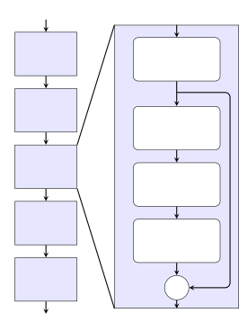

Fig. 2: Our Wide ResNet-like model. $`\ast`$The stride is only 1 in the
time dimension for our Voicebank experiments. $`\dagger`$The squeeze &
excitation layer was not present in our CHiME-2 work but was added for
the Voicebank work.

We repeat our experimental settings for our prior CHiME-2 experiments
here in order to provide the background for an in-depth analysis. In
addition, we report one follow up experiment that did not make it into
the original report \[16\].

Our experimental procedure followed a three step process:

1.  1.  Pretrain an acoustic model using clean speech to serve as a
        perceptual model.
2.  2.  Train an enhancement model using perceptual loss.
3.  3.  Use the off-the-shelf Kaldi CHiME-2 recipe to evaluate
        recognizability.

| Enhancement model | Perceptual model | Recognition model | -6 dB | -3 dB | 0 dB | 3 dB | 6 dB | 9 dB | Avg  |
| ----------------- | ---------------- | ----------------- | ----- | ----- | ---- | ---- | ---- | ---- | ---- |
| \-                | \-               | DNN-HMM           | 29.9  | 21.5  | 17.7 | 15.0 | 10.7 | 9.4  | 17.4 |
| DNN               | \-               | DNN-HMM           | 29.4  | 19.2  | 16.1 | 11.8 | 10.3 | 9.3  | 16.0 |
| DNN               | DNN              | DNN-HMM           | 26.2  | 18.7  | 14.1 | 11.1 | 8.9  | 7.7  | 14.4 |
| DNN               | WRBN             | DNN-HMM           | 25.6  | 17.8  | 13.8 | 10.5 | 8.8  | 7.8  | 14.0 |
| DNN\*             | Wide ResNet\*    | DNN-HMM           | 26.3  | 18.5  | 13.8 | 10.4 | 8.6  | 8.0  | 14.2 |
| Wide ResNet       | \-               | DNN-HMM           | 18.7  | 13.9  | 10.7 | 8.1  | 6.9  | 6.2  | 10.8 |
| Wide ResNet       | DNN              | DNN-HMM           | 19.3  | 14.3  | 10.2 | 7.4  | 6.2  | 5.4  | 10.5 |
| Wide ResNet       | WRBN             | DNN-HMM           | 17.0  | 11.8  | 8.8  | 7.1  | 6.0  | 5.2  | 9.3  |
| Wide ResNet\*     | Wide ResNet\*    | DNN-HMM           | 15.2  | 10.9  | 8.3  | 6.7  | 5.8  | 5.2  | 8.7  |
| GRN (2019) \[3\]  | \-               | WRBN              | 14.8  | 10.0  | 9.0  | 6.8  | 6.3  | 5.5  | 8.7  |

TABLE I: WER for our systems relative to state-of-the-art on CHiME-2
broken down across different SNRs.  
\*Result reported here for the first time.

| Perceptual output | value of $`\alpha`$ | WER  |
| ----------------- | ------------------- | ---- |
| Just L1 loss      | \-                  | 16.0 |
| First layer       | 0.5                 | 15.0 |
| Second layer      | 1.0                 | 15.1 |
| Third layer       | 1.0                 | 14.7 |
| Fourth layer      | 1.0                 | 14.9 |
| Fifth layer       | 1.0                 | 14.6 |
| Sixth layer       | 2.0                 | 14.4 |

TABLE II: Effect of changing the output layer of the perceptual model on
recognition performance.

For our first step, we generated senone alignments using standard Kaldi
tools. These alignments match every frame in the spectral features with
a class out of a set of 1999 senones. The senones are generated by
careful clustering of the set of triphone states to a reasonably-sized
set, which means they encode important phonetic information.

Our perceptual models were trained with cross-entropy loss against
aligned senone targets. Our features were standard 257-dimensional
spectral features with 25ms windows and 10ms hop. These are identical in
form to the features generated by the enhancement model, allowing easy
passage of the gradient to the enhancement model.

We experimented with three different acoustic models. Our previously
reported experiments covered two important types of model: a frame +
context 6-layer DNN model \[15\], as well as an utterance-wise good
performing Wide Residual BiLSTM Network (WRBN) model \[31\].

We ran additional experiments that have not yet been reported using a
third acoustic model. Our third model still takes only frame + context
input, but provides deeper feedback. This third model is a
Wide-ResNet-like model, nearly identical to the one we used for
enhancement. The model is shown in Fig. 2.

In the second step of training, we add perceptual loss to a standard L2
loss on the spectral magnitudes. This perceptual loss is generated by
passing both clean and denoised spectral features to the pretrained
acoustic model, and computing the L2 distance of the respective outputs.
We used a scaling parameter $`\alpha`$ to keep a similar magnitude for
the two losses.

The enhancement models take 5 frames of past and future context, and
they output a single denoised frame. The first enhancement model is a
2-layer 2048-node DNN network with leaky ReLU activations. The second
enhancement model is quite similar to Wide ResNet \[32\]. The full
network has 4 blocks of three convolutional layers, where the first
layer is used for downsampling (stride 2), and the other two layers
compute a residual that is added to the result. The first two blocks
have 128 filters, and the second two have 256 filters. Two
fully-connected layers are inserted before the output layer. The
enhancement models were more fully described in the original
work \[16\].

After training the enhancement model, we passed the enhanced features to
an off-the-shelf Kaldi \[33\] recipe for recognition on the CHiME-2
dataset. This recipe trains a HMM-DNN based system for recognition using
cross-entropy loss against the senone targets. The model is further
fine-tuned using sMBR loss. This same recipe gets 2-3% WER on the WSJ,
demonstrating its recognition ability. We did not change any part of the
recipe, including the default trigram language model. Our changes were
restricted to the input features.

## IV CHiME-2 Results and analysis

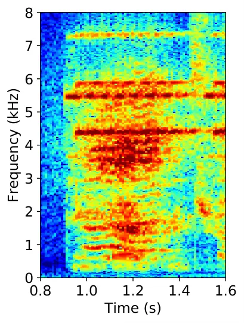

(a) Noisy utterance

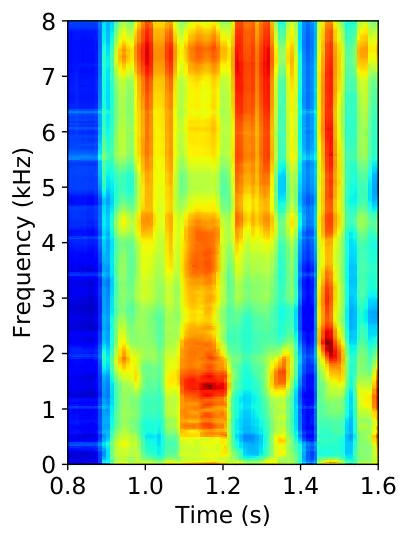

(b) DNN mapper w/ L1 loss

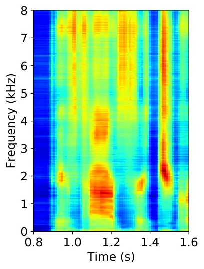

(c) DNN + perceptual DNN

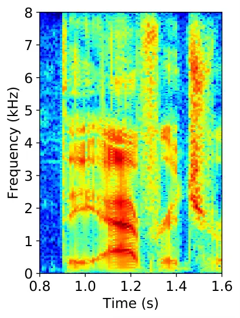

(d) Clean utterance

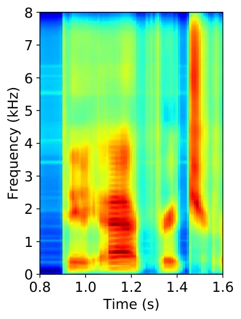

(e) Wide ResNet mapper w/ L1 loss

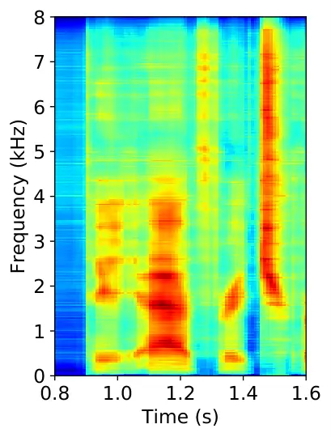

(f) Wide ResNet + perceptual Wide ResNet

Fig. 3: We compare features for utterance 440c020f7 at -6dB SNR. Correct
transcript is “The average rate…” See phoneme predictions in Figs. 4 and 5.

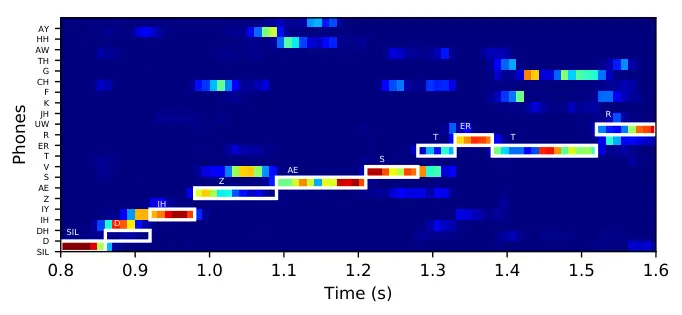

(a) Standard loss posteriorgram  
(alignment: SIL D IH Z AE S T ER T R)

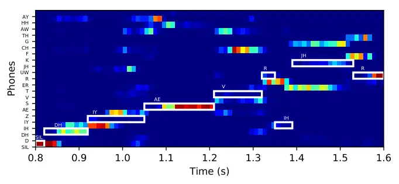

(b) Perceptual loss posteriorgram  
(alignment: SIL DH IY AE V R IH JH R)

Fig. 4: Posterior comparison of L1 spectral loss and perceptual loss for
utterance 440c020f7 “The average rate…” which is recognized correctly
with perceptual loss, but the L1 spectral loss system recognizes as
”Disaster trade….”. Some phonemes left out due to space constraints. At
around 1.3 seconds, the probability of /S/ has been shifted to /V/ and
/F/. See Fig. 5 for likelihood estimation.

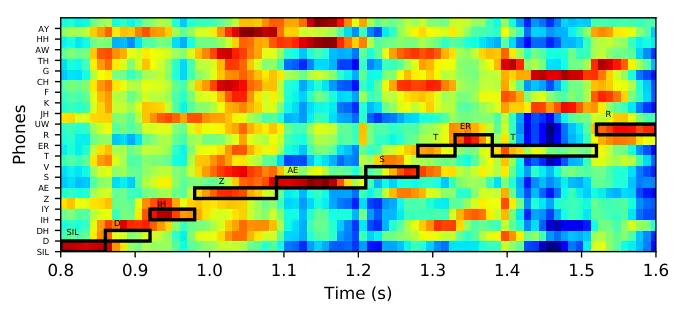

(a) Standard loss likelihoodgram

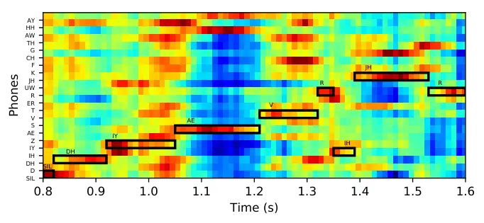

(b) Perceptual loss likelihoodgram

Fig. 5: Likelihood comparison for utterance 440c020f7 “The average
rate…” which is recognized correctly with perceptual loss, but the L1
spectral loss system recognizes as ”Disaster trade….” Some phonemes left
out due to space constraints. See Fig. 4 for posterior probabilities.

We first report the results of our follow-up experiments in Table I. The
starred results in this table are newly reported experiments, conducted
in 2018 shortly after the deadline for our submission \[16\].

While our hypothesis was that better recognizers should provide better
feedback than worse recognizers, these results demonstrate that this is
not always the case. The WRBN model achieves almost half of the
cross-entropy loss relative to Wide ResNet, but is not as effective at
perceptual feedback. We think this is an important point overlooked so
far in literature regarding perceptual losses. We go into more detail
and explore several variations in Section V-A. We suspect the fact that
the DNN model did not benefit from the Wide ResNet perceptual model is
due to having reached the maximum modeling capacity for the DNN.

In this table we also compare against the state-of-the-art for CHiME-2.
The best-performing recognition model on the CHiME-2 dataset is the WRBN
recognition model trained with distortion-independent training and a
Gated Residual Network (GRN) enhancement front end \[3\]. This work was
done in 2019 after our work was completed, though we haven’t reported
our results until now. Our model tends to perform better in less noisy
situations, perhaps due to introducing fewer distortions that harm
recognition performance.

To analyze the results further, we experimented with using different
outputs from the DNN perceptual model for generating the perceptual
loss. The results in Table II show that in a context-constrained model,
using deeper representations tend to generate better results. However, a
large benefit is seen even using just a single layer. This could be
helpful in resource-constrained environments. We did not find that
deeper outputs are always better, as revealed by our Voicebank + DEMAND
results discussed in the following sections.

In addition to our follow-up experiments, we performed an in-depth
analysis of our perceptual loss to see where it may help the most.
First, we examined a specific utterance where the recognition score
improved due to the addition of perceptual loss. The utterance label is
440c020f7 and the transcript starts with “The average rate is…”. Without
perceptual loss, this utterance’s predicted transcription was “Disaster
trade…”.

In Fig. 3, we can see a comparison of features generated by various
systems for enhancement. The DNN model is less suitable for enhancement,
producing “spectral leakage” or artificial high-frequency noise. This
noise is greatly suppressed with perceptual loss. In the Wide ResNet
case, no phoneme is generated at 1.3 seconds. With perceptual loss,
there is a definite phoneme at 1.3 seconds.

The better reproduction results in a better prediction, as seen in
Figs. 4 and 5. Instead of a strong prediction of /S/, the model shifts
its confidence to /F/ and /V/. The shift to /F/ is visible in both
posteriorgram and likelihoodgram but the emphasis on /V/ is only seen in
the likelihoodgram, near 1.25 seconds.

Our hypothesis is that energy-based metrics can sometimes overlook
low-energy phonemes such as /V/. By contrast, a phonetic perceptual loss
penalizes the enhancement model for failing to reproduce phonemes
regardless of their energy level. We expected perceptual loss to improve
performance on low-energy phonemes more than high-energy phonemes.

In order to find evidence to support our hypothesis, we extend our
analysis from one example to the entire dataset. First, we computed the
phone sequences corresponding to the predicted words and compared them
against the correct phone sequences. We computed the precision for each
phoneme using the predictions of the Wide ResNet model when trained both
with and without perceptual loss. We plotted the improvement in
precision due to the addition of perceptual loss as one variable.

Second, we computed the average energy of each phoneme across the
training set. Specifically, we computed the average of the spectral
frames selected using the senone alignments generated for acoustic model
training. We plotted this variable against the precision improvement
computed in the previous step. The result is in Fig. 6.

Taken as a whole, the figure shows a small but significant correlation
between precision improvement and average energy. The Pearson’s
correlation coefficient is -0.43 for all phonemes. When limiting the set
of phonemes to consonants only the coefficient is -0.49, indicating that
the trend is more apparent in lower-energy phonemes. This provides
evidence supporting our hypothesis that perceptual loss improves the
reproduction of low-energy phonemes more than high-energy phonemes.

Fig. 6: Average Phoneme Energy vs. Phoneme Precision Improvement

## V Perceptual vs. Joint Training on the Voicebank + DEMAND corpus

In addition to our CHiME-2 results and analysis, we report a new set of
experiments done with the SpeechBrain \[18\] toolkit. By contrast with
Kaldi, this toolkit allows us to combine state-of-the-art enhancement
and end-to-end recognition models in a straightforward way. We report
for the first time results directly comparing joint training against
perceptual loss training.

We evaluate our approach on the publicly-available Voicebank + DEMAND
corpus \[34\], and make our recipe publicly available as a part of the
SpeechBrain toolkit²² 2
https://github.com/speechbrain/speechbrain/tree/develop/recipes/Voicebank/MTL/ASR_enhance.
Our recognition results are generated by fine-tuning a good-performing
recognition system trained on the LibriSpeech dataset. In the joint
training scenario, the weights of the enhancement model are updated
during fine-tuning.

In addition to our comparison with joint training, we experiment with
ways of training perceptual models in an end-to-end manner. The standard
approach for ASR in SpeechBrain is sequence-to-sequence training with an
encoder-decoder model and both connectionist temporal classification
(CTC) \[35\] and negative log likelihood (NLL) losses.

After the perceptual model is trained, we use this model to generate
feedback during enhancement model training. Both clean and denoised
features are passed through the perceptual model, and a loss is
generated at the outputs. We combine L1 loss at the outputs with
standard L1 loss at the feature level.

Finally, after enhancement model is trained, our proposed approach is to
freeze the weights and fine-tune a large ASR model pre-trained on
LibriSpeech. We compare against a joint training baseline where the
weights of the enhancement model are allowed to update during ASR
fine-tuning.

More details on these three steps are provided in the following
sub-sections.

### V-A Perceptual Model Training

Central to our good results for enhancement and robust ASR is the
careful training of the perceptual model. As we demonstrated with our
CHiME-2 experiments, better recognizers do not always correspond to
better perceptual models. We explore a variety of factors to determine
the most effective settings for a perceptual model, as judged by
objective enhancement scores. The scores we use are the widely-used
PESQ \[36\], as well as the composite measure COVL \[37\] that was shown
to match human judgements very closely.

Before we relate the experimental settings, we first report the common
settings. The spectral features we use are 257-dimensional, generated
with 32ms windows and 16ms hop. These features are slightly worse for
recognition than 25ms+10ms features that are common for ASR, but are
much better for enhancement. We also use the log of the magnitude plus 1
to reduce the effect of very small or very large differences.

All of the perceptual models are trained in a sequence-to-sequence
setup, using a 1-layer 256-unit gated recurrent unit (GRU) model as the
decoder. The loss is standard NLL loss against the targets. In the first
few epochs of training we add an output layer and CTC loss to the
encoder model, as described in \[38\].

However, we find that our sequence-to-sequence models do not always
converge, likely due to the small size of the Voicebank dataset (8.8
hours of audio) relative to other ASR datasets (100s or 1000s of hours).
This is especially a problem with our non-recurrent encoder model (i.e.
Wide ResNet). We address this with the addition of alignment
loss \[39\].

When CTC loss fails to converge, the model tends to always output the
blank label. One way to counteract this tendency is to encourage the
model to produce non-blank outputs when someone is speaking. The
alignment loss term does this with a classification-like loss (negative
log likelihood) with the categories of silence or non-silence. For our
experiments we fixed the original incorrect formulation which used
positive log and swapped the silence and non-silence indicator terms.

Our indicator function separates frames by whether they constitute
silence or non-silence. The function is 1 for blank outputs during
silence and non-blank outputs during non-silence. To be precise, if
$`\bar{E}`$ is the average energy, and $`t`$ represents the current
frame, and $`n`$ is the index of a phoneme, our indicator function is:

```math
I(t,n)=\begin{cases}1&\text{if }E_{t}<\bar{E}\text{ and }n=\epsilon\\
1&\text{if }E_{t}>\bar{E}\text{ and }n\neq\epsilon\\
0&\text{if }E_{t}<\bar{E}\text{ and }n\neq\epsilon\\
0&\text{if }E_{t}>\bar{E}\text{ and }n=\epsilon\\
\end{cases} \tag{1}
```

Then our loss term is simply the negative log of the relevant portion of
the posterior, selected with the indicator function:

```math
L_{align}(t)=-\log(\sum_{n=1}^{N}I(t,n)P_{n}) \tag{2}
```

| Context model             | Context width  | PESQ | COVL |
| ------------------------- | -------------- | ---- | ---- |
| Wide ResNet, first block  | 7 frames       | 3.03 | 3.74 |
| Wide ResNet, second block | 13 frames      | 2.97 | 3.68 |
| CRDNN, first CNN block    | 5 frames       | 2.93 | 3.64 |
| CRDNN, 2 CNN blocks       | 9 frames       | 3.05 | 3.74 |
| CRDNN, 3 CNN blocks       | 13 frames      | 3.06 | 3.75 |
| CRDNN, RNN outputs        | full utterance | 2.91 | 3.54 |
| CRDNN, DNN outputs        | full utterance | 2.87 | 3.50 |

TABLE III: Objective enhancement scores on Voicebank + DEMAND for two
perceptual models, output at various layers.

| Targets     | Error Rate | PESQ | COVL |
| ----------- | ---------- | ---- | ---- |
| characters  | CER 20.37  | 2.98 | 3.68 |
| word pieces | WER 21.19  | 2.92 | 3.62 |
| phonemes    | PER 14.55  | 3.05 | 3.74 |

TABLE IV: Objective enhancement scores on Voicebank + DEMAND using
different targets for training the perceptual model. Error rates are not
comparable, but still indicate a variety of recognition abilities.

| Inputs                    | PER   | PESQ | COVL |
| ------------------------- | ----- | ---- | ---- |
| Spectral magnitude        | 14.55 | 3.05 | 3.74 |
| Log-mel Filterbank (n=40) | 20.25 | 3.03 | 3.72 |
| Log-mel Filterbank (n=80) | 15.36 | 3.02 | 3.73 |

TABLE V: Objective enhancement scores on Voicebank + DEMAND using
perceptual models trained with different inputs. Recognition rates
included to indicate variety of recognition abilities.

Next, we turn to the experimental factors that we explore for our
perceptual model. Primarily we explore three factors:

1.  1.  Effect of context (changing model type and output layer)
2.  2.  Effect of various training targets (e.g. characters or phonemes)
3.  3.  Effect of various input types (e.g. spectrogram or filterbank)

When training an acoustic model to achieve the best recognition
performance, some or all of the choices you make for these three factors
may be different. We find that recognition scores should not be used
guide selection of perceptual models, other than to ensure the model has
converged.

The first factor that we experiment with is the context that is provided
to the acoustic model. The results of this experiment are shown in
Table III. We experiment both with a Wide ResNet-like model, as in our
CHiME-2 experiments, as well as a CRDNN model that has shown good
performance for recognition. These encoder models are trained with the
same decoder model, a 1-layer GRU with 256 units. In both cases we find
that deeper layers are not as effective as shallower layers.

In the case of Wide ResNet, our procedure is slightly different from the
CHiME-2 work, as we trained the model in an utterance-wise fashion
rather than passing frame + context. This approach is much faster at
both training and inference time. Using this approach means that deeper
layers have access to progressively more context, and we find that this
is not helpful for perceptual loss. In the case of CRDNN, deeper CNN
layers do seem to help, but the RNN and DNN outputs are not effective
for perceptual loss.

While at first these results seems to contradict what we found with the
DNN model for CHiME-2, we conjecture that the addition of more context
hurts results. Perhaps embeddings that only see a small context window
are more focused in their feedback. Whatever the case, these results
confirm the results we got on CHiME-2 that suggest that generating
perceptual loss after recurrent layers is less effective than only after
non-recurrent layers.

The second factor that we consider is the targets. We find that training
the perceptual model with character or word targets is much less
effective than using phonetic targets. Results can be seen in Table IV.
This is a clear indication that important phonetic information is being
captured by the perceptual model and conveyed to the enhancement module.
One more note is that even with alignment loss the ASR model did not
converge as well with word piece targets. Our first result was a WER of
around 80%. We reduced the output size using max pooling over 4 frames
to reach a WER of 21%.

The last factor we explored was the inputs. We report results with
commonly used log-mel filterbank features with both 40 and 80 filters in
Table V. The pretrained model’s performance varies a little with input
size (20.3 vs 15.4) but this does not seem to have much of an impact on
the quality of the model when used as a perceptual model.

This exploration shows that it is not always the best-performing
features using standard ASR metrics that provide the best feedback to an
enhancement model.

### V-B Enhancement Training

The model that we use for enhancement is based on the Wide-ResNet-like
model presented in \[16\]. In that work we motivate using a residual
structure for the enhancement model by noting its similarity to the task
at hand. Since noisy speech is usually modeled as (and artificially
created as) a sum of clean and noise signals, the enhancement task is to
reproduce the input speech signal (i.e. residual) without the added
noise.

We made several updates to the residual network structure based mainly
on new work that has come out since we first used Wide ResNets. The
updates we made are as follows:

1.  1.  The largest gain came from adding squeeze-and-excitation
        blocks \[40\] to the residual computation.
2.  2.  Instead of performing spectral mapping to predict features directly,
        we used the spectral approximation algorithm \[41\], applying
        outputs to noisy inputs as a mask and generating an L1 loss against
        clean targets.
3.  3.  We added 2d batch normalization after each activation.
4.  4.  We made the model deeper, adding two 512 filter blocks.
5.  5.  We gained a small amount from changing the activation function to
        GELUs \[42\].
6.  6.  Our results showed another small gain (around 0.02 PESQ) from
        applying our outputs as a mask to the complex spectrogram, while
        still computing the loss using the log spectral magnitude (with no
        added RI loss). Enhancement model outputs are real-valued, clamped
        between 0 and 1, and then applied to the complex valued noisy
        spectrogram as a mask.

Beyond our updates to the model, we find another small improvement from
using L1 loss rather than L2 loss for both spectral and perceptual
losses. We maintain the structure of adding a scaling constant
$`\alpha`$ used for balancing the magnitude of the two losses.

### V-C ASR Fine-tuning

In order to generate state-of-the-art recognition rates on the
Voicebank + DEMAND corpus, we fine-tune a large ASR system trained on
LibriSpeech. This model targets word pieces and includes a language
model and beam search decoding for a final performance of 3.0 on
LibriSpeech’s test-clean.

During fine-tuning, we address the “distortion problem” by adding noises
from the OpenRIR data set \[43\] at a random level between 0 and 15 dB.
This is a standard data augmentation method in SpeechBrain, a part of
the environmental corruption set of augmentations. This method helps
both joint training and independent training, but helps independent
training more than joint training. This is because the frozen
enhancement models produce distortions when they encounter unseen
noises, forcing the recognition model to adapt during training.

We fine-tune this model on Voicebank + DEMAND for 30 epochs, decreasing
the learning rate every 3 epochs by a factor of 0.7. Crucial to our
results, we freeze the enhancement and encoder model for the first three
epochs, giving the decoder a chance to adapt to language differences
before the encoder model adaptation begins. Without this “slow thaw”
approach, we saw more variability in our results and a higher average
WER.

## VI Voicebank + DEMAND Results

Our first set of results in Table VI show side-by-side both objective
enhancement scores and recognition scores, comparing joint training
against perceptual training. The jointly trained systems perform worse
than the systems trained with distortion-independent training,
confirming the research in \[3\]. In addition, the perceptual loss
improves both enhancement scores and test-set recognition performance.

|        | Enhancement      | Joint    |      |      | dev  | test |
| ------ | ---------------- | -------- | ---- | ---- | ---- | ---- |
| System | training loss    | training | PESQ | COVL | WER  | WER  |
| Clean  | \-               | \-       | 4.50 | 4.50 | 1.44 | 2.29 |
| Noisy  | \-               | \-       | 1.97 | 2.63 | 4.32 | 3.43 |
| Mask   | L1 Spectral      | Yes      | 2.46 | 3.32 | 3.12 | 3.77 |
| Mask   | \+ L1 Perceptual | Yes      | 2.44 | 3.29 | 3.57 | 3.58 |
| Mask   | L1 Spectral      | No       | 2.99 | 3.69 | 2.88 | 3.25 |
| Mask   | \+ L1 Perceptual | No       | 3.05 | 3.74 | 2.89 | 2.80 |

TABLE VI: Direct comparison of joint training and distortion-independent
training on Voicebank + DEMAND. Both objective enhancement scores and
recognition rates are recorded for the same model.

We generate an SNR breakdown of the results by combining the development
and test sets. The results are shown in Table VII, where it can be seen
that adding perceptual loss improves recognition rates over the direct
masking approach in all but one category. One interesting note is that
perceptual loss maintains 25-30% relative improvement over the noisy
model at all SNR levels, whereas the improvement from the L1 loss
trained model decreases as SNR increases. At the lowest SNR levels, the
L1 trained model has only an 8% relative improvement. One possible
interpretation is that the perceptual system produces fewer distortions
that harm recognition in the environment where there is little noise to
begin with. At the highest SNR level, perceptual loss actually matches
the performance of clean speech, suggesting that it can produce outputs
with few or no distortions that harm recognition.

| System | Enhancement loss | 0-3 dB | 5-8 dB | 10-13 dB | 15-18 dB |
| ------ | ---------------- | ------ | ------ | -------- | -------- |
| Noisy  | \-               | 7.53   | 3.31   | 2.07     | 2.64     |
| Mask   | L1 Spectral      | 5.48   | 2.32   | 1.77     | 2.44     |
| Mask   | \+ L1 Perceptual | 5.26   | 2.45   | 1.55     | 1.99     |
| Clean  | \-               | 2.04   | 1.85   | 1.26     | 2.08     |

TABLE VII: WER scores for Voicebank + DEMAND dataset, broken down by
SNR. Dev and test sets are grouped together for more stable results.

In addition to our comparisons with joint training and
distortion-independent training, we compare against other
state-of-the-art systems on the Voicebank + DEMAND dataset in
Table VIII. We note that our system performs best on CSIG and COVL, both
highly correlated with human judgements of signal quality. PHASEN
performs better on the CBAK measure, perhaps due to the fact that our
system focuses on phoneme reconstruction at the expense of ignoring
background suppression. On the PESQ metric, MetricGAN+ performs better
than our system due to directly optimizing for a good PESQ score. We
have not included results from \[27\] which performs better than our
system, but is trained on additional data and is therefore not directly
comparable.

| System            | Domain     | PESQ | CSIG | CBAK | COVL |
| ----------------- | ---------- | ---- | ---- | ---- | ---- |
| Noisy             | \-         | 1.97 | 3.35 | 2.44 | 2.63 |
| SERGAN \[44\]     | Time       | 2.62 | \-   | \-   | \-   |
| D. F. Loss \[45\] | Time       | \-   | 3.86 | 3.33 | 3.22 |
| PHASEN \[46\]     | Complex    | 2.99 | 4.21 | 3.55 | 3.62 |
| DEMUCS \[47\]     | Time       | 3.07 | 4.31 | 3.40 | 3.63 |
| MetricGAN+ \[48\] | Spec. mag. | 3.15 | 4.14 | 3.16 | 3.64 |
| Ours              | Complex    | 3.06 | 4.40 | 3.52 | 3.75 |

TABLE VIII: Comparison of objective enhancement scores for
state-of-the-art systems on Voicebank + DEMAND.

Finally, we test the performance of our enhancement system using a
recognizer trained on noisy data. The results are presented in Table IX.
Since the recognizer is not adapted to enhanced outputs, it is more
seriously affected by introduced distortions. Still, with the addition
of perceptual loss the recognition rate improves, indicating fewer
distortions. More experimentation is needed to determine a cause for the
worse performance on the development set relative to training without
perceptual loss.

| ASR training data | Enhancement loss | dev WER | test WER |
| ----------------- | ---------------- | ------- | -------- |
| Noisy             | \-               | 4.32    | 3.43     |
| Noisy             | L1 Spectral      | 3.36    | 3.58     |
| Noisy             | \+ L1 Perceptual | 3.69    | 3.34     |

TABLE IX: Recognition model trained on noisy utterances, evaluated using
enhanced utterances.

## VII Conclusion

We presented results showing that perceptual loss generated with a
recognition model can achieve state-of-the-art performance for both
noise-robust ASR and objective enhancement scores at the same time.

First, we reported follow-up experiments on CHiME-2 that matched the
current state-of-the-art recognition scores, performing better on
higher-SNR samples. These experiments demonstrated that better
recognizers do not always make better perceptual models. We also
performed an in-depth analysis of the CHiME-2 system to gain a better
understanding of perceptual loss. Our analysis shows that perceptual
loss helps the most with low-energy phonemes, due to the focus on
phonemic structures rather than myopically focusing on energy
differences.

Second, we ran a new set of experiments on Voicebank + DEMAND in order
to directly compare against joint training. We confirm that
distortion-independent training indeed performs better than joint
training, and find that perceptual loss can recover some of the benefits
of joint training while avoiding the pitfalls. In addition, we
experiment with different types of perceptual models and find that
phoneme targets, spectral magnitude inputs, and small context windows
are important qualities for achieving good enhancement performance.

We released a recipe for perceptual loss training on Voicebank + DEMAND
using the SpeechBrain toolkit, as well as an interface for using a
pre-trained model using only a few lines of code³³ 3
https://huggingface.co/speechbrain/mtl-mimic-voicebank. This toolkit
made our research possible by providing good-performing recipes for ASR
and enhancement that were easy to combine for our purposes. We found the
toolkit to be an ideal resource for multi-task and multi-model work due
to the flexibility and modularity of the components.

## Acknowledgment

This work supported in part by the National Science Foundation under
Grant IIS-1409431 and Grant IIS-2008043. We also thank the Ohio
Supercomputer Center (OSC) \[49\] for providing us with computational
resources. We gratefully acknowledge the support of NVIDIA Corporation
with the donation of a Quadro P6000 GPU to our lab and a DGX-2 machine
to the SpeechBrain project, both used in this research.

Finally, we would like to thank Mirco Ravanelli, Szu-Wei Fu, Chien-Feng
Liao, Ju-Chieh Chou, Abdel Heba, Aku Rouhe, Titouan Parcollet, Nauman
Dawalatabad, Samuele Cornell, and everyone else on the SpeechBrain team
for their efforts in creating the toolkit and developing recipes for
VoiceBank + DEMAND and LibriSpeech, as well as the pre-trained
LibriSpeech seq2seq model.

## References

- \[1\] Y. Zhao, D. Wang, I. Merks, and T. Zhang, “DNN-based enhancement
  of noisy and reverberant speech,” in _2016 IEEE International
  Conference on Acoustics, Speech and Signal Processing (ICASSP)_. IEEE,
  2016, pp. 6525–6529.
- \[2\] A. Narayanan and D. Wang, “Investigation of speech separation as
  a front-end for noise robust speech recognition,” _IEEE/ACM
  Transactions on Audio, Speech, and Language Processing_, vol. 22,
  no. 4, pp. 826–835, 2014.
- \[3\] P. Wang, K. Tan, and D. Wang, “Bridging the gap between monaural
  speech enhancement and recognition with distortion-independent
  acoustic modeling,” _IEEE/ACM Transactions on Audio, Speech, and
  Language Processing_, vol. 28, pp. 39–48, 2019.
- \[4\] K. Tan and D. L. Wang, “Improving robustness of deep learning
  based monaural speech enhancement against processing artifacts,” in
  _IEEE International Conference on Acoustics, Speech and Signal
  Processing (ICASSP)_, 2020, pp. 6914–6918.
- \[5\] T. Gao, J. Du, L.-R. Dai, and C.-H. Lee, “Joint training of
  front-end and back-end deep neural networks for robust speech
  recognition,” in _2015 IEEE International Conference on Acoustics,
  Speech and Signal Processing (ICASSP)_. IEEE, 2015, pp. 4375–4379.
- \[6\] Z.-Q. Wang and D. Wang, “A joint training framework for robust
  automatic speech recognition,” _IEEE/ACM Transactions on Audio,
  Speech, and Language Processing_, vol. 24, no. 4, pp. 796–806, 2016.
- \[7\] M. Ravanelli, P. Brakel, M. Omologo, and Y. Bengio, “A network
  of deep neural networks for distant speech recognition,” in _2017 IEEE
  International Conference on Acoustics, Speech and Signal Processing
  (ICASSP)_. IEEE, 2017, pp. 4880–4884.
- \[8\] Y. Xu, C. Weng, L. Hui, J. Liu, M. Yu, D. Su, and D. Yu, “Joint
  training of complex ratio mask based beamformer and acoustic model for
  noise robust ASR,” in _ICASSP 2019-2019 IEEE International Conference
  on Acoustics, Speech and Signal Processing (ICASSP)_. IEEE, 2019, pp.
  6745–6749.
- \[9\] T. Menne, R. Schlüter, and H. Ney, “Investigation into joint
  optimization of single channel speech enhancement and acoustic
  modeling for robust ASR,” in _ICASSP 2019-2019 IEEE International
  Conference on Acoustics, Speech and Signal Processing (ICASSP)_. IEEE,
  2019, pp. 6660–6664.
- \[10\] G. Heigold, I. Moreno, S. Bengio, and N. Shazeer, “End-to-end
  text-dependent speaker verification,” in _2016 IEEE International
  Conference on Acoustics, Speech and Signal Processing (ICASSP)_. IEEE,
  2016, pp. 5115–5119.
- \[11\] J. Heymann, L. Drude, C. Boeddeker, P. Hanebrink, and
  R. Haeb-Umbach, “Beamnet: End-to-end training of a
  beamformer-supported multi-channel ASR system,” in _2017 IEEE
  International Conference on Acoustics, Speech and Signal Processing
  (ICASSP)_. IEEE, 2017, pp. 5325–5329.
- \[12\] A. Zeyer, K. Irie, R. Schlüter, and H. Ney, “Improved training
  of end-to-end attention models for speech recognition,” _Proc.
  Interspeech_, pp. 7–11, 2018.
- \[13\] J. Turian and M. Henry, “I’m sorry for your loss:
  Spectrally-based audio distances are bad at pitch,” in _”I Can’t
  Believe It’s Not Better!” NeurIPS 2020 workshop_, 2020.
- \[14\] P. Plantinga, D. Bagchi, and E. Fosler-Lussier, “Phonetic
  feedback for speech enhancement with and without parallel speech
  data,” in _ICASSP 2020-2020 IEEE International Conference on
  Acoustics, Speech and Signal Processing (ICASSP)_. IEEE, 2020, pp.
  6679–6683.
- \[15\] D. Bagchi, P. Plantinga, A. Stiff, and E. Fosler-Lussier,
  “Spectral feature mapping with mimic loss for robust speech
  recognition,” in _ICASSP_, 2018.
- \[16\] P. Plantinga, D. Bagchi, and E. Fosler-Lussier, “An exploration
  of mimic architectures for residual network based spectral mapping,”
  in _SLT_. IEEE, 2018.
- \[17\] E. Vincent, J. Barker, S. Watanabe, J. Le Roux, F. Nesta, and
  M. Matassoni, “The second ‘CHiME’ speech separation and recognition
  challenge: Datasets, tasks and baselines,” in _ICASSP, 2013_. IEEE,
  2013, pp. 126–130.
- \[18\] M. Ravanelli, T. Parcollet, P. Plantinga, A. Rouhe, S. Cornell,
  L. Lugosch, C. Subakan, N. Dawalatabad, A. Heba, J. Zhong, J.-C. Chou,
  S.-L. Yeh, S.-W. Fu, C.-F. Liao, E. Rastorgueva, F. Grondin, W. Aris,
  H. Na, Y. Gao, R. D. Mori, and Y. Bengio, “SpeechBrain: A
  general-purpose speech toolkit,” _arXiv preprint
  arXiv:2106.04624_, 2016.
- \[19\] C. Valentini-Botinhao, “Noisy speech database for training
  speech enhancement algorithms and TTS models,” _Edinburgh
  DataShare_, 2017.
- \[20\] J. Johnson, A. Alahi, and L. Fei-Fei, “Perceptual losses for
  real-time style transfer and super-resolution,” in _European
  conference on computer vision_. Springer, 2016, pp. 694–711.
- \[21\] R. Zhang, P. Isola, A. A. Efros, E. Shechtman, and O. Wang,
  “The unreasonable effectiveness of deep features as a perceptual
  metric,” in _Proceedings of the IEEE conference on computer vision and
  pattern recognition_, 2018, pp. 586–595.
- \[22\] A. Oord, Y. Li, I. Babuschkin, K. Simonyan, O. Vinyals,
  K. Kavukcuoglu, G. Driessche, E. Lockhart, L. Cobo, F. Stimberg
  _et al._, “Parallel wavenet: Fast high-fidelity speech synthesis,” in
  _International conference on machine learning_. PMLR, 2018, pp.
  3918–3926.
- \[23\] F. G. Germain, Q. Chen, and V. Koltun, “Speech denoising with
  deep feature losses,” _Proc. Interspeech_, 2019.
- \[24\] J. Yao and A. Al-Dahle, “Coarse-to-fine optimization for speech
  enhancement,” _Proc. Interspeech_, pp. 2743–2747, 2019.
- \[25\] T.-A. Hsieh, C. Yu, S.-W. Fu, X. Lu, and Y. Tsao, “Improving
  perceptual quality by phone-fortified perceptual loss for speech
  enhancement,” _arXiv preprint arXiv:2010.15174_, 2020.
- \[26\] A. Baevski, Y. Zhou, A. Mohamed, and M. Auli, “wav2vec 2.0: A
  framework for self-supervised learning of speech representations,”
  _Advances in Neural Information Processing Systems_, vol. 33, 2020.
- \[27\] S. Kataria, J. Villalba, and N. Dehak, “Perceptual loss based
  speech denoising with an ensemble of audio pattern recognition and
  self-supervised models,” in _2021 IEEE International Conference on
  Acoustics, Speech and Signal Processing (ICASSP)_. IEEE, 2021.
- \[28\] M. Ravanelli, J. Zhong, S. Pascual, P. Swietojanski,
  J. Monteiro, J. Trmal, and Y. Bengio, “Multi-task self-supervised
  learning for robust speech recognition,” in _ICASSP 2020-2020 IEEE
  International Conference on Acoustics, Speech and Signal Processing
  (ICASSP)_. IEEE, 2020, pp. 6989–6993.
- \[29\] A. Gulati, J. Qin, C.-C. Chiu, N. Parmar, Y. Zhang, J. Yu,
  W. Han, S. Wang, Z. Zhang, Y. Wu _et al._, “Conformer:
  Convolution-augmented transformer for speech recognition,” _Proc.
  Interspeech_, pp. 5036–5040, 2020.
- \[30\] D. Amodei, S. Ananthanarayanan, R. Anubhai, J. Bai,
  E. Battenberg, C. Case, J. Casper, B. Catanzaro, Q. Cheng, G. Chen,
  J. Chen, J. Chen, Z. Chen, M. Chrzanowski, A. Coates, G. Diamos,
  K. Ding, N. Du, E. Elsen, J. Engel, W. Fang, L. Fan, C. Fougner,
  L. Gao, C. Gong, A. Hannun, T. Han, L. Johannes, B. Jiang, C. Ju,
  B. Jun, P. LeGresley, L. Lin, J. Liu, Y. Liu, W. Li, X. Li, D. Ma,
  S. Narang, A. Ng, S. Ozair, Y. Peng, R. Prenger, S. Qian, Z. Quan,
  J. Raiman, V. Rao, S. Satheesh, D. Seetapun, S. Sengupta, K. Srinet,
  A. Sriram, H. Tang, L. Tang, C. Wang, J. Wang, K. Wang, Y. Wang,
  Z. Wang, Z. Wang, S. Wu, L. Wei, B. Xiao, W. Xie, Y. Xie, D. Yogatama,
  B. Yuan, J. Zhan, and Z. Zhu, “Deep Speech 2 : End-to-end speech
  recognition in English and Mandarin,” in _Proceedings of The 33rd
  International Conference on Machine Learning_, ser. Proceedings of
  Machine Learning Research, M. F. Balcan and K. Q. Weinberger, Eds.,
  vol. 48. PMLR, 2016, pp. 173–182.
- \[31\] L. D. Jahn Heymann and R. Haeb-Umbach, “Wide residual BLSTM
  network with discriminative speaker adaptation for robust speech
  recognition,” in _CHiME 2016 workshop_, 2016.
- \[32\] S. Zagoruyko and N. Komodakis, “Wide residual networks,” in
  _Proc. BMVC_, E. R. H. Richard C. Wilson and W. A. P. Smith, Eds. BMVA
  Press, September 2016, pp. 87.1–87.12. \[Online\]. Available:
  https://dx.doi.org/10.5244/C.30.87
- \[33\] D. Povey, A. Ghoshal, G. Boulianne, L. Burget, O. Glembek,
  N. Goel, M. Hannemann, P. Motlicek, Y. Qian, P. Schwarz _et al._, “The
  Kaldi speech recognition toolkit,” in _IEEE 2011 Workshop on Automatic
  Speech Recognition and Understanding_. IEEE Signal Processing
  Society, 2011.
- \[34\] C. Valentini-Botinhao, X. Wang, S. Takaki, and J. Yamagishi,
  “Investigating RNN-based speech enhancement methods for noise-robust
  text-to-speech.” in _SSW_, 2016, pp. 146–152.
- \[35\] A. Graves, S. Fernández, F. Gomez, and J. Schmidhuber,
  “Connectionist temporal classification: labelling unsegmented sequence
  data with recurrent neural networks,” in _Proceedings of the 23rd
  international conference on Machine learning_. ACM, 2006, pp. 369–376.
- \[36\] A. Rix, J. Beerends, M. Hollier, and A. Hekstra, “Perceptual
  evaluation of speech quality (PESQ)-a new method for speech quality
  assessment of telephone networks and codecs,” in _Proc. of
  ICASSP_, 2001.
- \[37\] Y. Hu and P. Loizou, “Evaluation of objective quality measures
  for speech enhancement,” _IEEE Transactions on Audio, Speech, and
  Language Processing_, vol. 16, no. 1, pp. 229–238, 2007.
- \[38\] S. Kim, T. Hori, and S. Watanabe, “Joint CTC-attention based
  end-to-end speech recognition using multi-task learning,” in _2017
  IEEE international conference on acoustics, speech and signal
  processing (ICASSP)_. IEEE, 2017, pp. 4835–4839.
- \[39\] P. Plantinga and E. Fosler-Lussier, “Towards real-time
  mispronunciation detection in kids’ speech,” in _2019 IEEE Automatic
  Speech Recognition and Understanding Workshop (ASRU)_. IEEE, 2019, pp.
  690–696.
- \[40\] J. Hu, L. Shen, and G. Sun, “Squeeze-and-excitation networks,”
  in _Proceedings of the IEEE conference on computer vision and pattern
  recognition_, 2018, pp. 7132–7141.
- \[41\] Y. Liu, H. Zhang, X. Zhang, and L. Yang, “Supervised speech
  enhancement with real spectrum approximation,” in _IEEE International
  Conference on Acoustics, Speech and Signal Processing (ICASSP)_. IEEE,
  2019, pp. 5746–5750.
- \[42\] D. Hendrycks and K. Gimpel, “Gaussian error linear units
  (GELUs),” _arXiv preprint arXiv:1606.08415_, 2016.
- \[43\] T. Ko, V. Peddinti, D. Povey, M. L. Seltzer, and S. Khudanpur,
  “A study on data augmentation of reverberant speech for robust speech
  recognition,” in _2017 IEEE International Conference on Acoustics,
  Speech and Signal Processing (ICASSP)_. IEEE, 2017, pp. 5220–5224.
- \[44\] D. Baby and S. Verhulst, “SERGAN: Speech enhancement using
  relativistic generative adversarial networks with gradient penalty,”
  _2019 IEEE International Conference on Acoustics, Speech and Signal
  Processing (ICASSP)_, pp. 106–110, 2019.
- \[45\] J. M. Martín-Doñas, A. M. Gomez, J. A. González, and
  A. Peinado, “A deep learning loss function based on the perceptual
  evaluation of the speech quality,” _IEEE Signal Processing Letters_,
  vol. 25, pp. 1680–1684, 2018.
- \[46\] D. Yin, C. Luo, Z. Xiong, and W. Zeng, “PHASEN: A
  phase-and-harmonics-aware speech enhancement network.” in _AAAI_,
  2020, pp. 9458–9465.
- \[47\] A. Défossez, G. Synnaeve, and Y. Adi, “Real time speech
  enhancement in the waveform domain,” _Proc. Interspeech_, pp.
  3291–3295, 2020.
- \[48\] S. Fu, C. Yu, T. Hsieh, P. Plantinga, M. Ravanelli, X. Lu, and
  Y. Tsao, “MetricGAN+: An improved version of MetricGAN for speech
  enhancement,” _Proc. Interspeech_, 2021.
- \[49\] O. S. Center, “Ohio supercomputer center,”
  http://osc.edu/ark:/19495/f5s1ph73, 1987.
