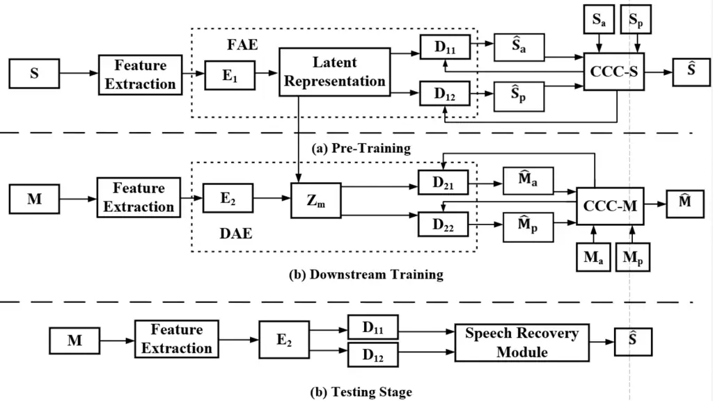
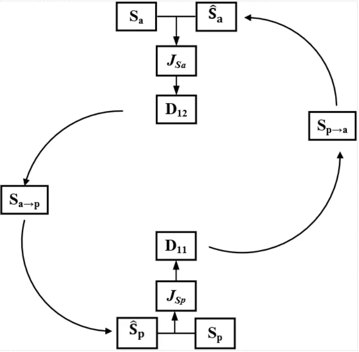

# Self-Supervised Learning based Monaural Speech Enhancement with Complex-Cycle-Consistent

Yi Li    Yang Sun    and Syed Mohsen Naqvi ^(†)^(†)thanks: Y. Li and S.
M. Naqvi are with the Intelligent Sensing and Communications Group,
School of Engineering, Newcastle University, Newcastle upon Tyne NE1
7RU, U.K. (e-mails: y.li140, mohsen.naqvi@newcastle.ac.uk)
^(†)^(†)thanks: Y. Sun is working with the Big Data Institute,
University of Oxford, Oxford OX3 7LF, U.K. (e-mail:
Yang.sun@bdi.ox.ac.uk)^(†)^(†)thanks: E-mail for correspondence:
y.li140@newcastle.ac.uk

###### Abstract

Recently, self-supervised learning (SSL) techniques have been introduced
to solve the monaural speech enhancement problem. Due to the lack of
using clean phase information, the enhancement performance is limited in
most SSL methods. Therefore, in this paper, we propose a phase-aware
self-supervised learning based monaural speech enhancement method. The
latent representations of both amplitude and phase are studied in two
decoders of the foundation autoencoder (FAE) with only a limited set of
clean speech signals independently. Then, the downstream autoencoder
(DAE) learns a shared latent space between the clean speech and mixture
representations with a large number of unseen mixtures. A
complex-cycle-consistent (CCC) mechanism is proposed to minimize the
reconstruction loss between the amplitude and phase domains. Besides, it
is noticed that if the speech features are extracted as the
multi-resolution spectra, the desired information distributed in spectra
of different scales can be studied to further boost the performance. The
NOISEX and DAPS corpora are used to generate mixtures with different
interferences to evaluate the efficacy of the proposed method. It is
highlighted that the clean speech and mixtures fed in FAE and DAE are
not paired. Both ablation and comparison experimental results show that
the proposed method clearly outperforms the state-of-the-art approaches.

###### Index Terms: 

Self-supervised learning, monaural speech enhancement, phase-aware,
complex-cycle-consistent, multi-resolution.

## I INTRODUCTION

In recent years, deep learning techniques have significantly improved
the speech enhancement performance in a wide range of real-world
applications such as assisted living systems, teleconferencing, and
automatic speech recognition (ASR) \[1, 2\]. However, the novel networks
are predominantly trained in a supervised mechanism where requires a
vast set of paired data as clean speech signals and the corresponding
mixtures. To exploit the models in highly reverberant scenarios, in
self-supervised learning (SSL), the relationships and similarities
between the training samples are applied to estimate the corresponding
paired labels for the training set \[3\].

Recently, self-supervised techniques have been applied in speech
enhancement problem. Wang et al. use an autoencoder to learn a latent
representation of clean speech signals and autoencode on speech mixture
with the shared representation of the clean examples \[4\]. However, the
pre-training stage only comprises one pre-task which maps the amplitude
of the mixture spectrogram to the clean speech. To solve the
insufficient pre-training limitation, Du et al. propose the
self-supervised adversarial learning to improve the noise generalization
ability \[5\]. The autoencoder obtains both magnitude and phase feature
information in the complex spectrum and benefits speech enhancement. In
speech enhancement study, the encoder takes a spectrogram as the input
and transforms it into a latent space and the decoder maps the encoded
representation to the original-size spectrogram. Therefore, the decoder
plays an important role in recovering the clean speech from the latent
space. However, the performance is limited when the magnitude and phase
components share the same decoder due to the reconstruction loss of one
component caused by the other component. Different from the conventional
complex spectrogram methods, we apply two individual decoders in the
foundation autoencoder (FAE) to process the magnitude and phase
information as presented in Fig. 1. Then, two decoders are used to
produce the estimated magnitude and phase of the target speech signal.
Moreover, we provide the comparisons with two encoders autoencoder which
helps to set configurations in the pipeline. The experimental results
are shown in Section III.



Fig. 1: The overall architecture of the proposed method. Generally, the
foundation autoencoder (FAE) consists of $`E_{1}`$, $`D_{11}`$, and
$`D_{12}`$, while downstream task autoencoder (DAE) is composed of
$`E_{2}`$, $`D_{21}`$, and $`D_{22}`$. As the input of $`E_{1}`$, the
multi-resolution features are extracted from the clean spectra with
different window sizes. Then, the latent representation of the clean
speech signal is learned via $`E_{1}`$ and $`E_{2}`$. After the
multi-resolution feature maps are recovered in the decoder, the
reconstructed clean spectra are obtained as the output by using
$`D_{11}`$ and $`D_{12}`$. Besides, the reconstructed and target spectra
are fed into the complex-cycle-consistent for speech module to further
train the FAE. The estimated mixtures are produced from the downstream
task autoencoder (DAE) which shares the learned representation. The
mixture latent representation is presented as $`Z_{m}`$. In the testing
stage, the enhanced signal is obtained with the estimated spectrogram
from the speech recovery module.

The consistent learning-based methods achieve great success in speech
enhancement to minimize the reconstruction loss. For example, Meng et
al. propose a cycle-consistent method to speech enhancement problem
\[6\], a clean-to-noisy mapping network is added to the noisy-to-clean
network to reconstruct the noisy features from the enhanced ones.
Compared to the conventional CycleGAN-based methods, the target speech
phase is estimated by a complex spectral network \[7\]. In this work, we
propose a complex-cycle-consistent (CCC) mechanism to calculate the
commutative losses between the amplitude and phase features and utilize
in SSL based speech enhancement problem for the first time.

Meanwhile, researchers exploit multiple resolutions or scales to improve
the speech enhancement performance, where the features are extracted and
weighted differently as inputs to the neural networks \[8\]. For
example, convolutional blocks with different scales are used to process
the same input time-frequency (TF) features for the end-to-end automatic
speech recognition \[9\]. A channel-aware attention mechanism is
introduced to enforce the connections between feature groups in neural
networks. The attention mechanism is combined with convolutional neural
networks (CNN) where the key features of anti-spoofing are explored by
assigning weights to different positions and channels in a feature map
\[10\]. However, a vast training set of paired examples of clean speech
signals and the corresponding mixtures are required at the training
stage \[4\]. In this work, we propose the first SSL work to address
speech enhancement problem with multi-resolution spectra.

The contributions of the paper are summarized as follows:

$`\bullet`$ We use two independent decoders to learn the latent
representations of both amplitude- and phase-related features.

$`\bullet`$ Although phase-based methods are commonly used in speech
enhancement methods, based on the phase feature of the spectrogram, we
can further utilize the CCC mechanism between the amplitude and phase
feature maps to minimize the reconstruction loss for each other. To the
best of our knowledge, it is the first time that the cycle-consistent
approach is applied in SSL based speech enhancement problem.

$`\bullet`$ The multi-resolution spectra losses are also introduced in
the proposed phase-aware SSL enhancement method to further improve the
speech enhancement performance.

## II RELATED WORK

With a view to relax the constraints of paired training data, in speech
enhancement problem, many corresponding approaches are proposed. For
example, in weakly supervised approaches, rather than using
representative clean training examples to extract the target speech
signal, the techniques use various weakly supervised labels. Kong et al.
confirm that weakly supervised training in combination with supervised
training improves performance over standalone supervised training
\[11\]. Moreover, semi-supervised learning combines both labeled and
unlabeled data with pseudo-labels (PLs) generated in one way or another
\[12, 13\]. However, according to \[4\], these methods cannot be reused
in unmatched training and testing conditions.

Inspired by the original research in image-to-image translation, the
CycleGAN is introduced in speech enhancement problem \[6\]. Exploiting
CycleGAN in speech enhancement problem, the state-of-the-art methods
show the effectiveness in improving the performance particularly in
reducing noise interferences and remaining speech integrity \[7\].
Generally, the CycleGAN consists of a noisy-to-clean generator $`G`$ and
an inverse clean-to-noisy generator $`F`$, which transforms the noisy
features into the enhanced ones for the former, and vice versa for the
latter. A forward noisy-clean-noisy cycle and a backward
clean-noisy-clean cycle jointly constrain $`G`$ and $`F`$ to be
cycle-consistent, which are optimized with the adversarial loss, a
cycle-consistency loss, and an identity-mapping loss, respectively
\[6\]. Discriminators are trained to classify the target speech features
as real and the generated speech features as fake. Although it achieves
compelling results in the experiments, the reconstruction is far from
the clean speech signals.

|              |      |      |       |      |      |       |      |      |       |      |      |      |
| ------------ | ---- | ---- | ----- | ---- | ---- | ----- | ---- | ---- | ----- | ---- | ---- | ---- |
| Model        | PESQ |      |       | CSIG |      |       | CBAK |      |       | COVL |      |      |
| -5 dB        | 0 dB | 5 dB | -5 dB | 0 dB | 5 dB | -5 dB | 0 dB | 5 dB | -5 dB | 0 dB | 5 dB |      |
| SSE \[4\]    | 1.59 | 1.62 | 1.65  | 2.34 | 2.43 | 2.49  | 1.88 | 1.97 | 2.16  | 1.84 | 1.89 | 2.02 |
| Proposed     | 1.88 | 1.92 | 1.95  | 2.49 | 2.56 | 2.61  | 2.02 | 2.16 | 2.25  | 1.96 | 2.05 | 2.13 |
| Two Encoders | 1.87 | 1.94 | 1.98  | 2.45 | 2.56 | 2.62  | 2.00 | 2.19 | 2.25  | 1.93 | 2.09 | 2.15 |

TABLE I: speech enhancement performance at three SNR levels (-5, 0, and
5 dB) in ipad$`\char 95\relax`$bedroom1 environment.

In speech enhancement problem, the Short-time Fourier transform (STFT)
is widely used \[14, 15, 16\] to achieve feature extraction. The main
idea is supported by the recent research in speech processing that it is
not clear what cues in which scales of window lengths contribute most to
the final performance \[8\]. Thus, the feature is extracted from a
combined input of multi-resolution feature maps to fully use the desired
information with different scales. It has been confirmed that the
multi-resolution features have a higher time and frequency domain
resolution structure of speech than the single-resolution \[17\].
Therefore, it is expected that the multi-resolution can capture the
temporal dynamics of emotion cues in natural speech to improve the
prediction accuracy \[18\]. In most cases, it is challenging to promise
that the input single-resolution spectrogram bring the best performance
compared with other resolutions \[19\]. Therefore, in the proposed work,
the feature is extracted from multi-resolution spectra and a combined
loss of spectra is minimized to better use the desired information on
feature maps with different resolutions.

## III PROPOSED METHOD

The overall model architecture of the proposed phase-aware
multi-resolution autoencoder is presented in Fig. 1. In this paper, we
adopt the variational autoencoder (VAE) as the primary framework for two
reasons. First, the generative adversarial network (GAN) and its
varieties suffer a limitation as the difficulty of model training due to
destabilization \[20\]. Second, in the GAN based methods, unseen data
may be mapped out of the subspace, leading to poor results \[21\].
Particularly within SSL cases where a limited training set of labelled
data is applied, as proved in \[22\], the VAE performs better at
learning the low-dimensional latent space. In the training stage, two
variational autoencoders \[23, 24\], foundation autoencoder (FAE) and
downstream task autoencoder (DAE), are exploited for different tasks. In
order to extract the amplitude and phase from the feature map, we
temporarily set the number of encoders in each autoencoder to one and
two, and compare the speech enhancement performance in TABLE I. It can
be observed that the speech enhancement performance of the two encoders
baseline is limited compared to the proposed single encoder method in
some SNR levels. Although the performance is improved with the two
encoders baseline in some results such as at 0 dB in terms of PESQ, the
improvement is limited and the training computational cost increases due
to the second encoder. Therefore, we only use one encoder in each FAE
and DAE to extract the amplitude and phase jointly. The encoders are
denoted as $`E_{1}`$ and $`E_{2}`$ in FAE and DAE, respectively. Second,
in \[4\], each autoencoder is comprised of one encoder and one decoder.
However, the proposed method exploits two decoders for amplitude and
phase in each autoencoder. We define them as $`D_{11}`$ and $`D_{12}`$
for the amplitude and phase in FAE, respectively. Meanwhile, in DAE,
$`D_{21}`$ and $`D_{22}`$ are trained to learn the amplitude and phase,
respectively.

Initially, the spectra of a limited set of clean speech signals are
obtained by using STFT as the input of FAE. The mel-frequency cepstral
coefficients (MFCC) feature is extracted from the spectra. In order to
better preserve the desired information distributed in multi-resolution
feature maps, in the encoder $`E_{1}`$, each layer obtains one feature
map and produce a latent representations of the clean speech signal. The
feature maps are scaled as different resolutions. In the training of
$`E_{1}`$, optimal weighted combinations of multi-resolution spectra are
learned given the objective of the clean speech representation.

In the proposed method, we consider two pre-tasks in pre-training, one
is used to learn the amplitude feature information and another aims to
learn the phase of the latent representation. Therefore, two decoders
$`D_{11}`$ and $`D_{12}`$ are applied to learn the amplitude and phase
of clean speech, respectively. In details, both the amplitude and phase
latent representations are learned by minimizing the discrepancy between
the input representation and the corresponding reconstruction. The
multi-resolution spectra of the estimated speech signal are obtained and
compared with the clean spectra. At the same time, the combined loss of
the spectra are used to train the FAE to extract the target speech
signal.

In FAE, each $`E_{1}`$, $`D_{11}`$, and $`D_{12}`$ consists of 4 1-D
convolutional layers. In $`E_{1}`$, the size of the hidden dimension
decreases sequentially from 512 $`\rightarrow`$ 256 $`\rightarrow`$ 128
$`\rightarrow`$ 64. Accordingly, the dimension of the latent space is
set to 64, and a stride of 1 sample with a kernel size of 7 for the
convolutions. Different from $`E_{1}`$, $`D_{11}`$, and $`D_{12}`$
increase the size of the latent dimensions inversely.

Different from the FAE, the DAE only needs access to the speech mixture.
The feature is extracted from the speech mixture and fed to $`E_{2}`$.
Consequently, the latent representation of the mixture is obtained as
the output of $`E_{2}`$ and exploited to modify the loss functions and
learn a shared latent space between the clean speech and mixture
representations. Benefited from the pre-tasks, a mapping from the
mixture domain to the target speech domain is learned with the latent
representation of the clean speech signal. Furthermore, $`D_{21}`$ and
$`D_{22}`$ are trained to produce the amplitude and phase of the
estimated mixture as the downstream task, respectively.

The DAE network follows a similar architecture to FAE. $`E_{2}`$
consists of 6 1-D convolutional layers where the hidden layer sizes
decrease from 512 $`\rightarrow`$ 400 $`\rightarrow`$ 300
$`\rightarrow`$ 200 $`\rightarrow`$ 100 $`\rightarrow`$ 64, and decoders
increase the sizes inversely.

In the testing stage, once the trained $`E_{2}`$, $`D_{11}`$, and
$`D_{12}`$ are obtained, the feature of the mixture is extracted and fed
to the trained model. Finally, as the outputs of the two decoders, the
phase is recovered by re-wrapping the estimated unwrapped phase of
speech in the speech recovery module and used to produce the estimated
signal with the recovered speech amplitude.

### III-A Phase-Aware Loss

Conventionally, the polar coordinate representation of of the clean
speech $`\mathbf{S}`$ and the mixture $`\mathbf{M}`$ are written as:

```math
\mathbf{S}=\mathbf{S}_{a}\cdot e^{j\mathbf{S}_{p}} \tag{1}
```

```math
\mathbf{M}=\mathbf{M}_{a}\cdot e^{j\mathbf{M}_{p}} \tag{2}
```

where $`j=\sqrt{-1}`$ and the subscripts ‘$`a`$’ and ‘$`p`$’ indicate
the amplitude and the phase components, respectively. Phase is generally
difficult to estimate, especially in time-frequency (T-F) units with low
SNR levels \[25\]. In recent speech enhancement study, the speech signal
is usually reconstructed by using the noisy phase and the estimated
magnitude \[26\]. However, phase estimation plays a pivotal role in the
target speech signal reconstruction as the significant difference
between the phase of the clean speech and mixture. Therefore, the aim of
the proposed phase-aware method is to minimize the loss between both the
amplitude and phase of the clean speech signal and the corresponding
reconstruction. The amplitude loss can be presented:

```math
\mathcal{J}_{\text{S}_{a}}=\sum_{i=1}^{I}\|\mathbf{S}^{i}_{a}-\hat{\mathbf{S}}^{i}_{a}\|_{2}^{2} \tag{3}
```

where $`i`$ denotes the number of the spectra resolution in the proposed
multi-resolution method. According to \[4\], we use the $`L`$2 norm
$`\|\cdot\|_{2}^{2}`$ to estimate the loss terms. As aforementioned,
$`E_{1}`$ consists of 4 1-d convolutional layers and each layer obtains
the spectra as one specific resolution. Therefore, $`I`$ is set to 4 as
the maximum number of the spectra resolutions and $`\mathbf{S}_{a}`$
denotes the combination of four $`\mathbf{S}^{i}_{a}`$. Besides, the
amplitude of the clean speech spectra and the reconstruction are showed
as $`\mathbf{S}^{i}_{a}`$ and $`\hat{\mathbf{S}}^{i}_{a}`$,
respectively. Similarly, the phase loss can be presented:

```math
\mathcal{J}_{\text{S}_{p}}=\sum_{i=1}^{I}\|\mathbf{S}^{i}_{p}-\hat{\mathbf{S}}^{i}_{p}\|_{2}^{2} \tag{4}
```

where $`\mathbf{S}^{i}_{p}`$ and $`\hat{\mathbf{S}}^{i}_{p}`$ are the
phases of the clean speech signal and the reconstruction. Then, the
clean spectrogram loss $`\mathcal{J}_{\text{S}}`$ is the addition of
$`\mathcal{J}_{\text{S}_{a}}`$ and $`\mathcal{J}_{\text{S}_{p}}`$. By
minimizing $`\mathcal{J}_{\text{S}}`$, FAE is trained to learn a latent
representation as a zero-mean normal distribution.

Similar to the target speech, in order to estimate the discrepancy
between the speech mixture and the corresponding reconstruction, we
exploit two losses as:

```math
\mathcal{J}_{\text{M}_{a}}=\sum_{i=1}^{I}\|\mathbf{M}^{i}_{a}-\hat{\mathbf{M}}^{i}_{a}\|_{2}^{2} \tag{5}
```

```math
\mathcal{J}_{\text{M}_{p}}=\sum_{i=1}^{I}\|\mathbf{M}^{i}_{p}-\hat{\mathbf{M}}^{i}_{p}\|_{2}^{2} \tag{6}
```

where $`\hat{\mathbf{M}}^{i}_{a}`$ and $`\hat{\mathbf{M}}^{i}_{p}`$ are
the estimated amplitude and phase of the speech mixture, respectively.
The learned representation is exploited to modify the loss functions and
learn a shared latent space between the clean speech and mixture
representations. Benefited from the pre-tasks, a mapping from the
mixture to the target speech is learned with the latent representation
of the clean speech signal. Different from the conventional SSL methods
which only estimate the magnitude, $`D_{21}`$ and $`D_{22}`$ are trained
to produce both the amplitude and phase of the estimated mixture as the
downstream task. Hence, using the magnitude spectrum of the speech
signal as the training target can increase the accuracy of the mapping
representation and improve speech enhancement performance.

### III-B Complex-Cycle-Consistent



Fig. 2: The proposed complex-cycle-consistent for speech (CCC-S)
mechanism. In the training stage, the initial reconstructions of the
target speech spectra are fed into the CCC-S module. Then, the backward
cycle (BC) of the phase is estimated from the amplitude domain.
Consequently, the phase loss is updated with both BC and original
estimations, and used to estimate the latest phase reconstruction.
Similarly, the BC amplitude is estimated by using the renewed phase
reconstruction and updates the combined amplitude loss.

The proposed complex-cycle-consistent for speech (CCC-S) mechanism is
shown in Fig. 2. As the input, the amplitude and phase of estimated
speech are fed into the CCC-S module with the clean speech. A
cycle-consistent constraint is exploited to minimize the reconstruction
loss and further train the two autoencoders. First, the amplitude loss
is estimated as equation (3), which is used to re-estimate a backward
cycle (BC) of spectra from $`D_{12}`$. We define $`a\!\rightarrow\!p`$
as mapping the spectra from the amplitude to the phase and
$`\mathbf{S}^{i}_{a\rightarrow p}`$ refers to the new phase
reconstruction mapped from the amplitude loss. Then, the loss between
the phase of clean speech spectra and
$`\mathbf{S}^{i}_{a\rightarrow p}`$ is presented as:

```math
\mathcal{J}_{\mathbf{S}_{a\rightarrow p}}=\sum_{i=1}^{I}\|\mathbf{S}^{i}_{p}-\mathbf{S}^{i}_{a\rightarrow p}\|_{2}^{2} \tag{7}
```

In the training stage, the loss term
$`\mathcal{J}_{\mathbf{S}_{a\rightarrow p}}`$ is found to perform very
large compared with the loss $`\mathcal{J}_{\mathbf{S}_{p}}`$.
Therefore, we add a constant $`\theta_{1}`$ and empirically set to 0.001
to constraint $`\mathcal{J}_{\mathbf{S}_{a\rightarrow p}}`$ and the
combined phase loss can be shown as:

```math
\mathcal{J}_{\mathbf{S}_{p}}=\mathcal{J}_{\mathbf{S}_{p}}+\theta_{1}\cdot\mathcal{J}_{\mathbf{S}_{a\rightarrow p}} \tag{8}
```

The combined phase loss $`\mathcal{J}_{\mathbf{S}_{p}}`$ is applied to
train $`D_{12}`$ and mapping the updated $`\mathbf{S}_{a\rightarrow p}`$
prepared for the next epoch. Similarly, we define $`p\!\rightarrow\!a`$
as mapping the spectra from the phase domain to the amplitude domain.
Consequently, the $`D_{11}`$ obtains the combined phase loss and
produces a new amplitude reconstructions as
$`\mathbf{S}^{i}_{p\rightarrow a}`$. Thus, the loss between the
amplitude of clean speech spectra and the new reconstruction as:

```math
\mathcal{J}_{\mathbf{S}_{p\rightarrow a}}=\sum_{i=1}^{I}\|\mathbf{S}^{i}_{a}-\mathbf{S}^{i}_{p\rightarrow a}\|_{2}^{2} \tag{9}
```

Accordingly, the combined amplitude loss is presented as:

```math
\mathcal{J}_{\mathbf{S}_{a}}=\mathcal{J}_{\mathbf{S}_{a}}+\theta_{1}\cdot\mathcal{J}_{\mathbf{S}_{p\rightarrow a}} \tag{10}
```

Then, the combined amplitude loss $`\mathcal{J}_{\mathbf{S}_{a}}`$ is
applied to train $`D_{11}`$ and mapping the updated
$`\mathbf{S}_{p\rightarrow a}`$ in the next epoch. The decoders are
trained with the cycle-consistent and finally outputs the amplitude and
phase of estimated speech spectra. The pseudocode of the proposed CCC-S
module is summarized as Algorithm 1. Similarly, the DAE are trained with
the BC amplitude and phase of estimated mixture spectra
$`\mathbf{M}_{a\rightarrow p}`$ and $`\mathbf{M}_{p\rightarrow a}`$,
respectively.

input : Amplitude of Clean speech spectra $`\mathbf{S}_{a}^{i}`$, Phase
of Clean speech spectra $`\mathbf{S}_{p}^{i}`$, $`i`$ index of the
multi-resolution feature map, learning rate $`\eta`$, epoch $`E_{max}`$

output : Estimated speech $`\hat{\mathbf{S}}_{a}`$ and
$`\hat{\mathbf{S}}_{p}`$

while _$`E=1`$_ do

  Estimate $`\hat{\mathbf{S}}_{a}^{i}`$ and
$`\hat{\mathbf{S}}_{p}^{i}`$;

  Calculate the losses: $`\mathcal{J}_{\mathbf{S}_{a}}`$ and
$`\mathcal{J}_{\mathbf{S}_{p}}`$;

  end while

  for _$`E=2,...,`$ $`E_{max}`$_ do

    Estimate the BC $`\mathbf{S}_{a\rightarrow p}`$ by using $`D_{12}`$;

    Update $`\mathcal{J}_{\mathbf{S}_{p}}`$ as equation 8;

    Estimate the BC $`\mathbf{S}_{p\rightarrow a}`$ by using $`D_{11}`$;

    Update $`\mathcal{J}_{\mathbf{S}_{a}}`$ as equation 10;

    Train $`D_{11}`$ and $`D_{12}`$ by minimizing
$`\mathcal{J}_{\mathbf{S}_{a}}`$ and $`\mathcal{J}_{\mathbf{S}_{p}}`$;

    end for

    Estimate $`\hat{\mathbf{S}}_{a}`$ and $`\hat{\mathbf{S}}_{p}`$ with
trained $`D_{11}`$ and $`D_{12}`$;

Algorithm 1 Proposed complex-cycle-consistent for speech (CCC-S).

### III-C Multi-Resolution Spectra Losses

As aforementioned, Therefore, different from the conventional SSL
methods, the proposed method exploits multi-resolution feature maps as
the input and the output in the encoders and decoders, respectively.
Inspired by \[27\], we use the multi-resolution STFT loss as an
auxiliary loss to improve the stability and efficiency of the model
training. The feature map is rescaled with the same frame shift as 32
but different window sizes as 1024, 512, 256, and 128. Each STFT loss
estimates the frame-level difference between the clean speech
spectrogram and the corresponding reconstruction.

We conduct three loss terms to calculate the overall loss as:

```math
\mathcal{J}_{\text{FAE}}=\theta_{2}\cdot\mathcal{J}_{\text{KL-FAE }}+\mathcal{J}_{\mathbf{S}}+\mathcal{J}_{\text{cyc }} \tag{11}
```

The first one is the Kullback-Leibler (KL) loss
$`\mathcal{J}_{\text{KL-FAE }}`$ and is applied to train the latent
representation $`\mathbf{Z}`$ closed to a normal distribution \[4\].
Then, $`\theta_{2}`$ is the coefficient of
$`\mathcal{J}_{\text{KL-FAE }}`$ and empirically set to 0.001. The
$`\mathcal{J}_{\mathbf{S}}`$ denotes the sum of amplitude and phase with
four multi-resolution losses between the clean speech feature and the
corresponding reconstruction as:

```math
\mathcal{J}_{\text{S}}=\sum_{i=1}^{I}(\|\mathbf{S}^{i}_{a}-\hat{\mathbf{S}}^{i}_{a}\|_{2}^{2}+\|\mathbf{S}^{i}_{p}-\hat{\mathbf{S}}^{i}_{p}\|_{2}^{2}) \tag{12}
```

Similarly, the cycle loss $`\mathcal{J}_{\mathrm{cyc}}`$ consists of
$`\mathcal{J}_{\mathbf{S}}`$ and the loss between the latent
representation and the corresponding reconstruction:

```math
\mathcal{J}_{\mathrm{cyc}}=\mathcal{J}_{\mathbf{S}}+\theta_{3}\cdot\sum_{i=1}^{I}\left\|\mathbf{Z}^{i}-\hat{\mathbf{Z}}^{i}\right\|_{2}^{2} \tag{13}
```

where $`\mathbf{Z}^{i}`$ and $`\hat{\mathbf{Z}}^{i}`$ are the clean and
estimated representation of the target speech signal at the $`i`$-th
multi-resolution feature map, respectively. Moreover, $`\theta_{3}`$ is
the coefficient of representation loss and empirically set to 0.001. The
pseudocode of the proposed phase-aware multi-resolution FAE is
summarized as Algorithm 2. Similarly, the loss for the speech mixture is
calculated.

input : Clean spectra $`\mathbf{S}^{i}`$, $`i`$ index of the
multi-resolution feature map, learning rate $`\eta`$, epoch $`E_{max}`$

output : Estimated clean speech $`\hat{\mathbf{S}}`$

Initialize FAE parameters;

for _$`E=1,2,...,`$ $`E_{max}`$_ do

  for _$`i=1\leftarrow 4`$_ do

    Obtain $`\mathbf{Z}^{i}`$ $`\leftarrow`$ $`E_{1}(\mathbf{S}^{i})`$;

    // Train the Encoder with multi-resolution spectra;

    end for

    Learn the clean speech representation $`\mathbf{Z}^{i}`$;

    Amplitudes $`\mathbf{S}_{a}`$ and $`\mathbf{Z}_{a}`$ are fed into
$`D_{11}`$;

    Estimate $`\hat{\mathbf{Z}}_{a}^{1}`$, $`\hat{\mathbf{S}}_{a}^{1}`$
$`\leftarrow`$ $`D_{11}`$ ($`\mathbf{Z}_{a}^{1}`$,
$`\mathbf{S}_{a}^{1}`$);

    for _$`i=2,3,4`$_ do

      Estimate $`\hat{\mathbf{Z}}_{a}^{i}`$,
$`\hat{\mathbf{S}}_{a}^{i}`$ $`\leftarrow`$ $`D_{11}`$
($`\mathbf{Z}_{a}^{i-1}`$, $`\mathbf{S}_{a}^{i-1}`$);

      // Obtain the estimated amplitude of multi-resolution spectra;

      end for

      Phases $`\mathbf{S}_{p}`$ and $`\mathbf{Z}_{p}`$ are fed into
$`D_{12}`$;

      Estimate $`\hat{\mathbf{Z}}_{p}^{1}`$,
$`\hat{\mathbf{S}}_{p}^{1}`$ $`\leftarrow`$ $`D_{11}`$
($`\mathbf{Z}_{p}^{1}`$, $`\mathbf{S}_{p}^{1}`$);

      for _$`i=2,3,4`$_ do

        Estimate $`\hat{\mathbf{Z}}_{p}^{i}`$,
$`\hat{\mathbf{S}}_{p}^{i}`$ $`\leftarrow`$ $`D_{11}`$
($`\mathbf{Z}_{p}^{i-1}`$, $`\mathbf{S}_{p}^{i-1}`$);

        // Obtain the estimated phase of multi-resolution spectra;

        end for

        $`\hat{\mathbf{S}}=\hat{\mathbf{S}}_{a}\cdot e^{j\hat{\mathbf{S}}_{p}}`$;

        Train FAE by minimizing $`\mathcal{L}_{\text{FAE}}`$,
$`\mathcal{J}_{\mathbf{S}_{a}^{i}}`$, and
$`\mathcal{J}_{\mathbf{S}_{p}^{i}}`$;

        end for

Algorithm 2 FAE Pipeline.

|              |      |      |      |      |      |      |      |      |      |      |      |      |      |      |      |      |
| ------------ | ---- | ---- | ---- | ---- | ---- | ---- | ---- | ---- | ---- | ---- | ---- | ---- | ---- | ---- | ---- | ---- |
|              | PESQ |      |      |      | CSIG |      |      |      | CBAK |      |      |      | COVL |      |      |      |
| SNR (dB)     | -10  | -5   | 0    | 5    | -10  | -5   | 0    | 5    | -10  | -5   | 0    | 5    | -10  | -5   | 0    | 5    |
| CL \[28\]    | 1.43 | 1.52 | 1.54 | 1.60 | 1.96 | 2.20 | 2.30 | 2.40 | 1.57 | 1.76 | 1.92 | 2.03 | 1.55 | 1.77 | 1.86 | 1.94 |
| SSE \[4\]    | 1.48 | 1.53 | 1.56 | 1.58 | 2.04 | 2.30 | 2.39 | 2.45 | 1.63 | 1.83 | 1.94 | 2.10 | 1.68 | 1.81 | 1.88 | 2.00 |
| PT-FT \[29\] | 1.52 | 1.55 | 1.59 | 1.62 | 2.10 | 2.28 | 2.34 | 2.43 | 1.67 | 1.81 | 1.96 | 2.08 | 1.68 | 1.78 | 1.89 | 2.00 |
| Proposed     | 1.67 | 1.73 | 1.78 | 1.80 | 2.41 | 2.47 | 2.51 | 2.47 | 1.87 | 1.94 | 2.12 | 2.26 | 1.82 | 1.90 | 1.99 | 2.06 |

TABLE II: averaged speech enhancement performance in terms of three
noise interferences at four SNR levels in
ipad$`\char 95\relax`$livingroom1.

|              |      |      |      |      |      |      |      |      |      |      |      |      |      |      |      |      |
| ------------ | ---- | ---- | ---- | ---- | ---- | ---- | ---- | ---- | ---- | ---- | ---- | ---- | ---- | ---- | ---- | ---- |
|              | PESQ |      |      |      | CSIG |      |      |      | CBAK |      |      |      | COVL |      |      |      |
| SNR (dB)     | -10  | -5   | 0    | 5    | -10  | -5   | 0    | 5    | -10  | -5   | 0    | 5    | -10  | -5   | 0    | 5    |
| CL \[28\]    | 1.45 | 1.57 | 1.59 | 1.61 | 1.93 | 2.25 | 2.32 | 2.39 | 1.69 | 1.82 | 1.99 | 2.08 | 1.70 | 1.82 | 1.90 | 2.03 |
| SSE \[4\]    | 1.50 | 1.59 | 1.62 | 1.65 | 2.11 | 2.34 | 2.43 | 2.49 | 1.72 | 1.88 | 1.97 | 2.16 | 1.73 | 1.84 | 1.89 | 2.02 |
| PT-FT \[29\] | 1.57 | 1.64 | 1.73 | 1.74 | 2.16 | 2.33 | 2.46 | 2.51 | 1.75 | 1.91 | 2.03 | 2.19 | 1.77 | 1.85 | 1.94 | 2.05 |
| Proposed     | 1.79 | 1.88 | 1.92 | 1.95 | 2.40 | 2.49 | 2.56 | 2.61 | 1.94 | 2.02 | 2.16 | 2.25 | 1.88 | 1.96 | 2.05 | 2.13 |

TABLE III: averaged speech enhancement performance in terms of three
noise interferences at four SNR levels in
ipad$`\char 95\relax`$bedroom1.

|              |      |      |      |      |      |      |      |      |      |      |      |      |      |      |      |      |
| ------------ | ---- | ---- | ---- | ---- | ---- | ---- | ---- | ---- | ---- | ---- | ---- | ---- | ---- | ---- | ---- | ---- |
|              | PESQ |      |      |      | CSIG |      |      |      | CBAK |      |      |      | COVL |      |      |      |
| SNR (dB)     | -10  | -5   | 0    | 5    | -10  | -5   | 0    | 5    | -10  | -5   | 0    | 5    | -10  | -5   | 0    | 5    |
| CL \[28\]    | 1.48 | 1.58 | 1.62 | 1.63 | 2.09 | 2.26 | 2.33 | 2.44 | 1.77 | 1.84 | 2.00 | 2.09 | 1.81 | 1.85 | 1.92 | 2.06 |
| SSE \[4\]    | 1.53 | 1.61 | 1.65 | 1.66 | 2.12 | 2.35 | 2.46 | 2.47 | 1.78 | 1.93 | 2.00 | 2.17 | 1.80 | 1.85 | 1.90 | 2.05 |
| PT-FT \[29\] | 1.60 | 1.66 | 1.74 | 1.77 | 2.18 | 2.34 | 2.45 | 2.53 | 1.83 | 1.94 | 2.05 | 2.23 | 1.96 | 2.02 | 2.07 | 2.10 |
| Proposed     | 1.81 | 1.89 | 1.96 | 1.98 | 2.36 | 2.50 | 2.57 | 2.65 | 1.99 | 2.04 | 2.17 | 2.25 | 1.97 | 2.00 | 2.07 | 2.19 |

TABLE IV: averaged speech enhancement performance in terms of three
noise interferences at four SNR levels in
ipad$`\char 95\relax`$confroom1.

## IV EXPERIMENTAL RESULTS

### IV-A Datasets and Comparisons

In the training stage, 600 clean utterances from 20 different speakers
with three room environments are randomly selected from the DAPS dataset
\[30\]. The training data consists of 10 male and 10 female speakers
each reading out 5 utterances and recorded in different indoor
environments with different real room impulse responses (RIRs). In each
environment, we first randomly select 12 utterances to generate the
training data to train the FAE. Then, the rest 188 utterances are
exploited for DAE to obtain the estimated mixtures. Therefore, the
training data in the FAE and DAE is unseen and not overlapping.
Moreover, we use three background noises ($`factory`$, $`babble`$, and
$`cafe`$) from the NOISEX dataset \[31\] and four SNR levels (-10, -5,
0, and 5 dB) to generate the mixtures. It is highlighted that the
training data used in the training stage is unpaired. In the testing
stage, 300 clean utterances of 10 speakers are randomly selected and
used to generate the mixtures with the same background noises and SNR
levels as the configuration in training stage.

We compare the proposed method with three recent SSL speech enhancement
approaches \[4, 28, 29\] on two publicly-available datasets. The first
method is SSE \[4\] which exploits two autoencoders to process pre-task
and downstream task, respectively. Different from the proposed method,
the speech mixture in \[4\] is generated with the clean speech signal
and the corresponding reverberation. The second method is pre-training
fine-tune (PT-FT) \[29\], which uses three models and three SSL
approaches for pre-training: speech enhancement, masked acoustic model
with alteration (MAMA) used in TERA \[32\] and continuous contrastive
task (CC) used in wav2vec 2.0 \[33\]. We reproduce the PT-FT method with
DPTNet model \[34\] and three pre-tasks because it shows the best
enhancement performance in \[29\]. The third method applies a simple
contrastive learning (CL) procedure which treats the abundant noisy data
as makeshift training targets through pairwise noise injection \[26\].
In the baseline, the recurrent neural network (RNN) outputs with a
fully-connected dense layer with sigmoid activation to estimate a
time-frequency mask which is applied onto the noisy speech spectra. The
configuration difference as below.

|                 | SSE (2020) | PT-FT (2021) | Proposed |
| --------------- | ---------- | ------------ | -------- |
| Noise           | ✗          | ✓            | ✓        |
| Paired Data     | ✗          | ✓            | ✗        |
| Multiple Models | ✓          | ✗            | ✓        |
| Single Pre-Task | ✓          | ✗            | ✗        |

TABLE V: Comparison of SSL methods with the proposed approach. The PT-FT
method use 50,800 paired utterances in the training stage, however, only
200 unpaired utterances are applied in the proposed method. Moreover,
the number of pre-tasks is set to 3 and 2 in the PT-FT and proposed
method, respectively.

### IV-B Experimental Setup

The proposed method is trained by using the Adam optimizer with a
learning rate of 0.001 and the batch size is 20. The number of training
epochs for FAE and DAE are 700 and 1500, respectively. All the
experiments are run on a work station with four Nvidia GTX 1080 GPUs and
16 GB of RAM. The complex spectra have 513 frequency bins for each frame
as a Hanning window and a discrete Fourier transform (DFT) size of 1024
samples are applied.

Fig. 3: Comparisons with supervised methods in three environments
(ipad$`\char 95\relax`$livingroom1, ipad$`\char 95\relax`$bedroom1, and
ipad$`\char 95\relax`$confroom1). Each result is the average value of
300 experiments in terms of three SNR levels (-5, 0, and 5 dB).

According to \[4\], we use composite metrics that approximate the Mean
Opinion Score (MOS) including COVL: MOS predictor of overall signal
quality, CBAK: MOS predictor of background-noise intrusiveness, CSIG:
MOS predictor of signal distortion \[35\] and Perceptual Evaluation of
Speech Quality (PESQ). Besides, signal-to-distortion ratio (SDR) is
evaluated in terms of baselines and the proposed method. Higher values
of the measurements imply the better enhancement performance.

### IV-C Comparison with SSL methods

As the proposed method achieves the best speech enhancement performance
with the multi-resolution and phase information, it is further compared
with the state-of-the-art SSL methods in TABLES II-IV.

It can be seen from TABLES II-IV that the proposed method outperforms
the state-of-the-art SSL methods in terms of all three performance
measurements. The environment ipad$`\char 95\relax`$livingroom1 is
relatively more reverberant compared to the other two environments
\[30\], while the improvement is still significant. For example, in
TABLE II, the proposed method has 15.6$`\%`$, 14.1$`\%`$, and 11.3$`\%`$
improvements compared with the CL, SSE, and PT-FT methods in terms of
PESQ at 0 dB, respectively. Besides, speech enhancement comparisons at
four different SNR levels are shown in tables. From the experimental
results, the performance improvement compared to the baselines are
obvious even at relatively low SNR level i.e., -10 dB. The proposed
method has 14.7$`\%`$, 11.1$`\%`$, and 8.2$`\%`$ improments compared
with the PT-FT method in terms of CSIG at -10 dB SNR level in three
environments.

In \[29\], the original PT-FT method is trained with Libri1Mix train-360
set \[36\] which contains 50,800 utterances. However, in the comparison
experiments, we use the limited amount of training utterances (200).
Therefore, the speech enhancement performance of the PT-FT suffers a
significant degradation compared with the original implementation. The
latent representation and the masking module have limitations, however,
the proposed method takes advantage of both approaches and mitigates the
speech enhancement problem. Thus, the speech enhancement performance is
improved compared with only learning the clean speech representation in
the SSE method.

### IV-D Comparison with SL methods

Recently, most of speech enhancement methods are developed based on
supervised learning (SL) due to the promising performance under the
sufficient training data. However, in the practical scenarios, the
training frequently suffers the problem which lacking in paired data.
Therefore, in order to show the competitiveness of the proposed SSL
method, the mapping- and masking-based supervised methods are reproduced
with the same number of training data \[37, 38, 39\]. The SL baselines
are implemented with deep neural networks (DNNs) which use three hidden
layers, each having 1024 rectified linear hidden units as the original
implementations. Apart form the ideal ratio mask (IRM), we also compare
the proposed phase-aware method with the complex ideal ratio mask
(cIRM). The experimental results of comparisons with the SL methods are
presented in Fig. 3.

| Ablation Settings |             |     | PESQ | CSIG | CBAK | COVL | SDR (dB) |
| ----------------- | ----------- | --- | ---- | ---- | ---- | ---- | -------- |
| Multi-Resolution  | Phase-Aware | CCC |      |      |      |      |          |
| ✗                 | ✗           | ✗   | 1.48 | 2.28 | 1.90 | 1.84 | 4.76     |
| ✓                 | ✗           | ✗   | 1.56 | 2.39 | 1.94 | 1.88 | 5.16     |
| ✗                 | ✓           | ✗   | 1.58 | 2.41 | 1.97 | 1.84 | 5.41     |
| ✗                 | ✓           | ✓   | 1.73 | 2.44 | 2.11 | 1.98 | 7.02     |
| ✓                 | ✓           | ✗   | 1.69 | 2.42 | 2.09 | 1.94 | 6.73     |
| ✓                 | ✓           | ✓   | 1.77 | 2.47 | 2.12 | 2.01 | 8.93     |

TABLE VI: ablation study of three contributions

From Fig. 3, we can observe that the proposed SSL method shows better
performance than the mapping-based method while performs limited
compared with the masking-based methods. On the one hand, the compared
baselines are not state-of-the-art approaches. However, the SSL research
in speech enhancement problem just started \[4\]. We simply provide the
comparison between the SSL and SL study to show the competitiveness of
the proposed method. Besides, the experiments are set up in a
challenging environments with high reverberation as the practical
scenarios. Therefore, the improvements of the proposed and baselines are
relatively limited.

### IV-E Ablation Study

We investigate the effectiveness of each contribution based on the DAPS
dataset. In the baseline, a single spectrogram is obtained from the
output layer of the decoders in FAE and DAE to compare to the proposed
multi-resolution method. The experimental results in terms of four
performance measurements are shown in TABLE VI. Due to the dependency
between the phase-aware and CCC module, the ablation experiments with
the CCC module but without the phase-aware are not conducted.

Initially, the effectiveness of the multi-resolution spectra losses is
studied. We conduct two sets of experiments that differs at the
resolutions of input spectra. First, the single-resolution spectra are
fed into the encoder. Then, the proposed method has a PESQ improvement
of 0.08 after the multi-resolution spectra losses are introduced. As for
the reason, the proposed method utilizes the combination of
multi-resolution spectra losses to learn multiple levels of acoustic
properties in a balanced way. Consequently, different information
distributed in the multi-resolution feature maps is extracted to improve
the accuracy of the target speech estimation.

Moreover, the experiment is conducted by adding the proposed phase-aware
decoders. From TABLE VI, it can be observed that the performance is
significantly improved by the proposed phase-aware method among all four
measurements. For example, in terms of PESQ, the performance is improved
from 1.56 to 1.69, which further confirms that the proposed method with
the phase-aware decoders can boost the enhancement performance. In the
baselines, the speech signal is reconstructed by using the noisy phase
and the estimated magnitude, which causes a phase loss between the clean
speech signal and the corresponding reconstruction. However, the
proposed phase-aware method utilizes $`D_{12}`$ and $`D_{22}`$ to
estimate the phase of the target speech signal and speech mixture,
respectively, and improve the accuracy of estimation.

Furthermore, the CCC-S and CCC-M modules are added to the FAE and DAE,
respectively. Compared with three baselines, the proposed CCC method
brings a obvious improvement in terms of all performance measurements.
For instance, the proposed method has a COVL improvement of 0.07 after
the CCC modules are introduced. In SSL study, due to the limited
training data, the potential linking information between the amplitude
and phase plays an important role in the speech enhancement problem.
With the proposed CCC method, each of the amplitude and phase is
estimated with the updated reconstruction of the other and the desired
speech information is better preserved in the enhanced features.

## V CONCLUSIONS

In this paper, we proposed a self-supervised learning based method with
the complex spectrogram to address the monaural speech enhancement
problem. Different from the previous single task in SSL, our proposed
method contained two pre-tasks, which could help to estimate both
amplitude and phase information of the desired speech signal. Besides,
the proposed complex-cycle-consistent mechanism provided mappings
between the amplitude and phase to update the combined losses and
further refine the estimation accuracy. In order to better utilize
information from the desired speech signal, we proposed a
multi-resolution spectra losses based on the multi-resolution feature
maps. The experimental results showed that the proposed method
outperforms the state-of-the-art SSL approaches.

In the future work, the performance of the proposed method can be
further improved by decoupling magnitude and phase estimation \[40\].
Finally, the proposed method denoises the speech mixture in a highly
reverberant environment. Future work should be dedicated to exploit the
dereverberation pre-task \[41, 42\] to further refine the speech
enhancement performance.

## References

- \[1\] Y. Luo, C. Han, and N. Mesgarani, “Ultra-lightweight speech
  separation via group communication,” _IEEE International Conference on
  Acoustics, Speech and Signal Processing (ICASSP)_, 2021.
- \[2\] X. K. Chang, T. Maekaku, P. C. Guo, J. Shi, Y.-J. Lu, A. S.
  Subramanian, T. Z. Wang, S.-W. Yang, Y. Tsao, H.-Y. Lee, and
  S. Watanabe, “An exploration of self-supervised pretrained
  representations for end-to-end speech recognition,” _arXiv preprint
  arXiv:2110.04590_, 2021.
- \[3\] L. Jing, P. Vincent, Y. LeCun, and Y. D. Tian, “Understanding
  dimensional collapse in contrastive self-supervised learning,” _arXiv
  preprint arXiv:2110.09348_, 2021.
- \[4\] Y.-C. Wang, S. Venkataramani, and P. Smaragdis, “Self-supervised
  learning for speech enhancement,” _International Conference on Machine
  Learning (ICML)_, 2020.
- \[5\] Z. H. Du, M. Lei, J. Q. Han, and S. L. Zhang, “Self-supervised
  adversarial multi-task learning for vocoder-based monaural speech
  enhancement,” _Interspeech_, 2020.
- \[6\] Z. Meng, J. Y. Li, Y. F. Gong, and B.-H. Juang,
  “Cycle-consistent speech enhancement,” _Interspeech_, 2018.
- \[7\] G. C. Yu, Y. T. Wang, H. Wang, Q. Zhang, and C. S. Zheng, “A
  two-stage complex network using cycle-consistent generative
  adversarial networks for speech enhancement,” _Speech Communication_,
  vol. 134, pp. 42 – 54, 2021.
- \[8\] W. Liu, M. Sun, X. Zhang, and T. F. Z. H. Van Hamme, “A
  multi-resolution front-end for end-to-end speech anti-spoofing,”
  _arXiv preprint arXiv:2110.05087_, 2021.
- \[9\] J. Li, X. R. Xie, N. Yan, and L. Wang, “Two streams and two
  resolution spectrograms model for end-to-end automatic speech
  recognition,” _arXiv preprint arXiv:2108.07980_, 2021.
- \[10\] X. Y. Ma, T. Y. Liang, S. S. Zhang, S. Huang, and L. He,
  “Improved lightcnn with attention modules for ASV spoofing detection,”
  _IEEE International Conference on Multimedia and Expo (ICME)_, 2021.
- \[11\] Q. Q. Kong, H. H. Liu, X. J. Du, L. Chen, R. Xia, and Y. X.
  Wang, “Speech enhancement with weakly labelled data from AudioSet,”
  _Interspeech_, 2021.
- \[12\] U. Isik, R. Giri, N. Phansalkar, J.-M. Valin, K. Helwani, and
  A. Krishnaswamy, “PoCoNet: better speech enhancement with
  frequency-positional embeddings, semi-supervised conversational data,
  and biased loss,” _Interspeech_, 2020.
- \[13\] S. Seki, M. Takada, and T. Toda, “Semi-supervised self-produced
  speech enhancement and suppression based on joint source modeling of
  air- and body-conducted signals using variational autoencoder,”
  _Interspeech_, 2020.
- \[14\] Y.-C. Chen, S.-W. Yang, C.-K. Lee, S. See, and H.-Y. Lee,
  “Speech representation learning through self-supervised pretraining
  and multi-task finetuning,” _arXiv preprint arXiv:2110.09930_, 2021.
- \[15\] Y. Sun, Y. Xian, W. Wang, and S. M. Naqvi, “Monaural source
  separation in complex domain with long short-term memory neural
  network’,” _IEEE Journal of Selected Topics in Signal Processing_,
  vol. 13, no. 2, pp. 359 – 369, 2019.
- \[16\] Y. Xian, Y. Sun, W. W. Wang, and S. M. Naqvi, “A multi-scale
  feature recalibration network for end-to-end single channel speech
  enhancement,” _IEEE Journal of Selected Topics in Signal Processing_,
  vol. 15, no. 1, pp. 143–155, 2021.
- \[17\] Z. C. Peng, J. W. Dang, M. Unoki, and M. Akagi,
  “Multi-resolution modulation-filtered cochleagram feature for
  lstm-based dimensional emotion recognition from speech,” _Neural
  Networks_, vol. 140, pp. 261–273, 2021.
- \[18\] R. Yamamoto, E. Song, and J.-M. Kim, “Parallel waveGAN: a fast
  waveform generation model based on generative adversarial networks
  with multi-resolution spectrogram,” _IEEE International Conference on
  Acoustics, Speech and Signal Processing (ICASSP)_, 2020.
- \[19\] J. Yang, J. Lee, Y. Kim, H. Cho, and I. Kim, “VocGAN: a
  high-fidelity real-time vocoder with a hierarchically-nested
  adversarial network,” _Interspeech_, 2020.
- \[20\] M. Y. Li, J. Lin, Y. Y. Ding, Z. J. Liu, J.-Y. Zhu, and S. Han,
  “GAN compression: efficient architectures for interactive conditional
  GANs,” _Conference on Computer Vision and Pattern Recognition
  (CVPR)_, 2020.
- \[21\] Y. Tian, X. Peng, L. Zhao, S. T. Zhang, and D. N. Metaxas,
  “Cr-gan: learning complete representations for multi-view generation,”
  _International Joint Conference on Artificial Intelligence
  (IJCAI)_, 2018.
- \[22\] Z. Ding, Y. F. Xu, W. J. Xu, G. Parmar, Y. Yang, M. Welling,
  and Z. W. Tu;, “Guided variational autoencoder for disentanglement
  learning,” _Conference on Computer Vision and Pattern Recognition
  (CVPR)_, 2020.
- \[23\] D. T. Braithwaite and W. B. Kleijn, “Speech enhancement with
  variance constrained autoencoders,” _Interspeech_, 2019.
- \[24\] Y. Li, Y. Sun, K. Horoshenkov, and S. M. Naqvi, “Domain
  adaptation and autoencoder based unsupervised speech snhancement,”
  _IEEE Transactions on Artificial Intelligence_, 2021.
- \[25\] Z.-Q. Wang, G. Wichern, and J. L. Roux, “On the compensation
  between magnitude and phase in speech separation,” _IEEE Signal
  Processing Letters_, 2021.
- \[26\] A. Sivaraman, S. Kim, and M. Kim, “Personalized speech
  enhancement through self-supervised data augmentation and
  purification,” _Interspeech_, 2021.
- \[27\] H. Y. Kim, J. Yoon, S. J. Cheon, W. H. Kang, and N. Kim, “A
  multi-resolution approach to gan-based speech enhancement,” _Applied
  Sciences_, vol. 11, no. 2, p. 721, 2021.
- \[28\] A. Sivaraman and M. Kim, “Self-supervised learning from
  contrastive mixtures for personalized speech enhancement,” _arXiv
  preprint arXiv:2011.03426_, 2020.
- \[29\] S.-F. Huang, S.-P. Chuang, D.-R. Liu, Y.-C. Chen, G.-P. Yang,
  and H.-Y. Lee, “Stabilizing label assignment for speech separation by
  self-supervised pre-training,” _Interspeech_, 2021.
- \[30\] G. J. Mysore, “Can we automatically transform speech recorded
  on common consumer devices in real-world environments into
  professional production quality speech?—a dataset, insights, and
  challenges,” _IEEE Signal Processing Letters_, vol. 22, no. 8, pp.
  1006 – 1010, 2014.
- \[31\] A. Varga and H. J. M. Steeneken, “Assessment for automatic
  speech recognition: Ii. noisex-92: a database and an experiment to
  study the effect of additive noise on speech recognition systems,”
  _IEEE Transactions on Audio, Speech, and Language Processing_,
  vol. 12, no. 3, pp. 247 – 251, 1993.
- \[32\] A. T. Liu, S.-W. Li, and H.-Y. Lee, “TERA: self-supervised
  learning of transformer encoder representation for speech,” _IEEE/ACM
  Transactions on Audio, Speech, and Language Processing_, vol. 29, pp.
  2351 – 2366, 2021.
- \[33\] A. Baevski, H. Zhou, A. Mohamed, and M. Auli, “wav2vec 2.0: a
  framework for self-supervised learning of speech representations,”
  _Neural Information Processing Systems (NeurIPS)_, 2020.
- \[34\] J. J. Chen, Q. R. Mao, and D. Liu, “Dual-path transformer
  network: direct context-aware modeling for end-to-end monaural speech
  separation,” _Interspeech_, 2020.
- \[35\] Y. Hu and P. C. Loizou, “Evaluation of objective quality
  measures for speech,” _IEEE Transactions on Audio, Speech, and
  Language Processing_, vol. 16, no. 1, pp. 229 – 238, 2008.
- \[36\] J. Cosentino, M. Pariente, S. Cornell, A. Deleforge, and
  E. Vincent, “LibriMix: an open-source dataset for generalizable speech
  separation,” _Interspeech_, 2020.
- \[37\] Y. Xu, J. Du, L.-R. Dai, and C.-H. Lee, “A regression approach
  to speech enhancement based on deep neural networks,” _IEEE/ACM
  Transanctions on Audio Speech and Language Processing_, vol. 23,
  no. 1, pp. 7–19, 2015.
- \[38\] Y. Wang, A. Narayanan, and D. L. Wang, “On training targets for
  supervised speech separation,” _IEEE/ACM Transactions on Audio,
  Speech, and Language Processing_, vol. 22, no. 12, pp.
  1849–1858, 2014.
- \[39\] D. S. Williamson and D. L. Wang, “Time-frequency masking in the
  complex domain for speech dereverberation and denoising,” _IEEE/ACM
  Transanctions on Audio Speech and Language Processing_, vol. 25,
  no. 7, pp. 1492–1501, 2017.
- \[40\] Q. Q. Kong, Y. Cao, H. H. Liu, K. Choi, and Y. X. Wang,
  “Decoupling magnitude and phase estimation with deep resunet for music
  source separation,” _arXiv preprint arXiv:2109.05418_, 2021.
- \[41\] Y. Li, Y. Sun, and S. M. Naqvi, “Single-channel dereverberation
  and denoising based on lower band trained SA-LSTMs,” _IET Signal
  Processing_, vol. 14, no. 10, pp. 774 – 782, 2021.
- \[42\] Y. Sun, W. Wang, J. A. Chambers, and S. M. Naqvi, “Enhanced
  time-frequency masking by using neural networks for monaural source
  separation in reverberant room environments,” _European Signal
  Processing Conference (EUSIPCO)_, 2018.
