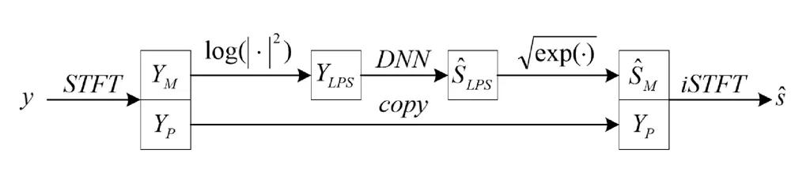
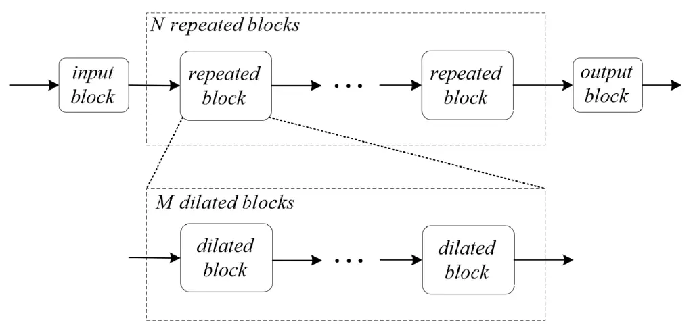
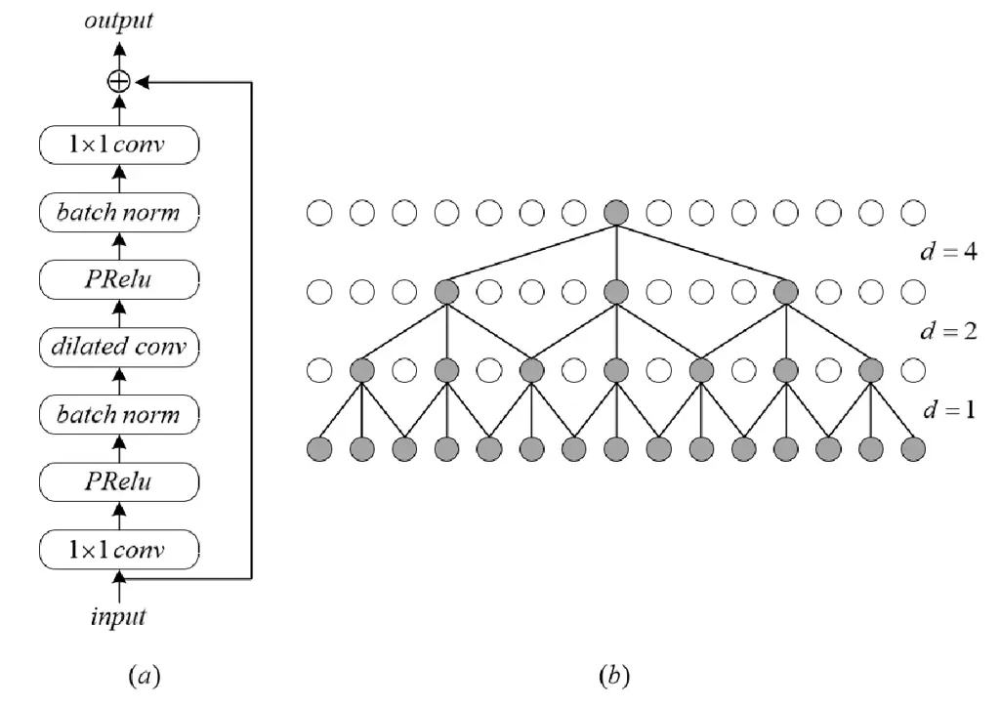

# TFCN: Temporal-Frequential Convolutional Network for Single-Channel Speech Enhancement

\authorblockNXupeng Jia and Dongmei Li \authorblockATsinghua University,
Beijing, China  
E-mail: jxp12@mails.tsinghua.edu.cn, lidmei@tsinghua.edu.cn  
Tel: +86-10-62782693

###### Abstract

Deep learning based single-channel speech enhancement tries to train a
neural network model for the prediction of clean speech signal. There
are a variety of popular network structures for single-channel speech
enhancement, such as TCNN, UNet, WaveNet, etc. However, these structures
usually contain millions of parameters, which is an obstacle for mobile
applications. In this work, we proposed a light weight neural network
for speech enhancement named TFCN. It is a temporal-frequential
convolutional network constructed of dilated convolutions and
depth-separable convolutions. We evaluate the performance of TFCN in
terms of Short-Time Objective Intelligibility (STOI), perceptual
evaluation of speech quality (PESQ) and a series of composite metrics
named Csig, Cbak and Covl. Experimental results show that compared with
TCN and several other state-of-the-art algorithms, the proposed
structure achieves a comparable performance with only 93,000 parameters.
Further improvement can be achieved at the cost of more parameters, by
introducing dense connections and depth-separable convolutions with
normal ones. Experiments also show that the proposed structure can work
well both in causal and non-causal situations.

## 1 Introduction

Single-channel speech enhancement tries to suppress the background noise
while keeping the distortion of the target speech as low as possible. It
usually aims at improving the perceptual quality and intelligibility of
speech, or reducing the word error rate of a speech recognition system.
Speech enhancement algorithms are widely used in speech-related
applications and have been studied for several decades. There are
numerous reliable speech enhancement approaches based on traditional
signal processing, and they have been already used in our daily life
\[1, 2, 3\]. However, it’s still a great challenge for them to deal with
the unstable noise and complex situations.

With the development of deep learning techniques, speech enhancement
algorithms based on deep neural networks (DNNs) have shown their
advantages over the classical ones. A number of DNN-based speech
enhancement algorithms have been proposed in the literature. They try
either to predict masks such as IBM \[4\], IRM \[5\] or PSM \[6\], or to
learn a mapping function from the noisy input to the target signal \[7,
8, 9\]. The network structure is an important factor that affects the
performance of a speech enhancement algorithm. A variety of structures
have been applied in the speech enhancement task, such as Fully
connected networks \[10\], Convolutional Neural Networks (CNNs) \[11\],
Recurrent Neural Networks (RNNs) \[12\] and their combinations \[13\].

TCN was proposed in the action augmentation task at first \[14\], and
has been shown to be an effective structure for speech enhancement and
separation. Luo proposed ConvTasNet \[15\], which employs a TCN as the
major functional block and surpasses ideal TF magnitude masking in
speech separation performance. Pandey proposed TCNN, which has an
encoder-decoder structure similar to U-Net, and utilizes a TCN block
between the encoder and the decoder \[16\]. TCNN was shown to have a
better performance than the convolutional recurrent neural network (CRN)
\[13\]. Kishore applied the ConvTasNet in speech enhancement, and
proposed a multi-layer encoder-decoder structure for TCN \[17\]. Besides
the TCN-based speech enhancement algorithms in time-domain, Zhang
proposed a TCN-based method in TF-domain named Multi-scale TCN \[18\].
It uses the TCN to learn a mapping function of Log Power Spectrum (LPS)
between noisy and clean speech signals, and adopts skip connections from
the noisy input to each residual block in TCN. The performance advantage
of TCN comes from its large and flexible receptive filed and capability
to learn the local and long-time context information. Besides, the
structure of TCN usually has a smaller model size compared with other
structures, due to the application of point-wise and depth-wise
convolutions.

When applying TCN directly in TF-domain speech enhancement, it results
in a convolutional operation along the time axis and a fully connected
operation along the frequency axis. As described in \[13\], fully
connected networks have difficulties in tracking the target speaker in
speech separation. Besides, as the number of convolution channels are
usually set to several hundred to guarantee a satisfactory performance,
the fully connected operations introduce a large number of parameters
and are very unefficient. UNet \[19\] is another popular network
structure in speech enhancement, applying convolutional operations along
both the time and frequency axes. Recent studies show that LPS mapping
system using UNet and its improved version \[20\] achieves
state-of-the-art performance. However, their performances may be limited
by the small receptive fields, and the model sizes of them are very
large. In this work, we propose TFCN by simply replacing the 1-D
convolutions in TCN with 2-D convolutions. Except for the application of
point-wise and depth-wise convolutions, we limit the number of feature
maps to further reduce the model size. We employ dense connections to
improve the performance and evaluate the algorithm under causal,
non-causal and semi-causal situations.

The rest of the paper is organized as follows. Structures of TCN and the
proposed TFCN are described in section 2. Experimental setups and
results are presented in section 3 and conclusions are drawn in section 4.

## 2 Proposed system

### 2.1 System overview



Figure 1: System overview.

The problem of single-channel speech enhancement can be formulated as

```math
y=s+n \tag{1}
```

where $`y`$, $`s`$ and $`n`$ are the observed noisy speech, the unknown
target speech and the unknown noise, respectively. The aim of the
single-channel speech enhancement system is to estimate $`s`$ from
$`y`$, as precisely as possible. The system diagram is shown in
Figure 1. $`y`$ is the input signal and $`\hat{s}`$ is the estimated
target signal. The subscript $`M`$ donates magnitude, $`P`$ donates
phase and $`LPS`$ donates log power spectrum. The DNN is the core of the
system, mapping the LPS of the noisy signal $`Y_{LPS}`$ into the LPS of
the estimated signal $`\hat{S}_{LPS}`$, which is then combined with the
noisy phase $`Y_{p}`$ to generate the estimated result $`\hat{s}`$. Note
that although this system structure has been used in previous works, the
different design of DNN results in different performance.

### 2.2 Structure of TCN



Figure 2: Diagram of the TCN used in this work.



Figure 3: Details of the dilated blocks. (a) Structure of the dilated
block. (b) An example of dilated convolution, d donates dialtion rate.

TCN is a fully convolutional network structure that was proposed in 2016. It has shown its advantages on long sequence modeling and has also
been successfully applied in speech separation and enhancement. The main
idea of TCN is to perform convolutional operations along the time axis
to utilize the context information. To further improve the length of the
context window, long receptive field is achieved by operations such as
max-pooling and dilated convolutions.

There are different versions of TCN realization. Figure 2 is the diagram
of the TCN used in this work, which is similar to the one used in TCNN
\[16\]. The TCN is constructed of three modules, which are the input
module, the enhancement module, and the output module. The input module
is a batch normalization layer followed by a 1-D convolutional layer to
change the number of feature maps. The output module is a 1x1
convolutional layer followed by PReLU non-linearity. The enhancement
module is a series of repeated blocks that have the same structure. Each
repeated block contains $`M`$ dilated blocks. The details of the dilated
blocks are shown in Figure 3(a).

The dilated block includes three convolutional layers, which are the
input 1x1 convolutional layer, the dilated convolutional layer and the
output 1x1 convolutional layer. The 1x1 convolutional layer here is
actually a 1-D point-wise convolutional layer, whose kernel size is
$`1`$. PReLU non-linearity and batch normalization are applied after the
input and dilated convolutional layers. The input convolutional layer
and the output convolutional layer are used to change the number of the
feature maps, while the dilated convolutional layer uses the dilated
convolution to extract the context information. An example of the
dilated convolution is shown in Figure 3(b). Assuming that the kernel
size of the general convolutional layer is $`3`$, and the dilation rate
is $`d`$, it means that $`d-1`$ zeros are inserted between any two
adjacent elements and results in a dilated kernel size of $`2d+1`$. In
TCN, the dilation rate of the dilated blocks in a repeated block are
often set to a geometric progression, i.e. $`1,2,4,8,…`$ Note that
although the dilated convolutional layers are often realized by
depth-wise convolution to reduce the number of parameters, there is a
trade off between the model size and the performance. TCN with general
convolutional layers for the dilated blocks achieves better performance
than the one using depth-wise convolutional layers at the cost of more
parameters.

### 2.3 Structure of TFCN

Although TCN can be used to TF-domain speech enhancement directly by
treating the spectrogram as a time sequence and the frequency bins as
different channels \[18\], the fully connected manner along the
frequency axis may limit its performance. 2-D convolution has already
been used in many speech enhancement algorithms. It can utilize the
temporal and frequential information at the same time, and effectively
recover the TF patterns in spectrogram, even with a relatively small
context window, which has been proved in previous works \[19, 20\]. With
this consideration, we proposed TFCN combining the advantages of the
long and flexible receptive field of TCN and the strong capability of TF
modeling of UNet.

The structure of TFCN is the same with the one of the TCN that is shown
in Figure 2, with the details of each block modified. The input block is
also a batch normalization layer followed by a convolutional layer.
Different from the input block of TCN, the convolutional layer here is a
2-D convolutional layer. Because the input of TFCN has only one channel,
i.e. the LPS, and the convolutional layer here is designed to expand the
number of channels, point-wise convolution is not suitable for this
block. The width and height of the kernel are set to values that are
larger than one, for example, 5 and 7. The output module is constructed
with a 2-D point-wise convolution and PReLU non-linearity.

The enhancement module also follows the structure shown in Figure 2 and
Figure 3, with all the convolutional layers using 2-D convolution
instead of 1-D convolution. The 2-D dilated convolution expands its
kernel along both the time and frequency axes. The dilation rates for
the width and height of the kernel can be set to different values
respectively. However, it is necessary to keep a relatively large
receptive field along the frequential axis within a single repeated
block to extract the frequential information effectively. Note that it
is also possible to construct the TFCN with 1-D convolution by applying
two convolutional layers for the temporal and frequential convolutions
respectively. However, it would cost more memory space for training and
the model size would be much larger than TFCN (because it’s larger than
TCN).

To further improve the performance of TFCN, dense connections are also
employed. There are two kinds of dense connections, i.e. inter- and
intra- the repeated blocks. The inter- ones connect the output of a
repeated block to the input of every later repeated block. The intra-
ones have the same manner but are applied between the dilated blocks in
the same repeated block. Note that even with the dense connections
between the dilated blocks, the residual connection is still
indispensable.

### 2.4 Causal and semi-causal realization of TFCN

Many speech-related applications concern about the latency of the
algorithm. The TFCN described above is a non-causal algorithm and has a
symmetric receptive field, which means it receives information with
equal length of time from the past and the future. However, because the
TFCN is a fully convolutional neural network, it is easy to get a causal
or semi-causal realization by padding and clipping operation. Take the
dilated convolution in figure 3(b) as an example. Considering the second
row from the bottom, adding one point of zero at the left end and
cutting off the point at the right end can result in a causal
realization. This requires that when implementing the first
convolutional layer, a padding of 2 zero elements at each sides of the
input should be used and the output points related with the padding at
the right end should be cut off. Same operations can be done on the
following layers, with an adaptation of the padding and clipping length.
To get a semi-causal implementation, clipping length at the right end
should be determined by the intended look-ahead length, and clipping at
the left end should guarantee that the input and output have the same
length.

Note that this padding and clipping operation should only be applied
along the temporal axis, with the parameters related to the frequential
axis remaining unchanged. What’s more, the convolutional layer in the
input block should also be considered, which is different from the TCN.
The batch normalization layers have no impact on the causal property
because they work with fixed parameters in the inference stage.

## 3 Experiments

### 3.1 Datasets

The popular VCTK dataset constructed by Valentini et al \[21\] is used
to evaluate the performance of TFCN. The dataset is publicly available
at https://datashare.ed.ac.uk/handle/10283/2791. It contains clean and
noisy speech signals sampled at 48 KHz. The signals are resampled to 16
KHz in our experiments.

The train data is constructed with clean speech signals of 28 speakers
from the Voice Bank Corpus \[22\], including 14 male and 14 female
speakers. There are about 400 utterances for each speaker. Ten types of
noise are used to generate the train data, including two artificial ones
which are babble and speech-shaped noise, and eight real noise
recordings from the Demand database \[23\]. Four signal-to-noise ratio
(SNR) levels are used, which are 0 dB, 5 dB, 10 dB and 15 dB, resulting
in 40 different noise conditions. In our work, the train data is
randomly divided into two parts, one contains 10077 utterances for
training and the other one contains 1495 utterances for validation.

For the test data, 2 speakers from the Voice Bank Corpus and 5 types of
noise from the Demand database are selected. Note that all the speakers
and noises used for test data are different from the ones for train
data. The SNR levels are set to 2.5 dB, 7.5 dB, 12.5 dB and 17.5 dB.

### 3.2 Objective metrics

Five popular objective metrics are used to evaluate the performance of
the proposed method. They are STOI \[24\], PESQ \[25\], Csig, Cbak and
Covl \[26\]. STOI measures the intelligibility of the enhanced signal,
and its value is between 0 and 1. PESQ is a broadly used metric for the
perceptron quality of speech, and it provides a value in the range from
-0.5 to 4.5. For the last three metrics, Csig reflects the signal
distortion, Cbak estimates the background noise intrusiveness, and Covl
predicts the overall quality of speech. They all produce values between
0 and 5. For all of these five metrics, a higher value stands for a
better performance.

### 3.3 Experimental setup

The speech signals are transformed into spectrogram using Short-Time
Fourier Transform (STFT). The length of frame and the hop-size are 512
points and 256 points, respectively. A 512-point Hanning window is used.
In this way, an LPS with 257 frequency bins can be produced. The last
frequency bin is eliminated so that the input and output of the network
both have 256 frequency bins. Although this eliminating step is not
necessary, it can help make a better comparison by keeping the same
setup with the baseline methods such as UNet \[19\] and TCN. As for the
output, the last frequency bin is padded with zero. Normalization is
also applied,

```math
\tilde{Y}_{LPS}=(Y_{LPS}-U)/V \tag{2}
```

```math
\hat{S}_{LPS}=\tilde{S}_{LPS}*V+U \tag{3}
```

where $`\tilde{Y}_{LPS}`$ and $`\tilde{S}_{LPS}`$ are the input and
output of the network, respectively. $`U`$ and $`V`$ is the mean value
and standard deviation of all the noisy signals in the train data. The
normalization and denormalization is performed on the frequency bin
level, which means that $`U`$ and $`V`$ are vectors of 256 elements.

The loss function is the same with the one in UNet:

```math
loss=\frac{1}{T}\sum_{i=1}^{T}\sqrt{\frac{1}{F}\sum_{j=1}^{F}(S_{i,j}-\hat{S}_{i,j})^{2}} \tag{4}
```

where $`S`$ and $`\hat{S}`$ are clean and estimated LPS, respectively.
$`T`$ is the number of frames and $`F`$ is the number of frequency bins.

| block   | layer  | channel number | kernel size |
| ------- | ------ | -------------- | ----------- |
| input   | conv   | $`1,16`$       | $`5,7`$     |
| dilated | conv_0 | $`16,64`$      | $`1,1`$     |
|         | conv_1 | $`64,64`$      | $`3,3`$     |
|         | conv_2 | $`64,16`$      | $`1,1`$     |
| output  | conv   | $`16,1`$       | $`1,1`$     |

Table 1: Parameters of TFCN

The hyper-parameters of TFCN are shown in Table 1. The channel number is
in shape (input channel, output channel), and the kernel size is in
shape (height, width). Conv_0, conv_1 and conv_2 stand for the three
convolutional layers in one dilated block. There are $`4`$ repeated
blocks in TFCN and each repeated block contains $`8`$ dilated blocks.
The dilation rate of the $`n^{th}`$ dilated block within a repeated
block is set to $`2^{n}`$, where $`n`$ starts from $`0`$.

The network is optimized with Adam optimizer. The speech signals are
re-organized into segments with fixed length of 2s, i.e. 32000 sampling
points, to form the batch data for training, while in the inference
stage the intact utterances are fed into the network one by one. The
initial learning rate is set to 0.001 and is halved if the validation
loss is larger than the best loss for three continuous epochs. Early
stop strategy is employed with patience of 10 epochs. The max epoch
number is set to 100 while the training process usually stops within 50
epochs in practice.

### 3.4 Results and discussion

| method          | STOI  | PESQ | Csig | Cbak | Covl |
| --------------- | ----- | ---- | ---- | ---- | ---- |
| noisy           | 0.921 | 1.97 | 3.35 | 2.44 | 2.63 |
| WaveNet \[27\]  | N/A   | N/A  | 3.62 | 3.23 | 2.98 |
| C2F \[28\]      | N/A   | 2.73 | 3.94 | 3.35 | 3.33 |
| UNet \[19\]     | 0.938 | 2.90 | 4.22 | 3.32 | 3.58 |
| Affinity \[20\] | N/A   | 3.04 | 4.30 | 3.42 | 3.69 |
| TCN-time        | 0.946 | 2.94 | 4.11 | 3.50 | 3.53 |
| TCN-LPS         | 0.932 | 2.88 | 4.30 | 3.22 | 3.60 |
| TFCN            | 0.943 | 3.00 | 4.38 | 3.44 | 3.71 |
| TFCN-d          | 0.948 | 3.06 | 4.44 | 3.47 | 3.78 |

Table 2: Comparison with other methods

| method          | param number |
| --------------- | ------------ |
| UNet \[19\]     | 136.83M      |
| Affinity \[20\] | 15.52M       |
| TCN-LPS         | 8.64M        |
| TFCN            | 0.09M        |
| TFCN-d          | 1.38M        |

Table 3: Number of parameters

The comparison with several state-of-the-art speech enhancement methods
is shown in Table 2. The baseline methods include a time-domain speech
enhancement method based on WaveNet \[27\], a convolutional neural
network trained with coarse to fine optimization strategy \[28\], an LPS
mapping method base on UNet \[19\] and its modified version \[20\] which
has two decoding branches and is optimized with subspace affinity loss.
Besides, TCN-time is a time-domain speech enhancement method with
multilayer encoder-decoder according to \[17\]. TCN-LPS directly use TCN
described in Section 2.2 to estimate the clean LPS. TFCN is an
implementation of the proposed structure with depth-wise convolution for
the dilated convolutional layer. TFCN-d uses normal convolution instead
and adds dense connections intra- and inter- repeated blocks to TFCN.

It can be seen that the proposed TFCN structures have better
performances than the baseline methods. TFCN-d method achieves the best
performance except for Cbak. TCN-time has the highest Cbak score, but
get low scores in terms of Csig and Covl, which indicates that the
time-domain method may have the best suppression capability of
background noise but introduced more distortion to the speech signal.
TFCN outperform TCN-LPS in terms of all the metrics, while the model
size of TFCN is only about 1.1% of TCN-LPS, as is shown in Table 3. This
indicates that the proposed structure is more parameter-effective for
LPS enhancement. Note that although the model size of TFCN-d is larger
than TFCN, it is still significantly smaller than the other models
mentioned above.

The reason that TFCN can achieve the excellent performance with only
about 93k parameters lies in two aspects. One is the application of
depth-wise separable convolutions, which is the same as TCN. The other
one is that the 2-D convolutions are more efficient on modeling the LPS
of speech signals, which allows the network to use fewer channels and
further reduces the number of parameters.

The performance of the causal and semi-causal realization of TFCN-d is
shown in Table 4. It can be seen that the lack of the future information
degrades the performance to a certain extent. However, the semi-causal
realization with 304ms look ahead only suffers from a negligible
degradation, which indicates that the proposed network can also be used
in the situation that allows a reasonable latency.

| method       | STOI  | PESQ | Csig | Cbak | Covl |
| ------------ | ----- | ---- | ---- | ---- | ---- |
| Non-causal   | 0.948 | 3.06 | 4.44 | 3.47 | 3.78 |
| Semi (304ms) | 0.945 | 3.04 | 4.42 | 3.42 | 3.75 |
| Semi (48ms)  | 0.942 | 2.98 | 4.38 | 3.39 | 3.70 |
| Causal       | 0.940 | 2.91 | 4.32 | 3.36 | 3.63 |

Table 4: Performance of causal and semi-causal TFCN-d

## 4 Conclusions

We propose TFCN for single channel speech enhancement. TFCN performs
convolutional operations along both the time and frequency axis, and can
effectively extract the temporal-frequential information. Experimental
results show that TFCN can achieve an excellent performance with very
few parameters. Using general convolutions instead of depth-wise
convolutions and introducing the dense connections can further improve
the performance. Experimental results also show that TFCN can work well
both in causal and semi-causal situations. We will further improve the
performance and parameter-efficiency of TFCN in our future work.

## References

- \[1\] J. S. Lim and A. V. Oppenheim, “All-pole modeling of degraded
  speech,” _IEEE Transactions on Acoustics, Speech and Signal
  Processing_, vol. 26, no. 3, pp. 197–210, 1978.
- \[2\] S. Boll, “Suppression of acoustic noise in speech using spectral
  subtraction,” _IEEE Transactions on Acoustics, Speech and Signal
  Processing_, vol. 27, no. 2, pp. 113–120, 1979.
- \[3\] Y. Ephraim and D. Malah, “Speech enhancement using a minimummean
  square error short-time spectral amplitude estimator,” _IEEE
  Transactions on Acoustics, Speech and Signal Processing_, vol. 32,
  no. 6, pp. 1109–1121, 1984.
- \[4\] D. Wang, “On ideal binary mask as the computational goal of
  auditory scene analysis,” in _Speech separation by humans and
  machines_. Springer, 2005, pp. 181–197.
- \[5\] A. Narayanan and D. Wang, “Ideal ratio mask estimation using
  deep neural networks for robust speech recognition,” in _2013 IEEE
  International Conference on Acoustics, Speech and Signal
  Processing_. IEEE, 2013, pp. 7092–7096.
- \[6\] S. W. H. Erdogan, J. R. Hershey and J. L. Roux, “Phase-sensitive
  and recognition-boosted speech separation using deep recurrent neural
  networks,” in _2015 IEEE International Conference on Acoustics, Speech
  and Signal Processing (ICASSP)_. IEEE, 2015, pp. 708–712.
- \[7\] Y. Xu, J. Du, L. Dai, and C. Lee, “A regression approach to
  speech enhancement based on deep neural networks,” _IEEE/ACM
  Transactions on Audio, Speech, and Language Processing_, vol. 23,
  no. 1, pp. 7–19, 2015.
- \[8\] T. Gao, J. Du, L. Dai, and C. Lee, “Densely connected
  progressive learning for lstm-based speech enhancement,” in _2018 IEEE
  International Conference on Acoustics, Speech and Signal Processing
  (ICASSP)_, 2018, pp. 5054–5058.
- \[9\] M. Kolbæk, Z. Tan, S. H. Jensen, and J. Jensen, “On loss
  functions for supervised monaural time-domain speech enhancement,”
  _IEEE/ACM Transactions on Audio, Speech, and Language Processing_,
  vol. 28, pp. 825–838, 2020.
- \[10\] Y. Xu, J. Du, L. Dai, and C. Lee, “An experimental study on
  speech enhancement based on deep neural networks,” _IEEE Signal
  Processing Letters_, vol. 21, no. 1, pp. 65–68, 2014.
- \[11\] A. Pandey and D. Wang, “A new framework for cnn-based speech
  enhancement in the time domain,” _IEEE/ACM Transactions on Audio,
  Speech, and Language Processing_, vol. 27, no. 7, pp. 1179–1188, 2019.
- \[12\] L. Sun, J. Du, L. Dai, and C. Lee, “Multiple-target deep
  learning for lstm-rnn based speech enhancement,” in _2017 Hands-free
  Speech Communications and Microphone Arrays (HSCMA)_, 2017, pp.
  136–140.
- \[13\] K. Tan and D. Wang, “A convolutional recurrent neural network
  for real-time speech enhancement,” in _Proc. Interspeech 2018_, 2018,
  pp. 3229–3233.
- \[14\] A. R. C. Lea, R. Vidal and G. Hager, “Temporal convolutional
  networks: A unified approach to action segmentation,” 08 2016, pp.
  47–54.
- \[15\] Y. Luo and N. Mesgarani, “Conv-tasnet: Surpassing ideal
  time–frequency magnitude masking for speech separation,” _IEEE/ACM
  Transactions on Audio, Speech, and Language Processing_, vol. 27,
  no. 8, pp. 1256–1266, 2019.
- \[16\] A. Pandey and D. Wang, “Tcnn: Temporal convolutional neural
  network for real-time speech enhancement in the time domain,” in
  _ICASSP 2019 - 2019 IEEE International Conference on Acoustics, Speech
  and Signal Processing (ICASSP)_, 2019, pp. 6875–6879.
- \[17\] N. T. V. Kishore and P. Paramasivam, “Improved Speech
  Enhancement Using TCN with Multiple Encoder-Decoder Layers,” in _Proc.
  Interspeech 2020_, 2020, pp. 4531–4535.
- \[18\] L. Zhang and M. Wang, “Multi-Scale TCN: Exploring Better
  Temporal DNN Model for Causal Speech Enhancement,” in _Proc.
  Interspeech 2020_, 2020, pp. 2672–2676.
- \[19\] A. E. Bulut and K. Koishida, “Low-latency single channel speech
  enhancement using u-net convolutional neural networks,” in _ICASSP
  2020 - 2020 IEEE International Conference on Acoustics, Speech and
  Signal Processing (ICASSP)_, 2020, pp. 6214–6218.
- \[20\] D. N. Tran and K. Koishida, “Single-Channel Speech Enhancement
  by Subspace Affinity Minimization,” in _Proc. Interspeech 2020_, 2020,
  pp. 2447–2451.
- \[21\] C. Valentini-Botinhao, “Noisy speech database for training
  speech enhancement algorithms and tts models,” 2016.
- \[22\] C. Veaux, J. Yamagishi, and S. King, “The voice bank corpus:
  Design, collection and data analysis of a large regional accent speech
  database,” in _2013 International Conference Oriental COCOSDA held
  jointly with 2013 Conference on Asian Spoken Language Research and
  Evaluation (O-COCOSDA/CASLRE)_, 2013, pp. 1–4.
- \[23\] N. I. J. Thiemann and E. Vincent, “The diverse environments
  multi-channel acoustic noise database: A database of multichannel
  environmental noise recordings.” _The Journal of the Acoustical
  Society of America_, vol. 133, no. 5, pp. 3591–3591, 2013.
- \[24\] C. H. Taal, R. C. Hendriks, R. Heusdens, and J. Jensen, “An
  algorithm for intelligibility prediction of time–frequency weighted
  noisy speech,” _IEEE Transactions on Audio, Speech, and Language
  Processing_, vol. 19, no. 7, pp. 2125–2136, 2011.
- \[25\] A. W. Rix, J. G. Beerends, M. P. Hollier, and A. P. Hekstra,
  “Perceptual evaluation of speech quality (pesq)-a new method for
  speech quality assessment of telephone networks and codecs,” in _2001
  IEEE International Conference on Acoustics, Speech, and Signal
  Processing. Proceedings (Cat. No.01CH37221)_, vol. 2, 2001, pp.
  749–752.
- \[26\] Y. Hu and P. C. Loizou, “Evaluation of objective quality
  measures for speech enhancement,” _IEEE Transactions on Audio, Speech,
  and Language Processing_, vol. 16, no. 1, pp. 229–238, 2008.
- \[27\] D. Rethage, J. Pons, and X. Serra, “A wavenet for speech
  denoising,” in _2018 IEEE International Conference on Acoustics,
  Speech and Signal Processing (ICASSP)_, 2018, pp. 5069–5073.
- \[28\] J. Yao and A. Al-Dahle, “Coarse-to-Fine Optimization for Speech
  Enhancement,” in _Proc. Interspeech 2019_, 2019, pp. 2743–2747.
