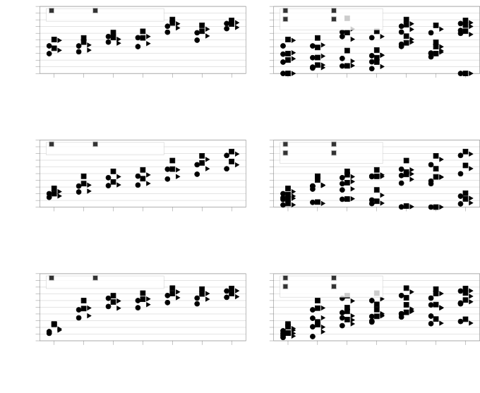
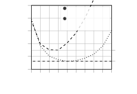
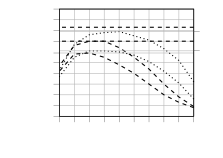
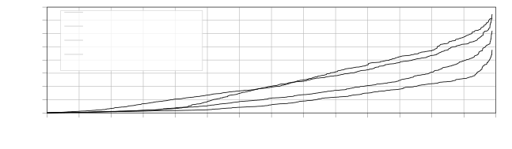

# Signal-Aware Direction-of-Arrival Estimation Using Attention Mechanisms

Journal: Computer Speech and Language

Wolfgang Mack Email: <wolfgang.mack@audiolabs-erlangen.de> Corresponding
author: Corresponding author Address: International Audio Laboratories
Erlangen (a joint institution of the Friedrich-Alexander-University
Erlangen-Nuremberg (FAU) and Fraunhofer IIS), Am Wolfsmantel 33, 91058
Erlangen, Germany.    Julian Wechsler Email: <julian.wechsler@fau.de>
Address: Friedrich-Alexander-University Erlangen-Nuremberg, Schloßplatz
4, 91054 Erlangen, Germany.    Emanuël A. P. Habets
Email: <emanuel.habets@audiolabs-erlangen.de> Address: International
Audio Laboratories Erlangen (a joint institution of the
Friedrich-Alexander-University Erlangen-Nuremberg (FAU) and Fraunhofer
IIS), Am Wolfsmantel 33, 91058 Erlangen, Germany.

###### Abstract

The DOA (DOA) of sound sources is an essential acoustic parameter used,
e.g., for multi-channel speech enhancement or source tracking. Complex
acoustic scenarios consisting of sources-of-interest, interfering
sources, reverberation, and noise make the estimation of the DOAs
corresponding to the sources-of-interest a challenging task. Recently
proposed attention mechanisms allow DOA estimators to focus on the
sources-of-interest and disregard interference and noise, i.e., they are
signal-aware. The attention is typically obtained by a DNN (DNN) from a
STFT (STFT) based representation of a single microphone signal.
Subsequently, attention has been applied as binary or ratio weighting to
STFT-based microphone signal representations to reduce the impact of
frequency bins dominated by noise, interference, or reverberation. The
impact of attention on DOA estimators and different training strategies
for attention and DOA DNNs are not yet studied in depth. In this paper,
we evaluate systems consisting of different DNNs and signal
processing-based methods for DOA estimation when attention is applied.
Additionally, we propose training strategies for attention-based DOA
estimation optimized via a DOA objective, i.e., end-to-end. The
evaluation of the proposed and the baseline systems is performed using
data generated with simulated and measured room impulse responses under
various acoustic conditions, like reverberation times, noise, and source
array distances. The best-performing systems are also evaluated using
measured data. Our experiments show that DNNs used for DOA estimation
are biased to the spectral source characteristics and the spectral
attention distribution used during training (e.g., spectrally
flat/sparse). We also show that this bias in the DOA estimator can be
avoided if signal-processing methods are used in combination with
attention. Overall, DOA estimation using attention in combination with
signal-processing methods exhibits a far lower computational complexity
than a fully DNN-based system; however, it yields comparable results.

###### Keywords: 

Direction-of-Arrival; Signal-Dependent; Attention; Deep Learning

DOA  
direction-of-arrival

CCE  
categorical cross-entropy

E2E  
end-to-end

STFT  
short-time Fourier transform

SOI  
source-of-interest

DNN  
deep neural network

CNN  
convolutional neural network

RIR  
room impulse response

FFNN  
feed-forward neural network

SPS  
spatial pseudo spectrum

AE  
absolute error

FLOPs  
floating-point-operations

## 1 Introduction

The sound emitted by a point source in an enclosed space spreads
spherically and gets reflected by walls and other obstacles. Typically,
the non-reflected sound is referred to as direct, whereas reflections
are referred to as reverberation. Additional interfering sources like a
ventilator, or background noise, e.g., from a nearby road, add further
complexity to the sound field and severely degrade humans’ and machines’
ability to localize sources or understand speech. When such a sound
field is captured with an array of microphones, acoustic
signal-processing techniques can be used to increase the speech
intelligibility, e.g., with beamformers \[1, 2, 3, 4, 5\], or to track
sources \[6\], e.g., with acoustic simultaneous localization and mapping
\[7\]. These techniques often require estimates of the DOA of the sound
sources. For some applications, only the DOA of the SOI (SOI) is desired
or required. For example, consider two concurrently active sources: SOI
and interference. Conventional DOA estimators yield the DOA of both
sources. Typically, it is unclear which of both DOAs corresponds to the
SOI and which to the interfering source. A correct DOA assignment to the
SOI is crucial for beamformers, as a wrong assignment leads to an
attenuation of the SOI.

Estimation methods for the DOA have been investigated thoroughly in the
literature (e.g., \[8, 9, 10\]). Typically, DOA estimators exploit
spatial features present in the microphone signals due to a level
difference and a time difference of arrival (TDOA) of the source signal
between the individual microphones. For far-field scenarios and
omnidirectional microphones, the level difference is usually minimal and
can be neglected. In the frequency domain, the TDOA translates to
frequency-band specific phase-differences between the microphones. Here,
the spatial features can be exploited per frequency band (narrowband) or
from all frequency bands (broadband). Signal processing-based methods to
estimate the DOA from these features can be based on the
inter-microphone cross-correlations \[11, 12, 13\], beamformers \[14,
15, 16\] or subspaces \[17, 16, 18, 19, 20, 21, 22\]. The
inter-microphone cross-correlations, like the
generalized-cross-correlation \[23\] with maximum likelihood or phase
transform (PHAT) \[13\] weighting exploit the DOA and frequency
dependency of the inter-microphone phase-differences to estimate the
DOA. In \[24\], a least square approach is used to minimize the phase
differences obtained from measurements and an estimated DOA. Beamforming
techniques like steered-response power, e.g., with PHAT weighting \[15,
16\] (SRP-P), or a steered minimum-variance distortionless response
beamformer \[14\] sample the DOA space by steering in pre-defined
directions. The DOA is subsequently estimated by maximum picking. An
alternative is null-steering \[25\], where the idea is similar, but the
DOA is obtained by minimum picking. Alternatively, the DOA can be
estimated using subspace-based methods like MUltiple SIgnal
Classification (MUSIC) \[17, 16, 18\], based on noise subspaces, or
estimation of signal parameters via rotational invariant techniques
\[19, 20, 21, 22\], based on sub-arrays. In \[26\], the authors exploit
reflection patterns using semi-supervised manifold learning with a
distributed microphone array to localize a single source.

Also, deep-learning techniques have been used for DOA estimation \[27,
28, 29, 30, 31, 32, 33, 34, 35, 36, 37, 38, 39, 40, 41, 42, 43, 44, 45,
46, 47, 48, 49, 50, 51\]. Typically, deep-learning methods for DOA
estimation are computationally more complex than signal-processing
methods and require retraining or architecture modifications if
fundamental parameters like the number of microphones or the array
architecture change. When using deep learning for DOA estimation, a DNN
learns to map a feature representation of the microphone signals to the
DOA. This enables matching the trained DNN via the training data to
specific scenarios. The estimated DOA on the DNN output can be
represented in a classification manner, where a class activity
symbolizes an active source from the corresponding direction, or a
regression manner, where a single variable represents the DOA (e.g., an
angle). According to \[28\], both representations yield comparable
results such that the output representation of the DOA is a design
choice. Some of the DNNs for DOA estimation (referred to as DDNNs) are
trained with directional noise signals (e.g., \[40, 45, 52\]) as this
allows to generate an infinite amount of simulated training data.
Conceptually, training with noise implies that the DDNN learns spatial
and no spectral source characteristics, as expected of a DOA estimator.
Very recently, \[53\] showed that training with speech improves the
localization of speech sources compared to training with noise, although
the DDNN was only provided with the STFT phases of the microphone
signals and not the respective magnitudes. The DDNN, consequently, is
biased towards speech sources if trained with speech or towards
spectrally white sources when trained with spectrally white noise. In
comparison, signal-processing methods for DOA estimation do not exhibit
such a bias towards spectral source characteristics.

In the so-called sound event localization and detection (SELD) task
\[29, 41, 43\], the ability of DNNs to be tailored to specific
(spectral) source characteristics for DOA estimation is exploited to
localize specific sources and their activity, only. In SELD, a DNN is
used to detect a sound event and the respective DOA. In \[29, 41, 43\],
the sources-of-interest have to be defined during training the DDNN. For
each SOI class, the DDNN has outputs for the respective source activity
and the DOA. This approach requires retraining the DDNN if the SOI
changes. Additionally, the number of DDNN outputs has to be increased
each time the number of SOI classes increases, which could introduce
scaling problems for a high number of SOI classes, or changing classes.
An example of many changing classes is the localization of multiple
speakers, where each class represents a specific speaker. In \[29, 41,
43\], each SOI speaker had to be defined during training and treated as
an individual class on the DDNN output. Changing SOI speakers would
require retraining the DDNN, which is impractical for many applications.

In SELD, a single DNN is designed to detect the activity of
sources-of-interest and determine their DOAs. Alternatively, these two
tasks can be separated via the concept of attention \[44, 46, 47, 48,
54, 55, 46, 56\]. Systems using attention for DOA estimation often
consist of a DOA module, which estimates the DOA (e.g., a DDNN or a
signal-processing method) and an attention module, which provides the
attention that is used in the DOA module to focus on the SOI and
disregard interference, reverberation, and noise. If the SOI selection
is performed independently of the DOA module (e.g., if the DOA module is
a signal-processing method), no DOA module change (architecture change,
retraining) is required for a changing or an increasing number of SOI
classes as in SELD \[29, 41, 43\]. Only the attention has to be
modified. Attention can be estimated from spectral \[44, 46, 47, 48\] or
spatial \[57\] features and can be implemented as a weighting applied to
a feature representation of the microphone signals in or before the DOA
module. The weighting concept of attention is similar to the
time-frequency masking concept for single-channel source
extraction/separation/enhancement (e.g., \[58, 59, 60, 61, 62, 63, 64,
65, 66, 67\]), which allows adopting the concepts of this highly
investigated field to compute attention to enable signal-aware DOA
estimation. For example, a promising direction is to adopt techniques
from universal sound source separation for attention-based multi-source
DOA estimation \[68, 69\]. Consequently, attention provides additional
flexibility.

Typically, the attention module is implemented in the form of a DNN
(referred to as ADNN) for both fully DNN-based systems and hybrid
systems, where a signal-processing method is used as DOA module. In
hybrid systems \[54, 55, 46, 56\], the ADNN estimates a time-frequency
mask and was optimized using the ideal binary mask \[56, 46\], the
Wiener filter \[55\], or the phase-sensitive mask \[54\] as the target.
That way, feature representations of the input signals are modified to
be dominated by the SOI. Subsequently, MUSIC \[56\], SRP-P \[54, 55\],
or a complex Watson mixture model \[46\] were used to estimate the DOA
of the SOI. The SOI, thereby, was exclusively defined as a speech
source. In \[46\], a multi-speaker environment was considered where the
SOI was defined in a speakerbeam \[70\] like manner using a reference
audio snippet of the respective SOI (speaker) processed in the ADNN. In
\[54, 55, 56\], the environment consisted of a single speech source (the
SOI) and non-speech interference or babble noise.

In fully DNN-based systems \[48, 44, 47\], the ADNN estimates attention
for a DDNN to enable signal-aware DOA estimation. The DDNNs typically
consist of a CNN (CNN) to extract features from the microphone signals
and a subsequent FFNN (FFNN) to map the features to the DOA. Attention
has been applied either before \[48, 47, 44\] or after the feature
extracting CNN \[48, 57\]. In our preliminary work \[48\], we showed
that attention application after the CNN outperforms attention
application at the input. Training the ADNN has been done using
masking-based \[47, 48, 44\] or E2E (E2E) using DOA-based \[44\]
objectives. For low-SNR scenarios and unmatched training-test
conditions, E2E training performed best, whereas, for high SNR
scenarios, attention degraded the performance slightly compared to the
attention-free scenario \[44\]. As for the hybrid systems, the focus of
the fully DNN-based methods is on localizing speech sources. In \[47\],
the SOI is a specific speaker defined by a spoken keyword in a
multi-speaker environment, whereas in \[48, 44\], there is only a single
speaker and non-speech interference.

To this point, it is not clear how hybrid systems perform in comparison
to fully DNN-based systems, although hybrid systems typically exhibit a
far lower computational complexity. Additionally, the effect of
attention on DDNNs is not yet investigated thoroughly. To investigate
the effect of attention on DDNNs, we evaluate different DDNN
architectures, input features, attention-application methods, and
training data simulation methods and compare their performance on data
simulated using measured room impulse responses (RIRs). In particular,
we investigate the importance of spectral context for DDNNs (see
Sections 3.1.3, 3.2.2, 5.1), whether DDNNs are biased towards a specific
attention distribution via training (see Section 5.1) and whether the
DDNN architecture can be reduced significantly dependent on the input
features/architecture (see Sections 3.1, 5.1). Subsequently, we evaluate
different attention-application and DDNN/ADNN training methods in
Section 5.2. Finally, the best performing fully DNN-based system is
compared to different hybrid systems for signal-aware DOA estimation of
a single speech source in the presence of directional interference and
noise. Experiments with a fine-grained DOA resolution
($`\approx 1^{\circ}`$) and using measured data are conducted in
Section 5.3 and Section 5.4, respectively.

The main contributions can be summarized as follows: (I) Exhaustive
evaluation and comparison of existing and proposed methods for
signal-aware DOA estimation using simulated and measured data in
Section 5. (II) The proposition of novel training methods for fully
DNN-based and hybrid systems in Section 3.2. In particular, we propose:
a) An E2E training method when attention is applied in the DDNN -
differences to \[44\] are explained in Section 2.2.2 and to \[57\] in
Section 3.2.1; b) A narrowband DDNN; c) Training an ADNN in combination
with SRP-P with a DOA-related loss (state-of-the-art is based on
masking/enhancement-related losses \[54, 55, 46, 56\]) (III) Evaluation
of the role of attention and spectral context for DDNNs. The work
presented here builds upon our work \[48\] presented at ICASSP 2020.

The remainder of the paper is organized as follows. In Section 2, we
introduce a signal model and introduce our preliminary work \[48\] and
baselines for hybrid \[54\] and fully DNN-based \[44\] signal-aware DOA
estimation. Subsequently, we introduce the proposed modifications to the
DNN architecture from \[48\] and the proposed training methods for
hybrid and fully DNN-based systems. In Section 4, we describe the data
sets used for evaluation and training. Finally, in Section 5, we
evaluate the proposed and baseline systems using measured and simulated
data.

## 2 Fundamentals

### 2.1 Problem Formulation

Figure 1: Scheme for DOA ($`\theta_{i}`$) estimation of the $`i`$-th
source.

We assume a uniform-linear microphone array (ULA) with $`Q`$ microphones
with microphone index $`q\in\{1,\ldots,Q\}`$ positioned in a reverberant
room with several directional sound sources. We define the microphone
signals in the STFT domain as $`Y\in\mathbb{C}^{Q\times K\times N}`$,
where $`\mathbb{C}`$ specifies the complex domain, $`K`$ specifies the
number of frequencies of the one-sided STFT spectrum with
frequency-index $`k\in\{1,...,K\}`$ and $`N`$ specifies the number of
time-frames with time-frame index $`n\in\{1,...,N\}`$. The microphone
signals can be modelled as a superposition of representations of the
source signals $`X_{i}\in\mathbb{C}^{Q\times K\times N}`$ with source
index $`i`$ and spatio-temporally white microphone self-noise
$`V\in\mathbb{C}^{Q\times K\times N}`$, i.e.,

```math
Y=\sum_{i=1}^{I}X_{i}+V, \tag{1}
```

where $`I\in\mathbb{N}`$ is the number of sources. The source $`X_{i}`$
can be split into a direct component
$`X_{i}^{\textrm{d}}\in\mathbb{C}^{Q\times K\times N}`$ that reaches the
microphones without being reflected (e.g., from walls, or other
obstacles) and a reverberant component
$`X_{i}^{\textrm{r}}\in\mathbb{C}^{Q\times K\times N}`$, i.e.,

```math
X_{i}=X_{i}^{\textrm{d}}+X_{i}^{\textrm{r}}. \tag{2}
```

For a ULA, the DOA of the $`i`$-th source is defined as the angle
$`\theta_{i}\in[0,180]`$ which specifies the direction of the $`i`$-th
source to the microphone array as shown in Figure 1. From Figure 1, it
can be inferred that this information is embedded in
$`X_{i}^{\textrm{d}}`$. Other sources, reverberation, or noise,
consequently complicate the DOA estimation of the $`i`$-th source.

In a typical DOA estimation context, the objective is to estimate from
$`Y`$ the DOA of all $`I`$ sources. In signal-aware DOA estimation, the
aim is to estimate from $`Y`$ only the DOAs of the sources-of-interest,
which are in a subset of all $`I`$ sources. The definition of
sources-of-interest, thereby, is user and application-defined. To reduce
the impact of reverberation, noise, and interference on the DOA estimate
and enable signal-aware DOA estimation, attention in the form of a
weighting mask $`M\in[0,1]^{K\times N}`$ can be applied to $`Y`$ or a
feature representation of it. In STFT domain, the smallest unit to
estimate the DOA from is a single STFT-bin $`Y[:,k,n]`$. The largest
unit is the whole signal $`Y[:,:,:]`$. Strong interference or pauses of
the SOI can deteriorate to the final DOA estimate. Via weighting with
$`M`$, the influence of STFT-bins that degrade the DOA estimation
performance of the sources-of-interest can be reduced.

If $`M`$ attends to multiple directional sound sources, there is no
assignment of the estimated DOAs to the respective sources-of-interest.
For multiple sources-of-interest, the weighting $`M`$ can be constructed
such that all sources-of-interest are attended to simultaneously.
Alternatively, different sound classes can be defined, where each class,
for example, represents a single speaker or a collection of directional
sounds. In this case, a weighting $`M_{u}`$ can be constructed to attend
to a source belonging to the $`u`$-th class. This process can be
repeated for all sources-of-interest to estimate their respective DOAs.
For example, consider two active sources-of-interest, a speaker and a
loudspeaker playing music. When both sources are attended to
simultaneously with a single mask, two DOAs are obtained without an
assignment to speech and music. With $`M_{1}`$ and $`M_{2}`$, each time
one DOA is obtained, where the assignment of $`M_{1}`$ and $`M_{2}`$ to
speech and music, respectively, allows assigning the respective DOAs to
speech and music in the same way. This has the additional advantage that
two DOAs are obtained even if the sources come from the same direction.
Using multiple masks enables multi-source DOA estimation via
single-source DOA estimation. Consequently, we restrict the experiments
to a single SOI of type speech without loss of generality.

### 2.2 Fully DNN-Based Signal-Aware DOA Estimation

Figure 2: Scheme of the DNN system from our preliminary work \[48\].
$`|\bullet|`$ symbolizes magnitude extraction of the input and
$`\angle\bullet`$ phase extraction of the respective input. A DDNN based
on a CNN and a FFNN maps the STFT phases frame-wise to 37 DOA classes.
Attention is included in a) via feature masking \[see (7)\] and
alternatively in b) via phase masking \[see (6)\] such that only the
SOI, here a speech source, is localized. The attention is computed from
the magnitude spectrum of one microphone using a long short-term memory
neural network (LSTM), the ADNN.

In this section, we review our recently proposed DNN for signal-aware
DOA estimation \[48\]. The architecture is depicted in Figure 2.

#### 2.2.1 Architecture and Training

The DDNN \[45\] consists of two parts, a CNN and a FFNN. The CNN
consists of $`Q-1`$ convolutional layers with $`64`$ filters of shape
$`(2,1)`$ (inter-microphone application), each, stride $`1`$,
padding $`0`$, and ReLU activation after each layer. The FFNN consists
of 3 layers with ReLU activation and a sigmoid output activation with
shapes $`(257\cdot 64,512)`$, $`(512,512)`$, $`(512,C)`$, where $`C`$
represents a discrete representation of the DOA space corresponding to
angles $`\widetilde{\theta}\in\mathbb{R}^{C}`$, where here $`C=37`$, and
$`\widetilde{\theta}[c]=(c-1)\cdot\frac{180}{C-1}^{\circ}`$, with
$`c\in\{1,\ldots,C\}`$. We denote the discrete DOA representation for
$`N`$ consecutive time-frames as $`E\in[0,1]^{C\times N}`$. The input of
the DDNN consists of the microphone phases of a single time-frame $`n`$,
$`P[:,:,n]\in[-\pi,\pi]^{Q\times K}`$. We denote the features after the
CNN for $`N`$ separately processed time-frames as
$`F\in\mathbb{R}^{K\times 64\times N}`$, where 64 is the total number of
CNN filters, and $`N`$ specifies the number of processed time-frames.
Consequently, the CNN filters extract inter-microphone but not
inter-frequency information from $`P[:,:,n]`$. Finally, the FFNN maps
$`F[:,:,n]`$ to $`E[:,n]`$, where values close to $`1`$ specify source
activity in the respective direction in time-frame $`n`$ \[45\], and
zero specifies no activity. The DDNN is trained with the CCE (CCE) loss
on a time-frame basis. Training data was simulated with noise and
simulated RIRs as in \[38\].

For evaluation, the time-frame estimates in $`E`$ can be combined by
averaging, i.e.,

```math
\bar{E}[c]=\frac{1}{N}\cdot\sum_{n=1}^{N}E[c,n]\in[0,1], \tag{3}
```

to obtain a global estimate. The estimated DOA of the SOI is
$`\widetilde{\theta}[\textrm{argmax}\{\bar{E}\}]`$ where “argmax”
returns the index of the maximum.

The ADNN maps the magnitude representation of a single microphone
$`|Y[1,:,:]|`$ to a ratio mask $`M_{r}\in[0,1]^{K\times N}`$ of equal
size for the speech source. The ADNN consist of a bidirectional long
short-term memory neural network (BLSTM) \[71\] with 3 layers and
$`1200`$ neurons per layer. The output layer is a feed-forward layer
with sigmoid activation. The ADNN is trained for a single-channel speech
enhancement objective, to minimize the mean-squared error (MSE) between
the direct signal of the SOI and the respective estimate at the first
microphone,

```math
\text{MSE}=\frac{1}{K\cdot N}\cdot\sum_{n}\sum_{k}(|X^{\textrm{d}}_{1}[1,k,n]|-|M_{r}[k,n]\cdot Y[1,k,n]|)^{2}, \tag{4}
```

where only Source 1 is a speech source and all other sources are
non-speech.

#### 2.2.2 Attention Application

In \[48\], we proposed to compute binary attention $`M_{b}[k,n]`$ for
the speech source via thresholding, i.e.,

```math
M_{\text{b}}[k,n]=\begin{cases}0&\text{if }M_{\text{r}}[k,n]<v_{\text{thr}};\\
1&\text{otherwise,}\end{cases} \tag{5}
```

where the threshold $`v_{\text{thr}}\in[0,1]`$. Subsequently,
$`M_{\text{b}}`$ can be applied to the DDNN via two methods. First, via
binary phase-masking (B-PM) by directly modifying the DDNN input $`P`$,
such that

```math
\widetilde{P}[q,k,n]=M_{\text{b}}[k,n]\cdot P[q,k,n]+(1-M_{\text{b}}[k,n])\cdot\nu[q,k,n], \tag{6}
```

where $`\nu[q,k,n]\in[-\pi,\pi]`$ is a uniformly distributed random
variable and $`\widetilde{P}[:,:,n]`$ is the new DDNN input. Note that
$`\nu[q,k,n]`$ is used to avoid all-zero phase inputs in a frequency
band as this would correspond to a DOA of $`90^{\circ}`$. For robust DOA
estimation of a single source in the presence of reverberation and
noise, the authors in \[44\] proposed a similar phase masking approach
as in (6), with $`v_{q}=0`$ and ratio attention
$`M_{\text{r}}[k,n]\in[0,1]`$ instead of $`M_{\text{b}}[k,n]`$. We refer
to phase masking with $`M_{\text{r}}`$ and $`v_{q}=0`$ using our DNN
architecture as ratio phase-masking without randomization (referred to
as R-PM\*) and compare it to B-PM and ratio phase-masking with
randomization, which is described in Section 3.2.1.

Secondly, attention can be applied via binary feature-masking (B-FM) by
zeroing selected features after the CNN, i.e.,

```math
\widetilde{F}[k,:,n]=F[k,:,n]\cdot M_{\text{b}}[k,n], \tag{7}
```

where $`F[:,:,n]`$ are the features after the CNN, and
$`\widetilde{F}[:,:,n]`$ are masked features (see Figure  2) which are
fed in the FFNN instead of $`F[:,:,n]`$ when B-FM is used. The same
binary attention value, thereby, is used for all 64 features in a
specific time-frequency bin. Please note that either B-PM or B-FM is
applied in previous works and that an application of both would be equal
to B-FM \[48\].

### 2.3 Baseline System: Hybrid Signal-Aware DOA Estimation

In \[54, 55\], the authors proposed a steered-response power with
modified PHAT weighting (SRP-MP) to perform signal-aware DOA estimation.
Attention, thereby, is used to modify the PHAT weighting. In \[55\],
attention is computed from averaged microphone features using an ADNN
trained for a Wiener filter objective. In \[54\], attention is computed
from each microphone separately and is trained using a variant of the
phase-sensitive mask (PSM) for the speech source as the target, i.e.,

```math
\text{PSM}[q,k,n]=\max\left\{0,\sqrt{\frac{|X^{\textrm{d}}_{1}[q,k,n]|^{2}}{|X^{\textrm{d}}_{1}[q,k,n]|^{2}+|Y[q,k,n]-X^{\textrm{d}}_{1}[q,k,n]|^{2}}}\cdot\cos(\angle X^{\textrm{d}}_{1}[q,k,n]-P[q,k,n])\right\}, \tag{8}
```

where $`\angle X^{\textrm{d}}_{1}[q,k,n]`$ provides the phase of
$`X^{\textrm{d}}_{1}[q,k,n]`$. In SRP-P and SRP-MP, the microphone
signals are transformed in the STFT domain, and each time-frequency bin
is normalized with its magnitude (PHAT weighting). The PHAT weighting
can be denoted as

```math
\text{W}[q,k,n]=\begin{cases}\frac{1}{|Y[q,k,n]|}&\text{if }|Y[q,k,n]|>\epsilon;\\
\epsilon&\text{otherwise,}\end{cases} \tag{9}
```

with the small constant $`\epsilon\in\mathbb{R}^{+}`$. Subsequently, the
power of the normalized spectrum coming from different sampled
directions is computed. The DOA is obtained by picking the direction
with the maximum power.

For signal-aware DOA estimation, the PHAT weighting can be modified by
applying the mask $`M_{\text{r}}`$ to it, i.e.,

```math
\widetilde{\text{W}}[q,k,n]=\text{W}[q,k,n]\cdot M_{\text{r}}[k,n], \tag{10}
```

to obtain a new weighting function. In \[55\], the same $`M_{\text{r}}`$
is used for all microphones, whereas in \[54\], the mask is channel
dependent. We refer to the application of the SRP-P algorithm with
weighting $`\widetilde{\text{W}}`$ as SRP-MP¹¹ 1 Derivation of the
equality of PHAT weighting and (9) can be found in \[15\]..
Subsequently, the weighting is applied to the microphone signals and the
matrix $`\Phi\in\mathbb{C}^{K\times N\times Q\times Q}`$ is computed,
i.e.,

```math
\Phi[k,n,q_{1},q_{2}]=Y[q_{1},k,n]\cdot\widetilde{\text{W}}[q_{1},k,n]\cdot\widetilde{\text{W}}[q_{2},k,n]\cdot Y^{*}[q_{2},k,n], \tag{11}
```

where ^(∗) denotes the complex conjugate. As in SRP-P \[15\], the DOA
space is sampled assuming a far-field model and relative transfer
functions $`D\in\mathbb{C}^{C\times K\times Q}`$ w.r.t. the first
microphone, where a single element is denoted as

```math
D[c,k,q]=\mathrm{e}^{\frac{-j\cdot 2\cdot\pi\cdot k\cdot f_{s}\cdot\cos(\widetilde{\theta}[c])\cdot d_{q}}{c_{s}\cdot K}}, \tag{12}
```

where $`\mathrm{e}`$ is Euler’s number, $`c_{s}`$ is the speed of sound,
$`f_{s}`$ is the sampling frequency, $`j=\sqrt{-1}`$ is the complex
unit, and $`d_{q}`$ denotes the distance between the first and the
$`q`$-th microphone. Finally, SRP-MP steered to all elements in
$`\widetilde{\theta}`$ is obtained via

```math
\text{SRP-MP}[c](\Phi)=\sum_{n=1}^{N}\sum_{k=1}^{K}\mathop{\sum_{q=1}^{Q}\sum_{j=q+1}^{Q}}\left(\frac{2\cdot\textrm{Real}\{\text{D}[c,k,q]\cdot\Phi[k,n,q,j]\cdot\text{D}^{*}[c,k,j]\}}{N\cdot K\cdot(Q-1)\cdot(Q-1)}\right), \tag{13}
```

where “Real” provides the real part, only. Finally,
$`\bar{E}_{\text{SRP-MP}}`$ is obtained by normalizing SRP-MP, i.e.,

```math
\bar{E}_{\text{SRP-MP}}[c]=\frac{\text{SRP-MP}[c]}{\text{max}_{1\leq u\leq C}(\text{SRP-MP}[u])}. \tag{14}
```

The same normalization procedure can be applied to SRP-P, which results
in $`\bar{E}_{\text{SRP-P}}`$. The estimated DOA $`\widehat{\theta}`$ of
the SOI is $`\widetilde{\theta}[\textrm{argmax}\{\bar{E}\}]`$ where
“argmax” returns the index of the maximum. Note that the SRP-MP approach
differs from SRP-P \[15\] only in the application of $`M_{\text{r}}`$ in
(10), which is not used in SRP-P.

As SRP-P is solely model-based (not data-driven) and the individual ADNN
input is from a single microphone \[54\], the ADNN of SRP-MP can be
trained once, and then it can be used for any (static or dynamic)
microphone architecture by adjusting the SRP-P model. Note that
$`M_{\text{r}}`$ can nevertheless be array dependent, and unmatched
array architectures during training and testing could lead to degraded
results compared to the matched scenario. In contrast, as DDNNs are
connected to a specific array architecture via training (e.g., fixed
inter-microphone distance, number of microphones, etc.), an application
to a different array cannot yield reasonable results. Consequently,
retraining is required, and sometimes even modifications to the DDNN
architecture are necessary due to a different number of microphones. For
implementation details of SRP-MP/SRP-P, we refer to \[15, 72\].

We like to note that the computational complexity of SRP-MP is much
lower than of the DNNs. To assess computational complexity, we follow
the approach in \[73\] and count the number of
multiplications/divisions, additions/subtractions, i.e., the number of
flops (flops). Non-linearities are not taken into account. A more
accurate complexity analysis would require knowledge about the employed
hardware. Assuming complex numbers to be represented by a real and
imaginary part, SRP-P requires $`5\cdot K\cdot Q`$ real-valued divisions
per time-frame to compute and apply the PHAT weighting to each
microphone. Efficiently implemented, SRP-P requires
$`6\cdot K\cdot\frac{(Q-1)^{2}}{2}`$ operations to compute the
upper-triangle components of (11) and approximately
$`4\cdot K\cdot C\cdot\frac{(Q-1)^{2}}{2}`$ operations to compute the
components in (13) per time-frame. In total this sums up to
approximately
$`\frac{(Q-1)^{2}}{2}\cdot(4\cdot K\cdot C+6\cdot K)+5\cdot K\cdot Q`$
flops. For $`K=257`$, $`C=37`$ and $`Q=4`$ the number of flops is lower
than $`0.2\cdot 10^{6}`$. For comparison, see the flops of the DNNs in
Table 1.

## 3 Proposed Frequency-Selective DOA Estimation

In this section, we propose different systems and training strategies
for signal-aware DOA estimation using attention. A system, thereby,
consists of a module for attention and another module for DOA
estimation. We compare these systems to \[48\], \[54\], and the R-PM\*
concept of \[44\] in the performance evaluation.

### 3.1 DOA Modules

In the following, we describe the proposed extensions and modifications
of our preliminary work \[48\]. In Table 1, we present various variants
of different DDNNs designed to investigate specific research questions.
We modified the architecture from \[48\] by including batch
normalization layers \[74\] between the CNNs as it is known to reduce
training time and makes the model less prone to the initialized weights.
These models are marked with a superscript B in Table 1.

| \#  | Abbreviation                                  | Feature      | BN  | \# CNNs | Size FFNN                        | NB  | \# FLOPS                    |
| --- | --------------------------------------------- | ------------ | --- | ------- | -------------------------------- | --- | --------------------------- |
| 1   | $`\text{CNN}^{\tiny{B}}_{\tiny{\Delta P}}`$   | $`\Delta P`$ | ✓   | $`Q-2`$ | 64$`\cdot`$257;512;512;37        | ✗   | $`\approx 22\cdot 10^{6}`$  |
| 2   | $`\text{CNN}^{\tiny{N,B}}_{\tiny{\Delta P}}`$ | $`\Delta P`$ | ✓   | $`Q-2`$ | 64;74;74;37                      | ✓   | $`\approx 11\cdot 10^{6}`$  |
| 3   | $`\text{CNN}_{\tiny{\Delta P}}`$              | $`\Delta P`$ | ✗   | $`Q-2`$ | 64$`\cdot`$257;512;512;37        | ✗   | $`\approx 22\cdot 10^{6}`$  |
| 4   | $`\text{CNN}^{\tiny{N}}_{\tiny{\Delta P}}`$   | $`\Delta P`$ | ✗   | $`Q-2`$ | 64;74;74;37                      | ✓   | $`\approx 11\cdot 10^{6}`$  |
| 5   | $`\text{CNN}^{\tiny{B}}_{\tiny{P}}`$          | $`P`$        | ✓   | $`Q-1`$ | 64$`\cdot`$257;512;512;37        | ✗   | $`\approx 30\cdot 10^{6}`$  |
| 6   | $`\text{CNN}^{\tiny{N,B}}_{\tiny{P}}`$        | $`P`$        | ✓   | $`Q-1`$ | 64;74;74;37                      | ✓   | $`\approx 19\cdot 10^{6}`$  |
| 7   | $`\text{CNN}_{\tiny{P}}`$                     | $`P`$        | ✗   | $`Q-1`$ | 64$`\cdot`$257;512;512;37        | ✗   | $`\approx 30\cdot 10^{6}`$  |
| 8   | $`\text{CNN}^{\tiny{N}}_{\tiny{P}}`$          | $`P`$        | ✗   | $`Q-1`$ | 64;74;74;37                      | ✓   | $`\approx 19\cdot 10^{6}`$  |
| 9   | $`\text{FFNN}_{\tiny{\Delta P}}`$             | $`\Delta P`$ | ✗   | 0       | ($`Q-1`$)$`\cdot`$257;512;512;37 | ✗   | $`\approx 1.4\cdot 10^{6}`$ |
| 10  | $`\text{FFNN}^{\tiny{N}}_{\tiny{\Delta P}}`$  | $`\Delta P`$ | ✗   | 0       | $`Q-1`$;74;74;37                 | ✓   | $`\approx 4.3\cdot 10^{6}`$ |
| 11  | $`\text{FFNN}_{\tiny{P}}`$                    | $`P`$        | ✗   | 0       | $`Q\cdot`$257;512;512;37         | ✗   | $`\approx 1.6\cdot 10^{6}`$ |
| 12  | $`\text{FFNN}^{\tiny{N}}_{\tiny{P}}`$         | $`P`$        | ✗   | 0       | $`Q`$;74;74;37                   | ✓   | $`\approx 4.4\cdot 10^{6}`$ |

Table 1: Overview of all DDNNs: “Feature” specifies the input of the
DDNN. “BN” specifies whether additional 2D batch normalization layers
(size 64 = number of CNN filters per layer) are between the CNN layers.
“Size FFNN” specifies the sizes of the 3 feed-forward layers in the
format: input-l1;output-l1;output-l2;output-l3. For the narrowband
models, the size of the three feed-forward layers is given for each
frequency band. “NB” specifies whether there is an FFNN per frequency
band (narrowband) or a single FFNN processing all frequency bands
together to map $`F`$ to the DOA. “Abbreviation” specifies the
abbreviation we use for the respective DNN. The CNNs have 64 filters of
shape $`(2,1)`$, each, a stride of 1, no padding as in \[40\]. We use a
ReLU activation after each hidden layer and a sigmoid activation after
the output layer. Between each feed-forward layer, we use a dropout of
0.5 as in \[45\]. The number of flops gives the approximate number of
multiplications and additions required by each of the models per
time-frame (without the masking network) for $`Q=4`$, $`K=257`$,
$`C=37`$.

#### 3.1.1 Phase Vs. Phase Difference Input

The DOA information is, according to physical models, given in the
inter-microphone phase-differences denoted as
$`\Delta P\in[-\pi,\pi]^{Q-1\times K\times N}`$, where
$`\Delta P[q,k,n]=\text{MOD}(P[q+1,k,n]-P[q,k,n],\pi)`$, where MOD is
the modulo operator. The information of the phase differences is in the
phases, however, with an additional random offset. Consequently, mapping
microphone phases to the DOA is a many-to-one mapping due to a random
phase offset on the microphone phase-differences. When using the phase
difference, a frequency-dependent one-to-one mapping exists (in the
absence of noise and other distortions) from the input features to the
DOA. In Table 1, these DNNs are marked with a $`\Delta P`$ in the
“Feature” column. Note that using $`\Delta P`$ as input reduces the
number of CNN layers to $`Q-2`$.

#### 3.1.2 Parameter Reduction

The number of parameters of the DDNN \[48\] is dominated by the weight
matrix of the first feed-forward layer. The size of this layer is very
large due to the multiplication of the number of CNN filters with the
number of frequency bands (see Table 1). If the CNN is removed, the
number of frequency bands is only multiplied with the number of
microphones resulting in a parameter reduction of approximately
$`\frac{Q}{64}`$. Consequently, we propose a DDNN without CNNs to
investigate whether this massive parameter reduction leads to
performance degradation. In Table 1, these DNNs are abbreviated with
“FFNN”.

#### 3.1.3 Narrowband DDNNs

Figure 3: Narrowband DDNN with an independent FFNN per frequency band.

Many signal processing-based DOA estimators perform narrowband DOA
estimation and subsequently merge the narrowband estimates (e.g., via
averaging \[75\]) to obtain a broadband estimate. Motivated by these
approaches, we propose to use the same rationale for DOA estimation with
a DNN. We assume such a procedure has an additional advantage in the
case of signal-aware DOA estimation, where some frequency bands have to
be disregarded. In \[48\], this was achieved using binary masking (B-PM,
B-FM). The band selection, thereby, strongly depends on the spectral
characteristics of the interference and the desired signals. Both B-PM
and B-FM may introduce different kinds of noise, dependent on the
spectral characteristics of the sources, in the DOA estimation as the
zeroed/randomized features are fed in the DDNN. Suppose the DOA is
estimated independently per frequency band. In that case, the DOA
estimates of the individual bands can subsequently be combined (e.g., by
averaging the DOA estimates over the frequency) to obtain a broadband
estimate. Additionally, we hypothesize that such a process is more
robust w.r.t. masking than B-FM and B-PM as zeroed/randomized inputs are
not fed in the DDNN. As the CNN filters only combine inter-microphone
but not inter-frequency information, it is sufficient to modify the DDNN
in \[48\] such that there is an individual FFNN with sigmoid output
activation per frequency band. A scheme of this architecture is given in
Figure 3. In Table 1, these DNNs are marked with a ✓in the “NB” column.

### 3.2 Attention Module and Training Strategies

For comparability, we use the same ADNN architecture for all DOA modules
(proposed and baselines). The ADNN consists of 2 long short-term memory
layers (LSTM) (input dim. = 257, hidden dim. = 512) followed by a
feed-forward layer with an output shape of 257 with sigmoid activation.
Per time-frame, this model requires approximately $`7.6`$ million
flops²² 2 flops of feed-forward layers are computed by doubling the
multiplication of the input dimension with the output dimension to
account for multiplications and additions. An LSTM layer contains 4
feed-forward matrices of shape (input dim.$`\times`$ hidden dim.), and 4
feed-forward matrices of shape (hidden dim.$`\times`$ hidden dim.).
flops of CNN layers are computed by doubling the multiplication of the
output dimension with the filter dimension, and the number of filters.
Non-linearities or batch-normalization layers are not taken into
account.. The input/output shapes are selected such that they fit the
number of frequency bins per STFT time-frame of the input. In contrast
to \[48\], we use an LSTM with fewer parameters instead of a BLSTM to
enable online DOA estimation. We used a dropout of 0.4 between the LSTM
layers and of 0.7 before the output layer during training to avoid
overfitting \[76\]. In \[48\], we optimized the ADNN using a speech
enhancement objective. In particular, we selected frequency bands in a
binary fashion to estimate the DOA. This binary selection breaks the
gradient path, as the rounding to either 0 or 1 is non-differentiable.
Consequently, the ADNN cannot be trained E2E with the DOA estimation
objective using supervised learning. Additionally, to train the ADNN
E2E, training data cannot be simulated using noise as in \[38, 40\] as
the ADNN has to learn the spectral and temporal characteristics of the
SOI. Consequently, training data must be simulated with the SOI. Using
the time-frame-based training method in \[38, 40\] would require an
activity detection for the SOI. To avoid SOI activity detection and
train the ADNN and the DDNN E2E, we propose different training
strategies using ratio instead of binary attention techniques for
frequency bin selection.

#### 3.2.1 End-to-End Training With Feature or Phase Masking

The ADNNs yield the (single-channel) ratio attention
$`M_{\text{r}}\in[0,1]^{K\times N}`$ for $`N`$ successive time-frames.
We assume the source to be static, i.e., it does not move for $`N`$
time-frames. We propose to apply $`M_{\text{r}}`$ \[rather than
$`M_{\text{b}}`$ as in (6) and (7)\] to the features, i.e.,

```math
\widetilde{F}[k,:,n]=F[k,:,n]\cdot M_{\text{r}}[k,n], \tag{15}
```

or to the input, i.e.,

```math
\widetilde{P}[q,k,n]=M_{\text{r}}[k,n]\cdot P[q,k,n]+(1-M_{\text{r}}[k,n])\cdot\nu[q,k,n]. \tag{16}
```

We refer to the application of ratio attention in (15) and (16) as ratio
feature-masking (R-FM) and ratio phase-masking (R-PM), respectively. The
respective DDNN output is marked as $`E_{\text{FM}}`$, or
$`E_{\text{PM}}`$. For evaluation over multiple time-frames it is common
\[45\] to gather DOA information across consecutive time-frames by
averaging, i.e.,

```math
\bar{E}_{\bullet}[e]=\frac{1}{N}\sum_{n=1}^{N}E_{\bullet}[:,n]\in[0,1]^{37}, \tag{17}
```

where $`\bullet`$ specifies either FM or PM. We propose to use the same
averaging concept for training. Using several time-frames for training
enables training without the necessity for a source activity detector
(e.g., see \[77\]) as the DOAs of silent time-frames average out and
allow the LSTM of the ADNN to exploit temporal context for attention
estimation. Note that the DOA label is only based on the DOA of the SOI
but not on the other interfering sources. Please note, in contrast to
\[48\], $`M_{\text{r}}`$ provides a soft rather than binary attention.
We investigate training the ADNN and the DDNN together using the CCE
loss for a DOA objective. In the performance evaluation, we investigate
using a pre-trained DDNN with noise \[38\]. Subsequently, the DDNN
weights are frozen, and the ADNN is trained E2E with the DDNN (frozen
weights) for a DOA estimation objective via the CCE loss. With these
experiments we investigate whether the DDNNs are biased via training
towards specific spectral source characteristics and attention
distributions.

In parallel to the present work, \[57\] proposed to use feature masking
trained end-to-end with an automatic speech recognition loss. In
particular, the authors proposed to average the CNN features before the
FFNN such that the FFNN learns to map denoised features to the DOA. To
avoid bias of the FFNN, we propose to average the frame-wise DOA
estimates after the FFNN for training purposes only. In that way, the
DDNN still operates on a time-frame basis. Additionally, in \[57\], the
authors estimate attention from the spatial features obtained by the CNN
of the STFT phases (i.e., without using the magnitude information); In
contrast, we estimate attention from the magnitude STFT to differentiate
between the SOI and other sound sources.

#### 3.2.2 End-to-End Training for Narrowband Estimators

For the narrowband DDNNs, R-PM or R-FM is not necessary, as we obtain a
separate DOA per frequency band, denoted as
$`E_{\text{NB}}\in[0,1]^{37\times K\times N}`$. Consequently, we propose
to weight the individual estimates to obtain a single broadband
estimate, i.e.,

```math
\bar{E}_{\text{NB}}[c]=\frac{\sum_{k=1}^{K}\sum_{n=1}^{N}M_{\text{r}}[k,n]\cdot E_{\text{NB}}[c,k,n]}{\sum_{k=1}^{K}\sum_{n=1}^{N}M_{\text{r}}[k,n]}. \tag{18}
```

We refer to this weighting using a ratio mask as output masking
($`\text{OM}_{r}`$). We use the CCE loss between the label and
$`\bar{E}_{\text{NB}}`$ for training.

#### 3.2.3 DOA-Based Training using SRP-MP

Finally, we compare the DDNN based approaches with SRP-MP. To train the
ADNN using a DOA objective, we propose to minimize the MSE between the
SRP-P SPS (SPS) obtained from the clean non-reverberant signals
$`X^{\textrm{d}}_{1}`$ (denoted as
$`\bar{E}^{X_{1}^{\textrm{d}}}_{\textrm{SRP-P}}`$) and the SRP-MP SPS
obtained from the mixture signals $`Y`$, i.e.,

```math
J_{\textrm{SRP-MP}}=\frac{1}{C}\sum_{c}\left(\bar{E}_{\textrm{SRP-MP}}[c]-\bar{E}^{X_{1}^{\textrm{d}}}_{\textrm{SRP-P}}[c]\right)^{2}. \tag{19}
```

We implemented the SRP-P code \[72\] in PyTorch to enable training and
included the attention mechanism. Note that a CCE loss cannot be applied
here, as even the SRP-P estimate of the non-reverberant, noise, and
interference-free signals exhibit broad lobes with non-zero entries
aside from the desired DOA. Consequently, these non-zero entries cannot
be removed in the proposed framework such that the CCE loss cannot be
applied.

## 4 Data Sets

|                        | Training               | Validation             | Test Measured \[78\]    | Test Simulated                       |
| ---------------------- | ---------------------- | ---------------------- | ----------------------- | ------------------------------------ |
| $`T_{60}[s]`$          | {$`.2,.3,.4,.6,.8`$}   | {$`.45,.6,.75`$}       | {$`.16,.36,.61`$}       | {$`.38,.7`$}                         |
| SMD \[m\]              | $`\{1,2\}`$            | $`\{1.2,2.3\}`$        | $`\{1,2\}`$             | $`\{1.3,1.7\}`$                      |
| $`\theta\>[^{\circ}]`$ | $`\{0,5,\ldots,180\}`$ | $`\{0,5,\ldots,180\}`$ | $`\{0,15,\ldots,180\}`$ | $`\{0,\frac{180}{179},\ldots,180\}`$ |

Table 2: Parameters of the RIRs for the different data sets.

The data sets used for training, validation, and test are introduced in
this section. The STFT parameters were a sampling frequency of
$`16`$ kHz, a hop-size of $`16`$ ms, and a window-length of $`32`$ ms
such that $`K=257`$. Each file contains speech at its center. Parts
($`N=100`$) of longer speech files were extracted based on local energy
accumulations around the center to exclude silent files/files with
little speech activity. Subsequently, the files are convolved with RIRs
and cut to $`N=100`$ ($`\approx 1.6`$ s).

### 4.1 Room Impulse Responses

For training, validation, and test, different RIRs were simulated using
the image-method \[79, 80\]. For test, also measured RIRs were used from
\[78\]. All RIRs specify a ULA with four microphones and an 8 cm
inter-microphone distance. From \[78\], we used the central four
microphones from the eight microphones 8 cm configuration. The RIR
parameters, like the source microphone-center distance (SMD) or the
reverberation time $`T_{60}`$, are summarized in Table 2. The training,
validation, and test RIRs were simulated in different rooms $`[m]`$,
$`\{[6,6,2.7],[5,4,2.7],[10,6,2.7],[8,3,2.7],[8,5,2.7]\}`$ for training,
and $`\{[9,11,2.7],[10,10,2.7],[9,5,2.7]\}`$ for validation, and
$`\{[9,4,3],[5,7,3]\}`$ for the simulated test set (testSIMRIR). Note
that although the SMD in training and the measured test (testMEASRIR) is
the same, the different reverberation times and rooms change the
direct-to-reverberation ratio such that it can be seen as unmatched
conditions. testMEASRIR consists of
$`T_{60}\cdot\text{SMD}\cdot\text{\acs{DOA}s}=3\cdot 2\cdot 13=78`$ RIR
configurations \[RIRs to all microphones\]. Combining the rooms with the
parameters from Table 2 results in $`3\cdot 50\cdot 37`$,
$`18\cdot 37`$, $`8\cdot 180`$ RIR configurations for the training,
validation, and simulated test sets, where $`37`$ and $`180`$ are the
numbers of DOAs, respectively. For each simulation, the microphone array
was placed randomly in the room. The source was placed according to the
respective ground-truth DOA and SMD. The constellation was rotated
randomly around a random axis. The minimum distance from all microphones
and the source to the wall was set to 1 m. For the training RIRs, the
generation process was repeated three times.

### 4.2 Single-Source Data Sets

To investigate the influence of attention on the performance of DDNNs,
we generate data sets with a single speech source and spatiotemporally
white microphone self-noise with a signal-to-noise-ratio (SNR)
$`\in[10,30]`$ dB. Speech files from the test set from Librispeech
\[81\] were convolved with the RIRs from testMEASRIR. Per microphone
configuration, the process was repeated 20 times with a random SNR. For
the training and validation set, we generated data by convolving the
training and validation RIR sets with white noise as in \[38\]. From
each resulting file, we selected the first $`1.6~s`$, which results in
100 STFT frames per file ($`\approx~1.6~s`$). The total number of
training, validation, and test time-frames is $`11.1\cdot 1e6`$,
$`1.3\cdot 1e6`$, and $`156\cdot 1e3`$ STFT frames for the respective
sets. We refer to these sets as train-1S, val-1S, and test-1S.

### 4.3 Two-Sources Data Sets

To investigate the effect of E2E training for signal-aware DOA
estimation of the ADNN and the DDNN, we generate training, validation,
and test sets consisting of two sources (signal-to-interference ratio
(SIR) $`\in[-6,6]`$ dB) and spatiotemporally white microphone self-noise
with an SNR $`\in[20,30]`$ dB. The first source is always a speech
source from the respective set of Librispeech \[81\]. The second source
is random interference, e.g., guitar, engine, piano, …, from the
respective sets of the YouTube-based FSDnoisy18k \[82, 83\]. Due to the
temporal sparsity of some files in FSDnoisy18k, we computed local energy
accumulations to select energy-rich source segments such that very
sparse files can be excluded. Please note, the second source does not
contain speech. The DOA of the speech source is selected
deterministically to yield a uniform distribution over all $`C`$
possible DOAs. The DOA of the interfering source was selected randomly
from all $`C`$ DOAs with a spatial separation of both sources larger
than $`5^{\circ}`$ for evaluation purposes. The rest of the procedure is
similar to the single-source case resulting in the same number of
time-frames in the respective sets. We refer to these sets as train-2S,
val-2S, and test-2S. Additionally, we generated a third high-resolution
test set referred to as test-2S-HR with the RIRs from testSIMRIR with a
total of $`\approx 2.88\cdot 1e6`$ STFT frames. Note that for this test
set, the minimum angular distance between both sources is larger than
$`\frac{180}{179}^{\circ}`$.

For training the ADNNs, we used the signals of the first microphone of
the training sets.

## 5 Performance Evaluation

| \#  | Model                                         | No Masking |     |       | rB-PM |     |       | rB-FM/rB-OM |     |       | dB-FM/dB-OM |     |       |
| --- | --------------------------------------------- | ---------- | --- | ----- | ----- | --- | ----- | ----------- | --- | ----- | ----------- | --- | ----- |
|     |                                               | MAE        | ACC | psACC | MAE   | ACC | psACC | MAE         | ACC | psACC | MAE         | ACC | psACC |
| 1   | $`\text{CNN}^{\tiny{B}}_{\tiny{\Delta P}}`$   | 2.2        | 70  | 89    | 7.1   | 50  | 79    | 3.9         | 58  | 85    | 15.2        | 41  | 66    |
| 2   | $`\text{CNN}^{\tiny{N,B}}_{\tiny{\Delta P}}`$ | 2.4        | 77  | 86    | —     | —   | —     | 7.4         | 57  | 79    | 52.4        | 28  | 35    |
| 3   | $`\text{CNN}_{\tiny{\Delta P}}`$              | 2.3        | 73  | 88    | 7.3   | 44  | 77    | 3.2         | 64  | 84    | 14.2        | 48  | 73    |
| 4   | $`\text{CNN}^{\tiny{N}}_{\tiny{\Delta P}}`$   | 4.5        | 67  | 87    | —     | —   | —     | 10.1        | 50  | 75    | 57.1        | 20  | 33    |
| 5   | $`\text{CNN}^{\tiny{B}}_{\tiny{P}}`$          | 1.8        | 77  | 88    | 6.7   | 63  | 84    | 2.5         | 71  | 90    | 20.1        | 50  | 67    |
| 6   | $`\text{CNN}^{\tiny{N,B}}_{\tiny{P}}`$        | 5.8        | 59  | 77    | —     | —   | —     | 12.5        | 43  | 68    | 51.5        | 14  | 26    |
| 7   | $`\text{CNN}_{\tiny{P}}`$                     | 2.1        | 75  | 87    | 5.3   | 58  | 78    | 2.8         | 68  | 83    | 16.1        | 51  | 69    |
| 8   | $`\text{CNN}^{\tiny{N}}_{\tiny{P}}`$          | 4.1        | 60  | 85    | —     | —   | —     | 11.0        | 44  | 71    | 67.0        | 9   | 18    |
| 9   | $`\text{FFNN}_{\tiny{\Delta P}}`$             | 3.4        | 64  | 86    | 36.8  | 17  | 26    | 48.5        | 8   | 8     | 48.5        | 8   | 8     |
| 10  | $`\text{FFNN}^{\tiny{N}}_{\tiny{\Delta P}}`$  | 3.3        | 69  | 86    | —     | —   | —     | 7.8         | 56  | 78    | 39.7        | 29  | 52    |
| 11  | $`\text{FFNN}_{\tiny{P}}`$                    | 6.0        | 41  | 80    | 34.9  | 14  | 26    | 36.8        | 21  | 32    | 48.4        | 4   | 15    |
| 12  | $`\text{FFNN}^{\tiny{N}}_{\tiny{P}}`$         | 4.0        | 59  | 83    | —     | —   | —     | 8.2         | 45  | 74    | 47.6        | 18  | 36    |
| 13  | MSCNN \[45\]                                  | 3.3        | 72  | 85    | 15.6  | 58  | 69    | 3.6         | 72  | 85    | 19.3        | 55  | 71    |
| 14  | SSCNN \[38\]                                  | 2.8        | 68  | 88    | —     | —   | —     | —           | —   | —     | —           | —   | —     |
| 15  | MUSIC \[72, 84, 75\]                          | 2.0        | 74  | 87    | —     | —   | —     | 2.1         | 74  | 88    | 5.9         | 64  | 84    |
| 16  | SRP-P/-MP \[72, 15\]                          | 2.2        | 73  | 87    | —     | —   | —     | 2.4         | 71  | 86    | 7.2         | 63  | 82    |

Table 3: Evaluation of all DNNs on test-1S for the central 0.8 s (50
STFT frames). The first column represents a broadband evaluation. In the
second and third columns, in each file, 50 randomly selected frequency
bands were used (rB-PM, rB-FM) - meaning that the respective mask
$`M_{\text{b}}`$ consists of ones in the 50 randomly selected bands and
zeros, elsewhere. In the fourth column, the frequency bands 100 to 150
were used (dB-FM/dB-OM). Models 13 and 14 are DDNNs trained for DOA
estimation only (not signal-aware). Model 13 is the DDNN basis we
extended in \[48\] for signal-aware DOA estimation. The trained weights
of the Models 13 and 14 are available on
https://github.com/Soumitro-Chakrabarty/Single-speaker-localization.
Model 15 and 16 are standard implementations of MUSIC and SRP-P from the
pyroomacoustics library \[72\] that were evaluated on the
randomly/deterministically selected frequency bands. In MUSIC, we
additionally used the band-wise normalization proposed in \[75\]. “No
Masking” is equivalent to a mask that consists of ones, only. The
results in the table demonstrate the effect of attention on DOA
estimators.

We evaluate the ADNNS and DDNNs using the mean absolute error (MAE),
accuracy (ACC), and pseudo accuracy (psACC) metrics. The MAE is the
average over several files of the AE (AE), which is defined as

```math
\text{AE}=\left|\theta_{1}-\widetilde{\theta}\left[\textrm{argmax}\left\{\sum_{n=1}^{N_{\textrm{e}}}E_{\bullet}[n,:]\right\}\right]\right|, \tag{20}
```

where $`N_{\textrm{e}}`$ is the considered number of time-frames per
file for evaluation in the test set. We assume a result to be accurate
if the AE is smaller than $`5^{\circ}`$ and pseudo accurate if the AE is
smaller than $`10^{\circ}`$ such that the neighbouring classes of the
DDNN output are included. We report these metrics on a frame
($`N_{\textrm{e}}=1`$), a 50-frame ($`\approx 0.8~s`$,
$`N_{\textrm{e}}=50`$), or 100-frame ($`\approx 1.6~s`$,
$`N_{\textrm{e}}=100`$) basis to show the performance of the algorithms
over different context lengths. The desired length $`N_{\textrm{e}}`$,
thereby, depends on the application. For tracking fast moving sources,
for example, a small $`N_{\textrm{e}}`$ is required to provide
sufficient temporal resolution. For slowly moving or static sources, a
large $`N_{\textrm{e}}`$ might be beneficial to increase the DOA
estimation accuracy. As the focus of the paper is the localization of
static sources, we base most of our experiments on $`N_{\textrm{e}}=50`$
or $`N_{\textrm{e}}=100`$. Unless stated differently, all DOA estimators
(signal processing and DNN-based) sample the DOA space with a resolution
of $`5\text{ degrees}`$.

### 5.1 Impact of Binary Frequency Selection on DOA Estimation



Figure 4: Frame-wise psACC results over the DOA for different
reverberation times in test-1S (only the central frame where $`n=50`$
was used for evaluation to ensure speech activity). The square
represents a $`T_{60}`$ of $`0.16`$ s, the triangle of $`0.36`$ s, and
the circle of $`0.61`$ s. In the left column, B-FM/B-OM was applied such
that only 50 randomly selected frequency bands were used. In the right
column, B-FM/B-OM was applied for different frequency ranges (FRs), from
$`k=0`$ to $`k=50`$, from $`k=100`$ to $`k=150`$, and from $`k=200`$ to
$`k=250`$ were evaluated. In the respective scenarios, only frequency
bands in the respective range were used.

The effect of attention in terms of masking on the DDNNs has not yet
been studied in depth. In particular, it is not clear what effect
different attention distributions have on the DDNN performance/whether
there is a bias in the DDNN towards specific attention distributions. To
investigate the effect in a controlled way, we evaluate two different
attention distributions represented by binary masks that contain $`50`$
ones and $`257-50=207`$ zeros per time frame. In a file with multiple
time-frames, the mask is the same for all time-frames. In the first
attention distribution, the ones are selected randomly via a uniform
distribution per file. In the second attention distribution, the ones
are selected deterministically. We refer to these attention
distributions as attention-distribution one and
attention-distribution two, respectively. We distinguish three different
binary masking procedures, (I) random phase-masking (rB-PM) and (II)
random feature-masking (rB-FM) using attention-distribution one and
(III) deterministic feature-masking (dB-FM) using
attention-distribution two, where the binary mask contains ones in the
frequency bands from 100 to 150. The results are summarized in Table 3.
The results in this section are based on the single-source data set
test-1S and the DDNNs are trained with train-1S.

If no masking (i.e., $`M=1`$) is applied, all methods (except Model 6)
achieve a psACC higher than or equal to $`80\%`$ in Table 3 in the
presence of noise and reverberation. The signal-processing methods
perform comparably to the deep-learning methods; see Models 2, 5, and
15, 16. Using the inter-microphone phase-differences as input instead of
the raw phases does not result in better performance for the broadband
CNN-based DDNNs. The phase difference input only improves the results
for the DDNNs based solely on feed-forward layers. This shows that CNNs
can denoise the input better than FFNNs. In particular, Model 5, which
uses the raw phase as input, performs best in terms of ACC and MAE. A
possible explanation is the additional convolution layer of the CNNs,
which use the raw phases instead of the phase differences as input that
increases the learning capabilities of the DDNN. Batch normalization
between the CNN layers does not influence the results, as the
performance of Models 1 and 5 is comparable to the performance of
Models 3 and 7.

When masking is applied, rB-FM outperforms rB-PM consistently, as in
\[48\]. The results show that if only feed-forward layers are used, the
performance drops when any type of masking is applied, as can be seen in
the rB-PM column of Models 9 and 11. Consequently, we exclude these
models from further evaluations. Using rB-FM, the narrowband models
perform worse than the broadband models. Therefore, having
inter-frequency connections in the DDNN helps to estimate the DOA,
especially given noisy inputs. Interestingly, using the phase
differences instead of the phases as input improves the performance for
the narrowband models. For dB-FM, the narrowband models fail completely.
Also, the performance of the broadband models is strongly degraded,
although having access to the same number of frequency bins as when
using rB-FM. The performance degradation is much less severe for signal
processing-based methods like MUSIC or SRP-P. This effect can be
explained by DNN training. The DDNNs have been trained with
spatiotemporally white noise and directional temporally white noise. On
a short time-frame basis ($`\approx 32`$ ms), the addition of two white
noise processes leads to time-frequency bins where the relative energy
of directional and non-directional noise can vary strongly, meaning that
time-frequency bins where the directional noise source is dominant are
uniformly distributed over the frequencies. This distribution is
resembled by rB-FM, where the bin-wise SNR for masked bins (i.e.,
unattended) can be assumed to be $`-\rotatebox{90.0}{8}`$ dB,
corresponding to the time-frequency bins dominated by the
non-directional noise during training. Consequently, the bin-wise SNR
distribution during testing is very different when employing dB-FM
compared to the uniform bin-wise SNR distribution during training.

To investigate the effect further, we plot the psACC on a frame-basis
over the DOA and for different reverberation times in Figure 4 for
selected models. For rB-FM, on the left side, the performance of the
DDNNs and SRP-P deteriorates slightly. Please note the bias to
$`90^{\circ}`$ is typical for a ULA. For dB-FM, shown on the right side
of Figure 4, the DDNNs fail to estimate specific directions correctly,
completely for all tested reverberation times. However, the results of
SRP-P do not exhibit such complete failures for specific DOAs for
different frequency distributions. The performance of the DDNNs
deteriorates for all three considered frequency-band ranges in dB-FM
compared to rB-FM, although having the same number of frequency bands to
estimate the DOA from. Remarkably, when using dB-FM, the performance
deterioration of the DDNNs is DOA and frequency-band range dependent.
For specific DOAs and band ranges, e.g., band range 100-150,
$`60^{\circ}`$ DOA, $`\text{FFNN}_{\Delta P}^{\text{N}}`$, the psACC
drops to almost 0, whereas for other DOAs, e.g., $`15^{\circ}`$, the
performance is comparable to no masking. This effect is especially
prominent for the narrowband model, less for the broadband model, and
again less for SRP-P as it did not require any training. Consequently,
having access to all frequencies as the broadband model provides more
reliable DOA estimates. Based on these findings, we exclude the
narrowband estimators from further evaluations and investigate training
for speech. Additionally, the performance gap between dB-FM and rB-FM
suggests that training the DDNNs with the signal class to estimate the
DOA from and with the spectral attention distribution used in the test
instead of uniformly distributed noise can further improve the
performance. We further evaluate this hypothesis in the next section.

### 5.2 Impact of Training Data and Attention Application on Signal-Aware DOA Estimation

| DDNN Training | Noise \[38\] |     |       | E2E (17, 18, or 19) |     |       |
| ------------- | ------------ | --- | ----- | ------------------- | --- | ----- |
| Masking       | MAE          | ACC | psACC | MAE                 | ACC | psACC |
| No Mask       | 37.9         | 42  | 47    | 16.7                | 63  | 74    |
| R-FM          | 31.6         | 48  | 53    | 6.2                 | 70  | 83    |
| R-PM\*\[44\]  | —            | —   | —     | 9.0                 | 67  | 80    |
| R-PM          | 32.6         | 48  | 53    | 13.3                | 65  | 76    |

Table 4: Results for different attention schemes with different training
methods for the DDNN. The ADNN is always trained E2E with the respective
attention technique (R-FM, R-PM, R-PM\*) and the respective DDNN. Note
that when the DDNN was trained with noise \[38\], the DDNN weights were
frozen for the ADNN training.

| ADNN Training | MSE (4) |     |       | E2E/SPS (17, 18, or 19) |     |       | PSM (\[54\]) |     |       |
| ------------- | ------- | --- | ----- | ----------------------- | --- | ----- | ------------ | --- | ----- |
| Method        | MAE     | ACC | psACC | MAE                     | ACC | psACC | MAE          | ACC | psACC |
| SRP-MP        | 9.0     | 62  | 78    | 6.7                     | 69  | 82    | 6.8          | 67  | 81    |
| R-FM          | 24.5    | 51  | 62    | 6.2                     | 70  | 83    | \-           | \-  | \-    |

Table 5: Results for different training schemes for the ADNN (MSE and
DOA-based with the respective DOA module). The DDNN was trained with
speech. The SRP-P results without masking were $`39.4^{\circ}`$,
$`37`$ %, $`43`$ %, for MAE, ACC, and psACC, respectively. For
comparison, we use our ADNN architecture for the baseline trained with
PSM and use the same mask for all microphone channels instead of the
channel-dependent masks as in \[54\] (results for microphone
channel-dependent masks as in \[54\] are $`6.9^{\circ}`$, $`67`$ %,
$`80`$ % for MAE, ACC and psACC, respectively).

Here we compare different training strategies for the DOA and attention
modules in the presence of two sources (a directional speech and a
directional interference source) and noise. For fully DNN-based DOA
estimation, we evaluate attention application in the form of the
proposed R-FM and R-PM and compare to R-PM\* \[44\]. Training strategies
include: (I) Training the ADNN and the DDNN jointly E2E using the CCE
loss for the DOA label of speech with train-2s (see Equation (17)). (II)
Training the DDNN on a time-frame basis with directional noise sources
from train-1S \[38\], freezing the DDNN weights and training the ADNN
E2E using train-2s and the CCE loss with the DOA label of speech (see
Equation (17)). (III) Training an ADNN with the MSE for speech
enhancement and combining it with the DDNNs from (I) and (II). (IV)
Training the DDNN without attention using train-2s and the CCE loss with
the DOA label of speech. (see Equation (17)). (V) Training the DDNN
without attention and directional noise sources \[38\]. For hybrid
systems, we compare ADNNs combined with SRP-MP trained using the MSE, or
the PSM for speech enhancement with the proposed training based on the
SPS using train-2s. We refer to the respective methods via SRP-P (MSE),
SRP-P (PSM), SRP-P (SPS), respectively. The evaluation was performed
using data simulated with measured RIRs using test-2S. Note that the
ground-truth label is only based on the DOA of the SOI. Unless specified
differently, the used DDNN is $`\text{CNN}^{\tiny{B}}_{\tiny{P}}`$.

In Table 4, we report results for the different training strategies for
the DDNN. The worst results are expected with training strategies (IV)
and (V) as no attention is applied. The DDNN trained with noise in (V)
cannot decide whether to focus on the speech or the noise source but
estimates the DOAs of both sources. By chance, either the speech or the
noise DOA is picked in the evaluation (see, for example, the red line of
the CNN in Figure 5). Note that (V) only serves as an anchor that puts
the results into perspective. As it is not performing signal-aware DOA
estimation, it does not serve as a baseline. When training with speech
in (IV) instead of noise, the DDNN seems to learn speech-specific
structures in the phase map such that the DOA of the speech source is
more prominent than the DOA of the noise source. As a result, when
training the DDNN with speech rather than noise, the MAE is reduced from
$`37.9^{\circ}`$ to $`16.7^{\circ}`$ when no mask is applied.
Consequently, the DDNN learned speech-specific characteristics from the
input to be biased to speech sources. Note that no magnitude information
is used here. This bias cannot be learned when training with
spatiotemporally white Gaussian noise \[38\] as in (V).

When additional attention in the form of R-PM, R-PM\*, or R-FM is
applied, the results improve further. The best performance is achieved
using the proposed R-FM. The application of R-FM yields better results
than R-PM\* \[44\]. This shows that the masking of features after the
CNN layers is superior to masking the input. Interestingly, the DDNN
achieves better results for R-PM\* compared to R-PM. When the mask is
zero at some bins in R-PM\*, this corresponds to a DOA of $`90^{\circ}`$
assuming the DDNN learns a physical model. The additional noise included
by the unlearnable phase randomization of R-PM seems to deteriorate the
results more severely than the deviation of the physical model when
using R-PM\*. This result and the strong discrepancy between the DDNN
performance for rB-FM and dB-FM in Section 5.1 show that the DDNN does
not learn an exact physical model. Instead, it learns the mapping from
input to the DOA that optimizes the loss based on the training data.

In Table 5, we report the results of different training methods for the
ADNN, namely the MSE (4), the PSM (8) and with the respective DOA module
using the SPS loss for SRP-MP (19) and E2E for the DDNN (17). All
methods improve the result compared to the attention-free scenarios. For
SRP-MP, training the ADNN with a localization loss yields slightly
better results than training with the MSE. Training with the PSM further
minimizes the gap. This can be explained as the PSM takes the phase into
account, which is important for source localization. Additionally, the
MSE weights mask differences with the mixture magnitude. This increases
the weight of low frequencies if the SOI is speech, although higher
frequencies allow for more accurate localization. For the DDNN, E2E
training is more important, as the MSE mask yields an MAE of
$`24.5^{\circ}`$, and the E2E mask an MAE of $`6.2^{\circ}`$. Note that
the computational complexity of SRP-MP is much less than for the DDNN,
but the performance is comparable. Also, SRP-MP does not have a bias
towards the respective training source in the DOA module in contrast to
the DDNN.

Especially interesting is the small performance difference for SRP-MP
when a PSM or an SPS mask is used. In terms of dual-use, this approach
allows using independently trained source
separation/enhancement/extraction ADNNs with signal processing-based
methods for DOA estimation without strong performance degradation in
terms of DOA estimation compared to SPS training or E2E training using
the DDNN. Another advantage of the SRP-MP (PSM) approach is the
independence of the training data of the array architecture, as only an
ADNN and no DDNN is used. When DDNNs are used, retraining is required
for every new array architecture, whereas with SRP-MP, the SRP-P model
can be adjusted w.r.t. the array architecture. Additionally, when the
ADNN is trained with the PSM, it is sufficient to simulate training data
for a single microphone and not for an array, which reduces the overall
computational burden when SRP-MP (PSM) is trained. Furthermore, when
training the ADNN with the MSE/PSM, the signal processing-based method
can be used as a black box and does not have to be implemented in a
differentiable way. An advantage of the DDNN is that it only requires
the DOA label of the SOI for training such that it could be trained with
measured data if the ground-truth DOA is provided, e.g., by an optical
tracking system. In contrast, all investigated training objectives for
the ADNN using SRP-MP require a representation of the SOI at the first
microphone, which complicates training using measured data.


Figure 5: Outputs of SRP-MP and the DDNN (R-FM) in the first row with
the respective masks (dB) in the second row. The ADNNs are trained with
the MSE (column 1), using the SPS with SRP-MP (colum 2) or E2E with the
DDNN (column 3). Label and Interference specify the ground-truth DOAs of
the two present sources, speech and non-speech, respectively. Note that
the temporal evolvement of the mask is shown on the y-axis, to simplify
a comparison of the MSE and the other masks.





Figure 6: Results of MAE, ACC, and psACC of B-FM \[48\] and SRP-MP. The
ADNN is trained with the MSE (4) for a speech enhancement objective and
the DDNN is trained with noise \[38\]. Note that the psACC is always
higher than the ACC. The black lines mark the results of R-FM from
Table 4.

In Figure 5, we show the DOA estimation performance based on SRP-MP
coefficients and based on a DDNN with the respective attention masks.
Training E2E/with the SPS yields different masks that cannot be used for
an enhancement objective. For example, the masks trained with the speech
enhancement objective clearly exhibit the magnitude structure of speech
at lower frequencies, whereas the masks trained for localization do not.
Especially interesting are the differences between the masks obtained
with the SPS training for SRP-MP and the E2E training with the DDNN.
Where the SRP-MP (SPS) mask is relatively sparse, the DDNN mask is not.
In the DDNN, all frequency bands are connected and yield a single
estimate per time frame. SRP-MP can be interpreted as estimating a DOA
per frequency bin and averaging these estimates. In the DDNN case, the
internal connection seems to require rather non-sparse inputs, whereas
the averaging of SRP-MP (SPS) seems to select only a few time-frames but
then nearly all of the respective frequency bins. A comparison of the
masks of SRP-MP (SPS) and SRP-MP (MSE) shows that SRP-MP (SPS) yields
masks that focus on the low-reverberant speech onsets. The SRP-MP (MSE)
mask is between the SRP-MP (SPS) and the DDNN masks in terms of
sparsity. The SRP-MP coefficients of MSE and SPS masks look very
similar, although the respective masks are quite different. This shows
the robustness of SRP-MP w.r.t. different input masks. The DDNN
estimates look sharper than the SRP-MP estimates. The DDNN was trained
to have sharp outputs and prior information of an angular separation of
sources larger than $`5^{\circ}`$ from the training data, whereas SRP-MP
is model-based and not optimized to yield such sharp outputs. The
different output representations, consequently, may be misleading in
terms of selecting the best algorithm. This is justified as the
respective ACC, psACC, and MAE results are very comparable for the DDNN
and SRP-MP in Table 5.

In Figure 6, we report the results of B-FM as in \[48\] over
$`v_{\text{thr}}`$ for a DDNN trained with noise with train-1S and an
ADNN trained with the MSE (4) with train-2S. Note that the results
differ from \[48\], as the ADNN is a two-layer LSTM instead of a
three-layer BLSTM, the file length is different ($`1.6`$ instead of
$`3~s`$). We use the same binary mask with SRP-MP (MSE) to see whether
binary or ratio masks are advantageous for SRP-MP (MSE). We compare the
results to the DDNN. The DDNN achieves the best performance at
$`v_{\text{thr}}\approx 0.2`$. In total, the ACC is improved from $`42`$
to $`59`$ %, and the MAE is reduced from $`38^{\circ}`$ to
$`14.9^{\circ}`$ for the DDNN. For SRP-MP, the best performance is
achieved at $`v_{\text{thr}}\approx 0.4`$ when the MAE is reduced from
$`39^{\circ}`$ to $`6.2^{\circ}`$. This result is the same for the best
model, the DDNN, with E2E training in Table 4. The ACC of SRP-MP,
however, is still $`9`$ % percent worse compared to the E2E trained
DDNN. The psACC of both is comparable with $`79`$ to $`83`$ %. The
performance gap of DDNN and SRP-MP in Figure 6 shows that DDNNs are more
sensitive to attention than SRP-MP. As signal processing-based methods
for DOA estimation are typically not tailored to any source class or
array architecture, unlike DDNNs and their computational complexity is
typically less than that of DDNNs, we believe that the combination ADNNs
for attention and signal processing-based methods for DOA estimation
constitutes a low-complexity solution with high psACC and low MAE.

### 5.3 Evaluation of Off-Grid DOAs

Figure 7: Off-grid median+95% confidence interval (upper plot) and
mean+standard deviation (lower plot) evaluation of the AE. The DDNN is
trained E2E using R-FM with a DOA resolution of $`5^{\circ}`$. SRP-MP is
trained using the SPS with the resolution of $`5^{\circ}`$. In
SRP-MP-FG, the same ADNN is used as for SRP-MP, but the resolution of
the DOA module is increased in the test to match the DOA resolution of
the simulated sources ($`\frac{180}{179}^{\circ}`$).


Figure 8: Excerpt of the confusion matrix from $`0`$ to $`85`$ degrees
of the DOA labels vs. the estimated DOAs of the DDNN (top) and
SRP-MP (bottom). The estimated DOAs have a resolution of 5 degrees and
the labels of 1 degree. The evaluated two-source data set is similar to
test-2S-HR; only the label resolution was changed from
$`\frac{180}{179}^{\circ}`$ to $`1^{\circ}`$ for visualization purposes.

In the previous experiments using test-2S, the SOI DOAs were matched to
the directions that the DOA modules sample. As all the evaluated DOA
estimation algorithms sample the DOA space, such an on-grid comparison
is fair in the sense that no method has an advantage over the other.
Also, the use of measured RIRs for data simulation inherently leads to
slight off-grid positions, e.g., due to measurement or microphone
placement errors. However, stronger off-grid DOAs of the
sources-of-interest lead to additional rounding errors and consequently
to an increased MAE. Additionally, as DDNNs learn an input to output
mapping, it is not inherently clear whether they generalize to off-grid
DOAs.

In this section, we show that the proposed methods generalize to
off-grid DOAs. As the baseline in \[54\] uses a signal processing method
for DOA estimation and the baseline in \[44\] uses the same DOA DNN
architecture as $`\text{CNN}^{\tiny{B}}_{\tiny{P}}`$, the results for
off-grid DOAs can be transferred to the respective methods and are not
shown here. We evaluate the effect of off-grid DOAs on the signal-aware
DOA estimation performance using the two-source data set test-2S-HR. The
ADNNs are trained E2E/using the SPS with the respective DOA module using
train-2S. We show the results of the MAE and the median absolute-error
(MedAE) over the DOA in Figure 7, where the DOA space is sampled with a
5 degree resolution, and the ground-truth DOA of the sources-of-interest
is between 0 and 180 degree on 180 grid points (angular distance between
two grid points is $`\frac{180}{179}`$ degree). A decreased performance
of the MAE and the MedAE can be observed around 0 degree, as expected
for a ULA. Over the DOA, the MedAE exhibits a clear triangular structure
with the highest MedAE in between the sampling points of the DOA
modules. The MAE and the standard deviation, however, do not exhibit
such a clear structure. The high ACC and psACC reported in the previous
experiments, the MedAE structure with the 95% confidence interval and
the standard deviation of the MAE suggest that the MAE is mostly
dominated by outliers such that no clear on/off-grid structure can be
observed as in the MedAE plot. In addition to SRP-MP (SPS) and
$`\text{CNN}^{\tiny{B}}_{\tiny{P}}`$ with a 5 degree sampling
resolution, we also evaluate SRP-MP (SPS) with a
$`\frac{180}{179}`$ degree sampling resolution to show the flexibility
of the approach (during training, the DOA resolution was 5 degree). Such
a change is not possible for DDNNs without the necessity to change the
number of output classes of the DDNN architecture and retraining. The
increased DOA sampling resolution for SRP-MP (SPS) leads to a reduced
MedAE and MAE. This shows that scenario-dependent modifications of the
DOA module can be performed after training if the DOA module is a
signal-processing method.

To investigate the effect of off-grid sources further, an excerpt of an
estimate vs. actual DOA confusion plot is shown in Figure 8. It is shown
that for SRP-MP (SPS) and for $`\text{CNN}^{\tiny{B}}_{\tiny{P}}`$, the
estimated DOA of off-grid sources is typically the closest DOA that can
be estimated due to the discrete sampling resolution of 5 degrees of the
estimators. If a source DOA is in the middle of two sampled DOAs, the
algorithms choose either of the neighboring classes. Both algorithms
show comparable performance. Around 0 degree, as expected for a ULA, the
algorithms perform worse (the DOA-based changes in inter-microphone
phase-differences have a sine dependency; the sine is zero at 0 degree,
which hinders the DOA estimation).

Please note that the overall results in this experiment are better
compared to the previous experiments, irrespective of the off-grid
evaluation due to the use of simulated RIRs here. Additionally,
SRP-MP (SPS) performs better than the DDNN with an MAE of
$`3.6^{\circ}`$ for the coarse and of $`2.9^{\circ}`$ for the fine-grid
evaluation compared to an MAE of $`4.6^{\circ}`$ for the DDNN. Physical
model violations due to the use of measured RIRs with slight microphone
perturbations seem to influence the performance of SRP-MP stronger than
of the DDNN. Similar results have been found in \[38\] for SRP-P.

### 5.4 Outlook: Evaluation using Measured Data of Moving Sources


Figure 9: a) shows an excerpt of the recorded log-STFT of $`Y[1,...]`$
and b) shows an excerpt of the recorded log-STFT of $`X_{1}[1,...]`$.
$`Y`$ is a superposition of separately recorded directional interference
and $`X`$. Please note that microphone self-noise and background noise
are also present in b). The audiofile with aligned DOA estimates is
available at
[https://www.audiolabs-erlangen.de/resources/2021-CSL-Signal-Aware-DOA-Estimation](https://www.audiolabs-erlangen.de/resources/2021-CSL-Signal-Aware-DOA-Estimation).


Figure 10: DOA estimates of measured data using the respective methods.
In a), the raw outputs are shown, whereas in b) the raw outputs are
averaged over 0.4 s, respectively. There is a single moving speech
source active tracked via an OptiTrack (orange line). There are
additional directional interfering sources moving from 180 to 0 degrees
as can be seen in SRP without attention. The SIR was lower than
$`-4.5`$ dB. For SRP-MP (SPS), the ADNN was trained with either $`N=30`$
or $`N=100`$ frames.



Figure 11: AE per time-frame between the estimated and the ground-truth
DOA obtained via an OptiTrack. The figure demonstrates the number of
reliable time-frames per method. For each method, the time-frames are
ordered from low AE to high AE irrespective of the output energy in the
respective DOA estimate (see Figure 10). Methods with very sparse
outputs consequently have a very fast increasing AE curve. There are no
abrupt increases of the AE as the high number of evaluated time-frames
leads to a smooth AE curve. The SIR was smaller than $`-4.5`$ dB.

Finally, we compare $`\text{CNN}^{\tiny{B}}_{\tiny{P}}`$, SRP-MP (SPS)
and SRP-MP (PSM) using measured data for one moving speaker (the SOI),
with undesired directional sources, and diffuse background sounds with a
SIR smaller than $`-4.5`$ dB
(room size: 4.7 m, 4.87 m, 2.6 m height; $`T_{60}`$: 0.5 s). A plot of
the recorded signals can be seen in Figure 9. The ground-truth source
positions were obtained using an optical tracking system \[85\]. The
outputs of the estimators are visualized in Figure 10 (not normalized).
The output of SRP-P shows a stationary directional interfering source at
approximately $`95{{}^{\circ}}`$ and moving directional interfering
sources. The DOA of the speech source is barely visible. Such an output
is expected if no attention is applied. The output of SRP-MP (SPS) is
temporally very sparse, however, the estimates are very close to the
ground truth obtained via optical tracking. This result is consistent
with the sparse masks of SRP-MP (SPS) seen in Figure 5. In this low-SIR
environment, SRP-MP (SPS) only bases the DOA estimates on very few
time-frames that yield very accurate estimates. This effect can be
explained via the objective function (19), where the estimated SPS is
optimized to resemble the SPS of the ground-truth, both after
normalization (see (14)). The normalization removes the
energy-diminishing effects of the mask/attention such that a very sparse
mask can still yield a very low loss. Such sparse estimates are
acceptable for static or slowly moving sources, however, not for
tracking moving sources or a very short temporal context.

An additional experiment was conducted to study the influence of the
length $`N`$of the training context window on the output. We expect that
the outputs are less sparse if SRP-MP (SPS) is trained with shorter
context windows ($`N=30`$ instead of $`N=100`$ time-frames, during
training), denoted as SRP-MP (SPS) $`N=30`$. As shown in Figure 10, the
outputs of SRP-MP (SPS) $`N=30`$ are less sparse than of SRP-MP (SPS) at
the cost of reduced performance on test-2S (79 %, 67 %, 8.7 ^(∘), for
psACC, ACC, MAE, respectively). SRP-MP (SPS) yields sharper outputs than
SRP-MP (PSM) in Figure 10. However, SRP-MP (PSM) also yields less sparse
outputs than SRP-MP (SPS). The outputs are temporally less sparse as the
ADNN was trained to resemble the PSM that is defined on a time-frequency
bin-basis. Less-sparse outputs are advantageous for tracking.
Interestingly, as shown in Table 5, the sharper outputs of SRP-MP (SPS)
improve the ACC only by 2 % compared to SRP-MP (PSM). The DDNN yields
very narrow non-sparse estimates that are very close to the path of the
speech source. In contrast to SRP-MP (SPS), the outputs are not sparse
as the ADNN objective in (17) does not exhibit a normalization of the
estimates. The non-sparse outputs make the DDNN more suited for tracking
than SRP-MP (SPS).

All methods also generalize to measured data under low SIR/SNR
conditions and moving sources. The outputs of SRP-MP (PSM) are much
broader than those of the DDNN. We compare the frame-wise AE (reordered
time-frames) of the respective file in Figure 11 to investigate whether
this is a visualization issue only. As expected, SRP-MP (SPS) and
SRP-MP (SPS) $`N=30`$ exhibit very few frames with a low error as the
estimated outputs are temporally very sparse. SRP-MP (SPS) $`N=30`$ has
a lower AE for more time-frames, as expected. The DDNN and SRP-MP (PSM)
perform comparably for approximately 400 frames before the AE of the
DDNN begins to increase rapidly. Consequently, the broad lobes of
SRP-MP (PSM) are misleading in terms of frame-wise MAE for a single SOI.
As multi-source localization of sparse sources (like speech) can be
broken down to single-source localization, the broad lobes of
SRP-MP (SPS) pose no disadvantage for localization. Figure 10 shows that
both the DDNN and SRP-MP (PSM) are suited for tracking as there are
temporally non-sparse estimates that follow the SOI path.

As all methods estimate the DOA on an STFT time-frame basis, an
extension to more sophisticated source tracking can be achieved, for
example, by using recurrent neural networks or particle filters that
process the frame-wise DOA estimates of the proposed and baseline
methods (see, e.g., \[43\]). For tracking, temporally non-sparse
estimates are beneficial if a high temporal DOA resolution is required;
for this, SRP-MP (SPS) is less suited than SRP-MP (PSM). Finally, the
DDNN and SRP-MP (PSM) both seem to be suited for tracking. As
SRP-MP (PSM) has an overall lower computational complexity than the DDNN
and performs comparable in all tests, we conclude that hybrid approaches
represent a low complexity, high flexibility, highly accurate method for
signal-aware DOA estimation.

## 6 Conclusion

We used a DNN to estimate attention from a single-channel microphone
spectrum. The attention was subsequently used in a fully DNN-based
system or a hybrid fashion in signal processing-based methods for
signal-aware DOA estimation of speech sources. We showed that spectral
context is crucial for DNN-based DOA estimators and that they are biased
towards the source classes and the attention distribution seen during
training. In contrast, signal processing-based DOA estimation does not
exhibit such a bias. We proposed DOA-based training objectives for fully
data-driven and hybrid signal-aware DOA estimators and showed that both
variants perform comparably. We also showed that the spectrum of a
single microphone is sufficient to compute attention, making the
attention computation independent of the array architecture, assuming a
signal-processing method is used for subsequent DOA estimation. This is
especially interesting as, in contrast to DNNs, signal-processing
methods can be modified and adapted during runtime without retraining
the attention estimator to match different conditions, like array
architectures, inter-microphone distances, number of microphones, etc.
We conclude that hybrid systems pose a low complexity, high flexibility
approach for signal-aware DOA estimation with comparable performance to
fully DNN-based signal-aware DOA estimation.

## Acknowledgment

The authors would like to thank the Erlangen Regional Computing Center
(RRZE) for providing computing resources and support. We want to thank
Anna Leschanowsky for assisting in recording optical tracking data.

## References

- \[1\] J. Benesty, J. Jensen, M. G. Christensen, J. Chen, Speech
  Enhancement, Academic Press, 2014.
  [doi:https://doi.org/10.1016/B978-0-12-800139-4.00009-8](http://dx.doi.org/https://doi.org/10.1016/B978-0-12-800139-4.00009-8).
- \[2\] J. Benesty, J. Chen, E. A. P. Habets, Speech Enhancement in the
  STFT Domain, SpringerBriefs in Electrical and Computer Engineering,
  Springer-Verlag, 2011.
  [doi:10.1007/978-3-642-23250-3](http://dx.doi.org/10.1007/978-3-642-23250-3).
- \[3\] S. Gannot, E. Vincent, S. Markovich-Golan, A. Ozerov, A
  consolidated perspective on multimicrophone speech enhancement and
  source separation, IEEE Trans. Aud., Sp., Lang. Proc. 25 (4) (2017)
  692–730.
  [doi:10.1109/TASLP.2016.2647702](http://dx.doi.org/10.1109/TASLP.2016.2647702).
- \[4\] E. A. P. Habets, J. Benesty, I. Cohen, S. Gannot, J. Dmochowski,
  New insights into the MVDR beamformer in room acoustics, IEEE Trans.
  Aud., Sp., Lang. Proc. 18 (1) (2010) 158–170.
  [doi:10.1109/TASL.2009.2024731](http://dx.doi.org/10.1109/TASL.2009.2024731).
- \[5\] M. Souden, J. Benesty, S. Affes, A study of the LCMV and MVDR
  noise reduction filters, IEEE Trans. Sig. Proc. 58 (9) (2010)
  4925–4935.
  [doi:10.1109/TSP.2010.2051803](http://dx.doi.org/10.1109/TSP.2010.2051803).
- \[6\] H. W. Löllmann, C. Evers, A. Schmidt, H. Mellmann, H. Barfuss,
  P. A. Naylor, W. Kellermann, The LOCATA challenge data corpus for
  acoustic source localization and tracking, in: IEEE 10th Sensor Array
  and Mul. Sig. Proc. Workshop (SAM), 2018, pp. 410–414.
  [doi:10.1109/SAM.2018.8448644](http://dx.doi.org/10.1109/SAM.2018.8448644).
- \[7\] C. Evers, P. A. Naylor, Acoustic SLAM, IEEE Trans. Aud., Sp.,
  Lang. Proc. 26 (9) (2018) 1484–1498.
  [doi:10.1109/TASLP.2018.2828321](http://dx.doi.org/10.1109/TASLP.2018.2828321).
- \[8\] B. Ferguson, P. J. Gendron, Z.-H. Michalopoulou, K. T. Wong,
  Introduction to the special issue on acoustic source localization, J.
  Ac. Soc. Am. 146 (6) (2019) 4647–4649.
  [doi:https://doi.org/10.1121/1.5140997](http://dx.doi.org/https://doi.org/10.1121/1.5140997).
- \[9\] Z. Chen, G. K. Gokeda, Y. Yu, Introduction to
  Direction-of-Arrival Estimation, Artech House, London, UK, 2010.
- \[10\] T. E. Tuncer, B. Friedlander (Eds.), Classical and Modern
  Direction-of-Arrival Estimation, Academic Press, Burlington,
  USA, 2009.
- \[11\] J. Chen, J. Benesty, Y. Huang, Robust time delay estimation
  exploiting redundancy among multiple microphones, IEEE Trans. Sp. Aud.
  Process. 11 (6) (2003) 549–557.
  [doi:10.1109/TSA.2003.818025](http://dx.doi.org/10.1109/TSA.2003.818025).
- \[12\] J. Chen, Y. Huang, J. Benesty, Time delay estimation via
  multichannel cross-correlation \[audio signal processing
  applications\], in: Proc. IEEE Intl. Conf. on Ac., Sp. and Sig. Proc.
  (ICASSP), Vol. 3, 2005, pp. 49–53.
  [doi:10.1109/ICASSP.2005.1415643](http://dx.doi.org/10.1109/ICASSP.2005.1415643).
- \[13\] G. C. Carter, The smoothed coherence transform, Proc. IEEE
  61 (10) (1973) 1497–1498.
  [doi:10.1109/PROC.1973.9300](http://dx.doi.org/10.1109/PROC.1973.9300).
- \[14\] M. Al-Nuaimi, R. Shubair, K. Al-Midfa, Direction of arrival
  estimation in wireless mobile communications using minimum variance
  distortionless response, in: The Second International Conference on
  Innovations in Information Technology (IIT’05), 2005, pp. 1–5.
- \[15\] J. H. DiBiase, A high-accuracy, low-latency technique for
  talker localization in reverberant environments using microphone
  arrays, Ph.D. thesis, Brown University Providence, RI (2000).
- \[16\] A. Johansson, G. Cook, S. Nordholm, Acoustic direction of
  arrival estimation, a comparison between root-MUSIC and SRP-PHAT, in:
  IEEE Region 10 Conference, TENCON, Vol. B, 2004, pp. 629–632.
  [doi:10.1109/TENCON.2004.1414674](http://dx.doi.org/10.1109/TENCON.2004.1414674).
- \[17\] J. P. Dmochowski, J. Benesty, S. Affes, Broadband MUSIC:
  Opportunities and challenges for multiple source localization, in:
  Proc. IEEE W. on Appl. of Sig. Proc. to Aud. and Ac. (WASPAA), 2007,
  pp. 18–21.
  [doi:10.1109/ASPAA.2007.4392978](http://dx.doi.org/10.1109/ASPAA.2007.4392978).
- \[18\] P. Stoica, K. C. Sharman, Maximum likelihood methods for
  direction-of-arrival estimation, IEEE Trans. Ac. , Speech, Sig. Proc.
  38 (7) (1990) 1132–1143.
  [doi:10.1109/29.57542](http://dx.doi.org/10.1109/29.57542).
- \[19\] R. Roy, T. Kailath, ESPRIT - estimation of signal parameters
  via rotational invariance techniques, IEEE Trans. Ac. , Speech, Sig.
  Proc. 37 (1989) 984–995.
  [doi:10.1109/29.32276](http://dx.doi.org/10.1109/29.32276).
- \[20\] J. Bermudez, R. C. Chin, P. Davoodian, A. T. Y. Lok,
  Z. Aliyazicioglu, H. K. Hwang, Simulation study on DOA estimation
  using ESPRIT algorithm, in: Proc. World Congress on Engineering and
  Computer Science (WCECS), Vol. 1, 2009, pp. 431–436.
- \[21\] H. Teutsch, W. Kellermann, EB-ESPRIT: 2D localization of
  multiple wideband acoustic sources using eigen-beams, in: Proc. IEEE
  Intl. Conf. on Ac., Sp. and Sig. Proc. (ICASSP), Vol. 3, 2005, pp.
  iii/89–iii/92.
  [doi:10.1109/ICASSP.2005.1415653](http://dx.doi.org/10.1109/ICASSP.2005.1415653).
- \[22\] B. Jo, J.-W. Choi, Direction of arrival estimation using
  nonsingular spherical ESPRIT, J. Ac. Soc. Am. 143 (3) (2018)
  EL181–EL187.
  [doi:https://doi.org/10.1121/1.5026122](http://dx.doi.org/https://doi.org/10.1121/1.5026122).
- \[23\] C. Knapp, G. Carter, The generalized correlation method for
  estimation of time delay, IEEE Trans. Ac. , Speech, Sig. Proc.
  24 (4) (1976) 320–327.
  [doi:10.1109/TASSP.1976.1162830](http://dx.doi.org/10.1109/TASSP.1976.1162830).
- \[24\] O. Thiergart, W. Huang, E. A. P. Habets, A low complexity
  weighted least squares narrowband DOA estimator for arbitrary array
  geometries, in: Proc. IEEE Intl. Conf. on Ac., Sp. and Sig. Proc.
  (ICASSP), 2016, pp. 340–344.
  [doi:10.1109/ICASSP.2016.7471693](http://dx.doi.org/10.1109/ICASSP.2016.7471693).
- \[25\] G. W. Elko, J. Meyer, A simple adaptive cardioid direction
  finding algorithm, J. Ac. Soc. Am. 134 (5) (2013) 4185–4185.
  [doi:https://doi.org/10.1121/1.4831346](http://dx.doi.org/https://doi.org/10.1121/1.4831346).
- \[26\] B. Laufer-Goldshtein, R. Talmon, S. Gannot, Semi-supervised
  source localization on multiple manifolds with distributed
  microphones, IEEE Trans. Aud., Sp., Lang. Proc. 25 (7) (2017)
  1477–1491.
  [doi:10.1109/TASLP.2017.2696310](http://dx.doi.org/10.1109/TASLP.2017.2696310).
- \[27\] L. Perotin, R. Serizel, E. Vincent, A. Guérin, CRNN-based joint
  azimuth and elevation localization with the ambisonics intensity
  vector, in: Proc. Intl. W. Ac. Sig. Enh. (IWAENC), 2018, pp. 241–245.
  [doi:10.1109/IWAENC.2018.8521403](http://dx.doi.org/10.1109/IWAENC.2018.8521403).
- \[28\] L. Perotin, A. Défossez, E. Vincent, R. Serizel, A. Guérin,
  Regression versus classification for neural network based audio source
  localization, in: Proc. IEEE W. on Appl. of Sig. Proc. to Aud. and Ac.
  (WASPAA), 2019, pp. 343–347.
  [doi:10.1109/WASPAA.2019.8937277](http://dx.doi.org/10.1109/WASPAA.2019.8937277).
- \[29\] T. Hirvonen, Classification of spatial audio location and
  content using convolutional neural networks, in: Proc. Aud. Eng. Soc.
  Convention, 2015.
- \[30\] N. Ma, T. May, G. J. Brown, Exploiting deep neural networks and
  head movements for robust binaural localization of multiple sources in
  reverberant environments, IEEE/ACM Trans. Audio, Speech, Lang.
  Process. 25 (12) (2017) 2444–2453.
  [doi:10.1109/TASLP.2017.2750760](http://dx.doi.org/10.1109/TASLP.2017.2750760).
- \[31\] F. Vesperini, P. Vecchiotti, E. Principi, S. Squartini,
  F. Piazza, A neural network based algorithm for speaker localization
  in a multi-room environment, in: Proc. Int. W. on Mach. Learn. for
  Sig. Proc., 2016, pp. 1–6.
  [doi:10.1109/MLSP.2016.7738817](http://dx.doi.org/10.1109/MLSP.2016.7738817).
- \[32\] R. Takeda, K. Komatani, Sound source localization based on deep
  neural networks with directional activate function exploiting phase
  information, in: Proc. IEEE Intl. Conf. on Ac., Sp. and Sig. Proc.
  (ICASSP), 2016, pp. 405–409.
  [doi:10.1109/ICASSP.2016.7471706](http://dx.doi.org/10.1109/ICASSP.2016.7471706).
- \[33\] X. Xiao, S. Zhao, X. Zhong, D. L. Jones, E. S. Chng, H. Li, A
  learning-based approach to direction of arrival estimation in noisy
  and reverberant environments, in: Proc. IEEE Intl. Conf. on Ac., Sp.
  and Sig. Proc. (ICASSP), 2015, pp. 2814–2818.
  [doi:10.1109/ICASSP.2015.7178484](http://dx.doi.org/10.1109/ICASSP.2015.7178484).
- \[34\] R. Takeda, K. Komatani, Discriminative multiple sound source
  localization based on deep neural networks using independent location
  model, in: IEEE Spoken Language Technology Workshop (SLT), 2016, pp.
  603–609.
  [doi:10.1109/SLT.2016.7846325](http://dx.doi.org/10.1109/SLT.2016.7846325).
- \[35\] N. Yalta, K. Nakadai, T. Ogata, Sound source localization using
  deep learning models, Journal of Robotics and Mechatronics 29 (2017)
  37–48.
  [doi:10.20965/jrm.2017.p0037](http://dx.doi.org/10.20965/jrm.2017.p0037).
- \[36\] S. Adavanne, A. Politis, T. Virtanen, Direction of arrival
  estimation for multiple sound sources using convolutional recurrent
  neural network, in: Proc. European Sig. Processing Conf. (EUSIPCO),
  2018, pp. 1462–1466.
  [doi:10.23919/EUSIPCO.2018.8553182](http://dx.doi.org/10.23919/EUSIPCO.2018.8553182).
- \[37\] W. He, P. Motlicek, J. Odobez, Deep neural networks for
  multiple speaker detection and localization, in: IEEE International
  Conference on Robotics and Automation (ICRA), 2018, pp. 74–79.
  [doi:10.1109/ICRA.2018.8461267](http://dx.doi.org/10.1109/ICRA.2018.8461267).
- \[38\] S. Chakrabarty, E. A. P. Habets, Broadband DOA estimation using
  convolutional neural networks trained with noise signals, in: Proc.
  IEEE W. on Appl. of Sig. Proc. to Aud. and Ac. (WASPAA), 2017, pp.
  136–140.
  [doi:10.1109/WASPAA.2017.8170010](http://dx.doi.org/10.1109/WASPAA.2017.8170010).
- \[39\] T. N. T. Nguyen, W. S. Gan, R. Ranjan, D. L. Jones, Robust
  source counting and doa estimation using spatial pseudo-spectrum and
  convolutional neural network, IEEE Trans. Aud., Sp., Lang. Proc.
  28 (2020) 2626–2637.
  [doi:10.1109/TASLP.2020.3019646](http://dx.doi.org/10.1109/TASLP.2020.3019646).
- \[40\] S. Chakrabarty, E. A. P. Habets, Multi-speaker localization
  using convolutional neural network trained with noise, in: ML4Audio
  Worskhop at Proc. Neural Information Proc.Conf, 2017.
- \[41\] S. Adavanne, A. Politis, J. Nikunen, T. Virtanen, Sound event
  localization and detection of overlapping sources using convolutional
  recurrent neural networks, IEEE J. sel. Top. in Sig. Proc.
  13 (1) (2018) 34–48.
  [doi:10.1109/JSTSP.2018.2885636](http://dx.doi.org/10.1109/JSTSP.2018.2885636).
- \[42\] W. He, P. Motlicek, J.-M. Odobez, Neural network adaptation and
  data augmentation for multi-speaker direction-of-arrival estimation,
  IEEE Trans. Aud., Sp., Lang. Proc. 29 (2021) 1303–1317.
  [doi:10.1109/TASLP.2021.3060257](http://dx.doi.org/10.1109/TASLP.2021.3060257).
- \[43\] S. Adavanne, A. Politis, T. Virtanen, Localization, detection
  and tracking of multiple moving sound sources with a convolutional
  recurrent neural network, in: Proc. of the Det. and Clas. of Ac. Sc.
  and Ev. W. (DCASE), 2019.
  [doi:https://doi.org/10.33682/xb0q-a335](http://dx.doi.org/https://doi.org/10.33682/xb0q-a335).
- \[44\] W. Zhang, Y. Zhou, Y. Qian, Robust DOA estimation based on
  convolutional neural network and time-frequency masking, in: Proc.
  Interspeech Conf., 2019, pp. 2703–2707.
  [doi:10.21437/Interspeech.2019-3158](http://dx.doi.org/10.21437/Interspeech.2019-3158).
- \[45\] S. Chakrabarty, E. A. P. Habets, Multi-speaker DOA estimation
  using deep convolutional networks trained with noise signals, IEEE J.
  sel. Top. in Sig. Proc. 13 (1) (2019) 8–21.
  [doi:10.1109/JSTSP.2019.2901664](http://dx.doi.org/10.1109/JSTSP.2019.2901664).
- \[46\] Z. Wang, J. Li, Y. Yan, Target speaker localization based on
  the complex Watson mixture model and time-frequency selection neural
  network, Applied Sciences 8 (11) (2018) 2326–2339.
  [doi:10.3390/app8112326](http://dx.doi.org/10.3390/app8112326).
- \[47\] S. Sivasankaran, E. Vincent, D. Fohr, Keyword based speaker
  localization: Localizing a target speaker in a multi-speaker
  environment, in: Proc. Interspeech Conf., 2018, pp. 2703–2707.
  [doi:10.21437/Interspeech.2018-1526](http://dx.doi.org/10.21437/Interspeech.2018-1526).
- \[48\] W. Mack, U. Bharadwaj, S. Chakrabarty, E. A. P. Habets,
  Signal-aware broadband DOA estimation using attention mechanisms, in:
  Proc. IEEE Intl. Conf. on Ac., Sp. and Sig. Proc. (ICASSP), 2020, pp.
  4930–4934.
  [doi:10.1109/ICASSP40776.2020.9053658](http://dx.doi.org/10.1109/ICASSP40776.2020.9053658).
- \[49\] A. Küçük, I. M. Panahi, Deep neural network based direction of
  arrival estimation for hearing aid applications using smartphone, J.
  Ac. Soc. Am. 146 (4) (2019) 2960–2960.
  [doi:https://doi.org/10.1121/1.5137286](http://dx.doi.org/https://doi.org/10.1121/1.5137286).
- \[50\] S. Chakrabarty, E. A. P. Habets, Multi-scale aggregation of
  phase information for complexity reduction of CNN based DOA
  estimation, in: Proc. European Sig. Processing Conf. (EUSIPCO), 2019,
  pp. 1–5.
  [doi:10.23919/EUSIPCO.2019.8903176](http://dx.doi.org/10.23919/EUSIPCO.2019.8903176).
- \[51\] D. Diaz-Guerra, A. Miguel, J. R. Beltran, Robust sound source
  tracking using SRP-PHAT and 3d convolutional neural networks, IEEE
  Trans. Aud., Sp., Lang. Proc. 29 (2021) 300–311.
  [doi:10.1109/TASLP.2020.3040031](http://dx.doi.org/10.1109/TASLP.2020.3040031).
- \[52\] F. Hübner, W. Mack, E. A. P. Habets, Efficient training data
  generation for phase-based DOA estimation, in: Proc. IEEE Intl. Conf.
  on Ac., Sp. and Sig. Proc. (ICASSP), 2021, pp. 456–460.
  [doi:10.1109/ICASSP39728.2021.9414070](http://dx.doi.org/10.1109/ICASSP39728.2021.9414070).
- \[53\] E. Vargas, J. R. Hopgood, K. Brown, K. Subr, On improved
  training of CNN for acoustic source localisation, IEEE Trans. Aud.,
  Sp., Lang. Proc. 29 (2021) 720–732.
  [doi:10.1109/TASLP.2021.3049337](http://dx.doi.org/10.1109/TASLP.2021.3049337).
- \[54\] Z. Wang, X. Zhang, D. Wang, Robust speaker localization guided
  by deep learning-based time-frequency masking, IEEE Trans. Aud., Sp.,
  Lang. Proc. 27 (1) (2019) 178–188.
  [doi:10.1109/TASLP.2018.2876169](http://dx.doi.org/10.1109/TASLP.2018.2876169).
- \[55\] P. Pertilä, E. Cakir, Robust direction estimation with
  convolutional neural networks based steered response power, in: Proc.
  IEEE Intl. Conf. on Ac., Sp. and Sig. Proc. (ICASSP), 2017, pp.
  6125–6129.
  [doi:10.1109/ICASSP.2017.7953333](http://dx.doi.org/10.1109/ICASSP.2017.7953333).
- \[56\] C. Xu, X. Xiao, S. Sun, W. Rao, E. S. Chng, H. Li, Weighted
  spatial covariance matrix estimation for MUSIC based TDOA estimation
  of speech source, in: Proc. Interspeech Conf., 2017, pp. 1894–1898.
  [doi:10.21437/Interspeech.2017-199](http://dx.doi.org/10.21437/Interspeech.2017-199).
- \[57\] A. S. Subramanian, C. Weng, S. Watanabe, M. Yu, Y. Xu, S.-X.
  Zhang, D. Yu, Directional ASR: A new paradigm for E2E multi-speaker
  speech recognition with source localization, arXiv preprint
  arXiv:2011.00091.
- \[58\] D. S. Williamson, Y. Wang, D. Wang, Complex ratio masking for
  monaural speech separation, IEEE Trans. Aud., Sp., Lang. Proc.
  24 (3) (2016) 483–492.
  [doi:10.1109/TASLP.2015.2512042](http://dx.doi.org/10.1109/TASLP.2015.2512042).
- \[59\] D. S. Williamson, D. Wang, Speech dereverberation and denoising
  using complex ratio masks, in: Proc. IEEE Intl. Conf. on Ac., Sp. and
  Sig. Proc. (ICASSP), 2017, pp. 5590–5594.
  [doi:10.1109/ICASSP.2017.7953226](http://dx.doi.org/10.1109/ICASSP.2017.7953226).
- \[60\] J. R. Hershey, Z. Chen, J. L. Roux, S. Watanabe, Deep
  clustering: Discriminative embeddings for segmentation and separation,
  in: Proc. IEEE Intl. Conf. on Ac., Sp. and Sig. Proc. (ICASSP), 2016,
  pp. 31–35.
  [doi:10.1109/ICASSP.2016.7471631](http://dx.doi.org/10.1109/ICASSP.2016.7471631).
- \[61\] Z. Chen, Y. Luo, N. Mesgarani, Deep attractor network for
  single-microphone speaker separation, in: Proc. IEEE Intl. Conf. on
  Ac., Sp. and Sig. Proc. (ICASSP), 2017, pp. 246–250.
  [doi:10.1109/ICASSP.2017.7952155](http://dx.doi.org/10.1109/ICASSP.2017.7952155).
- \[62\] Y. Isik, J. L. Roux, Z. Chen, S. Watanabe, J. R. Hershey,
  Single-channel multi-speaker separation using deep clustering, in:
  Proc. Interspeech Conf., 2016, pp. 545–549.
  [doi:10.21437/Interspeech.2016-1176](http://dx.doi.org/10.21437/Interspeech.2016-1176).
- \[63\] Y. Wang, A. Narayanan, D. Wang, On training targets for
  supervised speech separation, IEEE/ACM Trans. Audio, Speech, Lang.
  Process. 22 (12) (2014) 1849–1858.
  [doi:10.1109/TASLP.2014.2352935](http://dx.doi.org/10.1109/TASLP.2014.2352935).
- \[64\] D. Yu, M. Kolbæk, Z. H. Tan, J. Jensen, Permutation invariant
  training of deep models for speaker-independent multi-talker speech
  separation, in: Proc. IEEE Intl. Conf. on Ac., Sp. and Sig. Proc.
  (ICASSP), 2017, pp. 241–245.
  [doi:10.1109/ICASSP.2017.7952154](http://dx.doi.org/10.1109/ICASSP.2017.7952154).
- \[65\] Y. Luo, Z. Chen, J. R. Hershey, J. L. Roux, N. Mesgarani, Deep
  clustering and conventional networks for music separation: Stronger
  together, in: Proc. IEEE Intl. Conf. on Ac., Sp. and Sig. Proc.
  (ICASSP), 2017, pp. 61–65.
  [doi:10.1109/ICASSP.2017.7952118](http://dx.doi.org/10.1109/ICASSP.2017.7952118).
- \[66\] Z.-Q. Wang, K. Tan, D. Wang, Deep learning based phase
  reconstruction for speaker separation: A trigonometric perspective,
  in: Proc. IEEE Intl. Conf. on Ac., Sp. and Sig. Proc. (ICASSP), 2019,
  pp. 71–75.
  [doi:10.1109/ICASSP.2019.8683231](http://dx.doi.org/10.1109/ICASSP.2019.8683231).
- \[67\] J. Le Roux, G. Wichern, S. Watanabe, A. Sarroff, J. R. Hershey,
  Phasebook and friends: Leveraging discrete representations for source
  separation, IEEE J. sel. Top. in Sig. Proc. 13 (2) (2019) 370–382.
  [doi:10.1109/JSTSP.2019.2904183](http://dx.doi.org/10.1109/JSTSP.2019.2904183).
- \[68\] E. Tzinis, S. Wisdom, J. R. Hershey, A. Jansen, D. P. W. Ellis,
  Improving universal sound separation using sound classification, in:
  Proc. IEEE Intl. Conf. on Ac., Sp. and Sig. Proc. (ICASSP), 2020, pp.
  96–100.
  [doi:10.1109/ICASSP40776.2020.9053921](http://dx.doi.org/10.1109/ICASSP40776.2020.9053921).
- \[69\] I. Kavalerov, S. Wisdom, H. Erdogan, B. Patton, K. Wilson,
  J. L. Roux, J. R. Hershey, Universal sound separation, in: Proc.
  IEEE W. on Appl. of Sig. Proc. to Aud. and Ac. (WASPAA), 2019, pp.
  170–174.
  [doi:10.1109/WASPAA.2019.8937253](http://dx.doi.org/10.1109/WASPAA.2019.8937253).
- \[70\] K. Žmolíková, M. Delcroix, K. Kinoshita, T. Ochiai,
  T. Nakatani, L. Burget, J. Černocký, Speakerbeam: Speaker aware neural
  network for target speaker extraction in speech mixtures, IEEE J. sel.
  Top. in Sig. Proc. 13 (4) (2019) 800–814.
  [doi:10.1109/JSTSP.2019.2922820](http://dx.doi.org/10.1109/JSTSP.2019.2922820).
- \[71\] S. Hochreiter, J. Schmidhuber, Long short-term memory, Neural
  Computation 9 (8) (1997) 1735–1780.
  [doi:10.1162/neco.1997.9.8.1735](http://dx.doi.org/10.1162/neco.1997.9.8.1735).
- \[72\] R. Scheibler, E. Bezzam, I. Dokmanić, Pyroomacoustics: A python
  package for audio room simulation and array processing algorithms, in:
  Proc. IEEE Intl. Conf. on Ac., Sp. and Sig. Proc. (ICASSP), 2018, pp.
  351–355.
  [doi:10.1109/ICASSP.2018.8461310](http://dx.doi.org/10.1109/ICASSP.2018.8461310).
- \[73\] L. N. Trefethen, D. Bau, Numerical Linear Algebra, SIAM, 1997.
- \[74\] S. Ioffe, C. Szegedy, Batch normalization: Accelerating deep
  network training by reducing internal covariate shift, in: Proc. Intl.
  Conf. Machine Learning (ICML), 2015, pp. 448–456.
- \[75\] D. Salvati, C. Drioli, G. L. Foresti, Incoherent frequency
  fusion for broadband steered response power algorithms in noisy
  environments, IEEE Sig. Proc. Lett. 21 (5) (2014) 581–585.
  [doi:10.1109/LSP.2014.2311164](http://dx.doi.org/10.1109/LSP.2014.2311164).
- \[76\] N. Srivastava, G. Hinton, A. Krizhevsky, I. Sutskever,
  R. Salakhutdinov, [Dropout: A simple way to prevent neural networks
  from
  overfitting](http://dl.acm.org/citation.cfm?id=2627435.2670313), J.
  Mach. Learn. Res. 15 (1) (2014) 1929–1958.  
  URL
  [http://dl.acm.org/citation.cfm?id=2627435.2670313](http://dl.acm.org/citation.cfm?id=2627435.2670313)
- \[77\] H. Hammer, S. E. Chazan, J. Goldberger, S. Gannot, FCN approach
  for dynamically locating multiple speakers, arXiv preprint
  arXiv:2008.11845.
- \[78\] E. Hadad, F. Heese, P. Vary, S. Gannot, Multichannel audio
  database in various acoustic environments, in: Proc. Intl. W. Ac. Sig.
  Enh. (IWAENC), 2014, pp. 313–317.
  [doi:10.1109/IWAENC.2014.6954309](http://dx.doi.org/10.1109/IWAENC.2014.6954309).
- \[79\] J. B. Allen, D. A. Berkley, Image method for efficiently
  simulating small-room acoustics, J. Ac. Soc. Am. 65 (4) (1979)
  943–950.
  [doi:https://doi.org/10.1121/1.382599](http://dx.doi.org/https://doi.org/10.1121/1.382599).
- \[80\] E. A. P. Habets, [Room impulse response (RIR)
  generator](https://github.com/ehabets/RIR-Generator) (May 2020).  
  URL
  [https://github.com/ehabets/RIR-Generator](https://github.com/ehabets/RIR-Generator)
- \[81\] V. Panayotov, G. Chen, D. Povey, S. Khudanpur, Librispeech: An
  ASR corpus based on public domain audio books, in: Proc. IEEE Intl.
  Conf. on Ac., Sp. and Sig. Proc. (ICASSP), 2015, pp. 5206–5210.
  [doi:10.1109/ICASSP.2015.7178964](http://dx.doi.org/10.1109/ICASSP.2015.7178964).
- \[82\] J. F. Gemmeke, D. P. W. Ellis, D. Freedman, A. Jansen,
  W. Lawrence, R. C. Moore, M. Plakal, M. Ritter, Audio Set: An ontology
  and human-labeled dataset for audio events, in: Proc. IEEE Intl. Conf.
  on Ac., Sp. and Sig. Proc. (ICASSP), 2017, pp. 776–780.
  [doi:10.1109/ICASSP.2017.7952261](http://dx.doi.org/10.1109/ICASSP.2017.7952261).
- \[83\] E. Fonseca, M. Plakal, D. P. Ellis, F. Font, X. Favory,
  X. Serra, Learning sound event classifiers from web audio with noisy
  labels, in: Proc. IEEE Intl. Conf. on Ac., Sp. and Sig. Proc.
  (ICASSP), 2019, pp. 21–25.
  [doi:10.1109/ICASSP.2019.8683158](http://dx.doi.org/10.1109/ICASSP.2019.8683158).
- \[84\] R. Schmidt, Multiple emitter location and signal parameter
  estimation, IEEE Trans. on Antennas and Prop. 34 (3) (1986) 276–280.
  [doi:10.1109/TAP.1986.1143830](http://dx.doi.org/10.1109/TAP.1986.1143830).
- \[85\] [\[link\]](https://optitrack.com).  
  URL [https://optitrack.com](https://optitrack.com)
