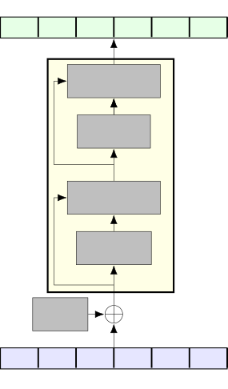
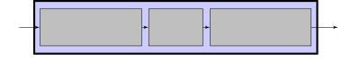
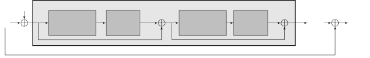

# Exploring Self-Attention Mechanisms for Speech Separation

Cem Subakan Affiliation: Université Laval Affiliation: Concordia
University Affiliation: Mila-Quebec AI Institute    Mirco Ravanelli
Affiliation: Concordia University Affiliation: Mila-Quebec AI Institute
   Samuele Cornell Affiliation: Università Politecnica delle Marche   
François Grondin Affiliation: Université de Sherbrooke.    Mirko Bronzi
Affiliation: Mila-Quebec AI Institute

###### Abstract

Transformers have enabled impressive improvements in deep learning. They
often outperform recurrent and convolutional models in many tasks while
taking advantage of parallel processing. Recently, we proposed the
SepFormer, which obtains state-of-the-art performance in speech
separation with the WSJ0-2/3 Mix datasets. This paper studies in-depth
Transformers for speech separation. In particular, we extend our
previous findings on the SepFormer by providing results on more
challenging noisy and noisy-reverberant datasets, such as LibriMix,
WHAM!, and WHAMR!. Moreover, we extend our model to perform speech
enhancement and provide experimental evidence on denoising and
dereverberation tasks. Finally, we investigate, for the first time in
speech separation, the use of efficient self-attention mechanisms such
as Linformers, Lonformers, and ReFormers. We found that they reduce
memory requirements significantly. For example, we show that the
Reformer-based attention outperforms the popular Conv-TasNet model on
the WSJ0-2Mix dataset while being faster at inference and comparable in
terms of memory consumption.

###### Index Terms: 

speech separation, source separation, transformer, attention, deep
learning.

## I Introduction

Transformers are playing a pivotal role in modern deep learning \[1\].
They contributed to a paradigm shift in sequence learning and made it
possible to achieve unprecedented performance in many Natural Language
Processing (NLP) tasks, such as language modeling \[2\], machine
translation \[3\], and various applications in computer vision \[4, 5\].
Transformers enable more accurate modeling of longer-term dependencies,
which makes them suitable for speech and audio processing as well. They
have indeed been recently adopted for speech recognition, speaker
verification, speech enhancement, and other tasks \[6, 7\].

Powerful sequence modeling is central to source separation as well,
where long-term modeling turned out to impact performance significantly
\[8, 9\]. However, speech separation typically involves long sequences
in the order of tens of thousands of frames, and using Transformers
poses a challenge because of the quadratic complexity of the standard
self-attention mechanism \[1\]. For a sequence of length $`N`$, it needs
to compare $`N^{2}`$ elements, leading to a computational bottleneck
that emerges more clearly when processing long signals. Mitigating the
memory bottleneck of Transformers has been the object of intense
research in the last years \[10, 11, 12, 13\]. A popular way to address
the problem consists of attending to a subset of elements only. For
instance, Sparse Transformer \[10\] employs local and dilated sliding
windows over a fixed number of elements to learn short and long-term
dependencies. LongFormer \[11\] augments the Sparse Transformer by
adding global attention heads. Linformers \[12\], approximate the full
sparse attention with low-rank matrix multiplication, while Reformers
\[13\] cluster the elements to attend through an efficient
locality-sensitive hashing function.

To address this issue in speech separation, we recently proposed the
SepFormer \[14\], a Transformer specifically designed for speech
separation that inherits the dual-path processing pipeline proposed
originally in \[8\] for recurrent neural networks (RNN). Dual-path
processing splits long sequences into chunks, thus naturally alleviating
the quadratic complexity issue. Moreover, it combines short-term and
long-term modeling by adding a cascade of two distinct stages, making it
particularly appealing for audio processing. Differently from its
predecessors, SepFormer employs a Masking Network composed of
Transformer encoder layers only. This property significantly improves
the parallelization and inference speed of the SepFormer compared to
previous RNN-based methods.

This paper extends our previous studies on Transformer-based
architectures for speech separation. In our previous work \[14\], for
instance, we focused on the standard WSJ0-2/3Mix benchmark datasets
only. Here, we propose additional experiments and insights on more
realistic and challenging datasets such as Libri2/3-Mix \[15\], which
includes long mixtures, WHAM! \[16\] and WHAMR! \[17\], which feature
noisy and noisy and reverberant conditions, respectively. Moreover, we
adapted the SepFormer to perform speech enhancement and provide
experimental evidence on VoiceBank-DEMAND, WHAM!, and WHAMR! datasets.
Another contribution of this paper is investigating different types of
self-attention mechanisms for speech separation. We explore, for the
first time in speech separation, three efficient self-attention
mechanisms \[8\], namely Longformer \[11\], Linformer \[12\], and
Reformer \[13\] attention, all found to yield comparable or even better
results than standard self-attention in natural language processing
(NLP) applications.

We found that Reformer and Longformer attention mechanisms exhibit a
favorable trade-off between performance and memory requirements. For
instance, the Reformer-based model turned out to be even more efficient
in terms of memory usage and inference speed than the popular
Conv-TasNet model while yielding significantly better performance than
the latter (16.7 dB versus 15.3 dB SI-SNR improvement). Despite the
impressive improvements in the memory footprint and inference time, we
found that the best performance, in speech separation, is still
achieved, by far, with the regular self-attention mechanism used in the
original SepFormer model, confirming the importance of full
self-attention mechanisms.

The training recipes for the main experiments are available in the
Speechbrain \[18\] toolkit. Moreover, the pretrained models for the
WSJ0-2/3Mix datasets, Libri2/3Mix datasets, WHAM!/WHAMR! datasets are
available on the SpeechBrain Huggingface page¹¹ 1
[https://huggingface.co/speechbrain](https://huggingface.co/speechbrain).

The contributions in this paper are summarized as follows,

- •
  We extend the experimental results obtained with SepFormer to include
  Libri2/3Mix, WHAM!, and WHAMR! datasets. We also include speech
  enhancement results obtained with SepFormer on Voicebank-DEMAND,
  WHAM!, and WHAMR! datasets.
- •
  We investigate using efficient self-attention mechanisms such as
  Longformer, Linformer, and Reformer attention mechanisms within
  SepFormer.

The paper is organized as follows. In Section III, we introduce the
building blocks of Transformers and also describe the three efficient
attention mechanisms (Longformer, Linformer, and Reformer) explored in
this work. In Section IV, we describe the SepFormer model in detail with
a focus on the dual-path processing pipeline employed by the model.
Finally, in Section VI, we present the results on speech separation,
speech enhancement, and experimental analysis of different types of
self-attention.

## II Related Works

### II-A Deep learning for source separation

Thanks to the advances in deep learning, tremendous progress has been
made in the source separation domain. Notable early works include Deep
Clustering \[19\], where a recurrent neural network is trained on an
affinity matrix in order to estimate embeddings for each source from the
magnitude spectra of the mixture. TasNet and Conv-TasNet \[20, 21\]
achieved impressive performance by introducing time-domain processing,
combined with utterance level and permutation-invariant training \[22\].

More recent works include Sudo rm -rf \[23\], which uses a U-Net type
architecture to reduce computational complexity, and Dual-Path Recurrent
Neural Network (DPRNN) \[8\]. The latter first introduced the extremely
effective dual-path processing framework adopted in this work. Other
works focused more on training strategies, such as \[24\], which
proposed to split the learning of the encoder-decoder pair and the
masking network into two steps in time domain separation. \[25\] reports
impressive performance with a modified DPRNN model using a technique to
determine the number of speakers. In \[26\] Wavesplit was proposed and
it further improved over \[25\] by leveraging speaker-id information.

### II-B Transformers for source separation

At the time of the writing, only a few papers exist on Transformers for
source separation. These works include DPTNet \[9\], which adopts an
architecture similar to DPRNN but adds a multi-head-attention layer plus
layer normalization in each block before the RNN part. SepFormer, on the
contrary, uses multiple Transformer encoder blocks without any RNN in
each dual-path processing block. Our results in Section VI indicate that
SepFormer outperforms DPTNet, and is faster and more parallelizable at
inference time due to the absence of recurrent operations.

In \[27\], the authors propose Transformers to deal with a
multi-microphone meeting-like scenario, where the amount of overlapping
speech is low and a powerful separation might not be needed. The
system’s main feature is adapting the number of transformer layers
according to the complexity of the input mixture. In \[28\], a
multi-scale transformer is proposed. As shown in Section VI, the
SepFormer outperforms this method. Other Transformer-based source
separation works include \[29\], which uses a similar architecture as
SepFormer but uses RNNs before the self-attention blocks (like DPTNet).
There also exists methods that leverage Transformers for continuous
speech separation, which aim to do source separation on long,
meeting-like audio recordings. Prominent examples include \[30, 31,
27\]. Moreover, there have been recent concurrent works exploring
efficient attention mechanisms for speech separation \[32, 33\]. We note
that, the architectures of the separation networks that we explore for
this purpose are different from these aforementioned works.

## III Transformers



Fig. 1: The encoder of a standard Transformer. Positional embeddings are
added to the input sequence. Then, N encoding layers based on multi-head
self-attention, normalization, feed-forward transformations, and
residual connections process it to generate an output sequence.

In this paper, we utilize the encoder part of the Transformer
architecture, which is depicted in Fig. 1. The encoder turns an input
sequence $`X=\{x_{1},\dots,x_{T}\}\in\mathbb{R}^{F\times T}`$ (where
$`F`$ denotes the number of features, and $`T`$ denotes the signal
length) into an output sequence
$`Y=\{y_{0},\dots,y_{T}\}\in\mathbb{R}^{F\times T}`$ using a pipeline of
computations that involve positional embedding, multi-head
self-attention, normalization, feed-forward layers, and residual
connections.

### III-A Multi-head self-attention

The multi-head self-attention mechanism allows the Transformer to model
dependencies across all the elements of the sequence. The first step
calculates the Query, Key, and Value matrices from the input sequence
$`X`$ of length $`T`$. This operation is performed by multiplying the
input vector by weight matrices: $`Q=W_{Q}X`$, $`K=W_{K}X`$,
$`V=W_{V}X`$, where
$`W_{Q},W_{K},W_{V}\in\mathbb{R}^{d_{\text{model}}\times F}`$. The
attention layer consists of the following operations:

```math
\text{Attention}(Q,K,V)=\text{SoftMax}\left(\frac{Q^{\top}K}{\sqrt{d_{k}}}\right)V^{\top}, \tag{1}
```

where $`d_{k}`$ represents the latent dimensionality of the $`Q`$ and
$`K`$ matrices. The attention weights are obtained from a scaled
dot-product between queries and keys: closer queries and key vectors
will have higher dot products. The softmax function ensures that the
attention weights range between 0 and 1. The attention mechanism
produces $`T`$ weights for each input element (i.e., $`T^{2}`$ attention
weights). All in all, the softmax part of the attention layer computes
relative importance weights, and then we multiply this attention map
with the input value sequence $`V`$. Multi-head attention consists of
several parallel attention layers. More in detail, it is computed as
follows:

```math
\displaystyle\text{MultiHeadAttention}(Q,K,V) \tag{2}
```

```math
\displaystyle=\text{Concat}(\text{Head}_{1},\dots,\text{Head}_{h})W^{O},
```

```math
\displaystyle\text{where Head}_{i}=\text{Attention}(Q_{i},K_{i},V_{i}),
```

where $`h`$ is the number of parallel attention heads and
$`W^{O}\in\mathbb{R}^{d_{\text{model}}\times hF}`$ is the matrix that
combines the parallel attention heads, and $`d_{\text{model}}`$ denotes
the latent dimensionality of this combined model.

### III-B Feed-Forward Layers

The feed-forward component of the Transformer architecture consists of a
two-layer perceptron. The exact definition of it is the following:

```math
\displaystyle\text{Feed-Forward}(x)=\text{ReLU}(xW_{1}+b_{1})W_{2}+b_{2}, \tag{3}
```

where $`x`$ is the input. In the context of sequences, this feed-forward
transformation is applied to each time point separately. $`W_{1}`$, and
$`W_{2}`$ are learnable matrices, and $`b_{1}`$, and $`b_{2}`$ are
learnable bias vectors.

### III-C Positional encoding

As the self-attention layer and feed-forward layers do not embed any
notion of order, the transformer uses a positional encoding scheme for
injecting sequence ordering information. The positional encoding is
defined as follows:

```math
\displaystyle PE_{t,2i}= \displaystyle\text{Sin}(t/10000^{2i/d_{\text{model}}}) \tag{4}
```

```math
\displaystyle PE_{t,2i+1}= \displaystyle\text{Cos}(t/10000^{2i/d_{\text{model}}}) \tag{5}
```

This encoding relies on sinusoids of different frequencies in each
latent dimension to encode positional information \[1\].

### III-D Reducing the memory bottleneck

Many alternative architectures have been proposed in the literature.
Popular variations for mitigating the quadratic memory issues are
described in the following.

#### III-D1 Longformer

Longformer \[11\] aims to reduce the quadratic complexity by replacing
the full self-attention structure with a combination of local and global
attention. Specifically, Longformer relies on local attention that
captures dependencies from nearby elements and global attention that
globally captures dependencies from all the elements. To keep the
computational requirements manageable, global attention is performed for
a few special elements in the sequence.

#### III-D2 Linformer

Linformer \[12\] avoids the quadratic complexity by reducing the size of
the time dimension of the matrices
$`K,V\in\mathbb{R}^{d_{\text{model}}\times T}`$. This is done by
projecting the time dimension $`T`$ to a smaller dimensionality $`k`$ by
using projection matrices $`P,F\in\mathbb{R}^{T\times k}`$. The
multi-head attention equation, therefore, becomes the following:

```math
\displaystyle\text{LFSelfAttention}\left(Q,K,V\right)=\text{SoftMax}\left(\frac{Q^{\top}(KP)}{\sqrt{d_{k}}}\right)(VF)^{\top}, \tag{6}
```

which effectively limits the complexity of the matrix product between
the softmax output and the $`V`$ matrix.

#### III-D3 Reformer

Reformer \[13\] uses locality-sensitive hashing (LSH) to reduce the
complexity of self-attention. LSH is used to find the vector pairs
$`(q,k),q\in Q,k\in K`$ that are closer. The intuition is that those
pairs will have a bigger dot product and contribute the most to the
attention matrix. Because of this, the authors limit the attention
computation to the close pairs $`(q,k)`$, while ignoring the others
(saving time and memory). In addition, the Reformer, inspired by \[34\],
implements reversible Transformer layers that avoid the linear memory
complexity scaling with respect to the number of layers. An example
usage of Reformer in speech is in Text-to-Speech \[35\].

## IV Separation Transformer (SepFormer)

The SepFormer relies on the masking-based source separation framework
popularized by \[20, 21\] (Figure 2). An input mixture
$`x\in\mathbb{R}^{T}`$ feeds the architecture. An encoder learns a
latent representation $`h\in\mathbb{R}^{F\times T^{\prime}}`$.
Afterwards, a masking network estimates the masks
$`m_{1},m_{2}\in\mathbb{R}^{F\times T^{\prime}}`$. The separated time
domain signals for source 1 and source 2 are obtained by passing the
$`h*m_{1}`$, and $`h*m_{2}`$ through the decoder, where $`*`$ denotes
element-wise multiplication. In the following, we explain in detail each
block separately.


Fig. 2: The high-level description of the masking-based source
separation pipeline: The encoder block learns a latent representation
for the input signal. The masking network estimates optimal masks to
separate the sources in the mixtures. The decoder finally reconstructs
the estimated sources in the time domain using these masks. The
self-attention-based modeling is applied inside the masking network.

### IV-A Encoder

The encoder takes the time-domain mixture-signal $`x\in\mathbb{R}^{T}`$
as input. It learns a time-frequency latent representation
$`h\in\mathbb{R}^{F\times T^{\prime}}`$ using a single convolutional
layer:

```math
\displaystyle h=\text{ReLU}(\text{Conv1d}(x)). \tag{7}
```

As we will describe in Section VI-A, the stride factor of this
convolution impacts significantly the performance, speed, and memory of
the model.

### IV-B Decoder

The decoder uses a simple transposed convolutional layer with the same
stride and kernel size as the encoder. Its input is the element-wise
multiplication between the mask of the $`k`$-th source $`m_{k}`$ and the
output of the encoder $`h`$. The transformation operated by the decoder
is the following:

```math
\displaystyle\widehat{s}_{k}=\text{Conv1dTranspose}(m_{k}\odot h), \tag{8}
```

where $`\widehat{s}_{k}\in\mathbb{R}^{T}`$ denotes the separated source
$`k`$, and $`\odot`$ denotes element-wise multiplication.

### IV-C Masking Network

Figure 3 (top) shows the detailed architecture of the masking network
(Masking Net). The masking network is fed by the encoded representations
$`h\in\mathbb{R}^{F\times T^{\prime}}`$ and estimates a mask
$`\{m_{1},\dots,m_{Ns}\}`$ for each of the $`Ns`$ speakers in the
mixture.

As in \[21\], the encoded input $`h`$ is normalized with layer
normalization \[36\] and processed by a linear layer (with
dimensionality $`F`$). Following the dual-path framework introduced in
\[8\], we create overlapping chunks of size $`C`$ by chopping up $`h`$
on the time axis with an overlap factor of 50%. We denote the output of
the chunking operation with
$`h^{\prime}\in\mathbb{R}^{F\times C\times Nc}`$, where $`C`$ is the
length of each chunk, and $`Nc`$ is the resulting number of chunks.

The representation $`h^{\prime}`$ feeds the SepFormer separator block,
which is the main component of the masking network. This block, which
will be described in detail in Section IV-D, employs a pipeline composed
of two Transformers able to learn short and long-term dependencies. We
pictorially describe the overall pipeline of the SepFormer separator
block in Figure 4. We would like to note that, for graphical
convenience, non-overlapping chunks were used in the figure. However, in
the experiments in this paper, we used 50% overlapping chunks.

The output of the SepFormer
$`h^{\prime\prime}\in\mathbb{R}^{F\times C\times Nc}`$ is processed by
PReLU activations followed by a linear layer. We denote the output of
this module by
$`h^{\prime\prime\prime}\in\mathbb{R}^{(F\times Ns)\times C\times Nc}`$,
where $`Ns`$ is the number of speakers. Afterward, we apply the
overlap-add scheme described in \[8\] and obtain
$`h^{\prime\prime\prime\prime}\in\mathbb{R}^{F\times Ns\times T^{\prime}}`$.
We pass this representation through two feed-forward layers and a ReLU
activation at the end to obtain a mask $`m_{k}`$ for each one of the
speakers.

### IV-D Dual-Path Processing Pipeline and SepFormer

The dual-path processing pipeline \[8\] (shown in Fig. 4) enables a
combination of short and long-term modeling while making long sequence
processing feasible with a self-attention block. In the context of the
masking-based end-to-end source separation shown in Fig. 2, the latent
representation $`h\in\mathbb{R}^{F\times T^{\prime}}`$ is divided into
overlapping chunks.

A Transformer encoder is applied to each chunk separately. We call this
block IntraTransformer (IntraT) and denote it with
$`f_{\text{intra}}(.)`$. This block effectively operates as a block
diagonal attention structure, modeling the interaction between all
elements in each chunk separately so that the attention memory
requirements are bounded. Another transformer encoder is applied to
model the inter-chunk interactions, i.e. between each chunk element. We
call this block InterTransformer (InterT) and denote with
$`f_{\text{inter}}(.)`$. Because this block attends to all elements that
occupy the same position in each chunk, it effectively operates as a
strided-attention structure. Mathematically, the overall transformation
can be summarized as follows:

```math
\displaystyle h^{\prime\prime}=f_{\text{inter}}(f_{\text{intra}}(h^{\prime})). \tag{9}
```

In the standard SepFormer model defined in \[14\], $`f_{\text{inter}}`$
and $`f_{\text{intra}}`$ are chosen to be full self-attention blocks. In
Section IV-E, we describe the full self-attention block employed in
SepFormer in detail.






Fig. 3: (Top) The overall architecture proposed for the masking network.
(Middle) The SepFormer Block. (Bottom) The transformer architecture
$`f(.)`$ that is used both in the IntraTransformer block and in the
InterTransformer block.


Fig. 4: The dual-path processing employed in the SepFormer masking
network. The input representation $`\bar{h}`$ is first of all chunked to
get the chunks $`\bar{h}_{0}`$, $`\bar{h}_{1}`$, $`\dots`$,
$`\bar{h}_{6}`$. Then the chunks are concatenated on another dimension
(chunk dimension). Afterward, we apply the IntraTransformer along the
time dimension of each chunk and the InterTransformer along the chunk
dimension. As mentioned in IV-C, for graphical convenience,
non-overlapping chunks are used in the figure. However, for the
experiments in this paper, we used chunks with 50% overlap. The
attention maps show how elements of the input feature vectors are
interconnected sequentially inside the Intra and Inter blocks.

### IV-E Full Self-Attention Transformer Encoder

The architecture for the full self-attention transformer encoder layers
follows the original Transformer architecture \[1\]. Figure 3 (Bottom)
shows the architecture used for the IntraTransformer and
InterTransformer blocks.

We use the variable $`z`$ to denote the input to the Transformer. First
of all, sinusoidal positional encoding $`e`$ is added to the input
$`z`$, such that,

```math
\displaystyle z^{\prime}=z+e. \tag{10}
```

We follow the positional encoding definition in \[1\]. We then apply
multiple Transformer layers. Inside each Transformer layer $`g(.)`$, we
first apply layer normalization, followed by multi-head attention (MHA):

```math
\displaystyle z^{\prime\prime}=\text{MultiHeadAttention}(\text{LayerNorm}(z^{\prime})). \tag{11}
```

As proposed in \[1\], each attention head computes the scaled
dot-product attention between all the sequence elements. The Transformer
finally employs a feed-forward network (FFW), which is applied to each
position independently:

```math
\displaystyle z^{\prime\prime\prime}=\text{Feed-Forward}(\text{LayerNorm}(z^{\prime\prime}+z^{\prime}))+z^{\prime\prime}+z^{\prime}. \tag{12}
```

The overall transformer block is therefore defined as follows:

```math
\displaystyle f(z)=g^{K}(z+e)+z, \tag{13}
```

where $`g^{K}(.)`$ denotes $`K`$ layers of transformer layer $`g(.)`$.
We use $`K=N_{\text{intra}}`$ layers for the IntraT, and
$`K=N_{\text{inter}}`$ layers for the InterT. As shown in Figure 3
(Bottom) and Eq. (13), we add residual connections across the
transformer layers and across the transformer architecture to improve
gradient backpropagation. We would like to note that, in the experiments
presented in this paper, a non-causal attention mechanism was utilized.

## V Experimental setup

### V-A Datasets

In our experiments, we use the popular WSJ0-2mix and WSJ0-3mix datasets
\[19\], where mixtures of two speakers and three speakers are created by
randomly mixing utterances in the WSJ0 corpus. The relative levels for
the sources are sampled uniformly between 0 dB to 5 dB. Respectively,
30, 10, and 5 hours of speech are used for training (20k utterances),
validation (5k utterances), and testing (3k utterances). The training
and test sets are created with different sets of speakers. We use the
8kHz version of the dataset, with the ‘min’ version where the added
waveforms are clipped to the shorter signal’s length. These datasets
have become the de-facto standard benchmark for source separation
algorithms.

In addition to the WSJ0-2/3 Mix we also provide experimental evidence on
WHAM! \[16\], and WHAMR! datasets \[17\] which are essentially derived
from the WSJ0-2Mix dataset by adding environmental noise and
environmental noise plus reverberation respectively. In WHAM! and WHAMR!
datasets the environmental noises contain ambient noise from coffee
shops, restaurants, and bars, which is collected by the authors of the
original paper \[16\]. In WHAMR! the reverberation time RT60 is randomly
uniformly sampled from three categories–low, medium, and high, which
respectively have the distributions $`\mathcal{U}(0.1,0.3)`$,
$`\mathcal{U}(0.2,0.4)`$, $`\mathcal{U}(0.4,1.0)`$. More details
regarding the $`RT_{60}`$ distribution of the WHAMR! dataset is given in
the original paper \[17\].

The popular speech enhancement VoiceBank-DEMAND dataset \[37\] is also
used to compare the SepFormer architecture with other state-of-the-art
denoising models. We also provide experimental results on the LibriMix
dataset \[15\], which contains longer and more challenging mixtures than
the WSJ0-Mix dataset.

### V-B Architecture Details

The SepFormer encoder employs 256 convolutional filters with a kernel
size of 16 samples and a stride factor of 8. The decoder uses the same
kernel size and the stride factors of the encoder.

In our best models, the masking network processes chunks of size
$`C=250`$ with a 50% overlap between them and employs 8 layers of
Transformer encoder in both IntraTransformer and InterTransformer. The
dual-path processing pipeline is repeated $`N=2`$ times. We used 8
parallel attention heads and 1024-dimensional positional feed-forward
networks within each Transformer layer. The model has a total of 25.7
million parameters.

### V-C Training Details

We use dynamic mixing (DM) data augmentation \[26\], which consists of
an on-the-fly creation of new mixtures from single speaker sources. In
this work, we expanded this powerful technique by applying speed
perturbation before mixing the sources. The speed randomly changes
between 95 % slow-down and 105 % speed-up.

We use the Adam algorithm \[38\] as an optimizer, with a learning rate
of $`1.5e^{-4}`$. After epoch 65 (after epoch 85 with DM), the learning
rate is annealed by halving it if we do not observe any improvement of
the validation performance for 3 successive epochs (5 epochs for DM).
Gradient clipping is employed to limit the $`l^{2}`$-norm of the
gradients to 5. During training, we used a batch size of 1, and used the
scale-invariant signal-to-noise ratio (SI-SNR) \[39\] via
utterance-level permutation invariant loss \[22\], with clipping at
30 dB \[26\]. The SI-SNR measures the energy of the signal over the
energy of the noise by using a zero mean signal estimate and the ground
truth signal. We also use SDR (Signal to Distortion Ratio) which
measures the energy of the signal over the energy of the noise,
artifacts, and interference, as defined in \[40\]. In our tables, we
report SI-SNRi, and SDRi values that denote the SI-SNR and SDR
improvement values from the baseline results obtained when SI-SNR and
SDR are computed with the mixture as the source estimate.

We use automatic mixed precision to speed up training. Each model is
trained for a maximum of 200 epochs. Each epoch takes approximately 1.5
hours on a single NVIDIA V100 GPU with 32 GB of memory with automatic
mixed precision. The training recipes for SepFormer on WSJ0-2/3Mix
datasets, Libri2/3Mix datasets, WHAM! and WHAMR! datasets can found in
Speechbrain²² 2
[https://github.com/speechbrain/speechbrain](https://github.com/speechbrain/speechbrain).

|                             |         |      |          |        |
| --------------------------- | ------- | ---- | -------- | ------ |
| Model                       | SI-SNRi | SDRi | \# Param | Stride |
| Tasnet \[20\]               | 10.8    | 11.1 | n.a.     | 20     |
| SignPredictionNet \[41\]    | 15.3    | 15.6 | 55.2M    | 8      |
| Conv-TasNet \[21\]          | 15.3    | 15.6 | 5.1M     | 10     |
| Two-Step CTN \[24\]         | 16.1    | n.a. | 8.6M     | 10     |
| MGST \[28\]                 | 17.0    | 17.3 | n.a.     | n.a.   |
| DeepCASA \[42\]             | 17.7    | 18.0 | 12.8M    | 1      |
| FurcaNeXt \[43\]            | n.a.    | 18.4 | 51.4M    | n.a.   |
| DualPathRNN \[8\]           | 18.8    | 19.0 | 2.6M     | 1      |
| sudo rm -rf \[23\]          | 18.9    | n.a. | 2.6M     | 10     |
| VSUNOS \[25\]               | 20.1    | 20.4 | 7.5M     | 2      |
| DPTNet\* \[9\]              | 20.2    | 20.6 | 2.6M     | 1      |
| DPTNet + DM\*\* \[9\]       | 20.6    | 20.8 | 26.2M    | 8      |
| DPRNN + DM\*\* \[8\]        | 21.8    | 22.0 | 27.5M    | 8      |
| SepFormer-CF + DM\*\*       | 21.9    | 22.1 | 38.5M    | 8      |
| Wavesplit\*\*\* \[26\]      | 21.0    | 21.2 | 29M      | 1      |
| Wavesplit\*\*\* + DM \[26\] | 22.2    | 22.3 | 29M      | 1      |
| SepFormer                   | 20.4    | 20.5 | 25.7M    | 8      |
| SepFormer + DM              | 22.3    | 22.4 | 25.7M    | 8      |

\*only SI-SNR and SDR (without improvement) are reported.

\*\*our experimentation

\*\*\*uses speaker-ids as additional info.

TABLE I: Best results on the WSJ0-2mix dataset (test-set). DM stands for
dynamic mixing.

| SI-SNRi | $`N`$ | $`N_{\text{intra}}`$                                          | $`N_{\text{inter}}`$                                                                                                     | \# Heads | DFF                                                                                                                         | PosEnc                                                                                                                    | DM                                                                                                                        |
| ------- | ----- | ------------------------------------------------------------- | ------------------------------------------------------------------------------------------------------------------------ | -------- | --------------------------------------------------------------------------------------------------------------------------- | ------------------------------------------------------------------------------------------------------------------------- | ------------------------------------------------------------------------------------------------------------------------- |
| 22.3    | 2     | 8                                                             | 8                                                                                                                        | 8        | 1024                                                                                                                        | Yes                                                                                                                       |  Yes                                                            |
| 20.5    | 2     | 8   | 8                                                                                                                        | 8        | 1024                                                              | Yes                                                                                                                       | No  |
| 19.9    | 2     | 4                                                             | 4  | 8        | 2048  | Yes                                                            | No                                                                                                                        |
| 19.4    | 2     | 4                                                             | 4                                                                                                                        | 8        | 2048                                                                                                                        | No  | No                                                                                                                        |
| 19.2    | 2     |  4 | 1                                                                                                                        | 8        | 2048                                                                                                                        | Yes                                                                                                                       | No                                                                                                                        |
| 18.3    | 2     | 1                                                             | 4  | 8        | 2048                                                                                                                        | Yes                                                                                                                       | No                                                                                                                        |
| 19.1    | 2     | 3                                                             | 3                                                                                                                        | 8        | 2048                                                                                                                        |  Yes                                                           | No                                                                                                                        |
| 19.0    | 2     | 3                                                             | 3                                                                                                                        | 8        | 2048                                                                                                                        | No  | No                                                                                                                        |

TABLE II: Ablation of the SepFormer on WSJ0-2Mix (validation set).

## VI Results

### VI-A Results on WSJ0-2/3 Mix datasets

WSJ0-2/3 Mix datasets are standard benchmarks in the source-separation
literature. In Table I, we compare the performance achieved by the
proposed SepFormer with the best results reported in the literature on
the WSJ0-2mix dataset. The SepFormer achieves an SI-SNR improvement
(SI-SNRi) of 22.3 dB and a Signal-to-Distortion Ratio \[40\] (SDRi)
improvement of 22.4 dB on the test-set with dynamic mixing. When using
dynamic mixing, the proposed architecture achieves state-of-the-art
performance. The SepFormer outperforms previous systems without dynamic
mixing, except for Wavesplit, which leverages speaker identity as
additional information.

In Table II, we also study the effect of various hyperparameters and
data augmentations strategies (the reported performance is computed on
the validation set). We observe that the number of InterT and IntraT
blocks has an important impact on the performance. The best performance
is reached with 8 layers for both blocks replicated two times. We also
would like to point out that a respectable performance of 19.2 dB is
obtained even when we use a single-layer transformer for the
InterTransformer. In contrast, when a single layer Transformer is used
for IntraTransformer the performance drops to 18.3 dB. This suggests
that the IntraTransformer, and thus local processing, has a greater
influence on the final performance. It also emerges that positional
encoding is helpful (e.g. see lines 3-4, and 7-8 of Table II). A similar
outcome has been observed in \[44\] for speech enhancement. As for the
number of attention heads, we observe a slight performance difference
between 8 and 16 heads. Finally, as expected, we observed that dynamic
mixing improves the performance.

To ascertain that SepFormer has better performance because of
architectural choices (and not just because it has more parameters or
dynamic mixing), we have compared the SepFormer with DPTNet, DPRNN, and
with a SepFormer that utilizes a Conformer \[7\] block in the
IntraTransformer. These three models are trained under the same
conditions (with dynamic mixing, and $`kernelsize=16`$,
$`kernelstride=8`$ as SepFormer). The results of this experiment in
terms of SI-SNR on the test are as follows (shown in Table I) 20.6 dB
for DPTNet (26.2M parameters), 21.8 dB for DPRNN (27.5M parameters), and
21.9 dB for SepFormer with Conformer block as intra block (38.5M
parameters) (SepFormer-CF in Table I). We, therefore, observe that the
better performance of SepFormer is due to the architectural differences,
and not just because it has more parameters or is trained with dynamic
mixing.

Table III showcases the best-performing models on the WSJ0-3mix dataset.
SepFormer obtains state-of-the-art performance with an SI-SNRi of
19.5 dB and an SDRi of 19.7 dB. We here used the best architecture found
for the WSJ0-2mix dataset in Table II. The only difference is that the
decoder has three outputs now. It is worth noting that the SepFormer
outperforms all previously proposed systems on this corpus.

Our results on WSJ0-2mix and WSJ0-3mix show that we can achieve
state-of-the-art performance in separation with an RNN-free
Transformer-based model. The major advantage of SepFormer over RNN-based
systems like \[8, 25, 9\] is the possibility to parallelize the
computations over different time steps. This feature leads to faster
training and inference, as described in the following section.

|                       |         |      |          |
| --------------------- | ------- | ---- | -------- |
| Model                 | SI-SNRi | SDRi | \# Param |
| Conv-TasNet \[21\]    | 12.7    | 13.1 | 5.1M     |
| DualPathRNN \[8\]     | 14.7    | n.a  | 2.6M     |
| VSUNOS \[25\]         | 16.9    | n.a  | 7.5M     |
| Wavesplit \[26\]      | 17.3    | 17.6 | 29M      |
| Wavesplit \[26\] + DM | 17.8    | 18.1 | 29M      |
| SepFormer             | 17.6    | 17.9 | 26M      |
| SepFormer + DM        | 19.5    | 19.7 | 26M      |

TABLE III: Best results on the WSJ0-3mix dataset.

### VI-B Speed and Memory Comparison

Fig. 5: (Left) The training curves of SepFormer, DPRNN, and DPTNeT on
the WSJ0-2mix dataset. (Middle & Right) The comparison of forward-pass
speed and memory usage in the GPU on inputs ranging 1-5 seconds long
sampled at 8kHz.

Fig. 6: Comparing the required Multiply Accumulate Operations (MACs) for
SepFormer, DPRNN, DPTNet and Wavesplit.

We now compare the training and inference speed of our model with DPRNN
\[8\] and DPTNet \[9\]. Figure 5 (left) shows the performance achieved
on the validation set in the first 48 hours of training versus the
wall-clock time (on the WSJ0-2mix dataset). For a fair comparison, we
used the same machine with the same GPU (a single NVIDIA V100-32GB) for
all the models. Moreover, all the systems are trained with a batch size
of 1 and employ automatic mixed precision. We observe that the SepFormer
is faster than DPRNN and DPTNeT. Figure 5 (left), highlights that
SepFormer reaches above 17 dB levels only after a full day of training,
whereas the DPRNN model requires two days of training to achieve the
same level of performance.

Figure 5 (middle&right) compares the average computation time (in ms)
and the total memory allocation (in GB) during inference when single
precision is used. We analyze the speed of our best model for both
WSJ0-2Mix and WSJ0-3Mix datasets. We compare our models against DP-RNN,
DPTNet, and Wavesplit. All the models run in the same NVIDIA
RTX8000-48GB GPU using the PyTorch profiler \[45\].

From this analysis, it emerges that the SepFormer is faster and less
memory-demanding than DPTNet, DPRNN, and Wavesplit. We observed the same
behavior using the CPU for inference. Such a level of computational
efficiency is achieved even though the proposed SepFormer employs more
parameters than the other RNN-based methods (see Table I). This is not
only due to the superior parallelization capabilities of the proposed
model, but also because the best performance is achieved with a stride
factor of 8 samples, against a stride of 1 for DPRNN and DPTNet.
Increasing the stride of the encoder results in downsampling the input
sequence, and therefore the model processes fewer data. In \[8\], the
authors showed that the DPRNN performance degrades significantly when
increasing the stride factor. The SepFormer, instead, reaches
competitive results even with a relatively large stride, leading to the
aforementioned speed and memory advantages. We also compare the required
Multiply-Accumulate Operations (MACs) for SepFormer, DPRNN, DPTNet, and
Wavesplit in Figure 6. We see that SepFormer, DPRNN, and DPTNet have
roughly the same MACs requirements. Despite that, due to the better
parallelizability of SepFormer, the inference time (forward-pass time)
is faster for SepFormer (and less memory demanding). We also observe
that Wavesplit has a significantly larger requirement in terms of MACs.
We could not obtain MACs for sequences longer than 4 seconds due to
out-of-memory errors for Wavesplit.

### VI-C Results on WHAM! and WHAMR! datasets

WHAM! \[16\] and WHAMR! \[17\] datasets are versions of the WSJ0-2Mix
dataset with noise and noise+reverberation, respectively. We use the
same model configuration as the WSJ0-2/3Mix dataset for WHAM! and
WHAMR!. For both datasets, we train the model so that it does source
separation and speech enhancement at the same time. With the WHAM!
dataset the model learns to denoise while also separating. With WHAMR!,
the model jointly learns to denoise and dereverberation in addition to
separating. In this case, we augment the mixtures by randomly choosing a
room-impulse response from the training set of the WHAMR! dataset.

In Tables IV, V, we provide results with SepFormer on the WHAM! and
WHAMR! datasets compared to the other methods in the literature. We
observe that on both WHAM! and WHAMR! datasets SepFormer outperforms the
previously proposed methods even without using DM, which further
improves the performance.

|                       |         |      |
| --------------------- | ------- | ---- |
| Model                 | SI-SNRi | SDRi |
| Conv-TasNet           | 12.7    | -    |
| Learnable fbank       | 12.9    | -    |
| MGST \[28\]           | 13.1    | -    |
| Wavesplit + DM \[26\] | 16.0    | 16.5 |
| SepFormer             | 14.7    | 15.1 |
| SepFormer + SpeedA.   | 16.3    | 16.7 |
| SepFormer + DM        | 16.4    | 16.7 |

TABLE IV: Best results on the WHAM dataset.

|                       |         |      |
| --------------------- | ------- | ---- |
| Model                 | SI-SNRi | SDRi |
| Conv-TasNet           | 8.3     | -    |
| BiLSTM Tasnet         | 9.2     | -    |
| Wavesplit + DM \[26\] | 13.2    | 12.2 |
| SepFormer             | 11.4    | 10.4 |
| SepFormer + SpeedA.   | 13.7    | 12.7 |
| SepFormer + DM        | 14.0    | 13.0 |

TABLE V: Best results on the WHAMR dataset.

### VI-D Results on Libri-2/3Mix datasets

LibriMix \[15\] is proposed as an alternative to WSJ0-2/3Mix with more
diverse and longer utterances. Table VI shows results achieved with the
Libri-2/3Mix datasets (both for cleaning any noisy versions). We use
here the same model configuration found on WSJ0-2mix in Table II.
Similar to the WHAM! dataset, for Libri-2/3 Mix datasets the network is
trained to separate and denoise at the same time. We train the models on
the train-360 set, both with and without dynamic mixing. In addition to
providing the performance of the models trained on LibriMix, we also
report the performance of the model pre-trained on the WSJ0-Mix dataset.
One common criticism of the WSJ0-Mix is that the models trained on it do
not generalize well to other tasks. Here, we showcase that SepFormer can
obtain respectable performance on Libri 2/3 Mix clean versions even when
trained on WSJ0-2/3Mix, surpassing the performance of a Conv-TasNet
model trained on LibriMix as shown in row SepFormer PT of Table VI. We
also report the performance obtained with a model pretrained on WHAM!
dataset.

When trained directly on Libri2/3-Mix with dynamic mixing, SepFormer
obtains the state-of-the-art performance as shown in row SepFormer + DM
of Table VI. We also show the case where we fine-tune a pretrained
SepFormer model on LibriMix in the row SepFormer + DM PT+FT of Table VI.

|                       |                 |      |                 |      |                 |      |                 |      |
| --------------------- | --------------- | ---- | --------------- | ---- | --------------- | ---- | --------------- | ---- |
|                       | Libri2Mix-Clean |      | Libri2Mix-Noisy |      | Libri3Mix-Clean |      | Libri3Mix-Noisy |      |
| Model                 | SI-SNRi         | SDRi | SI-SNRi         | SDRi | SI-SNRi         | SDRi | SI-SNRi         | SDRi |
| Conv-TasNet           | 14.7            | \-   | 12.0            | \-   | 10.4            | \-   | 10.4            | \-   |
| SepFormer PT          | 17.0            | 17.5 | 11.2            | 13.1 | 15.0            | 15.6 | n.a.            | n.a. |
| Wavesplit \[26\]      | 19.5            | 20.0 | 15.1            | 15.8 | 15.8            | 16.3 | 13.1            | 13.8 |
| Wavesplit + DM \[26\] | 20.5            | 20.0 | 15.2            | 15.9 | 17.5            | 18.0 | 13.4            | 14.1 |
| SepFormer             | 19.2            | 19.4 | 14.9            | 15.4 | 16.9            | 17.3 | 14.3            | 14.8 |
| SepFormer + DM        | 20.2            | 20.5 | 15.9            | 16.5 | 18.2            | 18.6 | 15.0            | 15.5 |
| SepFormer + DM PT+FT  | 20.6            | 20.8 | 15.9            | 16.5 | 19.0            | 19.4 | n.a.            | n.a. |

TABLE VI: Results on Libri2Mix and Libri3Mix datasets. SepFormer + PT
indicates pretraining on WSJ0-2/3 Mix or WHAM! dataset according to the
case. SepFormer + DM PT+FT is the case where the pretrained SepFormer
model is fine-tuned on LibriMix.

Fig. 7: Comparison of memory usage and forward-pass time on the
SepFormer architecture with several different self-attention types.

### VI-E Ablations on the type of Self-Attention

|                         | C=250v1 |       | C=250v2 |       | C=1000  |       | No Chunking |       |
| ----------------------- | ------- | ----- | ------- | ----- | ------- | ----- | ----------- | ----- |
| Model                   | SI-SNRi | SDRi  | SI-SNRi | SDRi  | SI-SNRi | SDRi  | SI-SNRi     | SDRi  |
| Longformer              | 19.44   | 19.66 | 19.32   | 19.54 | 18.17   | 18.39 | 13.11       | 13.36 |
| Linformer               | 2.75    | 3.01  | 6.04    | 6.30  | 4.74    | 5.02  | 6.39        | 6.68  |
| Reformer                | 20.09   | 20.28 | 20.34   | 20.52 | 19.42   | 19.61 | 16.66       | 16.86 |
| Transformer (SepFormer) | 21.61   | 21.79 | 21.61   | 21.79 | 21.48   | 21.66 | 12.40       | 12.60 |

TABLE VII: Comparison of different types of self-attention (WSJ0-2Mix,
test set).

Table VII compares the WSJ0-2Mix test set performance of four different
architectural choices for Full (regular), LongFormer, Linformer, and
Reformer self-attention. We train all models using only speed augment
(no dynamic mixing), using 4-second long training segments. The
architectural choices in this ablation experiment given in Table VII are
summarized as follows:

- •
  (second column, C=250v1) in the IntraTransformer and InterTransformer
  blocks, we use the attention indicated in the first column. The chunk
  size for the IntraTransformer is set to $`C=250`$.
- •
  (third column, C=250v2) in the IntraTransformer we use the
  self-attention mechanism indicated in the first column, and in the
  InterTransformer we use the full attention mechanism. The chunk size
  for the IntraTransformer is set to $`C=250`$.
- •
  (fourth column, C=1000) in the IntraTransformer we use the
  self-attention mechanism indicated in the first column, and in the
  InterTransformer we use the full attention mechanism. The chunk size
  for the IntraTransformer is set to $`C=1000`$.
- •
  (fifth column, No Chunking) we do not apply chunking, and therefore
  only the IntraTransformer block is applied.

We observe from Table VII that the architectural choices adopted in the
original SepFormer paper lead to the best overall performance in terms
of SI-SNR and SDR improvement. We also show the memory usage and forward
pass time (in CPU using Pytorch profiler \[45\]) for some of the
relevant models in Figure 7. The chunking/dual-path mechanism in the
SepFormer architecture reduces the memory footprint significantly
compared to the architecture where no chunking is applied. From Figure
7, we also see that using the Longformer or Reformer blocks on the whole
sequence without applying chunking is an efficient alternative to
dual-path processing. Furthermore from Figure 7, we observe that
compared to Conv-TasNet, Reformer without chunking results in almost
equivalent memory usage, and faster forward pass time, while yielding
slightly better performance, namely 16.7 dB SI-SNRi on the test set of
WSJ0-2Mix, compared to 15.3 dB SI-SNRi obtained with Conv-TasNet \[21\].

We also observe that full attention is more efficient than using a
reformer inside the dual-path pipeline in terms of forwarding pass time
and memory usage, and full attention is not significantly more expensive
than Longformer in terms of memory. Another observation is the fact that
Linformer does not yield competitive performance. We suspect that this
stems from the fact that Linformer has a reduced modeling capacity since
it projects the time dimension inside the attention mechanism to a lower
dimensionality, thereby losing time resolution, which is essential for
effective source separation.

To showcase the reduction of computational requirements when using
efficient self-attention mechanisms (namely Longformer and Reformer), we
report the total MACs (Multiply-Accumulate Operations) for a 4-seconds
input sequence in Figure 8. We notice a significant reduction in the
required MACs for Longformer and Reformer compared to the full-attention
case. In the case where no-chunking is applied, from Table VII we also
observe that the performance is significantly better with Reformer
compared to the full-attention case. However, another important
conclusion to make from this ablation study is that even though the
Longformer and Reformer provide a reduction in computational
requirements the best performance is obtained in the SepFormer
architecture (that is the case where we use full-self attention in Intra
and Inter transformer blocks).

### VI-F Speech Enhancement

We trained the SepFormer for speech enhancement on the WHAM! and WHAMR!
datasets for noisy and noisy-reverberant mixtures with one speaker. The
obtained enhancement performances in terms of SI-SNR, SDR, and PESQ
\[46\] are presented in Table VIII, and Table IX respectively. Note that
in WHAM! dataset the model is trained to denoise and on the WHAMR!
dataset the model is trained to both dereverberation and denoising at
the same time. The SepFormer models are trained to maximize the output
SI-SNR between the estimated and the ground truth signals in the time
domain.

In addition to training SepFormer, we also trained a Bidirectional LSTM,
CNNTransformer, and 2D-CNN models from Speechbrain \[18\], which are
trained to minimize the Euclidean distance of the estimated magnitude
spectrogram and the spectrogram of the clean signals. We observe that
SepFormer outperforms these methods by a large margin in terms of
SI-SNR, SDR, and PESQ.

Other than WHAM! and WHAMR! datasets, we have also trained a SepFormer
on the Voicebank-DEMAND speech enhancement dataset for denoising. In
this case, the SepFormer estimates a mask applied on the magnitude of
Short-time Fourier Transform (STFT) representation. This allows a direct
comparison with most state-of-the-art VoiceBank-DEMAND models, which
also employ a mask on magnitude spectra, and compare directly the
architectures. The results are given in Table X. We observe that
SepFormer outperforms most of the recent methods, except for the
MetricGAN+ \[47\], and AIAT \[48\]. Note that MetricGAN+ is optimized
specifically on PESQ and, therefore, the performance in terms of the
STOI metric is not reported. We note that SepFormer obtains the same
performance as AIAT (Magnitude version) in terms of the STOI metric
\[49\]. These speech enhancement experiments, therefore, demonstrate
that SepFormer is competitive also with respect to state-of-the-art
denoising models.

Fig. 8: Multiply-Accumulate Operations for $`C=250v1`$, $`C=1000`$, and
no chunking, obtained on a 4 seconds input signal. Reformer and
Longformer provide significant reduction in MACs for the no-chunking
option.

| Model          | SI-SNR | SDR   | PESQ |
| -------------- | ------ | ----- | ---- |
| 2D-CNN         | 7.90   | 8.70  | 2.36 |
| 2D-CNN+BLSTM   | 7.09   | 7.89  | 2.32 |
| BLSTM          | 5.15   | 6.2   | 2.11 |
| CNNTransformer | 8.3    | 8.9   | 2.52 |
| SepFormer      | 14.35  | 15.04 | 3.07 |

TABLE VIII: Speech enhancement results on WHAM! dataset (denoising)

| Model          | SI-SNR | SDR   | PESQ |
| -------------- | ------ | ----- | ---- |
| 2D-CNN         | 6.84   | 7.75  | 2.18 |
| 2D-CNN+BLSTM   | 5.87   | 6.82  | 2.15 |
| BLSTM          | 5.58   | 6.49  | 2.11 |
| CNNTransformer | 7.38   | 8.21  | 2.27 |
| SepFormer      | 10.58  | 12.29 | 2.84 |

TABLE IX: Speech enhancement results on WHAMR! dataset (Denoising +
Dereverberation)

| Model                   | PESQ | STOI |
| ----------------------- | ---- | ---- |
| CNNTransformer \[18\]   | 2.65 | 91.5 |
| MetricGAN \[50\]        | 2.86 | -    |
| CRGAN \[51\]            | 2.92 | 94.0 |
| DeepMMSE \[52\]         | 2.95 | -    |
| YinPHASEN \[53\]        | 2.99 | -    |
| MetricGAN+ \[47\]       | 3.15 | -    |
| AIAT (Magnitude) \[48\] | 3.11 | 94.9 |
| SepFormer               | 3.03 | 94.9 |

TABLE X: Speech enhancement results on the Voicebank-Demand dataset
(Denoising)

## VII Conclusion

In this paper, we studied in-depth Transformers for speech separation.
In particular, we built upon our previously proposed SepFormer, an
attention-only masking network based on dual-path processing. We
extended our previous findings by performing additional experiments on
more challenging and realistic datasets, such as LibriMix, WHAM!,
WHAMR!. With all these datasets, the SepFormer achieves competitive or
state-of-the-art performance. We also analyzed the computational
resources needed by popular separation models, and we showed that the
SepFormer excels in terms of memory usage and forward-pass time given
the state-of-the-art performance. As another contribution, we compared
more efficient self-attention mechanisms such as Longformer, Linformer,
and Reformer. Our results suggest that Longformer and especially
Reformer are suitable for speech separation applications and obtain a
highly favorable trade-off between performance and computational
requirements. Finally, we adapted the SepFormer to perform speech
enhancement and showed competitive performance in this context as well.

## References

- \[1\] A. Vaswani, N. Shazeer, N. Parmar, J. Uszkoreit, L. Jones, A. N.
  Gomez, L. Kaiser, and I. Polosukhin, “Attention is All You Need,” in
  _Proceedings of the 31st International Conference on Neural
  Information Processing Systems_, 2017.
- \[2\] J. Devlin, M.-W. Chang, K. Lee, and K. Toutanova, “BERT:
  Pre-training of Deep Bidirectional Transformers for Language
  Understanding,” in _Proceedings of the 2019 Conference of the North
  American Chapter of the Association for Computational Linguistics:
  Human Language Technologies, Volume 1 (Long and Short Papers)_,
  Jun. 2019.
- \[3\] Y. Liu, J. Gu, N. Goyal, X. Li, S. Edunov, M. Ghazvininejad,
  M. Lewis, and L. Zettlemoyer, “Multilingual Denoising Pre-training for
  Neural Machine Translation,” _Transactions of the Association for
  Computational Linguistics_, pp. 726–742, 2020.
- \[4\] A. Kolesnikov, A. Dosovitskiy, D. Weissenborn, G. Heigold,
  J. Uszkoreit, L. Beyer, M. Minderer, M. Dehghani, N. Houlsby,
  S. Gelly, T. Unterthiner, and X. Zhai, “An Image is Worth 16x16 Words:
  Transformers for Image Recognition at Scale,” 2021.
- \[5\] C. Gong, D. Wang, M. Li, V. Chandra, and Q. Liu, “Vision
  Transformers with Patch Diversification,” 2021.
- \[6\] L. Dong, S. Xu, and B. Xu, “Speech-Transformer: A No-Recurrence
  Sequence-to-Sequence Model for Speech Recognition,” in _IEEE
  International Conference on Acoustics, Speech and Signal Processing
  (ICASSP)_, 2018, pp. 5884–5888.
- \[7\] A. Gulati, J. Qin, C.-C. Chiu, N. Parmar, Y. Zhang, J. Yu,
  W. Han, S. Wang, Z. Zhang, Y. Wu, and R. Pang, “Conformer:
  Convolution-augmented Transformer for Speech Recognition,” in _Proc.
  of Interspeech_, 2020, pp. 5036–5040.
- \[8\] Y. Luo, Z. Chen, and T. Yoshioka, “Dual-path rnn: efficient long
  sequence modeling for time-domain single-channel speech separation,”
  in _IEEE International Conference on Acoustics, Speech and Signal
  Processing (ICASSP)_, 2020, pp. 46–50.
- \[9\] J. Chen, Q. Mao, and D. Liu, “Dual-Path Transformer Network:
  Direct Context-Aware Modeling for End-to-End Monaural Speech
  Separation,” in _Proc. of Interspeech_, 2020, pp. 2642–2646.
- \[10\] R. Child, S. Gray, A. Radford, and I. Sutskever, “Generating
  Long Sequences with Sparse Transformers,” 2019.
- \[11\] I. Beltagy, M. E. Peters, and A. Cohan, “Longformer: The
  long-document transformer,” 2020.
- \[12\] S. Wang, B. Z. Li, M. Khabsa, H. Fang, and H. Ma, “Linformer:
  Self-attention with linear complexity,” 2020.
- \[13\] N. Kitaev, Łukasz Kaiser, and A. Levskaya, “Reformer: The
  efficient transformer,” in _International Conference of Learning
  Representations (ICLR)_, 2020.
- \[14\] C. Subakan, M. Ravanelli, S. Cornell, M. Bronzi, and J. Zhong,
  “Attention is All You Need in Speech Separation,” in _IEEE
  International Conference on Acoustics, Speech and Signal Processing
  (ICASSP)_, 2021, pp. 21–25.
- \[15\] J. Cosentino, M. Pariente, S. Cornell, A. Deleforge, and
  E. Vincent, “LibriMix: An Open-Source Dataset for Generalizable Speech
  Separation,” 2020.
- \[16\] G. Wichern, J. Antognini, M. Flynn, L. R. Zhu, E. McQuinn,
  D. Crow, E. Manilow, and J. Le Roux, “WHAM!: Extending Speech
  Separation to Noisy Environments,” in _Proc. of Interspeech_, 2019.
- \[17\] M. Maciejewski, G. Wichern, and J. Le Roux, “WHAMR!: Noisy and
  Reverberant Single-Channel Speech Separation,” in _IEEE International
  Conference on Acoustics, Speech and Signal Processing (ICASSP)_, 2020.
- \[18\] M. Ravanelli, T. Parcollet, P. Plantinga, A. Rouhe, S. Cornell,
  L. Lugosch, C. Subakan, N. Dawalatabad, A. Heba, J. Zhong, J. Chou,
  S. Yeh, S.-W. Fu, C.-F. Liao, E. Rastorgueva, F. Grondin, W. Aris,
  H. Na, Y. Gao, R. D. Mori, and Y. Bengio, “SpeechBrain: A
  General-Purpose Speech Toolkit,” 2021, arXiv:2106.04624.
- \[19\] J. Hershey, Z. Chen, J. Le Roux, and S. Watanabe, “Deep
  clustering: Discriminative embeddings for segmentation and
  separation,” in _IEEE International Conference on Acoustics, Speech
  and Signal Processing (ICASSP)_, 2016, pp. 31–35.
- \[20\] Y. Luo and N. Mesgarani, “TaSNet: Time-Domain Audio Separation
  Network for Real-Time, Single-Channel Speech Separation,” in _IEEE
  International Conference on Acoustics, Speech and Signal Processing
  (ICASSP)_, 2018, pp. 696–700.
- \[21\] Y. Luo and M. N., “Conv-TasNet: Surpassing Ideal Time–Frequency
  Magnitude Masking for Speech Separation,” _IEEE/ACM Transactions on
  Audio, Speech, and Language Processing_, vol. 27, no. 8, pp.
  1256–1266, 2019.
- \[22\] M. Kolbæk, D. Yu, Z.-H. Tan, and J. Jensen, “Multitalker speech
  separation with utterance-level permutation invariant training of deep
  recurrent neural networks,” _IEEE/ACM Transactions on Audio, Speech,
  and Language Processing_, vol. 25, no. 10, pp. 1901–1913, 2017.
- \[23\] E. Tzinis, Z. Wang, and P. Smaragdis, “Sudo rm -rf: Efficient
  Networks for Universal Audio Source Separation,” in _2020 IEEE 30th
  International Workshop on Machine Learning for Signal Processing
  (MLSP)_, 2020, pp. 1–6.
- \[24\] E. Tzinis, S. Venkataramani, Z. Wang, C. Subakan, and
  P. Smaragdis, “Two-step Sound Source Separation: Training on Learned
  Latent Targets,” in _IEEE International Conference on Acoustics,
  Speech and Signal Processing (ICASSP)_, 2020, pp. 31–35.
- \[25\] E. Nachmani, Y. Adi, and L. Wolf, “Voice Separation with an
  Unknown Number of Multiple Speakers,” in _Proceedings of the 37th
  International Conference on Machine Learning_, ser. Proceedings of
  Machine Learning Research, vol. 119. PMLR, 13–18 Jul 2020, pp.
  7164–7175.
- \[26\] N. Zeghidour and D. Grangier, “Wavesplit: End-to-end speech
  separation by speaker clustering,” _arXiv preprint
  arXiv:2002.08933_, 2020.
- \[27\] S. Chen, Y. Wu, Z. Chen, T. Yoshioka, S. Liu, J. Li, and X. Yu,
  “Don’t Shoot Butterfly with Rifles: Multi-Channel Continuous Speech
  Separation with Early Exit Transformer,” in _2021 IEEE International
  Conference on Acoustics, Speech and Signal Processing (ICASSP)_, 2021,
  pp. 6139–6143.
- \[28\] Y. Zhao, C. Luo, Z.-J. Zha, and W. Zeng, “Multi-Scale Group
  Transformer for Long Sequence Modeling in Speech Separation,” in
  _Proceedings of the Twenty-Ninth International Joint Conference on
  Artificial Intelligence, IJCAI-20_. International Joint Conferences on
  Artificial Intelligence Organization, 2020, pp. 3251–3257.
- \[29\] Z. Zhang, B. He, and Z. Zhang, “TransMask: A Compact and Fast
  Speech Separation Model Based on Transformer,” in _IEEE International
  Conference on Acoustics, Speech and Signal Processing (ICASSP)_, 2021,
  pp. 5764–5768.
- \[30\] S. Chen, Y. Wu, Z. Chen, J. Wu, J. Li, T. Yoshioka, C. Wang,
  S. Liu, and M. Zhou, “Continuous Speech Separation with Conformer,” in
  _IEEE International Conference on Acoustics, Speech and Signal
  Processing (ICASSP)_, 2021, pp. 5749–5753.
- \[31\] Z. Chen, T. Yoshioka, L. Lu, T. Zhou, Z. Meng, Y. Luo, J. Wu,
  X. Xiao, and J. Li, “Continuous Speech Separation: Dataset and
  Analysis,” in _IEEE International Conference on Acoustics, Speech and
  Signal Processing (ICASSP)_, 2020, pp. 7284–7288.
- \[32\] Y. Koizumi, S. Karita, S. Wisdom, H. Erdogan, J. R. Hershey,
  L. Jones, and M. Bacchiani, “DF-Conformer: Integrated Architecture of
  Conv-Tasnet and Conformer Using Linear Complexity Self-Attention for
  Speech Enhancement,” 2021, pp. 161–165.
- \[33\] J. Luo, J. Wang, N. Cheng, E. Xiao, X. Zhang, and J. Xiao,
  “Tiny-Sepformer: A Tiny Time-Domain Transformer Network For Speech
  Separation,” in _Proc. Interspeech 2022_, 2022, pp. 5313–5317.
- \[34\] A. N. Gomez, M. Ren, R. Urtasun, and R. B. Grosse, “The
  Reversible Residual Network: Backpropagation Without Storing
  Activations,” in _Advances in Neural Information Processing Systems_,
  vol. 30. Curran Associates, Inc., 2017.
- \[35\] H. Ihm, J. Lee, B. J. Choi, S. Cheon, and N. Kim,
  “Reformer-TTS: Neural Speech Synthesis with Reformer Network,” in
  _Proc. of Interspeech_, 2020, pp. 2012–2016.
- \[36\] L. J. Ba, J. R. Kiros, and G. E. Hinton, “Layer Normalization,”
  _CoRR_, vol. abs/1607.06450, 2016. \[Online\]. Available:
  [http://arxiv.org/abs/1607.06450](http://arxiv.org/abs/1607.06450)
- \[37\] C. Valentini Botinhao, X. Wang, S. Takaki, and J. Yamagishi,
  “Investigating RNN-based speech enhancement methods for noise-robust
  Text-to-Speech,” in _Proceedings of 9th ISCA Speech Synthesis
  Workshop_, 2016, pp. 159–165.
- \[38\] D. P. Kingma and J. Ba, “Adam: A Method for Stochastic
  Optimization,” _arXiv preprint arXiv:1412.6980_, 2014.
- \[39\] J. Le Roux, S. Wisdom, H. Erdogan, and J. R. Hershey,
  “SDR–half-baked or well done?” in _IEEE International Conference on
  Acoustics, Speech and Signal Processing (ICASSP)_, 2019, pp. 626–630.
- \[40\] E. Vincent, R. Gribonval, and C. Févotte, “Performance
  measurement in blind audio source separation,” _IEEE transactions on
  audio, speech, and language processing (ICASSP)_, vol. 14, no. 4, pp.
  1462–1469, 2006.
- \[41\] Z.-Q. Wang, K. Tan, and D. Wang, “Deep learning based phase
  reconstruction for speaker separation: A trigonometric perspective,”
  in _IEEE International Conference on Acoustics, Speech and Signal
  Processing (ICASSP)_, 2019, pp. 71–75.
- \[42\] Y. Liu and D. Wang, “Divide and Conquer: A Deep CASA Approach
  to Talker-Independent Monaural Speaker Separation,” _IEEE/ACM
  Transactions on audio, speech, and language processing_, vol. 27,
  no. 12, 2019.
- \[43\] Z. Shi, H. Lin, L. Liu, R. Liu, J. Han, and A. Shi, “FurcaNeXt:
  End-to-End Monaural Speech Separation with Dynamic Gated Dilated
  Temporal Convolutional Networks,” in _MultiMedia Modeling_, 2020, pp.
  653–665.
- \[44\] J. Kim, M. El-Khamy, and J. Lee, “T-GSA: Transformer with
  Gaussian-Weighted Self-Attention for Speech Enhancement,” in _IEEE
  International Conference on Acoustics, Speech and Signal Processing
  (ICASSP)_, 2020, pp. 6649–6653.
- \[45\] Pytorch, “Profiler,”
  [https://pytorch.org/tutorials/recipes/recipes/profiler.html](https://pytorch.org/tutorials/recipes/recipes/profiler.html),
  2020, accessed: 2020-10-21.
- \[46\] A. Rix, J. Beerends, M. Hollier, and A. Hekstra, “Perceptual
  evaluation of speech quality (PESQ)-a new method for speech quality
  assessment of telephone networks and codecs,” in _IEEE International
  Conference on Acoustics, Speech and Signal Processing (ICASSP)_, 2001,
  pp. 749–752 vol.2.
- \[47\] S.-W. Fu, C. Yu, T.-A. Hsieh, P. Plantinga, M. Ravanelli,
  X. Lu, and Y. Tsao, “MetricGAN+: An Improved Version of MetricGAN for
  Speech Enhancement,” in _Proc. of Interspeech_, 2021, pp. 201–205.
- \[48\] G. Yu, A. Li, C. Zheng, Y. Guo, Y. Wang, and H. Wang,
  “Dual-Branch Attention-In-Attention Transformer for Single-Channel
  Speech Enhancement,” in _IEEE International Conference on Acoustics,
  Speech and Signal Processing (ICASSP)_, 2022, pp. 7847–7851.
- \[49\] C. H. Taal, R. C. Hendriks, R. Heusdens, and J. Jensen, “A
  short-time objective intelligibility measure for time-frequency
  weighted noisy speech,” in _2010 IEEE International Conference on
  Acoustics, Speech and Signal Processing_, 2010, pp. 4214–4217.
- \[50\] S.-W. Fu, C.-F. Liao, Y. Tsao, and S.-D. Lin, “MetricGAN:
  Generative Adversarial Networks based Black-box Metric Scores
  Optimization for Speech Enhancement,” in _International Conference on
  Machine Learning (ICML)_, 2019.
- \[51\] Z. Zhang, C. Deng, Y. Shen, D. S. Williamson, Y. Sha, Y. Zhang,
  H. Song, and X. Li, “On Loss Functions and Recurrency Training for
  GAN-Based Speech Enhancement Systems,” in _Proc. of Interspeech_,
  2020, pp. 3266–3270.
- \[52\] Y. Hu, Y. Liu, S. Lv, M. Xing, S. Zhang, Y. Fu, J. Wu,
  B. Zhang, and L. Xie, “DCCRN: Deep Complex Convolution Recurrent
  Network for Phase-Aware Speech Enhancement,” in _Proc. of
  Interspeech_, 2020, pp. 2472–2476.
- \[53\] D. Yin, C. Luo, Z. Xiong, and W. Zeng, “PHASEN: A
  Phase-and-Harmonics-Aware Speech Enhancement Network,” _Proceedings of
  the AAAI Conference on Artificial Intelligence_, vol. 34, no. 05, pp.
  9458–9465, Apr. 2020. \[Online\]. Available:
  [https://ojs.aaai.org/index.php/AAAI/article/view/6489](https://ojs.aaai.org/index.php/AAAI/article/view/6489)

![[Uncaptioned
image]](arxiv-2202-02884v2--9af2f058f75b.figures/figure-3.webp)

Cem Subakan is an Assistant Professor at Université Laval in the
Computer Science and Software Engineering department. He is also
currently an Affiliate Assistant Professor in the Concordia University
Computer Science and Software Engineering Department, and an invited
researcher at Mila-Québec AI Institue. He received his PhD in Computer
Science from University of Illinois at Urbana-Champaign (UIUC), and did
a postdoc in Mila Québec AI Institute and Université de Sherbrooke. He
serves as reviewer in several conferences including NeurIPS, ICML, ICLR,
ICASSP, MLSP and journals such as IEEE Signal Processing Letters (SPL),
IEEE Transactions on Audio, Speech, and Language Processing (TASL). His
research interests include Deep learning for Source Separation and
Speech Enhancement under realistic conditions, Neural Network
Interpretability, and Latent Variable Modeling. He is a recipient of
best paper award in the 2017 version IEEE Machine Learning for Signal
Processing Conference (MLSP), as well as the Sabura Muroga Fellowship
from the UIUC CS department. He’s a core contributor to the SpeechBrain
project, leading the speech separation part.

![[Uncaptioned
image]](arxiv-2202-02884v2--9af2f058f75b.figures/figure-4.webp)

Mirco Ravanelli is an assistant professor at Concordia University, an
adjunct professor at Université de Montréal, and Mila associate member.
His main research interests are deep learning and Conversational AI. He
is the author or co-author of more than 60 papers on these research
topics. He received his Ph.D. (with cum laude distinction) from the
University of Trento in December 2017. Mirco is an active member of the
speech and machine learning communities. He is the founder and leader of
the SpeechBrain project which aim to build an open-source toolkit for
conversational AI and speech processing.

![[Uncaptioned
image]](arxiv-2202-02884v2--9af2f058f75b.figures/figure-5.webp)

Samuele Cornell received a Master degree in Electronic Engineering at
Università Politecnica delle Marche (UnivPM) in 2019. He is currently a
doctoral candidate at UnivPM Department of Information Engineering. His
current research interests are in the area of front-end pre-processing
techniques for Automatic Speech Recognition applications such as: Source
Separation, Speech Enhancement, Speech Segmentation and Beamforming.

![[Uncaptioned
image]](arxiv-2202-02884v2--9af2f058f75b.figures/figure-6.webp)

François Grondin received the B.Sc. degree in electrical engineering
from McGill University, Montreal, QC, Canada, in 2009, and the M.Sc. and
Ph.D. degrees in electrical engineering from the Université de
Sherbrooke, Sherbrooke, QC, Canada, in 2011 and 2017, respectively.
After completing postdoctoral work with the Computer Science and
Artificial Intelligence Laboratory, Massachusetts Institute of
Technology, Cambridge, MA, USA, in 2019, he became a Faculty Member with
the Department of Electrical Engineering and Computer Engineering,
Université de Sherbrooke. He is a member of the Ordre des ingénieurs du
Québec. His research interests include robot audition, sound source
localization, speech enhancement, sound classification, and machine
learning.

![[Uncaptioned
image]](arxiv-2202-02884v2--9af2f058f75b.figures/figure-7.webp)

Mirko Bronzi is an Senior Applied Research Scientist at Mila-Québec AI
Institute. He completed his Ph.D. in Rome (University of Roma Tre)
working on techniques for extracting and integrating information from
different web sources, in an automatic way. During his career he worked
on NLU systems for virtual assistants for cars, on CLU (clinical
language understanding), as well as in other domains of machine
learning. His research interests are in the NLP area and in the audio
domain for machine learning. He is also interested in computer vision,
and in the intersection of Engineering and machine learning.
