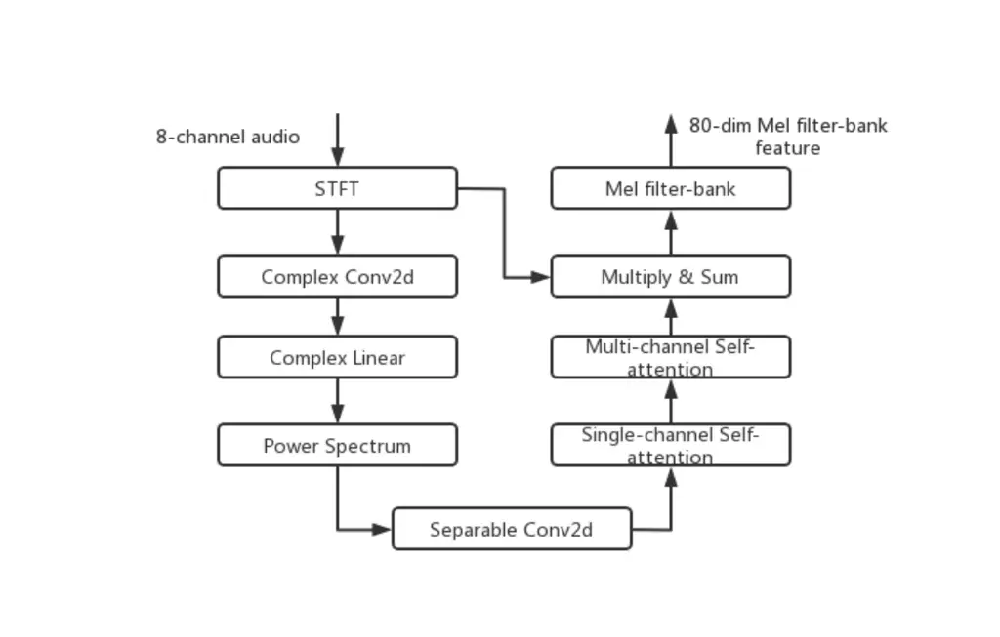

# THE VOLCSPEECH SYSTEM FOR THE ICASSP 2022 MULTI-CHANNEL MULTI-PARTY MEETING TRANSCRIPTION CHALLENGE

Chen Shen, Yi Liu, Wenzhi Fan, Bin Wang, Shixue Wen, Yao Tian, Jun
Zhang, Jingsheng Yang, Zejun Ma

###### Abstract

This paper describes our submission to ICASSP 2022 Multi-channel
Multi-party Meeting Transcription (M2MeT) Challenge. For Track 1, we
propose several approaches to empower the clustering-based speaker
diarization system to handle overlapped speech. Front-end
dereverberation and the direction-of-arrival (DOA) estimation are used
to improve the accuracy of speaker diarization. Multi-channel
combination and overlap detection are applied to reduce the missed
speaker error. A modified DOVER-Lap is also proposed to fuse the results
of different systems. We achieve the final DER of 5.79% on the Eval set
and 7.23% on the Test set. For Track 2, we develop our system using the
Conformer model in a joint CTC-attention architecture. Serialized output
training is adopted to multi-speaker overlapped speech recognition. We
propose a neural front-end module to model multi-channel audio and train
the model end-to-end. Various data augmentation methods are utilized to
mitigate over-fitting in the multi-channel multi-speaker E2E system.
Transformer language model fusion is developed to achieve better
performance. The final CER is 19.2% on the Eval set and 20.8% on the
Test set.

###### Index Terms: 

M2MeT, AliMeeting, speaker diarization, multi-channel multi-speaker
speech recognition, data augmentation

^(†)^(†)address: Bytedance AI Lab

## 1 Introduction

Recently, multi-channel multi-party meeting transcription has attracted
increasing research interest. The speech-processing system is required
to handle the complex acoustic conditions in the meeting scenario. In
this paper, we introduce our speaker diarization and automatic speech
recognition (ASR) systems designed for the M2MeT challenge. Considering
the clustering-based speaker diarization is widely used in commercial
applications, we explore different approaches to improve the performance
of the clustering-based system for speech with a high speaker overlap
ratio. For the ASR task, we propose several approaches to improve the
accuracy of the far-field multi-speaker overlapping speech.

The organization of this paper is as follows. The details of our speaker
diarization system are introduced in Section 2. Section 3 describes our
end-to-end ASR system with the neural front-end and SOT. Section 4
concludes the paper.

## 2 Track 1: Speaker Diarization

### 2.1 Data Preparation

Our speaker diarization system for Track 1 consists of several blocks.
The data description is as follows:

- •
  Front-end processing: The direction-of-arrival estimator is trained on
  the multi-channel data simulated by the near-field recordings of
  AliMeeting Corpus \[1\] with different room impulse responses (RIRs).
- •
  Speaker embedding: We use CN-Celeb \[2, 3\] as the training set. Also,
  the long audio in AISHELL-4 \[4\] and AliMeeting is split into short
  segments. Each segment only contains a single speaker and no overlap
  is included.
- •
  Clustering: The PLDA is trained using CN-Celeb. The training set of
  AliMeeting is used as the development set to tune the parameters of
  VBx.
- •
  Overlap detection: The overlap detection models are trained on the
  same data with the DOA estimator.
- •
  System fusion: The parameters used in the system fusion are tuned in
  the Eval set of AliMeeting.
- •
  Data augmentation: MUSAN \[5\] and RIRs \[6\] are used in the training
  of the speaker embedding extractors.

### 2.2 Detailed descriptions

#### 2.2.1 Front-end Processing

Due to the high reverberation level in the distant speech communication
scenarios, we use a multi-channel dereverberation algorithm based on
Kalman filtering \[7\]. The method is implemented with a STFT using 25%
overlapping 64 ms square-root Hann windows and a 1024-point FFT on
16 kHz sampled signals. The dereverberation filter length is 10 for each
frequency band.

The DOA of the sound source is proved to be helpful \[8\]. We train a
neural-net-based DOA estimator to obtain a 36-dim probability vector
representing the azimuth angles that divide the space with ten-degree
intervals. We use four 2D-convolution blocks to extract frame-level
features from the multi-channel input and a max-pooling layer is
employed after every convolution block. Four layers of the DFSMN module
\[9\] with a sigmoid function are implemented to produce the posteriors
of the DOA. In our experiments, the input is the 8-channel audio
partitioned by 128 ms. The acoustic feature is 129-dim STFT with a frame
length of 16 ms and a frame shift of 8 ms.

#### 2.2.2 Speaker Embedding

Two different architectures, ResNet-101 \[10\] and ECAPA-TDNN \[11\],
are employed as the speaker embedding extractor. The detailed structure
about ResNet-101 can be found in \[12\]. A 3-fold speed augmentation is
performed so each segment is perturbed by 0.9 and 1.1 speed factors.
This increases the number of training speakers to 3. The Kaldi-based
offline data augmentation is then applied. We remove the babble noise
since it contains human voice, which is prohibited in this challenge. To
train the ECAPA-TDNN network, the SpeechBrain toolkit is used \[13\].
Online data augmentation is implemented in this case. The babble noise
is removed as well.

For both architectures, 80-dim log Mel filter-bank energies are used as
the input acoustic features. The frame size is 25 ms, and the frame
shift is 10 ms.

#### 2.2.3 Clustering

In the clustering stage, VBx \[12\] and spectral clustering are
employed. For VBx, the parameters are automatically tuned on the
development set using the Optuna toolkit \[14\]. For spectral
clustering, we use an auto-tuning version \[15\] so that the parameter
is self-tuned. The clustering is performed on each audio channel.

In our experiments, we find that combining the results from all
8-channels improves the performance significantly. In the overlapped
regions, different speakers might be dominant in different channels due
to the directional microphone array, so the speakers could be recognized
in different channels. In this way, the combination reduces the missed
speaker error. The algorithm is shown in Alg. 1.

The diarization result $`\boldsymbol{H}_{c}`$ from channel
$`c=1,\ldots,8`$, the empty combination $`\tilde{\boldsymbol{H}}=\phi`$

Determine the number of speakers $`N`$ with majority voting.

for $`c=1`$ to 8 do

  Skip this result if the number of speakers $`N_{c}\neq N`$.

  if $`\tilde{\boldsymbol{H}}=\phi`$ then

   $`\tilde{\boldsymbol{H}}=\boldsymbol{H}_{c}`$

  else

   Find the speaker label mapping:
$`\boldsymbol{H}_{c}\rightarrow\tilde{\boldsymbol{H}}_{c}`$ to minimize
the diarization error rate between $`\tilde{\boldsymbol{H}}_{c}`$ and
$`\tilde{\boldsymbol{H}}`$

   $`\tilde{\boldsymbol{H}}\leftarrow\tilde{\boldsymbol{H}}\cup\tilde{\boldsymbol{H}}_{c}`$

  end if

end for

Algorithm 1 The combination of different diarization results

We also explore the effectiveness of the azimuth information in speaker
diarization. More details will be released in the future.

An approach is proposed to integrate the DOA with the VBx framework. The
main differences of the proposed VBx are listed below.

- •
  State-specific distribution: We modify the state-specific distribution
  from $`p(\boldsymbol{x}_{t}|s)`$ (Eq. (8) in \[12\]) to
  $`p(\boldsymbol{x}_{t}|s)p(\mathbf{d}_{t}|\mathbf{d}_{s})`$, where
  $`d_{t}`$ denotes the DOA information at time $`t`$ and $`d_{s}`$
  represents the DOA of speaker $`s`$. After the initial AHC, the
  speaker-specific $`d_{s}`$ can be computed by averaging the DOAs
  belonging to the same speaker. We assume
  $`p(\mathbf{d}_{t}|\mathbf{d}_{s})`$ follows a simple Gaussian
  distribution
  $`N(\mathbf{d}_{t}|\mathbf{d}_{s},\sigma^{2}\mathbf{I})`$, where
  $`\sigma`$ is a tunable parameter. We set $`\sigma=0.01`$ in the
  experiment.
- •
  Transition probability: In the original VBx, the transition
  probability is determined by $`P_{loop}`$. In our implementation, we
  represent the DOA information by $`a_{t}=\arg\max_{i}d_{t}(i)`$, where
  $`a_{t}`$ denotes the most possible speech direction. When
  $`a_{t-1}\neq a_{t}`$, it indicates a speaker change. In this case, we
  set $`p(s|s)=0.01`$ and
  $`p(s|s^{\prime})=0.99,\forall s\neq s^{\prime}`$. Otherwise,
  $`p(s|s)=0.99`$ and $`p(s|s^{\prime})=0.01,\forall s\neq s^{\prime}`$.
  The probability is re-normalized per-state after the assignment.

More details and results about the DOA-enhanced VBx will be released in
the future.

#### 2.2.4 Overlap Detection

We train two overlap detection models. The first model (O1) consists of
a complex 2D-convolution \[16\] to handle spatial information, five
separable 2D-convolution modules for feature extraction and two gated
recurrent unit (GRU) layers as the back-end. The second model (O2)
consists of a complex 2D-convolution, a ResNet-based front-end and two
Long short-term memory (LSTM) layers as the back-end. The input is the
8-channel 129-dim STFT with a frame length of 16 ms and a frame shift of
8 ms.

The frame-level posteriors of these two overlap detectors are averaged
to further improve the performance. The threshold for overlap decision
is set to 0.5. A minimum silence duration of 300 ms and a minimum
overlap duration of 100 ms are set to optimize the result in the
development set.

| Model | Precision | Recall | F1    |
| ----- | --------- | ------ | ----- |
| O1    | 89.4%     | 65.1%  | 75.3% |
| O2    | 91.3%     | 60.6%  | 72.9% |

Table 1: The results of the overlap detection on the Eval set of
AliMeeting.

#### 2.2.5 System Fusion

In DOVER-Lap \[17\], the number of speakers in the overlapped region is
determined by $`\mathrm{round}(\sum_{s}w_{s})`$, where $`w_{s}`$ is the
voting weight of speaker $`s`$. We find this operation often
under-estimates the number of speakers. In our modified DOVER-Lap, a
speaker is recognized in the result once the corresponding
$`w_{s}>0.5`$. The voting weight is determined by a rank-based fashion
and no more tuning is needed.

### 2.3 Results

|                    |        |        |
| ------------------ | ------ | ------ |
| VBx System         | Eval   |        |
|                    | DER(%) | JER(%) |
| Baseline           | 15.24  | \-     |
| VBx (ours)         | 13.89  | 26.17  |
|    + multi-channel | 8.93   | 18.68  |
|    + DRB           | 8.35   | 18.00  |
|    + DOA est.      | 7.80   | 17.49  |
|    + OVD           | 6.76   | 16.70  |
|    + OVD fusion    | 6.60   | 16.70  |

Table 2: The DER and JER of the VBx-based system. DRB denotes the
front-end dereverberation, and OVD denotes the overlap detection.

Table 2 shows the results of the VBx system with different
configurations. The window length is 1.44 s and the window shift is
0.72 s. The DER of the official baseline is 15.24% while our VBx
baseline achieves a DER of 13.89%. By adding different methods proposed
in this paper, the DER is reduced from 13.89% to 6.60% on the Eval set.

|                       |        |        |        |
| --------------------- | ------ | ------ | ------ |
| System                | Eval   |        | Test   |
|                       | DER(%) | JER(%) | DER(%) |
| Baseline              | 15.24  | \-     | 15.6   |
| 1 VBx 1.44/0.72       | 6.60   | 16.70  | 8.02   |
| 2 VBx 1.44/0.24       | 6.44   | 16.45  | 7.74   |
| 3 VBx 0.96/0.24       | 6.80   | 16.65  | 8.15   |
| 4 ASC 1.44/0.72       | 7.55   | 17.21  | 8.41   |
| 5 ASC 1.44/0.24       | 7.00   | 16.62  | 8.22   |
| 6 SpeechBrain retrain | 7.83   | 17.90  | 10.83  |
| DOVER-Lap 1+2+3       | 6.29   | 16.19  | 7.57   |
| DOVER-Lap 1+2+3+4+5+6 | 6.09   | 15.97  | 7.34   |
| Modified DOVER-Lap    | 5.79   | 15.57  | 7.23   |

Table 3: The results of our systems with different configurations. ASC
denotes the auto-tuning spectral clustering.

Table 3 shows the performance of different systems based on VBx and
spectral clustering. Motivated by \[18\], systems with different
time-scales are built. We first fuse the VBx-based systems. The DER is
improved from 6.44% to 6.29%. Then, the spectral clustering is involved.
The DER is further reduced to 6.09%. With the modified DOVER-Lap, our
final submission achieves a DER of 5.79% on the Eval set and 7.23% on
the Test set.

## 3 Track 2: Multi-Speaker ASR

### 3.1 Data Preparation

We train the ASR model on AliMeeting \[1\] and AISHELL-4 \[4\] dataset
as required. A simulated dataset generated from the near-field
recordings in the AliMeeting Corpus is also used for system robustness
and generalization ability. The single-channel near-field clips are
convolved with RIRs simulated by the image method to form the
multi-channel counterpart. The T60 reverberation time ranges from 0.1 s
to 1.5 s, and the room configuration is randomly generated. In order to
improve the generalization of the model to overlapping speech, the
number of speakers in a single clip is randomly sampled from 1 to 4, and
the overlap rate distribution is similar to which of the AliMeeting
corpus. The additive noise from MUSAN \[5\] and Freesound is also
convolved with simulated RIRs, which is added to the training data at an
SNR randomly sampled from 0dB to 30dB. We generate multiple copies of
the data under different mixing conditions to simulate enough
combinations of clean speech, background noise, and room configuration,
resulting in a 600-hour simulated dataset.

We have four datasets in total for the ASR system, as shown in Table 4.
D1, D2 are training sets of AliMeeting far-field and near-field audio,
respectively. D3 is AISHELL-4 corpus that is recorded by a far-field
microphone array. The simulated dataset D4 has near-field recordings.
All datasets have a 16k sample rate.

| Set | Training set |                     |                       |
| --- | ------------ | ------------------- | --------------------- |
|     | Hours        | channel&sample rate | data                  |
| D1  | 105h         | 8&16k               | Train AliMeeting far  |
| D2  | 105h         | 1&16k               | Train AliMeeting near |
| D3  | 120h         | 8&16k               | AISHELL-4             |
| D4  | 600h         | 8&16k               | 8-channel simulation  |

Table 4: Data description for the ASR system.

### 3.2 System Description

Our ASR system is based on an encoder-decoder model with joint the
CTC-attention structure, and serialized output training (SOT) is adopted
to overlapping speech recognition. Furthermore, we use the neural
front-end speech enhancement module to model 8-channel audio, which
joints training with the base ASR model. Language model fusion is also
used to improve performance.

#### 3.2.1 E2E ASR Structure

Joint CTC-attention model \[19, 20\] is adopted to our ASR baseline
model where attention decoder and CTC (connectionist temporal
classification) \[21\] block receive the acoustic information from a
shared encoder. The encoder is composed of several layers of Conformer
\[22\] blocks, and the decoder is stacked with transformer blocks. To
take the advantages of both CTC and attention mechanisms, a multi-task
learning (MTL) based loss function is derived as \[19\],

```math
\mathcal{L}=\alpha\mathcal{L}_{CTC}+(1-\alpha)\mathcal{L}_{Attention} \tag{1}
```

The weight $`\alpha`$ is a tunable parameter between 0 and 1.

During inference, the end-to-end speech recognition system combines the
CTC with attention probabilities in beam search process \[19, 20\]. The
CTC probabilities supply stable alignment for the attention model.

#### 3.2.2 Multi-speaker Speech Recognition

Serialized output training (SOT) \[23\] is a widely used framework for
multi-speaker overlapping speech recognition, which sorts multi-speaker
transcriptions by start time one after another. SOT serializes multiple
references into a single token sequence, which has no limitation in the
maximum number of speakers and can model the dependencies among outputs
for different speakers. For example, in two-speaker case, the reference
label will be given as R = {
$`r_{1}^{1},\cdots,r_{N_{1}}^{1},\left\langle sc\right\rangle,r_{1}^{2},r_{N_{2}}^{2},\left\langle eos\right\rangle`$
} , which notes that $`\left\langle eos\right\rangle`$ is used at the
end of the sequence and the special symbol
$`\left\langle sc\right\rangle`$ represents the speaker change which is
used to concatenate different utterances. This method is also called the
utterance-based first-in-first-out (FIFO) method.

#### 3.2.3 Neural Front-end Speech Enhancement

It has been repeatedly reported that beamforming methods could produce
substantial improvements for ASR systems \[24\] in reverberant
scenarios. Recently, neural beamforming methods have drawn much
attention since they have the potential to learn and adapt from massive
training data, which improves their robustness to unknown positions and
orientations of microphones and sources, types of acoustic sources, and
room geometry. Here, an end-to-end multi-channel ASR system is adopted,
bypassing above conventional beamforming formalization. The front-end
module architecture is shown in Figure 1. The 8-channel audio is first
input into a Complex 2D-convolution layer, and a complex linear layer
\[16\] to fully exploit spectral and spatial information between
different input channels. Then, the power spectrum of each channel is
passed into two separable 2D-convolution blocks \[25\]. We use one
self-attention \[20\] layer for the feature of each channel. Then we
concatenate the 8-channel features and use another self-attention layer
with a sigmoid function to obtain a mask combining the multi-channel
spectral information. Subsequently, the mask is implemented on the
8-channel STFT, and a sum operation along the channel dimension is
adopted to obtain a single channel spectral feature. Finally, 80-dim Mel
filter-bank energies are computed as input features for the ASR
back-end.



Figure 1: Neural front-end speech enhancement module

#### 3.2.4 Language Model

N-gram LM and transformer LM are adopted to our system to improve
recognition performance further. Near-field transcriptions and
non-overlapping transcriptions are used for language models training.
Token-based units are adopted to LM modeling. During inference, language
models are combined with shallow fusion. The process can formulate as

```math
\displaystyle\hat{Y}= \displaystyle\text{argmax}_{Y\in y^{\ast}}\{\alpha P_{CTC}(Y|X) \tag{2}
```

```math
\displaystyle+(1-\alpha)P_{Attention}(Y|X)
```

```math
\displaystyle+\beta P_{LM}(Y)\}
```

### 3.3 Results

#### 3.3.1 End-to-End ASR training

We use the ESPnet toolkit \[26\] to build our system. We use
80-dimensional filterbank (F-bank) features as the input feature, and
frame length is 25 ms, and frame shift is 10ms. The system label unit is
Chinese characters and English characters, including 3694 distinct units
and three special symbols that represent “unknown”, “null”, and “end of
sentence” respectively.

The baseline single-channel ASR is a Conformer based AED
(attention-based encoder-decoder) model, which contains a 12-layer
encoder and 6-layer decoder; the self-attention and the feed-forward
sub-layers have 256 and 2048 hidden units. The head number of multi-head
attention is set to 4 in all attention sub-layers. The task weight
$`\alpha`$ is empirically set to 0.3. Dropout rate is set to 0.1, and
SpecAugment \[27\] is applied to prevent over-fitting. We use the adam
optimizer. The whole network is trained for 100 epochs and warmup is
used for the first 25,000 iterations. The labels are sorted by
utterance-based FIFO, and it only uses the first channel as input.

The end-to-end multi-channel model has the same backbone as the
single-channel model, but with an additional front-end network which
explains in section 3.2.3. The complex 2D-convolution has eight filters
and a kernel size of \[5,5\]. The complex linear layer has 257 hidden
units. The single-channel self-attention and multi-channel attention
have 128 and 1024 hidden units, respectively. During training
multi-channel model, we apply global CMVN (cepstral mean and variance
normalization) on the output layer of front-end module, which is
calculated by all single-channel filterbank features.

#### 3.3.2 Results and analysis

Table 5 shows the comparison of the single-channel model and
multi-channel model. Neural front-end joint training with ASR model has
20.5% and 20.3% CER relative reduction for with and without simulation
data respectively. We divide the evaluation set into two parts, the
overlapping and the non-overlapping utterances. It is clearly observed
that the neural front-end has a significant gain in overlapping speech
recognition, which learns the contextual relationship within and across
channels while modeling acoustic-to-text mapping.

The effect of data augmentation is also shown in Table 5. We add
8-channel simulation data for training, and the single-channel model has
13.5% CER relative reduction, and the multi-channel model has 13.3% CER
relative reduction respectively. The result indicates that matching data
simulation methods benefit the model more.

|                              |        |          |           |
| ---------------------------- | ------ | -------- | --------- |
| ASR System                   | Eval   |          |           |
|                              | CER(%) | o-CER(%) | no-CER(%) |
| Baseline                     | 29.7   | \-       | \-        |
| Single-channel (D1+D2+D3)    | 30.2   | 40.3     | 14.2      |
| Single-channel (D1+D2+D3+D4) | 26.1   | 31.3     | 13.8      |
| Multi-channel (D1+D3)        | 24.0   | 30.7     | 13.5      |
| Multi-channel (D1+D3+D4)     | 20.8   | 25.9     | 12.0      |

Table 5: Comparison of single-channel model and multi-channel model.
o-CER means CER of overlapping utterances, and no-CER means CER of
non-overlapping utterances

Finally, we use model average and LM fusion to have further improvement.
As shown in Table 6, we average 20 lowest loss models, which achieves
CER 6.7% reduction relatively. We try N-gram LM and transformer LM
fusion, but only transformer LM with 0.1 interpolation parameter has 1%
relative reduction.

|                          |        |        |
| ------------------------ | ------ | ------ |
| ASR System               | Eval   | Test   |
|                          | CER(%) | CER(%) |
| Baseline                 | 29.7   | 30.9   |
|    + sim data & sp & rp  | 24.0   | 25.1   |
|    + multi-channel model | 20.8   | 21.7   |
|    + model average       | 19.4   | 20.9   |
|    + LM fusion           | 19.2   | 20.8   |

Table 6: Comparison of effective methods to improve the ASR performance.

## 4 Conclusions

This paper describes the details of our systems built for the M2MeT
challenge. For Track 1, different efforts have been made to improve the
clustering-based system. Front-end dereverberation, multi-channel
combination, clustering with DOA information, overlap detection and the
modified DOVER-Lap are presented. For Track 2, a joint CTC-attention
Conformer-based E2E network with serialized output training is adopted
to the multi-speaker ASR system. Neural front-end, data augmentation,
and different LMs are investigated to achieve the best performance.

## References

- \[1\] Fan Yu, Shiliang Zhang, Yihui Fu, Lei Xie, Siqi Zheng, Zhihao
  Du, Weilong Huang, Pengcheng Guo, Zhijie Yan, Bin Ma, et al., “M2met:
  The icassp 2022 multi-channel multi-party meeting transcription
  challenge,” arXiv preprint arXiv:2110.07393, 2021.
- \[2\] Yue Fan, Jiawen Kang, Lantian Li, Kaicheng Li, Haolin Chen,
  Sitong Cheng, Pengyuan Zhang, Ziya Zhou, Yunqi Cai, and Dong Wang,
  “Cn-celeb: a challenging chinese speaker recognition dataset,” 2019.
- \[3\] Lantian Li, Ruiqi Liu, Jiawen Kang, Yue Fan, Hao Cui, Yunqi Cai,
  Ravichander Vipperla, Thomas Fang Zheng, and Dong Wang, “CN-Celeb:
  multi-genre speaker recognition,” Dec. 2020, arXiv: 2012.12468.
- \[4\] Yihui Fu, Luyao Cheng, Shubo Lv, Yukai Jv, Yuxiang Kong, Zhuo
  Chen, Yanxin Hu, Lei Xie, Jian Wu, Hui Bu, Xin Xu, Jun Du, and
  Jingdong Chen, “AISHELL-4: An Open Source Dataset for Speech
  Enhancement, Separation, Recognition and Speaker Diarization in
  Conference Scenario,” Aug. 2021, arXiv: 2104.03603.
- \[5\] David Snyder, Guoguo Chen, and Daniel Povey, “Musan: A music,
  speech, and noise corpus,” arXiv preprint arXiv:1510.08484, 2015.
- \[6\] Tom Ko, Vijayaditya Peddinti, Daniel Povey, Michael L. Seltzer,
  and Sanjeev Khudanpur, “A study on data augmentation of reverberant
  speech for robust speech recognition,” in Proc. ICASSP, 2017, pp.
  5220–5224.
- \[7\] Sebastian Braun and Ivan Tashev, “Low complexity online
  convolutional beamforming,” in 2021 IEEE Workshop on Applications of
  Signal Processing to Audio and Acoustics (WASPAA). IEEE, 2021, pp.
  136–140.
- \[8\] Siqi Zheng, Weilong Huang, Xianliang Wang, Hongbin Suo, Jinwei
  Feng, and Zhijie Yan, “A real-time speaker diarization system based on
  spatial spectrum,” in Proc. ICASSP. IEEE, 2021, pp. 7208–7212.
- \[9\] Mengxiao Bi, Heng Lu, Shiliang Zhang, Ming Lei, and Zhijie Yan,
  “Deep feed-forward sequential memory networks for speech synthesis,”
  in Proc. ICASSP. IEEE, 2018, pp. 4794–4798.
- \[10\] Kaiming He, Xiangyu Zhang, Shaoqing Ren, and Jian Sun, “Deep
  residual learning for image recognition,” in Proceedings of the IEEE
  conference on computer vision and pattern recognition, 2016, pp.
  770–778.
- \[11\] Brecht Desplanques, Jenthe Thienpondt, and Kris Demuynck,
  “Ecapa-tdnn: Emphasized channel attention, propagation and aggregation
  in tdnn based speaker verification,” Proc. Interspeech, Oct 2020.
- \[12\] Federico Landini, Ján Profant, Mireia Diez, and Lukáš Burget,
  “Bayesian HMM clustering of x-vector sequences (VBx) in speaker
  diarization: theory, implementation and analysis on standard tasks,”
  Dec. 2020, arXiv: 2012.14952.
- \[13\] Nauman Dawalatabad, Mirco Ravanelli, François Grondin, Jenthe
  Thienpondt, Brecht Desplanques, and Hwidong Na, “ECAPA-TDNN Embeddings
  for Speaker Diarization,” Apr. 2021, arXiv: 2104.01466.
- \[14\] Takuya Akiba, Shotaro Sano, Toshihiko Yanase, Takeru Ohta, and
  Masanori Koyama, “Optuna: A next-generation hyperparameter
  optimization framework,” in Proceedings of the 25rd ACM SIGKDD
  International Conference on Knowledge Discovery and Data Mining, 2019.
- \[15\] Tae Jin Park, Kyu J. Han, Manoj Kumar, and Shrikanth Narayanan,
  “Auto-Tuning Spectral Clustering for Speaker Diarization Using
  Normalized Maximum Eigengap,” IEEE Signal Processing Letters, vol. 27,
  pp. 381–385, 2020.
- \[16\] Yanxin Hu, Yun Liu, Shubo Lv, Mengtao Xing, Shimin Zhang, Yihui
  Fu, Jian Wu, Bihong Zhang, and Lei Xie, “DCCRN: Deep complex
  convolution recurrent network for phase-aware speech enhancement,” in
  Proc. INTERSPEECH. ISCA, 2021, pp. 2472–2476.
- \[17\] Desh Raj, Leibny Paola Garcia-Perera, Zili Huang, Shinji
  Watanabe, Daniel Povey, Andreas Stolcke, and Sanjeev Khudanpur,
  “DOVER-Lap: A Method for Combining Overlap-aware Diarization Outputs,”
  Nov. 2020, arXiv: 2011.01997.
- \[18\] Keke Wang, Xudong Mao, Hao Wu, Chen Ding, Chuxiang Shang, Rui
  Xia, and Yuxuan Wang, “The bytedance speaker diarization system for
  the voxceleb speaker recognition challenge 2021,” arXiv preprint
  arXiv:2109.02047, 2021.
- \[19\] Suyoun Kim, Takaaki Hori, and Shinji Watanabe, “Joint
  ctc-attention based end-to-end speech recognition using multi-task
  learning,” in Proc. ICASSP. IEEE, 2017, pp. 4835–4839.
- \[20\] Ashish Vaswani, Noam Shazeer, Niki Parmar, Jakob Uszkoreit,
  Llion Jones, Aidan N Gomez, Lukasz Kaiser, and Illia Polosukhin,
  “Attention is all you need,” in Advances in neural information
  processing systems, 2017, pp. 5998–6008.
- \[21\] Alex Graves, Santiago Fernández, Faustino Gomez, and Jürgen
  Schmidhuber, “Connectionist temporal classification: labelling
  unsegmented sequence data with recurrent neural networks,” in
  Proceedings of the 23rd international conference on Machine learning,
  2006, pp. 369–376.
- \[22\] Anmol Gulati et al., “Conformer: Convolution-augmented
  transformer for speech recognition,” in Proc. INTERSPEECH. ISCA, 2020,
  pp. 5036–5040.
- \[23\] Naoyuki Kanda, Yashesh Gaur, Xiaofei Wang, Zhong Meng, and
  Takuya Yoshioka, “Serialized output training for end-to-end overlapped
  speech recognition,” in Proc. INTERSPEECH. ISCA, 2020, pp. 2797–2801.
- \[24\] Matthias Wölfel and John McDonough, Distant speech recognition,
  John Wiley & Sons, 2009.
- \[25\] Andrew G Howard, Menglong Zhu, Bo Chen, Dmitry Kalenichenko,
  Weijun Wang, Tobias Weyand, Marco Andreetto, and Hartwig Adam,
  “Mobilenets: Efficient convolutional neural networks for mobile vision
  applications,” arXiv preprint arXiv:1704.04861, 2017.
- \[26\] Shinji Watanabe, Takaaki Hori, Shigeki Karita, Tomoki Hayashi,
  Jiro Nishitoba, Yuya Unno, Nelson Enrique Yalta Soplin, Jahn Heymann,
  Matthew Wiesner, Nanxin Chen, et al., “ESPnet: End-to-end speech
  processing toolkit,” in arXiv preprint arXiv:1804.00015, 2018.
- \[27\] Daniel S Park, William Chan, Yu Zhang, Chung-Cheng Chiu, Barret
  Zoph, Ekin D Cubuk, and Quoc V Le, “Specaugment: A simple data
  augmentation method for automatic speech recognition,” arXiv preprint
  arXiv:1904.08779, 2019.
