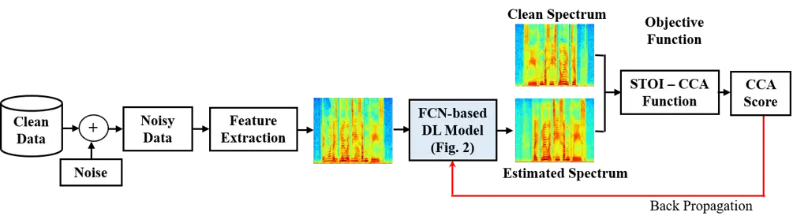
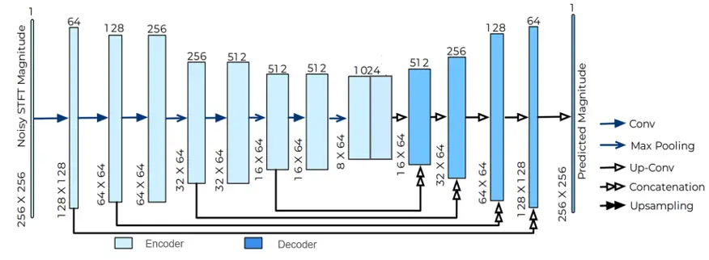
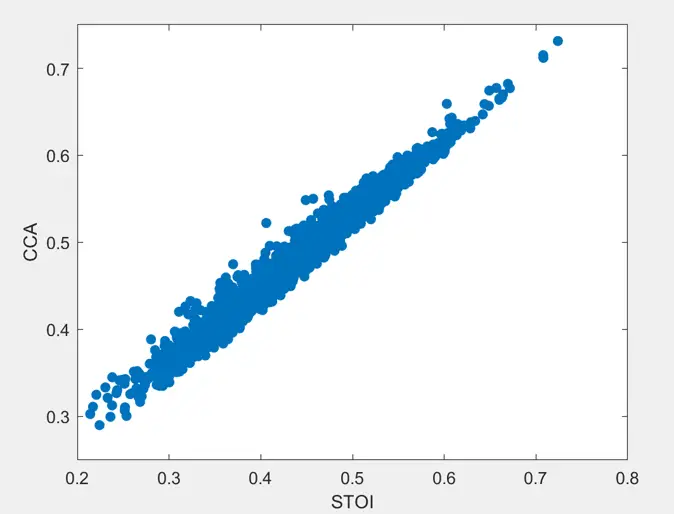
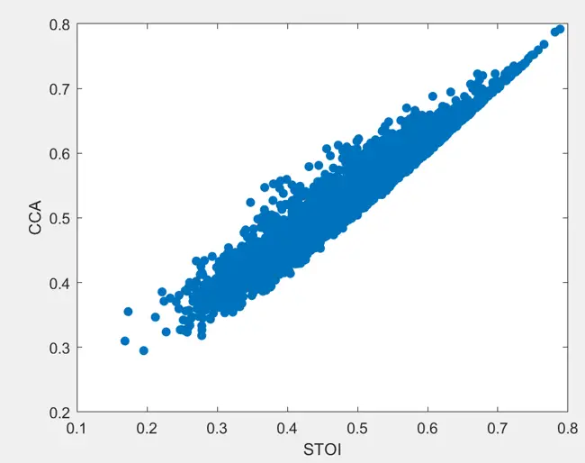
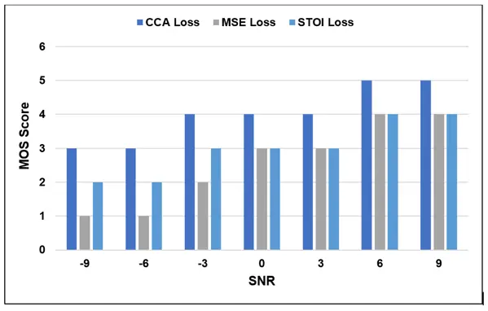

# A Novel Speech Intelligibility Enhancement Model based on Canonical Correlation and Deep Learning

Tassadaq Hussain Affiliation: are with the School of Computing ,
Edinburgh Napier University, UK t.hussain, m.diyan, k.dashtipour,
m.gogate, a.hussain@napier.ac.uk    Muhammad Diyan Affiliation: are with
the School of Computing , Edinburgh Napier University, UK t.hussain,
m.diyan, k.dashtipour, m.gogate, a.hussain@napier.ac.uk    Mandar Gogate
Affiliation: are with the School of Computing , Edinburgh Napier
University, UK t.hussain, m.diyan, k.dashtipour, m.gogate,
a.hussain@napier.ac.uk    Kia Dashtipour Affiliation: are with the
School of Computing , Edinburgh Napier University, UK t.hussain,
m.diyan, k.dashtipour, m.gogate, a.hussain@napier.ac.uk    Ahsan Adeel
Affiliation: Ahsan Adeel is with the Department of Electrical
Engineering, University of Wolverhamption, UK. a.adeel@wlv.ac.uk    Yu
Tsao Affiliation: Yu Tsao is with the Research Center for Information
Technology, Academia Sinica, Taipei, Taiwan. yu.tsao@citi.sinica.edu.tw
   Amir Hussain Affiliation: are with the School of Computing ,
Edinburgh Napier University, UK t.hussain, m.diyan, k.dashtipour,
m.gogate, a.hussain@napier.ac.uk

###### Abstract

Current deep learning (DL) based approaches to speech intelligibility
enhancement in noisy environments are often trained to minimise the
feature distance between noise-free speech and enhanced speech signals.
Despite improving the speech quality, such approaches do not deliver
required levels of speech intelligibility in everyday noisy environments
. Intelligibility-oriented (I-O) loss functions have recently been
developed to train DL approaches for robust speech enhancement. Here, we
formulate, for the first time, a novel canonical correlation based I-O
loss function to more effectively train DL algorithms. Specifically, we
present a canonical-correlation based short-time objective
intelligibility (CC-STOI) cost function to train a fully convolutional
neural network (FCN) model. We carry out comparative simulation
experiments to show that our CC-STOI based speech enhancement framework
outperforms state-of-the-art DL models trained with conventional
distance-based and STOI-based loss functions, using objective and
subjective evaluation measures for case of both unseen speakers and
noises. Ongoing future work is evaluating the proposed approach for
design of robust hearing-assistive technology.

## I INTRODUCTION

Speech enhancement (SE) aims to improve the intelligibility and quality
of speech signals in real-time environments that have been distorted by
additive and convolutive sounds. In recent years, non-linear spectral
mapping-based approaches have shown excellent performance for SE tasks.
For example, a deep denoising autoencoder (DDAE) \[1\] and deep neural
network (DNN) \[2\]-based frameworks were initially proposed for SE and
demonstrated excellent results in suppressing noise components and
improving quality and intelligibility of the estimated speech signal. In
addition to conventional DNN structures, convolutional neural network
(CNN) and long short-term memory (LSTM)-based frameworks were also used
in an attempt to further improve generalisation performance in seen and
unseen noisy conditions. In \[3\], a real-time SE model was proposed by
training a CNN framework in an encoder-decoder style. The authors in
\[4\] proposed an end-to-end SE framework based on fully convolutional
neural network (FCN) to recover the enhanced speech waveform. Later, by
replacing a conventional loss function with an objective
evaluation-based cost function, an improved FCN-based SE framework was
proposed to enhance speech perception in noisy environments \[5\].

Recently, Reddy et al. \[6\] used a straightforward CNN model for SE to
achieve a slightly better performance compared to more complicated
algorithms. In order to train the model, different types of noise were
inputted and PESQ was used as an evaluation metric. It is important to
note that despite reducing the parameters, there was no major
improvement observed in the performance of the model. Hussain et al.
\[7\] integrated temporal attentive-pooling (TAP) into the CNN approach
for the SE task. The convolutional layer was used to extract the local
information of audio signals and RNN was used to characterize temporal
contextual information. The infant cry dataset was used to evaluate
performance and experimental findings indicated that the approach can
effectively reduce noise level from infant cry signals.



Fig. 1: Proposed CC-STOI-based SE model

Despite the outstanding performance of DL-based SE models,
distance-based loss functions, like mean squared error (MSE) and mean
absolute error (MAE), are commonly utilised to optimise the parameters
of such systems. These cost functions, on the other hand, are not based
on human auditory perception and may not be appropriate for
speech-related applications. We believe that employing human
perception-based evaluation measures to optimise such systems could
result in more optimal task-related outcomes. Researchers have lately
begun using a range of objective evaluation measures based on human
auditory perception to optimise DL-based systems. Perceptual evaluation
of speech quality (PESQ) \[8\] and short-time objective intelligibility
(STOI) \[9\] are among those two widely used metrics for measuring
speech quality and intelligibility. For example, a number of
intelligibility-oriented (I-O) STOI-metric based DL algorithms have
recently been proposed and proven to be useful for SE. The authors in
\[5\] employed a STOI metric as an objective function to optimize an FCN
model for SE. The proposed I-O STOI-based system proved to be effective
and demonstrated better results than a standard MSE-based for SE task
due to increased consistency between the training and evaluation target.

In this paper, we propose a first of its kind canonical-correlation
based short-time objective intelligibility (CC-STOI) based cost function
to quantify and optimise correlations between noisy and clean speech
signals. We focus on the magnitude spectra of noisy and clean speech
utterances as we process the signal frame by frame in the frequency
domain. Next, we utilise an FCN to learn the spectral mapping function
using a CC-STOI function. Apart from formulating a CC-STOI loss
function, we evaluate the performance of CC-STOI-based system against
two loss functions, namely STOI and MSE. All SE frameworks are trained
and evaluated on the benchmark GRID corpus \[10\] using two background
noise scenarios, such as speech and non-speech background noises,
generated by synthetically mixing clean utterances with
speech/non-speech background noises to form noisy data.

Experimental results demonstrate that the DL-based framework when
optimized using a CC-STOI function, can achieve significant SE
performance improvement over both MSE and STOI-based SE methods under
different noise and SNR conditions in terms of standardized evaluation
metrics: namely, PESQ, STOI, and speech distortion index (SDI) \[11\].



Fig. 2: Proposed FCN-based framework for CC-STOI-based SE

## II Methodology

Current DL-based SE frameworks are normally trained to minimize the MSE
between estimated and target magnitude spectrums. As a result, we start
with an FCN-based U-Net model  \[12\] for SE that has been trained with
an MSE loss function. The MSE loss function between the noisy and
estimated magnitude spectrum can be computed as:

```math
\mathcal{L}_{MSE}=min(\frac{1}{N}\sum_{n=1}^{N}\|\hat{Y}_{n}-Y_{n}\|_{2}) \tag{1}
```

where $`\textit{\^{Y}}_{N}`$ and $`\textit{Y}_{N}`$ is the estimated and
corresponding target magnitude spectrum, N is the number of speech
frames, and $`\|\cdot\|_{2}`$ represents L2-normalization.

Similar to \[13\], we adopted a deep FCN-based U-Net architecture for SE
utilizing a CC-STOI loss function to estimate the enhanced magnitude
spectrum. The proposed CC-STOI-based SE model is shown in Figure 1, and
the FCN-based U-Net framework is shown in Figure 2. Our goal is to
evaluate how incorporating CCA into the STOI loss function affects the
quality and intelligibility of the estimated speech signal when compared
to standard MSE and STOI loss functions.

### II-A Short-time Objective Intelligibility based on Canonical Correlation Analysis

To train a frequency domain I-O SE model, we utilized a modified STOI
proposed in \[13\] as an objective function. The STOI function takes the
clean and estimated speech signals as input and computes the score by:
i) removing the silent frames from clean and estimated speech signals,
ii) applying the short-time Fourier transform (STFT), iii) Estimating
the envelope of clean and noisy speech using one-third octave-band
analysis of the STFT frames, iv) Normalizing and clipping to compensate
for global level differences and stabilisation of the STOI evaluation,
and v) measuring intelligibility. To optimise the correlation between
the two spectral envelopes, we replaced the correlation coefficient of
standard STOI with the CCA. The correlation coefficient between the two
speech signal is estimated using the equations below to optimise the
CC-STOI function.

```math
\textit{d}_{i,j}=\frac{(y_{i,j}-\mu_{y_{i,j}})^{\intercal}(\hat{y}_{i,j}-\mu_{y_{i,j}})^{\intercal}}{\|y_{i,j}-\mu_{y_{i,j}}\|_{2}\|\hat{y}_{i,j}-\mu_{\hat{y}_{i,j}}\|_{2}} \tag{2}
```

where y and ŷ represents the spectral envelope of the target and
estimated speech signals, $`\mu_{y_{i,j}}`$ and $`\mu_{\hat{y}_{i,j}}`$
are the corresponding sample mean vectors, and $`\|\cdot\|_{2}`$
represents the L2-normalization. The final CC-STOI is the average of the
intelligibility measure over all bands and frames.

```math
\textit{d}_{CC-STOI}=\frac{1}{I(M-N+1)}\sum_{i=1}^{I}\sum_{j=1}^{J}\textit{d}_{i,j} \tag{3}
```

where $`I`$ = 15 represents the number of one-third octave bands and
$`M-N+1`$ presents the total number of short-time temporal envelope
vectors. Please see \[9\] for a more complete description of each step.
Because the CC-STOI calculation is differentiable, it may be used
directly as the objective function to optimise the SE model.

```math
\mathcal{L}_{CC-STOI}=-\frac{1}{M}\sum_{m=1}^{M}\textit{d}_{CC-STOI}(\hat{Y}_{m},Y_{m}) \tag{4}
```

The CC-STOI score between the estimated and clean magnitude spectra of
audio utterances is measured using
$`\textit{d}_{CC-STOI}(\hat{Y}_{m},Y_{m})`$. Unlike MSE, where the goal
is to reduce the distance, we want to improve speech intelligibility by
maximizing the CC-STOI score.

### II-B Proposed SE Framework

This section presents the proposed FCN-based U-Net framework for SE as
shown in Fig. 2. The network architecture for feature extraction and the
speech resynthesis pipeline are discussed in detail below.

#### II-B1 Audio feature extraction

For SE, the speech feature extraction step employs a U-Net \[12\] style
network incorporated with an audio SE-modified encoder and decoder
block. The magnitude of noisy speech STFT of dimension $`F\times T`$
where $`F`$ and $`T`$ are the frequency and time dimensions of the
spectrogram, is fed into the network. Moreover, input is provided for
two convolutional layers consisting of 4 and 2 strides to reduce
time-frequency until it reaches 64. The reduced features are processed
via three convolutional blocks, each with convolution layers that have a
filter size of three and stride of one, following which the frequency
pooling layer is used to reduce the size of the frequency dimension by
two. It is important to note that amidst the execution of convolutional
blocks, spatial dimension is preserved. When noisy spectrogram is
provided as an input, the proposed model estimates the clean
spectrogram, and when using an inverse STFT, the predicted magnitude is
blended with the noisy phase to produce enhanced speech.

The decoder is made up of three convolutional blocks each with two
upsampling layers to upsample the dimension by two. The upsampling layer
is followed by convolutional layers with a filter size of three. The
acoustic features are then fed into two transposed convolutional layers
with a filter size of four and a stride of two to upsample the TF
dimension until it equals the input dimension. To keep the output in the
0 to 1 range, we utilise a sigmoid activation function. The predicted
mask is then multiplied by the input spectrogram to produce the output
masked spectrogram. When the noisy STFT magnitude is provided as input,
the proposed model estimates the magnitude of clean STFT. Using an
inverse STFT, the predicted magnitude is combined with the noisy phase
to generate enhanced speech.

## III Experiments and Results

### III-A Experimental Setup

A small vocabulary GRID corpus \[10\] is utilised to train our proposed
I-O SE model and assess how the CC-STOI loss function influences entire
SE efficiency. The dataset contained a video recordings of 34 male and
female speakers, each with 1000 utterances lasting roughly
three-seconds. In this paper, we only utilized the audio data to assess
the performance of our proposed framework. The audio data was initially
recorded at 48 kHz sampling rate which subsequently resampled to 16 kHz
for processing. In this paper, we randomly selected ten speakers for the
training set, two speakers for validation, and three speakers for the
test sets. To evaluate the performance of the proposed I-O SE framework,
we employed three objective evaluation measures to measure the quality,
intelligibility, and speech to noise distortion index, i.e., PESQ, STOI,
and SDI.

### III-B STOI vs CC-STOI

To assess the correlation between CC-STOI and modified STOI \[13\] that
accounts a 16 kHz frequency domain signal while ignoring down sampling
and silent frame removal steps, we first plot a scatter plot between
CC-STOI and modified STOI scores. The scatter plot is used to observe
the relationship between CC-STOI and modified STOI scores. Figures 3(a)
and 3(b) show scatter plots for CC-STOI and modified STOI scores
computed between clean and noisy utterances, and clean and enhanced
utterances. The scatter plots show that the CC-STOI score correlates
well with the modified STOI score and can be used for training DL
models.



(a)



(b)

Fig. 3: Scatter plot between (a) CC-STOI and STOI scores for clean and
noisy utterances and (b) CC-STOI and STOI scores for clean and enhanced
utterances

### III-C Speech vs Non-speech Background Noises

We generated two sets of noisy data, i.e., speech and non-speech, to
evaluate the performance of CC-STOI. Initially, we contaminated clean
utterances with speech noises ranging from 0 to 20 dB SNR, to generate
speech noisy data. For more challenging task, we later contaminated
clean utterances with four real-world background noises provided by
CHiME-3 corpus \[14\] between -12 and 9 dB SNR at a step of 3 dB, namely
Bus, Cafeteria, Pedestrian, and Street (termed Bus, Caf, Ped, and Str),
to generate non-speech noisy data.

The performance of DL SE frameworks trained using three loss functions
for speech and non-speech background noises is compared in Tables I and
II. Tables I and II show that DL SE frameworks, when trained with
different loss functions, significantly improves the overall quality and
intelligibility of noisy speech signal. It can also be seen that
DL-based framework with three loss functions also provides less
distortion ratio compared to original noisy speech. In summary, the
frameworks optimised with the three loss functions were successful for
SE. However, we found that, in comparison to SE frameworks trained with
the $`\mathcal{L}_{MSE}`$ and $`\mathcal{L}_{STOI}`$ loss functions, DL
framework trained with $`\mathcal{L}_{CC-STOI}`$ performed better in
terms of PESQ, STOI, and SDI scores, respectively.

|           |          |                              |       |       |       |
| --------- | -------- | ---------------------------- | ----- | ----- | ----- |
| Framework | Loss     | Objective Evaluation Metrics |       |       | Avg.  |
|           | Function | PESQ                         | STOI  | SDI   |       |
| Noisy     | –        | 2.442                        | 0.875 | 0.237 | 1.184 |
|           | MSE      | 2.746                        | 0.893 | 0.193 | 1.277 |
| U-Net     | STOI     | 2.802                        | 0.912 | 0.212 | 1.308 |
|           | CC-STOI  | 2.831                        | 0.912 | 0.225 | 1.322 |

TABLE I: Performance comparison of DL models using standardised
objective evaluation metrics using speech noisy data under
speaker-independent conditions.

|           |          |                              |       |       |       |
| --------- | -------- | ---------------------------- | ----- | ----- | ----- |
| Framework | Loss     | Objective Evaluation Metrics |       |       | Avg.  |
|           | Function | PESQ                         | STOI  | SDI   |       |
| Noisy     | –        | 1.868                        | 0.647 | 2.036 | 1.517 |
|           | MSE      | 1.975                        | 0.704 | 2.013 | 1.564 |
| U-Net     | STOI     | 2.107                        | 0.792 | 2.055 | 1.651 |
|           | CC-STOI  | 2.155                        | 0.801 | 2.064 | 1.673 |

TABLE II: Performance comparison of DL models using standardised
objective evaluation metrics using non-speech noisy data under
speaker-independent conditions.

In terms of MOS with CHiME3 noises, Fig.4 shows the results of three
distinct speech augmentation approaches. In comparison to MSE loss and
STOI loss, the experimental results demonstrate that the CC-STOI
performed better. Furthermore, as compared to MSE and STOI losses, the
CC-STOI performed better in lower SNRs. The subjects were normal-hearing
listeners and were asked to report the results in terms of mean opinion
score (MOS). Fig.4 depicts the MOS score of the GRID corpus for
non-speech CHiME-3 background noises at -9, 9 dB SNR at a step of 3 dB
using three loss functions. The experimental results show that
$`\mathcal{L}_{CC-STOI}`$ achieved better speech perception performance
in terms of noise suppression when compared with $`\mathcal{L}_{STOI}`$
and $`\mathcal{L}_{MSE}`$ especially under low SNR conditions.

## IV Conclusion

In this study, we proposed a new canonical-correlation based I-O
technique to improve the training and generalisation performance of
conventional DL-based SE systems by using a more effective
intelligibility evaluation metric as an alternate cost function. In
particular, a customised canonical-correlation-based solution has been
developed that utilised a canonical-correlation based version of the
modified STOI loss function to train the DL SE framework. Our results
show that utilising canonical correlation as part of a STOI-based DL
system improves not only the intelligibility but also the quality of the
output estimated signal by exhibiting less distortion. Overall, the
CC-STOI loss function performed well and produced better results for a
variety of SE assessment criteria, revealing the potential of modified
STOI for optimization of frequency-domain SE applications. We plan to
expand on this work by evaluating the performance of CC-STOI based SE
for more complex real-world audio-visual datasets. This ongoing future
work will pave the way for design of future of multi-modal
hearing-assistive technologies.



Fig. 4: Average subjective listening scores of CC-STOI, STOI, and MSE
loss functions for {-9, 9 dB} SNR of non-speech GRID corpus.

## References

- \[1\] X. Lu, Y. Tsao, S. Matsuda, and C. Hori, “Speech enhancement
  based on deep denoising autoencoder.” in _Proc. INTERSPEECH_, vol.
  2013, 2013, pp. 436–440.
- \[2\] Y. Xu, J. Du, L.-R. Dai, and C.-H. Lee, “A regression approach
  to speech enhancement based on deep neural networks,” _IEEE/ACM
  Transactions on Audio, Speech, and Language Processing_, vol. 23,
  no. 1, pp. 7–19, 2014.
- \[3\] A. Pandey and D. Wang, “Tcnn: Temporal convolutional neural
  network for real-time speech enhancement in the time domain,” in
  _Proc. ICASSP_, 2019, pp. 6875–6879.
- \[4\] S.-W. Fu, Y. Tsao, X. Lu, and H. Kawai, “Raw waveform-based
  speech enhancement by fully convolutional networks,” in _Proc. APSIPA
  ASC_, 2017, pp. 006–012.
- \[5\] S.-W. Fu, T.-W. Wang, Y. Tsao, X. Lu, and H. Kawai, “End-to-end
  waveform utterance enhancement for direct evaluation metrics
  optimization by fully convolutional neural networks,” _IEEE/ACM
  Transactions on Audio, Speech, and Language Processing_, vol. 26,
  no. 9, pp. 1570–1584, 2018.
- \[6\] H. Reddy, A. Kar, and J. Østergaard, “Performance analysis of
  low complexity fully connected neural networks for monaural speech
  enhancement,” _Applied Acoustics_, vol. 190, p. 108627, 2022.
- \[7\] T. Hussain, W.-C. Wang, M. Gogate, K. Dashtipour, Y. Tsao,
  X. Lu, A. Ahsan, and A. Hussain, “A novel temporal attentive-pooling
  based convolutional recurrent architecture for acoustic signal
  enhancement,” _arXiv preprint arXiv:2201.09913_, 2022.
- \[8\] A. W. Rix, J. G. Beerends, M. P. Hollier, and A. P. Hekstra,
  “Perceptual evaluation of speech quality (pesq)-a new method for
  speech quality assessment of telephone networks and codecs,” in _Proc.
  ICASSP_, vol. 2, 2001, pp. 749–752.
- \[9\] C. H. Taal, R. C. Hendriks, R. Heusdens, and J. Jensen, “An
  algorithm for intelligibility prediction of time–frequency weighted
  noisy speech,” _IEEE Transactions on Audio, Speech, and Language
  Processing_, vol. 19, no. 7, pp. 2125–2136, 2011.
- \[10\] M. Cooke, J. Barker, S. Cunningham, and X. Shao, “An
  audio-visual corpus for speech perception and automatic speech
  recognition,” _The Journal of the Acoustical Society of America_, vol.
  120, no. 5, pp. 2421–2424, 2006.
- \[11\] J. Le Roux, S. Wisdom, H. Erdogan, and J. R. Hershey,
  “Sdr–half-baked or well done?” in _Proc. ICASSP_, 2019, pp. 626–630.
- \[12\] O. Ronneberger, P. Fischer, and T. Brox, “U-net: Convolutional
  networks for biomedical image segmentation,” in _International
  Conference on Medical image computing and computer-assisted
  intervention_. Springer, 2015, pp. 234–241.
- \[13\] T. Hussain, M. Gogate, K. Dashtipour, and A. Hussain, “Towards
  intelligibility-oriented audio-visual speech enhancement,” _arXiv
  preprint arXiv:2111.09642_, 2021.
- \[14\] J. Barker, R. Marxer, E. Vincent, and S. Watanabe, “The third
  ‘chime’speech separation and recognition challenge: Dataset, task and
  baselines,” in _Proc. ASRU_, 2015, pp. 504–511.
