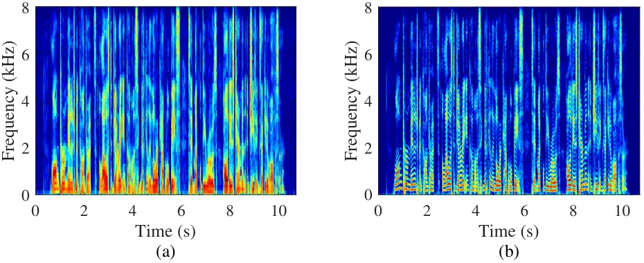
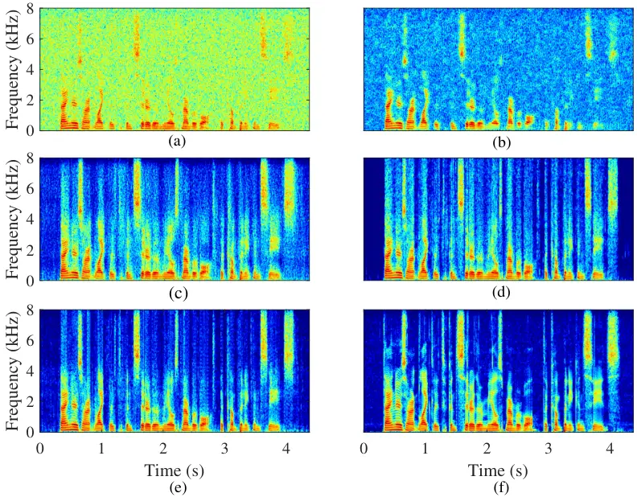
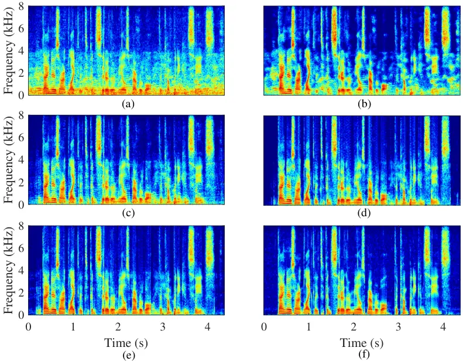
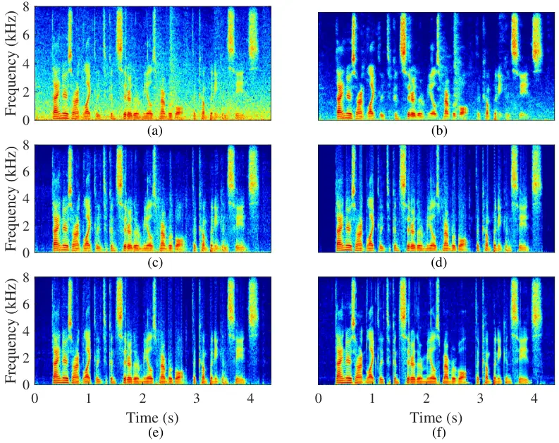

# Low-latency Monaural Speech Enhancement with Deep Filter-bank Equalizer

Preprint: Chengshi Zheng, JASA

Chengshi Zheng Affiliation: Also at: University of Chinese Academy of
Sciences, 100049, Beijing, China Email: <cszheng@mail.ioa.ac.cn>   
Wenzhe Liu Affiliation: Also at: University of Chinese Academy of
Sciences, 100049, Beijing, China    Andong Li Affiliation: Also at:
University of Chinese Academy of Sciences, 100049, Beijing, China   
Yuxuan Ke Affiliation: Also at: University of Chinese Academy of
Sciences, 100049, Beijing, China    Xiaodong Li Affiliation: Also at:
University of Chinese Academy of Sciences, 100049, Beijing, China
Affiliation: Key Laboratory of Noise and Vibration Research, Institute
of Acoustics, Chinese Academy of Sciences, 100190, Beijing, China

August 24, 2026

###### Abstract

It is highly desirable that speech enhancement algorithms can achieve
good performance while keeping low latency for many applications, such
as digital hearing aids, acoustically transparent hearing devices, and
public address systems. To improve the performance of traditional
low-latency speech enhancement algorithms, a deep filter-bank equalizer
(FBE) framework was proposed, which integrated a deep learning-based
subband noise reduction network with a deep learning-based shortened
digital filter mapping network. In the first network, a deep learning
model was trained with a controllable small frame shift to satisfy the
low-latency demand, i.e., $`\leq`$ 4 ms, so as to obtain (complex)
subband gains, which could be regarded as an adaptive digital filter in
each frame. In the second network, to reduce the latency, this adaptive
digital filter was implicitly shortened by a deep learning-based
framework, and was then applied to noisy speech to reconstruct the
enhanced speech without the overlap-add method. Experimental results on
the WSJ0-SI84 corpus indicated that the proposed deep FBE with only 4-ms
latency achieved much better performance than traditional low-latency
speech enhancement algorithms in terms of the indices such as PESQ,
STOI, and the amount of noise reduction.

## I Introduction

In modern digital hearing aids \[15, 14\], speech enhancement plays a
potentially important role in noisy environments in improving speech
intelligibility and perceptual quality. This is because the speech
reception threshold (SRT) of hearing-impaired (HI) listeners is often
much higher than that of normal-hearing (NH) listeners, owing to reduced
temporal and spectral resolution. In the last half-century, many efforts
have been made to reduce noise for both monaural and bilateral hearing
aids, so as to improve speech intelligibility, listening comfort and
speech quality. For NH individuals, speech enhancement usually has not
been found to improve speech intelligibility, but it can improve the
speech perceptual quality and listening comfort by removing noise
components without degrading intelligibility \[1, 4\]. Speech
enhancement has already become a preprocessing step for many systems,
such as audio-visual conference systems, public address systems, speech
recognition systems, and hearing assistive devices.

Deep learning-based methods have become the current state-of-the-art for
many signal processing problems like single-channel speech enhancement.
In the time-frequency (T-F) domain, typical learning targets can be
divided into two categories, namely masking-based and mapping-based. For
the former, the ideal binary mask (IBM) \[18\] and ideal ratio mask
(IRM) \[6\] are the two most widely used T-F masking targets. For the
latter, the log-power spectrum (LPS) \[27\] and magnitude spectrum (MS)
\[21\] are often chosen as the mapping target. However, these learning
targets only focus on modeling the magnitude of the clean speech and its
noisy mixture without considering phase information.The phase
information is important, especially at low SNRs \[12\], and a series of
complex domain-based approaches have been proposed, which aim to
reconstruct the real and imaginary (RI) parts simultaneously. For
example, a complex ratio mask (CRM) was designed to directly optimize
the magnitude and phase simultaneously in the complex domain \[26\], so
that the phase can be implicitly recovered. Later, a complex-valued
network was introduced to estimate the complex-valued mask by Hu et al.
(2020). More recently, Tan et al. (2018) proposed using a convolutional
recurrent network (CRN) to implement complex spectral mapping (CSM),
where the RI parts can be estimated simultaneously. These approaches can
achieve high performance in theory, because both the magnitude and phase
of the clean speech can be estimated.



Figure 1: Spectrograms of clean speech using (a) a STFT with window
length 128 samples and hop length 64 samples, and (b) a filterbank with
transform size 512 samples and downsampling rate 64.

A relatively high spectral resolution is needed in order to distinguish
speech components from noise components when noise reduction algorithms
are implemented in the T-F domain, where the length of the
analysis/synthesis window should be large enough, e.g., 20-40 ms. This
causes a relatively high system latency, since the signal delay depends
on the synthesis window used for the overlap-add (OLA) reconstruction of
the output. For many practical systems, such as digital hearing aids,
acoustically transparent hearing devices and public address systems, low
latency is required \[19, 20\]. Taking digital hearing aids as an
example, the propagation time differences via air conduction and through
the hearing aid path should be as short as possible to avoid “coloration
effects” \[7\]. However, as shown in Fig. 1, a reduced size of the
analysis/synthesis window results in blurring and overlapping of
spectral details, which makes it harder for deep neural networks (DNN)
to learn speech spectral patterns and suppress noise components. To
address this problem, Wang et al. (2021) utilized an asymmetric
analysis-synthesis window pair to reduce the system latency for speech
separation systems. However, its latency of 8 ms is too high for most of
the above mentioned systems, although it may be acceptable for digital
hearing aids. A teacher-student learning-based wave-U-Net was applied to
meet the latency requirement \[11\]. In this method, an offline
wave-U-Net was pre-trained as the teacher model and was then used to
guide the training of the student wave-U-Net model to reduce the latency
with only limited performance degradation. It was also found that the
enhancement performance worsened as the window size became smaller.

Löllmann and Vary (2007) used an adaptive filter-bank equalizer (FBE)
\[24\] to achieve effective speech enhancement with a controllable
signal delay. The mixture signal was filtered with the adaptive FBE in
the time domain to achieve much lower delay than frequency-domain
filtering, while the time-domain filter coefficients were updated with
high spectral resolution to enable the any feasible frequency-domain
speech enhancement network to distinguish speech components from noise
components. The calculation process of the FBE can be summarized as
follows. The input signal was first decomposed into subband signals by
utilizing band-pass filters with a designed prototype filter. Then the
spectral gain was obtained by traditional speech enhancement methods
such as the minimum mean-square error log-spectral amplitude (MMSE-LSA)
estimator, spectral subtraction, and Wiener filtering. Finally, the
output signal is obtained by filtering the mixture with the time-domain
filter. Compared with spectral filtering that employs the common
discrete Fourier transform (DFT) analysis-synthesis filter-bank (AS FB),
it has been shown that the adaptive FBE could suppress noise in the time
domain while the latency could be decreased \[24\]. To further decrease
the signal delay, a lower degree filter was introduced by Löllmann and
Vary (2007) to approximate the time-domain filter of the adaptive FBE,
such as a moving-average (MA) filter. The MA filter is also termed as
the finite impulse response (FIR) filter commonly utilized for filtering
out unwanted noise components from a time series. When the degree of the
MA filter is $`P`$, it takes $`P`$ samples of the time-domain input
signal and calculates the weighted sum of these samples and produces a
single output sample.

Inspired by Löllmann and Vary (2007), this paper proposes a low-latency
monaural speech enhancement framework with deep filter bank equalizer
(DeepFBE) by combining the advantages of the deep learning-based speech
enhancement method and the FBE. In the first stage, the input signal was
decomposed into multiple subband signals by a set of analysis band-pass
filters called the filterbank. Then the subband signals were downsampled
by the number of subbands without any information loss, since each
subband has a limited bandwidth. The subband-domain response of the FBE
was estimated by a Noise Reduction Network (NR-Net) using the subband
signals. Compared with traditional spectral-domain speech enhancement
approaches, the NR-Net demonstrated powerful noise reduction ability by
exploiting global filterbank correlations. In the second stage, a neural
filter namely Filter Approximation network (FA-Net) was utilized to
generate low-order time-domain filter coefficients to approximate the
FBE subband-domain response. Then the input signal was filtered by the
estimated filter via the overlap-save (OLS) synthesis method to
reconstruct the time-domain enhanced output.

The contributions of this paper are two-fold. First, a novel deep
learning-based speech enhancement framework for low latency applications
was presented. To the best of our knowledge, this is the first time that
a deep learning-based FBE framework for single-channel speech
enhancement has been proposed and evaluated. Second, we compared two
neural filter design methods that approximate the FBE subband-domain
response. In the time-domain signal reconstruction, the OLS method was
adopted instead of the OLA method to reduce the system delay.

## II Signal model and problem formulation

Figure 2: Diagram of the adaptive filter-bank equalizer (FBE).

The single-channel noisy mixture in the time domain is modeled as:

```math
x(t)=s(t)+n(t), \tag{1}
```

where $`s(t)`$ denotes the clean speech, and $`n(t)`$ denotes the noise
with $`t`$ the time index.

This paper adopts the framework for the adaptive FBE described by
Löllmann and Vary (2007), which can achieve aliasing-free signal
reconstruction for adaptive subband filtering and has a lower delay than
the corresponding DFT AS FB. As shown in Fig. 2, the $`M`$ subband
signals $`x_{i}(t)`$ are generated by means of $`M`$ band-pass filters
with impulse responses $`h_{i}(l)`$ of length $`L+1`$, given by

```math
x_{i}(k)=\sum_{l=0}^{L}{x(kr-l)h_{i}(l)};i=0,1,\cdots,M-1, \tag{2}
```

where $`k`$ is the frame index and $`r`$ is the downsampling rate. The
impulse response of the $`i`$-th band-pass filter, $`h_{i}(l)`$, is a
modulation of a prototype low-pass filter of length $`L+1\geq M`$ with
the impulse response $`h(l)`$, given by

```math
h_{i}(l)=\left\{\begin{aligned} &h(l)\phi_{i}(l),&l\in\left\{0,1,\cdots,L\right\};i\in\left\{0,1,\cdots,M-1\right\}\\
&0,&{\rm else}\end{aligned}\right. \tag{3}
```

In this work, we consider the generalized DFT (GDFT) with evenly-stacked
frequency channels. Therefore, the impulse response of the prototype
filter $`h(l)`$ and the general modulation sequence $`\phi_{i}(l)`$ are,
respectively, given by:

```math
h(l)=\frac{1}{M}\frac{\sin(\frac{2\pi}{M}(l-\tau))}{\frac{2\pi}{M}(l-\tau)}win(l) \tag{4}
```

and

```math
\phi_{i}(l)=\exp\left(-j\frac{2\pi}{M}i(l-\tau)\right),i=0,1,\cdots,M-1;l\in\mathbb{Z}, \tag{5}
```

where $`win(l)`$ is the Hanning window, and $`\tau=L/2`$ is utilized to
guarantee that the coefficients of the FIR filter have non-zero phase.
This is important because a zero-phase FIR filter makes this system
noncausal.

The enhanced signal is synthesized with the filter-bank summation (FBS)
method as:

```math
\widehat{s}(t)=\sum_{i=0}^{M-1}{\widehat{W}_{i}(k)x_{i}(k)}, \tag{6}
```

where $`\widehat{W}_{i}(k)`$ is the $`i`$-th subband response of the
$`k`$th frame.

From Eqs. (2) and (3), Eq. (6) can be expressed as:

```math
\widehat{s}(t)=\sum_{l=0}^{L}{x(t-l)\widehat{w}_{l}(k)}, \tag{7}
```

where $`\widehat{w}_{l}(k)`$ is the corresponding time-domain response
of the estimated subband-domain response $`\widehat{W}_{i}(k)`$.

The FBE is used to produce time-domain filter coefficients that can be
updated in the subband-domain. The desired subband-domain response can
be estimated by some speech enhancement algorithms, such as spectral
subtraction, i.e., $`\widehat{W}_{i}(k)=\mathcal{F}_{1}({x}_{i}(k))`$,
and the mapping between the subband-domain response and the time-domain
high-order (HO) response is defined as
$`\widehat{w}^{HD}_{l}(k)=\mathcal{G}_{1}(\widehat{W}_{i}(k))`$:

```math
\widehat{w}^{HD}_{l}(k)=\mathcal{G}_{1}(\widehat{W}_{i}(k))=h(l)\sum_{i=0}^{M-1}{\widehat{W}_{i}(k)\phi_{i}(l)}, \tag{8}
```

In order to further reduce signal delay, the response can be
approximated by a lower-degree filter which is denoted
$`\mathcal{G}_{2}(\cdot)`$. The final time-domain response
$`\widehat{w}_{l}(k)`$ can be obtained after domain transformation
$`\mathcal{G}_{1}(\cdot)`$ and the low-order filter approximation
operation $`\mathcal{G}_{2}(\cdot)`$. The function for changing from the
subband-domain response to the low-order time-domain response can be
defined as $`\widehat{w}_{l}(k)=\mathcal{F}_{2}(\widehat{W}_{i}(k))`$.

To summarize, the implementation of the FBE consists of two stage: (1)
Subband response estimation for noise reduction: in this stage, the
mixture was decomposed into subband signals by the analysis filterbank
with downsampling. Then the subband signals were used to calculate the
subbband-domain response of the noise-reduction filter. (2) Filter
length shortening for latency reduction: in this stage, time-domain
filter coefficients were obtained by a domain transform function and a
low-order filter approximation operation. After that, the enhanced
speech was generated by filtering the input signal with the estimated
time-domain filter coefficients.

## III Proposed Two-stage Framework

Figure 3: Diagram of the proposed system.

This section proposed a low-latency monaural speech enhancement
framework with filter-bank equalizer that performed time-domain
filtering with coefficients updated in the subband-domain by a DNN.
Compared with the conventional FBE described in Section II, there are
three differences: (1) A masking-based neural network was utilized to
estimate a subband-domain response which achieved better performance
than traditional methods especially for low SNRs and non-stationary
noise scenarios. (2) The filter approximation stage was replaced by a
DNN in order to use a data-dependent method to fit the high-order filter
rather than a fixed filter design method such as the MA filter
approximation. In addition, we explored the effect of replacing the
domain transformation mapping function with a network for the filter
approximation and demonstrated better performance. (3) We implemented
the filtering operation in the frequency domain with the OLS method
instead of the OLA method when reconstructing the time-domain signal.

Figure 3(a) is a diagram of the proposed system, which consists of two
stages, namely the Noise Reduction Network (NR-Net) and the Filter
Approximation Network (FA-Net). The pipeline goes as follows. In the
first stage, the full-band input signal $`x(t)`$ with discrete time
$`t`$ was decomposed into $`M`$ subband signals $`x_{i}(k)`$ with
$`i\in\left\{0,1,\cdots,M-1\right\}`$. To reduce complexity, similar to
Vary (2006), this subband decomposition was achieved via a polyphase
network (PPN) implementation and downsampling in the analysis
filterbank. After that, the NR-Net was employed to estimate the subband
filter $`\widehat{\bm{W}}\in\mathbb{C}^{K\times M}`$ to suppress the
noise, where $`K`$ is the number of frames.

To obtain time-domain filter coefficients for the full-band signal, in
the second stage, the noisy signal $`x(t)`$ was split into frames of
$`M`$ samples with frame shift $`r`$:

```math
\bm{x}^{DT}(k)=x[kr-M+1:kr],k\in\mathbb{Z}, \tag{9}
```

where $`x[a:b]`$ means that samples of $`x(t)`$ from time index $`a`$ to
time index $`b`$ are included.

For the $`k`$th frame, the FA-Net received both the original noisy
signal $`\bm{x}^{DT}(k)\in\mathbb{R}^{M\times 1}`$ and the estimated
response $`\widehat{\bm{W}}(k)`$ as the input and aimed to predict the
corresponding frequency-domain response
$`\widehat{\bm{W}}_{DFT}(k)\in\mathbb{C}^{D\times 1}`$, where $`D`$
depends on the degree of the approximate time-domain filter. Then the
mixture signal $`\bm{x}^{filter}(k)=x[kr-2P+1:kr]`$ was filtered by the
estimated $`k`$th frame frequency-domain response
$`\widehat{\bm{W}}_{DFT}(k)`$ and the last $`r`$ samples of the output
were preserved as the enhanced output of the $`k`$th frame
$`\widehat{\bm{s}}(k)\in\mathbb{R}^{r\times 1}`$. The final enhanced
signal was constructed using the OLS method. The whole forward
calculation process was formulated as:

```math
\widehat{\bm{W}}=\mathcal{F}_{1}(\bm{X};\Theta_{1}), \tag{10}
```

```math
\widehat{\bm{W}}_{DFT}(k)=\mathcal{F}_{2}(\bm{x}^{DT}(k),\widehat{\bm{W}}(k);\Theta_{2}), \tag{11}
```

```math
\widehat{\bm{s}}(k)=\mathcal{F}_{3}(\widehat{\bm{W}}_{DFT}(k),\bm{x}^{filter}(k)), \tag{12}
```

where $`{\bf X}\in{\mathbb{C}}^{K\times M}`$ with
$`{\bf X}_{i,k}=x_{i}(k)`$. $`\mathcal{F}_{1}`$, $`\mathcal{F}_{2}`$,
and $`\mathcal{F}_{3}`$ denote the calculation operations of NR-Net,
FA-Net, and signal reconstruction, respectively. $`\Theta_{1}`$ and
$`\Theta_{2}`$ are the network parameters of NR-Net and FA-Net,
respectively.

### III.1 Noise Reduction Network

A diagram of the Noise Reduction Network (NR-Net) is shown in Fig. 3(b)
and Fig. 3(c). It is a convolutional recurrent network (CRN), which has
been successfully applied in the field of speech enhancement \[22\].

The NR-Net is essentially an encoder-decoder structure with long
short-term memory (LSTM) layers between the encoder and the decoder
\[22\]. The input is the 257-dimensional subband complex spectrum of the
input signal. The encoder includes six convolutional blocks to extract
spectro-temporal features from the noisy spectra, and the decoder has
six deconvolutional blocks to gradually interpolate and recover the
original size of the input and estimate the complex mask. Each
(de)convolutional block comprises a (De)Conv-GLU layer, batch
normalization (BN) and an ELU activation layer. In order to obtain a
causal system for real-time processing, we applied causal convolutions
in the time dimension to the encoder and decoder layers, which were
utilized to control the output at time $`t`$ based only on the input
features from time $`t`$ and earlier in the previous layer, meanwhile
maintain the temporal order of the input sequence. Note that causal
deconvolutions can be easily applied to the decoder layers because the
deconvolution is essentially a convolution operation. Within each layer,
the kernel size was set to $`1\times 3`$ except for the first layer,
where it was $`1\times 5`$ and the stride was $`1\times 2`$ along the
time and frequency directions to keep all layers have the same time
dimension to meet the real-time requirement and obtain a large-range
receptive field along the frequency axis to learn the characteristics of
inter-harmonic features. The number of channels of each convolutional
block in the encoder was set to 16, 32, 64, 64, 128, 256 from the first
to the last one. The decoder was designed as a mirror version of the
encoder, and the number of channels of the final deconvolutional layer
was set to 2 without normalization and activation function to estimate
the complex subband-domain mask. In this way, low-resolution feature
embedding was transformed by the encoder and the decoder restored
high-level features to the spectra with the original input shape. To
mitigate the gradient disappearance problem, the skip connection
strategy was adopted, which concatenated the output of each encoder
layer and that of the corresponding decoder layer. Between the encoder
and the decoder, two LSTM layers were inserted to capture temporal
sequence dependencies. To reduce the model complexity, a grouping
strategy was adopted for each LSTM layer (dubbed GLSTM), where the group
number was set to 4.

A more detailed description of NR-Net is presented in Table 1. The input
size and the output size are given in
$`(ChannelNum\times TimeSteps\times frequencySize)`$ for both the
encoder and the decoder, and $`(TimeSteps\times frequencySize)`$ for
LSTMs. The hyper-parameters for CNNs are specified with
$`(KernelSize,Strides,ChannelNum)`$ format.

|     layer name            |     input size                                |     hyper-parameters                |     output size                            |
| ------------------------- | --------------------------------------------- | ----------------------------------- | ------------------------------------------ |
|     Conv_1                |     $`C`$ $`\times`$ $`T`$ $`\times`$ 257     |     1 $`\times`$ 5, (1, 2), 16      |     16 $`\times`$ $`T`$ $`\times`$ 127     |
|     Conv_2                |     16 $`\times`$ $`T`$ $`\times`$ 127        |     1 $`\times`$ 3, (1, 2), 32      |     32 $`\times`$ $`T`$ $`\times`$ 63      |
|     Conv_3                |     32 $`\times`$ $`T`$ $`\times`$ 63         |     1 $`\times`$ 3, (1, 2), 64      |     64 $`\times`$ $`T`$ $`\times`$ 31      |
|     Conv_4                |     64 $`\times`$ $`T`$ $`\times`$ 31         |     1 $`\times`$ 3, (1, 2), 64      |     64 $`\times`$ $`T`$ $`\times`$ 15      |
|     Conv_5                |     64 $`\times`$ $`T`$ $`\times`$ 15         |     1 $`\times`$ 3, (1, 2), 128     |     128 $`\times`$ $`T`$ $`\times`$ 7      |
|     Conv_6                |     128 $`\times`$ $`T`$ $`\times`$ 7         |     1 $`\times`$ 3, (1, 2), 256     |     256 $`\times`$ $`T`$ $`\times`$ 3      |
|     reshape_size_1        |     64 $`\times`$ $`T`$ $`\times`$ 4          |     -                               |     T $`\times`$ 768                       |
|     GLSTM_1               |     $`T`$ $`\times`$ 768                      |     768                             |     T $`\times`$ 768                       |
|     GLSTM_2               |     $`T`$ $`\times`$ 768                      |     768                             |     T $`\times`$ 768                       |
|     reshape_size_2        |     $`T`$ $`\times`$ 768                      |     -                               |     256 $`\times`$ $`T`$ $`\times`$ 3      |
|     skip_connection_1     |     256 $`\times`$ $`T`$ $`\times`$ 3         |     -                               |     512 $`\times`$ $`T`$ $`\times`$ 3      |
|     DeConvGLU_1           |     512 $`\times`$ $`T`$ $`\times`$ 3         |     1 $`\times`$ 3, (1, 2), 128     |     128 $`\times`$ $`T`$ $`\times`$ 7      |
|     skip_connection_2     |     128 $`\times`$ $`T`$ $`\times`$ 7         |     -                               |     256 $`\times`$ $`T`$ $`\times`$ 7      |
|     DeConvGLU_2           |     256 $`\times`$ $`T`$ $`\times`$ 7         |     1 $`\times`$ 3, (1, 2), 64      |     64 $`\times`$ $`T`$ $`\times`$ 15      |
|     skip_connection_3     |     64 $`\times`$ $`T`$ $`\times`$ 15         |     -                               |     128 $`\times`$ $`T`$ $`\times`$ 15     |
|     DeConvGLU_3           |     128 $`\times`$ $`T`$ $`\times`$ 15        |     1 $`\times`$ 3, (1, 2), 64      |     64 $`\times`$ $`T`$ $`\times`$ 31      |
|     skip_connection_4     |     64 $`\times`$ $`T`$ $`\times`$ 31         |     -                               |     128 $`\times`$ $`T`$ $`\times`$ 31     |
|     DeConvGLU_4           |     128 $`\times`$ $`T`$ $`\times`$ 31        |     1 $`\times`$ 3,(1, 2), 32       |     32 $`\times`$ $`T`$ $`\times`$ 63      |
|     skip_connection_5     |     32 $`\times`$ $`T`$ $`\times`$ 63         |     -                               |     64 $`\times`$ $`T`$ $`\times`$ 63      |
|     DeConvGLU_5           |     64 $`\times`$ $`T`$ $`\times`$ 63         |     1 $`\times`$ 3, (1, 2), 16      |     16 $`\times`$ $`T`$ $`\times`$ 127     |
|     skip_connection_6     |     16 $`\times`$ $`T`$ $`\times`$ 127        |     -                               |     32 $`\times`$ $`T`$ $`\times`$ 127     |
|     DeConvGLU_6           |     32 $`\times`$ $`T`$ $`\times`$ 127        |     1 $`\times`$ 5, (1, 2), 2       |     2 $`\times`$ $`T`$ $`\times`$ 257      |

Table 1: Architecture of the NR-Net model used in this paper.

### III.2 Filter Approximation Network

The Filter Approximation Network (FA-Net) is shown in Fig. 3 (d). It
consists of stacked LSTM layers. The segmented noisy signal and the
predicted complex subband-domain response were taken as the input, and
passed through a batch normalization layer and an LSTM layer to generate
the embedding $`\mathbf{X}^{e}`$ and $`\mathbf{W}^{e}`$, given by

```math
\mathbf{X}^{e}=\mathcal{H}_{x}(BN(\bm{x}^{DT}(k))), \tag{13}
```

```math
\mathbf{W}^{e}=\mathcal{H}_{w}(BN(\widehat{\bm{W}}(k))), \tag{14}
```

where $`\mathcal{H}_{x}(\cdot)`$ and $`\mathcal{H}_{w}(\cdot)`$ are the
mapping functions defined by the LSTM, and $`BN(\cdot)`$ is the batch
normalization. Then we concatenated $`\mathbf{X}^{e}`$ and
$`\mathbf{W}^{e}`$ and sent to an LSTM layer to create an embedding
function $`\mathbf{E}^{e}`$.

```math
\mathbf{E}^{e}=\mathcal{H}([\mathbf{X}^{e},\mathbf{W}^{e}]), \tag{15}
```

where $`\mathcal{H}(\cdot)`$ is the LSTM function, and $`[\cdot,\cdot]`$
represents the concatenate operation.

After that, two FC layers were utilized to estimate the real and
imaginary parts of the corresponding frequency response of
$`\widehat{\bm{W}}(k)`$, i.e.,

```math
\widehat{\bm{W}}^{r/i}_{DFT}(k)=\bm{G}_{DFT}^{r/i}\mathbf{E}^{e}+\bm{b}_{DFT}^{r/i}, \tag{16}
```

where $`\bm{G}_{DFT}^{r/i}`$ and $`\bm{b}_{DFT}^{r/i}`$ are the weight
and bias of the FC layer, respectively. The superscripts $`r`$ and $`i`$
denote the real and imaginary parts, respectively.
$`\widehat{\bm{w}}(k)`$ could be obtained by calculating the inverse DFT
(iDFT) of
$`\widehat{\bm{W}}_{DFT}(k)=\widehat{\bm{W}}^{r}_{DFT}(k)+j\widehat{\bm{W}}^{i}_{DFT}(k)`$.

### III.3 Signal Reconstruction

To train the system in an end-to-end manner in the second stage, we
performed the filtering operation in the frequency domain according to
the convolution theorem. Specifically, we first segmented the noisy
waveform into chunks of length $`2P`$ and hop size $`r`$,
$`\bm{x}^{filter}\in\mathbb{R}^{T\times 2P}`$. For the $`k`$th frame,
the filtering result $`\widehat{\bm{S}}(k)`$ could be obtained by
multiplying the DFT of $`\bm{x}^{filter}(k)`$ and
$`\widehat{\bm{W}}_{DFT}(k)`$, given by

```math
\widehat{\bm{S}}(k)=DFT\{\bm{x}^{filter}(k)\}\widehat{\bm{W}}_{DFT}(k), \tag{17}
```

Finally, the last $`r`$ samples of the iDFT of $`\widehat{\bm{S}}(k)`$
were selected as the enhanced output of the $`k`$th frame, given as:

```math
\widehat{\bm{s}}(k)=iDFT\{\widehat{\bm{S}}(k)\}[2P-r+1:2P], \tag{18}
```

### III.4 Loss Function

The mean squared error (MSE) $`\mathcal{L}^{RI+Mag}`$ was used as the
loss function, which led to higher scores on speech quality and
intelligibility metrics, that was

```math
\mathcal{L}^{RI+Mag}=\mathcal{L}^{RI}+\mathcal{L}^{mag}, \tag{19}
```

where

```math
\mathcal{L}^{RI}=\left\|\widehat{S}_{r}-S_{r}\right\|^{2}_{F}+\left\|\widehat{S}_{i}-S_{i}\right\|^{2}_{F}, \tag{20}
```

```math
\mathcal{L}^{mag}=\left\||\widehat{S}_{r}+j\widehat{S}_{i}|-|S|\right\|^{2}_{F}, \tag{21}
```

where $`\widehat{S}_{r}`$ and $`\widehat{S}_{i}`$ are the predicted real
and imaginary parts of the clean speech, and $`|\cdot|`$ extracts
magnitude. $`S_{r}`$ and $`S_{i}`$ are the real and imaginary components
of the clean speech.

In this paper, a two-stage training strategy was applied to train the
network. First, we trained the NR-Net with the CRM-based signal
approximation loss. $`\widehat{S}_{r}`$ and $`\widehat{S}_{i}`$ were
defined as $`\widehat{\bm{W}}_{r}\bm{X}_{r}`$ and
$`\widehat{\bm{W}}_{i}\bm{X}_{i}`$, respectively.

Then the parameters of NR-Net were frozen and we only train FA-Net. The
MSE loss calculated from the filtered spectrum was back-propagated
through all of the modules (including the signal construction module and
the neural networks).

## IV Experimental setup

### IV.1 Dataset

We conducted the experiments on the WSJ0-SI84 corpus \[13\], which
includes 7138 utterances by 83 speakers (42 males and 41 females). Of
these speakers, we set aside 6 speakers as untrained speakers, and 5428
and 957 utterances by 77 remaining speakers were chosen for training and
validation, respectively. The noise clips were provided by the
DNS-Challenge \[16\] and we randomly selected 20,000 recordings as the
noise set, with a total duration of about 55 hours. The noisy signal was
generated as follows: a noise vector was generated by randomly cutting
from the noise dataset, and then mixed with a randomly selected clean
utterance at a randomly selected SNR. The SNR was set to range from -5
dB to 0 dB in 1-dB steps. As a result, we generated 50,000 and 4,000
noisy-clean pairs for training and validation, respectively. The
training set contained around 110 hours of mixture while the validation
set had around 7 hours.

During the model evaluation, two test sets were created for each noise.
One was based on noise mixed with clean speech utterances from 6 trained
speakers, and the other was based on noise mixed with untterances from 6
untrained speakers to investigate speaker generalization capability of
the method. Both test sets consisted of 3 males and 3 females. Three
noise types were chosen for model evaluation, namely white Gaussian
noise, babble noise, and factory1 noise from the NOISEX-92
dataset \[23\]. This selection included stationary noise, impulsive, as
well as speech-like noise types. Note that all these three types of
noise were untrained in the training stage. Four SNRs were set, namely
-5 dB, 0 dB, 5 dB, and 10 dB. In total, 150 mixtures were generated with
$`25\times 6`$ utterances of 6 speakers for each case.

### IV.2 Parameter Setup

All the utterances were sampled at 16 kHz. The analysis filterbank had
$`M=512`$ band-pass filters with the length of a prototype filter
$`L=512`$, and a downsampling rate $`r=64`$. The model was trained for
50 epochs using the Adam \[8\] optimizer. The initialized learning rate
(LR) was set to 0.001, and we halved the LR when the validation loss did
not increase for two consecutive epochs. The batch size was set to 16 at
the utterance level, and the maximum utterance length was set to 8
seconds.

### IV.3 Comparison Systems

We compared the performance of the proposed system with the following
speech enhancement algorithms.

1.  1.  MMSE-MA-FBE: the FBE presented in Sec.II. The subband-domain
        response was computed by the minimum mean-square error log-spectral
        amplitude (MMSE-LSA) estimator \[2\], and the GDFT was applied to
        transform the response to the time-domain filter coefficients. Then
        the moving-average filter was utilized to approximate the
        time-domain filter of the FBE. To ensure the signal delay to 4 ms,
        the length of the MA filter $`P`$ was set to 128.
2.  2.  CRN-MA-FBE: the FBE was constructed using the subband-domain
        response of the FBE estimated by the NR-Net, followed by filter
        approximation using the MA filter with its length $`P=128`$.
3.  3.  DeepFBE-T: the deep learning-based FBE implemented the domain
        transform by GDFT and used the DNN to learn the filter approximation
        mapping from time-domain filter coefficients of the FBE to the
        corresponding low-order filter. The NR-Net was first applied to
        estimate the subband-domain response of the FBE and then the GDFT of
        the response yields the time-domain filter coefficients of the FBE.
        The FA-Net was used to predict the corresponding low-order
        time-domain weighting factors, which were utilized to filter the
        mixture. A 256-point DFT was implemented since filter coefficients
        were padded with zeros to keep the same length as the input signal
        $`\bm{x}^{filter}(k)\in\mathbb{R}^{2P\times 1}`$, with $`P=128`$, in
        the frequency-domain signal reconstruction stage. Considering the
        symmetry of real-value filter coefficients in frequency, $`D`$ was
        set to 129 points.
4.  4.  DeepFBE: the deep learning-based FBE described in Sec.III. In
        contrast to the DeepFBE-T, the FA-Net directly built the mapping
        from the subband-domain response of the FBE to the frequency-domain
        response of the corresponding low-order approximate filter.

## V Results

### V.1 Objective measurements

Three commonly used objective measurements were chosen to evaluate the
performance of the proposed deep FBE, including segmental noise
attenuation (segNA) \[3\], perceptual evaluation of speech quality
(PESQ) \[17\], and segmental SNR (segSNR) \[9\]. For completeness, three
composite measures proposed in \[9\] with reference to ITU-T P.835
standard including CSIG, CBAK and COVL were also selected as objective
metrics to evaluate these models.

When computing the segNA, the residual noise $`\hat{n}(t)`$ needed to be
separated from $`\hat{s}(t)`$. This was not a trivial task, and thus
only noise-only frames were chosen to compute the segNA, because
$`\hat{n}(t)=\hat{s}(t)`$ in this case, the segNA could be obtained as

```math
{segNA}=10\log_{10}\left({\frac{1}{\mathcal{N_{\mathbb{F}}}}\sum_{m\in\mathbb{F}}{\frac{\sum_{\mu=0}^{r-1}{n^{2}(mr+\mu)}}{\sum_{\mu=0}^{r-1}{\widehat{n}^{2}(mr+\mu)}}}}\right), \tag{22}
```

where $`\mathcal{N_{\mathbb{F}}}`$ denotes the total number of
noise-only frames and $`\mathbb{F}`$ indicates the indices of noise-only
frames, i.e., $`m\in\mathbb{F}`$. The higher segNA, the less residual
noise remains, and the better is the noise reduction performance of the
method.

The PESQ score, ranging from -0.5 to 4.5, was obtained from the clean
speech $`s(t)`$ and the enhanced speech $`\widehat{s}(t)`$. The higher
the PESQ score, the better speech perceptual quality is.

The output segmental SNR is defined as:

```math
{segSNR}=\frac{10}{\mathcal{N}_{\mathbb{A}}}\sum_{m\in\mathbb{A}}{\log_{10}{\left(\frac{\sum_{\mu=0}^{r-1}{s^{2}(mr+\mu)}}{\sum_{\mu=0}^{r-1}{(\widehat{s}(mr+\mu)-s(mr+\mu))^{2}}}\right)}}, \tag{23}
```

where $`\mathbb{A}`$ means all frames.

For composite measures that aim to computationally approximate the Mean
Opinion Score (MOS), the CSIG score is the MOS prediction of perceived
signal distortion based only on the speech signal, the CBAK score
measures the intrusiveness of background noise, and the COVL score
represents the overall effect of the algorithm. All of them range from 1
to 5, where higher scores indicate better performance.

### V.2 Objective Metrics for Trained Speakers

We evaluated and compared the systems using the WSJ0-SI84 trained
speakers. Tables 2, 3, and 4 report the results in terms of PESQ, segNA,
segSNR, CSIG, CBAK, and COVL for each case. The average results across
the three noises are shown in Fig. 4.

|    Metrics    |    Methods        |    SNR (in dB)    |             |             |             |             |
| ------------- | ----------------- | ----------------- | ----------- | ----------- | ----------- | ----------- |
|               |                   |    -5             |    0        |    5        |    10       |    Avg.     |
|    PESQ       |    Noisy          |    1.59           |    1.90     |    2.28     |    2.68     |    2.11     |
|               |    MMSE-MA-FBE    |    1.84           |    2.36     |    2.78     |    3.09     |    2.52     |
|               |    CRN-MA-FBE     |    2.21           |    2.55     |    2.86     |    3.15     |    2.69     |
|               |    DeepFBE-T      |    2.36           |    2.68     |    2.98     |    3.26     |    2.82     |
|               |    DeepFBE        |    2.52           |    2.86     |    3.16     |    3.43     |    2.99     |
|    segNA      |    MMSE-MA-FBE    |    18.57          |    18.32    |    18.61    |    18.51    |    18.5     |
|               |    CRN-MA-FBE     |    25.07          |    24.25    |    21.78    |    18.40    |    22.54    |
|               |    DeepFBE-T      |    34.59          |    33.68    |    31.94    |    29.23    |    32.36    |
|               |    DeepFBE        |    31.97          |    31.61    |    30.18    |    25.52    |    29.82    |
|    segSNR     |    Noisy          |    -5.45          |    -2.49    |    0.86     |    4.48     |    -0.65    |
|               |    MMSE-MA-FBE    |    -1.43          |    0.44     |    2.99     |    5.87     |    1.97     |
|               |    CRN-MA-FBE     |    0.23           |    2.78     |    5.64     |    8.67     |    4.33     |
|               |    DeepFBE-T      |    2.18           |    4.24     |    6.03     |    7.47     |    4.98     |
|               |    DeepFBE        |    2.74           |    5.20     |    7.47     |    9.65     |    6.27     |
|    CSIG       |    Noisy          |    1.53           |    1.94     |    2.40     |    2.94     |    2.20     |
|               |    MMSE-MA-FBE    |    1.85           |    2.47     |    3.10     |    3.65     |    2.77     |
|               |    CRN-MA-FBE     |    2.84           |    3.25     |    3.65     |    4.07     |    3.45     |
|               |    DeepFBE-T      |    2.81           |    3.20     |    3.59     |    3.95     |    3.39     |
|               |    DeepFBE        |    3.09           |    3.52     |    3.89     |    4.23     |    3.68     |
|    CBAK       |    Noisy          |    1.50           |    1.75     |    2.05     |    2.44     |    1.93     |
|               |    MMSE-MA-FBE    |    1.77           |    2.03     |    2.44     |    2.89     |    2.28     |
|               |    CRN-MA-FBE     |    2.00           |    2.36     |    2.77     |    3.22     |    2.59     |
|               |    DeepFBE-T      |    2.18           |    2.49     |    2.81     |    3.11     |    2.65     |
|               |    DeepFBE        |    2.31           |    2.70     |    3.07     |    3.42     |    2.87     |
|    COVL       |    Noisy          |    1.24           |    1.47     |    1.76     |    2.18     |    1.66     |
|               |    MMSE-MA-FBE    |    1.42           |    1.84     |    2.39     |    2.92     |    2.14     |
|               |    CRN-MA-FBE     |    2.04           |    2.41     |    2.83     |    3.28     |    2.64     |
|               |    DeepFBE-T      |    2.07           |    2.43     |    2.82     |    3.20     |    2.63     |
|               |    DeepFBE        |    2.29           |    2.72     |    3.13     |    3.51     |    2.91     |

Table 2: Objective result comparisons among different models in terms of
PESQ, segNA, segSNR, CSIG, CBAK and COVL for white Gaussian noise in the
trained speaker test set. BOLD font indicates the best score in each
case.

|    Metrics    |    Methods        |    SNR (in dB)    |             |             |             |             |
| ------------- | ----------------- | ----------------- | ----------- | ----------- | ----------- | ----------- |
|               |                   |    -5             |    0        |    5        |    10       |    Avg.     |
|    PESQ       |    Noisy          |    1.77           |    2.04     |    2.36     |    2.69     |    2.22     |
|               |    MMSE-MA-FBE    |    1.78           |    2.14     |    2.51     |    2.87     |    2.32     |
|               |    CRN-MA-FBE     |    1.96           |    2.30     |    2.66     |    2.97     |    2.47     |
|               |    DeepFBE-T      |    2.08           |    2.47     |    2.85     |    3.13     |    2.63     |
|               |    DeepFBE        |    2.19           |    2.58     |    3.00     |    3.30     |    2.77     |
|    segNA      |    MMSE-MA-FBE    |    15.52          |    15.55    |    15.57    |    15.33    |    15.49    |
|               |    CRN-MA-FBE     |    22.04          |    21.69    |    21.04    |    17.93    |    20.67    |
|               |    DeepFBE-T      |    32.98          |    32.30    |    31.57    |    27.23    |    31.02    |
|               |    DeepFBE        |    30.05          |    29.52    |    28.62    |    26.10    |    28.57    |
|    segSNR     |    Noisy          |    -4.99          |    -2.02    |    1.24     |    4.86     |    -0.23    |
|               |    MMSE-MA-FBE    |    -1.42          |    0.42     |    2.77     |    5.53     |    1.83     |
|               |    CRN-MA-FBE     |    -0.90          |    1.42     |    4.31     |    7.34     |    3.04     |
|               |    DeepFBE-T      |    0.54           |    2.67     |    4.71     |    6.25     |    3.54     |
|               |    DeepFBE        |    1.60           |    4.14     |    6.80     |    9.17     |    5.43     |
|    CSIG       |    Noisy          |    2.40           |    2.71     |    3.09     |    3.53     |    2.93     |
|               |    MMSE-MA-FBE    |    2.35           |    2.73     |    3.20     |    3.72     |    3.00     |
|               |    CRN-MA-FBE     |    2.75           |    3.12     |    3.53     |    3.90     |    3.33     |
|               |    DeepFBE-T      |    2.88           |    3.27     |    3.67     |    4.00     |    3.46     |
|               |    DeepFBE        |    3.04           |    3.47     |    3.95     |    4.37     |    3.71     |
|    CBAK       |    Noisy          |    1.42           |    1.71     |    2.07     |    2.52     |    1.93     |
|               |    MMSE-MA-FBE    |    1.63           |    1.90     |    2.26     |    2.72     |    2.13     |
|               |    CRN-MA-FBE     |    1.75           |    2.05     |    2.46     |    2.88     |    2.29     |
|               |    DeepFBE-T      |    1.98           |    2.30     |    2.66     |    2.96     |    2.48     |
|               |    DeepFBE        |    2.09           |    2.47     |    2.92     |    3.34     |    2.70     |
|    COVL       |    Noisy          |    1.65           |    1.86     |    2.16     |    2.58     |    2.06     |
|               |    MMSE-MA-FBE    |    1.63           |    1.92     |    2.34     |    2.85     |    2.19     |
|               |    CRN-MA-FBE     |    1.89           |    2.18     |    2.58     |    2.97     |    2.41     |
|               |    DeepFBE-T      |    2.04           |    2.39     |    2.80     |    3.16     |    2.60     |
|               |    DeepFBE        |    2.15           |    2.55     |    3.06     |    3.52     |    2.82     |

Table 3: Objective result comparisons among different models in terms of
PESQ, segNA, segSNR, CSIG, CBAK and COVL for babble noise in the trained
speaker test set.BOLD font indicates the best score in each case.

|    Metrics    |    Methods        |    SNR (in dB)    |             |             |             |             |
| ------------- | ----------------- | ----------------- | ----------- | ----------- | ----------- | ----------- |
|               |                   |    -5             |    0        |    5        |    10       |    Avg.     |
|    PESQ       |    Noisy          |    1.64           |    1.95     |    2.33     |    2.68     |    2.15     |
|               |    MMSE-MA-FBE    |    1.84           |    2.21     |    2.59     |    2.92     |    2.39     |
|               |    CRN-MA-FBE     |    2.03           |    2.39     |    2.74     |    3.04     |    2.55     |
|               |    DeepFBE-T      |    2.18           |    2.55     |    2.89     |    3.15     |    2.69     |
|               |    DeepFBE        |    2.26           |    2.67     |    3.03     |    3.31     |    2.82     |
|    segNA      |    MMSE-MA-FBE    |    16.51          |    16.98    |    16.41    |    16.53    |    16.61    |
|               |    CRN-MA-FBE     |    24.46          |    23.57    |    21.64    |    18.86    |    22.13    |
|               |    DeepFBE-T      |    32.14          |    31.45    |    29.73    |    26.73    |    30.01    |
|               |    DeepFBE        |    30.03          |    29.15    |    27.11    |    23.62    |    27.48    |
|    segSNR     |    Noisy          |    -5.01          |    -2.04    |    1.45     |    4.99     |    -0.15    |
|               |    MMSE-MA-FBE    |    -1.71          |    0.35     |    2.72     |    5.43     |    1.70     |
|               |    CRN-MA-FBE     |    -0.67          |    1.82     |    4.68     |    7.59     |    3.35     |
|               |    DeepFBE-T      |    1.19           |    3.30     |    5.15     |    6.62     |    4.06     |
|               |    DeepFBE        |    1.97           |    4.53     |    7.00     |    9.28     |    5.69     |
|    CSIG       |    Noisy          |    2.31           |    2.64     |    3.04     |    3.52     |    2.88     |
|               |    MMSE-MA-FBE    |    2.29           |    2.68     |    3.12     |    3.59     |    2.92     |
|               |    CRN-MA-FBE     |    2.79           |    3.16     |    3.57     |    4.00     |    3.38     |
|               |    DeepFBE-T      |    2.89           |    3.25     |    3.63     |    3.99     |    3.44     |
|               |    DeepFBE        |    3.04           |    3.43     |    3.87     |    4.29     |    3.66     |
|    CBAK       |    Noisy          |    1.42           |    1.71     |    2.09     |    2.56     |    1.94     |
|               |    MMSE-MA-FBE    |    1.65           |    1.92     |    2.27     |    2.71     |    2.14     |
|               |    CRN-MA-FBE     |    1.79           |    2.13     |    2.55     |    3.01     |    2.37     |
|               |    DeepFBE-T      |    2.05           |    2.36     |    2.69     |    3.01     |    2.53     |
|               |    DeepFBE        |    2.15           |    2.51     |    2.93     |    3.33     |    2.73     |
|    COVL       |    Noisy          |    1.59           |    1.81     |    2.13     |    2.58     |    2.03     |
|               |    MMSE-MA-FBE    |    1.61           |    1.90     |    2.28     |    2.76     |    2.14     |
|               |    CRN-MA-FBE     |    1.92           |    2.24     |    2.66     |    3.12     |    2.49     |
|               |    DeepFBE-T      |    2.06           |    2.39     |    2.78     |    3.18     |    2.60     |
|               |    DeepFBE        |    2.17           |    2.54     |    3.01     |    3.47     |    2.80     |

Table 4: Objective result comparisons among different methods in terms
of PESQ, segNA, segSNR, CSIG, CBAK and COVL for factory1 noise in the
trained speaker test set. BOLD font indicates the best score in each
case.

Several observations can be made. First, compared with MMSE-MA-FBE, the
CRN-MA-FBE achieved better performance, especially for low SNRs and
non-stationary noise scenarios. This is because it is difficult for the
conventional noise estimation method to track rapid changes of noise
power, resulting in speech distortion and remaining residual noise. For
example, for babble noise, the CSIG scores of the MMSE-MA-FBE were lower
than for the noisy mixture at SNR=-5dB, for which the MMSE-MA-FBE
approach did not work at all, getting PESQ=1.78 and COVL=1.63, which was
almost the same as the PESQ value of 1.77 and the COVL value of 1.63 for
noisy speech. The CRN could suppress non-stationary noise better, and
also achieved lower speech distortion. Besides, when a DNN replaced the
MA filter approximation, it showed consistent improvements for all
metrics over the competing methods for babble noise and factory1 noise,
indicating that the filter approximated by the data-adaptive mapping was
more beneficial for the speech enhancement task than a fixed filter
design method. Finally, compared with DeepFBE-T, DeepFBE consistently
outperformed DeepFBE-T in terms of PESQ, segSNR, CSIG, CBAK, and COVL.
For speech distortion, compared with DeepFBE-T, DeepFBE achieved a 0.25
CSIG score improvement on average. For noise reduction, around 0.21
average improvement in CBAK is obtained, although the segNA decreased
2.51 dB on average. The reason is that segNA was computed with
noise-only segments and DeepFBE-T had a powerful noise suppression
capability for non-speech frames. Average 0.15, 1.60 dB and 0.23
increase in PESQ, segSNR and COVL scores were achieved, which showed
that the quality of enhanced speech with DeepFBE could be improved. This
indicated that a non-constrained adaptive filter design was able to
approximate the desired filter response better than a constrained
method.

### V.3 Objective Metrics for Untrained Speakers

The evaluation results for untrained speakers are illustrated in Fig. 5,
based on values averaged across the three types of noise. The results
were consistent with those for the trained condition, showing that the
proposed DeepFBE algorithm generalized very well to unseen speakers.
Because less speech distortion and more noise reduction could be
obtained by applying DNN to the FBE system, our system performed better
than the competing methods, as expected. For example, the average
difference in performance between DeepFBE and CRN-MA-FBE was 6.49 dB
segNA, 2.36 dB segSNR, 0.31 PESQ, 0.33 CSIG, 0.39 CBAK and 0.36 COVL.
These results indicated that utilizing the deep learning-based method to
replace the traditional FBE results in better speech denoising
performance with the same signal latency, which confirmed the
effectiveness and generalization of the proposed deep-learning-based
low-latency speech enhancement framework.

Figure 4: PESQ, segNA, segSNR, CSIG, CBAK and COVL scores under
different SNRs for different methods in the trained speaker test set.
Each value is averaged with three noise types.

Figure 5: PESQ, segNA, segSNR, CSIG, CBAK and COVL scores under
different SNRs for different methods in the untrained speaker test set.
Each value is averaged with three noise types.

### V.4 Spectrogram Analysis



Figure 6: Spectrograms of (a) noisy speech corrupted with white Gaussian
noise at 0-dB SNR, and enhanced speech processed by (b) MMSE-MA-FBE, (c)
CRN-MA-FBE, (d) DeepFBE-T and (e) DeepFBE, (f) clean speech.



Figure 7: Spectrograms of (a) noisy speech corrupted with babble noise
at 0-dB SNR, and enhanced speech processed by (b) MMSE-MA-FBE, (c)
CRN-MA-FBE, (d) DeepFBE-T and (e) DeepFBE, (f) clean speech.



Figure 8: Spectrograms of (a) noisy speech corrupted with factory1 noise
at 0-dB SNR, and enhanced speech processed by (b) MMSE-MA-FBE, (c)
CRN-MA-FBE, (d) DeepFBE-T and (e) DeepFBE, (f) clean speech.

Finally, we analyzed the enhanced speech spectrograms processed by
different methods. Fig. 6 (a) shows the spectrogram of the speech
corrupted by white Gaussian noise at 0-dB SNR. Performance was improved
when we replaced the MMSE-LSA with the CRN, which showed that the DNN
could model the complex non-linear relationship from the subband-domain
features of noisy speech to the subband-domain features of clean speech.
Compared with the benchmarks, DeepFBE-T could better suppress noise
during noise-only segments, which was consistent with the test results
of the segNA metric, and DeepFBE showed the best performance overall. In
non-stationary noise cases (see Figure 7 (b) and 8 (b) for details),
MMSE-MA-FBE preserved a lot of residual background noise components and
had significant speech distortion, which happened because the noise
estimation of the MMSE-LSA method could not track large changes of
non-stationary noise power spectral density, while the proposed method
performed well in non-stationary noise scenarios.

## VI Conclusion

In this paper, we proposed a deep learning-based filter-bank equalizer
namely DeepFBE for low-latency speech enhancement. A subband adaptive
filtering technique was applied to reduce the signal latency while
maintaining the high frequency resolution. First, the subband-domain
response was estimated by the NR-Net to suppress background noise. Then
the FA-Net was utilized to build the mapping between the response in the
subband-domain and the frequency-domain response of a low-order filter.
We conducted experiments using the WSJ0-SI84 dataset. The results
demonstrated that the proposed framework significantly outperformed the
benchmarks in both stationary and non-stationary noise situations, and
had good generalization toward untrained speakers. In the future, we aim
to explore the work on model compression for DeepFBE to satisfy the low
power consumption requirement of hearing aids, and investigate the
effectiveness of our system in noisy and reverberant scenarios.

## References

## References

- \[1\] Alcántara, J. I., Moore, B. C. J., Kühnel, V., and Launer, S.
  (2003). “Evaluation of the noise reduction system in a commercial
  digital hearing aid,” International Journal of Audiology 42(1), 34–42.
- \[2\] Ephraim, Y., and Malah, D. (1985). “Speech enhancement using a
  minimum mean-square error log-spectral amplitude estimator,” IEEE
  Transactions on Acoustics, Speech, and Signal Processing 33(2),
  443–445.
- \[3\] Fingscheidt, T., Suhadi, S., and Stan, S. (2008).
  “Environment-optimized speech enhancement,” IEEE Transactions on
  Audio, Speech, and Language Processing 16(4), 825–834.
- \[4\] Holube, I., Hamacher, V., and Wesselkamp, M. (1999). “Hearing
  Instruments: noise reduction strategies,” in Proc. 18th Danavox
  Symposium: Auditory Models and Non-linear Hearing Instruments 359–377.
- \[5\] Hu, Y., Liu, Y., Lv, S., Xing, M., Zhang, S., Fu, Y., Wu, J.,
  Zhang, B., and Xie, L. (2020). “DCCRN: Deep complex convolution
  recurrent network for phase-aware speech enhancement,” in Proc.
  Interspeech 2020 2472–2476.
- \[6\] Hummersone, C., Stokes, T., and Brookes, T. (2014). _On the
  Ideal Ratio Mask as the Goal of Computational Auditory Scene
  Analysis_, 349–368 (Springer Berlin Heidelberg, Berlin, Heidelberg),
  [https://doi.org/10.1007/978-3-642-55016-4_12](http://https://doi.org/10.1007/978-3-642-55016-4_12),
  \dodoi10.1007/978-3-642-55016-4_12.
- \[7\] Kates, J. M., and Arehart, K. H. (2005). “Multichannel
  dynamic-range compression using digital frequency warping,” EURASIP
  Journal on Advances in Signal Processing 2005(18), 1–12.
- \[8\] Kingma, D. P., and Ba, L. J. (2015). “Adam: A method for
  stochastic optimization,” in International Conference on Learning
  Representations (ICLR), 2015.
- \[9\] Loizou, P. C. (2007). _Speech enhancement: theory and practice_
  (CRC press).
- \[10\] Löllmann, H. W., and Vary, P. (2007). “Uniform and warped low
  delay filter-banks for speech enhancement,” Speech Communication
  49(7-8), 574–587.
- \[11\] Nakaoka, S., Li, L., Inoue, S., and Makino, S. (2021).
  “Teacher-student learning for low-latency online speech enhancement
  using wave-u-net,” in _ICASSP 2021-2021 IEEE International Conference
  on Acoustics, Speech and Signal Processing (ICASSP)_, IEEE, pp.
  661–665.
- \[12\] Paliwal, K., Wójcicki, K., and Shannon, B. (2011). “The
  importance of phase in speech enhancement,” Speech Communication
  53(4), 465–494.
- \[13\] Paul, D. B., and Baker, J. (1992). “The design for the wall
  street journal-based csr corpus,” in _Speech and Natural Language:
  Proceedings of a Workshop Held at Harriman, New York, February 23-26,
  1992_.
- \[14\] Popelka, G. R., Moore, B. C., Fay, R. R., and Popper, A. N.
  (2016). _Hearing aids_ (Springer).
- \[15\] Proakis, J. G., and Manolakis, D. G. (1996). _Digital signal
  processing: Principles, Algorithms, and Applications_ (Prentice Hall).
- \[16\] Reddy, C. K., Beyrami, E., Dubey, H., Gopal, V., Cheng, R.,
  Cutler, R., Matusevych, S., Aichner, R., Aazami, A., Braun, S.
  _et al._ (2020). “The interspeech 2020 deep noise suppression
  challenge: Datasets, subjective speech quality and testing framework,”
  arXiv preprint arXiv:2001.08662 .
- \[17\] Rix, A. W., Beerends, J. G., Hollier, M. P., and Hekstra, A. P.
  (2001). “Perceptual evaluation of speech quality (PESQ)-a new method
  for speech quality assessment of telephone networks and codecs,” in
  _2001 IEEE International Conference on Acoustics, Speech, and Signal
  Processing. Proceedings (Cat. No. 01CH37221)_, IEEE, Vol. 2, pp.
  749–752.
- \[18\] Roman, N., Wang, D., and Brown, G. J. (2003). “Speech
  segregation based on sound localization,” The Journal of the
  Acoustical Society of America 114(4), 2236–2252.
- \[19\] Stone, M. A., and Moore, B. C. J., (1999). “Tolerable
  hearing-aid delays. I. Estimation of limits imposed by the auditory
  path alone using simulated hearing losses,” Ear Hear 20, 182–192.
- \[20\] Stone, M. A., Moore, B. C. J., Meisenbacher, K., and
  Derleth, R. P., (2008). “Tolerable hearing-aid delays. V. Estimation
  of limits for open canal fittings,” Ear Hear 29, 601–617.
- \[21\] Tan, K., Chen, J., and Wang, D. (2018). “Gated residual
  networks with dilated convolutions for monaural speech enhancement,”
  IEEE/ACM Transactions on Audio, Speech, and Language Processing 27(1),
  189–198.
- \[22\] Tan, K., and Wang, D. (2020). “Learning complex spectral
  mapping with gated convolutional recurrent networks for monaural
  speech enhancement,” IEEE/ACM Transactions on Audio, Speech, and
  Language Processing 28, 380–390.
- \[23\] Varga, A., and Steeneken, H. J. (1993). “Assessment for
  automatic speech recognition: II. NOISEX-92: A database and an
  experiment to study the effect of additive noise on speech recognition
  systems,” Speech Communication 12(3), 247–251.
- \[24\] Vary, P. (2006). “An adaptive filter-bank equalizer for speech
  enhancement,” Signal Processing 86(6), 1206–1214.
- \[25\] Wang, S., Naithani, G., Politis, A., and Virtanen, T. (2021).
  “Deep neural network based low-latency speech separation with
  asymmetric analysis-synthesis window pair,” arXiv preprint
  arXiv:2106.11794 .
- \[26\] Williamson, D. S., Wang, Y., and Wang, D. (2015). “Complex
  ratio masking for monaural speech separation,” IEEE/ACM Transactions
  on Audio, Speech, and Language Processing 24(3), 483–492.
- \[27\] Xu, Y., Du, J., Dai, L.-R., and Lee, C.-H. (2014). “A
  regression approach to speech enhancement based on deep neural
  networks,” IEEE/ACM Transactions on Audio, Speech, and Language
  Processing 23(1), 7–19.
