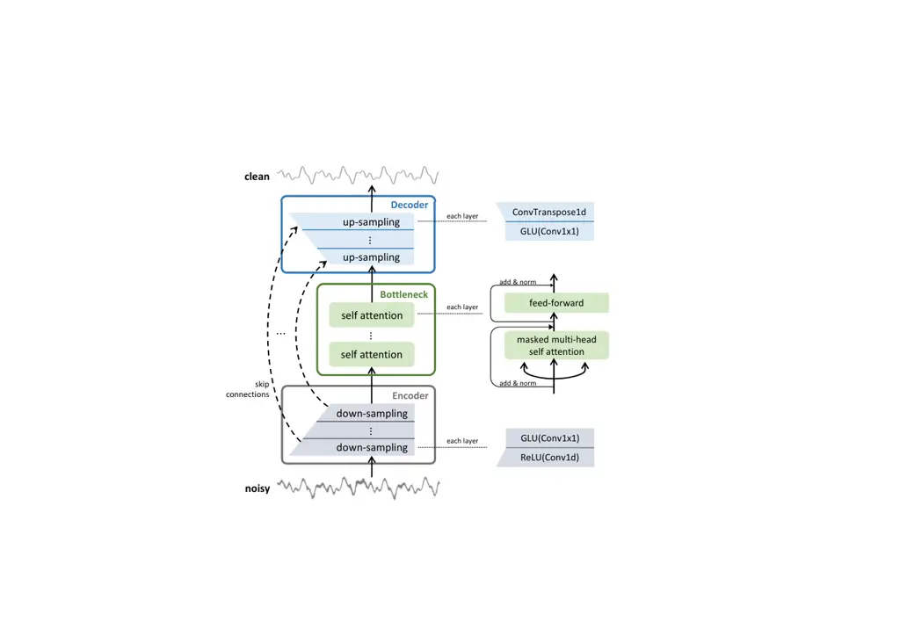

# Speech Denoising in the Waveform Domain with Self-Attention

Zhifeng Kong^(\*) ^(†)^(†)thanks: ^(\*)Work done during an internship at
NVIDIA.    Wei Ping^(†)    Ambrish Dantrey^(†)    Bryan Catanzaro^(†)

###### Abstract

In this work, we present CleanUNet, a causal speech denoising model on
the raw waveform. The proposed model is based on an encoder-decoder
architecture combined with several self-attention blocks to refine its
bottleneck representations, which is crucial to obtain good results. The
model is optimized through a set of losses defined over both waveform
and multi-resolution spectrograms. The proposed method outperforms the
state-of-the-art models in terms of denoised speech quality from various
objective and subjective evaluation metrics.  ¹¹ 1 Audio samples:
https://cleanunet.github.io/ We release our code and models at
https://github.com/nvidia/cleanunet.

###### Index Terms: 

Speech denoising, speech enhancement, raw waveform, U-Net,
self-attention

^(†)^(†)address: ^(‡)UCSD  ^(†)NVIDIA  
z4kong@eng.ucsd.edu, wping@nvidia.com

## 1 Introduction

Speech denoising \[1\] is the task of removing background noise from
recorded speech, while preserving the perceptual quality and
intelligibility of speech signals. It has important applications for
audio calls, teleconferencing, speech recognition, and hearing aids,
thus has been studied over several decades. Traditional signal
processing methods, such as spectral subtraction \[2\] and Wiener
filtering \[3\], are required to produce an estimate of noise spectra
and then the clean speech given the additive noise assumption. These
methods work well with stationary noise process, but may not generalize
well to non-stationary or structured noise types such as dogs barking,
baby crying, or traffic horn.

Neural networks have been introduced for speech enhancement since the
1980s \[4, 5\]. With the increased computation power, deep neural
networks (DNN) are often used, e.g., \[6, 7\]. Over the past years,
DNN-based methods for speech enhancement have obtained the
state-of-the-art results. The models are usually trained in the
supervised setting, where the models learn to predict the clean speech
signal given the input noise speech. These methods can be categorized
into time-frequency and waveform domain methods. A large body of works
are based on time-frequency representations (e.g., STFT) \[7, 8, 9, 10,
11, 12, 13, 14, 15, 16, 17, 18\]. They take the noisy spectral feature
(e.g., magnitude of spectrogram, complex spectrum) as the input, and
predict the spectral feature or certain mask for modulation of clean
speech (e.g., Ideal Ratio Mask \[19\]). Then, the waveform is
resynthesized given the predicted spectral feature with other extracted
information from the input noisy speech (e.g., phase). Another family of
speech denoising models directly predict the clean speech waveform from
the noisy waveform input \[20, 21, 22, 23, 24\]. In previous studies,
although the waveform methods are conceptually compelling and sometimes
preferred in subjective evaluation, they are still lagging behind the
time-frequency methods in terms of objective evaluations (e.g.,
PESQ \[25\]).

For waveform methods, there are two popular architecture backbones:
WaveNet \[26\] and U-Net \[27\]. WaveNet can be applied to process the
raw waveform \[21\] as in speech synthesis \[28\], or low-dimensional
embeddings for efficiency reason \[29\]. U-Net is an encoder-decoder
architecture with skip connections tailored for dense prediction, which
is particularly suitable for speech denoising \[20\]. To further improve
the denoising quality, different bottleneck layers between the encoder
and the decoder are introduced. Examples include dilated
convolutions \[30, 23\], stand-alone WaveNet \[22\], and LSTM \[24\]. In
addition, several works use the GAN loss to train their models \[20, 31,
23, 32\].

In this paper, we propose CleanUNet, a causal speech denoising model in
the waveform domain. Our model is built on a U-Net structure \[27\],
consisting of an encoder-decoder with skip connections and bottleneck
layers. In particular, we use masked self-attentions \[33\] to refine
the bottleneck representation, which is crucial to achieve the
state-of-the-art results. Both the encoder and decoder only use causal
convolutions, so the overall architectural latency of the model is
solely determined by the temporal resampling ratio between the original
time-domain waveform and the bottleneck representation (e.g., 16ms for
16kHz audio). We conduct a series of ablation studies on the
architecture and loss function, and demonstrate that our model
outperforms the state-of-the-art waveform methods in terms of various
evaluations.

## 2 Model

### 2.1 Problem Settings

The goal of this paper is to develop a model that can denoise speech
collected from a single channel microphone. The model is causal for
online streaming applications. Formally, let $`x_{\rm{noisy}}\in R^{T}`$
be the observed noisy speech waveform of length $`T`$. We assume the
noisy speech is a mixture of clean speech $`x`$ and background noise
$`x_{\rm{noise}}`$ of the same length:
$`x_{\rm{noisy}}=x+x_{\rm{noise}}`$. The goal is to obtain a denoiser
function $`f`$ such that (1) $`\hat{x}=f(x_{\rm{noisy}})\approx x`$, and
(2) $`f`$ is causal: the $`t`$-th element of the output $`\hat{x}_{t}`$
is only a function of previous observations $`x_{1:t}`$.

### 2.2 Architecture

We adopt a U-Net architecture \[27, 34\] for our model $`f`$. It
contains an encoder, a decoder, and a bottleneck between them. The
encoder and decoder have the same number of layers, and are connected
via skip connections (identity maps). We visualize the model
architecture in Fig. 1.

Encoder. The encoder has $`D`$ encoder layers, where $`D`$ is the depth
of the encoder. Each encoder layer is composed of a strided 1-d
convolution (Conv1d) followed by the rectified linear unit (ReLU) and an
1$`\times`$1 convolution (Conv1$`\times`$1) followed by the gated linear
unit (GLU), similar to \[24\]. The Conv1d down-samples the input in
length and increases the number of channels. The Conv1d in the first
layer outputs $`H`$ channels, where $`H`$ controls the capacity of the
model, and Conv1d’s in other layers double the number of channels. Each
Conv1d has kernel size $`K`$ and stride $`S=K/2`$. Each Conv1$`\times`$1
doubles the number of channels because GLU halves the channels. All 1-d
convolutions are causal.

Decoder. The decoder has $`D`$ decoder layers. Each decoder layer is
paired with the corresponding encoder layer in the reversed order; for
instance, the last decoder layer is paired with the first encoder layer.
Each pair of encoder and decoder layers are connected via a skip
connection. Each decoder layer is composed of a Conv1$`\times`$1
followed by GLU and a transposed 1-d convolution (ConvTranspose1d). The
ConvTranspose1d in each decoder layer is causal and has the same
hyper-parameters as the Conv1d in the paired encoder layer, except that
the number of input and output channels are reversed.

Bottleneck. The bottleneck is composed of $`N`$ self attention blocks
\[33\]. Each self attention block is composed of a multi-head self
attention layer and a position-wise fully connected layer. Each layer
has a skip connection around it followed by layer normalization. Each
multi-head self attention layer has 8 heads, model dimension 512, and
the attention map is masked to ensure causality. Each fully connected
layer has input channel size 512 and output channel size 2048.



Figure 1: Model architecture for CleanUNet. It is causal with noisy
waveform as input and clean speech waveform as output.

### 2.3 Loss Function

The loss function has two terms: the $`\ell_{1}`$ loss on waveform and
an STFT loss between clean speech $`x`$ and denoised speech
$`\hat{x}=f(x_{\rm{noisy}})`$. Let $`s(x;\theta)=|\mathrm{STFT}(x)|`$ be
the magnitude of the linear-scale spectrogram of $`x`$, where $`\theta`$
represents the hyperparameters of STFT including the hop size, the
window length, and the FFT bin. Then, we use multi-resolution
STFT \[35\] as our full-band STFT loss:

```math
\begin{array}[]{l}\displaystyle\mathrm{M\text{-}STFT}(x,\hat{x})=\\
~~~~~~\sum_{i=1}^{m}\left(\frac{\|s(x;\theta_{i})-s(\hat{x};\theta_{i})\|_{F}}{\|s(x;\theta_{i})\|_{F}}\right.+\left.\frac{1}{T}{\left\|\log\frac{s(x;\theta_{i})}{s(\hat{x};\theta_{i})}\right\|_{1}}\right),\end{array} \tag{1}
```

where $`m`$ is the number of resolutions and $`\theta_{i}`$ is the STFT
parameter for each resolution. Then, our loss function is
$`\frac{1}{2}\mathrm{M\text{-}STFT}(x,\hat{x})+\|x-\hat{x}\|_{1}`$.

In practice, we find the full-band $`\mathrm{M\text{-}STFT}`$ loss
sometimes leads to low-frequency noises on the silence part of denoised
speech, which deteriorates the human listening test. On the other hand,
if our model is trained with $`\ell_{1}`$ loss only, the silence part of
the output is clean, but the high-frequency bands are less accurate than
the model trained with the $`\mathrm{M\text{-}STFT}`$ loss. This
motivated us to define a high-band multi-resolution STFT loss. Let
$`{s}_{h}(x)`$ only contains the second half number of rows of
$`s(x)`$ (e.g., 4kHz to 8kHz range of the frequency bands for 16kHz
audio). Then, the high-band STFT loss
$`\mathrm{M\text{-}{STFT}}_{h}(x,\hat{x})`$ is defined by substituting
$`s(\cdot)`$ with $`{s}_{h}(\cdot)`$ in Eq. (1). Finally, the high-band
loss function is
$`\frac{1}{2}\mathrm{M\text{-}{STFT}}_{h}(x,\hat{x})+\|x-\hat{x}\|_{1}`$.

|                                        |           |       |       |      |       |       |       |      |      |      |
| -------------------------------------- | --------- | ----- | ----- | ---- | ----- | ----- | ----- | ---- | ---- | ---- |
| Model                                  | Domain    | PESQ  | PESQ  | STOI | pred. | pred. | pred. | MOS  | MOS  | MOS  |
|                                        |           | (WB)  | (NB)  | (%)  | CSIG  | CBAK  | COVRL | SIG  | BAK  | OVRL |
| Noisy dataset                          | -         | 1.585 | 2.164 | 91.6 | 3.190 | 2.533 | 2.353 | -    | -    | -    |
| DTLN \[17\]                            | Time-Freq | -     | 3.04  | 94.8 | -     | -     | -     | -    | -    | -    |
| PoCoNet \[18\]                         | Time-Freq | 2.745 | -     | -    | 4.080 | 3.040 | 3.422 | -    | -    | -    |
| FullSubNet \[16\]                      | Time-Freq | 2.897 | 3.374 | 96.4 | 4.278 | 3.644 | 3.607 | 3.97 | 3.72 | 3.75 |
| Conv-TasNet \[29\]                     | Waveform  | 2.73  | -     | -    | -     | -     | -     | -    | -    | -    |
| FAIR-denoiser \[24\]                   | Waveform  | 2.659 | 3.229 | 96.6 | 4.145 | 3.627 | 3.419 | 3.68 | 4.10 | 3.72 |
| CleanUNet ($`N=5`$, $`\ell_{1}`$+full) | Waveform  | 3.146 | 3.551 | 97.7 | 4.619 | 3.892 | 3.932 | 4.03 | 3.89 | 3.78 |
| CleanUNet ($`N=5`$, $`\ell_{1}`$+high) | Waveform  | 3.011 | 3.460 | 97.3 | 4.513 | 3.812 | 3.800 | 3.94 | 4.08 | 3.87 |

Table 1: Objective and subjective evaluation results for denoising on
the DNS no-reverb testset.

|                                        |          |       |       |      |       |       |       |
| -------------------------------------- | -------- | ----- | ----- | ---- | ----- | ----- | ----- |
| Model                                  | Domain   | PESQ  | PESQ  | STOI | pred. | pred. | pred. |
|                                        |          | (WB)  | (NB)  | (%)  | CSIG  | CBAK  | COVRL |
| Noisy dataset                          | -        | 1.943 | 2.553 | 92.7 | 3.185 | 2.475 | 2.536 |
| FAIR-denoiser \[24\]                   | Waveform | 2.835 | 3.329 | 95.3 | 4.269 | 3.377 | 3.571 |
| CleanUNet ($`N=3`$, $`\ell_{1}`$+full) | Waveform | 2.884 | 3.396 | 95.5 | 4.317 | 3.406 | 3.625 |
| CleanUNet ($`N=5`$, $`\ell_{1}`$+full) | Waveform | 2.905 | 3.408 | 95.6 | 4.338 | 3.422 | 3.645 |

Table 2: Objective evaluation results for denoising on the Valentini
test dataset.

|                                        |           |       |       |      |       |       |       |
| -------------------------------------- | --------- | ----- | ----- | ---- | ----- | ----- | ----- |
| Model                                  | Domain    | PESQ  | PESQ  | STOI | pred. | pred. | pred. |
|                                        |           | (WB)  | (NB)  | (%)  | CSIG  | CBAK  | COVRL |
| Noisy dataset                          | -         | 1.488 | 1.861 | 86.2 | 2.436 | 2.398 | 1.927 |
| FullSubNet \[16\]                      | Time-Freq | 2.442 | 2.908 | 92.0 | 3.650 | 3.369 | 3.046 |
| Conv-TasNet \[29\]                     | Waveform  | 1.927 | 2.349 | 92.2 | 2.869 | 2.004 | 2.388 |
| FAIR-denoiser \[24\]                   | Waveform  | 2.087 | 2.490 | 92.8 | 3.120 | 3.173 | 2.593 |
| CleanUNet ($`N=5`$, $`\ell_{1}`$+full) | Waveform  | 2.450 | 2.915 | 93.8 | 3.981 | 3.423 | 3.270 |
| CleanUNet ($`N=5`$, $`\ell_{1}`$+high) | Waveform  | 2.387 | 2.833 | 93.3 | 3.905 | 3.347 | 3.151 |

Table 3: Objective evaluation results for denoising on the internal test
dataset.

## 3 Experiment

We evaluate the proposed CleanUNet on three datasets: the Deep Noise
Suppression (DNS) dataset \[36\], the Valentini dataset \[37\], and an
internal dataset. We compare our model with the state-of-the-art (SOTA)
models in terms of various objective and subjective evaluations. The
results are summarized in Tables 1, 2, and 3. We also perform an
ablation study for the architecture design and loss function.

Data preparation: For each training data pair $`(x_{\rm{noisy}},x)`$, we
randomly take (aligned) $`L`$-second clips for both of them. We then
apply various data augmentation methods to these clips, which we will
specify for each dataset.

Architecture: The depth of the encoder or the decoder is $`D=8`$. Each
encoder/decoder layer has hidden dimension $`H=48`$ or $`64`$, stride
$`S=2`$, and kernel size $`K=4`$. The depth of the bottleneck is $`N=3`$
or $`5`$. Each self attention block has 8 heads, model dimension
$`=512`$, middle dimension $`=2048`$, no dropout and no positional
encoding.

Optimization: We use the Adam optimizer with momentum $`\beta_{1}=0.9`$
and denominator momentum $`\beta_{2}=0.999`$. We use the linear warmup
with cosine annealing learning rate schedule with maximum learning rate
$`=2\times 10^{-4}`$ and warmup ratio $`=5\%`$. We survey three kinds of
losses: (1) $`\ell_{1}`$ loss on waveform, (2) $`\ell_{1}`$ loss +
full-band STFT, (3) $`\ell_{1}`$ loss + high-band STFT described in
Section 2.3. All models are trained on 8 NVIDIA V100 GPUs.

Evaluation: We conduct both objective and subjective evaluations for
denoised speech. Objective evaluation methods include (1) Perceptual
Evaluation of Speech Quality (PESQ \[25\]), (2) Short-Time Objective
Intelligibility (STOI \[38\]), and (3) Mean Opinion Score (MOS)
prediction of the $`i`$) distortion of speech signal (SIG), $`ii`$)
intrusiveness of background noise (BAK), and $`iii`$) overall quality
(OVRL) \[39\]. For subjective evaluation, we perform a MOS test as
recommended in ITU-T P.835 \[40\]. We launched a crowd source evaluation
on Mechanical Turk. We randomly select 100 utterances from the test set,
and each utterance is scored by 15 workers along three axis: SIG, BAK,
and OVRL.

### 3.1 DNS

The DNS dataset \[36\] contains recordings of more than 10K speakers
reading 10K books with a sampling rate $`16`$kHz. We synthesize 500
hours of clean & noisy speech pairs with 31 SNR levels (-5 to 25 dB) to
create the training set \[36\]. We set the clip $`L=10`$. We then apply
the RevEcho augmentation \[24\] (which adds decaying echoes) to the
training data.

We compare the proposed CleanUNet with several SOTA models on DNS. By
default, FAIR-denoiser \[24\] only use $`\ell_{1}`$ waveform loss on DNS
dataset for better subjective evaluation. We use hidden dimension
$`H=64`$. We study both full and high-band STFT losses as described in
Section 2.3 with multi-resolution hop sizes in $`\{50,120,240\}`$,
window lengths in $`\{240,600,1200\}`$, and FFT bins in
$`\{512,1024,2048\}`$. We train the models for 1M iterations with a
batch size of $`16`$. We report the objective and subjective evaluations
on the no-reverb testset in Table 1. CleanUNet  outperforms all
baselines in objective evaluations. For MOS evaluations, it get the
highest SIG and OVRL, and slightly lower BAK.

Ablation Studies: We perform ablation study to investigate the
hyper-parameters and loss functions in our model. We survey $`N=3`$ or
$`5`$ self attention blocks in the bottleneck. We also survey different
combination of loss terms. The objective evaluation results are in Table 4. Full-band STFT loss and $`N=5`$ consistently outperforms the others
in terms of objective evaluations.

|       |                     |           |           |          |
| ----- | ------------------- | --------- | --------- | -------- |
| $`N`$ | loss                | PESQ (WB) | PESQ (NB) | STOI (%) |
| 3     | $`\ell_{1}`$        | 2.750     | 3.319     | 96.9     |
|       | $`\ell_{1}`$ + full | 3.128     | 3.539     | 97.6     |
|       | $`\ell_{1}`$ + high | 3.006     | 3.453     | 97.3     |
| 5     | $`\ell_{1}`$        | 2.797     | 3.362     | 97.0     |
|       | $`\ell_{1}`$ + full | 3.146     | 3.551     | 97.7     |
|       | $`\ell_{1}`$ + high | 3.011     | 3.460     | 97.3     |

Table 4: Objective evaluation results for the ablation study of
CleanUNet on the DNS no-reverb testset.

|               |       |       |     |       |       |      |
| ------------- | ----- | ----- | --- | ----- | ----- | ---- |
| Model         | $`D`$ | $`K`$ | RS  | PESQ  | PESQ  | STOI |
|               |       |       |     | (WB)  | (NB)  | (%)  |
| FAIR-denoiser | 5     | 8     | yes | 2.849 | 3.329 | 96.9 |
| CleanUNet     | 5     | 8     | yes | 3.024 | 3.459 | 97.3 |
| CleanUNet     | 4     | 8     | no  | 2.982 | 3.425 | 97.2 |
| CleanUNet     | 8     | 4     | no  | 3.146 | 3.551 | 97.7 |

Table 5: Objective evaluation results for the ablation study of
architecture on the DNS no-reverb testset. Stride is $`S=K/2`$. RS means
resampling using sinc interpolation \[41\]. All models downsample 16khz
audio 256$`\times`$ for bottleneck representation.

In order to show the importance of each component in CleanUNet, we
perform an ablation study by gradually replacing the components in
FAIR-denoiser \[24\] to our model in Table 5. First, we train
FAIR-denoiser with the full-band STFT loss. The architecture has $`D=5`$
(kernel size $`K=8`$ and stride $`S=4`$), a resampling layer (realized
by the sinc interpolation filter \[41\]), and LSTM as the bottleneck.
Next, we replace the LSTM with $`N=5`$ self attention blocks, which
leads to a boost of PESQ score from 2.849 to 3.024. We then remove the
sinc resampling operation and reduce the depth of the encoder/decoder to
$`D=4`$, which only has minor impact. Finally, we double the depth to
$`D=8`$ and reduce the kernel size to $`K=4`$ and stride to $`S=2`$,
which significantly improves the results. Note that all these models
produce the same length of bottleneck representation.

Inference Speed and Model Footprints: We compare the inference speed and
model footprints between the FAIR-denoiser and CleanUNet. We use hidden
dimension $`H=64`$ in all models. The inference speed is measured in
terms of the real time factor (RTF), which is the time required to
generate certain speech divided by the total time of the speech. We use
a batch-size of $`4`$ and length $`L=10`$ seconds under a sampling rate
16kHz. The results are reported in Table 6.

|                     |                        |           |
| ------------------- | ---------------------- | --------- |
| Model               | RTF                    | Footprint |
| FAIR-denoiser       | $`2.59\times 10^{-3}`$ | 33.53M    |
| CleanUNet ($`N=3`$) | $`3.19\times 10^{-3}`$ | 39.77M    |
| CleanUNet ($`N=5`$) | $`3.43\times 10^{-3}`$ | 46.07M    |

Table 6: Inference speed (RTF) and model footprints (#/ parameters) of
the FAIR-denoiser and CleanUNet. The algorithmic latency for all models
is 16ms for 16khz audio.

### 3.2 Valentini

The Valentini dataset \[37\] contains 28.4 hours of clean & noisy speech
pairs collected from 84 speakers with a sampling rate $`48`$kHz. There
are 4 SNR levels (0, 5, 10, and 15 dB). At each iteration, we randomly
select $`L`$ to be a real value between 1.33 and 1.5. We then apply the
Remix augmentation (which shuffles noises within a local batch) and the
BandMask augmentation \[24\] (which removes a fraction of frequencies)
to the training data. We compare our CleanUNet  with FAIR-denoiser
\[24\] as the baseline. In both models we use hidden dimension $`H=48`$
and the full-band STFT loss with the same setup as DNS dataset. We train
the models for 1M iterations with a batch size of $`64`$. We report the
objective evaluation results in Table 2. Our model consistently
outperforms FAIR-denoiser in all metrics.

### 3.3 Internal Dataset

We also conduct experiments on an challenging internal dataset. The
dataset contains 100 hours of clean & noisy speech with a sampling rate
$`48`$kHz. Each clean audio may contain speech from multiple speakers.
We use the same data preparation ($`L=10`$) and augmentation method as
the DNS dataset in Section 3.1.

We compare the proposed CleanUNet with FAIR-denoiser and FullSubNet on
this internal dataset. We set $`H=64`$, $`N=5`$, $`D=8`$, $`K=8`$,
$`S=2`$. We use full and high-band STFT losses with the same setup as
DNS dataset. We train the models for 1M iterations with a batch size of
$`16`$. We report the objective evaluation results in Table 3. Our model
consistently outperforms FullSubNet and FAIR-denoiser in all metrics.

## 4 Conclusion

In this paper, we introduce CleanUNet, a causal speech denoising model
in the waveform domain. Our model uses the U-Net like encoder-decoder as
the backbone, and relies on self-attention modules to refine its
bottleneck representation. We test our model on various datasets, and
show that it achieves the state-of-the-art performance in terms of
objective and subjective evaluation metrics in the speech denoising
task. We also conduct a series of ablation studies for architecture
design choices and different combinations of loss functions.

## References

- \[1\] Philipos C Loizou, Speech enhancement: theory and practice, CRC
  press, 2007.
- \[2\] Steven Boll, “Suppression of acoustic noise in speech using
  spectral subtraction,” IEEE Transactions on acoustics, speech, and
  signal processing, 1979.
- \[3\] Jae Soo Lim and Alan V Oppenheim, “Enhancement and bandwidth
  compression of noisy speech,” Proceedings of the IEEE, vol. 67, no.
  12, pp. 1586–1604, 1979.
- \[4\] Shinichi Tamura and Alex Waibel, “Noise reduction using
  connectionist models,” in ICASSP. IEEE, 1988.
- \[5\] Shahla Parveen and Phil Green, “Speech enhancement with missing
  data techniques using recurrent neural networks,” in ICASSP, 2004.
- \[6\] Xugang Lu et al., “Speech enhancement based on deep denoising
  autoencoder.,” in Interspeech, 2013.
- \[7\] Yong Xu et al., “A regression approach to speech enhancement
  based on deep neural networks,” IEEE/ACM Transactions on Audio,
  Speech, and Language Processing, 2014.
- \[8\] Meet Soni et al., “Time-frequency masking-based speech
  enhancement using generative adversarial network,” in ICASSP, 2018.
- \[9\] Szu-Wei Fu et al., “MetricGAN: Generative adversarial networks
  based black-box metric scores optimization for speech enhancement,” in
  ICML, 2019.
- \[10\] Szu-Wei Fu et al., “MetricGAN+: An improved version of
  metricgan for speech enhancement,” arXiv, 2021.
- \[11\] Yuxuan Wang and DeLiang Wang, “A deep neural network for
  time-domain signal reconstruction,” in ICASSP, 2015.
- \[12\] Felix Weninger et al., “Speech enhancement with lstm recurrent
  neural networks and its application to noise-robust asr,” in
  International conference on latent variable analysis and signal
  separation, 2015.
- \[13\] Aaron Nicolson and Kuldip K Paliwal, “Deep learning for minimum
  mean-square error approaches to speech enhancement,” Speech
  Communication, 2019.
- \[14\] Francois G Germain et al., “Speech denoising with deep feature
  losses,” arXiv, 2018.
- \[15\] Yong Xu et al., “Multi-objective learning and mask-based
  post-processing for deep neural network based speech enhancement,”
  arXiv, 2017.
- \[16\] Xiang Hao et al., “Fullsubnet: A full-band and sub-band fusion
  model for real-time single-channel speech enhancement,” in
  ICASSP, 2021.
- \[17\] Nils Westhausen and Bernd Meyer, “Dual-signal transformation
  lstm network for real-time noise suppression,” arXiv, 2020.
- \[18\] Umut Isik et al., “Poconet: Better speech enhancement with
  frequency-positional embeddings, semi-supervised conversational data,
  and biased loss,” arXiv, 2020.
- \[19\] Donald S Williamson et al., “Complex ratio masking for monaural
  speech separation,” IEEE/ACM transactions on audio, speech, and
  language processing, 2015.
- \[20\] Santiago Pascual et al., “Segan: Speech enhancement generative
  adversarial network,” arXiv, 2017.
- \[21\] Dario Rethage et al., “A wavenet for speech denoising,” in
  ICASSP, 2018.
- \[22\] Ashutosh Pandey and DeLiang Wang, “TCNN: Temporal convolutional
  neural network for real-time speech enhancement in the time domain,”
  in ICASSP, 2019.
- \[23\] Xiang Hao et al., “UNetGAN: A robust speech enhancement
  approach in time domain for extremely low signal-to-noise ratio
  condition,” in Interspeech, 2019.
- \[24\] Alexandre Defossez et al., “Real time speech enhancement in the
  waveform domain,” in Interspeech, 2020.
- \[25\] ITU-T Recommendation, “Perceptual evaluation of speech quality
  (pesq): An objective method for end-to-end speech quality assessment
  of narrow-band telephone networks and speech codecs,” Rec. ITU-T P.
  862, 2001.
- \[26\] Aaron van den Oord et al., “WaveNet: A generative model for raw
  audio,” arXiv, 2016.
- \[27\] Olaf Ronneberger et al., “U-Net: Convolutional networks for
  biomedical image segmentation,” in MICCAI, 2015.
- \[28\] Wei Ping, Kainan Peng, and Jitong Chen, “ClariNet: Parallel
  wave generation in end-to-end text-to-speech,” in ICLR, 2019.
- \[29\] Yi Luo and Nima Mesgarani, “Conv-tasnet: Surpassing ideal
  time–frequency magnitude masking for speech separation,” IEEE/ACM
  transactions on audio, speech, and language processing, 2019.
- \[30\] Daniel Stoller et al., “Wave-U-Net: A multi-scale neural
  network for end-to-end audio source separation,” arXiv, 2018.
- \[31\] Deepak Baby and Sarah Verhulst, “Sergan: Speech enhancement
  using relativistic generative adversarial networks with gradient
  penalty,” in ICASSP, 2019.
- \[32\] Huy Phan et al., “Improving gans for speech enhancement,” IEEE
  Signal Processing Letters, 2020.
- \[33\] Ashish Vaswani et al., “Attention is all you need,” in
  NIPS, 2017.
- \[34\] Olivier Petit et al., “U-Net Transformer: Self and cross
  attention for medical image segmentation,” in International Workshop
  on Machine Learning in Medical Imaging, 2021.
- \[35\] Ryuichi Yamamoto et al., “Parallel WaveGAN: A fast waveform
  generation model based on generative adversarial networks with
  multi-resolution spectrogram,” in ICASSP, 2020.
- \[36\] Chandan KA Reddy et al., “The interspeech 2020 deep noise
  suppression challenge: Datasets, subjective testing framework, and
  challenge results,” arXiv, 2020.
- \[37\] Cassia Valentini-Botinhao, “Noisy speech database for training
  speech enhancement algorithms and tts models,” 2017.
- \[38\] Cees H Taal et al., “An algorithm for intelligibility
  prediction of time–frequency weighted noisy speech,” IEEE Transactions
  on Audio, Speech, and Language Processing, 2011.
- \[39\] Yi Hu and Philipos C. Loizou, “Evaluation of objective quality
  measures for speech enhancement,” IEEE Transactions on Audio, Speech,
  and Language Processing, 2008.
- \[40\] ITUT, “Subjective test methodology for evaluating speech
  communication systems that include noise suppression algorithm,” ITU-T
  recommendation, 2003.
- \[41\] Julius Smith and Phil Gossett, “A flexible sampling-rate
  conversion method,” in ICASSP, 1984.
