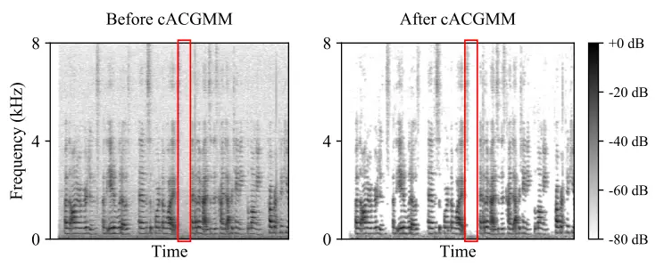

# Multi-Channel Speech Denoising for Machine Ears

Cong Han^(1,2∗), E. Merve Kaya¹, Kyle Hoefer¹, Malcolm Slaney^(1,3),
Simon Carlile¹ ^(†)^(†)thanks: \*˜Work done during an internship at X.
Current email: ch3212@columbia.edu

###### Abstract

This work describes a speech denoising system for machine ears that aims
to improve speech intelligibility and the overall listening experience
in noisy environments. We recorded approximately 100 hours of audio data
with reverberation and moderate environmental noise using a pair of
microphone arrays placed around each of the two ears and then mixed
sound recordings to simulate adverse acoustic scenes. Then, we trained a
multi-channel speech denoising network (MCSDN) on the mixture of
recordings. To improve the training, we employ an unsupervised method,
complex angular central Gaussian mixture model (cACGMM), to acquire
cleaner speech from noisy recordings to serve as the learning target. We
propose a MCSDN-Beamforming-MCSDN framework in the inference stage. The
results of the subjective evaluation show that the cACGMM improves the
training data, resulting in better noise reduction and user preference,
and the entire system improves the intelligibility and listening
experience in noisy situations.

^(†)^(†)address: ¹ X, Mountain View, CA, USA  
² Department of Electrical Engineering, Columbia University, NY, USA  
³ Google Research, Mountain View, CA, USA

Index Terms: speech denoising, hearing devices, beamformer

## 1 Introduction

Removing noise from speech signals is a good way to improve a user’s
experiences in noisy environments. New hardware allows for multiple
microphones near the ear and the processing power to learn from these
signals, which can deliver a better auditory experience. This work
describes a system for denoising speech signals captured by a pair of
microphone arrays near the ears under noisy conditions. We capitalize on
deep neural network (DNN) architectures for speech enhancement, along
with multi-channel beamforming.

DNN training requires a large quantity of realistic training data. For
speech enhancement, the labeled data is a pair of noisy and clean speech
signals. One can create arbitrary amounts of noisy data by adding
reverberation and noise; however there is still a mismatch between
simulated noisy mixtures and real-world audio due to the complex
acoustics of real environments. This could degrade the DNN’s performance
when it is applied to real-world data.

In this work we instead measured a large quantity of speech and noise
signals in a real room, and create mixtures from these recordings. This
is good for realism but also includes room tone. An important part of
this work is a method for preprocessing the recorded sound to remove
this background noise so that it can be used as ground truth. We
demonstrate improvements in noise reduction and listening preference due
to the preprocessing.

The rest of the paper is organized as follows. We review related work in
Section 2 and introduce our method in Section 3. We describe the
experiment configurations in Section 4, analyze the results in
Section 5, and conclude the paper in Section 6.

Figure 1: Overview of the speech denoising system. (A) The training
stage, and (B) the inference stage. Blue blocks denote the same
multi-channel speech denoising network. MVDR is a minimum variance
distortionless response beamformer.

## 2 Related work

Speech enhancement has been actively studied for decades \[1, 2, 3, 4\].
In recent years, deep neural networks have greatly advanced speech
enhancement using both supervised \[5, 6, 7\] and unsupervised methods
\[8, 9, 10, 11, 12\]. Supervised methods have achieved overwhelming
performance, but they require access to ground-truth signals, and thus
they can degrade on real recordings which are mismatched with the
simulated data used for training. Unsupervised methods overcome these
problems by requiring only the noisy speech signals.

A general category of unsupervised approaches utilizes spatial
information to cluster sound sources in space \[8, 9, 10, 11\]. The
posterior cluster labels can be used as masks to isolate the target
speech. An approach using the complex angular-central Gaussian mixture
model (cACGMM) \[9\] clusters the signals, and the resulting labels are
used as pseudo-target to train a deep clustering model \[13\].

This paper employs cACGMM to extract cleaner speech signals from the
recordings to serve as the training target. Our motivation is that we
can easily collect moderately noisy recordings without access to
ground-truth signals in real scenarios, which can be well processed by
the unsupervised clustering methods. Then, we mix several recordings
into a much noisier mixture and take advantage of supervised learning to
predict the clean speech signals from the mixture. The difference
compared to prior work is that we do not apply the clustering model to
the noisy mixture directly, because the clustering-based methods perform
poorly in challenging conditions where spatial features are smeared by
room reverberance and strong background noise, especially diffuse noise
with no distinct directional features.

Using a DNN to predict the masks that estimate the spatial covariance,
which steers the beamformer toward the target signal, is a popular
method to combine DNNs and conventional beamforming methods \[14, 15,
16\]. The linear beamformers effectively keep speech free of nonlinear
distortion, which is essential for good perceptual quality of speech in
communication. However, the linear beamformer cannot cancel all
interference, especially those close in space to the speech source. To
reduce the residual noise, the beamforming output can be filtered by the
mask used for beamforming \[14\] or can be processed by a new post
enhancement neural network \[17\] or even more iterations of neural
network and beamforming \[18\]. However, adding a new neural network
increases the size of the system, which is undesired for its deployment
on hardware with limited capacities, such as hearing aids. In this
paper, we employ the exact same multi-channel DNN to predict masks for
both the estimation of beamformer weights and post enhancement.

## 3 Method

Figure 1 shows an overview of the proposed method for training and
inference. During training we use cACGMM to generate a better target to
train a conventional multi-channel speech denoising network (MCSDN). In
inference, we first apply the pretrained MCSDN, beamforming, and the
same MCSDN sequentially. The final denoised signal is a weighted linear
combination of the second MCSDN output and the beamforming result.

### 3.1 Complex angular central Gaussian mixture model



Figure 2: The cACGMM extracts a cleaner speech (right) signal from the
recording (left) as the training target. The red rectangle highlights an
instance where the background noise is attenuated.

Give an M-channel recording
$`\bm{\mathrm{S}}\in\mathbb{R}^{M\times T\times F}`$ in the short-time
Fourier transform (STFT) domain, where $`T`$ and $`F`$ denote the time
frame and frequency bin, respectively, we use the complex angular
central Gaussian mixture model (cACGMM) \[19\] to isolate the speech
source $`\hat{\bm{\mathrm{S}}}\in\mathbb{R}^{M\times T\times F}`$ and
remove noisy sources from unwanted directions. cACGMM models the
directional observations
$`\bm{\mathrm{Z}}_{t,f}=\frac{\bm{\mathrm{S}}_{t,f}}{||\bm{\mathrm{S}}_{t,f}||}`$
with a Gaussian mixture model,

```math
\displaystyle p(\bm{\mathrm{Z}}_{t,f};\Theta_{f})=\sum_{k=1}^{K}{\alpha^{k}_{f}\mathcal{A}(\bm{\mathrm{Z}}_{t,f};\bm{\mathrm{B}}_{f}^{k})}, \tag{1}
```

where $`\Theta_{f}=\{\alpha^{k}_{f},\bm{\mathrm{B}}_{f}^{k}\forall k\}`$
denotes the model parameters, $`\{\alpha^{k}_{f}\forall k\}`$ is a set
of $`k`$ mixture weights, which are probabilities that sum to 1.
$`\mathcal{A}(\bm{\mathrm{s}}_{t,f};\bm{\mathrm{B}}_{f}^{k})`$, a
complex angular central Gaussian distribution (cACG) \[20\], models the
distribution of $`\bm{\mathrm{Z}}_{t,f}`$ for the component $`k`$ in the
mixture model as follows:

```math
\displaystyle\mathcal{A}(\bm{\mathrm{Z}}_{t,f};\bm{\mathrm{B}}_{f}^{k})=\frac{(M-1)!}{2\pi^{M}\text{det}(\bm{\mathrm{B}}_{f}^{k})}\frac{1}{(\bm{\mathrm{Z}}_{t,f}^{H}(\bm{\mathrm{B}}_{f}^{k})^{-1}\bm{\mathrm{Z}}_{t,f})^{M}}. \tag{2}
```

We estimate the parameters $`\Theta_{f}`$ with the
expectation-maximization (EM) algorithm. The posterior probability of
$`\bm{\mathrm{Z}}_{t,f}`$ belonging to class k is:

```math
\displaystyle\Gamma_{t,f}^{k}=\frac{\alpha^{k}_{f}\mathcal{A}(\bm{\mathrm{Z}}_{t,f};\bm{\mathrm{B}}_{f}^{k})}{\sum_{k=1}^{K}{\alpha^{k}_{f}\mathcal{A}(\bm{\mathrm{Z}}_{t,f};\bm{\mathrm{B}}_{f}^{k})}}. \tag{3}
```

Since cACGMM models each frequency independently, there can be a
frequency permutation problem \[21\], i.e., the same index $`k`$ in
different frequency bins point to different sources. This problem is
addressed by permutation alignment \[21\]. Finally, we use
$`\Gamma^{s}`$ as the mask to extract speech,

```math
\displaystyle\hat{\bm{\mathrm{S}}}=\bm{\mathrm{S}}\odot\Gamma^{s}, \tag{4}
```

where the superscript s indicates the speech, and $`\odot`$ denotes
element-wise multiplication.

### 3.2 MCSDN-Beamforming-MCSDN framework

We train a multi-channel speech denoising network (MCSDN) based on the
temporal convolutional network (TCN) \[22\] in Conv-TasNet \[23\] to
predict a time-frequency mask
$`\bm{\mathrm{M}}^{s}\in\mathbb{R}^{T\times F}`$ for the target
$`\hat{\bm{\mathrm{S}}}`$ from the multi-channel noisy signal
$`\bm{\mathrm{Y}}\in\mathbb{C}^{M\times T\times F}`$. In order to
exploit both the spectro-temporal and spatial information, we
concatenate the log power spectrogram of the reference channel signal
and inter-channel phase differences (IPDs) between the reference channel
and other channels as input features, since IPDs indicate which
$`T`$-$`F`$ bins belong to the same directional source in each frequency
band. Specifically, we calculate sin(IPD) and cos(IPD) as inter-channel
features \[24, 25\]. The training objective is defined as:

```math
\displaystyle\mathcal{L}=|\bm{\mathrm{Y}}\odot\bm{\mathrm{M}}^{s}-\bm{\mathrm{\hat{S}}}|. \tag{5}
```

We use the estimated mask $`\bm{\mathrm{M}}^{s}`$ from the MCSDN for
mask-based beamforming. We employ minimum variance distortionless
response (MVDR) beamforming \[26\], which is optimized with a constraint
that minimizes the power of the noise without distorting the target
speech. One solution is:

```math
\displaystyle\bm{\mathrm{w}}_{f}=\frac{(\bm{\mathrm{\Phi}}_{f}^{n})^{-1}\bm{\mathrm{\Phi}}_{f}^{s}}{\text{Trace}({(\bm{\mathrm{\Phi}}_{f}^{n})^{-1}\bm{\mathrm{\Phi}}_{f}^{s}})}\bm{\mathrm{u}}, \tag{6}
```

where $`\bm{\mathrm{\Phi}}_{f}^{n}`$ and $`\bm{\mathrm{\Phi}}_{f}^{s}`$
are the covariance matrices of the speech and noise, respectively:

```math
\displaystyle\bm{\mathrm{\Phi}}_{f}^{s}=\frac{1}{\sum_{t}{\bm{\mathrm{M}}_{t,f}^{s}}}\sum_{t}{\bm{\mathrm{M}}_{t,f}^{s}}\bm{\mathrm{Y}}_{t,f}\bm{\mathrm{Y}}_{t,f}^{H}, \tag{7}
```

```math
\displaystyle\bm{\mathrm{\Phi}}_{f}^{n}=\frac{1}{\sum_{t}{(1-\bm{\mathrm{M}}_{t,f}^{s})}}\sum_{t}{(1-\bm{\mathrm{M}}_{t,f}^{s})}\bm{\mathrm{Y}}_{t,f}\bm{\mathrm{Y}}_{t,f}^{H}, \tag{8}
```

and $`\bm{\mathrm{u}}`$ is a one-hot vector indicating the reference
channel. H denotes conjugate transposition. Then, the linear filter
$`\bm{\mathrm{w}}_{f}\in\mathbb{C}^{M}`$ is applied to
$`\bm{\mathrm{Y}}_{t,f}\in\mathbb{C}^{M}`$ to generate the beamforming
output $`\bm{\mathrm{BF}}_{t,f}`$:

```math
\displaystyle\bm{\mathrm{BF}}_{t,f}=\bm{\mathrm{w}}_{f}^{H}\bm{\mathrm{Y}}_{t,f}. \tag{9}
```

Next, we use the trained MCSDN to denoise the beamforming output. To
extend the single-channel beamforming output to a multi-channel one,
$`\bm{\mathrm{BF}}\in\mathbb{C}^{M\times T\times F}`$, we stack the
beamforming output on each channel
$`[\bm{\mathrm{BF}}_{1},\bm{\mathrm{BF}}_{2},\dots,\bm{\mathrm{BF}}_{m}]`$
by shifting the one-hot vector $`\bm{\mathrm{u}}`$ in Equation 6 without
introducing any new computation. Finally, the MCSDN takes
$`\bm{\mathrm{BF}}`$ as input and estimates a speech mask
$`\hat{\bm{\mathrm{M}}}^{s}\in\mathbb{R}^{T\times F}`$ to further
denoise the beamforming output:

```math
\displaystyle\overline{\bm{\mathrm{S}}}=\hat{\bm{\mathrm{M}}}^{s}\odot\bm{\mathrm{BF}}. \tag{10}
```

We can view the pipeline in this way: the first time-frequency mask
$`\bm{\mathrm{M}}^{s}`$ is for mask-based beamforming that results in a
less noisy mixture, then the second mask $`\hat{\bm{\mathrm{M}}}^{s}`$
is to extract the speech from the less noisy signal. However, using the
spectral mask estimated by neural networks to extract speech will
inevitably cause non-linear speech distortion, which is undesirable for
human listeners. We balance the noise reduction and speech distortion by
mixing the beamforming output and the neural network output using a gate
$`\alpha\in[0,1]`$,

```math
\displaystyle\widetilde{\bm{\mathrm{S}}}=\alpha\cdot\bm{\mathrm{BF}}+(1-\alpha)\cdot\overline{\bm{\mathrm{S}}}. \tag{11}
```

## 4 Experiment configurations

Figure 3: Subjective evaluation results shown as boxplots. Pseudo-target
(from cACGMM) is the training target of MCSDN. The red line represents
the median (all the ratings are discrete numbers from 1 to 5, so the
median is discrete). The number in white denotes the mean.

### 4.1 Data collection

We recorded a collection of in-room speech and ambient sound samples to
be used to generate sound mixtures. Each sample captures the real room
acoustics, including reverb and background noise. The recording room has
the dimensions 7.5 (length) x 3.5 (width) x 3 (height) meters (T60
$`\approx 0.37s`$). A Bruel and Kjaer Type 4128-C Head and Torso
Simulator (HATS) is placed in the center of the room on a motorized
turntable, which sits atop a wooden table that spans the majority of the
room length-wise. For this experiment, we used two proprietary arrays of
16 microphones, one placed around each of the two ears. Surrounding the
HATS are six Genelec 8020D 4” powered studio monitors for audio source
playback. All speakers face towards the HATS. The speakers are placed at
azimuth values ranging from 0 to 360°, and the distance from the HATS
and elevation from the ground values ranges among 1, 2, or 3 meters.
Once placed, the speaker locations are fixed and do not change for the
given room.

Playback source data consists of the sound clips from FSD50K \[27\]
($`\sim`$50h and 11h from training and test sets) and LibriSpeech \[28\]
($`\sim`$40h and 11h from training and test sets). We resampled the
playback data to 48 kHz, and pre-processsed to trim silence from the
beginning and end of each clip. We manually normalized the ound clips so
that the clip’s db SPL at the speaker is as close as possible to a
real-world example for that sound class. The target db SPL values for
each sound class have a random variance of $`\pm 5`$ db SPL. We played
each sound clip through a speaker assigned at random, and recorded
through the microphone arrays at 48 kHz with 32-bit floating point
precision.

### 4.2 Acoustic scene generation

For the training and development sets, we generated 12,000 and 4,000
9-second mixtures, respectively. For each mixture, we randomly draw one
speech recording and three distractor recordings from the in-room
recordings and mix them to simulate challenging environments. We
excluded the following broad class labels from FSD50K: speech, alarm,
domestic animal sounds, domestic sounds (faucet, cutlery, drawers,
etc.). A clip of ambient noise recorded in the room without loudspeakers
playing is also added into the mixture. The overall SNR of the mixture
with respect to the speech recording varies between -3 dB and -30 dB. We
resampled mixtures to 16 kHz.

### 4.3 Networks

We adopt the TCN module in Conv-TasNet\[23\] with STFT as the encoder,
iSTFT as the decoder, and use 4 repeated stacks each having 6 1-D
convolutional blocks in the masking network. STFTs are computed with a
window size of 32 ms and a hop size of 8 ms. The effective receptive
field of the model is approximately 4 s. For computational efficiency,
only 8 of the channels (4 from each array) were used to train the MCSDN.

### 4.4 Evaluation

We performed two subjective evaluations: one to measure the listening
improvement, and the second to evaluate the importance of cACGMM in the
training. We recruited 60 self-reported normal-hearing subjects who are
native English speakers to participate in a listening test on Amazon
Mechanical Turk \[29\]. Subjects were instructed to wear headphones or
earphones during the test.

The test is a simplified version of multiple stimuli with hidden
reference and anchor (MUSHRA) \[30\]. We use 10 sets of male speaker
samples and 10 sets of female speaker samples for the test. When
evaluating each set of sounds, the subjects are instructed to listen to
a 9-second unprocessed noisy speech sample first, and then listen to and
rate the processed speech without knowing which algorithm had been
applied. The processed speech came from 1) MCSDN, 2) MCSDN-Beamforming
(mask-based MVDR beamforming), 3) MCSDN-Beamforming-MCSDN, 4) the
re-mixed one with 20% from the beamforming and 80% from the second
MCSDN, and 5) the target speech signal from cACGMM as shown in
Equation 4. The subjects rate each processed speech sample on a scale
with the following labels: bad (1), poor (2), fair (3), good (4), and
excellent (5) on the following four aspects:

1.  (a)
    Intelligibility: How well can you recognize what the speaker is
    saying?
2.  (b)
    Noise reduction level: How much of the noise is removed compared to
    the unprocessed speech?
3.  (c)
    Free of distortion: How distortionless is the speech signal?
4.  (d)
    Listening improvement: How much the processed signal improves
    listening compared to the unprocessed one, e.g., how much would you
    like to use such a device to help them improve listening?

Similar to MUSHRA, we used the speech signals from cACGMM as a hidden
reference that were used to disqualify subjects who gave
low-intelligibility and noise-reduction scores. Because the hidden
reference signals were processed from individual recordings, they
contained almost no noise and should have good intelligibility scores.
Then, the ratings for a set of signals from a subject were disqualified
and dropped if the sum of intelligibility and noise reduction scores for
the hidden reference is lower than the bottom 15% of this summation from
all subjects.

The setup for the second (cACGMM) experiment was similar to the first
experiment. We provided two re-mix models with the MCSDNs trained with
and without cACGMM, respectively, and asked the subjects to rate them
for noise reduction and listening improvement.

Figure 4: Comparison between the re-mix model using DNNs trained with
cACGMM and without cACGMM.

## 5 Results and discussions

Figure 3 compares different models in terms of the factors described
above. First, all models improve the average intelligibility score over
the unprocessed mixture. We notice some subjects gave high
intelligibility scores to some of the unprocessed signals even when they
had low SNRs. We think this is because humans can attend to a source in
the presence of multiple distracting stimuli thanks to the cocktail
party effect \[31\], thus they may focus on and exert themselves to
understand the target speech. But overall, the strong background noise
makes the speech much less intelligible. While the MCSDN has a high
score for noise reduction due to the power of nonlinear models, it can
cause speech distortion. If the mixture is too noisy, the model may also
filter out speech components when it removes the noise. Therefore, the
MCSDN only provides a slight intelligibility improvement and poor
listening improvement.

The MVDR beamformer uses linear filters to avoid distortion, which
sacrifices the ability to cancel some noise. So, it has a lower
noise-reduction score but a higher “free of distortion” score. The
intelligibility and listening improvement are better than those for
MCSDN.

The second MCSDN, following the beamformer, reduces the residual noise
noticeably but still lifts speech distortion slightly. It does not
affect intelligibility and achieves slightly better listening
improvement than beamforming. All metrics at the output of the second
MCSDN are significantly better than the first MCSDN.

When 20% of the beamforming output and 80% of the second MCSDN output
are mixed as a new signal, we see it improves the intelligibility score
over other models and achieves the best listening improvement. Some
subjects mentioned they felt comfortable when the sound contained a
little background noise. One explanation is that it is more realistic
than over-denoised sound. Moreover, the beamforming output can mask the
distorted components introduced by the neural networks.

The cACGMM target output achieves the highest mean scores in all
aspects. This is expected because it is processed from moderately noisy
recordings while the models’ outputs are processed from much noisier
mixtures. Here, cACGMM is shown to be able to produce good quality
signals to serve as the training target for MCSDN. More than 75% of the
intelligibility, noise reduction, and overall listening improvement
scores have a rating of at least 4. We notice the score for “free of
distortion” is lower, perhaps because cACGMM estimates a probabilistic
time-frequency mask through spatial clustering, which may introduce
nonlinear distortion.

Figure 4 compares the output of the full re-mix model when the DNNs are
trained with and without the cACGMM. We see the model trained using the
cleaner target speech provided by cACGMM results in better noise
reduction and thus better listening improvement. This demonstrates that
cACGMM can help improve the quality of training data coming from real
recordings.

## 6 Conclusion

This paper investigates a speech denoising system using real recording
data to mitigate the data mismatch problem. For training, we mixed
individual recordings with reverberation and moderate noise into a
mixture with multiple distractors. Instead of using speech recordings as
the learning target, we applied cACGMM on individual recordings to
extract clean speech signals to serve as the target for learning, which
significantly improve the training dataset. For inference, we propose an
MCSDN-Beamforming-MCSDN framework to take advantage of multiple
microphones and balance the speech distortion and noise reduction.
Subjective evaluation experiments show that this speech denoising system
reduces background noise, improves speech intelligibility, and thus
improves human listening. Future work includes alleviating the
performance degradation from strong reverberation and tailoring the
model to fit into hearing aids with low power resources.

## References

- \[1\] S. Boll, “Suppression of acoustic noise in speech using spectral
  subtraction,” _IEEE Transactions on Acoustics, Speech, and Signal
  Processing_, vol. 27, no. 2, pp. 113–120, 1979.
- \[2\] Y. Ephraim and D. Malah, “Speech enhancement using a
  minimum-mean square error short-time spectral amplitude estimator,”
  _IEEE Transactions on Acoustics, Speech, and Signal Processing_,
  vol. 32, no. 6, pp. 1109–1121, 1984.
- \[3\] I. Cohen and B. Berdugo, “Speech enhancement for non-stationary
  noise environments,” _Signal Processing_, vol. 81, no. 11, pp.
  2403–2418, 2001.
- \[4\] S. Gannot, D. Burshtein, and E. Weinstein, “Signal enhancement
  using beamforming and nonstationarity with applications to speech,”
  _IEEE Transactions on Signal Processing_, vol. 49, no. 8, pp.
  1614–1626, 2001.
- \[5\] Y. Xu, J. Du, L.-R. Dai, and C.-H. Lee, “An experimental study
  on speech enhancement based on deep neural networks,” _IEEE Signal
  Processing Letters_, vol. 21, no. 1, pp. 65–68, 2013.
- \[6\] F. Weninger, H. Erdogan, S. Watanabe, E. Vincent, J. Le Roux,
  J. R. Hershey, and B. Schuller, “Speech enhancement with LSTM
  recurrent neural networks and its application to noise-robust ASR,” in
  _International Conference on Latent Variable Analysis and Signal
  Separation_. Springer, 2015, pp. 91–99.
- \[7\] K. Tan and D. Wang, “A convolutional recurrent neural network
  for real-time speech enhancement.” in _Interspeech_, 2018, pp.
  3229–3233.
- \[8\] P. Seetharaman, G. Wichern, J. Le Roux, and B. Pardo,
  “Bootstrapping single-channel source separation via unsupervised
  spatial clustering on stereo mixtures,” in _2019 IEEE International
  Conference on Acoustics, Speech and Signal Processing (ICASSP)_. IEEE,
  2019, pp. 356–360.
- \[9\] L. Drude, D. Hasenklever, and R. Haeb-Umbach, “Unsupervised
  training of a deep clustering model for multichannel blind source
  separation,” in _2019 IEEE International Conference on Acoustics,
  Speech and Signal Processing (ICASSP)_. IEEE, 2019, pp. 695–699.
- \[10\] M. Togami, Y. Masuyama, T. Komatsu, and Y. Nakagome,
  “Unsupervised training for deep speech source separation with
  kullback-leibler divergence based probabilistic loss function,” in
  _2020 IEEE International Conference on Acoustics, Speech and Signal
  Processing (ICASSP)_. IEEE, 2020, pp. 56–60.
- \[11\] Y. Nakagome, M. Togami, T. Ogawa, and T. Kobayashi,
  “Mentoring-reverse mentoring for unsupervised multi-channel speech
  source separation.” in _Interspeech_, 2020, pp. 86–90.
- \[12\] S. Wisdom, E. Tzinis, H. Erdogan, R. J. Weiss, K. W. Wilson,
  and J. R. Hershey, “Unsupervised sound separation using mixture
  invariant training,” in _Advances in Neural Information Processing
  Systems (NeurIPS)_, 2020.
- \[13\] J. R. Hershey, Z. Chen, J. Le Roux, and S. Watanabe, “Deep
  clustering: Discriminative embeddings for segmentation and
  separation,” in _2016 IEEE International Conference on Acoustics,
  Speech and Signal Processing (ICASSP)_. IEEE, 2016, pp. 31–35.
- \[14\] H. Erdogan, J. R. Hershey, S. Watanabe, M. I. Mandel, and
  J. Le Roux, “Improved MVDR beamforming using single-channel mask
  prediction networks.” in _Interspeech_, 2016, pp. 1981–1985.
- \[15\] T. Nakatani, N. Ito, T. Higuchi, S. Araki, and K. Kinoshita,
  “Integrating DNN-based and spatial clustering-based mask estimation
  for robust MVDR beamforming,” in _2017 IEEE International Conference
  on Acoustics, Speech and Signal Processing (ICASSP)_. IEEE, 2017, pp.
  286–290.
- \[16\] T. Ochiai, M. Delcroix, R. Ikeshita, K. Kinoshita, T. Nakatani,
  and S. Araki, “Beam-TasNet: Time-domain audio separation network meets
  frequency-domain beamformer,” in _2020 IEEE International Conference
  on Acoustics, Speech and Signal Processing (ICASSP)_. IEEE, 2020, pp.
  6384–6388.
- \[17\] Z.-Q. Wang, P. Wang, and D. Wang, “Multi-microphone complex
  spectral mapping for utterance-wise and continuous speech separation,”
  _IEEE/ACM Transactions on Audio, Speech, and Language
  Processing_, 2021.
- \[18\] Z.-Q. Wang, H. Erdogan, S. Wisdom, K. Wilson, D. Raj,
  S. Watanabe, Z. Chen, and J. R. Hershey, “Sequential multi-frame
  neural beamforming for speech separation and enhancement,” in _2021
  IEEE Spoken Language Technology Workshop (SLT)_. IEEE, 2021, pp.
  905–911.
- \[19\] N. Ito, S. Araki, and T. Nakatani, “Complex angular central
  gaussian mixture model for directional statistics in mask-based
  microphone array signal processing,” in _2016 24th European Signal
  Processing Conference (EUSIPCO)_. IEEE, 2016, pp. 1153–1157.
- \[20\] J. T. Kent, “Data analysis for shapes and images,” _Journal of
  Statistical Planning and Inference_, vol. 57, no. 2, pp.
  181–193, 1997.
- \[21\] H. Sawada, S. Araki, and S. Makino, “Measuring dependence of
  bin-wise separated signals for permutation alignment in
  frequency-domain bss,” in _2007 IEEE International Symposium on
  Circuits and Systems_. IEEE, 2007, pp. 3247–3250.
- \[22\] S. Bai, J. Z. Kolter, and V. Koltun, “An empirical evaluation
  of generic convolutional and recurrent networks for sequence
  modeling,” _arXiv preprint arXiv:1803.01271_, 2018.
- \[23\] Y. Luo and N. Mesgarani, “Conv-TasNet: Surpassing ideal
  time–frequency magnitude masking for speech separation,” _IEEE/ACM
  Transactions on Audio, Speech, and Language Processing_, vol. 27,
  no. 8, pp. 1256–1266, 2019.
- \[24\] Z.-Q. Wang, J. Le Roux, and J. R. Hershey, “Multi-channel deep
  clustering: Discriminative spectral and spatial embeddings for
  speaker-independent speech separation,” in _2018 IEEE International
  Conference on Acoustics, Speech and Signal Processing (ICASSP)_. IEEE,
  2018, pp. 1–5.
- \[25\] C. Han, Y. Luo, and N. Mesgarani, “Real-time binaural speech
  separation with preserved spatial cues,” in _2020 IEEE International
  Conference on Acoustics, Speech and Signal Processing (ICASSP)_. IEEE,
  2020, pp. 6404–6408.
- \[26\] M. Souden, J. Benesty, and S. Affes, “On optimal
  frequency-domain multichannel linear filtering for noise reduction,”
  _IEEE Transactions on Audio, Speech, and Language Processing_,
  vol. 18, no. 2, pp. 260–276, 2009.
- \[27\] E. Fonseca, X. Favory, J. Pons, F. Font, and X. Serra,
  “FSD50K,” Oct. 2020. \[Online\]. Available:
  [https://doi.org/10.5281/zenodo.4060432](https://doi.org/10.5281/zenodo.4060432)
- \[28\] V. Panayotov, G. Chen, D. Povey, and S. Khudanpur,
  “LibriSpeech: An ASR corpus based on public domain audio books,” in
  _2015 IEEE International Conference on Acoustics, Speech and Signal
  Processing (ICASSP)_, 2015, pp. 5206–5210.
- \[29\] G. Paolacci, J. Chandler, and P. G. Ipeirotis, “Running
  experiments on Amazon Mechanical Turk,” _Judgment and Decision
  Making_, vol. 5, no. 5, pp. 411–419, 2010.
- \[30\] B. Series, “Method for the subjective assessment of
  intermediate quality level of audio systems,” _International
  Telecommunication Union Radiocommunication Assembly_, 2014.
- \[31\] E. C. Cherry, “Some experiments on the recognition of speech,
  with one and with two ears,” _The Journal of the Acoustical Society of
  America_, vol. 25, no. 5, pp. 975–979, 1953.
