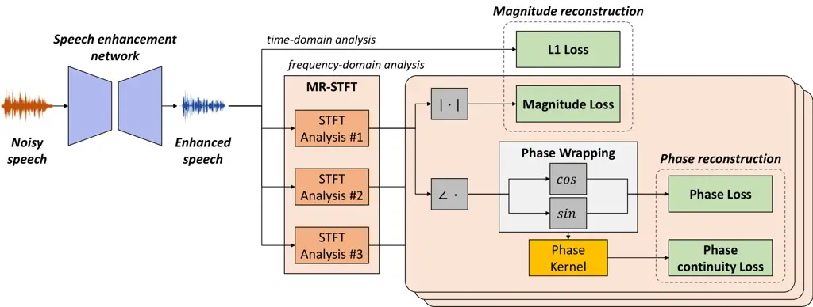

# Phase continuity: Learning derivatives of phase spectrum for Speech enhancement

Doyeon Kim    Hyewon Han    Hyeon-Kyeong Shin    Soo-Whan Chung   
Hong-Goo Kang

###### Abstract

Modern neural speech enhancement models usually include various forms of
phase information in their training loss terms, either explicitly or
implicitly. However, these loss terms are typically designed to reduce
the distortion of phase spectrum values at specific frequencies, which
ensures they do not significantly affect the quality of the enhanced
speech. In this paper, we propose an effective phase reconstruction
strategy for neural speech enhancement that can operate in noisy
environments. Specifically, we introduce a phase continuity loss that
considers relative phase variations across the time and frequency axes.
By including this phase continuity loss in a state-of-the-art neural
speech enhancement system trained with reconstruction loss and a number
of magnitude spectral losses, we show that our proposed method further
improves the quality of enhanced speech signals over the baseline,
especially when training is done jointly with a magnitude spectrum loss.

###### Index Terms: 

speech enhancement, denoising, phase reconstruction, phase continuity
loss

^(†)^(†)address: ¹Dept. Electrical and Electronic Engineering, Yonsei
University, South Korea

²Naver Corporation, South Korea

## 1 Introduction

In many voice communication and voice-controlled interface systems,
target speech signals are often distorted by background noise, resulting
in uncomfortable communication and loss of intelligibility. Many works
have solved this problem by developing de-noising methods based on
rigorous signal processing and deep learning techniques.

Conventionally, speech enhancement has been performed in the magnitude
spectrum domain because of the assumption phase components are difficult
to estimate in noisy environments. However, enhancing only the magnitude
spectrum has the limitation of reusing the distorted phase for speech
reconstruction. Recently, attention has been focused on incorporating
spectral phase components to improve the performance of various
speech-related tasks, such as improving speech intelligibility \[1\] and
speech recognition \[2, 3\]. Estimating phase information is challenging
because there are no explicit ways to model the statistics of phase
distortions caused by environmental factors. Recent deep learning based
studies have attempted to estimate phase information indirectly by
minimizing the distance between the target and the estimated signals in
the complex spectrum or waveform domain \[4, 5\]. However, these methods
tend to put more weight on magnitude estimation rather than considering
the phase information, which limits the role of the phase terms in the
waveform reconstruction process. To improve reconstruction performance,
several studies \[6, 7\] introduced additional phase loss terms during
training to minimize the differences of wrapped phases between the
target and output signals or construct another phase estimation
network \[8\] to estimate the phase spectrum.

In this paper, we propose a novel training strategy for speech
enhancement that considers the trajectory of phase components on both
the time and frequency axes. Unlike most conventional phase estimation
methods that focus on instantaneous phase differences at each frequency
bin, our proposed phase continuity loss considers phase variations in
neighboring time frames and frequency bins. To the best of our
knowledge, this is the first method that uses a training criterion that
utilizes both the time and frequency trajectories of the phase spectrum.
The rationale behind our idea is as follows. To improve the perceptual
quality of enhanced speech signals, it is important to reconstruct
voiced segments reliably, where phase continuity is a critical
characteristic \[9\]. Because the fundamental frequency and its
harmonics may vary in consecutive analysis frames due to the dynamic
nature of voicing, we consider phase differences between nearby time
frames and frequency bins. Considering the trade-off relationship
between time and frequency resolutions, we also apply the proposed phase
continuity loss to a number of phase spectra obtained by multi-spectral
analysis techniques \[10\]. To verify the effectiveness of our strategy,
we add our phase continuity loss into the training of a state-of-the-art
speech enhancement network \[11\] that used magnitude spectrum loss.
Experimental results show that this improves the enhancement performance
of the model when jointly used along with magnitude spectrum loss.

The remainder of the paper is organized as follows. Section 2 describes
several neural speech enhancement methods that utilize phase
information. We explain the learning strategy for the proposed method in
Section 3, demonstrate the effectiveness in Section 4, and draw
conclusions in Section 5.

## 2 Related Works

Phase reconstruction in speech enhancement is a challenging but
important task to improve perceptual quality and intelligibility \[1,
12, 13\]. Recent deep learning techniques have accelerated phase-aware
speech enhancement approaches by targeting the task of phase value
estimation. The phase-sensitive mask (PSM) \[4\] and complex ideal ratio
mask (cIRM) \[14, 15\] are two such examples. However, because these
methods reconstruct phase terms with the magnitude spectrum, they have
the potential problem of learning phase information with imperfect
context information. To include phase distortion explicitly in the
training objectives, \[6\] defines a phase loss using sinusoidal
functions as follows:

```math
\mathcal{L}_{p}=\|\cos{\theta_{\mathrm{diff}}}-\cos{\hat{\theta}_{\mathrm{diff}}}\|_{2}+\|\sin{\theta_{\mathrm{diff}}}-\sin{\hat{\theta}_{\mathrm{diff}}}\|_{2}, \tag{1}
```

where $`\theta_{\mathrm{diff}}`$ and $`\hat{\theta}_{\mathrm{diff}}`$
are the unwrapped phase differences between the target and noisy input
and between the target and enhanced speech, respectively. Instead of
estimating the phase components in the time-frequency domain, some
methods directly enhance speech signal waveforms in the time domain
using end-to-end training criteria. The basic objective is to reduce the
difference between two waveforms using L1 or L2 distances \[5\],
signal-to-distortion ratio (SDR) loss \[16\], or scale-invariant
signal-to-noise ratio (SI-SNR) loss \[17\] to maximize the cosine
similarity between speech segments. \[18\] introduces a frequency
analysis approach to the training criteria, the short-time Fourier
transform (STFT) loss, considering the spectrum consistency
characteristics of speech. Multi-resolution STFT loss (MR-STFT) \[10\]
expands the STFT loss to multi-resolutions with different analysis
frames, thereby implicitly providing phase information. Recently, some
GAN-based methods have proposed loss functions that guide the network to
learn phase information by considering speech in multi-resolutions \[10,
19\]. A GAN-based method used objective evaluation metrics such as
short-time objective intelligibility (STOI) and perceptual evaluation of
speech quality (PESQ) scores for the discrimination task \[20\]. These
GAN-based methods provide implicit guidance to learn many different
characteristics of speech waveforms, including their phase components.



Figure 1: Illustration of the proposed phase-aware speech enhancement
strategy.

## 3 Proposed method

### 3.1 Phase Continuity Loss

The characteristics of a phase spectrum vary rapidly depending on local
behaviors across the time and frequency axes. In addition to the phase
value itself, many works have shown the importance of phase derivatives
across the time and frequency axes \[9, 21\].

In this work, we introduce a training criterion that considers both
instantaneous frequency (IF) and group delay (GD) representations, which
are phase derivatives along the time and frequency axes, respectively.
We call this phase continuity loss (PCL). The phase continuity
physically indicates phase differences between neighboring values, and
it implicitly presents enriched acoustic information such as pitch
variation and the shape of the spectral envelope. Our proposed training
criterion minimizes the difference in the phase continuity between clean
and enhanced speech. If the resolution of the spectrum is infinitely
high, the derivative of each phase component is defined as follows:

```math
f^{\prime}(\theta^{k}_{n})=\lim_{i\rightarrow 0}\lim_{j\rightarrow 0}\frac{f(\theta^{k}_{n})-f(\theta^{k+i}_{n+j})}{{\theta^{k}_{n}-\theta^{k+i}_{n+j}}},\vskip-3.0pt \tag{2}
```

where $`n`$ and $`k`$ denote indices of the time and frequency bins,
respectively. We replace the phase terms using cosine and sine functions
as a wrapping function like \[6\]. The wrapping function in Eq. (2) is
$`f(\theta)=cos(\theta)+sin(\theta)`$. Eq. (2) represents IF and GD
concurrently. When $`i`$ and $`j`$ are small, it is important to
consider the phase variations between neighboring time-frequency bins,
including diagonally neighboring bins, to estimate the phase
trajectories reliably (i.e., for the $`(i,j)`$ bin, we also consider the
$`(i\pm 1,j\pm 1)`$ bins).

To make the processing easier, we construct a kernel to represent all of
the derivatives, computing the differences between neighboring phase
components. This kernel captures the phase variations in the time and
frequency axes simultaneously and can clearly represent the phase
variation characteristics. To calculate the broad range of phase
continuity information, we build an $`N\times N`$ kernel, and set
$`N=3`$ in our experiments. The detailed equation of the phase
continuity kernel $`\varphi(\cdot)`$ is given as follows:

```math
\displaystyle\varphi(\theta^{n}_{k})=\begin{bmatrix}f(\theta^{n-1}_{k+1})&f(\theta^{n}_{k+1})&f(\theta^{n+1}_{k+1})\\
f(\theta^{n-1}_{k})&f(\theta^{n}_{k})&f(\theta^{n+1}_{k})\\
f(\theta^{n-1}_{k-1})&f(\theta^{n}_{k-1})&f(\theta^{n+1}_{k-1})\end{bmatrix}-\textbf{1}f(\theta^{n}_{k}), \tag{3}
```

where $`n`$ and $`k`$ are the indices of time and frequency bins,
respectively. We use cosine and sine functions for $`f(\cdot)`$ to
obtain wrapping results consistently with the phase loss term, which
generates two continuity kernels $`\varphi_{cos}(\theta)`$ and
$`\varphi_{sin}(\theta)`$. The objective of PCL is to minimize the
distance between the continuity kernels of the target and enhanced phase
spectra:

```math
\mathcal{L}_{pc}=\|\varphi_{cos}(\theta)-\varphi_{cos}(\hat{\theta})\|_{2}+\|\varphi_{sin}(\theta)-\varphi_{sin}(\hat{\theta})\|_{2},\vskip-3.0pt \tag{4}
```

where $`\theta`$ and $`\hat{\theta}`$ denote the phase value of the
target and enhanced speech signals, respectively.

### 3.2 Phase-aware training strategy

Although the PCL is effective for learning phase variations and related
information, it is still challenging to reconstruct phase terms with
only PCL due to training vulnerability. Therefore, we train the model
using both phase loss (PL) and PCL terms. Our overall phase-aware
training criterion is as follows:

```math
\mathcal{L}_{P}=\lambda_{p}\mathcal{L}_{p}+\lambda_{pc}\mathcal{L}_{pc},\vskip-3.0pt \tag{5}
```

where $`\mathcal{L}_{p}`$ is similar to Eq. (1), but with the wrapped
phase before measuring the phase differences, and $`\lambda_{p}`$ and
$`\lambda_{pc}`$ are weighting factors. To consider various spectral
characteristics, we obtain phase spectra with MR-STFT techniques.

Finally, we combine our proposed MR-PCL with a state-of-the-art speech
enhancement network that originally only used multi-resolution magnitude
spectrum loss. Fig. 1 illustrates a block diagram of the overall
proposed system and its training strategy. The total training loss is as
follows:

```math
\mathcal{L}=\lambda_{0}\mathcal{L}_{L1}+\lambda_{1}\mathcal{L}_{STFT}+\lambda_{2}\mathcal{L}_{P},\vskip-3.0pt \tag{6}
```

where $`\mathcal{L}_{L1}`$ denotes the loss using the L1 norm on
waveform domain, while $`\mathcal{L}_{STFT}`$ and $`\mathcal{L}_{P}`$
are on the time-frequency domain with multi-resolution analysis.

|         |         |       |       |       |       |       |       |        |          |       |
| ------- | ------- | ----- | ----- | ----- | ----- | ----- | ----- | ------ | -------- | ----- |
| Methods | WB-PESQ | STOI  | ESTOI | SDRi  | CSIG  | CBAK  | COVL  | SNRseg | fwSNRseg | NCM   |
| Noisy   | 1.971   | 0.917 | 0.741 | -     | 3.340 | 2.447 | 2.629 | 1.731  | 10.974   | 0.945 |
| DEMUCS  | 2.916   | 0.946 | 0.826 | 8.802 | 4.320 | 3.414 | 3.641 | 8.209  | 16.309   | 0.986 |
| +PL     | 2.930   | 0.946 | 0.830 | 8.718 | 4.322 | 3.425 | 3.648 | 8.301  | 16.250   | 0.987 |
| +PL+PCL | 2.983   | 0.947 | 0.827 | 8.989 | 4.343 | 3.449 | 3.685 | 8.358  | 16.328   | 0.987 |

Table 1: Objective measurements of speech enhancement performance in
VoiceBank-DEMAND dataset.

|         |         |        |         |         |        |        |         |         |        |        |         |         |
| ------- | ------- | ------ | ------- | ------- | ------ | ------ | ------- | ------- | ------ | ------ | ------- | ------- |
|         | WB-PESQ |        |         |         | STOI   |        |         |         | SDRi   |        |         |         |
|         | 2.5 dB  | 7.5 dB | 12.5 dB | 17.5 dB | 2.5 dB | 7.5 dB | 12.5 dB | 17.5 dB | 2.5 dB | 7.5 dB | 12.5 dB | 17.5 dB |
| Noisy   | 1.422   | 1.764  | 2.103   | 2.602   | 0.864  | 0.914  | 0.936   | 0.954   | -      | -      | -       | -       |
| DEMUCS  | 2.413   | 2.832  | 3.089   | 3.335   | 0.916  | 0.945  | 0.957   | 0.964   | 12.513 | 10.334 | 7.464   | 4.846   |
| +PL     | 2.435   | 2.890  | 3.115   | 3.382   | 0.916  | 0.946  | 0.958   | 0.966   | 12.562 | 10.487 | 7.465   | 4.665   |
| +PL+PCL | 2.469   | 2.915  | 3.142   | 3.412   | 0.918  | 0.946  | 0.958   | 0.965   | 12.730 | 10.650 | 7.658   | 4.865   |

Table 2: Speech enhancement results in VoiceBank-DEMAND dataset in
various SNRs.

## 4 Experiments

### 4.1 Experimental settings

Data preparation. To train and evaluate the baseline and proposed
methods, we used the VoiceBank-DEMAND \[22\] dataset, which contains 16
kHz speech signals spoken by 30 speakers contaminated with 10 noise
types. This dataset comprises four types of SNRs for training and
testing, \[0, 5, 10, 15\] dB and \[2.5, 7.5, 12.5, 17.5\] dB each. For
data augmentation, we conducted pre-processing similar to the method
described in \[11\] for a fair comparison. This step includes remixing
noise, shifting audio samples, and masking band-stop filters. To
investigate the performance in harsh condition, we also evaluated the
model on a dataset generated by remixing the noise and speech at $`-5`$
dB SNR.

Network and training settings. We evaluated our training strategy on the
DEMUCS model \[11\], an end-to-end speech enhancement model using the
U-Net architecture with a long short-term memory (LSTM) network. We
re-implemented DEMUCS with 48 hidden layers, a stride size of 4, and an
upsampling rate of 4. For the multi-resolution analysis, we used the
same settings as  \[11\]. Because estimating the spectral power term is
more important for speech enhancement, we placed greater weight on the
MR-STFT loss than the phase-related criteria. When training the DEMUCS
model with PL ($`\lambda_{2}=\lambda_{p}`$), we set the loss weights as
follows; $`\lambda_{0}:\lambda_{1}:\lambda_{2}=0.02:1:1`$. When training
with both PL and PCL, because the phase derivatives are more sensitive
than the phase values, we set the weighting factor of PCL to be smaller
than that of PL, using the weights
$`\lambda_{0}:\lambda_{1}:\lambda_{2}=0.01:1:0.1`$ with
$`\lambda_{p}:\lambda_{pc}=1:0.5`$.

Evaluation metrics. We evaluated the speech enhancement performance of
the baseline and the proposed methods using multiple objective
measurements, including wideband PESQ (WB-PSEQ), STOI, extended
STOI (ESTOI), SDR improvement (SDRi), CSIG, CBAK, COVL, segmental SNR
(SNRseg), frequency-weighted SNRseg (fwSNRseg), and normalized
covariance measure (NCM). WB-PESQ indicates the perceptual quality of
speech signals in a wideband resolution, and CSIG, CBAK, and COVL are
composite metrics reflecting mean-opinion-scores (MOS) \[23\]. Speech
intelligibility is measured by STOI, ESTOI and NCM scores, which are
related to linguistic expression. SDRi, SNRseg, and fwSNRseg are related
to signal reconstruction performance.

Furthermore, the effectiveness of the phase reconstruction is verified
using phase-related metrics: unwrapped RMSE (UnRMSE) \[24, 21\], which
measures phase-aware speech intelligibility, and phase derivative
features-related values such as GD, and IF \[25\]. These metrics are
measured by calculating the RMSE value between the enhanced speech and
the ground-truth sample on the voiced frames where perceptually
important compared to the non-speech region.

### 4.2 Experimental results

Evaluation results using objective measurements. Table. 1 summarizes our
experimental results using the objective evaluation criteria. For all
metrics, the models trained with our multi-resolution phase-aware
training strategy outperformed the baseline trained with only L1 and
MR-STFT loss. We see further improvement over all aspects of the
baseline performance when phase-related loss terms are also included.
Specifically, learning phase derivatives increased overall scores more
than learning phase spectrum directly. In addition, we observed that the
PCL helps stabilize the training process by reducing large fluctuations
in errors caused by including a criterion in the direct phase value
estimation. Notably, the WB-PESQ and SDRi scores of the proposed method
significantly improved than the baseline by 0.067 and 0.187 points,
respectively. The PCL also showed improvement in all the composite
measurements for MOS prediction. Lastly, the incrementally higher SNRseg
and fwSNRseg scores showed the effectiveness of our proposed method over
the whole frequency bands on the denoising task.

Table. 2 presents the WB-PESQ, STOI, and SDRi results given in Table. 1
in greater detail, giving the scores based on the various SNRs of the
input signals. Our phase-related training criteria improved perceptual
quality and speech intelligibility at all SNR levels. In particular, it
provided a more effective approach to reconstruct the phase information
of the speech signals than the conventional phase loss that directly
estimates the phase spectrum at each frequency. It is also interesting
that PCL improves the scores even in low SNR cases, which is regarded as
a challenging task.

Moreover, we evaluated our method in a harsh condition without further
training in SNRs $`<`$ 0dB. The results are given in Table. 3, which
shows a similar tendency as in Table. 2. Even though the model is never
trained in SNRs $`<`$ 0dB, it still performs significantly better than
the baseline methods.

Evaluation results on phase-related objective measurements. Table. 4
summarizes the results using the phase-related metrics, UnRMSE \[25\],
GD and IF \[24\]. The lower UnRMSE score indicates more similarity to
the ground-truth speech with respect to phase variance. The lower GD and
IF scores imply smaller differences between the GD and IF of the
enhanced speech than the ground-truth speech. The results confirm that
our method is effective on phase reconstruction. Although overall
enhancement results didn’t get higher score compared to the test noisy
set on the GD metric, our proposed approach nevertheless achieved better
results than the baseline model and the model with only PL.

|                    |         |       |        |
| ------------------ | ------- | ----- | ------ |
| Methods            | WB-PESQ | STOI  | SDRi   |
| Noisy              | 1.200   | 0.802 | -      |
| DEMUCS             | 1.975   | 0.877 | 15.188 |
| +PL                | 1.978   | 0.879 | 15.291 |
| +PL+PCL (proposed) | 2.027   | 0.879 | 15.450 |

Table 3: Objective measurements of speech enhancement performance on the
VoiceBank-DEMAND dataset (-5dB).

|                    |        |       |       |
| ------------------ | ------ | ----- | ----- |
| Methods            | UnRMSE | GD    | IF    |
| Noisy              | 6.053  | 0.001 | 0.024 |
| DEMUCS             | 4.667  | 0.002 | 0.025 |
| +PL                | 4.769  | 0.002 | 0.023 |
| +PL+PCL (proposed) | 4.633  | 0.001 | 0.022 |

Table 4: Phase-related measurements on the VoiceBank-DEMAND dataset. A
lower score is better.

## 5 Conclusion

In this paper, we introduced a novel phase reconstruction strategy for
neural speech enhancement by incorporating phase continuity information
into a loss function for model training. To define our PCL, we built a
phase kernel that reflects the derivatives of the phase spectrum across
the time and frequency axes, which represent instantaneous frequency and
group delay information. We applied our loss to training a
state-of-the-art neural speech enhancement model that originally uses
only L1 reconstruction loss and multi-resolution magnitude spectrum
loss. Experimental results on various noisy data at different SNR levels
and phase-related criteria results confirmed that our approach was more
effective than the baseline. Notably, we found that our approach perform
better even in low SNR cases and unseen harsh condition, in which phase
estimation is known to be difficult. Our learning strategy can be
applied to any type of neural speech enhancement model that utilizes
complex spectrograms or waveforms for training. Acknowledgements. This
research was sponsored by Naver Corporation.

## References

- \[1\] K. K. Paliwal, and L. Alsteris, “Usefulness of phase in speech
  processing,” in Proc. IPSJ Spoken Language Processing Workshop, Gifu,
  Japan, 2003, pp. 1–6.
- \[2\] R. Schluter, and H. Ney, “Using phase spectrum information for
  improved speech recognition performance,” in ICASSP, 2001.
- \[3\] A. C. Lindgren, and M. T. Johnson, and R. J. Povinelli, “Speech
  recognition using reconstructed phase space features,” in
  ICASSP, 2003.
- \[4\] H. Erdogan, and J. R. Hershey, and S. Watanabe, and J. Le Roux,
  “Phase-sensitive and recognition-boosted speech separation using deep
  recurrent neural networks,” in ICASSP, 2015.
- \[5\] D. Stoller, and S. Ewert, and S. Dixon, “Wave-u-net: A
  multi-scale neural network for end-to-end audio source separation,” in
  ISMIR, 2018.
- \[6\] J. Lee, and H. G. Kang, “A joint learning algorithm for
  complex-valued tf masks in deep learning-based single-channel speech
  enhancement systems,” IEEE/ACM Transactions on Audio Speech and
  Language Processing, vol. 27, no. 6, pp. 1098–1108, 2019.
- \[7\] J. Zhang, and M. D. Plumbley, and W. Wang, “Weighted
  magnitude-phase loss for speech dereverberation,” in ICASSP, 2021.
- \[8\] D. Yin, and C. Luo, and Z. Xiong, and W. Zeng, “Phasen: A
  phase-and-harmonics-aware speech enhancement network,” in AAAI, 2020.
- \[9\] P. Mowlaee, and R. Saeidi, and Y. Stylanou, “Interspeech 2014
  special session: Phase importance in speech processing applications,”
  in INTERSPEECH, 2014.
- \[10\] R.Yamamoto, and E. Song, and J. M. Kim, “Parallel wavegan: A
  fast waveform generation model based on generative adversarial
  networks with multi-resolution spectrogram,” in ICASSP, 2020.
- \[11\] A. Defossez, and G. Synnaeve and Y. Adi, “Real time speech
  enhancement in the waveform domain,” in INTERSPEECH, 2020.
- \[12\] L. D. Alsteris, and K. K. Paliwal, “Further intelligibility
  results from human listening tests using the short-time phase
  spectrum,” Speech Communication, vol. 48, no. 6, pp. 727–736, 2006.
- \[13\] K. Paliwal, and K. Wójcicki, and B. Shannon, “The importance
  of phase in speech enhancement,” Speech Communication, vol. 53, no. 4,
  pp. 465–494, 2011.
- \[14\] D. S. Williamson, and Y. Wang, and D. Wang, “Complex ratio
  masking for monaural speech separation,” IEEE/ACM Transactions on
  Audio Speech and Language Processing, vol. 24, no. 3, pp.
  483–492, 2015.
- \[15\] Y. Hu, and Y. Liu, and S. Lv, and M. Xing, and S. Zhang,
  and Y. Fu, and J. Wu, and B. Zhang and L. Xie, “Dccrn: Deep complex
  convolution recurrent network for phase-aware speech enhancement,” in
  INTERSPEECH, 2020.
- \[16\] S. Venkataramani, and J. Casebeer, and P. Smaragdis, “Adaptive
  front-ends for end-to-end source separation,” in NIPS, 2017.
- \[17\] Y. Sun, and L. Yang, and H. Zhu, and J. Hao, “Funnel deep
  complex u-net for phase-aware speech enhancement,” in
  INTERSPEECH, 2021.
- \[18\] Y. Wang, and D. L. Wang, “A deep neural network for
  time-domain signal reconstruction,” in ICASSP, 2015.
- \[19\] J. Su, and Z. Jin, and A. Finkelstein, “Hifi-gan:
  High-fidelity denoising and dereverberation based on speech deep
  features in adversarial networks,” in INTERSPEECH, 2020.
- \[20\] S. W. Fu, and C. F. Liao, and Y. Tsao, and S. D. Lin,
  “Metricgan: Generative adversarial networks based black-box metric
  scores optimization for speech enhancement,” in ICML, 2019.
- \[21\] P. Mowlaee, and R. Saeidi, and Y. Stylianou, “Advances in
  phase-aware signal processing in speech communication,” Speech
  Communication, vol. 81, pp. 1–29, 2016.
- \[22\] C. Valentini-Botinhao, and others, “Noisy speech database for
  training speech enhancement algorithms and tts models,” 2017.
- \[23\] Y. Hu, and P. C. Loizou, “Evaluation of objective quality
  measures for speech enhancement,” IEEE/ACM Transactions on Audio
  Speech and Language Processing, vol. 16, no. 1, pp. 229–238, 2007.
- \[24\] A. Gaich, and P. Mowlaee, “On speech quality estimation of
  phase-aware single-channel speech enhancement,” in ICASSP, 2015.
- \[25\] A. Gaich, and P. Mowlaee, “On speech intelligibility
  estimation of phase-aware single-channel speech enhancement,” in
  INTERSPEECH, 2015.
