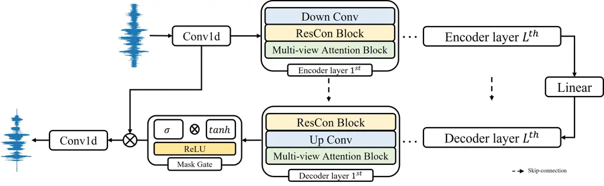
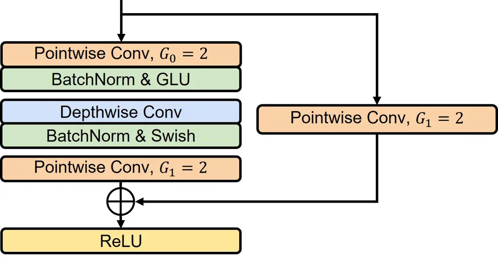
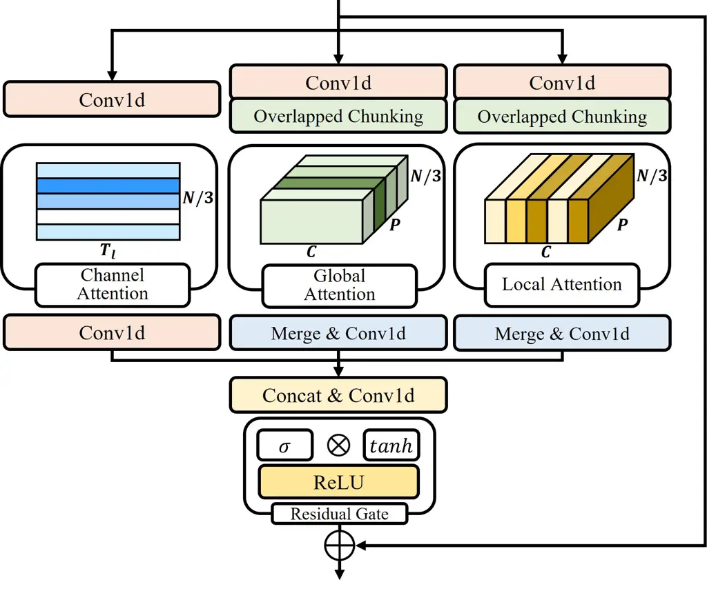
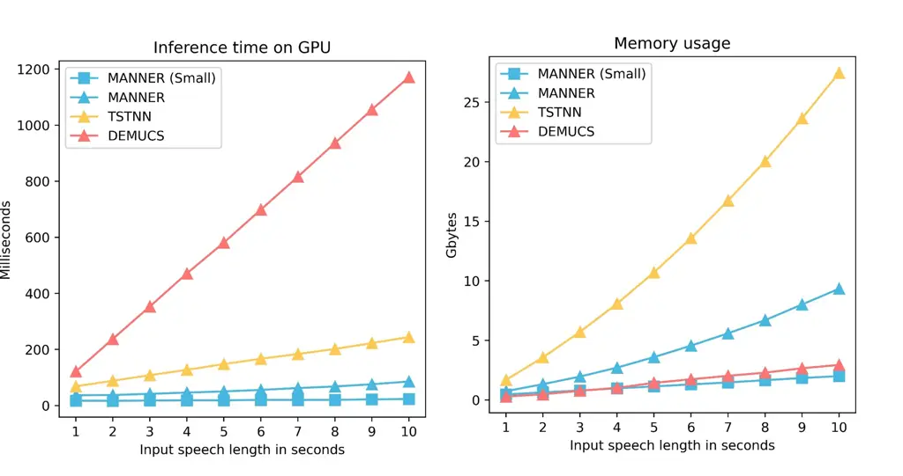

# MANNER: Multi-view Attention Network for Noise Erasure

Hyun Joon Park    Byung Ha Kang    Wooseok Shin    Jin Sob Kim    Sung
Won Han\* ^(†)^(†)thanks: This research was supported by Brain Korea 21
FOUR. This research was also supported by Korea University Grant
(K2107521) and a Korea TechnoComplex Foundation Grant (R2112651).

###### Abstract

In the field of speech enhancement, time domain methods have
difficulties in achieving both high performance and efficiency.
Recently, dual-path models have been adopted to represent long
sequential features, but they still have limited representations and
poor memory efficiency. In this study, we propose Multi-view Attention
Network for Noise ERasure (MANNER) consisting of a convolutional
encoder-decoder with a multi-view attention block, applied to the
time-domain signals. MANNER efficiently extracts three different
representations from noisy speech and estimates high-quality clean
speech. We evaluated MANNER on the VoiceBank-DEMAND dataset in terms of
five objective speech quality metrics. Experimental results show that
MANNER achieves state-of-the-art performance while efficiently
processing noisy speech.

###### Index Terms: 

multi-view attention, speech enhancement, time domain, u-net

^(†)^(†)address: School of Industrial and Management Engineering, Korea
University, Seoul, Republic of Korea

## 1 Introduction

Speech enhancement (SE), which is the task of improving the quality and
intelligibility of a noisy speech signal, has been widely used in many
applications, such as automatic speech recognition and hearing aids.
Recently, researchers have studied deep neural network (DNN) models for
SE, as DNN models have shown powerful noise reduction ability in complex
noise environments compared to statistical methods.

DNN models in SE are divided into time and time-frequency (T-F) domain
methods. T-F domain methods \[1, 2, 3, 4, 5\] estimate clean speech from
the spectrogram created by applying the short-time Fourier transform
(STFT) to a raw signal. Although the spectrogram contains the time and
frequency of the signal, some limitations have been pointed out to use
it \[6, 7\]. T-F domain methods need to address both magnitude and phase
information, thus increasing the model complexity. In addition, it is
challenging to handle complex values for estimating complex-valued
masks.

Recently, researchers have studied time domain methods \[8, 9, 6, 10, 7,
11, 12, 13, 14\], which directly estimate clean speech from the raw
signal because the raw signal implicitly contains all of the signal’s
information. Among them, \[9, 10, 12, 13\] adopted a U-net \[15\] based
architecture, which is utilized for efficient feature compression.
However, it is not effective for representing the long sequence of the
signal owing to its limited receptive field.

In contrast, dual-path models were adopted by \[16, 17, 18\] to
represent the long sequence of the signal in speech separation. They
considered the long sequential features by dividing the signal into
small chunks and repeatedly processing local and global information. In
SE, \[6, 8\] also applied dual-path models, but they are not efficient
in terms of memory usage because they maintain the long signal length
during training. In addition, the repeated feature extraction by
dual-path processing on a small channel size results in limited
representation and lower performance.

In this study, we propose an efficient speech enhancement model,
Multi-view Attention Network for Noise ERasure (MANNER), in the time
domain. MANNER, based on U-net, compresses the enriched channel
representations with convolution blocks. The multi-view attention block
enables the estimation of clean speech by emphasizing the channel and
long sequential features from each view. A comparison of results on the
VoiceBank-Demand dataset suggests that MANNER achieves state-of-the-art
performance with high inference speed and efficient memory usage.



Figure 1: The overall architecture of MANNER.

## 2 MANNER

In this section, we introduce MANNER in detail. MANNER is based on an
encoder-decoder consisting of a convolution layer, a convolution block,
and an attention block.

### 2.1 Encoder and Decoder

Before the encoder layer, we use a 1-D convolution layer, followed by
batch normalization and ReLU activation, on the noisy input
$`x\in\mathbb{R}^{1\times T}`$, where $`T`$ is the signal length. The
1-D convolution layer expands the channel size according to
$`x\in\mathbb{R}^{N\times T}`$, where $`N`$ denotes the channel size.

As shown in Fig. 1, the encoder and decoder consist of $`L`$ layers
containing Down and Up Conv layers, a Residual Conformer (ResCon) block,
and a Multi-view Attention (MA) block. We use the linear transformation
of the encoder output to pass the decoder layer. Each encoded output is
connected with each decoding input by element-wise summation.

Up & Down Conv. We use Down and Up Conv in the encoder and decoder,
respectively. Down Conv, which reduces the signal length, consists of a
convolution layer followed by batch normalization and ReLU activation.
In contrast, Up Conv, which restores the signal to its original length,
consists of a transposed convolution layer instead of a convolution
layer. Up and Down Conv adjust the signal length with a kernel size of
$`K`$ and a stride of $`S`$. We denote the signal length of each layer
as $`T_{l}`$, where $`l={1,2,...,L}`$.

Mask Gate. We obtain the mask $`m\in\mathbb{R}^{N\times T}`$ by applying
a mask gate to the decoder output. The mask is estimated by the
multiplication between the sigmoid and hyperbolic activation on the
output, followed by ReLU activation. A convolution layer is always used
before each activation function. We obtain the denoised
$`x^{\prime}\in\mathbb{R}^{N\times T}`$ through element-wise
multiplication between the mask and the output of the first convolution
layer, $`x\in\mathbb{R}^{N\times T}`$. Finally, the enhanced speech is
obtained by applying the convolution layer, which reduces the channel
size from $`N`$ to $`1`$, to the denoised $`x^{\prime}`$.

### 2.2 Residual Conformer block

Inspired by the efficient convolution block of Conformer \[19\], we
design a ResCon block to obtain enriched channel representation by
expanding the channel size in deep layers. We modify the normalization
and add a residual connection using a convolution layer. In addition, we
redesign the method used to adjust the channel size. As shown in Fig. 2,
pointwise and depthwise convolution layers are followed by normalization
and the activation function. $`G_{1}`$ adjusts the final channel size in
the block, and we set $`G_{1}=2`$ and $`G_{1}=1/2`$ for the encoder and
decoder layers, respectively.



Figure 2: Residual Conformer block. $`G_{0,1}`$ indicates the channel
growth rate of each pointwise convolution.



Figure 3: Multi-view Attention block.

### 2.3 Multi-view Attention block

We design a MA block consisting of channel, global, and local attention
to fully represent the signal information. Channel attention emphasizes
representations from compressed channels. Global and local attention
based on dual paths efficiently reflect long sequential features. In the
MA block, the input passes through three paths consisting of a
convolution layer that adjusts the channel size from $`N`$ to $`N/3`$.
For global and local attention paths, we adopt chunking with an overlap
ratio of 50% to split $`x\in\mathbb{R}^{N/3\times T_{l}}`$ into
$`x\in\mathbb{R}^{N/3\times P\times C}`$, where $`P`$ and $`C`$ denote
the number of chunks and chunk size, respectively. By separating the
global and local information, we can efficiently represent long
sequential features.  
Channel Attention. We adopt the channel attention used in \[20\] to
emphasize channel-wise representations. To aggregate the signal
information, we apply average and max pooling to
$`x_{C}\in\mathbb{R}^{N/3\times T_{l}}`$, where $`x_{C}`$ is the input
of the channel attention path after a convolution layer. Each pooling
output passes through shared linear layers. The channel attention weight
$`\alpha_{C}\in\mathbb{R}^{N/3\times 1}`$ is estimated as follows:

```math
\alpha_{C}=\sigma(W_{1}(W_{0}(x_{C}^{avg}))+W_{1}(W_{0}(x_{C}^{max}))) \tag{1}
```

where each weight is $`W_{0}\in\mathbb{R}^{N/3\times N/6}`$ and
$`W_{1}\in\mathbb{R}^{N/6\times N/3}`$. The channel attention output is
defined as $`x_{C}^{\prime}=x_{C}\times\alpha_{C}`$. Global Attention.
We propose global attention based on the self-attention of Transformer
\[21\]. To extract global sequential information, global attention
considers chunk-wise representations in the chunked input
$`x_{G}\in\mathbb{R}^{N/3\times P\times C}`$. The global attention
weight, $`\alpha_{G}\in\mathbb{R}^{N/3\times P\times P}`$, and the
output of global attention,
$`x_{G}^{\prime}\in\mathbb{R}^{N/3\times P\times C}`$, are obtained
based on self-attention, where $`d_{k}`$ is the chunk size for scaling.

```math
\begin{gathered}\alpha_{G}=softmax(\frac{QK^{\top}}{\sqrt{d_{k}}})\\
x_{G}^{\prime}=W(\alpha_{G}V)\end{gathered} \tag{2}
```

$`Q,K`$, and $`V\in\mathbb{R}_{q,k,v}^{N/3\times P\times C}`$ are
represented by linear transformation with each weight,
$`W_{q,k,v}\in\mathbb{R}^{1\times C\times C}`$, and
$`x_{G}\in\mathbb{R}^{N/3\times P\times C}`$. Finally, we apply a linear
layer, $`W\in\mathbb{R}^{1\times C\times C}`$, to $`\alpha_{G}V`$ to
obtain the global attention output.

Local Attention. Local attention represents the local sequential
features in each chunk. We design local attention using convolution
layers to reduce the model complexity compared to self-attention. By
adopting a small chunk size and large kernel size, the convolution layer
can sufficiently represent local sequential features. We use a depthwise
convolution layer with a kernel size of $`C/2-1`$ on the chunked input
$`x_{L}\in\mathbb{R}^{P\times N/3\times C}`$. After the depthwise
convolution layer, we estimate the local attention weight
$`\alpha_{L}\in\mathbb{R}^{P\times 1\times C}`$ by concatenating the
channel-wise average and max pooling as follows:

```math
\alpha_{L}=\sigma(F([x_{L}^{avg};x_{L}^{max}])) \tag{3}
```

where $`F`$ is the convolution layer reducing the channel size from 2
to 1. Finally, we represent the output as
$`x_{L}^{\prime}=x_{L}\times\alpha_{L}`$.  
For global and local outputs, we merge the chunked data. After the
three-path attention, we concatenate each output and pass it through a
convolution layer. We apply the mask gate process as the residual gate
to adjust the amount of information flow, followed by a residual
connection.

### 2.4 Loss function

We combine L1 loss (time) and multi-resolution STFT loss
(time-frequency) \[9, 22\] to optimize the model. We adopt the STFT loss
of \[9\], which is the sum of the spectral convergence and magnitude
loss. To obtain the spectral convergence and magnitude loss, the
$`Frobenius`$ and $`L_{1}`$ norms are applied, respectively. The loss of
the clean and estimated speech is the sum of the $`L_{1}`$ and
multi-resolution STFT loss as follows:

```math
\begin{gathered}loss_{STFT}(y,\hat{y})=\frac{\lVert|STFT(y)|-|STFT(\hat{y})|\rVert_{F}}{\lVert|STFT(y)|\rVert_{F}}\\
+\frac{1}{T}\lVert log(|STFT(y)|)-log(|STFT(\hat{y})|)\rVert_{1}\\
loss(y,\hat{y})=\frac{1}{T}\lVert y-\hat{y}\rVert_{1}+\frac{1}{R}\sum_{r=1}^{R}loss_{STFT}^{r}(y,\hat{y})\end{gathered} \tag{4}
```

where $`y`$ and $`\hat{y}`$ are the clean and estimated speech. The
$`loss_{STFT}^{r}`$ indicates the STFT loss of different resolutions
with combinations of hyperparameter (i.e., window lengths, hop sizes,
FFT bins), as in \[9\].  
We also apply the weighted loss \[1\] to consider both clean and noise
loss. Given that $`n`$ is the noise, the input signal is defined as
$`x=y+n`$. The total loss of the proposed model is as follows, where
$`\hat{n}=x-\hat{y}`$.

```math
loss_{total}(x,y,\hat{y})=\alpha loss(y,\hat{y})+(1-\alpha)loss(n,\hat{n}) \tag{5}
```

The weight $`\alpha`$ is defined as
$`\alpha=\lVert y\rVert^{2}_{2}/(\lVert y\rVert^{2}_{2}+\lVert n\rVert^{2}_{2})`$,
adjusting the ratio between the clean and noise speech.

## 3 Experiments

### 3.1 Datasets

We evaluate MANNER on the VoiceBank-DEMAND dataset \[23\] by mixing the
VoiceBank Corpus and DEMAND dataset. The train set consists of 11,572
utterances (14 male and 14 female) mixed with noise data with four
signal-to-noise ratios (SNRs) (15, 10, 5, and 0 dB). The test set
consists of 824 utterances (one male and one female) mixed with unseen
noise data with four SNRs (17.5, 12.5, 7.5, and 2.5 dB). We use two
speakers from the train set as the validation set. The data are
downsampled from 48 kHz to 16 kHz for a fair comparison.

|                      |        |      |         |      |      |      |
| -------------------- | ------ | ---- | ------- | ---- | ---- | ---- |
| Model                | Domain | PESQ | STOI(%) | CSIG | CBAK | COVL |
| SEGAN \[11\]         | T      | 2.16 | -       | 3.48 | 2.94 | 2.80 |
| Wave U-Net \[10\]    | T      | 2.40 | -       | 3.52 | 3.24 | 2.96 |
| PHASEN \[4\]         | T-F    | 2.99 | -       | 4.21 | 3.55 | 3.62 |
| SN-Net \[5\]         | T-F    | 3.12 | -       | 4.39 | 3.60 | 3.77 |
| DEMUCS (large) \[9\] | T      | 3.07 | 95      | 4.31 | 3.4  | 3.63 |
| MetricGAN+ \[3\]     | T-F    | 3.15 | -       | 4.14 | 3.16 | 3.64 |
| TSTNN \[6\]          | T      | 2.96 | 95      | 4.33 | 3.53 | 3.67 |
| MANNER (small)       | T      | 3.12 | 95      | 4.45 | 3.61 | 3.82 |
| MANNER               | T      | 3.21 | 95      | 4.53 | 3.65 | 3.91 |

Table 1: Comparison results on the VoiceBank-DEMAND dataset in terms of
objective speech quality metrics.

### 3.2 Evaluation metrics

We adopt five objective measures to evaluate MANNER and the previous
models. Perceptual Evaluation of Speech Quality (PESQ) \[24\] with a
score ranging from -0.5 to 4.5 is used to evaluate speech quality.
Short-time objective intelligibility (STOI) \[25\] with a score ranging
from 0 to 100 is for speech intelligibility. We also consider three mean
opinion score (MOS)-based measures whose scores ranging from 1 to 5
\[26\]. CSIG is the MOS prediction of the signal distortion, CBAK is the
MOS prediction of the noise intrusiveness, and COVL is the MOS
prediction of the overall signal quality.

### 3.3 Implementation details

For training, we segment the signal into 4 seconds with a 1-second
overlap and set a batch size of 4. We train MANNER for 300 epochs and
maintain the best weights based on the validation score. Furthermore, we
adopt the Adam optimizer and OneCycleLR scheduler to optimize the model.
We set $`lr_{min}=10^{-5}`$ and $`lr_{max}=10^{-2}`$ for the OneCycleLR
scheduler adjusting the learning rate during each epoch. During
training, we vary the tempo of the signal within the range of 90% to
110% \[27\]. For MANNER, we use $`K=8,S=4,N=60,L=4`$, and $`C=64`$. To
verify the performance and efficiency, we also include MANNER (small) in
the comparison, containing MA block only in the $`L^{th}`$ layer and
using the same parameters as MANNER.



Figure 4: Efficiency comparison performed on the same machine with RTX
A6000 GPU.

### 3.4 Experimental results

We compared the proposed models with existing models, including time and
time-frequency domain methods. As shown in Table 1, MANNER achieves
state-of-the-art performance in terms of five objective speech quality
measures. Although MANNER (small) does not achieve the best performance,
it still outperforms the previous methods.

To verify the efficiency of the proposed models, we compared them with
the time domain methods, DEMUCS \[9\] and TSTNN \[6\], in terms of
inference speed and memory usage. We measured these quantities with the
signal length set from 1 to 10 seconds. Fig. 4 shows that MANNER has
high inference speed and relatively low memory usage compared to the
previous methods. In addition, MANNER (small) achieves not only higher
performance than the previous methods, but also the highest efficiency.

| Ver.   | wLoss. | Channel Att. | Global Att. | Local Att. | PESQ |
| ------ | ------ | ------------ | ----------- | ---------- | ---- |
| Base   |        |              |             |            | 3.00 |
| 1      | ✓      |              |             |            | 3.04 |
| 2      | ✓      | ✓            |             | ✓          | 3.12 |
| 3      | ✓      | ✓            | ✓           |            | 3.16 |
| 4      | ✓      |              | ✓           | ✓          | 3.18 |
| MANNER | ✓      | ✓            | ✓           | ✓          | 3.21 |

Table 2: Comparison results depending on attention types and weighted
loss (wLoss).

### 3.5 The influence of attention block and loss

We conducted an ablation experiment to understand the influence of the
proposed attention block and weighted loss on MANNER’s performance. We
examined the effects of each component of the proposed methods. Table 2
shows that each attention and weighted loss contributes to the
improvement of performance. The result of Ver. 4 suggests the importance
of considering long signal information, but considering all views of the
signal is necessary to achieve higher performance.

## 4 Conclusion

In this study, we proposed MANNER, which efficiently represents channel
and long sequential features of the signal, designed for speech
enhancement in the time domain. MANNER’s results on the VoiceBank-DEMAND
dataset highlight that MANNER achieves state-of-the-art performance
compared to existing models. In addition, MANNER (small) is superior to
previous time-domain methods in terms of performance and efficiency.
Finally, the ablation experiment suggests that it is important to
consider all representations of the signal and optimize both clean and
noise loss.

## References

- \[1\] H.-S.Choi et al., “Phase-aware speech enhancement with deep
  complex u-net,” 2019.
- \[2\] S.-W.Fu et al., “Metricgan: Generative adversarial networks
  based black-box metric scores optimization for speech enhancement,” in
  ICML, 2019.
- \[3\] S.-W.Fu et al., “Metricgan+: An improved version of metricgan
  for speech enhancement,” arXiv preprint arXiv:2104.03538, 2021.
- \[4\] D.Yin, C.Luo, Z.Xiong, and W.Zeng, “Phasen: A
  phase-and-harmonics-aware speech enhancement network,” in Proc. AAAI,
  2020, vol. 34, pp. 9458–9465.
- \[5\] C.Zheng, X.Peng, Y.Zhang, S.Srinivasan, and Y.Lu, “Interactive
  speech and noise modeling for speech enhancement,” arXiv preprint
  arXiv:2012.09408, 2020.
- \[6\] K.Wang, B.He, and W.-P.Zhu, “Tstnn: Two-stage transformer based
  neural network for speech enhancement in the time domain,” in ICASSP.
  IEEE, 2021, pp. 7098–7102.
- \[7\] D.Rethage, J.Pons, and X.Serra, “A wavenet for speech
  denoising,” in ICASSP. IEEE, 2018, pp. 5069–5073.
- \[8\] A.Pandey and D.Wang, “Dual-path self-attention rnn for real-time
  speech enhancement,” arXiv preprint arXiv:2010.12713, 2020.
- \[9\] A.Defossez, G.Synnaeve, and Y.Adi, “Real time speech enhancement
  in the waveform domain,” arXiv preprint arXiv:2006.12847, 2020.
- \[10\] C.Macartney and T.Weyde, “Improved speech enhancement with the
  wave-u-net,” arXiv preprint arXiv:1811.11307, 2018.
- \[11\] S.Pascual, A.Bonafonte, and J.Serra, “Segan: Speech enhancement
  generative adversarial network,” arXiv preprint
  arXiv:1703.09452, 2017.
- \[12\] A.Pandey and D.Wang, “Densely connected neural network with
  dilated convolutions for real-time speech enhancement in the time
  domain,” in ICASSP. IEEE, 2020, pp. 6629–6633.
- \[13\] A.Pandey and D.Wang, “Dense cnn with self-attention for
  time-domain speech enhancement,” IEEE/ACM Transactions on Audio,
  Speech, and Language Processing, vol. 29, pp. 1270–1279, 2021.
- \[14\] T.-A.Hsieh, H.-M.Wang, X.Lu, and Y.Tsao, “Wavecrn: An efficient
  convolutional recurrent neural network for end-to-end speech
  enhancement,” IEEE Signal Processing Letters, vol. 27, pp.
  2149–2153, 2020.
- \[15\] O.Ronneberger, P.Fischer, and T.Brox, “U-net: Convolutional
  networks for biomedical image segmentation,” in ICM. Springer, 2015,
  pp. 234–241.
- \[16\] Y.Luo, Z.Chen, and T.Yoshioka, “Dual-path rnn: efficient long
  sequence modeling for time-domain single-channel speech separation,”
  in ICASSP. IEEE, 2020, pp. 46–50.
- \[17\] J.Chen, Q.Mao, and D.Liu, “Dual-path transformer network:
  Direct context-aware modeling for end-to-end monaural speech
  separation,” arXiv preprint arXiv:2007.13975, 2020.
- \[18\] C.Subakan, M.Ravanelli, S.Cornell, M.Bronzi, and J.Zhong,
  “Attention is all you need in speech separation,” in ICASSP. IEEE,
  2021, pp. 21–25.
- \[19\] A.Gulati et al., “Conformer: Convolution-augmented transformer
  for speech recognition,” arXiv preprint arXiv:2005.08100, 2020.
- \[20\] S.Woo, J.Park, J.-Y.Lee, and I. S.Kweon, “Cbam: Convolutional
  block attention module,” in Proc. ECCV, 2018, pp. 3–19.
- \[21\] A.Vaswani, N.Shazeer, N.Parmar, J.Uszkoreit, L.Jones,
  A. N.Gomez, L.Kaiser, and I.Polosukhin, “Attention is all you need,”
  in Advances in neural information processing systems, 2017, pp.
  5998–6008.
- \[22\] R.Yamamoto, E.Song, and J.-M.Kim, “Parallel wavegan: A fast
  waveform generation model based on generative adversarial networks
  with multi-resolution spectrogram,” in ICASSP. IEEE, 2020, pp.
  6199–6203.
- \[23\] C.Valentini-Botinhao et al., “Noisy speech database for
  training speech enhancement algorithms and tts models,” 2017.
- \[24\] I.-T.Recommendation, “Perceptual evaluation of speech quality
  (pesq): An objective method for end-to-end speech quality assessment
  of narrow-band telephone networks and speech codecs,” Rec. ITU-T P.
  862, 2001.
- \[25\] C. H.Taal, R. C.Hendriks, R.Heusdens, and J.Jensen, “An
  algorithm for intelligibility prediction of time–frequency weighted
  noisy speech,” IEEE Transactions on Audio, Speech, and Language
  Processing, vol. 19, no. 7, pp. 2125–2136, 2011.
- \[26\] Y.Hu and P. C.Loizou, “Evaluation of objective quality measures
  for speech enhancement,” IEEE Transactions on audio, speech, and
  language processing, vol. 16, no. 1, pp. 229–238, 2007.
- \[27\] T.Ko, V.Peddinti, D.Povey, and S.Khudanpur, “Audio augmentation
  for speech recognition,” in Sixteenth annual conference of the
  international speech communication association, 2015.
