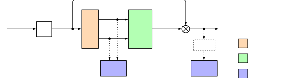
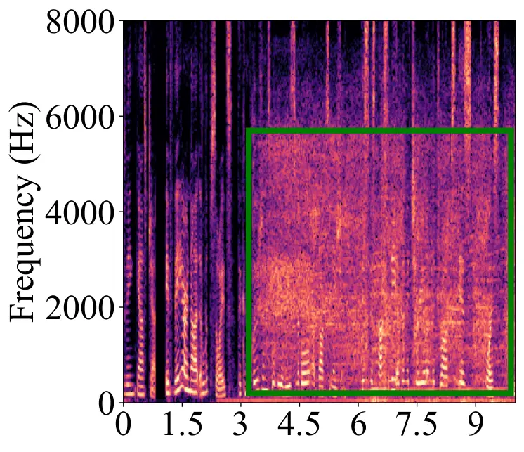
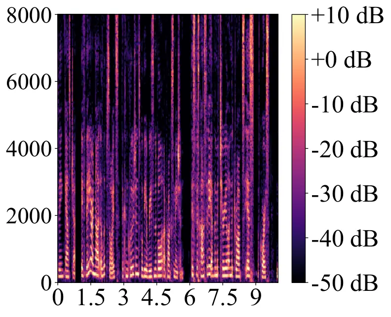
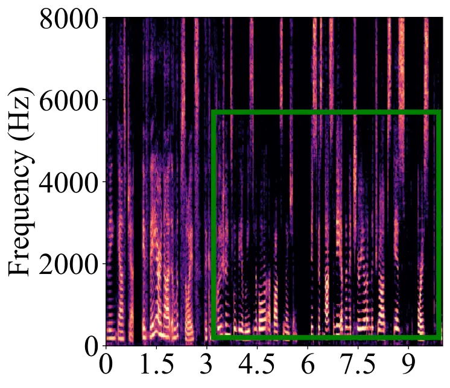
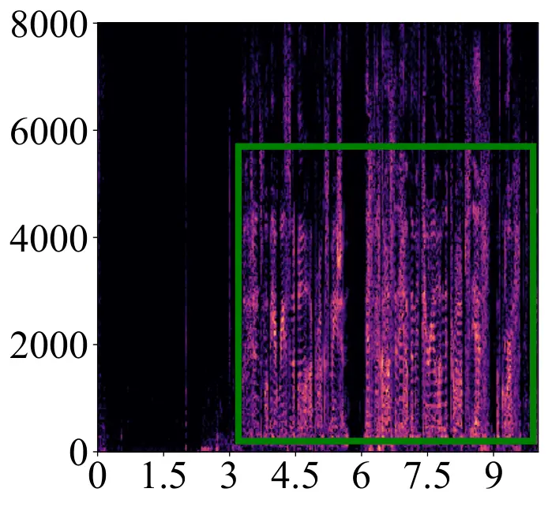
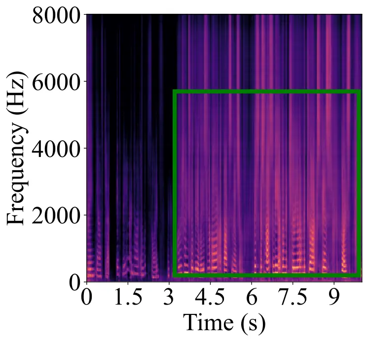
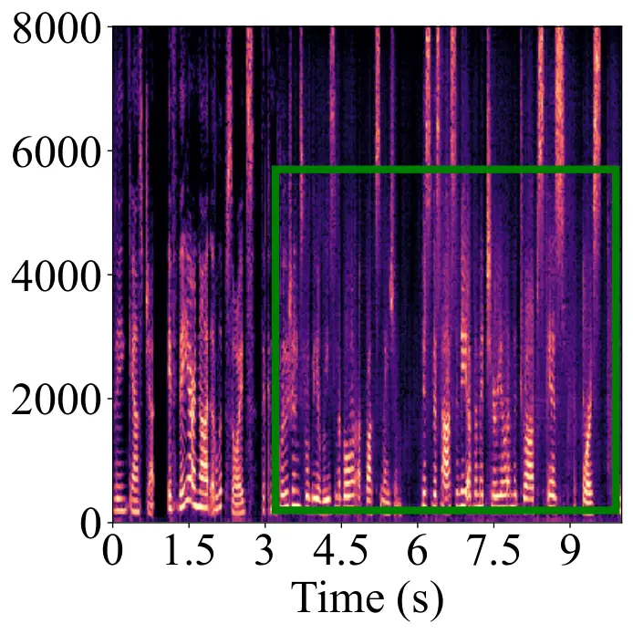

# Integrating statistical uncertainty into neural network-based speech enhancement

###### Abstract

Speech enhancement in the time-frequency domain is often performed by
estimating a multiplicative mask to extract clean speech. However, most
neural network-based methods perform point estimation, i.e., their
output consists of a single mask. In this paper, we study the benefits
of modeling uncertainty in neural network-based speech enhancement. For
this, our neural network is trained to map a noisy spectrogram to the
Wiener filter and its associated variance, which quantifies uncertainty,
based on the *maximum a posteriori* (MAP) inference of spectral
coefficients. By estimating the distribution instead of the point
estimate, one can model the uncertainty associated with each estimate.
We further propose to use the estimated Wiener filter and its
uncertainty to build an approximate MAP (A-MAP) estimator of spectral
magnitudes, which in turn is combined with the MAP inference of spectral
coefficients to form a hybrid loss function to jointly reinforce the
estimation. Experimental results on different datasets show that the
proposed method can not only capture the uncertainty associated with the
estimated filters, but also yield a higher enhancement performance over
comparable models that do not take uncertainty into account.

###### Index Terms: 

Speech enhancement, uncertainty estimation, Wiener filter, Bayesian
estimator, deep neural network

## 1 Introduction

Single-channel speech enhancement algorithms typically operate in the
STFT (STFT) domain \[1, 2, 3\]. The Gaussian statistical model in the
STFT domain has been shown to be effective \[1, 4\]. Given the
assumption that the complex-valued speech and noise coefficients are
uncorrelated and Gaussian-distributed with zero mean, various estimators
have been derived, such as the Wiener filter and the STSA (STSA)
estimator \[1, 4, 5\]. The Wiener filter, which is optimal in the MMSE
(MMSE) sense, requires estimation of speech and noise variances. This
can be achieved by various signal processing estimators with varying
degrees of success for different signal characteristics \[6, 2, 1, 7, 8,
9, 10, 11\].

Recently, DNN have been successfully applied to speech enhancement and
regularly show an improved performance over classical methods \[11, 10,
12, 13\]. Among the DNN-based approaches relevant to this work are deep
generative models (e.g., variational autoencoder) and supervised masking
approaches. Generative models estimate the clean speech distribution and
subsequently combine it with a separate noise model to construct a point
estimate of a noise-removing mask (Wiener filter) \[11, 10\]. In
contrast, typical supervised learning approaches are trained on pairs of
noisy and clean speech samples and directly estimate a time-frequency
mask that aims at reducing noise interference with minimal speech
distortion given a noisy mixture, using a suitable loss function (e.g.,
MSE (MSE)) \[12, 13\]. However, the supervised approaches often learn
the mapping between noisy and clean speech blindly and output a single
point estimate without guarantee or measure of its accuracy. In this
work we focus on adding an uncertainty measure to a supervised method by
estimating the speech posterior distribution, instead of only its mean.
Note that while this is conceptually related to the generative approach,
in this case we do not estimate the clean speech prior distribution, but
rather the posterior distribution of clean speech given a noisy mixture.



Figure 1: Block diagram of the neural network-based uncertainty
estimation. The neural network is trained according to the proposed
hybrid loss function.

Uncertainty modeling based on neural networks has been actively studied
in e.g., computer vision \[14\]. Inspired by this, here we propose a
hybrid loss function to capture uncertainty associated with the
estimated Wiener filter in the neural network-based speech enhancement
algorithm, as depicted in Fig. 1. More specifically, we propose to train
a neural network to predict the Wiener filter and its variance, which
quantifies the uncertainty, based on the MAP (MAP) inference of complex
spectral coefficients, such that full Gaussian posterior distribution
can be estimated. To regularize the variance estimation, we build an
A-MAP (A-MAP) estimator of spectral magnitudes using the estimated
Wiener filter and uncertainty, which is in turn used together with the
MAP inference of spectral coefficients to form a hybrid loss function.
Experimental results show the effectiveness of the proposed approach in
capturing uncertainty. Furthermore, the A-MAP estimator based on the
estimated Wiener filter and its associated uncertainty results in
improved speech enhancement performance.

## 2 Signal model

We consider the speech enhancement problem in the single microphone case
with additive noise. The noisy signal $`x`$ can be transformed into the
time-frequency domain using the STFT:

```math
X_{ft}=S_{ft}+N_{ft}\,, \tag{1}
```

where $`X_{ft}`$, $`S_{ft}`$, and $`N_{ft}`$ are complex noisy speech
coefficients, complex clean speech coefficients, and complex noise
coefficients, respectively. The frequency and frame indices are given by
$`f\in\{1,2,\cdots,F\}`$ and $`t\in\{1,2,\cdots,T\}`$, where $`F`$
denotes the number of frequency bins, and $`T`$ represents the number of
time frames. Furthermore, we assume a Gaussian statistical model, where
the speech and noise coefficients are uncorrelated and follow a
circularly symmetric complex Gaussian distribution with zero mean, i.e.,

```math
S_{ft}\sim\mathcal{N}_{\mathbb{C}}(0,\,\sigma^{2}_{s,ft}),\hskip 8.5359ptN_{ft}\sim\mathcal{N}_{\mathbb{C}}(0,\,\sigma^{2}_{n,ft})\,, \tag{2}
```

where $`\sigma^{2}_{s,ft}`$ and $`\sigma^{2}_{n,ft}`$ represent the
variances of speech and noise, respectively. The likelihood
$`p(X_{ft}|S_{ft})`$ follows a complex Gaussian distribution with mean
$`S_{ft}`$ and variance $`\sigma_{n,ft}^{2}`$, given by

```math
p(X_{ft}|S_{ft})=\frac{1}{\pi\sigma^{2}_{n,ft}}\exp\left(-\frac{|X_{ft}-S_{ft}|^{2}}{\sigma^{2}_{n,ft}}\right)\,. \tag{3}
```

Given the speech prior in (2) and the likelihood in (3), we can apply
Bayes’ theorem to find the speech posterior distribution, which is
complex Gaussian of the form

```math
p(S_{ft}|X_{ft})=\frac{1}{\pi\lambda_{ft}}\exp{\left(-\frac{|S_{ft}-W^{\text{WF}}_{ft}X_{ft}|^{2}}{\lambda_{ft}}\right)}\,, \tag{4}
```

where
$`W^{\text{WF}}_{ft}=\frac{\sigma_{s,ft}^{2}}{\sigma_{s,ft}^{2}+\sigma_{n,ft}^{2}}`$
is the _Wiener filter_ and
$`\lambda_{ft}=\frac{\sigma_{s,ft}^{2}\sigma_{n,ft}^{2}}{\sigma_{s,ft}^{2}+\sigma_{n,ft}^{2}}`$
is the posterior’s variance \[1\]. The MMSE and MAP estimators of
$`S_{ft}`$ under this model are both given by the _Wiener filter_ \[1\]:
$`\widetilde{S}_{ft}=W^{\text{WF}}_{ft}X_{ft}`$. It is known that the
expectation of MMSE estimation error is closely related to the posterior
variance \[15\], and under the assumption of complex Gaussian
distribution it corresponds directly to the variance, i.e.,

```math
\begin{split}E\{|S_{ft}-\widetilde{S}_{ft}|^{2}\}&=\iint|S_{ft}-\widetilde{S}_{ft}|^{2}\,p(S_{ft}|X_{ft})p(X_{ft})\,\mathrm{d}S_{ft}\,\mathrm{d}X_{ft}\\
&=\int\lambda_{ft}\,p(X_{ft})\,\mathrm{d}X_{ft}=\lambda_{ft}.\end{split} \tag{5}
```

The variance $`\lambda_{ft}`$ can be interpreted as a measure of
uncertainty associated with the MMSE estimator \[1\]. In the following
sections $`\lambda_{ft}`$ will be referred to as the (estimation)
uncertainty.

## 3 Deep Uncertainty Estimation

The Wiener filter can be computed for a given noisy signal by estimation
of $`\sigma^{2}_{s,ft}`$ and $`\sigma^{2}_{n,ft}`$ using traditional
signal processing techniques. It is, however, also possible to directly
estimate $`W^{\text{WF}}_{ft}`$ using a DNN. Furthermore, if
optimization is based on the posterior (4), besides
$`W^{\text{WF}}_{ft}`$ also the uncertainty $`\lambda_{ft}`$ can be
estimated as previously proposed in the computer vision domain \[14\].
Taking the negative logarithm (which does not affect the optimization
problem due to monotonicity) and averaging over the time-frequency plane
results in the following minimization problem:

```math
\begin{split}&\widetilde{W}^{\text{WF}}_{ft},\widetilde{\lambda}_{ft}=\\
&\argmin_{W^{\text{WF}}_{ft},\lambda_{ft}}\underbrace{\frac{1}{FT}\sum_{f,t}\log(\lambda_{ft})+\frac{|S_{ft}-W^{\text{WF}}_{ft}X_{ft}|^{2}}{\lambda_{ft}}}_{\mathcal{L}_{p(S|X)}}\,,\end{split} \tag{6}
```

where $`\widetilde{W}_{ft}`$, $`\widetilde{\lambda}_{ft}`$ denote
estimates of the Wiener filter and its uncertainty. If we assume a
constant uncertainty for all time-frequency bins, i.e.,
$`\lambda_{ft}=\lambda^{\ast}`$, and refrain from explicitly optimizing
for $`\lambda^{\ast}`$, $`\mathcal{L}_{p(S|X)}`$ degenerates into the
well known MSE loss

```math
\mathcal{L}_{\text{MSE}}=\frac{1}{FT}\sum_{f,t}|S_{ft}-W^{\text{WF}}_{ft}X_{ft}|^{2}\,, \tag{7}
```

which is widely used in DNN-based regression tasks, including speech
enhancement \[12, 16\]. In this work we depart from the assumption of
constant uncertainty. Instead, we propose to include uncertainty
estimation as an additional task by training a DNN with the full
negative log-posterior $`\mathcal{L}_{p(S|X)}`$.

It has been previously shown that modeling uncertainty by minimizing
$`\mathcal{L}_{p(S|X)}`$ results in improvement over baselines that do
not take uncertainty into account in computer vision tasks \[14\].
However, in preliminary experiments we have observed that directly
using (6) as loss function results in reduced estimation performance for
the Wiener filter and is prone to overfitting. To overcome this problem,
we propose an additional regularization of the loss function by
incorporating the estimated uncertainty into clean speech estimation as
described next.

## 4 Joint enhancement and uncertainty estimation

Besides estimation of the Wiener filter and its uncertainty, we propose
to also incorporate a subsequent speech enhancement task that explicitly
uses both into the training procedure. The speech enhancement task
provides additional coupling between the DNN outputs (Wiener filter and
uncertainty). In this manner, the DNN is guided towards estimation of
uncertainty values that are relevant to the speech enhancement task, as
well as enhanced estimation of the Wiener filter.

If we consider complex coefficients with symmetric posterior (4), the
MAP and MMSE estimators both result directly in the Wiener filter
$`W^{\text{WF}}_{ft}`$ and do not require an uncertainty estimate.
However, this changes if we consider spectral magnitude estimation. The
magnitude posterior $`p(|S_{ft}|\>|X_{ft})`$, found by integrating the
phase out of (4), follows a Rician distribution \[5\]

```math
\begin{split}&p(|S_{ft}|\>|X_{ft})=\\
&\frac{2|S_{ft}|}{\lambda_{ft}}\exp\left(-\frac{|S_{ft}|^{2}+(W_{ft}^{\text{WF}})^{2}|X_{ft}|^{2}}{\lambda_{ft}}\right)\mathit{I_{0}}\left(\frac{2|X_{ft}|\,|S_{ft}|W^{\text{WF}}_{ft}}{\lambda_{ft}}\right)\,,\end{split} \tag{8}
```

where $`\mathit{I_{0}}(\cdot)`$ is the modified zeroth-order Bessel
function of the first kind.

In order to compute the MAP estimate for the spectral magnitude, one
needs to find the mode of the Rician distribution, which is difficult to
do analytically. However, one may approximate it with a simple
closed-form expression \[5\]:

```math
\begin{split}|\widehat{S}_{ft}|&\approx W^{\text{A-MAP}}_{ft}|X_{ft}|\\
&=\left(\frac{1}{2}W^{\text{WF}}_{ft}+\sqrt{\left(\frac{1}{2}W^{\text{WF}}_{ft}\right)^{2}+\frac{\lambda_{ft}}{4|X_{ft}|^{2}}}\right)|X_{ft}|\,,\end{split} \tag{9}
```

where $`|\widehat{S}_{ft}|`$ is an estimate of the clean spectral
magnitude $`|S_{ft}|`$ using the A-MAP estimator of spectral magnitudes
$`W^{\text{A-MAP}}_{ft}`$. It can be seen that the estimator
$`W^{\text{A-MAP}}_{ft}`$ makes use of both the Wiener filter
$`W^{\text{WF}}_{ft}`$ and the associated uncertainty $`\lambda_{ft}`$.
An estimate of the time-domain clean speech signal, denoted as
$`\widehat{s}`$, is then obtained by combining the estimated magnitude
$`|\widehat{S}_{ft}|`$ with the noisy phase, followed by the iSTFT
(iSTFT). The estimated time-domain signal is then used to compute the
negative SI-SDR (SI-SDR) metric \[17\]:

```math
\mathcal{L}_{\text{SI-SDR}}=-10\log_{10}\left(\frac{||\alpha s||^{2}}{||\alpha s-\widehat{s}||^{2}}\right)\,,\quad\alpha=\frac{\widehat{s}^{T}s}{||s||^{2}}\,, \tag{10}
```

which is in turn used as an additional term in the loss function that
forces the speech estimate (computed with $`W^{\text{A-MAP}}_{ft}`$) to
be similar to the clean target $`s`$.

Finally, we propose to combine the SI-SDR loss
$`\mathcal{L}_{\text{SI-SDR}}`$ with the negative log-posterior
$`\mathcal{L}_{p(S|X)}`$ given in (6), and train the neural network
using a hybrid loss

```math
\mathcal{L}=\beta\mathcal{L}_{p(S|X)}+(1-\beta)\mathcal{L}_{\text{SI-SDR}}\,, \tag{11}
```

with the weighting factor $`\beta\in[0,1]`$ as the hyperparameter. By
explicitly using the estimated uncertainty for the speech enhancement
task, the hybrid loss guides both mean and variance estimation to
improve speech enhancement performance. An overview of this approach is
depicted in Fig. 1.

## 5 Experimental setting

### 5.1 Dataset

For training we use the DNS (DNS) Challenge dataset \[18\], which
includes a large amount of synthesized noisy and clean speech pairs. We
randomly sample a subset of 100 hours with SNR uniformly distributed
between -5 dB and 20 dB. The data are randomly split into training and
validation sets (80% and 20% respectively).

Evaluation was performed on the synthetic test set without reverberation
from DNS Challenge. Noisy signals are generated by mixing clean speech
signals from \[19\] with noise clips sampled from 12 noise
categories \[18\], with SNR uniformly drawn from 0 dB to 25 dB. To
examine performance across different datasets, we additionally
synthesized another test dataset using clean speech signals from the
si_et_05 subset of the WSJ0 \[20\] dataset and four types of noise
signals from CHiME \[21\] (cafe, street, pedestrian, and bus) with SNR
randomly sampled from {-10 dB, -5 dB, 0 dB, 5 dB, 10 dB}. A few samples
are dropped due to the clipping effect in the mixing processing, and
finally, this results in a test dataset of 623 files.



(a) Noisy



(b) Clean



(c) WF



(d) Error



(e) Uncertainty



(f) A-MAP

Figure 2: Example of estimation uncertainty captured by the proposed
method on the DNS test dataset, shown in (e). The proposed method allows
estimating clean speech by either using the estimated Wiener filter or
applying the A-MAP estimator that incorporates both the estimated Wiener
filter and the associated uncertainty, and the resulting estimates are
shown in (c) and (f), denoted by WF and A-MAP, respectively. The
estimation error of Wiener filtering in (d) is computed between the
estimated magnitudes (c) and clean magnitudes (b), indicating over- or
under-estimation of speech magnitudes.

Figure 3: Performance improvement obtained on the synthetic dataset
using clean speech from WSJ0 and noise signals from CHiME. POLQAi
denotes POLQA improvement relative to noisy mixtures. The same
definition applies to ESTOIi and SI-SDRi. The marker denotes the mean
value over all utterances and the vertical bar indicates the
95%-confidence interval.

### 5.2 Baselines

To evaluate the effectiveness of modeling uncertainty in neural
network-based speech enhancement, we consider training the same neural
network using standard cost functions, i.e., the MSE defined as
$`\mathcal{L}_{\text{MSE}}`$ in (7) and the SI-SDR defined as
$`\mathcal{L}_{\text{SI-SDR}}`$ in (10). They are represented by MSE and
SI-SDR in Table 1 and Fig. 3.

### 5.3 Hyperparameters

All audio signals are sampled at 16 kHz and transformed into the
time-frequency domain using the STFT with a 32 ms Hann window and 50%
overlap.

For a fair comparison, we used the separator of Conv-TasNet \[22\] that
has a  TCN (TCN) architecture. It has been shown to be effective in
modeling temporal correlations. We used the causal version of the
implementation and default hyperparameters provided by the authors¹¹ 1
[https://github.com/naplab/Conv-TasNet](https://github.com/naplab/Conv-TasNet)
without performing a hyperparameter search. Note that for our model
performing uncertainty estimation, the output layer is split into two
heads that predict both the Wiener filter and the uncertainty. We
applied the sigmoid activation function to the estimated mask, while
using the _log-exp_ technique to constrain the uncertainty output to be
greater than $`0`$, i.e., the network outputs the logarithm of the
variance, which is then recovered by the exponential term in the loss
function. All neural networks were trained for 50 epochs with a batch
size 16, the maximum norm of gradients was set to 5, and the parameters
were optimized using the Adam optimizer \[23\] with a learning rate of
0.001. We halved the learning rate if the validation loss did not
decrease for 3 consecutive epochs. To prevent overfitting, training was
stopped if the validation loss failed to decrease within 10 consecutive
epochs. The weighting factor $`\beta`$ is set to 0.01, chosen
empirically.

|                |                   |                   |                    |
| -------------- | ----------------- | ----------------- | ------------------ |
|                | POLQA             | ESTOI             | SI-SDR (dB)        |
| Noisy          | 2.30 $`\pm`$ 0.10 | 0.81 $`\pm`$ 0.02 | 9.07 $`\pm`$ 0.89  |
| SI-SDR         | 2.93 $`\pm`$ 0.11 | 0.88 $`\pm`$ 0.01 | 15.99 $`\pm`$ 0.75 |
| MSE            | 2.88 $`\pm`$ 0.10 | 0.88 $`\pm`$ 0.01 | 16.05 $`\pm`$ 0.71 |
| Proposed WF    | 3.00 $`\pm`$ 0.11 | 0.88 $`\pm`$ 0.01 | 16.39 $`\pm`$ 0.73 |
| Proposed A-MAP | 3.06 $`\pm`$ 0.10 | 0.89 $`\pm`$ 0.01 | 16.42 $`\pm`$ 0.73 |

Table 1: Average performance over all utterances of the DNS
non-reverberant synthetic test dataset in terms of POLQA, ESTOI, and
SI-SDR. Values are given in mean $`\pm`$ confidence interval (95%
confidence).

## 6 Results and discussion

### 6.1 Analysis of uncertainty estimation

In Fig. 2, we use an audio example from the DNS test dataset to
illustrate the uncertainty captured by the proposed method, and all
plots are shown in decibel (dB) scale. Applying the estimated Wiener
filter to the noisy coefficients yields an estimate of the clean speech,
denoted as WF shown in Fig. 2 (c). To measure the prediction error, we
can compute the absolute values of the difference between the estimated
magnitudes, i.e., WF, and reference magnitudes given in Fig. 2 (b),
which indicates over- or under-estimation of speech magnitudes, shown in
Fig. 2 (d). It is observed that the model produces large errors when
speech is heavily corrupted by noise, as can be seen by comparing the
marking regions (green boxes) of the noisy mixture shown in Fig. 2 (a)
and the prediction error of Fig. 2 (d). By comparing error in Fig. 2 (d)
and uncertainty in Fig. 2 (e), the estimator generally associates large
uncertainty with large prediction errors, while giving low uncertainty
to accurate estimates, e.g., the first 3 seconds. This shows that the
model produces uncertainty measurements that are closely related to
estimation errors. In our proposed method with uncertainty estimation,
we can use not only the estimated Wiener filter, but also the estimated
A-MAP mask that incorporates both the estimated uncertainty and Wiener
filter, as given in (9). This estimate is denoted as A-MAP in
Fig. 2 (f). We observe that the A-MAP estimate causes less speech
distortion compared with the WF estimate, as can be seen, e.g., from the
marking regions of WF and A-MAP.

### 6.2 Performance Evaluation

In Table 1, we present average evaluation results of our method on the
DNS synthetic test set in terms of SI-SDR measured in dB, ESTOI
(ESTOI) \[24\], and POLQA (POLQA)²² 2 We would like to thank J. Berger
and Rohde&Schwarz SwissQual AG for their support with POLQA. \[25\]. We
observe that modeling uncertainty yields improvement over the baselines,
where the proposed WF outperforms the baselines in terms of POLQA and
SI-SDR, and a larger improvement can be observed between the baselines
and the proposed A-MAP. This shows that it is advantageous to model
uncertainty within the model instead of directly estimating optimal
points.

In Fig. 3, we present speech enhancement results in terms of mean
improvement of POLQA, ESTOI, and SI-SDR. For this evaluation we used
another unseen test dataset based on speech from WSJ0 and noise from
CHiME. It shows that our proposed approach performs better in terms of
speech quality given by higher POLQA values without deteriorating ESTOI
(with an exception at SNR of $`-10`$ dB) and SI-SDR, which again
demonstrates the benefit of modeling uncertainty. We also observe that
larger improvement over the baselines is achieved at high SNR, which may
be explained by the fact that, at high SNR, speech quality (and thus
POLQA) is mainly affected by speech distortions, while at low SNR the
main factor is residual noise.

## 7 Conclusion

Based on the common complex Gaussian model of speech and noise signals,
we proposed to augment the existing neural network architecture with an
additional uncertainty estimation task. Specifically, we proposed
simultaneous estimation of the Wiener filter and the associated
uncertainty to capture the full speech posterior distribution.
Furthermore, we proposed using the estimated Wiener filter and
uncertainty to produce an A-MAP estimate of the clean spectral
magnitude. Eventually, we combined uncertainty estimation and speech
enhancement by the proposed hybrid loss function. We showed that the
approach can capture uncertainty and lead to improved speech enhancement
performance across different speech and noise datasets. For future work,
it would be interesting to integrate the uncertainty estimation into
multi-modal learning systems, which may rely more on other modalities
when audio modality raises high uncertainty.

\AtNextBibliography

## 8 REFERENCES

## References

- \[1\] Timo Gerkmann and Emmanuel Vincent “Spectral Masking and
  Filtering” In _Audio Source Separation and Speech Enhancement_ Wiley,
  2018, pp. 65–85
- \[2\] R.. Hendriks, T. Gerkmann and J. Jensen “DFT-domain based
  single-microphone noise reduction for speech enhancement: a survey of
  the state of the art” Morgan & Claypool Publishers, 2013, pp. 1–80
- \[3\] T. Gerkmann and R.. Hendriks “Unbiased MMSE-Based Noise Power
  Estimation With Low Complexity and Low Tracking Delay” In _IEEE
  Transactions on Audio, Speech, and Language Processing_ 20.4, 2012,
  pp. 1383–1393 DOI:
  [10.1109/TASL.2011.2180896](https://dx.doi.org/10.1109/TASL.2011.2180896)
- \[4\] Yariv Ephraim and David Malah “Speech enhancement using a
  minimum-mean square error short-time spectral amplitude estimator” In
  _IEEE Transactions on Acoustics, Speech, and Signal Processing_ 32.6
  IEEE, 1984, pp. 1109–1121
- \[5\] Patrick Wolfe and Simon Godsill “Efficient alternatives to the
  Ephraim and Malah suppression rule for audio signal enhancement” In
  _EURASIP Journal on Advances in Signal Processing_ 2003.10
  SpringerOpen, 2003, pp. 1–9
- \[6\] Timo Gerkmann and Richard. Hendriks “Noise power estimation
  based on the probability of speech presence” In _IEEE Workshop on
  Applications of Signal Processing to Audio and Acoustics (WASPAA)_,
  2011, pp. 145–148 DOI:
  [10.1109/ASPAA.2011.6082266](https://dx.doi.org/10.1109/ASPAA.2011.6082266)
- \[7\] Guillaume Carbajal, Julius Richter and Timo Gerkmann “Guided
  Variational Autoencoder for Speech Enhancement with a Supervised
  Classifier” In _IEEE International Conference on Acoustics, Speech and
  Signal Processing (ICASSP)_, 2021, pp. 681–685 IEEE
- \[8\] Huajian Fang, Guillaume Carbajal, Stefan Wermter and Timo
  Gerkmann “Variational Autoencoder for Speech Enhancement with a
  Noise-Aware Encoder” In _IEEE International Conference on Acoustics,
  Speech and Signal Processing (ICASSP)_, 2021, pp. 676–680 DOI:
  [10.1109/ICASSP39728.2021.9414060](https://dx.doi.org/10.1109/ICASSP39728.2021.9414060)
- \[9\] Julius Richter, Guillaume Carbajal and Timo Gerkmann “Speech
  Enhancement with Stochastic Temporal Convolutional Networks.” In
  _INTERSPEECH_, 2020, pp. 4516–4520
- \[10\] S. Leglaive, L. Girin and R. Horaud “A VARIANCE MODELING
  FRAMEWORK BASED ON VARIATIONAL AUTOENCODERS FOR SPEECH ENHANCEMENT” In
  _International Workshop on Machine Learning for Signal Processing
  (MLSP)_, 2018, pp. 1–6
- \[11\] Y. Bando et al. “Statistical Speech Enhancement Based on
  Probabilistic Integration of Variational Autoencoder and Non-Negative
  Matrix Factorization” In _IEEE International Conference on Acoustics,
  Speech and Signal Processing (ICASSP)_, 2018, pp. 716–720
- \[12\] D. Wang and J. Chen “Supervised speech separation based on deep
  learning: An overview” In _IEEE/ACM Transactions on Audio, Speech, and
  Language Processing_ 26.10 IEEE, 2018, pp. 1702–1726
- \[13\] Robert Rehr and Timo Gerkmann “SNR-Based Features and Diverse
  Training Data for Robust DNN-Based Speech Enhancement” In _IEEE/ACM
  Transactions on Audio, Speech, and Language Processing_ 29 IEEE, 2021,
  pp. 1937–1949
- \[14\] Alex Kendall and Yarin Gal “What Uncertainties Do We Need in
  Bayesian Deep Learning for Computer Vision?” In _Advances in Neural
  Information Processing Systems (NIPS)_, 2017
- \[15\] Ramón Astudillo, Dorothea Kolossa and Reinhold Orglmeister
  “Accounting for the uncertainty of speech estimates in the complex
  domain for minimum mean square error speech enhancement” In _Tenth
  Annual Conference of the International Speech Communication
  Association_, 2009
- \[16\] Sebastian Braun and Ivan Tashev “A consolidated view of loss
  functions for supervised deep learning-based speech enhancement” In
  _44th International Conference on Telecommunications and Signal
  Processing (TSP)_, 2021, pp. 72–76 DOI:
  [10.1109/TSP52935.2021.9522648](https://dx.doi.org/10.1109/TSP52935.2021.9522648)
- \[17\] Jonathan Le, Scott Wisdom, Hakan Erdogan and John Hershey
  “SDR–half-baked or well done?” In _IEEE International Conference on
  Acoustics, Speech and Signal Processing (ICASSP)_, 2019, pp. 626–630
  IEEE
- \[18\] Chandan Reddy et al. “The INTERSPEECH 2020 Deep Noise
  Suppression Challenge: Datasets, Subjective Testing Framework, and
  Challenge Results” In _arXiv preprint arXiv:2005.13981_, 2020
- \[19\] Gregor Pirker, Michael Wohlmayr, Stefan Petrik and Franz
  Pernkopf “A pitch tracking corpus with evaluation on multipitch
  tracking scenario” In _Twelfth Annual Conference of the International
  Speech Communication Association_, 2011
- \[20\] J. Garofolo, D. Graff, D. Paul and D. Pallett “CSR-I (WSJ0)
  Sennheiser LDC93S6B” In _Web Download. Philadelphia: Linguistic Data
  Consortium_, 1993
- \[21\] Jon Barker, Ricard Marxer, Emmanuel Vincent and Shinji Watanabe
  “The third ‘CHiME’ speech separation and recognition challenge:
  Dataset, task and baselines” In _2015 IEEE Workshop on Automatic
  Speech Recognition and Understanding (ASRU)_, 2015, pp. 504–511 DOI:
  [10.1109/ASRU.2015.7404837](https://dx.doi.org/10.1109/ASRU.2015.7404837)
- \[22\] Yi Luo and Nima Mesgarani “Conv-TasNet: Surpassing ideal
  time–frequency magnitude masking for speech separation” In _IEEE/ACM
  transactions on Audio, Speech, and Language Processing_ 27.8 IEEE,
  2019, pp. 1256–1266
- \[23\] D.. Kingma and J. Ba “Adam: A Method for Stochastic
  Optimization” In _International Conference on Learning
  Representations_, 2014
- \[24\] J. Jensen and C.. Taal “An Algorithm for Predicting the
  Intelligibility of Speech Masked by Modulated Noise Maskers” In
  _IEEE/ACM Transactions on Audio, Speech, and Language Processing_
  24.11, 2016, pp. 2009–2022
- \[25\] ITU-T Rec. P.863 “Perceptual objective listening quality
  prediction”, International Telecommunication Union, 2011
