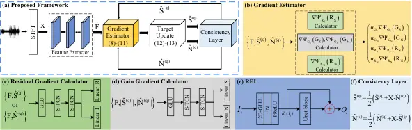

# MDNet: Learning Monaural Speech Enhancement from Deep Prior Gradient

Andong Li    Chengshi Zheng    Ziyang Zhang    Xiaodong Li

###### Abstract

While traditional statistical signal processing model-based methods can
derive the optimal estimators relying on specific statistical
assumptions, current learning-based methods further promote the
performance upper bound via deep neural networks but at the expense of
high encapsulation and lack adequate interpretability. Standing upon the
intersection between traditional model-based methods and learning-based
methods, we propose a model-driven approach based on the maximum a
posteriori (MAP) framework, termed as MDNet, for single-channel speech
enhancement. Specifically, the original problem is formulated into the
joint posterior estimation _w.r.t._ speech and noise components.
Different from the manual assumption toward the prior terms, we propose
to model the prior distribution via networks and thus can learn from
training data. The framework takes the unfolding structure and in each
step, the target parameters can be progressively estimated through
explicit gradient descent operations. Besides, another network serves as
the fusion module to further refine the previous speech estimation. The
experiments are conducted on the WSJ0-SI84 and Interspeech2020
DNS-Challenge datasets, and quantitative results show that the proposed
approach outshines previous state-of-the-art baselines.

^(†)^(†)address: ¹Key Laboratory of Noise and Vibration Research,
Institute of Acoustics, Chinese Academy of Sciences, Beijing, China  
²University of Chinese Academy of Sciences, Beijing, China  
³Advanced Computing and Storage Lab, Huawei Technologies Co. Ltd.,
Beijing, China ^(†)^(†)email: {liandong, cszheng, lxd}@mail.ioa.ac.cn,
{zhangziyang11}@huawei.com

Index Terms: monaural speech enhancement, gradient descent method, deep
prior, deep neural networks

## 1 Introduction

The enhancement of noisy speech in real acoustic scenarios is a
challenging task, especially for low signal-to-noise ratios (SNRs) or
non-stationary noises \[1\]. Recently, the advent of deep neural
networks (DNNs) has significantly promoted the development of the speech
enhancement (SE) \[2\] and leads to giant performance leaps over
traditional methods.

For conventional DNN-based methods, sophisticated network structures are
often devised in an end-to-end manner to learn the nonlinear mapping
relations between input and output pairs \[3, 4\]. Despite being
feasible and efficient, they lack interpretability as the whole network
is designed in a black-box manner. As a solution, some more recent works
attempt to decompose the original task into multiple sub-steps and
provide intermediate supervision as the prior information to boost the
subsequent optimization progressively \[5, 6, 7\]. Increasing results
show that compared with the single-stage paradigm with blind prior, the
introduction of pre-estimated prior can lead to more accurate target
estimation. Nonetheless, it is still far from affirmative how to
decompose the mapping task optimally, and current multi-stage strategies
seem to be empirical and intuitive.

In traditional statistical signal processing based SE methods, they
usually derive optimal complex-spectral or spectral magnitude
estimators \[8, 9\] following specific optimization criteria, _e.g._,
maximum likelihood (ML), the Bayesian maximum a posteriori (MAP), and
minimum squared error (MMSE). In detail, when specific prior terms and
conditional distribution assumptions are provided, the optimal parameter
estimator can be obtained using Bayes’ theorem. It is evident that the
performance of these model-based methods largely hinges on the model
accuracy and rationality of the prior distribution that is often
manually designed and can heavily degrade in adverse environments. In
contrast, existing learning (NN)-based methods are highly-encapsulated,
which skip the prior estimation and directly map to the target in a
data-driven manner. Therefore, it will be attractive and meaningful to
investigate the integration of both categories and leverage their
respective merits.

In this paper, we propose a model-driven network, termed as MDNet, for
monaural speech enhancement. Different from previous blind NN-based
works, we devise our method following the MAP criterion, which empowers
each module with better interpretability. Concretely, under the MAP
guidance, our enhancement task is converted into the joint posterior
estimation problem _w.r.t._ speech and noise. Instead of manually
designing the prior distribution in traditional SE algorithms, we
propose to learn the speech/noise priors from training data, which can
effectively fit real parameter distribution. Besides, the unfolding
strategy is proposed, where we explicitly predict the prior gradient and
update the target in each iterative step. To our best knowledge, this is
the first time to propose the deep prior gradient method in the speech
front-end field and we expect it to promote the combination of
model-based and learning-based methods. We conduct the experiments on
the WSJ0-SI84 and DNS-Challenge datasets and quantitative results show
that the proposed approach yields competitive performance over current
top-performed SE systems.

The rest of the paper is organized as follows. In Section 2, we
formulate the problem and introduce the MAP criterion. In Section 3, the
proposed approach is presented. Experimental setup is given in
Section 4, and we present the results and analysis in Section 5. Some
conclusions are drawn in Section 6.

## 2 Problem formulation and MAP

In the short-time Fourier transform (STFT) doamin, the observed mixture
speech can be modeled as

```math
\displaystyle X_{k,l}=S_{k,l}+N_{k,l}, \tag{1}
```

where $`\left\{X_{k,l},S_{k,l},N_{k,l}\right\}`$ are the corresponding
variables in the freqency index of $`k\in\left\{1,...,K\right\}`$ and
time index of $`l\in\left\{1,...,L\right\}`$.

In conventional DNN-based methods, the network serves as the mapping
function to estimate the target from input mixture, given as

```math
\displaystyle\widetilde{\mathbf{S}}=\mathcal{F}\left(\mathbf{X};\mathbf{\Theta}\right), \tag{2}
```

where $`\mathcal{F}\left(\cdot;\mathbf{\Theta}\right)`$ denotes the
network function with parameter set $`\mathbf{\Theta}`$, and tilde
symbol denotes the estimated variable. However, as the network directly
estimates the posterior probability from mixtures, it lacks the prior
term and the performance may suffer from heavy degradation under low
SNRs. To resolve this problem, we reformulate the problem based on the
MAP framework:

```math
\mathop{\arg\max}_{\mathbf{S},\mathbf{N}}P\left(\mathbf{S},\mathbf{N}|\mathbf{X}\right)\propto\mathop{\arg\max}_{\mathbf{S},\mathbf{N}}P\left(\mathbf{X}|\mathbf{S},\mathbf{N}\right)P\left(\mathbf{S}\right)P\left(\mathbf{N}\right), \tag{3}
```

where $`P\left(\mathbf{S},\mathbf{N}|\mathbf{X}\right)`$ denotes the
joint posterior probability of $`\left\{\mathbf{S},\mathbf{N}\right\}`$,
$`P\left(\mathbf{X}|\mathbf{S},\mathbf{N}\right)`$ is the conditional
probability of $`\mathbf{X}`$, and $`P\left(\mathbf{S}\right)`$,
$`P\left(\mathbf{N}\right)`$ denote the prior probability of speech and
noise. Eqn.(3) holds when speech and noise are assumed to be
statistically independent.

In traditional SE methods, speech and noise are often assumed to follow
certain probability distributions, where complex Gaussian distribution
is most widely used \[10\]. In contrast, in this study we focus on the
reconstruction error $`\mathbf{E}=\mathbf{X}-\mathbf{S}-\mathbf{N}`$ and
assume that it follows the zero-mean multivariate complex Gaussian
probability density function (PDF), _i.e._,
$`\mathcal{N}_{\mathbb{C}}\left(\mathbf{0},\mathbf{\Lambda}\right)`$.
For modeling convenience, we assume $`\mathbf{\Lambda}`$ is
time-invariant and take a negative logarithmic operation on both sides
of Eqn.(3), it can then be rewritten as

```math
\displaystyle\mathop{\arg\min}_{\mathbf{S},\mathbf{N}}\left\|\mathbf{X}-\mathbf{S}-\mathbf{N}\right\|_{F}^{2}+\alpha_{S}\Psi_{S}\left(\mathbf{S}\right)+\alpha_{N}\Psi_{N}\left(\mathbf{N}\right), \tag{4}
```

where
$`\left\{\Psi_{S}\left(\mathbf{S}\right),\Psi_{N}\left(\mathbf{N}\right)\right\}`$
are prior terms of speech and noise with distribution parameters
$`\left\{\alpha_{S},\alpha_{N}\right\}`$. In \[11\], the authors
revealed the optimization compensation effect between magnitude and
phase during the complex spectrum recovery process. To dampen this
effect, a collaborative complex spectrum reconstruction method was
developed, where the complex spectrum recovery can be decoupled into
magnitude filtering with range of $`\left(0,1\right)`$ and complex
residual mapping \[12\]. As such, we rewrite the speech and noise as

```math
\displaystyle\mathbf{S}=\mathbf{G}_{S}\mathbf{X}+\mathbf{R}_{S}, \tag{5}
```

```math
\displaystyle\mathbf{N}=\mathbf{G}_{N}\mathbf{X}+\mathbf{R}_{N}, \tag{6}
```

where $`\mathbf{G}`$ and $`\mathbf{R}`$ namely refer to real-valued
gains and complex residual components. If we regard the prior term
$`\left\{\mathbf{S},\mathbf{N}\right\}`$ as the joint prior of
$`\left\{\mathbf{G},\mathbf{R}\right\}`$ and further assume that they
are statistically independent, Eqn.(4) can be rewritten as

```math
\begin{split}\mathop{\arg\min}_{\mathbf{G}_{S},\mathbf{G}_{N},\mathbf{R}_{S},\mathbf{R}_{S}}&\left\|(\mathbf{1}-\mathbf{G}_{S}-\mathbf{G}_{N})\mathbf{X}-\mathbf{R}_{S}-\mathbf{R}_{N}\right\|_{F}^{2}+\\
&\alpha_{G_{S}}\Psi_{G_{S}}\left(\mathbf{G}_{S}\right)+\alpha_{G_{N}}\Psi_{G_{N}}\left(\mathbf{G}_{N}\right)\\
&+\alpha_{R_{S}}\Psi_{R_{S}}\left(\mathbf{R}_{S}\right)+\alpha_{R_{N}}\Psi_{R_{N}}\left(\mathbf{R}_{N}\right).\end{split} \tag{7}
```



Figure 1: (a) Overall diagram of the proposed framework. (b) Internal
structure of the gradient estimator. (c) Internal structure of the
residual gradient calculator. (d) Internal structure of the gain
gradient calculator. (e) Internal structure of the recalibration
encoding layer. (f) Internal operation of the consistency layer.
Different modules are indicated with different colors for better
visualization.

## 3 Proposed approach

### 3.1 Iterative gradient descent optimization

To solve the multi-target optimization problem in Eqn.(7), let us assume
the prior terms are differentiable, then the problem can be addressed
via the gradient descent method (GDM). Specifically, in the $`(q+1)`$th
iteration, we update the above four targets as follows:

```math
\widetilde{\mathbf{G}}_{S}^{(q+1)}=\widetilde{\mathbf{G}}_{S}^{(q)}-\eta_{G_{S}}\left(\nabla_{G_{S}}\mathbf{T}^{(q)}+\alpha_{G_{S}}\nabla_{G_{S}}\Psi_{G_{S}}\left(\widetilde{\mathbf{G}}_{S}^{(q)}\right)\right), \tag{8}
```

```math
\widetilde{\mathbf{G}}_{N}^{(q+1)}=\widetilde{\mathbf{G}}_{N}^{(q)}-\eta_{G_{N}}\left(\nabla_{G_{N}}\mathbf{T}^{(q)}+\alpha_{G_{N}}\nabla_{G_{N}}\Psi_{G_{N}}\left(\widetilde{\mathbf{G}}_{N}^{(q)}\right)\right), \tag{9}
```

```math
\widetilde{\mathbf{R}}_{S}^{(q+1)}=\widetilde{\mathbf{R}}_{S}^{(q)}-\eta_{R_{S}}\left(\nabla_{R_{S}}\mathbf{T}^{(q)}+\alpha_{R_{S}}\nabla_{R_{S}}\Psi_{R_{S}}\left(\widetilde{\mathbf{R}}_{S}^{(q)}\right)\right),\\
 \tag{10}
```

```math
\widetilde{\mathbf{R}}_{N}^{(q+1)}=\widetilde{\mathbf{R}}_{N}^{(q)}-\eta_{R_{N}}\left(\nabla_{R_{N}}\mathbf{T}^{(q)}+\alpha_{R_{N}}\nabla_{R_{N}}\Psi_{R_{N}}\left(\widetilde{\mathbf{R}}_{N}^{(q)}\right)\right), \tag{11}
```

where
$`\mathbf{\eta}=\left\{\eta_{G_{S}},\eta_{G_{N}},\eta_{R_{S}},\eta_{R_{N}}\right\}`$
denote the optimization step of the four parameters, and
$`\mathbf{T}^{(q)}`$ denotes the quadratic term in Eq. (7). The total
iteration number is notated as $`Q`$. While the gradient of the
quadratic term can be easily calculated, it remains troublesome on how
to obtain the gradient representation of the above prior terms. In this
regard, we propose to learn the prior gradients with the network and can
thus be directly learned from training data.

After gradient descent, accoding to Eqns.(5) and (6), we can reconstruct
the speech and noise components as

```math
\displaystyle\widetilde{\mathbf{S}}^{(q+1)}=\widetilde{\mathbf{G}}_{S}^{(q+1)}\mathbf{X}+\widetilde{\mathbf{R}}_{S}^{(q+1)}, \tag{12}
```

```math
\displaystyle\widetilde{\mathbf{N}}^{(q+1)}=\widetilde{\mathbf{G}}_{N}^{(q+1)}\mathbf{X}+\widetilde{\mathbf{R}}_{N}^{(q+1)}. \tag{13}
```

### 3.2 Proposed model-driven framework

#### 3.2.1 Forward stream

To enable the gradient update iteratively, we devise an unfolding-style
framework, whose overall diagram is shown in Fig. 1(a). It has four
major parts, namely feature extractor, gradient estimator, target
update, and consistency layer. Given the input of noisy complex spectrum
$`\mathbf{X}\in\mathbb{R}^{2\times K\times L}`$, it first passes through
multiple 2D convolution (2D-Conv) layers with consecutive frequency
downsampling operations to extract the spectral features, say,
$`\mathbf{F}`$. In the $`q`$th GDM iteration, given the input
$`\left\{\mathbf{F},\widehat{\mathbf{S}}^{(q-1)},\widehat{\mathbf{N}}^{(q-1)}\right\}`$,
the gradient estimator will predict the prior gradients _w.r.t._ the
four parameters in Eqn.(7) and implement the gradient descent for
updating, which are utilized to reconstruct the speech and noise targets
simultaneously. The updated parameters are further modified as the
inputs of the next iteration via the consistency layer \[13\], whose
calculation process is detailed in Fig. 1(f). For practical
implementation, we unfold the process for $`Q`$ times, and the whole
forward stream is formulated as

```math
\displaystyle\mathbf{F}=\text{Encoder}\left(\mathbf{X}\right), \tag{14}
```

```math
\displaystyle\mathbf{\Omega}^{(q)}=\text{GradientUpdate}\left(\mathbf{F},\mathbf{\Omega}^{(q-1)}\right), \tag{15}
```

```math
\displaystyle\left\{\widetilde{\mathbf{S}}^{(q)},\widetilde{\mathbf{N}}^{(q)}\right\}=\text{TargetUpdate}\left(\mathbf{\Omega}^{(q)}\right), \tag{16}
```

```math
\displaystyle\left\{\widehat{\mathbf{S}}^{(q)},\widehat{\mathbf{N}}^{(q)}\right\}=\text{ConsistencyLayer}\left\{\widetilde{\mathbf{S}}^{(q)},\widetilde{\mathbf{N}}^{(q)}\right\}, \tag{17}
```

where $`\mathbf{\Omega}^{(q)}`$ is the parameter set for the above four
parameters and $`q\in\left\{1,...,Q\right\}`$. Note that as decent
parameter initialization is indispensable for later gradient updates, we
adopt the network with the same structure as the gradient estimator to
generate the initialized parameter estimation $`\emph{i.e.}`$,
$`\widetilde{\mathbf{G}}_{S}^{(0)},\widetilde{\mathbf{G}}_{N}^{(0)},\widetilde{\mathbf{R}}_{S}^{(0)},\widetilde{\mathbf{R}}_{N}^{(0)}`$.

#### 3.2.2 Feature extractor

Like \[12\], in the feature extractor, we utilize recalibration encoding
layers (RELs) to gradually downsample the feature map and abstract the
features. The internal structure of each REL is shown in Fig. 1(e).
Except for 2D-GLU \[14\], a UNet-block is followed with residual
connection \[15\], which is akin to UNet and takes the current feature
map as the input and further encodes the feature. Compared with vanilla
2D-Conv, the UNet-block can explore features with multiple scales.
Besides, the introduction of residual connection can effectively
recalibrate the feature distribution and preserve the spectral patterns.

#### 3.2.3 Gradient estimator

The internal structure of the proposed gradient estimator (GE) is
presented in Fig. 1(b). As stated above, the input includes the
extracted feature $`\mathbf{F}`$, the modified speech
$`\widehat{\mathbf{S}}^{(q)}`$, and noise $`\widehat{\mathbf{N}}^{(q)}`$
after the consistency layer. As Fig. 1(b) shows, three gradient
calculators are adopted, where the gain gradient calculator (GGC) is
used to derive the gain gradients of both speech and noise, and another
two complex residual gradient calculators (RGCs) aim at gradient
prediction of the speech and noise residual, respectively. Note that we
share the GGC for speech and noise as the gain function actually serves
as the speech presence probability (SPP) in traditional SE algorithms
and that of speech and noise are complementary from statistical
perspective \[16\].

The internal structure of RGC is presented in Fig. 1(c). Take the speech
branch as an example, we first flatten the complex spectrum as
$`\widehat{\mathbf{S}}^{(q)}\in\mathbb{R}^{2K\times L}`$ and then
concatenate with $`\mathbf{F}`$ as the network input. The network first
compresses the feature with 1D-GLU and then models the gradient
distribution with stacked temporal convolution networks (TCNs) \[17\].
To alleviate the parameter burden, we adopt the simplified version,
termed as S-TCNs \[18\], which can dramatically decrease the parameters.
The prior gradients of the complex residual are attained with two linear
layers, namely for real and imaginary (RI) parts. For GGC, it has the
similar structure except the input is the concatenation of
$`\mathbf{F}`$ and the magnitude of speech and noise, say,
$`\text{Concat}\left(\mathbf{F},\widehat{\mathbf{S}}^{(q)},\widehat{\mathbf{N}}^{(q)}\right)`$.
The gain gradients _w.r.t._ speech and noise are obtained via two linear
layers.

#### 3.2.4 Target fusion

After repeating target updates, we obtain the estimates of speech and
noise, _i.e._, $`\widetilde{\mathbf{S}}^{(Q)}`$,
$`\widetilde{\mathbf{N}}^{(Q)}`$. Then another problem arises, _how can
we fuse the estimated speech and noise components to obtain the final
speech estimation?_ A common strategy is to apply a network to estimate
time-frequency (T-F) bin-level weights and fuse both components
dynamically \[19\], _i.e._,
$`\mathbf{M}\widetilde{\mathbf{S}}^{(Q)}+\left(\mathbf{1}-\mathbf{M}\right)\left(\mathbf{X}-\widetilde{\mathbf{N}}^{(Q)}\right)`$.
However, it is a linear combination within each T-F bin. Motivated
by \[20\], we propose a residual recalibration module to better fuse the
speech and noise parts. Concretely, given the original noisy and the
estimated speech and noise as the input, a network is employed to
estimate the residual structure, which is then added by the estimated
speech:

```math
\widetilde{\mathbf{S}}^{(Q)^{\prime}}\leftarrow\widetilde{\mathbf{S}}^{(Q)}+\text{FuseNet}\left(\mathbf{X},\widetilde{\mathbf{S}}^{(Q)},\widetilde{\mathbf{N}}^{(Q)}\right). \tag{18}
```

Differnet from the linear combination, it works with residual learning
and gives nonlinear output, which can better leverage the
complementarity between speech and noise.

#### 3.2.5 Loss function

As the unfolding structure is utilized in the forward stream, we adopt
the weighted loss for network training, given as

```math
\displaystyle\mathcal{L}=\sum_{q=0}^{Q}\gamma_{q}\mathcal{L}_{q}+\zeta\mathcal{L}_{Q}^{(f)}, \tag{19}
```

where $`\gamma_{q}`$ and $`\zeta`$ are the weighting coefficients, and
$`\mathcal{L}_{Q}^{(f)}`$ denotes the loss in the target fusion stage.
Here $`\gamma_{q}`$ and $`\zeta`$ are empirically set to 0.1 and 1,
respectively. For $`\mathcal{L}_{q}`$ and $`\mathcal{L}_{Q}^{(f)}`$ we
have

```math
\mathcal{L}_{q}=\frac{1}{2}\left(\mathcal{L}\left(\widetilde{\mathbf{S}}^{(q)\beta},\mathbf{S}^{\beta}\right)+\mathcal{L}\left(\widetilde{\mathbf{N}}^{(q)\beta},\mathbf{N}^{\beta}\right)\right), \tag{20}
```

```math
\mathcal{L}_{Q}=\mathcal{L}\left(\widetilde{\mathbf{S}}^{(Q)^{\prime}\beta},\mathbf{S}^{\beta}\right), \tag{21}
```

where the MSE criterion is adopted for network training and $`\beta`$ is
the power-compressed coefficient and empirically set to 0.5 \[21\].
Besides, the RI loss with magnitude constraint is adopted, which can
mitigate the compensation effect in the complex spectrum
recovery \[20\].

|       |        |       |       |        |                  |                      |                       |
| ----- | ------ | ----- | ----- | ------ | ---------------- | -------------------- | --------------------- |
| Entry | Param. | MACs  | $`Q`$ | Fusion | PESQ$`\uparrow`$ | ESTOI(%)$`\uparrow`$ | SISNR(dB)$`\uparrow`$ |
|       | (M)    | (G/s) |       | type   |                  |                      |                       |
| 1a    | 3.00   | 2.16  | 0     | R      | 2.71             | 74.05                | 10.00                 |
| 1b    | 4.79   | 2.34  | 1     | R      | 2.75             | 74.95                | 10.50                 |
| 1c    | 6.57   | 2.52  | 2     | R      | 2.76             | 75.44                | 10.66                 |
| 1d    | 8.36   | 2.70  | 3     | R      | 2.79             | 76.03                | 10.81                 |
| 1e    | 10.15  | 2.88  | 4     | R      | 2.79             | 76.06                | 10.78                 |
| 1f    | 11.93  | 3.06  | 5     | R      | 2.82             | 76.55                | 10.93                 |
| 1g    | 13.72  | 3.24  | 6     | R      | 2.79             | 76.21                | 10.84                 |
| 2a    | 7.85   | 2.38  | 3     | A      | 2.73             | 74.41                | 10.38                 |
| 2b    | 8.33   | 2.68  | 3     | G      | 2.77             | 75.30                | 10.59                 |

Table 1: Ablation study on the proposed MDNet. The values are specified
with PESQ/ESTOI(%)/SISNR(dB) format. BOLD indicates the best score in
each case. All the values are averaged among different SNRs and nosies
in the test set.

|                   |      |     |                     |                  |                     |                        |                     |                  |                     |                       |
| ----------------- | ---- | --- | ------------------- | ---------------- | ------------------- | ---------------------- | ------------------- | ---------------- | ------------------- | --------------------- |
| Methods           | Year | Do. | w/ Reverberation    |                  |                     |                        | w/o Reverberation   |                  |                     |                       |
|                   |      |     | WB-PESQ$`\uparrow`$ | PESQ$`\uparrow`$ | STOI(%)$`\uparrow`$ | SISNR (dB)$`\uparrow`$ | WB-PESQ$`\uparrow`$ | PESQ$`\uparrow`$ | STOI(%)$`\uparrow`$ | SISNR(dB)$`\uparrow`$ |
| Noisy             | \-   | \-  | 1.82                | 2.75             | 86.62               | 9.03                   | 1.58                | 2.45             | 91.52               | 9.07                  |
| NSNet \[22\]      | 2020 | T-F | 2.37                | 3.08             | 90.43               | 14.72                  | 2.15                | 2.87             | 94.47               | 15.61                 |
| DTLN \[23\]       | 2020 | T-F | \-                  | 2.70             | 84.68               | 10.53                  | \-                  | 3.04             | 94.76               | 16.34                 |
| DCCRN \[24\]      | 2020 | T-F | \-                  | 3.32             | \-                  | \-                     | \-                  | 3.27             | \-                  | \-                    |
| FullSubNet \[25\] | 2021 | T-F | 2.97                | 3.47             | 92.62               | 15.75                  | 2.78                | 3.31             | 96.11               | 17.29                 |
| TRU-Net \[26\]    | 2021 | T-F | 2.74                | 3.35             | 91.29               | 14.87                  | 2.86                | 3.36             | 96.32               | 17.55                 |
| CTS-Net \[20\]    | 2021 | T-F | 3.02                | 3.47             | 92.70               | 15.58                  | 2.94                | 3.42             | 96.66               | 17.99                 |
| GaGNet \[12\]     | 2022 | T-F | 3.18                | 3.57             | 93.22               | 16.57                  | 3.17                | 3.56             | 97.13               | 18.91                 |
| MDNet(Ours)       | 2022 | T-F | 3.24                | 3.59             | 93.61               | 16.94                  | 3.18                | 3.56             | 97.20               | 19.17                 |

Table 3: Quantitative comparisons with other state-of-the-art systems on
the DNS Challenge dataset. “-” denotes no published result.

## 4 Experimental setup

Two datasets are adopted to carry out the experiments. WSJ0-SI84 \[27\]
consists of 7138 utterances by 83 speakers (42 males and 41 females).
5428 and 957 utterances are selected for training and validation, and
150 utterances spoken by unseen speakers are for testing. Around 20,000
types of noises are randomly selected from the DNS-Challenge noise set
as the training noise set and mixed with clean utterances under SNRs
$`[-5\rm{dB},0\rm{dB}]`$ with $`1\rm{dB}`$ interval. For testing, three
challenging unseen noises are chosen, namely babble, factory1 from
NOISEX92 \[28\] and cafeteria from CHiME-3 \[29\] under three SNRs,
_i.e._, $`\left\{-3,0,3\right\}\rm{dB}`$. Totally, we create 150,000,
10,000 noisy-clean pairs for training and validation. For testing, 150
pairs are created for each SNR. Interspeech2020 DNS-Challenge¹¹ 1
https://github.com/microsoft/DNS-Challenge provides 562.72 hours clips
from 2150 speakers and 181 hours of 60,000 clips from 150 classes. For
model evaluation, it provides a non-blind validation set with two
categories, namely with and without reverberation, and each includes 150
noisy-clean pairs. Following the script given by the organizer, we
create around 3000 hours of pairs for training, and the input SNR ranges
from -5dB to 15dB.

In the feature extractor, the kernel size and stride of 2D-Convs are
$`\left(1,3\right)`$ and $`\left(1,2\right)`$ along the time and
frequency axes, respectively. For each UNet-block, the kernel size is
$`\left(2,3\right)`$. The channel number of 2D-Convs remains 64 by
default. Let us notate the number of (de)encoder layers in the $`i`$th
UNet-block as $`U_{i}`$, then $`U=\left\{4,3,2,1,0\right\}`$ where $`0`$
means no UNet-block is used. Two groups of S-TCNs are employed, each of
which includes four temporal convolution modules (TCMs), with the kernel
size of the dilated Convs and dilation rates being 3 and
$`\left\{1,2,5,9\right\}`$, respectively. Note that we take causal
convolution operations by zero-padding along the past frames. The
optimization step $`\mathbf{\eta}`$ is set as trainable and initialized
at 0.01.

All the utterances are sampled at 16 kHz. 20 ms Hanning window is
utilized with 50% overlap between adjacent frames. 320-point FFT is
utilized, leading to 161-D features in the frequency axis. The model is
trained on the Pytorch platform with an NVIDIA V100 GPU. Adam optimizer
is adopted for network training ($`\beta_{1}=0.9`$, $`\beta_{2}=0.999`$)
and the total epoch is 60 with batch size being 8. The learning rate is
initialized at 5e-4 and we halve the value if the validation loss does
not decrease for consecutive two epochs. For fusing speech and noise
components, we adopt the same “Encoder-TCN-Decoder” structure as \[20\]
except we adopt a lightweight version by halving the channel number in
the 2D-Convs.

|                   |      |     |        |       |                  |                   |                   |
| ----------------- | ---- | --- | ------ | ----- | ---------------- | ----------------- | ----------------- |
| Methods           | Year | Do. | Param. | MACs  | PESQ$`\uparrow`$ | ESTOI$`\uparrow`$ | SISNR$`\uparrow`$ |
|                   |      |     | (M)    | (G/s) |                  | (%)               | (dB)              |
| Noisy             | -    | -   | -      | -     | 1.82             | 41.97             | 0.00              |
| DDAEC \[30\]      | 2020 | T   | 4.82   | 36.56 | 2.76             | 74.84             | 10.85             |
| DEMUCAS \[31\]    | 2020 | T   | 18.87  | 4.35  | 2.67             | 76.23             | 11.08             |
| GCRN \[3\]        | 2020 | T-F | 9.77   | 2.42  | 2.48             | 70.68             | 9.21              |
| DCCRN \[24\]      | 2020 | T-F | 3.67   | 11.13 | 2.54             | 70.58             | 9.47              |
| PHASEN \[32\]     | 2020 | T-F | 8.76   | 6.12  | 2.73             | 71.77             | 9.38              |
| FullSubNet \[25\] | 2021 | T-F | 5.64   | 31.35 | 2.55             | 65.89             | 9.16              |
| CTSNet \[20\]     | 2021 | T-F | 4.35   | 5.57  | 2.86             | 76.15             | 10.92             |
| GaGNet \[12\]     | 2022 | T-F | 5.94   | 1.63  | 2.86             | 76.87             | 10.93             |
| MDNet(Ours)       | 2022 | T-F | 8.36   | 2.70  | 2.88             | 77.37             | 11.12             |

Table 2: Quantitative comparisons with other SOTA systems on WSJ0-SI84
dataset. Scores are averaged upon different testing cases. “Do.” denotes
the tranform domain of the method.

## 5 Results and analysis

### 5.1 Ablation study

Around 100 hours of training data from the WSJ0-SI84 corpus are used to
conduct the ablation study in terms of step number $`Q`$ and fusion
type. Three evaluation metrics are utilized, namely PESQ \[33\],
ESTOI \[34\], and SISNR \[35\]. Higher values indicate better
performance. Quantitative results are shown in Table 1 and several
observations can be made. First, with the increase of steps, one can
observe notable performance improvements over the non-update case (entry
1a), which shows that by gradient updating, we can obtain more accurate
parameter estimation, leading to better reconstruction results. However,
with more steps, the performance tends to get saturated and even
degraded, _e.g._, from 1f to 1g. It can be explained as the estimation
with GDM tends to get converged and GDM can not guarantee consistent
optimization with the increase of steps for the non-convex optimization
problem. Second, we compare three fusion strategies, namely “R” (the
proposed fusion method), “G” (dynamic weighting), and “A” (average), and
one can see that our method yields the best performance among above
fusion schemes. It reveals the superiority of the proposed nonlinear
residual fusion over dynamic weighting. Note that the average operation
is the special case of dynamic weighting, where the weighting
coefficients remain 0.5 for all T-F bins. However, as the local SNR
varies a lot in different frequency bands, it is not reasonable to
combine both parts with fixed weights, which can be proved from the
notable performance degradations from entry 2b to 2a.

### 5.2 Comparsion with state-of-the-art methods

Based on the analysis in the ablation study, we choose entry 1d as the
default network configuration, which well balances between calculation
complexity and performance, to compare with current top-performed SE
systems. Quantitative results on the WSJ0-SI84 dataset are presented in
Table 2. Compared with another eight baselines, the proposed approach
yields the highest scores among three objective metrics, validating the
superiority of our method in speech quality and intelligibility. Note
that despite our method has around 8.36M trainable parameters, it is
rather advantageous in MACs, say, 2.70G/s, which reveals the gap in
trainable parameters and computation complexity.

We also report the quantitative results on the DNS-Challenge non-blind
test set, as shown in Table 3. The wide-band version of PESQ
(WB-PESQ) \[36\] and STOI \[37\] are also listed for evaluation. From
the results, one can see that again, our method achieves the highest
scores in different metrics over previous top-performed systems, which
further attests to the superiority of our method under both reverberant
and anechoic environments. Remark that different from previous
literature where the mapping process lacks adequate interpretability,
our method follows the MAP criterion and is explicitly optimized with
the gradient descent method. Therefore, we think it is a promising
direction to leverage the advantage of model-based methods to gradually
open the black-box of DNNs in the speech enhancement area.

## 6 Conclusions

In this paper, we propose a model-driven approach to tackle
single-channel speech enhancement. Specifically, based on the maximum a
posteriori criterion, the original problem is formulated into the joint
posterior estimation of speech and noise, and it is proposed that deep
prior distribution is learned via the network from training data. The
framework is devised with the unfolding structure and the gradient
descent method is employed to update parameter estimation and facilitate
the target reconstruction progressively. Besides, another network serves
as the fusion module to further recover the speech component from
previous estimations. Experimental results on the WSJ0-SI84 and
DNS-Challenge datasets show that the proposed approach performs
favorably against previous top-performed SE systems.

## References

- \[1\] P. C. Loizou, _Speech enhancement: theory and practice_. CRC
  press, 2013.
- \[2\] D. Wang and J. Chen, “Supervised speech separation based on deep
  learning: An overview,” _IEEE/ACM Trans. Audio. Speech,
  Lang. Process._, vol. 26, no. 10, pp. 1702–1726, 2018.
- \[3\] K. Tan and D. Wang, “Learning complex spectral mapping with
  gated convolutional recurrent networks for monaural speech
  enhancement,” _IEEE/ACM Trans. Audio. Speech, Lang. Process._,
  vol. 28, pp. 380–390, 2020.
- \[4\] Y. Luo and N. Mesgarani, “Conv-TasNet: Surpassing ideal
  time–frequency magnitude masking for speech separation,” _IEEE/ACM
  Trans. Audio. Speech, Lang. Process._, vol. 27, no. 8, pp.
  1256–1266, 2019.
- \[5\] A. Li, M. Yuan, C. Zheng, and X. Li, “Speech enhancement using
  progressive learning-based convolutional recurrent neural network,”
  _Appl. Acoust._, vol. 166, p. 107347, 2020.
- \[6\] A. Li, W. Liu, X. Luo, G. Yu, C. Zheng, and X. Li, “A
  simultaneous denoising and dereverberation framework with target
  decoupling,” in _Proc. Interspeech_, 2021, pp. 2801–2805.
- \[7\] X. Hao, X. Su, S. Wen, Z. Wang, Y. Pan, F. Bao, and W. Chen,
  “Masking and inpainting: A two-stage speech enhancement approach for
  low SNR and non-stationary noise,” in _Proc. ICASSP_. IEEE, 2020, pp.
  6959–6963.
- \[8\] T. Gerkmann, “Bayesian estimation of clean speech spectral
  coefficients given a priori knowledge of the phase,” _IEEE Trans.
  Signal Process._, vol. 62, no. 16, pp. 4199–4208, 2014.
- \[9\] T. Gerkmann and M. Krawczyk, “MMSE-optimal spectral amplitude
  estimation given the STFT-phase,” _IEEE Signal Process. Lett._,
  vol. 20, no. 2, pp. 129–132, 2012.
- \[10\] Y. Ephraim and D. Malah, “Speech enhancement using a
  minimum-mean square error short-time spectral amplitude estimator,”
  _IEEE Trans. Acoust., Speech, Signal Process._, vol. 32, no. 6, pp.
  1109–1121, 1984.
- \[11\] Z.-Q. Wang, G. Wichern, and J. Le Roux, “On The Compensation
  Between Magnitude and Phase in Speech Separation,” _IEEE Signal
  Process. Lett._, vol. 28, pp. 2018–2022, 2021.
- \[12\] A. Li, C. Zheng, L. Zhang, and X. Li, “Glance and gaze: A
  collaborative learning framework for single-channel speech
  enhancement,” _Appl. Acoust._, vol. 187, p. 108499, 2022.
- \[13\] S. Wisdom, J. R. Hershey, K. Wilson, J. Thorpe, M. Chinen,
  B. Patton, and R. A. Saurous, “Differentiable consistency constraints
  for improved deep speech enhancement,” in _Proc. ICASSP_. IEEE, 2019,
  pp. 900–904.
- \[14\] Y. N. Dauphin, A. Fan, M. Auli, and D. Grangier, “Language
  modeling with gated convolutional networks,” in _Proc. ICML_. PMLR,
  2017, pp. 933–941.
- \[15\] X. Qin, Z. Zhang, C. Huang, M. Dehghan, O. R. Zaiane, and
  M. Jagersand, “U2-net: Going deeper with nested U-structure for
  salient object detection,” _Pattern Recognition_, vol. 106, p.
  107404, 2020.
- \[16\] T. Yoshioka, N. Ito, M. Delcroix, A. Ogawa, K. Kinoshita,
  M. Fujimoto, C. Yu, W. J. Fabian, M. Espi, T. Higuchi _et al._, “The
  NTT CHiME-3 system: Advances in speech enhancement and recognition for
  mobile multi-microphone devices,” in _Proc. ASRU_. IEEE, 2015, pp.
  436–443.
- \[17\] S. Bai, J. Z. Kolter, and V. Koltun, “An empirical evaluation
  of generic convolutional and recurrent networks for sequence
  modeling,” _arXiv preprint arXiv:1803.01271_, 2018.
- \[18\] Q. Zhang, A. Nicolson, M. Wang, K. K. Paliwal, and C. Wang,
  “DeepMMSE: A deep learning approach to mmse-based noise power spectral
  density estimation,” _IEEE/ACM Trans. Audio. Speech, Lang. Process._,
  vol. 28, pp. 1404–1415, 2020.
- \[19\] C. Zheng, X. Peng, Y. Zhang, S. Srinivasan, and Y. Lu,
  “Interactive Speech and Noise Modeling for Speech Enhancement,” in
  _Proc. AAAI_, vol. 35, no. 16, 2021, pp. 14 549–14 557.
- \[20\] A. Li, W. Liu, C. Zheng, C. Fan, and X. Li, “Two Heads are
  Better Than One: A Two-Stage Complex Spectral Mapping Approach for
  Monaural Speech Enhancement,” _IEEE/ACM Trans. Audio. Speech,
  Lang. Process._, vol. 29, pp. 1829–1843, 2021.
- \[21\] A. Li, C. Zheng, R. Peng, and X. Li, “On the importance of
  power compression and phase estimation in monaural speech
  dereverberation,” _JASA Express Letters_, vol. 1, no. 1, p.
  014802, 2021.
- \[22\] C. Reddy, V. Gopal, R. Culter, E. Beyrami, R. Cheng, H. Dubey,
  S. Matusevych, R. Aichner, A. Aazami, S. Braun, P. Rana,
  S. Srinivasan, and J. Gehrke, “The interspeech 2020 deep noise
  suppression challenge: Datasets, subjective testing framework, and
  challenge results,” in _Proc. Interspeech_, 2020, pp. 2492–2496.
- \[23\] N. Westhausen and B. Meyer, “Dual-signal transformation lstm
  network for real-time noise suppression,” in _Proc. Interspeech_,
  2020, pp. 2477–2481.
- \[24\] Y. Hu, Y. Liu, S. Lv, M. Xing, S. Zhang, Y. Fu, J. Wu,
  B. Zhang, and L. Xie, “DCCRN: Deep complex convolution recurrent
  network for phase-aware speech enhancement,” in _Proc. Interspeech_,
  2020, pp. 2472–2476.
- \[25\] X. Hao, X. Su, R. Horaud, and X. Li, “Fullsubnet: A Full-Band
  and Sub-Band Fusion Model for Real-Time Single-Channel Speech
  Enhancement,” in _Proc. ICASSP_, 2021, pp. 6633–6637.
- \[26\] H. Choi, S. Park, J. Lee, H. Heo, D. Jeon, and K. Lee,
  “Real-Time Denoising and Dereverberation wtih Tiny Recurrent U-Net,”
  in _Proc. ICASSP_, 2021, pp. 5789–5793.
- \[27\] D. B. Paul and J. Baker, “The design for the wall street
  journal-based csr corpus,” in _Workshop on Speech and Natural Lang._,
  1992, pp. 357–362.
- \[28\] A. Varga and H. J. Steeneken, “Assessment for automatic speech
  recognition: II. NOISEX-92: A database and an experiment to study the
  effect of additive noise on speech recognition systems,”
  _Speech. Commun._, vol. 12, no. 3, pp. 247–251, 1993.
- \[29\] J. Barker, R. Marxer, E. Vincent, and S. Watanabe, “The third
  “CHiME” speech separation and recognition challenge: Dataset, task and
  baselines,” in _Proc. ASRU_. IEEE, 2015, pp. 504–511.
- \[30\] A. Pandey and D. Wang, “Densely connected neural network with
  dilated convolutions for real-time speech enhancement in the time
  domain,” in _Proc. ICASSP_, 2020, pp. 6629–6633.
- \[31\] A. Defossez, G. Synnaeve, and Y. Adi, “Real time speech
  enhancement in the waveform domain,” in _Proc. Interspeech_, 2020, pp.
  3291–3295.
- \[32\] D. Yin, C. Luo, Z. Xiong, and W. Zeng, “PHASEN: A
  phase-and-harmonics-aware speech enhancement network,” in
  _Proc. AAAI_, 2020, pp. 9458–9465.
- \[33\] A. W. Rix, J. G. Beerends, M. P. Hollier, and A. P. Hekstra,
  “Perceptual evaluation of speech quality (PESQ)-a new method for
  speech quality assessment of telephone networks and codecs,” in
  _Proc. ICASSP_, vol. 2. IEEE, 2001, pp. 749–752.
- \[34\] J. Jensen and C. H. Taal, “An algorithm for predicting the
  intelligibility of speech masked by modulated noise maskers,”
  _IEEE/ACM Trans. Audio. Speech, Lang. Process._, vol. 24, no. 11, pp.
  2009–2022, 2016.
- \[35\] J. Le Roux, S. Wisdom, H. Erdogan, and J. R. Hershey,
  “Sdr–half-baked or well done?” in _Proc. ICASSP_. IEEE, 2019, pp.
  626–630.
- \[36\] R. I.-T. P. ITU, “862.2: Wideband extension to
  recommendation p. 862 for the assessment of wideband telephone
  networks and speech codecs. itu-telecommunication standardization
  sector, 2007.”
- \[37\] C. H. Taal, R. C. Hendriks, R. Heusdens, and J. Jensen, “A
  short-time objective intelligibility measure for time-frequency
  weighted noisy speech,” in _Proc. ICASSP_. IEEE, 2010, pp. 4214–4217.
