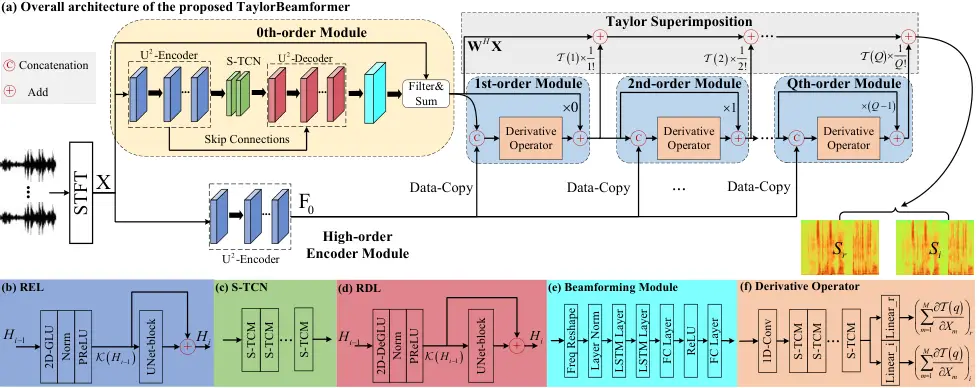
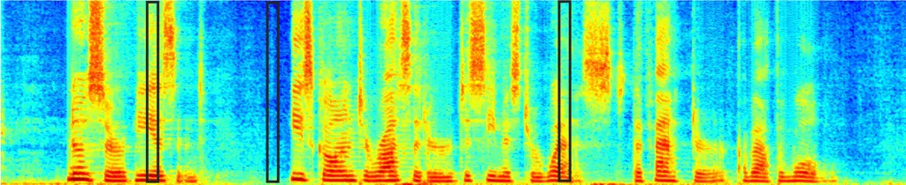
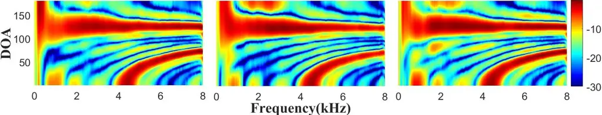

# TaylorBeamformer: Learning All-Neural Beamformer for Multi-Channel Speech Enhancement from Taylor’s Approximation Theory

Andong Li    Guochen Yu    Chengshi Zheng    Xiaodong Li

###### Abstract

While existing end-to-end beamformers achieve impressive performance in
various front-end speech processing tasks, they usually encapsulate the
whole process into a black box and thus lack adequate interpretability.
As an attempt to fill the blank, we propose a novel neural beamformer
inspired by Taylor’s approximation theory called TaylorBeamformer for
multi-channel speech enhancement. The core idea is that the recovery
process can be formulated as the spatial filtering in the neighborhood
of the input mixture. Based on that, we decompose it into the
superimposition of the 0th-order non-derivative and high-order
derivative terms, where the former serves as the spatial filter and the
latter is viewed as the residual noise canceller to further improve the
speech quality. To enable end-to-end training, we replace the derivative
operations with trainable networks and thus can learn from training
data. Extensive experiments are conducted on the synthesized dataset
based on LibriSpeech and results show that the proposed approach
performs favorably against the previous advanced baselines.

^(†)^(†)address: ¹Key Laboratory of Noise and Vibration Research,
Institute of Acoustics, Chinese Academy of Sciences, Beijing, China  
²University of Chinese Academy of Sciences, Beijing, China
^(†)^(†)email: {liandong, cszheng, lxd}@mail.ioa.ac.cn,
{yuguochen}@cuc.edu.cn

Index Terms: multi-channel speech enhancement, taylor’s approximation
theory, all-neural, deep neural networks

## 1 Introduction

Multi-channel speech enhancement (MCSE) aims at extracting target speech
from multiple noisy-reverberant microphone recording signals. A handful
of traditional beamforming-based algorithms have been proposed in the
past decades \[1\]. Recently, with the proliferation of deep neural
networks (DNNs), neural beamformers are viewed as a type of promising
technique in various applications like far-field speech restoration and
automatic speech recognition (ASR) \[2, 3\].

As a typical scheme, a DNN is first utilized to extract the target
speech, followed by traditional spatial filters \[4\], _e.g._, minimum
variance distortionless response (MVDR), and multi-channel Wiener filter
(MWF). The downside of this paradigm is that the two parts are processed
separately and the performance of spatial filtering utterly hinges on
the pre-estimation of the previous stage. Besides, the performance may
suffer from heavy performance degradation under frame-level processing
conditions. Another class regards MCSE as the extension of the
single-channel case, where the spatial cue is usually extracted either
manually or implicitly as the auxiliary feature to assist the
single-channel SE system \[5, 6\]. Despite the efficacy, it abandons the
preponderance of spatial filtering, leading to heavy nonlinear
distortion under adverse acoustic scenarios.

More recently, all-neural frame-level beamformers are investigated in
either time domain \[7, 8, 9\] or time-frequency (T-F) domain \[10, 11,
12, 13\]. Among these methods, frame-wise beamformer weights are
estimated by the network to implement the beamforming process and yield
impressive performance in noise suppression and source separation tasks.
Despite the effectiveness, they often neglect the reverberation
components and only consider the processing of directional sound
sources. This is because late reverberation is usually assumed to be
spatially diffused \[14\] and it is thus difficult to be canceled with
the beamforming technique, especially when the number of microphones is
limited. Besides, as the network is trained in an end-to-end manner, it
is expected to extract both spatial and spectral cues and serve as the
spatial-spectral processor \[12, 15\]. Therefore, the whole process is
actually encapsulated into a black box and lacks internal mechanism and
adequate interpretability.

According to the Woodbury matrix identity, MWF can be decomposed into
the tandem format of MVDR and spectral post-processing. Similarly, we
would like to raise a question, _whether it is possible to decouple
spatial and spectral processing modes for all-neural frame-wise
beamformer system?_ As a response, we propose an all-neural beamformer
framework termed TaylorBeamformer to address simultaneous denoising and
dereverberation. To be specific, we rethink the beamforming process and
formulate the target extraction into the distortionless spatial
filtering in the neighboring point of noisy input. Our core insight is
that if we are able to cancel the interference component within the
input in prior, the target speech can be perfectly recovered via spatial
filtering theoretically. This process can be represented via Taylor’s
approximation theory and we can thus formulate the whole beamforming
process into the superimposition of the 0th-order non-derivative and
high-order derivative terms, where the former implements the spatial
filtering to suppress the directional noise and the latter is tasked
with residual interference cancellation. Furthermore, we propose to
replace the derivative terms with learnable modules to support
end-to-end training. To our best knowledge, it is the first time to
apply Taylor’s approximation theory into the speech front-end field,
which provides a deep insight into all-neural beamformers and can help
us understand the logic behind the model.

The rest of the paper is structured as follows. In Section 2, the
problem formulation is introduced. In Section 3, the proposed method is
presented in detail. Section 4 gives the experimental setup, and results
and analysis are presented in Section 5. Some conclusions are drawn in
Section 6.



Figure 1: (a) Overall diagram of the proposed TaylorBeamformer. (b)
Internal structure of recalibration encoding layer (REL). (c) Internal
structure of S-TCN. (d) Internal structure of recalibration decoding
layer (RDL). (e) Internal structure of beamforming module. (f) Internal
structure of derivator operator. Different modules are highlighted with
different colors for better visualization.

## 2 Problem formulation

With short-time Fourier transform (STFT), the noisy-reverberant signals
observed by an $`M`$-channel array can be modeled as

```math
\displaystyle\mathbf{X}_{t,f}=\mathbf{c}_{f}S_{t,f}+\mathbf{V}_{t,f}+\mathbf{N}_{t,f}=\mathbf{S}_{t,f}+\mathbf{V}_{t,f}+\mathbf{N}_{t,f}, \tag{1}
```

where
$`\left\{\mathbf{X}_{t,f},\mathbf{S}_{t,f},\mathbf{V}_{t,f},\mathbf{N}_{t,f}\right\}\in\mathbb{C}^{M\times 1}`$
denote the mixture, anechoic speech, reverberant speech, and reverberant
noise at the time index of $`t\in\left\{1,\cdots,T\right\}`$ and the
frequency index of $`f\in\left\{1,\cdots,F\right\}`$, respectively.
$`\mathbf{c}_{f}\in\mathbb{C}^{M\times 1}`$ denotes the relative
transfer function (RTF) of the speech. Without loss of generality, the
first microphone is picked as the reference channel and sound sources
are assumed to be static within each utterance.

Different from previous literature where only directional noise is
removed \[7, 10, 12\], we regard both reverberation and noise components
as the interference and attempt to remove it with the beamforming method
and recover anechoic speech:

```math
\displaystyle\widetilde{S}_{t,f}=\mathbf{W}_{t,f}^{H}\mathbf{X}_{t,f}, \tag{2}
```

where $`\mathbf{W}_{t,f}\in\mathbb{C}^{M\times 1}`$, and $`(.)^{H}`$
denotes the conjugate transpose. Note that the weights are
time-dependent as frame-level beamformer is adopted. Now onwards, we
will drop the T-F subscript $`\left\{t,f\right\}`$ if no confusion
arises, and if we indicate the tensor, we will write it with uppercase
letters. Take the $`m`$th channel as an example, after filtering, the
filtered signal can be given by

```math
\displaystyle W_{m}^{*}X_{m}=W_{m}^{*}\left(S_{m}+R_{m}\right), \tag{3}
```

where $`(.)^{*}`$ denotes the conjugate operation, subscript $`m`$
denotes the channel index, and $`R_{m}=V_{m}+N_{m}`$ denotes the
interference. If the distortionless spatial filter like MVDR is adopted,
we can rewrite Eqn.(3) by summing all the channels as

```math
\displaystyle\sum_{m=1}^{M}W_{m}^{*}X_{m}=S+\sum_{m=1}^{M}W_{m}^{*}R_{m}. \tag{4}
```

From Eqn.(4), one can see that despite MVDR can guarantee low distortion
of target speech, some residual interference components still remain,
which need to be further removed by postprocessing. Assuming there
exists a prior term $`\delta_{m}`$ to cancel the interference in
advance, Eqns. (3)-(4) can be rewritten as

```math
\displaystyle W_{m}^{*}\left(X_{m}+\delta_{m}\right)=W_{m}^{*}S_{m}, \tag{5}
```

```math
\displaystyle\sum_{m=1}^{M}W_{m}^{*}\left(X_{m}+\delta_{m}\right)=\sum_{m=1}^{M}W_{m}^{*}S_{m}=S, \tag{6}
```

where $`\delta_{m}=-R_{m}`$. Furthermore, let us denote
$`G_{m}\left(X\right)=W_{m}^{*}X`$, Eqn.(6) can be abstracted into a
more general case:

```math
\displaystyle S=\sum_{m=1}^{M}G_{m}\left(X_{m}+\delta_{m}\right). \tag{7}
```

Eqn.(7) implies that for each microphone channel, if we can access
$`X_{m}+\delta_{m}`$, the neighboring point of $`X_{m}`$, in advance,
then we can perfectly recover the target speech by MVDR theoretically.
However, the term $`\delta_{m}`$ tends to be unknown in practical
scenarios. In this regrad, if the above function is differentiable to
every order, we can resolve it with infinite Taylor’s series expansion
at $`X_{m}`$ as

```math
\displaystyle S=\sum_{m=1}^{M}G_{m}\left(X_{m}\right)+\sum_{q=1}^{+\infty}\frac{1}{q!}\sum_{m=1}^{M}\frac{\partial^{q}G_{m}\left(X_{m}\right)}{\partial^{q}X_{m}}\delta_{m}^{q}, \tag{8}
```

where the 0th-order term can be rewritten as the spatial fitering:

```math
\sum_{m=1}^{M}G_{m}\left(X_{m}\right)=\sum_{m=1}^{M}W_{m}^{*}X_{m}=\mathbf{W}^{H}\mathbf{X}. \tag{9}
```

As such, we provide a disentanglement perspective toward the recovery
process. Concretely, the 0th-order term serves as the spatial filtering
toward the noisy mixture to remove most of the directional interference
while guaranteeing the low distortion of target speech. For high-order
terms, they work as the spectral canceller to further suppress the
residual noise by superimposition. Recap that MWF can also be decomposed
into the concatenation of spatial and spectral modules. The major
difference is that for MWF, the spectral part is a simple single-channel
postprocessing while we adopt the superimposition of various high-order
derivative terms to accomplish this step.

## 3 Proposed approach

### 3.1 Correlation between adjacent high-order terms

For practical implementation, the total number of orders is set to
$`Q`$. To adapt the Taylor series into end-to-end training, it is
imperative to derive the relation between adjacent high-order terms. As
such, let us notate the $`q`$th order term as

```math
\mathcal{T}\left(q\right)=\sum_{m=1}^{M}\frac{\partial^{q}G_{m}\left(X_{m}\right)}{\partial^{q}X_{m}}\delta_{m}^{q}, \tag{10}
```

where the factorial term is neglected for derivation convenience. For
Eqn.(10), we differentiate $`\mathcal{T}\left(q\right)`$ with respect to
$`X_{m}`$:

```math
\frac{\partial\mathcal{T}\left(q\right)}{\partial X_{m}}=\frac{\partial}{\partial X_{m}}\left(\frac{\partial^{q}G_{m}\left(X_{m}\right)}{\partial^{q}X_{m}}\right)\delta_{m}^{q}+\frac{\partial^{q}G_{m}\left(X_{m}\right)}{\partial^{q}X_{m}}\frac{\partial}{X_{m}}\delta_{m}^{q}. \tag{11}
```

Considering

```math
\frac{\partial}{\partial X_{m}}\left(\frac{\partial^{q}G_{m}\left(X_{m}\right)}{\partial^{q}X_{m}}\right)=\frac{\partial^{q+1}G_{m}\left(X_{m}\right)}{\partial^{q+1}X_{m}}, \tag{12}
```

```math
\frac{\partial}{X_{m}}\delta_{m}^{q}=\frac{\partial\delta_{m}^{q}}{\delta_{m}}\frac{\delta_{m}}{X_{m}}=-q\delta_{m}^{(q-1)}. \tag{13}
```

Substituting Eqns. (12)-(13) into Eqn.(11), then multiplying
$`\delta_{m}`$ on both sides and summing all the channels, we can derive
the following recursive formula between adjacent order terms:

```math
\mathcal{T}(q+1)=q\mathcal{T}(q)+\sum_{m=1}^{M}\frac{\partial\mathcal{T}\left(q\right)}{\partial X_{m}}. \tag{14}
```

It is evident that the second derivative term on the right side of the
above equation seems too difficult to calculate in practical
implementation. As such, we propose to replace it with a trainable
network and can thus learn the mathematical representation from training
data. In the experimental section, we find that by end-to-end training,
high-order modules can cancel the residual interference and further
improve the speech quality.

### 3.2 System forward stream

To simulate the structure of Taylor’s series expansion, we elaborately
devise a framework to realize this process, whose overall diagram is
shown in Figure 1(a). There are three major parts, namely the 0th-order
module, high-order encoder module, and multiple high-order modules. In
the 0th-order module, the network aims to simulate the behavior of
frame-level spatial filtering to suppress directional interference and
preserve target speech. As the derivative term in Eqn.(14) involves the
original inputs, the high-order encoder module is employed as the
feature extractor to guide the modeling of high-order parts. For
high-order modules, following the recursive formula in Eqn.(14), we
iteratively update the output of each high-order term and then
superimpose all of them to output the final estimation. The overall
forward stream is formulated as

```math
\displaystyle\mathbf{W}=\mathcal{F}_{bf}\left(\mathbf{X}\right), \tag{15}
```

```math
\displaystyle\widetilde{\mathbf{S}}_{0}=\mathbf{W}^{H}\mathbf{X}, \tag{16}
```

```math
\displaystyle\mathbf{F}_{0}=\mathcal{F}_{en}\left(\mathbf{X}\right), \tag{17}
```

```math
\displaystyle\mathcal{T}\left(q+1\right)=q\odot\mathcal{T}\left(q\right)+\mathcal{F}_{deri}\left(Cat\left(\mathbf{F}_{0},\mathcal{T}\left(q\right)\right)\right), \tag{18}
```

```math
\displaystyle\widetilde{\mathbf{S}}=\widetilde{\mathbf{S}}_{0}+\sum_{q=1}^{Q}\frac{1}{q!}\mathcal{T}\left(q\right), \tag{19}
```

where
$`\left\{\mathcal{F}_{bf},\mathcal{F}_{en},\mathcal{F}_{deri}\right\}`$
denote the functions of the 0th-order, high-order encoder, and derivator
operator. $`\odot`$ is the element-wise multiplier, and $`Cat`$ denotes
the concatenation operation.

|       |       |        |       |                  |                      |                       |                    |
| ----- | ----- | ------ | ----- | ---------------- | -------------------- | --------------------- | ------------------ |
| Entry | $`Q`$ | Param. | MACs  | PESQ$`\uparrow`$ | ESTOI(%)$`\uparrow`$ | SISDR(dB)$`\uparrow`$ | DNSMOS$`\uparrow`$ |
|       |       | (M)    | (G/s) |                  |                      |                       |                    |
| 1a    | 0     | 2.36   | 6.64  | 2.44             | 66.13                | 3.86                  | 2.89               |
| 1b    | 1     | 3.95   | 8.45  | 2.74             | 72.99                | 5.11                  | 3.19               |
| 1c    | 2     | 4.77   | 8.54  | 2.78             | 74.24                | 5.52                  | 3.21               |
| 1d    | 3     | 5.60   | 8.62  | 2.80             | 74.75                | 5.91                  | 3.25               |
| 1e    | 4     | 6.42   | 8.70  | 2.79             | 74.68                | 5.84                  | 3.25               |
| 1f    | 5     | 7.25   | 8.79  | 2.84             | 75.43                | 6.15                  | 3.26               |
| 1g    | 6     | 8.07   | 8.87  | 2.82             | 75.27                | 6.12                  | 3.26               |
| 2a    | 3     | 5.58   | 8.51  | 2.29             | 59.73                | 1.94                  | 3.08               |
| 2b    | 3     | 5.59   | 8.57  | 2.74             | 72.86                | 5.36                  | 3.22               |

Table 1: Ablation study on the proposed TaylorBeamformer. The values are
averaged among the test set. BOLD indicates the best score in each case.

### 3.3 Network structure

Any existing modules can be chosen to adapt to the proposed framework.
In this study, we adopt the similar network structure of our previous
work \[12\]. To be specific, in the 0th-order module, the
“Encoder-TCNs-Decoder” structure is adopted to extract both
spatial-spectral features, where the UNet-block is inserted after the
2D-(De)GLU to further recalibrate the feature distribution (see
Figure 1(b)(d)) \[16\]. For sequence modeling, the squeezed version of
temporal convolution networks called S-TCN \[17\] is adopted, where
multiple S-TCMs are stacked to gradually enlarge the temporal receptive
field, as shown in Figure 1(c). After the decoder, we generate a 3D
tensor, which is expected to incorporate both spectral and spatial
discriminative cues. Then the beamforming module is devised to simulate
the behavior of traditional frequency-wise beamformers and generate the
filter weights, as shown in Figure 1(e). For each derivative operator,
similar to S-TCN, multiple S-TCMs are concatenated, and two linear
layers are adopted as the network output to generate the real and
imaginary (RI) parts of the derivative term, as shown in Figure 1(f).
Due to the space limit, we may refer the readers to \[12\] for detailed
network introduction.

### 3.4 Loss function

To enforce the 0th-order and high-order modules work as the spatial
filter and residual canceller, respectively, weighted multi-objective
loss is adopted. Specifically, oracle time-invariant MVDR (TI-MVDR) is
applied to generate the beamforming output, which serves as the
intermediate label of the 0th-order module. Besides, we supervise the
final output with anechoic target speech. The loss function can be given
as

```math
\mathcal{L}=\alpha\mathcal{L}_{bf}+\beta\mathcal{L}_{sp}, \tag{20}
```

where $`\mathcal{L}_{bf}`$, $`\mathcal{L}_{sp}`$ denote the loss
functions of spatial filtering and target spectrum recovery.
$`\left\{\alpha,\beta\right\}`$ are the weighted coefficients, which are
set to 1 empirically. Similar to \[17\], RI loss together with the
magnitude constraint is adopted for each loss term.

|                   |       |       |      |                                       |                           |                           |                            |                       |
| ----------------- | ----- | ----- | ---- | ------------------------------------- | ------------------------- | ------------------------- | -------------------------- | --------------------- |
| Systems           | Para. | MACs  | Cau. | Angle between target speech and noise |                           |                           |                            | Average               |
|                   | \(M\) | (G/s) |      | $`0-15^{\circ}`$                      | $`15^{\circ}-45^{\circ}`$ | $`45^{\circ}-90^{\circ}`$ | $`90^{\circ}-180^{\circ}`$ |                       |
| Noisy             | \-    | \-    | \-   | 1.60/40.45/-5.67/2.49                 | 1.59/40.06/-5.83/2.51     | 1.61/40.61/-5.77/2.49     | 1.63/40.12/-5.78/2.50      | 1.61/53.22/-5.76/2.50 |
| MMUB              | 1.97  | 4.09  | ✓    | 1.87/51.73/1.01/2.72                  | 2.11/57.87/2.11/2.87      | 2.29/61.11/3.25/2.89      | 2.37/64.04/4.25/2.96       | 2.16/58.69/2.65/2.86  |
| EaBNet            | 2.84  | 7.38  | ✓    | 2.44/66.93/3.61/3.08                  | 2.67/71.62/4.22/3.22      | 2.81/73.35/5.24/3.23      | 2.90/75.77/6.17/3.27       | 2.70/71.92/4.81/3.20  |
| Oracle Frame-MVDR | \-    | \-    | ✓    | 2.38/68.54/3.41/2.85                  | 2.50/70.48/3.84/2.96      | 2.59/70.49/4.11/2.98      | 2.61/71.94/4.65/2.98       | 2.52/70.36/4.00/2.94  |
| TaylorBeamformer  | 5.60  | 8.62  | ✓    | 2.59/71.15/4.87/3.13                  | 2.78/74.86/5.53/3.28      | 2.88/75.36/6.11/3.28      | 2.96/77.62/7.12/3.32       | 2.80/74.75/5.91/3.25  |
| FasNet-TAC        | 2.77  | 5.25  | ✗    | 2.16/57.58/3.71/2.71                  | 2.32/61.17/3.96/2.82      | 2.44/63.91/4.96/2.88      | 2.53/66.33/5.70/2.90       | 2.36/62.25/4.58/2.83  |
| EaBNet            | 2.84  | 7.38  | ✗    | 2.71/72.38/4.77/3.20                  | 2.86/75.49/5.15/3.29      | 2.97/76.95/6.06/3.31      | 3.05/79.07/6.92/3.35       | 2.90/75.97/5.73/3.29  |
| Oracle TI-MVDR    | \-    | \-    | ✗    | 2.43/68.22/8.06/2.85                  | 2.50/69.92/7.92/2.92      | 2.56/69.49/8.23/2.93      | 2.58/71.26/8.62/2.94       | 2.52/69.73/8.21/2.91  |
| Oracle TI-MWF     | \-    | \-    | ✗    | 2.51/68.80/9.47/2.89                  | 2.56/70.43/9.78/2.94      | 2.64/69.93/10.47/2.98     | 2.66/71.81/11.59/2.97      | 2.59/70.24/10.33/2.95 |
| TaylorBeamformer  | 5.60  | 8.62  | ✗    | 2.76/74.29/5.92/3.17                  | 2.93/77.52/6.43/3.31      | 3.01/78.22/6.93/3.32      | 3.09/80.21/7.72/3.37       | 2.95/77.56/6.75/3.29  |

Table 2: Results comparison with advanced baselines. The values are
specified with PESQ/ESTOI/SISDR/DNSMOS formats. “Cau.” denotes whether
the system is implemented with causal setting.

## 4 Experimental setup

### 4.1 Dataset

We synthesize the multi-channel noisy-clean pairs based on open-sourced
LibriSpeech ASR corpus \[18\], where _train-clean-100_, _dev-clean_, and
_test-clean_ are leveraged for training, validation, and model
evaluation, respectively. For noise set, around 20,000 types of noises
are randomly chosen from the DNS-Challenge corpus¹¹ 1
github.com/microsoft/DNS-Challenge/tree/master/datasets for training,
whose duration is around 55 hours. Multi-channel RIRs are generated with
image method \[19\] based on a uniform linear array (ULA) with 6
microphones, where the distance between adjacent microphones is 5cm. To
generalize well toward different room configurations, the room size
randomly changes from 5m-5m-3m to 10m-10m-4m (length-width-height), and
the reverberation time (T₆₀) ranges from of 0.1s to 0.7s. To adapt the
trained model to more general acoustic scenarios, the distance from
target/noise source to the microphone varies from 0.5m to 5.0m with 0.5m
intervals. The direction of arrival (DOA) difference between target and
noise is at least 5^(∘). The signal-to-noise ratio (SNR) is randomly
selected from $`\left[-6\rm{dB},6\rm{dB}\right]`$. In total, we generate
40,000, 4000 pairs for training and validation. For model evaluations,
around 50 types of unseen environmental noises are selected from
MUSAN \[20\], and four DOA-difference cases (0-15^(∘), 15^(∘)-45^(∘),
45^(∘)-90^(∘), 90^(∘)-180^(∘)) are set, each of which contains 200
testing pairs.

### 4.2 Configurations

In the 0th-order module, the kernel size of 2D-GLU and UNet-block are
set to (1, 3) and (2, 3), respectively, and the number of channels is
set to 64 by default. The hidden node in the beamforming module remains
64, and the output channel dimension is $`2\times 6=12`$ for spatial
filter weights generation. For both S-TCN and derivative operators, two
groups of S-TCMs are adopted, each of which contains 4 S-TCMs and the
kernel size and dilation rates are 5 and $`\left\{1,2,5,9\right\}`$,
respectively.

All the utterances are truncated at 6 seconds and sampled at 16 kHz. 20
ms Hanning window is adopted, with 50% overlap between frames. 320-point
FFT is adopted, leading to 161-D features in the frequency dimension.
The power spectrum compression technique is adopted to decrease the
dynamic range, and the compression factor is empirically set to
0.5 \[21\]. The model is trained with Adam optimizer \[22\] and the
learning rate (LR) is initialized at 5e-4. We halve the LR if the
validation loss does not decrease for consecutive 2 epochs. We train the
model for 60 epochs in total and the batch size is 6 at utterance level.

We evaluate the performance of the proposed framework under both causal
and non-causal settings. For causal case, three baselines are chosen,
namely MMUB \[23\], EaBNet \[12\], and frame-wise MVDR beamformer with
oracle speech and noise to calculate the covariance matrices \[24\]. For
non-causal case, four baselines are compared, including
FasNet-TAC \[7\], EaBNet, oracle TI-MVDR, and oracle TI-MWF.

## 5 Results and analysis

### 5.1 Ablation study

Four objective metrics are adopted, namely PESQ \[25\], ESTOI \[26\],
SISDR \[27\], and DNSMOS \[28\]. We conduct ablation studies _w.r.t._
the number of orders $`Q`$ and microphone channels, whose quantitative
results are presented in Figure 1. First, we adjust the value of $`Q`$
from 0 to 6 to analyze the impact of the Taylor order. It is not
surprising to find that with the increase of $`Q`$, notable performance
improvements are achieved for all the metrics, _e.g._, entries 1a-1f.
This is because although the spatial filtering module can suppress most
of the directional noises, some residual and diffuse-like interferences
still remain. Therefore, with the superimposition of multiple high-order
terms, the spectrum can be further refined and improved. Note that with
the further increase of $`Q`$, the performance tends to get plateaued,
and the best performance is observed at $`Q=5`$.

In entry 2a, the network input only includes the input of the reference
channel. In entry 2b, the mixtures from all the channels are sent into
the 0th-order module but the signal of the reference microphone is
utilized as the input of the high-order encoder module. From entries 2a
to 1d, we observe notable improvements among all the metrics, which
attest to the importance of spatial information in noise suppression.
Besides, going from entries 1d to 2b yields some level of performance
degradation, which reveals that despite the spatial filtering operation
is applied in both cases, compared to the monaural case, the utilization
of spatial information in the high-order modules can still benefit the
further cancellation of residual noise.





Figure 2: A visualization example of the estimated spectrum and the
beampatterns at different frame indexes.

### 5.2 Comparsion with baseline systems

The network configuration in entry 1d is adopted to compare with other
baselines as it well balances between performance and computation
complexity. Quantitative results are presented in Table 2. First, not
surprisingly, the metric scores of all the systems are consistently
improved with the increased difference of DOA between target and noise.
This is because a large DOA difference can promote better spatial
discriminability between different sources. Second, for causal
implmentation, our system significantly outperforms EaBNet, an advanced
all-neural frame-level beamformer in the T-F domain, _e.g._,
2.80/74.75%/5.91dB/3.25 vs. 2.70/71.92%/4.81dB/3.20. A similar trend is
also observed for non-causal case. It reveals the performance limitation
of removing both directional and diffuse-like interferences via only
one-step beamforming. In contrast, we can better address them with the
collaborative processing of spatial filtering and residual cancellation,
which emphasizes the superiority of the proposed Taylor structure.
Third, compared with oracle traditional beamformers, the proposed system
renders overall better performance in PESQ, ESTOI, and DNSMOS,
indicating the advantages of our method in speech quality and subjective
quality. Remark that TI-MVDR and TI-MWF are advantageous in SISDR, which
may be explained as, under oracle conditions, the linear spatial filter
can recover the speech with low distortion. Therefore, it remains to be
an unresolved and open problem on how to effectively decrease the speech
distortion for all-neural beamformers.

In Figure 2, we present an example of the estimated spectrum and
beampatterns at different frame indexes. Target speech and directional
noise come from $`125^{\circ}`$ and $`55^{\circ}`$, respectively.
Obviously, for different frame indexes, the estimated spatial filter
weights exhibit a similar beampattern, _i.e._, it has a main lobe in the
target direction while nulling the noise source in the interference
direction. Therefore, the 0th-order module indeed works as a spatial
filter to extract the target source.

## 6 Conclusions

In this paper, we propose an all-neural beamformer called
TaylorBeamformer based on Taylor’s approximation theory for
multi-channel speech enhancement. Concretely, the extraction of target
speech is formulated into the spatial filtering of the neighboring point
of input mixture and is further decomposed into the superimposition of
the 0th-order and multiple high-order derivative terms. For the former,
it aims to implement spatial filtering and can suppress most of
directional noise. For the latter, trainable modules are employed to
simulate the behavior of derivative operations and serve as residual
noise canceller for further performance improvement. Experiments on
spatialized LibriSpeech corpus well validate the efficacy of the
proposed method.

## References

- \[1\] S. Gannot, E. Vincent, S. Markovich-Golan, and A. Ozerov, “A
  consolidated perspective on multimicrophone speech enhancement and
  source separation,” _IEEE/ACM Trans. Audio. Speech, Lang. Process._,
  vol. 25, no. 4, pp. 692--730, 2017.
- \[2\] J. Heymann, L. Drude, A. Chinaev, and R. Haeb-Umbach, “Blstm
  supported GEV beamformer front-end for the 3rd CHiME challenge,” in
  _Proc. ASRU_. IEEE, 2015, pp. 444–451.
- \[3\] K. Qian, Y. Zhang, S. Chang, X. Yang, D. Florencio, and
  M. Hasegawa-Johnson, “Deep learning based speech beamforming,” in
  _Proc. ICASSP_. IEEE, 2018, pp. 5389–5393.
- \[4\] H. Erdogan, J. R. Hershey, S. Watanabe, M. I. Mandel, and
  J. Le Roux, “Improved mvdr beamforming using single-channel mask
  prediction networks.” in _Proc. Interspeech_, 2016, pp. 1981–1985.
- \[5\] R. Gu, L. Chen, S.-X. Zhang, J. Zheng, Y. Xu, M. Yu, D. Su,
  Y. Zou, and D. Yu, “Neural Spatial Filter: Target Speaker Speech
  Separation Assisted with Directional Information.” in
  _Proc. Interspeech_, 2019, pp. 4290–4294.
- \[6\] Z.-Q. Wang and D. Wang, “Combining spectral and spatial features
  for deep learning based blind speaker separation,” _IEEE/ACM
  Trans. Audio. Speech, Lang. Process._, vol. 27, no. 2, pp.
  457–468, 2018.
- \[7\] Y. Luo, Z. Chen, N. Mesgarani, and T. Yoshioka, “End-to-end
  microphone permutation and number invariant multi-channel speech
  separation,” in _Proc. ICASSP_. IEEE, 2020, pp. 6394–6398.
- \[8\] Y. Luo and N. Mesgarani, “Implicit Filter-and-Sum Network for
  End-to-End Multi-Channel Speech Separation,” in _Proc. Interspeech_,
  2021, pp. 3071–3075.
- \[9\] T. Ochiai, M. Delcroix, R. Ikeshita, K. Kinoshita, T. Nakatani,
  and S. Araki, “Beam-Tasnet: Time-domain audio separation network meets
  frequency-domain beamformer,” in _Proc. ICASSP_. IEEE, 2020, pp.
  6384–6388.
- \[10\] Z. Zhang, Y. Xu, M. Yu, S.-X. Zhang, L. Chen, and D. Yu,
  “ADL-MVDR: All deep learning MVDR beamformer for target speech
  separation,” in _Proc. ICASSP_. IEEE, 2021, pp. 6089–6093.
- \[11\] M. M. Halimeh and W. Kellermann, “Complex-valued Spatial
  Autoencoders for Multichannel Speech Enhancement,” _arXiv preprint
  arXiv:2108.03130_, 2021.
- \[12\] A. Li, W. Liu, C. Zheng, and X. Li, “Embedding and Beamforming:
  All-neural Causal Beamformer for Multichannel Speech Enhancement,”
  _arXiv preprint arXiv:2109.00265_, 2021.
- \[13\] J. Casebeer, J. Donley, D. Wong, B. Xu, and A. Kumar,
  “NICE-Beam: Neural Integrated Covariance Estimators for Time-Varying
  Beamformers,” _arXiv preprint arXiv:2112.04613_, 2021.
- \[14\] O. Schwartz, S. Gannot, and E. A. Habets, “Multi-microphone
  speech dereverberation and noise reduction using relative early
  transfer functions,” _IEEE/ACM Trans. Audio. Speech, Lang. Process._,
  vol. 23, no. 2, pp. 240–251, 2014.
- \[15\] K. Tan, Z.-Q. Wang, and D. Wang, “Neural Spectrospatial
  Filtering,” _IEEE/ACM Trans. Audio. Speech, Lang. Process._, 2022.
- \[16\] X. Qin, Z. Zhang, C. Huang, M. Dehghan, O. R. Zaiane, and
  M. Jagersand, “U2-net: Going deeper with nested U-structure for
  salient object detection,” _Pattern Recognition_, vol. 106, p.
  107404, 2020.
- \[17\] A. Li, W. Liu, C. Zheng, C. Fan, and X. Li, “Two heads are
  better than one: A two-stage complex spectral mapping approach for
  monaural speech enhancement,” _IEEE/ACM Trans. Audio. Speech,
  Lang. Process._, vol. 29, pp. 1829–1843, 2021.
- \[18\] V. Panayotov, G. Chen, D. Povey, and S. Khudanpur,
  “Librispeech: an asr corpus based on public domain audio books,” in
  _Proc. ICASSP_. IEEE, 2015, pp. 5206–5210.
- \[19\] J. B. Allen and D. A. Berkley, “Image method for efficiently
  simulating small-room acoustics,” _The Journal of the Acoustical
  Society of America_, vol. 65, no. 4, pp. 943–950, 1979.
- \[20\] D. Snyder, G. Chen, and D. Povey, “Musan: A music, speech, and
  noise corpus,” _arXiv preprint arXiv:1510.08484_, 2015.
- \[21\] A. Li, C. Zheng, R. Peng, and X. Li, “On the importance of
  power compression and phase estimation in monaural speech
  dereverberation,” _JASA Express Letters_, vol. 1, no. 1, p.
  014802, 2021.
- \[22\] D. P. Kingma and J. Ba, “Adam: A method for stochastic
  optimization,” _arXiv preprint arXiv:1412.6980_, 2014.
- \[23\] X. Ren, X. Zhang, L. Chen, X. Zheng, C. Zhang, L. Guo, and
  B. Yu, “A Causal U-net based Neural Beamforming Network for Real-Time
  Multi-Channel Speech Enhancement,” in _Proc. Interspeech_, 2021, pp.
  1832–1836.
- \[24\] T. Higuchi, K. Kinoshita, N. Ito, S. Karita, and T. Nakatani,
  “Frame-by-frame closed-form update for mask-based adaptive MVDR
  beamforming,” in _Proc. ICASSP_. IEEE, 2018, pp. 531–535.
- \[25\] A. W. Rix, J. G. Beerends, M. P. Hollier, and A. P. Hekstra,
  “Perceptual evaluation of speech quality (PESQ)-a new method for
  speech quality assessment of telephone networks and codecs,” in
  _Proc. ICASSP_, vol. 2. IEEE, 2001, pp. 749–752.
- \[26\] J. Jensen and C. H. Taal, “An algorithm for predicting the
  intelligibility of speech masked by modulated noise maskers,”
  _IEEE/ACM Trans. Audio. Speech, Lang. Process._, vol. 24, no. 11, pp.
  2009–2022, 2016.
- \[27\] J. Le Roux, S. Wisdom, H. Erdogan, and J. R. Hershey,
  “Sdr–half-baked or well done?” in _Proc. ICASSP_. IEEE, 2019, pp.
  626–630.
- \[28\] C. K. Reddy, V. Gopal, and R. Cutler, “DNSMOS: A non-intrusive
  perceptual objective speech quality metric to evaluate noise
  suppressors,” in _Proc. ICASSP_. IEEE, 2021, pp. 6493–6497.
