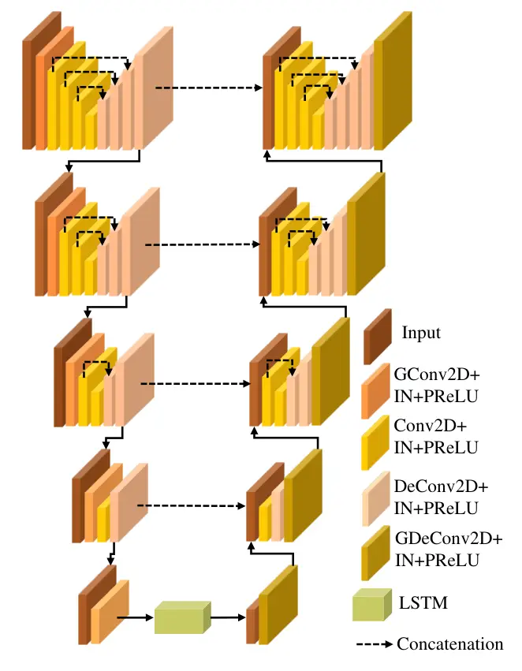

# FB-MSTCN: A Full-Band Single-Channel Speech Enhancement Method Based on Multi-Scale Temporal Convolutional Network

Zehua Zhang^(\*)    Lu Zhang^(\*)    Xuyi Zhuang ^(†)^(†)thanks: \$\*\$
Equal contribution    Yukun Qian    Heng Li    Mingjiang Wang

###### Abstract

In recent years, deep learning-based approaches have significantly
improved the performance of single-channel speech enhancement. However,
due to the limitation of training data and computational complexity,
real-time enhancement of full-band (48 kHz) speech signals is still very
challenging. Because of the low energy of spectral information in the
high-frequency part, it is more difficult to directly model and enhance
the full-band spectrum using neural networks. To solve this problem,
this paper proposes a two-stage real-time speech enhancement model with
extraction-interpolation mechanism for a full-band signal. The 48 kHz
full-band time-domain signal is divided into three sub-channels by
extracting, and a two-stage processing scheme of ‘masking +
compensation’ is proposed to enhance the signal in the complex domain.
After the two-stage enhancement, the enhanced full-band speech signal is
restored by interval interpolation. In the subjective listening and word
accuracy test, our proposed model achieves superior performance and
outperforms the baseline model overall by 0.59 MOS and 4.0$`\%`$ WAcc
for the non-personalized speech denoising task.

###### Index Terms: 

full-band, speech enhancement, two-stage modeling,
extraction-interpolation

^(†)^(†)address: Harbin Institute of Technology, Shenzhen, China

## 1 Introduction

With the significant increase in hardware computing power in recent
years, the demand for high-quality speech in real-time communication
applications like video conferencing and live broadcast is also
increasing. Speech enhancement techniques are essential for removing
noise interference to improve speech quality. However, most of the
previous studies on speech enhancement are for narrow-band (8 kHz) or
wide-band (16 kHz) audio, and there are few methods for 48 kHz full-band
audio. Deep learning-based speech enhancement methods \[1, 2, 3\] have
achieved impressive performance on wide-band audio, but the lack of
sufficient training data has become a major limitation for full-band
deep learning speech enhancement methods. The recent 4th Microsoft Deep
Noise Suppression (DNS-4) Challenge¹¹ 1
https://www.microsoft.com/en-us/research/academic-program/deep-noise-suppression-challenge-icassp-2022/
extends efforts to full-band single-channel speech enhancement tasks
with a massive training dataset and real-scenario test set.

Another difficulty of full-band speech enhancement is that the increased
sampling resolution leads to the need to model larger dimensional
features in the neural network model, which results in higher modeling
complexity. For example, in wide-band real-time scenarios, most methods
\[4, 5, 6, 7\] have the input frame size set to 20 ms or 32 ms,
corresponding to 320 and 512 points of Fourier transform analysis,
respectively. If the audio is sampled at 48 kHz, the same frame size
corresponds to three times the number of Fourier transform points, which
triples the dimensionality of the input features and correspondingly
increases the modeling dimensionality of the neural network model.
Although end-to-end modeling schemes in the time domain, such as
Conv-TasNet \[8\] and DPRNN \[9\], can not be affected by the input
feature dimension, it will increase the number of processing frames,
resulting in a threefold increase in the number of operations to process
audio per second. Therefore, this is also a challenge for the computing
power of the chip in real-time applications.

In the full-band real-time scenarios, modeling sub-band spectral
features, such as RNNoise \[10\] and PercepNet \[11\], is an effective
strategy to balance the computational complexity and speech denoising
performance. Bark and triangular filter banks are respectively used to
compress the frequency spectrum, which retains the frequency-domain
information that is more important to human perception, effectively
reducing the dimension of input features and thus reducing the
complexity of the neural network model. However, such methods inevitably
lose some spectral details, resulting in sub-optimal performance. The
recent S-DCCRN model \[12\] proposes a two-stage modeling scheme, which
can optimize the low-band and high-band separately, and further employs
a full-band processing module to smooth the output of both sub-bands.
This method benefits from modeling local and global frequency
information, allowing it to obtain better performance.

In this paper, we also propose a two-stage processing model to enhance
the full-band signal. In the first stage, the complex ratio masks (CRMs)
\[1\] are estimated to initially enhance the noisy signal, and then the
second-stage module can further compensate the enhanced complex signal.
To ensure a better temporal modeling ability of the model, we introduce
two long-term modeling units with fixed and dynamic receptive fields
based on the multi-scale temporal convolutional network (TCN) model
\[13\]. In addition, we propose a novel full-band signal processing
mechanism of extraction and interpolation to reduce the modeling
difficulty of the full-band spectrum. Specifically, the 48 kHz
time-domain noisy signal is divided into three sub-channel signals (16
kHz) in the way of interval sampling. After the two-stage enhancement,
the signals of three sub-channels are restored to the 48 kHz time-domain
enhanced signal by interval interpolation.

## 2 FB-MSTCN Model

In this paper, $`\left(N_{r},N_{i}\right)`$ and
$`\left(S_{r},S_{i}\right)`$ are the noisy real and imaginary (RI)
spectrum and the clean RI spectrum respectively. The overall diagram of
proposed FB-MSTCN is shown as Fig.1. We divide the single-channel
full-band signal into three sub-channel wide-band signals by extraction,
where $`j`$ represents the index of the channel. In order to make the
model have a better subjective feeling and make the model easier to
converge, we adopt the complex compressed feature \[14\] as the input of
the dynamic long-term embedding unit, which is written as
$`\left(N_{r}^{c},N_{i}^{c}\right)`$.

Figure 1: Overall diagram of the proposed FB-MSTCN.

In the first stage, we use a fixed-length long-term embedding unit and a
dynamic long-term embedding unit to capture the temporal dependence of
speech signals, and then perform multi-scale feature analysis on them
using multi-scale temporal convolution network (MSTCN) \[13\]. CRMs are
calculated by six 1-D convolutions after MSTCN. In the second stage, a
topology similar to dynamic long-term embedding unit is used to further
suppress the residual noises and compensate some under-estimated
spectral details. Finally, the enhanced sub-channel signals are
interpolated in the time domain to obtain the final waveform.

### 2.1 Extraction and Interpolation

A novel method of extraction and interpolation in the time domain, which
can be expressed as Eq.1, is proposed to process the full-band speech
signal. $`n_{FB}`$ represents full-band time-domain speech signal and
$`n_{j}`$ represents sub-channel speech signal after extraction, where
$`j=0,1,2`$. We expand the single channel to three sub-channels through
the extraction operation, and the relationship between different
sub-channels can be learned through the FB-MSTCN model. The three
enhanced sub-channel speech signals can be interpolated into a full-band
speech signal by the inverse operation of Eq.1.

```math
\centering n_{j}(m)=n_{FB}(3\times m+j)\@add@centering \tag{1}
```

### 2.2 Fixed-Length Long-Term Embedding Unit

In fixed-length long-term embedding unit, gated temporal convolution
modules (GTCMs) are used to capture the temporal dependency information
of magnitude spectrum. GTCMs as shown in Fig.2 contains four 1-D
convolutions, where $`k,d,c`$ represent kernel size, dilation rate and
output channels respectively. Each group having six GTCMs is repeated
three times. In each group, the dilation rate $`d`$ is equal to 1, 2, 4,
8, 16, respectively, which makes the model have a fixed-length of
receptive field to capture the long-term embedding feature in the
magnitude domain.

Figure 2: Structure diagram of GTCMs.

### 2.3 Dynamic Long-Term Embedding Unit

Inspired by U²-Net \[15\], this paper proposes a similar topology named
U²-LSTM as shown in Fig.3 to model compressed complex features. On the
basis of U²-Net, a four-layer LSTM is added to capture dynamic long-term
context information. GConv2D, GDeConv2D and IN represent gated 2-D
convolution, 2-D deconvolution and InstanceNorm respectively. The
convolution kernel size is (2, 5) for the first layer of GConv2D and the
last layer of DeConv2D, and (2, 3) for all others. The number of
channels is 64, and the stride is (1,2) in all layers. The output of the
dynamic long-term embedding unit changes the number of channels from 64
to 8 as the input of MSTCN through a layer of 2-D convolution.



Figure 3: Structure diagram of the proposed U²-LSTM.

### 2.4 Multi-Scale TCN

Our previous study \[13\] found that increasing the granularity of the
time-frequency (T-F) analysis of features contributes to improving the
speech denoising performance and the generalization ability of the
model. We use the proposed MSTCN framework in \[13\] to perform
multi-scale sub-band analysis on the two obtained long-term embedding
features, which can be expressed as follows:

```math
F\!_{m\!d\!,b\!}(\!t\!)\!=\!\left(\!Y\!\!*\!f\!_{m\!d\!,b\!}\right)\!=\!\sum_{i=0}^{K\!-\!1}\!f\!_{m\!d\!,b}(\!i\!)\!\cdot\!\left\{\!\tilde{F}\!_{m\!d\!,b\!-\!1\!},Y\!_{b}\!\right\}(\!t\!-\!d\!\cdot i) \tag{2}
```

Where $`f_{md,b}`$ and $`F_{md,b}(t)`$ are the multi-scale kernel and
the output of current sub-band, respectively. $`t`$, $`b`$, $`K`$ and
$`d`$ denote the frame index, sub-band index, kernel size and dilation
factor, respectively. $`Y_{b}`$ represents the input features of each
band, $`\tilde{F}_{md,b-1}`$ is the output of the adjacent band
corresponding to sub-band $`b`$.

The MSTCN here consists of three groups of multi-scale TCN modules, each
consisting of five residual blocks with a kernel size of 3 and the
dilation rate cycles in increments of 1, 3, 5, 7, and 11. In addition,
the input to the MSTCN is the fixed-length long-term embedding features
extracted from the GTCMs, while the dynamic long-term embedding features
extracted by the U²-LSTM unit are transformed into three groups of
256-dimensional forward-stacked features through the 1-D convolution.

### 2.5 Compensation Model

The compensation model adopts a topology similar to dynamic long-term
embedding unit, except that the number of input channels becomes 12 and
the number of output channels becomes 6. The 6 channels of U²-LSTM
output are respectively convolved through a 1-D convolution with a
kernel size of 1 to calculate the compensation value. The enhanced
complex spectrum can be obtained by adding the compensation value to the
masked result of the first stage. Through the compensation model, the
residual noise in the first-order stage will be further suppressed, and
the complex spectrum can be recovered better.

### 2.6 Loss Function

To ensure consistency in the optimization of the RI and magnitude
spectrum, we adopt the loss function form of combined mean square error
(cMSE) in \[2\], as follows:

```math
Loss=\lambda\cdot\left\|\hat{S}_{cRI}-S_{cRI}\right\|^{2}+\beta\cdot\left\|\hat{S}_{cMag}-S_{cMag}\right\|^{2} \tag{3}
```

where $`\hat{S}`$ and $`{S}`$ represent the enhanced and ideal signals,
respectively. A spectral compression method is applied for both RI and
magnitude to achieve better convergence:

```math
\hat{S}_{cMag}=\left|\hat{S}_{Mag}\right|^{c},\quad\hat{S}_{cRI}=\hat{S}_{cMag}\cdot\frac{\hat{S}_{RI}}{\hat{S}_{Mag}} \tag{4}
```

In this paper, $`\lambda`$ and $`\beta`$ are set to 0.3 and 0.7,
respectively, and the compressed factor $`{c}`$ is set to 0.3. The final
loss is obtained by averaging the cMSE loss over 3 sub-channels.

## 3 Experimental Results

### 3.1 Experimental Setup

We downloaded the full-band clean speech datasets from DNS-4 Challenge
and simply cleaned the datasets to remove the speech files with low SNR.
We finally got 885 hours of English data, 382 hours of German data, 130
hours of Spanish data, 127 hours of French data, 99 hours of Italian
data, and 18 hours of Russian data. The noise datasets were also
downloaded from the ICASSP 2022 DNS-4 datasets, for a total of 181 hours
of noise data. In the end, we generated a noisy-clean training set of
100 hours for ablation study, a noisy-clean training set of 2,000 hours
for DNS-4 challenge, and a test set of 5 hours to evaluate the
performance of the proposed network. The SNR range is -5dB to 10dB for
all noisy-clean set. Furthermore, to account for reverberation effects
in real environments, all clean speech is convolved with synthetic and
real room impulse responses (RIRs) provided by DNS-4 before being mixed
with different noise signals. The reverberation time T₆₀ is between 0
and 0.8 seconds.

All the utterances are sampled at 48 kHz and cut into 30 s segments to
facilitate model training. The frames are analyzed by a Hamming window
with 20 ms length and 10 ms overlap. For training the two-stage network,
we first train the first stage with an initial learning rate of 0.001.
When the first-stage learning rate drops to 0.0005, we freeze the
first-stage parameters and only update the second-stage parameters with
an initial learning rate of 0.001. When the learning rate of the
second-stage is also reduced to 0.0005, the parameters of the two stages
are updated simultaneously. We halve the learning rate when validation
loss does not decrease for consecutive 3 epochs. The Adam algorithm is
used to optimize the models on every mini-batch with a batch size of
1000 consecutive input frames. Perceptual evaluation of speech quality
(PESQ) \[16\], short-time objective intelligibility (STOI) \[17\],
source to distortion ratio (SDR) \[18\], and DNSMOS \[19\] are adopted
as four evaluation metrics. Since the above four evaluation indicators
are only applicable to wide-band speech signals, we downsampled the
enhanced speech signals before evaluating.

### 3.2 Ablation Study

In this section, we conduct ablation experiments to evaluate the
effectiveness of different model formulations proposed in this paper. As
shown in Table 1, we compare the contribution of GTCMs, U²-LSTM,
compensation stage to model performance, and \* represents the method of
using MSTCN model to directly enhance the full-band spectrum. The
results prove that the proposed extraction-interpolation processing
strategy can effectively improve the DNSMOS performance. Besides,
U²-LSTM and compensation model contribute significantly to model
performance.

| Methods         | PESQ  | STOI  | SDR    | DNSMOS |
| --------------- | ----- | ----- | ------ | ------ |
| Noisy           | 1.652 | 0.858 | 10.526 | 2.973  |
| MSTCN^(∗)       | 2.257 | 0.885 | 15.853 | 3.278  |
| MSTCN           | 2.267 | 0.890 | 15.227 | 3.317  |
| GTCMs+MSTCN     | 2.351 | 0.896 | 15.620 | 3.343  |
| U²-LSTM+MSTCN   | 2.506 | 0.908 | 15.831 | 3.422  |
| Stage 1         | 2.581 | 0.912 | 16.094 | 3.453  |
| Stage 1+Stage 2 | 2.590 | 0.912 | 16.230 | 3.512  |

Table 1: The objective results for different models

### 3.3 Subjective and Objective Results on DNS-4 Challenge

In Table 2, we compare the proposed FB-MSTCN with the baseline model
NSNet \[20\], and present the evaluated results of subjective speech
quality (SIG), background noise quality (BAK), overall audio quality
(OVRL) with ITU-T P.835 criterion, and the objective Word Accuracy
(WAcc). The results show that the FB-MSTCN model exhibits a very
significant performance advantage and outperforms the baseline model
overall by 0.59 OVRL MOS and 4.0$`\%`$ WAcc. In addition, it should be
noted that our model is trained on multilingual data, while the blind
test set of DNS-4 is only in English, so the FB-MSTCN model can achieve
better performance if we train it for English only.

| Method         | SIG  | BAK  | OVRL | WAcc |
| -------------- | ---- | ---- | ---- | ---- |
| Noisy          | 4.29 | 2.15 | 2.63 | 0.72 |
| NSNet          | 3.62 | 3.93 | 3.26 | 0.63 |
| FB-MSTCN(Pro.) | 4.10 | 4.46 | 3.85 | 0.67 |

Table 2: The averaged subjective and objective results of blind test set
on DNS-4 challenge

To test whether the algorithm can run in real time, we evaluate the
complexity and latency of the FB-MSTCN model. In this study, the
proposed FB-MSTCN model has 29.9 M parameters and requires 12.5 G
multiply-accumulate operations (MAC) per second. The processing frame
size is 20 ms with 10 ms overlap between frames. The average processing
time per frame is 4.52 ms on the Intel i5-6400 CPU clocked at the
fundamental frequency (2.7 GHz). The total algorithmic latency is 30 ms,
which fully meets the requirement of real-time processing of DNS-4
challenge.

## 4 Conclusion

For the full-band speech enhancement task in real-time scenarios, this
paper proposes a new solution of extraction-interpolation. Through
interval sampling, the difficult modeling problem of full-band spectrum
can be effectively simplified into a modeling problem of three-channel
wide-band spectrum. The proposed two-stage model, FB-MSTCN, further
decomposes the enhancement problem of each wide-band spectrum into a
two-step optimization problem of ‘masking + compensation’. The
experimental results show that the proposed method can not only meet the
real-time requirements of DNS-4, but also has excellent performance in
recovering the spectral details of full-band speech and suppressing the
residual noise. On the blind test set of DNS-4 Track1, FB-MSTCN model
has achieved very competitive performance, ranking third in the
comprehensive evaluation results of MOS and WAcc.

## References

- \[1\] Yanxin Hu, Yun Liu, Shubo Lv, Mengtao Xing, Shimin Zhang, Yihui
  Fu, Jian Wu, Bihong Zhang, and Lei Xie, “DCCRN: Deep complex
  convolution recurrent network for phase-aware speech enhancement,” in
  INTERSPEECH, 2020, pp. 2472–2476.
- \[2\] Andong Li, Wenzhe Liu, Xiaoxue Luo, Chengshi Zheng, and Xiaodong
  Li, “ICASSP 2021 deep noise suppression challenge: Decoupling
  magnitude and phase optimization with a two-stage deep network,” in
  ICASSP, 2021, pp. 6628–6632.
- \[3\] Andong Li, Wenzhe Liu, Xiaoxue Luo, Guochen Yu, Chengshi Zheng,
  and Xiaodong Li, “A simultaneous denoising and dereverberation
  framework with target decoupling,” in INTERSPEECH, 2021, pp.
  2801–2805.
- \[4\] Ke Tan and DeLiang Wang, “Learning complex spectral mapping with
  gated convolutional recurrent networks for monaural speech
  enhancement,” IEEE/ACM Transactions on Audio, Speech, and Language
  Processing, vol. 28, pp. 380–390, 2020.
- \[5\] Lu Zhang, Mingjiang Wang, Qiquan Zhang, Xinsheng Wang, and Ming
  Liu, “PhaseDCN: A phase-enhanced dual-path dilated convolutional
  network for single-channel speech enhancement,” IEEE/ACM Transactions
  on Audio, Speech, and Language Processing, vol. 29, pp.
  2561–2574, 2021.
- \[6\] Chengyu Zheng, Xiulian Peng, Yuan Zhang, Sriram Srinivasan, and
  Yan Lu, “Interactive speech and noise modeling for speech
  enhancement,” arXiv preprint arXiv:2012.09408, 2020.
- \[7\] Andong Li, Chengshi Zheng, Lu Zhang, and Xiaodong Li, “Glance
  and gaze: A collaborative learning framework for single-channel speech
  enhancement,” Applied Acoustics, vol. 187, pp. 108499, 2022.
- \[8\] Yi Luo and Nima Mesgarani, “Conv-TasNet: Surpassing ideal
  time–frequency magnitude masking for speech separation,” IEEE/ACM
  Transactions on Audio, Speech, and Language Processing, vol. 27, no.
  8, pp. 1256–1266, 2019.
- \[9\] Yi Luo, Zhuo Chen, and Takuya Yoshioka, “Dual-Path RNN:
  Efficient long sequence modeling for time-domain single-channel speech
  separation,” in ICASSP, 2020, pp. 46–50.
- \[10\] Jean-Marc Valin, “A hybrid dsp/deep learning approach to
  real-time full-band speech enhancement,” in IEEE 20th International
  Workshop on Multimedia Signal Processing (MMSP), 2018, pp. 1–5.
- \[11\] Jean-Marc Valin, Umut Isik, Neerad Phansalkar, Ritwik Giri,
  Karim Helwani, and Arvindh Krishnaswamy, “A perceptually-motivated
  approach for low-complexity, real-time enhancement of fullband
  speech,” in INTERSPEECH, 2020, pp. 2482–2486.
- \[12\] Shubo Lv, Yihui Fu, Mengtao Xing, Jiayao Sun, Lei Xie, Jun
  Huang, Yannan Wang, and Tao Yu, “S-DCCRN: Super wide band dccrn with
  learnable complex feature for speech enhancement,” arXiv preprint
  arXiv:2111.08387, 2021.
- \[13\] Lu Zhang and Mingjiang Wang, “Multi-Scale TCN: Exploring better
  temporal DNN model for causal speech enhancement,” in INTERSPEECH,
  2020, pp. 2672–2676.
- \[14\] Sebastian Braun and Hannes Gamper, “Effect of noise suppression
  losses on speech distortion and asr performance,” arXiv preprint
  arXiv:2111.11606, 2021.
- \[15\] Xuebin Qin, Zichen Zhang, Chenyang Huang, Masood Dehghan,
  Osmar R. Zaiane, and Martin Jagersand, “U2-net: Going deeper with
  nested u-structure for salient object detection,” Pattern Recognition,
  vol. 106, pp. 107404, 2020.
- \[16\] Antony W Rix, John G Beerends, Michael P Hollier, and Andries P
  Hekstra, “Perceptual evaluation of speech quality (PESQ)-a new method
  for speech quality assessment of telephone networks and codecs,” in
  ICASSP, 2001, pp. 749–752.
- \[17\] Cees H Taal, Richard C Hendriks, Richard Heusdens, and Jesper
  Jensen, “An algorithm for intelligibility prediction of time–frequency
  weighted noisy speech,” IEEE/ACM Transactions on Audio, Speech, and
  Language Processing, vol. 19, pp. 2125–2136, 2011.
- \[18\] E. Vincent, R. Gribonval, and C. Fevotte, “Performance
  measurement in blind audio source separation,” IEEE/ACM Transactions
  on Audio, Speech, and Language Processing, vol. 14, no. 4, pp.
  1462–1469, 2006.
- \[19\] Chandan KA Reddy, Vishak Gopal, and Ross Cutler, “DNSMOS: A
  non-intrusive perceptual objective speech quality metric to evaluate
  noise suppressors,” in ICASSP, 2021, pp. 6493–6497.
- \[20\] Y. Xia, S. Braun, C. K. A. Reddy, H. Dubey, R. Cutler, and
  I. Tashev, “Weighted speech distortion losses for neural-network-based
  real-time speech enhancement,” in ICASSP, 2020, pp. 871–875.
