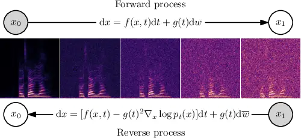
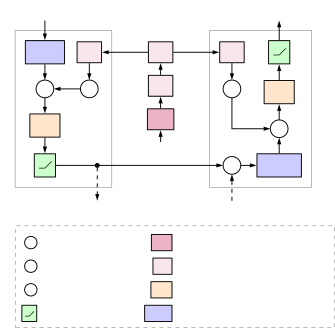
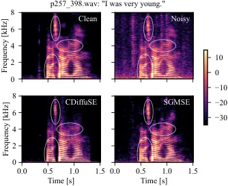

# Speech Enhancement with Score-Based Generative Models in the Complex STFT Domain

Simon Welker    Julius Richter    Timo Gerkmann ^(†)^(†)thanks: We
acknowledge the support by DASHH (Data Science in Hamburg - HELMHOLTZ
Graduate School for the Structure of Matter) with the Grant-No.
HIDSS-0002 and the German Research Foundation (DFG) in the transregio
project Crossmodal Learning (TRR 169).

###### Abstract

Score-based generative models (SGMs) have recently shown impressive
results for difficult generative tasks such as the unconditional and
conditional generation of natural images and audio signals. In this
work, we extend these models to the complex short-time Fourier transform
(STFT) domain, proposing a novel training task for speech enhancement
using a complex-valued deep neural network. We derive this training task
within the formalism of stochastic differential equations (SDEs),
thereby enabling the use of predictor-corrector samplers. We provide
alternative formulations inspired by previous publications on using
generative diffusion models for speech enhancement, avoiding the need
for any prior assumptions on the noise distribution and making the
training task purely generative which, as we show, results in improved
enhancement performance.

^(†)^(†)address: ¹Signal Processing (SP), Universität Hamburg, Germany  
²Center for Free-Electron Laser Science, DESY, Hamburg, Germany  
^(†)Authors contributed equally to this work.^(†)^(†)email:
simon.welker@uni-hamburg.de, julius.richter@uni-hamburg.de,
timo.gerkmann@uni-hamburg.de

Index Terms: speech enhancement, generative modeling, score-based
generative models, deep learning

## 1 Introduction

Speech enhancement aims at estimating clean speech signals from audio
recordings that are impacted by acoustic noise \[1\]. The task is well
studied in the signal processing literature, and conventional approaches
often make assumptions regarding the statistical properties of speech
signals \[2\]. With the advent of deep learning, approaches to speech
enhancement have made significant progress in the last decade. Most
methods are based on a discriminative learning task that aims to
minimize a certain distance between clean and noisy speech. However,
since supervised methods are inevitably trained on a finite set of
training data with limited model capacity for practical reasons, they
may not generalize to unseen situations, e.g., different noise types,
reverberation, and different signal-to-noise ratios (SNRs). In addition,
some discriminative approaches have been shown to result in unpleasant
speech distortions that outweigh the benefits of noise reduction \[3\].

Instead of learning a direct mapping from noisy to clean speech,
generative models aim to learn the distribution of clean speech as a
prior for speech enhancement. Several approaches have utilized deep
generative models for speech enhancement using generative adversarial
networks (GANs) \[4, 5\], variational autoencoders (VAEs) \[6, 7, 8, 9,
10, 11\], flow-based models \[12\], and more recently generative
diffusion models \[13, 14\]. The main principle of these approaches is
to learn the inherent properties of clean speech, such as its spectral
and temporal structure, which are then used as prior knowledge for
making inferences about clean speech given a noisy input. Thus, they are
trained solely to generate clean speech and are therefore considered
more robust to different acoustic environments compared to their
discriminative counterparts. In fact, generative approaches have shown
to perform better under mismatched training and test conditions \[10,
14, 15, 11\]. However, they are currently less studied and still lag
behind discriminative approaches, which is a strong incentive to conduct
more research to realize their full potential.



Figure 1: The forward and reverse process on a spectrogram as a solution
to an SDE. The reverse process gradually converts the corrupted signal
$`x_{1}`$ into a clean speech spectrogram $`x_{0}`$.

Although GANs and VAEs have become a popular choice for deep generative
modeling, generative diffusion models \[16, 17, 18\] provide a powerful
alternative which has recently shown to be state-of-the-art in natural
image generation \[19\]. The idea is to gradually turn data into noise,
and to train a neural network that learns to invert this procedure for
different noise scales (see Fig. 1). Other works have adopted this
scheme for generating speech in the time domain using clean Mel
spectrograms as a conditioner \[20, 21\]. Interestingly, the model
in \[20\] investigated its zero-shot speech denoising capabilities for
different noise types. Although it was only trained to remove white
noise added in the diffusion process, it already shows preliminary
results for performing speech enhancement. Lu et al. built upon this
idea and designed a supportive reverse process using the same
architecture but with noisy spectrograms as the conditioner \[13\]. In
their follow-up paper they devised a conditional diffusion process with
an adopted forward and reverse process incorporating the noisy data into
the diffusion process \[14\]. However, the derivation of their objective
function is based on the assumption that the global distribution of the
additive noise follows a standard white Gaussian, which is normally not
the case for environmental noise. Moreover, the neural network used in
their reverse process is trained to explicitly estimate the difference
between clean and noisy speech, which is usually considered a
discriminative learning task.

In this work, we propose an alternative diffusion process which is based
on stochastic differential equations (SDEs) for score-based generative
models (SGMs) \[18\] which is a specific class of generative diffusion
models (see Section 2). Using this formulation, we are able to avoid the
need for any prior assumptions on the noise distribution and make the
training task purely generative. Unlike \[13, 14\] which work in the
time domain, we perform generative speech enhancement in the complex
STFT domain, i.e., working directly on the Fourier coefficients with
amplitude and phase. This choice should allow deep-learning models to
exploit the rich structure of speech in the time-frequency domain. In
contrast to approaches that modify only the amplitudes, this choice
avoids the need for phase retrieval techniques, since the phase
information is enhanced directly as well. In our experiments, we
demonstrate good speech enhancement performance and show that our method
introduces less speech distortions compared to the baseline method.

## 2 Background

### 2.1 Score-based generative models

SGMs \[16, 18\] are generative diffusion models that center around the
idea of corrupting training data with slowly increasing levels of noise
(forward process), and training a _score model_ to reverse this
corruption (reverse process) by estimating the _score_
$`\gradient_{x}\log p_{\text{data}}(x)`$, i.e., the gradient of the log
probability density with respect to the data. Once a score model is
trained, an iterative procedure called Langevin dynamics can be used to
draw samples from it \[22\].

### 2.2 SGMs through stochastic differential equations

Song et al. \[18\] introduced the formalism of using SDEs for
score-based generative modeling. Following the Itô interpretation \[23,
ch. 4\], the process $`\{x_{t}\}_{t}`$ can be defined by the SDE

```math
{\mathrm{d}}{}x_{t}=f(x_{t},t){\mathrm{d}}{}t+g(t){\mathrm{d}}{}w, \tag{1}
```

where $`f`$ is the _drift_, $`g`$ is the _diffusion_, $`t`$ is a
coordinate which denotes how far the forward process has run,
$`{\mathrm{d}}{}t`$ is an infinitesimal time step, and $`w`$ is the
standard Wiener process. We stress that the “time” $`t`$ mentioned in
this context is a conceptual idea related to the progression of the
process, and is not related to the time axis of an audio signal or its
STFT. According to Anderson \[24\], every such SDE has a corresponding
_reverse SDE_

```math
{\mathrm{d}}{}x_{t}=\left[f(x_{t},t)-g(t)^{2}\gradient_{x_{t}}\log p_{t}(x_{t})\right]{\mathrm{d}}{}t+g(t){\mathrm{d}}{}\overline{w}, \tag{2}
```

where $`{\mathrm{d}}{}t`$ is an infinitesimal negative time step and
$`\overline{w}`$ is a standard Wiener process for time flowing in
reverse. The score term $`\gradient_{x_{t}}\log p_{t}(x_{t})`$ is with
respect to the log density of the process at time $`t`$ and can be
approximated by a learned time-dependent score model
$`s_{\mathbf{\theta}}(x_{t},t)`$. The reverse SDE is then solved by
means of some solver procedure (see Section 3.4), providing the basis
for score-based generative modeling with SDEs.

## 3 Proposed method

### 3.1 A stochastic process for speech enhancement

Lu et al. \[14\] proposed the idea of linearly interpolating between
clean speech $`x_{0}`$ (at $`t=0`$) and noisy speech $`y=x_{0}+n`$ (at
$`t=1`$) along a discrete-time forward process, so that the reverse
process should lead to clean speech at $`t=0`$. Note, that discrete-time
diffusion processes using Markov chains \[17\] are different from the
continuous SDE formulation used in the context of SGMs \[18\] and in
this work. Furthermore, as can be seen from their subsequent
derivations, the choice of linear interpolation implies that the trained
deep neural network (DNN) must explicitly estimate a portion of
environmental noise $`n`$ at each step in the reverse process. From an
intuitive standpoint, this occurs because it is necessary to estimate
the slope between every value of $`x_{0}`$ and $`y`$ to be able to
formulate the reverse process. As a consequence, the resulting evidence
lower bound (ELBO) loss \[14, eq. (21)\] exhibits characteristics of a
discriminative learning task, making it difficult to assess whether the
network is learning a prior for clean speech per se or the mapping from
noisy to clean speech. To avoid this, we propose the following novel
diffusion process based on an SDE, which leads to a _pure_ generative
training objective without the model estimating any portion of $`n`$:

```math
\displaystyle{\mathrm{d}}{}x_{t} \displaystyle=\gamma(y-x_{t}){\mathrm{d}}{}t+g(t){\mathrm{d}}{}w \tag{3}
```

```math
\displaystyle g(t) \displaystyle=\sigma_{\text{min}}\left(\nicefrac{{\sigma_{\text{max}}}}{{\sigma_{\text{min}}}}\right)^{t}\sqrt{2\log\left(\nicefrac{{\sigma_{\text{max}}}}{{\sigma_{\text{min}}}}\right)} \tag{4}
```

where $`\sigma_{\text{min}}`$ and $`\sigma_{\text{max}}`$ parameterize
the variance schedule of the added Gaussian noise, and $`\gamma`$ is a
constant that can be interpreted as a stiffness parameter for $`x_{0}`$
being pulled towards $`y`$ as $`t`$ becomes larger. This SDE is inspired
by the concept of stochastic processes that exhibit *mean
reversion* \[25\], i.e., a convergence of the mean to a particular value
as $`t\rightarrow\infty`$. Since the drift
$`f(x_{t},t)=\gamma(y-x_{t})`$ is affine with respect to $`x_{t}`$, the
SDE (3) describes a Gaussian process \[23\]. Let $`\IdMat`$ be the
identity matrix. The state distribution of this process, called
perturbation kernel,

```math
p_{0t}(x_{t}|x_{0},y)=\CGauss\left(x_{t};\mu_{x_{0},y}(t),\sigma(t)^{2}\IdMat\right), \tag{5}
```

admits efficient sampling $`x_{t}`$ at an arbitrary timestep $`t`$
because it is fully characterized by its mean $`\mu_{x_{0},y}(t)`$ and
variance $`\sigma(t)^{2}`$, which can be derived in closed form via
eqns. (5.50, 5.53) in Särkkä & Solin \[23\] as:

```math
\displaystyle\mu_{x_{0},y}(t) \displaystyle=e^{-\gamma t}x_{0}+(1-e^{-\gamma t})y \tag{6}
```

```math
\displaystyle\sigma(t)^{2} \displaystyle=\frac{\sigma_{\text{min}}^{2}\left(\left(\nicefrac{{\sigma_{\text{max}}}}{{\sigma_{\text{min}}}}\right)^{2t}-e^{-2\gamma t}\right)\log(\sfrac{\sigma\submax}{\sigma\submin})}{\gamma+\log(\sfrac{\sigma\submax}{\sigma\submin})} \tag{7}
```

Since $`\mu_{x_{0},y}(t)`$ does not exactly reach $`y`$ for finite
$`t`$, we empirically choose a stiffness $`\gamma`$ so that
$`\mathbb{E}\left[|\mu_{x_{0},y}(1)-y|^{2}\right]~<~10^{-3}`$, where the
expectation is calculated over all complex bins in a random sample of
256 spectrogram pairs from the chosen dataset. Our SDE is, in essence, a
synthesis of an Ornstein-Uhlenbeck SDE \[26\] and the Variance Exploding
SDE by Song et al. \[18\]. The affine drift term (as in an
Ornstein-Uhlenbeck SDE) leads to exponential decay of the mean from
$`x_{0}`$ towards $`y`$, reflected in (6), and the exponentially
increasing diffusion term (as in a Variance Exploding SDE) leads to
exponentially increasing corruption of features by Gaussian noise.

We note that in (5), we assume circularity and a scaled identity matrix
as the covariance matrix for the process. This would be a strong
assumption to make if the process should model real-world additive
noise. We argue that the assumption is acceptable in this case, as the
noise added by the forward process is entirely artificial, intended to
mask the particular characteristics of the environmental noise at
$`t=1`$, and thus represents only a means to an end for the generative
task.

### 3.2 Data representation

In this work, we represent speech signals in the complex-valued
one-sided STFT domain. We therefore treat clean speech $`x_{0}`$ and
noisy speech $`y`$ as elements of
$`\mathbb{C}^{\left(\frac{F}{2}+1\right){\mkern-2.0mu\times\mkern-2.0mu}{}T}`$,
where $`F`$ is the discrete Fourier transform (DFT) length and $`T`$ is
the number of time frames, dependent on the audio length. Since the
global distribution of STFT speech amplitudes is typically
heavy-tailed \[27\], the information visible in untransformed
spectrograms is dominated by only a small portion of bins. Furthermore,
the naturally encountered amplitudes often lie far outside the interval
$`[0,1]`$ often used in SGMs \[17, 18\]. As an engineering trick, we
thus apply an amplitude transformation to all complex STFT coefficients
$`c`$ \[28\], in an effort to bring out frequency components with lower
energy (e.g. fricative sounds of unvoiced speech) and to normalize
amplitudes roughly to within $`[0,1]`$ to better fit the usual SGM
assumptions. The transformation and its associated inverse
transformation is defined as:

```math
\tilde{c}=\frac{|c|^{\alpha}}{\beta}e^{i\angle(c)}\quad\Leftrightarrow\quad c=\beta|\tilde{c}|^{\nicefrac{{1}}{{\alpha}}}e^{i\angle(\tilde{c})} \tag{8}
```

where we have chosen $`\alpha=0.5`$ and $`\beta=3`$ empirically. The
forward and backward Gaussian processes, as well as the input and output
of the score-based DNN model, are then formulated and applied within
this transformed domain.

### 3.3 Training task

We adopt the training strategy of *denoising score matching* \[29\],
which trains a model to approximate the score
$`\gradient_{x_{t}}\log p_{t}(x_{t})`$ by estimating the Gaussian noise
added by the forward process at time $`t`$. This training strategy can
be efficiently realized by sampling $`t`$ uniformly from $`[0,1]`$ and
then sampling $`x_{t}`$ according to (5) for each data point in the
training batch. The training task is to learn parameters
$`{\mathbf{\theta}}`$ that minimize the following term, where
$`x_{0}\sim p_{0}(x),x_{t}\sim p_{0t}(x_{t}|x_{0},y)`$:

```math
\mathbb{E}_{t,x_{0},x_{t}|x_{0}}\left[\norm{s_\params(x_t, t, y) - \grad_{x_t} \log p_{0t}(x_t | \xstar, y)}_{2}^{2}\right] \tag{9}
```

We note that in the baseline work, CDiffuSE \[14, eq. (21)\], the loss
function includes a term $`(y-x_{0})`$, i.e., the network is in part
trained to remove the environmental noise directly in each step. In
contrast, our objective function in (9) does not task the DNN with
estimating a portion of the environmental noise $`n`$, and $`y=x_{0}+n`$
enters (9) only as an input to the score-based model, functioning as a
conditioning signal. Our model is thus trained to only estimate the
Gaussian noise that is artificially added during the forward process. We
therefore argue that the CDiffuSE training task has significant
discriminative characteristics, whereas ours remains purely generative
in nature.

### 3.4 Speech enhancement procedure

To proceed with speech enhancement, an initial complex spectrogram
$`x_{1}`$ is determined by sampling from the corresponding prior
distribution, with mean $`y`$ and standard deviation $`\sigma(1)`$:

```math
x_{1}\sim\CGauss(y,\sigma(1)^{2}\IdMat) \tag{10}
```

We then choose a reverse sampling method to start from $`x_{1}`$ and
solve the reverse SDE, from $`t=1`$ up until a small
$`t_{\varepsilon}\approx 0`$ to avoid numerical issues close to $`t=0`$,
see \[18\]. There are various possible choices of reverse sampling
methods. Song et al. \[18\] show impressive performance of so-called
_Predictor-Corrector samplers_, which we therefore adopt as well. We use
the specific combination of _reverse diffusion sampling_ as the
predictor and _annealed Langevin dynamics_ as the corrector, as in \[18,
Algorithm 2\]. The corrector requires a so-called SNR parameter $`r`$,
which we empirically set to $`r=0.33`$. We use one corrector step per
iteration, at 50 total iterations. The enhanced audio is finally
retrieved by applying the backward transformation (8) and a subsequent
inverse STFT.

## 4 Experimental setup

### 4.1 Neural network architecture

For our experiments in this paper, we construct a complex-valued U-Net
architecture based on blocks shown schematically in Fig. 2 and
parameterized as listed in Table 1, resulting in 3.56M parameters
overall. We adapt the _Deep Complex U-Net_ (DCUNet) architecture \[30\]
in several ways for our task: (1) We insert _time-embedding layers_ into
all encoder and decoder blocks, providing the DNN with information about
the time-step $`t`$. We encode $`t`$ via 128 random Fourier feature
embeddings \[31\], which are passed through complex-valued affine layers
and activations in each block. These embeddings are broadcasted over and
added to each respective channel of the layer output, as in previous
SGM-based work \[17, 20, 18\]. (2) We add multiple non-strided
encoder/decoder pairs at the top of the U-Net to increase the DNN’s
capacity for finer, non-downsampled features. (3) We add exponentially
increasing dilations in the frequency axis to the lower layers. This
enlarges the receptive field in the frequency direction, to help the DNN
differentiate between spectral characteristics encountered in speech
without affecting the amount of required computation. (4) We change the
network to have one complex-valued output channel estimating the score,
and two complex-valued input channels $`(x_{t},y)`$, so that it has
access to the information contained in the noisy speech $`y`$. (5) We
replace all $`3{\mkern-2.0mu\times\mkern-2.0mu}3`$ kernels by
$`4{\mkern-2.0mu\times\mkern-2.0mu}4`$ kernels, to avoid checkerboard
patterns arising from the kernel size not being divisible by the stride
in the transposed convolutions \[32\].



Figure 2: Architecture of each encoder/decoder pair in our U-Net DNN.
Activation functions and norms are applied to the real and imaginary
parts separately, while the complex convolution and complex linear
layers use the natural complex algebra.

|           |       |       |       |       |       |       |
| --------- | ----- | ----- | ----- | ----- | ----- | ----- |
| Depth     | 1     | 2     | 3     | 4     | 5     | 6     |
| $`C_{i}`$ | 2     | 32    | 32    | 32    | 64    | 128   |
| $`C_{o}`$ | 32    | 32    | 32    | 64    | 128   | 256   |
| $`K`$     | (4,4) | (4,4) | (4,4) | (4,4) | (4,4) | (4,4) |
| $`S`$     | (1,1) | (1,1) | (1,1) | (2,1) | (2,2) | (2,2) |
| $`D`$     | (1,1) | (1,1) | (1,1) | (2,1) | (4,1) | (8,1) |

Table 1: Encoder and decoder parameters of our modified DCUNet
architecture. $`C_{i}`$ / $`C_{o}`$ are input / output channels, $`K`$
is the kernel size, $`S`$ is the stride, and $`D`$ is the dilation.
Tuples indicate the axes (frequency, time).

### 4.2 Dataset

We use the standardized VoiceBank-DEMAND \[33, 34\] dataset for training
and testing, as was done in the baseline work (DiffuSE, \[13\]). We
normalize the pairs of clean and noisy audio $`(x_{0},y)`$ by the
maximum absolute value of $`x_{0}`$. We then convert each input into the
complex-valued one-sided STFT representation, using an DFT length of
$`F=512`$, a hop length of 128 (i.e., 75% overlap) and a periodic Hann
window. We randomly crop each spectrogram to 256 STFT time frames during
each epoch.

### 4.3 Training procedure and hyperparameters

We train our DNN for 325 epochs, using the Adam optimizer \[35\] with a
learning rate of $`10^{-4}`$ and a batch size of 32. We parameterize our
SDE (3) as follows:
$`\gamma=1.5,\sigma_{\text{min}}=0.05,\sigma_{\text{max}}=0.5,t_{\varepsilon}=0.03`$.
We track an exponential moving average of the DNN weights with a decay
of 0.999, to be used for sampling \[36\]. We also train two baseline
models \[13, 14\] to compare against, using publicly available code.

### 4.4 Evaluation

For evaluation, we follow the speech enhancement procedure described in
Section 3.4. We report the scale-invariant signal-to-distortion ratio
(SI-SDR), signal-to-interference ratio (SI-SIR) and signal-to-artifacts
ratio (SI-SAR) \[37\], comparing against the noisy speech $`y`$ and the
baseline method. We avoid the use of the Perceptual Evaluation of Speech
Quality (PESQ) measure, since the P.862.3 standard \[38\] states that
“there should be a minimum of 3.2s active speech in the reference”,
which does not hold for the majority of audio files in the
VoiceBank-DEMAND \[33\] dataset used by us and (C)DiffuSE \[13, 14\]. We
provide listening examples in order to assess the perceptual quality of
the compared methods¹¹ 1 https://uhh.de/inf-sp-sgmse.

## 5 Results

In Table 2, we compare the performance of our proposed method (SGMSE)
with DiffuSE \[13\], CDiffuSE \[14\] and the noisy mixture. The results
from CDiffuSE, for which executable code was not available at the time
of submission, were added to the table after acceptance. We report the
mean results and their 95% confidence interval on the test set. We also
report values for $`m=(0.8\hat{x}+0.2y)`$, as suggested and used
in \[13, 14\].

Our proposed method shows an improvement in SI-SDR of $`4.6\,\text{dB}`$
over DiffuSE and $`3.0\,\text{dB}`$ over CDiffuSE when comparing the raw
model output. We can see that the three compared methods follow a trend
of increasing SI-SAR and decreasing SI-SIR, with our method achieving
the most favorable balance between the two metrics, resulting in the
best SI-SDR. Arguably, our method also achieves more natural-sounding
speech due to the lower amount of artifacts, which we confirmed by
informal listening. Audio examples and code are available
online⁰⁰footnotemark: 0 .

This qualitative behavior is corroborated by Fig. 3, where we show the
power spectrograms of an example utterance (clean and noisy) and the
corresponding estimates of our method and CDiffuSE. Both methods are
able to remove the environmental noise, which is clearly visible in the
specified dynamic range of $`50\,\text{dB}`$. Furthermore, it can be
seen that our method preserves the high frequencies of the fricatives
better than CDiffuSE. Interestingly, CDiffuSE removes too much energy
around the formants, whereas our method maintains the natural structure.

| Model                  | SI-SDR            |                                       |                  | SI-SIR            |                                       |                  | SI-SAR            |                                       |                  |
| ---------------------- | ----------------- | ------------------------------------- | ---------------- | ----------------- | ------------------------------------- | ---------------- | ----------------- | ------------------------------------- | ---------------- |
| Mixture                | 8.4               | $`{}\pm{}`$                           | .38              | 8.4               | $`{}\pm{}`$                           | .38              | $`\infty`$        |                                       |                  |
| DiffuSE^(\[13\])       | 10.5              | $`{}\pm{}`$                           | .14              | $`\mathbf{30.0}`$ | $`{}\mathbf{\pm}{}`$                  | $`\mathbf{.71}`$ | 10.8              | $`{}\pm{}`$                           | .11              |
| CDiffuSE^(\[14\])      | 12.1              | $`{}\pm{}`$                           | .10              | 28.2              | $`{}\mathbf{\pm}{}`$                  | .36              | 12.3              | $`{}\pm{}`$                           | .09              |
| SGMSE                  | $`\mathbf{15.1}`$ | $`{}\mathbf{\pm}{}`$                  | $`\mathbf{.27}`$ | 24.9              | $`{}\pm{}`$                           | .42              | $`\mathbf{15.7}`$ | $`{}\mathbf{\pm}{}`$                  | $`\mathbf{.25}`$ |
| DiffuSE\_(m)^(\[13\])  | 11.4              | $`{}{\color[rgb]{0.5,0.5,0.5}\pm}{}`$ | .18              | 19.1              | $`{}{\color[rgb]{0.5,0.5,0.5}\pm}{}`$ | .46              | 13.0              | $`{}{\color[rgb]{0.5,0.5,0.5}\pm}{}`$ | .11              |
| CDiffuSE\_(m)^(\[14\]) | 12.6              | $`{}{\color[rgb]{0.5,0.5,0.5}\pm}{}`$ | .15              | 18.8              | $`{}{\color[rgb]{0.5,0.5,0.5}\pm}{}`$ | .34              | 14.4              | $`{}{\color[rgb]{0.5,0.5,0.5}\pm}{}`$ | .09              |
| SGMSE\_(m)             | 14.5              | $`{}{\color[rgb]{0.5,0.5,0.5}\pm}{}`$ | .29              | 17.9              | $`{}{\color[rgb]{0.5,0.5,0.5}\pm}{}`$ | .36              | 17.7              | $`{}{\color[rgb]{0.5,0.5,0.5}\pm}{}`$ | .25              |

Table 2: Average performance of our method (SGMSE) and DiffuSE \[13\],
comparing their raw output to the noisy speech mixture. Best values in
each column are bold. Values for $`m=(0.8\hat{x}+0.2y)`$, as used
in \[13, 14\], are listed in gray.



Figure 3: Power spectrograms for an example audio file from
VoiceBank-DEMAND. As can be seen from the highlighted regions, our
approach (SGMSE) exhibits fewer voice distortions than CDiffuSE \[14\]
at some expense of noise reduction.

## 6 Conclusion

In this work, we have designed a novel stochastic process for a
score-based generative modeling approach to speech enhancement in the
complex STFT domain, based on the formalism of SDEs. To our knowledge,
this is the first work to apply SGMs in the complex time-frequency
domain and, after CDiffuSE \[14\], the second theoretically principled
approach to use SGMs specifically for speech enhancement. Our approach
exhibits more natural sounding reconstructions with fewer artifacts than
previous methods at some expense of noise removal, which together leads
to an SI-SDR improvement of about $`5`$ and $`3\,\text{dB}`$ over
DiffuSE \[13\] and CDiffuSE \[14\], respectively. Further investigation
into other SDEs, data representations and DNN architectures may prove to
be a fruitful research avenue for speech enhancement using generative
models. An extended journal article with additional analysis and
improved performance is currently in preparation \[39\].

## References

- \[1\] R. C. Hendriks, T. Gerkmann, and J. Jensen, _DFT-Domain Based
  Single-Microphone Noise Reduction for Speech Enhancement: A Survey of
  the State-of-the-Art_. Morgan & Claypool, 2013.
- \[2\] T. Gerkmann and E. Vincent, “Spectral masking and filtering,” in
  _Audio Source Separation and Speech Enhancement_, E. Vincent,
  T. Virtanen, and S. Gannot, Eds. John Wiley & Sons, 2018.
- \[3\] P. Wang, K. Tan, and D. L. Wang, “Bridging the gap between
  monaural speech enhancement and recognition with
  distortion-independent acoustic modeling,” _IEEE Trans. on Audio,
  Speech, and Language Proc. (TASLP)_, vol. 28, pp. 39–48, 2020.
- \[4\] S. Pascual, A. Bonafonte, and J. Serrà, “SEGAN: Speech
  enhancement generative adversarial network,” _ISCA Interspeech_, pp.
  3642–3646, 2017.
- \[5\] D. Baby and S. Verhulst, “SERGAN: Speech enhancement using
  relativistic generative adversarial networks with gradient penalty,”
  _IEEE Int. Conf. on Acoustics, Speech and Signal Proc. (ICASSP)_, pp.
  106–110, 2019.
- \[6\] Y. Bando, M. Mimura, K. Itoyama, K. Yoshii, and T. Kawahara,
  “Statistical speech enhancement based on probabilistic integration of
  variational autoencoder and non-negative matrix factorization,” _IEEE
  Int. Conf. on Acoustics, Speech and Signal Proc. (ICASSP)_, pp.
  716–720, 2018.
- \[7\] S. Leglaive, L. Girin, and R. Horaud, “A variance modeling
  framework based on variational autoencoders for speech enhancement,”
  _IEEE Int. Workshop on Machine Learning for Signal Proc. (MLSP)_, pp.
  1–6, 2018.
- \[8\] J. Richter, G. Carbajal, and T. Gerkmann, “Speech enhancement
  with stochastic temporal convolutional networks.” _ISCA Interspeech_,
  pp. 4516–4520, 2020.
- \[9\] G. Carbajal, J. Richter, and T. Gerkmann, “Disentanglement
  learning for variational autoencoders applied to audio-visual speech
  enhancement,” _IEEE Workshop on Applications of Signal Proc. to Audio
  and Acoustics (WASPAA)_, pp. 126–130, 2021.
- \[10\] H. Fang, G. Carbajal, S. Wermter, and T. Gerkmann, “Variational
  autoencoder for speech enhancement with a noise-aware encoder,” _IEEE
  Int. Conf. on Acoustics, Speech and Signal Proc. (ICASSP)_, pp.
  676–680, 2021.
- \[11\] X. Bie, S. Leglaive, X. Alameda-Pineda, and L. Girin,
  “Unsupervised speech enhancement using dynamical variational
  auto-encoders,” _arXiv preprint arXiv:2106.12271_, 2021.
- \[12\] A. A. Nugraha, K. Sekiguchi, and K. Yoshii, “A flow-based deep
  latent variable model for speech spectrogram modeling and
  enhancement,” _IEEE Trans. on Audio, Speech, and Language Proc.
  (TASLP)_, vol. 28, pp. 1104–1117, 2020.
- \[13\] Y.-J. Lu, Y. Tsao, and S. Watanabe, “A study on speech
  enhancement based on diffusion probabilistic model,” _Asia-Pacific
  Signal and Inf. Proc. Association Annual’Summit and Conf. (APSIPA
  ASC)_, pp. 659–666, 2021.
- \[14\] Y.-J. Lu, Z.-Q. Wang, S. Watanabe, A. Richard, C. Yu, and
  Y. Tsao, “Conditional Diffusion Probabilistic Model for Speech
  Enhancement,” _IEEE Int. Conf. on Acoustics, Speech and Signal Proc.
  (ICASSP)_, 2022.
- \[15\] Y. Bando, K. Sekiguchi, and K. Yoshii, “Adaptive neural speech
  enhancement with a denoising variational autoencoder.” _ISCA
  Interspeech_, pp. 2437–2441, 2020.
- \[16\] Y. Song and S. Ermon, “Generative modeling by estimating
  gradients of the data distribution,” _Advances in Neural Inf. Proc.
  Systems (NeurIPS)_, vol. 32, 2019.
- \[17\] J. Ho, A. Jain, and P. Abbeel, “Denoising diffusion
  probabilistic models,” _Advances in Neural Inf. Proc. Systems
  (NeurIPS)_, vol. 33, pp. 6840–6851, 2020.
- \[18\] Y. Song, J. Sohl-Dickstein, D. P. Kingma, A. Kumar, S. Ermon,
  and B. Poole, “Score-based generative modeling through stochastic
  differential equations,” _Int. Conf. on Learning Representations
  (ICLR)_, 2021.
- \[19\] P. Dhariwal and A. Nichol, “Diffusion models beat GANs on image
  synthesis,” _Advances in Neural Inf. Proc. Systems (NeurIPS)_,
  vol. 34, 2021.
- \[20\] Z. Kong, W. Ping, J. Huang, K. Zhao, and B. Catanzaro,
  “DiffWave: A versatile diffusion model for audio synthesis,” _Int.
  Conf. on Learning Representations (ICLR)_, 2021.
- \[21\] N. Chen, Y. Zhang, H. Zen, R. J. Weiss, M. Norouzi, and
  W. Chan, “WaveGrad: Estimating gradients for waveform generation,”
  _Int. Conf. on Learning Representations (ICLR)_, 2021.
- \[22\] G. Parisi, “Correlation functions and computer simulations,”
  _Nuclear Physics B_, vol. 180, no. 3, pp. 378–384, 1981.
- \[23\] S. Särkkä and A. Solin, _Applied Stochastic Differential
  Equations_. Cambridge University Press, 2019.
- \[24\] B. D. Anderson, “Reverse-time diffusion equation models,”
  _Stochastic Processes and their Applications_, vol. 12, no. 3, pp.
  313–326, 1982.
- \[25\] T. Chakraborty and M. Kearns, “Market making and mean
  reversion,” _Proceedings of the 12th ACM conference on Electronic
  commerce_, pp. 307–314, 2011.
- \[26\] G. E. Uhlenbeck and L. S. Ornstein, “On the theory of the
  Brownian motion,” _Physical review_, vol. 36, no. 5, p. 823, 1930.
- \[27\] T. Gerkmann and R. Martin, “Empirical distributions of
  DFT-domain speech coefficients based on estimated speech variances,”
  _Int. Workshop on Acoustic Echo and Noise Control_, 2010.
- \[28\] S. Braun and I. Tashev, “A consolidated view of loss functions
  for supervised deep learning-based speech enhancement,” _Int. Conf. on
  Telecom. and Signal Proc. (TSP)_, pp. 72–76, 2021.
- \[29\] P. Vincent, “A connection between score matching and denoising
  autoencoders,” _Neural Computation_, vol. 23, no. 7, pp.
  1661–1674, 2011.
- \[30\] H.-S. Choi, J.-H. Kim, J. Huh, A. Kim, J.-W. Ha, and K. Lee,
  “Phase-aware Speech Enhancement with Deep Complex U-Net,” _arXiv
  preprint arXiv:1903.03107_, 2019.
- \[31\] M. Tancik, P. Srinivasan, B. Mildenhall, S. Fridovich-Keil,
  N. Raghavan, U. Singhal, R. Ramamoorthi, J. Barron, and R. Ng,
  “Fourier features let networks learn high frequency functions in low
  dimensional domains,” _Advances in Neural Inf. Proc. Systems
  (NeurIPS)_, vol. 33, pp. 7537–7547, 2020.
- \[32\] A. Odena, V. Dumoulin, and C. Olah, “Deconvolution and
  checkerboard artifacts,” _Distill_, vol. 1, no. 10, p. e3, 2016.
- \[33\] C. Valentini-Botinhao, X. Wang, S. Takaki, and J. Yamagishi,
  “Investigating RNN-based speech enhancement methods for noise-robust
  Text-to-Speech.” _ISCA Speech Synthesis Workshop (SSW)_, pp.
  146–152, 2016.
- \[34\] J. Thiemann, N. Ito, and E. Vincent, “The Diverse Environments
  Multi-channel Acoustic Noise Database (DEMAND): A database of
  multichannel environmental noise recordings,” _The Journal of the
  Acoustical Society of America_, vol. 133, no. 5, pp. 3591–3591, 2013.
- \[35\] D. P. Kingma and J. Ba, “Adam: A method for stochastic
  optimization,” _Int. Conf. on Learning Representations (ICLR)_, 2015.
- \[36\] Y. Song and S. Ermon, “Improved techniques for training
  score-based generative models,” _Advances in Neural Inf. Proc. Systems
  (NeurIPS)_, vol. 33, pp. 12 438–12 448, 2020.
- \[37\] J. Le Roux, S. Wisdom, H. Erdogan, and J. R. Hershey,
  “SDR–half-baked or well done?” _IEEE Int. Conf. on Acoustics, Speech
  and Signal Proc. (ICASSP)_, pp. 626–630, 2019.
- \[38\] ITU-T Rec. P.862.3, “Application guide for objective quality
  measurement based on Recommendations P.862, P.862.1 and P.862.2,”
  _Int. Telecom. Union (ITU)_, 2007.
- \[39\] J. Richter, S. Welker, J.-M. Lemercier, B. Lay, and
  T. Gerkmann, “Speech enhancement and dereverberation with
  diffusion-based generative models,” _(in preparation)_, 2022.
