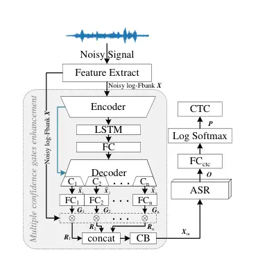
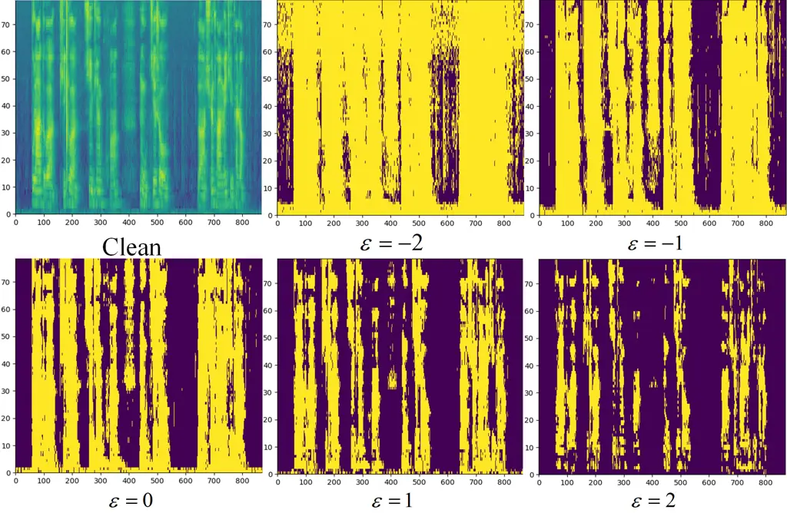

# MULTIPLE CONFIDENCE GATES FOR JOINT TRAINING OF SE AND ASR

Tianrui Wang^(⋆†)    Weibin Zhu^(⋆)    Yingying Gao^(†)    Junlan
Feng^(†)    Shilei Zhang^(†)

###### Abstract

Joint training of speech enhancement model (SE) and speech recognition
model (ASR) is a common solution for robust ASR in noisy environments.
SE focuses on improving the auditory quality of speech, but the enhanced
feature distribution is changed, which is uncertain and detrimental to
the ASR. To tackle this challenge, an approach with multiple confidence
gates for jointly training of SE and ASR is proposed. A speech
confidence gates prediction module is designed to replace the former SE
module in joint training. The noisy speech is filtered by gates to
obtain features that are easier to be fitting by the ASR network. The
experimental results show that the proposed method has better
performance than the traditional robust speech recognition system on
test sets of clean speech, synthesized noisy speech, and real noisy
speech.

###### Index Terms: 

Robust ASR, Joint Training, Deep learning

^(†)^(†)address: ^(⋆) Institute of Information Science, Beijing Jiaotong
University, Beijing, China  
^(†) China Mobile Research Institute, Beijing, China

## 1 Introduction

The performance of ASR in a noisy environment will greatly deteriorate,
and it has been a persistent and challenging task to improve the
adaptability of ASR in a noisy environment \[1\].

From the perspective of features, some researchers have proposed feature
construction strategies that are more robust to noise, in order to
reduce the difference in features caused by noise and thereby improve
the robustness of ASR \[2, 3, 4\]. But these methods are difficult to
work with a low signal-to-noise ratio (SNR). From the perspective of
model design, a direct approach is to set a SE in front of the ASR
\[5\]. Although the enhanced speech is greatly improved currently in
human hearing \[6, 7, 8, 9\], the enhanced feature distribution is
changed also, which may be helpful for the hearing but not always
necessarily beneficial for ASR. In order to make the ASR adaptable to
the enhanced feature, the ASR can be retrained with the data processed
by the enhanced model \[10\]. However, the performance of this method is
severely affected by the SE effect. Especially in the case of low SNR,
the SE may corrupt the speech structure and bring somehow additional
noise. In order to reduce the influence of SE and achieve better
recognition accuracy, researchers proposed the joint training strategy
\[11\]. Let ASR constrain SE and train the model with the recognition
accuracy of ASR as the main goal. However, the models are difficult to
converge during joint training, and the final recognition performance
improvement is limited due to the incompatibility between two goals, for
SE it’s speech quality, while for ASR it’s recognition accuracy.

During joint training, the ASR network needs to continuously fit the
feature distribution, but the feature distribution keeps changing under
the action of SE, which makes it difficult for the ASR network to
converge. We believe that the ASR network has strong fitting and
noise-carrying capabilities. We need neither to do too much processing
on the feature distribution nor to predict the value of clean speech at
each feature point. We only need to filter out the feature points that
don’t contain speech. This method can avoid the problem that ASR cannot
converge during joint training, and also give full play to the
noise-carrying ability of ASR itself. So, the multiple confidence gates
for joint training of SE and ASR is proposed. A speech confidence gates
prediction module is designed to replace the former speech enhancement
module in joint training. Each gate is a confidence spectrum with the
same size as the feature spectrum (the probability that each feature
point contains speech). The noisy speech is filtered by each confidence
gate respectively. Then the gated results are combined to obtain the
input feature for ASR. The experimental results show that the proposed
method can effectively improve the recognition accuracy of the joint
training model, and has better performance than the traditional robust
ASR on test sets.



Figure 1: Architecture of the proposed method.

## 2 Proposed method

The overall diagram of the proposed system is shown in Fig.1. It is
mainly comprised of two parts, namely the multiple confidence gates
enhancement module (MCG) and ASR. Firstly, We convert the waveform to
logarithmic Fbank (log-Fbank) $`\bm{X}\in\mathbb{R}^{T\times Q}`$ as the
input to the model by the short-time fast Fourier transform (STFT)
\[12\] and auditory spectrum mapping \[13\], where $`T`$ and $`Q`$
denote the number of frames and the dimension of the Bark spectrum
respectively. Secondly, The MCG predicts multiple confidence gates based
on the noisy log-Fbank, and the noisy features are filtered by each gate
respectively. Then the filtered results are combined into inputs of ASR
by a convolution block (CB). Different confidence gates correspond to
the selections of speech feature points with different energy
thresholds, and each process will be described later.

### 2.1 Multiple confidence gates enhancement module

The multiple confidence gates enhancement module is used to predict the
confidence gates to filter the noisy spectrum. The main body of MCG is
the convolutional recurrent network (CRN) \[7\], it is an
encoder-decoder architecture for speech enhancement. Both the encoder
and decoder are comprised of convolution blocks (CB). And each CB is
comprised of 2D convolution (2d-Conv), batch normalization (BN) \[14\],
and parametric rectified linear unit (PReLU) \[15\]. Between the encoder
and decoder, long short-term memory (LSTM) layer \[16\] is inserted to
model the temporal dependencies. Additionally, skip connections are
utilized to concatenate the output of each encoder layer to the input of
the corresponding decoder layer (blue line in Fig.1).

Since we want to determine the confidence that each feature point
contains speech, we change the output channel number of the last decoder
to $`(\text{C}_{1}+\text{C}_{2}+\cdots+\text{C}_{n})`$, where
$`\text{C}_{1},\text{C}_{2},\cdots,\text{C}_{n}`$ are the number of
channels of the input features for corresponding fully connected layers
$`(\text{FC}_{1},\text{FC}_{2},\cdots,\\
\text{FC}_{n})`$. Each FC can output a confidence gate
$`\bm{G}\in\mathbb{R}^{T\times Q}`$ for every feature point,

```math
\bm{G}_{n}=\text{sigmoid}(\tilde{\bm{X}}_{n}\cdot\bm{W}_{n}+b_{n}) \tag{1}
```

where $`\tilde{\bm{X}}_{n}\in\mathbb{R}^{T\times Q\times\text{C}_{n}}`$
represents the $`\text{C}_{n}`$ channels of the decoder output.
$`\bm{W}_{n}\in\mathbb{R}^{\text{C}_{n}\times 1}`$ and $`b_{n}`$ are the
parameters of $`\text{FC}_{n}`$. sigmoid \[17\] is used to convert the
result into confidence (the probability that a feature point contains
speech).

The label of confidence gate $`\bm{G}`$ is designed based on energy
statistics. Different thresholds are used to control different filtering
degrees. The greater the energy threshold, the fewer the number of
speech points in the label, and the greater the speech energy of the
corresponding feature points, as shown in Fig.2. We first compute the
mean $`\bm{\mu}\in\mathbb{R}^{Q\times 1}`$ of the log-Fbank of the clean
speech set
$`\bm{\mathbb{X}}=[\dot{\bm{X}}_{1},\cdots,\dot{\bm{X}}_{d}]\in\mathbb{R}^{D\times T\times Q}`$
and standard deviation $`\bm{\sigma}\in\mathbb{R}^{Q\times 1}`$ of
log-Fbank means,

```math
\bm{\mu}=\sum_{i=1}^{D}\left[\left(\sum_{t=1}^{T}\bm{\mathbb{X}}_{i,t}\right)/T\right]/D \tag{2}
```

```math
\bm{\sigma}=\sqrt{\sum_{i=1}^{D}\left[\left(\sum_{t=1}^{T}\bm{\mathbb{X}}_{i,t}\right)/T-\bm{\mu}\right]^{2}/D} \tag{3}
```

where $`\dot{\bm{X}}`$ represents log-Fbank of the clean speech. $`D`$
represents the clip number of audio in clean speech set
$`\bm{\mathbb{X}}`$. Then the thresholds
$`\bm{\kappa}=(\bm{\mu}+\varepsilon\cdot\bm{\sigma})\in\mathbb{R}^{Q\times 1}`$
for bins are controlled according to different offset values
$`\varepsilon`$, and the confidence gate label $`\dot{\bm{G}}`$ is 1 if
the feature point value is larger than $`\bm{\kappa}`$, 0 otherwise, as
shown in Fig.2.

```math
\dot{\bm{G}}_{t,q}=\left\{\begin{array}[]{rcl}&1&,\dot{\bm{X}}_{t,q}\geq\bm{\kappa}\\
&0&,\dot{\bm{X}}_{t,q}<\bm{\kappa}\end{array}\right. \tag{4}
```



Figure 2: $`\dot{\bm{G}}`$ obtained by different $`\varepsilon`$. The
greater $`\varepsilon`$, the greater the speech energy of the
corresponding choosed points.

After (1), we can get $`n`$ confidence gates
$`\left[\bm{G}_{1},\cdots,\bm{G}_{n}\right]`$ corresponding to different
$`\varepsilon`$. Then noisy log-Fbank are filtered by the confidence
gates, resulting in different filtered results
$`\left[\bm{R}_{1},\cdots,\bm{R}_{n}\right]`$,

```math
\bm{R}_{n}=\bm{G}_{n}\otimes\bm{X} \tag{5}
```

where $`\otimes`$ is the element-wise multiplication. And these filtered
results are then concatenated in channel dimension and input to a CB to
obtain the input $`\bm{X}_{\text{in}}`$ of ASR.

### 2.2 Automatic speech recognition

The fitting capability of existing ASR network is very powerful. Since
the Conformer+Transformer model is too large for joint training, we only
use Conformer encoder \[18\] as ASR module. This model first processes
the enhanced input $`\bm{X}_{\text{in}}\in\mathbb{R}^{T\times Q}`$ with
a convolution subsampling layer (CSL),

```math
\bm{X}_{\text{down}}=\text{CSL}\left(\bm{X}_{\text{in}}\right) \tag{6}
```

where CSL is comprised of subsampling convolution, linear layer, and
dropout. Then the downsampled feature is processed by several conformer
blocks. Each conformer block is comprised of four modules stacked
together, i.e, a half-step residual feed-forward module (FFN), a
self-attention module (MHSA), a convolution module
($`\text{Conv}_{c}`$), and a second FFN is followed by a layer norm
\[19\] in the end,

```math
\bm{X}_{i}^{{}^{\prime}}=\bm{X}_{i}+\frac{1}{2}\text{FFN}(\bm{X}_{i}) \tag{7}
```

```math
\bm{X}_{i}^{{}^{\prime\prime}}=\bm{X}_{i}^{{}^{\prime}}+\text{MHSA}(\bm{X}_{i}^{{}^{\prime}}) \tag{8}
```

```math
\bm{X}_{i}^{{}^{\prime\prime\prime}}=\bm{X}_{i}^{{}^{\prime\prime}}+\text{Conv}_{c}(\bm{X}_{i}^{{}^{\prime\prime}}) \tag{9}
```

```math
\bm{O}_{i}=\text{Layernorm}(\bm{X}_{i}^{{}^{\prime\prime\prime}}+\frac{1}{2}\text{FFN}(\bm{X}_{i}^{{}^{\prime\prime\prime}})) \tag{10}
```

where $`\bm{X}_{i}`$ represents the input of $`i`$-th Conformer block
($`\bm{X}_{0}=\bm{X}_{\text{down}}`$), and the $`\bm{O}_{i}`$ is the
output of the block. The final output of Conformer is denoted as
$`\bm{O}\in\mathbb{R}^{T\times H}`$, where $`H`$ represents the hidden
dimension of the last layer.

### 2.3 Loss function

The loss function of our joint training framework is comprised of four
components.

```math
L=L_{G}+L_{R}+L_{\text{O}}+L_{\text{CTC}} \tag{11}
```

In the MCG module, we measured the predicted confidence gate as,

```math
L_{G}=\sum_{i=1}^{n}||\bm{G}_{n}-\dot{\bm{G}}_{n}||_{1} \tag{12}
```

where $`||\cdot||_{1}`$ represents the 1 norm operation. In addition, to
strengthen the filtering ability of the module on noise, we also compute
filtered results from the clean speech through the same processing,
which are denoted as
$`\left[\dot{\bm{R}}_{1},\cdots,\dot{\bm{R}}_{n}\right]`$, and calculate
the difference between them and the filtered results of noisy speech as,

```math
L_{R}=\sum_{i=1}^{n}||\bm{R}_{n}-\dot{\bm{R}}_{n}||_{1} \tag{13}
```

After the ASR, In order to reduce the noise-related changes brought by
SE to ASR, we also measured the difference between the $`\dot{\bm{O}}`$
computed from clean speech and that from noisy speech as,

```math
L_{\text{O}}=||\bm{O}-\dot{\bm{O}}||_{1} \tag{14}
```

Note that the gradients of the processing of all clean speech are
discarded. And $`L_{\text{CTC}}`$ is the connectionist temporal
classification \[20\] for ASR.

## 3 EXPERIMENTS

### 3.1 Dataset

We use AISHELL1 \[21\] as the clean speech dataset, which includes a
total of 178 hours of speech from 400 speakers, and it is divided into
training, development, and testing sets. The noise data used in
training, development, and test set are from DNS challenge (INTERSPEECH 2020) \[22\], ESC50 \[23\], and Musan \[24\], respectively. During the
mixing process, a random noise cut is extracted and then mixed with the
clean speech under an SNR selected from -5dB to 20dB. In addition, we
randomly selected 2600 speech clips from the noisy speech recorded in
real scenarios as an additional test set, and call it APY ¹¹ 1
https://www.datatang.com/dataset/info/speech/191.

| Model        | Clean |       |       |        | Noisy |       |       |        | APY   |       |       |        |
| ------------ | ----- | ----- | ----- | ------ | ----- | ----- | ----- | ------ | ----- | ----- | ----- | ------ |
|              | S     | D     | I     | WER    | S     | D     | I     | WER    | S     | D     | I     | WER    |
| Conformer    | 1.580 | 0.050 | 0.039 | 11.580 | 2.814 | 0.154 | 0.075 | 20.984 | 2.730 | 0.206 | 0.181 | 44.969 |
|    +Nsnet    | 1.440 | 0.042 | 0.026 | 10.427 | 2.859 | 0.161 | 0.083 | 21.302 | 3.188 | 0.166 | 0.213 | 51.465 |
|    +DCRN     | 1.428 | 0.045 | 0.027 | 10.333 | 2.750 | 0.202 | 0.069 | 20.486 | 2.977 | 0.174 | 0.220 | 48.820 |
|    +DCCRN    | 1.429 | 0.047 | 0.028 | 10.422 | 2.652 | 0.194 | 0.063 | 19.904 | 2.868 | 0.190 | 0.240 | 47.705 |
|    +DCRN(ST) | 1.440 | 0.046 | 0.029 | 10.449 | 2.739 | 0.232 | 0.059 | 20.844 | 3.154 | 0.214 | 0.180 | 50.529 |
|    +MCG      | 1.271 | 0.041 | 0.030 | 9.343  | 2.256 | 0.140 | 0.056 | 16.882 | 2.391 | 0.174 | 0.125 | 39.223 |

Table 1: Recognition results of the models on test set

### 3.2 Training setup and baseline

We trained all models on our dataset with the same strategy. The initial
learning rate is set to 0.0002, which will decay 0.5 when the validation
loss plateaued for 5 epochs. The training is stopped if the validation
loss plateaued for 20 epochs. And the optimizer is Adam \[25\]. We
design a Conformer, three traditional joint training systems, and a
separately training (ST) system as the baselines.

Conformer: The dimension of log-Fbank is 80. The number of conformer
blocks is 12. Linear units is 2048. The convolution kernel is 15.
Attention heads is 4. Output size is 256. And we replaced the CMVN with
BN to help Conformer integrate with the SE module.

Nsnet+Conformer: Nsnet is a lightweight and effective speech enhancement
model. It’s mainly comprised of FC and gated recurrent units (GRUs). The
Nsnet we implemented is the same structure as it in \[6\].

DCRN+Conformer: DCRN is an encoder-decoder model for speech enhancement
in the complex domain \[7\]. The $`32\text{ms}`$ Hanning window with
$`25\%`$ overlap and 512-point STFT are used. The channel number of
encoder and decoder is $`\left\{32,64,128,256,256,256\right\}`$. Kernel
size and stride are (5,2) and (2,1). One 128-units LSTM is adopted. And
a 1024-units FC layer is after the LSTM.

DCRN+Conformer(ST): Separately training is to train a DCRN first, then
the conformer is trained based on the processed data by the DCRN. The
parameter configuration is the same as that of the joint training.

DCCRN+Conformer: DCCRN is the complex operation version of DCRN with
stronger speech enhancement effect \[8\]. The $`25\text{ms}`$ Hanning
window with $`25\%`$ overlap and 512-point STFT are used. The channel
number is $`\left\{32,64,128,256,256,256\right\}`$. Kernel size and
stride are (5,2) and (2,1). And it uses two layers complex LSTM with 128
units for the real part and imaginary part respectively. And a dense
layer with 1280 units is after the LSTM.

MCG+Conformer: The channel numbers of MCG are
$`\left\{32,48,64,80,96\right\}`$. Kernel size of each convolution is
(3,3), strides are
$`\left\{(1,1),(1,1),(2,1),(2,1),(1,1),(1,1)\right\}`$. One 128-units
LSTM is adopted. And a 1920-units FC layer is after the LSTM. The
channel number of the last decoder is $`10n`$ and
$`\text{C}_{1}=\cdots=\text{C}_{n}=10`$. The best results are obtained
when $`n=3`$ and $`\varepsilon=\left[-1,1,2\right]`$.

|          |       |         |            |
| -------- | ----- | ------- | ---------- |
| Model    | PESQ  | STOI(%) | SI-SDR(dB) |
| Noisy    | 1.643 | 0.796   | 7.218      |
| Nsnet    | 2.373 | 0.857   | 15.312     |
| DCRN     | 2.508 | 0.858   | 15.232     |
| DCCRN    | 2.570 | 0.868   | 16.004     |
| DCRN(ST) | 2.617 | 0.871   | 16.441     |
|          |       |         |            |

Table 2: Test results of enhancement models in different baseline
systems on test sets

### 3.3 Experimental results and discussion

We trained the model as described in Section 3.2, and counted the
substitution error (S), deletion error (D), insertion error (I), and
word error rate (WER) of different systems on the clean, noisy, and APY
test set, shown as Table 1. And Table 2 shows the effects of the
enhancement modules in different baseline systems. The enhancement
performance is measured by the PESQ, STOI, and SI-SDR, which are
commonly used in speech enhancement. The PESQ is a measure for magnitude
difference in the range of human hearing, the STOI is more concerned
with the correlation between the enhanced magnitude and the referenced
one, and the SI-SDR is more concerned with the structural difference in
the time-domain.

It can be seen from the results of Table 1 and Table 2, among the three
joint training baselines, the best performance is achieved when DCCRN is
used as the front-end, which proves that the robustness of recognition
will be improved as the performance of the SE increases. However, on the
APY dataset, the WER of the baselines are all higher than those of the
Conformer. Because the SE is over-fitting on the synthesized data, and
in the real scenarios, the noise is more complicated, which increases
the uncertainty of feature changes brought by SE.

The enhancement performance of separately trained DCRN is better than
that of joint training, but the recognition accuracy of separately
training is worse than that of joint training. Because joint training is
mainly aimed at recognition, the performance of SE will be limited.

Our method achieved the lowest WER on all test sets, moreover, the
insertion and substitution errors of our model are minimal on the noisy
test set, which demonstrates that the multiple confidence gates scheme
can filter out the non-speech parts without destroying the speech
structure, thereby greatly improving the recognition performance. The
performance improvement on APY also indicates that the change of feature
by the proposed front-end module is less affected by noise and more
friendly to ASR.

| n   | $`\varepsilon`$            | Clean WER | Noisy WER | APY WER |
| --- | -------------------------- | --------- | --------- | ------- |
| 1   | $`\left[0\right]`$         | 9.457     | 17.134    | 39.361  |
| 2   | $`\left[-1,1\right]`$      | 9.669     | 17.626    | 41.211  |
| 3   | $`\left[-1,1,2\right]`$    | 9.343     | 16.882    | 39.223  |
| 4   | $`\left[-2,-1,1,2\right]`$ | 9.498     | 17.440    | 40.513  |

Table 3: Recognition results models trained by different confidence
gates on test set

In addition, we have done some experiments on the design of the
confidence gates. We set different thresholds to control the filtering
ability of the gates. It can be seen that the best performance of the
model is achieved with $`n=3`$ and $`\varepsilon=\left[-1,1,2\right]`$.
As can be seen from Fig.2, as $`\varepsilon`$ increases, the higher the
energy of selected feature points, the stronger the filtering ability of
the gate. So designing multiple gates with different filtering abilities
can improve the fitting and generalization ability of model to achieve
better results.

## 4 CONCLUSIONS

In this paper, we propose the multiple confidence gates enhancement for
joint training of SE and ASR. A speech confidence gates prediction
module is designed to replace the former speech enhancement model. And
the noisy speech is filtered by each confidence gate respectively. Then
the gated results are combined to obtain the input for ASR. With the
help of the proposed method, the incompatibility between SE and ASR
during joint training is mitigated. And the experimental results show
that the proposed method can filter out the non-speech parts without
destroying the speech structure, and it’s more friendly to ASR during
joint training.

## References

- \[1\] Pedro J Moreno, Speech recognition in noisy environments, Ph.D.
  thesis, Carnegie Mellon University, 1996.
- \[2\] Xue Feng, Brigitte Richardson, Scott Amman, and James R Glass,
  “An environmental feature representation for robust speech recognition
  and for environment identification.,” in INTERSPEECH, 2017, pp.
  3078–3082.
- \[3\] Neethu M Joy, Dino Oglic, Zoran Cvetkovic, Peter Bell, and Steve
  Renals, “Deep scattering power spectrum features for robust speech
  recognition.,” in INTERSPEECH, 2020, pp. 1673–1677.
- \[4\] Mirco Ravanelli, Jianyuan Zhong, Santiago Pascual, Pawel
  Swietojanski, Joao Monteiro, Jan Trmal, and Yoshua Bengio, “Multi-task
  self-supervised learning for robust speech recognition,” in Proc. of
  ICASSP. IEEE, 2020, pp. 6989–6993.
- \[5\] Keisuke Kinoshita, Tsubasa Ochiai, Marc Delcroix, and Tomohiro
  Nakatani, “Improving noise robust automatic speech recognition with
  single-channel time-domain enhancement network,” in Proc. of ICASSP.
  IEEE, 2020, pp. 7009–7013.
- \[6\] Sebastian Braun and Ivan Tashev, “Data augmentation and loss
  normalization for deep noise suppression,” in International Conference
  on Speech and Computer. Springer, 2020, pp. 79–86.
- \[7\] Ke Tan and DeLiang Wang, “Complex spectral mapping with a
  convolutional recurrent network for monaural speech enhancement,” in
  Proc. of ICASSP. IEEE, 2019, pp. 6865–6869.
- \[8\] Yanxin Hu, Yun Liu, Shubo Lv, Mengtao Xing, Shimin Zhang, Yihui
  Fu, Jian Wu, Bihong Zhang, and Lei Xie, “Dccrn: Deep complex
  convolution recurrent network for phase-aware speech enhancement,”
  arXiv preprint arXiv:2008.00264, 2020.
- \[9\] Tianrui Wang and Weibin Zhu, “A deep learning loss function
  based on auditory power compression for speech enhancement,” arXiv
  preprint arXiv:2108.11877, 2021.
- \[10\] Archiki Prasad, Preethi Jyothi, and Rajbabu Velmurugan, “An
  investigation of end-to-end models for robust speech recognition,” in
  Proc. of ICASSP. IEEE, 2021, pp. 6893–6897.
- \[11\] Masakiyo Fujimoto and Hisashi Kawai, “Comparative evaluations
  of various factored deep convolutional rnn architectures for noise
  robust speech recognition,” in Proc. of ICASSP. IEEE, 2018, pp.
  4829–4833.
- \[12\] P. Welch, “The use of fast fourier transform for the estimation
  of power spectra: A method based on time averaging over short,
  modified periodograms,” IEEE Transactions on Audio and
  Electroacoustics, vol. 15, no. 2, pp. 70–73, 1967.
- \[13\] Gilbert Strang and Truong Nguyen, Wavelets and filter banks, 1996.
- \[14\] Sergey Ioffe and Christian Szegedy, “Batch normalization:
  Accelerating deep network training by reducing internal covariate
  shift,” in Proceedings of The 32nd International Conference on Machine
  Learning, 2015, vol. 1, pp. 448–456.
- \[15\] Kaiming He, Xiangyu Zhang, Shaoqing Ren, and Jian Sun, “Delving
  deep into rectifiers: Surpassing human-level performance on imagenet
  classification,” in Proc. of ICCV, 2015, pp. 1026–1034.
- \[16\] Klaus Greff, Rupesh K. Srivastava, Jan Koutnik, Bas R.
  Steunebrink, and Jurgen Schmidhuber, “Lstm: A search space odyssey,”
  IEEE Transactions on Neural Networks, vol. 28, no. 10, pp.
  2222–2232, 2017.
- \[17\] George Cybenko, “Approximation by superpositions of a sigmoidal
  function,” Mathematics of Control, Signals, and Systems, vol. 2, no.
  4, pp. 303–314, 1989.
- \[18\] Anmol Gulati, James Qin, Chung-Cheng Chiu, Niki Parmar,
  Yu Zhang, Jiahui Yu, Wei Han, Shibo Wang, Zhengdong Zhang, Yonghui Wu,
  et al., “Conformer: Convolution-augmented transformer for speech
  recognition,” arXiv preprint arXiv:2005.08100, 2020.
- \[19\] Jimmy Lei Ba, Jamie Ryan Kiros, and Geoffrey E Hinton, “Layer
  normalization,” arXiv preprint arXiv:1607.06450, 2016.
- \[20\] Alex Graves, “Connectionist temporal classification,” pp.
  61–93, 2012.
- \[21\] Hui Bu, Jiayu Du, Xingyu Na, Bengu Wu, and Hao Zheng,
  “Aishell-1: An open-source mandarin speech corpus and a speech
  recognition baseline,” in Proc. of O-COCOSDA. IEEE, 2017, pp. 1–5.
- \[22\] Chandan K. A. Reddy, Ebrahim Beyrami, Harishchandra Dubey,
  Vishak Gopal, Roger Cheng, Ross Cutler, Sergiy Matusevych, Robert
  Aichner, Ashkan Aazami, Sebastian Braun, Puneet Rana, Sriram
  Srinivasan, and Johannes Gehrke, “The interspeech 2020 deep noise
  suppression challenge: Datasets, subjective speech quality and testing
  framework,” arXiv preprint arXiv:2001.08662, 2020.
- \[23\] Karol J. Piczak, “ESC: Dataset for Environmental Sound
  Classification,” in Proceedings of the 23rd Annual ACM Conference on
  Multimedia. pp. 1015–1018, ACM Press.
- \[24\] David Snyder, Guoguo Chen, and Daniel Povey, “Musan: A music,
  speech, and noise corpus,” arXiv preprint arXiv:1510.08484, 2015.
- \[25\] Diederik P. Kingma and Jimmy Lei Ba, “Adam: A method for
  stochastic optimization,” in ICLR 2015 : International Conference on
  Learning Representations 2015, 2015.
