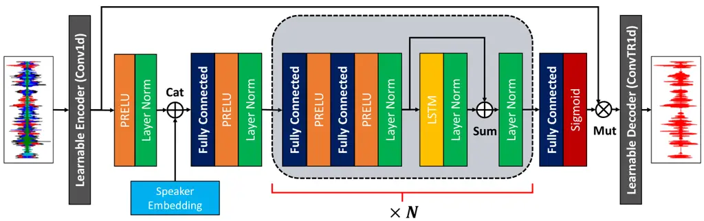
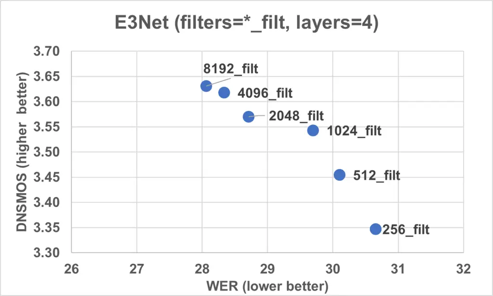
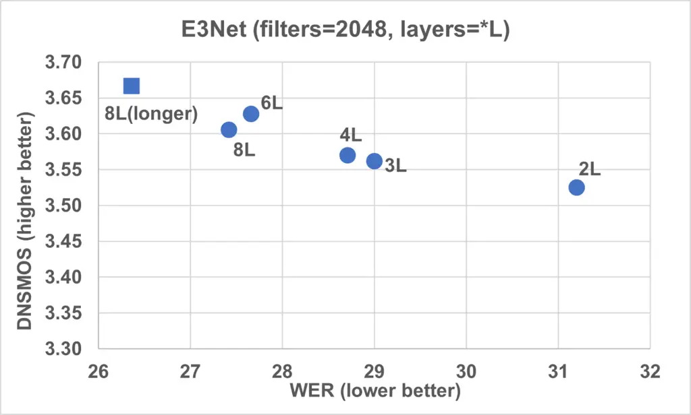

# Fast Real-time Personalized Speech Enhancement: End-to-End Enhancement Network (E3Net) and Knowledge Distillation

Manthan Thakker^(\*) ^(†)^(†)thanks: ^(\*)These authors contributed
equally to this work.    Sefik Emre Eskimez^(\*)    Takuya Yoshioka   
Huaming Wang

###### Abstract

This paper investigates how to improve the runtime speed of personalized
speech enhancement (PSE) networks while maintaining the model quality.
Our approach includes two aspects: architecture and knowledge
distillation (KD). We propose an end-to-end enhancement (E3Net) model
architecture, which is $`3\times`$ faster than a baseline STFT-based
model. Besides, we use KD techniques to develop compressed student
models without significantly degrading quality. In addition, we
investigate using noisy data without reference clean signals for
training the student models, where we combine KD with multi-task
learning (MTL) using an automatic speech recognition (ASR) loss. Our
results show that E3Net provides better speech and transcription quality
with a lower target speaker over-suppression (TSOS) rate than the
baseline model. Furthermore, we show that the KD methods can yield
student models that are $`2-4\times`$ faster than the teacher and
provides reasonable quality. Combining KD and MTL improves the ASR and
TSOS metrics without degrading the speech quality.

^(†)^(†)address: Microsoft Corporation, One Microsoft Way, WA,
USA^(†)^(†)email: {mathakke, seeskime, tayoshio, huawang}@microsoft.com

Index Terms: speech enhancement, noise suppression, personalized noise
suppression, knowledge distillation, multi task learning, teacher
student learning

## 1 Introduction

Online conferencing tools have been widely adopted for conducting
businesses and connecting with family and friends since the beginning of
the COVID-19 pandemic. However, the background noise and reverberation
degrade the speech and transcription quality. As these acoustic
distortions can hamper communications and thus productivity, the speech
enhancement (SE) field has drawn a lot of renewed attention
recently \[1, 2\].

Personalized speech enhancement (PSE) provides an improvement to the
general SE approach by using prior knowledge about a target speaker \[2,
3, 4, 5\]. One exemplary approach to PSE is to extract a speaker
embedding vector from a short enrollment audio sample of the target
speaker and feed it to an SE model. This enables the SE model to remove
interfering speakers in addition to the background noise. PSE provides
practical benefits, especially for the users who share the same
environments with other people during teleconferencing.

To deploy the PSE models on various devices that are used for online
meetings, it is paramount to make the computational cost very low while
satisfying other performance requirements. The requirements include
causal modeling for real-time processing, high-quality noise and
interfering speaker suppression, little negative impact on the automatic
speech recognition (ASR) accuracy, and little target speaker
oversuppression (TSOS). Since the PSE models attempt to remove human
voices spoken by the interfering speakers, they may occasionally
suppress the target speaker too by mistake. Preventing TSOS is critical
for applying the PSE models to real scenarios.

In this paper, we examine multiple approaches to take on this challenge
and build real-time PSE models with very low computational cost while
maintaining satisfactory accuracy. We investigate this problem from
three angles.

End-to-end modeling:  
We propose a personalized end-to-end enhancement network (E3Net), a
faster neural network model that is shown to improve the speech quality,
WER, and reduce TSOS than a previously proposed personalized deep
complex convolution recurrent network (pDCCRN) \[4\].

Knowledge Distillation (KD):  
KD is one of the model compression approaches that are widely used in
machine learning. We apply generic KD recipes for PSE by using a big
capacity teacher model and a much smaller student model. We show the
experimental results for both pDCCRN and E3Net.

Leveraging unpaired noisy speech:  
Most of the real-world recordings do not come with clean reference
signals. Thus, PSE models are usually trained on clean-noisy speech
sample pairs created by simulation, which may cause a mismatch between
the training and deployment environments. We examine the effect of
applying bigger teacher models to the real noisy data and using the
outputs as clean references for student models. Combination with
multi-task learning (MTL) using ASR transcriptions \[4, 6\] is also
considered.

Our results show that E3Net provides better quality and runs $`3\times`$
faster than the pDCCRN model. Furthermore, our ablation study for E3Net
suggests that using more filters on learnable encoder-decoder for the
end-to-end network is required to obtain a high-quality model. In
addition, the KD experiments show that student models as fast as
$`3\times`$ their teacher models can provide reasonable quality for both
pDCCRN and E3Net models. We show that we can further reduce TSOS with
almost no degradation to speech quality by combining MTL with KD
methods.

## 2 Related work

Personalized Speech Enhancement (PSE) is a speech enhancement method
conditioned on a cue representing the target speaker. This cue is often
provided as a static embedding vector that captures the target speaker’s
speech characteristics. The main goal of PSE is to filter out
interfering speakers in addition to background noise and reverberation.

Giri et al. \[3\] proposed Personalized PercepNet by modifying the
original PercepNet model \[7\] to accept speaker embeddings. Although
the method was computationally efficient, it was based on a heuristic
model and complex to build. The model was tested based on speech
communication, and the ASR accuracy was not considered. Eskimez et
al. \[4\] proposed two PSE models, an evaluation metric called target
speaker over-suppression (TSOS), and test sets to cover various
scenarios. TSOS measures the degree of removal of the target speaker’s
speech segments and is critical for PSE since removing the target speech
hampers effective conversations and degrades the transcription quality,
as reported in \[8\]. Furthermore, Taherian et al. \[5\] extended \[4\]
to multi-channel scenarios by proposing a model that works with any
microphone numbers and array geometries. Although the models of \[4\]
can run on PCs in real-time, the computational cost was still too high
for real usage as the audio processing can use only a tiny fraction of
the available resources on devices.

Knowledge Distillation (KD), or Teacher-Student (TS) learning, has been
widely explored in natural language processing \[9, 10\], computer
vision \[11, 12\] and speech processing \[13, 14\] domains for training
faster and more compact models with supervisions generated by
computationally demanding teacher models. KD was first formalized
in \[15\]. Hinton et al. \[16\] trained a smaller student network with
labels generated by a stronger teacher model, comprising an ensemble of
models. Hao et al. \[17\] used an SNR-based TS method to train an SE
model using an ensemble of different models, which were individually
trained for different SNR Ranges. Kobayashi et al. \[18\] used KD to
train a unidirectional recurrent student network with a bi-directional
teacher network inspired by Born Again Networks \[19\]. Kim et
al. \[20\] leveraged TS learning to perform online training of the
student network for real-time speech enhancement on devices by using
teacher’s pseudo labels. The KD study in \[21\] showed that KD helped
avoid over-fitting with regularization, leading to more robust and
generalized student networks. Recently, Chen et al. \[22\] explored
various techniques, including objective shifting (OS) and layer-by-layer
KD, for speech separation.

In this paper, we first propose a real-time end-to-end PSE network with
low computational cost, called E3Net. The end-to-end modeling and
optimization facilitate efficient use of the modeling capacity and easy
development. We also apply the KD recipes to build more efficient PSE
models and experimentally analyze their effectiveness. In addition, we
explore the use of KD to leverage unpaired noisy samples. Furthermore,
we combine KD with multi-task training using speech recognition labels,
which also allows the use of the unpaired noisy data \[6, 4\], to
improve the transcription quality further. Extensive experimental
results are shown to compare the various techniques. Note that model
quantization or pruning, yet another popular approach to model
compression, is out of the scope of our investigation as it relies
heavily on run-time support.

Figure 1: Proposed personalized E3Net model is shown. “Cat”, “Sum” and
“Mut” stands for concatenation, addition and element-wise
multiplication.

## 3 Proposed method

We approach the problem described in Section 1 from two different
perspectives. First, we describe a simple and efficient end-to-end
architecture that outperforms the previously proposed pDCCRN \[4\].
Next, we describe knowledge distillation and multi-task learning
methods, which can be applied to any SE/PSE model architecture.

### 3.1 Personalized E3Net

We propose an end-to-end enhancement network (E3Net) that utilizes a
learnable encoder and decoder instead of the short-time Fourier
transform (STFT) features. Figure 1 shows the personalized E3Net model.
The network takes a raw waveform as input and processes it using a 1D
convolutional layer. Unlike some prior end-to-end enhancement models
such as Conv-TasNet \[23\], we use filter and stride sizes that are
equal to the window and hop sizes, respectively, of typical STFT
configurations to reduce the computational cost. The learnable encoder
extracts linear features and then feeds them to a PReLU non-linear
activation layer and a layer normalization module. Subsequently, these
features are concatenated with a speaker embedding vector and projected
to an intermediate feature space by a linear layer plus non-linear
activation. $`N`$ LSTM blocks process the intermediate features and feed
them to a mask prediction layer which estimates masks to be applied to
the original features with element-wise multiplication. The mask
prediction layer consists of a fully connected layer with sigmoid
non-linearity. Finally, a learnable decoder recovers a clean signal from
the masked features.

The LSTM blocks contain two fully connected layers with PReLU
activation, where the second fully connected layer is followed by layer
normalization. This two-layer fully connected block first maps the
features to a higher dimensional non-linear space with the first layer
and then converts them back to another space with the original
dimensionality. Then, the output of this block is fed to a single LSTM
layer, followed by another layer normalization module. We add the
fully-connected block’s output to this layer normalization output and
apply another layer normalization module.

The end-to-end approach allows the whole network to be optimized without
using redundant representations like the STFT features, facilitating the
use of smaller models. Also, using only basic neural network elements
such as fully connected and LSTM layers allows us to leverage optimized
run-time modules for efficient computation.

### 3.2 Knowledge distillation

The main goal of KD or TS learning is to train a student model with
labels or supervision signals generated by a teacher model. The student
is typically smaller than the teacher. KD can also be used to leverage
data without references, which are abundantly available. We investigate
the following strategies for PSE:

Vanilla KD: This method trains the student network with a supervised
objective function where the teacher model output is used as the
ground-truth label. These labels are called pseudo labels. The student
model learns to mimic the teacher model. While we also examined
Objective Shifting KD \[22\] as well as starting KD with a pre-trained
supervised model, their performance was similar to that of the vanilla
KD. Therefore, we report only the vanilla KD results.

Leveraging unlabeled data: Real noisy speech data are usually obtained
without the corresponding clean reference signals. To utilize these
data, we explore using the unlabeled data with a strong teacher.
Throughout the paper, we use the term “unlabeled” to refer to the data
without a clean reference signal. Specifically, we construct two batches
at each training step: 1) simulated noisy data with the corresponding
ground-truth clean reference signal 2) real noisy data with pseudo
labels generated by the teacher network.

### 3.3 Multi-task learning with ASR loss function and KD

Multi-task learning (MTL) using an ASR-based loss function is another
approach for utilizing the unpaired real noisy signals for the training.
One exemplary scheme is to alternate two model update steps. The first
step, called SE-step, uses the conventional supervised loss function by
using simulated data with the corresponding ground-truth clean signals.
The second step, called ASR-step, computes an ASR-related loss by
feeding the SE model output to a pre-trained sequence-to-sequence ASR
model and updates only the PSE model parameters. This method was shown
to work with different ASR models for non-personalized \[6\] and
personalized SE \[4\].

We consider applying the MTL to KD’s student models using the same
technique described in our previous work. We train the student network
with alternating steps for ASR and PSE loss. Different from the previous
version, we add a third step: extracting the pseudo labels from the
unlabeled data using the teacher model and applying supervised loss
using these pseudo labels for the student model.

|                                        |     |            |       |     |       |        |       |     |       |        |       |     |       |       |
| -------------------------------------- | --- | ---------- | ----- | --- | ----- | ------ | ----- | --- | ----- | ------ | ----- | --- | ----- | ----- |
|                                        |     | Complexity |       |     | TS1   |        |       |     | TS2   |        |       |     | TS3   |       |
|                                        |     | Parameters | RTF   |     | WER   | DNSMOS | TSOS  |     | WER   | DNSMOS | TSOS  |     | WER   | TSOS  |
| No Enhancement                         |     | \-         | \-    |     | 43.03 | 2.92   | 0.00  |     | 13.35 | 2.98   | 0.00  |     | 7.12  | 0.00  |
| pDCCRN-baseline (Teacher)              |     | 3.96 M     | 0.195 |     | 38.24 | 3.36   | 14.61 |     | 22.07 | 3.61   | 10.46 |     | 13.10 | 4.20  |
| pDCCRN-student                         |     |            |       |     |       |        |       |     |       |        |       |     |       |       |
|      - $`\mathcal{L}_{supervisedSE}`$  |     | 1.50 M     | 0.094 |     | 44.36 | 3.22   | 51.89 |     | 24.43 | 3.52   | 21.75 |     | 13.20 | 19.50 |
|      - $`\mathcal{L}_{KDonSup}`$       |     | 1.50 M     | 0.094 |     | 38.93 | 3.37   | 4.83  |     | 21.31 | 3.57   | 2.70  |     | 10.57 | 3.98  |
|      - $`\mathcal{L}_{KDonUnlab}`$     |     | 1.50 M     | 0.094 |     | 38.31 | 3.36   | 10.66 |     | 21.93 | 3.57   | 9.14  |     | 9.31  | 4.76  |
|      - $`\mathcal{L}_{MTL+KDonUnlab}`$ |     | 1.50 M     | 0.094 |     | 37.20 | 3.37   | 0.60  |     | 17.81 | 3.55   | 0.58  |     | 7.82  | 0.31  |
| E3Net-baseline ($`N=4`$)               |     | 6.61 M     | 0.065 |     | 37.94 | 3.46   | 3.75  |     | 19.68 | 3.68   | 1.83  |     | 8.13  | 3.32  |
| E3Net (Teacher) ($`N=8`$)              |     | 10.85 M    | 0.122 |     | 38.19 | 3.48   | 2.60  |     | 18.68 | 3.71   | 1.01  |     | 7.69  | 0.88  |
| E3Net-student ($`N=2`$)                |     |            |       |     |       |        |       |     |       |        |       |     |       |       |
|      - $`\mathcal{L}_{supervisedSE}`$  |     | 4.50 M     | 0.036 |     | 42.52 | 3.38   | 3.57  |     | 21.55 | 3.61   | 1.68  |     | 8.76  | 1.73  |
|      - $`\mathcal{L}_{KDonSup}`$       |     | 4.50 M     | 0.036 |     | 41.89 | 3.42   | 2.99  |     | 19.79 | 3.65   | 0.56  |     | 7.73  | 0.18  |
|      - $`\mathcal{L}_{KDonUnlab}`$     |     | 4.50 M     | 0.036 |     | 41.83 | 3.48   | 0.56  |     | 19.90 | 3.65   | 0.28  |     | 7.50  | 0.16  |
|      - $`\mathcal{L}_{MTL+KDonUnlab}`$ |     | 4.50 M     | 0.036 |     | 42.50 | 3.47   | 0.50  |     | 19.48 | 3.64   | 0.27  |     | 7.51  | 0.13  |

Table 1: Experimental results for the VCTK dataset using three testing
scenarios. TS1 includes target, interfering speaker, and noise, TS2
includes target speaker and noise, and TS3 includes only the target
speaker. All conditions include reverberation. For WER and TSOS metrics,
the lower is better. For the DNSMOS metric, the higher is better. $`M`$
stands for millions. TSOS is described in seconds. RTF is computed using
a single-thread (no parallelization) Intel(R) Xeon(R) W-2133 CPU @
3.60GHz, averaged over 100 runs. $`\mathcal{L}_{KDonSup}`$ and
$`\mathcal{L}_{KDonUnlab}`$ models are trained with pseudo labels
obtained from simulation and unlabeled data, respectively.

(a)

(b)

Figure 2: E3Net performance is shown for different numbers of
encoder/decoder filters and LSTM block numbers $`N`$

## 4 Experiments

### 4.1 Experimental settings

We followed the same data configurations as those employed in \[4\],
using 2000 hours of training and 50 hours of validation data. The clean
speech signals for simulation were taken from the DNS Challenge \[1\],
comprising high-quality LibriVox speech data that were selected based on
mean opinion score (MOS) values. The noise files were obtained from
AudioSet \[24\] and Freesound \[25\]. Simulated room impulse responses
(RIRs) were used to control the target and interfering speakers’
distances to the microphone. In addition, we used a subset (1302 hours)
of 75K hours ASR training set described in \[6\] for the experiments
requiring unpaired noisy data as it contained ASR reference labels and
thus was usable for both the multi-task learning and KD experiments.

For evaluation, we used our previous test set \[4\] that included three
scenarios: 1) TS1: target speaker + interfering speaker + noise, 2) TS2:
target speaker + noise, and 3) TS3: target speaker only. We constructed
these sets based on the VCTK corpus \[26\]. We simulated noisy speech
samples for each file, then concatenated all the files of the same
target speaker to obtain a single long-duration test file for each
speaker. This test set was challenging as the noise and reverberation
characteristics changed every few seconds. The average duration of the
files was 27.5 minutes.

In addition to the proposed E3Net, we also used pDCCRN to obtain widely
applicable insights. For pDCCRN, we used the original setting of \[4\]
for the teacher model: we set the numbers of filters in the encoder and
decoder 2D convolutional layers to \[16, 32, 64, 128, 128, 128\], the
kernel sizes to $`5\times 2`$ and the strides to $`2\times 1`$. For the
student model, we set the filter numbers to \[8, 16, 32, 32, 64, 64\]
and retained the kernel sizes and strides. For both configurations, the
LSTM hidden size was 128. We used the cosine annealing learning rate
scheduler with a peak learning rate of $`10^{-3}`$. The batch size for
the pDCCRN models was 8 with a gradient accumulation of 2. For STFT, we
used a 32 ms window size and a 16 ms hop size.

For E3Net, we set the number of LSTM blocks to 4, the number of features
for the learnable encoder and decoder to 2048, the embedding and LSTM
dimensions to 256, and the hidden dimension of the fully connected block
to 1024. We used this baseline configuration for the teacher model,
except the number of LSTM blocks was 8 instead of 4. For the student, we
set the number of LSTM blocks to 2. In addition, we conducted parameter
sweeping experiments to show the impact that the model configurations
have on the E3Net performance. Gradient accumulation was not used for
the supervised and KD training since the memory footprint was much
smaller with E3Net. We used the same learning rate scheduler as pDCCRN
except for the peak learning rate of $`10^{-4}`$ instead of $`10^{-3}`$.
The window and hop sizes were set to 20 ms and hop size to 10 ms,
respectively, for E3Net, which helps further reduce the processing
latency.

For MTL experiments, we loaded supervised models trained for 209K
updates and resumed the training with a peak learning rate of
$`5\times 10^{-5}`$. All other configurations were the same as the
supervised training. For KD experiments, we used similar settings,
except for choosing the best checkpoint for each model, which was
typically between 200-300K updates for pDCCRN and between 300-500K
updates for E3Net. We used gradient accumulation of 2 for all the KD
experiments with the same batch size as the supervised experiments.

The performance of the models was assessed with the metrics described
in \[4\]. Specifically, we measured the speech and transcription
quality, target speaker over-suppression (TSOS), and real-time factor of
the models. For speech quality, we used DNSMOS P.835 \[27\], which is a
neural-network-based mean opinion score (MOS) estimator that shows a
good correlation with subjective ratings. We used the word error rate
(WER) to measure the transcription quality. TSOS estimates the removed
target speaker segments, and thus it is critical for the models to have
very low TSOS values to avoid creating disruption during the usage in
online meetings. Unlike our previous work, TSOS was normalized to show
the target-speaker-suppressed period in seconds per half an hour.

### 4.2 Results

Table 1 shows the main results, including those of KD and MTL. First,
let us focus on the comparison between E3Net and pDCCRN. Our experiments
find E3Net with $`N=4`$ had a fair balance between RTF and quality.
Therefore, we chose this configuration as our baseline. In the table,
compared to the pDCCRN-baseline, not only did E3Net-baseline provide
better results for all the metrics and test scenarios, but it also ran
$`3\times`$ faster (0.195 to 0.065). Notably, the TSOS improvement was
substantial for TS1 (14.61 to 3.75 seconds) and TS2 (10.46 to 1.83
seconds) scenarios.

Figure 2 shows the results of the parameter sweeping experiments for
E3Net. These plots show the average DNSMOS and WER values computed over
all three test sets. We investigated the impacts of two hyperparameters
while keeping the other parameters fixed: (1) the number of filters in
the learnable encoder-decoder; and (2) the number of LSTM blocks
($`N`$). Figure 2(a) shows that using more filters in the learnable
encoder-decoder improved the results significantly. With a small number
of filters (256 or 512) as with the STFT feature dimension, E3Net
yielded poor results. Figure 2(b) shows that using more LSTM blocks also
improved the results, especially WER. In addition, as implied by the
E3Net result with $`N=8`$ trained for additional 100K iterations (shown
by a square in the plot), we noticed that training E3Net significantly
longer could yield substantial gains irrespective of the model
configurations, which was not observed for the STFT-based models like
pDCCRN. While we limit the maximum iteration number for a fair
comparison with pDCCRN, this E3Net behavior deserves future
investigation. From these results, we can conclude that both
over-parameterization for the encoder-decoder and using more LSTM blocks
significantly improve the performance of E3Net.

Table 1 shows that the smaller student models for both architectures
resulted in significant degradation compared to the baseline models when
trained with only the supervised loss ($`\mathcal{L}_{LKDonSup}`$).
Models trained using KD provided better TSOS values while improving WER
and DNSMOS. The networks trained with pseudo labels on the unlabeled
data ($`\mathcal{L}_{KDonUnlab}`$) provide similar improvements to KD
($`\mathcal{L}_{LKDonSup}`$), which indicates that the performance gains
can be largely attributed to mimicking the behavior of the teacher
models rather than the KD data. However, it is noteworthy that the
E3Net-student with $`\mathcal{L}_{KDonUnlab}`$ model provides
significant improvements to TSOS compared to its pDCCRN counterpart.

Combining MTL and KD improved the TSOS and WER significantly for both
models ($`\mathcal{L}_{MTL+KDonUnlab}`$). This was achieved without
causing degradation to DNSMOS. In our prior work \[4\], it was observed
that MTL slightly degraded the DNSMOS. Combining KD and MTL might have
helped regularize the training to prevent the degradation, although
further investigation is desired to draw firm conclusions.

## 5 Conclusions

In this work, we proposed a novel fast end-to-end personalized speech
enhancement (PSE) architecture named E3Net. In addition, we applied
knowledge distillation (KD) to E3Net and STFT-based pDCCRN models to
compress them and reduce their computational cost while maintaining
reasonable quality. Furthermore, we used large-scale unlabeled data to
train a student network using larger teacher models’ pseudo labels. Our
results showed that E3Net outperforms pDCCRN with a $`3\times`$ faster
real-time factor (RTF). In addition, results showed that KD recipes
could compress the models further ($`2-4\times`$) with a slight
degradation to the quality.

## References

- \[1\] C. K. A. Reddy, H. Dubey, K. Koishida, A. A. Nair, V. Gopal,
  R. Cutler, S. Braun, H. Gamper, R. Aichner, and S. Srinivasan,
  “Interspeech 2021 deep noise suppression challenge,” in _Proc.
  INTERSPEECH_. ISCA, 2021.
- \[2\] H. Dubey, V. Gopal, R. Cutler, A. Aazami, S. Matusevych,
  S. Braun, S. E. Eskimez, M. Thakker, T. Yoshioka, H. Gamper _et al._,
  “Icassp 2022 deep noise suppression challenge,” in _Proc.
  ICASSP_. IEEE, 2022.
- \[3\] R. Giri, S. Venkataramani, J.-M. Valin, U. Isik, and
  A. Krishnaswamy, “Personalized percepnet: Real-time, low-complexity
  target voice separation and enhancement,” in _Proc.
  INTERSPEECH_. ISCA, 2021.
- \[4\] S. E. Eskimez, T. Yoshioka, H. Wang, X. Wang, Z. Chen, and
  X. Huang, “Personalized speech enhancement: New models and
  comprehensive evaluation,” in _Proc. ICASSP_. IEEE, 2022.
- \[5\] H. Taherian, S. E. Eskimez, T. Yoshioka, H. Wang, Z. Chen, and
  X. Huang, “One model to enhance them all: array geometry agnostic
  multi-channel personalized speech enhancement,” in _Proc.
  ICASSP_. IEEE, 2022.
- \[6\] S. E. Eskimez, X. Wang, M. Tang, H. Yang, Z. Zhu, Z. Chen,
  H. Wang, and T. Yoshioka, “Human Listening and Live Captioning:
  Multi-Task Training for Speech Enhancement,” in _Proc.
  INTERSPEECH_. ISCA, 2021, pp. 2686–2690.
- \[7\] J. Valin, U. Isik, N. Phansalkar, R. Giri, K. Helwani, and
  A. Krishnaswamy, “Personalized percepnet: Real-time, low-complexity
  target voice separation and enhancement,” in _Proc.
  INTERSPEECH_. ISCA, 2020, pp. 2482–2486.
- \[8\] Q. Wang, I. L. Moreno, M. Saglam, K. Wilson, A. Chiao, R. Liu,
  Y. He, W. Li, J. Pelecanos, M. Nika _et al._, “Voicefilter-lite:
  Streaming targeted voice separation for on-device speech recognition,”
  in _Proc. INTERSPEECH_. ISCA, 2020.
- \[9\] V. Sanh, L. Debut, J. Chaumond, and T. Wolf, “Distilbert, a
  distilled version of bert: smaller, faster, cheaper and lighter,”
  _arXiv preprint arXiv:1910.01108_, 2019.
- \[10\] I. Turc, M.-W. Chang, K. Lee, and K. Toutanova, “Well-read
  students learn better: On the importance of pre-training compact
  models,” _arXiv preprint arXiv:1908.08962_, 2019.
- \[11\] L. Wang and K.-J. Yoon, “Knowledge distillation and
  student-teacher learning for visual intelligence: A review and new
  outlooks,” _IEEE Transactions on Pattern Analysis and Machine
  Intelligence_, 2021.
- \[12\] L. Zhang, J. Song, A. Gao, J. Chen, C. Bao, and K. Ma, “Be your
  own teacher: Improve the performance of convolutional neural networks
  via self distillation,” in _Proceedings of the IEEE/CVF International
  Conference on Computer Vision_, 2019, pp. 3713–3722.
- \[13\] H.-J. Chang, S.-w. Yang, and H.-y. Lee, “Distilhubert: Speech
  representation learning by layer-wise distillation of hidden-unit
  bert,” _arXiv preprint arXiv:2110.01900_, 2021.
- \[14\] Z. Peng, A. Budhkar, I. Tuil, J. Levy, P. Sobhani, R. Cohen,
  and J. Nassour, “Shrinking bigfoot: Reducing wav2vec 2.0 footprint,”
  _arXiv preprint arXiv:2103.15760_, 2021.
- \[15\] C. Buciluǎ, R. Caruana, and A. Niculescu-Mizil, “Model
  compression,” in _Proceedings of the 12th ACM SIGKDD international
  conference on Knowledge discovery and data mining_, 2006, pp. 535–541.
- \[16\] G. Hinton, O. Vinyals, J. Dean _et al._, “Distilling the
  knowledge in a neural network,” _arXiv preprint arXiv:1503.02531_,
  vol. 2, no. 7, 2015.
- \[17\] X. Hao, X. Su, Z. Wang, Q. Zhang, H. Xu, and G. Gao, “Snr-based
  teachers-student technique for speech enhancement,” in _2020 IEEE
  International Conference on Multimedia and Expo (ICME)_. IEEE, 2020,
  pp. 1–6.
- \[18\] K. Kobayashi and T. Toda, “Implementation of low-latency
  electrolaryngeal speech enhancement based on multi-task cldnn,” in
  _2020 28th European Signal Processing Conference (EUSIPCO)_. IEEE,
  2021, pp. 396–400.
- \[19\] T. Furlanello, Z. Lipton, M. Tschannen, L. Itti, and
  A. Anandkumar, “Born again neural networks,” in _International
  Conference on Machine Learning_. PMLR, 2018, pp. 1607–1616.
- \[20\] S. Kim and M. Kim, “Test-time adaptation toward personalized
  speech enhancement: Zero-shot learning with knowledge distillation,”
  in _2021 IEEE Workshop on Applications of Signal Processing to Audio
  and Acoustics (WASPAA)_. IEEE, 2021, pp. 176–180.
- \[21\] G. Xu and Q. Hu, “Can model compression improve nlp fairness,”
  _arXiv preprint arXiv:2201.08542_, 2022.
- \[22\] S. Chen, Y. Wu, Z. Chen, J. Wu, T. Yoshioka, S. Liu, J. Li, and
  X. Yu, “Ultra Fast Speech Separation Model with Teacher Student
  Learning,” in _Proc. Interspeech_, 2021, pp. 3026–3030.
- \[23\] Y. Luo and N. Mesgarani, “Conv-tasnet: Surpassing ideal
  time–frequency magnitude masking for speech separation,” _IEEE/ACM
  transactions on audio, speech, and language processing_, vol. 27,
  no. 8, pp. 1256–1266, 2019.
- \[24\] J. F. Gemmeke, D. P. Ellis, D. Freedman, A. Jansen,
  W. Lawrence, R. C. Moore, M. Plakal, and M. Ritter, “Audio set: An
  ontology and human-labeled dataset for audio events,” in _Proc.
  ICASSP_. IEEE, 2017, pp. 776–780.
- \[25\] E. Fonseca, J. Pons Puig, X. Favory, F. Font Corbera,
  D. Bogdanov, A. Ferraro, S. Oramas, A. Porter, and X. Serra,
  “Freesound datasets: a platform for the creation of open audio
  datasets,” in _Proc. ISMIR_, 2017, pp. 486–93.
- \[26\] V. Christophe, Y. Junichi, and M. Kirsten, “Cstr vctk corpus:
  English multi-speaker corpus for cstr voice cloning toolkit,” _The
  Centre for Speech Technology Research (CSTR)_, 2016.
- \[27\] C. K. Reddy, V. Gopal, and R. Cutler, “Dnsmos p. 835: A
  non-intrusive perceptual objective speech quality metric to evaluate
  noise suppressors,” _arXiv preprint arXiv:2110.01763_, 2021.
