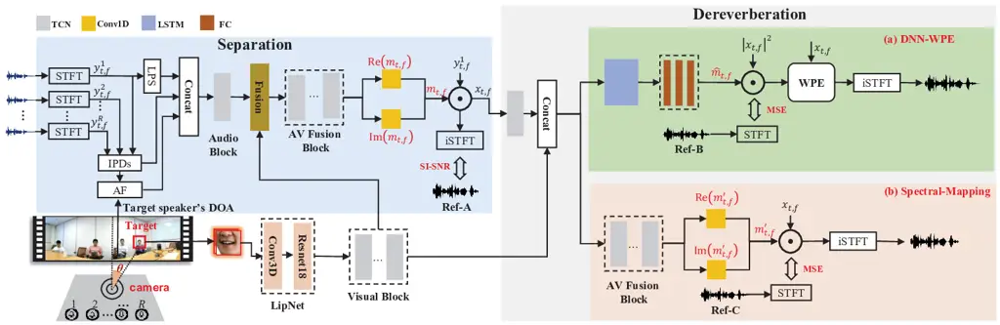

# AUDIO-VISUAL MULTI-CHANNEL SPEECH SEPARATION, DEREVERBERATION AND RECOGNITION

Guinan Li     Jianwei Yu     Jiajun Deng     Xunying Liu     Helen Meng
^(†)^(†)thanks: ^(\*) Equal contribution; This work is partly done when
Jianwei Yu is an intern in Tencent AI lab.

###### Abstract

Despite the rapid advance of automatic speech recognition (ASR)
technologies, accurate recognition of cocktail party speech
characterised by the interference from overlapping speakers, background
noise and room reverberation remains a highly challenging task to date.
Motivated by the invariance of visual modality to acoustic signal
corruption, audio-visual speech enhancement techniques have been
developed, although predominantly targeting overlapping speech
separation and recognition tasks. In this paper, an audio-visual
multi-channel speech separation, dereverberation and recognition
approach featuring a full incorporation of visual information into all
three stages of the system is proposed. The advantage of the additional
visual modality over using audio only is demonstrated on two neural
dereverberation approaches based on DNN-WPE and spectral mapping
respectively. The learning cost function mismatch between the separation
and dereverberation models and their integration with the back-end
recognition system is minimised using fine-tuning on the MSE and LF-MMI
criteria. Experiments conducted on the LRS2 dataset suggest that the
proposed audio-visual multi-channel speech separation, dereverberation
and recognition system outperforms the baseline audio-visual
multi-channel speech separation and recognition system containing no
dereverberation module by a statistically significant word error rate
(WER) reduction of 2.06 % absolute (8.77 % relative).

###### Index Terms: 

Audio-visual, Speech separation, dereverberation and recognition.

^(†)^(†)address: ¹The Chinese University of Hong Kong; ²Tencent AI lab

## 1 Introduction

Despite the rapid progress of automatic speech recognition (ASR) in the
past few decades, accurate recognition of natural speech in a complex
acoustic environment represented by cocktail party \[1, 2\] remains a
highly challenging task to date. Multiple sources of interference from
overlapping speakers, background noise and room reverberation lead to a
large mismatch between the resulting mixed speech and clean signals. To
this end, microphone arrays play a vital role in state-of-the-art ASR
systems designed for overlapped and far-field scenarios \[3, 4, 5\]. The
required acoustic beamforming techniques used to perform multi-channel
array signal integration are normally implemented as time or frequency
domain filters. Earlier generations of ASR systems featuring
conventional multi-channel array beamforming techniques represented by
either time domain delay and sum \[6\], or frequency domain minimum
variance distortionless response (MVDR) \[7\] and generalized eigenvalue
(GEV) \[8\] channel integration approaches typically adopted a pipelined
system architecture, containing separately developed speech separation,
enhancement front-end and recognition back-end components.

With the wider application of deep learning based speech technologies,
microphone array signal integration methods have evolved into a variety
of DNN based designs in recent few years. These include: a) TF masking
approaches \[9, 10\] used to predict spectral time-frequency (TF) mask
labels for a reference channel that specify whether a particular TF
spectrum point is dominated by the target speaker or interfering sources
to facilitate speech separation; b) neural Filter& Sum approaches
directly estimating the beamforming filter parameters in either time
domain \[11\] or frequency domain \[12\] to produce the separated
outputs; and c) mask-based MVDR \[13, 5, 14\], and mask-based GEV \[15\]
approaches utilizing DNN estimated TF masks to estimate target speaker
and noise specific power spectral density (PSD) matrices to obtain the
beamforming filter parameters, while alleviating the need of explicit
direction of arrival (DOA) estimation.

In recent years, there has been a similar trend of advancing
conventional speech dereverberation approaches \[16, 17, 18\]
represented by weighted prediction error (WPE) \[18\] to their neural
network based variants. These include: a) the DNN-WPE \[19, 20\] method,
which use neural network estimated target signal PSD matrices in place
of those traditionally obtained using maximum likelihood trained complex
value GMMs \[18\] in the dereverberation filter estimation; and b) the
complex spectral masking \[21, 22\] approach learning a direct TF
spectral masking between reverberated and anechoic data. Furthermore,
the joint optimization of neural network based speech separation,
dereverberation and denoising components with a multi-channel
beamforming framework \[23, 24\] has been proposed as a comprehensive
and overarching solution to the cocktail party speech problem, and has
drawn increasing research interest.

Motivated by the invariance of visual modality to acoustic signal
corruption, and the complementary information provided on top of audio
modality, there has been a long interest in developing audio-visual
speech processing enhancement \[25, 26, 27, 28\] and recognition \[29,
30, 31, 32, 33\] techniques. To date, these prior audio-visual speech
processing researches were predominantly conducted in the context of
either only the speech enhancement front-end \[25, 26, 27, 28\] or the
recognition back-end \[30, 34, 31, 32, 33\], while a holistic,
consistent incorporation of visual information in all stages of the
system (speech separation, dereverberation and recognition) has not been
studied.

To address this issue, an audio-visual multi-channel speech separation,
dereverberation and recognition approach featuring a full incorporation
of visual information into all three stages of the system is proposed.
The advantage of the additional visual modality over using audio only is
demonstrated on two neural dereverberation approaches based on DNN-WPE
and spectral mapping respectively. The learning cost function mismatch
between the separation and dereverberation models and their integration
with the back-end recognition system is minimised using fine-tuning on
the MSE and LF-MMI criteria. Experiments conducted on the LRS2 dataset
suggest that the proposed audio-visual multi-channel speech separation,
dereverberation and recognition system outperforms the baseline
audio-visual multi-channel speech separation and recognition system
without dereverberation module by a statistically significant word error
rate (WER) reduction of 2.06% absolute (8.77% relative).

The main contributions of this paper are summarized below: First, to the
best of our knowledge, this paper presents the first use of a complete
audio-visual multi-channel speech separation, dereverberation and
recognition system architecture featuring a full incorporation of visual
information into all three stages. In contrast, prior researches
incorporate video modality in either only the speech enhancement
front-end \[25, 26, 28\], recognition back-end \[30, 31, 32, 33\], or
both multi-channel speech separation and recognition stages \[35, 36\]
but excluding the dereverberation component. Second, a more complete
experimental validation of the advantage of audio-visual versus audio
only dereverberation approaches of multiple forms (DNN-WPE, spectral
mapping) is presented, as previous research \[37\] only considered the
spectral mapping method.



Figure 1: Illustration of the audio-visual multi-channel speech
separation component (top left) and DNN-WPE or spectral mapping based
dereverberation modules (top right, and bottom right respectively),
where $`y_{t,f}^{r}`$ is the complex spectrum of each channel and
$`x_{t,f}`$ is the separated output. $`m_{t,f}`$ and and
$`m^{\prime}_{t,f}`$ are the complex ideal ratio masks of the target
speaker for separation and dereverberation, where $`{\rm Re}(\cdot)`$
and $`{\rm Im}(\cdot)`$ denote the real and imaginary parts.
$`\hat{m}_{t,f}`$ is the real-valued mask for DNN-WPE dereverberation of
Eq. (7). Ref-A, Ref-B and Ref-C denote reverberant speech, early
reverberant speech and anechoic speech of the reference (1st) channel
for model training respectively.

## 2 Audio-Visual Multi-channel Separation

This section introduces the audio-visual multi-channel separation
component used before dereverberation in the overall system.

### 2.1 Audio and visual modality inputs

Audio modality: As is illustrated in the top left corner of Figure 1,
three types of audio features including the complex spectrum, the
inter-microphone phase differences (IPDs) \[13\] and location-guided
angle feature (AF) \[38\] are adopted as the audio inputs. The complex
spectrum of all the microphone array channels are first computed through
short-time Fourier transform (STFT).

IPDs features were used to capture the relative phase difference between
different microphone channels and provide additional spatial cues for TF
masking based multi-channel speech separation. These can be computed as
follows:

```math
{\rm IPD}^{(m,n)}_{t,f}=\angle({y^{m}_{t,f}}/{y^{n}_{t,f}}) \tag{1}
```

where $`y^{m}_{t,f}`$ and $`y^{n}_{t,f}`$ denote the STFT’s TF bins of
mixed speech at time $`t`$ and frequency bin $`f`$ on $`m`$th and
$`n`$th microphone channels, respectively. The operator
$`\angle(\cdot)`$ outputs the angle between them.

Angle features that are based on the approximated direction of arrival
(DOA) were also incorporated to provide further spatial filtering
constraint. In this work, the approximate DOA of a target speaker,
$`\theta`$, is obtained by tracking the speaker’s face from a 180-degree
wide-angle camera, as is shown in the bottom left corner of Figure 1.
This allows the array steering vector corresponding to the target
speaker to be expressed as follows:

```math
\displaystyle{\bf{G}}(f)=\left[e^{-j\phi_{1}\cos(\theta)},e^{-j\phi_{r}\cos(\theta)},...,e^{-j\phi_{R}\cos(\theta)}\right] \tag{2}
```

where $`\phi_{r}=2\pi fd_{1r}/c`$ and $`d_{1r}`$ is the distance between
the first (reference) and $`r`$th microphone ($`d_{11}=0`$). $`c`$ is
the sound velocity. Based on the computed steering vector, the
location-guided AF feature introduced in \[38, 28\] are also adopted to
provide further discriminative information for the target speaker as
follows:

```math
\displaystyle\text{AF}(t,f)=\sum_{\{(m,n)\}}\frac{\big\langle\text{vec}\big(\frac{G_{n}(f)}{G_{m}(f)}\big),\text{vec}\big(\frac{y^{m}_{t,f}}{y^{n}_{t,f}}\big)\big\rangle}{\big\|\text{vec}\big(\frac{G_{n}(f)}{G_{m}(f)}\big)\big\|\cdot\big\|\text{vec}\big(\frac{y^{m}_{t,f}}{y^{n}_{t,f}}\big)\big\|} \tag{3}
```

where $`\|\cdot\|`$ denotes the vector norm,
$`\langle\cdot,\cdot\rangle`$ represents the inner product and
$`\{(m,n)\}`$ denotes the selected microphone pairs.
$`\text{vec}(\cdot)`$ transforms the complex value into a 2-D vector,
where the real and imaginary parts are regarded as the two vector
components.

Following the previous researches on audio-visual multi-channel speech
separation \[35, 36\], temporal convolutional networks (TCNs) \[39\] are
used in the speech separation module. As shown in the left corner of
Figure 1, the log-power spectrum (LPS) features of the reference
microphone channel were initially concatenated with the IPDs and AF
features computed above before being fed into the TCN based audio block
to compute the audio embedding.  
Visual modality: Considering the invariance of visual modality to
acoustic signal corruption, and the complementary information provided
on top of audio modality, the visual feature of target lip movements is
extracted by a LipNet \[40\] as shown in Figure 1 (bottom left, in light
brown). The LipNet consists a 3D convolutional layer and a 18-layer
ResNet. Before fusing the visual features with the audio embedding to
improve the estimation, the lip features are firstly fed into the visual
block containing 5 TCNs (Figure 1, bottom left in grey) to compute the
visual embedding.  
Audio-visual modality fusion: In this work, a factorised attention-based
modality fusion method consistent with our previous work \[35\] was
utilised in the separation module. This attention based fusion block
(Figure 1, left middle in dark brown) combines the audio and visual
embeddings from the outputs of the audio and visual TCN embedding blocks
respectively. The outputs of this fusion layer are sent into the
audio-visual (AV) embedding block containing 3 TCN blocks (Figure 1,
left middle in grey) to compute the final audio-visual embedding
features.

### 2.2 TF masking based speech separation

After modality fusion, the above audio-visual embeddings are fed into 2
Conv1D blocks (Figure 1, left in yellow) to estimate the complex ideal
ratio mask (cIRM) $`m_{t,f}`$ of the target speech for the separation
module. The estimated speech complex spectrum is:

```math
x_{t,f}=m_{t,f}y_{t,f}^{r} \tag{4}
```

where $`m_{t,f}\in\mathbb{C}`$ is the cIRM of the target speaker,
$`y_{t,f}^{r}`$ is the reference channel complex spectrum of mixed
speech (without loss of generality, the first channel is selected as the
reference channel throughout this paper), before being fed into the
subsequent audio-visual dereverberation component of the following
Section 3. Given the estimated complex spectrum, the time-domain
separated speech can be computed by the inverse short-time Fourier
transform (iSTFT) and the SI-SNR cost function is used to optimize the
separation neural networks.

## 3 Audio-Visual Dereverberation

### 3.1 Audio-visual DNN-WPE based dereverberation

Let $`x_{t,f}`$ denotes the observed speech impaired by reverberation in
the STFT domain at time frame index $`t`$ and frequency bin index $`f`$.
The desired signal $`\hat{d}_{t,f}`$ can be obtained by inverse filter
to subtract the estimated tail reverberation from the observed signal
\[18, 19\] as:

```math
\begin{split}\hat{d}_{t,f}&=x_{t,f}-\sum_{\tau=D}^{D+L-1}{g^{*}_{\tau,f}}{x_{t-\tau,f}}=x_{t,f}-\mathbf{\hat{g}}_{f}^{H}\mathbf{x}_{t-D,f}\end{split} \tag{5}
```

where $`(\cdot)^{*}`$ and $`(\cdot)^{H}`$ operators denote the complex
conjugate operator and conjugate transpose operator. $`D`$ denotes the
prediction delay and $`L`$ is the filter tap. $`\mathbf{x}_{t-D,f}`$ and
$`\mathbf{\hat{g}}_{f}`$ are vector representations of the observed
signal and filter weights at frequency bin index $`f`$ with $`L`$
elements.

In conventional weighted prediction error (WPE) \[18\] dereverberation,
the filter weights $`\mathbf{\hat{g}}_{f}`$ are estimated as:

```math
\displaystyle\mathbf{\hat{g}}_{f}={\left(\sum_{t}\frac{\mathbf{x}_{t-D,f}\mathbf{x}^{H}_{t-D,f}}{\lambda_{t,f}}\right)^{-1}}\left(\sum_{t}\frac{\mathbf{x}_{t-D,f}x^{*}_{t,f}}{\lambda_{t,f}}\right) \tag{6}
```

where $`\lambda_{t,f}=|\hat{d}_{t,f}|^{2}`$ is the PSD of the target
speech spectrum. In DNN-WPE, $`\lambda_{t,f}`$ is predicted by
estimating the TF mask as follows:

```math
\lambda_{t,f}=\hat{m}_{t,f}\left|x_{t,f}\right|^{2} \tag{7}
```

where $`\hat{m}_{t,f}\in\mathbb{R}`$ is the estimated TF mask produced
by the DNN-WPE module (Figure 1, top right in green) using audio
embeddings alone, or optionally fused audio-visual features as the input
to leverage the invariance of video modality to reverberation in this
work.

During training, the spectrum of the early reverberant speech (with
first 50ms reverberation following \[20\]) is adopted as the training
target. The dereverberation module is optimized using the mean square
error (MSE) cost. Once the mask is predicted, $`\mathbf{\hat{g}}_{f}`$
can be estimated to facilitate dereverberation.

### 3.2 Audio-visual spectral mapping for dereverberation

In addition to the audio-visual DNN-WPE approach, an audio-visual
spectral mapping approach is also proposed. As shown in Figure 1 (bottom
right corner, in pink), the LPS of separated speech is firstly fed into
the audio block to compute the audio embeddings and then concatenated
with the lip embedding extracted from the visual block. The concatenated
audio-visual embedding are then forwarded into the AV fusion block.
Finally, the audio-visual embeddings are forwarded into 2 Conv1D blocks
to estimate the cIRM $`m^{\prime}_{t,f}`$ of the non-reverberant target
speech. The estimated speech complex spectrum can be obtained using
Eq.(4). During training, the spectrum of the anechoic speech is used as
the training target and MSE is adopted as the loss function.

## 4 Integration of enhancement front-end & recognition back-end

When designing cocktail part speech recognition systems, the separation,
dereverberation and recognition components are often used in a pipelined
manner. However, the performance of such system can be sub-optimal due
to the mismatch among the different training error costs used by the
three components. To this end, a tighter integration between system
components, for example, the separation and dereverberation modules, can
be achieved via joint fine-tuning on the dereverberation MSE cost alone,
or an interpolated SI-SNR and MSE error loss function. ¹¹ 1 In this
paper, we only show the MSE loss joint fine-tuning results since using
the multi-task loss gives limited performance improvement. Their further
integration of the audio only or audio-visual CLDNN based back-end
recognition component was performed by fine-tuning using the LF-MMI
sequence training criterion \[35\] given the enhanced outputs.

| Sys | Data                         | +visual | WER(%)    |
| --- | ---------------------------- | ------- | --------- |
| 1   | anechoic                     | ✗       | 13.87     |
| 2   |                              | ✓       | 12.28^(†) |
| 3   | early-reverberant            | ✗       | 18.29     |
| 4   |                              | ✓       | 13.51^(†) |
| 5   | reverberant                  | ✗       | 23.35     |
| 6   |                              | ✓       | 17.61^(†) |
| 7   | overlapped-noisy-reverberant | ✗       | 84.01     |
| 8   |                              | ✓       | 42.25^(†) |

Table 1: Performance of single channel ASR and AVSR systems trained and
evaluated on anechoic, early-reverberant, reverberant and
reverberant-noisy-overlapped speech. $`{{\dagger}}`$ denotes a
statistically significant difference obtained over the baseline (sys. 1,
3, 5, 7).

|                                            |      |         |         |         |         |           |          |      |           |                           |      |           |             |
| ------------------------------------------ | ---- | ------- | ------- | ------- | ------- | --------- | -------- | ---- | --------- | ------------------------- | ---- | --------- | ----------- |
| Sys                                        | Sep. |         | Dervb.  |         | Recg.   | Anec.     | Pipeline |      |           | Jointly FT (Sep.+ Dervb.) |      |           | FT back-end |
|                                            | AF   | +visual | method  | +visual | +visual | WER       | PESQ     | SRMR | WER       | PESQ                      | SRMR | WER       | WER         |
| raw 1 channel reverberant-noisy-overlapped |      |         |         |         |         | 85.71     | 1.65     | 4.01 | 84.01     | \-                        |      |           | \-          |
| 1                                          | ✓    | ✗       | \-      |         | ✗       | 53.29     | 2.30     | 6.20 | 39.38     | \-                        |      |           | \-          |
| 2                                          | ✓    | ✓       | \-      |         | ✗       | 48.51     | 2.37     | 6.44 | 36.46     | \-                        |      |           | \-          |
| 3                                          | ✓    | ✓       | \-      |         | ✓       | 33.23     | 2.37     | 6.44 | 24.92     | \-                        |      |           | 23.50       |
| 4                                          | ✓    | ✗       | DNN-WPE | ✗       | ✗       | 51.76^(⋆) | 2.32     | 6.65 | 38.38     | 2.32                      | 6.70 | 38.21^(⋆) | \-          |
| 5                                          | ✓    | ✗       |         | ✓       | ✗       | 51.25^(⋆) | 2.33     | 6.70 | 37.96^(⋆) | 2.33                      | 6.78 | 37.24^(⋆) | \-          |
| 6                                          | ✓    | ✗       | SpecM   | ✗       | ✗       | 51.94     | 2.37     | 7.79 | 38.08^(⋆) | 2.39                      | 8.33 | 37.63^(⋆) | \-          |
| 7                                          | ✓    | ✗       |         | ✓       | ✗       | 51.68^(⋆) | 2.38     | 8.00 | 36.98^(⋆) | 2.39                      | 8.45 | 36.58^(⋆) | \-          |
| 8                                          | ✓    | ✓       | DNN-WPE | ✗       | ✗       | 47.60     | 2.39     | 6.78 | 35.09^(†) | 2.40                      | 6.90 | 34.52^(†) | \-          |
| 9                                          | ✓    | ✓       |         | ✓       | ✗       | 47.55^(†) | 2.40     | 6.73 | 34.58^(†) | 2.41                      | 6.93 | 33.69^(†) | \-          |
| 10                                         | ✓    | ✓       | SpecM   | ✗       | ✗       | 47.45^(†) | 2.46     | 7.55 | 34.31^(†) | 2.47                      | 8.68 | 34.05^(†) | \-          |
| 11                                         | ✓    | ✓       |         | ✓       | ✗       | 46.88^(†) | 2.48     | 7.77 | 33.44^(†) | 2.49                      | 8.71 | 32.91^(†) | \-          |
| 12                                         | ✓    | ✓       | DNN-WPE | ✓       | ✓       | 32.15^(‡) | 2.40     | 6.73 | 23.69^(‡) | 2.41                      | 6.93 | 22.99^(‡) | 21.91^(‡)   |
| 13                                         | ✓    | ✓       | SpecM   | ✓       | ✓       | 31.32^(‡) | 2.48     | 7.77 | 22.72^(‡) | 2.49                      | 8.71 | 22.38^(‡) | 21.44^(‡)   |

Table 2: Separation, dereverberation and recognition on LRS2
overlapped-noisy-reverberant dataset. ‘Sep.’, ‘Dervb.’, ‘Recg.’ denotes
separation, dereverberation and recognition. ‘Anec.’ denotes ASR system
trained on anechoic speech. ‘AF’ and ‘SpecM’ denotes angle feature and
spectral mapping. FT denotes fine tuning. $`{\star}`$, $`{{\dagger}}`$
and $`{{\ddagger}}`$ denotes statistically significant difference over
baseline (sys. 1,2,3).

## 5 Experiment & Results

### 5.1 Experiment Setup

Simulated mixed speech: The multi-channel overlapped-noisy-reverberant
speech is simulated using the LRS2 dataset. A 15-channel symmetric
linear array described in \[35\] is used in the simulation process.
843-point source noises and 40000 Room Impulse Responses (RIRs)
generated by the image method \[41\] in 400 different simulated rooms
were used in our experiment. The distance between a sound source and the
microphone array center is randomly sampled from the range of 1m to 5m
and the room size is ranging from 1m $`\times`$ 1m $`\times`$ 2m to 30m
$`\times`$ 30m $`\times`$ 5m (length $`\times`$ width $`\times`$
height). The reverberation time $`T_{60}`$ is sampled from a range of
0.06s to 1.12s. The average overlapping ration is around 85%. The SNR is
randomly chosen from 0, 5, 10, 15 and 20 dB, and SIR from -6, 0 and 6
dB. The simulated dataset is split into three subsets with 91.7k, 2.2k,
and 1.2k utterances respectively for training, validation and test.
Statistical significance test was conducted at level $`\alpha=0.05`$
based on matched pairs sentence segment word error (MAPSSWE) for
recognition performance analysis

Implementation details: Details of the IPD, AF features and the baseline
audio-visual back-end ASR can be found in \[35\]. For DNN-WPE
dereverberation, the prediction delay D and filter tap L were set to 3
and 18, respectively. The number of iterations for parameter estimation
in conventional WPE was set to 3.

|                      |            |         |      |      |           |            |
| -------------------- | ---------- | ------- | ---- | ---- | --------- | ---------- |
| Sys                  | Dervb.     |         | PESQ | SRMR | WER(%)    |            |
|                      | method     | +visual |      |      | Anec.     | Retrain.   |
| \- raw reverberant - |            |         | 2.76 | 5.85 | 34.29     | 23.35      |
| 1                    | WPE \[18\] | \-      | 2.77 | 5.90 | 32.34     | 21.70      |
| 2                    | DNN-WPE    | ✗       | 2.79 | 6.54 | 28.03     | 19.56      |
| 3                    |            | ✓       | 2.83 | 6.58 | 27.64     | 18.87 ^(†) |
| 4                    | SpecM      | ✗       | 2.92 | 7.67 | 27.94     | 19.52      |
| 5                    |            | ✓       | 2.97 | 8.05 | 27.53^(†) | 18.53^(†)  |

Table 3: Performance of ASR systems trained on anechoic and
dereverberated speech. ‘Anec.’ denotes ASR systems trained on anechoic
speech. ‘Retrain.’ denotes the ASR systems trained on the dereverberated
data. $`{{\dagger}}`$ denotes a statistically significant difference
obtained over the corresponding audio-only baselines (sys. 2, 4).

### 5.2 Experiment Results

Speech recognition without front-end: Table 1 presents the WERs of
various LF-MMI based ASR and AVSR systems that contains no separation
and dereverberation components, trained and evaluated on four types of
data: anechoic, early-reverberant, reverberant and
overlapped-noisy-reverberant speech. It can be observed that using
visual information can significantly improve the recognition performance
over the audio-only systems. In particular, the audio-visual recognition
system trained on overlapped-noisy-reverberant speech outperforms the
audio-only system by up to 41.76 % (sys.7 vs sys.8) absolute WER
reduction on test data of the same condition.  
Performance of audio-visual dereverberation: The performance of various
dereverberation approaches on reverberant only (non-overlapping) speech
are evaluated on ASR systems constructed using anechoic or the
corresponding dereverberated speech, and shown in Table 3. It can be
observed that adding visual information in DNN-WPE and spectral mapping
(SpecM) dereverberation produced consistent improvements in terms of
PESQ \[42\], speech to reverberation modulation energy ratio (SRMR)
\[43\] and WER (sys. 2 vs sys. 3, sys. 4 vs sys. 5).

Performance on overlapped-noisy-reverberant speech: Their performance
are further evaluated on audio-visual multi-channel speech separation,
dereverberation system constructed using the
overlapped-noisy-reverberant data in Table 2, with either a partial, or
full incorporation of visual information into all three stages. Several
trends can be observed from Table 2: 1) Using visual feature in both the
separation and recognition components significantly improves the
recognition performance on both the anechoic speech trained ‘Anec.’ and
pipeline systems by up to 20.06 % and 14.46 % (sys. 1 vs sys. 3), as
well as the PESQ and SRMR scores. 2) In contrast to the pipeline systems
only containing separation front-ends (sys. 1, 2, 3), adding audio-only
or audio-visual dereverberation modules (DNN-WPE & SpecM) produced WER
reductions ranging from 1% to 2.4% (sys. 4, 5, 6, 7 vs sys. 1), 1.37% to
3.02 % (sys. 8, 9, 10, 11 vs sys. 2 ), 1.23% to 2.2% (sys. 12, 13 vs
sys. 3). Among these, leveraging visual modality in dereverberation
module consistently produced better performance with WER reductions up
to 1.1% absolute (sys.7 vs sys. 6). 3) Further jointly fine-tuning the
separation and dereverberation components using dereverberation MSE cost
function (col. “Jointly FT (Sep.+ Dervb.)”, Table 2) produced PESQ and
SRMR improvements of 0.04-0.12 and 0.53-2.27 points (sys. 12, 13 vs
sys.3), in addition to consistent WER reductions over the pipeline
systems. 4) Finally, to tightly integrate the enhancement front-end and
recognition back-end, fine-tuning three AVSR systems (sys. 3, 12, 13) on
their respective enhanced speech outputs (last col. Table 2) further
reduced the WER while retaining the same trend. The final fine-tuned
AVSR systems with an audio-visual dereverberation module outperform the
baseline AVSR system by 1.59%-2.06% in WER reduction (sys. 12, 13 vs
sys.3).

## 6 Conclusions

In this paper, an audio-visual multi-channel speech separation,
dereverberation and recognition approach featuring a full incorporation
of visual information into all three stages of the system is proposed.
The advantages of visual modality over using acoustic features only is
demonstrated on two neural dereverberation approaches based on DNN-WPE
and spectral mapping using the LRS2 dataset simulated speech containing
overlapping, noise and reverberation. Future research will focus on
improving the integration between the separation, dereverberation and
recognition components.

## 7 ACKNOWLEDGEMENTS

This research is supported by Hong Kong RGC GRF grant No. 14200218,
14200220, 14200021, TRS T45-407/19N, and Innovation & Technology Fund
grant No. ITS/254/19.

## References

- \[1\] Josh H McDermott, “The cocktail party problem,” CURR BIOL, vol.
  19, no. 22, pp. R1024–R1027, 2009.
- \[2\] Yanmin Qian et al., “Past review, current progress, and
  challenges ahead on the cocktail party problem,” FRONT INFORM TECH EL,
  vol. 19, no. 1, pp. 40–63, 2018.
- \[3\] Jon Barker et al., “The third ‘CHiME’speech separation and
  recognition challenge: Dataset, task and baselines,” in ASRU, 2015.
- \[4\] Takuya Yoshioka et al., “The NTT CHiME-3 system: Advances in
  speech enhancement and recognition for mobile multi-microphone
  devices,” in ASRU, 2015.
- \[5\] Xuankai Chang et al., “MIMO-Speech: End-to-end multi-channel
  multi-speaker speech recognition,” in ASRU, 2019.
- \[6\] Xavier Anguera et al., “Acoustic beamforming for speaker
  diarization of meetings,” IEEE-ACM T AUDIO SPE, vol. 15, no. 7, pp.
  2011–2022, 2007.
- \[7\] Mehrez Souden et al., “On optimal frequency-domain multichannel
  linear filtering for noise reduction,” IEEE-ACM T AUDIO SPE, vol. 18,
  no. 2, pp. 260–276, 2009.
- \[8\] Ernst Warsitz et al., “Blind acoustic beamforming based on
  generalized eigenvalue decomposition,” IEEE-ACM T AUDIO SPE, vol. 15,
  no. 5, pp. 1529–1539, 2007.
- \[9\] Fahimeh Bahmaninezhad et al., “A comprehensive study of speech
  separation: spectrogram vs waveform separation,” in INTERSPEECH, 2019.
- \[10\] Lianwu Chen et al., “Multi-band pit and model integration for
  improved multi-channel speech separation,” in ICASSP, 2019.
- \[11\] Tara N Sainath et al., “Multichannel signal processing with
  deep neural networks for automatic speech recognition,” IEEE-ACM T
  AUDIO SPE, vol. 25, no. 5, pp. 965–979, 2017.
- \[12\] Xiong Xiao et al., “Deep beamforming networks for multi-channel
  speech recognition,” in ICASSP, 2016.
- \[13\] Takuya Yoshioka et al., “Recognizing overlapped speech in
  meetings: A multichannel separation approach using neural networks,”
  in INTERSPEECH, 2018.
- \[14\] Takuya Yoshioka et al., “Multi-microphone neural speech
  separation for far-field multi-talker speech recognition,” in
  ICASSP, 2018.
- \[15\] Jahn Heymann et al., “Beamnet: End-to-end training of a
  beamformer-supported multi-channel ASR system,” in ICASSP, 2017.
- \[16\] Ken’ichi Furuya and Akitoshi Kataoka, “Robust speech
  dereverberation using multichannel blind deconvolution with spectral
  subtraction,” IEEE-ACM T AUDIO SPE, vol. 15, no. 5, pp.
  1579–1591, 2007.
- \[17\] Tomohiro Nakatani et al., “Blind speech dereverberation with
  multi-channel linear prediction based on short time fourier transform
  representation,” in ICASSP, 2008.
- \[18\] Tomohiro Nakatani et al., “Speech dereverberation based on
  variance-normalized delayed linear prediction,” IEEE-ACM T AUDIO SPE,
  vol. 18, no. 7, pp. 1717–1731, 2010.
- \[19\] Keisuke Kinoshita et al., “Neural network-based spectrum
  estimation for online wpe dereverberation.,” in INTERSPEECH, 2017.
- \[20\] Jahn Heymann et al., “Frame-online DNN-WPE dereverberation,” in
  IWAENC, 2018.
- \[21\] Donald S Williamson and DeLiang Wang, “Time-frequency masking
  in the complex domain for speech dereverberation and denoising,”
  IEEE-ACM T AUDIO SPE, vol. 25, no. 7, pp. 1492–1501, 2017.
- \[22\] Zhongqiu Wang and Deliang Wang, “Multi-microphone complex
  spectral mapping for speech dereverberation,” in ICASSP, 2020.
- \[23\] Hideaki Kagami et al., “Joint separation and dereverberation of
  reverberant mixtures with determined multichannel non-negative matrix
  factorization,” in ICASSP, 2018.
- \[24\] Christoph Boeddeker et al., “Jointly optimal dereverberation
  and beamforming,” in ICASSP, 2020.
- \[25\] Triantafyllos Afouras et al., “The conversation: Deep
  audio-visual speech enhancement,” in INTERSPEECH, 2018.
- \[26\] Jian Wu et al., “Time domain audio visual speech separation,”
  in ASRU, 2019.
- \[27\] Ariel Ephrat et al., “Looking to listen at the cocktail party:
  a speaker-independent audio-visual model for speech separation,” ACM T
  GRAPHIC, vol. 37, no. 4, pp. 1–11, 2018.
- \[28\] Rongzhi Gu et al., “Multi-modal multi-channel target speech
  separation,” IEEE J-STSP, vol. 14, no. 3, pp. 530–541, 2020.
- \[29\] Takaki Makino et al., “Recurrent neural network transducer for
  audio-visual speech recognition,” in ASRU, 2019.
- \[30\] Triantafyllos Afouras et al., “Deep audio-visual speech
  recognition,” IEEE T PATTERN ANAL, 2018.
- \[31\] Kuniaki Noda et al., “Audio-visual speech recognition using
  deep learning,” APPL INTELL, vol. 42, no. 4, pp. 722–737, 2015.
- \[32\] Youssef Mroueh et al., “Deep multimodal learning for
  audio-visual speech recognition,” in ICASSP, 2015.
- \[33\] Jianwei Yu et al., “Audio-visual recognition of overlapped
  speech for the LRS2 dataset,” in ICASSP, 2020.
- \[34\] Shiliang Zhang et al., “Robust audio-visual speech recognition
  using bimodal DFSMN with multi-condition training and dropout
  regularization,” in ICASSP, 2019.
- \[35\] Jianwei Yu et al., “Audio-visual multi-channel integration and
  recognition of overlapped speech,” IEEE-ACM T AUDIO SPE, 2021.
- \[36\] Jianwei Yu et al., “Audio-visual multi-channel recognition of
  overlapped speech,” in INTERSPEECH, 2020.
- \[37\] Ke Tan et al., “Audio-visual speech separation and
  dereverberation with a two-stage multimodal network,” IEEE J-STSP,
  vol. 14, no. 3, pp. 542–553, 2020.
- \[38\] Zhuo Chen et al., “Multi-channel overlapped speech recognition
  with location guided speech extraction network,” in SLT, 2018.
- \[39\] Yi Luo and Nima Mesgarani, “Conv-tasnet: Surpassing ideal
  time–frequency magnitude masking for speech separation,” IEEE-ACM T
  AUDIO SPE, vol. 27, no. 8, pp. 1256–1266, 2019.
- \[40\] Triantafyllos Afouras et al., “Deep lip reading: a comparison
  of models and an online application,” in INTERSPEECH, 2018.
- \[41\] Emanuel AP Habets, “Room impulse response generator,”
  Technische Universiteit Eindhoven, Tech. Rep, vol. 2, no. 2.4, pp.
  1, 2006.
- \[42\] ITU-T Recommendation, “Perceptual evaluation of speech quality
  (PESQ): An objective method for end-to-end speech quality assessment
  of narrow-band telephone networks and speech codecs,” Rec. ITU-T P.
  862, 2001.
- \[43\] Tiago H Falk et al., “A non-intrusive quality and
  intelligibility measure of reverberant and dereverberated speech,”
  IEEE-ACM T AUDIO SPE, vol. 18, no. 7, pp. 1766–1774, 2010.
