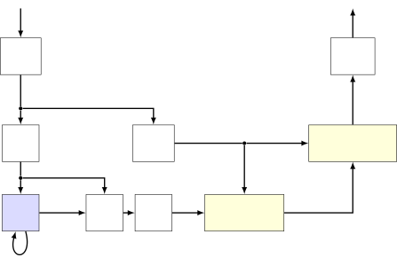

# Customizable end-to-end optimization of online neural network-supported dereverberation for hearing devices

Jean-Marie Lemercier^(⋆)    Joachim Thiemann^(†)    Raphael Koning^(†)
   Timo Gerkmann^(⋆) ^(†)^(†)thanks: This work has been funded by the
Federal Ministry for Economic Affairs and Climate Action, project
01MK20012S, AP380. The authors are responsible for the content of this
paper.

###### Abstract

This work focuses on online dereverberation for hearing devices using
the weighted prediction error (WPE) algorithm. WPE filtering requires an
estimate of the target speech power spectral density (PSD). Recently
deep neural networks (DNNs) have been used for this task. However, these
approaches optimize the PSD estimate which only indirectly affects the
WPE output, thus potentially resulting in limited dereverberation. In
this paper, we propose an end-to-end approach specialized for online
processing, that directly optimizes the dereverberated output signal. In
addition, we propose to adapt it to the needs of different types of
hearing-device users by modifying the optimization target as well as the
WPE algorithm characteristics used in training. We show that the
proposed end-to-end approach outperforms the traditional and
conventional DNN-supported WPEs on a noise-free version of the WHAMR!
dataset.

###### Index Terms: 

online algorithm, dereverberation, neural network, end-to-end learning,
hearing devices

^(†)^(†)address: ^(⋆)Signal Processing (SP), Universität Hamburg,
Germany  
^(†)Advanced Bionics, Hanover, Germany  
{firstname.lastname}@uni-hamburg.de,
{firstname.lastname}@advancedbionics.com

## 1 Introduction

Communication and hearing devices require modules aiming at suppressing
undesired parts of the signal to improve the speech quality and
intelligibility. Reverberation is one of such distortions caused by room
acoustics, and is characterized by multiple reflections on the room
enclosures. Late reflections particularly degrade the speech signal and
may result in a reduced intelligibility \[1, 2\].

Many traditional approaches were proposed for dereverberation such as
spectral enhancement \[3\], beamforming \[4\], a combination of both
\[5\], coherence weighting \[6, 7, 8\], and linear-prediction based
approaches such as the weighted-prediction error (WPE) algorithm \[9,
10\]. WPE computes an auto-regressive multi-channel filter and applies
it to a delayed group of reverberant speech frames. The approach is able
to cancel late reverberation while preserving early reflections, thus
improving speech intelligibility for normal and hearing-aided listeners
\[11, 12\]. WPE and its extensions have been shown to be robust and
efficient multi-channel techniques. However, these methods require the
prior estimation of the anechoic speech power spectrum density (PSD),
which is modelled for instance through the speech periodogram \[9\], by
an autoregressive process \[13\] or through non-negative matrix
factorization \[14\]. A deep neural network (DNN) was first proposed in
\[15\] to model the anechoic PSD, thus avoiding the use of an iterative
refinement process.

As hearing devices require to operate in real-time in variable
environments, the methods implemented should be suited for
frame-to-frame online processing, as well as being adaptive to changing
room acoustics. Online adaptive approaches are based on either Kalman
filtering \[16, 17\] or on a recursive least squares (RLS) adapted WPE.
In this latter RLS-WPE framework, the PSD is either estimated by
recursive smoothing of the reverberant signal \[18\] or by a DNN \[19\].

In the previously cited work, the neural network was trained toward PSD
estimation, although the aim of the algorithm is WPE-based
dereverberation. End-to-end techniques were proposed, using an Automatic
Seech Recognition (ASR) criterion in order to refine the front-end DNN
handling e.g. speech separation \[20\], denoising \[21\], or multiple
tasks \[22\]. An end-to-end procedure for online dereverberation and ASR
based on DNN-WPE was proposed in \[23\]. However, for hearing devices,
it is less clear which criterion reaches optimal speech intelligibility
and quality, and such performance is highly dependent on the considered
user category.

In this work, we propose to use a criterion on the WPE output short-time
spectrum for online dereverberation to improve instrumentally predicted
speech intelligibility and quality. To solve the issue of the
initialization period of RLS-WPE, we design a dedicated training
procedure taking into account the adaptive nature of the algorithm.
Finally we include a specialization toward different hearing-device
users categories: hearing-aid (HA) users on the one hand benefiting from
early reflections like normal listeners \[11\]; cochlear-implanted (CI)
on the other hand which do not benefit from early reflections \[24\].

The rest of this paper is organized as follows. In Section 2, the online
DNN-WPE dereverberation scheme is summarized, followed by a description
of the proposed end-to-end training procedure in Section 3. The
experimental setup is described in Section 4 and the evaluation results
are presented and discussed in Section 5.

## 2 Signal model and DNN-supported WPE Dereverberation

### 2.1 Signal model

In the short-time Fourier transform (STFT) domain using the
subband-filtering approximation \[9\], the reverberant speech
$`\boldsymbol{x}\in\mathbb{C}^{D}`$ is obtained at the $`D`$-microphone
array by convolution of the anechoic speech $`s`$ and the room impulse
responses (RIRs) $`\boldsymbol{H}\in\mathbb{C}^{D\times D}`$ with length
$`L`$,

```math
\boldsymbol{{x}}_{t,f}=\displaystyle{\sum_{\tau=0}^{L}}\boldsymbol{H}_{\tau,f}s_{t-\tau,f}=\boldsymbol{{d}}_{t,f}+\boldsymbol{{e}}_{t,f}+\boldsymbol{{r}}_{t,f}, \tag{1}
```

where $`t`$ denotes the time frame index and $`f`$ the frequency bin,
which we will drop when not needed. $`\boldsymbol{d}`$ denotes the
direct path, $`\boldsymbol{e}`$ the early reflections component, and
$`\boldsymbol{r}`$ the late reverberation. The early reflections
component $`\boldsymbol{e}`$ was shown to contribute to speech quality
and intelligibility for normal and HA listeners \[12\] but not for CI
listeners, particularly in highly-reverberant scenarios \[24\].
Therefore, we propose that the dereverberation objective is to retrieve
$`\boldsymbol{\nu}=\boldsymbol{d+e}`$ for HA listeners and
$`\boldsymbol{\nu}=\boldsymbol{d}`$ for CI listeners.

### 2.2 WPE dereverberation

In relation to the subband reverberant model in (1), the WPE algorithm
\[9\] uses an auto-regressive model to approximate the late
reverberation $`\boldsymbol{r}`$. Based on a zero-mean time-varying
Gaussian model on the STFT anechoic speech $`s`$ with time-frequency
dependent PSD $`\lambda_{t,f}`$, a multi-channel filter
$`\boldsymbol{G}\in\mathbb{C}^{DK\times D}`$ with $`K`$ taps is
estimated. This filter aims at representing the inverse of the late tail
of the RIRs $`\boldsymbol{H}`$, such that the target
$`\boldsymbol{\nu}`$ can be obtained through linear prediction, with a
delay $`\Delta`$ avoiding undesired short-time speech cancellations,
which also leads to preserving parts of the early reflections:

```math
\widehat{\boldsymbol{{\nu}}}_{t,f}=\boldsymbol{x}_{t,f}-\boldsymbol{G}^{H}_{t,f}\boldsymbol{X}_{t-\Delta,f}, \tag{2}
```

where
$`\boldsymbol{X}_{t-\Delta,f}=\begin{bmatrix}\boldsymbol{x}^{T}_{t-\Delta,f},\dots,\boldsymbol{x}^{T}_{t-\Delta-K+1,f}\end{bmatrix}^{T}\in\mathbb{C}^{DK}`$.

In order to obtain an adaptive and real-time capable approach, RLS-WPE
was proposed in \[18\], where the WPE filter $`\boldsymbol{G}`$ is
recursively updated along time:

```math
\boldsymbol{{K}}_{t,f}=\displaystyle{\frac{(1-\alpha)\boldsymbol{R}^{-1}_{t-1,f}\boldsymbol{X}_{t-\Delta,f}}{\alpha\lambda_{t,f}+(1-\alpha)\boldsymbol{X}^{H}_{t-\Delta,f}\boldsymbol{R}^{-1}_{t-1,f}\boldsymbol{X}_{t-\Delta,f}}}, \tag{3}
```

```math
\boldsymbol{R}^{-1}_{t,f}=\frac{1}{\alpha}\boldsymbol{R}^{-1}_{t-1,f}-\frac{1}{\alpha}\boldsymbol{{K}}_{t,f}\boldsymbol{X}^{T}_{t-\Delta,f}\boldsymbol{R}^{-1}_{t-1,f}, \tag{4}
```

```math
\boldsymbol{G}_{t,f}=\boldsymbol{G}_{t-1,f}+\boldsymbol{{K}}_{t,f}(\boldsymbol{x}_{t,f}-\boldsymbol{G}_{t-1,f}^{H}\boldsymbol{X}_{t-\Delta,f})^{H}. \tag{5}
```

$`\boldsymbol{K}\in\mathbb{C}^{DK}`$ is the Kalman gain,
$`\boldsymbol{R}\in\mathbb{C}^{DK\times DK}`$ the covariance of the
delayed reverberant signal buffer $`\boldsymbol{X}_{t-\Delta,f}`$
weighted by the PSD $`\lambda`$, and $`\alpha`$ the forgetting factor.

### 2.3 DNN-based PSD estimation

The anechoic speech PSD $`\lambda_{t,f}`$ is estimated at each time step
$`t`$, either by recursive smoothing of the reverberant periodogram
\[18\] or with help of a DNN \[19\]. A block diagram of the DNN-WPE
algorithm as proposed in \[19\] is given in Figure 1. In this approach,
the channel-averaged magnitude frame $`|\boldsymbol{\bar{x}}_{t}|`$ is
fed as input to a recurrent neural network with state $`h_{t}`$ and the
output is a target speech mask $`\mathcal{M}^{(\nu)}_{t,f}`$. The PSD
estimate is then obtained by time-frequency masking:

```math
\widehat{\lambda}_{t,f}=(\mathcal{M}^{(\nu)}_{t,f}\odot|\boldsymbol{\bar{x}}_{t,f}|)^{2}. \tag{6}
```

The DNN is optimized with a mean-squared error criterion on the masked
output in \[15, 19\]. In contrast, we propose to use the
Kullback-Leibler (KL) divergence as it led to better results:

```math
\mathcal{L}_{\text{DNN-WPE}}=\text{KL}(\mathcal{M}^{(\nu)}_{t,f}\odot|\boldsymbol{\bar{x}}_{t,f}|,|\boldsymbol{{\nu}}_{t,f}|). \tag{7}
```

The training objective $`\mathcal{L}_{\text{DNN-WPE}}`$ does not match
the output $`\widehat{\boldsymbol{\nu}}`$ of the whole algorithm, thus
potentially limiting the dereverberation performance.



Figure 1: DNN-supported online WPE dereverberation. Blue blocks refer to
trainable neural network layers. Yellow blocks represents adaptive
statistical signal processing

## 3 Proposed End-to-End Training Procedure for Online Dereverberation Optimality

### 3.1 End-to-end criterion and objectives

Here we propose an end-to-end training procedure where the optimization
criterion is placed at the output of the DNN-WPE algorithm. The
objective is to include the back-end WPE into the computations through
which the loss will be backpropagated during training:

```math
\mathcal{L}_{\text{E2E}}=\text{KL}(|\widehat{\boldsymbol{{\nu}}}_{t,f}|,|\boldsymbol{{\nu}}_{t,f}|). \tag{8}
```

In contrast to \[23\], no ASR criterion is used here. Instead, the loss
is computed in the time-frequency domain. This enables us to take
different targets and WPE parameters into consideration, for customizing
the approach towards different hearing-device user categories. Namely,
for HA listeners, where early reflections are considered beneficial
\[12\], we set the training target to
$`\boldsymbol{\nu}=\boldsymbol{d}+\boldsymbol{e}`$ and we use a larger
prediction delay $`\Delta_{\text{HA}}`$. For CI listeners, for which
early reflections may be harmful \[24\], we set
$`\boldsymbol{\nu}=\boldsymbol{d}`$ and we use a shorter delay
$`\Delta_{\text{CI}}<\Delta_{\text{HA}}`$ to remove as much of the early
component as possible given the delayed linear prediction model (5).

### 3.2 Initialization period

As all operations in RLS-WPE are differentiable, we can use
backpropagation through the whole WPE algorithm. However, an important
practical aspect of this study focuses on handling the initialization
period of the RLS-WPE algorithm. During this interval of $`L`$ time
frames, the filter $`\boldsymbol{G}`$ has not yet converged to a stable
value, and the resulting dereverberation performance is suboptimal, as
we will show it in the experiments (see Section 5).

Therefore, rather than relying on a hypothetical shortening of this
period through implicit PSD optimization \[23\], we choose to exclude
this initialization period from training, which leads us to design the
procedure as given in Algorithm 1. Finally, we investigate using a
pretrained DNN, trained on the same dataset with the loss function (7),
and plugging it into Algorithm 1 for fine-tuning.

1: Extract STFT of given sequence

2: Segment sequence in $`N`$ segments of size $`L`$

3: for $`n\in\{0\dots N-1\}`$ do  

4:   if $`n=0`$ then $`\triangleright`$ Initialization period

5:    Initialize LSTM state $`h^{(0)}_{0}=0`$

6:    Initialize WPE statistics

```math
\boldsymbol{G}^{(0)}_{0,f}=\boldsymbol{0}\,,\,(\boldsymbol{R}^{-1})^{(0)}_{0,f}=\boldsymbol{I}
```

7:    for $`t\in\{0\dots L-1\}`$ do

8:      Compute $`\widehat{\boldsymbol{{e}}}_{t,f}`$ with one pass of
DNN-WPE       

9:   if $`n>0`$ then $`\triangleright`$ After initialization

10:    Initialize LSTM state $`h^{(n)}_{0}=h^{(n-1)}_{L-1}`$

11:    Initialize WPE statistics

```math
\boldsymbol{G}^{(n)}_{0,f}=\boldsymbol{G}^{(n-1)}_{L-1,f}\,,\,(\boldsymbol{R}^{-1})^{(n)}_{0,f}=(\boldsymbol{R}^{-1})^{(n-1)}_{L-1,f}
```

12:    for $`t\in\{0\dots L-1\}`$ do

13:      Compute $`\widehat{\boldsymbol{{e}}}_{t,f}`$ with one pass of
DNN-WPE    

14:    Backpropagate loss (8) through time on $`n`$

15:    Repeat \[13:\] to re-update
$`h^{(n)}_{L-1},\boldsymbol{G}^{(n)}_{L-1,f}`$   

Algorithm 1 End-to-End Training Procedure

## 4 Experimental Setup

### 4.1 Dataset generation

The data generation is inspired from the WHAMR! dataset \[25\] and uses
anechoic speech utterances from the WSJ0 dataset. As the initialization
time $`L`$ typically corresponds to $`4`$ seconds when using a
forgetting factor of $`\alpha=0.99`$, we concatenate utterances
belonging to the same speaker and construct sequences of approximately
$`20`$ seconds. Within each sequence, permutations of the utterances are
used to create several versions of the sequence, so as not to lose too
much data since the first segment is never used for optimization.

These sequences are convolved with $`2`$-channel RIRs generated with the
RAZR engine \[26\] and randomly picked. Each RIR is generated by
uniformly sampling room acoustics parameters as in \[25\] and a
$`\text{T}_{\text{60}}`$ reverberation time between $`0.4`$ and $`1.0`$
seconds. As target data for the HA case, the first $`40`$ ms of the RIR
is convolved with the utterance, representing the direct path and the
early reflections, whereas for the CI scenario, only the direct path is
retained. Each training set consists of approximately $`55`$ hours of
speech data sampled at $`16`$ kHz.

### 4.2 Hyperparameter settings

All approaches are trained by backpropagating the KL divergence through
time, using the Adam optimizer with a learning rate of $`10^{-4}`$,
exponentially decreasing by a factor of $`0.96`$ at every epoch. Early
stopping with a patience of $`10`$ epochs and mini-batches size of
$`128`$ segments are used. The STFT uses a square-rooted Hann window of
$`32`$ ms and a $`75`$ % overlap, and segments of $`L=4`$ s are
constructed.

The WPE filter length is set to $`K=10`$ STFT frames
($`\sim 80\mathrm{ms}`$) as our goal is to focus on the beginning of the
reverberation tail, where most of the reverberant energy lies. Another
reason is that the WPE computational complexity globally increases with
the square of $`K`$, making end-to-end training longer and more
unstable.

The number of channels is $`D=2`$, the adaptation factor $`\alpha=0.99`$
and the delays $`\Delta_{\text{HA}}=5`$ frames for the HA scenario and
$`\Delta_{\text{CI}}=3`$ frames for the CI scenario. Those delay values
are picked as they experimentally provide optimal evaluation metrics
when comparing the corresponding target to the output of WPE when using
the oracle PSD. This setting allows to obtain a real-time factor -
defined as the ratio between the time needed to process an utterance and
the length of the utterance - below 0.1 with all computations performed
on a Nvidia GeForce RTX 2080Ti GPU. A simple decision criterion is used
to prevent WPE from updating filter values when the input speech power
goes below $`-30`$ dB, corresponding to speech pauses. Updating the
filter with a clean PSD estimated during speech absence indeed provides
poor performance as speech resumes.

The DNN used in \[19\] is composed of a single long-short term memory
(LSTM) layer with 512 units followed by two linear layers with rectified
linear activations (ReLU), and a linear output layer with sigmoid
activation. We remove the two ReLU-activated layers in our experiments,
as it did not degrade the dereverberation performance, while reducing by
$`75`$ % the number of trainable parameters.

### 4.3 Compared algorithms

The algorithms evaluated are:

- •
  RLS-WPE using the target PSD (_Oracle-WPE_)
- •
  Classical RLS-WPE (_Vanilla-WPE_)\[18\]
- •
  DNN-supported RLS-WPE (_DNN-WPE_) \[19\]
- •
  Proposed end-to-end RLS-WPE (_E2E-WPE_)
- •
  Proposed pretrained E2E-WPE (_E2E-WPE-p_)

The suffixes _HA_ and _CI_ correspond to the hearing-aided and
cochlear-implanted scenarios, respectively.

### 4.4 Evaluation metrics

We evaluate all approaches on the described test sets. The evaluation is
conducted in terms of early-to-late reverberation ratio (ELR) \[27\],
perceptual evaluation of speech quality (PESQ), extended short-time
objective intelligibility (ESTOI) \[28\] and signal-to-distortion ratio
(SDR) \[29\]. The ELR computation uses a separation time of $`40`$ ms,
and is not applicable to evaluating the CI scenario since the target is
the direct path only.

## 5 Results and Discussion

We first evaluate the Oracle-WPE approach in the HA scenario, over the
first 4 seconds interval and after. As indicated in Table 1, WPE
performance is substantially worse when the filter is not fully
initialized. In all further experiments, this initialization period is
excluded from evaluation. We then compare the mentioned approaches in
the HA scenario (Table 2) and the CI scenario (Table 3).

|               |                        |      |       |     |                      |      |       |     |
| ------------- | ---------------------- | ---- | ----- | --- | -------------------- | ---- | ----- | --- |
|               | Initialization (4.0 s) |      |       |     | After initialization |      |       |     |
|               | ELR                    | PESQ | ESTOI | SDR | ELR                  | PESQ | ESTOI | SDR |
| Unprocessed   | 2.9                    | 2.29 | 0.61  | 4.0 | 2.9                  | 2.26 | 0.61  | 3.9 |
| Oracle-WPE-HA | 3.0                    | 2.49 | 0.65  | 6.5 | 7.6                  | 2.83 | 0.77  | 7.0 |

Table 1: Oracle WPE dereverberation performance during and after the
initialization period. HA scenario. For all metrics, the higher the
better. $`\text{T}_{\text{60}}\in[0.4,1.0]`$


Figure 2: Log-energy spectrograms of clean, reverberant and processed
signals. Dirac impulse following an utterance.
$`\mathrm{T}_{\mathrm{60}}=0.75\mathrm{s}`$.

|               | $`0.4\xrightarrow{}0.6`$ |      |       |     | $`0.6\xrightarrow{}0.8`$ |      |       |     | $`0.8\xrightarrow{}1.0`$ |      |       |      | Average |      |       |     |
| ------------- | ------------------------ | ---- | ----- | --- | ------------------------ | ---- | ----- | --- | ------------------------ | ---- | ----- | ---- | ------- | ---- | ----- | --- |
|               | ELR                      | PESQ | ESTOI | SDR | ELR                      | PESQ | ESTOI | SDR | ELR                      | PESQ | ESTOI | SDR  | ELR     | PESQ | ESTOI | SDR |
| Unprocessed   | 4.9                      | 2.49 | 0.70  | 2.8 | 2.2                      | 2.22 | 0.59  | 0.2 | 0.3                      | 2.04 | 0.51  | -1.6 | 2.5     | 2.25 | 0.60  | 0.5 |
| Oracle-WPE-HA | 11.0                     | 3.19 | 0.85  | 5.8 | 7.0                      | 2.77 | 0.77  | 2.8 | 4.7                      | 2.52 | 0.70  | 0.9  | 7.6     | 2.83 | 0.77  | 3.2 |
| Vanilla-WPE   | 11.5                     | 3.00 | 0.84  | 6.4 | 8.2                      | 2.63 | 0.75  | 4.0 | 6.0                      | 2.41 | 0.68  | 2.3  | 8.6     | 2.68 | 0.76  | 4.2 |
| DNN-WPE-HA    | 11.3                     | 3.06 | 0.85  | 6.1 | 7.5                      | 2.67 | 0.76  | 3.4 | 5.1                      | 2.43 | 0.69  | 1.5  | 8.0     | 2.72 | 0.77  | 3.7 |
| E2E-WPE-HA    | 13.5                     | 3.00 | 0.84  | 6.8 | 9.9                      | 2.68 | 0.77  | 4.6 | 7.4                      | 2.46 | 0.70  | 3.0  | 10.3    | 2.71 | 0.77  | 4.8 |
| E2E-WPE-p-HA  | 13.7                     | 3.07 | 0.86  | 6.9 | 10.6                     | 2.73 | 0.78  | 4.7 | 7.8                      | 2.49 | 0.71  | 3.1  | 10.5    | 2.76 | 0.78  | 4.9 |

Table 2: Evaluation results on the HA test set, for different
$`\text{T}_{\text{60}}`$ reverberation times indicated on the top row in
seconds. For all metrics, the higher the better. Best performance is
indicated in bold.

|               | $`0.4\xrightarrow{}0.6`$ |      |       |      | $`0.6\xrightarrow{}0.8`$ |      |       |       | $`0.8\xrightarrow{}1.0`$ |      |       |       | Average |      |       |       |
| ------------- | ------------------------ | ---- | ----- | ---- | ------------------------ | ---- | ----- | ----- | ------------------------ | ---- | ----- | ----- | ------- | ---- | ----- | ----- |
|               | ELR                      | PESQ | ESTOI | SDR  | ELR                      | PESQ | ESTOI | SDR   | ELR                      | PESQ | ESTOI | SDR   | ELR     | PESQ | ESTOI | SDR   |
| Unprocessed   | \-                       | 2.29 | 0.58  | -8.8 | \-                       | 2.05 | 0.49  | -10.4 | \-                       | 1.89 | 0.42  | -11.6 | \-      | 2.08 | 0.50  | -10.3 |
| Oracle-WPE-CI | \-                       | 2.91 | 0.76  | -6.3 | \-                       | 2.57 | 0.68  | -8.1  | \-                       | 2.36 | 0.61  | -9.3  | \-      | 2.61 | 0.68  | -7.9  |
| Vanilla-WPE   | \-                       | 2.71 | 0.72  | -6.3 | \-                       | 2.41 | 0.64  | -7.6  | \-                       | 2.21 | 0.58  | -8.7  | \-      | 2.44 | 0.65  | -7.6  |
| DNN-WPE-CI    | \-                       | 2.74 | 0.73  | -6.7 | \-                       | 2.43 | 0.65  | -8.4  | \-                       | 2.23 | 0.59  | -9.6  | \-      | 2.47 | 0.66  | -8.2  |
| E2E-WPE-CI    | \-                       | 2.79 | 0.75  | -6.0 | \-                       | 2.49 | 0.68  | -7.4  | \-                       | 2.28 | 0.62  | -8.4  | \-      | 2.52 | 0.68  | -7.3  |
| E2E-WPE-p-CI  | \-                       | 2.83 | 0.76  | -6.2 | \-                       | 2.53 | 0.69  | -7.6  | \-                       | 2.32 | 0.63  | -8.6  | \-      | 2.56 | 0.69  | -7.4  |

Table 3: Evaluation results on CI test set, for different
$`\text{T}_{\text{60}}`$ reverberation times indicated on the top row in
seconds. For all metrics, the higher the better. Best performance is
indicated in bold.

We notice that for all $`\text{T}_{\text{60}}`$ and scenarios, the
proposed E2E-WPE-p outperforms its DNN-WPE and Vanilla-WPE counterparts
on all metrics. This shows that taking the WPE dereverberation algorithm
into account in the DNN optimization process allows the approach to
reach an improved output result, without adding any computation nor
prior information at test time. We notice that on all metrics except
PESQ, the E2E-WPE-p approach performs even slightly better than
Oracle-WPE. Our interpretation is that through the end-to-end training
procedure, the network does not try to produce an optimal PSD but rather
an optimal output. Thus it implicitly modifies the probabilistic nature
of the parameter $`\lambda_{t,f}`$, which then plays the role of a
regularizer in (3) rather than that of a variance. Possible explanations
are that it either relaxes the Gaussian assumption on the anechoic
speech $`s`$ \[9\] or corrects the bias in estimating the time-varying
PSD via the periodogram in (6). As can be seen in Table 2, using a
pretrained DNN significantly helps improving the performance.

Although a filter length of $`K=10`$ frames and a delay of $`\Delta=5`$
frames (in the HA scenario) only permits to fully cancel reverberation
up to $`120`$ ms, all approaches achieve significant dereverberation for
$`\text{T}_{\text{60}}`$ up to $`1.0`$s. Indeed, the reverberation
energy decaying approximately exponentially \[1\], the major part of it
resides in the beginning of the reverberation tail. Therefore, although
we perceive remains of late reverberation, the objective results are
good, especially for the ELR metric which highly reflects this
phenomenon.

This contrast between objective improvement and residual reverberation
is emphasized with the proposed E2E-WPE(-p) approaches. This is shown in
Figure 2 where an utterance is used to initialize the DNN and WPE
statistics and a Dirac impulse is added following 1 second of silence.
We notice that the speech contains less short and moderate reverberant
energy, yielding a good ELR improvement although some residual late
reverberation is present. This is also in line with our informal
listening experiments. With the DNN-WPE and Vanilla-WPE approaches, the
late reverberation is less identifiable as it is obfuscated by the
energy remaining in the short and moderate reverberation through the
time-masking phenomenon.

Several approaches to further improve the results may be considered, for
instance noise reduction post-processing. As residual late reverberation
is perceptually close to noise, it would potentially be a good target
for such methods. This is preferred to increasing the prediction filter
length of our approach, which results in industrious training while
still being unable to cancel very long reverberation.

## 6 Conclusion

We proposed an end-to-end training procedure of the DNN-supported WPE
dereverberation algorithm based on \[19\]. The traditional signal
processing computations were included into the training of the neural
network estimating the anechoic speech PSD. This allowed for specialized
training with respect to needs of different listener categories, by
letting the network learn customized WPE parameters and targets. Results
show that this training procedure improved the dereverberation
performance without extra computational cost. The approach suppressed
most of the reverberation energy immediately following the early
reflections, and could be combined with subsequent post-filtering for
removing residual late reverberation.

## References

- \[1\] H. Kuttruff, “Room acoustics,” CRC Press, 2016.
- \[2\] P. Naylor and N. Gaubitch, Speech Dereverberation, vol. 59.
  01 2011.
- \[3\] E. Habets, Single- and Multi-Microphone Speech Dereverberation
  Using Spectral Enhancement. PhD thesis, 01 2007.
- \[4\] A. Kuklasiński, S. Doclo, T. Gerkmann, S. Holdt Jensen, and
  J. Jensen, “Multi-channel PSD estimators for speech dereverberation -
  a theoretical and experimental comparison,” in IEEE Int. Conf.
  Acoustics, Speech, Signal Proc. (ICASSP), pp. 91–95, 2015.
- \[5\] B. Cauchi, I. Kodrasi, R. Rehr, S. Gerlach, A. Jukic,
  T. Gerkmann, S. Doclo, and S. Goetze, “Combination of MVDR beamforming
  and single-channel spectral processing for enhancing noisy and
  reverberant speech,” EURASIP Journal on Advances in Signal Proc.,
  vol. 2015, pp. 1–12, 2015.
- \[6\] J. B. Allen, D. A. Berkley, and J. Blauert, “Multimicrophone
  signal‐processing technique to remove room reverberation from speech
  signals,” The Journal of the Acoustical Society of America, vol. 62,
  no. 4, pp. 912–915, 1977.
- \[7\] A. Schwarz and W. Kellermann, “Coherent-to-diffuse power ratio
  estimation for dereverberation,” IEEE/ACM Trans. Audio, Speech,
  Language Proc., vol. 23, no. 6, pp. 1006–1018, 2015.
- \[8\] T. Gerkmann, “Cepstral weighting for speech dereverberation
  without musical noise,” in 2011 19th European Signal Processing
  Conference, pp. 2309–2313, 2011.
- \[9\] T. Nakatani, T. Yoshioka, K. Kinoshita, M. Miyoshi, and
  B. Juang, “Blind speech dereverberation with multi-channel linear
  prediction based on short time fourier transform representation,” in
  ICASSP 2008, pp. 85–88, 2008.
- \[10\] A. Jukić, T. van Waterschoot, T. Gerkmann, and S. Doclo,
  “Multi-channel linear prediction-based speech dereverberation with
  sparse priors,” IEEE/ACM Trans. Audio, Speech, Language Proc.,
  vol. 23, no. 9, pp. 1509–1520, 2015.
- \[11\] A. Warzybok, J. Rennies, S. D. T. Brand, and B. Kollmeier,
  “Effects of spatial and temporal integration of a single early
  reflection on speech intelligibility,” The Journal of the Acoustical
  Society of America, vol. 113, no. 6, pp. 2947–2952, 2003.
- \[12\] H. S. J. S. Bradley and M. Picard, “On the importance of early
  reflections for speech in rooms,” The Journal of the Acoustical
  Society of America, vol. 113, no. 6, pp. 2947–2952, 2003.
- \[13\] T. Yoshioka, T. Nakatani, M. Miyoshi, and H. G. Okuno, “Blind
  separation and dereverberation of speech mixtures by joint
  optimization,” IEEE Trans. Audio, Speech, Language Proc., vol. 19,
  no. 1, pp. 69–84, 2011.
- \[14\] H. Kagami, H. Kameoka, and M. Yukawa, “Joint separation and
  dereverberation of reverberant mixtures with determined multichannel
  non-negative matrix factorization,” in IEEE Int. Conf. Acoustics,
  Speech, Signal Proc. (ICASSP), pp. 31–35, 2018.
- \[15\] K. Kinoshita, M. Delcroix, H. Kwon, T. Mori, and T. Nakatani,
  “Neural network-based spectrum estimation for online WPE
  dereverberation,” in ISCA Interspeech, 2017.
- \[16\] B. Schwartz, S. Gannot, and E. A. P. Habets, “Online speech
  dereverberation using Kalman filter and EM algorithm,” IEEE/ACM Trans.
  Audio, Speech, Language Proc., vol. 23, no. 2, pp. 394–406, 2015.
- \[17\] S. Braun and E. A. P. Habets, “Online dereverberation for
  dynamic scenarios using a Kalman filter with an autoregressive model,”
  IEEE Signal Proc. Letters, vol. 23, no. 12, pp. 1741–1745, 2016.
- \[18\] J. Caroselli, I. Shafran, A. Narayanan, and R. Rose, “Adaptive
  multichannel dereverberation for automatic speech recognition,” in
  ISCA Interspeech, 2017.
- \[19\] J. Heymann, L. Drude, R. Haeb-Umbach, K. Kinoshita, and
  T. Nakatani, “Frame-online DNN-WPE dereverberation,” IWAENC,
  pp. 466–470, 2018.
- \[20\] X. Chang, W. Zhang, Y. Qian, J. L. Roux, and S. Watanabe,
  “Mimo-speech: End-to-end multi-channel multi-speaker speech
  recognition,” 2019 IEEE Automatic Speech Recognition and Understanding
  Workshop (ASRU), pp. 237–244, 2019.
- \[21\] T. Ochiai, S. Watanabe, T. Hori, J. R. Hershey, and X. Xiao,
  “Unified architecture for multichannel end-to-end speech recognition
  with neural beamforming,” IEEE Journal of Selected Topics in Signal
  Proc., vol. 11, no. 8, pp. 1274–1288, 2017.
- \[22\] W. Zhang, C. Boeddeker, S. Watanabe, T. Nakatani, M. Delcroix,
  K. Kinoshita, T. Ochiai, N. Kamo, R. Haeb-Umbach, and Y. Qian,
  “End-to-end dereverberation, beamforming, and speech recognition with
  improved numerical stability and advanced frontend,” in IEEE Int.
  Conf. Acoustics, Speech, Signal Proc. (ICASSP), 2021.
- \[23\] J. Heymann, L. Drude, R. Haeb-Umbach, K. Kinoshita, and
  T. Nakatani, “Joint optimization of neural network-based WPE
  dereverberation and acoustic model for robust online ASR,” in IEEE
  Int. Conf. Acoustics, Speech, Signal Proc. (ICASSP), 2019.
- \[24\] Y. Hu and K. Kokkinakis, “Effects of early and late reflections
  on intelligibility of reverberated speech by cochlear implant
  listeners,” The Journal of the Acoustical Society of America,
  vol. 135, pp. EL22–8, 01 2014.
- \[25\] M. Maciejewski, G. Wichern, E. McQuinn, and J. L. Roux,
  “Whamr!: Noisy and reverberant single-channel speech
  separation,” 2020.
- \[26\] T. Wendt, S. Van De Par, and S. D. Ewert, “A
  computationally-efficient and perceptually-plausible algorithm for
  binaural room impulse response simulation,” Journal of the Audio
  Engineering Society, vol. 62, pp. 748–766, november 2014.
- \[27\] G. Carbajal, R. Serizel, E. Vincent, and E. Humbert, “Joint
  NN-supported multichannel reduction of acoustic echo, reverberation
  and noise,” IEEE/ACM Trans. Audio, Speech, Language Proc., vol. 28,
  pp. 2158–2173, 2020.
- \[28\] J. Jensen and C. Taal, “An algorithm for predicting the
  intelligibility of speech masked by modulated noise maskers,” IEEE/ACM
  Trans. Audio, Speech, Language Proc., vol. 24, pp. 1–1, 11 2016.
- \[29\] E. Vincent, R. Gribonval, and C. Fevotte, “Performance
  measurement in blind audio source separation,” IEEE/ACM Trans. Audio,
  Speech, Language Proc., vol. 14, no. 4, pp. 1462–1469, 2006.
