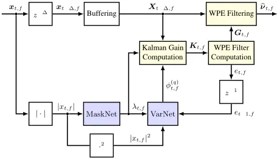
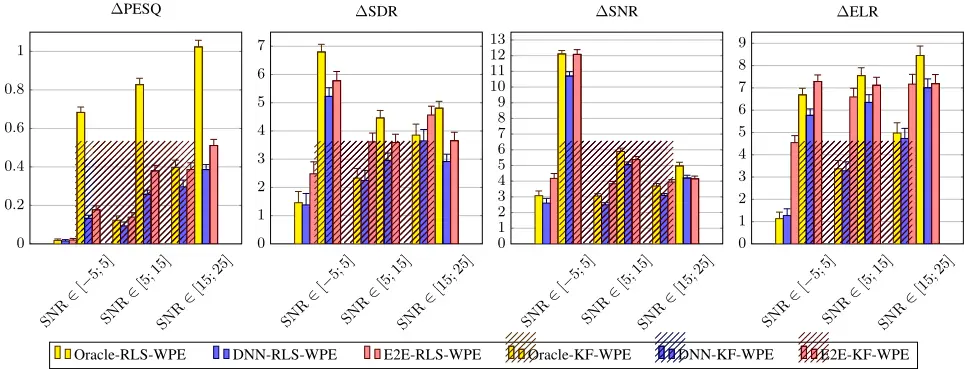

## Neural Network-augmented Kalman Filtering for Robust Online Speech Dereverberation in Noisy Reverberant Environments

Jean-Marie Lemercier⋆ , Joachim Thiemann† , Raphael Koning† , Timo Gerkmann⋆

⋆Signal Processing (SP), Universit¨at Hamburg, Germany

†Advanced Bionics, Hanover, Germany

{firstname.lastname}@uni-hamburg.de, {firstname.lastname}@advancedbionics.com

## Abstract

In this paper, a neural network-augmented algorithm for noise-robust online dereverberation with a Kalman filtering variant of the weighted prediction error (WPE) method is proposed. The filter stochastic variations are predicted by a deep neural network (DNN) trained end-to-end using the filter residual error and signal characteristics. The presented framework allows for robust dereverberation on a single-channel noisy reverberant dataset similar toWHAMR!.

The Kalman filtering WPE introduces distortions in the enhanced signal when predicting the filter variations from the residual error only, if the target speech power spectral density is not perfectly known and the observation is noisy. The proposed approach avoids these distortions by correcting the filter variations estimation in a data-driven way, increasing the robustness of the method to noisy scenarios. Furthermore, it yields a strong dereverberation and denoising performance compared to a DNN-supported recursive least squares variant of WPE, especially for highly noisy inputs.

Index Terms: dereverberation, kalman filtering, adaptive processing, neural network, end-to-end training

## 1. Introduction

Communication and hearing devices require modules aiming at suppressing undesired parts of the signal to improve the speech characteristics. Amongst these is reverberation caused by room acoustics, where late reflections particularly degrade the speech quality and intelligibility [1]. Presence of additional background noise and interfering speakers further worsens the ability to clearly perceive target speech.

In complement to traditional single-channel schemes, many multi-channel algorithms leveraging spatial and spectral information were proposed for enhancement of noisy reverberant speech. Traditional approaches include beamforming [2, 3, 4], possibly combined with spectral enhancement [5], coherenceweighting [6, 7], and multi-channel linear prediction (MCLP) based approaches such as the well-known weighted prediction error (WPE) algorithm [8, 9]. WPE computes an autoregressive multi-channel filter in the short-time spectrum and applies it to a delayed group of reverberant speech frames. It requires an estimate of the target speech power spectral density (PSD), estimated either by statistical models [8, 9] or deep neural networks (DNNs) [10, 11].

In order to cope with real-time requirements and changing acoustics, online adaptive dereverberation methods derived from MCLP approaches were introduced. These methods are based on either Kalman filtering (KF) [12, 13, 14, 15, 16] or on a recursive least squares (RLS) adapted WPE, which can be seen a special case of KF [17, 18, 11, 19]. Online convolutional beamformers performing joint dereverberation and denoising based on either RLS or KF were proposed in [20, 21, 22, 15, 16].

This work has been funded by the Federal Ministry for Economic Affairs and Climate Action, project 01MK20012S, AP380. The authors are responsible for the content of this paper.

Kalman filtering WPE (KF-WPE) is a particularly interesting framework for adaptive dereveberation in noisy and dynamic environments. It updates the filter in a much faster and more flexible way than its RLS counterpart, due to a GaussMarkov model of the filter transition dynamics [23]. However, it is known that the Kalman filter can be particularly sensitive to estimation errors in the unobservable state space model parameters [24]. In KF-WPE, these parameters include the target speech PSD and the filter transition covariance.

The contributions of this work are threefold. First, we introduce a low-complexity variant of KF-WPE based on [13] and a scaled identity model of the speech covariance matrix. Secondly, we evaluate the performance and robustness of this KFWPE variant in noisy reverberant environments. Finally, we present an estimation strategy of both the target speech PSD and the filter transition covariance based on DNNs. In this strategy, a first DNN estimates the target speech PSD from the noisy reverberant mixture. A second DNN then estimates the filter transition covariance from the filter residual error and signal characteristics, and is trained with an end-to-end criterion.

This framework enables a robust estimation of the filter transition covariance under target PSD uncertainty. The resulting DNN-augmented KF-WPE performs stronger dereverberation and denoising than RLS-WPE, with less distortions than traditional KF-WPE - all approaches using the same DNNsupported target PSD estimator. The approach is robust to noisy observations and even removes a lot of environmental noise, although noise is not accounted for in the signal model.

The rest of this paper is organized as follows. In Section 2, the low-complexity variant of KF-WPE is summarized. Section 3 presents the DNN-supported strategy to predict the WPE filter transition covariance and the target speech PSD. In Section 4, we describe the experimental setup and training strategy. Results are presented and discussed in Section 5.

## 2. Kalman filtering adaptedWPE dereverberation

## 2.1. Signal model

In the short-time Fourier transform (STFT) domain using the subband-filtering approximation [8], the noisy reverberant speech x = [x(1) , . . . , x(D) ] ∈ CD is obtained at the microphone array by convolution of the anechoic speech s and the room impulse responses (RIRs) H ∈ CD×D with length N:

<!-- formula-not-decoded -->

<!-- formula-not-decoded -->

where t denotes the time frame index and f the frequency bin, which we will drop when not needed. d denotes the direct path, e the early reflections component, r the late reverberation and n an error term comprising modelling errors and environmental noise. The early reflections e were shown to contribute to speech quality and intelligibility for normal and hearing-aided listeners [25]. The dereverberation objective is therefore to retrieve ν = d + e.

However, early reflections may be detrimental for some people, e.g. cochlear-implant users, particularly in highlyreverberant scenarios [26]. Accordingly, the dereverberation objective can be adjusted to different listener categories [19].

## 2.2. WPE Dereverberation

As in [8], the anechoic speech s is modelled in the STFT domain with a zero-mean time-varying Gaussian model. It follows from (1) that the target speech also is a zero-mean time-varying Gaussian process with time-frequency dependent covariance:

<!-- formula-not-decoded -->

The WPE algorithm [8] uses an auto-regressive model to approximate the late reverberation r. A multi-channel filter G ∈ CD2K with K taps is estimated, aiming at representing the inverse of the late tail of the RIRs H. The target ν is then obtained through linear prediction, with a delay ∆ avoiding undesired short-time speech cancellations, which also leads to preserving parts of the early reflections. We omit the frequency index f in the following as computations are performed in each frequency band independently. By disregarding the error term n in (1) in noiseless scenarios we obtain:

<!-- formula-not-decoded -->

where Xt-∆ = [xTt-∆, . . . , xTt-∆-K+1 ]T ∈ CDK and ⊗ is the Kroenecker product.

## 2.3. Kalman FilteringWPE Dereverberation

In order to obtain an adaptive and real-time capable approach, a KF variant of WPE was proposed in [13], where the WPE filter G is recursively updated with a Markov model:

<!-- formula-not-decoded -->

where q is the filter transition stochastic noise following a zeromean Gaussian process qt ∼ NC(0; Qt).

A Gaussian-Markov state-space model is formed by the transition equation (5) and the observation model (4), where G is the state, x the observation and ν (WPE) the observation noise. Given these and some independency assumptions described in [13], the Kalman filter ̂G is an optimal recursive estimator with respect to the mean-squared error criterion:

<!-- formula-not-decoded -->

Similarly to [8, 17], we make the further assumption that the target speech ν is modelled identically and independently at each microphone, thus making the target speech covariance a scaled identity matrix characterized by PSD λ:

<!-- formula-not-decoded -->

The WPE filter G(d) ∈ CDK is then estimated and applied for each channel d independently, which considerably curbs the algorithmic complexity in a multi-channel setting.

We define the filter error covariance matrix as:

<!-- formula-not-decoded -->

The corresponding derivations are adapted from [13]:

<!-- formula-not-decoded -->

<!-- formula-not-decoded -->

<!-- formula-not-decoded -->

<!-- formula-not-decoded -->

<!-- formula-not-decoded -->

̂ where K ∈ CDK is the Kalman gain.

## 2.4. RLS-WPE dereverberation

A RLS version of WPE was introduced in [17] and is equivalent to KF-WPE for the static case, i.e. when q = 0. The target speech covariance is replaced by a scaled identity matrix as in (7). The filter error covariance is thus equivalent to the inverse of the weighted covariance of the reverberant buffer:

<!-- formula-not-decoded -->

The computations are equivalent to (9)-(12), only that the filter error covariance is updated recursively with forgetting factor α [23], replacing (9) with:

<!-- formula-not-decoded -->

Processing order is then (15)-→(10)-→(11)-→(12)-→(13).

## 3. Filter transition covariance estimation

## 3.1. Covariance model

The filter transition covariance Q is an unknown parameter which must be estimated at each step to update the filter error covariance Φ(ǫ) in (9). As in [13] we model each filter tap transition identically and independently, which results in Q being an identity matrix scaled by the filter transition power φ(q) :

<!-- formula-not-decoded -->

We furthermore define the filter residual error e as:

<!-- formula-not-decoded -->

In [13], the filter transition power is simply modelled by adding a small fixed parameter η to the scaled residual error e, in order to force a permanent adaptation even if the filter did not vary at the previous time step:

<!-- formula-not-decoded -->

## 3.2. DNN estimation

As we will show in Section 5, using the filter residual error e to model the filter transition power φ(q) is a straightforward model which yields excellent results if the oracle target PSD is available. However, if the PSD estimation is flawed due to noisy observations and limited prediction power, using the same filter transition power model (17) introduces problematic speech distortions. In particular, the bias η should be adapted as a function of the input signal-to-noise ratio (SNR), decreasing the filter transition power if the observation is too uncertain.

Rather than using a statistical approach based on input SNR analysis, we propose here a DNN strategy to infer at each frame the filter transition power φ(q) directly from data, using an endto-end criterion to optimize the DNN parameters. We argue that this increases the robustness of KF-WPE to erroneous PSD estimation. A related concept is reported in [27], where a DNN is used to learn the step size, i.e. the Kalman gain, of a blockwise adaptive system identification algorithm. Our approach is however distinct as (i)- we perform frame-wise adaptive dereverberation in noisy environments, (ii)- we do not use a single DNN inferring both step size parameters, but use separated networks with distinct inputs and training strategies; and (iii)- the criterion optimizes the DNNs with respect to the estimated signal, and not the filter error, which is not available in this task.

The DNN-called here VarNet-takes as its input at every step t a vector containing the channel-averaged reverberant speech periodogram |¯xt|2 = 1D ∑Dd=1 |x(d) t |2 }, the target speech PSD estimate ̂λt and the filter residual error et. The filter transition power φ(q) t is then obtained on amodel inspired by (18), where the VarNet positive real-valued output mask M(η) ⊔ is multiplied by a maximal bias value ηmax before being added to the scaled filter residual error e:

<!-- formula-not-decoded -->

The target speech PSD estimate ̂λt is obtained from the channel-averaged magnitude |¯xt| = 1D ∑Dd=1 |x(d) t | } by a preceding DNN-denoted as MaskNet-as in [11, 19]:

<!-- formula-not-decoded -->

with M(ν) t being the estimated real-valued positive mask.

## 3.3. Training strategy

The MaskNet is pre-trained with a mask-based objective:

<!-- formula-not-decoded -->

with L being the chosen loss function. The parameters of MaskNet are then frozen, and the VarNet is trained with the end-to-end criterion:

Schematics of the algorithm are displayed in Figure 1.

<!-- formula-not-decoded -->

## 4. Experimental setup

## 4.1. Dataset generation

The data generation method resembles that of the WHAMR! dataset [28]. We concatenate anechoic speech utterances from the WSJ0 dataset belonging to the same speaker, and construct sequences of approximately 20 seconds. These sequences are convolved with 2-channel RIRs generated with the RAZR engine [29] and randomly picked. Each RIR is generated by uniformly sampling room acoustics parameters as in [28] and a T60 reverberation time between 0.4 and 1.0 seconds. Headrelated transfer function (HRTF) auralization is performed in the RAZR engine, using a KEMAR dummy head response from the MMHR-HRTF database [30]. Finally, 2-channel noise from the WHAM! recorded noise dataset [31] is added to the reverberant mixture with a SNR-relative to the reverberant signaluniformly sampled between -5 and 25 dB .

Figure 1: DNN-supported Kalman-filtering adapted dereverberation. Blue blocks refer to trainable DNN layers. Yellow blocks represents adaptive statistical signal processing. z-τ blocks implement a time delay of τ STFT frames.

Because of its adaptive nature, the online variants of WPE have an initialization time Li (typically 4s with the hyperparameters described below). The utterances are therefore cut into segments of length Li, and the first segment is not used by the end-to-end training procedure, as described in [19, 32].

Target datapoints are obtained by convolving the first 40 ms of the RIR with the dry speech utterance, simulating the direct path and early reflections, which are beneficial for hearingaided and normal-hearing listeners [25].

400,100, 60 RIRs and 20000, 5000, 3000 clean utterances and noisy excerpts are used for training, validation and testing respectively. Ultimately, each training set consists of approximately 55 hours of speech data sampled at 16 kHz.

## 4.2. Hyperparameter settings

All approaches are trained with the Adam optimizer using a learning rate of 10-4 and mini-batches of 128 segments. The MaskNet is pre-trained for 300 epochs, and the VarNet is trained for 100 epochs All networks are optimized with respect to a L1 loss on the spectrogram magnitude. DNN inputs are standardized using the mean and variance of the noisy reverberant distribution approximated by the training set.

The STFT uses a square-rooted Hann window of 32 ms and a 75 % overlap, which yields F = 257 frequency bins with the corresponding sampling frequency. The WPE filter length is set to K = 10 STFT frames (i.e. 80 ms), the number of channels to D = 2, the prediction delay to ∆ = 5 frames (i.e. 40 ms). The prediction delay value is picked as it experimentally provides optimal evaluation metrics when using the oracle PSD, and matches the target set in the previous subsection. When not learnt by VarNet, the filter transition bias is set to η = -35 dB as in [13], and when it is learnt, the maximal bias is set to ηmax = -30dB.

The MaskNet structure is the same as used in [19, 32], that is, a single long short-term memory (LSTM) layer with 512

Figure 2: Improvements upon noisy reverberant signals. All metrics except PESQ are in dB. Input SNRs are indicated in dB.

units followed by a linear output layer with sigmoid activation. The VarNet uses a first linear layer with F output units to fuse the input modalities. A single LSTMwith 512 hidden units is then used to model the sequence dynamics, and is followed by a linear layer with F units and sigmoid activation.

We estimate the number of MAC operations per second of our proposed algorithm to 31.4 GMAC·s-1 at 16 kHz. This setting allows to obtain a real-time factor-defined as the ratio between the time needed to process an utterance and the length of the utterance-below 0.15 with all computations performed on Intel(R) Core(TM) i7-9800X CPU.

## 4.3. Evaluation metrics

We evaluate our algorithms on the noisy reverberant test set with the Perceptual Evaluation of Listening Quality (PESQ) [33], output signal-to-distortion ratio (SDR) and SNR [34], as well as the early-to-late reverberation ratio (ELR) [1, 35, 19].

## 5. Results and discussion

## 5.1. Compared approaches

We evaluate the RLS-WPE and KF-WPE using the oracle target PSD λ (Oracle-RLS-WPE and Oracle-KF-WPE). We then compare the RLS-WPE approach using the DNN-estimated PSD (DNN-RLS-WPE, [11]) and KF-WPE using the DNNestimated PSD and the filter transition power model (17) (DNNKF-WPE, [13]). Finally, we evaluate the proposed approach using KF-WPE with DNN-estimated PSD and filter transition power (19) (E2E-KF-WPE). We also include a RLS-WPE algorithm where the target PSD λ is estimated by a DNN pretrained using (21) and fine-tuned end-to-end with (22) (E2ERLS-WPE, [19]). Results are displayed in Figure 2.

## 5.2. Oracle experiments

We first notice that KF-WPE is largely superior to RLS-WPE, if the oracle target PSD λ is used. In particular, the SNR and ELR scores of Oracle-KF-WPE indicate that most of the reverberation was removed, although the length of the WPE filter only covers 80 ms, which is largely inferior to the T60 times used (0.4 - 1.0 s). It is also able to remove noise very efficiently, although no denoising mechanism is specified in the signal model.

## 5.3. DNN-assisted frameworks

If the target PSD is estimated by MaskNet without learning the transition power φ(q) , KF-WPE yields agressive dereverberation and denoising performance, thus introducing distortions in the signal. This is confirmed by the high SNR and the low PESQ and SDR scores of DNN-KF-WPE.

## 5.4. End-to-end frameworks

The proposed E2E-KF-WPE provides superior PESQ and SDR compared to DNN-KF-WPE, which shows that it is able to circumvent the degrading behaviour of the latter approach. Learning the filter transition power φ(q) helps controlling the adaptation speed as a function of the noise and reverberation condition, thus yielding higher robustness to the estimation errors from MaskNet. Also, E2E-KF-WPE exhibits high SNR and ELR scores compared to its RLS-WPE counterparts. This indicates that E2E-KF-WPE is able to significantly improve the dereverberation and denoising performance by using Kalman filtering, especially for low input SNRs.

We notice in our experiments that the learnt φ(q) increases with the T60 time and decreases with the input SNR, therefore accelerating the adaptation speed as the adversity of the condition intensifies. We hypothesize that this trend is learnt to compensate for the original model mismatch caused by the WPE filter being too short in comparison to the T60 time on the one hand, and to WPE being noise-agnostic on the other hand.

## 6. Conclusion

We presented a DNN-augmented Kalman filtering framework for robust online dereverberation in noisy reverberant environments. Through end-to-end optimization, the DNN estimating the filter transition power is able to control the WPE filter adaptation speed with respect to the noise and reverberation condition. Our algorithm thus avoids degrading the target signal compared to the original Kalman filtering WPE, while exhibiting stronger dereverberation and denoising power than its RLSbased counterparts. Future work will be dedicated to inspecting adaptation mechanisms for dynamic acoustics and to the inclusion of suitable denoising approaches in the present framework.

## 7. References

- [1] P. Naylor and N. Gaubitch, "Speech dereverberation," Noise Control Engineering Journal, vol. 59, 01 2011.
- [2] S. Doclo, A. Spriet, J. Wouters, and M. Moonen, Speech Distortion Weighted Multichannel Wiener Filtering Techniques for Noise Reduction. Springer Berlin Heidelberg, 2005, pp. 199-228.
- [3] A. Kuklasi´nski, S. Doclo, T. Gerkmann, S. Holdt Jensen, and J. Jensen, "Multi-channel PSD estimators for speech dereverberation - a theoretical and experimental comparison," in IEEE Int. Conf. Acoustics, Speech, Signal Proc. (ICASSP), 2015, pp. 91-95.
- [4] S. Leglaive, R. Badeau, and G. Richard, "Multichannel audio source separation with probabilistic reverberation priors," IEEE/ACM Trans. Audio, Speech, Language Proc., vol. 24, no. 12, pp. 2453-2465, Sep. 2016.
- [5] B. Cauchi, I. Kodrasi, R. Rehr, S. Gerlach, A. Jukic, T. Gerkmann, S. Doclo, and S. Goetze, "Combination of MVDR beamforming and single-channel spectral processing for enhancing noisy and reverberant speech," EURASIP Journal on Advances in Signal Proc., vol. 2015, pp. 1-12, 2015.
- [6] T. Gerkmann, "Cepstral weighting for speech dereverberation without musical noise," in Proc. Euro. Signal Proc. Conf. (EUSIPCO), 2011, pp. 2309-2313.
- [7] A. Schwarz and W. Kellermann, "Coherent-to-diffuse power ratio estimation for dereverberation," IEEE/ACMTrans. Audio, Speech, Language Proc., vol. 23, no. 6, pp. 1006-1018, 2015.
- [8] T. Nakatani, T. Yoshioka, K. Kinoshita, M.Miyoshi, andB. Juang, "Blind speech dereverberation with multi-channel linear prediction based on short time fourier transform representation," in IEEE Int. Conf. Acoustics, Speech, Signal Proc. (ICASSP), 2008, pp. 85-88.
- [9] A. Juki´c, T. van Waterschoot, T. Gerkmann, and S. Doclo, "Multi-channel linear prediction-based speech dereverberation with sparse priors," IEEE/ACM Trans. Audio, Speech, Language Proc., vol. 23, no. 9, pp. 1509-1520, 2015.
- [10] K. Kinoshita, M. Delcroix, H. Kwon, T. Mori, and T. Nakatani, "Neural network-based spectrum estimation for online WPE dereverberation," in ISCA Interspeech, 2017.
- [11] J. Heymann, L. Drude, R. Haeb-Umbach, K. Kinoshita, and T. Nakatani, "Frame-online DNN-WPE dereverberation," IWAENC, pp. 466-470, 2018.
- [12] B. Schwartz, S. Gannot, and E. A. P. Habets, "Online speech dereverberation using Kalman filter and EM algorithm," IEEE/ACM Trans. Audio, Speech, Language Proc., vol. 23, no. 2, pp. 394406, 2015.
- [13] S. Braun and E. A. P. Habets, "Online dereverberation for dynamic scenarios using a Kalman filter with an autoregressive model," IEEE Signal Proc. Letters, vol. 23, no. 12, pp. 17411745, 2016.
- [14] --, "Linear prediction-based online dereverberation and noise reduction using alternating Kalman filters," IEEE/ACM Trans. Audio, Speech, Language Proc., vol. 26, no. 6, pp. 1119-1129, 2018.
- [15] S. Hashemgeloogerdi and S. Braun, "Joint beamforming and reverberation cancellation using a constrained Kalman filter with multichannel linear prediction," in IEEE Int. Conf. Acoustics, Speech, Signal Proc. (ICASSP), 2020, pp. 481-485.
- [16] S. Braun and I. Tashev, "Low complexity online convolutional beamforming," in 2021 IEEE Workshop on Applications of Signal Processing to Audio and Acoustics (WASPAA), 2021, pp. 136140.
- [17] T. Yoshioka, H. Tachibana, T. Nakatani, and M. Miyoshi, "Adaptive dereverberation of speech signals with speaker-position change detection," in IEEE Int. Conf. Acoustics, Speech, Signal Proc. (ICASSP), 2009, pp. 3733-3736.
- [18] J. Caroselli, I. Shafran, A. Narayanan, and R. Rose, "Adaptive multichannel dereverberation for automatic speech recognition," in ISCA Interspeech, 2017.
- [19] J.-M. Lemercier, J. Thiemann, R. Konig, and T. Gerkmann, "Customizable end-to-end optimization of online neural networksupported dereverberation for hearing devices," in IEEE Int. Conf. Acoustics, Speech, Signal Proc. (ICASSP), 2022.
- [20] T. Nakatani and K. Kinoshita, "A unified convolutional beamformer for simultaneous denoising and dereverberation," IEEE Signal Proc. Letters, vol. 26, no. 6, pp. 903-907, 2019.
- [21] T. Dietzen, S. Doclo, M. Moonen, and T. van Waterschoot, "Integrated sidelobe cancellation and linear prediction Kalman filter for joint multi-microphone speech dereverberation, interfering speech cancellation, and noise reduction," IEEE/ACM Trans. Audio, Speech, Language Proc., vol. 28, pp. 740-754, 2020.
- [22] T. Dietzen, S. Doclo, A. Spriet, W. Tirry, M. Moonen, and T. van Waterschoot, "Low-complexity Kalman filter for multi-channel linear-prediction-based blind speech dereverberation," in IEEE Workshop Applications Signal Proc. Audio, Acoustics (WASPAA), 2017, pp. 284-288.
- [23] S. Haykin, "Kalman filtering and neural networks," John Wiley &amp; Sons, Ltd, pp. 1-21, 2001.
- [24] B. D. O. Anderson and J. B. Moore, "Optimal filtering," Prentice Hall, pp. 129-135, 1979.
- [25] J. S. Bradley, H. Sato, andM. Picard, "On the importance of early reflections for speech in rooms," The Journal of the Acoustical Society of America, vol. 113, no. 6, pp. 2947-2952, 2003.
- [26] Y. Hu and K. Kokkinakis, "Effects of early and late reflections on intelligibility of reverberated speech by cochlear implant listeners," The Journal of the Acoustical Society of America, vol. 135, pp. EL22-8, 01 2014.
- [27] T. Haubner, A. Brendel, and W. Kellermann, "End-to-end deep learning-based adaptation control for frequency-domain adaptive system identification," in IEEE Int. Conf. Acoustics, Speech, Signal Proc. (ICASSP), 2022.
- [28] M. Maciejewski, G. Wichern, E. McQuinn, and J. L. Roux, "Whamr!: Noisy and reverberant single-channel speech separation," 2020.
- [29] T. Wendt, S. Van De Par, and S. D. Ewert, "A computationallyefficient and perceptually-plausible algorithm for binaural room impulse response simulation," Journal of the Audio Engineering Society, vol. 62, no. 11, pp. 748-766, november 2014.
- [30] J. Thiemann and S. van de Pars, "A multiple model highresolution head-related impulse response database for aided and unaided ears," EURASIP Journal on Advances in Signal Processing, 2019.
- [31] G. Wichern, J. Antognini, M. Flynn, L. R. Zhu, E. McQuinn, D. Crow, E. Manilow, and J. L. Roux, "Wham!: Extending speech separation to noisy environments," CoRR, 2019.
- [32] J.-M. Lemercier, J. Thiemann, R. Konig, and T. Gerkmann, "Endto-end optimization of online neural network-supported two-stage dereverberation for hearing devices," arXiv, 2022.
- [33] A. W. Rix, J. G. Beerends, M. Hollier, and A. P. Hekstra, "Perceptual evaluation of speech quality (PESQ)- a new method for speech quality assessment of telephone networks and codecs," in IEEE Int. Conf. Acoustics, Speech, Signal Proc. (ICASSP), vol. 2, 2001, pp. 749-752 vol.2.
- [34] E. Vincent, R. Gribonval, and C. Fevotte, "Performance measurement in blind audio source separation," IEEE/ACM Trans. Audio, Speech, Language Proc., vol. 14, no. 4, pp. 1462-1469, 2006.
- [35] T. Yoshioka, T. Nakatani, M. Miyoshi, and H. G. Okuno, "Blind separation and dereverberation of speech mixtures by joint optimization," IEEE Trans. Audio, Speech, Language Proc., vol. 19, no. 1, pp. 69-84, 2011.
