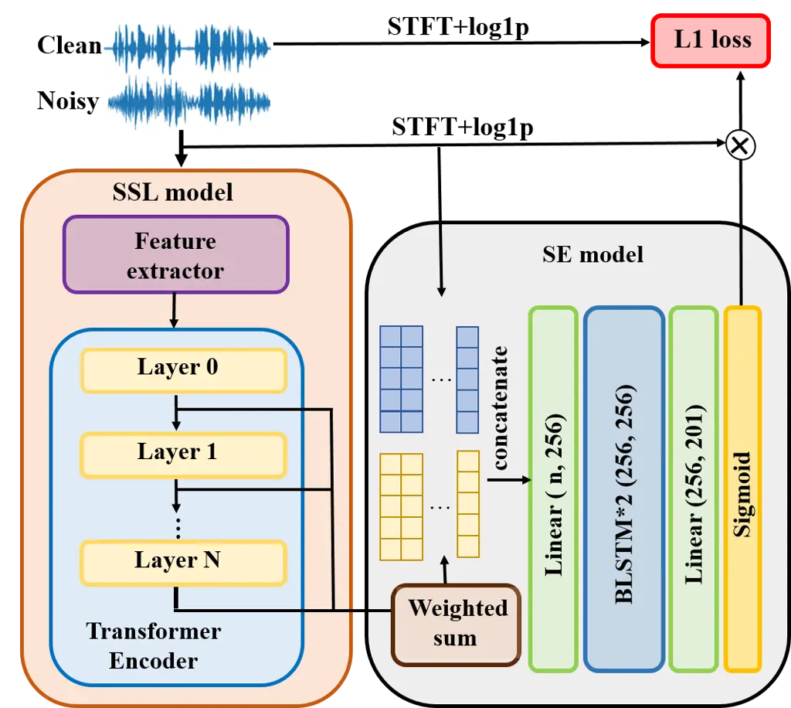
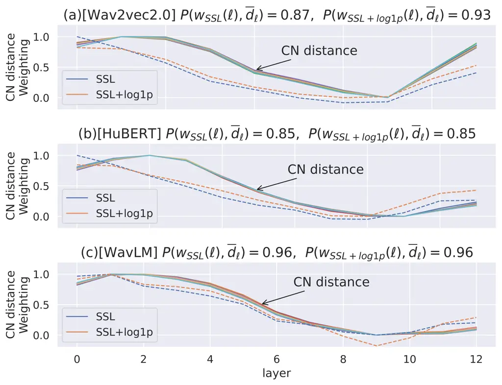
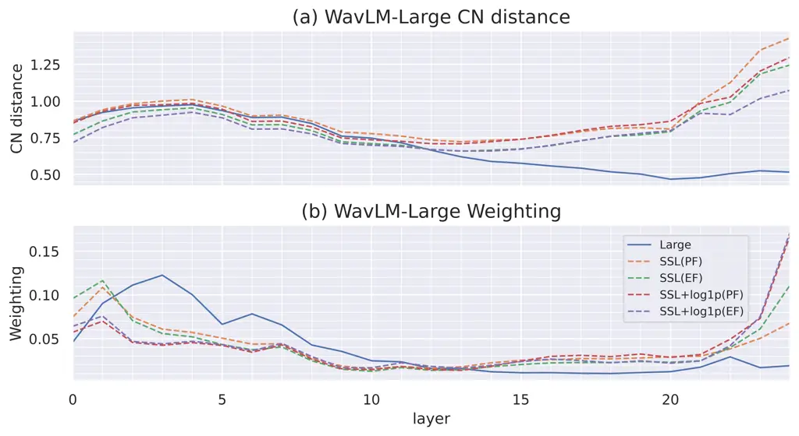

# Boosting Self-Supervised Embeddings for Speech Enhancement

Kuo-Hsuan Hung    Szu-wei Fu    Huan-Hsin Tseng    Hsin-Tien Chiang   
Yu Tsao    Chii-Wann Lin

###### Abstract

Self-supervised learning (SSL) representation for speech has achieved
state-of-the-art (SOTA) performance on several downstream tasks.
However, there remains room for improvement in speech enhancement (SE)
tasks. In this study, we used a cross-domain feature to solve the
problem that SSL embeddings may lack fine-grained information to
regenerate speech signals. By integrating the SSL representation and
spectrogram, the result can be significantly boosted. We further study
the relationship between the noise robustness of SSL representation via
clean-noisy distance (CN distance) and the layer importance for SE.
Consequently, we found that SSL representations with lower noise
robustness are more important. Furthermore, our experiments on the
VCTK-DEMAND dataset demonstrated that fine-tuning an SSL representation
with an SE model can outperform the SOTA SSL-based SE methods in PESQ,
CSIG and COVL without invoking complicated network architectures. In
later experiments, the CN distance in SSL embeddings was observed to
increase after fine-tuning. These results verify our expectations and
may help design SE-related SSL training in the future.

^(†)^(†)address: ¹National Taiwan University, ²Microsoft Corporation,
³Academia Sinica ^(†)^(†)email: {d07528023, d04922007}@ntu.edu.tw  
{htseng, coffee091524, yu.tsao}@citi.sinica.edu.tw  
cwlinx@ntu.edu.tw

Index Terms: Self-supervised learning, cross-domain feature, noise
robustness

## 1 Introduction

Speech is an effective and efficient way of communication between
individuals, playing an essential role in human-computer interactions.
However, during communication, there is often undesired interference
from the environment and surroundings, such as environmental noise,
background noise and reverberations, so that speech quality and
intelligibility often degrade. The process of reducing the background
noise with optimal preservation of the original speech quality is then
referred to as speech enhancement (SE).

With recent developments in deep learning (DL), deep learning-based SE
models have mostly outperformed traditional SE methods \[1, 2, 3\]. The
DL-based SE framework generally concerns input features \[4\], advanced
SE models \[5, 6, 7\], objective functions \[8, 9\], and data
augmentations \[10\]. This study aims to evaluate the relationship and
impact of input features regarding DL-based SE performance.

Self-supervised learning (SSL) utilizes a large amount of unlabeled data
to extract meaningful representations \[11\]. In many applications,
supervised learning generally outperforms unsupervised learning.
However, collecting a large amount of labeled data is time-consuming and
sometimes unrealistic. Therefore, the SSL can be leveraged in the
circumstances with amounts of unlabeled data to provide expressive
(latent) representations and use these latent features as inputs for
downstream tasks. It has been verified in various fields that the SSL
improves the performance of downstream tasks. Particularly, a few
promising SSL models have been proposed for speech-related tasks. One
major application is speech recognition, where the contributing SSL
models include contrastive predictive coding (CPC) \[12\],
wav2vec \[13\], and HuBERT \[14\]. Recently, there have been some
application scenarios where the output representation of an SSL model is
used to replace the conventional (data) feature and it turns out to
achieve better performance than the original input features \[15, 16,
17\].

Currently, there are only few studies applying SSL features to SE. Huang
et al. \[18\] proposed applying SSL features to SE, where the authors
observed that when training with weighted-sum representations _“for most
SSL models, lower layers generally obtain higher weights.”_. This may be
because ‘_‘some local signal information necessary for speech
reconstruction tasks is lost in the deeper layers”_. In this study, to
solve the aforementioned problem, we propose two simple solutions: 1)
utilizing cross-domain features as model inputs to compensate for the
information loss in SSL features, 2) fine-tuning an SSL model together
with an SE model such that the extracted SSL features can derive useful
information for SE. Additionally, we analyze the noise-robustness
property of SSL features and provide some insight into the relationship
with SE. In summary, without introducing complicated or advanced models,
our results are comparable to those of state-of-the-art (SOTA) SE
methods in the VCTK-DEMAND dataset.

## 2 Related Work

In this section, we first briefly review some commonly-used SSL models
and studies using cross-domain features and fine-tuned SSLs in other
specific tasks. Related research using SSL on speech enhancement is also
surveyed.

### 2.1 SSL models

The SSL model can be categorized into generative modeling,
discriminative modeling and multi-task learning. Generative modelling
extracts the data input to the representation by the encoder and
reconstruct it back to the input by the decoder. These include
APC \[19\], Mockingjay \[20\], DecoAR 2.0 \[21\], and Audio2Vec \[22\].
Discriminative modeling extracts the input into an representation and
measures the corresponding similarity. Such studies include CPC,
HuBERT \[14\], WavLM \[23\] and SPIRAL \[24\]. One of the most
representative works for the multi-task learning approach is
PASE+ \[25\], which picks up a meaningful speech representation capable
of the multi-tasking objective. In this study, we adopted three SSL
models to extract the latent representations: Wav2vec 2.0, HuBERT and
WavLM, where they all achieved excellent performances in SUPERB \[26\],
a challenge to gauge the performance of SSL models under different
speech tasks.

### 2.2 Cross-domain feature and fine-tuning SSL

Studies \[23\] and \[27\] have shown that the cross-domain feature can
help increase task accuracy on ASR and speech assessment metrics.
Additionally, fine-tuning an SSL on the downstream task has also been
shown to provide a significant improvement. In wav2vec 2.0, the SSL
model was fine-tuned on label data with the CTC loss for downstream
recognition tasks. There is other literature fine-tuning SSL models for
non-ASR speech tasks, e.g., on speech emotion recognition \[15\], spoken
language understanding  \[17\], and MOS prediction \[16\]. The research
above showed that fine-tuning the SSL or combining SSL embeddings with
raw features can achieve better performance.

### 2.3 SSL for SE

Self-supervised pre-trained models have been increasingly applied to
many speech-related tasks, including SE \[28, 29\]. Several works
PFPL \[30\], PERL \[31\], and K-SENet \[32\] applied SSL pretrained
models as perceptual loss. Some other works extracted latent
representations as SE model input, such as \[18, 33\] extracted the
latent variables and evaluated 11 SSL upstream methods on the SE
downstream task. SSPF \[34\] utilized phonetic characteristics into a
deep complex convolutional network via a CPC model pre-trained with
self-supervised learning.

## 3 The Proposed Method

### 3.1 Incorporate spectrogram with SSL embedding as input

In \[18\], the authors utilized the SSL representation on the SE as the
downstream task. When training with weighted-sum representations, they
found that the lower layers generally obtained higher weightings. In
additional, \[35\] analyzed the layer-wise representation of Wav2vec
2.0, which showed that the transformer layers in Wav2vec 2.0 followed an
autoencoder-style behavior. The latent representation in the lower
layers correlates with raw acoustic features such as FBANK. Therefore,
combining these two observations, we reasoned that for generation tasks
such as SE, the raw acoustic feature should be provided to compensate
for the fine-grained deficiencies. In this study, we assess the
combination of the $`\log 1p`$ \[36\]¹¹ 1 The $`\log 1p`$ feature is
referred to as the scaled transformation
$`(\log 1p)(X_{tf}):=\log(1+X_{tf})\geq 0`$ for a spectrogram amplitude
$`X=(X_{tf})`$. spectrogram feature with SSL representation. The model
architecture is illustrated in Fig. 1. The noisy waveform is first fed
into the SSL model to generate a latent representation, which is
subsequently concatenated with the noisy $`\log 1p`$ feature as the
model input. The enhancement prediction is therefore obtained by
multiplying the model output with noisy $`\log 1p`$ features. In the
inference stage, a noisy phase is applied to reconstruct the enhanced
waveform.



Figure 1: Flowchart of the proposed method with cross-domain feature to
boost the performance of SE model.

### 3.2 Fine-tune SSL model with SE

Fine-tuning the pre-trained SSL model with the downstream tasks can
generally obtain better results as mentioned in Sec. 2.2. In this study,
we follow  \[15\] to fine-tune the pre-trained SSL model in two ways:
partial fine-tuning (PF) and entire fine-tuning (EF). SSL models are
generally separated into CNN-based feature extractors and
transformer-based encoders. For PF, only the transformer-based encoder
is fine-tuned during downstream training. As for EF, both the feature
extractor and the encoder are fine-tuned. To our best knowledge, this is
the first study applying various fine-tuning SSL models for SE tasks.

### 3.3 Noise robustness analysis

Noise robustness is usually desired when training the SSL. Therefore, we
intended to investigate whether a representation equipped with noise
robustness may help improve SE. Given an SSL model $`f`$, we define the
notion of the distance between the latent variables of noisy speech and
clean speech as:

```math
d_{f,\ell}\left(\mathbf{Z}^{(\ell)}_{c},\mathbf{Z}^{(\ell)}_{n}\right)=\frac{1}{T}\sum_{t=1}^{T}\lVert g^{(\ell)}(\mathbf{z}^{(\ell)}_{c}(t))-g^{(\ell)}(\mathbf{z}^{(\ell)}_{n}(t))\rVert^{2} \tag{1}
```

where $`\ell\in\mathbb{N}`$ is the layer depth,
$`\mathbf{Z}^{(\ell)}_{c}:=\{\mathbf{z}^{(\ell)}_{c}(t)\}_{t=1}^{T}`$
and
$`\mathbf{Z}^{(\ell)}_{n}:=\{\mathbf{z}^{(\ell)}_{n}(t)\}_{t=1}^{T}`$
denote the collection of clean and noisy latent representations of layer
$`\ell`$ in model $`f`$ and frame $`t`$, respectively. Particularly,
$`\ell=0`$ corresponds to the output of feature extractor (Fig. 1). A
normalization function $`g^{(\ell)}`$ on each layer $`\ell`$ is deployed
to normalize the latent features $`\mathbf{z}^{(\ell)}(t)`$ for
balancing scales and ensuring equal comparisons. Specifically, we shall
utilize
$`g^{(\ell)}(\mathbf{z}^{(\ell)}(t)):=(\mathbf{z}^{(\ell)}(t)-\mu_{\ell})/\sigma_{\ell}`$
with $`\mu_{\ell}`$ and $`\sigma_{\ell}`$ denoting the mean and variance
of the latent points
$`\mathbf{Z}^{(\ell)}:=\{\mathbf{z}^{(\ell)}(t)\}_{t=1}^{T}`$. This
study computes the layer-wise distance
$`d_{f,\ell}(\mathbf{Z}^{(\ell)}_{c},\mathbf{Z}^{(\ell)}_{n})`$ as the
_noise robustness_, so that when the distance $`d_{f,\ell}`$ is small,
this layer $`\ell`$ is regarded as noise robust. In addition to noise
robustness, we further consider the layer weighting as an importance
index for the SSL layers on SE via the weighted-sum approach \[26\]:

```math
\mathbf{Z}_{\text{WS}}:=\sum_{\ell=0}^{L-1}w(\ell)\,\mathbf{Z}^{(\ell)} \tag{2}
```

with parameters $`w(\ell)\geq 0`$, $`\sum_{\ell}w(\ell)=1`$ denoting the
weight of layer $`\ell`$ determined by the network and
$`\mathbf{Z}^{(\ell)}`$ is required to keep same dimension for all
layers. Later in Sec. 4.3.2, a bundle of CN distance curves shall be
computed to analyze the averaging tendency under stochastic training
process with different SSL models. Namely, a SSL model $`f`$ with
randomly sampled inputs $`(\mathbf{X}_{c},\mathbf{X}_{n})`$ drawn from
the entire training set yield
$`\ell\mapsto d_{f,\ell}(\mathbf{Z}^{(\ell)}_{c},\mathbf{Z}^{(\ell)}_{n})`$
by Eq. (1). Thus, random sampling from data distribution $`\mathcal{P}`$
gives an averaging CN distance curve,

```math
\overline{d}_{f,\ell}=\mathop{\mathbb{E}}_{(\mathbf{X}_{c},\mathbf{X}_{n})\sim\mathcal{P}}\left[d_{f,\ell}\left(\mathbf{Z}^{(\ell)}_{c},\mathbf{Z}^{(\ell)}_{n}\right)\right] \tag{3}
```

Experiments will be set up in the next section to verify our boosting
method and the relationship with SSL latent representations.

## 4 Experiments

### 4.1 Datasets and Evaluation metrics

A commonly used premixed dataset VCTK-DEMAND \[37\] was adopted to
evaluate our method. There were 11,572 utterances with four
signal-to-noise ratios (SNRs) (15, 10, 5, and 0 dB) in the training set
and 824 utterances with four SNRs (17.5, 12.5, 7.5, and 2.5 dB) in the
testing set. The experimental results are assessed with wideband PESQ
and STOI for speech quality and intelligibility. Another three widely
used metrics: CSIG, CBAK and COVL are applied to measure signal
distortion, noise distortion, and overall quality evaluation,
respectively. Our implementation is available at
[https://github.com/khhungg](https://github.com/khhungg).

### 4.2 Model Structures

A BLSTM is adopted as an SE model for light weight purpose with decent
performance. The model architecture is depicted in Fig. 1, consisting of
(a) 2 linear layers, (b) two-layered BLSTM of 256 hidden units and (c) a
sigmoid activation to generate the prediction mask. During the training
stage, to obtain fixed-length data within a batch, each utterance was
randomly sampled as 20,480 samples (128 frames $`\times`$ 160 hop
length). The signal approximation (SA) method \[38\] was used to
estimate the target spectrum via the mask prediction. $`L_{1}`$-loss and
the Adam optimizer were deployed for the SE model, along with a random
splitting of training and validation set by $`95\%`$ and $`5\%`$ ratio.

### 4.3 Results

#### 4.3.1 Including spectrogram as extra input features

In a previous study \[18\], only fixed self-supervised embeddings were
used as the input features of the SE model, and the performance
improvement was somewhat limited. This may be because most of the
self-supervised models were trained by maximizing the prediction
probability of the target class. Features aimed for classification tasks
may not fully retain detailed speech information and thus the
suitability for direct application on SE generation tasks can be
questioned.

To solve the aforementioned problem, we concatenated the $`\log 1p`$
spectrogram with SSL embedding to preserve useful information in speech.
For the spectrogram, the window size and hop length are set as 400 and
160, respectively. As SSL features have twice the stride length of the
spectrogram, we duplicated the latent representation to align the
lengths of the embedding and spectrogram. To show the impact of adding
the spectrogram as extra model input, comparisons were made in Table 1.
As the baselines, we trained the SE model with the embeddings from 1)
the last hidden layer (LL) and 2) the weighted sum (WS) of all the
embedding layers with the learned weights.

In Table 1, as a conventional method, we first show the results of
applying only $`\log 1p`$ spectrogram as the model input. For SSL
embedding, we prepared three different models: wav2vec 2.0, HuBERT, and
WavLM-Base. From the table, we can first observe that using the last
hidden layer of SSL models did not bring benefits compared to the
spectrogram features. However, using WS of all the embedding layers can
significantly improve the performance, implying that other layers in the
SSL models also contain useful information for SE. For both the LL and
WS, when the $`\log 1p`$ spectrogram is concatenated with the SSL
features, the performance can improve further. The best performance
results from the cross-domain feature (WS + $`\log 1p`$). Thus, this
verified that including acoustic features improved the SE performance.

| Method            | PESQ | CSIG | CBAK | COVL | STOI  |
| ----------------- | ---- | ---- | ---- | ---- | ----- |
| Noisy             | 1.97 | 3.35 | 2.44 | 2.63 | 0.915 |
| $`\log 1p`$       | 2.75 | 4.15 | 3.36 | 3.46 | 0.944 |
| wav2vec 2.0- Base |      |      |      |      |       |
| LL                | 2.71 | 4.10 | 3.26 | 3.40 | 0.942 |
| LL + $`\log 1p`$  | 2.91 | 4.29 | 3.42 | 3.60 | 0.948 |
| WS                | 2.85 | 4.22 | 3.38 | 3.54 | 0.946 |
| WS + $`\log 1p`$  | 2.94 | 4.32 | 3.45 | 3.64 | 0.949 |
| HuBERT- Base      |      |      |      |      |       |
| LL                | 2.67 | 4.04 | 3.20 | 3.35 | 0.942 |
| LL + $`\log 1p`$  | 2.94 | 4.31 | 3.46 | 3.63 | 0.948 |
| WS                | 2.84 | 4.23 | 3.37 | 3.54 | 0.947 |
| WS + $`\log 1p`$  | 2.98 | 4.34 | 3.48 | 3.67 | 0.949 |
| WavLM- Base       |      |      |      |      |       |
| LL                | 2.74 | 4.05 | 3.22 | 3.39 | 0.944 |
| LL + $`\log 1p`$  | 2.94 | 4.32 | 3.44 | 3.64 | 0.950 |
| WS                | 2.90 | 4.28 | 3.43 | 3.59 | 0.949 |
| WS + $`\log 1p`$  | 3.05 | 4.40 | 3.52 | 3.74 | 0.952 |

Table 1: Scores for various combinations of $`\log 1p`$ and latent
representations under different SSL models. LL denotes the last layer
embedding and WS as the weighted sum of all SSL layers.

#### 4.3.2 Noise robustness and learned weights of weighted sum representation

Fig. 2 shows the CN distances (solid lines) and layer weightings (dotted
lines) for the various SSL models. Each solid line follows from Eq. (1)
with randomly sampled inputs $`(\mathbf{X}_{c},\mathbf{X}_{n})`$ out of
the training set, as described in Sec. 3.3. The averaging CN distance
curve is then calculated by Eq. (3) to compare with the trend of layer
weighting curves. To ensure the distance $`d_{f,\ell}`$ falling into
$`[0,1]`$, the min-max normalization was employed after the computation
of Eq. (1).

An SSL model $`f`$ results in layer weighting curves (Fig.  2),
$`\ell\mapsto w_{\text{SSL}}^{(f)}(\ell)`$ and
$`\ell\mapsto w_{\text{SSL+log1p}}^{(f)}(\ell)`$, corresponding to the
use of the SSL feature and the cross-domain features, respectively. As
\[35\] reported that there existed some peculiarity in the last two
layers of wav2vec 2.0, we removed the last two layers in wav2vec 2.0 for
comparison here. In these three models, it was observed that the layer
weightings and CN distance $`\overline{d}_{f,\ell}`$ are highly
correlated ($`\geq 0.85`$) via the Pearson correlation
$`P(w_{\text{SSL}}^{(f)}(\ell),\overline{d}_{f,\ell})`$, for
$`f\in\{\text{WavLM},\text{HuBERT},\text{wav2vec 2.0}\}`$. Thus, we
concluded that large CN distances might provide more information.



Figure 2: Correlation between the CN distance (solid line bundle, see
Eq. (3)) and the learned weights $`w(\ell)`$ (blue/orange dotted line)
of Eq. (2) using SSL only and SSL $`+\log 1p`$ features, respectively.

#### 4.3.3 Fine-tuning SSL models

From Table 1, it can be observed that applying WavLM as an SSL model
outperforms the other two methods. Under the same model size, WavLM
achieves 3.05 and 0.952 in PESQ and STOI, respectively, higher than
HuBERT (PESQ: 2.99/ STOI: 0.949) and Wav2vec 2.0 (PESQ: 2.95/ STOI:
0.949). Henceforth, we shall only adopt WavLM for the discussion of the
fine-tuning experiments later.

Table 2 presents the fine-tuned results of WavLM, for both WavLM-Base
and WavLM-Large, the best performance comes from PF with $`\log 1p`$. It
can also be observed that EF with $`\log 1p`$ did not improve much
compared with PF. Fine-tune models with $`\log 1p`$ have only
incremental improvements compared with the original pre-trained models
(cf. Table 1). From these observations, we believe that the SSL models
after fine-tune acquired better latent representations for SE, such that
the additional $`\log 1p`$ features can only provide limited extra
information for enhancement. We also observed that the performance
sharply degraded if we used a model with the same architecture but
trained from scratch (TFS), which indicated that pre-training certainly
contributes. Some SOTA SE models using a pre-trained SSL model are
listed in Table 2 for comparison.

In addition to evaluating the performance of SSL fine-tuned model, the
corresponding CN distances were also calculated, as shown in Fig. 3(a).
The figure reveals that the CN distances in the first and last few
layers increased after fine-tuning. This was particularly obvious in the
last few layers. From Fig. 3(b), we saw similar trends for learned
weights, which verify the observation that large CN distances may
provide more information as given in Sec. 4.3.2.

Another interesting finding in Fig. 3(b) is that when using the SSL
representations only (orange and green dotted lines), the weights in the
first few layers also increase and become larger than that of
SSL+$`\log 1p`$ (red and purple dotted lines). We argue that after
fine-tuning without $`\log 1p`$ input, the first few layers learn more
information about raw acoustic features. Since the first few layers can
keep more local information now, the performance gained by $`\log 1p`$
feature becomes much smaller, as shown in Table 2.

|                   |      |      |      |      |       |
| ----------------- | ---- | ---- | ---- | ---- | ----- |
| Method            | PESQ | CSIG | CBAK | COVL | STOI  |
| SSPF \[34\]       | 3.13 | 4.30 | 3.61 | 3.72 | 0.950 |
| PERL \[31\]       | 3.04 | 4.23 | 3.42 | 3.63 | 0.947 |
| PFPL \[30\]       | 3.15 | 4.18 | 3.60 | 3.67 | 0.950 |
| Huang \[18\]      | 2.80 | N/A  | N/A  | N/A  | 0.945 |
| WavLM- Base (WS)  |      |      |      |      |       |
| TFS               | 2.83 | 4.21 | 3.41 | 3.53 | 0.946 |
| PF                | 3.09 | 4.42 | 3.54 | 3.77 | 0.955 |
| EF                | 3.11 | 4.44 | 3.56 | 3.79 | 0.955 |
| $`\log 1p`$       | 3.05 | 4.40 | 3.52 | 3.74 | 0.952 |
| $`\log 1p`$ + PF  | 3.16 | 4.50 | 3.57 | 3.86 | 0.956 |
| $`\log 1p`$ + EF  | 3.12 | 4.49 | 3.56 | 3.83 | 0.956 |
| WavLM- Large (WS) |      |      |      |      |       |
| TFS               | 2.87 | 4.24 | 3.41 | 3.57 | 0.945 |
| PF                | 3.14 | 4.47 | 3.57 | 3.82 | 0.957 |
| EF                | 3.17 | 4.49 | 3.58 | 3.85 | 0.956 |
| $`\log 1p`$       | 3.09 | 4.45 | 3.53 | 3.79 | 0.954 |
| $`\log 1p`$ + PF  | 3.20 | 4.53 | 3.60 | 3.88 | 0.957 |
| $`\log 1p`$ + EF  | 3.15 | 4.50 | 3.59 | 3.85 | 0.957 |

Table 2: Scores for different SSL fine-tuning strategies. TFS denotes
training from scratch (random initial weights in WavLM).



Figure 3: The averaging CN distance (a) and the layer weighting curves
(b) before (solid line) and after (dotted line) different fine-tuning
strategies. Plot (a) and (b) shares the same legend.

## 5 Conclusions

In this study, we propose two techniques: 1) utilizing cross-domain
features as model inputs, 2) fine-tuning the SSL model with the SE task
to compensate for the information loss in the SSL features. The results
met our expectations in that the SE performance with the cross-domain
feature was significantly improved than using only SSL representation or
the spectrogram feature. Compared to SOTA SSL-based SE methods, our
proposal for fine-tuning an SSL representation with the SE task can
outperform them in PESQ, CSIG, and COVL without invoking complicated
network architectures or training flow. Furthermore, we studied the
relationship between the noise robustness of SSL representation and the
importance of SE. Our observation showed that less noise-robust SSL
features possess higher corresponding importance. Although this fact
appeared counter-intuitive, we addressed the rationale behind the
scenes. In the end, we found that the SSL representation with the
weighted-sum method has proven superior to the spectrogram feature.
However, training an SSL representation to entirely replace raw acoustic
features is yet to be explored. Our findings serve to help train
SE-related SSL representation in the future.

## References

- \[1\] Y. Xu, J. Du, L.-R. Dai, and C.-H. Lee, “A regression approach
  to speech enhancement based on deep neural networks,” _IEEE/ACM
  Transactions on Audio, Speech, and Language Processing_, vol. 23,
  no. 1, pp. 7–19, 2014.
- \[2\] X. Lu, Y. Tsao, S. Matsuda, and C. Hori, “Speech enhancement
  based on deep denoising autoencoder.” in _Proc. Interspeech 2013_.
- \[3\] D. Wang and J. Chen, “Supervised speech separation based on deep
  learning: An overview,” _IEEE/ACM Transactions on Audio, Speech, and
  Language Processing_, vol. 26, no. 10, pp. 1702–1726, 2018.
- \[4\] Y. Wang, J. Han, T. Zhang, and D. Qing, “Speech enhancement from
  fused features based on deep neural network and gated recurrent unit
  network,” _EURASIP Journal on Advances in Signal Processing_, vol.
  2021, no. 1, pp. 1–19, 2021.
- \[5\] J.-M. Valin, U. Isik, N. Phansalkar, R. Giri, K. Helwani, and
  A. Krishnaswamy, “A perceptually-motivated approach for
  low-complexity, real-time enhancement of fullband speech,” _arXiv
  preprint arXiv:2008.04259_, 2020.
- \[6\] H.-S. Choi, J.-H. Kim, J. Huh, A. Kim, J.-W. Ha, and K. Lee,
  “Phase-aware speech enhancement with deep complex u-net,” in
  _International Conference on Learning Representations_, 2018.
- \[7\] J. Qi, H. Hu, Y. Wang, C.-H. H. Yang, S. M. Siniscalchi, and
  C.-H. Lee, “Tensor-to-vector regression for multi-channel speech
  enhancement based on tensor-train network,” in _Proc. ICASSP 2020_.
- \[8\] A. Kumar and D. Florencio, “Speech enhancement in multiple-noise
  conditions using deep neural networks,” _arXiv preprint
  arXiv:1605.02427_, 2016.
- \[9\] A. Sivaraman, S. Kim, and M. Kim, “Personalized speech
  enhancement through self-supervised data augmentation and
  purification,” _arXiv preprint arXiv:2104.02018_, 2021.
- \[10\] G. Kim, D. K. Han, and H. Ko, “Specmix: A mixed sample data
  augmentation method for training withtime-frequency domain features,”
  _arXiv preprint arXiv:2108.03020_, 2021.
- \[11\] S. Liu, A. Mallol-Ragolta, E. Parada-Cabeleiro, K. Qian,
  X. Jing, A. Kathan, B. Hu, and B. W. Schuller, “Audio self-supervised
  learning: A survey,” _arXiv preprint arXiv:2203.01205_, 2022.
- \[12\] A. v. d. Oord, Y. Li, and O. Vinyals, “Representation learning
  with contrastive predictive coding,” _arXiv preprint
  arXiv:1807.03748_, 2018.
- \[13\] S. Schneider, A. Baevski, R. Collobert, and M. Auli, “wav2vec:
  Unsupervised pre-training for speech recognition,” _arXiv preprint
  arXiv:1904.05862_, 2019.
- \[14\] W.-N. Hsu, B. Bolte, Y.-H. H. Tsai, K. Lakhotia,
  R. Salakhutdinov, and A. Mohamed, “Hubert: Self-supervised speech
  representation learning by masked prediction of hidden units,”
  _IEEE/ACM Transactions on Audio, Speech, and Language Processing_,
  vol. 29, pp. 3451–3460, 2021.
- \[15\] Y. Wang, A. Boumadane, and A. Heba, “A fine-tuned wav2vec
  2.0/hubert benchmark for speech emotion recognition, speaker
  verification and spoken language understanding,” _arXiv preprint
  arXiv:2111.02735_, 2021.
- \[16\] E. Cooper, W.-C. Huang, T. Toda, and J. Yamagishi,
  “Generalization ability of mos prediction networks,” in _Proc. ICASSP
  2022_.
- \[17\] H. Nguyen, F. Bougares, N. Tomashenko, Y. Estève, and
  L. Besacier, “Investigating self-supervised pre-training for
  end-to-end speech translation,” in _Proc. Interspeech 2020_.
- \[18\] Z. Huang, S. Watanabe, S.-w. Yang, P. García, and S. Khudanpur,
  “Investigating self-supervised learning for speech enhancement and
  separation,” in _Proc. ICASSP 2022_.
- \[19\] Y.-A. Chung, W.-N. Hsu, H. Tang, and J. Glass, “An unsupervised
  autoregressive model for speech representation learning,” in _Proc.
  Interspeech 2019_.
- \[20\] A. T. Liu, S.-w. Yang, P.-H. Chi, P.-c. Hsu, and H.-y. Lee,
  “Mockingjay: Unsupervised speech representation learning with deep
  bidirectional transformer encoders,” in _Proc. ICASSP 2020_.
- \[21\] S. Ling and Y. Liu, “Decoar 2.0: Deep contextualized acoustic
  representations with vector quantization,” _arXiv preprint
  arXiv:2012.06659_, 2020.
- \[22\] M. Tagliasacchi, B. Gfeller, F. de Chaumont Quitry, and
  D. Roblek, “Pre-training audio representations with self-supervision,”
  _IEEE Signal Processing Letters_, vol. 27, pp. 600–604, 2020.
- \[23\] S. Chen, C. Wang, Z. Chen, Y. Wu, S. Liu, Z. Chen, J. Li,
  N. Kanda, T. Yoshioka, X. Xiao _et al._, “WavLM: Large-scale
  self-supervised pre-training for full stack speech processing,” _arXiv
  preprint arXiv:2110.13900_, 2021.
- \[24\] W. Huang, Z. Zhang, Y. T. Yeung, X. Jiang, and Q. Liu, “Spiral:
  Self-supervised perturbation-invariant representation learning for
  speech pre-training,” _arXiv preprint arXiv:2201.10207_, 2022.
- \[25\] M. Ravanelli, J. Zhong, S. Pascual, P. Swietojanski,
  J. Monteiro, J. Trmal, and Y. Bengio, “Multi-task self-supervised
  learning for robust speech recognition,” in _Proc. ICASSP 2020_.
- \[26\] S.-w. Yang, P.-H. Chi, Y.-S. Chuang, C.-I. J. Lai, K. Lakhotia,
  Y. Y. Lin, A. T. Liu, J. Shi, X. Chang, G.-T. Lin _et al._, “Superb:
  Speech processing universal performance benchmark,” _arXiv preprint
  arXiv:2105.01051_, 2021.
- \[27\] R. E. Zezario, S.-W. Fu, F. Chen, C.-S. Fuh, H.-M. Wang, and
  Y. Tsao, “Deep learning-based non-intrusive multi-objective speech
  assessment model with cross-domain features,” _arXiv preprint
  arXiv:2111.02363_, 2021.
- \[28\] Y.-C. Wang, S. Venkataramani, and P. Smaragdis,
  “Self-supervised learning for speech enhancement,” _arXiv preprint
  arXiv:2006.10388_, 2020.
- \[29\] R. E. Zezario, T. Hussain, X. Lu, H.-M. Wang, and Y. Tsao,
  “Self-supervised denoising autoencoder with linear regression decoder
  for speech enhancement,” in _Proc. ICASSP 2020_.
- \[30\] T.-A. Hsieh, C. Yu, S.-W. Fu, X. Lu, and Y. Tsao, “Improving
  perceptual quality by phone-fortified perceptual loss using
  wasserstein distance for speech enhancement,” _arXiv preprint
  arXiv:2010.15174_, 2020.
- \[31\] S. Kataria, J. Villalba, and N. Dehak, “Perceptual loss based
  speech denoising with an ensemble of audio pattern recognition and
  self-supervised models,” in _Proc. ICASSP 2021_.
- \[32\] T. Sun, S. Gong, Z. Wang, C. D. Smith, X. Wang, L. Xu, and
  J. Liu, “Boosting the intelligibility of waveform speech enhancement
  networks through self-supervised representations,” in _Proc. ICMLA
  2021_.
- \[33\] H.-S. Tsai, H.-J. Chang, W.-C. Huang, Z. Huang, K. Lakhotia,
  S.-w. Yang, S. Dong, A. T. Liu, C.-I. J. Lai, J. Shi _et al._,
  “Superb-sg: Enhanced speech processing universal performance benchmark
  for semantic and generative capabilities,” _arXiv preprint
  arXiv:2203.06849_, 2022.
- \[34\] Y. Qiu, R. Wang, S. Singh, Z. Ma, and F. Hou, “Self-supervised
  learning based phone-fortified speech enhancement,” _Proc. Interspeech
  2021_.
- \[35\] A. Pasad, J.-C. Chou, and K. Livescu, “Layer-wise analysis of a
  self-supervised speech representation model,” in _Proc. ASRU 2021_.
- \[36\] S.-W. Fu, C.-F. Liao, T.-A. Hsieh, K.-H. Hung, S.-S. Wang,
  C. Yu, H.-C. Kuo, R. E. Zezario, Y.-J. Li, S.-Y. Chuang _et al._,
  “Boosting objective scores of a speech enhancement model by metricgan
  post-processing,” in _Proc. APSIPA 2020_.
- \[37\] C. Valentini-Botinhao, X. Wang, S. Takaki, and J. Yamagishi,
  “Investigating rnn-based speech enhancement methods for noise-robust
  text-to-speech.” in _Proc. SSW 2016_.
- \[38\] Y. Liu, H. Zhang, X. Zhang, and L. Yang, “Supervised speech
  enhancement with real spectrum approximation,” in _Proc. ICASSP 2019_.
