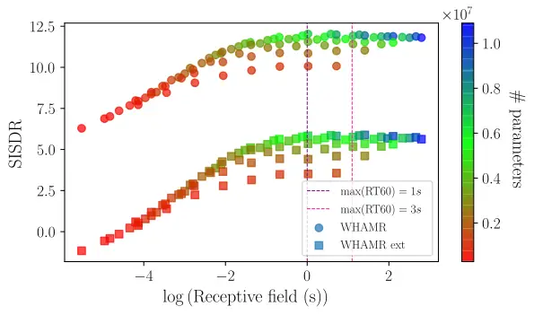
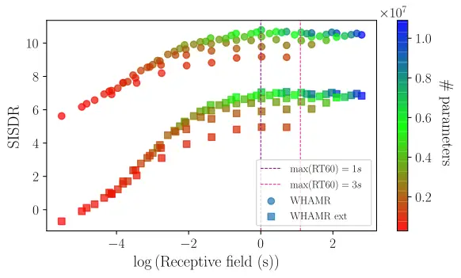
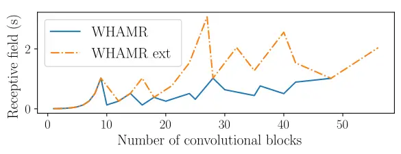
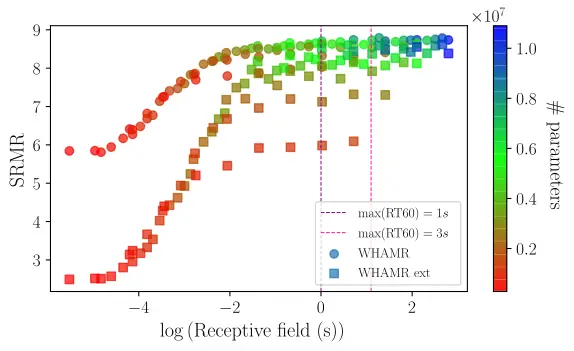
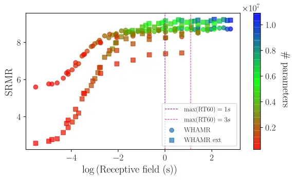
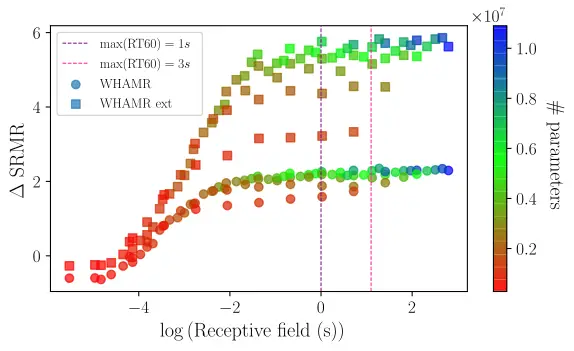

# Receptive Field Analysis of Temporal Convolutional Networks for Monaural Speech Dereverberation Thanks: This work was supported by the Centre for Doctoral Training in Speech and Language Technologies (SLT) and their Applications funded by UK Research and Innovation \[grant number EP/S023062/1\]. This work was also funded in part by 3M Health Information Systems, Inc.

William
Ravenscroft^([](https://orcid.org/0000-0002-0780-3303)),
Stefan
Goetze^([](https://orcid.org/0000-0003-1044-7343)),
and Thomas
Hain^([](https://orcid.org/0000-0003-0939-3464))
Affiliation:  Affiliation: Department of Computer Science, The
University of Sheffield, Sheffield, United Kingdom  
{jwravenscroft1, s.goetze, t.hain}@sheffield.ac.uk

###### Abstract

Speech dereverberation is often an important requirement in robust
speech processing tasks. Supervised DL (DL) models give state-of-the-art
performance for single-channel speech dereverberation. \AcpTCN are
commonly used for sequence modelling in speech enhancement tasks. A
feature of TCN (TCN)s is that they have a RF (RF) dependent on the
specific model configuration which determines the number of input frames
that can be observed to produce an individual output frame. It has been
shown that TCNs are capable of performing dereverberation of simulated
speech data, however a thorough analysis, especially with focus on the
RF is yet lacking in the literature. This paper analyses dereverberation
performance depending on the model size and the RF of TCN. Experiments
using the WHAMR corpus which is extended to include RIR with larger T60
values demonstrate that a larger RF can have significant improvement in
performance when training smaller TCN models. It is also demonstrated
that TCNs benefit from a wider RF when dereverberating RIR with larger
RT60 values.

###### Index Terms: 

speech, dereverberation, temporal convolutional network, enhancement,
sequence modelling, tasnet

## I Introduction

In far-field recording environments, reverberation affects the quality
and intelligibility of the recorded audio signal \[1\]. This remains a
problem for many domains in speech technology \[2, 3\]. Dereverberation
of speech signals has been studied thoroughly over the past decades \[4,
5\] based on machine learning models and SP (SP) techniques \[2, 6\].

Most SP approaches model reverberant speech as a mixture of the anechoic
speech signal summed with delayed, exponentially decaying weighted sums
of itself. The sequence of weights used in this summation is commonly
referred to as the RIR, which is typically modelled in three parts: the
direct path, the ER and the LR \[6\]. \AcpER in speech are typically
assumed to occur within the first 50 ms after the direct path. SP
methodologies for suppressing reverberant content in speech signals
range from a number of techniques with the most prominent approaches in
recent work using spectral suppression or linear predictive modelling
\[7, 8\].

DL models have mostly surpassed pure SP approaches for enhancing
reverberant speech signals on objective measures such as WER (WER) or
PESQ (PESQ) \[9, 10, 11\]. \AcpTasNet \[12\] were proposed for speech
separation which were later applied also to dereverberation \[13\].
\AcpConv-TasNet \[14\] replace the BLSTM network of TasNet with a fully
convolutional model using a TCN \[15\]. TCN have also shown to be
effective at more general speech enhancement tasks including
dereverberation \[16\]. A dereverberation network using a TCN with self
attention was proposed in \[11\] which demonstrated that TCN models give
competitive results with other state-of-the-art techniques such as DNN
(DNN) WPE (WPE) models.

In this work, Conv-TasNet are analysed for application to monaural
dereverbation of speech. The main focus is to analyse the interplay
between RF, model size and RIR length on the capability of Conv-TasNets
to dereverb speech.

The remainder of the paper proceeds as follows, Section II describes the
signal model, in Section III Conv-TasNet is formulated as a DAE (DAE),
in Section IV the data and experimental setup are discussed, in
Section V results are presented and Section VI concludes the paper.

## II Signal Model

A discrete single channel reverberant speech signal

```math
x[i]=h[i]\ast s[i]=s_{\mathrm{dir}}[i]+{s_{\mathrm{rev}}[i]} \tag{1}
```

for discrete time index $`i`$ can be decomposed into direct-path signal
$`s_{\mathrm{dir}}[i]=`$ $`\alpha s[i-i_{0}]`$, with a delay $`i_{0}`$
and possible attenuation by a factor $`\alpha`$, and reverberant part
$`s_{\mathrm{rev}}[i]`$. In (1), $`h[i]`$ is the RIR and $`\ast`$
denotes the convolution operation. The signal of length $`L_{s}`$ can be
split into $`L_{\boldsymbol{\mathrm{x}}}`$ blocks of length
$`L_{\mathrm{BL}}`$ with a 50% overlap and block index $`\ell`$ defined
as

```math
\boldsymbol{\mathrm{x}}_{\ell}=\left[x[0.5(\ell-1)L_{\mathrm{BL}}],\ldots,x[0.5(1+\ell)L_{\mathrm{BL}}-1]\right] \tag{2}
```

The aim of this paper is to estimate the values of
$`{\boldsymbol{\mathrm{s}}}_{\mathrm{dir}}=[{s}_{\mathrm{dir}}[0],\ldots,{s}_{\mathrm{dir}}[L_{s}-1]]`$
denoted as
$`{\hat{\boldsymbol{\mathrm{s}}}=[\hat{s}[0],\ldots,\hat{s}[L_{s}-1]]}`$.

## III Dereverberation Network

The dereverberation network is based on reformulating Conv-TasNet as a
DAE composed of an encoder, a mask estimation network and a decoder
\[14, RGH22*AttTASNET\]. The audio blocks
$`\boldsymbol{\mathrm{x}}*{\ell}`$ are encoded into feature vectors
$`\mathbf{w}_{\ell}`$. The mask estimation network produces a sequence
of masks from the encoded signal. The masks $`\mathbf{m}_{\ell}`$ are
then multiplied with the encoded features $`\mathbf{w}\_{\ell}`$ to
produce a sequence of output features that are decoded back into the
time domain signal by the decoder.

### III-A Encoder

The input signal blocks
$`\boldsymbol{\mathrm{x}}_{\ell}\in\mathbb{R}^{1\times L_{\mathrm{BL}}}`$
are encoded by a 1D convolutional layer with a ReLU activation function,
$`\mathcal{H}_{\mathrm{enc}}`$, such that

```math
\mathbf{w}_{\ell}=\mathcal{H}_{\mathrm{enc}}\left(\boldsymbol{\mathrm{x}}_{\ell}\mathbf{B}\right){,} \tag{3}
```

where $`\mathbf{B}\in\mathbb{R}^{L_{\mathrm{BL}}\times N}`$ is a matrix
of trainable weights and $`\mathbf{w}_{\ell}`$ is the encoded feature
vector for the $`\ell`$th signal block.

### III-B TCN Mask Estimation Network

The mask estimation network produces a mask
$`\boldsymbol{\mathrm{m}}_{\ell}`$ for every block $`\ell`$. The encoded
features $`\mathbf{w}_{\ell}`$ are first normalized using channelwise
layer normalization \[17\]. The normalized features are transformed by a
pointwise convolutional layer \[14\] which reduces the feature dimension
from $`N`$ to $`B`$. The sequence of features is then processed by a
stack of $`X`$ CB with increasing the dilation $`f`$ of a factor of two
per CB, i.e. $`f\in\{1,\ldots,2^{X-1}\}`$. Each CB is comprised of a
pointwise convolutional layer, a PReLU (PReLU) activation function, gLN
(gLN) \[14\], and a depthwise separable convolutional layer \[14\]. The
pointwise convolutional layer has $`B`$ input channels and $`H`$ output
channels. The depthwise separable convolutional layer has $`H`$ input
channels and $`B`$ output channels. The $`X`$ CB of increasing dilation
is repeated $`R`$ times. This repetition widens the RF of the network to
a lower degree than continuing to increase the dilation whilst also
producing a deeper layered network with more parameters per second of
the RF. The RF of the TCN, measured in seconds, is defined as

```math
\hskip-3.44444pt\mathcal{R}(L_{\mathrm{BL}},R,X,P)\!=\!\frac{L_{\mathrm{BL}}}{2\mathrm{f}_{s}}\!\left(\!1\!+\!{R}(P\!-\!1)\sum_{i=1}^{X}2^{X-i}\!\right)\! \tag{4}
```

where $`P`$ is the kernel size in the CB and $`\mathrm{f}_{s}`$ defines
the sampling rate in Hz. Proceeding the CB is a PReLU activation
function, followed by a pointwise convolutional layer which transforms
the feature dimension from $`B`$ to $`N`$. A ReLU activation function is
used to produce a set of non negative masks defined as
$`\mathbf{m}_{\ell}\in\mathbb{R}^{1\times N}`$.

### III-C Decoder

The decoder is a transposed 1D convolutional layer that decodes the
masked encoded mixture
$`{\mathbf{v}_{\ell}=\mathbf{m}_{\ell}\odot\mathbf{w}_{\ell}}`$ back
into the time domain. The operator $`\odot`$ denotes the Hadamard
product. The transposed convolutional operation is defined as

```math
\hat{\boldsymbol{\mathrm{s}}}_{\ell}=(\mathbf{m}_{\ell}\odot\mathbf{w}_{\ell})\mathbf{U}=\mathbf{v}_{\ell}\mathbf{U} \tag{5}
```

where $`\mathbf{U}\in\mathbb{R}^{N\times L_{\mathrm{BL}}}`$ and
$`\hat{\mathbf{s}}_{\ell}`$ is the decoded time domain block.

### III-D Objective Function

The SISDR (SISDR) objective function \[18\] is used for training the DAE
network. To use SISDR as an objective function, the negative SISDR is
computed such that the network is optimized to maximize the SISDR of the
estimated speech signal. The SISDR loss function is defined as

```math
\mathcal{L}_{\text{SISDR}}(\hat{\boldsymbol{\mathrm{s}}},\boldsymbol{\mathrm{s}}_{\mathrm{dir}}):=-10\log_{10}\frac{\left\|\frac{\langle\hat{\boldsymbol{\mathrm{s}}},\boldsymbol{\mathrm{s}}_{\mathrm{dir}}\rangle\boldsymbol{\mathrm{s}}_{\mathrm{dir}}}{\|\boldsymbol{\mathrm{s}}_{\mathrm{dir}}\|^{2}}\right\|^{2}}{\left\|\hat{\boldsymbol{\mathrm{s}}}-\frac{\langle\hat{\boldsymbol{\mathrm{s}}},\boldsymbol{\mathrm{s}}_{\mathrm{dir}}\rangle\boldsymbol{\mathrm{s}}_{\mathrm{dir}}}{\|\boldsymbol{\mathrm{s}}_{\mathrm{dir}}\|^{2}}\right\|^{2}}. \tag{6}
```

## IV Data and Experiments

### IV-A Data

WHAMR \[16\], a monaural noisy reverberant two speaker speech corpus,
and an extension of WHAMR, denoted as WHAMR_ext in the following, are
used for all experiments. Only the first speakers’ audio clips are used
since the focus is on single speaker dereverberation. The RIR are
generated using the pyroomacoustics \[19\] software framework. RT60
values for the RIR are randomly generated between 0.1s and 1s in WHAMR.
To create WHAMR_ext, reverberant speech with larger RT60 values between
1s and 3s were simulated following the same routine as for WHAMR.
Scripts to recreate WHAMR_ext can be found on github¹¹ 1 Mixing script
available online at
[https://github.com/jwr1995/WHAMR_ext](https://github.com/jwr1995/WHAMR_ext).

An 8kHz sample rate is used for all audio. For each corpus, WHAMR and
WHAMR_ext, the training set is comprised of 20,000 speech examples. For
training, audio clips are truncated or padded to 4 seconds, resulting in
a total of 22.22 hours of data being used. This approach is used to
address signal length mismatches in batches during training \[16\]. For
validation 5000 audio examples are used resulting in 14.65 hours of
speech and for testing 3000 audio examples are used, i.e. 9 hours of
speech. All models are evaluated on the test set.

### IV-B Training Configuration

All experiments are done using the speechbrain speech processing
software framework \[20\]. Training is performed over 100 epochs with an
initial learning rate set to $`10^{-3}`$ that is halved if there is no
improvement in the average SISDR over the validation set after 3 epochs.

The number of blocks, $`X`$, in the dilated stack of the TCN was varied
from 1 to 10 and the number of repeats, $`R`$, of the stack itself was
varied from 1 to 8. The rest of the network’s configuration is fixed.
The encoder has $`L_{\mathrm{BL}}=16`$ input channels and $`N=512`$
output channels. The TCN is configured such that there are $`B=128`$
output channels from the bottleneck layer and each CB has $`H=512`$
internal convolutional channels and a kernel size $`P=3`$.

### IV-C Evaluation Metrics

A number of metrics were considered for evaluating the dereverberation
performance objectively \[21\]. SISDR is reported for all experiments.
In addition PESQ \[22\], ESTOI (ESTOI) \[23\] and SRMR (SRMR) \[24\] are
reported for some models. PESQ is an objective measure of speech
quality. ESTOI is an objective measures of speech intelligibility. SRMR
is a non-intrusive measure of reverberation energy. $`\Delta`$-measures
show the improvement over the reverberant speech, $`x[i]`$.

## V Results

#### $`\Delta`$ SISDR on WHAMR and WHAMR_ext

The $`\Delta`$ SISDR results for the models trained and evaluated on the
WHAMR dataset can be seen in Table I for varying $`X`$ and $`R`$. These
parameters are varied such that they change the receptive field and
model size of TCN where $`X`$ has more effect on the RF (cf. Eq. (4))
and both increase the number of layers in the network but $`R`$ has more
effect on the temporal parameter density, i.e. number of parameters per
second of the receptive field. Note that one CB has
$`{BH+H+HP+HB=133,120}`$ parameters.

|       |     | $`X`$ |      |      |      |      |      |      |      |      |      |
| ----- | --- | ----- | ---- | ---- | ---- | ---- | ---- | ---- | ---- | ---- | ---- |
|       |     | 1     | 2    | 3    | 4    | 5    | 6    | 7    | 8    | 9    | 10   |
|       | 1   | 1.88  | 2.61 | 3.32 | 4.05 | 4.66 | 5.09 | 5.41 | 5.65 | 5.67 | 5.68 |
|       | 2   | 2.48  | 3.58 | 4.45 | 5.25 | 5.92 | 6.26 | 6.47 | 6.45 | 6.60 | 6.63 |
|       | 3   | 2.95  | 4.08 | 4.94 | 5.94 | 6.43 | 6.80 | 6.88 | 6.94 | 7.02 | 7.01 |
|       | 4   | 3.28  | 4.46 | 5.47 | 6.53 | 6.97 | 7.01 | 7.16 | 7.23 | 7.14 | 7.11 |
|       | 5   | 3.54  | 4.82 | 5.86 | 6.70 | 7.06 | 7.31 | 7.29 | 7.32 | 7.42 | 7.44 |
|       | 6   | 3.74  | 4.99 | 6.16 | 6.87 | 7.25 | 7.37 | 7.45 | 7.51 | 7.47 | 7.40 |
| $`R`$ | 8   | 4.09  | 5.55 | 6.44 | 7.12 | 7.44 | 7.63 | 7.59 | 7.54 | 7.48 | 7.40 |

TABLE I: $`\Delta`$ SISDR in dB for all TCN configurations trained and
evaluated on WHAMR, best performing model for number of CB
($`X\cdot R`$) in TCN shown in bold.

Results in Table I show that for smaller models ($`\lesssim 2`$M
parameters) it is preferable to have a larger RF, i.e. a higher $`X`$
value, than a deeper network per the RF, i.e. a higher $`R`$ value. For
example, for a model with 12 CB the best performing model configuration
is $`(X,R)=(6,2)`$ where $`X=6`$ is the largest possible value for the 4
possible TCN configurations, $`\{(X,R)\}=\{(4,3),(3,4),(6,2),(2,6)\}`$.
The importance of widening the receptive field is also apparent in the
first row of Table I where $`R=1`$ remains constant for best performance
for the first 9 CB. This importance of having $`X>R`$ disappears as the
number of CB surpasses 36 ($`X=6,R=6`$) at which point the best
performance is gained by models with $`R>X`$, i.e. more importance is
given to a deeper network than a wider receptive field.

|       |     | $`X`$ |      |      |       |       |       |       |       |       |       |
| ----- | --- | ----- | ---- | ---- | ----- | ----- | ----- | ----- | ----- | ----- | ----- |
|       |     | 1     | 2    | 3    | 4     | 5     | 6     | 7     | 8     | 9     | 10    |
|       | 1   | 3.04  | 3.85 | 4.67 | 5.79  | 6.84  | 7.68  | 8.09  | 8.55  | 8.69  | 8.69  |
|       | 2   | 3.65  | 4.76 | 6.11 | 7.44  | 8.56  | 9.19  | 9.52  | 9.64  | 9.76  | 9.79  |
|       | 3   | 4.06  | 5.44 | 6.98 | 8.42  | 9.29  | 9.83  | 10.13 | 10.19 | 10.21 | 10.15 |
|       | 4   | 4.45  | 6.10 | 7.62 | 8.96  | 9.68  | 10.11 | 10.41 | 10.42 | 10.42 | 10.47 |
|       | 5   | 4.70  | 6.51 | 8.21 | 9.36  | 10.01 | 10.37 | 10.60 | 10.62 | 10.54 | 10.50 |
|       | 6   | 4.96  | 6.85 | 8.48 | 9.63  | 10.15 | 10.49 | 10.74 | 10.77 | 10.67 | 10.60 |
|       | 7   | 5.29  | 7.14 | 8.75 | 9.71  | 10.34 | 10.61 | 10.72 | 10.68 | 10.76 | 10.70 |
| $`R`$ | 8   | 5.45  | 7.44 | 9.03 | 10.02 | 10.49 | 10.80 | 10.81 | 10.67 | 10.68 | 10.57 |

TABLE II: $`\Delta`$ SISDR in dB for all TCN configurations trained and
evaluated on WHAMR_ext, best performing model for number of CB
($`X\cdot R`$) in TCN shown in bold.

Comparing the best performing models for increasing the number of CB
($`X\cdot R`$) trained on WHAMR (cf. Table I) and WHAMR_ext
(cf. Table II) indicates that for a dataset containing only larger RT60
values between 1s and 3s it is more preferable to increase the model’s
RF as the number of CB in the TCN increases up to 42,
i.e. $`(X,R)=(7,6)`$.

For RT60 values between 0.1s and 1s (WHAMR corpus, Table I) the model
only benefits from putting more emphasis when expanding the RF up to 36
CB.

|           |           |       |       |           |                     |       |                  |      |                 |       |                  |      |                 |
| --------- | --------- | ----- | ----- | --------- | ------------------- | ----- | ---------------- | ---- | --------------- | ----- | ---------------- | ---- | --------------- |
| train     | eval      | $`X`$ | $`R`$ | \# params | $`\mathcal{R}`$ (s) | SISDR | $`\Delta`$ SISDR | PESQ | $`\Delta`$ PESQ | ESTOI | $`\Delta`$ ESTOI | SRMR | $`\Delta`$ SRMR |
| WHAMR     | WHAMR     | 6     | 8     | 6.6M      | 1.02                | 12.03 | 7.63             | 3.46 | 0.91            | 0.93  | 0.15             | 8.7  | 2.26            |
| WHAMR     | WHAMR_ext | 8     | 8     | 8.8M      | 4.09                | 5.89  | 9.64             | 2.3  | 0.94            | 0.74  | 0.35             | 8.48 | 5.72            |
| WHAMR_ext | WHAMR     | 6     | 8     | 6.6M      | 1.02                | 10.79 | 6.39             | 3.24 | 0.69            | 0.92  | 0.14             | 8.81 | 2.36            |
| WHAMR_ext | WHAMR_ext | 7     | 8     | 7.7M      | 2.04                | 7.07  | 10.81            | 2.46 | 1.11            | 0.81  | 0.42             | 9.18 | 6.42            |

TABLE III: Best performing models for models trained on WHAMR and
WHAMR_ext evaluated on each test set.

Table III shows the best performing models in terms of SISDR, trained on
each training set and evaluated on each test set. These results show
that performance improvements in SISDR are similarly replicated in SRMR
PESQ and ESTOI measures and thus correspond to an objective improvement
in perceived reverberation, quality and intelligibility of speech.
Tables I and II have been calculated also for SRMR, PESQ and ESTOI,
which show similar trends. Table III also shows that when evaluated on
WHAMR the model that was trained on WHAMR_ext gives better
dereverberation performance (in SRMR) but was more distorted (in SISDR),
c.f. SISDR and SRMR results in rows 1 & 3. It is however expected that
training on both WHAMR and WHAMR_ext jointly would lead to further
generalisation improvements on the WHAMR test set.



((a)) Trained on WHAMR.



((b)) Trained on WHAMR_ext.

Fig. 1: SISDR depending on logarithmic RF. Circles and squares indicate
evaluation on WHAMR and WHAMR_ext test sets, respectively. Maximum RT60s
of WHAMR and WHAMR_ext are shown by dashed lines. Colour scale indicates
the number of model parameters.

#### RF and model size

Figure 1 shows the results for models trained on WHAMR (upper panel) and
WHAMR_ext (lower panel) depending on the RF and model size. Note that
the SISDR measure is used here, as opposed to the $`\Delta`$ SISDR
measure, because it is later compared with SRMR in this section. In
terms of model size, the SISDR performance that can be achieved by TCNs
alone saturates as the number of parameters approaches 6M, for both
WHAMR and WHAMR_ext when evaluated on WHAMR. For evaluation on
WHAMR_ext, the SISDR performance also saturates as it approaches 6M
parameters but the results for the model trained on WHAMR in Table III
indicate it may benefit from the larger model size when having to
dereverb larger reverberation times especially when trained only with
smaller RT60s. Figure 1 further illustrates that the SISDR performance
saturates before the RF reaches 1s for models trained on WHAMR, i.e. the
highest occurring RT60 in WHAMR. The \AcpRF of the best performing
models can be seen in Table III. The best model trained and evaluated on
WHAMR in terms of SISDR has an RF of 1.02s. Analysing the same models
but evaluated on WHAMR_ext the best SISDR performance is attained with
an RF of 4.09s. For models trained on WHAMR_ext the optimal model
evaluated on WHAMR has an RF of 1.02s and an RF of 2.04s when evaluated
on WHAMR_ext. Figure 2 analyses the best performing models on each of
the two datasets by their \AcpRF depending on model size (i.e. number of
\AcpCB). This indicates that for larger RT60 values TCN benefit from
having a larger RF as most of the best performing models evaluated on
WHAMR_ext have a larger RF than the best performing models evaluated on
WHAMR.



Fig. 2: RF for the best performing models in Tables I and II shown by
increasing model size measured in number of CB (one CB is 133,120
parameters). Line colour and style indicates the training and test set
used.

The SISDR of the estimated signal improves even with RT60s larger than
the RF as can be seen in Figure 1. This implies the network learns how
to estimate masks that suppress the characteristic of reverberation, as
opposed to trying to perform a blind convolution operation based on an
estimated RIR representation in the network. As such, it should be
possible to dereverb \AcpRIR of any RT60 value regardless of RF but
Table III indicates that having an RF close to the maximum RT60 value is
optimal.

#### SRMR vs SISDR



((a)) Trained on WHAMR.



((b)) Trained on WHAMR_ext.

Fig. 3: SRMR depending on logarithmic RF. Circles and squares indicate
evaluation on WHAMR and WHAMR_ext test sets, respectively. Maximum RT60s
of WHAMR and WHAMR_ext are shown by dashed lines. Colour scale indicates
the number of model parameters.

Comparing results of SISDR (Figure 1) with SRMR (Figure 3) indicates
that with sufficiently large model sizes ($`\gtrsim 4`$M parameters)
much of the residual distortions in the signal are artifacts introduced
by the network and not reverberation itself. This also indicates that
the larger the reverberation time, the more residual distortions are
present in the estimate clean speech signal. Audibly, the distortions
present in RT60s $`\lesssim 1`$ were not particularly noticeable however
as the RT60 approaches 3s they become more noticeable as informal
listening tests showed. The performance of SRMR also saturates slightly
earlier than that of SISDR similarly implying that some of the gain from
increasing the model size has more correlation to reducing artefact
distortions in $`\hat{s}[i]`$ than any residual reverberant effects.
This is an argument in favour of using the SISDR function over a pure
reverberation based measure like SRMR as the loss function because SRMR
is more agnostic to general distortions in the signal.

#### Improvement on WHAMR vs WHAMR_ext



Fig. 4: $`\Delta`$ SRMR for model trained on WHAMR depending on
logarithmic RF. Circles and squares indicate evaluation on WHAMR and
WHAMR_ext test sets, respectively. Maximum RT60s of WHAMR and WHAMR_ext
are shown by dashed lines. Colour scale indicates the number of model
parameters.

The $`\Delta`$ SRMR results in Figure 4 demonstrate that greater
reverberation improvement can be attained on the more reverberant
WHAMR_ext dataset but that larger model sizes ($`\gtrsim 4`$M
parameters) are required to fully capitalize on this. Also for both
WHAMR_ext evaluation there is much broader distribution of values as the
receptive field increases. This is related to the $`R`$ variable in the
TCN, in other words using a deeper network leads to a more significant
improvement when evaluating SRMR improvement on larger RT60s.

## VI Conclusion

In this paper TCNs were analysed for their application in
dereverberation tasks. It was found that for smaller models more
emphasis should be put on widening the RF of the network than using more
layers in a network. The model performance in both SISDR and SRMR starts
to saturate around a model size of $`4`$M parameters. It was shown that
the for larger RT60 values there is strong evidence that having a wider
receptive field is important for achieving optimal performance. This is
especially true when the model is trained on smaller RT60s. It was found
that SRMR performance was fairly agnostic to the variation in RT60
values but SISDR performance was significantly impacted. This indicates
that much of the distortion remaining in the signal maybe modelling
errors as opposed to reverberant effects.

## References

- \[1\] P. A. Naylor and N. D. Gaubitch, _Speech Dereverberation_,
  1st ed. Springer Publishing, 2010.
- \[2\] R. Haeb-Umbach, J. Heymann, L. Drude, S. Watanabe, M. Delcroix,
  and T. Nakatani, “Far-Field Automatic Speech Recognition,”
  _Proceedings of the IEEE_, vol. 109, no. 2, pp. 124–148, 2021.
- \[3\] T. Hain, L. Burget, J. Dines, G. Garau, M. Karafiat, M. Lincoln,
  J. Vepa, and V. Wan, “The AMI Meeting Transcription System: Progress
  and Performance,” in _Proceedings of the Third International
  Conference on Machine Learning for Multimodal Interaction_, ser.
  MLMI’06. Berlin, Heidelberg: Springer-Verlag, 2006, p. 419–431.
- \[4\] B. Cauchi, I. Kodrasi, R. Rehr, S. Gerlach, A. Jukic,
  T. Gerkmann, S. Doclo, and S. Goetze, “Combination of MVDR beamforming
  and single-channel spectral processing for enhancing noisy and
  reverberant speech,” _EURASIP Journal on Advances in Signal
  Processing_, vol. 2015, no. 1, 2015.
- \[5\] A. Oppenheim, R. Schafer, and T. Stockham, “Nonlinear filtering
  of multiplied and convolved signals,” _IEEE Transactions on Audio and
  Electroacoustics_, vol. 16, no. 3, pp. 437–466, 1968.
- \[6\] E. A. P. Habets, “Single- and multi-microphone speech
  dereverberation using spectral enhancement,” 2007.
- \[7\] S. Park, Y. Jeong, M. S. Kim, and H. S. Kim, “Linear
  prediction-based dereverberation with very deep convolutional neural
  networks for reverberant speech recognition,” in _ICEIC 2018_, vol.
  2018-January. Institute of Electrical and Electronics Engineers Inc.,
  April 2018, pp. 1–2.
- \[8\] J. Zhang, C. Zorila, R. Doddipatla, and J. Barker, “On
  end-to-end multi-channel time domain speech separation in reverberant
  environments,” _ICASSP 2020_, pp. 6389–6393, May 2020.
- \[9\] A. Purushothaman, A. Sreeram, R. Kumar, and S. Ganapathy, “Deep
  learning based dereverberation of temporal envelopes for robust speech
  recognition,” in _Interspeech 2020_, October 2020.
- \[10\] K. Kinoshita, M. Delcroix, H. Kwon, T. Mori, and T. Nakatani,
  “Neural network-based spectrum estimation for online WPE
  dereverberation,” 2017.
- \[11\] Y. Zhao, D. Wang, B. Xu, and T. Zhang, “Monaural speech
  dereverberation using temporal convolutional networks with self
  attention,” _IEEE/ACM Transactions on Audio, Speech, and Language
  Processing_, vol. 28, pp. 1598–1607, 2020.
- \[12\] Y. Luo and N. Mesgarani, “TasNet: Time-domain audio separation
  network for real-time, single-channel speech separation,” in _ICASSP
  2018_, 2018, pp. 696–700.
- \[13\] Y. Luo and N. Mesgarani, “Real-time single-channel
  dereverberation and separation with time-domain audio separation
  network,” _Interspeech 2018_, 2018.
- \[14\] Y. Luo and N. Mesgarani, “Conv-TasNet: Surpassing ideal
  time–frequency magnitude masking for speech separation,” _IEEE/ACM
  Transactions on Audio, Speech, and Language Processing_, vol. 27,
  no. 8, pp. 1256–1266, 2019.
- \[15\] C. Lea, R. Vidal, A. Reiter, and G. D. Hager, “Temporal
  convolutional networks: A unified approach to action segmentation,” in
  _Computer Vision – ECCV 2016 Workshops_, G. Hua and H. Jégou,
  Eds. Cham: Springer International Publishing, 2016, pp. 47–54.
- \[16\] M. Maciejewski, G. Wichern, and J. Le Roux, “WHAMR!: Noisy and
  reverberant single-channel speech separation,” in _ICASSP 2020_,
  May 2020.
- \[17\] L. J. Ba, J. R. Kiros, and G. E. Hinton, “Layer normalization,”
  2016, arXiv:2106.04624.
- \[18\] J. L. Roux, S. Wisdom, H. Erdogan, and J. R. Hershey, “SDR –
  half-baked or well done?” in _ICASSP 2019_, May 2019, pp. 626–630.
- \[19\] R. Scheibler, E. Bezzam, and I. Dokmanic, “Pyroomacoustics: A
  python package for audio room simulation and array processing
  algorithms,” _ICASSP 2018_, April 2018.
- \[20\] M. Ravanelli, T. Parcollet, P. Plantinga, A. Rouhe, S. Cornell,
  L. Lugosch, C. Subakan, N. Dawalatabad, A. Heba, J. Zhong, J.-C. Chou,
  S.-L. Yeh, S.-W. Fu, C.-F. Liao, E. Rastorgueva, F. Grondin, W. Aris,
  H. Na, Y. Gao, R. D. Mori, and Y. Bengio, “SpeechBrain: A
  general-purpose speech toolkit,” 2021, arXiv:2106.04624.
- \[21\] S. Goetze, A. Warzybok, I. Kodrasi, J. O. Jungmann, B. Cauchi,
  J. Rennies, E. A. P. Habets, A. Mertins, T. Gerkmann, S. Doclo, and
  B. Kollmeier, “A study on speech quality and speech intelligibility
  measures for quality assessment of single-channel dereverberation
  algorithms,” in _IWAENC 2014_, Antibes, France, 2014, pp. 233–237.
- \[22\] A. Rix, J. Beerends, M. Hollier, and A. Hekstra, “Perceptual
  evaluation of speech quality (PESQ)-a new method for speech quality
  assessment of telephone networks and codecs,” in _ICASSP 2001_,
  vol. 2, May 2001, pp. 749–752 vol.2.
- \[23\] J. Jensen and C. H. Taal, “An algorithm for predicting the
  intelligibility of speech masked by modulated noise maskers,”
  _IEEE/ACM Transactions on Audio, Speech, and Language Processing_,
  vol. 24, no. 11, pp. 2009–2022, 2016.
- \[24\] J. F. Santos, M. Senoussaoui, and T. H. Falk, “An improved
  non-intrusive intelligibility metric for noisy and reverberant
  speech,” in _IWAENC 2014_, September 2014, pp. 55–59.
