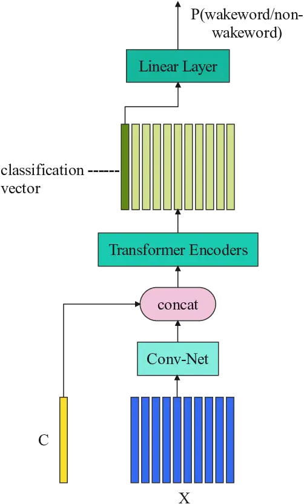
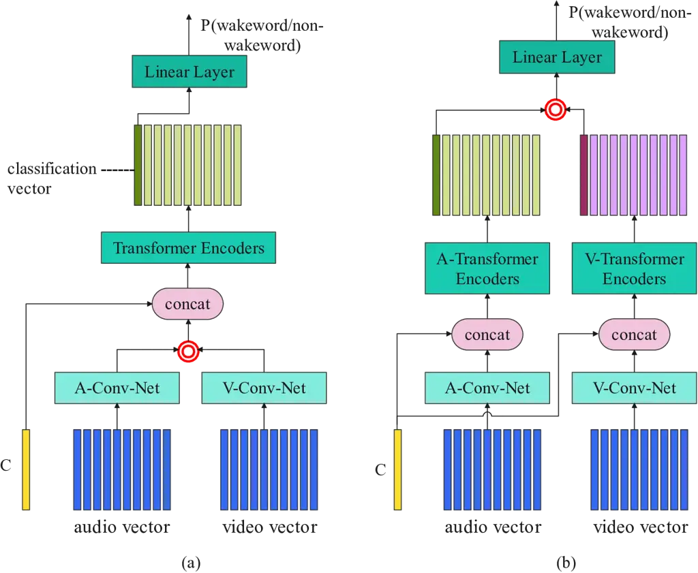
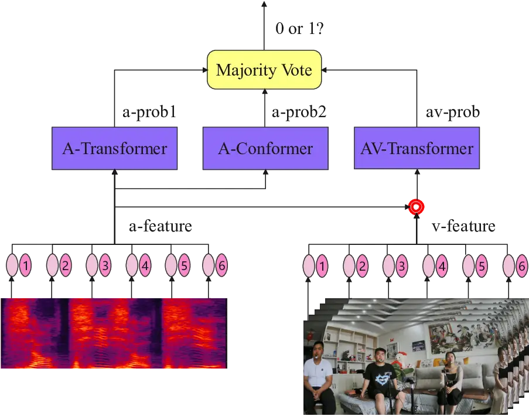

# AUDIO-VISUAL WAKE WORD SPOTTING SYSTEM FOR MISP CHALLENGE 2021

Yanguang Xu^(⋆)   Jianwei Sun¹¹footnotemark: 1 ^(⋆)   Yang
Han  Shuaijiang Zhao  Chaoyang Mei Tingwei Guo  Shuran Zhou  Chuandong
Xie  Wei Zou  Xiangang Li

###### Abstract

This⁰⁰ 0 ^(⋆)These two authors contributed equally. paper presents the
details of our system designed for the Task 1 of Multimodal Information
Based Speech Processing (MISP) Challenge 2021. The purpose of Task 1 is
to leverage both audio and video information to improve the
environmental robustness of far-field wake word spotting. In the
proposed system, firstly, we take advantage of speech enhancement
algorithms such as beamforming and weighted prediction error (WPE) to
address the multi-microphone conversational audio. Secondly, several
data augmentation techniques are applied to simulate a more realistic
far-field scenario. For the video information, the provided region of
interest (ROI) is used to obtain visual representation. Then the
multi-layer CNN is proposed to learn audio and visual representations,
and these representations are fed into our two-branch attention-based
network which can be employed for fusion, such as transformer and
conformer. The focal loss is used to fine-tune the model and improve the
performance significantly. Finally, multiple trained models are
integrated by casting vote to achieve our final 0.091 score.

###### Index Terms: 

Audio-Visual, Wake Word Spotting, Attention, Far-Field

^(†)^(†)address: Beike, Beijing, China  
{xuyanguang001, sunjianwei006, zouwei026, lixiangang002}@ke.com

## 1 Introduction

With the emergence of artificial intelligence (AI) technology, voice
controlled applications become widely used in our daily life. A
trustworthy wake word spotting (WWS) performance plays a key role in
providing a good user experience. A lot of works on audio WWS have been
proposed \[1, 2, 3, 4, 5\]. However, in real scenarios, the voices of a
wake word may be mixed with the adverse acoustic environments such as
background noises (cheers, TV or screams), reverberations, and
conversational multi-speaker interactions with a large portion speech
overlaps. Eventually, it is difficult for devices to catch the correct
instructions only depending on audio. So audio-only wake word spotting
methods becoming increasingly challenging in complex scenarios.

Inspired by the multi-modal perception of humans, which is more
competent to identify noisy speech, the Audio-Visual (AV) multi-modal
has been applied widely in speech community \[6, 7, 8, 9, 10, 11, 12\].
The visual information obtained by analyzing lip shapes or facial
expressions of the visual modality is more robust than the audio
information from complex scenarios. Benefitting from deep learning-based
algorithms, face recognition\[13\] and mouth region tracking\[14, 15\]
become more robust, we can locate ROI precisely, and efficiently extract
visual feature representation that is associated with the target talker.
Researches have been conducted to investigate the possibility to
introduce visual information into WWS\[16, 17, 18, 19\]. And how to fuse
visual representation with acoustic signal to improve the noise
robustness of WWS systems is a core challenge. So, Audio-Visual WWS
(AVWWS) is introduced to utilize the visual modality to make up for
deficiencies of audio-only WWS in complex acoustic environments.

The first MISP Challenge¹¹ 1 https://mispchallenge.github.io\[20\] 2021
Task 1 focuses on far-field WWS, which considers the problem of distant
multi-microphone conversational audio-visual wake-up and audio-visual
speech recognition in everyday home environments. So, how to leverage
both audio and video data to improve environmental robustness is a
challenging problem.In this paper, we adopt WWS-Transformer and
audio-visual deep fusion which two separate encoders learn audio and
video modality representation respectively, and then the two modality
representations are fused to spot the wake word.

The rest of the paper is organized as follows. Our system description
will be shown in Section 2. The experiments and results are reported in
Section 3. In the end a summary of the challenge work is given in
Section 4.

## 2 WWS-Model Unite SYSTEM DESCRIPTION

This section describes the End-to-End (E2E) AVWWS framework, which
consists of the audio-based module, audio-visual-based module, training
strategy and system integration. Attention mechanism is introduced into
E2E AVWWS framework, A(audio)-Transformer and A-Conformer based on audio
information are constructed. Then,considering the loss of audio
information, AV-Transformer which is inspired by the Visual Transformer
(ViT)\[21\], based on audio and video information is generated. Finally,
the majority voting mechanism is used to complete system integration,
and produce the final result.

### 2.1 Audio-based module

In this work, we introduce the A-Transformer which refers to ViT in
computer vision shown in Fig.1, the input image patches are replaced
with continuous audio frames. Assumed that the input audio features
vector $`X=\{x_{1},x_{2},...,x_{T}\}`$ of $`T`$ length frames, and
position embedding is performed for all audio frames. At first,
512-dimensional vector $`C`$ initialized by Normal Distribution
$`N(0,0.0004)`$ as the first frame is added to the output of the
Conv-Net which contains two convolution layers and one dense layer, then
the spliced vector is sent to multi-layer transformer encoders for
attention calculation. Since the convolution layer does not model the
information of time dimension, this splicing operation is carried out
after the Conv-Net. The first dimension of the sequence vectors, which
are generated by the multi-layer transformer encoders, is used as the
classification vector. Lastly, the vector is fed to the linear layer
with a sigmoid function to output the probability of the wake word. By
replacing the transformer encoders with the conformer encoders, we can
get the A-Conformer structure.



Figure 1: A-Transformer.

### 2.2 Audio-Visual-based module

Fig. 2 describes two fusion approaches for AV-Transformer. The fusion
operation is represented by the red circle. For specific implementation,
please refer to formulas (1) and (2).

In the first approach, outputs of A-Conv-Net and V-Conv-Net are fused
before sending them to the encoder, as shown in Fig.2(a). In the second
approach, two classification vectors generated by A-Transformer encoders
and V-Transformer encoders separately will be fused, as shown in
Fig.2(b), then the fused vector is used as the input of the linear
layer.

```math
y=w_{a}y_{a}+w_{v}y_{v} \tag{1}
```

```math
y=y_{a}\cdot y_{v} \tag{2}
```

where $`y_{a}`$ is the A-Conv-Net’s output or the classification vector
of A-Transformer encoders, and the corresponding weight value is
$`w_{a}`$. $`y_{v}`$ is the V-Conv-Net’s output or the classification
vector of V-Transformer encoders, and the corresponding weight value is
$`w_{v}`$. $`y`$ represents the fused output.

In the following experiments, weight values used in audio and visual
fusion will be iteratively optimized by the training data. The final
value of $`w_{a}`$ is 0.7, whereas $`w_{v}`$’s final value is 0.3. The
performance obtained for both of the approaches will be described in
Section 3.



Figure 2: AV-Transformer. The red circle is the fusion operation, which
represents weighted addition or dot product of vectors.



Figure 3: WWS-Model Unite System

| Model         | \#Encoder | Augmentation | Loss       | Dev   | Eval  |
| ------------- | --------- | ------------ | ---------- | ----- | ----- |
| A-Transformer | 1         | /            | CE         | 0.153 | 0.207 |
|               | 4         | /            | CE         | 0.127 | 0.175 |
|               | 4         | /            | CE & Focal | 0.120 | 0.149 |
|               | 4         | SpecAugment  | CE & Focal | 0.109 | 0.106 |
| A-Conformer   | 4         | SpecAugment  | CE & Focal | 0.105 | 0.116 |

Table 1: Performances of audio-only WWS models.

### 2.3 Training strategy

Compared with the cross-entropy (CE) loss, focal loss can make the
training model better mine and learn some difficult or misclassified
samples, thereby effectively improving the accuracy of the
classification task. In training of our designed system, the WWS tasks
are trained with CE and focal loss in two stages respectively. In the
first stage, the base model is trained based on CE loss. In the second
stage, the loss function is changed into focal CE loss, and all data
used in the first stage are used to fine-tune the obtained base model.
Finally, the fine-tuned model will be used for decoding. This method can
also solve the problem of serious imbalance of positive and negative
proportion in training samples.

### 2.4 System integration

The AV-Transformer uses much more information of visual, and should have
better performance compared with the A-Transformer theoretically.
However, image features of MISP are extracted from the middle-field and
far-field videos, especially there are multi-speaker in the far field
videos. Therefore, the effective image feature is difficult to be
extracted from these videos which can have some bad cases during model
training and test. In order to solve this question, we use a majority
vote method to integrated these models (A-Transformer, A-Conformer,
AV-Transformer) to get the final result, as expressed in Fig. 3 and
Formula (3).

```math
\begin{split}result_{fusion}=Mo(result_{A-Transformer},\\
result_{A-Conformer},\\
result_{AV-Transformer})\end{split} \tag{3}
```

The score outputted by each model will be compared with the threshold
value to determine whether the result is 0 or 1. “Mo” means taking the
mode of three models’ results.

## 3 Experiments

Data preprocessing, feature extraction, model training and decoding are
based on Athena²² 2 https://github.com/athena-team/athena.git and
Kaldi³³ 3 https://github.com/kaldi-asr/kaldi.git. Details are described
in the following subsections.

| Model          | Fusion                   | Augmentation | Loss | Dev   |
| -------------- | ------------------------ | ------------ | ---- | ----- |
| AV-Transformer | A-Conv+V-Conv            | /            | CE   | 0.160 |
|                | A-Conv\*V-Conv           | /            |      | 0.204 |
|                | A-Attention+V-Attention  | /            |      | 0.132 |
|                | A-Attention\*V-Attention | /            |      | 0.191 |

Table 2: Performances of AVWWS models. A-Conv and V-Conv denote the
weighted outputs of A-Conv-Net and V-Conv-Net mentioned above.
A-Attention and V-Attention denote the weighted classification vectors
generated by A-Transformer and V-Transformer encoders.

|               |                |                           |                       |          |       |       |
| ------------- | -------------- | ------------------------- | --------------------- | -------- | ----- | ----- |
| WWS Type      | Model          | Model Detail              | Data                  | Loss     | Dev   | Eval  |
| Streaming     | CNN-DNN        | 2 Conv+3 Dense            | 60h pos+200h neg      | CE       | 0.314 | /     |
| E2E           | CRNN           | 2 Conv+2 biGRU            | 60h pos+200h neg      | CE       | 0.209 | /     |
|               |                | 2 Conv+5 biLSTM           | 60h pos+200h neg      |          | 0.186 | /     |
|               |                |                           | 170h pos+530h neg     |          | 0.178 | /     |
|               | A-Transformer  | 2 Conv+4 encoders+1 Dense | 170h pos+530h neg     | CE&Focal | 0.109 | 0.106 |
|               | A-Conformer    |                           |                       |          | 0.105 | 0.116 |
|               | AV-Transformer | 2 Conv+4 AV-encoders      | A (170h pos+530h neg) | CE       | 0.132 | /     |
|               |                | +1 Dense                  | V(Far 124h)           |          |       |       |
| Majority Vote |                |                           |                       |          | /     | 0.091 |

Table 3: Performances of all WWS models in streaming and E2E type

### 3.1 Dataset

The dataset provided by MISP Challenge 2021 Task 1, which includes the
same amount of near-field, mid-field and far-field data, consists of
118.53 hours training set, 3.39 hours development set and 2.87 hours
evaluation set. In training and development set, there are positive
cases of 5.67 hours and 0.62 hours respectively.

Before training, the data are processed by the following steps:

1\) Audio normalization: negative audios in the training set are clipped
into approximately the same length with negative audios in the
development set.

2\) Speech enhancement: we implement a fixed directional beamformer that
enhances the 90 degree direction, and followed by WPE dereverberation.

3\) Data augmentation: we generate room impulse response by using the
pyroomacoustic tool⁴⁴ 4 https://github.com/LCAV/pyroomacoustics.git, and
convolve them with original near-field data to simulate mid and
far-field data. Speed perturbation is used to generate 0.9 and 1.1 speed
ratio data. At last, we mix noises provided by the officials with a
random SNR from -15 to 15 dB.

4\) Feature extraction: 63-dimensional fbank is extracted from audios,
and all the features are normalized with global CMVN. SpecAugment\[22\]
is used for data coverage and model robustness. In addition, video
features are extracted by open source tools provided by the MISP
organizer. Audio and video features will be unified into the same
dimension through two separate Conv-Nets.

Finally, we expand the audio training set to a total of 700 hours, of
which 170 hours are positives and 530 hours are negatives. Besides, we
only use far-field video data during all the training steps.

### 3.2 Model details and Evaluation

For the transformer or conformer structure, we use 4 self-attention
blocks, each with 8 heads, 512-dimensional hidden size, and 2,048
dimensions for feed-forward layer. All models are trained on 1 GPU V100,
and the batch size is 32. The learning rate is set to 0.00001 initially
and warmed up at the first 10,000 steps by the Adam optimizer.

The final evaluation score of the model is determined by the false
rejection rate(FRR) and the false acceptance rate (FAR), and the
calculation is as follows.

```math
FRR=\frac{FN}{FN+TP} \tag{4}
```

```math
FAR=\frac{FP}{FP+TN} \tag{5}
```

```math
SCORE_{WWS}=FRR+FAR \tag{6}
```

where FN denotes the number of cases erroneously divided into negative,
TP denotes the number of cases correctly divided into positive, FP
denotes the number of cases erroneously divided into positive, and TN
denotes the number of cases correctly divided into negative.

### 3.3 Results

Firstly, we explore some E2E model structures with different loss
functions and the results are shown in Table 1. Then focal loss and
SpecAugment are applied for audio data, and we get a better of 0.106 by
using a single model based on A-Transformer on evaluation set. Secondly,
multi-mode information is fused to build AV-Transformer to enhance the
performance. Table 2 shows the performance of AV-Transformer models
which use different fusion methods. The performance of CNN-DNN streaming
model and various E2E models are listed in Table 3. We unit all kinds of
E2E attention models with a majority vote mechanism to get the best
result.

These conclusions can be drawn from our experiments:

\(1\) The E2E model based on Transformer or Conformer performs better
than CRNN model and CNN-DNN streaming model when using audio data only.

\(2\) Focal loss and SpecAugment can further improve the final
performance.

\(3\) The AV-Transformer is effective to reduce error score by majority
vote.

\(4\) The majority vote has taken the votes from three top performed
models originated from our A-Transformer, A-Conformer and
AV-Transformer, which yields the final 0.091 score.

## 4 CONCLUSION

We propose an AV-WWS-Model Unite System for the task of far-field wake
word spotting in complex scenarios. The proposed system mainly contains
three subsystems: A-Transformer, A-Conformer and AV-Transformer and
these models are trained either by cross-entropy loss or focal loss. In
order to take advantage of audio and video information, a majority vote
is adopted for these models to get the final result. The experiments
results prove that our AV-WWS-Model Unite System yields better
performance.

## References

- \[1\] Qijie Shao, Jingyong Hou, Yanxin Hu, Qing Wang, and Lei Xie,
  “Target speaker extraction for customizable query-by-example keyword
  spotting,” in APSIPA ASC, 2021.
- \[2\] Doğan Can and Murat Saraclar, “Lattice indexing for spoken term
  detection,” IEEE Transactions on Audio, Speech, and Language
  Processing, vol. 19, no. 8, pp. 2338–2347, 2011.
- \[3\] Taejun Kim and Juhan Nam, “Temporal feedback convolutional
  recurrent neural networks for keyword spotting,” arXiv preprint
  arXiv:1911.01803, 2019.
- \[4\] Xi Chen, Shouyi Yin, Dandan Song, Peng Ouyang, Leibo Liu, and
  Shaojun Wei, “Small-footprint keyword spotting with graph
  convolutional network,” in 2019 IEEE Automatic Speech Recognition and
  Understanding Workshop (ASRU). IEEE, 2019, pp. 539–546.
- \[5\] Changhao Shan, Junbo Zhang, Yujun Wang, and Lei Xie,
  “Attention-based end-to-end models for small-footprint keyword
  spotting,” arXiv preprint arXiv:1803.10916, 2018.
- \[6\] Pingchuan Ma, Stavros Petridis, and Maja Pantic, “End-to-end
  audio-visual speech recognition with conformers,” in ICASSP 2021-2021
  IEEE International Conference on Acoustics, Speech and Signal
  Processing (ICASSP). IEEE, 2021, pp. 7613–7617.
- \[7\] Yifei Wu, Chenda Li, Song Yang, Zhongqin Wu, and Yanmin Qian,
  “Audio-Visual Multi-Talker Speech Recognition in a Cocktail Party,” in
  Proc. Interspeech 2021, 2021, pp. 3021–3025.
- \[8\] Hengshun Zhou, Jun Du, Hang Chen, Zijun Jing, Shifu Xiong, and
  Chin-Hui Lee, “Audio-Visual Information Fusion Using Cross-Modal
  Teacher-Student Learning for Voice Activity Detection in Realistic
  Environments,” in Proc. Interspeech 2021, 2021, pp. 341–345.
- \[9\] Yuanbo Hou, Zhesong Yu, Xia Liang, Xingjian Du, Bilei Zhu, Zejun
  Ma, and Dick Botteldooren, “Attention-based cross-modal fusion for
  audio-visual voice activity detection in musical video streams,” arXiv
  preprint arXiv:2106.11411, 2021.
- \[10\] Ruohan Gao and Kristen Grauman, “Visualvoice: Audio-visual
  speech separation with cross-modal consistency,” arXiv preprint
  arXiv:2101.03149, 2021.
- \[11\] Rémi Rigal, Jacques Chodorowski, and Benoît Zerr, “Deep
  Audio-Visual Speech Separation Based on Facial Motion,” in Proc.
  Interspeech 2021, 2021, pp. 3540–3544.
- \[12\] Mostafa Sadeghi and Xavier Alameda-Pineda, “Switching
  variational auto-encoders for noise-agnostic audio-visual speech
  enhancement,” in International Conference on Acoustics, Speech, and
  Signal Processing, 2021.
- \[13\] Florian Schroff, Dmitry Kalenichenko, and James Philbin,
  “Facenet: A unified embedding for face recognition and clustering,” in
  Computer Vision and Pattern Recognition, 2015.
- \[14\] Pingchuan Ma, Brais Martinez, Stavros Petridis, and Maja
  Pantic, “Towards practical lipreading with distilled and efficient
  models,” in IEEE International Conference on Acoustics, Speech and
  Signal Processing (ICASSP), 2021, pp. 7608–7612.
- \[15\] Brais Martinez, Pingchuan Ma, Stavros Petridis, and Maja
  Pantic, “Lipreading using temporal convolutional networks,” in IEEE
  International Conference on Acoustics, Speech and Signal Processing
  (ICASSP), 2020, pp. 6319–6323.
- \[16\] Hong Liu, Ting Fan, and Pingping Wu, “Audio-visual keyword
  spotting based on adaptive decision fusion under noisy conditions for
  human-robot interaction,” in 2014 IEEE International Conference on
  Robotics and Automation (ICRA). IEEE, 2014, pp. 6644–6651.
- \[17\] Pingping Wu, Hong Liu, Xiaofei Li, Ting Fan, and Xuewu Zhang,
  “A novel lip descriptor for audio-visual keyword spotting based on
  adaptive decision fusion,” IEEE Transactions on Multimedia, vol. 18,
  no. 3, pp. 326–338, 2016.
- \[18\] Runwei Ding, Cheng Pang, and Hong Liu, “Audio-visual keyword
  spotting based on multidimensional convolutional neural network,” in
  2018 25th IEEE international conference on image processing (ICIP).
  IEEE, 2018, pp. 4138–4142.
- \[19\] Liliane Momeni, Triantafyllos Afouras, Themos Stafylakis,
  Samuel Albanie, and Andrew Zisserman, “Seeing wake words: Audio-visual
  keyword spotting,” arXiv preprint arXiv:2009.01225, 2020.
- \[20\] Hang Chen, Hengshun Zhou, Jun Du, Chin-Hui Lee, Jingdong Chen,
  Shinji Watanabe, Sabato Marco Siniscalchi, Odette Scharenborg, Di-Yuan
  Liu, Bao-Cai Yin, Jia Pan, Jian-Qing Gao, and Cong Liu, “The first
  multimodal information based speech processing (misp) challenge: Data,
  tasks, baselines and results,” in Proc. ICASSP 2022, 2022.
- \[21\] Bichen Wu, Chenfeng Xu, Xiaoliang Dai, Alvin Wan, Peizhao
  Zhang, Zhicheng Yan, Masayoshi Tomizuka, Joseph Gonzalez, Kurt
  Keutzer, and Peter Vajda, “Visual transformers: Token-based image
  representation and processing for computer vision,” arXiv preprint
  arXiv:2006.03677, 2020.
- \[22\] Daniel S. Park, William Chan, Yu Zhang, Chung-Cheng Chiu,
  Barret Zoph, Ekin D. Cubuk, and Quoc V. Le, “Specaugment: A simple
  data augmentation method for automatic speech recognition,” in
  Conference of the International Speech Communication
  Association, 2019.
