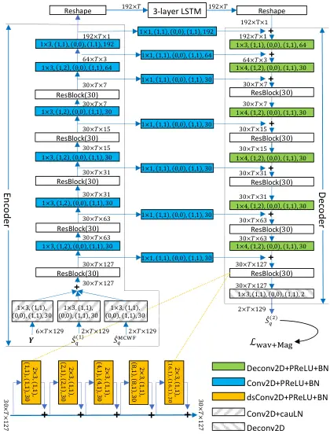

# STFT-Domain Neural Speech Enhancement with Very Low Algorithmic Latency

Zhong-Qiu Wang    Gordon Wichern    Shinji Watanabe    Jonathan Le Roux
^(†)^(†)thanks: Manuscript received on Mar. 14, 2022; revised Aug. 26,
2022; revised Nov. 2, 2022; accepted Nov. 3, 2022.^(†)^(†)thanks: Z.-Q.
Wang and S. Watanabe are with the Language Technologies Institute,
Carnegie Mellon University, Pittsburgh, PA 15213, USA (e-mail:
wang.zhongqiu41@gmail.com, shinjiw@cmu.edu).^(†)^(†)thanks: G. Wichern
and J. Le Roux are with Mitsubishi Electric Research Laboratories,
Cambridge, MA 02139, USA (e-mail: {wichern,leroux}@merl.com).

###### Abstract

Deep learning based speech enhancement in the short-time Fourier
transform (STFT) domain typically uses a large window length such as 32
ms. A larger window can lead to higher frequency resolution and
potentially better enhancement. This however incurs an algorithmic
latency of 32 ms in an online setup, because the overlap-add algorithm
used in the inverse STFT (iSTFT) is also performed using the same window
size. To reduce this inherent latency, we adapt a conventional
dual-window-size approach, where a regular input window size is used for
STFT but a shorter output window is used for overlap-add, for
STFT-domain deep learning based frame-online speech enhancement. Based
on this STFT-iSTFT configuration, we employ complex spectral mapping for
frame-online enhancement, where a deep neural network (DNN) is trained
to predict the real and imaginary (RI) components of target speech from
the mixture RI components. In addition, we use the DNN-predicted RI
components to conduct frame-online beamforming, the results of which are
used as extra features for a second DNN to perform frame-online
post-filtering. The frequency-domain beamformer can be easily integrated
with our DNNs and is designed to not incur any algorithmic latency.
Additionally, we propose a future-frame prediction technique to further
reduce the algorithmic latency. Evaluation on noisy-reverberant speech
enhancement shows the effectiveness of the proposed algorithms. Compared
with Conv-TasNet, our STFT-domain system can achieve better enhancement
performance for a comparable amount of computation, or comparable
performance with less computation, maintaining strong performance at an
algorithmic latency as low as 2 ms.

###### Index Terms: 

Frame-online speech enhancement, complex spectral mapping, microphone
array processing, deep learning.

## I Introduction

Deep learning has dramatically advanced speech enhancement in the past
decade \[1\]. Early studies estimated target magnitudes via
time-frequency (T-F) masking \[2\] or directly predicted target
magnitude via spectral mapping \[3\], both using the mixture phase for
signal re-synthesis. Subsequent studies strove to improve phase
modelling by performing phase estimation via magnitude-driven iterative
phase reconstruction \[4\]. Recent effort focuses on complex- and
time-domain approaches \[5, 6, 7, 8, 9, 10, 11\], where magnitude and
phase are modelled simultaneously through end-to-end optimization.

Many application scenarios such as teleconferencing and hearing aids
require low-latency speech enhancement. Deep learning based approaches
\[12, 8, 13, 14, 15, 16\] handle this by using causal DNN blocks, such
as uni-directional LSTMs, causal convolutions, causal attention layers,
and causal normalization layers. Although many previous studies along
this line advocate that their system with a causal DNN model is causal,
one should be aware that most of these systems are, to be more precise,
frame-online, and the amount of look-ahead depends on the frame length.
One major approach that can potentially achieve sample-level causal
processing is by using WaveNet-like models \[17\]. However, their
effectiveness in dealing with noise and reverberation in a sample-causal
setup is unclear \[18\]. In addition, at run time such models need to
run a forward pass for each sample, resulting in a humongous and likely
unnecessary amount of computation. Popular STFT- and time-domain
approaches typically split signals into overlapped frames with a
reasonably large hop length before processing. One advantage is that the
forward pass then only needs to be run every hop-length samples. The
latency is however equal to the window length due to the use of
overlap-add in signal re-synthesis, plus the running time of processing
one frame (see Fig. 1 and its caption for a detailed explanation of the
latency). In the recent Deep Noise Suppression (DNS) challenge \[19\],
one key requirement was that the latency of producing an estimate for
the sample at index $`n`$ cannot exceed 40 ms on a standard Intel Core
i5 processor. For a typical STFT-based system with a 32 ms window and an
8 ms hop size, a frame-online DNN-based system satisfies the requirement
if the processing of each frame can finish within 8 ms on the specified
processor. We define the latency due to algorithmic reasons (such as
overlap-add) as algorithmic latency, and the computing time needed to
process one frame as hardware latency. The overall latency is the
summation of the two and is denoted as processing latency.

Fig. 1: Illustration of processing latency in systems based on regular
STFT and iSTFT. Each rectangular band denotes a segment of time-domain
signals. We use 75% frame overlap as an example. Because of the
overlap-add in the iSTFT, to get the prediction at sample $`n`$ (marked
in the top of the figure) at frame $`t`$, one has to first observe all
the samples of frame $`t+3`$ and then wait until the DNN finishes
processing frame $`t+3`$. The processing delay is hence the window
length plus the running time of processing one frame.

Although a 40 ms processing latency can meet the demand of many
applications, for hearing aids this latency is too large to deliver a
good listening experience. In the recent Clarity challenge, proposed for
hearing aid design \[20\], the required algorithmic latency was 5 ms.
Such a low-latency constraint requires new designs and significant
modifications to existing enhancement algorithms. To meet this
constraint, our study aims at an enhancement system with a window that
looks ahead at most 4 ms of samples, and a 2 ms hop size. We assume that
the hardware latency can be within 2 ms, leading to a maximum processing
delay of 6 ms, even though this computational capability might not be
available right now for a computationally demanding DNN model on
resource-constrained edge devices. We emphasize that this study focuses
on improving enhancement performance and reducing algorithmic latency
rather than computational efficiency or feasibility on current hardware.

In the literature, some early STFT-domain beamforming studies \[21, 22\]
use small window and hop sizes to achieve enhancement with a low
algorithmic latency, and a low frequency resolution is used for STFT
following the short window length. However, this low frequency
resolution may limit the enhancement performance \[1, 23, 24\] when
phase estimation is not performed or the estimated phase is not good
enough \[25\]. There are studies \[26, 27\] designing low-delay
filterbanks with warped frequencies for speech enhancement and speaker
separation, but such manually-designed filterbanks are often complicated
and modern deep learning based solutions \[1, 7\] tend to learn similar
filters through end-to-end training based on the complex T-F
representations with uniform frequencies or based on the raw time-domain
signals. In the recent Clarity challenge, almost all the top teams \[28,
29, 30\] adopt time-domain networks such as Conv-TasNet \[7, 31\], which
can use very short window and hop sizes to potentially realize very
low-latency enhancement. Conv-TasNet leverages DNN-based end-to-end
optimization to learn a set of bases for a small window of samples
respectively for its encoder and decoder to replace the conventional
STFT and iSTFT operations. The number of bases is set to be much larger
than the number of samples in the window. Enhancement is then performed
in the higher-dimensional encoded space and the decoder is used for
overlap-add based signal re-synthesis. While achieving good separation
performance in monaural anechoic speaker separation tasks, Conv-TasNet
performs less impressively in reverberant conditions and in
multi-microphone scenarios than frequency-domain approaches \[32, 11,
33\]. In addition, the basis learned by Conv-TasNet is not narrowband
\[7\]. It is not straightforward how to combine Conv-TasNet with
conventional STFT-domain enhancement algorithms to achieve further
gains, without incurring additional algorithmic latency. Such
conventional algorithms include beamforming and weighted prediction
error (WPE), which rely on the narrow-band assumption and can produce
reliable separation through their per-frequency processing \[34, 35, 11,
36\]. One way of combining them \[37, 23, 38\] is by iterating
Conv-TasNet, which uses a very short window, with STFT-domain
beamforming, which uses a regular, longer window. To use Conv-TasNet
outputs to compute signal statistics for STFT-domain beamforming, one
has to first re-synthesize time-domain signals before extracting STFT
spectra for beamforming. Similarly, to apply Conv-TasNet on beamforming
results for post-filtering, one has to apply iSTFT to get time-domain
signals before feeding them to Conv-TasNet. Such an iterative procedure
would however gradually build up the algorithmic latency, because the
overlap-add algorithms are used multiple times in Conv-TasNet and iSTFT.

Fig. 2: Illustration of overlap-add with dual window sizes. This example
uses a 16 ms input window size for STFT, a 4 ms output window size for
overlap-add, and a 2 ms hop size. At each frame, DNN is trained to
predict (a) current frame; (b) one frame ahead.

It is commonly perceived that regular STFT-based systems, which suffer
from a large algorithmic latency equal to the STFT’s typically long
window length, are not ideal for very low-latency speech enhancement,
and time-domain models such as Conv-TasNet, which can achieve strong
performance using very short windows, appear a more appropriate choice
\[7\]. In this study, we show that our STFT-based system can also
produce a comparable or better enhancement performance at an algorithmic
latency as low as 4 or 2 ms. This is partially achieved by combining
STFT-domain, deep learning based speech enhancement with a conventional
dual window approach \[39, 40\], which uses a regularly long window
length for STFT and a shorter window length for overlap-add. This
approach is illustrated in Fig. 2(a). More specifically, assuming a hop
size (HS) of 2 ms, we use a 16 ms input window size (iWS) for STFT, and
an output window size (oWS) of 4 ms for the overlap-add in iSTFT. The 16
ms input window looks 4 ms ahead and 12 ms in the past in this case.
After obtaining the predicted signal at each frame, i.e., after
performing inverse discrete Fourier transform (iDFT), we throw away the
first 12 ms of waveforms, apply a synthesis window, and perform
overlap-add based on the last 4 ms of signals at each frame. The DNN
module is designed to be frame-online. Therefore the entire system has
an algorithmic latency of 4 ms. Later in Section V-B, we will introduce
a future-frame prediction technique to further reduce the algorithmic
latency to 2 ms.

When used with DNNs, this dual window size approach has several
advantages. First, using a long window for STFT leads to higher
frequency resolution, meaning that we could have more estimated filters
(or mask values) per frame to obtain more fine-grained enhancement. In
addition, higher frequency resolution could better leverage the speech
sparsity property in the T-F domain for enhancement \[1, 24\]. Second,
using a longer input window can capture more reverberation at each
frame, potentially leading to better dereverberation. In addition, it
could lead to better spatial processing, as the inter-channel phase
patterns could be more stable and salient for longer signals. Third,
STFT bases are narrowband in nature, meaning that we can readily use our
DNN outputs (in this study, the estimated target real and imaginary
components) to compute a conventional frequency-domain beamformer, whose
results can be used as extra features for another DNN to better predict
the target speech.

The major contributions of this paper are provided below, together with
our justifications:

First, we adapt a conventional dual window size approach \[39, 40\] to
reduce the algorithmic latency of STFT-domain deep learning based speech
enhancement. Although using a synthesis window shorter than the analysis
window has been proposed in conventional non-deep-learning speech
enhancement studies \[39, 40\], it is seldomly employed (or
investigated) in modern deep learning based speech enhancement.
TasNet-style time-domain DNN models \[7, 9\], which learn encoders
(i.e., filterbanks) and decoders based on very short windows of signals
through end-to-end training, have become the dominant approach to
achieve very low-latency enhancement. This can be observed from the top
solutions \[28, 29, 30\] in the recent Clarity challenge \[20\]. Such
success casts doubt on whether STFT-domain approaches are inherently
sub-optimal compared with time-domain approaches, and whether the go-to
approach for very low-latency speech enhancement should be time-domain
approaches. In our experiments, we find that the proposed STFT-domain
system can achieve comparably good or better performance than popular
Conv-TasNet systems \[7, 31, 28\], using a similar amount of computation
and at an algorithmic latency as low as 4 or 2 ms. To the best of our
knowledge, to date there is only one deep learning based study exploring
the dual window size idea \[24\]. However, that work focuses on a
speaker separation task rather than speech enhancement, only tackles the
monaural condition, performs real-valued masking based on a weak LSTM
model, only reduces the algorithmic latency to 8 ms, and does not
perform a comparison with time-domain models. Therefore, whether one
should embrace STFT-domain approaches for very low-latency speech
enhancement remains unclear. In contrast, our study includes both
single- and multi-channel conditions, considers both magnitude and phase
estimation through complex spectral mapping based on modern DNN
architectures, reduces the algorithmic latency to as low as 2 ms (where
our models still show competitive performance), and, most importantly,
we perform a thorough comparison with the representative time-domain
model, Conv-TasNet.

Second, we utilize the outputs from the first DNN for frequency-domain
frame-online beamforming, and the beamforming result is fed to a second
DNN for better enhancement (i.e., post-filtering). This beamforming
followed by post-filtering approach produces clear improvements in our
experiments over just using one DNN (i.e., not using any beamforming and
post-filtering). Although this approach has been studied in non-causal
neural speech enhancement \[41, 42, 43, 11\], one important advantage we
will demonstrate in this paper is that, since the two DNNs and the
beamformer all operate in the complex T-F domain, this approach does not
incur additional algorithmic latency. In contrast, time-domain models
cannot be straightforwardly combined with frequency-domain beamforming
without incurring extra algorithmic latency. This comparison
demonstrates that one advantage of performing very low-latency
enhancement in the STFT domain is the integration with frequency-domain
beamforming.

Third, we propose a future-frame prediction technique that can further
reduce the algorithmic latency caused by the output window size. We show
that predicting one frame ahead only slightly degrades the performance.
This is a significant contribution, because it suggests a good way to
reduce the algorithmic latency using the same amount of computation, or
maintain the same algorithmic latency but use less computation. In
addition, we analyze the effects of the shape of analysis windows on
future-frame prediction, and present preliminary results of predicting
multiple frames ahead, which can potentially reduce the algorithmic as
well as processing latency to zero. Furthermore, this future-frame
prediction technique is particularly helpful to the two-DNN system with
an intermediate beamformer. We point out that one inherent weakness of
the two-DNN system is that, since it stacks two DNNs, the amount of
computation would at least be doubled if the same DNN architecture is
used in both networks. Supposing the overlap between output windows is
50% (for example by using 2 ms oWS and 1 ms hop), we propose to cut the
doubled amount of computation by approximately half via doubling the hop
size and predicting one frame ahead, at the same time maintaining the
same algorithmic latency. The resulting system still shows competitive
performance to Conv-TasNet.

It should be noted that conventional signal-processing-based acoustic
echo control and active noise control studies have shown that low-delay
time-domain filtering can be achieved by T-F domain processing \[26\],
and the idea of predicting future samples (via for example multi-step
linear prediction) to reduce processing latency has been studied in
active noise control \[44\]. They are however seldom studied in the
context of machine-learning-based speech processing.

The following section gives an overview of our system.

## II System Overview

Given an utterance of a speaker recorded in noisy-reverberant conditions
by a $`P`$-microphone array, the physical model in the STFT domain can
be formulated as

```math
\displaystyle\mathbf{Y}(t,f) \displaystyle=\mathbf{X}(t,f)+\mathbf{V}(t,f)
```

```math
\displaystyle=\mathbf{S}(t,f)+\mathbf{H}(t,f)+\mathbf{V}(t,f), \tag{1}
```

where $`\mathbf{Y}(t,f)`$, $`\mathbf{V}(t,f)`$, $`\mathbf{X}(t,f)`$,
$`\mathbf{S}(t,f)`$ and $`\mathbf{H}(t,f)\in{\mathbb{C}}^{P}`$
respectively denote the STFT vectors of the mixure, reverberant noise,
reverberant target speech, direct-path and non-direct signals of the
target speaker at time $`t`$ and frequency $`f`$. In the rest of this
paper, when dropping $`t`$ and $`f`$ from the notation, we refer to the
corresponding spectrogram. In our experiments, the default iWS, oWS, and
HS for STFT are respectively set to 16, 4, and 2 ms, and the sampling
rate is 16 kHz. A 256-point DFT is applied to extract 129-dimensional
STFT coefficients at each frame. The analysis window and synthesis
window will be described in Section V-A.

Based on the input $`\mathbf{Y}`$, we aim at recovering the target
speaker’s direct-path signal captured at a reference microphone $`q`$,
i.e., $`S_{q}`$. We use the corresponding time-domain signal of
$`S_{q}`$, denoted as $`s_{q}`$, as the reference signal for metric
computation. Note that early reflections are not considered as part of
target speech. In multi-microphone cases, we assume that the same array
geometry is used for training and testing, following \[41, 43\]. This is
a valid assumption as real-world products such as smart speakers have a
fixed array configuration.

Fig. 3: DNN overview. Our system contains two frame-online DNNs with a
frame-online multi-channel Wiener filter (MCWF) in between.

Our best performing system, illustrated in Fig. 3, has two DNNs. Using
the real and imaginary (RI) components of multiple input signals as
input features, the DNNs are trained sequentially based on single- or
multi-microphone complex spectral mapping \[5, 41, 43\] to predict the
RI components of $`S_{q}`$. The estimated speech by DNN₁ is used to
compute, at each frequency, a multi-channel Wiener filter (MCWF) \[23\]
for the target speaker. $`\text{DNN}_{2}`$ concatenates the RI
components of the beamforming results, the outputs of
$`\text{DNN}_{1}`$, and $`\mathbf{Y}`$ as features to further estimate
the RI components of $`S_{q}`$. The $`\text{DNN}_{1}`$,
$`\text{DNN}_{2}`$, and MCWF modules are all designed to be
frame-online, so that we can readily plug our two-DNN system into Fig. 2
to achieve enhancement with very low algorithmic latency. Note that such
two-DNN systems with a beamformer in between have been explored in our
previous studies \[41, 42, 43, 11\], but their target was offline
processing. This paper extends them for frame-online processing with a
very low algorithmic latency.

The rest of this paper is organized as follows. Section III details the
DNN configurations, Section IV describes the DNN-supported beamforming,
and Section V presents the proposed enhancement system with low
algorithmic latency. Experimental setup and evaluation results are
presented in Sections VI and VII. Section VIII concludes this paper.

## III DNN Configurations

Our DNNs are trained to do complex spectral mapping \[5\], where the
real and imaginary (RI) components of multiple signals are concatenated
as input for DNNs to predict the target RI components at a reference
microphone. This section describes the loss functions and the DNN
architectures. The key differences from our earlier studies \[41, 42,
43, 11\] include the facts that (1) we train through the dual window
size approach and define the loss function on the re-synthesized
signals; and (2) we dramatically reduce the per-frame amount of
computation of the DNN models used in our earlier studies.

### III-A Loss Functions

The two DNNs in Fig. 3 are trained using different loss functions. For
DNN₁, following \[45, 41, 43\] the loss is defined on the predicted RI
components and their magnitude:

```math
\displaystyle\mathcal{L}_{\text{RI+Mag}}=\|\hat{R}_{q}^{(1)}-\text{Real} \displaystyle(S_{q})\|_{1}+\|\hat{I}_{q}^{(1)}-\text{Imag}(S_{q})\|_{1}
```

```math
\displaystyle+\Big\|\sqrt{\hat{R}_{q}^{(1)^{2}}+\hat{I}_{q}^{(1)^{2}}}-|S_{q}|\Big\|_{1}, \tag{2}
```

where $`\hat{R}_{q}^{(1)}`$ and $`\hat{I}_{q}^{(1)}`$ are the predicted
RI components by DNN₁, $`\text{Real}(\cdot)`$ and $`\text{Imag}(\cdot)`$
extract RI components, and $`\|\cdot\|_{1}`$ computes the $`L_{1}`$
norm. The estimated target spectrogram at the reference microphone $`q`$
is $`\hat{S}_{q}^{(1)}=\hat{R}_{q}^{(1)}+j\hat{I}_{q}^{(1)}`$, where
$`j`$ denotes the imaginary unit.

Given the predicted RI components $`\hat{R}_{q}^{(2)}`$ and
$`\hat{I}_{q}^{(2)}`$ by DNN₂, we denote
$`\hat{S}_{q}^{(2)}=\hat{R}_{q}^{(2)}+j\hat{I}_{q}^{(2)}`$ and compute
the re-synthesized signal
$`\hat{s}_{q}^{(2)}=\text{iSTFT}(\hat{S}_{q}^{(2)})`$, where
$`\text{iSTFT}(\cdot)`$ uses a shorter output window for overlap-add to
reduce the algorithmic latency (see Fig. 2)(a). The loss function is
then defined on the re-synthesized time-domain signal and its STFT
magnitude:

```math
\displaystyle\mathcal{L}_{\text{Wav+Mag}}=\|\hat{s}_{q}^{(2)}- \displaystyle s_{q}\|_{1}
```

```math
\displaystyle+\Big\||\text{STFT}_{\mathcal{L}}(\hat{s}_{q}^{(2)})|-|\text{STFT}_{\mathcal{L}}(s_{q})|\Big\|_{1}, \tag{3}
```

where $`\text{STFT}_{\mathcal{L}}(\cdot)`$ extracts a complex
spectrogram. The loss on magnitude is found to consistently improve
objective metrics such as PESQ and STOI \[45\]. Note that
$`\text{STFT}_{\mathcal{L}}(\cdot)`$ here can use any window types and
window and hop sizes, and can be different from the ones we use to
extract $`\mathbf{Y}`$ and $`S_{q}`$, since it is only used for loss
computation. In our experiments, we use the square-root Hann window, a
32 ms window size and an 8 ms hop size to compute this magnitude loss.
Please do not confuse these STFT parameters with the STFT parameters we
used to extract $`\mathbf{Y}`$ and $`S_{q}`$.

In our experiments, we will compare the two-DNN system with a single-DNN
system (i.e., without the beamforming module and the second DNN). In the
single-DNN case, DNN₁ can be trained using either Eq. (2) or (3).
Differently, in the two-DNN case, DNN₁ is trained only using Eq. (2).
This is because the beamformer we will derive later in Eq. (4) is based
on a DNN-estimated target in the complex domain.



Fig. 4: Network architecture of $`\text{DNN}_{2}`$. Each one of Conv2D,
Deconv2D, Conv2D+PReLU+BN, dsConv2D+PReLU+BN, and Deconv2D+PReLU+BN
blocks is specified in the format: kernelTime$`\times`$kernelFreq,
(strideTime, strideFreq), (padTime, padFrequency), (dilationTime,
dilationFreq), featureMaps. During training, the tensor shape after each
block in the encoder and decoder is denoted in the format:
featureMaps$`\times`$timeSteps$`\times`$freqChannels. Best viewed in
color.

### III-B Network Architecture

Our DNN architecture, denoted as LSTM-ResUNet, is illustrated in Fig. 4.
It is a long short-term memory (LSTM) network clamped by a U-Net \[46\].
Residual blocks are inserted at multiple frequency scales in the encoder
and decoder of the U-Net. The motivation of this network design is that
U-Net can maintain fine-grained local structure via its skip connections
and model contextual information along frequency through down- and
up-sampling, LSTM can leverage long-range information, and residual
blocks can improve discriminability. We stack the RI components of
different input and output signals as features maps in the network input
and output. DNN₁ and DNN₂ differ only in their network input. DNN₁ uses
the RI components of $`\mathbf{Y}`$ to predict the RI components of
$`S_{q}`$, and DNN₂ additionally uses as input the RI components of
$`\hat{S}_{q}^{(1)}`$ and a beamforming result
$`\hat{S}_{q}^{\text{MCWF}}`$, which will be described later in
Section IV. The encoder contains one two-dimensional (2D) convolution
followed by causal layer normalization (cauLN) for each input signal,
and six convolutional blocks, each with 2D convolution, parametric ReLU
(PReLU) non-linearity, and batch normalization (BN), for down-sampling.
The LSTM contains three layers, each with 300 units. The decoder
includes six blocks of 2D deconvolution, PReLU, and BN, and one 2D
deconvolution, for up-sampling. Each residual block in the encoder and
decoder contains five depth-wise separable 2D convolution (denoted as
dsConv2D) blocks, where the dilation rate along time are respectively 1,
2, 4, 8 and 16. Linear activation is used in the output layer to obtain
the predicted RI components.

All the convolution and normalization layers are causal (i.e.,
frame-online) at run time. We use $`1\times 3`$ or $`1\times 4`$ kernels
along time and frequency for the down- and up-sampling convolutions,
following \[16\]. Causal $`2\times 3`$ convolutions are used in the
residual blocks, following \[16\].

Note that this architecture is similar to the earlier TCN-DenseUNet
architecture \[41, 42, 43, 11\]. Major changes include replacing the
DenseNet blocks with residual blocks and replacing regular 2D
convolutions with depthwise separable 2D convolutions. These changes
dramatically reduce the amount of computation and the number of
trainable parameters. The network contains around 2.3 million
parameters, compared with the 6.9 million parameters in TCN-DenseUNet.
It uses similar amount of computation compared with the Conv-TasNet used
in our experiments.

## IV Frequency-Domain Beamforming

Based on the DNN-estimated target RI components, we compute an online
multi-channel Wiener filter (MCWF) \[36\] to enhance target speech (see
Fig. 3). The MCWF is computed per frequency, leveraging the narrow-band
property of STFT. Although the beamforming result of such a filter
usually does not show better scores in terms of enhancement metrics than
the immediate DNN outputs, it can provide complementary information to
help DNN₂ obtain better enhancement results \[43, 11, 47\]. Our main
contribution here is to show that frame-online frequency-domain
beamforming can be easily integrated with our STFT-domain DNNs to
improve enhancement, while not incurring any algorithmic latency. We can
use more advanced beamformers, or dereverberation algorithms such as WPE
\[34, 35, 11\], to achieve even better enhancement than MCWF. They are
however out of the scope of this study. This section will first describe
the offline time-invariant implementation of the MCWF beamformer and
then extend it to frame-online.

The MCWF \[36\] computes a linear filter per T-F unit or per frequency
to project the mixture to target speech. Assuming the target speaker
does not move within each utterance and based on the DNN-estimated
target speech $`\hat{S}_{q}^{(1)}`$, we compute a time-invariant MCWF
per frequency through the following minimization problem:

```math
\displaystyle\underset{\mathbf{w}(f;q)}{{\text{min}}}\sum\nolimits_{t}\big|\hat{S}_{q}^{(1)}(t,f)-\mathbf{w}(f;q)^{{\mathsf{H}}}\mathbf{Y}(t,f)\big|^{2}, \tag{4}
```

where $`q`$ denotes the reference microphone and
$`\mathbf{w}(f;q)\in{\mathbb{C}}^{P}`$ is a $`P`$-dimensional filter.
Since the objective is quadratic, a closed-form solution is available:

```math
\displaystyle\hat{\mathbf{w}}(f;q) \displaystyle=\Big(\hat{\mathbf{\Phi}}^{(yy)}(f)\Big)^{-1}\hat{\mathbf{\Phi}}^{(ys)}(f)\mathbf{u}_{q}, \tag{5}
```

```math
\displaystyle\hat{\mathbf{\Phi}}^{(yy)}(f) \displaystyle=\sum\nolimits_{t}\mathbf{Y}(t,f)\mathbf{Y}(t,f)^{{\mathsf{H}}}, \tag{6}
```

```math
\displaystyle\hat{\mathbf{\Phi}}^{(ys)}(f) \displaystyle=\sum\nolimits_{t}\mathbf{Y}(t,f)\hat{\mathbf{S}}^{(1)}(t,f)^{{\mathsf{H}}}, \tag{7}
```

where $`\hat{\mathbf{\Phi}}^{(yy)}(f)`$ denotes the observed mixture
spatial covariance matrix, $`\hat{\mathbf{\Phi}}^{(ys)}(f)`$ the
estimated covariance matrix between the mixture and the target speaker,
and $`\mathbf{u}_{q}`$ is a one-hot vector with element $`q`$ equal to
one. Notice that we do not need to first fully compute the matrix
$`\hat{\mathbf{\Phi}}^{(ys)}(f)`$ and then take its $`q^{\text{th}}`$
column by multiplying it with $`\mathbf{u}_{q}`$, because

```math
\displaystyle\hat{\mathbf{\Phi}}^{(ys)}(f)\mathbf{u}_{q}=\sum\nolimits_{t}\mathbf{Y}(t,f)\Big(\hat{S}_{q}^{(1)}(t,f)\Big)^{*}, \tag{8}
```

where $`(\cdot)^{*}`$ computes complex conjugate. The beamforming result
is computed as

```math
\displaystyle\hat{S}_{q}^{\text{MCWF}}(t,f)=\hat{\mathbf{w}}(f;q)^{{\mathsf{H}}}\mathbf{Y}(t,f). \tag{9}
```

We point out that, in Eq. (4), the DNN-estimated magnitude and phase can
both be used for computing the MCWF beamformer, while previous studies
use DNN-estimated real-valued magnitude masks to compute spatial
covariance matrices and then derive MCWF beamformers \[23\]. In
addition, we only need to have DNN₁ to estimate the target speech at the
reference microphone $`q`$ to compute the MCWF. Differently, earlier
studies perform minimum variance distortionless response (MVDR)
beamforming in this two-DNN approach \[48, 42, 43\], and, to leverage
both DNN-estimated magnitude and phase to compute the MVDR beamformer,
they estimate the target speech at all the microphones by training a
multi-channel input and multi-channel output network that can predict
the target speech at all the microphones at once \[41, 15\], or by
running a well-trained multi-channel input and single-channel output
network $`P`$ times at inference time \[43, 33\], where each microphone
is considered as the reference microphone in turn. However, the former
approach produces worse separation at each microphone than the latter,
probably because there are many more signals to predict \[41\], and the
latter dramatically increases the amount of computation \[43\]. By using
the MCWF in Eq. (4) instead of an MVDR beamformer, we can simplify the
beamforming module, as (4) just performs a linear projection and does
not require an estimated steering vector, and, in addition, we only need
DNN₁ to estimate the target speech at a reference microphone in order to
use both DNN-estimated magnitude and phase for beamformer computation.

Differently from Eqs. (5)-(7), in a frame-online setup the statistics
are accumulated online, similarly to \[49\], and the beamformer at each
time step is computed as

```math
\displaystyle\hat{\mathbf{w}}(t,f;q) \displaystyle=\Big(\hat{\mathbf{\Phi}}^{(yy)}(t,f)\Big)^{-1}\hat{\mathbf{\Phi}}^{(ys)}(t,f)\mathbf{u}_{q}, \tag{10}
```

```math
\displaystyle\hat{\mathbf{\Phi}}^{(yy)}(t,f) \displaystyle=\hat{\mathbf{\Phi}}^{(yy)}(t-1,f)+\mathbf{Y}(t,f)\mathbf{Y}(t,f)^{{\mathsf{H}}}, \tag{11}
```

```math
\displaystyle\hat{\mathbf{\Phi}}^{(ys)}(t,f) \displaystyle=\hat{\mathbf{\Phi}}^{(ys)}(t-1,f)+\mathbf{Y}(t,f)\hat{\mathbf{S}}^{(1)}(t,f)^{{\mathsf{H}}}, \tag{12}
```

with $`\hat{\mathbf{\Phi}}^{(yy)}(0,f)`$ and
$`\hat{\mathbf{\Phi}}^{(ys)}(0,f)`$ initialized to be all-zero. Note
that here we do not use the typical recursive averaging
technique \[36\], as the target speaker and non-target sources are
assumed not to be moving within each utterance. We will explore the idea
of recursive averaging in future work.

Based on the online time-varying filter $`\hat{\mathbf{w}}(t,f;q)`$, the
beamforming result is obtained as

```math
\displaystyle\hat{S}_{q}^{\text{MCWF}}(t,f)=\hat{\mathbf{w}}(t,f;q)^{{\mathsf{H}}}\mathbf{Y}(t,f). \tag{13}
```

Similarly to \[49\], in a frame-online setup
$`\hat{\mathbf{\Phi}}^{(yy)}(t)^{-1}`$ in Eq. (10) can be computed
iteratively according to the Woodbury formula, i.e.,

```math
\displaystyle\hat{\mathbf{\Phi}}^{(yy)}(t)^{-1} \displaystyle=\Big(\hat{\mathbf{\Phi}}^{(yy)}(t-1)+\mathbf{Y}(t)\mathbf{Y}(t)^{{\mathsf{H}}}\Big)^{-1}
```

```math
\displaystyle\hskip-42.67912pt=\hat{\mathbf{\Phi}}^{(yy)}(t-1)^{-1}
```

```math
\displaystyle\hskip-22.76228pt-\frac{\hat{\mathbf{\Phi}}^{(yy)}(t-1)^{-1}\mathbf{Y}(t)\mathbf{Y}(t)^{{\mathsf{H}}}\hat{\mathbf{\Phi}}^{(yy)}(t-1)^{-1}}{1+\mathbf{Y}(t)^{{\mathsf{H}}}\hat{\mathbf{\Phi}}^{(yy)}(t-1)^{-1}\mathbf{Y}(t)}, \tag{14}
```

where the frequency index $`f`$ is dropped to make the equation less
cluttered. This way, expensive matrix inversion at each T-F unit is
avoided in the frame-online case.

## V Enhancement with Low Algorithmic Latency

In Fig. 3, there are two DNNs and an MCWF in between. Since the DNNs and
beamformer all operate in the complex T-F domain, without going back and
forth to the time domain, we can use the same STFT resolution for all of
them to obtain a two-DNN system with a low algorithmic latency. This is
different from earlier studies \[37, 23, 38\] that combine time-domain
models with beamforming and have to switch back and forth to the time
domain. Given a small hop size (say 2 ms), we can use a regular, large
iWS (for example 16 ms) for STFT to have a reasonably high frequency
resolution for frequency-domain beamforming. To re-synthesize
$`\hat{S}_{q}^{(2)}`$ to a time-domain signal, we use the last 4 ms of
the 16 ms signals produced by iDFT at each frame for overlap-add,
following the procedure illustrated in Fig. 2(a). The resulting system
has an algorithmic latency of 4 ms, even though the STFT spectrograms
are extracted using a window size of 16 ms. The rest of this section
describes the analysis and synthesis windows, and a future-frame
prediction technique that can further reduce the 4 ms algorithmic
latency to 2 ms.

### V-A Analysis and Synthesis Window Design

In our experiments, we will investigate various analysis windows such as
the square-root Hann (sqrtHann) window, rectangular (Rect) window,
asymmetric sqrtHann (AsqrtHann) window \[39, 40, 24\], and Tukey window
\[50\]. See Fig. 5 for an illustration of the windows. Our consideration
for this investigation is that for windows such as the sqrtHann window,
where all the last 4 ms are in the tapering range, the tapering could
make the extracted frequency components in the STFT spectrograms less
representative of the last 4 ms of signals, where we aim to make
predictions. One solution is to use a rectangular analysis window, which
does not taper samples. However, it is well-known that rectangular
windows lead to more spectral leakage due to their higher sidelobes than
windows with a tapering shape \[51, 50\]. Such leakage could degrade
per-frequency beamforming as well as the performance of DNNs. On the
other hand, the rectangular window does not taper any samples in the
right end and hence the signal in that region is not modified by the
window. This could be helpful for very low-latency processing, as we
need to make predictions for these samples. Our study also considers the
Tukey window \[50\], defined as

```math
\displaystyle g[n] \displaystyle=0.5-0.5\,\text{cos}\Big(\frac{\pi n}{\alpha N}\Big), \displaystyle\text{if\,\,\,}0\leq n\leq\alpha N;
```

```math
\displaystyle=g[N-n], \displaystyle\text{if\,\,\,}N-\alpha N\leq n<N;
```

```math
\displaystyle=1, \displaystyle\text{otherwise}; \tag{15}
```

where $`0\leq n<N`$ and tapering only happens at the first and the last
$`\alpha N`$ samples. Given a 16 ms analysis window, we set $`\alpha`$
to $`\frac{1}{16}`$, meaning 1 ms of tapering on both ends. We also
consider the AsqrtHann window proposed in \[39, 40, 24\], and construct
a 16 ms long AsqrtHann window by combining the first half of a 30 ms
sqrtHann window and the second half of a 2 ms sqrtHann window.

Fig. 5: Illustration of analysis windows (assuming a window size of 16
ms and a sampling rate of 16 kHz).

We compute a synthesis window that can achieve perfect reconstruction
when used with an analysis window $`g`$, following \[52\]. Suppose that
the run-time oWS in samples is $`A`$ and the hop size in samples is
$`B`$, and that $`A`$ is a multiple of $`B`$, we obtain the synthesis
window $`l\in{\mathbb{R}}^{A}`$ based on the last $`A`$ samples of the
analysis window:

```math
\displaystyle l[n] \displaystyle=\frac{g[N-A+n]}{\sum_{k=0}^{A/B-1}{g[N-A+(n\text{\,\,mod\,\,}B)+kB]}^{2}}, \tag{16}
```

where $`0\leq n<A`$.

### V-B Future-Frame Prediction

We can further reduce the algorithmic latency by training the DNN to
predict, say, one frame ahead. That is, at time $`t`$, the DNN predicts
the target RI components at frame $`t+1`$. This can reduce the
algorithmic latency from 4 to 2 ms. We use Fig. 2(b) to explain the
idea. To get the prediction at sample $`n`$ (see the top of Fig. 2(b)),
we need to overlap-add the last 4 ms of frame $`t`$ and $`t+1`$. If the
DNN only predicts the current frame, we can only do the overlap-add
after we fully observe frame $`t+1`$ and finish feed-forwarding frame
$`t+1`$. In contrast, if the DNN predicts frame $`t+1`$ at frame $`t`$,
we can do the overlap-add after we observe and finish feed-forwarding
frame $`t`$. The algorithmic latency is hence reduced by 2 ms. We can
predict more frames ahead to reduce the algorithmic latency to 0 ms or
negative, but this comes with a degradation in performance as predicting
the future is often a difficult task.

In our experiments, we find that predicting one frame ahead does not
dramatically degrade the performance. This is possibly because when
predicting one frame ahead and using a loss function like Eq. (3) which
requires training through iSTFT, at frame $`t`$ we essentially use the
input signals up to frame $`t`$ to predict the sub-frame (marked in the
top of Fig. 2(b)) at frame $`t`$ so that a 2 ms algorithmic latency
(i.e., the length of the sub-frame) can be achieved¹¹ 1 In other words,
our DNN model in this case can fully observe the mixture signals of the
sub-frame at frame $`t`$, and it has the opportunity to correct at frame
$`t`$ the errors made when predicting at frame $`t-1`$ the (then in the
future) sub-frame at frame $`t`$. This could be the key reason why
predicting one frame ahead performs reasonably well in our experiments..
We find that it is then important to use the rectangular window as the
analysis window and that using tapering-shaped windows produces
noticeable artifacts near the boundary of each frame. If we use an
analysis window which significantly tapers the right end of the input
signal, such as the Tukey or sqrtHann window, the DNN model would have
difficulty predicting the signals at the right boundary of the sub-frame
at frame $`t`$, because the input information especially near the right
boundary would be lost due to the tapering.

Performance degradation is however significant when predicting two
frames ahead (i.e., 4 ms in the future), and even more so when
predicting three, possibly because the model now has to fully predict
part of the future signal. If performance could be improved to the point
that three (the value of $`\text{oWS}/\text{HS}+1`$ in our setup) frames
ahead can be accurately predicted, for example via a more powerful DNN
architecture, the algorithmic latency could be reduced to $`-2`$ ms. In
this case, the enhancement system could potentially achieve $`0`$ ms
processing latency if the hardware latency of processing each frame can
be less than the $`2`$ ms hop size (which is necessary to maintain
real-time processing anyway).

Note that the typical approach to reduce algorithmic latency is to use
smaller window and hop sizes, but this increases the computation due to
the increased number of frames, and it cannot deal with unavoidable
latency due to, for example, analog-to-digital and digital-to-analog
conversions. Future-frame prediction could deal with both issues by
using a larger hop size, predicting future frames, and using a strong
DNN.

In our two-DNN system in Fig. 3, only DNN₂ can choose to predict future
frames and DNN₁ always predicts the current frame.

## VI Experimental Setup

We evaluate the proposed algorithm on a noisy-reverberant speech
enhancement task, using a single microphone or an array of microphones.
This section describes the dataset, benchmark systems, and miscellaneous
configurations.

### VI-A Dataset for Noisy-Reverberant Speech Enhancement

Due to the lack of a widely adopted benchmark for multi-channel
noisy-reverberant speech enhancement, we build a custom dataset based on
the WSJCAM0 \[53\] and FSD50k \[54\] corpora. The clean signals in
WSJCAM0 are used as the speech sources. The corpus contains 7,861, 742,
and 1,088 utterances respectively in its training, validation, and test
sets. Using the same split of clean signals as in WSJCAM0, we simulate
39,245 ($`\sim`$77.7 hours), 2,965 ($`\sim`$5.6 hours), and 3,260
($`\sim`$8.5 hours) noisy-reverberant mixtures as our training,
validation, and test sets, respectively. The noise sources are from the
FSD50k dataset, which contains around 50,000 Freesound clips with
human-labeled sound events distributed in 200 classes drawn from the
AudioSet ontology \[55\]. We sample the clips in the development set of
FSD50k to simulate the noises for training and validation, and those in
the evaluation set to simulate the noises for testing. Since our task is
single-speaker speech enhancement, following \[56\] we filter out clips
containing any sounds produced by humans, based on the provided sound
event annotation of each clip. Such clips have annotations such as
Human_voice, Male_speech_and_man_speaking, Chuckle_and_chortle, Yell,
etc²² 2 See
[https://github.com/etzinis/fedenhance/blob/master/fedenhance/dataset_maker/make_librifsd50k.py](https://github.com/etzinis/fedenhance/blob/master/fedenhance/dataset_maker/make_librifsd50k.py)
for the full list.. To generate multi-microphone noise signals, for each
mixture we randomly sample up to seven noise clips. We treat each
sampled clip as a point source, and its RIR is simulated by using the
image method implemented in the Pyroomacoustics software \[57\]. More
specifically, for each mixture, we generate a room with its length drawn
from the range $`[5,10]`$ m, width from $`[5,10]`$ m, and height from
$`[3,4]`$ m, place a simulated six-microphone uniform circular array
with a 20 cm diameter in a position randomly drawn in the room, and
place each point source with a direction to the array center randomly
sampled from the range $`[0,2\pi]`$, with a height randomly drawn from
$`[0.5,2.5]`$ m, and with the distance between each source and the array
center drawn from $`[0.75,2.5]`$ m. The reverberation time (T60) is
drawn from the range $`[0.2,1.0]`$ s. We then convolve each source with
its simulated RIR, and summate the convolved signals to create the
mixture. Following the setup in the FUSS dataset \[58\], which is
designed for universal sound separation, we consider noise clips as
background noises if they are more than 10 seconds long, and as
foreground noises otherwise. Each simulated mixed noise file has one
background noise and the rest are foreground noises. The energy level
between the dry background noise and each dry foreground noise is drawn
from the range $`[-3,9]`$ dB. Considering that some FSD50k clips contain
silence or digital zeros, the energy level is computed by first removing
silent segments in each clip, next computing a sample variance from the
remaining samples, and then scaling the clips to an energy level based
on the sample variances. After summing up all the spatialized noises, we
scale the summated reverberant noise such that the SNR between the
target direct-path speech and the summated reverberant noise is equal to
a value sampled from the range $`[-8,3]`$ dB. Besides the FSD50k clips,
in each mixture we always include a weak, diffuse, stationary
air-conditioning noise drawn from the REVERB corpus, where the SNR
between the target direct-path speech and the noise is equal to a value
sampled from the range $`[10,30]`$ dB.

The sampling rate is 16 kHz.

### VI-B Benchmark Systems

We consider the frame-online Conv-TasNet \[7\] as the monaural benchmark
system. Conv-TasNet is an excellent model. It can achieve enhancement
with very low algorithmic latency through its very short window length,
using a very small amount of computation. We considered other monaural
time-domain approaches such as \[13\], which uses window sizes as large
as typical STFT window sizes and also leverages overlap-add for signal
re-synthesis. It has the same algorithmic latency as regular STFT-based
systems due to the overlap-add. The proposed dual window size approach
can be straightforwardly applied to reduce its latency, but the model
itself requires drastically more computation than Conv-TasNet, mainly
due to its DenseNet modules. Another recent study \[59\] proposes to use
low-overlap window for Wave-U-Net. However, a large window is used and
their algorithmic latency is at least 38.4 ms. We therefore only
consider Conv-TasNet as the monaural baseline. We also considered other
frame-online T-F domain models such as the winning solutions in the DNS
challenges \[19\]. However, they are targeted at teleconferencing
scenarios, where a processing latency as large as 40 ms is allowed. For
example, DCCRN \[14\] has an algorithmic latency of 62.5 ms and TSCN-PP
\[60\] 20 ms. In addition, these models share many similarities with our
complex T-F domain DNN models and can straightforwardly leverage our
proposed techniques to reduce their algorithmic latency. We therefore do
not include them as baselines.

We consider the frame-online multi-channel Conv-TasNet \[31, 28\],
denoted as MC-Conv-TasNet, as the main multi-channel baseline. Compared
with monaural Conv-TasNet, MC-Conv-TasNet introduces a spatial encoder
in addition to the spectral encoder in the original Conv-TasNet to
exploit spatial information. The spatial embedding produced by the
spatial encoder is used as extra features for the network to better mask
the spectral embedding. Following \[31, 28\], we set the spatial
embedding dimension to 60 for two-channel processing and to 360 for
six-channel processing. Note that MC-Conv-TasNet is also the enhancement
component within the winning system \[28\] of the recent Clarity
challenge, a major effort in advancing very low-latency speech
enhancement.

The Conv-TasNet models can be trained by

```math
\displaystyle\mathcal{L}_{\text{Wav}}= \displaystyle\|\hat{s}_{q}-s_{q}\|_{1}, \tag{17}
```

where $`\hat{s}_{q}`$ denotes the predicted signal, or by Eq. (3). The
magnitude loss in Eq. (3) can significantly improve speech
intelligibility and quality metrics \[45\]. We can also train
Conv-TasNet with the original SI-SDR loss \[61, 7\]. Using the notations
of Conv-TasNet (in Table I of \[7\]), the hyper-parameters are set to
$`N=512,B=158,S_{c}=158,H=512,P=3,X=8`$, and $`R=3`$ for the single- and
multi-channel Conv-TasNets. $`B`$ and $`S_{c}`$ here are slightly larger
than the default 128 in \[7\], since in multi-channel processing there
are additional spatial embeddings concatenated to the 512-dimensional
spectral embedding as the input to the TCN module of Conv-TasNet.

Besides reporting the results of the configuration using 16 ms iWS and 4
ms oWS, we also provide the results of the configurations using 4 ms iWS
and 4 ms oWS with or without zero padding. When using zero padding, we
pad each 4 ms windowed signal to 16 ms, use 256-point DFT to extract a
129-dimensional complex spectrum at each frame, and use the same
architecture as shown in Fig. 4 for enhancement. When not using zero
padding, we perform 64-point (i.e., $`0.004\times 16,000`$) DFT to
extract a 33-dimensional complex spectrum at each frame. Since the input
dimension is then lower, we cannot re-use the architecture in Fig. 4 for
enhancement. To deal with this, we design a slightly different
architecture shown in Fig. 6, which uses a similar number of parameters,
a similar amount of computation, and the same size of receptive field,
compared with Fig. 4. The only difference from Fig. 4 is that we use
more input and output channels in the convolutional blocks in the first
several layers of the encoder and in the last several layers of the
decoder, since there are fewer frequencies.


Fig. 6: Network architecture of $`\text{DNN}_{2}`$ when using 4 ms iWS
without zero padding. We highlight the differences from Fig. 4 in red.
Best viewed in color.

### VI-C Miscellaneous Configurations

The MCWF beamforming filter is updated at each frame. We pad
$`(\text{iWS}-\text{HS})`$ ms of zero samples at the beginning of each
mixture. Without the padding, the algorithmic latency for the starting
samples would be higher.

For metric computation, we always use the target direct-path signal as
the reference. It is obtained by setting the T60 parameter to zero when
generating RIRs. Our main evaluation metric is the scale-invariant
signal-to-distortion ratio (SI-SDR) in decibel (dB) \[61\], which
measures the quality of time-domain sample-level predictions. We also
report extended short-time objective intelligibility (eSTOI) \[62\] and
perceptual evaluation of speech quality (PESQ) scores. For PESQ,
narrow-band MOS-LQO scores based on the ITU P.862.1 standard \[63\] are
reported using the python-pesq toolkit³³ 3
[https://github.com/ludlows/python-pesq](https://github.com/ludlows/python-pesq),
v0.0.2.

For the DNN models, we use the ptflops toolkit⁴⁴ 4
[https://github.com/sovrasov/flops-counter.pytorch](https://github.com/sovrasov/flops-counter.pytorch)
to count the number of floating-point operations (FLOPs) to process a
4-second mixture. When reporting the FLOPs of an STFT-based system, we
summate the DNN FLOPs and the FLOPs of beamforming, STFT, and iSTFT.
Note that two FLOPs is roughly equivalent to one multiply–accumulate
operation.

The number of parameters in each model is reported in millions (M), and
the FLOPs in giga-operations (G).

|       |                   |         |        |       |     |     |     |                   |              |          |                 |                |                |             |
| ----- | ----------------- | ------- | ------ | ----- | --- | --- | --- | ----------------- | ------------ | -------- | --------------- | -------------- | -------------- | ----------- |
|       |                   | DNN₁    | Window |       |     |     |     | Last DNN predicts | Algorithmic  |          |                 |                |                |             |
| Entry | Systems           | Loss    | type   | \#DFT | iWS | oWS | HS  | \#frames ahead    | latency (ms) | \#params | FLOPs           | SI-SDR         | PESQ           | eSTOI       |
| 0     | Unprocessed       | -       | -      | -     | -   | -   | -   | -                 | -            | -        | -               | $`-6.2`$       | $`1.44`$       | $`41.1`$    |
| 1a    | DNN₁              | RI+Mag  | Tukey  | 256   | 16  | 4   | 2   | 0                 | $`4`$        | $`2.32`$ | $`27.756\,68`$  | $`2.756\,05`$  | $`1.849\,317`$ | $`66.9980`$ |
| 1b    | DNN₁              | Wav+Mag | Tukey  | 256   | 16  | 4   | 2   | 0                 | $`4`$        | $`2.32`$ | $`27.756\,68`$  | $`2.889\,300`$ | $`1.910\,38`$  | $`68.377`$  |
| 1c    | DNN₁              | Wav+Mag | Tukey  | 256   | 16  | 4   | 2   | 1                 | $`2`$        | $`2.32`$ | $`27.756\,68`$  | $`2.185`$      | $`1.792\,04`$  | $`64.8963`$ |
| 2a    | DNN₁              | Wav+Mag | Rect   | 256   | 16  | 4   | 2   | 0                 | $`4`$        | $`2.32`$ | $`27.756\,68`$  | $`2.8341`$     | $`1.8997`$     | $`68.235`$  |
| 2b    | DNN₁              | Wav+Mag | Rect   | 256   | 16  | 4   | 2   | 1                 | $`2`$        | $`2.32`$ | $`27.756\,68`$  | $`2.5297`$     | $`1.845\,75`$  | $`66.637`$  |
| 2c    | DNN₁              | Wav+Mag | Rect   | 256   | 16  | 4   | 2   | 2                 | $`0`$        | $`2.32`$ | $`27.756\,68`$  | $`-3.6493`$    | $`1.7138`$     | $`62.202`$  |
| 2d    | DNN₁              | Wav+Mag | Rect   | 256   | 16  | 4   | 2   | 3                 | $`-2`$       | $`2.32`$ | $`27.756\,68`$  | $`-5.457\,38`$ | $`1.626\,974`$ | $`58.7145`$ |
| 3a    | Conv-TasNet \[7\] | Wav     | -      | -     | 4   | 4   | 2   | 0                 | $`4`$        | $`6.18`$ | $`29.350\,856`$ | $`2.2581`$     | $`1.5752`$     | $`61.7139`$ |
| 3b    | Conv-TasNet \[7\] | Wav+Mag | -      | -     | 4   | 4   | 2   | 0                 | $`4`$        | $`6.18`$ | $`29.350\,856`$ | $`2.1584`$     | $`1.7841`$     | $`65.729`$  |
| 3c    | Conv-TasNet \[7\] | Wav+Mag | -      | -     | 4   | 4   | 1   | 0                 | $`4`$        | $`6.18`$ | $`54.4938`$     | $`2.418`$      | $`1.8326`$     | $`66.68`$   |
| 3d    | Conv-TasNet \[7\] | Wav+Mag | -      | -     | 2   | 2   | 1   | 0                 | $`2`$        | $`6.14`$ | $`52.207\,439`$ | $`2.181`$      | $`1.7743`$     | $`65.078`$  |
| 4a    | Conv-TasNet \[7\] | SI-SDR  | -      | -     | 4   | 4   | 2   | 0                 | $`4`$        | $`6.18`$ | $`29.350\,856`$ | $`2.197`$      | $`1.702`$      | $`61.551`$  |
| 4b    | Conv-TasNet \[7\] | SI-SDR  | -      | -     | 4   | 4   | 1   | 0                 | $`4`$        | $`6.18`$ | $`54.4938`$     | $`2.2376`$     | $`1.6678`$     | $`60.848`$  |
| 4c    | Conv-TasNet \[7\] | SI-SDR  | -      | -     | 2   | 2   | 1   | 0                 | $`2`$        | $`6.14`$ | $`52.207\,439`$ | $`2.013\,80`$  | $`1.6491`$     | $`59.5192`$ |
| 5a    | DNN₁              | Wav+Mag | Rect   | 256   | 4   | 4   | 2   | 0                 | $`4`$        | $`2.32`$ | $`27.728`$      | $`2.598\,84`$  | $`1.8665`$     | $`67.308`$  |
| 5b    | DNN₁              | Wav+Mag | Rect   | 64    | 4   | 4   | 2   | 0                 | $`4`$        | $`2.43`$ | $`28.308\,06`$  | $`2.461\,50`$  | $`1.849\,789`$ | $`66.7335`$ |

TABLE I: \#params (M), FLOPs (G), SI-SDR (dB), PESQ, and eSTOI (%)
Results for Monaural Enhancement.

|       |             |         |           |       |     |     |     |                   |              |          |                 |                |                   |                |
| ----- | ----------- | ------- | --------- | ----- | --- | --- | --- | ----------------- | ------------ | -------- | --------------- | -------------- | ----------------- | -------------- |
|       |             | DNN₁    | Window    |       |     |     |     | Last DNN predicts | Algorithmic  |          |                 |                |                   |                |
| Entry | Systems     | Loss    | type      | \#DFT | iWS | oWS | HS  | \#frames ahead    | latency (ms) | \#params | FLOPs           | SI-SDR         | PESQ              | eSTOI          |
| 0     | Unprocessed | -       | -         | -     | -   | -   | -   | -                 | -            | -        | -               | $`-6.2`$       | $`1.44`$          | $`41.1`$       |
| 1a    | DNN₁        | RI+Mag  | sqrtHann  | 256   | 16  | 4   | 2   | 0                 | $`4`$        | $`2.33`$ | $`28.316\,568`$ | $`5.8787`$     | $`2.166\,40`$     | $`75.67`$      |
| 1b    | DNN₁        | RI+Mag  | AsqrtHann | 256   | 16  | 4   | 2   | 0                 | $`4`$        | $`2.33`$ | $`28.316\,568`$ | $`5.965\,21`$  | $`2.130\,58`$     | $`75.9366`$    |
| 1c    | DNN₁        | RI+Mag  | Rect      | 256   | 16  | 4   | 2   | 0                 | $`4`$        | $`2.33`$ | $`28.316\,568`$ | $`5.991\,293`$ | $`2.131\,858`$    | $`75.148`$     |
| 1d    | DNN₁        | RI+Mag  | Tukey     | 256   | 16  | 4   | 2   | 0                 | $`4`$        | $`2.33`$ | $`28.316\,568`$ | $`6.019\,40`$  | $`2.162\,64`$     | $`76.0204`$    |
| 2a    | DNN₁        | Wav+Mag | sqrtHann  | 256   | 16  | 4   | 2   | 0                 | $`4`$        | $`2.33`$ | $`28.316\,568`$ | $`6.403\,26`$  | $`2.252\,724`$    | $`77.2638`$    |
| 2b    | DNN₁        | Wav+Mag | AsqrtHann | 256   | 16  | 4   | 2   | 0                 | $`4`$        | $`2.33`$ | $`28.316\,568`$ | $`6.338\,66`$  | $`2.252\,33`$     | $`77.1877`$    |
| 2c    | DNN₁        | Wav+Mag | Rect      | 256   | 16  | 4   | 2   | 0                 | $`4`$        | $`2.33`$ | $`28.316\,568`$ | $`6.197\,91`$  | $`2.230\,000\,8`$ | $`76.7019`$    |
| 2d    | DNN₁        | Wav+Mag | Tukey     | 256   | 16  | 4   | 2   | 0                 | $`4`$        | $`2.33`$ | $`28.316\,568`$ | $`6.376\,042`$ | $`2.263\,25`$     | $`77.255\,47`$ |

TABLE II: SI-SDR (dB), PESQ, and eSTOI (%) Results Using Various
Analysis Windows for Six-Microphone Enhancement.

## VII Evaluation Results

Tables I, III and IV report the results of one-, six- and two-microphone
enhancement, respectively. In each table, we provide the algorithmic
latency of each model, along with the number of model parameters and
FLOPs. When comparing the results, we always take into account the
algorithmic latency, the amount of computation, and the model size.

### VII-A Comparison of Loss Functions

We observe that training through the proposed overlap-add procedure
using the Wav+Mag loss function in Eq. (3) leads to clear improvement
over using the RI+Mag loss in Eq. (2), which does not train through the
signal re-synthesis procedure. This can be observed from entries 1a vs.
1b in Table I, 1a-1d vs. 2a-2d in Table II, and 1a vs. 1b in Table III
and IV. Using the Wav+Mag loss in Eq. (3) rather than the Wav loss in
Eq. (17) dramatically improves Conv-TasNet’s scores on PESQ and STOI
(see 3a vs. 3b in Table I, and 5a vs. 5b in III and IV). This aligns
with our findings in \[45\], which only deals with offline enhancement.

|       |                           |         |         |        |       |     |     |     |                   |              |          |                 |                    |                   |                 |
| ----- | ------------------------- | ------- | ------- | ------ | ----- | --- | --- | --- | ----------------- | ------------ | -------- | --------------- | ------------------ | ----------------- | --------------- |
|       |                           | DNN₁    | DNN₂    | Window |       |     |     |     | Last DNN predicts | Algorithmic  |          |                 |                    |                   |                 |
| Entry | Systems                   | Loss    | Loss    | type   | \#DFT | iWS | oWS | HS  | \#frames ahead    | latency (ms) | \#params | FLOPs           | SI-SDR             | PESQ              | eSTOI           |
| 0     | Unprocessed               | -       | -       | -      | -     | -   | -   | -   | -                 | -            | -        | -               | $`-6.2`$           | $`1.44`$          | $`41.1`$        |
| 1a    | DNN₁                      | RI+Mag  | -       | Tukey  | 256   | 16  | 4   | 2   | 0                 | $`4`$        | $`2.33`$ | $`28.316\,568`$ | $`6.019\,40`$      | $`2.162\,64`$     | $`76.0204`$     |
| 1b    | DNN₁                      | Wav+Mag | -       | Tukey  | 256   | 16  | 4   | 2   | 0                 | $`4`$        | $`2.33`$ | $`28.316\,568`$ | $`6.376\,042`$     | $`2.263\,25`$     | $`77.255\,47`$  |
| 1c    | DNN₁                      | Wav+Mag | -       | Tukey  | 256   | 16  | 4   | 2   | 1                 | $`2`$        | $`2.33`$ | $`28.316\,568`$ | $`5.202\,35`$      | $`2.096\,59`$     | $`73.981\,83`$  |
| 2a    | DNN₁+MCWF+DNN₂            | RI+Mag  | Wav+Mag | Tukey  | 256   | 16  | 4   | 2   | 0                 | $`4`$        | $`4.67`$ | $`57.1338`$     | $`7.8954`$         | $`2.698\,490`$    | $`83.9732`$     |
| 2b    | DNN₁+MCWF+DNN₂            | RI+Mag  | Wav+Mag | Tukey  | 256   | 16  | 4   | 2   | 1                 | $`2`$        | $`4.67`$ | $`57.1338`$     | $`6.837\,408`$     | $`2.474\,82`$     | $`80.7017`$     |
| 2c    | DNN₁+MCWF                 | RI+Mag  | -       | Tukey  | 256   | 16  | 4   | 2   | 0                 | $`4`$        | $`2.33`$ | $`28.557`$      | $`3.371\,393`$     | $`1.814\,85`$     | $`62.7034`$     |
| 3a    | DNN₁                      | Wav+Mag | -       | Rect   | 256   | 16  | 4   | 2   | 0                 | $`4`$        | $`2.33`$ | $`28.316\,568`$ | $`6.197\,91`$      | $`2.230\,000\,8`$ | $`76.7019`$     |
| 3b    | DNN₁                      | Wav+Mag | -       | Rect   | 256   | 16  | 4   | 2   | 1                 | $`2`$        | $`2.33`$ | $`28.316\,568`$ | $`5.8899`$         | $`2.201\,16`$     | $`76.1948`$     |
| 3c    | DNN₁                      | Wav+Mag | -       | Rect   | 256   | 16  | 4   | 2   | 2                 | $`0`$        | $`2.33`$ | $`28.316\,568`$ | $`-2.0777`$        | $`1.942\,96`$     | $`69.9531`$     |
| 4a    | DNN₁+MCWF+DNN₂            | RI+Mag  | Wav+Mag | Rect   | 256   | 16  | 4   | 2   | 0                 | $`4`$        | $`4.67`$ | $`57.1338`$     | $`7.768\,29`$      | $`2.680\,52`$     | $`83.6202`$     |
| 4b    | DNN₁+MCWF+DNN₂            | RI+Mag  | Wav+Mag | Rect   | 256   | 16  | 4   | 2   | 1                 | $`2`$        | $`4.67`$ | $`57.1338`$     | $`7.089\,082\,9`$  | $`2.500\,83`$     | $`80.9806`$     |
| 4c    | DNN₁+MCWF+DNN₂            | RI+Mag  | Wav+Mag | Rect   | 256   | 16  | 4   | 2   | 2                 | $`0`$        | $`4.67`$ | $`57.1338`$     | $`-1.142\,610\,5`$ | $`2.2378`$        | $`76.6883`$     |
| 4d    | DNN₁+MCWF+DNN₂            | RI+Mag  | Wav+Mag | Rect   | 256   | 16  | 4   | 2   | 3                 | $`-2`$       | $`4.67`$ | $`57.1338`$     | $`-2.776\,644`$    | $`2.121\,38`$     | $`73.4678`$     |
| 4e    | DNN₁+MCWF                 | RI+Mag  | -       | Rect   | 256   | 16  | 4   | 2   | 0                 | $`4`$        | $`2.33`$ | $`28.557`$      | $`2.8685`$         | $`1.751\,798`$    | $`59.943`$      |
| 5a    | MC-Conv-TasNet \[28, 31\] | Wav     | -       | -      | -     | 4   | 4   | 2   | 0                 | $`4`$        | $`6.37`$ | $`30.141\,88`$  | $`5.4543`$         | $`1.959\,41`$     | $`73.238`$      |
| 5b    | MC-Conv-TasNet \[28, 31\] | Wav+Mag | -       | -      | -     | 4   | 4   | 2   | 0                 | $`4`$        | $`6.37`$ | $`30.141\,88`$  | $`5.166`$          | $`2.2353`$        | $`76.352`$      |
| 5c    | MC-Conv-TasNet \[28, 31\] | Wav+Mag | -       | -      | -     | 4   | 4   | 1   | 0                 | $`4`$        | $`6.37`$ | $`56.075\,85`$  | $`5.6833`$         | $`2.328\,69`$     | $`77.895`$      |
| 5d    | MC-Conv-TasNet \[28, 31\] | Wav+Mag | -       | -      | -     | 2   | 2   | 1   | 0                 | $`2`$        | $`6.27`$ | $`53.234\,67`$  | $`5.6747`$         | $`2.293\,89`$     | $`77.265`$      |
| 6a    | MC-Conv-TasNet \[28, 31\] | SI-SDR  | -       | -      | -     | 4   | 4   | 2   | 0                 | $`4`$        | $`6.37`$ | $`30.141\,88`$  | $`5.496\,117`$     | $`2.061\,29`$     | $`72.907\,53`$  |
| 6b    | MC-Conv-TasNet \[28, 31\] | SI-SDR  | -       | -      | -     | 4   | 4   | 1   | 0                 | $`4`$        | $`6.37`$ | $`56.075\,85`$  | $`6.0305`$         | $`2.131\,53`$     | $`74.542`$      |
| 6c    | MC-Conv-TasNet \[28, 31\] | SI-SDR  | -       | -      | -     | 2   | 2   | 1   | 0                 | $`2`$        | $`6.27`$ | $`53.234\,67`$  | $`6.177\,458`$     | $`2.126\,679`$    | $`74.358\,70`$  |
| 7a    | DNN₁                      | Wav+Mag | -       | Rect   | 256   | 4   | 4   | 2   | 0                 | $`4`$        | $`2.33`$ | $`28.207`$      | $`6.022\,28`$      | $`2.197\,40`$     | $`76.091`$      |
| 7b    | DNN₁+MCWF+DNN₂            | RI+Mag  | Wav+Mag | Rect   | 256   | 4   | 4   | 2   | 0                 | $`4`$        | $`4.67`$ | $`57.0201`$     | $`7.308\,123`$     | $`2.577\,617`$    | $`82.254\,962`$ |
| 7c    | DNN₁+MCWF                 | RI+Mag  | -       | Rect   | 256   | 4   | 4   | 2   | 0                 | $`4`$        | $`2.33`$ | $`28.4401`$     | $`2.070\,75`$      | $`1.7705`$        | $`59.1379`$     |
| 8a    | DNN₁                      | Wav+Mag | -       | Rect   | 64    | 4   | 4   | 2   | 0                 | $`4`$        | $`2.43`$ | $`28.487`$      | $`6.196\,301`$     | $`2.1925`$        | $`75.912\,794`$ |
| 8b    | DNN₁+MCWF+DNN₂            | RI+Mag  | Wav+Mag | Rect   | 64    | 4   | 4   | 2   | 0                 | $`4`$        | $`4.87`$ | $`57.1668`$     | $`7.4331`$         | $`2.585\,63`$     | $`82.1746`$     |
| 8c    | DNN₁+MCWF                 | RI+Mag  | -       | Rect   | 64    | 4   | 4   | 2   | 0                 | $`4`$        | $`2.43`$ | $`28.5468`$     | $`1.9054`$         | $`1.710\,16`$     | $`56.829\,72`$  |

TABLE III: \#params (M), FLOPs (G), SI-SDR (dB), PESQ, and eSTOI (%)
Results on Six-Microphone Enhancement.

|       |                           |         |         |        |       |     |     |     |                   |              |          |                |                    |                |                |
| ----- | ------------------------- | ------- | ------- | ------ | ----- | --- | --- | --- | ----------------- | ------------ | -------- | -------------- | ------------------ | -------------- | -------------- |
|       |                           | DNN₁    | DNN₂    | Window |       |     |     |     | Last DNN predicts | Algorithmic  |          |                |                    |                |                |
| Entry | Systems                   | Loss    | Loss    | type   | \#DFT | iWS | oWS | HS  | \#frames ahead    | latency (ms) | \#params | FLOPs          | SI-SDR             | PESQ           | eSTOI          |
| 0     | Unprocessed               | -       | -       | -      | -     | -   | -   | -   | -                 | -            | -        | -              | $`-6.2`$           | $`1.44`$       | $`41.1`$       |
| 1a    | DNN₁                      | RI+Mag  | -       | Tukey  | 256   | 16  | 4   | 2   | 0                 | $`4`$        | $`2.32`$ | $`27.8626`$    | $`4.023\,44`$      | $`1.971\,91`$  | $`70.768`$     |
| 1b    | DNN₁                      | Wav+Mag | -       | Tukey  | 256   | 16  | 4   | 2   | 0                 | $`4`$        | $`2.32`$ | $`27.8626`$    | $`4.153\,133`$     | $`2.047\,13`$  | $`72.1385`$    |
| 1c    | DNN₁                      | Wav+Mag | -       | Tukey  | 256   | 16  | 4   | 2   | 1                 | $`2`$        | $`2.32`$ | $`27.8626`$    | $`3.2806`$         | $`1.921\,12`$  | $`68.678`$     |
| 2a    | DNN₁+MCWF+DNN₂            | RI+Mag  | Wav+Mag | Tukey  | 256   | 16  | 4   | 2   | 0                 | $`4`$        | $`4.66`$ | $`56.1238`$    | $`4.750\,017`$     | $`2.174\,24`$  | $`74.467\,70`$ |
| 2b    | DNN₁+MCWF+DNN₂            | RI+Mag  | Wav+Mag | Tukey  | 256   | 16  | 4   | 2   | 1                 | $`2`$        | $`4.66`$ | $`56.1238`$    | $`4.0779`$         | $`2.063\,51`$  | $`72.1747`$    |
| 2c    | DNN₁+MCWF                 | RI+Mag  | -       | Tukey  | 256   | 16  | 4   | 2   | 0                 | $`4`$        | $`2.33`$ | $`27.899`$     | $`-1.071\,65`$     | $`1.579\,63`$  | $`48.445`$     |
| 3a    | DNN₁                      | Wav+Mag | -       | Rect   | 256   | 16  | 4   | 2   | 0                 | $`4`$        | $`2.33`$ | $`27.8626`$    | $`4.251\,84`$      | $`2.0581`$     | $`72.587`$     |
| 3b    | DNN₁                      | Wav+Mag | -       | Rect   | 256   | 16  | 4   | 2   | 1                 | $`2`$        | $`2.33`$ | $`27.8626`$    | $`3.6793`$         | $`1.9704`$     | $`70.1381`$    |
| 3c    | DNN₁                      | Wav+Mag | -       | Rect   | 256   | 16  | 4   | 2   | 2                 | $`0`$        | $`2.33`$ | $`27.8626`$    | $`-3.187\,76`$     | $`1.805\,65`$  | $`65.501`$     |
| 4a    | DNN₁+MCWF+DNN₂            | RI+Mag  | Wav+Mag | Rect   | 256   | 16  | 4   | 2   | 0                 | $`4`$        | $`4.66`$ | $`56.1238`$    | $`4.794\,650`$     | $`2.181\,987`$ | $`74.8409`$    |
| 4b    | DNN₁+MCWF+DNN₂            | RI+Mag  | Wav+Mag | Rect   | 256   | 16  | 4   | 2   | 1                 | $`2`$        | $`4.66`$ | $`56.1238`$    | $`4.2887`$         | $`2.090\,557`$ | $`72.5485`$    |
| 4c    | DNN₁+MCWF+DNN₂            | RI+Mag  | Wav+Mag | Rect   | 256   | 16  | 4   | 2   | 2                 | $`0`$        | $`4.66`$ | $`56.1238`$    | $`-2.460\,605\,0`$ | $`1.893\,24`$  | $`68.2596`$    |
| 4d    | DNN₁+MCWF+DNN₂            | RI+Mag  | Wav+Mag | Rect   | 256   | 16  | 4   | 2   | 3                 | $`-2`$       | $`4.66`$ | $`56.1238`$    | $`-4.081\,644`$    | $`1.811\,331`$ | $`65.7793`$    |
| 4e    | DNN₁+MCWF                 | RI+Mag  | -       | Rect   | 256   | 16  | 4   | 2   | 0                 | $`4`$        | $`2.33`$ | $`27.899`$     | $`-1.1952`$        | $`1.5543`$     | $`47.3021`$    |
| 5a    | MC-Conv-TasNet \[28, 31\] | Wav     | -       | -      | -     | 4   | 4   | 2   | 0                 | $`4`$        | $`6.19`$ | $`29.421\,16`$ | $`3.6275`$         | $`1.729\,968`$ | $`66.9558`$    |
| 5b    | MC-Conv-TasNet \[28, 31\] | Wav+Mag | -       | -      | -     | 4   | 4   | 2   | 0                 | $`4`$        | $`6.19`$ | $`29.421\,16`$ | $`3.561\,02`$      | $`1.9950`$     | $`71.1390`$    |
| 5c    | MC-Conv-TasNet \[28, 31\] | Wav+Mag | -       | -      | -     | 4   | 4   | 1   | 0                 | $`4`$        | $`6.19`$ | $`54.634\,41`$ | $`3.821\,33`$      | $`2.042\,37`$  | $`71.968`$     |
| 5d    | MC-Conv-TasNet \[28, 31\] | Wav+Mag | -       | -      | -     | 2   | 2   | 1   | 0                 | $`2`$        | $`6.15`$ | $`52.317\,17`$ | $`3.7618`$         | $`2.015\,09`$  | $`71.4074`$    |
| 6a    | MC-Conv-TasNet \[28, 31\] | SI-SDR  | -       | -      | -     | 4   | 4   | 2   | 0                 | $`4`$        | $`6.19`$ | $`29.421\,16`$ | $`3.5708`$         | $`1.849\,667`$ | $`66.859`$     |
| 6b    | MC-Conv-TasNet \[28, 31\] | SI-SDR  | -       | -      | -     | 4   | 4   | 1   | 0                 | $`4`$        | $`6.19`$ | $`54.634\,41`$ | $`3.6546`$         | $`1.8144`$     | $`66.4413`$    |
| 6c    | MC-Conv-TasNet \[28, 31\] | SI-SDR  | -       | -      | -     | 2   | 2   | 1   | 0                 | $`2`$        | $`6.15`$ | $`52.317\,17`$ | $`3.576\,00`$      | $`1.791\,64`$  | $`65.642`$     |
| 7a    | DNN₁                      | Wav+Mag | -       | Rect   | 256   | 4   | 4   | 2   | 0                 | $`4`$        | $`2.32`$ | $`27.8119`$    | $`3.8932`$         | $`1.995\,09`$  | $`71.033`$     |
| 7b    | DNN₁+MCWF+DNN₂            | RI+Mag  | Wav+Mag | Rect   | 256   | 4   | 4   | 2   | 0                 | $`4`$        | $`4.66`$ | $`56.068`$     | $`4.321\,81`$      | $`2.118\,584`$ | $`73.528\,39`$ |
| 7c    | DNN₁+MCWF                 | RI+Mag  | -       | Rect   | 256   | 4   | 4   | 2   | 0                 | $`4`$        | $`2.32`$ | $`27.8485`$    | $`-1.623\,29`$     | $`1.563`$      | $`47.240`$     |
| 8a    | DNN₁                      | Wav+Mag | -       | Rect   | 64    | 4   | 4   | 2   | 0                 | $`4`$        | $`2.43`$ | $`28.33`$      | $`3.991\,85`$      | $`2.006\,12`$  | $`71.454\,93`$ |
| 8b    | DNN₁+MCWF+DNN₂            | RI+Mag  | Wav+Mag | Rect   | 64    | 4   | 4   | 2   | 0                 | $`4`$        | $`4.87`$ | $`56.821`$     | $`4.4603`$         | $`2.0974`$     | $`73.293`$     |
| 8c    | DNN₁+MCWF                 | RI+Mag  | -       | Rect   | 64    | 4   | 4   | 2   | 0                 | $`4`$        | $`2.43`$ | $`28.341`$     | $`-1.6108`$        | $`1.5353`$     | $`46.010\,43`$ |

TABLE IV: \#params (M), FLOPs (G), SI-SDR (dB), PESQ, and eSTOI (%)
Results on Two-Microphone Enhancement.

### VII-B Comparison of Analysis Windows

We first look at the case where, at each frame, the DNNs are trained to
predict the current frame. When using the Wav+Mag loss and training
through the re-synthesis procedure, from 2a-2d in Table II we find that
using different window functions including sqrtHann, AsqrtHann,
rectangular, and Tukey windows does not produce notable differences in
performance. This is likely because, via the training-through procedure,
the DNNs could learn to deal with the slight differences in the
synthesis windows. Among all the considered windows, the Tukey window
appears slightly better than the others. This can also be observed from
1a-1d in Table II.

We then look at the results when using the DNNs to predict one frame
ahead, which can reduce the algorithmic latency from 4 to 2 ms. We
observe that using the Tukey window leads to more degradation (see 1b
vs. 1c in Tables I, III and IV and check the “Last DNN predicts \#frames
ahead” column) than the rectangular window (see 2a vs. 2b in Table I, 3a
vs. 3b in III and IV). In the end, the Tukey window leads to worse
performance than the rectangular window (see 1c vs. 2b in Table I, 1c
vs. 3b in III and IV). Predicting two frames ahead, which can reduce the
algorithmic latency to 0 ms, does not work very well (see 2a and 2b vs.
2c in Table I, and 3a and 3b vs. 3c in III and IV), especially in terms
of SI-SDR.

### VII-C Effectiveness of Beamforming

Comparing 1b and 2a, and 3a and 4a of Table III, we can see that with a
beamformer and a post-filtering network, DNN₁+MCWF+DNN₂ leads to clear
improvements especially on PESQ and eSTOI over using DNN₁. Similar trend
is observed from 1b and 2a, as well as 3a and 4a of Table IV.

### VII-D Comparison with Conv-TasNet

In Tables I, III, and IV, we provide the results obtained by single- or
multi-channel Conv-TasNet \[7, 28\]. We experiment with 4/2, 4/1, and
2/1 ms window/hop sizes. Their algorithmic latencies are respectively 4,
4, and 2 ms, and the latter two approximately double the amount of
computation used by the first one due to their reduced hop size. When
using the Wav+Mag loss, we found in all the tables that using 4/1 ms
window/hop sizes yields consistently better enhancement scores than the
other two, possibly because of its higher frame overlap. By comparing
3a-3d with 4a-4c of Table I, and 5a-5d with 6a-6c of Tables III and IV,
we observe that training Conv-TasNet using the original SI-SDR loss (1)
does not always improve the performance over using Wav, (2) does not
always surpass the SI-SDR performance of using Wav+Mag, and (3) does not
produce better PESQ and eSTOI scores than Wav+Mag. We therefore choose
Wav+Mag as the default loss for Conv-TasNet for subsequent experiments.

Let us first look at Table I, the monaural results. Our models use fewer
parameters than Conv-TasNet (i.e., 2.32 vs. 6.18 M). When the
algorithmic latency is restrained to 4 ms, our system 1b (and 2a)
produces better enhancement performance not only than 3b, using a
similar number of FLOPs, but also than the best Conv-TasNet model 3c,
using around half of the FLOPs. When the algorithmic latency is limited
to 2 ms, the proposed 2b, which predicts one frame ahead, shows better
scores than 3d, using around half of the FLOPs.

We now look at Table III. At 4 ms algorithmic latency, 1b and 3a show
slightly better (or comparable in some metrics) results than 5b, using a
similar number of FLOPs. The DNN₁+MCWF+DNN₂ model contains two DNNs and
hence at least doubles the amount of computation of DNN₁. At 4 ms
algorithmic latency, our systems in 2a and 4a show clearly better
enhancement scores than 5c, using a comparable number of FLOPs. In 4b,
DNN₂ predicts one frame ahead and reduces the algorithmic latency to 2
ms. The enhancement scores are clearly better than those in 5d, which
also have an algorithmic latency of 2 ms, again using a similar number
of FLOPs. Indeed, 4b uses two DNNs, each operating at a hop size of 2
ms, and 5d only uses one DNN but the DNN operates at a hop size of 1 ms.
The comparison between 4b and 5d suggests a new and promising way of
achieving speech enhancement with a very low algorithmic latency.
Earlier studies like time-domain methods \[7, 9\] tend to use very small
window and hop sizes to reduce the algorithmic latency and improve the
performance, but this significantly increases the amount of computation
due to an increased number of frames. Differently, we could use larger
window and hop sizes (and hence fewer frames) together with more
powerful DNN models (such as the proposed two-DNN system with a
beamformer in between, which uses more computation at each frame), and
at the same time use the proposed future-frame prediction technique to
reduce the algorithmic latency.

Similar trends as in Table III can be observed in IV for two-microphone
enhancement.

These comparisons suggest that we can achieve reasonably good
enhancement with an algorithmic latency as low as 2 ms in the STFT
domain, and that operating in the STFT domain may rival or even
outperform processing in the time domain for speech enhancement with
very low algorithmic latency.

### VII-E Towards Zero Processing Latency

In systems 2c and 2d of Table I and 4c and 4d of Tables III and IV, we
train our DNNs to predict two or three frames ahead. This further
reduces the algorithmic latency at the cost of a degradation in
performance, compared with the case when we predict one frame ahead. The
degradation is particularly large for SI-SDR, likely because predicting
the phase of future frames is difficult. PESQ and eSTOI, which are less
influenced by phase, maintain a decent level of performance, even
rivaling at 0 ms algorithmic latency in the six-microphone case with a
single-DNN system or an MC-Conv-TasNet system with 4 ms algorithmic
latency (see 4c vs. 1b and 5c in Table III). One notable advantage of
predicting three frames ahead is that the enhancement system could
potentially have a zero processing latency, if the hardware is powerful
enough such that the hardware latency can be less than the 2 ms hop
size.

### VII-F Comparison with Using Equal iWS and oWS

In Tables I, III, and IV, we provide the results of the configuration
using 4 ms iWS and 4 ms oWS with and without zero padding (see the last
paragraph of Section VI-B for a description of the setup of this
comparison). When using the DNN₁ approach, by comparing 2a, 5a, and 5b
in Table I, and by comparing 3a, 7a, and 8a in Tables III and IV, we
observe that using 16 ms iWS produces slight but consistent
improvements. When using the DNN₁+MCWF+DNN₂ approach, 4a also shows
slightly but consistently better performance than 7b and 8b in
Tables III and IV.

## VIII Conclusion

We have adapted a dual window size approach for deep learning based
speech enhancement with very low algorithmic latency in the STFT domain.
Our approach can easily integrate complex T-F domain DNNs with
frequency-domain beamforming to achieve better enhancement, without
introducing additional algorithmic latency. A future-frame prediction
technique is proposed to further reduce the algorithmic latency.
Evaluation results on a simulated speech enhancement task in
noisy-reverberant conditions demonstrate the effectiveness of our
algorithms, and show that our STFT-based system can work well at an
algorithmic latency as low as 2 ms. The proposed algorithms can be
straightforwardly utilized by, or modified for, many T-F domain or
time-domain speech separation systems to reduce their algorithmic
latency.

The major limitation of our current study comes from the assumption that
each frame can be processed within the hop time by hardware in an online
streaming setup. This assumption may not be realistic for edge devices,
such as standalone hearing aids with limited computing capability, or
even for modern GPUs, unless there is careful design that can enable the
system to achieve frame-by-frame online processing, especially for
heavy-duty DNN models. An ideal speech enhancement system would have a
small number of trainable parameters and require a small amount of
run-time memory and computation, at the same time achieving high
enhancement performance with very low processing latency. A practical
system will likely have to strike a trade-off among these goals, and
requires good engineering skills. Our current study focuses on improving
enhancement performance and achieving very low algorithmic latency.
Moving forward, we will consider (a) reducing the DNN complexity and
using lightweight DNN blocks \[64\]; (b) pruning DNN connections \[16\]
or quantizing DNN weights \[65\]; (c) reducing frequency resolution by
using a shorter analysis window; and (d) performing less frequent
updates of the beamforming filters.

## References

- \[1\] D. Wang and J. Chen, “Supervised Speech Separation Based on Deep
  Learning: An Overview,” _IEEE/ACM Trans. Audio, Speech, Lang.
  Process._, vol. 26, no. 10, pp. 1702–1726, 2018.
- \[2\] Y. Wang and D. Wang, “Towards Scaling Up Classification-Based
  Speech Separation,” _IEEE Trans. Audio, Speech, Lang. Process._,
  vol. 21, no. 7, pp. 1381–1390, 2013.
- \[3\] Y. Xu, J. Du, L.-R. Dai, and C.-H. Lee, “A Regression Approach
  to Speech Enhancement Based on Deep Neural Networks,” _IEEE/ACM Trans.
  Audio, Speech, Lang. Process._, vol. 23, no. 1, pp. 7–19, 2015.
- \[4\] J. Le Roux, G. Wichern, S. Watanabe, A. Sarroff, and J. R.
  Hershey, “Phasebook and Friends: Leveraging Discrete Representations
  for Source Separation,” _IEEE Journal on Selected Topics in Signal
  Processing_, vol. 13, no. 2, pp. 370–382, 2019.
- \[5\] D. S. Williamson, Y. Wang, and D. Wang, “Complex Ratio Masking
  for Monaural Speech Separation,” _IEEE/ACM Trans. Audio, Speech, Lang.
  Process._, pp. 483–492, 2016.
- \[6\] S. Pascual _et al._, “SEGAN : Speech Enhancement Generative
  Adversarial Network,” in _Proc. Interspeech_, 2017, pp. 3642–3646.
- \[7\] Y. Luo and N. Mesgarani, “Conv-TasNet: Surpassing Ideal
  Time-Frequency Magnitude Masking for Speech Separation,” _IEEE/ACM
  Trans. Audio, Speech, Lang. Process._, vol. 27, no. 8, pp.
  1256–1266, 2019.
- \[8\] K. Tan and D. Wang, “Learning Complex Spectral Mapping With
  Gated Convolutional Recurrent Networks for Monaural Speech
  Enhancement,” _IEEE/ACM Trans. Audio, Speech, Lang. Process._,
  vol. 28, pp. 380–390, 2020.
- \[9\] Y. Luo, Z. Chen, and T. Yoshioka, “Dual-Path RNN: Efficient Long
  Sequence Modeling for Time-Domain Single-Channel Speech Separation,”
  in _Proc. ICASSP_, 2020, pp. 46–50.
- \[10\] C. Subakan, M. Ravanelli, S. Cornell, M. Bronzi _et al._,
  “Attention Is All You Need In Speech Separation,” in _Proc. ICASSP_,
  2021, pp. 21–25.
- \[11\] Z.-Q. Wang, G. Wichern, and J. Le Roux, “Convolutive Prediction
  for Monaural Speech Dereverberation and Noisy-Reverberant Speaker
  Separation,” _IEEE/ACM Trans. Audio, Speech, Lang. Process._, vol. 29,
  pp. 3476–3490, 2021.
- \[12\] K. Wilson, M. Chinen _et al._, “Exploring Tradeoffs in Models
  for Low-Latency Speech Enhancement,” in _Proc. IWAENC_, 2018, pp.
  366–370.
- \[13\] A. Pandey and D. Wang, “Densely Connected Neural Network with
  Dilated Convolutions for Real-Time Speech Enhancement in The Time
  Domain,” in _Proc. ICASSP_, 2020, pp. 6629–6633.
- \[14\] Y. Hu, Y. Liu, S. Lv _et al._, “DCCRN: Deep Complex Convolution
  Recurrent Network for Phase-Aware Speech Enhancement,” in _Proc.
  Interspeech_, 2020, pp. 2472–2476.
- \[15\] C. Han, Y. Luo _et al._, “Real-Time Binaural Speech Separation
  with Preserved Spatial Cues,” in _Proc. ICASSP_, 2020, pp. 6404–6408.
- \[16\] K. Tan, X. Zhang, and D. Wang, “Deep Learning Based Real-Time
  Speech Enhancement for Dual-Microphone Mobile Phones,” _IEEE/ACM
  Trans. Audio, Speech, Lang. Process._, vol. 29, pp. 1853–1863, 2021.
- \[17\] A. van den Oord, S. Dieleman, H. Zen _et al._, “WaveNet: A
  Generative Model for Raw Audio,” in _arXiv preprint
  arXiv:1609.03499_, 2016.
- \[18\] D. Rethage, J. Pons, and X. Serra, “A WaveNet for Speech
  Denoising,” in _Proc. ICASSP_, 2018, pp. 5069–5073.
- \[19\] C. K. A. Reddy, V. Gopal _et al._, “The INTERSPEECH 2020 Deep
  Noise Suppression Challenge: Datasets, Subjective Speech Quality and
  Testing Framework,” in _Proc. Interspeech_, 2020, pp. 2492–2496.
- \[20\] “Clarity Challenge: Machine learning Challenges for Hearing
  Devices.” \[Online\]. Available:
  [http://claritychallenge.org/](http://claritychallenge.org/)
- \[21\] Y. Huang and J. Benesty, “A Multi-Frame Approach to The
  Frequency-Domain Single-Channel Noise Reduction Problem,” _IEEE Trans.
  Audio, Speech, Lang. Process._, vol. 20, no. 4, pp. 1256–1269, 2012.
- \[22\] H. Gode, M. Tammen, and S. Doclo, “Combining Binaural LCMP
  Beamforming and Deep Multi-Frame Filtering for Joint Dereverberation
  and Interferer Reduction in The Clarity-2021 Challenge,” in _Proc.
  Clarity_, 2021, pp. 2–3.
- \[23\] Z.-Q. Wang, H. Erdogan, S. Wisdom, K. Wilson, D. Raj,
  S. Watanabe _et al._, “Sequential Multi-Frame Neural Beamforming for
  Speech Separation and Enhancement,” in _Proc. SLT_, 2021, pp. 905–911.
- \[24\] S. Wang, G. Naithani, A. Politis, and T. Virtanen, “Deep Neural
  Network Based Low-latency Speech Separation with Asymmetric
  analysis-Synthesis Window Pair,” in _Proc. EUSIPCO_, 2021.
- \[25\] T. Peer and T. Gerkmann, “Phase-Aware Deep Speech Enhancement:
  It’s All About The Frame Length,” _JASA Express Letters_, vol. 2,
  no. 10, pp. 1–7, 2022.
- \[26\] H. W. Löllmann and P. Vary, “Low Delay Filter-Banks for Speech
  and Audio Processing,” in _Speech and Audio Processing in Adverse
  Environments_, 2008, pp. 13–61.
- \[27\] D. Ditter and T. Gerkmann, “A Multi-Phase Gammatone Filterbank
  for Speech Separation via TasNet,” in _Proc. ICASSP_, 2020, pp. 36–40.
- \[28\] Z. Tu, J. Zhang _et al._, “A Two-Stage End-to-End System for
  Speech-in-Noise Hearing Aid Processing,” in _Proc. Clarity_, 2021, pp.
  3–5.
- \[29\] K. Zmolikova and J. H. Cernock, “BUT System for the First
  Clarity Enhancement Challenge,” in _Proc. Clarity_, 2021, pp. 1–3.
- \[30\] T. Gajecki and W. Nogueira, “Binaural Speech Enhancement Based
  on Deep Attention Layers,” in _Proc. Clarity_, 2021, pp. 6–8.
- \[31\] J. Zhang, C. Zorila, R. Doddipatla, and J. Barker, “On
  End-to-End Multi-Channel Time Domain Speech Separation in Reverberant
  Environments,” in _Proc. ICASSP_, 2020, pp. 6389–6393.
- \[32\] J. Heitkaemper, D. Jakobeit, C. Boeddeker _et al._,
  “Demystifying TasNet: A Dissecting Approach,” in _Proc. ICASSP_, 2020,
  pp. 6359–6363.
- \[33\] W. Zhang, J. Shi, C. Li, S. Watanabe, and Y. Qian, “Closing The
  Gap Between Time-Domain Multi-Channel Speech Enhancement on Real and
  Simulation Conditions,” in _Proc. WASPAA_, 2021, pp. 146–150.
- \[34\] T. Yoshioka, A. Sehr, M. Delcroix, K. Kinoshita, R. Maas
  _et al._, “Making Machines Understand Us in Reverberant Rooms:
  Robustness against Reverberation for Automatic Speech Recognition,”
  _IEEE Signal Processing Magazine_, vol. 29, no. 6, pp. 114–126, 2012.
- \[35\] R. Haeb-Umbach, J. Heymann, L. Drude, S. Watanabe _et al._,
  “Far-Field Automatic Speech Recognition,” _Proc. IEEE_, 2020.
- \[36\] S. Gannot, E. Vincent, S. Markovich-Golan, and A. Ozerov, “A
  Consolidated Perspective on Multi-Microphone Speech Enhancement and
  Source Separation,” _IEEE/ACM Trans. Audio, Speech, Lang. Process._,
  vol. 25, pp. 692–730, 2017.
- \[37\] T. Ochiai, M. Delcroix, R. Ikeshita, K. Kinoshita _et al._,
  “Beam-TasNet: Time-Domain Audio Separation Network Meets
  Frequency-Domain Beamformer,” in _Proc. ICASSP_, 2020, pp. 6384–6388.
- \[38\] H. Chen and P. Zhang, “Beam-Guided TasNet: An Iterative Speech
  Separation Framework with Multi-Channel Output,” in _arXiv preprint
  arXiv:2102.02998v3_, 2021.
- \[39\] D. Mauler and R. Martin, “A Low Delay, Variable Resolution,
  Perfect Reconstruction Spectral Analysis-Synthesis System for Speech
  Enhancement,” in _Proc. EUSIPCO_, 2007, pp. 222–226.
- \[40\] S. U. Wood and J. Rouat, “Unsupervised Low Latency Speech
  Enhancement With RT-GCC-NMF,” _IEEE Journal on Selected Topics in
  Signal Processing_, vol. 13, no. 2, pp. 332–346, 2019.
- \[41\] Z.-Q. Wang and D. Wang, “Multi-Microphone Complex Spectral
  Mapping for Speech Dereverberation,” in _Proc. ICASSP_, 2020, pp.
  486–490.
- \[42\] Z.-Q. Wang, P. Wang, and D. Wang, “Complex Spectral Mapping for
  Single- and Multi-Channel Speech Enhancement and Robust ASR,”
  _IEEE/ACM Trans. Audio, Speech, Lang. Process._, vol. 28, pp.
  1778–1787, 2020.
- \[43\] ——, “Multi-Microphone Complex Spectral Mapping for
  Utterance-Wise and Continuous Speech Separation,” _IEEE/ACM Trans.
  Audio, Speech, Lang. Process._, vol. 29, pp. 2001–2014, 2021.
- \[44\] Y. Iotov, S. M. Nørholm, V. Belyi, M. Dyrholm, and M. G.
  Christensen, “Computationally Efficient Fixed-Filter Anc for Speech
  Based on Long-Term Prediction for Headphone Applications,” _Proc.
  ICASSP_, pp. 761–765, 2022.
- \[45\] Z.-Q. Wang, G. Wichern, and J. Le Roux, “On The Compensation
  Between Magnitude and Phase in Speech Separation,” _IEEE Signal
  Process. Lett._, vol. 28, pp. 2018–2022, 2021.
- \[46\] O. Ronneberger, P. Fischer, and T. Brox, “U-Net: Convolutional
  Networks for Biomedical Image Segmentation,” in _Proc. MICCAI_, 2015.
- \[47\] Z.-Q. Wang, G. Wichern, and J. Le Roux, “Leveraging
  Low-Distortion Target Estimates for Improved Speech Enhancement,”
  _arXiv preprint arXiv:2110.00570_, 2021.
- \[48\] Z.-Q. Wang and D. Wang, “Deep Learning Based Target
  Cancellation for Speech Dereverberation,” _IEEE/ACM Trans. Audio,
  Speech, Lang. Process._, vol. 28, pp. 941–950, 2020.
- \[49\] T. Higuchi, K. Kinoshita, N. Ito, S. Karita, and T. Nakatani,
  “Frame-by-Frame Closed-Form Update for Mask-Based Adaptive MVDR
  Beamforming,” in _Proc. ICASSP_, 2018, pp. 531–535.
- \[50\] F. Harris, “On The Use of Windows for Harmonic Analysis with
  The Discrete Fourier Transform,” _Proceedings of the IEEE_, vol. 66,
  no. 1, pp. 51–83, 1978.
- \[51\] A. V. Oppenheim, R. W. Schafer, and J. R. Buck, _Discrete-Time
  Signal Processing (Second Ed.)_. Upper Saddle River, N.J.: Prentice
  Hall, 1999.
- \[52\] D. W. Griffin and J. S. Lim, “Signal Estimation from Modified
  Short-Time Fourier Transform,” _IEEE Trans. Acoust., Speech, Signal
  Process._, vol. 32, no. 2, pp. 236–243, 1984.
- \[53\] T. Robinson, J. Fransen, D. Pye, J. Foote, and S. Renals,
  “WSJCAM0: A British English Speech Corpus for Large Vocabulary
  Continuous Speech Recognition,” in _Proc. ICASSP_, vol. 1, 1995, pp.
  81–84.
- \[54\] E. Fonseca, X. Favory, J. Pons, F. Font, and X. Serra, “FSD50K:
  An Open Dataset of Human-Labeled Sound Events,” _IEEE/ACM Trans.
  Audio, Speech, Lang. Process._, 2021.
- \[55\] J. F. Gemmeke, D. P.W. Ellis, D. Freedman, A. Jansen,
  W. Lawrence, R. C. Moore _et al._, “Audio Set: An Ontology and
  Human-Labeled Dataset for Audio Events,” in _Proc. ICASSP_, 2017, pp.
  776–780.
- \[56\] E. Tzinis, J. Casebeer, Z. Wang, and P. Smaragdis, “Separate
  But Together: Unsupervised Federated Learning for Speech Enhancement
  from Non-IID Data,” in _Proc. WASPAA_, 2021.
- \[57\] R. Scheibler, E. Bezzam, and I. Dokmanic, “Pyroomacoustics: A
  Python Package for Audio Room Simulation and Array Processing
  Algorithms,” in _Proc. ICASSP_, vol. 2018, 2018, pp. 351–355.
- \[58\] S. Wisdom _et al._, “What’s All The Fuss About Free Universal
  Sound Separation Data?” in _Proc. ICASSP_, 2021, pp. 186–190.
- \[59\] S. Nakaoka, L. Li, S. Makino, and T. Yamada, “Reducing
  Algorithmic Delay using Low-Overlap Window for Online Wave-U-Net,” in
  _Proc. APSIPA_, 2021, pp. 1210–1214.
- \[60\] A. Li, W. Liu, X. Luo _et al._, “ICASSP 2021 Deep Noise
  Suppression Challenge: Decoupling Magnitude and Phase Optimization
  with a Two-Stage Deep Network,” in _Proc. ICASSP_, 2021, pp.
  6628–6632.
- \[61\] J. Le Roux, S. Wisdom, H. Erdogan, and J. R. Hershey, “SDR -
  Half-Baked or Well Done?” in _Proc. ICASSP_, 2019, pp. 626–630.
- \[62\] C. H. Taal, R. C. Hendriks _et al._, “An Algorithm for
  Intelligibility Prediction of Time-Frequency Weighted Noisy Speech,”
  _IEEE Trans. Audio, Speech, Lang. Process._, vol. 19, no. 7, pp.
  2125–2136, 2011.
- \[63\] “P.862.1 : Mapping function for transforming P.862 raw result
  scores to MOS-LQO,” 2003. \[Online\]. Available:
  [https://www.itu.int/rec/T-REC-P.862.1-200311-I/en](https://www.itu.int/rec/T-REC-P.862.1-200311-I/en)
- \[64\] Y. Luo, C. Han, and N. Mesgarani, “Group Communication with
  Context Codec for Lightweight Source Separation,” _IEEE/ACM Trans.
  Audio, Speech, Lang. Process._, vol. 29, pp. 1752–1761, 2021.
- \[65\] M. Kim and P. Smaragdis, “Bitwise Neural Networks for Efficient
  Single-Channel Source Separation,” in _Proc. ICASSP_, 2018, pp.
  701–705.

|                                                                                |                                                                                                                                                                                                                                                                                                                                                                                                                                                                                                                                                                                                                                                                                    |
| ------------------------------------------------------------------------------ | ---------------------------------------------------------------------------------------------------------------------------------------------------------------------------------------------------------------------------------------------------------------------------------------------------------------------------------------------------------------------------------------------------------------------------------------------------------------------------------------------------------------------------------------------------------------------------------------------------------------------------------------------------------------------------------- |
| ![[Uncaptioned image]](arxiv-2204-09911v3--2b02c1c17b39.figures/figure-3.webp) | Zhong-Qiu Wang is a Postdoctoral Research Associate at Carnegie Mellon University, PA, USA. He received the B.E. degree in computer science and technology from Harbin Institute of Technology, Harbin, China, in 2013, and the M.S. and Ph.D. degrees in computer science and engineering from The Ohio State University, Columbus, OH, USA, in 2017 and 2020, respectively. He was a visiting research scientist at MERL, where he worked on deep learning based source separation. His research interests include computer audition, machine hearing, microphone array processing, speech separation, robust automatic speech recognition, machine learning, and deep learning. |

|                                                                                |                                                                                                                                                                                                                                                                                                                                                                                                                                                                                                                                                                                                                                                                                                                                                                                                                                                                                                                                                                       |
| ------------------------------------------------------------------------------ | --------------------------------------------------------------------------------------------------------------------------------------------------------------------------------------------------------------------------------------------------------------------------------------------------------------------------------------------------------------------------------------------------------------------------------------------------------------------------------------------------------------------------------------------------------------------------------------------------------------------------------------------------------------------------------------------------------------------------------------------------------------------------------------------------------------------------------------------------------------------------------------------------------------------------------------------------------------------- |
| ![[Uncaptioned image]](arxiv-2204-09911v3--2b02c1c17b39.figures/figure-4.webp) | Gordon Wichern is a Principal Research Scientist at Mitsubishi Electric Research Laboratories (MERL) in Cambridge, Massachusetts. He received his B.Sc. and M.Sc. degrees from Colorado State University in electrical engineering and his Ph.D. from Arizona State University in electrical engineering with a concentration in arts, media and engineering, where he was supported by a National Science Foundation (NSF) Integrative Graduate Education and Research Traineeship (IGERT) for his work on environmental sound recognition. He was previously a member of the research team at iZotope, inc. where he focused on applying novel signal processing and machine learning techniques to music and post production software, and a member of the Technical Staff at MIT Lincoln Laboratory where he worked on radar signal processing. His research interests include audio, music, and speech signal processing, machine learning, and psychoacoustics. |

|                                                                                |                                                                                                                                                                                                                                                                                                                                                                                                                                                                                                                                                                                                                                                                                                                                                                                                                                                                                                                                                                                                                                                                                                                                                                                                      |
| ------------------------------------------------------------------------------ | ---------------------------------------------------------------------------------------------------------------------------------------------------------------------------------------------------------------------------------------------------------------------------------------------------------------------------------------------------------------------------------------------------------------------------------------------------------------------------------------------------------------------------------------------------------------------------------------------------------------------------------------------------------------------------------------------------------------------------------------------------------------------------------------------------------------------------------------------------------------------------------------------------------------------------------------------------------------------------------------------------------------------------------------------------------------------------------------------------------------------------------------------------------------------------------------------------- |
| ![[Uncaptioned image]](arxiv-2204-09911v3--2b02c1c17b39.figures/figure-5.webp) | Shinji Watanabe (Senior Member, IEEE) received the B.S., M.S., and Ph.D. (Dr. Eng.) degrees from Waseda University, Tokyo, Japan, in 1999, 2001, and 2006, respectively. He was the Research Scientist with NTT Communication Science Laboratories, Kyoto, Japan, from 2001 to 2011, Visiting Scholar with Georgia institute of technology, Atlanta, GA, USA, in 2009, and the Senior Principal Research Scientist with Mitsubishi Electric Research Laboratories, Cambridge, MA, USA, from 2012 to 2017. He has authored or authored more than 300 papers in peer-reviewed journals and conferences. His research interests include automatic speech recognition, speech enhancement, spoken language understanding, and machine learning for speech and language processing. He was the recipient of the several awards including the Best Paper Award from the IEEE ASRU in 2019. He was the Associate Editor for the IEEE TRANSACTIONS ON AUDIO SPEECH AND LANGUAGE PROCESSING, and was/has been the Member of several technical committees including the IEEE Signal Processing Society Speech and Language Technical Committee and Machine Learning for Signal Processing Technical Committee. |

|                                                                                |                                                                                                                                                                                                                                                                                                                                                                                                                                                                                                                                                                                                                                                                                                                                                                                                                                                         |
| ------------------------------------------------------------------------------ | ------------------------------------------------------------------------------------------------------------------------------------------------------------------------------------------------------------------------------------------------------------------------------------------------------------------------------------------------------------------------------------------------------------------------------------------------------------------------------------------------------------------------------------------------------------------------------------------------------------------------------------------------------------------------------------------------------------------------------------------------------------------------------------------------------------------------------------------------------- |
| ![[Uncaptioned image]](arxiv-2204-09911v3--2b02c1c17b39.figures/figure-6.webp) | Jonathan Le Roux is a Senior Principal Research Scientist and the Speech and Audio Senior Team Leader at Mitsubishi Electric Research Laboratories (MERL) in Cambridge, Massachusetts. He completed his B.Sc. and M.Sc. degrees in Mathematics at the Ecole Normale Supérieure (Paris, France), his Ph.D. degree at the University of Tokyo (Japan) and the Université Pierre et Marie Curie (Paris, France), and worked as a postdoctoral researcher at NTT’s Communication Science Laboratories from 2009 to 2011. His research interests are in signal processing and machine learning applied to speech and audio. He has contributed to more than 130 peer-reviewed papers and 25 granted patents in these fields. He is a founder and chair of the Speech and Audio in the Northeast (SANE) series of workshops, and a Senior Member of the IEEE. |
