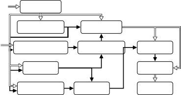

# A Meeting Transcription System for an Ad-Hoc Acoustic Sensor Network

Tobias Gburrek    Christoph Boeddeker    Thilo von Neumann    Tobias
Cord-Landwehr Affiliation: Joerg Schmalenstroeer, Reinhold Haeb-Umbach

###### Abstract

We propose a system that transcribes the conversation of a typical
meeting scenario that is captured by a set of initially unsynchronized
microphone arrays at unknown positions. It consists of subsystems for
signal synchronization, including both sampling rate and sampling time
offset estimation, diarization based on speaker and microphone array
position estimation, multi-channel speech enhancement, and automatic
speech recognition. With the estimated diarization information, a
spatial mixture model is initialized that is used to estimate beamformer
coefficients for source separation. Simulations show that the speech
recognition accuracy can be improved by synchronizing and combining
multiple distributed microphone arrays compared to a single compact
microphone array. Furthermore, the proposed informed initialization of
the spatial mixture model delivers a clear performance advantage over
random initialization.

^(†)^(†)address: Paderborn University, Germany ^(†)^(†)email: {gburrek,
boeddeker, vonneumann, cord, schmalen, haeb}@nt.upb.de

Index Terms: Meeting transcription, ad-hoc acoustic sensor network,
signal synchronization, diarization

## 1 Introduction

This contribution is concerned with the diarization and transcription of
meetings, where the considered meeting scenarios are characterized by
conversations between a small but unknown number of participants at
fixed positions. Of those, none, one or even two speakers may be active
at a time.

We here consider an ad-hoc acoustic sensor network (ASN) setup, where
multiple initially unsynchronized microphone arrays at unknown positions
are used for signal capture, which is different from most studies on
meeting diarization and recognition \[1\]. A notable exception is the
meeting transcription system presented in \[2\], that also utilizes
initially unsychronized distributed microphones. As mentioned there, the
microphones’ and the speakers’ position are typically not known
beforehand which complicates the usage of spatial information for speech
enhancement. Another problem making the usage of spatial information
more difficult arises from the required signal synchronization. Typical
signal synchronization systems, also the system presented in \[2\], do
not differentiate between the contribution of time shifts caused by
differing time of flights (ToFs) of a signal to the microphones and time
shifts caused by differing recording start times to the time difference
of arrival (TDoA) between two microphones. Thus, it is not guaranteed
that the estimated TDoAs between the synchronized signals correctly
reflect the time difference of flights (TDoFs) between the speakers’ and
the microphones’ positions and, therefore, carry spatial information.
Due to these facts the authors of \[2\] did not exploit any spatial
information for their speech enhancement subsystem and opted for a fully
blind speech enhancement.

Here, we build upon the idea of the signal synchronization system, we
proposed in \[3\], and support the signal synchronization by ToF
information in form of estimates of the distances between the
microphones and the speakers \[4\]. This enables to obtain synchronized
signals maintaining TDoAs which correctly represent the microphones’ and
speakers’ positions. Furthermore, a geometry calibration \[5\] is
performed to infer both the microphones’ and the speakers’ positions
from the microphone signals. Both, the physically correct signal
synchronization and the knowledge about the microphone and speaker
positions, are subsequently used to perform a multi-speaker tracking
based on steered-response power phase transform (SRP-PhaT) \[6\]. Since
the speakers’ positions also provide their identities for the considered
scenario assuming fixed speaker positions, the multi-speaker tracking
corresponds to a diarization which is also able to cope with overlapping
speech. The diarization estimate of who speaks when is then taken to
initialize a spatial mixture model \[7\], whose outcome in turn is used
to compute beamformer coefficients for source separation and signal
enhancement. Finally, the enhanced signals are forwarded to the speech
recognizer.

In simulations we show that the distributed nature of the ASN leads to
an improved source separation, diarization and meeting transcription
compared to a system utilizing a single microphone or a single compact
microphone array. Particularly, the usage of spatial diarization
information to initialize the spatial mixture model leads to an improved
speech enhancement compared to an uninformed initialization that sets
the initial values of the class posterior probabilities to draws from a
Dirichlet distribution. Moreover, the results demonstrate that the
proposed transcription system achieves nearly the same performance as a
system that uses oracle speaker activity information and perfectly
synchronous signals.

The remainder of the paper is structured as follows: In Section 2 the
considered meeting scenario is defined. Afterwards, the proposed meeting
transcription system for ad-hoc ASNs is introduced in Section 3. An
investigation of the proposed meeting transcription system is presented
in Section 4. Finally, we end with the conclusions drawn in Section 5.

## 2 Problem statement


Figure 1: Simulated recording setup including $`J{=}3`$ microphone
arrays at positions $`\bm{a}_{j}`$ with orientations
$`\theta_{j},\ j\in\{1,2,3\}`$, on a table. Figure not at scale; red
dots: microphones; dark blue dots: speakers; blue dot: $`i`$-th speaker
at position $`\bm{s}_{i}`$.

We consider a meeting scenario as shown in Fig. 1 with $`I`$ speakers
sitting at fixed but unknown positions $`\bm{s}_{i}`$,
$`i\in\{1,2,\dots,I\}`$, around a table in a reverberant room. Although
most of the time only one speaker is active, there are also quiet
periods and times when up to two speakers are active at the same time.
The meeting is recorded by an ad-hoc ASN formed by $`J`$ compact
microphone arrays. All microphone arrays are placed on a table at fixed
but unknown positions $`\bm{a}_{j}`$ with an orientation $`\theta_{j}`$
, $`j\in\{1,2,\dots,J\}`$. Each microphone array consists of $`M\geq 3`$
microphones that do not lie on a line. Moreover, we assume the
arrangement of the microphones within an array to be known.

Due to the independent hardware of the microphone arrays all arrays
start recording the meeting at a different point in time, causing a
sampling time offset (STO) $`T_{j}`$ \[3\]. Furthermore, the frequencies
of the clocks driving the sampling processes of the different microphone
arrays will slightly differ from the nominal sampling frequency
$`f_{s}`$ and also be time-varying such that all microphones of the
$`j`$-th microphone array are sampled with a sampling rate
$`f_{j}[n]{=}(1{+}\varepsilon_{j}[n]){\cdot}f_{s}`$ \[3\]. Here,
$`\varepsilon_{j}[n]`$ denotes the time-varying sampling rate offset
(SRO) of the $`j`$-th microphone array and $`n`$ the discrete-time
sample index.

Sampling the continuous-time signal $`y_{j,m}(t)`$ recorded by the
$`m`$-th sensor of the $`j`$-th microphone array gives the following
discrete-time signal \[3\]:

```math
\displaystyle y_{j,m}[n]=y_{j,m}\left(\frac{n}{f_{s}}{-}\frac{1}{f_{s}}{\cdot}\left(\smash[b]{\underbrace{{-}T_{j}\cdot f_{s}+\sum_{\tilde{n}=0}^{n-1}\varepsilon_{j}[\tilde{n}]}_{\coloneqq\tau_{j}[n]}}\right)\right),\vphantom{\underbrace{+T_{l}-\sum_{\tilde{n}=0}^{n-1}\frac{\varepsilon_{i}[\tilde{n}]}{f_{s}}}_{\coloneqq-\tau_{j}[n]/f_{s}}} \tag{1}
```

i.e., the sampling time of the $`n`$-th sample is shifted by
$`\tau_{j}[n]`$ $`\mathrm{s}\mathrm{a}\mathrm{m}\mathrm{p}\mathrm{l}\mathrm{e}\mathrm{s}`$
w.r.t. a signal sampled using a perfect clock
($`T_{j}{=}$0\text{\,}\mathrm{s}$`$,
$`\varepsilon\_{j}[n]{=}$0\text{\,}\mathrm{p}\mathrm{p}\mathrm{m}$`$).

## 3 Meeting transcription system

Figure 2 shows the block diagram of the proposed meeting transcription
system. As a first step, the signals recorded by different microphone
arrays are synchronized (blue blocks in Fig. 2). Next, a diarization
(red blocks in Fig. 2) is performed based on speaker position
information gathered from a multi-source localization. The resulting
speaker diary is utilized to initialize a multi-channel speech
enhancement system whose output is fed to the automatic speech
recognition (ASR) system (green blocks in Fig. 2).



Figure 2: Meeting transcription for ad-hoc ASNs. Double arrows: audio
signals; single arrows: estimated information

### 3.1 Signal synchronization

Without loss of generality, all signals are synchronized w.r.t. the
first microphone array. Moreover, we only use the first channel of the
microphone arrays to estimate their SROs and STOs w.r.t. the first
microphone array. First, the signals are coarsely synchronized based on
the maximum of the cross-correlation between the first
$`20\text{\,}\mathrm{s}`$ of the signals \[3\]. This is to ensure that
the $`\ell`$-th signal frames which are extracted from microphones
belonging to different arrays in the following subsystems of the
transcription system, roughly contain the same segment of the source
signal. Afterwards the SROs and STOs between the microphone arrays are
estimated and compensated. We employ the dynamic weighted average
coherence drift (DWACD) method, which we proposed in \[3\], for SRO
estimation. To compensate for the SROs we utilize the STFT-resampling
method from \[8\].

#### 3.1.1 Sampling time offset

The time-difference of arrival (TDoA) between the signals recorded at
two microphones from different microphone arrays is the sum of two
contributions: the TDoF caused by the differences in distance between
the speaker and the microphones, and the STO that reflects the different
start times of the recording at microphone arrays. Here, we intend to
use spatial information for diarization and therefore wish to compensate
only for the STO and keep the TDoFs unmodified \[3\]. After compensating
for the SRO, the TDoA between the first channel of the $`j`$-th
microphone array and the reference channel, i.e., the first channel of
the first microphone, is given by

```math
\displaystyle\tau_{1,j,i}=\frac{d_{j,1,i}-d_{1,1,i}}{c}-\left(T_{j}-T_{1}\right)=\delta_{1,j,i}-T_{1,j}, \tag{2}
```

if the $`i`$-th speaker is active \[3\]. Here, $`c`$ denotes the speed
of sound and $`d_{j,m,i}`$ is the distance between the $`i`$-th speaker
and the $`m`$-th microphone of the $`j`$-th microphone array. In (2),
the fraction corresponds to the TDoF and the term in parentheses,
$`T_{1,j}{=}\left(T_{j}-T_{1}\right)`$, to the STO.

The least squares (LS)-based STO estimator from \[3\] does not account
for unbalanced activities of the speakers such that a speaker who speaks
more has a larger influence on the STO estimate. Therefore, value pairs
consisting of a frame-wise TDoF estimate
$`\widehat{\delta}_{1,j}[\ell]`$, which results from the distance
estimates, and the corresponding TDoA estimate
$`\widehat{\tau}_{1,j}[\ell]`$ for the same frame, are clustered to
summarize frames belonging to the same speaker position. To do so,
first, the frame-wise pairs are clustered on the basis of the TDoA
estimates $`\widehat{\tau}_{1,j}[\ell]`$. Subsequently, the frame-wise
estimates within each time shift cluster are clustered on the basis of
the TDoF stimates $`\widehat{\delta}_{1,j}[\ell]`$. Each tuple of TDoF
cluster and corresponding time shift cluster now represents an STO
candidate (see (2)). Finally, these tuples are clustered on the basis of
the associated STO value. The STO estimate is given by the STO value
belonging to the cluster with the highest cardinality.

We employ the generalized cross-correlation with phase transform
(GCC-PhaT) \[9\] to estimate the TDoA. The distances between the
speakers and the microphone arrays are estimated using the deep neural
network based estimator from \[4\]. To compensate for the SRO, the shift
of the analysis window of both estimators is adapted in the same way as
in the weighted average coherence drift (WACD) method (see \[3\]).

### 3.2 Spatial meeting diarization

Assuming fixed speaker positions, the positions of the active speakers
provide their identity. Meeting diarization can thus be performed by a
speaker localization system. We employ SRP-PhaT because it is able to
localize multiple simultaneously active acoustic sources. However,
SRP-PhaT requires the knowledge of the relative position between the
microphone arrays, which first needs to be estimated. Thus, the first
step is a geometry calibration, i.e., the estimation of the positions
$`\bm{a}_{j}`$ and orientations $`\theta_{j}`$ of the microphone arrays,
which we achieve using the iterative data set matching method described
in  \[5\]. The iterative data set matching method takes direction of
arrival (DoA) estimates obtained using the complex Watson kernel
method \[10\] and estimates of the distances between the speaker and the
microphone arrays as input.

In addition to the geometry of the ASN, the iterative data set matching
method also provides robust estimates of the speakers’ positions
$`\widehat{\bm{s}}_{i}`$ \[5\]. Those are used to support the
multi-source localization. On the one hand, the speaker position
estimates $`\widehat{\bm{s}}_{i}`$ are utilized for a robust
single-speaker tracking whose results are subsequently refined using
SRP-PhaT to be able to cope with speaker overlap. On the other hand,
these estimates are used as a-priori knowledge for SRP-PhaT to limit the
number of grid points searched for speaker activity.

For single speaker-tracking, the frame-wise speaker activity is
estimated using an energy-based voice activity detection (VAD). If
speech is detected in the $`\ell`$-th frame, the DoA and distance
estimates for the $`\ell`$-th frame are utilized together with the
estimate of the geometry of the ASN to obtain the speaker position
estimate $`\widehat{\bm{s}}[\ell]`$ (median of the positions w.r.t. the
coordinate system of the single microphone arrays, which are estimated
from the DoA and distance, after being mapped to the global coordinate
system \[5\]). The speaker at position $`\widehat{\bm{s}}_{i}`$ is
declared to be active for the $`\ell`$-th frame if
$`\widehat{\bm{s}}_{i}`$ is the nearest speaker position estimate w.r.t.
$`\widehat{\bm{s}}[\ell]`$ and if the distance between
$`\widehat{\bm{s}}[\ell]`$ and $`\widehat{\bm{s}}_{i}`$ is below a given
threshold. This results in a first frame-wise activity estimate
$`\widehat{a}_{i}[\ell]`$ for each speaker.

In a second step SRP-PhaT, i.e., a multi-speaker tracking method, is
used to add the activity of any additional active speakers in a time
frame to the activity estimates $`\widehat{a}_{i}[\ell]`$. SRP-PhaT is
based on the calculation of the steered response power
$`P[\ell,\widehat{\bm{s}}_{u}^{\text{SRP}}]`$ \[6\] for a set of $`U`$
speaker position candidates $`\widehat{\bm{s}}_{u}^{\text{SRP}}`$,
$`u\in\{1,2,\dots,U\}`$, by accumulating the pair-wise GCC-PhaT values
of all microphone pairs, where the GCC-PhaT functions are evaluated at
the time lag corresponding to the theoretical TDoFs belonging to the
position $`\widehat{\bm{s}}_{u}^{\text{SRP}}`$.

Due to errors of the SRO or STO estimates, small time shifts might
remain between the signals after synchronization in addition to the
TDoFs. To account for these time shifts a grid of positions around each
position estimate $`\widehat{\bm{s}}_{i}`$ is used rather than using a
single position candidate for each speaker position estimate
$`\widehat{\bm{s}}_{i}`$. Afterwards, the steered response powers for
each position within each grid belonging to the speaker position
$`\widehat{\bm{s}}_{i}`$ are accumulated, leading to the power
$`P_{\text{total}}[\ell,\widehat{\bm{s}}_{i}]`$. A speaker at position
$`\widehat{\bm{s}}_{i}`$ is declared to be active in time frame $`\ell`$
in addition to an already detected speaker if the power
$`P_{\text{total}}[\ell,\widehat{\bm{s}}_{i}]`$ is larger than a given
threshold. Finally, the activity estimates $`\widehat{a}_{i}[\ell]`$ are
temporally smoothed.

### 3.3 Source separation

Each speaker is now modeled by a component of a spatial mixture model.
Additionally, a noise class is introduced that is assumed to be always
active. The diarization estimates $`\widehat{a}_{i}[\ell]`$ are taken as
time-varying class priors \[11\] of spatial mixture models \[7\], one
for each frequency bin with shared class priors, after normalization:

```math
\displaystyle\pi_{i}[\ell]=\frac{\widehat{a}_{i}[\ell]}{\sum\limits_{\nu=1}^{I+1}\widehat{a}_{\nu}[\ell]}. \tag{3}
```

The mixture models are now initialized by taking these priors to be the
initial frequency-independent class posterior probabilities
$`\gamma_{i}[\ell,k]`$, where $`k\in\{1,\ldots,K\}`$ is the frequency
index. The parameters of the mixture models are then optimized with the
EM algorithm. After convergence, the class posterior probability
$`\gamma_{i}[\ell,k]`$ denotes the probability for source $`i`$ to be
active at a given time-frame $`\ell`$ and frequency bin $`k`$.

Furthermore, the prior probabilities $`\pi_{i}[\ell]`$, after some
temporal smoothing, are used to cut the meeting into segments and remove
the noise class. The posterior probabilities $`\gamma_{i}[\ell,k]`$ are
used to extract the target speakers speech of a segment with a
convolutional beamformer \[12, 13\]. The posterior of the target speaker
is used as the target mask, while the sum of all remaining class
posteriors are used as distortion mask.

## 4 Experiments

We used a data set of $`100`$ simulated meeting scenarios to evaluate
the proposed meeting transcription system. For each scenario, a
conference room, whose setup is visualized in Fig. 1, was modeled
according to the following scheme: First, the length $`L_{T}`$ and width
$`W_{T}`$ of a rectangular conference table are drawn at random from
uniform densities:
$`L_{T}{\sim}\mathcal{U}($1.5\text{\,}\mathrm{m}$,$3.0\text{\,}\mathrm{m}$)`$;
$`W\_{T}{\sim}\mathcal{U}($1.5\text{\,}\mathrm{m}$,$3.0\text{\,}\mathrm{m}$)`$.
Afterwards, $`I{\sim}\mathcal{U}(3,6)`$ speaker positions are placed
around the table so that a distance between $`0\text{\,}\mathrm{m}`$ and
$`0.4\text{\,}\mathrm{m}`$ to the edge of the table and a minimum
distance of $`0.5\text{\,}\mathrm{m}`$ between the speakers is
guaranteed. The $`J{=}3`$ microphone arrays, consisting of $`M{=}4`$
microphones each and forming a square with $`5\text{\,}\mathrm{cm}`$
long edges, are placed on the table with random orientations and
positions so that they are not colinear (avoidance of end-fire
constellations) and have a minimum distance of
$`0.2\text{\,}\mathrm{m}`$ from the edges of the table and from each
other. Finally, the table is randomly rotated and placed in a room,
whose length and width are drawn from
$`\mathcal{U}($5\text{\,}\mathrm{m}$,$7\text{\,}\mathrm{m}$)`$ each,
such that a minimum distance of $`1\text{\,}\mathrm{m}`$ to each wall is
maintained. All simulated rooms have a height of
$`3\text{\,}\mathrm{m}`$ and a reverberation time randomly drawn from
$`\mathcal{U}($0.2\text{\,}\mathrm{s}$,$0.5\text{\,}\mathrm{s}$)`$. The
microphone arrays and speakers are placed on a two-dimensional plane at
a height of $`1.6\text{\,}\mathrm{m}`$.

For each conference room setup, a meeting of
$`5\text{\,}\mathrm{m}\mathrm{i}\mathrm{n}`$ duration was simulated.
Firstly, a set of speakers is randomly drawn from the eval92 WSJ
database \[14\] and assigned to the speaker positions. Subsequently, a
meeting is generated based on the set of speakers such that the speaking
portions of all speakers are approximately equal. Hereby, regions of a
single speaker being active amount for $`66\text{\,}\%`$ of the total
duration, while two speakers are concurrently active for
$`21\text{\,}\%`$ of the time, and in the remaining time there is no
speech activity. All recordings were reverberated via the image
method \[15\] using the implementation of \[16\] and overlaid with an
additive white sensor noise with an average signal-to-noise ratio (SNR)
drawn from
$`\mathcal{U}($20\text{\,}\mathrm{d}\mathrm{B}$,$30\text{\,}\mathrm{d}\mathrm{B}$)`$.
The nominal sampling frequency of the meeting data is
$`f\_{s}{=}$16\text{\,}\mathrm{kHz}$`$. Finally, an STO, which is drawn
from $`\mathcal{U}($0\text{\,}\mathrm{s}$,$2\text{\,}\mathrm{s}$)`$, and
a time-varying SRO, whose average value is drawn from
$`\mathcal{U}($-100\text{\,}\lx@glossaries@gls@link{acronym}{ppm}{{{}}ppm}$,$100\text{\,}\lx@glossaries@gls@link{acronym}{ppm}{{{}}ppm}$)`$,
are generated (see \[3\] for more details). The SRO is simulated using
the STFT-resampling method from \[8\].

### 4.1 Baselines

As two baselines we employ a single-channel system and a system solely
using a single compact microphone array. The single-channel baseline
system corresponds to the baseline system used in \[1\] consisting of a
mask-based source separator followed by a diarization module. The mask
estimator in the separation model is a BLSTM with three layers, each
with 600 units in each direction, followed by two fully connected
layers. The network is trained with the Graph-PIT \[17\] training scheme
with the SA-tSDR \[18\] loss to produce two output streams that no
longer contain speech overlaps. During evaluation, the meeting data is
cut into temporally overlapping segments, and a stitching approach
\[19\] is used to concatenate the segments to the original meeting
length. After separation, an energy-based VAD is used to extract
single-speaker segments for diarization from both output streams. A
256-dimensional speaker embedding is extracted for each segment. Then,
these embeddings are clustered with an agglomerative hierarchical
clustering scheme to assign each segment to a speaker. The embedding
extractor is a ResNet34 trained on the VoxCeleb dataset \[20\] as
described in \[21\].

The single-array baseline corresponds to a modified version of the
proposed meeting transcription system. Since a single array is used, the
signal synchronization and geometry calibration systems are not needed,
here. Furthermore, the proposed diarization system is based on the
distributed fashion of the ASN. Therefore, the spatial mixture model of
the single-array baseline is initialized based on the estimated relative
speaker positions w.r.t. the local coordinate system of the microphone
array following from the DoA and speaker-array distance estimates.
First, the relative source position estimates are clustered leading to a
set of speaker position candidates. Afterwards, an energy-based VAD is
used to detect in which frames a speaker is active. For all frames with
speech activity the speaker at the speaker position candidate which is
closest to the relative speaker position estimate of the frame is
decided to be active. Finally, the activity estimates are smoothed over
time for each speaker position candidate.

### 4.2 Performance measures

We use the diarization error rate (DER) \[22\] to evaluate the
performance of the proposed spatial diarization method. Since the
diarization system relies on the signal synchronization and the speaker
localization performance, the DER indirectly reflects the performance of
the corresponding subsystems. We use a collar of
$`0.25\text{\,}\mathrm{s}`$ according to the specifications in \[22\].

In order to evaluate the source separation performance of our system we
use the concatenated minimum-permutation word error rate (cpWER) \[23\]
as metric. The ASR results are obtained using the acoustic model from
\[24\] that is openly available for a sampling rate of
$`8\text{\,}\mathrm{kHz}`$. To be able to use it, the separated signals
are downsampled after synchronization and diarization instead of
retraining the model for $`16\text{\,}\mathrm{kHz}`$. We use an oracle
diarization system to be able to compute the cpWER for the
single-channel baseline system.

|                      |         |            |           |                                |
| -------------------- | ------- | ---------- | --------- | ------------------------------ |
| \topruleSystem       | Sync.   | MM Init.   | DER / %   | WER / %                        |
| \midruleOracle Sep.  | —       | —          | $`0.00`$  | $`8.598`$                      |
| \midruleSingle-Ch.   | —       | —          | $`24.15`$ | $`29.01`$                      |
| \midruleSingle-Array | —       | Oracle     | —         | $`16.336\,184\,188\,403\,036`$ |
| Single-Array         | —       | Est.       | $`22.54`$ | $`22.090\,950\,870\,388\,845`$ |
| \midruleMulti-Array  | Perfect | Oracle     | —         | $`13.916\,133\,298\,958\,672`$ |
| Multi-Array          | Perfect | Dirichlet  | —         | $`15.758\,914\,059\,610\,146`$ |
| Multi-Array          | Perfect | Est.       | $`7.35`$  | $`14.194\,119\,691\,076\,412`$ |
| \midruleMulti-Array  | Coarse  | Oracle     | —         | $`19.633\,909\,856\,186\,88`$  |
| Multi-Array          | Est.    | Oracle     | —         | $`13.986\,750\,809\,859\,55`$  |
| \midruleMulti-Array  | Est.    | Dirichlet. | —         | $`15.512\,313\,227\,892\,796`$ |
| Multi-Array          | Est.    | Est.       | $`7.47`$  | $`14.232\,230\,728\,705\,458`$ |
| \bottomrule          |         |            |           |                                |

Table 1: Diarization and transcription performance

### 4.3 Single-channel vs. single-array vs. multi-array

Table 1 compares the proposed multi-array meeting transcription system
with the single-channel and single-array baselines. It can be seen that
a better diarization as well as a better transcription can be achieved
utilizing a set of distributed microphone arrays rather than a single
compact microphone array. In particular, the DER can be significantly
reduced. This can be explained by the fact that the single-channel
diarization suffers from errors in the single-channel source separation,
while the single-array localization is unable to cope with overlap
regions and is more unstable due to a lack of spatial diversity.

A comparison of the achieved word error rates (WERs) reflects these
limitation of the system utilizing a single microphone or a single
microphone array, too. It becomes apparent that the transcription
performance of the proposed multi-array system, which uses signals
synchronized based on the estimated SRO and STO (Est. Sync.) and the
diarization results, is close to the performance of a multi-array
system, which uses perfectly synchronous signals (Perfect Sync.) and the
oracle activities of the speakers. Furthermore, the need to compensate
for an SRO is shown by the fact that the performance of the multi-array
system strongly deteriorates if the signals are only coarsely aligned
based on the maximum of their cross-correlations over the complete
meeting (Coarse Sync.).

### 4.4 Informed mixture model initialization

Table 1 further compares the performance of the proposed system to one
that draws the initial values of the class posteriors of the mixture
model at random from a Dirichlet distribution, while being otherwise
identical to the proposed system. It can be seen that an informed
initialization with the estimated diarization improves the WER from
15.51% to 14.23%.

## 5 Conclusions and outlook

We presented a system for meeting diarization and transcription for an
ad-hoc acoustic sensor network consisting of multiple initially
unsynchronized microphone arrays. A key property of the system is that
the synchronization and geometry estimation front-end delivers precise
diarization information, which is used to ease the task of the
subsequent enhancement stage. Simulations have shown that the proposed
multi-array system is able to outperform a single-array system. In
future work we intend to remove the assumption of fixed speaker
positions by combining spatial with spectral signatures of the speakers.

## 6 Acknowledgements

Computational resources were provided by the Paderborn Center for
Parallel Computing. Funded by the Deutsche Forschungsgemeinschaft (DFG,
German Research Foundation) - Projects 282835863 and 448568305.

## References

- \[1\] D. Raj, P. Denisov, Z. Chen, H. Erdogan, Z. Huang, M. He,
  S. Watanabe, J. Du, T. Yoshioka, Y. Luo, N. Kanda, J. Li, S. Wisdom,
  and J. R. Hershey, “Integration of speech separation, diarization, and
  recognition for multi-speaker meetings: System description,
  comparison, and analysis,” in _2021 IEEE Spoken Language Technology
  Workshop (SLT)_, 2021, pp. 897–904.
- \[2\] S. Araki, N. Ono, K. Kinoshita, and M. Delcroix, “Meeting
  recognition with asynchronous distributed microphone array using
  block-wise refinement of mask-based mvdr beamformer,” in _IEEE
  International Conference on Acoustics, Speech and Signal Processing
  (ICASSP)_, 2018, pp. 5694–5698.
- \[3\] T. Gburrek, J. Schmalenstroeer, and R. Haeb-Umbach, “On
  synchronization of wireless acoustic sensor networks in the presence
  of time-varying sampling rate offsets and speaker changes,” in _IEEE
  International Conference on Acoustics, Speech and Signal Processing
  (ICASSP)_, 2022.
- \[4\] ——, “On source-microphone distance estimation using
  convolutional recurrent neural networks,” in _Proc. 14th ITG-Symposium
  Speech Communication_, 2021.
- \[5\] ——, “Geometry calibration in wireless acoustic sensor networks
  utilizing doa and distance information,” _EURASIP Journal on Audio,
  Speech, and Music Processing_, 2021.
- \[6\] J. H. DiBiase, H. F. Silverman, and M. S. Brandstein, _Robust
  Localization in Reverberant Rooms_. Berlin, Heidelberg: Springer
  Berlin Heidelberg, 2001, pp. 157–180. \[Online\]. Available:
  https://doi.org/10.1007/978-3-662-04619-7_8
- \[7\] N. Ito, S. Araki, and T. Nakatani, “Complex angular central
  gaussian mixture model for directional statistics in mask-based
  microphone array signal processing,” in _2016 24th European Signal
  Processing Conference (EUSIPCO)_. IEEE, 2016, pp. 1153–1157.
- \[8\] J. Schmalenstroeer and R. Haeb-Umbach, “Efficient sampling rate
  offset compensation - an overlap-save based approach,” in _26th
  European Signal Processing Conference (EUSIPCO 2018)_, 2018.
- \[9\] C. H. Knapp and G. C. Carter, “The Generalized Correlation
  Method for Estimation of Time Delay,” _IEEE Transactions on Acoustics,
  Speech, and Signal Processing_, vol. 24, no. 4, pp. 320–327, 1976.
- \[10\] L. Drude, F. Jacob, and R. Haeb-Umbach, “Doa-estimation based
  on a complex watson kernel method,” in _2015 23rd European Signal
  Processing Conference (EUSIPCO)_, 2015, pp. 255–259.
- \[11\] N. Ito, S. Araki, and T. Nakatani, “Permutation-free
  convolutive blind source separation via full-band clustering based on
  frequency-independent source presence priors,” in _2013 IEEE
  International Conference on Acoustics, Speech and Signal
  Processing_. IEEE, 2013, pp. 3238–3242.
- \[12\] C. Boeddeker, T. Nakatani, K. Kinoshita, and R. Haeb-Umbach,
  “Jointly optimal dereverberation and beamforming,” in _ICASSP
  2020-2020 IEEE International Conference on Acoustics, Speech and
  Signal Processing (ICASSP)_. IEEE, 2020, pp. 216–220.
- \[13\] T. Nakatani, C. Boeddeker, K. Kinoshita, R. Ikeshita,
  M. Delcroix, and R. Haeb-Umbach, “Jointly optimal denoising,
  dereverberation, and source separation,” _IEEE/ACM Transactions on
  Audio, Speech, and Language Processing_, vol. 28, pp. 2267–2282, 2020.
- \[14\] D. B. Paul and J. M. Baker, “The design for the wall street
  journal-based csr corpus,” in _DARPA Speech and Language
  Workshop_. Morgan Kaufmann Publishers, 1992.
- \[15\] J. Allen and D. Berkley, “Image method for efficiently
  simulating small-room acoustics,” _The Journal of the Acoustical
  Society of America_, vol. 65, pp. 943–950, 04 1979.
- \[16\] E. A. Habets, “Room impulse response generator,” _Technische
  Universiteit Eindhoven, Tech. Rep_, vol. 2, no. 2.4, p. 1, 2006.
- \[17\] T. von Neumann, K. Kinoshita, C. Boeddeker, M. Delcroix, and
  R. Haeb-Umbach, “Graph-PIT: Generalized permutation invariant training
  for continuous separation of arbitrary numbers of speakers,” in
  _Interspeech_. ISCA, 2021.
- \[18\] ——, “SA-SDR: A Novel Loss Function for Separation of Meeting
  Style Data,” in _ICASSP 2022_, 2022.
- \[19\] Z. Chen, T. Yoshioka, L. Lu, T. Zhou, Z. Meng, Y. Luo, J. Wu,
  X. Xiao, and J. Li, “Continuous speech separation: Dataset and
  analysis,” in _ICASSP 2020 - 2020 IEEE International Conference on
  Acoustics, Speech and Signal Processing (ICASSP)_, 2020, pp.
  7284–7288.
- \[20\] A. Nagrani, J. S. Chung, W. Xie, and A. Zisserman, “Voxceleb:
  Large-scale speaker verification in the wild,” _Computer Science and
  Language_, 2019.
- \[21\] T. Zhou, Y. Zhao, and J. Wu, “Resnext and res2net structures
  for speaker verification,” in _2021 IEEE Spoken Language Technology
  Workshop (SLT)_, 2021, pp. 301–307.
- \[22\] NIST, “The 2009 (RT-09) rich transcription meeting recognition
  evaluation plan,” http://www.itl.nist.gov/iad/mig/tests/rt/
  2009/docs/rt09-meeting-eval-plan-v2.pdf, 2009.
- \[23\] S. Watanabe, M. Mandel, J. Barker, E. Vincent, A. Arora,
  X. Chang, S. Khudanpur, V. Manohar, D. Povey, D. Raj, D. Snyder, A. S.
  Subramanian, J. Trmal, B. B. Yair, C. Boeddeker, Z. Ni, Y. Fujita,
  S. Horiguchi, N. Kanda, T. Yoshioka, and N. Ryant, “CHiME-6 Challenge:
  Tackling Multispeaker Speech Recognition for Unsegmented Recordings,”
  in _Proc. 6th International Workshop on Speech Processing in Everyday
  Environments (CHiME 2020)_, 2020, pp. 1–7.
- \[24\] L. Drude, J. Heitkaemper, C. Boeddeker, and R. Haeb-Umbach,
  “SMS-WSJ: Database, performance measures, and baseline recipe for
  multi-channel source separation and recognition,” _arXiv preprint
  arXiv:1910.13934_, 2019.
