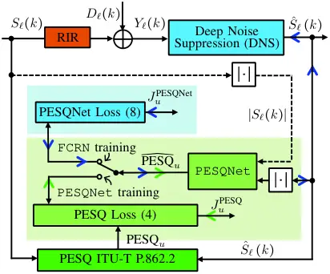

# Does a PESQNet (Loss) Require a Clean Reference Input? The Original PESQ Does, But ACR Listening Tests Don’t

###### Abstract

Perceptual evaluation of speech quality (PESQ) requires a clean speech
reference as input, but predicts the results from (reference-free)
absolute category rating (ACR) tests. In this work, we train a fully
convolutional recurrent neural network (FCRN) as deep noise suppression
(DNS) model, with either a non-intrusive or an intrusive PESQNet, where
only the latter has access to a clean speech reference. The PESQNet is
used as a mediator providing a perceptual loss during the DNS training
to maximize the PESQ score of the enhanced speech signal. For the
intrusive PESQNet, we investigate two topologies, called early-fusion
(EF) and middle-fusion (MF) PESQNet, and compare to the non-intrusive
PESQNet to evaluate and to quantify the benefits of employing a clean
speech reference input during DNS training. Detailed analyses show that
the DNS trained with the MF-intrusive PESQNet outperforms the
Interspeech 2021 DNS Challenge baseline and the same DNS trained with an
MSE loss by $`0.23`$ and $`0.12`$ PESQ points, respectively.
Furthermore, we can show that only marginal benefits are obtained
compared to the DNS trained with the non-intrusive PESQNet. Therefore,
as ACR listening tests, the PESQNet does not necessarily require a clean
speech reference input, opening the possibility of using real data for
DNS training.

|                                                                                       |
| ------------------------------------------------------------------------------------- |
| Ziyi Xu, Maximilian Strake, Tim Fingscheidt                                           |
| Institute for Communications Technology, Technische Universität Braunschweig, Germany |
| $`\left\{\text{ziyi.xu, m.strake, t.fingscheidt}\right\}`$@tu-bs.de                   |

Index Terms—  Deep noise suppression, intrusive / non-intrusive PESQ
estimation, convolutional recurrent neural network

## 1 Introduction

Speech quality is an important factor in evaluating speech enhancement
algorithms, typically measured through subjective listening tests or by
instrumental measurements such as perceptual evaluation of speech
quality (PESQ) \[1\] or perceptual objective listening quality
assessment (POLQA)\[2\]. However, obtaining listening scores through
subjective listening tests can be time-consuming and expensive. Although
the software requires a clean speech reference signal, PESQ \[1\] is
designed to predict absolute category rating (ACR) listener scores and
is a widely used instrumental measure.

Speech enhancement algorithms employing deep neural networks (DNNs) have
attracted a lot of research attention in recent years \[3, 4, 5, 6, 7,
8, 9, 10\], and are subsumed under the term deep noise suppression
(DNS). During the training process, most of the DNS architectures are
trained with a mean squared error (MSE) loss, which does not guarantee
good human perceptual quality of the enhanced speech signal \[11, 12,
13, 14, 15, 16, 17, 18, 19, 20\]. To mitigate this problem, a
straightforward solution could be to directly adapt PESQ as a loss
function. However, the original PESQ implements a non-differentiable
function, which cannot directly be used as an optimization criterion for
gradient-based deep learning. Martín-Doñas et al. proposed an
approximated differentiable PESQ formulation as the optimization
criterion \[14\], however, not exploiting the full potential of PESQ as
a loss, as other simple psychoacoustic losses turned out to perform
superior on the PESQ metric \[16\]. Fu et al. \[17\] trained an
end-to-end neural network (so-called Quality-Net) to approximate the
PESQ function. Afterwards, the trained Quality-Net is fixed to estimate
the PESQ scores of the enhanced speech, serving as a differentiable PESQ
loss for the training of a DNS model. However, as reported by the
authors of \[17\], the gradient obtained from the fixed Quality-Net
after training for several minibatches, leading to the Quality-Net being
fooled by the updated DNS model: Estimated PESQ scores increase while
true PESQ scores decrease. Please note that like the original PESQ
\[1\], both \[14, 17\] require a clean speech reference signal.

In our recent works \[19, 20\], we proposed an end-to-end non-intrusive
PESQNet, which is adapted from a speech emotion recognition DNN proposed
in \[21\], to model the PESQ function without knowing the corresponding
clean speech (like human raters in ACR listening tests). Subsequently,
the trained PESQNet is employed as a mediator during the training of a
DNS model aiming at maximizing the PESQ score of the enhanced speech
signal. In \[20\], we proposed a successful training protocol to train
the DNS and the PESQNet alternatively on an epoch level to keep the
PESQNet up-to-date. Therefore, the PESQNet can always adapt to the
current updated DNS model, which solves the problems addressed in
\[17\]. Only for a simple four-layer PESQ-estimating CNN (with two final
fully-connected layers), Gamper et al. have shown that an extra clean
speech reference input channel (“early fusion”) is helpful \[22\]. As
PESQ performs middle fusion, it is an open question, whether a DNS model
trained with a more powerful intrusive PESQNet (early or middle fusion?)
would perform better than trained with a powerful non-intrusive PESQNet.

In this work, our contributions are threefold: First, we train a fully
convolutional recurrent neural network (FCRN) \[8\] as our DNS model
with either an intrusive or a non-intrusive PESQNet on the same training
dataset constructed from the Interspeech 2021 DNS Challenge \[23\].
Second, for the intrusive PESQNet employing the clean speech reference
input, we investigate two topologies, called early-fusion and
middle-fusion PESQNet, respectively. Finally, we perform an extensive
analysis and experimental evaluation on the trained DNS models to
evaluate the effects of using the additional clean speech reference and
show that without any significant disadvantage a non-intrusive PESQNet
can be employed to optimize a DNS model for PESQ. This keeps the door
open for training of DNS models on real data — which, beyond PESQNet
\[19, 20\], was so far only shown with generative adversarial networks
(GANs) \[24, 25, 26\].

The rest of the paper is structured as follows: Section 2 introduces
notations and the speech enhancement system. The PESQNet losses provided
by intrusive or non-intrusive PESQNet are presented in Section 3. We
explain the experimental setup and discuss the results in Section 4,
concluding the work in Section 5.

## 2 Signal Model and Notations

Fig. 1: Employed PESQNet as used in Fig. 2. For the non-intrusive and
the MF-intrusive PESQNet, the number of input channels is set to
$`C\!=\!1`$, while $`C\!=\!2`$ holds for the EF-intrusive PESQNet. The
element-wise factor $`\mathbf{x}`$ is set to an all-ones tensor for
non-intrusive and EF-intrusive PESQNet. For the MF-intrusive PESQNet,
$`\mathbf{x}`$ is computed from
$`\left|S_{\ell}(k)\right|\!-\!\left|\hat{S}_{\ell}(k)\right|`$ as
additional reference input.

We assume the microphone mixture $`y(n)`$ to be constructed from the
clean speech signal $`s(n)`$ reverberated by the room impulse response
(RIR) $`h(n)`$, and disturbed by additive noise $`d(n)`$ as

```math
\vskip-2.84526pty(n)=s(n)*h(n)+d(n)=s^{\text{rev}}(n)+d(n), \tag{1}
```

with $`s^{\text{rev}}(n)`$ and $`n`$ being the reverberated clean speech
signal and the discrete-time sample index, respectively, and $`*`$
denoting a convolution operation. Afterwards, all the signals are
transformed to the discrete Fourier transform (DFT) domain:

```math
\vskip-2.84526ptY_{\ell}(k)=S^{\text{rev}}_{\ell}(k)+D_{\ell}(k),\vskip-2.84526pt \tag{2}
```

with frame index $`\ell`$, frequency bin index
$`k\!\in\!\mathcal{K}\!=\!\left\{0,1,\ldots,K\!-\!1\right\}`$, and $`K`$
being the DFT size. Our employed DNS is the FCRN from \[8\], which
delivers a magnitude-bounded complex mask
$`M_{\ell}\left(k\right)\in\mathbb{C}`$, with
$`\left|M_{\ell}\left(k\right)\right|\in\left[0,1\right]`$ for spectrum
enhancement \[10\]. Therefore, the enhanced speech spectrum is obtained
by:

```math
\vskip-2.84526pt\hat{S}_{\ell}\left(k\right)=Y_{\ell}(k)\cdot M_{\ell}\left(k\right).\vskip-2.84526pt \tag{3}
```

Finally, the enhanced speech spectrum $`\hat{S}_{\ell}\left(k\right)`$
is subject to an inverse DFT (IDFT), followed by overlap add (OLA) to
reconstruct the estimated signal $`\hat{s}(n)`$.

## 3 PESQNet Loss — Intrusive and Non-Intrusive

In this work, we employ an end-to-end intrusive or non-intrusive PESQNet
to model ITU-T P862.2 PESQ \[1\]. The employed PESQNet aims at
estimating the PESQ score of an entire enhanced speech utterance in the
DFT domain. Therefore, the PESQNet’s estimation
$`\widehat{\text{PESQ}}_{u}`$ for the utterance indexed with $`u`$
should be close to its ground truth $`\text{PESQ}_{u}`$ measured by
ITU-T P.862.2 \[1\]. Thus, the “PESQ loss” used for training the PESQNet
is (see Fig. 2):

```math
J^{\text{PESQ}}_{u}\!=\left(\widehat{\text{PESQ}}_{u}-\text{PESQ}_{u}\right)^{2}. \tag{4}
```

### 3.1 Non-Intrusive PESQNet

In our recent works \[19, 20\], we have proposed the non-intrusive
PESQNet as depicted in Fig. 1. The input of the non-intrusive PESQNet is
the enhanced amplitude spectrogram $`\left|\hat{S}_{\ell}(k)\right|`$,
with $`\ell\!\in\!\mathcal{L}_{u}\!=\!\left\{1,2,\ldots,L_{u}\right\}`$,
and $`L_{u}`$ being the number of frames for an entire utterance $`u`$.
Since the amplitude spectrogram $`\left|\hat{S}_{\ell}(k)\right|`$ is
used as input, the number of input channels is set to $`C=1`$ in Fig. 1.
The input is then grouped into several blocks indexed with
$`b\in\mathcal{B}_{u}=\left\{1,2\ldots,B_{u}\right\}`$. Each block has
the same dimension $`K_{\rm in}\!\times\!W\!\times\!1`$, with
$`K_{\rm in}`$ and $`W`$ being the number of input frequency bins and
frames per block, respectively. The convolutional layers are represented
by Conv$`(h\times w,f)`$, with $`f`$ representing the number of filter
kernels, and $`(h\times w)`$ being the kernel size. We employ maxpooling
layers with two different kernels of size $`(2\times 1)`$ and
$`(2\times 2)`$, respectively. The maxpooling-over-time layer and the
subsequent concatenation aim to deliver a feature map with a fixed
dimension to the bidirectional LSTM (BLSTM) layer with $`128`$ nodes.
Afterwards, four statistics (average, standard deviation, minimum, and
maximum) over blocks $`b`$ are applied to the BLSTM outputs. The
fully-connected (FC) layer is denoted as FC$`(N)`$, with $`N`$ being the
number of neurons. The singe-node output layer employs a gate function
$`\sigma(x)=3.6\cdot\text{sigmoid}(x)+1.04`$ to limit the range of the
estimated PESQ score between $`1.04`$ and $`4.64`$, as defined in the
original PESQ \[1\]. Please note that in Fig. 1, the element-wise factor
$`\mathbf{x}`$ is an all-ones tensor for the non-intrusive PESQNet.

### 3.2 Intrusive PESQNet

For the intrusive PESQNet, we investigate two different topologies for
employing the clean speech reference input, called early-fusion (EF) and
middle-fusion (MF) PESQNet, respectively. The idea of the EF-intrusive
PESQNet is very straightforward: the amplitude spectrograms of the
enhanced speech $`\left|\hat{S}_{\ell}(k)\right|`$ and its corresponding
clean speech reference $`\left|S_{\ell}(k)\right|`$ are employed as two
separate channels for the input of the PESQNet. Therefore, the number of
input channels is set to $`C=2`$ in Fig. 1. As with the non-intrusive
PESQNet, the input is grouped into several blocks with the same
dimensions for parallel processing, as illustrated in Fig. 1. For the
EF-intrusive PESQNet, the element-wise factor $`\mathbf{x}`$ is an
all-ones tensor.

Inspired by the original PESQ \[1\], we propose an MF-intrusive PESQNet,
which explicitly considers the differences between the degraded signal
and its corresponding clean reference signal during the PESQ score
estimation. Compared to the non-intrusive PESQNet, we introduce an
additional separate input branch, which explicitly uses the differences
$`\left|S_{\ell}(k)\right|\!-\!\left|\hat{S}_{\ell}(k)\right|`$ as
input. This separate differential-input branch has the same topology as
the main branch (Fig. 1) until reaching the element-wise multiplication,
but employs a sigmoid activation to ensure $`0\!\leq\!x\!\leq\!1`$ for
each element of tensor $`\mathbf{x}=(x)`$. Therefore, the additional
input branch is used to control how much information from the original
input of the enhanced speech spectrogram contributes to the final PESQ
score estimation.



Fig. 2: PESQNet and DNS joint training setup. The DNS and the PESQNet
are trained alternately, controlled by the switch in upper and lower
position, respectively. Colored arrows: gradient flow.

### 3.3 PESQNet Loss for DNS training

Building upon our recent works \[19, 20\], we employ the proposed
PESQNet to control the fine-tuning on a pre-trained DNS model to further
increase the perceptual quality of the enhanced speech signal.
Therefore, our employed DNS model is pre-trained employing the
utterance-wise loss function proposed in \[10\] including two MSE loss
terms. The first loss term aims at joint dereverberation and denoising
by employing the clean speech spectrum $`S_{\ell}(k)`$ as target:

```math
\vskip-2.84526ptJ^{\text{joint}}_{u}\!=\!\frac{1}{L_{u}\!\cdot\!K}\!\sum_{\ell\in\mathcal{L}_{u}}\sum_{k\in\mathcal{K}}\!\bigl|\hat{S}_{\ell}(k)\!-\!S_{\ell}(k)\bigr|^{2},\vskip-2.84526pt \tag{5}
```

with $`\mathcal{L}_{u}`$ being the set of frame indices for an utterance
indexed with $`u`$, and $`L_{u}`$ being its total number of frames. The
second loss term only focuses on denoising by employing the reverberated
clean speech spectrum $`S^{\text{rev}}_{\ell}(k)`$ as target:

```math
J^{\text{noise}}_{u}\!=\!\frac{1}{L_{u}\!\cdot\!K}\!\sum_{\ell\in\mathcal{L}_{u}}\sum_{k\in\mathcal{K}}\!\bigl|\hat{S}_{\ell}(k)\!-\!S^{\text{rev}}_{\ell}(k)\bigr|^{2}\!.\vskip-2.84526pt \tag{6}
```

Afterwards, the two loss terms (5) and (6) are combined into a joint
loss function as:

```math
J^{\text{MSE}}_{u}\!=\alpha\cdot J^{\text{joint}}_{u}+(1-\alpha)\cdot J^{\text{noise}}_{u}, \tag{7}
```

with $`\alpha=0.9`$ being the weighting factor to control the
dereverberation effect. Afterwards, the proposed PESQNet is pre-trained
employing the PESQ loss (4) with the enhanced speech signal obtained
from the fixed pre-trained DNS.

In the fine-tuning stage shown in Fig. 2, the pre-trained PESQNet is
applied to the output of the pre-trained DNS to estimate the PESQ scores
of the enhanced speech. Thus, we can define a “PESQNet loss” provided by
the proposed PESQNet to maximize the PESQ scores of the output enhanced
speech signal as:

```math
J^{\text{PESQNet}}_{u}\!=\left(\widehat{\text{PESQ}}_{u}-\text{PESQ}_{\text{max}}\right)^{2} \tag{8}
```

for utterance $`u`$, with $`\text{PESQ}_{\text{max}}\!=\!4.64`$, which
is minimized during DNS fine-tunning. We adopt the successful joint
training protocol proposed in \[20\] to fine-tune the DNS and the
PESQNet alternatingly on an epoch level to keep the PESQNet up-to-date,
which is controlled by the switch in the upper and lower positions, as
shown in Fig. 2. The blue and green arrows indicate the gradient flow
back-propagated for the DNS and PESQNet training, respectively. Please
note that in Fig. 2, the dashed clean reference signal exists only for
employing the intrusive PESQNet.

|     |                                    |                |        |      |                                         |             |        |      |      |
| --- | ---------------------------------- | -------------- | ------ | ---- | --------------------------------------- | ----------- | ------ | ---- | ---- |
|     | Methods                            | Without reverb |        |      |                                         | With reverb |        |      |      |
|     |                                    | PESQ           | DNSMOS | STOI | $`\Delta\text{SNR}_{\text{seg}}`$\[dB\] | PESQ        | DNSMOS | STOI | SRMR |
|     | Noisy                              | 2.21           | 3.15   | 0.91 | -                                       | 1.57        | 2.73   | 0.56 | -    |
|     | DNS3 Baseline \[9\]                | 3.15           | 3.64   | 0.94 | 6.30                                    | 1.68        | 3.18   | 0.62 | 6.33 |
|     | FCRN \[10\]                        | 3.37           | 3.82   | 0.96 | 8.35                                    | 1.95        | 3.08   | 0.63 | 7.25 |
|     | FCRN/PESQNet, non-intrusive \[20\] | 3.45           | 3.87   | 0.96 | 8.48                                    | 1.95        | 3.13   | 0.62 | 7.38 |
| NEW | FCRN/PESQNet, EF-intrusive         | 3.47           | 3.87   | 0.96 | 8.52                                    | 1.95        | 3.13   | 0.62 | 7.32 |
|     | FCRN/PESQNet, MF-intrusive         | 3.47           | 3.88   | 0.96 | 8.54                                    | 1.95        | 3.18   | 0.62 | 7.53 |

Table 1: Instrumental quality results on the development set
$`\mathcal{D}^{\mathrm{dev}}_{\mathrm{DNS1}}`$. Best results are in bold
font, and the second best are underlined.

## 4 Experiments and Discussion

### 4.1 Setup, Database, and Metrics

In this work, signals have a sampling rate of $`16\,\text{kHz}`$ and we
apply a periodic Hann window with frame length of $`384`$ with a
$`50\%`$ overlap, followed by an FFT with $`K=512`$. As introduced
before, we adopt the FCRN proposed in \[8\] as our DNS model. The number
of input and output frequency bins in Fig. 1 is set to
$`K_{\rm in}=260`$. The last three frequency bins are redundant for the
compatibility with the two maxpooling operations in the employed DNS
model from \[8\] and in the proposed PESQNet shown in Fig. 1. For the
PESQNet, the widths of the employed convolutional kernels are set to
$`w_{i}=2^{i-1}`$, $`i\in\left\{1,2,3,4\right\}`$. The number of frames
in each feature block shown in Fig. 1 is set to $`W=16`$.

For the DNS and PESQNet pre-training, we employ the same dataset
$`\mathcal{D}_{\text{WSJ0}}`$ as used in \[20\], which is synthesized
from the WSJ0 speech corpus \[27\] clean speech and noise from DEMAND
\[28\] and QUT \[29\]. Following \[20\], we perform two-stage
fine-tuning on the dataset constructed with files randomly chosen from
the official Interspeech 2021 DNS Challenge (dubbed DNS3) training
material \[23\]. This fine-tuning dataset contains $`100`$ hours of
training material $`\mathcal{D}^{\text{train}}_{\text{DNS3}}`$ and
$`10`$ hours of validation material
$`\mathcal{D}^{\text{val}}_{\text{DNS3}}`$, employing the same setting
used in \[20\]. The 1^(st)-stage fine-tuning of the DNS and PESQNet
employs the same loss as used in pre-training, but on
$`\mathcal{D}^{\text{train}}_{\text{DNS3}}`$. Afterwards, the DNS and
PESQNet are fine-tuned jointly on
$`\mathcal{D}^{\text{train}}_{\text{DNS3}}`$, utilizing the alternating
training protocol shown in Fig. 2. We use the preliminary synthetic test
set from the first Interspeech 2020 DNS Challenge (DNS1) \[30\] (dubbed
$`\mathcal{D}^{\text{dev}}_{\text{DNS1}}`$) for development. The final
evaluation is reported on the synthetic test set from the ICASSP 2020
DNS Challenge (DNS2) \[31\] (dubbed
$`\mathcal{D}^{\mathrm{test}}_{\mathrm{DNS2}}`$).

Following \[20\], we employ instrumental metrics such as PESQ \[1\],
short-time objective intelligibility (STOI) \[32\], segmental SNR
improvement $`\Delta\text{SNR}_{\text{seg}}`$ \[33\], and
speech-to-reverberation modulation energy ratio (SRMR) \[34\].
$`\Delta\text{SNR}_{\text{seg}}`$ is measured according to \[33\] to
explicitly evaluate the denosing effects on the noisy mixtures without
reverberations. SRMR is measured only on the noisy mixtures under
reverberated conditions to evaluate the dereverberation effects.
Furthermore, we also report the DNSMOS scores \[35\] on the enhanced
speech.

### 4.2 Results and Discussion

In Table 1, we evaluate the performance of the DNS trained with both the
EF-intrusive and the MF-intrusive PESQNet on the synthetic dataset
$`\mathcal{D}^{\mathrm{dev}}_{\mathrm{DNS1}}`$. As baselines, we
fine-tune the same pre-trained DNS on
$`\mathcal{D}^{\text{train}}_{\text{DNS3}}`$, with either the MSE-based
loss (7) proposed in \[10\] (dubbed “FCRN \[10\]”) or with the
non-intrusive PESQNet from our previous work \[20\] (dubbed
“FCRN/PESQNet, non-intrusive \[20\]”). Furthermore, we adopt the DNS3
Challenge baseline \[9\] as an additional baseline, denoted as “DNS3
Baseline \[9\]”.

|     |                                    |          |        |      |
| --- | ---------------------------------- | -------- | ------ | ---- |
|     | Method                             | PESQ     | DNSMOS | STOI |
|     | Noisy                              | 2.37     | 3.08   | 0.88 |
|     | DNS3 Baseline \[9\]                | 3.14     | 3.52   | 0.91 |
|     | FCRN \[10\]                        | 3.25^(▲) | 3.60   | 0.93 |
|     | FCRN/PESQNet, non-intrusive \[20\] | 3.34^(∙) | 3.65   | 0.93 |
| NEW | FCRN/PESQNet, EF-intrusive         | 3.36     | 3.65   | 0.93 |
|     | FCRN/PESQNet, MF-intrusive         | 3.37^(∗) | 3.67   | 0.93 |

Table 2: Instrumental quality results on the synthetic test set
$`\mathcal{D}^{\mathrm{test}}_{\mathrm{DNS2}}`$. Best results are in
bold font, and the second best are underlined. Results with marker are
depicted in Fig. 3.

It can be seen that among all the employed baseline methods, the “DNS3
Baseline \[9\]” performs weakest on PESQ. This could be attributed to
the worst noise attenuation reflected by the lowest
$`\Delta\text{SNR}_{\text{seg}}`$ and the worst dereverberation effects
reflected by the lowest SRMR scores. The DNS trained with the
non-intrusive PESQNet \[20\] performs best among all the baselines
offering the best or the second-best speech qualities measured by PESQ
and DNSMOS under both reverberation conditions. The DNS trained with
both versions of the intrusive PESQNet offer comparable quality scores
but significantly improves over the DNS3 baseline by about $`0.3`$
points in terms of PESQ scores under both reverberation conditions.
Meanwhile, under the conditions without reverberation, $`0.1`$ PESQ
points improvement is obtained compared to the method trained with
MSE-based loss (7), denoted as “FCRN \[10\]”. However, only marginal
PESQ improvements ($`0.02`$ PESQ points) are obtained compared to the
method trained with non-intrusive PESQNet. Under the conditions with
reverberation, all PESQNet methods perform very similar, however, only
for SRMR, the MF-intrusive PESQNet is clearly the best. Overall, among
the DNS trained with the intrusive PESQNet, the MF-intrusive PESQNet
performs better by offering seven 1^(st)-ranked and one 2^(nd)-ranked
metrics among all eight employed metrics.

Fig. 3: Averaged true PESQ scores measured on
$`\mathcal{D}^{\text{test}}_{\text{DNS2}}`$ during 2^(nd)-stage
alternating fine-tuning with non-intrusive PESQNet (left side, \[20\])
and MF-intrusive PESQNet (right side).

In Table 2, we measure the instrumental quality on the synthetic test
data $`\mathcal{D}^{\mathrm{test}}_{\mathrm{DNS2}}`$. The DNS trained
with the MF-intrusive PESQNet offers the best performance in all
implemented metrics. Compared to the DNS3 baseline and “FCRN \[10\]”, we
further increase the PESQ score by $`0.23`$ and $`0.12`$ points,
respectively. The performance of the DNS trained with both versions of
the intrusive PESQNet is very similar. In Fig. 3, we plot the averaged
true PESQ scores measured on
$`\mathcal{D}^{\mathrm{test}}_{\mathrm{DNS2}}`$ during the 2^(nd)-stage
alternating fine-tuning with non-intrusive or MF-intrusive PESQNet.
Compared to the PESQ performance of the DNS before 2^(nd)-stage
fine-tuning ($`3.25`$ at $`\tau=0`$, marker $`\blacktriangle`$), each
epoch of the DNS training mediated by the PESQNet (epochs with odd index
number) can achieve a better PESQ score until some saturation is
reached. The PESQ performance of the DNS trained with the non-intrusive
PESQNet converges after epoch $`27`$ (Fig. 3, left side), while the
novel MF-intrusive PESQNet improves until epoch $`36`$ (Fig. 3, right
side). Compared to the use of the non-intrusive PESQNet, there is a
slight performance improvement obtained from employing the MF-intrusive
PESQNet ($`0.03`$ PESQ points). Accordingly, actually all investigated
PESQNets do their job. Note that the non-intrusive PESQNet offers the
opportunity to include real training data into the 2^(nd)-stage
fine-tuning.

## 5 Conclusions

In this work, we train a deep noise suppression (DNS) model with either
a non-intrusive or an intrusive PESQNet, which is used as a mediator
during the DNS training aiming at maximizing the PESQ score of the
enhanced speech signal. We investigate two topologies for an intrusive
PESQNet, called early-fusion (EF) and middle-fusion (MF) PESQNet,
respectively. Detailed analyses suggest that the DNS trained with the
MF-intrusive PESQNet outperforms both the Interspeech 2021 DNS Challenge
baseline and the same DNS trained with MSE loss by $`0.23`$ and $`0.12`$
PESQ points, respectively. However, compared to the DNS trained with
non-intrusive PESQNet, only marginal benefits are obtained, mostly under
reverberation. We conclude that it is unnecessary to employ an intrusive
PESQNet for DNS training, which opens the possibility to use real
training data while achieving comparable performance with employing the
still powerful non-intrusive PESQNet.

## References

- \[1\] ITU, Rec. P.862.2: Corrigendum 1, Wideband Extension to
  Recommendation P.862 for the Assessment of Wideband Telephone Networks
  and Speech Codecs, International Telecommunication Standardization
  Sector (ITU-T), Oct. 2017.
- \[2\] ITU, Rec. P.863: Perceptual Objective Listening Quality
  Prediction (POLQA), International Telecommunication Union,
  Telecommunication Standardization Sector (ITU-T), Mar. 2018.
- \[3\] D. S. Williamson, Y. Wang, and D. L. Wang, “Complex Ratio
  Masking for Monaural Speech Separation,” IEEE/ACM T-ASLP, vol. 24, no.
  3, pp. 483–492, Mar. 2016.
- \[4\] H. Zhao, S. Zarar, I. Tashev, and C. Lee,
  “Convolutional-Recurrent Neural Networks for Speech Enhancement,” in
  Proc. of ICASSP, Calgary, AB, Canada, Apr. 2018, pp. 2401–2405.
- \[5\] D. L. Wang and J. T. Chen, “Supervised Speech Separation Based
  on Deep Learning: An Overview,” IEEE/ACM T-ASLP, vol. 26, no. 10, pp.
  1702–1726, Oct. 2018.
- \[6\] S. Elshamy, N. Madhu, W. Tirry, and T. Fingscheidt,
  “DNN-Supported Speech Enhancement With Cepstral Estimation of Both
  Excitation and Envelope,” IEEE/ACM T-ASLP, vol. 26, no. 12, pp.
  2460–2474, Dec. 2018.
- \[7\] M. Strake, B. Defraene, K. Fluyt, W. Tirry, and T. Fingscheidt,
  “Separated Noise Suppression and Speech Restoration: LSTM-Based Speech
  Enhancement in Two Stages,” in Proc. of WASPAA, New Paltz, NY, USA,
  Oct. 2019, pp. 239–243.
- \[8\] M. Strake, B. Defraene, K. Fluyt, W. Tirry, and T. Fingscheidt,
  “Fully Convolutional Recurrent Networks for Speech Enhancement,” in
  Proc. of ICASSP, Barcelona, Spain, May 2020, pp. 6674–6678.
- \[9\] S. Braun and I. Tashev, “Data Augmentation and Loss
  Normalization for Deep Noise Suppression,” in Proc. of SPECOM, St.
  Petersburg, Russia, Oct. 2020, pp. 79–86.
- \[10\] M. Strake, B. Defraene, K. Fluyt, W. Tirry, and T.
  Fingscheidt, “INTERSPEECH 2020 Deep Noise Supression Challenge: A
  Fully Convolutional Recurrent Network (FCRN) for Joint Dereverberation
  and Denoising,” in Proc. of INTERSPEECH, Shanghai, China, Oct. 2020,
  pp. 2467–2471.
- \[11\] Q. J. Liu, W. Wang, P. J. B. Jackson, and Y. Tang, “A
  Perceptually-Weighted Deep Neural Network for Monaural Speech
  Enhancement in Various Background Noise Conditions,” in Proc. of
  EUSIPCO, Kos, Greece, Aug. 2017, pp. 1270–1274.
- \[12\] M. Kolbcek, Z. H. Tan, and J. Jensen, “Monaural Speech
  Enhancement Using Deep Neural Networks by Maximizing a Short-Time
  Objective Intelligibility Measure,” in Proc. of ICASSP, Calgary, AB,
  Canada, Apr. 2018, pp. 5059–5063.
- \[13\] H. Zhang, X. L. Zhang, and G. L. Gao, “Training Supervised
  Speech Separation System to Improve STOI and PESQ Directly,” in Proc.
  of ICASSP, Calgary, AB, Canada, Apr. 2018, pp. 5374–5378.
- \[14\] J. M. Martín Doñas, A. M. Gomez, J. A. Gonzalez, and A. M.
  Peinado, “A Deep Learning Loss Function Based on the Perceptual
  Evaluation of the Speech Quality,” IEEE SPL, vol. 25, no. 11, pp.
  1680–1684, Nov. 2018.
- \[15\] S. W. Fu, T. W. Wang, Y. Tsao, X. Lu, and H. Kawai, “End-to-End
  Waveform Utterance Enhancement for Direct Evaluation Metrics
  Optimization by Fully Convolutional Neural Networks,” IEEE/ACM T-ASLP,
  vol. 26, no. 9, pp. 1570–1584, Sep. 2018.
- \[16\] Z. Zhao, S. Elshamy, and T. Fingscheidt, “A Perceptual
  Weighting Filter Loss for DNN Training in Speech Enhancement,” in
  Proc. of WASPAA, New Paltz, NY, USA, Oct. 2019, pp. 229–233.
- \[17\] S. W. Fu, C. F. Liao, and Y. Tsao, “Learning With Learned Loss
  Function: Speech Enhancement With Quality-Net to Improve Perceptual
  Evaluation of Speech Quality,” IEEE SPL, vol. 27, no. 11, pp. 26–30,
  Nov. 2019.
- \[18\] S. Braun and I. Tashev, “A Consolidated View of Loss Functions
  for Supervised Deep Learning-Based Speech Enhancement,” in Proc. of
  TSP, Brno, Czech Republic, Jul. 2021, pp. 72–76.
- \[19\] Z. Xu, M. Strake, and T. Fingscheidt, “Deep Noise Suppression
  With Non-Intrusive PESQNet Supervision Enabling the Use of Real
  Training Data,” in Proc. of INTERSPEECH, Brno, Czech Republic, Aug.
  2021, pp. 2806–2810.
- \[20\] Z. Xu, M. Strake, and T. Fingscheidt, “Deep Noise Suppression
  Maximizing Non-Differentiable PESQ Mediated by a Non-Intrusive
  PESQNet,” IEEE/ACM T-ASLP, vol. 30, no. 4, pp. 1572–1585, Apr. 2022.
- \[21\] P. Meyer, Z. Xu, and T. Fingscheidt, “Improving Convolutional
  Recurrent Neural Networks for Speech Emotion Recognition,” in Proc. of
  SLT, Shenzhen, China, Jan. 2021, pp. 356–372.
- \[22\] H. Gamper, C. K. A. Reddy, R. Cutler, I. Tashev, and J.
  Gehrke, “Intrusive and Non-Intrusive Perceptual Speech Quality
  Assessment Using A Convolutional Neural Network,” in Proc. of WASPAA,
  New Paltz, NY, USA, Oct. 2019, pp. 85–89.
- \[23\] C. K. A. Reddy, H. Dubey, K. Koishida, A. Nair, V. Gopal, R.
  Cutler, S. Braun, H. Gamper, R. Aichner, and S. Srinivasan,
  “INTERSPEECH 2021 Deep Noise Suppression Challenge,” in Proc. of
  INTERSPEECH, Brno, Czech Republic, Aug. 2021, pp. 2796–2800.
- \[24\] S. Pascual, A. Bonafonte, and J. Serrà, “SEGAN: Speech
  Enhancement Generative Adversarial Network,” in Proc. of INTERSPEECH,
  Stockholm, Sweden, Aug. 2017, pp. 3642–3646.
- \[25\] A. Pandey and D. L. Wang, “On Adversarial Training and Loss
  Functions for Speech Enhancement,” in Proc. of ICASSP, Calgary, AB,
  Canada, Apr. 2018, pp. 5414–5418.
- \[26\] H. Li, S. W. Fu, Y. Tsao, and J. Yamagishi, “iMetricGAN:
  Intelligibility Enhancement for Speech-in-Noise Using Generative
  Adversarial Network-Based Metric Learning,” in Proc. of INTERSPEECH,
  Shanghai, China, Oct. 2020, pp. 1336–1340.
- \[27\] J. Garofolo, D. Graff, D. Paul, and D. Pallett, “CSR-I (WSJ0)
  Complete,” Linguistic Data Consortium, Philadelphia, 2007.
- \[28\] J. Thiemann, N. Ito, and E. Vincent, “The Diverse Environments
  Multi-Channel Acoustic Noise Database: A Database of Multichannel
  Environmental Noise Recordings,” J. Acoustic. Soc. Am., vol. 133, no.
  5, pp. 3591–3591, 2013.
- \[29\] D. B. David, S. Sridharan, R. J. Vogt, and M. W. Mason, “The
  QUT-NOISE-TIMIT Corpus for the Evaluation of Voice Activity Detection
  Algorithms,” in Proc. of INTERSPEECH, Makuhari, Japan, Sept. 2010, pp.
  3110–3113.
- \[30\] C. K. A. Reddy, H. Dubey, V. Gopal, R. Cheng, R. Cutler, S.
  Matusevych, R. Aichner, A. Aazami, S. Braun, P. Rana, S. Srinivasan,
  and J. Gehrke, “The Interspeech 2020 Deep Noise Suppression Challenge:
  Datasets, Subjective Testing Framework, and Challenge Results,” in
  Proc. of INTERSPEECH, Shanghai, China, Oct. 2020, pp. 2492–2496.
- \[31\] C. K. A. Reddy, H. Dubey, V. Gopal, R. Cutler, S. Braun, H.
  Gamper, R. Aichner, and S. Srinivasan, “ICASSP 2021 Deep Noise
  Suppression Challenge,” in Proc. of ICASSP, Toronto, ON, Canada, Jun.
  2021, pp. 6623–6627.
- \[32\] C. H. Taal, R. C. Hendriks, R. Heusdens, and J. Jensen, “A
  Short-Time Objective Intelligibility Measure for Time-Frequency
  Weighted Noisy Speech,” in Proc. of ICASSP, Dallas, TX, USA, Jun.
  2010, pp. 4214–4217.
- \[33\] P. C. Loizou, Speech Enhancement: Theory and Practice, CRC
  press, 2013.
- \[34\] T. H. Falk, C. Zheng, and W. Y. Chan, “A Non-Intrusive Quality
  and Intelligibility Measure of Reverberant and Dereverberated Speech,”
  IEEE T-ASLP, vol. 18, no. 7, pp. 1766–1774, Aug. 2010.
- \[35\] C. K. A. Reddy, V. Gopal, and R. Cutler, “DNSMOS: A
  Non-Intrusive Perceptual Objective Speech Quality Metric to Evaluate
  Noise Suppressors,” in Proc. of ICASSP, Toronto, ON, Canada, Jun.
  2021, pp. 6493–6497.
