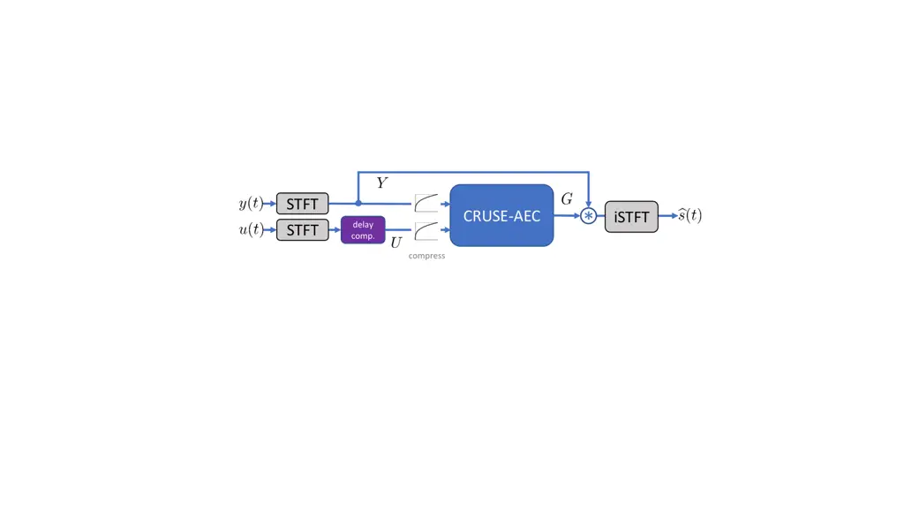
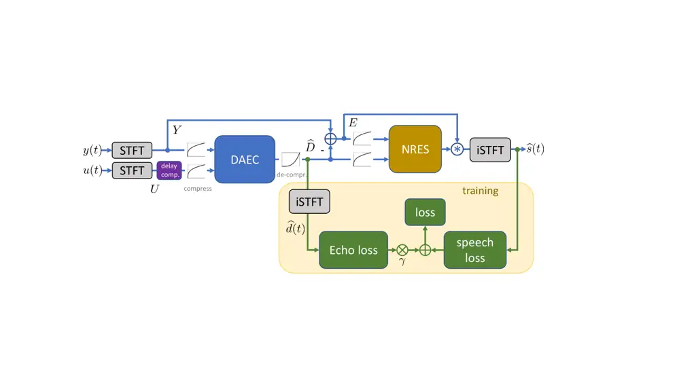
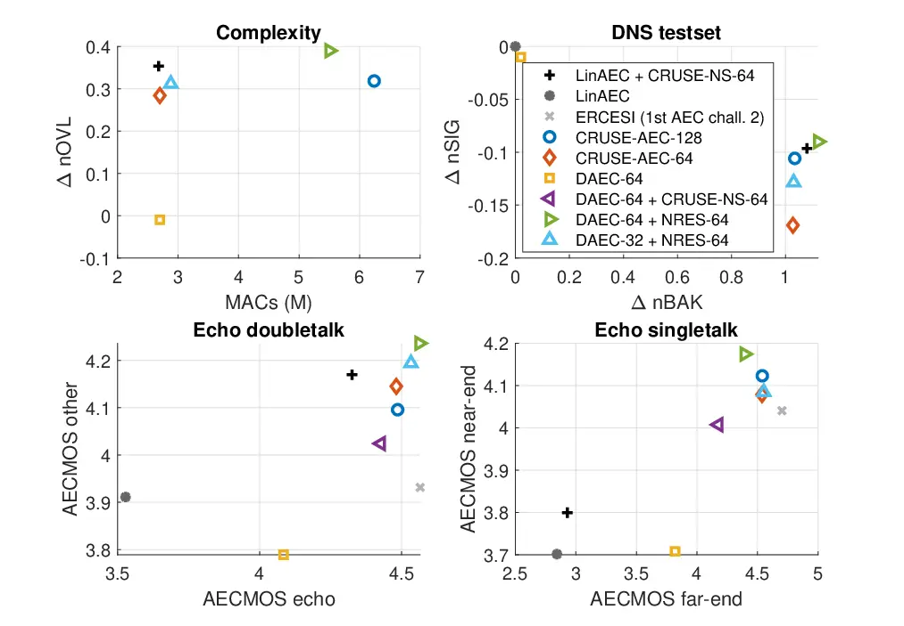
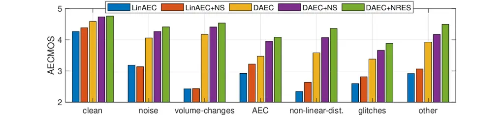

# Task splitting for DNN-based acoustic echo and noise removal

###### Abstract

Neural networks have led to tremendous performance gains for single-task
speech enhancement, such as noise suppression and acoustic echo
cancellation (AEC). In this work, we evaluate whether it is more useful
to use a single joint or separate modules to tackle these problems. We
describe different possible implementations and give insights into their
performance and efficiency. We show that using a separate echo
cancellation module and a module for noise and residual echo removal
results in less near-end speech distortion and better performance during
double-talk at same complexity.

|                                             |
| ------------------------------------------- |
| Sebastian Braun, Maria Luis Valero          |
| Microsoft Corporation, USA                  |
| {sebastian.braun, maria.luis}@microsoft.com |

Index Terms—  Acoustic echo cancellation, neural network based speech
enhancement, echo and noise control

## 1 Introduction

The main acoustic problems tackled by typical speech communication
pipelines are removal of echo, noise, and reverberation, which in many
cases occur simultaneously \[1\]. The adoption of DL (DL) for real-time
speech enhancement has made fast progress over the last few years:
neural networks have been developed at small enough size for practical
applications \[2, 3, 4\] far outperforming traditional NS (NS)
techniques. A more recent research spike on AEC (AEC), in part fueled by
the Microsoft AEC challenge series \[5\], shows strong trends and
promising results adopting neural networks for AEC. However, while
joining rather separate tasks, such as NS and AEC, into a single model
became very straightforward using DL, it is not yet understood at what
cost this comes: How much larger does a joint NS+AEC model have to be to
achieve on par NS performance to an NS-only model? Is it more efficient
to break the tasks into separate stages, or is DL so powerful that
simply training an unconstrained single-stage black-box model will yield
better performance or higher efficiency?

In \[6\], a system for joint reverberation, noise and echo reduction
using a DNN supported EM algorithm is proposed. In \[7, 8\] it was
proposed to use a linear AEC system extended with a DNN (DNN) to cope
with non-linear components. Most straightforward full DNN based systems
use spectral mapping \[9, 10\], or predict spectral enhancement filters
or masks \[11, 12\]. Many participants in the AEC challenge \[5\] used a
hybrid system with a linear AEC and a DNN module. In \[13, 14\] a
two-stage approach was proposed that uses a dedicated AEC module and a
second NRES (NRES) module. In \[15\], a multi-stage enhancement system
with separate dereverberation and denoising modules was proposed. While
the authors showed the subsequent performance gained by each stage,
including better performance than other baselines, it was not proven if
the target decoupling has an actual benefit over an unconstrained
optimization of a similar network. Often, such multi-stage processing
approaches are also trained sequentially, requiring a training process
for each stage. \[16\] proposes a tunable loss function to increase echo
suppression at the cost of speech distortion.

In this paper, we design a two-stage DNN based system consisting of DAEC
(DAEC) and NRES modules. We propose an adaptive loss that avoids
burdensome multi-stage training. The two-stage system is compared to
fair single-stage DNN trained on the echo and noise suppression task. We
show that this way, the AEC module is removing only echo, which creates
no significant signal distortion in contrast to echo and noise
suppressors. The NRES module is cleaning the signal up, removing
eventual residual echoes and noise, while introducing only moderate
amounts of signal distortion. Overall, we show that the proposed
two-stage system outperforms the single-stage baseline in terms of
signal distortion and double-talk.

## 2 Problem formulation

Given a typical full-duplex communication system comprising a
loudspeaker and microphone in the same room, we assume the following
signal arriving at the microphone

```math
y(t)=s(t)+r(t)+n(t)+\underbrace{h(t)\star\mathcal{Q}\{u(t)\}}_{d(t)}, \tag{1}
```

where $`s(t)`$ is the desired speech signal, which may also include
early reflections, $`r(t)`$ is the (late) reverberation, $`n(t)`$ is
additive noise, $`u(t)`$ is the far-end signal, $`h(t)`$ is the EIR
(EIR) that describes the propagation from the loudspeaker to the
microphone, $`\mathcal{Q}`$ denotes a nonlinear function modeling e.g.
loudspeaker and possible processing distortions, and $`t`$ is the time
index.

We use capital letters to denote STFT (STFT) representations of the
time-domain signals, e. g. $`Y(k,n)`$ is the STFT of $`y(t)`$ with
frequency and time indices $`k,n`$. Typical speech enhancement systems
estimate a time-frequency filter to map the input signal spectrum
$`Y(k,n)`$ to an estimate of the desired speech signal
$`\widehat{S}(k,n)`$. In this work, we use a generalized convolutive
cross-band filter $`G_{k,n}(\kappa,\ell)`$ taking also neighboring
frames and frequencies for the mapping per time-frequency point into
account. In \[17\] this was called _deep filtering_ and is described by

```math
\widehat{S}(k,n)=\sum_{\kappa=-K}^{K}\sum_{\ell=0}^{L}G_{k,n}(\kappa,\ell)\,Y(k-\kappa,n-\ell), \tag{2}
```

where $`K`$ are the number of neighboring frequencies and $`L`$ the
number of past frames used. The filter is therefore causal. The
time-domain counterpart $`\widehat{s}(t)`$ is obtained by inverse STFT.

## 3 Model architecture

We base our models on the CRUSE (CRUSE) architecture \[18\] with the
only modification of using the deep filter (2) instead of single
time-frequency mapping with $`K\!=\!L\!=\!0`$. Our CRUSE configuration
uses 4 convolutional encoder layers, mirrored transposed-convolutional
decoder layers with $`[32,64,64,64]`$ channels, causal kernels of (2,3)
in dimensions (time,frequency), and downsampling along the frequency
axis using strides (1,2). Between encoder and decoder is a grouped GRU
(GRU) of 4 groups to reduce complexity \[2, 4\]. From each encoder, a
skip connection with a 1x1 convolution is added to the input of each
corresponding decoder layer.

### 3.1 Single-stage model

As baseline and single-stage model, we use the CRUSE-NS model as
described in \[18\], with the only modification of the deep filtering
(2). To deal with the task of AEC, the only modification to obtain the
baseline single-stage CRUSE-AEC model is doubling the input channels of
the convolutional encoder from 2 to 4 to process real and imaginary
parts of mic and far-end signals. As input features, the complex spectra
are compressed as in \[19, 18\]. The single-stage adapted model is shown
in Fig. 1a).

The far-end signal is delay-aligned to the mic signal in the STFT domain
on frame basis using a simple MSC (MSC) based delay estimation. The
delay is found as the frame with the highest smoothed MSC between mic
and far-end signal on a 1 s window without using look-ahead in online
processing fashion. We found MSC based alignment to be more robust and
less complex than time-domain based correlation methods.

### 3.2 Task splitted two-stage model



a)  b)

Fig. 1: a) Single-stage CRUSE structure for AEC. b) Two-stage structure
with deep AEC and NRES blocks and training strategy.

The proposed two-stage AEC+NRES model structure is shown in Fig. 1b).
The AEC block estimates the compressed complex spectrum of the echo
signal $`d(t)`$. We found the direct signal estimation to perform better
than estimating a multi-frame filter for the far-end signal. The echo
signal is de-compressed and subtracted from the mic input by

```math
E(k,n)=Y(k,n)-|\widehat{D}(k,n)|^{\frac{1}{c}}\,e^{j\varphi_{\widehat{D}}(k,n)}, \tag{3}
```

where $`\varphi_{\widehat{D}}`$ denotes the phase of $`\widehat{D}`$.
The input to the NRES block, is the AEC output $`E(k,n)`$ and the echo
estimate $`\widehat{D}(k,n)`$ as proposed in \[14\], again with
magnitude compression applied. Real and imaginary parts are fed as
channels to the convolutional encoders, so both AEC and NRES modules
have a 4-channel input. For training and analysis purposes only, also
the echo estimate $`\widehat{d}(t)`$ is obtained via inverse STFT.

Fig. 2: Skip connection between DAEC and NRES module.

For better communication and re-use of the encoded far-end signal, we
add a skip connection with $`1\!\!\times\!\!1`$ convolution from the AEC
encoder to the end of the NRES encoder as shown in Fig. 2.

## 4 Loss function

As main loss component we aim to optimize the desired speech signal
spectrum in an end-to-end fashion. We use the spectral CCMSE (CCMSE)
loss, which outperformed other losses in a noise suppression task \[20,
18\]. The CCMSE loss is a linear combination of complex and magnitude
components:

```math
\mathcal{L}(\widehat{s},s)=\sum_{k,n}\alpha\left||\widehat{S}|^{c}e^{j\varphi_{\widehat{S}}}-|S|^{c}e^{j\varphi_{S}}\right|^{2}+(1\!-\!\alpha)\left||\widehat{S}|^{c}\!-\!|S|^{c}\right|^{2} \tag{4}
```

Similarly as in \[14\], we utilize a dedicated echo loss term to guide
the AEC output to contain echo only. We found in preliminary experiments
that using compressed spectral distances similar to (4) for the echo
component results in significant under-estimation of the echo.
Therefore, we propose to use the MAE (MAE), which provides accurate echo
estimates:

```math
\mathcal{L}(\widehat{d},d)=\sum\nolimits_{k,n}\left|\widehat{D}-D\right|. \tag{5}
```

Additionally, we use an asymmetric speech over-suppression penalty term
\[21\]

```math
\mathcal{L}_{\text{asym}}(\widehat{s},s)=\sum\nolimits_{k,n}\max\left\{|S|^{c}-|\widehat{S}|^{c},\,0\right\}^{2}. \tag{6}
```

The final loss is then given by the linear combination

```math
\mathcal{L}=\mathcal{L}(\widehat{s},s)+\beta\mathcal{L}_{\text{asym}}(\widehat{s},s)+\gamma\mathcal{L}(\widehat{d},d), \tag{7}
```

where $`\beta`$ and $`\gamma`$ are positive scalars to balance the loss
terms. The training loss strategy is outlined in Fig. 1 by the green
blocks.

### 4.1 Proposed adaptive echo loss

To guide the training to first focus on providing a good echo estimate
from the AEC module, we propose an adaptive weighting to combine
end-to-end speech loss (4) and the echo term (5) with

```math
\gamma=\max\left\{\eta\,\frac{\sum_{k,n}\left|\widehat{D}-D\right|}{\sum_{k,n}|D|},\hskip 9.24994pt\gamma_{\text{min}}\right\} \tag{8}
```

where $`\eta`$ is a constant scalar and $`\gamma_{\text{min}}\!>\!0`$
prevents vanishing of the echo term. The adaptive weighting steers the
training focus on the AEC module when the residual echo is large, and
approaches zero when the AEC module cancels the echo sufficiently. Once
this occurs, the training focuses on the NRES module.

## 5 Training data and augmentation

We use supervised training by generating synthetic training signal
mixtures, which provides access to individual signal components such as
the desired speech training target and echo signals. We create training
signals of 20 s length as given by the signal model in (1). The near-end
speech signal is concatenated from speech recordings as described in
\[18\] using data from the DNS (DNS) challenge \[22\] and AVspeech
\[23\]. The speech signal is convolved with a RIR (RIR) from the 115 k
database provided in \[22\]. The speech training target $`s(t)`$ is
obtained by convolving the speech with a windowed part of the RIR
containing only early reflections up to 50 ms. The later part of the
reverberation is considered as undesired signal component $`r(t)`$.
Noise signals are taken from the DNS challenge database (180 h). 80% of
the speech and noise signals are randomly modified in spectral shape,
and 20% in pitch. The noise is added to the speech with a SNR (SNR) with
distribution $`\mathcal{N}(5,10)`$ dB.

The far-end signals are taken from three sources: noisy speech
recordings (VoxCeleb2 \[24\], 4000 h), clean speech (650 h of VoxCeleb2
processed by noise suppression \[18\]), and music from MUSAN \[25\]
(42 h). Random signal portions from these databases are concatenated to
the desired 20 s far-end signal length. The far-end is modified by
inserting random silence periods of $`[3,15]`$ s, short audio drop-outs
(10%), and simulating clock drift by resampling with a standard
deviation of 0.5 samples/sec (20%). To model loudspeaker
non-linearities, with 20% chance sigmoid or rectifier clipping functions
with random parameters are applied to the far-end signal.

To generate the echo signal, one or multiple EIR are chosen from the
pool or RIR. To simulate that all sources are in the same room, the RIR
applied to speech and far-end differ less than 100 ms in terms of
$`T_{60}`$. We use a 20% chance of up to 2 echo path changes within a
20 s sequence. The EIR are augmented with varying delays up to 0.5 s,
the direct path energy is modified with a positively biased gain
distribution $`\mathcal{N}(12,5)`$ dB, and random bandpass filtering.
Finally, the echo signal is added with a SER (SER) of
$`\mathcal{N}(0,10)`$ dB. Lastly, the signal levels are scaled such that
the microphone signals are distributed with
$`\mathcal{N}(-26,10)`$ dBFS.

The training is monitored using a synthetic validation set of 300 files
with 30 s length created in a similar way as the training data. For
speech data, we used DAPS, far-end signals are from CommonVoice, and
noise from QUT. Training is controlled on the heuristic validation
metric

```math
\mathcal{V}=nSIG+0.1\,nOVL+0.5\,AEC_{O}+0.1\,AEC_{E} \tag{9}
```

The learning rate is dropped by a factor of 0.5 when $`\mathcal{V}`$
does not improve for 20 epochs. The final model is chosen on the best
$`\mathcal{V}`$.

## 6 Results

### 6.1 Experimental setup

The audio processing and features are implemented in 16 kHz sampling
rate using STFT with 50% overlapping 20 ms square-root Hann windows. The
feature and loss compression factor is $`c=0.3`$. As suggested in
\[18\], the spectral losses are implemented using a STFT with 75%
overlapping 64 ms Hann windows. The deep filter (2) uses $`K\!=\!1`$
neighbor frequencies and $`L\!=\!2`$ past frames. The loss terms are
weighted with $`\alpha\!=\!0.3`$, $`\beta\!=\!1`$,
$`\gamma_{\text{min}}\!=\!0.05`$, and $`\eta\!=\!10^{-5}`$. One training
epoch is defined as 50,400 sequences. The networks are trained with a
batch size of 120 for about 500 epochs, resulting in pseudo-unique
training data of $`\sim`$16 years due to random data augmentation. All
CRUSE models, including the blocks used for DAEC and NRES in Fig. 1, are
of the same size with encoder filters \[32,64,64,64\] with two
exceptions for a larger parameterization of CRUSE-AEC with
\[32,64,128,128\] and a smaller version of the DAEC module with
\[32,32,32,32\]. The model size is indicated by the last filter number.

### 6.2 Test data and metrics

Results are reported on the 2nd AEC challenge blind test set \[5\]
comprising 800 real consumer device recordings with categories near-end,
far-end, and double-talk to evaluate AEC performance, and on the 3rd DNS
challenge \[22\] blind set comprising 600 real device recordings in
challenging noise conditions to evaluate NS performance. The NS
performance is evaluated using the DNSMOS model \[26\], which
non-intrusively predicts MOS values for signal quality (nSIG),
background noise (nBAK) and overall (nOVL) following the ITU-T P.835
standard. The AECMOS model \[27\] predicts the echo degradation MOS
score $`AEC_{E}`$ and other degradation MOS $`AEC_{O}`$.

### 6.3 Baselines

We introduce several baselines as important points of reference. For
external reference, we show AECMOS results on the 2nd AEC challenge
dataset from the top performing submission (ERCESI)¹¹ 1
https://www.microsoft.com/en-us/research/academic-program/acoustic-echo-cancellation-challenge-interspeech-2021/results/.
Secondly, we use a state-of-the-art linear AEC, specifically the STFT
domain state-space algorithm for AEC described in \[28\]. The linear AEC
is implemented with 75% overlapping 40 ms windows and an adaptive filter
length of 200 ms. Thirdly, we use a model trained on NS only
(CRUSE-NS-64) to provide a point of reference on a noise suppression
dataset, and post-process AEC only models also with the DNS model for
fair comparison. The CRUSE-NS model \[18\] is trained similarly as the
AEC models on the loss given in (7) without the echo term, and does not
see echo during training.

### 6.4 Evaluation of overall architecture

The overall results are shown in Fig. 3 in terms of a) inference
complexity in MAC (MAC) operations vs. overall noise suppression
improvement, b) improvement of signal distortion vs. noise suppression,
c) echo double-talk performance in terms of echo removal vs. other
(speech) degradation, and d) the single-talk echo tradeoff for far-end
suppression vs. near-end speech quality.



Fig. 3: DNSMOS on 3rd DNS challenge blind set and AECMOS on 2nd AEC
challenge blind set. ERCESI not available on NS testset.

Note that for _LinAEC + CRUSE-NS-64_, the complexity is for the NS model
only and _LinAEC_ is omitted from the top plots as it has no effect on
the NS testset. We can see that the NS-only model achieves good overall
noise suppression at 2.7M MACs and good nBAK with only little nSIG
degradation. Interestingly, the linear AEC is greatly improved for
doubletalk by chaining the NS model.

The single-stage AEC model CRUSE-AEC-64 which is same size as the DNS
only model CRUSE-NS-64 shows decent echo performance, but performs
significantly worse on the DNS testset than CRUSE-NS-64, especially for
_nSIG_, as it has to learn two tasks. The scaled up CRUSE-AEC-128 with
2.5x complexity increase achieves increased echo performance, but still
shows some NS performance degradation compared to CRUSE-NS-64. The
external reference model from ERCESI shows slightly more single-talk
echo suppression with however a large degradation on the near-end/other
metric, indicating either more speech distortions or less noise
suppression.

Evaluating only the first module of the proposed two-stage model, i. e. 
the DAEC output $`e(t)`$, we observe some desired effects: The DAEC-64
model removes no noise, therefore also causing no $`nSIG`$ degradation,
which can be beneficial. It removes the echo already almost completely
as indicated by an echo MOS score $`>4`$, while lagging in the echo
other/near-end categories due to passing through noise. A significant
improvement is obtained by chaining the DAEC model with CRUSE-NS, which
are separately trained (CRUSE-NS never saw echo). The performance of
this sub-optimal chain is obviously lower than the joint task models
CRUSE-AEC and the full two-stage DAEC+NRES models.

The full proposed two-stage system _DAEC-64 + NRES-64_ achieves better
NS and echo performance except for the single-talk far-end metric than
the single-stage large _CRUSE-AEC-128_ model at similar complexity. We
test the hypothesis that the semi-supervised task of echo cancellation
may be easier to learn for neural networks than the blind task of noise
suppression by spending less complexity for the DAEC module to obtain
more efficient models. For _DAEC-32 + NRES-64_ the DAEC module is
down-sized while keeping the NRES module the same size as the DNS model.
While the down-sized _DAEC-32 + NRES-64_ shows minor degradations in
echo and NS performance, it significantly outperforms _CRUSE-AEC-64_ in
nSIG and double-talk at similar complexity.

### 6.5 Loss ablation for two-stage model

An ablation study shown in Tab. 1 provides insights into the proposed
loss. The first row is the proposed training method with asymmetric loss
term (6) weighted with $`\alpha\!=\!0.5`$ and the adaptive echo loss
weighting (8). Dropping the asymmetric loss term by setting
$`\alpha\!=\!0`$ leads to increased NS and singletalk echo reduction at
the expense of signal distortion in terms of nSIG and AECMOS
other/near-end. When replacing the adaptive echo loss weighting (8) with
a fixed weight, we found $`\gamma\!=\!\gamma_{\text{min}}\!=\!0.05`$ to
be optimal, we can see a drop in all metrics. The DAEC and NRES modules
were trained all from scratch here. The performance drop can be remedied
by pre-training the DAEC module on the echo loss (5), and then
finetuning the whole DAEC+NRES pipeline on the overall loss (7) with the
fixed echo loss weight $`\gamma\!=\!0.05`$. During finetuning we kept
updating the weights of both DAEC and NRES as freezing the DAEC weights
led to significantly worse results. While with pretrained DAEC, the
fixed echo loss achieves similar results to the proposed adaptive echo
loss (8), the laborsome pretraining step can be avoided.

|          |            |            | doubletalk |       | singletalk |      | DNS  |      |      |
| -------- | ---------- | ---------- | ---------- | ----- | ---------- | ---- | ---- | ---- | ---- |
| pretrain | $`\gamma`$ | $`\alpha`$ | echo       | other | FE         | NE   | nSIG | nBAK | nOVL |
| –        | eq. (8)    | 0.5        | 4.55       | 4.25  | 4.35       | 4.18 | 3.68 | 4.26 | 3.50 |
| –        | eq. (8)    | 0          | 4.55       | 4.22  | 4.39       | 4.17 | 3.65 | 4.27 | 3.49 |
| –        | 0.05       | 0.5        | 4.55       | 4.24  | 4.29       | 4.17 | 3.65 | 4.23 | 3.47 |
| DAEC     | 0.05       | 0.5        | 4.55       | 4.25  | 4.35       | 4.17 | 3.68 | 4.26 | 3.50 |

Table 1: Ablation for loss and training strategy for DAEC+NRES.

### 6.6 Challenging scenario analysis

We investigate further how AEC algorithms deal with specific practical
challenges that violate basic assumptions of linear AECs. Specifically,
we show results of AECMOS on the far-end singletalk subset in the
following categories, which were annotated by a human expert listener:
_clean, noise, volume changes, long delays, AEC (not deactivated
on-device pre-processing), non-linear distortions (loudspeaker
clipping), glitches, other_.



Fig. 4: Breakdown of far-end singletalk for challenging scenarios.

We can see that the linear AEC struggles in all cases except _clean_ by
showing significantly lower AECMOS than the DNN. While the gap of the
DAEC to the DAEC+NRES is small for clean, noise, volume-changes, it is
interesting that there is still a significant performance gap for the
categories AEC, non-linear-distortions, glitches, other. This suggests
that the DAEC module is faster reacting and adapting than LinAEC, but
still is not sufficient to remove highly non-linear, non-stationary and
other uncommon artifacts, where a model trained on a speech enhancement
task (NS) or the jointly trained NRES module can provide large benefits.

## 7 Conclusions

We showed that separating the tasks for AEC and NRES into individual
modules can achieve more efficient models at lower speech distortion and
better double-talk performance than using the same DNN model at adjusted
capacity for both tasks. We propose an adaptive loss that guides the
model training to focus first on the AEC module and optimizes the
overall system later in the training end-to-end. We show an analysis of
difficult scenarios, where the DAEC significantly outperforms a linear
AEC with faster reaction times and higher robustness to noise and
non-linearities. There are however some categories, where the DAEC
removes echo components only partially, and the following NRES module
shows significant additional improvements. Practical advantages of the
decoupled two-stage system are that the AEC can be switched off when not
needed, AEC and NRES network architectures can be tuned individually in
size and architecture, and the echo signal is obtained inherently for
analysis or re-use in other applications. Future work is required to
optimize the network module architectures to the individual tasks.

## References

- \[1\] E. Hänsler and G. Schmidt, Acoustic Echo and Noise Control: A
  pracical Approach, Wiley, New Jersey, USA, 2004.
- \[2\] K. Tan and D. Wang, “Learning complex spectral mapping with
  gated convolutional recurrent networks for monaural speech
  enhancement,” vol. 28, pp. 380–390, 2020.
- \[3\] Igor Fedorov, Marko Stamenovic, Carl Jensen, Li-Chia Yang, Ari
  Mandell, Yiming Gan, Matthew Mattina, and Paul N. Whatmough,
  “TinyLSTMs: Efficient neural speech enhancement for hearing aids,” in
  Proc. Interspeech Conf., 2020.
- \[4\] S. Braun, H. Gamper, C. K. A. Reddy, and I. Tashev, “Towards
  efficient models for real-time deep noise suppression,” in Proc. IEEE
  Intl. Conf. on Acoustics, Speech and Signal Processing (ICASSP), 2021.
- \[5\] Ross Cutler, Ando Saabas, Tanel Parnamaa, Markus Loide, Sten
  Sootla, Marju Purin, Hannes Gamper, Sebastian Braun, Karsten Sorensen,
  Robert Aichner, and Sriram Srinivasan, “Interspeech 2021 acoustic echo
  cancellation challenge,” in Proc. Interspeech Conf., 2021.
- \[6\] G. Carbajal, R. Serizel, E. Vincent, and E. Humbert, “Joint
  NN-supported multichannel reduction of acoustic echo, reverberation
  and noise,” IEEE/ACM Transactions on Audio, Speech, and Language
  Processing, vol. 28, pp. 2158–2173, 2020.
- \[7\] M. M. Halimeh, C. Huemmer, and W. Kellermann, “A neural
  network-based nonlinear acoustic echo canceller,” IEEE Signal
  Processing Letters, vol. 26, no. 12, pp. 1827–1831, 2019.
- \[8\] Amir Ivry, Israel Cohen, and Baruch Berdugo, “Nonlinear acoustic
  echo cancellation with deep learning,” arXiv preprint
  https://arxiv.org/abs/2106.13754, 2021.
- \[9\] H. Zhang, K. Tan, and D. Wang, “Deep learning for joint acoustic
  echo and noise cancellation with nonlinear distortions,” in Proc.
  Interspeech Conf.
- \[10\] R. Peng, L. Cheng, C. Zheng, and X. Li, “Acoustic echo
  cancellation using deep complex neural networkwith nonlinear magnitude
  compression and phase information,” in Proc. Interspeech Conf.
- \[11\] Nils L. Westhausen and Bernd T. Meyer, “Acoustic echo
  cancellation with the dual-signal transformation LSTM network,” in
  Proc. IEEE Intl. Conf. on Acoustics, Speech and Signal Processing
  (ICASSP), 2021, pp. 7138–7142.
- \[12\] J. M. Valin, S. Tenneti, K. Helwani, U. Isik, and
  A. Krishnaswamy, “Low-complexity, real-time joint neural echo control
  and speech enhancement based on percepnet,” in Proc. IEEE Intl. Conf.
  on Acoustics, Speech and Signal Processing (ICASSP), 2021, pp.
  7133–7137.
- \[13\] J. Franzen, E. Seidel, and T. Fingscheidt, “AEC in a netshell:
  on target and topology choices for FCRN acoustic echo cancellation,”
  in Proc. IEEE Intl. Conf. on Acoustics, Speech and Signal Processing
  (ICASSP), 2021, pp. 156–160.
- \[14\] E. Seidel, J. Franzen, M. Strake, and T. Fingscheidt, “Y²-net
  FCRN for acoustic echo and noise suppression,” in Proc. Interspeech
  Conf., Brno, Czechia, 2021.
- \[15\] A. Li, W. Liu, X. Luo, G. Yu, C. Zheng, and X. Li, “A
  simultaneous denoising and dereverberation framework with target
  decoupling,” in Proc. Interspeech Conf., 2021.
- \[16\] A. Ivry, I. Cohen, and B. Berdugo, “Deep residual echo
  suppression with a tunable tradeoff between signal distortion and echo
  suppression,” in Proc. IEEE Intl. Conf. on Acoustics, Speech and
  Signal Processing (ICASSP), 2021, pp. 126–130.
- \[17\] W. Mack and E. A. P. Habets, “Deep filtering: Signal extraction
  and reconstruction using complex time-frequency filters,” IEEE Signal
  Process. Lett., pp. 1–5, 2019.
- \[18\] S. Braun and H. Gamper, “Effect of noise suppression losses on
  speech distortion and ASR performance,” in Proc. IEEE Intl. Conf. on
  Acoustics, Speech and Signal Processing (ICASSP), Singapore, 2022.
- \[19\] A. Li, C. Zheng, R. Penga, and X. Li, “On the importance of
  power compression and phase estimation in monaural speech
  dereverberation,” JASA express letters, vol. 1, no. 014802, 2021.
- \[20\] S. Braun and I. Tashev, “A consolidated view of loss functions
  for supervised deep learning-based speech enhancement,” in Intl. Conf.
  on Telecomm. and Sig. Proc. (TSP), 2021.
- \[21\] Q. Wang, I. Lopez Moreno, M. Saglam, K. Wilson, A. Chiao,
  R. Liu, Y. He, W. Li, J. Pelecanos, M. Nika, and A. Gruenstein,
  “Voicefilter-lite: Streaming targeted voice separation for on-device
  speech recognition,” in Proc. Interspeech Conf., 2020.
- \[22\] C. K. A. Reddy, H. Dubey, K. Koishida, A. Nair, V. Gopal,
  R. Cutler, S. Braun, R. Gamper, H. Aichner, and S. Srinivasan,
  “INTERSPEECH 2021 deep noise suppression challenge:,” in Proc.
  Interspeech Conf., 2021.
- \[23\] A. Ephrat, I. Mosseri, O. Lang, T. Dekel, K. Wilson,
  A. Hassidim, W. T. Freeman, and M. Rubinstein, “Looking to listen at
  the cocktail party: A speaker-independent audio-visual model for
  speech separation,” ACM Trans. Graph., vol. 37, no. 4, July 2018.
- \[24\] J. S. Chung, A. Nagrani, and A. Zisserman, “Voxceleb2: Deep
  speaker recognition,” in Proc. Interspeech Conf., 2018.
- \[25\] David Snyder, Guoguo Chen, and Daniel Povey, “MUSAN: A Music,
  Speech, and Noise Corpus,” 2015, arXiv:1510.08484v1.
- \[26\] C. Reddy, V. Gopal, and R. Cutler, “DNSMOS: A non-intrusive
  perceptual objective speech quality metric to evaluate noise
  suppressors,” in Proc. IEEE Intl. Conf. on Acoustics, Speech and
  Signal Processing (ICASSP), October 2021.
- \[27\] M. Purin, S. Sootla, M. Sponza, A. Saabas, and R. Cutler,
  “AECMOS: A speech quality assessment metric for echo impairment,” in
  Proc. IEEE Intl. Conf. on Acoustics, Speech and Signal Processing
  (ICASSP), 2022, pp. 901–905.
- \[28\] M. Luis Valero and E. A. P. Habets, “Low-complexity
  multi-microphone acoustic echo control in the short-time fourier
  transform domain,” IEEE/ACM Transactions on Audio, Speech, and
  Language Processing, vol. 27, no. 3, pp. 595–609, 2019.
