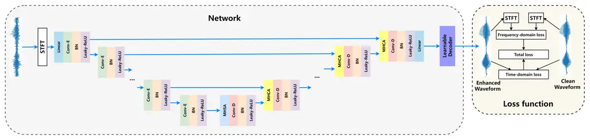
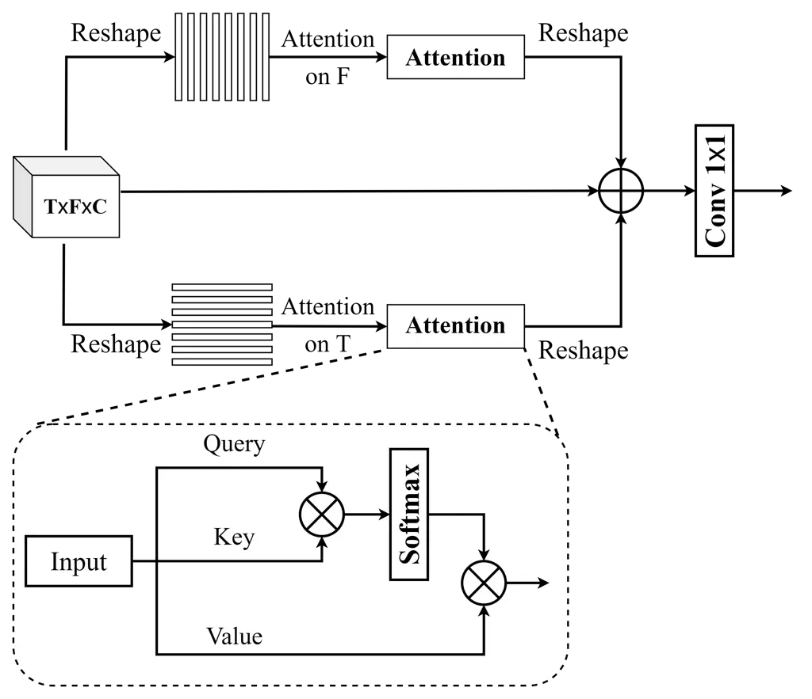
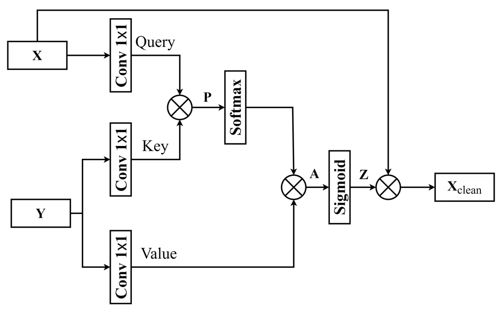
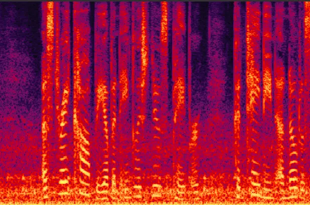
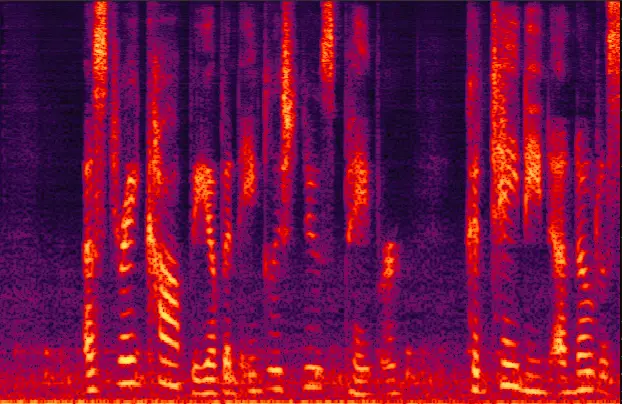
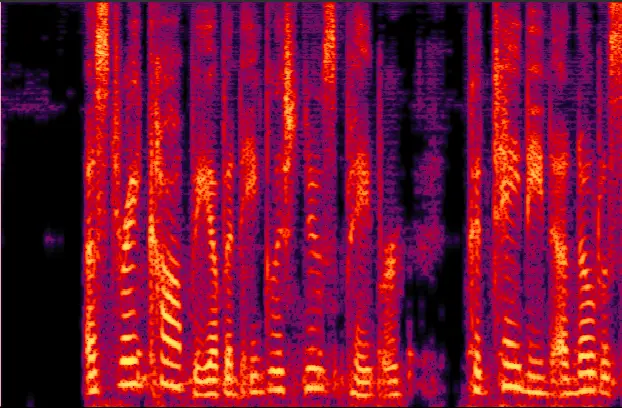
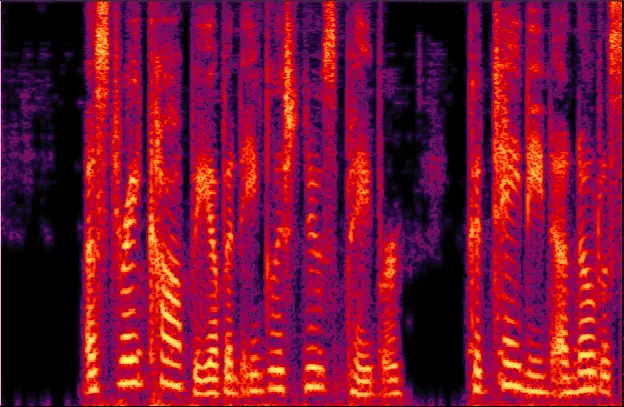
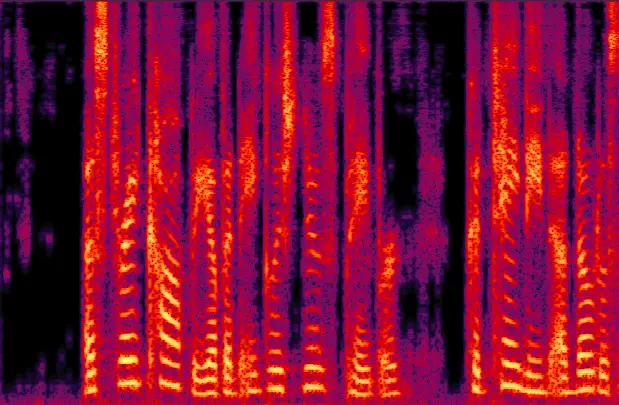
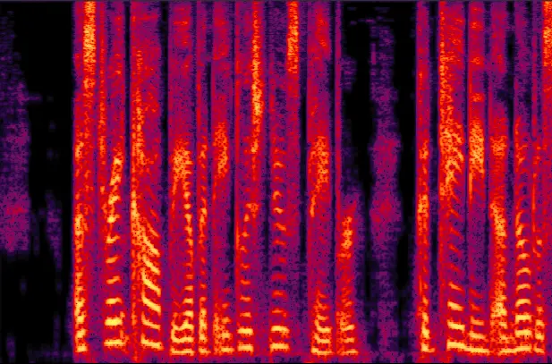

# U-Former: Improving Monaural Speech Enhancement with Multi-head Self and Cross Attention

Xinmeng Xu¹, Jianjun Hao^(2,∗) ^(†)^(†)thanks: \$ˆ\*\$Corresponding
author Affiliation: ¹E.E. Engineering, Trinity College Dublin, Dublin,
Ireland  
²School of Foreign Languages, Hubei University of Chinese Medicine,
Wuhan, China  
xux3@tcd.ie, loyalcolin@163.com

###### Abstract

For supervised speech enhancement, contextual information is important
for accurate spectral mapping. However, commonly used deep neural
networks (DNNs) are limited in capturing temporal contexts. To leverage
long-term contexts for tracking a target speaker, this paper treats the
speech enhancement as sequence-to-sequence mapping, and propose a novel
monaural speech enhancement U-net structure based on Transformer, dubbed
U-Former. The key idea is to model long-term correlations and
dependencies, which are crucial for accurate noisy speech modeling,
through the multi-head attention mechanisms. For this purpose, U-Former
incorporates multi-head attention mechanisms at two levels: 1) a
multi-head self-attention module which calculate the attention map along
both time- and frequency-axis to generate time and frequency
sub-attention maps for leveraging global interactions between encoder
features, while 2) multi-head cross-attention module which are inserted
in the skip connections allows a fine recovery in the decoder by
filtering out uncorrelated features. Experimental results illustrate
that the U-Former obtains consistently better performance than recent
models of PESQ, STOI, and SSNR scores. The source code is available at:
[https://github.com/XinmengXu/Uformer.git](https://github.com/XinmengXu/Uformer.git).

###### Index Terms: 

supervised speech enhancement, long-term contexts, sequence-to-sequence
mapping, U-net structure, Transformer, multi-head self-attention,
multi-head cross-attention

## I Introduction

The problem of enhancing speech corrupted by uncorrelated additive
noise, when only single-channel noisy speech is available, has been
widely studied in the past and it is still a active filed of research.
Traditional speech enhancement approaches include spectral subtraction
\[1\], Wiener filtering \[2\], statistical model-based methods \[3\],
and non-negative matrix factorization \[4\]. Recently, supervised
methods using deep neural networks have become shown their promising
performance on monaural speech enhancement \[5, 6\].

Various encoder-decoder frameworks based on convolutional neural
networks (CNN) or recurrent neural networks (RNNs) have gained superior
network performance in speech enhancement. For modeling long-range
sequence like speech, CNN requires more convolutional layers to enlarge
receptive field \[7, ref101\]. The dilated convolutional neural network
has been proposed for processing the long-term temporal sequence \[8\].
In addition, recurrent neural networks (RNNs) employing long short-term
memory (LSTM) have demonstrated a robust speech enhancement performance
\[9\]. However, RNNs require large number of parameters and lengthy
training times, and the memory of LSTM is limited, making it prone to
forgetting distant information \[10\]. Temporal convolutional networks
(TCNs) are proposed to match the speech enhancement performance of RNNs
while use fewer parameters and requiring less time to train \[11\]. TCNs
utilize causal dilated kernels to garner a fixed-size receptive field
over previous frames, allowing the modelling of long-term dependencies.
However, the performance of TCNs are adversely affected when events
occur out of expected order due to the positional nature of the kernels
\[12\].

Recently, as the outstanding performance in natural language processing
(NLP), the Transformer is introduced in speech enhancement problem
\[13\]. The Transformer follows the encoder and decoder architecture
with stacked self-attention and point-wise feed-forward layers \[14\],
which promise a stronger long-term dependencies modelling capability
than TCNs. However, the Transformer has a limitation as difficult to
process a multiple-sequence alignment as an input for feature extraction
in the inference stage \[15\]. In this study, we integrate the
Transformer and encoder-decoder structure for learning both local and
global contextual information of long-range speech. Consequently, this
paper propose a U-Former for monaural speech enhancement, which keeps
the inductive bias of convolution by using a U-Net architecture, but
introduces attention mechanisms at two levels, 1) the multi-head
self-attention (MHSA) module calculates the attention map along both
time- and frequency-axis to generate time and frequency sub-attention
maps for leveraging global interactions between encoder feature, 2) the
multi-head cross-attention module (MHCA) in skip-connections to filter
out uncorrelated feature and to reduce the loss of feature information
from corresponding encoder layer ¹¹ 1 Speech samples are available at:
[https://xinmengxu.github.io/  
AVSE/MHACUnet.html](https://xinmengxu.github.io/AVSE/MHACUnet.html). .



Fig. 1: Network architecture of proposed U-Former. Conv-E, Conv-D, and
BN denote convolution encoder, convolution decoder, and batch
normalization respectively.

In a nutshell, the contributions of our work are three-fold:

- •
  We integrate the Transformer and encoder-decoder structure, which aims
  to learn both local and global contextual information of long-range
  speech.
- •
  We propose MHSA and MHCA modules to leverage global interactions
  between encoder feature and to filter out uncorrelated feature and to
  reduce the loss of feature information from corresponding encoder
  layer.
- •
  To evaluate the proposed U-Former, we perform comprehensive ablation
  studies on public available speech data. Results show that U-Former
  outperforms the state-of-the-art methods.

Rest of paper is organised as follows: Section II introduces the signal
model and problem formulation. Section III presents the proposed
network, and discusses mechanisms of MHSA and MHCA in detail. Section IV
describes the datasets and network parameters. Section V demonstrates
the results and analysis, and a conclusion is shown in Section VI.

## II Signal model and problem formulation

Given a single-microphone mixture $`y`$, monaural SE aims to separate
target speech $`s`$ from background noise $`n`$. A noisy mixture can be
formulated as

```math
y[k]=s[k]+n[k], \tag{1}
```

where $`k`$ is the time sample index. Taking the STFT on both sides, we
obtain

```math
Y(m,f)=S(m,f)+N(m,f), \tag{2}
```

where $`Y`$, $`S`$ and $`N`$ represent the STFT of $`y`$, $`s`$ and
$`n`$, respectively, and $`m`$ and $`f`$ index the time frame and
frequency bin, respectively. The STFT of a speech signal can be
expressed in Cartesian coordinates. Hence, Eq 2 can be rewritten into

```math
\displaystyle Y^{(r)}(m,f)+iY^{(i)}(m,f) \displaystyle=\Big(S^{(r)}(m,f)+N{(r)}(m,f)\Big) \tag{3}
```

```math
\displaystyle+i\Big(S^{(i)}(m,f)+N^{(i)}(m,f)\Big),
```

where the superscripts $`(r)`$ and $`(i)`$ indicate real and imaginary
components, respectively. In our work, we refer the training target used
in complex spectral mapping, i.e. $`S^{(r)}`$ and $`S^{(i)}`$, as the
target RI-spectrogram.

The speech enhancement using U-Former can be formulated as

```math
s_{pre}=f_{\theta}(Y^{(r)},Y^{(i)}) \tag{4}
```

where $`f_{\theta}`$ denotes a function defining a U-Former model
parameterized by $`\theta`$.

## III Model Architecture

Fig 1 shows the proposed speech enhancement network. The model uses
encoder-decoder structure that based on the standard convolution U-Net
\[14\], as the main body. The input to the U-Former is complex valued
spectrogram computed by short-time Fourier transform (STFT), denoted by
$`\textbf{Y}_{r,i}\in\mathbb{R}^{T\times F\times 2}`$, where $`T`$
represents the number of time steps and $`F`$ represents the number of
frequency bands. The output of U-Former $`\textbf{S}_{out}`$ is
processed by a learnable decoder layer to transform the feature back to
the enhanced time-domain signal $`\textbf{s}_{pre}\in\mathbb{R}`$. The
network structure of the learnable decoder is designed to be exactly the
same as the convolutional implementation of inverse STFT. Specifically,
the learnable decoder is a 1D transposed convolution layer whose kernel
size and stride being the window length and hop size in the STFT \[16,
17\]. .

In addition, the encoder of U-Former contains several stacked
convolutional layers, each of which is followed by batch normalization,
and Leaky-ReLU for non-linearity. The decoder is mirror representations
of the encoder. What is more, the proposed U-Former models long-range
contextual interaction and dependencies by using two types of attention
modules, MHSA placed in bottleneck part and MHCA placed in
skip-connection part. Both modules are designed to express a new
representation of the input based on its self-attention in the first
case or on the attention paid to higher level features in the second.



Fig. 2: Schematic diagram of MHSA module.

### III-A Multi-head Self-attention (MHSA)

In the proposed U-Former, the MHSA module is designed to extract long
range structural information \[13\]. To this end, it is composed of
multi-head self-attention functions positioned at the bottom of the
U-Net as shown in Fig 1. MHSA takes as input an L-length sequence of
embedding and produces a same size output sequence. The output of the
attention matrix is presented as \[18\]:

```math
\mathcal{A}(Q,K,V)=\text{Softmax}\Big(\frac{QK^{\top}}{\sqrt{L}}\Big)V, \tag{5}
```

where $`\top`$ denotes the transpose symbol. Initially, the full
attention map $`\textbf{F}_{in}\in\mathbb{R^{T\times F\times C}}`$ is
the input to each sub-layer of the encoder, the proposed MHSA are
reshaped the 2D attention map into 1D sub-maps in time- and
frequency-axis as $`T\times C_{\text{layer}}`$ and
$`F\times C_{\text{layer}}`$, respectively, as shown in Fig 2. Each sub
attention map progrates information along specific axis. Moreover, two
sub attention maps are constructed as parallel calculations on multiple
GPUs to optimize the training process. The multi-head attention for the
time direction can be presented as:

```math
\text{multihead}(Q^{t},K^{t},V^{t})=[h_{1};h_{2};...;h_{n}]W_{t}^{O}, \tag{6}
```

where

```math
h_{i}=\mathcal{A}\Big(Q^{t}W^{Q}_{t},K^{t}W^{K}_{t},V^{t}W^{V}_{t}\Big), \tag{7}
```

where $`W_{t}^{O}\in\mathbb{R}^{n\times C_{v}\times C_{\text{layer}}}`$
($`n`$ denotes the number of head),
$`{W^{Q}_{t},W^{K}_{t}}\in\mathbb{R}^{C_{\text{layer}}\times C_{k}}`$,
$`W^{V}_{t}\in\mathbb{R}^{C_{\text{layer}}\times C_{v}}`$. In the time
attention map, query, keys and values are presented as
$`Q^{t},K^{t},V^{t}`$, respectively. Similarly, for frequency attention,
we adopt same equations but different notations $`f`$:

```math
\text{multihead}(Q^{f},K^{f},V^{f})=[h_{1};h_{2};...;h_{n}]W_{f}^{O}, \tag{8}
```

where

```math
h_{i}=\mathcal{A}\Big(Q^{f}W^{Q}_{f},K^{f}W^{K}_{f},V^{f}W^{V}_{f}\Big), \tag{9}
```

The proposed MHSA demonstrates high efficacy to learn the long-term
dependencies. Inspired by the position-sensitivity of self-attention
\[19\], the output $`h_{i}`$ is enabled to retrieve relative positions
by pooling over query-key affinities $`Q^{t}_{p}K^{t}_{p}`$, the
key-dependent positional bias term $`K_{c}^{t}r^{K^{t}}_{c-p}`$:

```math
\displaystyle h_{i}=\sum_{c\in\mathcal{N}_{1\times n(c)}}\text{softmax}(Q^{t}_{p}K^{t}_{c}+Q^{t}_{p}r^{Q^{t}}_{c-p} \tag{10}
```

```math
\displaystyle+K_{c}^{t}r^{K^{t}}_{c-p})(V_{c}-r^{V^{t}}_{c-p}),
```

where $`\mathcal{N}_{1\times n(c)}`$ is the local $`1\times m`$ region
around position $`c`$. The learnable $`r^{Q^{t}}_{c-p}`$,
$`r^{K^{t}}_{c-p}`$, and $`r^{V^{t}}_{c-p}`$ are the positional encoding
for query, key, and value, respectively.

To capture global information, we employ two sub-attention layers
consecutively for the time-axis and frequency-axis, respectively.
Consequently, the outputs of time and frequency attentions can be
written as:

```math
\displaystyle M_{t} \displaystyle=\text{multihead}(Q^{t},K^{t},V^{t}), \tag{11}
```

```math
\displaystyle M_{f} \displaystyle=\text{multihead}(Q^{f},K^{f},V^{f}),
```

Finally, the masked attention maps are reshaped, integrated and
processed by a $`1\times 1`$ convolution block to obtained the output
feature map, $`\textbf{F}_{out}`$, in which residual connections are
added as well.

```math
\textbf{F}_{out}=\text{Conv}(M_{t}+M_{f}+M_{p}), \tag{12}
```

where $`M_{p}`$ is the input feature map.

### III-B Multi-head Cross-attention (MHCA)

The MHSA module allows to connect every element in the input with each
other. Attention may also be used to increase the U-Net decoder
efficiency and in particular enhance the lower level feature maps that
are passed through the skip connections.

The idea behind the MHCA module is to turn off irrelevant or noisy areas
from the skip connection features and highlight regions that present a
significant interest for the application. The MHCA block which diagram
is shown in Fig 3, is designed as a gating operation of the skip
connection.

The MHCA takes transformed feature maps corresponding to the decoder
layer X, and processed by a $`1\times 1`$ convolution block to form the
query, and takes transformed feature maps corresponding to the encoder
layer Y, to form the key-value pair by using two $`1\times 1`$
convolution blocks. The MHCA first computes the weight P for getting the
attention component $`\textbf{A},`$ given by

```math
\textbf{P}=\frac{\textbf{Q}\textbf{K}^{\top}}{\sqrt{F}}, \tag{13}
```

where Q, K are represented query and key, respectively, and $`F`$
denotes the number of frequency bins. Intuitively, the multiplication
operation between Q and K emphasizes the regions which are slowly
varying in time and have high power. What is more, the softmax function
is used to generate attention mask
$`\widehat{\textbf{W}}=\{\widehat{W}_{i,j}\}`$,

```math
\widehat{W}_{i,j}=\frac{exp(W_{i,j})}{w_{j}}, \tag{14}
```

where

```math
w_{j}=\sum_{i=1}^{F}exp(W_{i,j}), \tag{15}
```

The attention component A is determined by

```math
\textbf{A}=\widehat{\textbf{W}}\textbf{V}, \tag{16}
```

where V denotes the index of value. What is more, the output of MHCA Z
is computed by

```math
\textbf{Z}=\text{sigmoid}(\textbf{A}), \tag{17}
```

Consequently, the Z is weight value that are re-scaled between 0 and 1
through a sigmoid activation function, in which low magnitude elements
indicated irrelevant areas to be reduced.



Fig. 3: Schematic diagram of MHCA module.

A cleaned up version of $`\textbf{X}_{clean}`$ is given by

```math
\textbf{X}_{clean}=\textbf{X}\odot\textbf{Z}, \tag{18}
```

where $`\odot`$ is Hadamard product. Finally the $`\textbf{X}_{clean}`$
is concatenated with Y.

### III-C Loss function

The proposed model is trained by a combination of two losses. First, the
time-domain loss that is defined as:

```math
L_{t}(\textbf{x},\hat{\textbf{x}})=\frac{1}{M}\sum_{n=0}^{M-1}(x_{i}[n]-\hat{x}_{i}[n])^{2}, \tag{19}
```

where $`x[n]`$ and $`\hat{x}[n]`$ represent the $`n^{th}`$ sample of the
clean and the enhanced utterance respectively and M is the utterance
length.

Second, the frequency-domain loss which takes STFT of the utterances and
use $`L_{1}`$ over the $`L_{1}`$ norm of the STFT coefficients \[20\],
which is given by:

```math
\begin{split}L_{f}(\textbf{x},\hat{\textbf{x}})=\frac{1}{T\times F}\sum_{t=1}^{T}\sum_{f=1}^{F}|(|X(t,f)_{r}|+|X(t,f)_{i}|)\\
-|(\hat{X}(t,f)_{r}|+|\hat{X}(t,f)_{i}|)|,\end{split} \tag{20}
```

where $`X(t,f)`$ and $`\hat{X}(t,f)`$ are the units of STFTs of x and
$`\hat{\textbf{x}}`$ respectively.$`T`$ and $`F`$ denote the index of
frames and frequency bins. $`X_{r}`$ and $`X_{i}`$ represent real and
the imaginary of complex variable $`X`$.

Finally, the time-frequency domain loss is expressed as:

```math
L(\textbf{x},\hat{\textbf{x}})=\alpha\times L_{t}(\textbf{x},\hat{\textbf{x}})+(1-\alpha)\times L_{f}(\textbf{x},\hat{\textbf{x}}), \tag{21}
```

where $`\alpha`$ is a hyper-parameter that is tuned on the validation
set. The diagram of the loss function is shown in the right part of
Fig 1.

## IV Experimental Setup

### IV-A Datasets

In order to evaluate performance of the proposed model, experiments are
conducted on Librispeech corpus \[21\]. There 6500 clean utterances are
selected for training set and 400 are selected for validation set, which
are created under the randomly SNR levels ranging from -5dB to 10dB.
Noise signals are from the Demand dataset \[22\], along with the clean
speech recordings are used to create the noisy speech for the training
and validation set.

Test set contains 500 utterances under the SNR condition of -5dB, 0dB,
5dB and 10dB. Both speakers and noise conditions in the test set are
totally unseen by the training set. All of the clean speech and noise
recordings with a sampling frequency of 16 kHz, and the frame size and
frame shift for STFT are set to 512 and 256.

### IV-B Training and network parameters

In each epoch of the training, we chunk a random segment of 4 seconds
from an utterance if it is larger than 4 seconds. The smaller utterances
are zero-padded to match the size of the largest utterance in the batch.
The Adam optimizer is used for stochastic gradient descent (SGD) based
optimization. The numbers of output channels for the layers in the
encoder are changed to 16, 32, 64, 128 and 256 successively, and those
for each layer in the decoder to 128, 64, 32, 16 and 1 successively. The
initial learning rate is set to 0.001, and is decreased by 50$`\%`$ once
when consecutive 3 validation stagnates, and the training is
early-stopped when 10 consecutive validation loss increments happened.

All training audio data are downsampled to 16 kHz and features are
extracted by using frames of length 512 with frame shift of 256, and
Hann windowing followed by STFT of size $`K=512`$ with respective
zero-padding. Real and imaginary parts of the complex spectrum are
divided into separate feature maps, resulting in $`C=2`$ input channels,
thus the input. In addition, the hyper-parameter $`\alpha`$ of
time-frequency domain loss in Eq.21 is set to 0.8 \[23\].

| Test SNR                    | -5dB    |      |          | 0dB     |      |          | 5dB     |      |          | 10dB    |      |          | \# Param. |
| --------------------------- | ------- | ---- | -------- | ------- | ---- | -------- | ------- | ---- | -------- | ------- | ---- | -------- | --------- |
| Metric                      | STOI(%) | PESQ | SSNR(dB) | STOI(%) | PESQ | SSNR(dB) | STOI(%) | PESQ | SSNR(dB) | STOI(%) | PESQ | SSNR(dB) |           |
| Unprocessed                 | 57.71   | 1.37 | -5.04    | 71.02   | 1.73 | -0.05    | 82.53   | 2.03 | 4.93     | 90.41   | 2.42 | 9.79     | -         |
| OMLSA \[24\]                | 61.23   | 1.54 | 2.20     | 75.43   | 2.06 | 6.10     | 86.27   | 2.31 | 8.90     | 92.66   | 2.68 | 12.80    | -         |
| Attention-wave-U-net \[25\] | 78.81   | 2.16 | 6.54     | 86.76   | 2.41 | 8.21     | 92.43   | 2.87 | 10.13    | 94.07   | 3.09 | 15.49    | 10.31 M   |
| Attention-DCUNet \[26\]     | 81.45   | 2.23 | 6.64     | 88.76   | 2.54 | 8.35     | 92.96   | 2.96 | 11.01    | 95.74   | 3.17 | 15.92    | 2.36 M    |
| TSTNN \[27\]                | 83.50   | 2.38 | 6.97     | 89.54   | 2.66 | 8.74     | 93.29   | 3.04 | 11.44    | 96.08   | 3.26 | 16.31    | 1.54 M    |
| U-Former (Proposed)         | 85.48   | 2.46 | 7.24     | 91.69   | 2.78 | 9.47     | 94.16   | 3.13 | 12.29    | 96.89   | 3.35 | 16.60    | 2.03 M    |

TABLE I: Comparisons of Alternative Models in STOI, PESQ, and SNR.

### IV-C Baselines

The baseline systems used for performance comparison are Optimally
Modified Log Spectral Amplitude (OMLSA) method \[24\],
attention-wave-U-net \[25\], Attention-DCUNet \[26\], and TSTNN \[27\].
The setup of the baseline systems are detailed as below:

- •
  OMLSA: A statistical-based noise reduction algorithm.
- •
  Attention-wave-U-net: Attention-wave-U-net is an end-to-end speech
  enhancement model in the time-domain, which contains 12 trainable
  blocks and is trained on randomly-sampled audio excerpts using Adam
  optimizer, with learning rate = $`10^{-4}`$ and batch size of 16. We
  use $`F=24`$ filters for convolution in first layer of network,
  downsampling block filters of size 15 and upsampling block filters of
  size 5 as in \[28\].
- •
  Attention-DCUNet: Attention-DCUNet takes RI-spectrograms as input and
  output, and applies joint time-frequency loss to train the model. The
  attention-DCUnet has 20 convolutional layers and applies STFT with a
  64 ms sized Hann window and 16 ms hop length. We set learning rate to
  $`10^{-4}`$ and decay it by 0.5 when the validation score increases.
- •
  TSTNN: TSTNN is a time-domain speech enhancement model, which takes s
  four stacked two-stage Transformer blocks to efficiently extract local
  and global information from the encoder output stage by stage. The
  TSTNN is trained for 100 epochs and optimized by Adam. We use the
  gradient clipping with maximum L2-norm of 5 to avoid gradient
  explosion. For learning rate, we use the dynamic strategies during the
  training stage \[18\].

### IV-D Evaluation Metrics

The following three metrics are used to evaluate M2BSE-Net and
state-of-the-art competitors. All metrics are better if higher.

- •
  PESQ: Perceptual evaluation of speech quality (from $`-0.5`$ to
  $`4.5`$) \[29\].
- •
  STOI: Short-time objective intelligibility measure (from $`0`$ to
  $`100(\%)`$) \[30\].
- •
  SSNR: Segmental SNR \[31\].

.

## V Results and Analysis

### V-A Model Comparison

Comprehensive comparison among alternative models are shown Table I, in
terms of STOI, PESQ, and SSNR, where the numbers represent the averages
over the test set in each condition. The best scores in each case are
highlighted by boldface.

We firstly compare the OMLSA with other 4 models. As shown in Table I,
the OMLSA achieves about $`2.25\%`$ to $`4.43\%`$ STOI improvements,
$`0.17`$ to $`0.33`$ PESQ improvements, and $`3.01`$dB to $`7.24`$dB
SSNR improvements over unprocessed mixtures. Going from OMLSA to
attention-wave-U-net substantially improves the 3 metrics. This result
is consistent with the finding in \[32\]. Even OMLSA enhance noisy
speech by minimizing the difference between the clean speech and the
estimated clean speech, which is the most effective algorithm for
traditional monaural speech enhancement \[33\], \], the OMLSA unable to
track a target speaker in a complex acoustic environment. In contrast,
the other 4 models are shown their reliability of performance and
robustness in different noise types and SNR levels.

Unlike the traditional monaural speech enhancement, the two attention
based deep learning models (i.e. attention-wave-U-net and
attention-DCUNet) formulate the speech enhancement as supervised
learning and utilizes attention for improving the network performance.
The two deep learning based models, in which the discriminative patterns
within speech or noise signals are learned from training data, is more
advantageous for modelling target speech. It is worth noting that
attention-DCUNet estimates clean RI-spectrograms directly from noisy
speech. As shown in Table I, although a similar performance is obtained
by attention-wave-U-net and attention-DCUNet, attention-DCUNet
generalizes better than attention-wave-U-net.

In addition, the TSTNN is designed to use two stage Transformer block to
efficiently extracts both local and global contextual information for
long-range speech sequences. Although TSTNN is an end-to-end speech
enhancement model in the time domain, it obtains consistently better
performance and shows a more robust and better estimation than
attention-DCUNet. This further demonstrates the effectiveness of
Transformer for tracking a target speaker by leveraging long-term
contexts. The proposed U-Former consistently outperforms
attention-wave-U-net, attention-DCUNet, and TSTNN in all conditions.
Take, for example the $`-5`$ dB SNR case. The proposed U-Former improves
STOI by $`1.92\%`$, PESQ by $`0.08`$, SSNR by $`0.27`$ dB over TSTNN.
Figure 4 shows the visualization of OMLSA, Attention-wave-u-net,
Attention-DCUNet, TSTNN, and U-Former enhancement in $`0`$ dB case.



(a) Noisy Spectrum



(b) Enhanced Spectrum (OMLSA)



(c) Enhanced Spectrum (Attention-wave-u-net)



(d) Enhanced Spectrum (Attention-DCUNet)



(e) Enhanced Spectrum (TSTNN)



(f) Enhanced Spectrum (U-Former)

Fig. 4: Example of input and enhanced spectrum from an example speech
utterance.

|                        |         |      |         |      |         |      |         |      |
| ---------------------- | ------- | ---- | ------- | ---- | ------- | ---- | ------- | ---- |
| Test SNR               | -5 dB   |      | 0 dB    |      | 5 dB    |      | 10 dB   |      |
| Metric                 | STOI(%) | PESQ | STOI(%) | PESQ | STOI(%) | PESQ | STOI(%) | PESQ |
| U-Former-w/o-MHCA&MHSA | 74.54   | 2.03 | 80.34   | 2.39 | 83.35   | 2.74 | 86.49   | 2.98 |
| U-Former-w/o-MHSA      | 79.31   | 2.37 | 86.79   | 2.65 | 93.09   | 3.06 | 95.37   | 3.26 |
| U-Former-w/o-MHCA      | 80.45   | 2.42 | 86.81   | 2.68 | 93.25   | 3.09 | 95.98   | 3.29 |
| U-Former               | 85.48   | 2.46 | 91.69   | 2.78 | 94.16   | 3.13 | 96.89   | 3.35 |

TABLE II: Evaluation of MHSA and MHCA for U-Former

|              |                            |          |      |           |          |      |           |          |      |           |          |      |           |
| ------------ | -------------------------- | -------- | ---- | --------- | -------- | ---- | --------- | -------- | ---- | --------- | -------- | ---- | --------- |
| Test SNR     | -5 dB                      |          |      |           | 0 dB     |      |           | 5 dB     |      |           | 10 dB    |      |           |
| Metric       |                            | STOI (%) | PESQ | SSNR (dB) | STOI (%) | PESQ | SSNR (dB) | STOI (%) | PESQ | SSNR (dB) | STOI (%) | PESQ | SSNR (dB) |
| Mixture      |                            | 57.71    | 1.37 | -5.04     | 71.02    | 1.73 | -0.05     | 82.53    | 2.03 | 4.93      | 90.41    | 2.42 | 9.79      |
| U-Former-T   | MAE                        | 83.44    | 2.05 | 6.67      | 89.94    | 2.52 | 9.14      | 93.52    | 2.90 | 11.90     | 95.89    | 3.10 | 16.56     |
|              | MSE                        | 83.61    | 2.14 | 6.79      | 90.01    | 2.57 | 9.18      | 93.61    | 3.00 | 12.03     | 96.01    | 3.13 | 16.63     |
| U-Former-RI  | MAE                        | 85.27    | 2.21 | 7.72      | 91.35    | 2.66 | 9.39      | 94.13    | 2.94 | 12.38     | 96.71    | 3.14 | 17.12     |
|              | MSE                        | 83.43    | 2.29 | 7.40      | 90.06    | 2.73 | 8.94      | 93.86    | 3.05 | 12.09     | 96.52    | 3.20 | 17.00     |
| U-Former-TF1 | MAE (for time-domain loss) | 85.48    | 2.46 | 7.24      | 91.69    | 2.78 | 9.47      | 94.16    | 3.13 | 12.29     | 96.89    | 3.35 | 16.60     |
|              | MSE (for time-domain loss) | 83.57    | 2.46 | 6.79      | 90.82    | 2.71 | 9.14      | 94.00    | 3.04 | 12.17     | 96.03    | 3.13 | 16.29     |
| U-Former-TF2 | MAE (for time-domain loss) | 85.36    | 2.45 | 6.96      | 91.75    | 2.80 | 9.25      | 94.16    | 3.15 | 12.06     | 96.64    | 3.26 | 16.42     |
|              | MSE (for time-domain loss) | 83.62    | 2.46 | 6.63      | 90.96    | 2.64 | 9.08      | 93.88    | 2.98 | 11.94     | 96.15    | 3.11 | 16.38     |

TABLE III: Comparison of different loss functions of U-Former.

### V-B Evaluation of MHSA and MHCA

The proposed U-Former takes MHSA and MHCA for leveraging long-term
correlations and dependencies and filtering out uncorrelated features.
In this study, we remove the MHSA module, MHCA module, and both
multi-head attention modules of U-Former respectively, and compare the
performance between these three “incomplete U-Former” and the “complete
U-Former”.

From From Table II, we can conclude that the existence of the MHSA
module and the MHCA module does promote the U-Former performance. Take,
for example the $`0`$ dB case, the MHSA and MHCA improve $`10.35\%`$ and
$`0.39`$ on STOI and PESQ respectively. Furthermore, “U-Former-w/o-MHCA”
performs better than “U-Former-w/o-MHSA” in all SNR cases in terms of
STOI and PESQ. Take, for example the $`-5`$ dB SNR case, the
“U-Former-w/o-MHCA” improves STOI by $`1.14\%`$, and PESQ by $`0.05`$
over “U-Former-w/o-MHSA”

### V-C Evaluation of Loss Function

The proposed U-Former takes joint time-frequency loss as training
objective. To explore the effectiveness of joint time-frequency loss, we
train the U-Former with different loss functions. All the time domain
models are compared for both the MAE loss and the MSE loss training. The
corresponding abbreviated names for our models trained using different
loss functions are U-Former-T for using loss function on time domain
samples, U-Former-T for using a loss function on both thr real and the
imaginary part of STFT, and U-Former-TF for using a loss on time domain
and STFT magnitudes. In particular, U-Former-TF1 denotes the frequency
loss defined on L1 norm and U-Former-TF2 denotes the frequency loss
defined on L2 norm. Table III shows the average results at $`-5`$ dB, 0
dB, 5 dB and 10 dB. In addition, the U-Former-TF1 and U-Former-TF2 using
MAE and MSE based time-domian loss are compared in this table.

From Table III, we can firstly conclude that the existence of the joint
time-frequency loss does promote the network performance. What is more,
we observe that the models trained with a time-domain loss perform
better using MSE. The U-Former-T, U-former-TF1 and U-former-TF2 have
better STOI, PESQ and SSNR scores with MAE based time-domain loss. In
addition, the models trained with with a frequency-domain loss perform
better using MAE. The U-former-RI have better STOI and SSNR scores with
MSE based frequency-domian loss but significantly worse PESQ. Finally,
U-former-TF1 and U-former-TF2 have similar STOI and PESQ scores but
U-former-TF1 is consistently better in terms of SSNR.

## VI Conclusion

This paper proposed a U-Former for monaural speech enhancement network
with MHSA and MHCA. The model adopts U-Net architecture, which applies
multi-head self-attention as bottleneck, multi-head cross-attention as
skip-connection, and a novel time-frequency loss. According to the
experiment results, both attention mechanisms, and time-frequency loss
improve performance of speech enhancement systems by involving U-Net
architecture. Through experiments on two datasets, we show the
superiority of the proposed method over prior arts.

In the near future, we plan to speed up our model and apply it to
low-latency applications. Another important direction is to study how
different training targets will influence the proposed method. Finally,
we plan to extend the proposed method to various audio-related tasks
such as dereverberation.

## References

- \[1\] S. Boll, “Suppression of acoustic noise in speech using spectral
  subtraction,” _IEEE Transactions on acoustics, speech, and signal
  processing_, vol. 27, no. 2, pp. 113–120, 1979.
- \[2\] J. Lim and A. Oppenheim, “All-pole modeling of degraded speech,”
  _IEEE Transactions on Acoustics, Speech, and Signal Processing_,
  vol. 26, no. 3, pp. 197–210, 1978.
- \[3\] P. C. Loizou, _Speech enhancement: theory and practice, second
  ed_. CRC press, 2013.
- \[4\] N. Mohammadiha, P. Smaragdis, and A. Leijon, “Supervised and
  unsupervised speech enhancement using nonnegative matrix
  factorization,” _IEEE Transactions on Audio, Speech, and Language
  Processing_, vol. 21, no. 10, pp. 2140–2151, 2013.
- \[5\] X. Lu, Y. Tsao, S. Matsuda, and C. Hori, “Speech enhancement
  based on deep denoising autoencoder.” in _Interspeech_, vol. 2013,
  2013, pp. 436–440.
- \[6\] Y. Xu, J. Du, L.-R. Dai, and C.-H. Lee, “A regression approach
  to speech enhancement based on deep neural networks,” _IEEE/ACM
  Transactions on Audio, Speech, and Language Processing_, vol. 23,
  no. 1, pp. 7–19, 2014.
- \[7\] S. R. Park and J. W. Lee, “A fully convolutional neural network
  for speech enhancement,” _Proc. Interspeech 2017_, pp.
  1993–1997, 2017.
- \[8\] S. Pirhosseinloo and J. S. Brumberg, “Monaural speech
  enhancement with dilated convolutions.” in _INTERSPEECH_, 2019, pp.
  3143–3147.
- \[9\] J. Chen and D. Wang, “Long short-term memory for speaker
  generalization in supervised speech separation,” _The Journal of the
  Acoustical Society of America_, vol. 141, no. 6, pp. 4705–4714, 2017.
- \[10\] S. Li, W. Li, C. Cook, C. Zhu, and Y. Gao, “Independently
  recurrent neural network (indrnn): Building a longer and deeper rnn,”
  in _Proceedings of the IEEE conference on computer vision and pattern
  recognition_, 2018, pp. 5457–5466.
- \[11\] D. Rethage, J. Pons, and X. Serra, “A wavenet for speech
  denoising,” in _2018 IEEE International Conference on Acoustics,
  Speech and Signal Processing (ICASSP)_. IEEE, 2018, pp. 5069–5073.
- \[12\] S. Bai, J. Z. Kolter, and V. Koltun, “An empirical evaluation
  of generic convolutional and recurrent networks for sequence
  modeling,” _arXiv preprint arXiv:1803.01271_, 2018.
- \[13\] J. Kim, M. El-Khamy, and J. Lee, “T-gsa: Transformer with
  gaussian-weighted self-attention for speech enhancement,” in _ICASSP
  2020-2020 IEEE International Conference on Acoustics, Speech and
  Signal Processing (ICASSP)_. IEEE, 2020, pp. 6649–6653.
- \[14\] J. Chen, Q. Mao, and D. Liu, “Dual-path transformer network:
  Direct context-aware modeling for end-to-end monaural speech
  separation,” _Interspeech_, 2020.
- \[15\] S. Khan, M. Naseer, M. Hayat, S. W. Zamir, F. S. Khan, and
  M. Shah, “Transformers in vision: A survey,” _arXiv preprint
  arXiv:2101.01169_, 2021.
- \[16\] R. Gu, J. Wu, S.-X. Zhang, L. Chen, Y. Xu, M. Yu, D. Su,
  Y. Zou, and D. Yu, “End-to-end multi-channel speech separation,”
  _arXiv preprint arXiv:1905.06286_, 2019.
- \[17\] C. Tang, C. Luo, Z. Zhao, W. Xie, and W. Zeng, “Joint
  time-frequency and time domain learning for speech enhancement,” in
  _Proceedings of the Twenty-Ninth International Conference on
  International Joint Conferences on Artificial Intelligence_, 2021, pp.
  3816–3822.
- \[18\] A. Vaswani, N. Shazeer, N. Parmar, J. Uszkoreit, L. Jones,
  A. N. Gomez, Ł. Kaiser, and I. Polosukhin, “Attention is all you
  need,” in _Advances in neural information processing systems_, 2017,
  pp. 5998–6008.
- \[19\] H. Wang, Y. Zhu, B. Green, H. Adam, A. Yuille, and L.-C. Chen,
  “Axial-deeplab: Stand-alone axial-attention for panoptic
  segmentation,” in _European Conference on Computer Vision_. Springer,
  2020, pp. 108–126.
- \[20\] J. Ho, N. Kalchbrenner, D. Weissenborn, and T. Salimans, “Axial
  attention in multidimensional transformers,” _arXiv preprint
  arXiv:1912.12180_, 2019.
- \[21\] V. Panayotov, G. Chen, D. Povey, and S. Khudanpur,
  “Librispeech: an asr corpus based on public domain audio books,” in
  _2015 IEEE international conference on acoustics, speech and signal
  processing (ICASSP)_. IEEE, 2015, pp. 5206–5210.
- \[22\] J. Thiemann, N. Ito, and E. Vincent, “Demand: a collection of
  multi-channel recordings of acoustic noise in diverse environments,”
  in _Proc. Meetings Acoust_, 2013, pp. 1–6.
- \[23\] A. Pandey and D. Wang, “Densely connected neural network with
  dilated convolutions for real-time speech enhancement in the time
  domain,” in _ICASSP 2020-2020 IEEE International Conference on
  Acoustics, Speech and Signal Processing (ICASSP)_. IEEE, 2020, pp.
  6629–6633.
- \[24\] I. Cohen and B. Berdugo, “Speech enhancement for non-stationary
  noise environments,” _Signal processing_, vol. 81, no. 11, pp.
  2403–2418, 2001.
- \[25\] R. Giri, U. Isik, and A. Krishnaswamy, “Attention wave-u-net
  for speech enhancement,” in _2019 IEEE Workshop on Applications of
  Signal Processing to Audio and Acoustics (WASPAA)_. IEEE, 2019, pp.
  249–253.
- \[26\] S. Zhao, T. H. Nguyen, and B. Ma, “Monaural speech enhancement
  with complex convolutional block attention module and joint time
  frequency losses,” in _ICASSP 2021-2021 IEEE International Conference
  on Acoustics, Speech and Signal Processing (ICASSP)_. IEEE, 2021, pp.
  6648–6652.
- \[27\] K. Wang, B. He, and W.-P. Zhu, “Tstnn: Two-stage transformer
  based neural network for speech enhancement in the time domain,” in
  _ICASSP 2021-2021 IEEE International Conference on Acoustics, Speech
  and Signal Processing (ICASSP)_. IEEE, 2021, pp. 7098–7102.
- \[28\] D. Stoller, S. Ewert, and S. Dixon, “Wave-u-net: A multi-scale
  neural network for end-to-end audio source separation,” _arXiv
  preprint arXiv:1806.03185_, 2018.
- \[29\] A. W. Rix, J. G. Beerends, M. P. Hollier, and A. P. Hekstra,
  “Perceptual evaluation of speech quality (pesq)-a new method for
  speech quality assessment of telephone networks and codecs,” in _2001
  IEEE international conference on acoustics, speech, and signal
  processing. Proceedings (Cat. No. 01CH37221)_, vol. 2. IEEE, 2001, pp.
  749–752.
- \[30\] C. H. Taal, R. C. Hendriks, R. Heusdens, and J. Jensen, “An
  algorithm for intelligibility prediction of time–frequency weighted
  noisy speech,” _IEEE Transactions on Audio, Speech, and Language
  Processing_, vol. 19, no. 7, pp. 2125–2136, 2011.
- \[31\] P. Mermelstein, “Evaluation of a segmental snr measure as an
  indicator of the quality of adpcm coded speech,” _The Journal of the
  Acoustical Society of America_, vol. 66, no. 6, pp. 1664–1667, 1979.
- \[32\] Y. Xu, J. Du, L.-R. Dai, and C.-H. Lee, “An experimental study
  on speech enhancement based on deep neural networks,” _IEEE Signal
  processing letters_, vol. 21, no. 1, pp. 65–68, 2013.
- \[33\] E. Principi, S. Cifani, R. Rotili, S. Squartini, and F. Piazza,
  “Comparative evaluation of single-channel mmse-based noise reduction
  schemes for speech recognition,” _Journal of Electrical and Computer
  Engineering_, vol. 2010, 2010.
