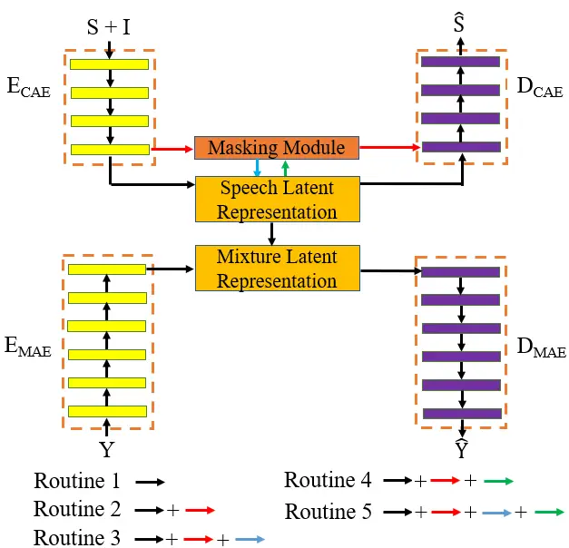
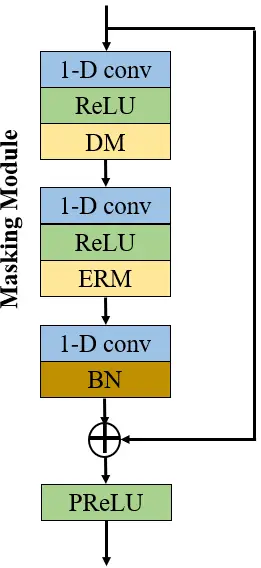
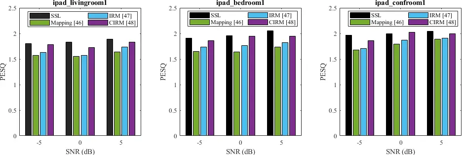

# Feature Learning and Ensemble Pre-Tasks Based Self-Supervised Speech Denoising and DereverberationThanks: Yi Li, ShuangLin Li, and Syed Mohsen Naqvi are with the Intelligent Sensing and Communications Group, School of Engineering, Newcastle University, Newcastle upon Tyne NE1 7RU, U.K. (e-mails: y.li140, l.shuanglin2, mohsen.naqvi@newcastle.ac.uk) Thanks: Yang Sun is working with the Big Data Institute, University of Oxford, Oxford OX3 7LF, U.K. (e-mail: Yang.sun@bdi.ox.ac.uk)Thanks: E-mail for correspondence: y.li140@newcastle.ac.uk

Yi Li    ShuangLin Li Affiliation: Yang Sun,  and Syed Mohsen Naqvi, 

###### Abstract

Self-supervised learning (SSL) achieves great success in monaural speech
enhancement, while the accuracy of the target speech estimation,
particularly for unseen speakers, remains inadequate with existing
pre-tasks. As speech signal contains multi-faceted information including
speaker identity, paralinguistics, and spoken content, the latent
representation for speech enhancement becomes a tough task. In this
paper, we study the effectiveness of each feature which is commonly used
in speech enhancement and exploit the feature combination in the SSL
case. Besides, we propose an ensemble training strategy. The latent
representation of the clean speech signal is learned, meanwhile, the
dereverberated mask and the estimated ratio mask are exploited to
denoise and dereverberate the mixture. The latent representation
learning and the masks estimation are considered as two pre-tasks in the
training stage. In addition, to study the effectiveness between the
pre-tasks, we compare different training routines to train the model and
further refine the performance. The NOISEX and DAPS corpora are used to
evaluate the efficacy of the proposed method, which also outperforms the
state-of-the-art methods.

###### Index Terms: 

self-supervised learning, monaural speech enhancement, feature
combination, ensemble learning, dereverberation.

## I INTRODUCTION

Speech signals recorded in an enclosure with a single and distant
microphone are subject to reverberation, which degrade the speech
intelligibility in audio signal processing algorithms \[1\]. Thus,
monaural speech enhancement comprising denoising and dereverberation is
the task of providing the enhanced speech signal and improving the
speech quality. Recently, speech enhancement research has seen rapid
progress by employing deep learning techniques for several applications
such as mobile phones, Voice over Internet Protocol (VoIP), and speech
recognition \[2\].

Two key challenges in monaural speech enhancement are the gain of clean
targets and mismatched training and testing conditions \[3\]. Firstly,
contemporary supervised monaural speech enhancement relies on the
availability of many paired training examples, which is expensive and
time-consuming to produce. This limitation is particularly acute in
specialized domains like biomedicine, where crowdsourcing is difficult
to apply \[4\]. Self-supervision has emerged as a promising paradigm to
overcome the annotation bottleneck by automatically generating noisy
training examples from unlabeled data. In particular, task-specific
self-supervision converts prior knowledge into self-supervision
templates for label generation, as in distant supervision \[5\], data
programming \[6\], and joint inference \[7\]. Secondly, the speech
enhancement performance is degraded when an acoustic mismatch happens
between the training and testing stages. The mismatches could occur when
the model is trained on data generated with the unseen speakers, noise
types, and SNR levels. In such mismatches, the ability to use the
recorded test mixtures in supervised learning (SL) methods to improve
the performance in the unseen test configurations is limited. Thus, the
recent self-supervised learning (SSL) research is rapidly developed to
solve these challenge in supervised speech enhancement.

In recent years, many SSL approaches have been proposed to address the
monaural speech enhancement problem. Generally, the technique needs to
model the input feature map into meaningful continuous latent
representations containing the desired speech information \[8\]. Then,
to further improve the speech enhancement performance, the model needs
to capture the clean speech information from the learned representation.
The clean speech examples used in the pre-training are unseen from the
downstream training. Therefore, the ability of the trained model to
process the unseen data is improved. One crucial insight motivating this
work is the importance of consistency of the targets, not just the
correctness, which enables the model to focus on modelling the
relationship between the clean speech signal and the noisy mixture. In
further research, the well-trained models are evaluated on artificially
reverberated datasets to show the dereverberation performance in SSL
study \[9\]. Inspired by our previous work \[10, 11, 12\], in this
paper, an SSL-based method is proposed for speech enhancement problem in
real reverberant environments because it is highly practical \[3\].

The contributions of the paper are threefold:

$`\bullet`$ Two pre-tasks with self-training are proposed to solve the
speech enhancement problem. Firstly, we use an autoencoder to learn a
latent representation of clean speech signals and autoencoder on noisy
mixture with the shared representation of the clean examples. Second, to
address the speech enhancement problem with the reverberant environment,
the dereverberation mask (DM) and the estimated ratio mask (ERM) are
applied in the masking module. The learned latent representation and the
masking module are ensemble to estimate the target speech and noisy
mixture spectra.

$`\bullet`$ The latent representation and the masking module share the
model but extract different desired information from the feature maps.
Therefore, to study the effectiveness between the pre-tasks, we provide
different training routines and further use the information obtained
from one pre-task to train the other one.

$`\bullet`$ Various features are individually extracted from the spectra
and the performance of each feature is evaluated in the SSL case.
Furthermore, to the best of out knowledge, the feature combination is
firstly proposed in the SSL-based speech enhancement study to refine the
performance.

## II RELATED WORK

### II-A Training Targets

In the reverberant environments, the convolutive mixture is usually
generated with the RIRs for reverberant speech and interference
$`h_{s}(m)`$ and $`h_{i}(m)`$ at discrete time $`m`$ as:

```math
y(m)=s(m)*h_{s}(m)+i(m)*h_{i}(m) \tag{1}
```

where ‘$`\ast`$’ indicates the convolution operator. The desired speech
signal, the interference and the reverberant mixture are presented as
$`s(m)`$, $`i(m)`$, and $`y(m)`$, respectively. By using the short time
Fourier transform (STFT), the mixture is shown as:

```math
Y(t,f)=S(t,f)H_{s}(t,f)+I(t,f)H_{i}(t,f) \tag{2}
```

where $`S(t,f)`$, $`I(t,f)`$ and $`Y(t,f)`$ denote the STFTs of speech,
interference, and mixture at time $`t`$ and frequency $`f`$,
respectively. Besides, the RIRs for speech and interference are
presented as $`H_{s}(t,f)`$ and $`H_{i}(t,f)`$ respectively. In speech
enhancement problem, the aim is to reconstruct the spectrum of the clean
speech by using the ideal time-frequency (T-F) mask $`M(t,f)`$ as:

```math
S(t,f)=Y(t,f)M(t,f) \tag{3}
```

Generally, the mask $`M(t,f)`$ is a ratio mask. For example, in our
previous work \[10, 11\], the DM and ERM are proposed to estimate the
target speech from the reverberant mixture in a two-stage structure.
There are two signal approximation (SA)-long short-term memory (LSTM)
networks i.e., DM$`\_`$LSTM and ERM$`\_`$LSTM which individually trains
the DM and ERM. The DM is defined as:

```math
DM\left(t,f\right)=\left[S\left(t,f\right)+I\left(t,f\right)\right]Y\left(t,f\right)^{-1} \tag{4}
```

Then, the estimated dereverberated mixture
$`{\hat{Y}_{d}}\left(t,f\right)`$ is obtained from the output layer of
the first network DM$`\_`$LSTM as:

```math
{\hat{Y}_{d}}\left(t,f\right)=Y\left(t,f\right)\widehat{DM}\left(t,f\right) \tag{5}
```

where $`\widehat{DM}\left(t,f\right)`$ is the estimated DM. Even though,
in practice, obtaining the dereverberated mixtures is very challenging
\[13\]. Therefore, in the second network ERM$`\_`$LSTM, the ERM is
exploited to better model the relationship between the clean speech
signal and the estimated dereverberated mixture due to the sequentially
trained network structure.

```math
\widehat{ERM}\left(t,f\right)=\frac{{\mid}S(t,f){\mid}}{{\mid}{\hat{Y}_{d}}\left(t,f\right){\mid}}. \tag{6}
```

The final reconstructed speech signal can be obtained with the estimated
$`M(t,f)`$, i.e., the multiplication of $`\widehat{DM}\left(t,f\right)`$
and $`\widehat{ERM}\left(t,f\right)`$ as:

```math
\hat{S}(t,f)=\widehat{ERM}\left(t,f\right)\widehat{DM}\left(t,f\right)Y\left(t,f\right) \tag{7}
```

However, the two-stage structure suffers a limitation, its computational
cost is almost doubled compared to the single-stage model methods.
Therefore, in this work, the proposed masking module consists of two T-F
masks and is trained as one of pre-tasks in the single-stage model to
efficiently improve the speech enhancement performance.

### II-B Features

According to \[14\], it is well-known that extracted features as input
and learning machines play a complementary role in the monaural speech
enhancement problem. Therefore, we select five commonly-used features in
speech enhancement and provide a brief introduction for them. The
complementary feature set of these features has been proved to show
stable performance in various test conditions and outperforms each of
its components significantly \[15\].

#### II-B1 Spectrogram

Recently, the spectrogram has been proved to be a crucial representation
for speech enhancement problem with time-frequency decomposition \[16\].
The spectrogram consists of 2D images representing sequences of
short-time Fourier transform (STFT) with time and frequency as axes, and
brightness representing the strength of a frequency component at each
time frame. In the speech enhancement problem, the noisy mixture
spectrogram is fed into the model producing an enhanced speech
spectrogram.

#### II-B2 MFCC

In the mel frequency cepstral coefficients (MFCC) feature extraction,
the noisy mixture is passed through a first-order FIR filter in the
pre-emphasis stage to boost the high-band formants \[17\]. As one of the
most commonly used features in the speech enhancement problem, the MFCC
provides a spectral representation of speech that incorporates some
aspects of audition \[18\]. Implementation of the spectral feature
mapping technique using MFCC features has the advantage of reducing the
length of the input feature vector.

#### II-B3 AMS

Amplitude modulation spectrograms (AMS) are motivated by psycho-physical
and psycho-physiological findings on the processing of amplitude
modulations in the auditory system of mammals \[19\]. Consequently, they
have originally been exploited in binaural speech enhancement problem to
extract the target speech with spatial separation \[19\]. For
single-channel speech enhancement with signal-to-noise ratio (SNR)
estimation, AMS features are combined with a modulation domain Kalman
filter \[20\]. Besides, in reverberant environments, AMS features
perform competitive compared to simple spectrogram \[21\].

#### II-B4 RASTA-PLP

In \[22\], relative spectral transform and perceptual linear prediction
(RASTA-PLP) is first introduced to speech processing. In speech
enhancement problem, an overlap-add analysis technique is used to the
cubic root of the power spectrum of noisy speech, which has been
filtered and then cubed \[23\]. RASTA-PLP is an extension of perceptual
linear prediction (PLP) and the only different from the PLP, is that a
band pass filter is added at each sub band \[24\].

#### II-B5 cochleagram

As a form of spectrogram, the cochleagram assigns a false colour which
displays spectra in color recorded in the visible or non-visible parts
of spectra to each range of sound frequencies. In speech enhancement
problem, the cochleagram exploits a gammatone filter and shows better
reveal spectral information than the conventional spectrogram \[25\].
The resulting time–frequency feature map provides more frequency
components in the lower frequency range with narrow bandwidth and fewer
frequency components in the upper frequency range with wide bandwidth,
thereby revealing more spectral information than the feature map from
the conventional spectrogram \[25\].

### II-C Self-Supervised Speech Enhancement

SSL-based speech enhancement involves pre-training a latent
representation module on limited clean speech data with an SL objective,
followed by large-scale unlabelled data with an SSL objective \[3\]. The
latent representation of the clean speech is commonly used as the
training target in SSL studies \[3, 26\]. The learned representation can
capture important underlying structures from the raw input, e.g.,
intermediate concepts, features, or latent variables that are useful for
the downstream task. Following the increasing popularity within the
speech enhancement problem, some attempts have been done to extend SSL
to discover audio and speech representations \[8, 27\]. For example,
authors introduce a contrastive learning approach towards
self-supervised speech enhancement \[28\]. The speaker-discriminative
features are extracted from noisy recordings, favoring the need for
robust privacy-preserving speech processing. Nevertheless, applying SSL
to speech remains particularly challenging. Speech signals, in fact, are
not only high-dimensional, long, and variable-length sequences, but also
entail a complex hierarchical structure that is difficult to infer
without supervision \[9\].

Recently, many studies have demonstrated the empirical successes of
SSL-based speech enhancement on low-resource clean speech data and
highly reverberant environments. For example, T. Sun et al. propose a
knowledge-assisted waveform framework (K-SENet) for speech enhancement
\[29\]. A perceptual loss function that relies on self-supervised speech
representations pretrained on large datasets is used to provide guidance
for the baseline network. Besides, H.-S. Choi et al. perturb information
in the input signal and provide essential attributes for synthesis
networks to reconstruct the input signal \[30\]. Instead of using
labels, a new set of analysis features is used, i.e., wav2vec feature
and newly proposed pitch feature, Yingram, which allows for fully
self-supervised training. However, both methods reply on large-scale
training data, which is expensive to obtain. Therefore, the
state-of-the-art SSL methods based on the limited training data are
eager to develop.

## III PROPOSED METHOD

### III-A Overall Architecture



Fig. 1: The overall architecture of the proposed method. The clean
speech $`\mathbf{S}`$ and interference $`\mathbf{I}`$ are fed into the
$`E_{CAE}`$. The interference consists of background noises,
reverberation of both speech and noise signals. After the feature
combination is extracted, as the first pre-task, the latent
representation of the clean speech signal is learned via $`E_{CAE}`$. As
the second pre-task, the DM and ERM are estimated in the masking module.
Besides, the proposed method utilizes the speech reconstruction losses
of each pre-task to train the other pre-task. After the feature maps are
recovered in the decoder, the reconstructed clean spectra are obtained
as the output by using $`D_{CAE}`$. By using the learned speech
representation into the mixture representation, the estimated mixtures
are produced from the mixture autoencoder (MAE) with unpaired and unseen
training mixture spectra $`\mathbf{Y}`$.

The overall architecture is presented in Fig. 1. In the training stage,
two variational autoencoders, one clean speech autoencoder (CAE) and one
mixture autoencoder (MAE), are exploited for different tasks. The
encoder and decoder of the CAE are denoted as $`E_{CAE}`$ and
$`D_{CAE}`$, respectively. Similarly, $`E_{MAE}`$ and $`D_{MAE}`$ are
used to present the encoder and decoder of the MAE respectively.
Besides, in order to simplify the equations, $`\mathbf{S}`$,
$`\mathbf{I}`$, and $`\mathbf{Y}`$ are used to replace $`S(t,f)`$,
$`I(t,f)`$ and $`Y(t,f)`$, respectively.

The input of the $`E_{CAE}`$ consists of a limited set of clean speech
signals, background noise, and reverberated both speech and noise
signals. First, five features introduced in Related Work is extracted at
the frame level and are concatenated with the corresponding delta
features. Then, the encoder $`E_{CAE}`$ produces the latent
representation of the clean speech signal by compressing the spectra
into higher dimensional space. In the proposed method, two pre-tasks are
considered for pre-training: latent representation learning and mask
estimation. The first task aims to learn the latent representation of
only clean speech signals by autoencoding on their magnitude spectra. In
addtion, in the second task, DM and ERM are trained to describe the
relationships from the target speech signal to the mixture as equations
(4)$`\&`$(6). Both the latent representation and masks are trained by
minimizing the discrepancy between the clean speech spectra and the
corresponding reconstruction. The decoder is trained by the losses from
two pre-tasks and use the estimated speech latent representation and
estimated masks from pre-tasks to produce the target speech spectra as
the output.

Different from the CAE, the MAE only needs to access the reverberant
mixture. The $`E_{MAE}`$ obtains the reverberant mixture and extract the
feature combination similar to $`E_{CAE}`$. Consequently, the latent
representation of the mixture $`\mathbf{X_{M}}`$ is obtained as the
output of $`E_{MAE}`$. The learned representation and masks from the CAE
are exploited to modify the loss functions and learn a shared latent
space between the clean speech and mixture representations. To achieve
this, we use the CAE and incorporate the cycle-consistency terms into
the overall loss. Then, two latent representations before and after the
cycle loop through the CAE can be trained to be close. Benefited from
the pre-tasks, a mapping function from the mixture spectra to the target
speech spectra is learned with the latent representation of the clean
speech signal. Furthermore, $`D_{MAE}`$ is trained to produce the
estimated mixture as the downstream task.

In the testing stage, because the loss function in $`E_{MAE}`$ is
trained with the mapping of the latent space from the mixture spectra to
the target speech spectra, the unseen reverberant mixtures are fed into
the trained $`E_{MAE}`$ and the features are extracted. Then, the
trained $`E_{MAE}`$ produces an estimated latent representation of the
reverberant mixture. Finally, the trained $`D_{CAE}`$ obtains the
reconstructed representation and maps to the target speech signal.

### III-B Feature Combination

The feature plays an important part in the speech enhancement problem
\[31\]. According to \[15\], different acoustic features characterize
different properties of the speech signal. Therefore, we apply feature
learning including spectrogram, MFCC, AMS, RASTP-PLP, and cochleagram
which are commonly used in supervised speech enhancement to examine the
performance of each feature in SSL. To achieve that, each of the five
features is independently extracted from the spectra of clean speech
signals and noisy mixtures. Then, each feature is severally used in the
encoder to learn the latent representation. Besides, in the masking
module, the DM and ERM are calculated with the feature combinations of
the clean speech and the mixture spectra. Therefore, according to (7),
the masks are applied to the reverberant mixture to estimate the target
speech. Our feature learning study provides the different levels of
speech enhancement performance improvement with different types of
features.

Moreover, in order to further improve the speech enhancement performance
compared to using the individual feature, feature combination is
introduced to combine various complementary features \[10\]. A
straightforward way of finding complementary features is to try all
combinations of features. However, the number of combinations is
exponential with respect to the number of features. Inspired by \[32\],
group Lasso (least absolute shrinkage and selection operator) to quickly
identify complementary features and the features that have relatively
large responses are selected as the complementary features. After the
features are extracted at the frame level and are concatenated with the
corresponding delta features \[33\]. Then, the auto-regressive moving
average (ARMA) filter is exploited to smooth temporal trajectories of
all features \[34\]. Consequently, the feature combination based latent
representation is used to estimate the loss between the clean speech and
the reconstructed latent representations. The proposed SSL-based feature
combination method is intuitive as it uses the complementary features in
combination, and simple in that the selected features are estimated
separately.

### III-C Ensemble Pre-Tasks

Different from the single pre-task SSL methods, the proposed method
exploits the masking module to further improve the denoising and
dereverberation performances. In this work, the internal effectiveness
between the two pre-tasks is studied. Therefore, we design five routines
to differently train the models with the same input.

Routine 1 uses the single pre-task as \[3\]. The proposed masking module
is introduced as the second pre-task in the routine 2. Moreover, the
routine 3 applies the loss from latent representation learning to help
train the masking module, while vice versa in the routine 4. Finally,
the The losses from each pre-task is used to train the other one in the
routine 5.

#### III-C1 Routine 1

The original single pre-task method similar to \[3\] is used in this
routine. A limited training set of clean speech signals are exploited to
learn the latent representation and a mapping from the mixture to the
target speech is learned with the latent representation of the desired
speech signal.

We use two loss terms to calculate the overall loss for the CAE. The
discrepancy between the clean speech spectra and the reconstruction
$`\hat{\mathbf{S}}`$ with the $`L`$2 norm of the error is calculated as:

```math
\mathcal{L}_{\mathbf{S}}=\|\mathbf{S}-\hat{\mathbf{S}}\|_{2}^{2} \tag{8}
```

The Kullback-Leibler (KL) loss of the CAE is denoted as
$`\mathcal{L}_{\text{KL-CAE }}`$ and is applied to train the latent
representation closed to a normal distribution \[3\]. Therefore, the
overall for the CAE is given as:

```math
\mathcal{L}_{\text{CAE}}=\lambda_{1}\cdot\mathcal{L}_{\text{KL-CAE }}+\mathcal{L}_{\mathbf{S}} \tag{9}
```

The coefficient $`\lambda_{1}`$ is added and set to 0.001. Similarly,
the $`\mathcal{L}_{\mathbf{Y}}`$ denotes the loss between the noisy
mixture and the corresponding reconstruction $`\hat{\mathbf{Y}}`$ as:

```math
\mathcal{L}_{\mathbf{Y}}=\|\mathbf{Y}-\hat{\mathbf{Y}}\|_{2}^{2} \tag{10}
```

Besides, in order to enforce a shared latent representation between the
two autoencoders, the mixture cycle loss $`\mathcal{L}_{\text{Y-cyc }}`$
is added as:

```math
\mathcal{L}_{\text{Y-cyc }}=\|\mathbf{Y}-\hat{\mathbf{Y}}\|_{2}^{2}+\lambda_{2}\cdot\left\|\mathbf{X_{Y}}-\hat{\mathbf{X}}_{\mathbf{Y}}\right\|_{2}^{2} \tag{11}
```

where $`\lambda_{2}=0.01`$. $`\mathbf{X_{Y}}`$ and
$`\hat{\mathbf{X}}_{\mathbf{Y}}`$ denote the latent representation of
noisy mixture and the reconstruction, respectively. The latent
representation is fed into the MAE decoder for mapping the target speech
spectrogram from the mixture spectrogram. Then, the mapping
representation helps the CAE to obtain the reconstruction. The input
mixture spectrogram is resembled by the cycle reconstruction of the
mixture spectrogram. Besides, the two latent representations are close
with the CAE losses. Furthermore, the overall loss to train the MAE is a
combination of loss terms with the KL loss
$`\mathcal{L}_{\text{KL-MAE }}`$ as:

```math
\mathcal{L}_{\text{MAE}}=\lambda_{3}\cdot\mathcal{L}_{\text{KL-MAE }}+\mathcal{L}_{\mathbf{Y}}+\mathcal{L}_{\text{Y-cyc }} \tag{12}
```

where $`\lambda_{3}`$ is the coefficient of
$`\mathcal{L}_{\text{KL-masking }}`$ and empirically set to 0.001. In
the testing stage, the path $`E_{MAE}\rightarrow D_{CAE}`$ provides the
estimated speech. However, speech enhancement performance of the routine
1 is limited due to the single pre-task. Therefore, the second pre-task
is introduced to improve performance in the routine 2.

#### III-C2 Routine 2

Compared to the routine 1, the second pre-task is added in the routine 2. The pre-tasks are designed in parallel between the $`E_{CAE}`$ and
$`D_{CAE}`$. After the feature combinations are extracted, the latent
representation is obtained from the first pre-task and the masking
module obtains the feature combination to produce the estimated speech
as the second pre-task. The architecture of the masking module is
depicted in Fig. 2.



Fig. 2: The architecture of the proposed masking module. The feature
combinations of the clean speech, interference, and noisy mixture are
fed into the masking module. After the DM and ERM are estimated, the
estimated speech are produced for the decoder.

The masking module has three sub-layers and aims to estimate the clean
speech feature combination. To achieve this, the first two sub-layers
consists of two T-F masks, DM and ERM, respectively. After the feature
combinations of speech signals, interferences and noisy mixtures are
obtained from the first sub-layer, 1D convolutional layers with a kernel
size of 1 $`\times`$ 7 are used to enlarge the receptive field along the
frequency axis \[35\]. Then, the DM is applied to model the relationship
between the dereverberated mixture and the noisy mixture as (4).
However, the dereverberation with only the DM is very challenging in a
highly reverberant scenario \[11\]. Therefore, in the second sub-layer,
the ERM is used to better estimate the relationship between the clean
speech and the estimated dereverberated mixture as (6). Both sub-layers
are followed by batch normalization (BN) to accelerate the model
training \[36\]. The estimated speech feature combination
$`\hat{\mathbf{S}}^{\prime}`$ from the masking module can be obtained
with the sequentially trained sub-layers as the multiplication of
estimated masks. The losses from two pre-tasks, i.e., latent
representation learning and masking module, are jointly train the
$`D_{CAE}`$ to estimate the final clean speech.

In the downstream training, the unseen and unpaired noisy mixture
spectra are fed into the MAE and the feature combination is extracted
from the spectra. Different from the upstream training, we only consider
one way to reconstruct the mixture spectra. First, the noisy mixture is
encoded in the $`E_{MAE}`$. At the bottleneck of the MAE, on the one
hand, the latent representation of the noisy mixture is learned. On the
other hand, the mixture cycle loss $`\mathcal{L}_{\text{Y-cyc }}`$ is
added to enforce the shared latent space between two autoencoders as
(11). Consequently, the estimated mixture latent representation can be
generated. At the final step, the $`D_{MAE}`$ produce the final
estimated mixture. According to the routine 2, the target speech is
estimated with the ensemble pre-tasks. However, the estimations from
each pre-task have different levels of degradation compared to the clean
speech. Therefore, in the routines 3$`\&`$4, the loss from one pre-task
is used to train the other.

#### III-C3 Routine 3

As aforementioned, in the routine 3, the learned latent representation
is further used to train the masking module. We first calculate the
temporal masking module loss as:

```math
\mathcal{L}_{\mathbf{S}^{\prime}_{masking}}=\left\|\mathbf{S}-\hat{\mathbf{S}}^{\prime}\right\|_{2}^{2} \tag{13}
```

where $`\prime`$ denotes temporal terms. In the first pre-task, the
latent representation of the clean speech is learned by minimizing the
loss between the clean latent representation $`\mathbf{X_{S}}`$ and the
reconstruction $`\hat{\mathbf{X}}_{\mathbf{S}}`$ as:

```math
\mathcal{L}_{\mathbf{X_{S}}}=\left\|\mathbf{X_{S}}-\hat{\mathbf{X}}_{\mathbf{S}}\right\|_{2}^{2} \tag{14}
```

Then, the latent space loss $`\mathcal{L}_{\mathbf{X_{S}}}`$ is added to
further minimize the masking module loss as:

```math
\mathcal{L}_{\mathbf{S}_{masking}^{r3}}=\left\|\mathbf{S}-\hat{\mathbf{S}}^{\prime}\right\|_{2}^{2}+\lambda_{4}\cdot\mathcal{L}_{\mathbf{X_{S}}} \tag{15}
```

where $`r3`$ denotes the routine 3. The coefficient $`\lambda_{4}`$ is
added as a constraint and set to 0.1. After the masking module loss is
minimized, the overall loss to train the CAE can be calculated as:

```math
\mathcal{L}_{\text{CAE}}^{r3}=\lambda_{5}\cdot\mathcal{L}_{\text{KL-CAE }}+\mathcal{L}_{\mathbf{S}}+\mathcal{L}_{\mathbf{S}_{masking}}+\mathcal{L}_{\mathbf{X_{S}}} \tag{16}
```

where $`\lambda_{5}`$ is the coefficient of
$`\mathcal{L}_{\text{KL-masking }}`$ and empirically set to 0.001. After
the MAE is trained, the estimated speech can be obtained from the path
$`E_{MAE}\rightarrow D_{CAE}`$.

#### III-C4 Routine 4

Different from the routine 3, the output from the masking module helps
to learn the target latent presentation in the routine 4. Firstly, the
temporal latent representation loss is calculated as:

```math
\mathcal{L}_{\mathbf{X_{S}^{\prime}}}=\left\|\mathbf{X_{S}}-\hat{\mathbf{X}}_{\mathbf{S}}^{\prime}\right\|_{2}^{2} \tag{17}
```

In the second pre-task, the masking module is trained to estimate the
clean speech by minimizing the loss between the clean speech and the
temporal reconstruction as:

```math
\mathcal{L}_{\mathbf{S}_{masking}^{r4}}=\left\|\mathbf{S}-\hat{\mathbf{S}}^{\prime}\right\|_{2}^{2} \tag{18}
```

Then, the masking module loss
$`\mathcal{L}_{\mathbf{S}_{masking}^{r4}}`$ is added to improve the
estimation accuracy of the clean speech latent representation with the
loss term as:

```math
\mathcal{L}_{\mathbf{X_{S}}}=\left\|\mathbf{X_{S}}-\hat{\mathbf{X}}_{\mathbf{S}}^{\prime}\right\|_{2}^{2}+\lambda_{6}\cdot\mathcal{L}_{\mathbf{S}_{masking}^{r4}} \tag{19}
```

where the coefficient $`\lambda_{6}`$ is set to 0.1. The overall loss of
the CAE is similar to the routine 3 as (16). Compared to the routine 2,
the latent representation is better estimated with the estimation from
the masking module. In the downstream task training, the further trained
latent representation helps the MAE to improve the noisy mixture
estimation with the mixture cycle loss.

#### III-C5 Routine 5

In order to further improve the speech enhancement performance, the
routines 3$`\&`$4 are combined in the routine 5. The losses from each
pre-task are exploited to further train the other in the CAE. In the
testing stage, the path $`E_{MAE}\rightarrow D_{CAE}`$ provides the
estimated speech. The pseudocode of the CAE training in the routine 5 is
summarized as Algorithm 1.

input : Clean spectra $`\mathbf{S}`$, interferences $`\mathbf{I}`$,
noisy speech spectra $`\mathbf{Y}`$, learning rate $`\eta`$, epoch
$`E_{max}`$

output : Estimated clean speech $`\hat{\mathbf{S}}`$

Initialize CAE and MAE parameters;

for _$`E=1,2,...,E_{max}`$_ do

  Obtain the latent representations $`\mathbf{X_{S}}\leftarrow`$
$`\mathbf{S}`$ and $`\mathbf{X_{Y}}`$ $`\leftarrow`$ $`\mathbf{Y}`$;

  Calculate $`\mathcal{L}_{\mathbf{X_{S}^{\prime}}}`$ $`\leftarrow`$
$`\mathbf{X_{S}}`$, $`\hat{\mathbf{X}}_{\mathbf{S}}^{\prime}\qquad`$ //
First Pre-Task;

  Estimate the $`\widehat{DM}`$ and $`\widehat{ERM}`$ $`\leftarrow`$
$`\mathbf{S}`$, $`\mathbf{I}`$, and $`\mathbf{Y}`$;

  Estimate $`\hat{\mathbf{S}}^{\prime}`$ $`\leftarrow`$ $`\mathbf{Y}`$,
$`\widehat{DM}`$, and $`\widehat{ERM}`$;

  Calculate $`\mathcal{L}_{masking}^{\prime}\qquad`$ // Second Pre-Task;

  Update the $`\hat{\mathbf{X}}_{\mathbf{S}}`$ $`\leftarrow`$
$`\mathcal{L}_{\mathbf{X_{S}^{\prime}}}`$,
$`\mathcal{L}_{masking}^{\prime}`$;

  Update the $`\hat{\mathbf{S}}`$ $`\leftarrow`$
$`\mathcal{L}_{\mathbf{X_{S}^{\prime}}}`$,
$`\mathcal{L}_{masking}^{\prime}`$;

  Train CAE by minimizing $`\mathcal{L}_{\text{CAE}}`$;

  end for

Algorithm 1 Routine 5 pesudocode.

## IV EXPERIMENTAL RESULTS

### IV-A Comparisons

The proposed method is compared with three state-of-the-art SSL speech
enhancement approaches \[3, 28, 37\] on two publicly-available datasets.
The first method is SSE \[3\] which exploits two autoencoders to process
pre-task and downstream task, respectively. The second method is
pre-training fine-tune (PT-FT) \[37\], which uses three models and three
SSL approaches for pre-training: speech enhancement, masked acoustic
model with alteration (MAMA) used in TERA \[38\] and continuous
contrastive task (CC) used in wav2vec 2.0 \[39\]. The PT-FT method is
reproduced with DPTNet model \[40\] and three pre-tasks because it shows
the best speech enhancement performance in \[37\]. The third method
applies a simple contrastive learning (CL) procedure which treats the
abundant noisy data as makeshift training targets through pairwise noise
injection \[37\]. In the baseline, the recurrent neural network (RNN)
outputs with a fully-connected dense layer with sigmoid activation to
estimate a time-frequency mask which is applied onto the noisy speech
spectra. The configuration difference is shown in TABLE I. The cross
mark ✗ means the method does not use the setting such as no
reverberations in \[28\] but does not mean it cannot be handled in the
method.

|                 |           |           |              |          |
| --------------- | --------- | --------- | ------------ | -------- |
|                 | CL \[28\] | SSE \[3\] | PT-FT \[37\] | Proposed |
| Noise           | ✓         | ✗         | ✓            | ✓        |
| Paired Data     | ✓         | ✗         | ✓            | ✗        |
| Multiple Models | ✗         | ✓         | ✗            | ✓        |
| Single Pre-Task | ✓         | ✓         | ✗            | ✗        |
| Reverberation   | ✗         | ✓         | ✗            | ✓        |

TABLE I: Comparison of SSL methods with the proposed approach. The PT-FT
method use 50,800 paired utterances in the training stage, however, only
200 unpaired utterances are applied in the proposed method. Moreover,
the number of pre-tasks is set to 3 and 2 in the PT-FT and proposed
method, respectively.

|              |      |      |      |      |      |      |      |      |      |      |      |      |      |      |      |      |
| ------------ | ---- | ---- | ---- | ---- | ---- | ---- | ---- | ---- | ---- | ---- | ---- | ---- | ---- | ---- | ---- | ---- |
|              | PESQ |      |      |      | CSIG |      |      |      | CBAK |      |      |      | COVL |      |      |      |
| SNR (dB)     | -10  | -5   | 0    | 5    | -10  | -5   | 0    | 5    | -10  | -5   | 0    | 5    | -10  | -5   | 0    | 5    |
| CL \[28\]    | 1.43 | 1.52 | 1.54 | 1.60 | 1.96 | 2.20 | 2.30 | 2.40 | 1.57 | 1.76 | 1.92 | 2.03 | 1.55 | 1.77 | 1.86 | 1.94 |
| SSE \[3\]    | 1.48 | 1.53 | 1.56 | 1.58 | 2.04 | 2.30 | 2.39 | 2.45 | 1.63 | 1.83 | 1.94 | 2.10 | 1.68 | 1.81 | 1.88 | 2.00 |
| PT-FT \[37\] | 1.52 | 1.55 | 1.59 | 1.62 | 2.10 | 2.28 | 2.34 | 2.43 | 1.67 | 1.81 | 1.96 | 2.08 | 1.68 | 1.78 | 1.89 | 2.00 |
| Proposed     | 1.74 | 1.80 | 1.83 | 1.89 | 2.47 | 2.56 | 2.59 | 2.63 | 1.95 | 2.02 | 2.15 | 2.30 | 1.86 | 1.98 | 2.03 | 2.17 |

TABLE II: speech enhancement performance in terms of three noise
interferences at four snr levels in ipad$`\char 95\relax`$livingroom1.
each result is the average value of 600 experiments. italic shows the
proposed methods. bold indicates the best result.

|              |      |      |      |      |      |      |      |      |      |      |      |      |      |      |      |      |
| ------------ | ---- | ---- | ---- | ---- | ---- | ---- | ---- | ---- | ---- | ---- | ---- | ---- | ---- | ---- | ---- | ---- |
|              | PESQ |      |      |      | CSIG |      |      |      | CBAK |      |      |      | COVL |      |      |      |
| SNR (dB)     | -10  | -5   | 0    | 5    | -10  | -5   | 0    | 5    | -10  | -5   | 0    | 5    | -10  | -5   | 0    | 5    |
| CL \[28\]    | 1.45 | 1.57 | 1.59 | 1.61 | 1.93 | 2.25 | 2.32 | 2.39 | 1.69 | 1.82 | 1.99 | 2.08 | 1.70 | 1.82 | 1.90 | 2.03 |
| SSE \[3\]    | 1.50 | 1.59 | 1.62 | 1.65 | 2.11 | 2.34 | 2.43 | 2.49 | 1.72 | 1.88 | 1.97 | 2.16 | 1.73 | 1.84 | 1.89 | 2.02 |
| PT-FT \[37\] | 1.57 | 1.64 | 1.73 | 1.74 | 2.16 | 2.33 | 2.46 | 2.51 | 1.75 | 1.91 | 2.03 | 2.19 | 1.77 | 1.85 | 1.94 | 2.05 |
| Proposed     | 1.82 | 1.91 | 1.96 | 2.05 | 2.47 | 2.58 | 2.64 | 2.69 | 1.99 | 2.08 | 2.20 | 2.31 | 1.93 | 2.02 | 2.11 | 2.17 |

TABLE III: speech enhancement performance in terms of three noise
interferences at four snr levels in ipad$`\char 95\relax`$bedroom1. each
result is the average value of 600 experiments. italic shows the
proposed methods. bold indicates the best result.

|              |      |      |      |      |      |      |      |      |      |      |      |      |      |      |      |      |
| ------------ | ---- | ---- | ---- | ---- | ---- | ---- | ---- | ---- | ---- | ---- | ---- | ---- | ---- | ---- | ---- | ---- |
|              | PESQ |      |      |      | CSIG |      |      |      | CBAK |      |      |      | COVL |      |      |      |
| SNR (dB)     | -10  | -5   | 0    | 5    | -10  | -5   | 0    | 5    | -10  | -5   | 0    | 5    | -10  | -5   | 0    | 5    |
| CL \[28\]    | 1.48 | 1.58 | 1.62 | 1.63 | 2.09 | 2.26 | 2.33 | 2.44 | 1.77 | 1.84 | 2.00 | 2.09 | 1.81 | 1.85 | 1.92 | 2.06 |
| SSE \[3\]    | 1.53 | 1.61 | 1.65 | 1.66 | 2.12 | 2.35 | 2.46 | 2.47 | 1.78 | 1.93 | 2.00 | 2.17 | 1.80 | 1.85 | 1.90 | 2.05 |
| PT-FT \[37\] | 1.60 | 1.66 | 1.74 | 1.77 | 2.18 | 2.34 | 2.45 | 2.53 | 1.83 | 1.94 | 2.05 | 2.23 | 1.96 | 2.02 | 2.07 | 2.10 |
| Proposed     | 1.85 | 1.97 | 2.00 | 2.04 | 2.48 | 2.60 | 2.65 | 2.72 | 2.05 | 2.13 | 2.21 | 2.36 | 2.01 | 2.02 | 2.15 | 2.25 |

TABLE IV: speech enhancement performance in terms of three noise
interferences at four snr levels in ipad$`\char 95\relax`$confroom1.
each result is the average value of 600 experiments. italic shows the
proposed methods. bold indicates the best result.

### IV-B Datasets

In the CAE training, 12 clean utterances from 4 different speakers with
three reverberant room environments (ipad$`\char 95\relax`$livingroom1,
ipad$`\char 95\relax`$bedroom1, and ipad$`\char 95\relax`$confroom1) are
randomly selected from the DAPS dataset \[41\]. The training data
consists of 2 male and 2 female speakers each reading out 3 utterances
and recorded in different indoor environments with different real room
impulse responses (RIRs) \[41\]. In the MAE training, the unseen and
independent 300 noisy mixtures from 20 different speakers with three
reverberant room environments are randomly selected from the DAPS
dataset. The training data consists of 10 male and 10 female speakers
each reading out 5 utterances and recorded in different indoor
environments with different real room impulse responses (RIRs) \[41\].
In order to improve the ability of the proposed method in adapting to
unseen speakers, the speakers in the MAE training are manually designed
to be different from the speakers in the CAE training. Moreover, three
background noises ($`factory`$, $`babble`$, and $`cafe`$) from the
NOISEX dataset \[42\] and four SNR levels (-10, -5, 0, and 5 dB) are
used to generate the mixtures in both the CAE and MAE. The validation
data contains 50 noisy mixtures generated by the randomly selected
reverberant speech from the DAPS dataset and the background noise. In
the testing stage, 200 reverberant utterances of 10 speakers are
randomly selected and used to generate the mixtures with the same
background noises and SNR levels for the configuration in the training
stage. Therefore, the numbers of mixtures in CAE training, MAE training,
validation and testing data are 432, 10, 800, 1, 800 and 7, 200,
respectively. It is highlighted that the speakers in the training and
testing stages are unseen in proposed method and all baselines.

### IV-C Experiment Setup

Both $`E_{CAE}`$ and $`D_{CAE}`$ comprise 4 1-D convolutional layers. In
the $`E_{CAE}`$, the size of the hidden dimension sequentially decreases
from 512 $`\rightarrow`$ 256 $`\rightarrow`$ 128 $`\rightarrow`$ 64.
Consequently, the dimension of the latent space is set to 64, and a
stride of 1 sample with a kernel size of 7 for the convolutions.
Different from $`E_{CAE}`$, $`D_{CAE}`$ increases the size of the latent
dimensions inversely.

The MAE network follows a similar architecture to CAE. $`E_{MAE}`$
consists of 6 1-D convolutional layers where the hidden layer sizes
decrease from 512 $`\rightarrow`$ 400 $`\rightarrow`$ 300
$`\rightarrow`$ 200 $`\rightarrow`$ 100 $`\rightarrow`$ 64, and
$`D_{MAE}`$ increases the sizes inversely.

The proposed method is trained by using the Adam optimizer with a
learning rate of 0.001 and the batch size is 20. The number of training
epochs for CAE and MAE are 700 and 1500, respectively. All the
experiments are run on a workstation with four Nvidia GTX 1080 GPUs and
16 GB of RAM. The complex speech spectra have 513 frequency bins for
each frame as a Hanning window and a discrete Fourier transform (DFT)
size of 1024 samples are applied.

According to \[3\], we use composite metrics that approximate the Mean
Opinion Score (MOS) including COVL: MOS predictor of overall processed
speech quality, CBAK: MOS predictor of intrusiveness of background
noise, CSIG: MOS predictor of signal distortion \[43\] and Perceptual
Evaluation of Speech Quality (PESQ). Besides, the signal-to-distortion
ratio (SDR) is evaluated in terms of baselines and the proposed method.
Higher values of the measurements imply better enhancement performance.

### IV-D Comparison with SSL methods

The speech enhancement performance of the proposed method with the
routine 5 and feature combination is compared with state-of-the-art SSL
methods in TABLES I-III.

It can be seen from TABLES II-IV that the proposed method outperforms
the state-of-the-art SSL methods in terms of all three performance
measures. The proposed method has 16.1$`\%`$, 16.5$`\%`$, and 18.7$`\%`$
improvements compared with the PT-FT method in terms of PESQ at -5 dB
SNR level in three environments. The environment
ipad$`\char 95\relax`$livingroom1 is relatively more reverberant
compared to the other two rooms \[41\], while the improvement in
performance is still significant. For example, in TABLE I, the proposed
method has 13.3$`\%`$, 9.5$`\%`$, and 10.6$`\%`$ improvements compared
to the CL, SSE, and PT-FT methods in terms of CBAK at 5 dB,
respectively. Besides, speech enhancement comparisons at four different
SNR levels are shown in TABLES I-III. From the experimental results, the
performance improvement compared to the baselines is obvious even at
relatively low SNR level i.e., -10 dB. Compared to the PT-FT method, the
proposed method has 10.7$`\%`$, 11.2$`\%`$, 7.4$`\%`$ and 8.5$`\%`$
improvements in terms of COVL at four SNR levels.



Fig. 3: Comparisons with supervised learning-based methods at three SNR
levels in three environments (ipad$`\char 95\relax`$livingroom1,
ipad$`\char 95\relax`$bedroom1, and ipad$`\char 95\relax`$confroom1).
Each result is the average value of 200 experiments.

In \[37\], the original PT-FT method is trained with Libri1Mix train-360
set \[44\] which contains 50,800 utterances. However, in the comparison
experiments, we use the limited amount of training utterances (200).
Therefore, the speech enhancement performance of the PT-FT suffers a
significant degradation compared with the original implementation.
Moreover, the speech enhancement performance of each feature is limited.
However, the proposed method takes advantage of each feature in the
feature combination and addresses the speech enhancement problem. Thus,
the speech enhancement performance is improved compared with only
extracting one type of feature from the clean speech representation in
the SSL methods.

|                   |      |      |       |      |      |       |      |      |       |      |      |      |
| ----------------- | ---- | ---- | ----- | ---- | ---- | ----- | ---- | ---- | ----- | ---- | ---- | ---- |
| Feature           | PESQ |      |       | CSIG |      |       | CBAK |      |       | COVL |      |      |
| -5 dB             | 0 dB | 5 dB | -5 dB | 0 dB | 5 dB | -5 dB | 0 dB | 5 dB | -5 dB | 0 dB | 5 dB |      |
| Spectrogram \[3\] | 1.61 | 1.65 | 1.66  | 2.35 | 2.46 | 2.47  | 1.93 | 2.00 | 2.17  | 1.85 | 1.90 | 2.05 |
| MFCC \[17\]       | 1.67 | 1.70 | 1.73  | 2.44 | 2.47 | 2.52  | 2.01 | 2.11 | 2.24  | 1.97 | 2.02 | 2.10 |
| AMS \[45\]        | 1.81 | 1.84 | 1.89  | 2.52 | 2.61 | 2.67  | 2.09 | 2.18 | 2.30  | 2.00 | 2.11 | 2.19 |
| RASTA-PLP \[22\]  | 1.62 | 1.65 | 1.72  | 2.38 | 2.50 | 2.51  | 1.97 | 2.07 | 2.19  | 1.92 | 2.03 | 2.05 |
| cochleagram       | 1.66 | 1.67 | 1.71  | 2.39 | 2.48 | 2.50  | 1.97 | 2.06 | 2.21  | 1.95 | 1.94 | 2.07 |

TABLE V: feature ablation studies in terms of three noise interferences
($`factory`$, $`babble`$, and $`cafe`$) at three SNR levels in
ipad$`\char 95\relax`$confroom1. each result is the average value of 600
experiments. the proposed masking module and ensemble learning are
available in all five implementations.

In the proposed method, the mismatch of the speakers between the
training and testing stages is solved, which is most important in
practical scenarios e.g., speaker-independent. Moreover, the proposed
method can be used where both SNR levels and noise types are unseen,
however, the speech enhancement performance suffers a slight
degradation, which will be handled in future work.

### IV-E Comparison with SL methods

Recently, most of speech enhancement methods are developed based on
supervised learning (SL) due to the promising performance under the
sufficient training data. However, in the practical scenarios, the
training frequently suffers the problem which lacking in paired data.
Therefore, in order to show the competitiveness of the proposed SSL
method, the mapping- and masking-based supervised methods are reproduced
with the same number of training data \[46, 47, 48\]. The SL baselines
are implemented with deep neural networks (DNNs) which use three hidden
layers, each having 1024 rectified linear hidden units as the original
implementations. Apart form the ideal ratio mask (IRM), we also compare
the proposed phase-aware method with the complex ideal ratio mask
(cIRM). The experimental results of comparisons with the SL methods are
presented in Fig. 3. The SL methods are evaluated with the unseen
speakers as the proposed method. In Fig. 3, we can observe that the
proposed SSL method shows better performance than the SL methods. On the
one hand, different from the original experimental settings \[46, 47,
48\], the SL methods are evaluated in a challenging scenario with highly
reverberant environments, limited training data, and unseen speakers,
which suffers a significant performance degradation. However, the
proposed SSL method solves the limitations such as the mismatch between
the training and testing conditions to guarantee the speech enhancement
performance. On the other hand, the compared baselines are not
state-of-the-art approaches. However, the SSL research in speech
enhancement problem just started \[3\]. We simply provide the comparison
between the SSL and SL study to show the competitiveness of the proposed
SSL method. Besides, the experiments are set up in a challenging indoor
environments with high reverberations as the practical scenarios.
Therefore, the speech enhancement of the proposed and baseline SSL
methods is relatively less than the SL methods with the advantage of SSL
methods to be used in practical scenarios e.g., the mixtures are only
available in real room recordings.

### IV-F Ablation Study

Firstly, the effectiveness of each feature is investigated in the SSL
study. It is highlighted that the proposed masking module and ensemble
learning are not introduced in this comparison. The experimental results
with four SNR levels (-10, -5, 0, and 5dB) and three room environments
(ipad$`\char 95\relax`$livingroom1, ipad$`\char 95\relax`$bedroom1, and
ipad$`\char 95\relax`$confroom1) are shown in TABLE V.

From TABLE V, it can be observed that AMS outperforms the other four
features in terms of four performance measures. For example, the AMS
based SSL method has 8.4$`\%`$, 7.7$`\%`$, 11.7$`\%`$ and 9.1$`\%`$
improvements compared to the other four features in terms of PESQ at -5
dB SNR level. As proven in the previous study, AMS mimics important
aspects of the human auditory system in combination with mel-scale
cepstral coefficients \[21\]. The experimental results show the speech
enhancement performance of various features in SSL study and provide
each contribution of each feature in the proposed feature combination
method.

In order to study the effectiveness of ensemble learning, the averaged
speech enhancement performance of five routines with four SNR levels
(-10, -5, 0, and 5dB) and three room environments
(ipad$`\char 95\relax`$livingroom1, ipad$`\char 95\relax`$bedroom1, and
ipad$`\char 95\relax`$confroom1) are compared in TABLE VI with the
feature combination.

| Routine | PESQ | CSIG | CBAK | COVL | SDR (dB) |
| ------- | ---- | ---- | ---- | ---- | -------- |
| 1       | 1.56 | 2.39 | 1.94 | 1.88 | 5.16     |
| 2       | 1.80 | 2.56 | 2.17 | 2.02 | 6.94     |
| 3       | 1.86 | 2.61 | 2.18 | 2.06 | 8.19     |
| 4       | 1.84 | 2.59 | 2.18 | 2.04 | 7.88     |
| 5       | 1.94 | 2.63 | 2.20 | 2.10 | 9.21     |

TABLE VI: ablation study of five training routines of three snr levels
(-5, 0, and 5 dB), three noise interferences ($`factory`$, $`babble`$,
and $`cafe`$) in ipad$`\char 95\relax`$livingroom1. each result is the
average value of 1800 experiments.

| Ablation Settings   |                |                    | Training Time (h) | PESQ | CSIG | CBAK | COVL | SDR (dB) |
| ------------------- | -------------- | ------------------ | ----------------- | ---- | ---- | ---- | ---- | -------- |
| Feature Combination | Masking Module | Ensemble Pre-Tasks |                   |      |      |      |      |          |
| ✗                   | ✗              | ✗                  | 10.7              | 1.48 | 2.28 | 1.90 | 1.84 | 4.76     |
| ✓                   | ✗              | ✗                  | 10.8              | 1.56 | 2.39 | 1.94 | 1.88 | 5.16     |
| ✗                   | ✓              | ✗                  | 11.9              | 1.71 | 2.45 | 2.16 | 1.97 | 5.41     |
| ✗                   | ✓              | ✓                  | 12.5              | 1.77 | 2.48 | 2.17 | 2.06 | 7.02     |
| ✓                   | ✓              | ✗                  | 12.0              | 1.80 | 2.56 | 2.17 | 2.02 | 6.94     |
| ✓                   | ✓              | ✓                  | 12.8              | 1.94 | 2.63 | 2.20 | 2.10 | 9.21     |

TABLE VII: ablation study of contributions with the averaged speech
enhancement performance of three snr levels (-5, 0, and 5 dB), three
noise interferences ($`factory`$, $`babble`$, and $`cafe`$), and three
room environments (ipad$`\char 95\relax`$livingroom1,
ipad$`\char 95\relax`$bedroom1, and ipad$`\char 95\relax`$confroom1).
each result is the average value of 5400 experiments.

The speech enhancement performance of various routines can be seen from
TABLE VI. The routine 1 is the reproduction of the baseline \[3\] which
only learns the latent representation as the single pre-task. The
masking module is added as the second pre-task in the routine 2 and
improves the speech enhancement compared to the routine 1. For example,
in terms of PESQ, the speech enhancement has a 13.3$`\%`$ improvement
with the masking module. As for the routine 3, the learned latent
representation is used to train the masking module. Consequently, the
target speech feature is well preserved in the enhanced features while
interference is effectively reduced such that the CAE generalizes better
to limited training data. Compared to the routine 2, the speech
enhancement performance of the routine 3 is improved. Conversely, the
estimation accuracy of speech and mixture latent representations is
refined by the loss of the masking module in the routine 4. The speech
enhancement performance of the routines 3$`\&`$4 is closed e.g., reach
2.06 and 2.04 in terms of COVL, respectively. In the proposed method,
the routine 5 combines the routines 3$`\&`$4. The loss of each pre-task
e.g., the latent representation and the masking module in the ensemble
learning are exploited to train the other pre-task to train the other
pre-task and the performance is further improved.

Furthermore, the effectiveness of each contribution is investigated
based on the DAPS dataset. The experimental results in terms of four
performance measurements and the training time are shown in TABLE VII.
It is highlighted that the recorded time consists of both the feature
extraction and networks training. Due to the dependency between the
masking module and ensemble pre-tasks, the ablation experiments with the
ensemble pre-tasks but without the masking module are not performed.

Initially, the effectiveness of the feature combination is studied. We
conduct two sets of experiments that differ at the features of input
speech and mixtures. First, the spectra are fed into the encoder as the
baseline \[3\]. Then, the proposed method has an SDR improvement of
8.4$`\%`$ after the feature combination is extracted from the spectra.
The proposed method assigns the weights to each feature of the feature
combination to learn the latent representation of the target feature in
a balanced way. Consequently, different information, distributed in
various features, is extracted to refine the accuracy of the target
speech estimation.

Moreover, the experiment is performed by adding the proposed masking
module. From TABLE VII, it can be observed that the performance is
significantly improved by the DM and ERM estimation among all four
measurements. For example, in terms of PESQ, the performance is improved
from 1.48 to 1.71, which further confirms that the proposed method with
the masking module can boost the enhancement performance. The use of DM
can mitigate the adverse effect of acoustic reflections to extract the
target speech from the noisy mixture. Then, the ERM is estimated by
using the desired speech and the estimated dereverberated mixture, which
can further improve the dereverberation. Thus, the proposed ERM can
better model the relationship between the clean speech and the estimated
dereverberated mixture. As a result, the proposed masking module has a
better ability in adapting to unseen speakers and leading to improved
performance in highly reverberant scenarios.

The ensemble learning i.e., the routine 5 is introduced to the proposed
method. Compared to the baselines, the proposed ensemble learning brings
an obvious improvement in terms of all performance measurements. For
instance, the proposed method has a PESQ improvement from 1.48 to 1.71
after the ensemble learning is introduced. In the SSL study, due to the
limited training data, the learned information from the latent
representation and the masking module is shared between the pre-tasks
and plays an important role in the speech enhancement problem. With the
proposed ensemble learning, each of the pre-task is estimated with the
updated reconstruction of the other and the desired speech information
is better preserved in the enhanced features.

Furthermore, the training time of models with each contribution is
presented in TABLE VII. The computational cost is increased by
exploiting contributions to the proposed method. Therefore, there is a
trade-off between the computational cost and the speech enhancement
performance.

## V CONCLUSION

In this paper, we proposed an SSL method with the feature combination
and ensemble pre-tasks to solve the monaural speech enhancement problem.
We demonstrated that various features showed different performances in
the SSL case. The learned information of each feature was assigned with
different weights and combined to estimate the target speech and mixture
spectra. Then, the masking module was added as the second pre-task and
further improved the speech enhancement performance. Moreover, we
provided five training routines and selected the routine 5 i.e., shared
the learned information between two pre-tasks. The experimental results
showed that the proposed method outperformed the state-of-the-art SSL
approaches.

To further improve the performance and reduce the computational cost,
one direction is to divide the noisy mixture spectra into two subbands
and use more computational cost on the lower-band where the signal
energy is more than the upper-band \[11\]. Besides, the proposed method
reconstructs the target speech by using the noisy phase and the
estimated magnitude. Future work should be dedicated to estimating both
the amplitude and phase of the mixture feature to further refine the
speech enhancement performance.

## References

- \[1\] R. Ikeshita, K. Kinoshita, N. Kamo, and T. Nakatani, “Online
  speech dereverberation using mixture of multichannel linear prediction
  models,” _IEEE signal processing letters_, vol. 28, pp. 1580 –
  1584, 2021.
- \[2\] Y. Li, Y. Sun, K. Horoshenkov, and S. M. Naqvi, “Domain
  adaptation and autoencoder based unsupervised speech enhancement,”
  _IEEE Transactions on Artificial Intelligence_, vol. 3, no. 1, pp. 43
  – 52, 2021.
- \[3\] Y.-C. Wang, S. Venkataramani, and P. Smaragdis, “Self-supervised
  learning for speech enhancement,” _International Conference on Machine
  Learning (ICML)_, 2020.
- \[4\] B. Dendani, H. Bahi, and T. Sari, “Self-supervised speech
  enhancement for arabic speech recognition in real-world environments,”
  _Traitement du Signal_, vol. 38, no. 2, pp. 349 – 358, 2021.
- \[5\] T. Nayak, N. Majumder, and S. Poria, “Improving distantly
  supervised relation extraction with self-ensemble noise filtering,”
  _Recent Advances in Natural Language Processing_, 2021.
- \[6\] A. Ratner, C. D. Sa, S. Wu, D. Selsam, and C. Ré, “Data
  programming: creating large training sets, quickly,” _Neural
  Information Processing Systems_, vol. 29, pp. 3567 – 3575, 2016.
- \[7\] Z. H. Chen, J. Droppo, J. Y. Li, and W. Xiong, “Progressive
  joint modeling in unsupervised single-channel overlapped speech
  recognition,” _IEEE/ACM Transactions on Audio Speech and Language
  Processing_, vol. 26, pp. 184 – 196, 2018.
- \[8\] W.-N. Hsu, B. Bolte, Y.-H. H. Tsai, K. Lakhotia,
  R. Salakhutdinov, and A. Mohamed, “HuBERT: self-supervised speech
  representation learning by masked prediction of hidden units,” _arXiv
  preprint arXiv:2106.07447_, 2021.
- \[9\] R. E. Zezario, T. Hussain, X. G. Lu, H.-M. Wang, and Y. Tsao,
  “Self-supervised denoising autoencoder with linear regression decoder
  for speech enhancement,” _IEEE International Conference on Acoustics,
  Speech and Signal Processing (ICASSP)_, 2020.
- \[10\] Y. Sun, W. Wang, J. A. Chambers, and S. M. Naqvi, “Two-stage
  monaural source separation in reverberant room environments using deep
  neural networks,” _IEEE/ACM Transactions on Audio, Speech, and
  Language Processing_, vol. 27, no. 1, pp. 125–138, 2019.
- \[11\] Y. Li, Y. Sun, and S. M. Naqvi, “Single-channel dereverberation
  and denoising based on lower band trained SA-LSTMs,” _IET Signal
  Processing_, vol. 14, no. 10, pp. 774 – 782, 2021.
- \[12\] Y. Sun, L. Zhu, J. A. Chambers, and S. M. Naqvi, “Monaural
  source separation based on adaptive discriminative criterion in neural
  networks,” _International Conference on Digital Signal Processing
  (DSP)_, 2017.
- \[13\] Y. Zhang, Y. Liu, and D. L. Wang, “Complex ratio masking for
  singing voice separation,” _IEEE International Conference on
  Acoustics, Speech and Signal Processing (ICASSP)_, 2021.
- \[14\] W. Han, C. M. Wu, X. W. Zhang, M. Sun, and G. Min, “Speech
  enhancement based on improved deep neural networks with MMSE
  pretreatment features,” _IEEE International Conference on Signal
  Processing (ICSP)_, 2016.
- \[15\] Y. X. Wang, K. Han, and D. L. Wang, “Exploring monaural
  features for classification-based speech segregation,” _IEEE
  Transactions on Audio, Speech, and Language Processing_, vol. 21,
  no. 2, pp. 270–279, 2013.
- \[16\] Y. Sun, Y. Xian, W. Wang, and S. M. Naqvi, “Monaural source
  separation in complex domain with long short-term memory neural
  network’,” _IEEE Journal of Selected Topics in Signal Processing_,
  vol. 13, no. 2, pp. 359 – 369, 2019.
- \[17\] M. Xu, L.-Y. Duan, J. F. Cai, L.-T. Chia, C. S. Xu, and
  Q. Tian, “HMM-based audio keyword generation,” _Advances in Multimedia
  Information Processing: 5th Pacific Rim Conference on Multimedia_, pp.
  566 – 574, 2004.
- \[18\] R.-W. Li, X. Y. Sun, T. Li, and N. Z. F, “A multi-objective
  learning speech enhancement algorithm based on IRM post-processing
  with joint estimation of SCNN and TCNN,” _Digital Signal Processing_,
  vol. 101, p. 102731, 2020.
- \[19\] B. Kollmeier and R. Koch, “Speech enhancement based on
  physiological and psychoacoustical models of modulation perception and
  binaural interaction,” _The Journal of the Acoustical Society of
  America_, vol. 95, no. 3, pp. 1593–1602, 1994.
- \[20\] Y. Wang and M. Brookes, “Speech enhancement using an MMSE
  spectral amplitude estimator based on a modulation domain Kalman
  filter with a Gamma prior,” _IEEE International Conference on
  Acoustics, Speech and Signal Processing (ICASSP)_, 2016.
- \[21\] N. Moritz, J. Anemüller, and B. Kollmeier, “Amplitude
  modulation spectrogram based features for robust speech recognition in
  noisy and reverberant environments,” _IEEE International Conference on
  Acoustics, Speech and Signal Processing (ICASSP)_, 2011.
- \[22\] H. Hermansky and N. Morgan, “RASTA processing of speech,” _IEEE
  Transactions on Audio, Speech, and Language Processing_, vol. 2,
  no. 4, pp. 578–589, 1994.
- \[23\] H. Hermansky, N. Morgan, and H.-G. Hirsch, “Recognition of
  speech in additive and convolutive noise based on RASTA spectral
  processing,” _IEEE International Conference on Acoustics, Speech and
  Signal Processing (ICASSP)_, 1993.
- \[24\] M. A. A. Zulkifly and N. Yahya, “Relative spectral-perceptual
  linear prediction (RASTA-PLP) speech signals analysis using singular
  value decomposition (SVD),” _IEEE 3rd International Symposium on
  Robotics and Manufacturing Automation (ROMA)_, 2017.
- \[25\] R. V. Sharana and T. J. Moir, “Pseudo-color cochleagram image
  feature and sequential feature selection for robust acoustic event
  recognition,” _Applied Acoustics_, vol. 140, pp. 198–204, 2018.
- \[26\] A.Sivaraman and M. Kim, “Self-Supervised learning for
  personalized speech enhancement,” _arXiv preprint
  arXiv:2104.02017_, 2020.
- \[27\] Y.-C. Chen, S.-W. Yang, C.-K. Lee, S. See, and H.-Y. Lee,
  “Speech representation learning through self-supervised pretraining
  and multi-task finetuning,” _arXiv preprint arXiv:2110.09930_, 2021.
- \[28\] A. Sivaraman and M. Kim, “Self-supervised learning from
  contrastive mixtures for personalized speech enhancement,” _arXiv
  preprint arXiv:2011.03426_, 2020.
- \[29\] T. Sun, S. Y. Gong, Z. W. Wang, C. D. Smith, X. H. Wang, L. Xu,
  and J. D. Liu, “Boosting the intelligibility of waveform speech
  enhancement networks through self-supervised representations,” _IEEE
  International Conference on Machine Learning and Applications
  (ICMLA)_, 2021.
- \[30\] H.-S. Choi, J. Lee, W. Kim, J. H. Lee, H. Heo, and K. Lee,
  “Neural analysis and synthesis: reconstructing speech from
  self-supervised representations,” _Neural Information Processing
  Systems (NeurIPS)_, 2021.
- \[31\] D. L. Wang and J. T. Chen, “Supervised speech separation based
  on deep learning: An overview,” _IEEE/ACM Transactions on Audio,
  Speech, and Language Processing_, vol. 26, pp. 1702–1726, 2018.
- \[32\] Y. X. Wang, K. Han, and D. L. Wang, “Exploring monaural
  features for classification-based speech segregation,” _IEEE
  Transactions on Audio, Speech, and Language Processing_, vol. 21,
  no. 2, pp. 270–279, 2013.
- \[33\] A. V. Haridas, R. Marimuthu, and B. Chakraborty, “A novel
  approach to improve the speech intelligibility using fractional
  delta-amplitude modulation spectrogram,” _Cybernetics and Systems_,
  vol. 49, no. 7-8, pp. 421–451, 2018.
- \[34\] J. T. Chen, Y. X. Wang, and D. L. Wang, “A feature study for
  classification based speech separation at very low signal-to-noise
  ratio,” _IEEE International Conference on Acoustics, Speech and Signal
  Processing (ICASSP)_, 2014.
- \[35\] M. Hasannezhad, Z. H. Ouyang, W.-P. Zhu, and B. Champagne, “An
  integrated CNN-GRU framework for complex ratio mask estimation in
  speech enhancement,” _Asia-Pacific Signal and Information Processing
  Association Annual Summit and Conference (APSIPA ASC)_, 2020.
- \[36\] S. Ioffe and C. Szegedy, “Batch normalization: accelerating
  deep network training by reducing internal covariate shift,”
  _International Conference on Machine Learning (ICML)_, 2015.
- \[37\] S.-F. Huang, S.-P. Chuang, D.-R. Liu, Y.-C. Chen, G.-P. Yang,
  and H.-Y. Lee, “Stabilizing label assignment for speech separation by
  self-supervised pre-training,” _Interspeech_, 2021.
- \[38\] A. T. Liu, S.-W. Li, and H.-Y. Lee, “TERA: self-supervised
  learning of transformer encoder representation for speech,” _IEEE/ACM
  Transactions on Audio, Speech, and Language Processing_, vol. 29, pp.
  2351 – 2366, 2021.
- \[39\] A. Baevski, H. Zhou, A. Mohamed, and M. Auli, “wav2vec 2.0: a
  framework for self-supervised learning of speech representations,”
  _Neural Information Processing Systems (NeurIPS)_, 2020.
- \[40\] J. J. Chen, Q. R. Mao, and D. Liu, “Dual-path transformer
  network: direct context-aware modeling for end-to-end monaural speech
  separation,” _Interspeech_, 2020.
- \[41\] G. J. Mysore, “Can we automatically transform speech recorded
  on common consumer devices in real-world environments into
  professional production quality speech?—a dataset, insights, and
  challenges,” _IEEE Signal Processing Letters_, vol. 22, no. 8, pp.
  1006 – 1010, 2014.
- \[42\] A. Varga and H. J. M. Steeneken, “Assessment for automatic
  speech recognition: Ii. noisex-92: a database and an experiment to
  study the effect of additive noise on speech recognition systems,”
  _IEEE Transactions on Audio, Speech, and Language Processing_,
  vol. 12, no. 3, pp. 247 – 251, 1993.
- \[43\] Y. Hu and P. C. Loizou, “Evaluation of objective quality
  measures for speech,” _IEEE Transactions on Audio, Speech, and
  Language Processing_, vol. 16, no. 1, pp. 229 – 238, 2008.
- \[44\] J. Cosentino, M. Pariente, S. Cornell, A. Deleforge, and
  E. Vincent, “LibriMix: an open-source dataset for generalizable speech
  separation,” _Interspeech_, 2020.
- \[45\] G. Kim, Y. Lu, Y. Hu, and P. C. Loizou, “An algorithm that
  improves speech intelligibility in noise for normal-hearing
  listeners,” _Journal of the Acoustical Society of America_, vol. 126,
  pp. 1486–1494, 2009.
- \[46\] Y. Xu, J. Du, L.-R. Dai, and C.-H. Lee, “A regression approach
  to speech enhancement based on deep neural networks,” _IEEE/ACM
  Transanctions on Audio Speech and Language Processing_, vol. 23,
  no. 1, pp. 7–19, 2015.
- \[47\] Y. Wang, A. Narayanan, and D. L. Wang, “On training targets for
  supervised speech separation,” _IEEE/ACM Transactions on Audio,
  Speech, and Language Processing_, vol. 22, no. 12, pp.
  1849–1858, 2014.
- \[48\] D. S. Williamson and D. L. Wang, “Time-frequency masking in the
  complex domain for speech dereverberation and denoising,” _IEEE/ACM
  Transanctions on Audio Speech and Language Processing_, vol. 25,
  no. 7, pp. 1492–1501, 2017.
