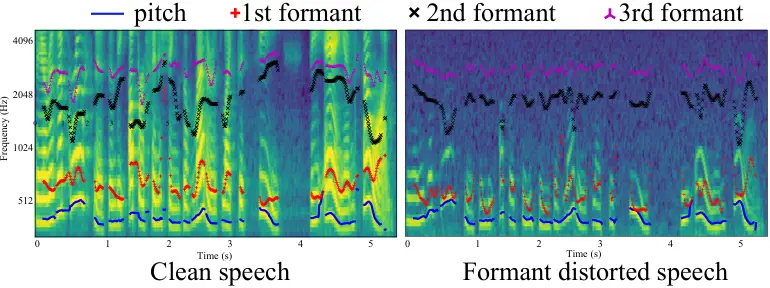
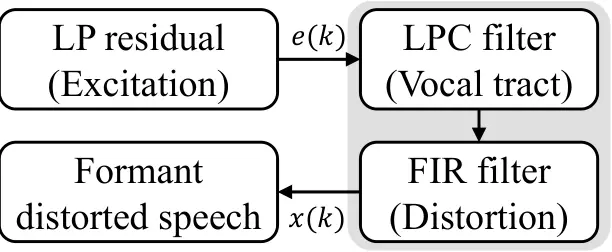
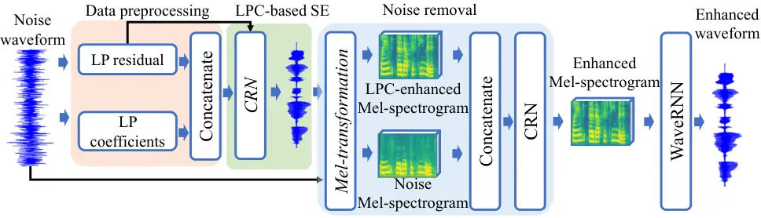
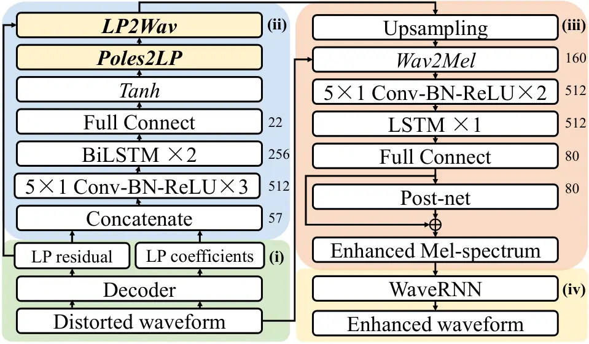
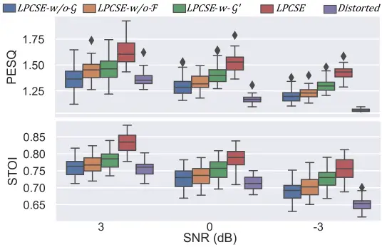
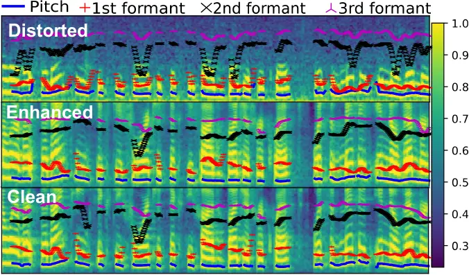

# LPCSE: Neural Speech Enhancement through Linear Predictive Coding

Yang Liu    Na Tang Affiliation: University of Chinese Academy of
Sciences, Shanghai, China    Xiaoli Chu    Yang Yang
Affiliation: Terminus Group, China    Jun Wang Affiliation: Email:
{¹yangliu,³x.chu}@sheffield.ac.uk, ²tangna@mail.sim.ac.cn,
⁴dr.yangyang@terminusgroup.com, ⁵jun.wang@cs.ucl.ac.uk
Affiliation: University College London, London, United Kingdom
Affiliation: The University of Sheffield, Sheffield, United Kingdom

###### Abstract

The increasingly stringent requirement on quality-of-experience in
5G/B5G communication systems has led to the emerging neural speech
enhancement techniques, which however have been developed in isolation
from the existing expert-rule based models of speech pronunciation and
distortion, such as the classic Linear Predictive Coding (LPC) speech
model because it is difficult to integrate the models with
auto-differentiable machine learning frameworks. In this paper, to
improve the efficiency of neural speech enhancement, we introduce an
LPC-based speech enhancement (LPCSE) architecture, which leverages the
strong inductive biases in the LPC speech model in conjunction with the
expressive power of neural networks. Differentiable end-to-end learning
is achieved in LPCSE via two novel blocks: a block that utilizes the
expert rules to reduce the computational overhead when integrating the
LPC speech model into neural networks, and a block that ensures the
stability of the model and avoids exploding gradients in end-to-end
training by mapping the Linear prediction coefficients to the filter
poles. The experimental results show that LPCSE successfully restores
the formants of the speeches distorted by transmission loss, and
outperforms two existing neural speech enhancement methods of comparable
neural network sizes in terms of the Perceptual evaluation of speech
quality (PESQ) and Short-Time Objective Intelligibility (STOI) on the LJ
Speech corpus.

## 1 Introduction

With the development of 5G/B5G communication systems and the rise of
artificial intelligence, high-quality speech communications are required
in various applications, such as Automatic Speech Recognition (ASR),
Augmented Reality (AR), and semantic communication \[38\]. However, the
speech will inevitably be interfered with by the process of
transmission, such as background noise, sound transmission loss
(STL)\[2\], and multipath fading \[19\]. Particularly, a speech usually
suffer from an obvious frequency-dependent STL when transmitting through
objects, such as water \[30\], face masks \[4\], bone conduction \[28\],
and walls \[2\]. STL will distort the speech formants which are the most
sonorant components in a syllable, and will detrimentally reduce the
intelligibility.

Speech enhancement (SE) aims at improving the quality and
intelligibility of target speech and suppressing unwanted distortions.
Classic expert-rule based methods tried to enhance the formant-distorted
speech, such as Linear Predictive Coding (LPC) \[22\], and Wiener
filtering \[29\], but their expressive powers are typically restricted.
With the development of machine learning (ML), many neural SE networks
have been proposed for denoising or dereverberation \[20, 11, 41\]. They
exploit the well-structured spectrums or the periodic tones as the input
features for SE, but the features are usually damaged due to the
frequency-dependent STL, which bring challenges to existing neural SE
methods. Furthermore, most purely data-driven ML approaches are unable
to extract interpretable knowledge from data and may be physically
inconsistent or implausible \[15\]. To address this challenge, some
initial works are focusing on combining expert-rule based models with
neural networks, such as the grey box system simulation \[17\], and the
LPC-based speech vocoder \[36\].

Despite achieving impressive results by neural SE, three challenges
remain under-explored. Firstly, although many expert-rule based
technologies work on various types of distortions, most neural
network-based efforts still focus on noise suppression or
dereverberation, while how to use neural networks against the formant
distortion has not been well studied. Secondly, it is not
straightforward to design a simple and compact SE network to identify
and estimate the effects of STL on a speech without assuming any prior
knowledge of the transmission channel. Last but not least, most neural
networks are often inefficient since they do not utilize the existing
knowledge of how speech is generated or distorted, but how to use the
strong inductive biases in the rules of speech pronunciation and
distortion without losing the expressive power of neural networks
remains an open problem.

In this paper, we propose an LPC-based single-channel SE network
architecture (LPCSE), which integrates an interpretable LPC speech model
into auto-differentiable neural networks and combines the strong
inductive biases in expert rules with the benefits of neural networks.
Specifically, we introduce a differentiable block, which utilizes the
sparsity of a matrix of Linear Prediction (LP) coefficients to overcome
the challenge of large computational overhead when integrating the LPC
speech model into neural networks. In addition, we propose another block
that maps the LP coefficients to the poles of the LPC filter, to ensure
the stability of the model and avoid exploding gradients in end-to-end
learning. The experiments on the LJ Speech corpus demonstrate that LPCSE
successfully restores the formants distorted by the STL without the need
for large-scale, complex networks or models, and obtains significant
gains in terms of the Perceptual evaluation of speech quality (PESQ)
\[25\] and Short-Time Objective Intelligibility (STOI) \[33\] as
compared with two existing neural SE methods of comparable network
sizes. The contributions of this paper are summarized as follows:

- •
  We introduce LPCSE, an expert-rule inspired network architecture, to
  perform end-to-end SE for formant-distorted speeches. LPCSE enables
  utilizing the strong inductive biases of the LPC speech model while
  retaining the expressive power of SE neural networks and the benefits
  of end-to-end learning.
- •
  We propose two new blocks to overcome the large computational overhead
  when integrating the LPC speech model into neural networks and ensure
  the stability of the model in end-to-end learning, respectively.
- •
  Our ablation and comparison experiments on the LJ Speech corpus verify
  that the combination of the LPC speech model and neural networks in
  LPCSE can provide a larger gain in terms of the speech quality and
  intelligibility than each of them working alone. The LPCSE outperforms
  two existing neural SE methods of comparable network sizes in terms of
  PESQ and STOI.

(a) The process of the LPC speech production and distortion



(b) An example of formant distortion

Figure 1: The LPC speech model and formant distortion

## 2 LPC-based Neural Speech Enhancement

In this section, we will introduce the expert rules of the LPC and
formulate the problem of LPC-based neural SE.

### 2.1 Background - the Expert Rules of LPC

Speech is the production of our phonatory systems, including lungs,
larynx, vocal tract, etc., which can be well modeled by an LPC speech
model \[21\]. The vocal tract response can be interpreted as an LPC
filter, i.e., a time-varying all-pole linear filter with the technique
of LPC. As shown in Fig. 1a, speech $`s(k)`$ is produced by passing an
excitation signal $`n(k)`$ through the LPC filter, and can be written as
follows:

```math
s\left(k\right)=\sum_{p=1}^{P}{a}_{p}s\left(k-p\right)+n\left(k\right), \tag{1}
```

where $`k`$ denotes the time index, $`P`$ is the order of the filter,
$`a_{p}`$, $`p=1,...,P`$, represents the LP coefficients, which hinge on
the vocal tract and remain unchanged for short segments of speech, e.g.,
a few milliseconds. The excitation signal $`n(k)`$ is related to the
pronunciations of words and can be either a train of periodic impulses
for voiced sounds, such as nasals and vowels, or a random noise source
for unvoiced sounds. By analyzing speech $`s(k)`$ and its past samples
with LPC, the LP coefficients $`a_{p}`$ and excitation $`n(k)`$ can be
determined from short segments of speech by minimizing the sum of
squared differences between the actual and predicted speech samples.



Figure 2: The formants produced by the vocal tract are disrupted by the
distortion.

The speech observed by a reciever, denoted by $`x(k)`$, is the
convolution of the speech $`s(k)`$ and the channel impulse response
$`h`$ of the environment plus additive noise $`b(k)`$, i.e.,

```math
x(k)=s\left(k\right)*h+b\left(k\right), \tag{2}
```

where $`*`$ represents linear convolution. For an environment with fixed
distortion, such as speech transmission through a wall, it is usually
assumed that $`h`$ is time-invariant (or short-time time-invariant) and
can be represented as a finite impulse response (FIR) filter \[2\]. To
find out the relationships between formant-distorted speeches and their
clean pairs, it is assumed that the excitation signal $`n(k)`$ remains
unchanged after the distortion \[28\], and the environment only affects
the vocal tract response, i.e., the all-pole linear filter. Note that
the limited order $`P`$ of the LPC filter makes it difficult to describe
the complex distortion of environments, while the performance of speech
enhancement is considerably dependent on the accuracy of the filter
estimation. To address this challenge, we design a Mel-spectrogram
enhancement network to improve speech quality.

### 2.2 Problem Formulation

Our task is to recover $`s(k)`$, given only the observed speech
$`x\left(k\right)`$ without assuming any priori knowledge regarding the
channel impulse response $`h`$. Let $`\mathcal{E}`$ denote the index set
of $`\left|\mathcal{E}\right|`$ possible scenarios. Let $`{{X}^{e}}`$ be
the observed speech, which is the same speech received in scenario
$`e\in\mathcal{E}`$. The speech of $`{{X}^{e=1}}`$ denotes the scenario
without suffering from the distortion and is used as ground truth data.
For $`j={1,\ldots,m}`$, let $`X_{j}^{e}`$ be the j-th sample of
$`X^{e}`$ received in $`e`$. $`{{W}^{e}}\in{{\mathbb{R}}^{m\times m}}`$
defines a directed acyclic graph (DAG) on $`m`$ samples. Specifically,
$`{{W}^{e}}=\left[w_{1}^{e},\cdots,w_{j}^{e},...,w_{m}^{e}\right]`$ is
the LP-coefficient matrix of $`{{X}^{e}}`$ and $`w_{j}^{e}`$ is the LP
coefficient of $`X_{j}^{e}`$. There exists a vector of excitation
signals $`Z=[{{z}_{1}},{{z}_{2}},...,{{z}_{m}}]`$ that is independent of
the scenario $`e`$ for all $`e\in\mathcal{E}`$. Hence, $`X_{j}^{e}`$ can
be represented as:

```math
X_{j}^{e}=w_{j}^{eT}X^{e}+z_{j},j={1,\ldots,m}. \tag{3}
```

This is similar to the formulation for the structural equation model
(SEM) in DAG learning problems \[44\]. But the weighted adjacency matrix
$`W`$ in SEM is usually assumed to be fixed across all
$`e\in\mathcal{E}`$, and the $`W`$ in the LPC speech model is dependent
on the scenario $`e`$ and the excitation signals $`Z`$. Furthermore, the
$`Z`$ in SEM is treated as unknown random noise, but the excitation
signals $`Z`$ can be decoded from the $`{X^{e}}`$ through the
Levinson-Durbin recursion \[21\].

For brevity, we abbreviate $`e=1`$ in the symbols of clean speech, and
in the rest of this paper, $`e\in\mathcal{E}`$ and $`e\neq 1`$.
Specifically, the clean speech $`X^{e=1}`$ and its DAG $`W^{e=1}`$ are
denoted by $`X`$ and $`W`$, respectivly. Their disorted pairs are
defined as $`X^{e}`$ and $`W^{e}`$. Hence, based on Eq.(3), the clean
speech can be represented as $`X=W^{T}X+Z`$, which can be reformulated
as a matrix multiplication as follows:

```math
X=VZ,\ V={{\left(I-W^{T}\right)}^{-1}}\in{{\mathbb{R}}^{\left(ML+1\right)\times\left(ML+1\right)}}, \tag{4}
```

where $`M`$ is a given number of adjacent samples that share the same LP
coefficients. The excitation signal $`Z`$ is obtained by the
Levinson-Durbin recursion and the clean speech and its distorted pairs
have the same $`Z`$. We refer to $`M`$ samples as a slot, and a frame
has $`L`$ slots. Increasing $`L`$ can reduce the number of waveform
phase discontinuities and improve speech quality, but will increase
computation and memory requirements. To enhance distorted speech
$`X^{e}`$, a straightforward strategy is to use a network
$`\mathcal{F}`$, i.e., the box of LPC-based SE in Fig. 3, to estimate
the matrix $`V`$ that minimizes the least square loss,

```math
\begin{array}[]{ll}\operatorname{min}&{{\left\|VZ-\mathcal{F}({{X}^{e}};\theta)Z\right\|}_{2}^{2}},\end{array} \tag{5}
```

where $`\theta`$ is the parameter set of the network $`\mathcal{F}`$.
However, we find that although most of the speech pitch and formants are
recovered by the matrix $`V`$ estimated by $`\mathcal{F}`$, additional
noises are introduced to the speech due to the limited order of the LPC
speech model and the loss in the LP-coefficient matrix estimation. To
address this challenge, another network $`\mathcal{G}`$, i.e., the box
of noise removal in Fig. 3, is proposed to remove the noise and further
enhance the speech in the time-frequency (TF) domain as follows:

```math
\begin{array}[]{ll}\underset{\varphi}{\min}&{{\left\|X_{M}-\mathcal{G}({\hat{X}^{e}_{M}};\varphi)\right\|}_{2}^{2}}\\
\text{subject to}&\theta^{*}\in\underset{\theta}{\operatorname{argmin}}\left({{\left\|X-\mathcal{F}({{X}^{e}};\theta)Z\right\|}_{2}^{2}}\right)\\
&X_{M}=\mathcal{M}(X),\ \hat{X}^{e}_{M}=\mathcal{M}(\mathcal{F}({X^{e}};\theta^{*})Z;{X}^{e}),\\
\end{array} \tag{6}
```

where $`X_{M}`$ denotes the Mel-spectrograms of the clean speech $`X`$,
and $`\hat{X}^{e}_{M}`$ denotes the Mel-spectrogram of the enhanced
speech $`\mathcal{F}(X^{e};\theta)Z`$ concatenated with the distorted
speech $`X^{e}`$. $`\mathcal{M}`$ represents the transformation from the
audio waveforms to Mel-spectrogram. $`\varphi`$ denotes the parameters
of $`\mathcal{G}`$. The Mel-spectrogram transformation is differentiable
and can be implemented by the standard modules in ML frameworks, such as
the torchaudio module in Pytorch \[40\].



Figure 3: LPCSE architecture. CRN denotes a convolutional-recurrent
network, which will be detailed in Section 3. Mel-transformation
converts waveforms to Mel-spectrograms, and is implemented by using the
class module of torchaudio.transforms.MelSpectrogram in Pytorch.

## 3 Network Architecture

LPCSE solves the SE problem with a cross-domain architecture, which
includes four key components: a data preprocessing step, a time-domain
network $`\mathcal{F}`$ for LP coefficients estimation and waveform
generation, a TF domain network $`\mathcal{G}`$ for Mel-spectrogram
enhancement, and a vocoder. In the data preprocessing step, i.e., box
(i) in Fig. 4, a distorted speech is decoded into the LP coefficients
and residuals with an LPC order of $`P`$ and a step size of $`M`$
samples. The network $`\mathcal{F}`$, i.e., box (ii) in Fig. 4,
concatenates $`M\times L`$ LP coefficients and their residuals as input.
In this module, a stack of convolutional and recurrent networks with a
Tanh layer is used to extract the features from the concatenated LP
coefficients and residuals, and estimate the poles of the LPC filter.
Two dedicated blocks, i.e. LP2Wav and Poles2LP, are proposed to transfer
the poles to LP coefficients and ensure the stability of the LPC speech
model respectively. In the network $`\mathcal{G}`$, i.e., box (iii) in
Fig. 4, the waveform from the LP2Wav block is upsampled to 22 kHz by
interpolating to match the sampling rate of the Mel-spectrogram vocoder
and its clean speech pairs. In the Wav2Mel block, the upsampled waveform
is concatenated with the distorted speech, and transformed into two
80-channel log-Mel spectrograms corresponding to the waveforms using the
2048-point Short-Time Fourier Transform (STFT) with a Hann window of 50
ms frame length and 12.5 ms frameshift. Finally, the Mel-spectrogram is
further enhanced via a convolutional-recurrent network and a Post-net
\[27\] to denoise and improve speech quality. In box (iv) in Fig. 4, the
enhanced Mel-spectrogram is converted into an enhanced waveform through
WavRNN\[14\]. Such an architecture takes advantage of the
well-structured Mel-spectrograms and the time-domain knowledge from the
LPC speech model. LP2Wav and Poles2LP will be introduced in the next
subsections.



Figure 4: The detailed LPCSE architecture. LP2Wav and Poles2LP denote
the proposed blocks. Conv-BN-ReLU and Conv-BN-Tanh denote the
convolution with batch normalization followed by ReLU and Tanh
activation, respectively. Their kernel size is $`5\times 1`$. LSTM
denotes the Long Short Term Memory network. BiLSTM repesents
bi-directional LSTM. The number on the right of each layer/block
represents its cell/output dimension.

### 3.1 The LP2Wav Block: how to integrate the LPC speech model into neural networks?

To achieve end-to-end learning, the LPC speech model will be integrated
into the network $`\mathcal{F}`$ as a whole. Since
$`V\in{{\mathbb{R}}^{\left(ML+1\right)\times\left(ML+1\right)}}`$ is a
dense matrix, directly predicting $`V`$ from $`{{X^{e}}}`$ is a
challenge, owing mainly to the high computational overhead using
standard networks to approximate $`V`$ when $`V`$’s size is large. In
this subsection, we will address this the challenge in two steps: sparse
matrix transformation and compression. In the first step, we use an
inverse operation to convert the dense matrix $`V`$ into a sparse
matrix. Specifically, we find that the inverse of $`V`$ is a sparse
matrix based on the definition of the LPC speech model. Let
$`U=I-{{W}^{T}}={{V}^{-1}}`$ be the inverse of $`V`$, which is always
invertible. The derivative of $`V`$ can be obtained from
$`{I}^{\prime}=(UV)^{\prime}=U{V}^{\prime}+{U}^{\prime}V=0`$ and
$`{V}^{\prime}=-V{U}^{\prime}V`$, where
$`{U}^{\prime}=-({{W}^{T}}{)}^{\prime}`$ and $`(\cdot{)}^{\prime}`$ is
the derivative operator.
$`W\in{{\mathbb{R}}^{\left(ML+1\right)\times\left(ML+1\right)}}`$ is a
strictly upper triangular sparse matrix, which has 0 along its diagonal
as well as the lower portion. Based on the derivative of $`W^{T}`$, the
gradient of $`V`$ is calculated by the chain rule, and the parameters of
network $`\mathcal{F}`$ and $`\mathcal{G}`$ are updated by the
backpropagation algorithm. In the second step, we compress the sparse
matrix $`W`$ obtained from the first step into a smaller matrix to
remove redundant information and reduce computation. Specifically, $`W`$
is mapped to a smaller LP-coefficient matrix $`{A}^{\prime}`$. Each
column of $`{A}^{\prime}`$ contains the LP coefficients for a speech
sample. Then, $`{A}^{\prime}`$ is downsampled to
$`A\in{{\mathbb{R}}^{P\times L}}`$ without losing information because
the LPC speech model assumes that the samples in a short frame have the
same LP coefficients. The downsampling factor is set to $`M`$. We use
the proposed networks to estimate the LP coefficients $`A`$ of the
distorted speech, instead of directly predicting $`V`$, based on which
much performance improvement is achieved. For example, $`M`$ and $`P`$
are set empirically to 46 and 11 in our experiments, i.e.,
$`(ML+1)^{2}\gg PL`$, so the network size and computational overhead are
significantly reduced.

To achieve the transformation from the estimated $`A`$ to $`V`$, we
design a differentiable block, called LP2Wav, as shown in Alg.1, where
$`batch`$ is the batch size. The first step in the algorithm represents
the reverse process of the compression from $`{A}^{\prime}`$ to $`A`$.
The second step denotes the mapping from the matrix $`A^{\prime}`$ to
the sparse matrix $`W`$, which is achieved by using index and in-place
operations without making a copy. In the third step, $`I-W^{T}`$ is
always invertible and its inverse can be easily calculated by using
forward substitution because the index and in-place operations ensure
that $`I-W^{T}`$ is an upper triangular sparse matrix with 1 along its
diagonal. $`I`$ is the identity tensor with the same shape as $`W`$. To
better understand the LP2Wav block, an example illustrates the
compression operation for the sparse matrix $`W`$, as shown in Fig. 5.
For 12 speech samples and $`P=3`$, $`M`$ and $`L`$ are set to 4 and 3,
respectivly. $`W\in{{\mathbb{R}}^{13\times 13}}`$ is downsampled to
$`A\in{{\mathbb{R}}^{3\times 3}}`$, without losing information.

1: The estimated LP-coefficient matrix $`A(batch,L,P)`$.

2: Updated $`V(batch,ML+1,ML+1)`$.

3: Obtian $`A^{\prime}(batch,ML,P)`$ through the interpolation and
concatenation to $`A(batch,L,P)`$.

4: Update $`W(batch,ML+1,ML+1)`$ by using the index and in-place
operations to $`A^{\prime}(batch,ML,P)`$.

5: $`V(batch,ML+1,ML+1)\leftarrow(I-W(batch,ML+1,ML+1)^{T})^{-1}`$.

Algorithm 1 The process of the LP2Wav block

Figure 5: The expert rules reduce the computational overhead when
integrating the LPC speech model into netrual networks.

### 3.2 The Poles2LP Block: how to guarantee the stability of the LPC speech model in neural networks?

Stability is the most fundamental of model properties. When using a
network to estimate the paraments for an LPC speech model, the most
basic requirement is that the paraments should ensure the stability of
the LPC system.Lacking stability will introduce infinity values into
$`V`$ and cause exploding gradients in the inverse operation of
$`I-W^{T}`$. In this subsection, we will introduce how to guarantee
stability using standard operations and blocks in neural networks.

Based on Eq.(1), the system transfer function of the LPC speech model is
an all-pole linear filter, and can be rewritten as follows by using the
z-transform,

```math
\displaystyle l(z)= \displaystyle\frac{K}{1-{{a}_{1}}{{z}^{-1}}-{{a}_{2}}{{z}^{-2}}\cdots-{{a}_{P}}{{z}^{-P}}}=\frac{K{{z}^{P}}}{{{z}^{P}}-{{a}_{1}}{{z}^{P-1}}-{{a}_{2}}{{z}^{P-2}}\cdots-{{a}_{P}}}, \tag{7}
```

where the denominator polynomial coefficients
$`\{{{a}_{1}},{{a}_{2}},...,{{a}_{P}}\}`$ are real numbers. $`K`$ is a
given system gain, which is set to 1 in our experiments. In order to
guarantee the stability, the locations of $`l(z)`$’s poles must lie
inside or on a unit circle on the complex plane. By the fundamental
theorem of algebra, $`l(z)`$ has $`P`$ poles, which occur as complex
conjugate pairs or real numbers. Let
$`\{{{r}_{1}},{{r}_{2}},...,{{r}_{P}}\}`$ be the poles of $`l(z)`$. A
straightforward idea is to use a supervised learning model to estimate
$`\{{{r}_{1}},{{r}_{2}},...,{{r}_{P}}\}`$ with the constraint of
$`\left|{{r}_{i}}\right|\leq 1`$ for $`i=1,2,...,P`$ which will
guarantee the stability, instead of directly estimating
$`\{{{a}_{1}},{{a}_{2}},...,{{a}_{P}}\}`$. However, after obtaining the
poles in this way, how to enable the transformation from the pole
$`r_{i}`$ to the coefficient $`a_{i}`$ in neural networks has not been
well studied.

To bridge the gap, we propose a differentiable block for the
transformation in the network $`\mathcal{F}`$, called Poles2LP, which
maps the poles of $`l(z)`$ to the LP coefficients in $`A`$ using only
standard operators and blocks in ML, as shown in Fig. 6. Firstly,
$`l(z)`$ can be rewritten as:

```math
l(z)=\frac{Kz^{P}}{\left(z-{{r}_{1}}\right)\left(z-{{r}_{2}}\right)\cdots\left(z-{{r}_{P}}\right)}, \tag{8}
```

where $`\{{{r}_{1}},{{r}_{2}},...,{{r}_{P}}\}`$ denote the poles of
$`l(z)`$, and their real and imaginary parts are constructed by the
output of the $`Tanh`$ layer in the network $`\mathcal{F}`$. Secondly,
since polynomial multiplication is equivalent to convolution, the LP
coefficients are calculated through the iterative convolution between
the vector $`[1,-{{r}_{i}}]`$ and convolution results, $`i=1,2,...,P`$.
A tensor of $`ones(batch,L,1)`$ is concatenated with
$`-{{r}_{i}}(batch,L,1)`$ in the last dimension. Thirdly, a complex
convolution block \[11\] calculates the iterative convolution between
the concatenated tensor and previous convolution results. In the complex
convolution, let $`Re_{1}`$ ,$`Re_{2}`$ be the real part of two complex
convolution block inputs, and $`Im_{1}`$, $`Im_{2}`$ be the imaginary
part of the inputs as follows

```math
\displaystyle Re=conv\left(Re_{1},Re_{2}\right)-conv\left(Im_{1},Im_{2}\right) \tag{9}
```

```math
\displaystyle Im=conv\left(Re_{1},Im_{2}\right)+conv\left(Im_{1},Re_{2}\right),
```

where $`Re`$ and $`Im`$ denotes the real and imaginary part of the
complex convolution block output, and $`conv()`$ denotes the standard
convolution operator for real numbers, which is implemented by using
existing convolution operators, such as torch.nn.functional.conv1d
function in Pytorch. Finally, after the iteration for the $`P`$ poles,
the real part of the final convocation results is the downsampled
LP-coefficient matrix $`A(batch,L,P)`$, which contains
$`\{{{a}_{1}},{{a}_{2}},...,{{a}_{P}}\}`$ in its columns. A flowchart is
shown in Fig.6 to describe the process of the Poles2LP block, where
$`\Re`$ is the real part symbol, and $`tmp`$ is the convolution result.
$`P`$ is a small value, e.g. 11 in our experiment. $`complex\_conv`$
represents the complex convolution.

Figure 6: The flowchart of the proposed Poles2LP block.

### 3.3 Loss Functions

Our goal is to solve the following optimization problem:

```math
\underset{\theta,\varphi}{\mathop{\min}}\,L={{L}_{Mel}}+\mu{{L}_{Wave}}+\lambda{{L}_{LP}}, \tag{10}
```

where $`\mu`$ and $`\lambda`$ are hyperparameters chosen for balance.
$`L_{Mel}`$ is a Mel reconstruction loss, $`L_{Wave}`$ is a waveform
reconstruction loss, and $`L_{LP}`$ is a LP-coefficient loss.

Mel reconstruction loss. We refer to the output of the full connect
layer in $`\mathcal{G}`$ as the coarse Mel-spectrogram, denoted by
$`{{\hat{X}}^{e}}_{M^{\prime}}`$. We refer to the sum of the coarse
Mel-spectrogram and the output of the Post-net as the fine-grained
Mel-spectrogram, denoted by $`{{\hat{X}}^{e}}_{M}`$ , and
$`{{\hat{X}}^{e}}_{M}=\mathcal{G}(\mathcal{M}(\mathcal{F}(\tilde{X}^{e};\theta)Z;\tilde{X}^{e});\varphi)`$,
respectively. We use the sum of the mean squared error (MSE) between the
target Mel-spectrogram $`X_{M}`$ and the coarse and fine-grained
Mel-spectrograms as the Mel reconstruction loss, i.e.,
$`{{L}_{Mel}}=\mathbb{E}\left[\left\|{{{\hat{X}}}^{e}}_{M}-X_{M}\right\|_{2}^{2}\right]+\mathbb{E}\left[\left\|{{{\hat{X}}}^{e}}_{M^{\prime}}-X_{M}\right\|_{2}^{2}\right]`$.

Waveform reconstruction loss. We will refer to the upsampled waveform in
the network $`\mathcal{G}`$ as the coarse-grained speech, denoted by
$`\hat{X}_{c}^{e}`$, i.e.,
$`\hat{X}_{c}^{e}=\mathcal{F}(\tilde{X}^{e};\theta)Z`$. We use the MSE
between the target $`X`$ and upsampled waveform $`\hat{X}_{c}^{e}`$ as
the waveform reconstruction loss, i.e.,
$`{{L}_{Wave}}=\mathbb{E}\left[\left\|{\hat{X}}_{c}^{e}-{{X}}\right\|_{2}^{2}\right]`$.

LP-coefficient loss. We use an LP-coefficient loss to the loss function,
denoted by $`{{L}_{LP}}`$ in Eq.(10), which represents the expectation
of the complex-valued L1 norm between the estimated LP coefficients and
the target LP coefficients, i.e.,
$`L_{LP}=\mathbb{E}\left[\lVert\hat{A}^{e}-A\rVert_{1}^{2}\right]`$,
where $`\hat{A}^{e}`$ and $`A`$ are the estimated and target LP
coefficients, respectively. $`\hat{A}^{e}`$ is the input of the Poles2LP
block. $`A`$ is obtained from the clean speech pairs of $`X^{e}`$ in the
training dataset. Note that $`\hat{A}^{e}`$ is a complex tensor, and
$`A`$ is a real tensor. During training, the imaginary part of
$`\hat{A}^{e}`$ will approach 0, and the real part will be close to
$`A`$.

## 4 Experiments

### 4.1 Dataset and implementation details

Dataset. In our experiments, the LJSpeech corpus \[13\] is used to
evaluate the proposed LPCSE. LJSpeech is a public data set and contains
13,100 audio clips of a single speaker reading passages with a sampling
rate of 22 kHz. To obtain a clean dataset, we remove the silences in the
dataset using the WebRTC voice activity detection (VAD)\[8\], since the
silences do not correspond to any vocal changes. To construct
distorted-clean speech pairs, we let the clean speech pass through an
FIR filter, which is used to simulate the channel impulse response $`h`$
of a 5 cm thick concrete wall. The FIR filter is designed according to
the Sharp’s equation \[2\], which is widely used to estimate the STL of
walls in the noise control of buildings. Then, we mix the filtered
speech with pink noise at 3 Signal-to-noise ratio (SNR) levels from -3
to 3 dB.

Implementation Details. The distorted-clean speech pairs are divided
into training and test sets by 9:1. We use the Perceptual evaluation of
speech quality (PESQ) \[25\] and Short-Time Objective Intelligibility
(STOI) \[33\] as the evaluation metric to measure the quality and
intelligibility of speech, respectively. $`\mu\in[0,\infty)`$ and
$`\lambda\in[0,\infty)`$ in the loss function balance the contribution
of the network $`\mathcal{F}`$, $`\mathcal{G}`$ and the LPC speech
model. The hyperparameters are set to $`\mu=1`$, $`\lambda=0.3`$ in our
experiments. We train our model on 2 NVIDIA 2080Ti GPUs with a batch
size of 16 frames on each GPUs. Each frame contains $`L`$ slots, and
each slot has $`M`$ samples, and they are set to $`L=120`$, and
$`M=46`$, as shown in Fig. 7. We use the ADAM optimizer with a fixed
learning rate of 0.001.

Figure 7: The settings for the frames and slots in our experiments. (a)
In the network $`\mathcal{F}`$, a frame containts 120 slots, and each
slot has 46 samples for the sampling rate of 11 kHz. (b) After
upsamlping to 22 kHz in the network $`\mathcal{G}`$, the waveforms are
transformed to Mel-spectrograms by employing the STFT.

### 4.2 Ablation Study

An ablation study is conducted to identify the essential components of
the proposed architecture. The ablation results are shown in Fig. 8.

LPCSE and Distorted: among these methods, LPCSE represents our full
architecture, which includes the proposed network $`\mathcal{F}`$ and
$`\mathcal{G}`$ . Distorted denotes the formant distorted speech without
enhancement. A significant gain of 0.25-0.38 and 0.07-0.11 from LPCSE is
observed in median PESQ and STOI when compared with Distorted. The
results show that the proposed network can improve speech quality and
intelligibility in different scenarios. LPCSE significantly outperforms
other methods in the ablation study.

LPCSE-w/o-$`\mathcal{G}`$: LPCSE-w/o-$`\mathcal{G}`$ shows the
performance of only using the network $`\mathcal{F}`$ and removing the
network $`\mathcal{G}`$ from the LPCSE architecture, except for the
LP2Wav and upsampling layer in the network $`\mathcal{G}`$. The network
$`\mathcal{F}`$ estimates the clean LP coefficients based on the
excitation signal and distorted LP coefficients, and the LP coefficients
is fed into the LP2Wav block. The output of LPCSE-w/o-$`\mathcal{G}`$ is
the upsampled waveform from the output of the LP2Wav block, instead of
the Mel-spectrogram from the network $`\mathcal{G}`$. The results in
Fig.8 show that, compared with the LPCSE architecture,
LPCSE-w/o-$`\mathcal{G}`$ only provides a small gain of 0.02-0.14 and
0-0.03 on PESQ and STOI, respectively. This is expected because
LPCSE-w/o-$`\mathcal{G}`$ only uses a simple traditional method, i.e.,
the LPC speech model, to synthesize speech, which is difficult to
mitigate the noise in generated speech. The aim of
LPCSE-w/o-$`\mathcal{G}`$, including the network $`\mathcal{F}`$, LP2Wav
block and upsampling layer, is to recover the distorted high-frequency
components and provide coarse Mel-spectrograms, based on which the rest
of the network $`\mathcal{G}`$ will generate fine-gain Mel-spectrograms.

LPCSE-w/o-$`\mathcal{F}`$ and LPCSE-w-$`\mathcal{G}^{\prime}`$:
LPCSE-w/o-$`\mathcal{F}`$ and LPCSE-w-$`\mathcal{G}^{\prime}`$ are the
two settings that remove the network $`\mathcal{F}`$ from the LPCSE
architecture, while the network $`\mathcal{G}`$ is preserved. The
difference is that the LPCSE-w/o-$`\mathcal{F}`$ uses the same network
$`\mathcal{G}`$ as LPCSE, and LPCSE-w-$`\mathcal{G}^{\prime}`$ uses an
enhanced network $`\mathcal{G}^{\prime}`$, which has twice the size of
$`\mathcal{G}`$. We see that LPCSE-w/o-$`\mathcal{F}`$ could provide a
gain of 0.1-0.16 and 0.01-0.05 on median PESQ and STOI, respectively.
LPCSE-w-$`\mathcal{G}^{\prime}`$ has a larger capacity for speech
enhancement than LPCSE-w/o-$`\mathcal{F}`$ but compared with
LPCSE-w/o-$`\mathcal{F}`$, it only introduces a small increase of
0.01-0.08 and 0.02-0.04 on the median PESQ and STOI, respectively. The
gains of both settings drop significantly as the distortion and noise
become strong, i.e., from -3 dB to 3 dB, because the network
$`\mathcal{G}`$ is insufficient to enhance the speech alone. Comparison
between LPCSE-w/o-$`\mathcal{F}`$ and LPCSE shows that our architecture
could provide 0.15-0.22 and 0.05-0.08 gain on median PESQ and STOI in
different scenarios. This proves that, compared with the architectures
which only use the network $`\mathcal{G}`$, LPCSE has a more stable
performance as the distortion and noise increase.

In summary, the results of the ablation study suggest that both the
network $`\mathcal{F}`$ and $`\mathcal{G}`$ are crucial to the LPCSE
architecture. Jointly integrating the networks in our design
significantly outperforms the methods where any of them is applied
separately since the combination of them is a more effective way to
improve speech quality and intelligibility than only using the network
$`\mathcal{F}`$ or $`\mathcal{G}`$.



Figure 8: PESQ and STOI comparisons of the ablation study.

|           |      |      |      |      |      |      |                   |                  |
| --------- | ---- | ---- | ---- | ---- | ---- | ---- | ----------------- | ---------------- |
| Methods   | PESQ |      |      | STOI |      |      | F/B GPU Time (ms) | Params (million) |
| SNR (dB)  | 3    | 0    | -3   | 3    | 0    | -3   |                   |                  |
| Distorted | 1.36 | 1.17 | 1.06 | 0.76 | 0.71 | 0.65 | —                 | —                |
| EHNET     | 1.23 | 1.21 | 1.23 | 0.80 | 0.77 | 0.73 | 28/84             | 17.6             |
| PHASEN    | 1.12 | 1.17 | 1.24 | 0.44 | 0.43 | 0.45 | 12/46             | 7.36             |
| LPCSE     | 1.62 | 1.53 | 1.41 | 0.83 | 0.79 | 0.76 | 105/164           | 15.5             |

Table 1: Comparison of different methods

### 4.3 System Comparison

We compare LPCSE with two existing neural SE networks, EHNET \[43\] and
PHASEN \[41\], in terms of PESQ and STOI, and the number of trainable
parameters (Params), as shown in Table 1. To compare the complexity of
the methods, we also measure the forward and backward (F/B) GPU time for
an input speech of 7 seconds. EHNET is a convolutional-recurrent method
worked in the TF domain, which only uses the Mel-spectrograms of the
distorted speech as input. PHASEN is a cross-domain method and captures
both amplitude and phase-related information of distorted speeches. The
results show that LPCSE significantly outperforms ENNET and PHASEN in
terms of PESQ and STOI because the LPC speech model uses the
mathematical model with stability constants that make the search space
of the parameters tractable. However, in exchange, LPCSE requires a
slightly larger computation of 102 and 164 ms GPU time in the F/B
propagation, respectively, and the computation comes mainly from the
inverse operation in the LP2Wav block. An example of the LPCSE’s result
is shown in Fig. 9. From the figure, we can see that the poles of
enhanced speech are close to that of the clean speech, and the first
formant difference between enhanced and clean speech has a significant
peak at 0, which means the formants are correctly restored.

### 4.4 Visualizations

To have a better understanding of the LPC speech model in LPCSE, we do a
case study by visualizing the enhanced speech. Fig.9(a) shows the
Mel-spectrograms, pitch, and formants of a formant distorted speech, and
its LPCSE-enhanced, and clean pairs from the test dataset. The formants
are calculated by Burg’s algorithm for linear prediction coefficients
\[1\]. The pitches are computed by an acoustic periodicity detection
algorithm based on an accurate autocorrelation method \[3\]. Compared
with the clean speech, the high-frequency components of the formant
distorted speech are damped by noise, and the pitch is less affected due
to the low-frequency components maintained. After the SE through LPCSE,
the high-frequency components are recovered in the enhanced speech which
restores the formants. The poles of the LPC speech model in two slots of
the speeches are shown in Fig.9(b). Compared with the distorted speech,
the poles of the enhanced speech are more close to that of the clean
speech, which indicates that the LP coefficients of the enhanced speech
are corrected by LPCSE. To intuitively show the performance of formant
recovery, the first and second formant differences between the
distorted/enhanced and clean speech are shown as the red and blue blocks
in Fig.9(c), respectively. For the formant differences between distorted
and clean speech, we can see that the first formant difference has an
obvious peak of about -200 Hz. The second formant difference has a flat
distribution along the x-axis, which indicates the second formant
suffers from more attenuation than the first one when passing through
the walls because it has higher frequencies from about 1 kHz to 2 kHz.
For the formant difference between enhanced and clean speech, we can see
that the differences between the formants become small, and the mean
frequency differences are close to 0, which indicates most of the
formants are restored by LPCSE, and the formants of the enhanced speech
are close to that of the clean speech.



(a) The distorted, enhanced and clean Mel-spectrograms of a speech.

(b) The positions of the poles on the complex plane. The poles of
enhanced speech are close to that of clean speech, which indicates that
the LP coefficients are corrected after SE.

(c) The formant differences between the distorted/enhanced and clean
speech. The peaks of the blue blocks are close to 0, which indicates the
distorted formants have been recovered after speech enhancement.

Figure 9: Comparisons of Mel-spectrograms, poles and formants a formant
distorted speech, and its LPCSE-enhanced, and clean pairs from the test
dataset.

## 5 Related Works

This section reviews the typical single-channel SE methods, in which
noisy speech can be enhanced either in the TF domain or time domain. In
TF domain methods, the speech is transformed into the frequency domain
to obtain the amplitude and phase of its spectrogram, e.g. by using the
STFT. Early TF domain methods try to find a multiplicative mask for the
amplitude to separate target speech from background interference. The
enhanced time-domain speech can be produced by applying an inverse
transformation, e.g. the inverse STFT, on the enhanced amplitude and the
noisy phase. For example, RDL-Net \[23\] fuses both ResNets and densely
connected CNNs to generate enhanced amplitude, and uses the noisy phase
and an inverse STFT-based framework to produce enhanced speech. As the
importance of the phase has been realized in SE, phase-aware and
complex-valued methods have been proposed to simultaneously estimate the
magnitude and phase of the target speech \[11, 39, 41, 18, 9\]. However,
the phase prediction is still challenging in SE, because the phase
spectrogram is highly unstructured and will significantly deviate with
interferences \[34\]. To avoid phase prediction in TF domain methods,
neural speech vocoders, e.g. WaveNet \[37\], WaveRNN \[14\], and MelGAN
\[16\], have been used to synthesis speech waveform by conditioning the
vocoder on enhanced spectrogram \[26, 5\].

Time-domain methods try to avoid the phase prediction problem by
directly enhancing the raw waveform. The direct regression methods \[7,
31\] use convolutional neural networks on the waveform to learn the
regression function from the input speech to the target speech. SEGAN
\[24\] directly enhances the input waveform in the time domain by
generative adversarial networks (GANs). Conv-TasNet \[20\] uses a
learnable encoder-decoder in the time domain as an alternative to the
STFT for speech separation tasks. Wave-U-Net \[31\] uses the U-Net
framework to combine features at multiple time scales in the time domain
for audio source separation tasks. The time-domain methods can not
utilize the well-structured patterns on TF spectrograms, which will
potentially lead to a performance loss. To fully leverage the
information in the time and TF domain, HiFi-GAN \[32\] uses multi-domain
adversarial discriminators to train the WaveNet network for denoising
and dereverberation. These methods achieve remarkable performance on
their goal by avoiding the problems in the TF domain. However, the
time-domain methods are usually complex and cumbersome compared with the
TF domain methods, because the processing of waveform is more difficult
than that of the well-structured TF spectrogram. To leverage the TF
spectrogram in the time domain, TFT-Net \[35\] proposed a cross-domain
framework that learns a multiplicative mask for the spectrogram and
computes loss for the decoded waveform in the time domain. Compared with
the time-domain and TF domain methods, our work proposes an innovative
expert-rule inspired network architecture, which could utilize the time
and TF domain features while keeping a simple and compact network
architecture.

To reduce the network complexity and avoid learning from scratch, some
works have tried to estimate the parameters for expert-rule based speech
models, instead of directly predicting speech waveforms or spectrums. In
particular, a convolutional recurrent network \[10\] predicts the speech
amplitude spectrum for a Wiener filter gain function to minimize the
mean square error in the process of noise-suppressing. A DNN-based SE
algorithm \[42\] predicts clean LPC coefficients for a given distorted
speech, which are used by a Kalman filter to recover the clean speech
spectrogram. However, the methods fall short of achieving end-to-end
learning. Further, the expert rules are imperfect, and the gap between
practical conditions and ideal assumptions in the models, e.g. the
assumption of the best filtering effect, and stationary Gaussian
distribution of noise, will limit the quality of the generated speech.
To address this challenge, some initial works try to compensate for the
imperfect by integrating the expert-rule based models into neural
networks. In particular, LPCNet \[36\] and LP-WaveNet \[12\] have shown
the advantages of LPC-based networks in improving the efficiency of
speech synthesis. DDSP \[6\] uses a harmonic plus noise model to realize
audio synthesis, which directly integrates an autoencoder architecture
with classic signal processing parameters, e.g. fundamental frequency
and loudness. However, LPCNet requires clean LP coefficients as input,
which is difficult to obtain in SE. DDSP has a good performance in music
synthesis, but it’s difficult for the harmonic plus noise model to
generate high-fidelity speech as harmonic contents in speech are more
complex than that in music.

## 6 Conclusion

In this article, we have investigated an LPC-based SE architecture,
named LPCSE, which aims to enhance the speeches distorted by the
frequency-dependent STL through the combination of LPC and neural
networks. Our experiment results have shown that the proposed LPCSE can
correct and recover the formants of the distorted speeches. According to
our ablation study, the LPC speech model embedded in LPCSE plays a key
role in improving the speech quality and intelligibility, thereby
demonstrating the effectiveness of the LPC in neural SE. In the
comparison with two existing neural SE methods of comparable network
sizes, LPCSE has larger improvements in terms of PESQ and STOI, which
indicates that LPCSE opens a new path toward simpler and better SE
systems with the help of expert rules.

## References

- \[1\] N. Andersen. On the calculation of filter coefficients for
  maximum entropy spectral analysis. Geophysics, 39:69–72, 1974.
- \[2\] David A. Bies, Colin Hansen, and Carl Howard. Engineering Noise
  Control, Fifth Edition. CRC Press, 2017-12.
- \[3\] Paul Boersma. Accurate short-term analysis of the fundamental
  frequency and the harmonics-to-noise ratio of a sampled sound. In IFA
  Proceedings 17, pages 97–110, 1993.
- \[4\] Ryan M. Corey, Uriah Jones, and Andrew C. Singer. Acoustic
  effects of medical, cloth, and transparent face masks on speech
  signals. 148(4):2371–2375, 2020-10.
- \[5\] Zhihao Du, Ming Lei, Jiqing Han, and Shiliang Zhang.
  Self-Supervised Adversarial Multi-Task Learning for Vocoder-Based
  Monaural Speech Enhancement. In Proc. Interspeech 2020, pages
  3271–3275, 2020.
- \[6\] Jesse Engel, Lamtharn (Hanoi) Hantrakul, Chenjie Gu, and Adam
  Roberts. Ddsp: Differentiable digital signal processing. In
  International Conference on Learning Representations, 2020.
- \[7\] Szu-Wei Fu, Tao-Wei Wang, Yu Tsao, Xugang Lu, and Hisashi Kawai.
  End-to-end waveform utterance enhancement for direct evaluation
  metrics optimization by fully convolutional neural networks.
  26(9):1570–1584, 2018.
- \[8\] Google. Webrtc, 2022.
- \[9\] Mojtaba Hasannezhad, Hongjiang Yu, Wei-Ping Zhu, and Benoit
  Champagne. Pacdnn: A phase-aware composite deep neural network for
  speech enhancement. Speech Communication, 136:1–13, 2022.
- \[10\] Jingyu Hou and Shenghui Zhao. A real-time speech enhancement
  algorithm based on convolutional recurrent network and wiener filter.
  In 2021 IEEE 6th International Conference on Computer and
  Communication Systems (ICCCS), pages 683–688, 2021.
- \[11\] Yanxin Hu, Yun Liu, Shubo Lv, Mengtao Xing, Shimin Zhang, Yihui
  Fu, Jian Wu, Bihong Zhang, and Lei Xie. DCCRN: deep complex
  convolution recurrent network for phase-aware speech enhancement. In
  Helen Meng, Bo Xu, and Thomas Fang Zheng, editors, Interspeech 2020,
  21st Annual Conference of the International Speech Communication
  Association, Virtual Event, Shanghai, China, 25-29 October 2020, pages
  2472–2476. ISCA, 2020.
- \[12\] Min-Jae Hwang, Frank Soong, Eunwoo Song, Xi Wang, Hyeonjoo
  Kang, and Hong-Goo Kang. Lp-wavenet: Linear prediction-based wavenet
  speech synthesis. In 2020 Asia-Pacific Signal and Information
  Processing Association Annual Summit and Conference (APSIPA ASC),
  pages 810–814, 2020.
- \[13\] Keith Ito. The lj speech dataset.
  [https://keithito.com/LJ-Speech-Dataset/](https://keithito.com/LJ-Speech-Dataset/), 2017.
- \[14\] Nal Kalchbrenner, Erich Elsen, Karen Simonyan, Seb Noury,
  Norman Casagrande, Edward Lockhart, Florian Stimberg, Aaron van den
  Oord, Sander Dieleman, and Koray Kavukcuoglu. Efficient neural audio
  synthesis. In Jennifer Dy and Andreas Krause, editors, Proceedings of
  the 35th International Conference on Machine Learning, volume 80 of
  Proceedings of Machine Learning Research, pages 2410–2419. PMLR, 10–15
  Jul 2018.
- \[15\] George Em Karniadakis, Ioannis G. Kevrekidis, Lu Lu, Paris
  Perdikaris, Sifan Wang, and Liu Yang. Physics-informed machine
  learning. 3(6):422–440, 2021-05.
- \[16\] Kundan Kumar, Rithesh Kumar, Thibault de Boissiere, Lucas
  Gestin, Wei Zhen Teoh, Jose Sotelo, Alexandre de Brébisson, Yoshua
  Bengio, and Aaron C Courville. Melgan: Generative adversarial networks
  for conditional waveform synthesis. In H. Wallach, H. Larochelle,
  A. Beygelzimer, F. d'Alché-Buc, E. Fox, and R. Garnett, editors,
  Advances in Neural Information Processing Systems, volume 32. Curran
  Associates, Inc., 2019.
- \[17\] Zhouyang Lin, Kai Li, Yang Yang, Fanglei Sun, Liantao Wu,
  Panpan Shi, Song Ci, and Yong Zuo. Dresia: Deep reinforcement
  learning-enabled gray box approach for large-scale dynamic cyber-twin
  system simulation. 2:321–333, 2021.
- \[18\] Wenzhe Liu, Andong Li, Yuxuan Ke, Chengshi Zheng, and Xiaodong
  Li. Know your enemy, know yourself: A unified two-stage framework for
  speech enhancement. In Interspeech 2021. ISCA, 2021-08.
- \[19\] Yang Liu, Wuxiong Zhang, Yang Yang, Weidong Fang, Fei Qin, and
  Xuewu Dai. Pamt: Phase-based acoustic motion tracking in multipath
  fading environments. In IEEE INFOCOM 2019 - IEEE Conference on
  Computer Communications, pages 2386–2394, 2019.
- \[20\] Yi Luo and Nima Mesgarani. Conv-tasnet: Surpassing ideal
  time–frequency magnitude masking for speech separation.
  27(8):1256–1266, 2019.
- \[21\] J. Makhoul. Linear prediction: A tutorial review. Proceedings
  of the IEEE, 63(4):561–580, 1975.
- \[22\] Tarek Mellahi and Rachid Hamdi. Lpc-based formant enhancement
  method in kalman filtering for speech enhancement.
  69(2):545–554, 2015.
- \[23\] Mohammad Nikzad, Aaron Nicolson, Yongsheng Gao, Jun Zhou,
  Kuldip K. Paliwal, and Fanhua Shang. Deep residual-dense lattice
  network for speech enhancement. 34(05):8552–8559, 2020-04.
- \[24\] Santiago Pascual, Antonio Bonafonte, and Joan Serrà. Segan:
  Speech enhancement generative adversarial network. 2017.
- \[25\] ITUT Rec. P. 862.2: Wideband extension to recommendation p.
  862 for the assessment of wideband telephone networks and speech
  codecs. International Telecommunication Union, CH–Geneva, 2005.
- \[26\] Dario Rethage, Jordi Pons, and Xavier Serra. A wavenet for
  speech denoising. In 2018 IEEE International Conference on Acoustics,
  Speech and Signal Processing (ICASSP), pages 5069–5073, 2018.
- \[27\] Jonathan Shen, Ruoming Pang, Ron J. Weiss, Mike Schuster,
  Navdeep Jaitly, Zongheng Yang, Zhifeng Chen, Yu Zhang, Yuxuan Wang,
  Rj Skerrv-Ryan, Rif A. Saurous, Yannis Agiomvrgiannakis, and Yonghui
  Wu. Natural tts synthesis by conditioning wavenet on mel spectrogram
  predictions. In 2018 IEEE International Conference on Acoustics,
  Speech and Signal Processing (ICASSP), pages 4779–4783, 2018.
- \[28\] Premjeet Singh, Manoj Kumar Mukul, and Rajkishore Prasad. Bone
  conducted speech signal enhancement using lpc and mfcc. In Uma Shanker
  Tiwary, editor, Intelligent Human Computer Interaction, pages 148–158,
  Cham, 2018. Springer International Publishing.
- \[29\] T.V. Sreenivas and P. Kirnapure. Codebook constrained wiener
  filtering for speech enhancement. 4(5):383–389, 1996.
- \[30\] Milica Stojanovic and James Preisig. Underwater acoustic
  communication channels: Propagation models and statistical
  characterization. 47(1):84–89, 2009.
- \[31\] Daniel Stoller, Sebastian Ewert, and Simon Dixon. Wave-u-net: A
  multi-scale neural network for end-to-end audio source separation. 2018.
- \[32\] Jiaqi Su, Zeyu Jin, and Adam Finkelstein. HiFi-GAN:
  High-Fidelity Denoising and Dereverberation Based on Speech Deep
  Features in Adversarial Networks. In Proc. Interspeech 2020, pages
  4506–4510, 2020.
- \[33\] Cees H. Taal, Richard C. Hendriks, Richard Heusdens, and Jesper
  Jensen. An algorithm for intelligibility prediction of time–frequency
  weighted noisy speech. IEEE Transactions on Audio, Speech, and
  Language Processing, 19(7):2125–2136, 2011.
- \[34\] Naoya Takahashi, Purvi Agrawal, Nabarun Goswami, and Yuki
  Mitsufuji. PhaseNet: Discretized Phase Modeling with Deep Neural
  Networks for Audio Source Separation. In Proc. Interspeech 2018, pages
  2713–2717, 2018.
- \[35\] Chuanxin Tang, Chong Luo, Zhiyuan Zhao, Wenxuan Xie, and Wenjun
  Zeng. Joint time-frequency and time domain learning for speech
  enhancement. In Christian Bessiere, editor, Proceedings of the
  Twenty-Ninth International Joint Conference on Artificial
  Intelligence, IJCAI-20, pages 3816–3822. International Joint
  Conferences on Artificial Intelligence Organization, 7 2020. Main
  track.
- \[36\] Jean-Marc Valin and Jan Skoglund. Lpcnet: Improving neural
  speech synthesis through linear prediction. In ICASSP 2019 - 2019 IEEE
  International Conference on Acoustics, Speech and Signal Processing
  (ICASSP), pages 5891–5895, 2019.
- \[37\] Aäron van den Oord, Sander Dieleman, Heiga Zen, Karen Simonyan,
  Oriol Vinyals, Alex Graves, Nal Kalchbrenner, Andrew Senior, and Koray
  Kavukcuoglu. WaveNet: A Generative Model for Raw Audio. In Proc. 9th
  ISCA Workshop on Speech Synthesis Workshop (SSW 9), page 125, 2016.
- \[38\] Zhenzi Weng, Zhijin Qin, and Geoffrey Ye Li. Semantic
  communications for speech recognition. In 2021 IEEE Global
  Communications Conference (GLOBECOM), pages 1–6, 2021.
- \[39\] Donald S. Williamson, Yuxuan Wang, and DeLiang Wang. Complex
  ratio masking for monaural speech separation. IEEE/ACM Transactions on
  Audio, Speech, and Language Processing, 24(3):483–492, 2016.
- \[40\] Yao-Yuan Yang, Moto Hira, Zhaoheng Ni, Anjali Chourdia, Artyom
  Astafurov, Caroline Chen, Ching-Feng Yeh, Christian Puhrsch, David
  Pollack, Dmitriy Genzel, Donny Greenberg, Edward Z. Yang, Jason Lian,
  Jay Mahadeokar, Jeff Hwang, Ji Chen, Peter Goldsborough, Prabhat Roy,
  Sean Narenthiran, Shinji Watanabe, Soumith Chintala, Vincent
  Quenneville-Bélair, and Yangyang Shi. Torchaudio: Building blocks for
  audio and speech processing. arXiv preprint arXiv:2110.15018, 2022.
- \[41\] Dacheng Yin, Chong Luo, Zhiwei Xiong, and Wenjun Zeng. Phasen:
  A phase-and-harmonics-aware speech enhancement network. Proceedings of
  the AAAI Conference on Artificial Intelligence, 34(05):9458–9465,
  Apr. 2020.
- \[42\] Hongjiang Yu, Wei-Ping Zhu, and Benoit Champagne.
  High-frequency component restoration for kalman filter based speech
  enhancement. In 2020 IEEE International Symposium on Circuits and
  Systems (ISCAS), pages 1–5, 2020.
- \[43\] Han Zhao, Shuayb Zarar, Ivan Tashev, and Chin-Hui Lee.
  Convolutional-recurrent neural networks for speech enhancement. In
  2018 IEEE International Conference on Acoustics, Speech and Signal
  Processing (ICASSP), pages 2401–2405, 2018.
- \[44\] Xun Zheng, Bryon Aragam, Pradeep K Ravikumar, and Eric P Xing.
  Dags with no tears: Continuous optimization for structure learning. In
  S. Bengio, H. Wallach, H. Larochelle, K. Grauman, N. Cesa-Bianchi, and
  R. Garnett, editors, Advances in Neural Information Processing
  Systems, volume 31. Curran Associates, Inc., 2018.
