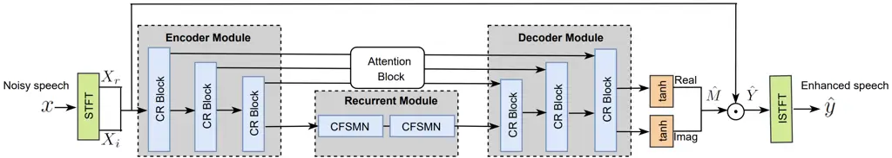
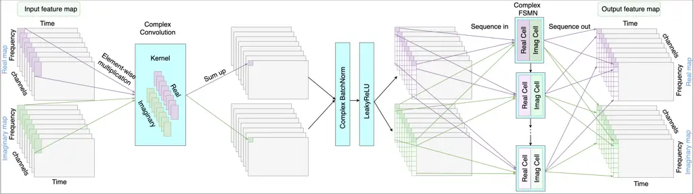

# FRCRN: Boosting Feature Representation using Frequency Recurrence for Monaural Speech Enhancement

Shengkui Zhao    Bin Ma  
Alibaba Group  
{shengkui.zhao    b.ma}@alibaba-inc.com    Karn N. Watcharasupat   
Woon-Seng Gan\sthanksThis work was jointly supported by the Alibaba-NTU
Singapore Joint Research Institute via the Alibaba Innovative Research
(AIR) Program (Ref. AN-GC-2020-015).  
School of Electrical and Electronic Engineering  
Nanyang Technological University (NTU)    Singapore  
{karn001    ewsgan}@ntu.edu.sg

###### Abstract

Convolutional recurrent networks (CRN) integrating a convolutional
encoder-decoder (CED) structure and a recurrent structure have achieved
promising performance for monaural speech enhancement. However, feature
representation across frequency context is highly constrained due to
limited receptive fields in the convolutions of CED. In this paper, we
propose a convolutional recurrent encoder-decoder (CRED) structure to
boost feature representation along the frequency axis. The CRED applies
frequency recurrence on 3D convolutional feature maps along the
frequency axis following each convolution, therefore, it is capable of
catching long-range frequency correlations and enhancing feature
representations of speech inputs. The proposed frequency recurrence is
realized efficiently using a feedforward sequential memory network
(FSMN). Besides the CRED, we insert two stacked FSMN layers between the
encoder and the decoder to model further temporal dynamics. We name the
proposed framework as Frequency Recurrent CRN (FRCRN). We design FRCRN
to predict complex Ideal Ratio Mask (cIRM) in complex-valued domain and
optimize FRCRN using both time-frequency-domain and time-domain losses.
Our proposed approach achieved state-of-the-art performance on wideband
benchmark datasets and achieved 2nd place for the real-time fullband
track in terms of Mean Opinion Score (MOS) and Word Accuracy (WAcc) in
the ICASSP 2022 Deep Noise Suppression (DNS) challenge.

###### keywords

speech enhancement, feature representation, frequency recurrence, deep
learning

## 1 Introduction

The target speech is often severely polluted by the additive background
noise and reverberations in speech communication and automatic speech
recognition (ASR) applications. The corrupted speech causes a reduction
in speech perceptual quality and intelligibility as well as the
automatic speech recognition (ASR) performance. The goal of speech
enhancement is to extract the signal of interest from the corrupted
speech for better perceptual quality and intelligibility as well as a
more robust speech recognition performance.

Monaural speech enhancement has been considered a challenging problem
for decades. Recently, deep learning-based methods have made significant
progress with the simulated noisy speech as input and the clean speech
as target. Many deep models of different structures have been studied
for speech enhancement, such as feedforward neural networks (FNN) \[1\],
recurrent neural networks (RNN) \[2\] and convolutional neural networks
(CNN) \[3\]. The FNN model \[1\] performs on a short context window and
cannot leverage long-term contexts of speech signals. The RNN model
\[2\] can handle long-term contexts in a sequence-based manner, but
often require high-level handcrafted features such as MFCC. The CNN
model \[3\] is able to extract high-level features, but mostly focuses
on local temporal-spectral patterns. By leveraging both CNN and RNN,
convolutional recurrent networks (CRN) were introduced to speech
enhancement \[4, 5\]. The CRN integrates a convolutional encoder-decoder
(CED) structure and a recurrent structure. In CED, the encoder extracts
high-level features from local temporal-spectral patterns and the
decoder reconstructs the target map. The recurrent structure fed with
the high-level features from the encoder further models the long-term
temporal dependencies. Therefore, it is able to extract high-level
features by the CED structure and models long-term temporal dependencies
by the recurrent structure. The CRN has been shown to be very effective
for speech enhancement \[4, 5\] and the extended complex-valued DCCRN
\[6\] achieved the best performance in the Interspeech 2020 DNS
Challenge. In \[7\], it was demonstrated that CRN heavily relies on the
representation power of the convolutions in CED and a complex
convolutional block attention module (CCBAM) was introduced to boost the
feature representation, resulting in improved performance. However, due
to the limited receptive fields of convolutions, CRN still cannot
capture well the long-range correlations along the frequency axis.

In this work, we are motivated by the frequency correlation modelling
study in \[8\] and propose a novel convolutional recurrent
encoder-decoder (CRED) structure to boost feature representation along
the frequency axis. Different from the pure convolution operations in
CED, we add a frequency recurrence after each convolution in CRED. The
frequency recurrence is applied on the 3D convolutional feature maps
along the frequency axis. Specifically, on each time frame, a frequency
sequence is first formed from lower frequencies to upper frequencies
with the channels axis as the “feature” dimension. Then, the frequency
sequences are transformed by a recurrent network implemented by the
feedforward sequential memory networks (FSMN) \[9\]. The convolutional
layer and the frequency recurrent layer form a convolutional recurrent
(CR) block. We form CRED by stacking multiple CR blocks in both encoder
and decoder. CRED is expected to capture not only the local
temporal-spectral structures but also the long-range frequency
dependencies. By further adding a time-recurrent structure as CRN, we
form a new framework called Frequency Recurrent CRN (FRCRN). Unlike the
previous work \[8\] focusing on modelling the temporal dependency in the
time-recurrent structure, our work focuses on improving the overall
feature representation of the encoder-decoder structure.



Figure 1: Network architecture of the proposed FRCRN model. (The symbol
$`\odot`$ stands for element-wise complex multiplication.)

To further improve performance, we implement the FRCRN in complex-valued
operations and predict the complex Ideal Ratio Mask (cIRM) \[10\].
Moreover, we perform a joint optimization using both time-frequency
domain and time-domain loss functions. Our experimental results show
that the FRCRN model performs well for both wideband and fullband speech
signals. The proposed FRCRN model achieves state-of-the-art (SOTA)
results on the DNS-2020 dataset \[11\] and the Voicebank+Demand dataset
\[12\]. Our submission to the ICASSP 2022 Deep Noise Suppression (DNS)
challenge (DNS-2022) \[13\] ranked overall 2nd place for the real-time
fullband nono-personalized track in terms of Mean Opinion Score (MOS)
and Word Accuracy (WAcc).

## 2 The Proposed FRCRN Model

### 2.1 The overall architecture

The overall architecture of the proposed FRCRN model is illustrated in
Fig. 1. Our purpose is to estimate the clean speech signal $`y`$ from
the corrupted speech signal $`x=y\ast h+z\in\mathbb{R}`$ where the time
index is omitted for simplicity. The corruption process is made by a
reverberation operation $`y\ast h`$ and an additive noise $`z`$. The
signal $`x`$ is used as an input and first transformed to time-frequency
spectrogram by applying the short-time Fourier transform (STFT). And
then it is sent to the FRCRN model to predict the cIRM target. The
_tanh_ activation function is applied to bound the estimates by
$`[-1,1]`$. The enhanced spectrogram $`\hat{Y}`$ is obtained by
multiplying the cIRM estimate $`\hat{M}`$ with the noisy spectrogram
$`X`$. The time-domain estimate $`\hat{y}`$ is obtained by applying
ISTFT on $`\hat{Y}`$. Our FRCRN model is mainly comprised of the
proposed CRED and a recurrent module. The CRED comprises an encoder
module and a decoder module. Both modules comprise multiple
convolutional recurrent (CR) blocks which will be described in the
following section. To ensure the output has the same shape as the input,
the CRED architecture is symmetric. The recurrent module comprises two
stacked complex FSMN (CFSMN) layers. In FRCRN, the encoder extracts
high-level feature representations and the decoder reconstructs the
target map. The recurrent module models the long-term temporal
dependencies. The skip connections facilitate optimization by connecting
each block in the encoder to its corresponding block in the decoder. We
further add the attention block CCBAM \[7\] on the skip pathway to
facilitate information flow. Note that we take all convolutions to be
causal in time by applying asymmetrical paddings.



Figure 2: Network architecture of the CR block. Each CR block comprises
a complex Conv2d, a complex BN, a LeakyReLU, and a CFSMN.

### 2.2 Convolutional recurrent (CR) block

The detailed architecture of the CR block is shown in Fig. 2. Each CR
block comprises a complex 2D convolution layer (Conv2d), a complex batch
normalization (BN), a LeakyReLU function, and a CFSMN layer. The
operation of complex Conv2d is given as follows. Let the complex 3D
input feature matrix be
$`V=V_{r}+jV_{i}\in\mathbb{C}^{C\times T\times F}`$, where $`V_{r}`$ is
the real part and $`V_{i}`$ the imaginary part. $`C,T,F`$ denote
channel, frame and frequency dimensions, respectively. Let the
convolutional kernel be
$`W=W_{r}+jW_{i}\in\mathbb{C}^{C^{\prime}\times T^{\prime}\times F^{\prime}}`$,
where $`C^{\prime}`$ denotes the number of kernels and
$`T^{\prime}\times F^{\prime}`$ denotes the kernel size. The output of
the complex Conv2d
$`U=U_{r}+jU_{i}\in\mathbb{C}^{C^{\prime}\times T\times F^{\prime\prime}}`$
can be formulated as:

```math
\displaystyle U_{r}=V_{r}\otimes W_{r}-V_{i}\otimes W_{i}
```

```math
\displaystyle U_{i}=V_{r}\otimes W_{i}+V_{i}\otimes W_{r} \tag{1}
```

where $`\otimes`$ stands for real-valued convolutional filtering. Here,
we perform causal convolutions with $`T^{\prime}=2`$,
$`\mathrm{\emph{stride}}=1`$ and using zero-padding on the time
direction. On the frequency direction, we use $`F^{\prime}=5`$,
$`\mathrm{\emph{stride}}=2`$ without zero-padding, which halves feature
maps in frequency axis in the encoder block by block. For all the CR
blocks in FRCRN, we use $`C^{\prime}=128`$ to keep the same number of
feature maps. The complex BN and the LeakyReLU follow \[14\].

The output of the Conv2d layer after the complex BN and the LeakyReLU
function is sent to the CFSMN layer. The reason that we apply FSMN
instead of using LSTM is because that FSMN not only achieves competitive
performance compared to LSTM, but also requires only about a quarter of
the parameters of LSTM \[9\]. The operations of CFSMN used in FRCRN is
described as follows. Consider the real part $`U_{r}`$ of the feature
map $`U`$ and permute it from
$`C^{\prime}\times T\times F^{\prime\prime}`$ to
$`T\times F^{\prime\prime}\times C^{\prime}`$. For the current frame
$`t`$ of
$`U_{r}\in\mathbb{R}^{T\times F^{\prime\prime}\times C^{\prime}}`$, we
form the frequency sequence
$`\mathbf{S}_{r}(t)\in\mathbb{R}^{F^{\prime\prime}\times C^{\prime}}=\{\mathbf{s}_{f_{1}}(t),\mathbf{s}_{f_{2}}(t),\cdots,\mathbf{s}_{F^{\prime\prime}}(t)\in\mathbb{R}^{C^{\prime}\times 1}\}`$.
Applying real cell of CFSMN on the sequence $`\mathbf{S}_{r}(t)`$, the
output of the $`l`$th component takes the following form:

```math
\displaystyle\mathbf{h}_{f_{i}}^{l}=\delta(\mathbf{W}_{f_{i}}^{l}\mathbf{s}_{f_{i}}^{l-1}+\mathbf{b}_{f_{i}}^{l}) \tag{2}
```

```math
\displaystyle\mathbf{p}_{f_{i}}^{l}=\mathbf{V}_{f_{i}}^{l}\mathbf{h}_{f_{i}}^{l}+\mathbf{v}_{f_{i}}^{l} \tag{3}
```

```math
\displaystyle\mathbf{s}_{f_{i}}^{l}=\mathbf{s}_{f_{i}}^{l-1}+\mathbf{p}_{f_{i}}^{l}+\sum_{\tau=0}^{N_{L}}{\mathbf{a}_{\tau}^{l}\odot\mathbf{p}_{f_{i}-\tau}^{l}}+\sum_{\kappa=0}^{N_{R}}{\mathbf{c}_{\kappa}^{l}\odot\mathbf{p}_{f_{i}+\kappa}^{l}} \tag{4}
```

Here, $`f_{i}=f_{1},f_{2},\cdots,F^{\prime\prime}`$, and $`t`$ is
omitted for simplicity in expression. $`\delta`$ stands for ReLU
function. $`N_{L}`$ and $`N_{R}`$ denotes the look-back and lookahead
orders of the $`l`$th memory block, respectively. We set $`N_{L}=20`$
and $`N_{R}=0`$ to only look backwards in time for all sequences in our
experiments. Since we use a single CFSMN layer in the CR block, the
value of $`l`$ is $`1`$. $`\mathbf{s}_{f_{i}}^{0}`$ is equivalent to
$`\mathbf{s}_{f_{i}}`$ and $`\mathbf{s}_{f_{i}}^{1}`$ is the output. For
the imaginary part, we apply an imaginary cell of CFSMN with the same
operation as the real cell. The CFSMN output
$`\mathbf{S}_{\mathrm{out}}\in\mathbb{C}^{F^{\prime\prime}\times C^{\prime}}`$
can be defined as:

```math
\displaystyle\mathbf{S}_{\mathrm{out}} \displaystyle=\mathrm{FSMN}_{r}(\mathbf{S}_{r})-\mathrm{FSMN}_{i}(\mathbf{S}_{i})
```

```math
\displaystyle+j(\mathrm{FSMN}_{r}(\mathbf{S}_{i})+\mathrm{FSMN}_{i}(\mathbf{S}_{r})) \tag{5}
```

where $`\mathrm{FSMN}_{r}`$ and $`\mathrm{FSMN}_{i}`$ represent real and
imaginary cells of CFSMN. $`\mathbf{S}_{r}`$ and $`\mathbf{S}_{i}`$
denote real and imaginary parts of the frequency sequence.

In the recurrent module, the real part of CFSMN input is reshaped to
$`U_{r}\in\mathbb{R}^{T\times H}`$ with
$`H=F^{\prime\prime}\times C^{\prime}`$. We then form a time sequence
$`\mathbf{Q}_{r}=\{\mathbf{q}_{t_{1}},\mathbf{q}_{t_{2}},\cdots,\mathbf{q}_{T}\in\mathbb{R}^{H\times 1}\}`$.
The operations of Eqn. (2) to (4) are applied on $`\mathbf{Q}_{r}`$ to
model time dynamics of $`U_{r}`$. The outputs of CFSMN follows Eqn. (5).

### 2.3 Joint loss function

The time domain loss function SI-SNR \[8\] has been commonly used as an
evaluation metric in noise suppression. It is a signal-level loss and
directly performs on the signal itself. To further guide the learning of
cIRM estimation, we also considered the mean squared error (MSE) losses
of the real $`{M}_{r}`$ and imaginary $`{M}_{i}`$ estimates of cIRM
\[7\]. Specifically, we optimize the FRCRN model by the following joint
loss function:

```math
\mathcal{L}(y,\hat{y})=\mathcal{L}_{SI-SNR}(y,\hat{y})+\lambda\mathcal{L}_{Mask}(M,\hat{M}), \tag{6}
```

where $`\mathcal{L}_{SI-SNR}(y,\hat{y})`$ is the SI-SNR loss defined as
\[8\]:

```math
\mathcal{L}(y,\hat{y})=\mathrm{10log_{10}}\bigg(\frac{\|y_{\mathrm{target}}\|^{2}_{2}}{||e_{\mathrm{noise}}||^{2}_{2}}\bigg) \tag{7}
```

with
$`y_{\mathrm{target}}=(\langle\hat{y},y\rangle\cdot y)/||y||^{2}_{2}`$
and $`e_{\mathrm{noise}}=\hat{y}-y_{\mathrm{target}}`$. Here,
$`\langle\cdot,\cdot\rangle`$ denotes dot product and $`||\cdot||_{2}`$
is the L2 norm. The mask loss $`\mathcal{L}(M,\hat{M})`$ is defined as:

```math
\mathcal{L}(M,\hat{M})=\sum_{t,f}[(\hat{M}_{r}-M_{r})^{2}+(\hat{M}_{i}-M_{i})^{2}] \tag{8}
```

In this work, we give equal weights to the signal estimation and the
cIRM estimation by setting the factor $`\lambda`$ to 1.

|                      |          |                    |       |        |
| -------------------- | -------- | ------------------ | ----- | ------ |
| Model                | Para.(M) | Evaluation Metrics |       |        |
|                      |          | PESQ               | STOI  | SI-SNR |
| Noisy                | -        | 1.97               | 87.83 | 6.28   |
| DCCRN \[6\]          | 3.7      | 3.17               | 95.80 | 17.71  |
| PHASEN \[15\]        | 8.8      | 3.38               | 96.58 | 18.33  |
| FRCRN-Lite           | 2.1      | 3.21               | 96.07 | 18.11  |
| FRCRN                | 6.9      | 3.62               | 98.24 | 21.33  |
| w/o CFSMN in CRED    | 6.0      | 3.42               | 97.36 | 20.10  |
| w/o Attention Block  | 5.8      | 3.31               | 96.70 | 18.40  |
| w/o Recurrent Module | 5.7      | 3.23               | 96.29 | 18.35  |

Table 1: Objective evaluation results of various models on WSJ0 dataset.

## 3 Experiments

### 3.1 Evaluation on wideband speech signal

As most of the previous models are tested on wideband speech
enhancement, we first evaluate our proposed FRCRN model on speech
signals of 16kHz. For wideband speech inputs, we use the window length
of 20ms and the frame shift of 10ms, respectively. The total latency of
the wideband FRCRN model is limited to 30ms. The STFT length is set to
640 with zero-paddings for an increased spectral resolution. The number
of input channel of the model is 1. The number of CR blocks in the
encoder and the decoder of CRED is 6. The time-recurrent module uses 2
stacked CFSMN layers. Each CR block uses 128 channels for the
convolution operation and 128 units for the real part and the imaginary
part of CFSMN, respectively. We use PyTorch and Adam optimizer with a
batch size of 12 for model optimization. The training starts with an
initial learning rate of 1e-3 with a decay of 0.98. Our trainings are
ended at around 120 epochs by early stopping.

#### 3.1.1 Ablation study on WSJ0 dataset

We first conduct an ablation study to evaluate the full FRCRN model as
well as the contribution of each sub-module. To show the model
capability under a low complexity, we also include a lite FRCRN
(FRCRN-Lite) model by setting the convolution channels $`C^{\prime}`$
and the CFSMN cell size to 64, which has three times less trainable
parameters compared to the full FRCRN model. We choose a CRN-based DCCRN
\[6\] model and a two-stream network, PHASEN \[15\], as baselines. Both
DCCRN and PHASEN belong to the complex-domain family and estimate the
magnitude and phase simultaneously. Our implementation for the baseline
models follows the best configuration mentioned in the literature. In
this evaluation, 50 hours of clean speech from 131 speakers were
selected from the WSJ0 corpus \[16\] and 50 hours of noise were selected
from RNNoise. 40 hours of clean speech and 40 hours of noise were used
for training and validation, and the rest for the test set. A wide range
of SNRs between 0 dB and 10 dB were included in the test set. The
reverberation corruption is not considered for ease of comparison. Three
objective metrics including PESQ, STOI, and SI-SNR were used for
evaluation.

The results are shown in Table 1. From the evaluation results, we can
see that the proposed full FRCRN model outperforms the baselines with a
large margin on all the evaluation metrics. The FRCRN-Lite has a lower
complexity than DCCRN, but still provide a competitive performance. Our
ablation study is conducted by progressively (1) removing CFSMN layers
from CRED; (2) removing the attention block CCBAM; (3) removing the
Recurrent Module. The trend of performance degradation as shows that all
components are contributive, especially the frequency recurrent CFMN
layers in CRED. This verifies benefits of the proposed CRED by
leveraging on both the spatio-temporal patterns and the long-range
frequency dependencies.

| Model             | Year | Evaluation Metrics |      |       |        |
| ----------------- | ---- | ------------------ | ---- | ----- | ------ |
|                   |      | WB-PESQ            | PESQ | STOI  | SI-SNR |
| Noisy             |      | 1.58               | 2.45 | 91.52 | 9.07   |
| NSNet \[11\]      | 2020 | 2.15               | 2.87 | 94.47 | 15.61  |
| DTLN \[17\]       | 2020 | -                  | 3.04 | 94.76 | 16.34  |
| DCCRN \[6\]       | 2020 | -                  | 3.27 | -     | -      |
| FullSubNet \[18\] | 2021 | 2.78               | 3.31 | 96.11 | 17.29  |
| TRU-Net \[19\]    | 2021 | 2.86               | 3.36 | 96.32 | 17.55  |
| DCCRN+ \[8\]      | 2021 | -                  | 3.33 | -     | -      |
| CTS-Net \[20\]    | 2021 | 2.94               | 3.42 | 96.66 | 17.99  |
| GaGNet \[21\]     | 2021 | 3.17               | 3.56 | 97.13 | 18.91  |
| FRCRN             | 2021 | 3.23               | 3.60 | 97.69 | 19.78  |

Table 2: Comparison with other SOTA models on the DNS-2020 non-blind
test set.

| Model             | Year | Evaluation Metrics |      |      |      |
| ----------------- | ---- | ------------------ | ---- | ---- | ---- |
|                   |      | WB-PESQ            | CSIG | CBAK | COVL |
| Noisy             |      | 1.97               | 3.35 | 2.44 | 2.63 |
| SEGAN \[22\]      | 2017 | 2.16               | 3.48 | 2.94 | 2.80 |
| HiFi-GAN \[23\]   | 2020 | 2.94               | 4.07 | 3.07 | 3.49 |
| GaGNet \[21\]     | 2021 | 2.94               | 4.26 | 3.45 | 3.59 |
| PHASEN \[15\]     | 2020 | 2.99               | 4.21 | 3.55 | 3.62 |
| DEMUCS \[24\]     | 2021 | 3.07               | 4.31 | 3.40 | 3.63 |
| MetricGAN+ \[25\] | 2021 | 3.15               | 4.14 | 3.16 | 3.64 |
| PERL-AE \[26\]    | 2021 | 3.17               | 4.43 | 3.53 | 3.83 |
| FRCRN             | 2021 | 3.21               | 4.23 | 3.64 | 3.73 |

Table 3: Comparison with other SOTA models on the VoiceBank+Demand test
set.

#### 3.1.2 Evaluation on two benchmarks

We further conducted evaluations on two popular benchmarks: DNS-2020
dataset \[11\] and VoiceBank+Demand dataset \[12\]. Both datasets are
wideband speech signals. The DNS-2020 dataset contains 500 hours of
clean speech, 65K noise clips and 80K RIR clips. We generate a total of
3K hours noisy-clean pairs for training and development, of which 30% of
clean speech is convolved with the RIR clips. During training data
generation, the SNR is randomly selected between 0 and 15 dB. The
non-blind synthetic test set is adopted for objective evaluation with
wideband PESQ (WB-PESQ) included. The VoiceBank+Demand dataset is a
relatively small evaluation dataset, which consists of 11,572
clean-noisy training pairs from 28 speakers and 824 pairs from another 2
speakers for testing. Four metrics are utilized, namely WB-PESQ, CSIG,
CBAK, and COVL \[27\].

Tables 2 and 3 show the performance comparisons with the published
results of the SOTA models. One can find that our proposed FRCRN model
outperforms the previous SOTA methods on most of the evaluation metrics,
except that PERL-AE leveraging a large-scale pre-trained model performs
better on CSIG and COVL. Our processed samples are available at the
repository ¹¹ 1 https://github.com/alibabasglab/FRCRN.

| Model         | WAcc  | DNSMOS |       |       |
| ------------- | ----- | ------ | ----- | ----- |
|               |       | SIG    | BAK   | OVRL  |
| Noisy         | 0.631 | 3.866  | 2.976 | 3.075 |
| NSNet2 \[13\] | 0.544 | 3.606  | 4.074 | 3.281 |
| FRCRN         | 0.641 | 3.999  | 4.097 | 3.545 |

Table 4: Evaluation on DNS-2022 development set.

|                |      |      |      |      |             |
| -------------- | ---- | ---- | ---- | ---- | ----------- |
| Model          | WAcc | MOS  |      |      | Final Score |
|                |      | SIG  | BAK  | OVRL |             |
| Noisy          | 0.72 | 4.29 | 2.15 | 2.63 | 0.56        |
| NSNet2 \[13\]  | 0.63 | 3.62 | 3.93 | 3.26 | 0.60        |
| FRCRN (Team14) | 0.69 | 4.26 | 4.27 | 3.89 | 0.70        |

Table 5: Evaluation on DNS-2022 blind test set.

### 3.2 Evaluation on fullband speech signal

We further extended the evaluation of our proposed FRCRN model on the
fullband DNS-2022 dataset \[13\]. For the training setup, we keep the
same window length of 20ms and frame shift of 10ms. Therefore, the
algorithm delay is 30ms. To deal with the speech signal sampled at
48kHz, we make the following changes. We increase the STFT length to
1920 and increase the input spectrogram channel from 1 to 3. We assign
the frequency bins from 1 to 641 to the 1st channel, frequency bins from
641 to 1282 to the 2nd channel, and frequency bins from 1282 to 1921 to
the 3rd channel. The dimension of the target cIRM increases from 641 in
wideband speech to 1921 in fullband speech. All the other training setup
is the same as described in Section 3.1. The total trainable parameters
of the fullband FRCRN model is 10.27 million, and the number of
multiply-accumulate operations (MACS) is 12.30 GMACS per second.

Using the fullband data provided by the DNS-2022, we generated a total
of 3K hours noisy-clean pairs and 30% of which are reverberant speech.
Table 4 shows the evaluation results on the DNS-2022 development set. We
use both DNSMOS P.835 \[28\] and Word Accuracy (WAcc) metrics provided
by the organizer for our evaluation. The DNSMOS score measures speech
quality (SIG), background noise quality (BAK), and overall audio quality
(OVRL), respectively. The WAcc score measures model impact on speech
recognition performance. As can be seen from Table 4 our model achieves
better results on all metrics compared to the baseline. We use the same
model to enhance the blind test set and Table 5 shows the DNS-2022 P.835
\[29\] subjective evaluation results and WAcc results. Our model has a
consistent better performance than the baseline with lighter degradation
on speech quality and WAcc. Our submission ranked top 2 in final score
in the non-personalized track.

## 4 Conclusions

In this work, we proposed a convolutional recurrent encoder-decoder
structure (CRED) to boost feature representation based on frequency
recurrence. The frequency recurrence is applied on the 3D convolutional
feature maps along the frequency axis and is efficiently realized by a
feedforward sequential memory network. The FRCRN model utilizes CRED to
capture long-range frequency correlations and the time-recurrent module
to capture the temporal dynamics. We implemented FRCRN in the
complex-valued domain and used a joint loss function for optimization.
Our FRCRN model achieved SOTA performance on wideband benchmarks and 2nd
place in the fullband non-personalized track in the ICASSP 2022 DNS
challenge.

## References

- \[1\] T. Gao, J. Du, L. R. Dai, and C. H. Lee, “SNR-based progressive
  learning of deep neural network for speech enhancement,” in
  Interspeech, 2016.
- \[2\] T. Gao, J. Du, L. R. Dai, and C. H. Lee, “Densely connected
  progressive learning for lstm-based speech enhancement,” in IEEE
  ICASSP, 2018, pp. 5054–5058.
- \[3\] S. R. Park and J. W. Lee, “A fully convolutional neural network
  for speech enhancement,” in Interspeech, 2017.
- \[4\] K. Tan and D. Wang, “A convolutional recurrent neural network
  for real-time speech enhancement,” in Proc. Interspeech, 2018.
- \[5\] H. Zhao, S. Zarar, I. Tashev, and C.-H. Lee,
  “Convolutionalrecurrent neural networks for speech enhancement,” in
  IEEE ICASSP, 2018, p. 2401–2405.
- \[6\] Y. Hu, Y. Liu, S. Lv, M. Xing, S. Zhang, Y. Fu, J. Wu, B. Zhang,
  and L. Xie, “DCCRN: Deep complex convolution recurrent network for
  phase-aware speech enhancement,” in Proc. Interspeech, 2020.
- \[7\] S. Zhao, T. H. Nguyen, and B. Ma, “Monaural speech enhancement
  with complex convolutional block attention module and joint time
  frequency losses,” in IEEE ICASSP, 2021.
- \[8\] S. Lv, Y. Hu, S. Zhang, and L. Xie, “DCCRN+: Channel-wise
  subband dccrn with snr estimation for speech enhancement,” arXiv
  preprint arXiv:2106.08672, 2021.
- \[9\] S. Zhang, M. Lei, Z. Yan, and L. Dai, “Deep-fsmn for large
  vocabulary continuous speech recognition,” arXiv preprint
  arXiv:1803.05030, 2018.
- \[10\] D. S. Williamson, Y. Wang, and D. Wang, “Complex ratio masking
  for monaural speech separation,” IEEE/ACM transactions on audio,
  speech, and language processing, vol. 24, no. 3, pp. 483– 492, 2015.
- \[11\] C. K. Reddy, V. Gopal, R. Cutler, E. Beyrami, R. Cheng,
  H. Dubey, S. Matusevych, R. Aichner, A. Aazami, and S. Braun et al.,
  “The interspeech 2020 deep noise suppression challenge: Datasets,
  subjective testing framework, and challenge results,” arXiv preprint
  arXiv:2005.13981, 2020.
- \[12\] C.Valentini-Botinhao, X.Wang, S.Takaki, and J.Yamagishi,
  “Investigating RNn-based speech enhancement methods for noise-robust
  Text-to-Speech,” in Proc. SSW, 2016, p. 146–152.
- \[13\] H. Dubey, V. Gopal, R. Cutler, A. Aazami, S. Matusevych,
  S. Braun, S. E. Eskimez, Ma. Thakker, T. Yoshioka, H. Gamper, and
  R. Aichner, “Icassp 2022 deep noise suppression challenge,” in IEEE
  ICASSP 2022, 2022.
- \[14\] C. Trabelsi, O. Bilaniuk, Y. Zhang, D. Serdyuk, S. Subramanian,
  J. F. Santos, S. Mehri, N. Rostamzadeh, Y. Bengio, and C. J. Pal.,
  “Deep complex networks,” in International Conference on Learning
  Representations, 2018.
- \[15\] D. Yin, C. Luo, Z. Xiong, and W. Zeng, “Phasen: A phase-and-
  harmonics-aware speech enhancement network,” in Proc. AAAI, 2020,
  vol. 34, p. 9458–9465.
- \[16\] J. Garofolo, D. Graff, D. Paul, and D. Pallett, “Csr-i (wsj0)
  complete ldc93s6a,” Web Download. Philadelphia: Linguistic Data
  Consortium, vol. 83, 1993.
- \[17\] N. L. Westhausen and B. T. Meyer, “Dual-signal transformation
  lstm network for real-time noise suppression,” in Proc. Interspeech,
  2020, p. 2477–2481.
- \[18\] X. Hao, X. Su, R. Horaud, and X. Li, “FullSubnet: A full-band
  and sub-band fusion model for real-time single-channel speech
  enhancement,” arXiv preprint arXiv:2010.15508, 2020.
- \[19\] H.-S. Choi, S. Park, J. H. Lee, H. Heo, D. Jeon, and K. Lee,
  “Real-time denoising and dereverberation with tiny recurrent u-net,”
  arXiv preprint arXiv:2102.03207, 2021.
- \[20\] A. Li, W. Liu, C. Zheng, and X. Li, “Two heads are better than
  one: A two-stage complex spectral mapping approach for monaural speech
  enhancement,” IEEE/ACM Trans. Audio. Speech, Lang. Process., vol. 29,
  pp. 1829–1843, 2021.
- \[21\] A. Li, C. Zheng, and X. Li L. Zhang, “Glance and Gaze: A
  collaborative learning framework for single-channel speech
  enhancement,” arXiv preprint arXiv:2106.11789, 2021.
- \[22\] S. Pascual, A. Bonafonte, and J. Serra, “Segan: Speech
  enhancement generative adversarial network,” in Proc. Interspeech,
  2017, p. 3642–3646.
- \[23\] J. Su, Z. Jin, and A. Finkelstein, “HiFi-GAN: High-fidelity
  denoising and dereverberation based on speech deep features in
  adversarial networks,” arXiv preprint arXiv:2006.05694, 2020.
- \[24\] A. Defossez, G. Synnaeve, and Y. Adi, “Real time speech
  enhancement in the waveform domain,” in Proc. Interspeech, 2020, p.
  3291–3295.
- \[25\] S.-W. Fu, C. Yu, T.-A. Hsieh, P. Plantinga, M. Ravanelli,
  X. Lu, and Y. Tsao, “MetricGAN+: An improved version of MetricGAN for
  speech enhancement,” arXiv preprint arXiv:2104.03538, 2021.
- \[26\] S. Kataria, J. Villalba, and N. Dehak, “Perceptual loss based
  speech denoising with an ensemble of audio pattern recognition and
  self-supervised models,” in IEEE ICASSP, 2021.
- \[27\] Y. Hu and P.C. Loizou, “Evaluation of objective quality
  measures for speech enhancement,” IEEE/ACM Trans. Audio. Speech, Lang.
  Process., vol. 16, no. 1, pp. 229–238, 2007.
- \[28\] Chandan KA Reddy, Vishak Gopal, and Ross Cutler, “Dnsmos: A
  non-intrusive perceptual objective speech quality metric to evaluate
  noise suppressors,” in ICASSP, 2020.
- \[29\] Babak Naderi and Ross Cutler, “Subjective evaluation of noise
  suppression algorithms in crowdsourcing,” in INTERSPEECH, 2021.
