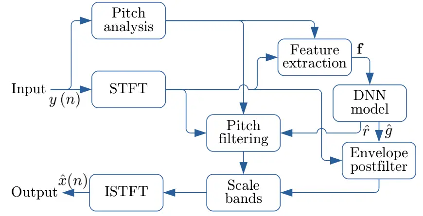

# To Dereverb Or Not to Dereverb? Perceptual Studies On Real-Time Dereverberation Targets

Jean-Marc Valin    Ritwik Giri    Shrikant Venkataramani    Umut Isik   
Arvindh Krishnaswamy

###### Abstract

In real life, room effect, also known as room reverberation, and the
present background noise degrade the quality of speech. Recently, deep
learning-based speech enhancement approaches have shown a lot of promise
and surpassed traditional denoising and dereverberation methods. It is
also well established that these state-of-the-art denoising algorithms
significantly improve the quality of speech as perceived by human
listeners. But the role of dereverberation on subjective (perceived)
speech quality, and whether the additional artifacts introduced by
dereverberation cause more harm than good are still unclear. In this
paper, we attempt to answer these questions by evaluating a state of the
art speech enhancement system in a comprehensive subjective evaluation
study for different choices of dereverberation targets.

###### Index Terms: 

Speech dereverberation, Speech denoising, Deep learning.

^(†)^(†)address: Amazon Web Services  
Palo Alto, CA, USA  
{jmvalin, ritwikg, shriven, umutisik, arvindhk}@amazon.com

## 1 Introduction

Real-time denoising and dereverberation networks have started to attract
a lot of attention from the speech and audio research community \[1, 2,
3, 4, 5\]. In the case of speech denoising algorithms, these approaches
have been demonstrated to significantly enhance the quality of the
speech signals for human listeners. However, there has been relatively
limited effort towards understanding the effects of room reverberation
on the performance of these models and the resulting speech quality. In
this work, we primarily focus on this aspect and analyze the effects of
dereverberation on subjective speech quality.

Reverberation is the effect of the acoustic channel introduced into the
speech signal as it travels from the source to the microphone or the
hearing system. In a video-call setting, reverberation manifests in the
form of reflections of the sound waves from the different surfaces of
the room. This effect can be modeled as a linear time-invariant (LTI)
system that is characterized by its impulse response (a.k.a, the room
impulse response (RIR)). The initial samples of the RIR, known as early
reflections, capture the sparse reflections that arrive at the
microphone within approximately 20 ms of the direct sound. They are
followed by the more complex late reverberation, which decays
exponentially over hundreds of ms. It has been shown that late
reverberation is primarily responsible for severely degrading speech
quality and subsequently, speech intelligibility for human
listeners \[6\].

Several methods based on classical signal processing have been proposed
for speech dereverberation over the past decade \[7, 8, 9, 10\]. For
example, \[8\] is based on a two-stage approach, which cancels early
reflections with an inverse filter and reduces late reverberations using
spectral subtraction. Another line of work \[9, 10\] focuses on
long-term linear prediction and has proven useful for late reverberation
suppression. As is the case with speech denoising algorithms,
deep-learning based supervised techniques have outperformed these
classical approaches for speech dereverberation as well \[11, 12, 13\].
Mixtures containing speech and noise are convolved with synthesized RIRs
to generate reverberant input mixtures that are fed into the network.
The network is trained to produce the corresponding anechoic clean
target speech as its output. Often these models are trained to estimate
binary or ratio masks that can be superimposed on the Fourier
representation of the noisy reverberant mixture to extract the Fourier
representation of the anechoic target. Alternatively, in \[14, 3\], the
authors propose to perform dereverberation in the complex domain by
estimating a complex ideal ratio mask.

When dealing with such reverberant environments, many deep-learning
based dereverberation approaches attempt to perform a full
dereverberation of the speech signal and retain only the direct path
\[14, 15\]. Since the full dereverberation task is significantly more
difficult than denoising, these approaches often introduce undesired
artifacts, hence degrading the quality of speech. This issue was further
highlighted in the findings of the recently concluded Deep Noise
Suppression Challenge \[16\]. Some participants \[3, 2\] noted that
partial dereverberation (by setting suitable training target) improved
the speech quality in terms of Mean Opinion Score (MOS), especially for
highly reverberant cases. In other earlier works \[13, 12\], authors
have proposed only suppressing the late reverberations to avoid any
undesired artifacts.

In this paper, we address this issue in depth and analyze the effects of
dereverberation on perceived speech quality. To do so, we train
state-of-the-art dereverberation models with varying levels of
reverberation on the training targets, ranging from no-dereverberation
to full-dereverberation. We also experiment with different
dereverberation strategies for these training targets. These models are
compared on multiple tasks by performing a large-scale subjective
evaluation study to identify the best dereverb strategy for optimal
speech quality as perceived by human listeners. These listening tests
also provide interesting insights into the relationship between room
reverberation and the perceived naturalness of the speech signals. For
example, our results reveal that partial dereverberation using an
attenuated and decayed impulse response produces the highest MOS,
especially in reverberant environment. To the best of our knowledge, we
are not aware of any work that performs such a comparison of training
targets for the dereverberation task.

For our experiments, we use the recently proposed PercepNet architecture
for real-time low-complexity speech enhancement \[17\]. PercepNet is a
perceptually motivated model that uses the spectral envelopes and the
periodicity of the speech signals to perform state-of-the-art speech
enhancement. It also exploits the power of a neural network by
estimating the optimal gain function of a smoothed energy contour using
a recurrent neural network (RNN).

The rest of the article is organized as follows: In Section 2, we
briefly describe PercepNet and its components. In Section 3 we describe
the different training targets used in our study. Section 4 presents the
subjective evaluation results for different training targets, and
finally, Section 5 concludes the paper and talks about some future
research directions.

## 2 System Overview

Let $`x(n)`$ be a clean speech speech signal and $`y(n)`$ denote the
corresponding noisy signal captured by a hands-free microphone in a
noisy reverberant room. The noisy signal $`y(n)`$ can be expressed as

```math
y(n)=x(n)\star h(n)+\eta(n)\ . \tag{1}
```

Here, $`\eta(n)`$ denotes the additive background noise present in the
room, $`h(n)`$ represents the impulse response from the talker to the
microphone, and $`\star`$ denotes the convolution operator. The goal of
the speech enhancement model is to estimate a function that will take
some representation of the noisy signal $`y(n)`$ as its input and
estimate the cleaned up version of the signal, i.e. denoised and
dereverberated signal $`\hat{x}=f(y)`$ as its output.



Figure 1: Overview of the PercepNet algorithm.

In this work, we use the recently introduced real-time speech
enhancement approach named PercepNet \[17\] as our speech enhancement
model. We briefly describe the details of PercepNet in the following
section.

### 2.1 PercepNet: Background

The PercepNet algorithm operates on 10-ms frames with 30 ms of
look-ahead and enhances 48 kHz speech in real-time. Despite operating on
a much lower complexity than the maximum allowed by the recently
concluded first DNS challenge \[16\], PercepNet ranked second in the
real-time track. Fig. 1 presents an overview of the PercepNet algorithm.
The two key elements of the algorithm are: (i) an RNN model to estimate
band ratio masks, and (ii) a perceptually motivated pitch-filter.

Instead of operating on DFT bins (like most of the speech enhancement
methods), PercepNet operates on only 32 triangular spectral bands,
spaced according to the equivalent rectangular bandwidth (ERB) scale.
PercepNet uses an RNN to estimate a ratio mask in each of these bands.
This ratio mask can also be interpreted as the corresponding gain that
needs to be applied to the noisy signal to match the spectral envelope
of the clean target:

```math
g_{b}(l)=\frac{X_{b}(l)}{Y_{b}(l)}\ , \tag{2}
```

where, $`g_{b}(l)`$ denotes the optimal gain in band $`b`$ for frame
$`l`$. $`X_{b}(l)`$ denotes the the $`L_{2}`$ norm of the complex-valued
spectrum of clean signal $`x`$ for band $`b`$ in frame $`l`$, and
$`Y_{b}(l)`$ denotes the the $`L_{2}`$ norm of the complex-valued
spectrum of the noisy signal $`y`$ for band $`b`$ in frame $`l`$.

To reconstruct the harmonic properties of the clean speech from the
spectral envelopes, PercepNet also employs a comb filter controled by
the pitch frequency. The use of such a time-domain comb filter allows us
to achieve much finer frequency resolution than would otherwise be
possible with the STFT (50 Hz using 20-ms frames). The comb filter’s
effect is independently controled in each band using pitch filtering
strength parameters. Details of the comb filter can be found in \[17\].

## 3 Training Targets

One important question when attempting to dereverberate speech is what
we would like the dereverberated speech to sound like. Let
$`h_{0}\left(t\right)`$ be the impulse response used to generate the
input reverberant speech $`y\left(n\right)`$ during training and
$`h_{1}\left(t\right)`$ be the impulse response used to generate the
target speech $`x\left(n\right)`$. Setting
$`h_{1}\left(t\right)=h_{0}\left(t\right)`$ would lead to no
dereverberation. On the opposite end, setting
$`h_{1}\left(t\right)=\delta\left(t\right)`$, where
$`\delta\left(t\right)`$ is the Dirac function, would lead to complete
dereverberation. This is not an ideal scenario for the following
reasons:

- •
  Anechoic speech sounds highly unnatural;
- •
  Early reflections are much harder to remove, but have a lesser impact
  on quality than late reverberation;
- •
  The difficulty of solving the problem leads to excessive artifacts in
  the enhanced speech.

One possibility as proposed in \[13\] is to keep the early reflections
and discard all late reverberation. In this work, we consider ways of
modifying the impulse response $`h_{0}\left(t\right)`$ to make the task
as easy as possible for the DNN, while also reducing the perceptual
impact of reverberation. Our goal is to shape $`h_{0}\left(t\right)`$ in
the minimal way that leads to a target $`h_{1}\left(t\right)`$ that has
low perceived reverberation.

Considering $`T_{0}=20\,\mathrm{ms}`$ as the boundary between early
reflections and late reverberation, we first consider the decay function

```math
D\left(t\right)=\left\{\begin{array}[]{ll}1\ ,&t<T_{0}\\
10^{-3\left(t-T_{0}\right)/R_{D}}\ ,&t>T_{0}\end{array}\right.\ , \tag{3}
```

where $`R_{D}`$ is the time it takes the function to decay by 60 dB.

Let $`R_{0}`$ be the reverberation time ($`\mathrm{RT_{60\,dB}}`$) of
the room modeled by $`h_{0}\left(t\right)`$. Using the target
$`h_{1}\left(t\right)=D\left(t\right)h_{0}\left(t\right)`$ is then
equivalent to shrinking the room such that the reverbation time
$`R_{1}`$ of the target room satisfies

```math
R_{1}^{-1}=R_{0}^{-1}+R_{D}^{-1}\ . \tag{4}
```

For a highly-reverberant room, the target reverberation time will thus
never exceed $`R_{D}`$. For small rooms, $`D\left(t\right)`$ will also
have a smaller impact than for large rooms, which is a desired property.

In addition to shrinking the target room with the exponential decay
function $`D\left(t\right)`$, we can _move_ the target microphone closer
to the speaker by attenuating the late reverberation part of
$`h_{0}\left(t\right)`$ by a factor $`\alpha`$. This can be done
smoothly between time $`T_{0}`$ and $`T_{1}=30\,\mathrm{ms}`$ using the
attenuation function

```math
A\left(t\right)=\left\{\begin{array}[]{ll}1,&t<T_{0}\\
\frac{1+\alpha}{2}+\frac{1-\alpha}{2}\cdot\cos\frac{\pi\left(t-T_{0}\right)}{T_{1}-T_{0}},&T_{0}<t<T_{1}\\
\alpha,&t>T_{1}\end{array}\right.\ . \tag{5}
```

Under the free-field assumption, the sound intensity of the direct path
decays as $`1/d^{2}`$, so multiplying $`h_{0}\left(t\right)`$ by
$`A\left(t\right)`$ is equivalent to having the target distance
$`d_{1}=\alpha\cdot d_{0}`$. In practice, considering the early
reflections, the intensity tends to decay more slowly, so the effect on
the target distance is greater.

Figure 2: RIR shaping functions.

The effect of the shaping functions described above is shown in Fig. 2.
We introduce and study four different training targets for
dereverberation. The choice of the training target determines the ground
truth gains $`g_{b}(l)`$, shown in Equation (2), which are used to train
the DNN model.

### 3.1 Full Dereverberation

In a first experiment, we aim to remove all late reverberation, and only
keep the direct path and early reflections in the estimated output. This
is done by using

```math
h_{1}(t)=A(t)h_{0}(t)\ , \tag{6}
```

with $`\alpha=0`$. We have two conditions for this experiment:
$`T_{0}=20\ \mathrm{ms},\ T_{1}=10\ \mathrm{ms}`$, as well as
$`T_{0}=10\ \mathrm{ms},\ T_{1}=5\ \mathrm{ms}`$.

### 3.2 Decayed Dereverberation

For the full dereverberation model, the lack of any reverberation can
make the enhanced signal sound overly dry and unnatural. To address this
issue, we use the decay

```math
h_{1}(t)=D(t)h_{0}(t)\ , \tag{7}
```

with $`R_{D}=200\ \mathrm{ms}`$. This shrinks the target room to a
maximum of 200 ms reverberation time.

### 3.3 Attenuated and Decayed Dereverberation

While the partial dereverberation approach addresses the excessive
dryness of the target, it may leave too-much reverberation in the
output. Hence, in this case, we use the late reflection attenuation to
bring the target microphone closer to the speaker using

```math
h_{1}(t)=A(t)D(t)h_{0}(t)\ , \tag{8}
```

with $`\alpha=0.4`$ (-8 dB) and $`R_{D}=200\ \mathrm{ms}`$. For a
speaker standing 2 m from the microphone, the target reverberation will
sound as if the microphone were at most 0.8 m away (likely less in
practice).

### 3.4 No Dereverberation

The ”no dereverberation” case corresponds to $`h_{1}(t)=h_{0}(t)`$, so
the target is a clean reverberant signal without any background noise.

Figure 3: RIR for clean speech label for three different training
targets.

In Fig. 3, we present the late reflections component of the target
label’s RIR for three different training targets. Note that we did not
include the early reflections component, i.e., the first 20 ms of RIR
since that is unchanged for all 4 cases.

|                               | Singing | Tonal | Non-english | English | Emotional | Overall |
| ----------------------------- | ------- | ----- | ----------- | ------- | --------- | ------- |
| Noisy                         | 2.96    | 3.00  | 2.96        | 2.80    | 2.67      | 2.86    |
| DNS Challenge Baseline \[18\] | 3.10    | 3.25  | 3.28        | 3.30    | 2.88      | 3.21    |
| Attenuated+decayed dereverb   | 3.16    | 3.40  | 3.42        | 3.47    | 2.90      | 3.34    |

Table 1: P.808 MOS results on DNS ICASSP 2021 blind test set. The 95%
confidence interval is 0.03.

| Algorithm                     | MOS (P.808) |
| ----------------------------- | ----------- |
| Noisy input                   | 2.95        |
| DNS Challenge Baseline \[18\] | 3.21        |
| No dereverb                   | 3.31        |
| Full dereverb (20 ms)         | 3.35        |
| Full dereverb (10 ms)         | 3.33        |
| Decayed dereverb              | 3.36        |
| Attenuated+decayed dereverb   | 3.36        |

Table 2: P.808 MOS results of different algorithms on the DNS
INTERSPEECH 2020 Challenge synthetic development set (450 samples) and
the DNS ICASSP 2021 blind test set (700 samples). The 95% confidence
interval is 0.04.

| Algorithm                   | MOS (P.808) |
| --------------------------- | ----------- |
| No dereverb                 | 3.05        |
| Full dereverb (20 ms)       | 3.38        |
| Full dereverb (10 ms)       | 3.37        |
| Decayed dereverb            | 3.37        |
| Attenuated+decayed dereverb | 3.39        |

Table 3: P.808 MOS results of different reverberation targets
reverberant samples. The 95% confidence interval is 0.04.

## 4 Experiments And Results

We train on approximately 120 hours of clean speech recordings
comprising over 200 speakers in more than 20 different languages. We
also include the emotional speech training examples provided by DNS
challenge organizers and the vocal tracks from ccMixter dataset \[19\]
to our clean speech data. For the noise examples, we use a dataset that
consists 80 hours of ambient noise recordings of various types. The
speech and noise examples were sampled at 48 kHz. To simulate the effect
of a reverberant environment, we use both real-recorded and synthetic
room impulse responses (RIRs). We generate mixtures of clean reverberant
speech convolved with an RIR and noise such that the SNRs range from
-5 dB to 45 dB. We also randomly introduce a few noise-free examples
during training.

Even though multiple objective metrics exist to measure the quality of
speech, it has been shown in \[20\] that these objective metrics are not
very reliable, and they correlate poorly with subjective MOS. Hence, in
this work, we compare different training targets using a large scale MOS
study. We use the methodology of ITU-T P.808 Subjective Evaluation of
Speech Quality with a crowdsourcing approach \[21\].

To demonstrate the effect of different dereverb training targets, we use
the synthetic development eval set provided during the INTERSPEECH 2020
DNS Challenge \[16\]. Specifically, we evaluate our models on three
different subsets:

1.  1.  Synthetic recordings of speech in background noise without room
        reverberation
2.  2.  Synthetic speech recordings in a reverberant environment without any
        ambient noise, and
3.  3.  Synthetic reverberant recordings in the presence of ambient noise.

Each of the subsets comprises 150 utterances. The MOS scores are
aggregated based on ten listening tests for each model output
corresponding to each of these $`150\times 3=450`$ synthetic inputs. We
also additionally evaluate different training targets on the ICASSP 2021
DNS Challenge blind test set comprising 700 utterances. We wish to
specifically emphasize that the evaluation of the models on the ICASSP
2021 DNS blind test set was performed after we submitted our processed
outputs to the challenge. The model that was submitted to the challenge
operates in real-time using only $`4.5\%`$ of an i7-8565U core at
1.80GHz.

Table 1 shows the subjective MOS results measured by the ICASSP 2021 DNS
challenge organizers over their blind test set (700 samples). Based on
internal testing (without looking at the blind test set), we chose to
submit the ”Attenuated+decayed dereverb”. The results clearly show that
the proposed approach outperforms the challenge baseline in all
categories.

Table 2 includes results on the previous INTERSPEECH 2020 challenge
development set for the different training targets. These samples
include both reverberant and non-reverberant samples. All tested targets
significantly exceed the quality of both the NSnet2 baseline and the
noisy speech. Although the proposed partial dereverberation target
produced the highest score, the difference between the evaluated targets
are not statistically significant ($`p>0.05`$). This is in part due to
the fact that many of the samples have little reverberation.

For that reason, we conducted an additional listening test comparing the
five dereverberation targets on 600 reverberant samples. These include
300 synthetic reverberant samples from the INTERSPEECH 2020 DNS
Challenge \[16\], as well as 300 randomly-selected reverberant samples
from the multi-channel Wall Street Journal Audio-Visual (MC-WSJ-AV)
database. The results of the second test in Table 3 shows that
dereverberation significantly improves the quality of reverberant speech
for all targets tested. The second experiment again shows the
”Attenuated+decayed dereverb” target is producing the best results.
Although these results are again not statistically significant, they
still provide an indication that it is a promising option.

## 5 Conclusion

For supervised speech enhancement, the choice of an appropriate training
target is critical. In this paper, we present and compare different
training targets for supervised dereverberation, and perform a large
scale subjective evaluation of our choices. Our results indicate that
training with a decayed and attenuated dereverberation target produces
the highest quality, but more experiments would be needed to confirm
that.

## References

- \[1\] Y. Xu, J. Du, L.-R. Dai, and C.-H. Lee, “A regression approach
  to speech enhancement based on deep neural networks,” IEEE/ACM
  Transactions on Audio, Speech, and Language Processing, vol. 23, no.
  1, pp. 7–19, 2014.
- \[2\] A. Defossez, G. Synnaeve, and Y. Adi, “Real time speech
  enhancement in the waveform domain,” arXiv preprint
  arXiv:2006.12847, 2020.
- \[3\] U. Isik, R. Giri, N. Phansalkar, J.-M. Valin, K. Helwani, and
  A. Krishnaswamy, “Poconet: Better speech enhancement with
  frequency-positional embeddings, semi-supervised conversational data,
  and biased loss,” arXiv preprint arXiv:2008.04470, 2020.
- \[4\] D. Wang and J. Chen, “Supervised speech separation based on deep
  learning: An overview,” IEEE/ACM Transactions on Audio, Speech, and
  Language Processing, vol. 26, no. 10, pp. 1702–1726, 2018.
- \[5\] R. Giri, U. Isik, and A. Krishnaswamy, “Attention wave-u-net for
  speech enhancement,” in Proc. IEEE Workshop on Applications of Signal
  Processing to Audio and Acoustics (WASPAA). IEEE, 2019, pp. 249–253.
- \[6\] K.S. Helfer and L.A. Wilber, “Hearing loss, aging, and speech
  perception in reverberation and noise,” Journal of Speech, Language,
  and Hearing Research, vol. 33, no. 1, pp. 149–155, 1990.
- \[7\] K. Lebart, J.-M. Boucher, and P.N. Denbigh, “A new method based
  on spectral subtraction for speech dereverberation,” Acta Acustica
  united with Acustica, vol. 87, no. 3, pp. 359–366, 2001.
- \[8\] M. Wu and D. Wang, “A two-stage algorithm for one-microphone
  reverberant speech enhancement,” IEEE Transactions on Audio, Speech,
  and Language Processing, vol. 14, no. 3, pp. 774–784, 2006.
- \[9\] T. Nakatani, T. Yoshioka, K. Kinoshita, M. Miyoshi, and B.-H.
  Juang, “Speech dereverberation based on variance-normalized delayed
  linear prediction,” IEEE Transactions on Audio, Speech, and Language
  Processing, vol. 18, no. 7, pp. 1717–1731, 2010.
- \[10\] T. Yoshioka and T. Nakatani, “Generalization of multi-channel
  linear prediction methods for blind MIMO impulse response shortening,”
  IEEE Transactions on Audio, Speech, and Language Processing, vol. 20,
  no. 10, pp. 2707–2720, 2012.
- \[11\] K. Han, Y. Wang, D. Wang, W. S. Woods, I. Merks, and T. Zhang,
  “Learning spectral mapping for speech dereverberation and denoising,”
  IEEE/ACM Transactions on Audio, Speech, and Language Processing, vol.
  23, no. 6, pp. 982–992, 2015.
- \[12\] I. Kodrasi and H. Bourlard, “Single-channel late reverberation
  power spectral density estimation using denoising autoencoders.,” in
  Proc. INTERSPEECH, 2018, pp. 1319–1323.
- \[13\] Y. Zhao, D. Wang, B. Xu, and T. Zhang, “Late reverberation
  suppression using recurrent neural networks with long short-term
  memory,” in Proc. International Conference on Acoustics, Speech and
  Signal Processing (ICASSP). IEEE, 2018, pp. 5434–5438.
- \[14\] D. S. Williamson and D. Wang, “Time-frequency masking in the
  complex domain for speech dereverberation and denoising,” IEEE/ACM
  transactions on audio, speech, and language processing, vol. 25, no.
  7, pp. 1492–1501, 2017.
- \[15\] Ori Ernst, Shlomo E Chazan, Sharon Gannot, and Jacob
  Goldberger, “Speech dereverberation using fully convolutional
  networks,” in 2018 26th European Signal Processing Conference
  (EUSIPCO). IEEE, 2018, pp. 390–394.
- \[16\] C.K.A. Reddy, E. Beyrami, H. Dubey, V. Gopal, R. Cheng,
  R. Cutler, S. Matusevych, R. Aichner, A. Aazami, S. Braun, et al.,
  “The interspeech 2020 deep noise suppression challenge: Datasets,
  subjective speech quality and testing framework,” arXiv preprint
  arXiv:2001.08662, 2020.
- \[17\] J.-M. Valin, U. Isik, N. Phansalkar, R. Giri, K. Helwani, and
  A. Krishnaswamy, “A perceptually-motivated approach for
  low-complexity, real-time enhancement of fullband speech,” arXiv
  preprint arXiv:2008.04259, 2020.
- \[18\] S. Braun and I. Tashev, “Data augmentation and loss
  normalization for deep noise suppression,” in Proc. International
  Conference on Speech and Computer. Springer, 2020, pp. 79–86.
- \[19\] A. Liutkus, D. Fitzgerald, Z. Rafii, B. Pardo, and L. Daudet,
  “Kernel additive models for source separation,” IEEE Transactions on
  Signal Processing, vol. 62, no. 16, pp. 4298–4310, 2014.
- \[20\] C.K.A. Reddy, E. Beyrami, J. Pool, R. Cutler, S. Srinivasan,
  and J. Gehrke, “A scalable noisy speech dataset and online subjective
  test framework,” arXiv preprint arXiv:1909.08050, 2019.
- \[21\] ITU-T, Recommendation P.808: Subjective evaluation of speech
  quality with a crowdsourcing approach, 2018.
