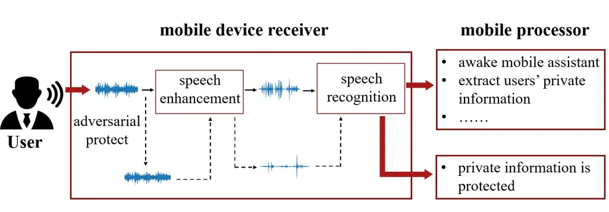
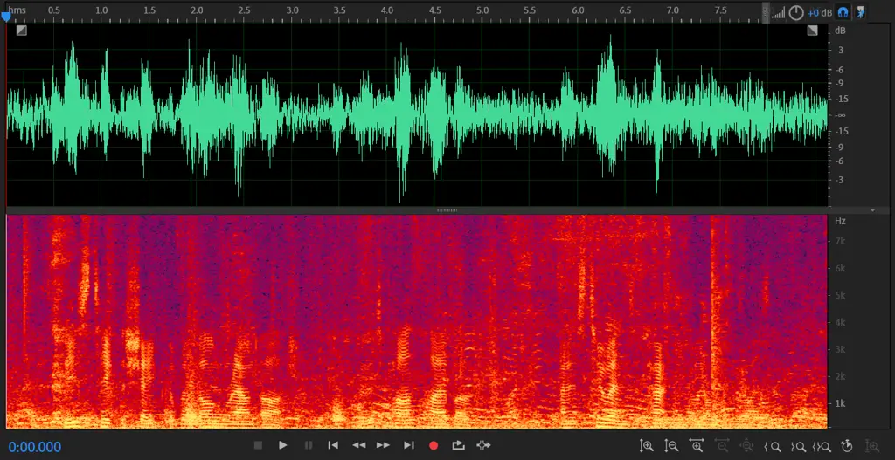
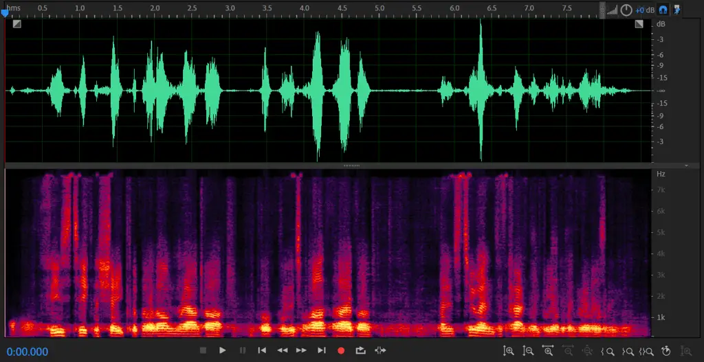
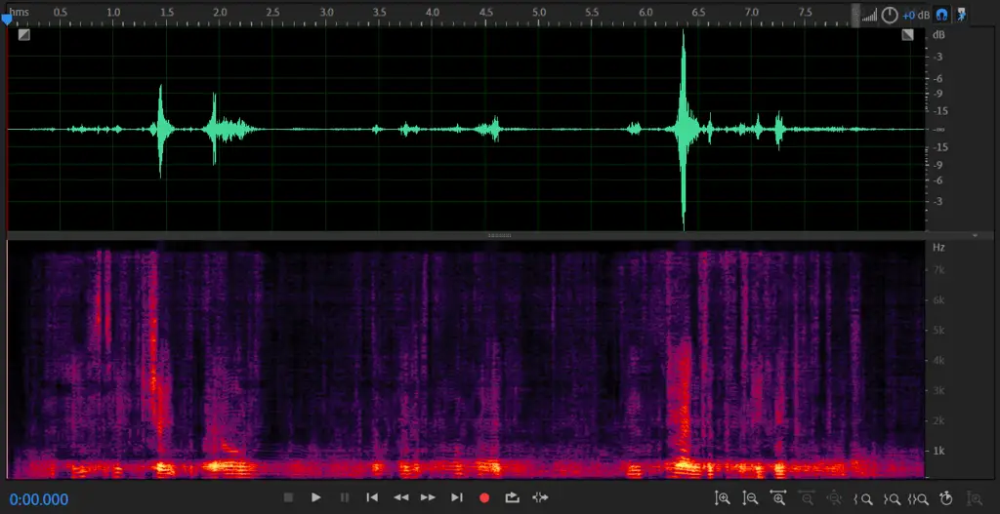
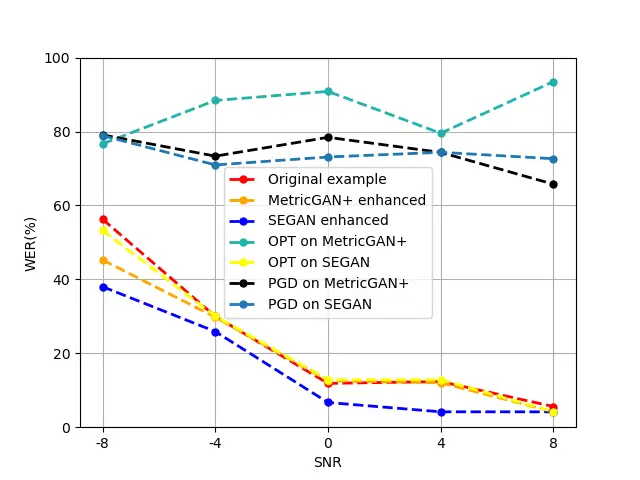
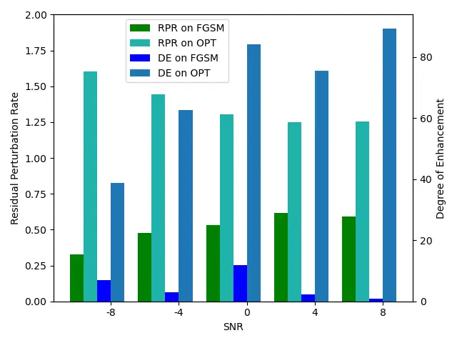

# Adversarial Privacy Protection on Speech Enhancement

Mingyu Dong    Diqun Yan    Rangding Wang

###### Abstract

Speech is easily leaked imperceptibly, such as being recorded by mobile
phones in different situations. Private content in speech may be
maliciously extracted through speech enhancement technology. Speech
enhancement technology has developed rapidly along with deep neural
networks (DNNs), but adversarial examples can cause DNNs to fail. In
this work, we propose an adversarial method to degrade speech
enhancement systems. Experimental results show that generated
adversarial examples can erase most content information in original
examples or replace it with target speech content through speech
enhancement. The word error rate ($`WER`$) between an enhanced original
example and enhanced adversarial example recognition result can reach
89.0%. $`WER`$ of target attack between enhanced adversarial example and
target example is low to 33.75% . Adversarial perturbation can bring the
rate of change to the original example to more than 1.4430. This work
can prevent the malicious extraction of speech. Code is available in
[Github](https://github.com/DanMerry/Advsarial_SE)

^(†)^(†)address: College of Information Science and Engineering, Ningbo
University ^(†)^(†)email: 1253173217@qq.com, yandiqun@nbu.edu.cn,
wangrangding@nbu.edu.cn

Index Terms: adversarial example, speech enhancement, privacy
protection, deep neural network

## 1 Introduction

Private content information is easily extracted from leaked speech,
which may be recorded by some mobile phone applications. The extraction
process depends on many speech analysis tasks. Speech enhancement is a
common technology used in many tasks, such as speech recognition \[1\]
and voice conversion \[2\]. For example, the enhanced noisy speech can
improve the performence of a speech recognition system \[3\]. Speech
enhancement models have developed rapidly along with deep neural
networks (DNNs). The adversarial example is the deadly weakness of DNN
models which is a technology that can cause a DNN model to output a
wrong result, and the generated adversarial example is imperceptible to
humans. In this work we proposed an adversarial attack method to prevent
our leaked speech from maliciously extracting.

The application scenario of the adversarial example on speech
enhancement can be described as follows. Our speech may be monitored if
we carry with mobile device, and maliciously recorded speech will be
sent to extract useful content information. The usual method for
protecting leaked speech is to add specific adversarial perturbation
which can cause speech recognition systems misrecognize\[4\]. However,
the speech may be enhanced before recognition, and the speech
enhancement systems will erase the useful adversarial perturbation. To
solve this problem, we propose an adversarial example to attack speech
enhancement models directly, which causes the enhanced example to be
recognized as a target phase or as meaningless words. As shown in Figure
1, the recorded speech through the adversarial protect method will be
denoised to one useless speech which is hard to extract some useful
private content information. And in mobile processor, the exreacted
useless content information will be discarded. In this way, the privacy
in speech is protected.



Figure 1: The process of privacy protect in mobile phone terminate

Some classical methods of adversarial examples have developed since
being proposed in 2013 \[5\]. Adversarial examples have always worked on
the image domain in recent research, with the image classification task
as the target model. As attention became more focused on the audio
domain, research on audio adversarial examples grew. Kos \[6\] proposed
adversarial example to attack the image reconstruction model, which is
the first work related to the deep generation model. In the audio
domain, Takahashi proposed an adversarial example to attack an audio
source separation model that can help protect songs’ copyrights from the
abuse of separated signals \[7\]. Chien-yu Huang proposed work of
attacks on voice conversion systems \[8\], which can protect a speaker’s
private information.

However, adversarial examples have some deficiencies: (a) The choice of
target models is limited, and research on the classification task
accounts for majority. Thus, research on the generation task still needs
to be done; and (b) the application scenario of adversarial example is
restricted, and is mainly used to enhance the model’s robustness. The
various usages in adversarial examples should be expanded, such as to
protect privacy.

The contributions of this paper are as follows:

- •
  We believe this is the first adversarial example work on the speech
  enhancement systems. We combine practical scenes to generate
  adversarial examples with different $`SNRs`$, and propose new
  evaluation metrics;
- •
  We analyze the transferability between speech enhancement models,
  using different targets to make the enhanced adversarial example show
  different effects;
- •
  From the application scene, the adversarial example in our work is
  expanded to protect the privacy of leaked speech.

The rest of this paper is organized as follows. Section II introduces
some work related to the proposed method, which is described in section
III. Section IV discusses experiments. Section V provides our
conclusions.

## 2 Related work

### 2.1 Gradient-based adversarial method

The gradient-based method is efficient, and it provides the primary idea
for the adversarial example. The classical fast gradient sign method
(FGSM) \[9\] is a shortcut algorithm that simply adds a signed gradient
to the original example:

```math
x^{*}=x+\epsilon*sign(\nabla_{x}\mathcal{L}(f(x),t_{adv})), \tag{1}
```

where $`\epsilon`$ controls the steps of perturbation, and
$`\mathcal{L}(\cdot)`$ is the loss between the predicted result and the
target $`t_{adv}`$. It is a one-step, white-box method that can be
quickly applied in most open-source models.

Projected gradient descent (PGD) \[10\] is an iterative method to
generate a more effective adversarial example based on FGSM. Compared to
the one-step attack, the generated perturbation by PGD is smaller in
every step, in which the value of the perturbation will be small and
limited to a specific range:

```math
x_{t+1}^{*}=\prod_{x+s}(x_{t}^{*}+\epsilon*sign(\nabla_{x}\mathcal{L}(f(x_{t}),t_{adv}))), \tag{2}
```

where $`s`$ is the range of adversarial perturbation. PGD has the
advantage that the generated adversarial examples have a higher attack
success rate, but the adversarial perturbation in many steps will be
magnified, so the attacked example will be greatly changed.

### 2.2 Optimization-based adversarial method

The Carlini and Weanger (C&W) method \[11\] is a classical
optimization-based method, whose core concept is to optimize an example
through the loss function to measure the perceptibility of the
adversarial example and the output results. The structure and parameters
of the target model are not a necessary condition. If we set the
original example as the optimization target, the gradient in model is
not needed and it can be seen as a black-box method. Its advantage is
that the generated adversarial example is much more imperceptible, but
the optimization process requires time.

### 2.3 Speech enhancement system

Speech enhancement systems are the target of adversarial examples, which
can tranform noisy speech to clear speech. Recently, DNN-based speech
enhancement technology has developed quickly. So, we choose the advanced
MetricGAN+ \[12\] and classical SEGAN \[13\] as our attack targets.
MetricGAN+ is based on MetricGAN\[14\], and its perceptual evaluation of
speech quality (PESQ) can reach 3.15, which is a state-of-the-art
result. SEGAN¹¹ 1 $`https://github.com/santi-pdp/segan\_pytorch`$
applies U-Net in speech enhancement, and its PESQ can reach 2.16.

## 3 proposed methods

In this section, we expand the adversarial attack method from
classification task to generation task. To choose an appropriate target
is an important part in generating an adversarial example, as different
targets can exhibit different effects. A target can be a silent audio
clip or random noise. Targets have different aims. Experimental results
show that setting a silent clip as a target can cause the predicted
results to lack content information, and to set random noise as a target
can cause the predicted results to sound chaotic. To highlight the
effect of an adversarial attack, we choose a silent audio clip as a
target in the following experiments. In speech enhancement models, the
enhancement process can be described as

```math
y_{en}=g(x_{noisy}), \tag{3}
```

where $`g()`$ is the speech enhancement process that can transform noisy
speech to clear speech, $`x_{noisy}`$ is a noisy example, and $`y_{en}`$
is an enhanced example.

There is the issue of how to make gradient-based methods work on a
speech enhancement model. Our adversarial methods are based on the above
gradient-based methods of FGSM and PGD. Most existing methods are
designed to attack the classification task, hence the cross-entropy loss
function in the original methods is not suitable for the generation
task. We use the mean squared error (MSE) and norm as our loss function.
The loss between the predicted and target results in the one-step FGSM
and iterative PGD are replaced by the MSE. The usage of the MSE loss
function in FGSM and PGD can be described as follows:

```math
x^{*}=x+\epsilon*sign(\nabla_{x}MSE(g(x),t_{adv})), \tag{4}
```

```math
x_{t+1}^{*}=\prod_{x+s}(x_{t}^{*}+\epsilon*sign(\nabla_{x}MSE(g(x_{t}),t_{adv}))), \tag{5}
```

Finally, there is the issue of how to make an optimization-based (OPT)
method work on a speech enhancement model. We set the original example
as our optimization target. The loss function includes the distance
between the original and adversarial example and distance between the
predicted result and the target. The proposed method can be described by
Algorithm 1.

Original example $`x_{noisy}`$, target $`t_{adv}`$, iterations $`itr`$

Targeted adversarial example $`x^{*}_{noisy}`$

$`x^{*}_{noisy}`$ $`\leftarrow`$ $`x_{noisy}`$

for $`itr`$ step do

  $`\mathscr{L}_{1}`$ $`\leftarrow`$ $`MSE(x^{*}_{noisy},x_{noisy})`$

  $`\mathscr{L}_{2}`$ $`\leftarrow`$
$`\left\|g(x^{*}_{noisy})-t_{adv}\right\|_{2}`$

  $`\mathscr{L}_{3}`$ $`\leftarrow`$ $`\mathscr{L}_{1}`$ + $`\alpha`$ \*
$`\mathscr{L}_{2}`$

  Update $`x^{*}_{noisy}`$ by Adam optimization

end for

return $`x^{*}_{noisy}`$

Algorithm 1 Optimization-based method

## 4 Experiments

### 4.1 Experimental setup

Voicebank \[15\] and Demand \[16\] are chosen as the datasets of clean
speech and background noise, respectively. Voicebank contains more than
500 hours of recordings from about 500 healthy speakers, and Demand
contains 6 indoor noise audios and 12 outdoor noise audios. We used the
open-source pretrained model in SpeechBrain \[17\] as the speech
recognition system. We provide the experimental results for different
$`SNR`$ values which include -8, -4, 0, 4 and 8 on five different noisy
scenes which include busy subway station, public town square, public
transit bus, private passenger vehicle and subway. The smaller the
$`SNR`$, the noisier the speech. In OPT method, we set $`\alpha`$ as
0.0001 which make two loss fuctions in the same weight.

| Item                    | Recognition results                                                        |
| ----------------------- | -------------------------------------------------------------------------- |
| original ground-truth   | he claimed his insurance company contested the damages not the restaurant  |
| target ground-truth     | we have to look at everything before we make any final decision            |
| original enhanced reco. | he claimed his insurance company and tested the damages not the restaurant |
| target enhanced reco.   | we have to look at everything before we make any final decision            |
| adv. enhanced reco.     | we have to look at everything before we make any final decision            |

Table 1: Recognition results of target attack

### 4.2 Evaluation metrics

The attack effects of adversarial examples on speech enhancement systems
are measured differently from those in classification tasks. Two factors
are considered: (a) How much does the adversarial perturbation affect
speech enhancement? (b) How bad does the enhanced adversarial speech
sound? We use the degree of enhancement $`DE`$ and residual perturbation
rate $`RPR`$ to measure the effect of adversarial examples. We define
$`x`$, $`y`$, $`x^{*}_{en}`$, and $`y^{*}_{en}`$ as the input speech,
enhanced original speech, adversarial example, and enhanced adversarial
example, and

```math
RPR=\frac{\ln\left\|y^{*}_{en}-y_{en}\right\|_{2}}{\ln\left\|x^{*}_{noisy}-x_{noisy}\right\|_{2}}, \tag{6}
```

```math
DE=F(y^{*}_{en},gt)-F(y_{en},gt), \tag{7}
```

where $`F(x)`$ is the word error rate (WER) of speech recognition, and
$`gt`$ is the ground-truth sentence. $`DE`$ measures how much the
enhanced adversarial example has changed from the original enhanced
example. If the adversarial example works, the recognition system will
not output a correct result, so there will be a difference between
$`F(y^{*}_{en},gt)`$ and $`F(y_{en},gt)`$. $`RPR`$ indicates how much
the adversarial example affects the enhancement system. In $`RPR`$, the
perturbation is the denominator, and the difference between enhanced
original example and enhanced adversarial example is the numerator. So,
if $`RPR`$ is greater than one, then the higher the $`RPR`$, the better
the degradation effect on the speech enhancement system, meaning that
the method works.

### 4.3 Results



(a) original exmaple


(b) adversarial example



(c) enhanced original example



(d) enhanced adversarial example

Figure 2: Effect of adversarial attack works on speech enhancement model

The effect of the adversarial protection can be seen in Figure .2. The
generated adversarial exampel is almost imperceptible, but it brings
much more changes than perturbation. Much content information in the
enhanced adversarial example is erased.

#### 4.3.1 Privacy protection effect

Figure 3 shows the privacy protection effect on speech enhancement
processing. In Figure 3, $`WER`$ is the averaged value and the
adversarial examples are all enhanced. It can be concluded from the
figure that there is a difference between the original examples and
enhanced examples. $`WER`$ of speech decreases with the decrease of
$`SNR`$, so it is necessary to denoise the speech before recognition
processing.



Figure 3: WER results on different SNR examples

The performance of $`WER`$ on enhanced adversarial examples shows that
the proposed methods work, and no matter the value of $`SNR`$ is, the
$`WER`$ of enhanced adversarial examples maintains a stable level, which
means the adversarial examples totally invalidate the speech enhancement
system. Due to the SEGAN is a waveform to waveform system, the OPT on
the SEGAN converge loss quickly, which make the effect poor. In
practical scene, the maliciously recorded speech with some personal
content information preprocessed by the proposed method will fail to
extract the content information.

The performance at degrading on target model is shown in Figure 4. The
choice of the target model is MetricGAN+ in this experiment. The results
show that under different $`SNRs`$, the OPT method can produce more
degradation. Due to the iterative process, OPT can fine-tune a more
specific direction to get close to the target in every single step
through the loss function. However, FGSM is a one-step method, so the
adversarial perturbation may have a rough direction. We can see from
Figure 4 that $`RPR`$ on OPT is higher than FGSM, which means the OPT
method can generate a greater difference than FGSM. And as $`SNR`$
increases, $`RPR`$ increases. However, $`DE`$ decreases as $`RPR`$
increases. The original enhanced examples have a high $`WER`$, so the
difference between the $`WER`$ values becomes small.



Figure 4: Performance results of adversarial examples on proposed
evaluation metrics

#### 4.3.2 Target attack on speech enhancement

To issue an alarm when the behavior of malicious information extraction
occurs, the target attack on the speech enhancement system can replace
the speech content with a warning. The target attack on the speech
enhancemnet can achieve the effect of the replacement. In experiments,
we choose MetricGAN+ as our target model, with one attacked example and
one target example. The chosen attack method was OPT. The $`SNR`$ of the
original example was 0, and the speaker of the target example is
different from that of the original example. The aim of the target
attack is to make the enhanced example recognize the target’s content.

The experimental results of one example are shown in Table 1. We can
conclude from the given results that the target attack can completely
replace the victim’s speech content information. The adversarial
enhanced recognition (adv. enhanced reco.) is similar to the target
ground-truth. The average $`WER`$ of enhanced adversarial examples
recognition between ground-truth under 6 different $`SNR`$ can be low to
33.75%.

#### 4.3.3 Transferability between different speech enhancement models

Finally, we consider the transferability between different models. In
this scenario, the recorded speech is useful for one friendly
organization, in which the adversarial examples should not attack the
friendly speech enhancement model, while other models should be
successfully attacked by adversarial examples. Speech is leaked easily,
and stopping the behavior of malicious extracting from leaked speech is
unrealistic. Thus, how to protect the leaked personal information from
original source is executable. The transferability of adversarial
examples is a significant factor that must be considered. In this
experiment, we generate adversarial examples on source model and the PGD
is chosen as the attack method. The the generated adversarial examples
are tested in the target model.

| source     | target     | $`DE`$  | $`RPR`$ |
| ---------- | ---------- | ------- | ------- |
| MetricGAN+ | MetricGAN+ | 58.4087 | 1.2192  |
| MetricGAN+ | SEGAN      | 19.5005 | 0.8575  |
| SEGAN      | SEGAN      | 53.2389 | 1.0758  |
| SEGAN      | MetricGAN+ | 41.8050 | 1.3470  |

Table 2: Transferability results of adversarial examples between
different models

The results of transferability on adversarial examples can be seen in
Table 2. Judging from the $`RPR`$, the adversarial examples generated by
SEGAN can also produce damages to the MetricGAN+, but the $`DE`$ reduce
a little. And the adversarial examples generated by MetricGAN+ are
almost invalid to the SEGAN. Due to the SEGAN is a waveform to waveform
system, the perturbation is added to the wave directly, the
transferability of SEGAN is better than MetricGAN+. It can be concluded
that the transferability between different speech enhancement models is
weak. This means that an adversarial example can only attack one target
model, but will not fail other models. Weak transferability can be used
to protect our speech from being destroyed, friendly models are allowed
to extract the information in speech, and the target model cannot use
this speech.

## 5 Conclusion

In this paper, we proposed an adversarial attck method that works on a
speech enhancement system to prevent the malicious extraction of leaked
speech without destroying the original examples. Through the speech
enhancemnet process , one adversarial example can be enhanced as one
silent clip in which the private information is erased rather than one
clean speech. Experimental results showed that the adversarial examples
can result in $`WER`$ values greater than 89%, and the adversarial
perturbation is minute. The target attack can make one enhanced
adversarial example recognize as one target phase, the average $`WER`$
can be low to 33.75%. We also considered the transferability between
different speech enhancement models. This work expand the usage of
adversarial example to protect privacy.

In the future work, we intend to improve the transferability to more
models. The mainstream speech enhancemnet models are unknown to us, the
adversarial examples should attack the applied wildly models
successfully which is a totall black-box situation. To accomplish the
requirements of transferability, we design to set only one protected
speech enhancement model and several victim models.

## 6 Acknowledgements

This work was supported by the National Natural Science Foundation of
China (Grant No. 61300055), Zhejiang Natural Science Foundation (Grant
No. LY20F020010), Ningbo Natural Science Foundation (Grant No.
202003N4089).

## References

- \[1\] A. B. Nassif, I. Shahin, I. Attili, M. Azzeh, and K. Shaalan,
  “Speech recognition using deep neural networks: A systematic review,”
  _IEEE access_, vol. 7, pp. 19 143–19 165, 2019.
- \[2\] Y. Jia, Y. Zhang, R. J. Weiss, Q. Wang, J. Shen, F. Ren,
  Z. Chen, P. Nguyen, R. Pang, I. L. Moreno _et al._, “Transfer learning
  from speaker verification to multispeaker text-to-speech synthesis,”
  _arXiv preprint arXiv:1806.04558_, 2018.
- \[3\] F. Weninger, H. Erdogan, S. Watanabe, E. Vincent, J. Le Roux,
  J. R. Hershey, and B. Schuller, “Speech enhancement with lstm
  recurrent neural networks and its application to noise-robust asr,” in
  _International conference on latent variable analysis and signal
  separation_. Springer, 2015, pp. 91–99.
- \[4\] Y. Qin, N. Carlini, G. Cottrell, I. Goodfellow, and C. Raffel,
  “Imperceptible, robust, and targeted adversarial examples for
  automatic speech recognition,” in _Proceedings of the 36th
  International Conference on Machine Learning_, ser. Proceedings of
  Machine Learning Research, K. Chaudhuri and R. Salakhutdinov, Eds.,
  vol. 97. PMLR, 09–15 Jun 2019, pp. 5231–5240. \[Online\]. Available:
  [https://proceedings.mlr.press/v97/qin19a.html](https://proceedings.mlr.press/v97/qin19a.html)
- \[5\] C. Szegedy, W. Zaremba, I. Sutskever, J. Bruna, D. Erhan,
  I. Goodfellow, and R. Fergus, “Intriguing properties of neural
  networks,” _arXiv preprint arXiv:1312.6199_, 2013.
- \[6\] J. Kos, I. Fischer, and D. Song, “Adversarial examples for
  generative models,” in _2018 ieee security and privacy workshops
  (spw)_. IEEE, 2018, pp. 36–42.
- \[7\] N. Takahashi, S. Inoue, and Y. Mitsufuji, “Adversarial attacks
  on audio source separation,” in _ICASSP 2021 - 2021 IEEE International
  Conference on Acoustics, Speech and Signal Processing (ICASSP)_, 2021,
  pp. 521–525.
- \[8\] C.-y. Huang, Y. Y. Lin, H.-y. Lee, and L.-s. Lee, “Defending
  your voice: Adversarial attack on voice conversion,” in _2021 IEEE
  Spoken Language Technology Workshop (SLT)_. IEEE, 2021, pp. 552–559.
- \[9\] I. J. Goodfellow, J. Shlens, and C. Szegedy, “Explaining and
  harnessing adversarial examples,” _arXiv preprint
  arXiv:1412.6572_, 2014.
- \[10\] A. Madry, A. Makelov, L. Schmidt, D. Tsipras, and A. Vladu,
  “Towards deep learning models resistant to adversarial attacks,”
  _arXiv preprint arXiv:1706.06083_, 2017.
- \[11\] N. Carlini and D. Wagner, “Towards evaluating the robustness of
  neural networks,” in _2017 ieee symposium on security and privacy
  (sp)_. IEEE, 2017, pp. 39–57.
- \[12\] S.-W. Fu, C. Yu, T.-A. Hsieh, P. Plantinga, M. Ravanelli,
  X. Lu, and Y. Tsao, “Metricgan+: An improved version of metricgan for
  speech enhancement,” _arXiv preprint arXiv:2104.03538_, 2021.
- \[13\] S. Pascual, A. Bonafonte, and J. Serra, “Segan: Speech
  enhancement generative adversarial network,” _arXiv preprint
  arXiv:1703.09452_, 2017.
- \[14\] S.-W. Fu, C.-F. Liao, Y. Tsao, and S.-D. Lin, “Metricgan:
  Generative adversarial networks based black-box metric scores
  optimization for speech enhancement,” in _International Conference on
  Machine Learning_. PMLR, 2019, pp. 2031–2041.
- \[15\] C. Veaux, J. Yamagishi, and S. King, “The voice bank corpus:
  Design, collection and data analysis of a large regional accent speech
  database,” in _2013 international conference oriental COCOSDA held
  jointly with 2013 conference on Asian spoken language research and
  evaluation (O-COCOSDA/CASLRE)_. IEEE, 2013, pp. 1–4.
- \[16\] J. Thiemann, N. Ito, and E. Vincent, “Demand: a collection of
  multi-channel recordings of acoustic noise in diverse environments,”
  in _Proc. Meetings Acoust_, 2013, pp. 1–6.
- \[17\] M. Ravanelli, T. Parcollet, P. Plantinga, A. Rouhe, S. Cornell,
  L. Lugosch, C. Subakan, N. Dawalatabad, A. Heba, J. Zhong _et al._,
  “Speechbrain: A general-purpose speech toolkit,” _arXiv preprint
  arXiv:2106.04624_, 2021.
